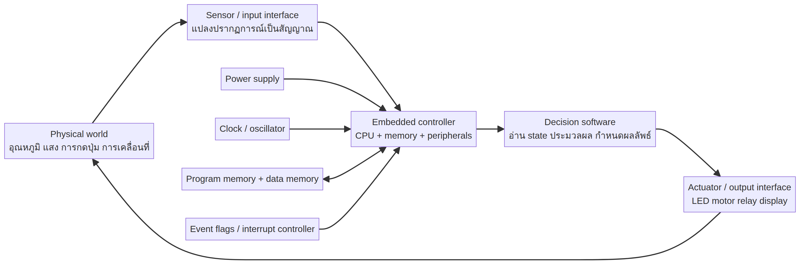

# Embedded Systems จากศูนย์: แผนที่ความเข้าใจ

**ผู้จัดทำ:** Manus AI  
**ขอบเขต:** Lecture 1–4 ของรายวิชา Embedded System และการเตรียมความเข้าใจสำหรับ coursework เรื่อง interrupt mechanism  
**กลุ่มเป้าหมาย:** นิสิตวิศวกรรมคอมพิวเตอร์ระดับปริญญาตรีที่ต้องการเข้าใจเหตุผลเชิงสถาปัตยกรรม ไม่ใช่เพียงจำคำสั่ง

## 1. อาจารย์กำลังสอนอะไร

แกนกลางของ lecture 1–4 ไม่ใช่การท่องคำสั่ง 8051 แยกเป็นรายการ แต่คือการสร้างแบบจำลองว่า **ซอฟต์แวร์ที่เขียนขึ้นมาเปลี่ยนเป็นการเคลื่อนที่ของบิต สัญญาณ เวลา และสถานะภายในไมโครคอนโทรลเลอร์ได้อย่างไร**. Lecture 1 วางบริบทของ embedded system และองค์ประกอบของไมโครคอนโทรลเลอร์; lecture 2 พาไปรู้จักขา pin, port, clock, PSW และหน้าที่พิเศษ; lecture 3 จัดระเบียบ memory, SFR, register bank และ stack; lecture 4 เชื่อมทั้งหมดเข้ากับเครื่องมือพัฒนา รูปแบบข้อมูล addressing mode, jump/call และ RET/RETI.

> เมื่อรวมทั้งสี่ lecture เข้าด้วยกัน นักศึกษาควรตอบได้ว่า “เมื่อเหตุการณ์เกิดขึ้นในโลกจริง มันทำให้บิตใดเปลี่ยน บิตนั้นถูกมองเห็นผ่าน register ใด CPU ตรวจพบเมื่อใด กระโดดไปยัง address ใด ใช้ stack อย่างไร และกลับมาทำงานเดิมอย่างไร”

## 2. เรียนไปทำไม

ระบบฝังตัวแตกต่างจากโปรแกรมบนคอมพิวเตอร์ทั่วไปตรงที่โปรแกรมต้องอยู่ร่วมกับข้อจำกัดของฮาร์ดแวร์ เช่น หน่วยความจำจำกัด เวลาตอบสนองที่มีผลต่อความปลอดภัย ขา I/O ที่มีความหมายมากกว่าหนึ่งแบบ พลังงาน และเหตุการณ์ที่เกิดขึ้นภายนอกโดยไม่ตรงกับจังหวะของโปรแกรมหลัก. การเข้าใจ interrupt จึงเป็นการเข้าใจวิธีที่ CPU เปลี่ยนจากการทำงานตามลำดับเดิมไปตอบสนองเหตุการณ์อย่างมีเงื่อนไข แล้วกลับคืนสู่บริบทเดิมโดยไม่ทำลาย state.

## 3. ผลลัพธ์การเรียนรู้

เมื่อเรียนครบชุด ผู้เรียนควรอธิบายได้อย่างเป็นเหตุเป็นผลว่า embedded system, microprocessor, microcontroller, firmware, peripheral, register, SFR, program counter, stack pointer, flag, interrupt request, interrupt enable, interrupt priority, vector address, ISR, RET และ RETI แตกต่างกันอย่างไร. ผู้เรียนควรสามารถอ่านแผนผัง pin และ memory map, แกะตัวอย่าง assembly ทีละ machine state, คำนวณการเปลี่ยน SP/PC, วิเคราะห์สาเหตุที่ interrupt ไม่ถูกยอมรับ และวิจารณ์ข้อความในสไลด์เมื่อไม่ตรงกับ manual ของชิปได้.

| ระยะ | เอกสารหลัก | คำถามที่ต้องตอบก่อนผ่านระยะ |
|---|---|---|
| 0 | `01-foundations/` | ระบบฝังตัวคืออะไร และทำไมเวลา/ฮาร์ดแวร์จึงเป็นส่วนหนึ่งของความหมายโปรแกรม |
| 1 | `02-8051-architecture/` | CPU, memory, port, timer, serial และ interrupt อยู่ร่วมกันบนชิปอย่างไร |
| 2 | `03-memory-stack-sfr/` | address, SFR, register bank และ stack เชื่อมกับคำสั่งอย่างไร |
| 3 | `04-timer-and-time/` | clock, machine cycle, timer overflow และ delay มีความสัมพันธ์กันอย่างไร |
| 4 | `05-interrupt-mechanism/` | event กลายเป็น ISR ได้อย่างไร และ RETI ทำไมจึงไม่ใช่ RET ธรรมดา |
| 5 | `06-coursework-preparation/` | จะนำเสนอ interrupt mechanism โดยอ้างหลักฐานและไม่ท่องสไลด์ได้อย่างไร |
| 6 | `07-exercises/` | ผู้เรียนสามารถคำนวณและตรวจสอบคำตอบด้วยตนเองหรือไม่ |

## 4. สิ่งที่ควรรู้ก่อนเรียน

ไม่จำเป็นต้องเรียนวิชาใหม่ทั้งวิชาก่อนเริ่ม แต่ควรทบทวนเลขฐานสองและเลขฐานสิบหก, ความหมายของบิตและไบต์, Boolean logic, วงจร combinational/sequential เบื้องต้น, register และ flip-flop ในระดับแนวคิด, ความแตกต่างระหว่าง address กับ data, การทำงานของ call stack ในภาษาโปรแกรม และแนวคิด compiler/assembler/linker. เอกสาร `01-foundations/` อธิบายสิ่งเหล่านี้ใหม่โดยไม่ตั้งสมมติฐานว่าจำได้ทั้งหมด.

## 5. วิธีเรียน 24 ชั่วโมงหรือ 3 วัน

ถ้าเรียนต่อเนื่องหนึ่งวัน ให้ใช้ช่วงแรกกับ foundation และ architecture, ช่วงกลางกับ memory/stack/SFR/timer, และช่วงท้ายกับ interrupt mechanism, coursework และแบบฝึกหัด. ถ้าแบ่งเป็นสามวัน ให้วันแรกเรียน `01`–`02`, วันที่สองเรียน `03`–`04`, และวันที่สามเรียน `05`–`07` พร้อมซ้อมอธิบายด้วยกระดาษเปล่า. ทุกหนึ่งหัวข้อให้ใช้ลำดับ **อ่านคำอธิบาย → ดู diagram → แกะตัวอย่าง → ตอบคำถามตรวจความเข้าใจ → อธิบายด้วยคำของตนเอง**.

## 6. หลักการอ่านตัวเลขและสัญลักษณ์

ในเอกสารนี้ `H` ต่อท้ายหมายถึง hexadecimal เช่น `23H`, `B` หมายถึง binary เช่น `00000011B`, `D` หมายถึง decimal เมื่อจำเป็นต้องแยกให้ชัด. วงเล็บเหลี่ยม `[35H]` หมายถึง “ค่าที่อยู่ใน memory address 35H” ไม่ใช่ตัว address เอง; `#35H` หมายถึงค่าคงที่ 35H โดยตรง. เครื่องหมาย `@` หมายถึงการอ้างผ่าน address ที่อยู่ใน register เช่น `@R0`. การแยกสามแบบนี้เป็นหัวใจของการอ่าน assembly.

## 7. แหล่งข้อมูลและกติกาความถูกต้อง

สไลด์ของรายวิชาเป็นแหล่งบอกเจตนาการสอน แต่ datasheet/manual เป็นแหล่งตัดสินรายละเอียดทางสถาปัตยกรรม. จุดที่สำคัญที่สุดคือ `RETI`: Lecture 4 อธิบายแบบย่อว่า RETI กลับโปรแกรมและ enable interrupt ด้วย `EA=1`, ขณะที่ Intel MCS-51 manual อธิบาย RETI ในฐานะคำสั่งที่บอก interrupt control logic ว่า ISR ปัจจุบันจบแล้ว และคืน PC; ไม่ควรเหมารวมว่า RETI เขียน EA เป็น 1 ในทุก derivative. เอกสารชุดนี้จึงระบุความแตกต่างและสอนวิธีตอบอย่างสุภาพและแม่นยำใน presentation.

## 8. แผนผังภาพหลัก

ภาพด้านบนเป็นแผนภาพสังเคราะห์จาก Lecture 1 และแหล่งมหาวิทยาลัย [1]. ภาพจาก lecture ต้นฉบับทั้งหมดอยู่ใน `media/course-figures/` และมีบัญชีที่มาใน `media-source-catalog.md`.

## References

[1]: https://users.ece.utexas.edu/~valvano/mspm0/ebook/Ch1_Introduction.html "Valvano and Yerraballi, Introduction to Embedded Systems"
[2]: https://cos.colorado.edu/Documents/DCE/BOOT/8051_Manual.pdf "Intel, MCS-51 Microcontroller Family User’s Manual"
[3]: https://www.nxp.com/docs/en/data-sheet/8XC51_8XC52.pdf "NXP/Philips, 8XC51/8XC52 Product Specification"
[4]: ../media-source-catalog.md "บัญชีสื่อและแหล่งที่มาในชุดเอกสารนี้"
