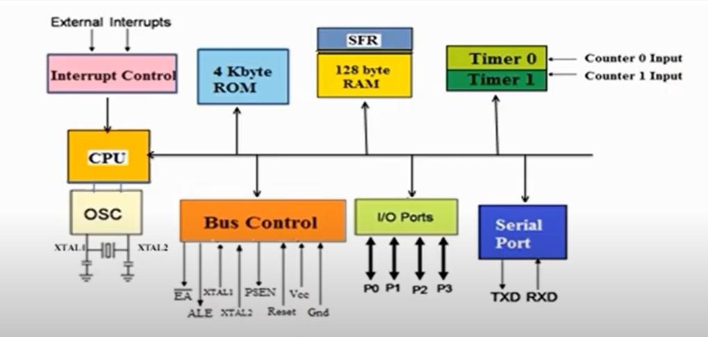
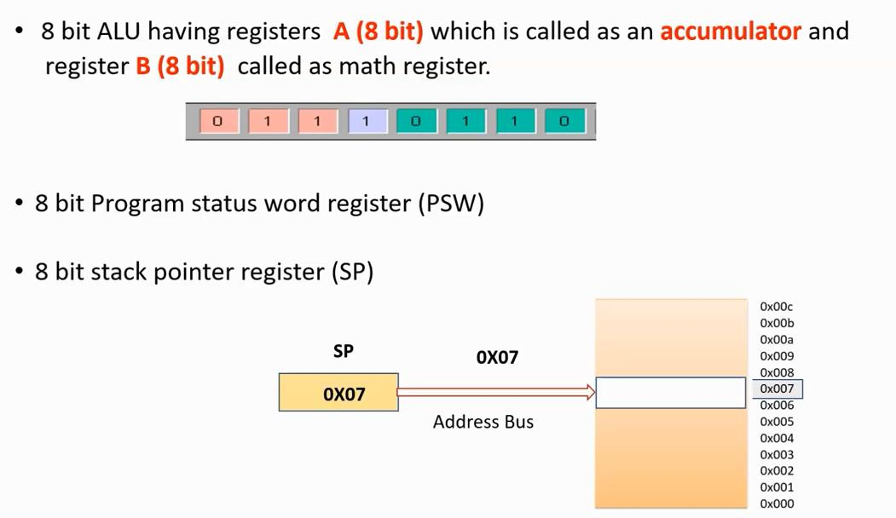
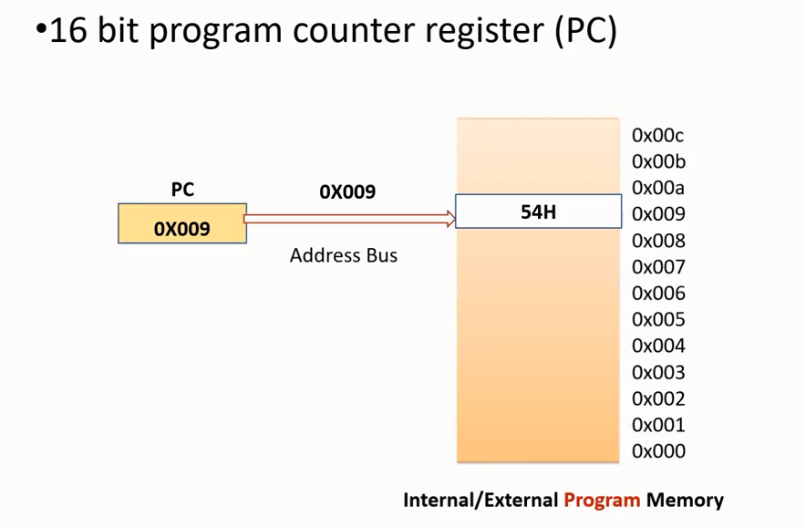
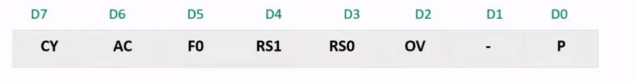
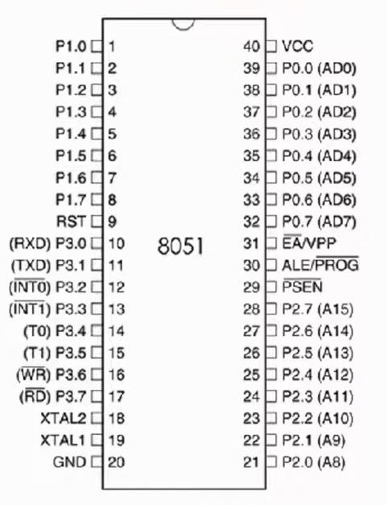
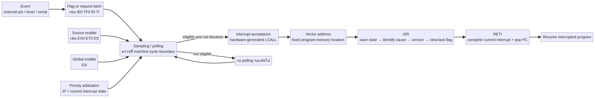

# บทที่ 2: สถาปัตยกรรม 8051 และสิ่งที่อยู่บนชิป

## 2.1 ทำไมต้องเรียนสถาปัตยกรรมก่อนเขียน interrupt

Interrupt ไม่ได้เป็นคุณสมบัติของภาษา assembly อย่างเดียว แต่เป็นความร่วมมือระหว่าง pin/peripheral, flag latch, interrupt enable, priority logic, program counter และ stack. หากไม่รู้ว่าแต่ละส่วนอยู่ตรงไหน คำว่า “เกิด interrupt” จะเป็นเพียงประโยคจำ. บทนี้จึงเริ่มจากภาพรวมแล้วค่อยแยกส่วนประกอบ.



ภาพข้างต้นเป็นสื่อจาก Lecture 1; ใช้เพื่อจำแนก block ไม่ใช่แทนผังภายในของ derivative ใดโดยเฉพาะ [4].

## 2.2 คำว่า 8-bit หมายถึงอะไร

8051 ถูกเรียกว่าไมโครคอนโทรลเลอร์ 8 บิต เพราะ datapath และ operation หลักจำนวนมากทำกับข้อมูลครั้งละ 8 บิต เช่น accumulator และ ALU. ไม่ได้หมายความว่า address มีเพียง 8 บิต; classic 8051 ใช้ program counter และ address path 16 บิตเพื่ออ้าง program space ได้กว้างถึง 64K logical addresses. ดังนั้น “data width” กับ “address width” เป็นคนละมิติ.

ALU ทำ arithmetic และ logic เช่น addition, subtraction, AND, OR, rotate และ compare. ผลลัพธ์บางชนิดไม่สามารถเก็บใน 8 บิตได้ จึงสะท้อนผ่าน flags ใน PSW เช่น Carry และ Overflow. Flag ไม่ใช่ผลลัพธ์หลักเสมอไป แต่เป็น metadata ที่ instruction ถัดไปสามารถใช้ตัดสินใจ branch.



## 2.3 Accumulator (A)

Accumulator หรือ `A` เป็น register 8 บิตที่ instruction จำนวนมากใช้เป็น operand หรือ destination. ตัวอย่าง `MOV A,#15H` โหลดค่าคงที่ 15H เข้า A; `ADD A,R2` ใช้ A เป็นหนึ่ง operand และเก็บผลลัพธ์กลับใน A. เมื่ออธิบาย interrupt ต้องระวังว่า ISR อาจใช้ A และเปลี่ยนค่าที่ main program คาดว่าจะยังอยู่ จึงต้อง save/restore หาก contract ของโปรแกรมกำหนดให้ค่านี้คงเดิม.

## 2.4 Program Counter (PC)

PC คือ register ที่ชี้ byte ถัดไปของ instruction ใน program memory. ในการ fetch CPU อ่าน opcode ณ address ที่ PC ชี้ แล้วเพิ่ม PC ตามขนาด instruction เว้นแต่ instruction จะเปลี่ยน control flow. `CALL` เก็บ return PC แล้วเปลี่ยน PC ไป subroutine; interrupt acceptance ทำสิ่งคล้าย hardware-generated call แล้วเปลี่ยน PC ไป vector.



จุดสำคัญคือ PC เป็น address ของ **program memory**. เมื่อเราพูดว่า interrupt “กระโดดไป vector 0003H” หมายถึง CPU ทำให้ PC มีค่า 0003H ไม่ได้หมายถึง data ถูกย้ายไป address นั้น.

## 2.5 Stack Pointer (SP)

SP ชี้ตำแหน่งบน internal data RAM ที่ใช้เป็น top ของ stack. ใน classic 8051 ค่าเริ่มต้นของ SP มักทำให้ stack เริ่มเหนือ register bank พื้นที่เริ่มต้น แต่โปรแกรมจริงควรกำหนด SP ให้ไม่ชนกับตัวแปรและ register usage ของตน. `PUSH` จะเพิ่ม SP ก่อนเขียน data; `POP` อ่านจาก SP แล้วลด SP ตามสถาปัตยกรรม. `CALL` และ interrupt hardware ใช้ stack สำหรับ return address.

## 2.6 DPTR และการแยก address/data

`DPTR` เป็น data pointer 16 บิต ประกอบด้วย DPH และ DPL. ใช้บ่อยกับ external data memory ผ่าน `MOVX` และการอ่านตารางใน code memory ผ่าน `MOVC A,@A+DPTR`. การที่ DPTR เป็น 16 บิตช่วยให้เข้าถึง address range กว้างกว่า register 8 บิต. แต่ DPTR เองก็เป็น state ที่ subroutine/ISR อาจเปลี่ยน จึงต้องบันทึกเมื่อจำเป็น.

## 2.7 PSW: สถานะที่ควบคุมทั้ง arithmetic และ register bank

Program Status Word เป็น SFR ที่เก็บ flags และ bits ที่เลือก register bank. รายละเอียด bit ที่เกี่ยวข้องกับการเรียนคือ CY (Carry), AC (Auxiliary Carry), F0 (user flag), RS1/RS0 (เลือก bank), OV (Overflow) และ P (Parity). PSW จึงไม่ใช่ “แค่ flag register”; การเปลี่ยน RS1/RS0 เปลี่ยนว่า `R0`–`R7` ชื่อเดียวกัน map ไปยัง RAM ชุดใด.



หาก ISR เปลี่ยน PSW แล้วไม่ restore เมื่อกลับ main program, instruction ที่ใช้ R0–R7 อาจไปแตะคนละ bank และเกิด bug ที่ดูเหมือนไม่เกี่ยวกับ interrupt. นี่คือเหตุผลที่การ save context ต้องคิดถึง PSW ไม่ใช่เพียง A.

## 2.8 Port 0 ถึง Port 3

8051 classic มี port 8 บิตหลายชุดเพื่อเชื่อมต่อโลกภายนอก. Port 0 มีบทบาทพิเศษเป็น multiplexed low address/data bus เมื่อใช้ external memory; Port 1 เป็น I/O ทั่วไปในรูปแบบพื้นฐาน; Port 2 สามารถเป็น high address bus; Port 3 มี alternate functions สำคัญ เช่น serial RXD/TXD, external interrupt INT0/INT1, timer inputs T0/T1 และ external memory control WR/RD [3].



การอ่าน pinout ต้องอ่านเป็นสองชั้น. ชั้นแรกคือ electrical pin number และ port bit เช่น P3.2; ชั้นที่สองคือ function ที่ hardware multiplex ให้ เช่น INT0. หากตั้งใจรับ interrupt จากปุ่มที่ P3.2 ต้องรู้ทั้งวงจรระดับแรงดันและ register ที่ทำให้ INT0 active แบบ edge หรือ level ตาม derivative.

## 2.9 Clock, oscillator และ machine cycle

Oscillator สร้างสัญญาณ period ให้ CPU และ peripheral เดินตาม. Lecture 2 ใช้ตัวเลข 12 MHz เป็นบริบทของ 8051 แบบคลาสสิก แต่ไม่ควรถือว่าทุกรุ่น 8051 มี clock และ machine-cycle division เดียวกัน. ใน original MCS-51 หนึ่ง machine cycle มักสัมพันธ์กับ 12 oscillator periods; derivative รุ่นใหม่อาจเป็น 6, 4 หรือ 1 clock ต่อ machine cycle. ดังนั้นการคำนวณ delay ต้องอ้าง datasheet ของชิปจริง.

ความสัมพันธ์พื้นฐานคือ

```text
oscillator period = 1 / f_osc
machine-cycle period = clock_division / f_osc
จำนวน machine cycles = เวลาที่ต้องการ / machine-cycle period
```

ถ้า `f_osc = 12 MHz` และใช้ 12 oscillator periods ต่อ machine cycle, machine cycle เท่ากับ 1 microsecond. หากเป็น derivative ที่ใช้ 1 clock ต่อ machine cycle คำตอบจะต่างกันถึง 12 เท่า. นี่คือจุดที่การท่อง “12 MHz = 1 microsecond” อาจผิดเมื่อเปลี่ยนชิป.

## 2.10 Timer/Counter

Timer คือ peripheral ที่นับ clock ภายใน; counter คือ peripheral ที่นับ transition จาก input ภายนอก. หลาย MCU ใช้ register hardware ชุดเดียวกันและเปลี่ยน source ด้วย control bit. เมื่อค่าล้นจากช่วงที่ represent ได้ hardware จะ set overflow flag เช่น TF0 หรือ TF1 และหาก enable ไว้ flag สามารถกลายเป็น interrupt request.

บท `04-timer-and-time/` จะอธิบายความสัมพันธ์ระหว่าง reload value, overflow time, prescaler/clock division และ interrupt โดยไม่เหมารวม register ของ derivative ต่างรุ่น.

## 2.11 Serial port

Serial peripheral แปลง byte ใน register เป็นลำดับ bit บนสาย TXD และทำสิ่งย้อนกลับบน RXD. เมื่อส่งหรือรับเสร็จ hardware set flag เช่น TI หรือ RI. หาก ES และ EA เปิดอยู่ serial flag สามารถขอ interrupt ได้. Serial interrupt ของ classic 8051 ใช้ vector เดียวร่วมกัน จึงต้องตรวจ RI/TI ใน ISR ว่าเหตุใดจึงถูกเรียก.

## 2.12 Interrupt controller ในระดับ block

Interrupt controller รับ request จาก external pins, timers และ serial. แต่ละ source มี flag และ enable ของตนเอง; EA ทำหน้าที่เป็น global gate; IP และ state ปัจจุบันใช้เลือก priority. เมื่อผ่านเงื่อนไข CPU รับ interrupt จะ save PC, load vector และเริ่ม ISR. การที่ flag ถูก set ไม่ได้แปลว่า ISR เริ่มทันที เพราะอาจถูก disable, ถูก priority block, อยู่ระหว่าง instruction หรืออยู่ในสถานะ interrupt in progress.



## 2.13 ข้อควรระวังเมื่ออ่าน lecture

เอกสาร lecture ใช้ถ้อยคำเพื่อสอนภาพรวม เช่น “8051 มี five interrupts operating at priority levels”. ต้องอ่านอย่างมีบริบทว่า classic 8051 มีแหล่ง interrupt หลักห้าแหล่งและ priority scheme ของสถาปัตยกรรม แต่ derivative บางรุ่นเพิ่มแหล่งหรือเปลี่ยน register. การนำเสนอที่ดีจึงกล่าวว่า “สำหรับ classic MCS-51 ตาม manual…” และตามด้วย “รุ่นที่ใช้จริงต้องตรวจ datasheet”.

## สรุปบท

สถาปัตยกรรม 8051 คือการจัดสรรบทบาท: PC คุม instruction flow, SP คุม stack, A/ALU ทำ data operation, PSW เก็บ flags และ bank state, ports ติดต่อภายนอก, timers/serial สร้างหรือรับ events, interrupt controller ตัดสินใจว่า event ใดมีสิทธิ์เปลี่ยน control flow. บทถัดไปจะลง memory map และ stack เพราะสองสิ่งนี้คือหลักฐานที่ทำให้เราอธิบาย interrupt ได้จริง.

## References

[1]: https://users.ece.utexas.edu/~valvano/mspm0/ebook/Ch1_Introduction.html "Valvano and Yerraballi, Introduction to Embedded Systems"
[2]: https://cos.colorado.edu/Documents/DCE/BOOT/8051_Manual.pdf "Intel, MCS-51 Microcontroller Family User’s Manual"
[3]: https://www.nxp.com/docs/en/data-sheet/8XC51_8XC52.pdf "NXP/Philips, 8XC51/8XC52 Product Specification"
[4]: ../references/course-sources/lectures/lecture1_complete.md "Course Lecture 1 source file"
