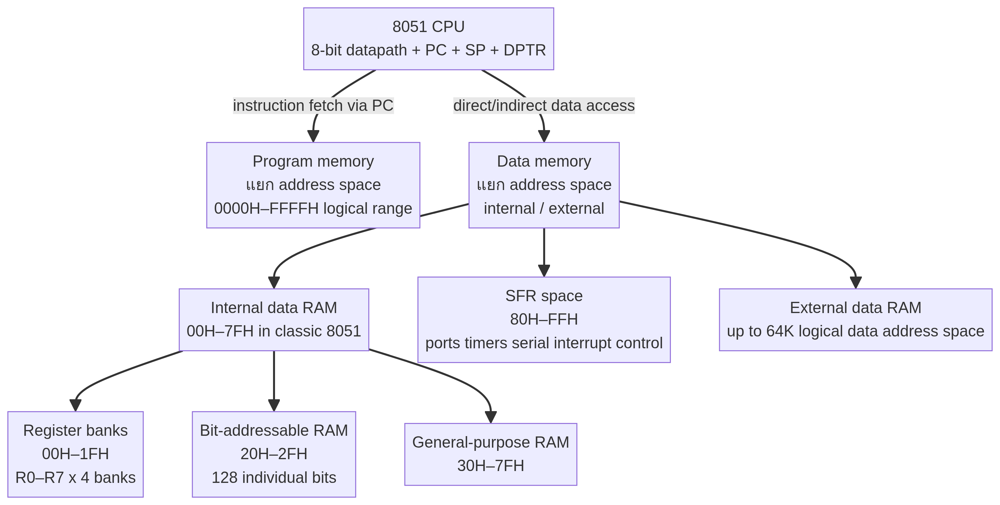
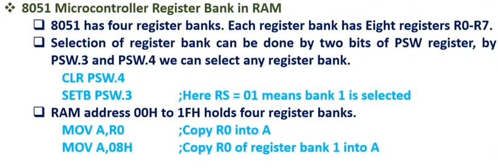
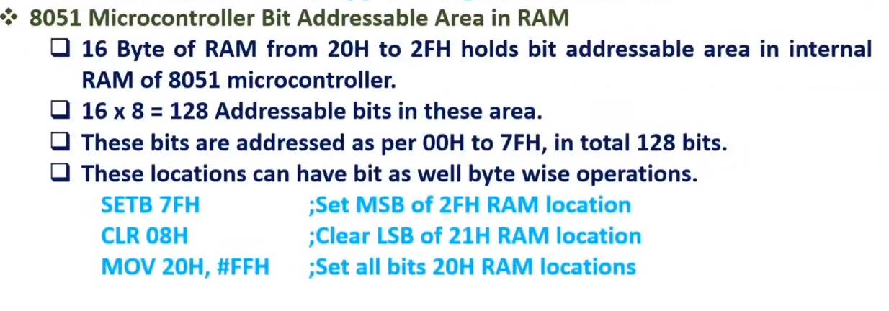
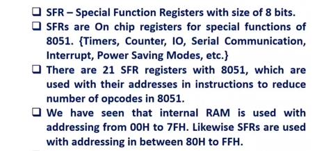
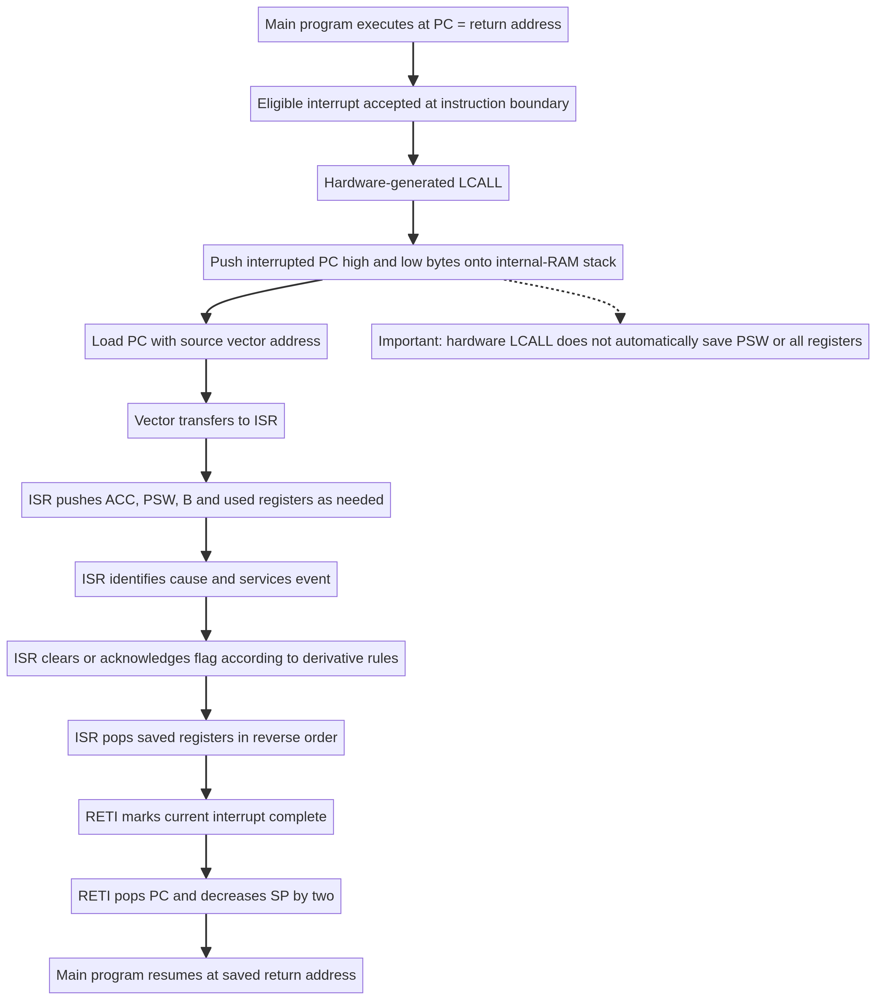

# บทที่ 3: Memory, SFR, Register Bank และ Stack

## 3.1 ทำไม memory map คือภาษาของฮาร์ดแวร์

ใน embedded system การเขียน register ไม่ใช่การเรียก object แบบนามธรรมเท่านั้น แต่คือการอ่านหรือเขียน address ที่ hardware เฝ้าดูอยู่. เมื่อ address ชี้ไปยัง SFR, ผลของการเขียนอาจเป็นการเปิด timer, เปลี่ยนโหมดขา, ล้าง flag หรือยอมให้ interrupt ผ่าน. เมื่อ address อยู่ใน internal RAM, ผลคือเปลี่ยน data หรือ stack. การอ่าน memory map จึงเท่ากับอ่าน “ช่องทางควบคุมระบบ”.



## 3.2 Address space กับ physical storage

Address space คือชุดหมายเลขที่ CPU ใช้อ้างตำแหน่ง; physical storage คือวงจรจริงที่ตอบหมายเลขนั้น. สอง address space อาจมีเลขซ้ำกันแต่ชี้คนละสิ่งได้ถ้าใช้ instruction bus คนละแบบ. Classic 8051 แยก program/code memory จาก data memory. `PC` ใช้ fetch code; `MOV` ใช้ internal data/SFR; `MOVX` ใช้ external data memory; `MOVC` ใช้อ่าน code memory แบบ indexed.

ตารางต่อไปเป็นภาพแนวคิดของ classic 8051 ไม่ใช่กฎตายตัวสำหรับ 8051-compatible ทุก derivative.

| พื้นที่ | หน้าที่ | ตัวชี้/คำสั่งที่พบบ่อย | ประเด็น interrupt |
|---|---|---|---|
| Code memory | opcode, vector, constant table | PC, `MOVC`, jump/call | vector อยู่ที่ code address ที่กำหนด |
| Internal RAM 00H–7FH | register bank, bit RAM, general RAM, stack | R0/R1, `@R0`, SP, PUSH/POP | PC และ context มักใช้พื้นที่นี้ |
| SFR 80H–FFH | port, timer, serial, interrupt control | direct addressing | IE/IP/TCON ทำให้ event มีผลต่อ CPU |
| External data memory | data ที่อยู่นอกชิป | `MOVX`, DPTR | ไม่ใช่ vector space โดยตรง |

## 3.3 Internal RAM และ register banks

Internal RAM ช่วงต้นแบ่งเป็น register banks สี่ชุด แต่ละ bank มี R0–R7 รวม 8 bytes. PSW bits RS1 และ RS0 เลือก bank: `00` เลือก bank 0, `01` bank 1, `10` bank 2, `11` bank 3 ตามตารางใน lecture. ชื่อ `R0` จึงไม่ได้หมายถึง byte เดิมตลอดเวลา; มันหมายถึง byte ที่ bank ปัจจุบัน map ให้.



การใช้ register bank เป็นวิธีหนึ่งในการลดการ save/restore ของ ISR แต่ต้องแลกกับการเปลี่ยน PSW และต้องมั่นใจว่า bank สำรองไม่ถูกใช้โดย main หรือ ISR อื่น. สำหรับการสอนพื้นฐาน ให้ถือว่า ISR ต้อง save PSW และ registers ที่ใช้ เว้นแต่ design จะประกาศ calling convention ชัดเจน.

## 3.4 Bit-addressable RAM

บางช่วงของ internal RAM ถูกแบ่งให้เข้าถึงทีละ bit ได้. Bit addressing เหมาะกับ flags และ state ที่ต้องการ 0/1 หลายค่าโดยไม่เสีย byte เต็ม. อย่างไรก็ตาม bit address และ byte address ไม่ใช่หมายเลขเดียวกันโดยตรง; ต้องอ่าน mapping ของ architecture. การเขียน bit control เช่น EA, EX0 หรือ TF0 ผ่าน SFR ก็ต้องรู้ว่าบิตนั้นเป็น writable, read-only, set/clear by hardware หรือมี side effect.



## 3.5 SFR คืออะไร

**Special Function Register (SFR)** คือ register ที่ hardware peripheral เปิดให้ CPU เข้าถึงผ่าน address ที่กำหนด. SFR จึงเป็น interface ระหว่าง software กับวงจรภายใน. ชื่อ register เช่น `P0`, `P1`, `TCON`, `TMOD`, `SCON`, `SBUF`, `IE` และ `IP` เป็นชื่อ symbolic ที่ assembler/compiler แปลงเป็น address.



คำอธิบาย SFR ที่ดีต้องบอกอย่างน้อยสี่อย่าง: address, reset value, bit layout และ ownership ของแต่ละ bit. “เขียน 1 เพื่อเปิด” ไม่พอ เพราะบาง bit set by hardware, clear by software, clear on read หรือใช้ร่วมกับ bit อื่น.

## 3.6 Register ที่สัมพันธ์กับ interrupt

### IE: Interrupt Enable

`IE` ทำหน้าที่เป็น gate ระดับ global และระดับ source. `EA` เป็น global interrupt enable; bit อื่นเปิด source เช่น external interrupt, timer interrupt หรือ serial interrupt ตาม mapping ของ derivative. เงื่อนไขเชิงตรรกะอย่างง่ายคือ

```text
eligible(source) = flag(source) AND enable(source) AND EA
```

สมการนี้ยังไม่รวม priority และ interrupt-in-progress state จึงเป็นเพียง first filter. การ set EA อย่างเดียวไม่ทำให้ source ที่ flag ยังไม่ active สร้าง ISR.

### IP: Interrupt Priority

`IP` กำหนด priority ของแหล่ง interrupt ในสถาปัตยกรรมที่มีสองระดับพื้นฐาน. Priority ไม่ใช่ตัวกำหนดว่า interrupt ใดเกิดก่อนในโลกจริง แต่เป็นกติกาเมื่อหลาย request พร้อมกันหรือเมื่อ request เกิดระหว่าง ISR. หาก derivative มีหลายระดับ ให้ใช้ datasheet ของรุ่นนั้น.

### TCON: timer และ external interrupt flags

`TCON` มักรวม timer run bits และ flags ของ timer/external interrupt เช่น `TF0`, `TF1`, `IE0`, `IE1`. ชื่อเดียวกันอาจมีรายละเอียด set/clear ต่างกันตามโหมด edge/level และ derivative. ห้ามสรุปว่า “เขียนศูนย์ล้างได้เสมอ” โดยไม่ดู datasheet.

## 3.7 Direct, immediate, register, indirect และ indexed addressing

Addressing mode คือวิธีที่ instruction ระบุ operand. มันกำหนดว่า byte ใน instruction เป็นค่าข้อมูล, address, register name หรือสูตรคำนวณ address.

| รูปแบบ | ตัวอย่าง | ความหมาย |
|---|---|---|
| Immediate | `MOV A,#15H` | A รับค่าคงที่ 15H |
| Register | `MOV A,R2` | A รับค่าจาก R2 ของ bank ปัจจุบัน |
| Direct | `MOV A,35H` | A รับค่าที่อยู่ใน data/SFR address 35H |
| Indirect internal | `MOV A,@R0` | R0 เก็บ address ของ data ที่จะอ่าน |
| External indirect | `MOVX A,@DPTR` | DPTR เป็น address ของ external data |
| Indexed code | `MOVC A,@A+DPTR` | อ่าน code memory ที่ address A+DPTR |

เครื่องหมาย `#` เป็นหลักฐานว่า operand เป็น literal. ถ้าไม่มี `#`, assembler อาจตีความเป็น address หรือ symbol ที่แทน address. ความผิดพลาดนี้ compile ได้ในบางกรณีแต่ทำงานผิด จึงต้อง trace ค่าอย่างชัดเจน.

## 3.8 Stack เป็น LIFO อย่างไร

สมมติ SP เริ่มที่ `07H` และ stack ว่าง. การ `PUSH ACC` เพิ่ม SP เป็น `08H` แล้วเขียนค่า ACC ที่ 08H; `PUSH PSW` เพิ่ม SP เป็น `09H` แล้วเขียน PSW ที่ 09H. หาก `POP PSW`, CPU อ่าน 09H แล้วลด SP กลับ 08H; `POP ACC` อ่าน 08H แล้วลดกลับ 07H. ลำดับ pop ต้องย้อนกลับลำดับ push.

```text
ก่อน: SP=07H
PUSH ACC: SP=08H, [08H]=ACC เดิม
PUSH PSW: SP=09H, [09H]=PSW เดิม
POP PSW:  PSW=[09H], SP=08H
POP ACC:  ACC=[08H], SP=07H
```

หาก pop ผิดลำดับ stack pointer อาจยังดูถูกแต่ register ได้ค่าผิด. หาก ISR ไม่ pop ครบ SP จะสูงขึ้นทุกครั้งที่ interrupt และท้ายที่สุด stack ชนตัวแปรหรือ code-dependent area.

## 3.9 CALL กับ interrupt hardware

Subroutine `CALL` และ interrupt acceptance ต่างก็ต้องเก็บ return PC แต่เหตุผลและ state ต่างกัน. CALL เกิดจาก instruction ของโปรแกรม; hardware interrupt acceptance เกิดจาก interrupt controller เมื่อเงื่อนไขผ่าน. สำหรับ classic 8051 manual อธิบายว่าการตอบสนอง interrupt ใช้กลไกคล้าย LCALL เพื่อ push PC และ load vector. แต่ hardware ไม่ได้รู้ว่า ISR ใช้ A, PSW, B, DPTR หรือ R ใด จึงไม่ save register เหล่านั้นให้โดยอัตโนมัติ.



## 3.10 Worked trace: PC, SP และ context

สมมติ main กำลังจะทำงานที่ `PC=0120H`, `SP=2FH`, และ external interrupt 0 ได้รับการยอมรับ. Hardware จะ push return PC ตามลำดับ byte ของสถาปัตยกรรมลง stack ทำให้ SP เพิ่มสองตำแหน่งและ load PC เป็น vector ของ INT0 (`0003H` ใน classic map). ที่ vector มักใส่ jump ไป ISR จริงเพราะระยะ vector แต่ละช่องมีพื้นที่จำกัด.

จากนั้น ISR อาจทำ:

```asm
PUSH  ACC      ; save accumulator
PUSH  PSW      ; save flags and register-bank selection
PUSH  B        ; only if ISR uses B
; ... service event ...
POP   B
POP   PSW
POP   ACC
RETI
```

เมื่อ `RETI` ทำงาน PC ที่ถูก push กลับมา และ main ดำเนินต่อที่จุดหลัง instruction ที่ถูกขัดจังหวะตามกติกา hardware. การคืน PC ไม่ได้คืน A/PSW อัตโนมัติ; context ที่ software save เท่านั้นจึงจะกลับคืน.

## 3.11 Stack collision และการออกแบบ

Stack collision เกิดเมื่อ stack โตเข้าไปทับ general-purpose RAM, register area, buffer หรือข้อมูลที่ ISR ต้องใช้. ปัญหาอาจไม่เกิดทันที แต่จะปรากฏเมื่อ nested call หรือ interrupt เกิดหลายครั้ง. การออกแบบต้องกำหนด SP ตั้งแต่ต้น, คำนวณ maximum nesting depth, รวม bytes ของ return address และ saved context, และเผื่อพื้นที่สำหรับ compiler runtime หากใช้ C.

## 3.12 สิ่งที่ต้องตรวจใน datasheet จริง

ก่อนใช้กับชิปรุ่นใดโดยเฉพาะ ให้ตรวจ memory map, reset value, SP reset, SFR address, interrupt vector map, flag-clear behavior, priority levels, nested interrupt policy, edge/level sensitivity, clock division และ register access type. “8051-compatible” หมายถึงมี family resemblance ไม่ได้แปลว่าทุกรายละเอียดเท่ากัน.

## แบบฝึก trace

1. ถ้า SP เริ่ม 2FH และ ISR push A, PSW, B, DPTR อย่างละหนึ่ง byte แล้ว hardware push PC สอง byte ก่อนหน้า ค่า SP หลัง push ทั้งหมดเป็นเท่าใด
2. ถ้า ISR pop แค่สามรายการแล้วใช้ RETI จะเกิดผลอย่างไรกับ stack และ return PC
3. จงอธิบายว่าทำไม `MOV A,80H` และ `MOV A,@R0` ไม่เท่ากัน แม้ทั้งคู่ดูเหมือนอ่าน memory
4. ถ้า RS1/RS0 เปลี่ยนจาก bank 0 เป็น bank 1 ระหว่าง ISR ชื่อ R0 จะชี้ไป byte เดิมหรือไม่ เพราะเหตุใด

## References

[1]: https://cos.colorado.edu/Documents/DCE/BOOT/8051_Manual.pdf "Intel, MCS-51 Microcontroller Family User’s Manual"
[2]: https://www.nxp.com/docs/en/data-sheet/8XC51_8XC52.pdf "NXP/Philips, 8XC51/8XC52 Product Specification"
[3]: ../references/course-sources/lectures/lecture3_complete.md "Course Lecture 3 source file"
