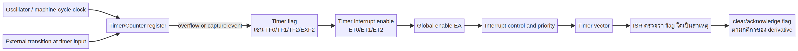
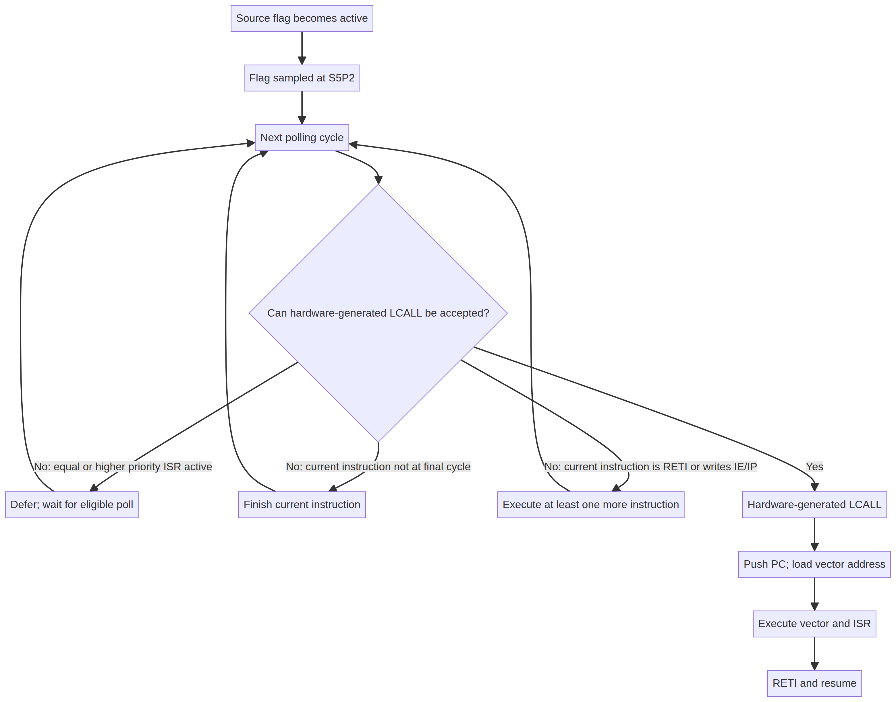

# บทที่ 4: Timer, Counter และเวลาของระบบ

## 4.1 เวลาเป็นส่วนหนึ่งของความถูกต้อง

ในโปรแกรมทั่วไป ถ้าคำนวณถูกแต่ช้ากว่าที่ผู้ใช้ชอบ อาจยังถือว่าโปรแกรมใช้ได้. ใน embedded system การช้าเกิน deadline อาจทำให้ข้อมูลสูญหาย, motor สั่น, serial รับ byte ไม่ทัน หรือระบบความปลอดภัยตอบสนองไม่ทัน. ดังนั้นเราต้องแยก **logical correctness** ว่าได้ค่าถูก กับ **temporal correctness** ว่าได้ค่าถูกภายในเวลาที่กำหนด.

## 4.2 Oscillator และ clock

Oscillator สร้างสัญญาณ periodic ที่มี frequency `f_osc`; period คือ `T_osc = 1/f_osc`. CPU แบ่ง clock เป็น phase และ machine cycle ตามสถาปัตยกรรม. Lecture 2 ใช้ 12 MHz ในการอธิบาย 8051 แบบดั้งเดิม และใน original MCS-51 หนึ่ง machine cycle มักเท่ากับ 12 oscillator periods [1]. แต่ 8051 derivative สมัยใหม่อาจลดจำนวน clock ต่อ machine cycle จึงต้องอ่าน datasheet ของรุ่นจริง [2].

### ตัวอย่าง

ถ้า `f_osc = 12 MHz`,

```text
T_osc = 1 / 12,000,000 = 83.333 ns
T_machine = 12 × T_osc = 1 µs       (เฉพาะสถาปัตยกรรม 12-clock)
```

หากเปลี่ยนเป็น 1-clock derivative, `T_machine` จะเป็นประมาณ 83.333 ns. การนำค่าของ original 8051 ไปใช้โดยไม่ตรวจ clock mode เป็นข้อผิดพลาดเชิงวิศวกรรม.

## 4.3 Timer กับ counter แตกต่างกันอย่างไร

Timer นับ tick จาก clock ภายใน จึงใช้สร้าง delay, periodic interrupt หรือวัดช่วงเวลา. Counter นับ transition จากขาภายนอก จึงใช้วัดจำนวน pulse, รอบเพลา หรือเหตุการณ์จากอุปกรณ์. Hardware block เดียวกันอาจเลือกแหล่งนับด้วย control bit. คำว่า “timer” จึงบอก use case มากกว่าบอกวงจรที่แตกต่างโดยสิ้นเชิง.



## 4.4 Register และ mode

8051 family มักมี timer register สอง byte เช่น TH0/TL0 และ TH1/TL1; TCON มี run control และ flags; TMOD เลือก mode. รุ่นและ derivative อาจเพิ่ม timer 2 หรือเปลี่ยนรายละเอียด. การอธิบายต้องแยก **counter value**, **run bit**, **mode**, **overflow flag** และ **interrupt enable**:

| สิ่ง | คำถามที่ต้องตอบ |
|---|---|
| Counter value | ตอนนี้นับถึงค่าใด |
| Run bit | hardware กำลังนับหรือหยุด |
| Mode | ขนาด counter และ reload behavior เป็นอย่างไร |
| Overflow flag | เกิดเหตุการณ์ล้นแล้วหรือยัง |
| Interrupt enable | อนุญาตให้เหตุการณ์ล้นขอ CPU หรือไม่ |
| Global enable | CPU เปิดรับ interrupt โดยรวมไหม |

## 4.5 Overflow และ flag

ถ้า counter มี `n` bits มันแทนค่าได้ `0` ถึง `2^n-1`. เมื่อเพิ่มจากค่าสูงสุดแล้วเกิด wrap-around หรือ reload ตาม mode, hardware set overflow flag. Flag เป็นหลักฐานว่า event เกิด แต่ไม่ได้บังคับว่า CPU จะเข้า ISR เสมอ. ต้องมี source enable, EA และ priority/acceptance condition ครบ.

ในบาง mode hardware clear flag เมื่อ vector หรือเมื่อ software เขียน; ในบาง mode software ต้อง clear เอง. จุดนี้สำคัญมาก เพราะ ISR ที่ไม่ clear flag อาจถูกเรียกซ้ำทันที. อย่าคัดลอกคำสั่ง clear จากตัวอย่างหนึ่งไปใช้กับอีก derivative โดยไม่ตรวจ datasheet.

## 4.6 คำนวณ delay แบบ reload

สมมติ timer นับขึ้นจากค่าเริ่มต้น `R` จน overflow ที่ `2^n`. จำนวน tick ที่ต้องการโดยอุดมคติคือ

```text
N = 2^n - R
```

ถ้า timer 16 บิตและต้องการ `N` ticks, ค่าเริ่มต้นคือ

```text
R = 65536 - N
```

จากนั้นต้องแยก `R` เป็น high byte และ low byte. แต่สูตรนี้ยังไม่รวมเวลาของ instruction ที่ load timer, start timer, เข้า ISR, clear flag และ reload. หากต้องการความแม่นยำ ให้ใช้ measurement ด้วย oscilloscope/logic analyzer หรือคำนวณ cycle ของทุก instruction.

## 4.7 Delay แบบ busy-wait กับ timer interrupt

Busy-wait คือ CPU วนตรวจ flag หรือ decrement counter จนเวลาครบ. ข้อดีคือเขียนง่ายและคาดเดาได้ในโปรแกรมเล็ก; ข้อเสียคือ CPU ไม่ทำงานอื่นและอาจพลาด event. Timer interrupt ให้ timer เดินอิสระจาก main และเรียก ISR เมื่อครบ period; ข้อดีคือ CPU ทำงานอื่นได้, ข้อเสียคือมี context overhead, latency และความเสี่ยง race/shared state.

| วิธี | จุดแข็ง | จุดอ่อน |
|---|---|---|
| Software loop | ง่าย ไม่ต้องตั้ง peripheral มาก | ผูกกับ clock/instruction และบล็อก CPU |
| Polling timer flag | main ควบคุมจุดตรวจ | latency ขึ้นกับรอบ polling |
| Timer interrupt | ตอบ event ได้เป็นระบบ | ต้องออกแบบ ISR, flag, priority, shared state |

## 4.8 Interrupt latency ของ timer

Timer overflow อาจเกิดระหว่าง instruction ของ main. Hardware ต้อง sample flag ตามจุดที่กำหนด; CPU ต้องจบ instruction ปัจจุบัน; interrupt controller ต้องเห็น source enable และ EA; หากมี ISR ระดับสูงกำลังทำงาน request อาจรอ. เวลารวมจึงประกอบด้วย sampling delay, remaining instruction time, acceptance overhead, vector jump และ software prologue.



Latency ที่คำนวณจาก timer period เพียงอย่างเดียวจึงไม่เพียงพอ. ถ้า deadline สำคัญ ควรวัด worst case เมื่อ instruction ยาวที่สุด, ISR อื่นกำลังทำงาน และมีการปิด interrupt.

## 4.9 Shared state ระหว่าง main กับ timer ISR

สมมติ timer ISR เพิ่มตัวแปร `ticks` ทุก overflow และ main อ่านเพื่อสร้าง second counter. ถ้า `ticks` มีหลาย byte, main อาจอ่าน low byte ก่อน ISR เปลี่ยน high byte ทำให้เห็นค่าผสมที่ไม่เคยมีจริง. วิธีแก้คือปิด interrupt ชั่วคราวระหว่าง read แบบ atomic, ใช้ double-read consistency, ใช้ชนิดข้อมูลที่อ่านได้ atomic บนสถาปัตยกรรม หรือออกแบบ protocol ให้ ISR เขียน snapshot.

การประกาศตัวแปรเป็น `volatile` บอก compiler ว่าค่าอาจเปลี่ยนจากภายนอก flow ปกติ แต่ `volatile` ไม่ทำให้การอ่านหลาย byte atomic และไม่แก้ race โดยอัตโนมัติ.

## 4.10 Timer เป็นแหล่งความเข้าใจ interrupt

Timer ช่วยเห็น causal chain ชัดเจน:

```text
clock tick → counter increment → overflow → timer flag
→ timer enable + EA → priority/acceptance → vector → ISR → clear/reload → RETI
```

หาก output ไม่ toggle ให้ debug ตามลูกโซ่นี้ทีละข้อ อย่าเริ่มจากแก้ RETI ทันที. ตรวจว่า oscillator ทำงาน, timer run bit ถูก set, mode/reload ถูกต้อง, flag เปลี่ยน, enable ถูกเปิด, vector ถูกต้อง และ ISR ถูกวางใน program memory.

## แบบฝึกหัด

1. อธิบายว่าทำไม 12 MHz จึงไม่ได้แปลว่า timer ทุกตัว tick ทุก 1 µs
2. Timer 16 บิตต้องการ 10,000 ticks ต่อ overflow ควรเริ่มจากค่าใดในอุดมคติ
3. ถ้า flag set แต่ ISR ไม่เข้า ให้เสนอรายการตรวจอย่างน้อยหกข้อ
4. ทำไม `volatile` จึงไม่เพียงพอสำหรับตัวนับ 16 บิตที่ main อ่านขณะ ISR แก้ไข
5. เปรียบเทียบ busy-wait กับ timer interrupt ในระบบที่ต้องรับ serial พร้อมกัน

## References

[1]: https://cos.colorado.edu/Documents/DCE/BOOT/8051_Manual.pdf "Intel, MCS-51 Microcontroller Family User’s Manual"
[2]: https://www.nxp.com/docs/en/data-sheet/8XC51_8XC52.pdf "NXP/Philips, 8XC51/8XC52 Product Specification"
[3]: ../references/course-sources/lectures/lecture4_complete.md "Course Lecture 4 source file"
