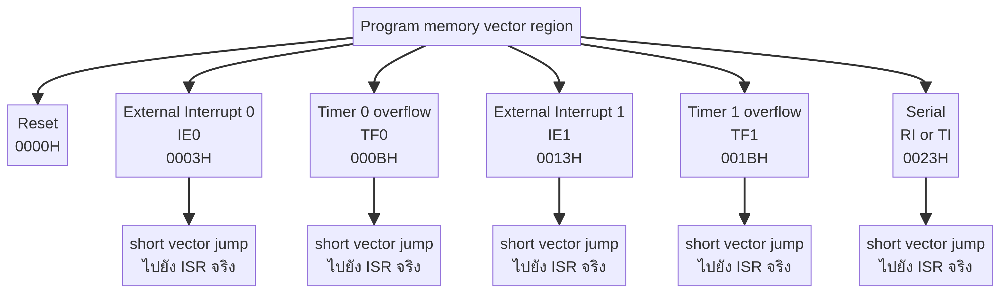
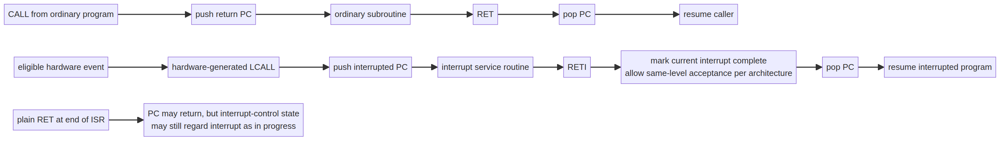

# บทที่ 5: Interrupt Mechanism ของ 8051 อย่างถึงราก

## 5.1 นิยามที่ต้องแยกให้ชัด

**Interrupt** ไม่ใช่ “โปรแกรมหยุดแล้วไปทำอีกโปรแกรมหนึ่ง” แบบไร้เงื่อนไข. มันคือกลไกฮาร์ดแวร์และซอฟต์แวร์ที่ทำให้ CPU ตรวจพบ request ที่ผ่านกติกา แล้วเปลี่ยน program counter ไปยัง routine ที่กำหนด ก่อนคืนกลับสู่จุดเดิม. คำศัพท์แต่ละคำมีหน้าที่ต่างกัน:

| คำ | ความหมายเชิงกลไก |
|---|---|
| Event | เหตุการณ์ที่เกิด เช่น edge ที่ pin หรือ timer overflow |
| Flag | latch/bit ที่บันทึกว่า event เกิดแล้ว |
| Request | สัญญาณเชิงตรรกะที่พร้อมขอ CPU; มักเกิดจาก flag และ enable |
| Enable | bit ที่อนุญาต source หรือ global interrupt |
| Priority | กติกาว่า request ใดมีสิทธิ์เหนือกว่า |
| Acceptance | จุดที่ CPU ตัดสินใจรับ request อย่างเป็นทางการ |
| Vector | program-memory address ที่เป็น entry point ของ source |
| ISR | Interrupt Service Routine ที่ software เขียน |
| Context | state ที่ program ต้องรักษา เช่น A, PSW, B, DPTR, registers |
| RETI | คำสั่งจบ ISR และคืน control ตามกติกา interrupt architecture |

หากพูดว่า “interrupt เกิด” โดยไม่บอกว่าหมายถึง event, flag set, request eligible หรือ CPU accepted จะทำให้การ debug สับสน.

## 5.2 สายโซ่เหตุและผล


กลไกเต็มรูปแบบสามารถเขียนเป็นสายโซ่:

```text
physical/peripheral event
→ hardware sets flag
→ source enable และ EA เปิด
→ priority และ in-progress state อนุญาต
→ CPU sample/poll พบ request
→ hardware saves return PC
→ PC โหลด vector
→ vector เข้าสู่ ISR
→ ISR save context และ service event
→ ISR clear/acknowledge flag
→ RETI จบ interrupt state และคืน PC
→ interrupted program ทำงานต่อ
```

แต่ละลูกศรเป็นจุดที่ผิดพลาดได้. ตัวอย่างเช่น button กดจริงแต่ voltage ไม่ผ่าน threshold; timer overflow จริงแต่ source enable ปิด; vector ถูกแต่ linker วาง ISR ผิด; ISR ทำงานแต่ไม่ clear serial flag; `RETI` คืน PC แต่ context ไม่ถูก restore.

## 5.3 Interrupt source ของ classic 8051

Classic MCS-51 มี source หลักห้าแหล่ง: external interrupt 0, timer 0 overflow, external interrupt 1, timer 1 overflow และ serial port. Vector addresses แบบคลาสสิกคือ `0003H`, `000BH`, `0013H`, `001BH` และ `0023H` ตามลำดับ โดย reset อยู่ที่ `0000H` [1]. รุ่น NXP 8XC51/8XC52 มีรายละเอียดเพิ่มเติมตามรุ่นและ datasheet [2].



Vector slot มีระยะห่างไม่มาก จึงมักวางคำสั่ง jump สั้น ๆ เช่น `LJMP ISR_INT0` แล้วให้ ISR จริงอยู่พื้นที่อื่น. หากใส่ prologue ยาวใน vector slot อาจชน vector ถัดไป. การจัด layout program memory จึงเป็นส่วนหนึ่งของ interrupt correctness.

## 5.4 External interrupt: pin, trigger และ flag

External interrupt 0 มักผูกกับ P3.2/INT0 และ external interrupt 1 กับ P3.3/INT1 ใน pinout แบบคลาสสิก [2]. Event ที่ hardware รับได้ขึ้นกับ trigger mode: level-triggered มองระดับสัญญาณที่ active; edge-triggered มอง transition. ความแตกต่างมีผลต่อ flag และการกลับเข้า ISR ซ้ำ.

ใน edge-triggered mode, flag อาจถูก set เมื่อพบ edge และโดย classic behavior hardware clear flag เมื่อ interrupt response เกิด. ใน level-triggered mode, ถ้า pin ยังคง active เมื่อ ISR จบ request อาจกลับมาอีก. นี่ไม่ใช่ “interrupt ทำงานผิด” แต่เป็นผลตามความหมายของ level-sensitive source. วงจรปุ่มยังมี bounce จึงอาจสร้างหลาย edge; software debounce หรือ hardware debounce เป็นส่วนของ system design.

## 5.5 Timer interrupt และ serial interrupt

Timer overflow set `TF0` หรือ `TF1`; timer interrupt enable และ EA ต้องเปิดก่อน CPU จึงรับ request. Serial port ใช้ vector ร่วมสำหรับ receive และ transmit; `RI` และ `TI` เป็นสาเหตุย่อยที่ ISR ต้องตรวจ. การเขียน ISR serial จึงมักมีรูปแบบ:

```asm
SERIAL_ISR:
        PUSH    ACC
        PUSH    PSW
        ; ถ้า RI เป็น 1: อ่าน SBUF ตาม protocol และ clear RI
        ; ถ้า TI เป็น 1: clear TI และทำเครื่องหมายส่งเสร็จ
        POP     PSW
        POP     ACC
        RETI
```

ลำดับที่ถูกต้องของการ clear flag ต้องอ้าง datasheet. หาก clear `RI` หรือ `TI` ผิดจังหวะ อาจเสีย event; หากไม่ clear อาจถูกเรียกซ้ำ. อย่าใช้คำว่า “flag คือ interrupt” เพราะ flag เป็นเพียงหลักฐาน/เงื่อนไขหนึ่งใน request.

## 5.6 IE: source enable กับ global enable

สำหรับ classic 8051, `IE` ใช้ global enable `EA` และ source enables เช่น `EX0`, `ET0`, `EX1`, `ET1`, `ES`. รูปแบบตรรกะอย่างง่ายคือ

```text
source_request = source_flag AND source_enable
cpu_can_accept = source_request AND EA AND priority_conditions
```

การตั้ง `EA=1` จึงไม่เปิดทุก source หาก bit source enable ยังเป็นศูนย์. การตั้ง `ET0=1` ก็ไม่เพียงพอหาก EA เป็นศูนย์หรือ timer flag ยังไม่เกิด. ในการ debug ให้พิมพ์ค่าของ flag, enable และ EA แยกกัน.

## 5.7 IP และ priority

`IP` กำหนดว่า source ใดอยู่ระดับ high หรือ low ใน scheme ของ classic 8051. Priority มีความหมายต่อ nested interrupt: high-priority request สามารถแทรก low-priority ISR; request ระดับเดียวกันไม่แทรกกันเองตามกติกา classic. การยกระดับ priority ไม่ได้ลด execution time ของ ISR และไม่แก้ ISR ที่ไม่ clear flag.

เมื่อตั้ง priority ต้องคำนวณ worst-case latency และ starvation. ถ้า high-priority ISR ยาวหรือเกิดถี่ low-priority event อาจรอนาน. จึงควรให้ ISR สั้น, ย้ายงานหนักไป main loop และสื่อสารผ่าน flags/ring buffer.

## 5.8 Polling และ interrupt response

8051 ไม่ได้ตรวจทุก request แบบสุ่มเวลา. Manual อธิบายการ sample/poll interrupt flags ตามจุดของ machine cycle. เมื่อ request active แต่ CPU กำลังทำ instruction อยู่ จะต้องรอจน instruction จบ. ยังมีเงื่อนไข block เช่น interrupt ที่ระดับเท่ากันหรือสูงกว่ากำลัง in progress, กำลัง execute `RETI`, หรือเพิ่งแก้ IE/IP ตามกติกา response.


ประโยคที่ถูกต้องคือ “flag ถูก set แล้ว CPU จะรับใน polling/acceptance point ที่เร็วที่สุดที่เงื่อนไขอนุญาต” ไม่ใช่ “flag set แล้วกระโดดทันที”. ความแตกต่างนี้คือหัวใจของ interrupt latency.

## 5.9 Hardware-generated call และการเก็บ PC

เมื่อรับ interrupt, hardware เก็บ address สำหรับกลับไป main program ลง stack และ load PC ด้วย vector. ข้อมูลที่ hardware มีเหตุผลต้องรักษาแน่นอนคือ PC; hardware ไม่รู้ว่า ISR จะใช้ register ใด. ดังนั้น software convention ต้องกำหนดว่า ISR save A, PSW, B, DPTR, R registers หรือไม่.

สมมติ `SP=2FH` ก่อน acceptance. หลังเก็บ PC สอง byte ค่า SP จะสูงขึ้นสองตำแหน่งตามกลไก stack. หลังจากนั้นถ้า ISR push A และ PSW อีกสอง byte SP สูงขึ้นอีกสอง. หาก ISR pop context ครบก่อน RETI, RETI จะ pop PC และคืน SP กลับค่าเดิม. หาก context push/pop ไม่สมดุล, return อาจอ่าน byte ผิดเป็น PC.


## 5.10 Vector กับ ISR จริง

Vector address เป็น entry point ขั้นต้น ไม่จำเป็นต้องเป็น ISR ทั้งหมด. ตัวอย่าง layout:

```asm
ORG 0000H
        LJMP RESET

ORG 0003H
        LJMP EXT0_ISR

ORG 000BH
        LJMP TIMER0_ISR

ORG 0023H
        LJMP SERIAL_ISR
```

คำสั่ง `ORG` เป็น assembler directive ไม่ใช่ CPU instruction. มันบอก assembler ว่า byte ถัดไปควรวางที่ program address ใด. หากใช้ linker/compiler ที่จัด vector ให้เอง ต้องตรวจ map file แทนการใส่ ORG แบบ assembly.

## 5.11 ISR ที่ดีทำอะไรบ้าง

ISR ที่ดีมีขอบเขตสั้นและ deterministic: preserve context ตาม contract, identify source, capture data ที่สูญหายได้, clear/acknowledge flag ตามกติกา, update minimal shared state, แล้วคืนด้วย RETI. งานหนัก เช่น parsing packet, คำนวณ floating point, แสดงผลยาว ๆ หรือรอ peripheral ไม่ควรอยู่ใน ISR หากไม่จำเป็น.

รูปแบบ pseudocode:

```text
ISR:
    save context
    if source_A_pending:
        capture source_A data
        clear/ack source_A
        set main_event_A
    if source_B_pending:
        capture source_B data
        clear/ack source_B
        set main_event_B
    restore context
    RETI
```

การตรวจหลาย source ใน vector เดียวเป็นสิ่งจำเป็นสำหรับ serial interrupt และ derivative ที่รวมหลาย source. หากไม่ตรวจ flag ย่อย ISR อาจไม่รู้ว่าเหตุใดถูกเรียก.

## 5.12 RET กับ RETI ต่างกันอย่างไร

`RET` ใช้คืนจาก subroutine ที่ถูกเรียกด้วย CALL. มัน pop return PC แล้วกลับ caller. `RETI` ใช้คืนจาก ISR. นอกจากคืน PC แล้ว มันทำให้ interrupt control logic รู้ว่า service ปัจจุบันจบลงตามกติกาสถาปัตยกรรม เพื่อให้การรับ interrupt ถัดไปทำงานถูกต้อง.



Lecture 4 สรุป RETI ว่า “return ไป main และ enable interrupt โดย EA=1”. สำหรับการพูดใน presentation ให้ปรับเป็น:

> “ในระดับการสอน RETI หมายถึงการจบ ISR และทำให้ระบบพร้อมรับ interrupt ต่อ; ในระดับ MCS-51 architecture, RETI คืน PC และแจ้ง interrupt control logic ว่า interrupt ปัจจุบันจบแล้ว. ไม่ควรเหมารวมว่า RETI เขียน EA เป็น 1 ในทุก derivative; EA เป็น global-enable bit ที่ต้องตรวจจาก datasheet และ software configuration.” [1]

นี่ไม่ใช่การโต้แย้งอาจารย์ แต่เป็นการแยก **simplified pedagogical statement** จาก **architectural guarantee**. ถ้าถูกถามว่าทำไมไม่ใช้ RET ให้ตอบว่า RET อาจคืน PC ได้ แต่ไม่ทำหน้าที่ completion handshake ของ interrupt controller.

## 5.13 Interrupt nesting และ reentrancy

Nested interrupt เกิดเมื่อ ISR หนึ่งถูกแทรกด้วย ISR ที่ priority สูงกว่า. ทุก nesting level ใช้ stack สำหรับ PC และ software context. ต้องกำหนดว่า high-priority ISR สามารถใช้ register bank ใด, shared variable ใด และสามารถเรียก subroutine ที่ไม่ reentrant หรือไม่. ถ้า ISR ใช้ buffer เดียวกันโดยไม่มี protocol อาจเกิด corruption แม้ PC/RETI ถูกต้อง.

## 5.14 Polling เทียบกับ interrupt

Polling ให้ main ตรวจ flag เป็นรอบ ๆ. ข้อดีคือ control flow ตรงและ debug ง่าย; ข้อเสียคือ latency ผูกกับรอบตรวจและ CPU เสียเวลา. Interrupt ให้ hardware แจ้ง CPU เมื่อ event เกิด; ข้อดีคือ latency และการใช้ CPU ดีขึ้น; ข้อเสียคือ context switch, concurrency, priority และ race condition.

เลือก interrupt เมื่อ event asynchronous, มี deadline, หรือไม่คุ้มให้ CPU ตรวจตลอด. เลือก polling เมื่อ event เป็น periodic ที่ main loop มีเวลาเหลือ, ต้องการ control flow ง่าย หรือการ interrupt จะเพิ่ม complexity เกินประโยชน์. วิศวกรรมที่ดีไม่ถือว่า interrupt ดีกว่าเสมอ.

## 5.15 Debug checklist แบบ causal

| ขั้น | ตรวจอะไร | หลักฐานที่ควรเห็น |
|---|---|---|
| 1 | event ทางไฟฟ้าหรือ peripheral | pin transition, timer counter, serial activity |
| 2 | flag | bit เปลี่ยนใน register |
| 3 | source enable | IE source bit เป็น 1 |
| 4 | global enable | EA เป็น 1 หาก design ต้องการรับ |
| 5 | trigger/clear semantics | mode และ flag behavior ตรง datasheet |
| 6 | priority/block | ไม่มี ISR ระดับสูงค้างหรือ disable นาน |
| 7 | vector | map file/hex มี jump ที่ address ถูก |
| 8 | ISR | breakpoint/toggle pin เข้า ISR |
| 9 | context | push/pop สมดุล, SP ไม่รั่ว |
| 10 | return | ใช้ RETI และ resume PC ถูก |

## 5.16 คำตอบสั้นสำหรับการนำเสนอ coursework

หากต้องอธิบายหนึ่งนาที ให้พูดตามลำดับนี้: “Interrupt เริ่มจาก event ที่ source ทำให้ flag set. Source enable และ EA เป็น gate; IP และ state ปัจจุบันตัดสิน priority/acceptance. เมื่อ CPU รับ request ที่ polling boundary hardware จะเก็บ PC ลง stack และโหลด vector. Vector กระโดดไป ISR ซึ่งต้อง save context ที่ใช้ ตรวจสาเหตุ clear flag และทำงานให้สั้น. ตอนจบใช้ RETI ไม่ใช่ RET เพราะ RETI แจ้ง interrupt control logic ว่า service ปัจจุบันเสร็จแล้วพร้อมคืน PC. รายละเอียด flag-clear และ vector ต้องยืนยันกับ datasheet ของ derivative ที่ใช้.”

## References

[1]: https://cos.colorado.edu/Documents/DCE/BOOT/8051_Manual.pdf "Intel, MCS-51 Microcontroller Family User’s Manual"
[2]: https://www.nxp.com/docs/en/data-sheet/8XC51_8XC52.pdf "NXP/Philips, 8XC51/8XC52 Product Specification"
[3]: ../references/course-sources/lectures/lecture3_complete.md "Course Lecture 3 source file"
[4]: ../references/course-sources/lectures/lecture4_complete.md "Course Lecture 4 source file"
