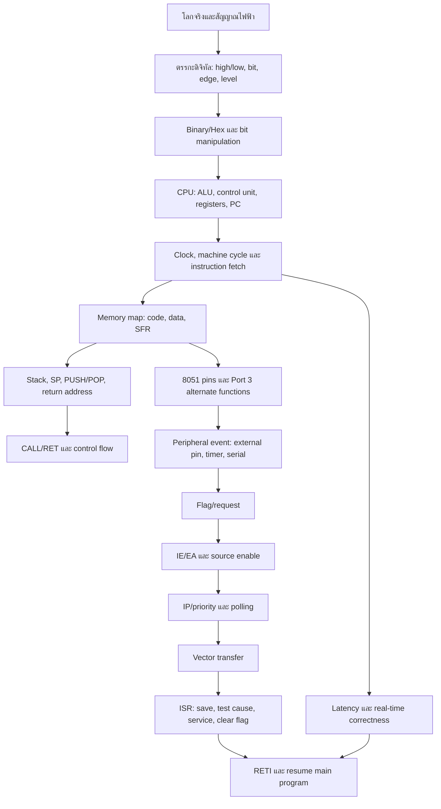

# หลักสูตรจากศูนย์: Embedded Systems ตาม Lecture 1–4

**ผู้จัดทำ:** Manus AI  
**ขอบเขต:** Lecture 1–4 ของรายวิชา Embedded System และการเตรียมความเข้าใจเพื่ออธิบาย coursework เรื่อง Interrupt Mechanism  
**ระดับ:** นิสิตวิศวกรรมคอมพิวเตอร์ระดับปริญญาตรี  
**เป้าหมายเวลา:** เรียนต่อเนื่องได้ประมาณ 24 ชั่วโมง หรือแบ่งเป็นแผน 3 วัน

## 1. อาจารย์กำลังสอนอะไร

แก่นของ lecture 1–4 ไม่ได้อยู่ที่การจำชื่อขา 8051 หรือการจำคำสั่ง assembly แยกเป็นรายการ แต่คือการฝึกมอง **ระบบคอมพิวเตอร์ขนาดเล็กที่เชื่อมต่อกับโลกจริง** ตั้งแต่สัญญาณไฟฟ้าเข้าที่ขา input การเปลี่ยนเป็นบิตและ register การประมวลผลโดย CPU การอ่านคำสั่งจาก program memory การเก็บข้อมูลใน data memory การส่งผลลัพธ์ออกทาง I/O และการควบคุมเหตุการณ์ที่เกิดขึ้นระหว่างการทำงานผ่าน timer และ interrupt.

เมื่ออ่านทั้งสี่ lecture ต่อกัน จะเห็นสายโซ่ความคิดดังนี้:

> **Physical world → pin/peripheral → register/flag → CPU state → instruction/control flow → stack/return address → interrupt vector → ISR → RETI → กลับสู่งานเดิม**

Lecture 1 สร้างแผนที่ของระบบ, lecture 2 ทำให้เห็นขาและสถานะของ 8051, lecture 3 อธิบายว่าข้อมูลและสถานะอยู่ใน memory/SFR/stack อย่างไร และ lecture 4 สอนคำสั่งที่ CPU ใช้เคลื่อน control flow. ดังนั้น interrupt mechanism ใน coursework จึงเป็นหัวข้อที่ยืนอยู่บนความรู้ทั้งหมด ไม่ใช่หัวข้อโดดเดี่ยว.

แหล่ง pedagogical จาก University of Texas อธิบายทิศทางเดียวกัน โดยเริ่มจากนิยาม embedded system แล้วปู binary information, number representation, CPU, memory, instruction-set architecture, stack และ functions ตามลำดับ [1].

## 2. ต้องเรียนอะไรก่อนหรือไม่

ไม่จำเป็นต้องเรียนวิชาใหม่ทั้งวิชาก่อนเริ่ม lecture แต่ต้องมี **พื้นฐานขั้นต่ำที่ใช้งานได้** ห้ากลุ่ม หากขาดกลุ่มใดให้ย้อนอ่านบทเตรียมพื้นฐานในเอกสารชุดนี้ก่อน.

| พื้นฐาน | ต้องเข้าใจอะไร | เหตุผลที่จำเป็นต่อ interrupt |
|---|---|---|
| ตรรกะดิจิทัลและบิต | high/low, 0/1, bit, byte, mask, set/clear, edge และ level | interrupt request มักเริ่มจากระดับหรือขอบสัญญาณ และ register ใช้ bit เป็นตัวควบคุม |
| เลขฐาน | binary, hexadecimal, การแปลงค่า, two’s complement เบื้องต้น | ที่อยู่ SFR, vector, opcode และค่าตั้ง timer เขียนเป็นฐานสิบหก |
| สถาปัตยกรรมคอมพิวเตอร์ | CPU, ALU, control unit, register, PC, memory, bus, instruction cycle | ต้องรู้ว่า CPU อยู่ที่ใดเมื่อ interrupt เกิด และใครตัดสินใจเปลี่ยน control flow |
| หน่วยความจำและ stack | address space, code/data memory, RAM/SFR, LIFO, SP, PUSH/POP, return address | interrupt ต้องรักษาหรือเปลี่ยน execution context และต้องกลับไปยังจุดเดิมได้ |
| Assembly/control flow | MOV, SETB/CLR, SJMP/LJMP, CALL, RET, RETI, addressing modes | ISR เป็นโปรแกรมย่อยที่ถูกเรียกด้วยกลไก hardware และจบด้วยคำสั่งเฉพาะ |

ผู้เรียนไม่ต้องจำรายละเอียด transistor-level เพื่อเริ่มต้น แต่ควรเข้าใจเหตุผลเชิงระบบว่าแรงดันไฟฟ้าถูกตีความเป็นสถานะตรรกะ และสถานะตรรกะถูกจัดเป็นบิต/byte ที่ CPU ประมวลผล. เอกสารพื้นฐานของ Valvano และ Yerraballi อธิบาย embedded system เป็นไมโครคอมพิวเตอร์ที่ต่อกับอุปกรณ์ไฟฟ้า เครื่องกล หรือเคมี โดยมี sensor, interface, software และ actuator ในวงจร input–decision–output [1].

## 3. Dependency map ของความรู้

แผนภาพนี้ควรอ่านจากซ้ายไปขวา ไม่ใช่ท่องจากล่างขึ้นบน. ตัวอย่างเช่น หากยังไม่รู้ว่า `IE0` เป็น bit ใน SFR และยังไม่รู้ว่า SFR อยู่ใน address space ใด จะไม่สามารถอธิบายได้อย่างมีเหตุผลว่าเหตุใดการตั้ง `EX0` และ `EA` จึงทำให้ external interrupt 0 พร้อมตอบสนอง.

## 4. เส้นทางการเรียน 24 ชั่วโมง

### ช่วงที่ 1: สร้าง mental model ของระบบ (ชั่วโมงที่ 1–3)

เริ่มจากตอบคำถามว่า embedded system ต่างจาก desktop computer อย่างไรในเชิง **หน้าที่ ความจำเพาะ ข้อจำกัด และการเชื่อมต่อกับ physical world**. จากนั้นจำแนก input, sensor, signal conditioning, controller, memory, clock, output, actuator และ power supply. ห้ามเริ่มจากการท่อง pin diagram เพราะ pin จะไม่มีความหมายหากยังไม่เห็นระบบที่ pin นั้นเป็นส่วนประกอบ.

ผลลัพธ์ที่ต้องได้คือสามารถวาดกล่องระบบที่มี input–controller–output และอธิบายว่าการตัดสินใจเกิดใน software บน processor โดยใช้สถานะจาก memory/register.

### ช่วงที่ 2: บิต เลขฐาน และ register (ชั่วโมงที่ 4–5)

ทบทวน binary และ hexadecimal จนอ่าน `A8H`, `B8H`, `03H`, `0BH`, `13H` และ `1BH` ได้โดยไม่สับสน. ฝึก bit mask, การตั้งบิต, การล้างบิต และการอ่านบิตบางตำแหน่ง. เชื่อมเลขฐานกับ hardware โดยอธิบายว่า `0` และ `1` ไม่ได้เป็นตัวเลขลอย ๆ แต่เป็นการเข้ารหัสสถานะตรรกะของวงจร.

ผลลัพธ์ที่ต้องได้คือสามารถอ่าน register แบบ 8-bit เป็นช่องควบคุมหลายช่อง เช่น `IE = EA | ET1 | EX1 | ET0 | EX0` และอธิบายว่าแต่ละ bit มีหน้าที่แตกต่างกัน.

### ช่วงที่ 3: CPU, clock และ instruction cycle (ชั่วโมงที่ 6–8)

เรียน CPU ผ่าน ALU, control unit, registers และ program counter. อธิบายวงจร fetch–decode–execute: PC ชี้คำสั่ง, CPU fetch opcode, decoder สร้าง control signals, ALU/registers ทำงาน และ PC เปลี่ยนไปยังคำสั่งถัดไป. จากนั้นเชื่อม clock กับเวลา โดยแยก oscillator frequency, machine cycle, instruction timing และ event latency.

ห้ามสรุปว่า 8051 ทุกตัวทำงานที่ 12 MHz หรือทุกคำสั่งใช้เวลาเท่ากัน. Datasheet ของ 80C51 family ที่ใช้เป็นตัวอย่างระบุช่วงความถี่และคุณสมบัติตาม derivative; คู่มือเดียวกันยังระบุ timer บางโหมดเป็น `OSC/12` [2]. ในเอกสารสอนจะใช้ “classic 12-clock 8051” เป็นแบบจำลองเพื่อการเรียน แต่ต้องประกาศว่าเป็น model/derivative assumption.

### ช่วงที่ 4: memory map, SFR และ Port 3 (ชั่วโมงที่ 9–11)

แยก code memory, internal data RAM, external data memory และ SFR. อธิบายว่า address ไม่ใช่ข้อมูล แต่เป็นตำแหน่งที่ใช้ค้นหาข้อมูลหรือ register. เรียน internal RAM ของ 8051: register banks, bit-addressable area, general-purpose RAM และ stack.

จากนั้นอ่าน pin diagram โดยเฉพาะ Port 3. ใน 80C51 family P3.2 ทำหน้าที่ `INT0`, P3.3 ทำหน้าที่ `INT1`, P3.4/P3.5 เป็น T0/T1 และ P3.0/P3.1 เป็น RxD/TxD [2]. ประเด็นสำคัญคือขาเดียวอาจมี port function และ alternate peripheral function; software configuration และ hardware mode เป็นตัวกำหนดว่าขานั้นถูกตีความอย่างไร.

### ช่วงที่ 5: stack, CALL/RET และ context (ชั่วโมงที่ 12–14)

เรียน stack แบบ LIFO ด้วยการจำลองค่า SP บนกระดาษ. เมื่อ `CALL` เกิดขึ้น CPU ต้องเก็บ return address เพื่อรู้ว่าจะกลับไปทำงานต่อที่ใด; เมื่อ `RET` เกิดขึ้น address นั้นถูกนำกลับมาใช้. ต่อด้วยความหมายของ context ได้แก่ PC, PSW, accumulator, registers และสถานะ peripheral ที่อาจมีผลต่อโปรแกรม.

จากนั้นแยกให้ชัดว่า subroutine call กับ interrupt ไม่เหมือนกัน. `CALL` เกิดจากคำสั่งในโปรแกรมที่ผู้เขียนสั่งเอง ส่วน interrupt เกิดจาก event/request ของ hardware ที่ทำให้ control flow ถูกเปลี่ยนตามเงื่อนไข enable/priority. ทั้งสองแบบต้องมีวิธีกลับ แต่ interrupt ต้องมี end-of-interrupt semantics และ source flag handling ด้วย.

### ช่วงที่ 6: timer และ event generation (ชั่วโมงที่ 15–16)

เรียน timer ในฐานะตัวนับเหตุการณ์ที่สร้าง flag เมื่อ overflow หรือเกิด transition. แยก timer กับ counter: timer ใช้ clock ภายใน ส่วน counter นับ event จากภายนอก. อธิบายว่า timer ไม่ใช่ interrupt โดยตัวมันเอง; timer เป็น peripheral ที่สร้าง request/flag และ CPU จะตอบสนองก็ต่อเมื่อเงื่อนไข interrupt อื่น ๆ ครบ.

ตัวอย่างจาก datasheet ระบุว่า Timer 2 overflow ตั้ง `TF2`; external transition ที่ `T2EX` อาจตั้ง `EXF2`; ทั้งสอง flag อาจชี้ไปยัง timer-2 interrupt vector เดียวกัน และ ISR ต้องตรวจ flag เพื่อหาสาเหตุ [2]. แนวคิดนี้ช่วยให้เข้าใจว่าหนึ่ง vector อาจรับผิดชอบหลาย cause ภายใน peripheral เดียว.

### ช่วงที่ 7: interrupt mechanism จาก source ถึง ISR (ชั่วโมงที่ 17–21)

สอนเป็นลำดับ causal chain ไม่ใช่จำคำศัพท์แยกกัน:

1. external pin, timer หรือ serial peripheral เกิด event;
2. hardware ตั้ง request/flag เช่น `IE0`, `TF0`, `IE1`, `TF1` หรือ serial flags;
3. source enable และ global enable ต้องเปิด เช่น `EX0=1` และ `EA=1`;
4. interrupt controller ตรวจ pending requests, nesting/masking และ priority;
5. CPU ยอมรับ interrupt ณ boundary ที่สถาปัตยกรรมกำหนด;
6. return context/address ถูกบันทึกตามกติกาของ device;
7. PC ถูกส่งไปยัง vector address;
8. vector code นำไปยัง ISR ที่เหมาะสม;
9. ISR save context ที่จำเป็น, ตรวจ cause, ทำงานสั้นและ deterministic, clear/acknowledge flag;
10. `RETI` ระบุการจบ interrupt service และ CPU resume main program ตาม semantics ของ derivative.

ลำดับนี้เป็นแกนสำหรับ coursework และต้องอธิบายความแตกต่างระหว่าง **request**, **enable**, **priority**, **vector**, **ISR**, **latency** และ **return** ทุกคำ.

### ช่วงที่ 8: latency, correctness และการเตรียมนำเสนอ (ชั่วโมงที่ 22–24)

แยกเวลาอย่างน้อยสามช่วง: event-to-request, request-to-accept และ accept-to-first-ISR-instruction. เพิ่มเวลาที่ ISR ใช้ก่อน clear/acknowledge flag และเวลาที่กลับเข้าสู่ main program. อธิบายว่า interrupt ที่ “ทำงานได้” ไม่จำเป็นต้อง “ถูกต้องแบบ real-time” หากตอบสนองช้าเกิน deadline หรือเกิด lost event, repeated event, race condition, nested interrupt ที่ไม่ตั้งใจ หรือ corruption ของ register/context.

สุดท้ายฝึกอธิบายด้วยภาพเดียว: source → flag → enable/priority → vector → ISR → RETI → main. สไลด์ควรสั้น แต่ผู้พูดต้องมีเอกสารนี้เป็น reasoning layer สำหรับตอบคำถาม.

## 5. แผนเรียนสามวัน

| วัน | ช่วงเวลา | เป้าหมายหลัก | ผลงานระหว่างเรียน |
|---|---:|---|---|
| วันแรก | 8 ชั่วโมง | เข้าใจ embedded system, CPU, memory, binary/hex, clock และ 8051 pin/SFR | วาด system block diagram, memory map และ pin-function table |
| วันที่สอง | 8 ชั่วโมง | เข้าใจ stack, SP, PC, CALL/RET, timer, flags และ register configuration | จำลอง stack และเขียน pseudocode ของ polling กับ interrupt |
| วันที่สาม | 8 ชั่วโมง | เข้าใจ interrupt acceptance, vector, ISR, priority, latency, RETI และนำเสนอ | วาด interrupt timing diagram, ตรวจสมมติฐาน device และซ้อมตอบคำถาม |

วันแรกควรเน้นความเข้าใจเชิงโครงสร้าง ไม่เร่งเขียนโปรแกรม. วันที่สองจึงค่อยลง instruction และ register เพราะผู้เรียนจะรู้แล้วว่า instruction ไปเปลี่ยน state ใด. วันที่สามจึงลง interrupt mechanism เพราะผู้เรียนจะเห็นว่ามันเป็นการประสาน CPU, memory, peripheral และ control flow.

## 6. เกณฑ์ว่า “เข้าใจจริง”

ผู้เรียนถือว่าเข้าใจระดับใช้งานได้เมื่ออธิบายได้โดยไม่ท่องว่าเหตุใดการกดปุ่มบน `INT0` ไม่ได้ทำให้ ISR ทำงานทันทีเสมอไป; ต้องอธิบาย source configuration, edge/level mode, flag, `EX0`, `EA`, priority, vector, ISR, flag clearing และ `RETI`. ผู้เรียนต้องสามารถตรวจสอบ vector address จาก datasheet ของ device ที่เลือก และไม่ใช้ค่าจาก 8051 derivative หนึ่งไปสรุปกับอีก derivative โดยไม่มีเงื่อนไข.

ผู้เรียนถือว่าเข้าใจระดับลึกเมื่อสามารถวิเคราะห์กรณีที่ ISR ไม่ทำงาน, ทำงานซ้ำ, พลาด event, กลับไปผิดจุด, เปลี่ยนค่า register ของ main program หรือทำให้ระบบตอบสนองไม่ทัน deadline. การวิเคราะห์ต้องเริ่มจาก causal chain และ state ไม่ใช่เดาจากชื่อคำสั่ง.

## 7. ขอบเขตที่จงใจยังไม่ลงลึกในชุดแรก

OS scheduling, RTOS, DMA, cache coherence, multicore interrupt controller, ARM NVIC implementation และ formal verification ไม่ใช่แกนของ lecture 1–4 จึงจะกล่าวถึงเฉพาะเพื่อเปรียบเทียบเมื่อจำเป็น. อุปกรณ์ที่ใช้เป็นตัวอย่างหลักคือ classic MCS-51/80C51-style architecture; AVR และ ARM จะใช้เป็น comparison box เพื่อป้องกันการเหมารวมว่า interrupt semantics ของทุก MCU เหมือนกัน.

## References

[1]: https://users.ece.utexas.edu/~valvano/mspm0/ebook/Ch1_Introduction.html "Jonathan Valvano and Ramesh Yerraballi, Chapter 1: Introduction to Embedded Systems"
[2]: https://www.nxp.com/docs/en/data-sheet/8XC51_8XC52.pdf "Philips/NXP 80C51/87C51/80C52/87C52 Product Specification"
[3]: ./embedded-system/1/lecture/lecture1-markdown/lecture1_complete.md "Course lecture 1"
[4]: ./embedded-system/1/lecture/lecture2-markdown/lecture_2_complete.md "Course lecture 2"
[5]: ./embedded-system/1/lecture/lecture3-markdown/lecture_3_complete.md "Course lecture 3"
[6]: ./embedded-system/1/lecture/lecture4-markdown/lecture_4_complete.md "Course lecture 4"
[7]: ./embedded-system/1/personal-presentation/assignment/coursework-markdown/course_work_complete.md "Interrupt Mechanism coursework brief"
