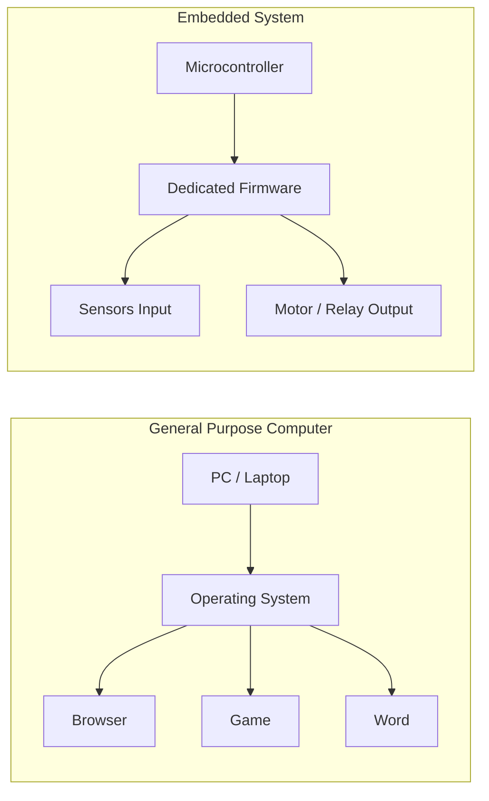
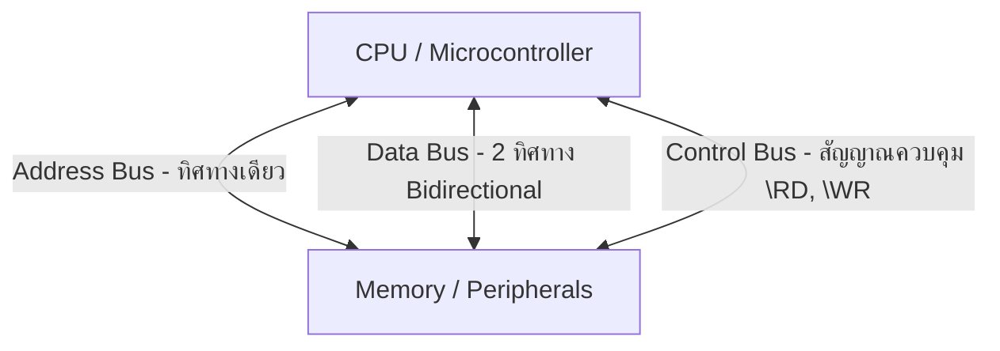
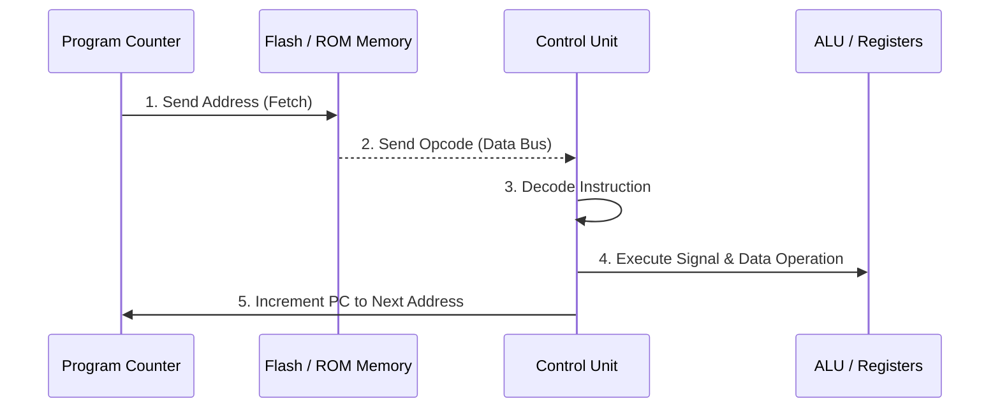

# 📘 Module 00: รากฐานวิศวกรรมคอมพิวเตอร์ก่อนเข้าสู่ระบบฝังตัว (Foundation Prerequisites)

> **เป้าหมายของโมดูล:** ปูพื้นฐานลอจิกดิจิทัล (Digital Logic), สถาปัตยกรรมคอมพิวเตอร์ (Computer Architecture), การทำงานของสัญญาณไฟฟ้า และความเชื่อมโยงระหว่างระดับฮาร์ดแวร์กับระดับซอฟต์แวร์ เพื่อให้เข้าใจว่า "ทำไมอาจารย์ถึงต้องสอนเรื่องนี้" และ "ระบบฝังตัวทำงานอย่างไรตั้งแต่ระดับแรงดันไฟฟ้า"

---

## 1. ทำไมวิศวกรคอมพิวเตอร์ต้องเรียน "ระบบฝังตัว" (Embedded Systems)?

### 1.1 ความแตกต่างระหว่าง General-Purpose Computer กับ Embedded System
ในโลกของคอมพิวเตอร์ เราแบ่งคอมพิวเตอร์ออกเป็น 2 ตระกูลหลัก:
1. **General-Purpose Computers (คอมพิวเตอร์ใช้งานทั่วไป):** เช่น PC, Laptop, Server  
   - **จุดประสงค์:** ออกแบบมาเพื่อทำงานหลากหลายรูปแบบ (Multipurpose) รันโปรแกรมอะไรก็ได้ตั้งแต่พิมพ์งาน ตัดต่อวิดีโอ ไปจนถึงเล่นเกม  
   - **ทรัพยากร:** มี RAM กิกะไบต์ (GB), CPU ความเร็ว GHz, ไม่เน้นเรื่องขีดจำกัดพลังงานหรือขนาด  
   - **ระบบปฏิบัติการ:** มี OS ซับซ้อน (Windows, macOS, Linux) คอยบริหารจัดการทรัพยากร
2. **Embedded Systems (ระบบฝังตัว):** เช่น กล่อง ECU รถยนต์, เครื่องซักผ้า, ไมโครเวฟ, สมาร์ตวอทช์, เครื่องกระตุ้นหัวใจ (Pacemaker)  
   - **จุดประสงค์:** ถูกออกแบบมาเพื่อ **"ทำงานเฉพาะทางอย่างใดอย่างหนึ่ง (Single-Functioned)"** ให้สำเร็จสมบูรณ์  
   - **ข้อจำกัด (Constraints):** ต้องทำงานภายใต้ข้อจำกัดที่เข้มงวด ได้แก่ ขนาด (Size), ต้นทุนการผลิต (Cost), การใช้พลังงาน (Power Consumption) และที่สำคัญที่สุดคือ **เงื่อนไขเวลาจริง (Real-Time Requirements)**  
   - **การตอบสนอง:** ต้องตอบสนองต่อเหตุการณ์ในโลกจริง (Real-World Events) ให้ทันเวลาเดดไลน์ (Deadline) เสมอ เช่น ระบบถุงลมนิรภัย (Airbag) ต้องกางภายใน 10-20 มิลลิวินาทีหลังจากเซนเซอร์ชน หากช้ากว่านั้นถือว่าระบบล้มเหลว (Failure)


*รูปที่ 0.1: แผนภาพบล็อกองค์ประกอบหลักของระบบฝังตัว (Input, Controller MCU, Power Supply, Output)*



### 1.2 สถาปัตยกรรมแบบ Cyber-Physical Systems (CPS)
อาจารย์สอนเรื่องนี้เพราะระบบฝังตัวคือตัวเชื่อมระหว่าง **"โลกกายภาพ (Physical World)"** กับ **"โลกคำนวณดิจิทัล (Cyber World)"**
- **Physical Domain:** อุณหภูมิ, แรงดัน, ความเร็ว, สัญญาณอนาล็อก
- **Sensor Domain:** เปลี่ยนค่าทางกายภาพเป็นสัญญาณไฟฟ้า (Voltage/Current)
- **Cyber Domain (MCU):** ประมวลผลสัญญาณดิจิทัล (Bits 0/1) ตาม Logic
- **Actuator Domain:** เปลี่ยนคำสั่งดิจิทัลกลับไปควบคุมอุปกรณ์กายภาพ (มอนิเตอร์, มอเตอร์, วาล์ว)

---

## 2. พื้นฐานวงจอร์ดิจิทัลและการแทนค่าสัญญาณ (Digital Logic & Signal Fundamentals)

ก่อนจะเข้าใจโปรเซสเซอร์ เราต้องเข้าใจว่าภายในประกอบด้วยทรานซิสเตอร์ (Transistors) ที่ทำงานเป็นสวิตช์เปิด-ปิด

### 2.1 ระดับแรงดันไฟฟ้าและสภาวะลอจิก (Logic Levels & Voltage Thresholds)
ในระบบ 8051 หรือระบบ 5V TTL (Transistor-Transistor Logic):
- **Logic '0' (LOW):** แรงดันช่วง `0.0V` ถึง `0.8V`
- **Logic '1' (HIGH):** แรงดันช่วง `2.0V` ถึง `5.0V`

```
  5.0V ----------------------- (Logic 1 / HIGH)
         Region: Defined HIGH
  2.0V ----------------------- 
         Forbidden / Undefined Region (Noise Margin)
  0.8V ----------------------- 
         Region: Defined LOW
  0.0V ----------------------- (Logic 0 / LOW)
```

### 2.2 Active-HIGH vs Active-LOW Logic
ในการออกแบบวงจรรอบข้าง (Peripherals) และพินควบคุมของไมโครคอนโทรลเลอร์:
- **Active-HIGH (ทำงานเมื่อเป็น 1):** สัญญาณต้องมีแรงดัน HIGH (5V) ถึงจะเปิดใช้งานอุปกรณ์ เช่น ปุ่มกดที่ต่อแบบ Pull-down
- **Active-LOW (ทำงานเมื่อเป็น 0):** สัญญาณต้องถูกดึงลง LOW (0V) ถึงจะเปิดใช้งานอุปกรณ์ สังเกตจากสัญลักษณ์ที่มีขีดบนชื่อพิน เช่น `\INT0`, `\WR`, `\RD`, `\PSEN`, `\EA`  
  *ทำไมวิศวกรนิยมใช้ Active-LOW?* เพราะวงจรรวม (IC) ส่วนใหญ่มีความสามารถในการดูดกระแส (Current Sinking) ลง Ground ได้ดีและทนทานกว่าการจ่ายกระแส (Current Sourcing) ออกมา!

### 2.3 Tri-State Buffer (บัฟเฟอร์ 3 สภาวะ)
อุปกรณ์สำคัญในการเชื่อมต่อสายบัสร่วม (Shared Bus)
- สภาวะปกติมี 2 แบบ: `0` (LOW) และ `1` (HIGH)
- สภาวะที่ 3: **High Impedance (Hi-Z)** หรือสภาวะความต้านทานสูงมาก ทำหน้าที่เหมือน "ตัดสายไฟออกจากบัส" เพื่อไม่ให้สัญญาณจากอุปกรณ์หลายตัวชนกัน (Bus Contention)

```
       Enable (Active-LOW \OE)
             |
   Input ----|\---- Output
             |/
   (เมื่อ \OE = 0: Output = Input)
   (เมื่อ \OE = 1: Output = Hi-Z ตัดวงจร)
```

### 2.4 D Flip-Flop และ Latch: หัวใจของรีจิสเตอร์และพอร์ต I/O
หน่วยจำ 1 บิตในฮาร์ดแวร์เก็บข้อมูลได้อย่างไร?
- **D Latch (Level-Sensitive):** ข้อมูล D จะไหลผ่านไป Output Q ตราบใดที่สัญญาณ Enable เป็น HIGH
- **D Flip-Flop (Edge-Triggered):** ข้อมูล D จะถูกบันทึก (Latch) ลงใน Q **ณ จังหวะขอบขาขึ้น (Rising Edge)** หรือ **ขอบขาลง (Falling Edge)** ของสัญญาณนาฬิกา (Clock) เท่านั้น!
- **Register:** คือกลุ่มของ D Flip-Flop เรียงต่อกัน 8 บิต (1 Byte) หรือ 16 บิต (2 Bytes) เพื่อเก็บสภาวะข้อมูลในไมโครคอนโทรลเลอร์

---

## 3. สถาปัตยกรรมฮาร์ดแวร์ประมวลผล (Processor Hardware Architecture)

### 3.1 บัสระบบ (System Bus Architecture)
ภายในคอมพิวเตอร์และไมโครคอนโทรลเลอร์ สัญญาณเดินทางผ่านสายสัญญาณขนานกันเรียกว่า **บัส (Bus)** แบ่งเป็น 3 ประเภท:


*รูปที่ 0.2: สถาปัตยกรรมระบบบัส (Address Bus, Data Bus, Control Bus) ระหว่าง CPU กับ ROM, RAM และ I/O*



1. **Address Bus (บัสตำแหน่ง):** CPU จ่ายค่าตำแหน่งเป้าหมายออกไป (ทิศทางเดียวจาก CPU ไป Memory/IO)  
   - ใน 8051 มี Address Bus ขนาด **16 บิต** ($A_0 - A_{15}$) สามารถอ้างอิงตำแหน่งได้ $2^{16} = 65,536$ ตำแหน่ง ($64 \text{ KB}$)
2. **Data Bus (บัสข้อมูล):** ส่งผ่านข้อมูลที่อ่านหรือเขียน (สองทิศทาง Bidirectional)  
   - ใน 8051 เป็นไมโครคอนโทรลเลอร์ขนาด **8 บิต** ดังนั้น Data Bus มีขนาด **8 บิต** ($D_0 - D_7$)
3. **Control Bus (บัสควบคุม):** สัญญาณกำกับจังหวะเวลาและการทำงาน เช่น สัญญาณอ่าน (`\RD`), สัญญาณเขียน (`\WR`), สัญญาณเปิดอ่านโค้ด (`\PSEN`)

### 3.2 องค์ประกอบฮาร์ดแวร์ภายใน CPU
1. **ALU (Arithmetic & Logic Unit):** วงจรคำนวณทางคณิตศาสตร์ (บวก, ลบ, คูณ, หาร) และลอจิก (AND, OR, XOR, Shift)
2. **Accumulator (A Register):** รีจิสเตอร์หลักขนาด 8 บิต ที่ ALU ใช้รับค่าและเก็บผลลัพธ์การคำนวณ
3. **Control Unit (CU):** หน่วยควบคุม ถอดรหัสคำสั่ง (Instruction Decoder) และสร้างสัญญาณควบคุมวงจรตามสัญญาณนาฬิกา
4. **Program Counter (PC):** รีจิสเตอร์ขนาด 16 บิต ชี้ตำแหน่งความจำ ROM ที่เก็บคำสั่งถัดไปที่จะถูกประมวลผล
5. **Stack Pointer (SP):** รีจิสเตอร์ขนาด 8 บิต ชี้ตำแหน่งยอดสแต็กใน RAM สำหรับเก็บข้อมูลชั่วคราวและการคืนค่าจากการเรียกฟังก์ชัน/ขัดจังหวะ

---

## 4. วงรอบการทำงานของ CPU (Fetch-Decode-Execute Cycle) และสแต็ก (Stack Mechanics)

### 4.1 วงรอบคำสั่ง (Instruction Cycle)
ทุกคำสั่งภาษาเครื่องรันผ่าน 3 ขั้นตอนพื้นฐาน:
1. **Fetch (ดึงคำสั่ง):** CPU ส่งค่าใน `PC` ไปยัง Address Bus -> อ่าน Opcode จาก ROM กลับมาทาง Data Bus -> เพิ่มค่า `PC` ขึ้นตามขนาดคำสั่ง
2. **Decode (ถอดรหัส):** Control Unit ตรวจสอบ Opcode ว่าต้องทำอะไร (เช่น บวกเลข, ย้ายข้อมูล, กระโดด) และต้องใช้ Operand ใด
3. **Execute (ประมวลผล):** สั่งการ ALU หรือควบคุมรีจิสเตอร์เพื่อดำเนินการตามคำสั่ง



### 4.2 กลไกของสแต็ก (Stack & Stack Frame Mechanics)
**สแต็ก (Stack)** คือโครงสร้างข้อมูลใน RAM แบบ **LIFO (Last-In, First-Out: เข้าทีหลัง ออกก่อน)**

- **การ PUSH (บันทึกข้อมูลลงสแต็ก):**
  1. ค่า Stack Pointer (`SP`) จะถูกบวกเพิ่มขึ้น (`SP = SP + 1`) *(ใน 8051 เป็นแบบ Push-Before-Increment)*
  2. ข้อมูลถูกเขียนลงในตำแหน่ง RAM ที่ `SP` ชี้อยู่
- **การ POP (ดึงข้อมูลออกจากสแต็ก):**
  1. อ่านข้อมูลจาก RAM ตำแหน่งที่ `SP` ชี้อยู่
  2. ค่า Stack Pointer (`SP`) จะถูกลบลง (`SP = SP - 1`)

```
   [ การ PUSH ข้อมูล ]                    [ การ POP ข้อมูล ]
   SP -> | 0x08 | [New Data]             SP -> | 0x08 | [Data] --- Pull Out
         | 0x07 | [Old Data]                   | 0x07 | [Old Data] <- SP moves down
         +------+                              +------+
```

**ทำไม Stack ถึงสำคัญลึกซึ้งต่อ Interrupt Mechanism?**  
เมื่อเกิดการขัดจังหวะ (Interrupt) ขึ้น CPU กำลังรันโปรแกรมหลักอยู่ที่ตำแหน่ง `PC_current` หาก CPU เปลี่ยนทิศทางกระโดดไปรันฟังก์ชัน ISR ทันที โดยไม่บันทึกตำแหน่งเดิมไว้ CPU จะ "หลงทาง" และไม่สามารถกลับมาทำงานต่อที่โปรแกรมหลักได้!  
ดังนั้น CPU จึงต้องทำ **Stacking** โดยอัตโนมัติ ด้วยการ PUSH ค่า `PC` ลงสแต็ก ก่อนกระโดดไป ISR และใช้คำสั่ง `RETI` เพื่อ POP ค่า `PC` กลับคืนมา!

---

## 💡 สรุปความเชื่อมโยงของโมดูล 00

ในโมดูลนี้ คุณได้เรียนรู้รากฐานไฟฟ้า สัญญาณลอจิก บัส สถาปัตยกรรม CPU วงรอบการทำงาน และสแต็ก ซึ่งทั้งหมดนี้เป็น **"โครงสร้างพื้นฐานทางกายภาพ"** ที่ทำให้ไมโครคอนโทรลเลอร์สามารถรับการขัดจังหวะ (Interrupt Signal) จากโลกภายนอก แล้วหยุดงานชั่วคราวเพื่อประมวลผลได้อย่างถูกต้องไร้ข้อผิดพลาด!
