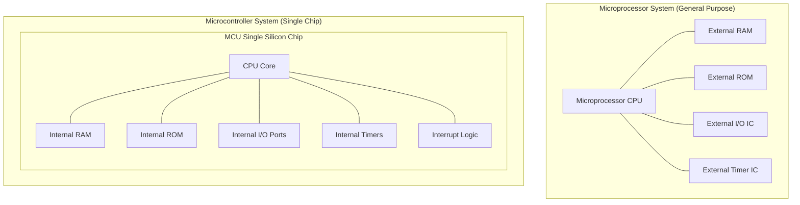

# 📘 Module 01: เจาะลึกสถาปัตยกรรมไมโครคอนโทรลเลอร์ (Lecture 1 Breakdown)

> **อ้างอิงเอกสารประกอบการสอน:** `Lecture1.pdf` (33 หน้า)  
> **ไฟล์สไลด์ในระบบ:** [lecture1_complete.md](file:///Users/3rapat/student/internship/CODEFIN/project/vahalla-wealth/private-docs/other-project/uni-work/embedded-system/1/lecture/lecture1-markdown/lecture1_complete.md)  
> **ภาพประกอบฮาร์ดแวร์:** ฝังรูปภาพจริงจากสไลด์ไว้ในเอกสารเรียบร้อยแล้ว

---

## 1. วิเคราะห์สาระสำคัญของ Lecture 1: อาจารย์กำลังสอนอะไร และเรียนไปทำไม?

ใน Lecture 1 อาจารย์ต้องการให้นิสิตปรับความคิด (Mindset) จากการเขียนโปรแกรมบน PC มาเป็นการเข้าใจ **"ระบบฝังตัว (Embedded System)"** ในมิติฮาร์ดแวร์จริง:
1. **ทำไมต้องเรียน?** เพื่อเข้าใจว่าระบบฝังตัวคือคอมพิวเตอร์ที่ถูกซ่อนอยู่ในอุปกรณ์ต่าง ๆ (เช่น เครื่องซักผ้า, รถยนต์, อุปกรณ์การแพทย์) ซึ่งทำงานเฉพาะทาง ภายใต้ข้อจำกัดของหน่วยความจำ, กำลังไฟฟ้า, และเวลาจริง
2. **ทำไมอาจารย์เลือกใช้ 8051?** แม้ 8051 จะเป็นสถาปัตยกรรม 8 บิตดั้งเดิม แต่เป็น **"สถาปัตยกรรมครู"** ที่มีองค์ประกอบสถาปัตยกรรมคอมพิวเตอร์ครบถ้วนที่สุด (CPU, RAM, ROM, I/O Ports, Timers, Serial Port, และ Interrupt Controller) บนชิปเดียว เมื่อเข้าใจ 8051 ถึงรากแก้วแล้ว จะต่อยอดไปยัง AVR (ATmega328P ใน Arduino), ARM Cortex-M, หรือ RISC-V ได้ทันที!

---

## 2. นิยามและคุณลักษณะของระบบฝังตัว (Embedded System Characteristics)

### 2.1 นิยามเชิงวิศวกรรม (Definition)
> *"An Embedded System is a combination of hardware and software designed to perform a specific dedicated task within a larger mechanical or electrical system, often under real-time constraints."*

ระบบฝังตัวคือการรวมกันระหว่าง **ซอฟต์แวร์ (Firmware)** และ **ฮาร์ดแวร์ (Hardware)** เพื่อทำงานเฉพาะเจาะจงตามกฎเกณฑ์ที่กำหนดไว้ล่วงหน้า (Set of Rules)

### 2.2 องค์ประกอบพื้นฐาน 3 ส่วนหลัก (Building Blocks)
อ้างอิงจากแผนภาพสไลด์หน้า 4 (`fig_004_slide_diagram.png`):


*รูปที่ 1.1: แผนภาพบล็อกองค์ประกอบระบบฝังตัวจากสไลด์ Lecture 1 หน้า 4*

```
+-----------------------------------------------------------------------+
|                       EMBEDDED SYSTEM ARCHITECTURE                    |
+-----------------------------------------------------------------------+
|  [INPUT UNITS]     -->  [CONTROLLER UNIT (MCU)]  -->  [OUTPUT UNITS]  |
|  - Sensors              - CPU (ALU + Control Unit)- LEDs              |
|  - Buttons / Switches   - ROM (Code Memory)       - LCD / Displays    |
|  - Touch Panels         - RAM (Runtime Data)      - Motors / Relays   |
|  - Bluetooth / IR       - Clock Generator         - Bluetooth / IR    |
+-----------------------------------------------------------------------+
|                          POWER SUPPLY UNIT                            |
+-----------------------------------------------------------------------+
```

### 2.3 คุณลักษณะเด่น 6 ประการ (Key Characteristics)
1. **Sophisticated Functionality (ฟังก์ชันการทำงานที่ซับซ้อน):** แม้ขนาดชิปจะเล็กแต่ต้องประมวลผลอัลกอริทึมลอจิกได้อย่างสมบูรณ์
2. **Real-time Operation (การทำงานแบบเวลาจริง):** การประมวลผลต้องเสร็จสิ้นภายในกรอบเวลาที่กำหนด (Deadline Constraint)
3. **Low Manufacturing Cost (ต้นทุนการผลิตต่ำ):** ราคาต่อชิปต้องถูกเพื่อรองรับการผลิตจำนวนมาก (Mass Production)
4. **Low Power Consumption (การประมวลผลกินไฟต่ำ):** เหมาะสำหรับอุปกรณ์พกพาหรือทำงานด้วยแบตเตอรี่
5. **Application-Dependent Processor:** ใช้หน่วยประมวลผลที่ออกแบบเฉพาะงาน ไม่ใช่ชิปทั่วไป
6. **Restricted Memory (หน่วยความจำจำกัด):** มี RAM เพียงหลักไบต์/กิโลไบต์ และ ROM หลักกิโลไบต์

---

## 3. เปรียบเทียบเชิงลึก: Microprocessor vs Microcontroller

นี่คือข้อสอบและคำถามยอดฮิตที่วิศวกรต้องตอบให้ได้ถ่องแท้!


*รูปที่ 1.2: ผังฮาร์ดแวร์เปรียบเทียบระหว่าง Microprocessor กับ Microcontroller (Single-Chip SoC)*



### ตารางเปรียบเทียบข้อแตกต่าง (Microprocessor vs Microcontroller)

| ประเด็นเปรียบเทียบ | Microprocessor (MPU) | Microcontroller (MCU) |
| :--- | :--- | :--- |
| **สถาปัตยกรรมภายใน** | มีเฉพาะส่วนประมวลผล **CPU (ALU, Registers, Control Unit)** โดดๆ | เป็นระบบคอมพิวเตอร์สมบูรณ์แบบบนชิปเดียว **(System on Chip - SoC)** รวม CPU, RAM, ROM, I/O, Timers, Interrupts |
| **อุปกรณ์ภายนอก** | ต้องต่อชิป RAM, ROM, I/O, Timer ภายนอกผ่านบัสบนแผ่น PCB | มีอุปกรณ์ต่อพ่วง (Peripherals) ครบถ้วนอยู่ภายในแผ่นเวเฟอร์ซิลิกอนเดียวกัน |
| **ความยืดหยุ่น (Flexibility)** | **สูงมาก** สามารถเพิ่มขยาย RAM/ROM หรืออัปเกรดการทำงานได้ตามต้องการ | **ต่ำกว่า/คงที่** ขนาด RAM/ROM และจำนวนพินถูกบล็อกมาจากโรงงาน |
| **ขนาดและต้นทุนวงจร** | แผงวงจรใหญ่ ซับซ้อน ต้นทุนรวมสูงขึ้นเพราะต้องใช้ชิปหลายตัว | ขนาดเล็กรวมอยู่ในชิปเดียว ต้นทุนวงจรโดยรวมถูกกว่ามาก |
| **อัตราการใช้พลังงาน** | กินไฟสูง (หลัก Watts ถึง tens of Watts) | กินไฟต่ำมาก (หลัก milliwatts ถึง microwatts) |
| **ลักษณะการนำไปใช้งาน** | งานคำนวณอรรถประโยชน์ทั่วไป (General Purpose) เช่น PC, Laptop, Server | งานควบคุมเฉพาะทาง (Specific Control Tasks) เช่น เครื่องซักผ้า, เมาส์, กล้องถ่ายรูป |

---

## 4. เปรียบเทียบสถาปัตยกรรมความจำ: Von Neumann vs Harvard Architecture

สไลด์หน้า 12-15 อธิบายสถาปัตยกรรมโครงสร้างบัสความจำ 2 รูปแบบที่เป็นรากฐานของคอมพิวเตอร์:


*รูปที่ 1.3: โครงสร้าง Von Neumann Architecture (ใช้บัสร่วมกันระหว่าง Instruction และ Data)*


*รูปที่ 1.4: โครงสร้าง Harvard Architecture (แยกบัสและแยกหน่วยความจำระหว่าง Code ROM และ Data RAM)*

### 1. Von Neumann Architecture (สถาปัตยกรรมฟอน นอยมันน์)
- **แนวคิด:** โค้ดโปรแกรม (Instruction) และ ข้อมูล (Data) อยู่ในพื้นที่หน่วยความจำเดียวกัน (Shared Memory Space)
- **โครงสร้างบัส:** ใช้บัสชุดเดียวกันทั้งการดึงคำสั่ง (Instruction Fetch) และการอ่าน/เขียนข้อมูล (Data Access)
- **ข้อเสียทางฮาร์ดแวร์:** **Von Neumann Bottleneck** — CPU ไม่สามารถดึงคำสั่งและอ่าน/เขียนข้อมูลพร้อมกันในสัญญาณนาฬิกาเดียวกันได้ ต้อง分 2 สเต็ป (2 Clock Cycles)
- **การ Pipelining:** ทำได้ยากหรือซับซ้อนมาก

### 2. Harvard Architecture (สถาปัตยกรรมฮาร์วาร์ด)
- **แนวคิด:** แยกหน่วยความจำสำหรับเก็บโค้ดโปรแกรม (Program ROM) และหน่วยความจำสำหรับเก็บข้อมูล (Data RAM) ออกจากกันเด็ดขาด!
- **โครงสร้างบัส:** มีบัสแยกชุดกันโดยสิ้นเชิง (Separate Address & Data Buses for Instruction and Data)
- **ข้อดีทางฮาร์ดแวร์:** CPU สามารถอ่านคำสั่งถัดไปจาก ROM ไปพร้อมๆ กับการเขียน/อ่านข้อมูลใน RAM ได้พร้อมกันภายใน **1 Clock Cycle**!
- **การ Pipelining:** ทำได้อย่างมีประสิทธิภาพสูงสุด  
- **8051 และ AVR/ARM ใช้สถาปัตยกรรมใด?** -> ใช้ **Harvard Architecture**!

---

## 5. เจาะลึกบล็อกสถาปัตยกรรมภายในของไมโครคอนโทรลเลอร์ 8051

อ้างอิงจากแผนภาพสไลด์หน้า 18 (`fig_018_media_1.jpeg`):


*รูปที่ 1.5: แผนภาพบล็อกฮาร์ดแวร์ภายในของ 8051 (แสดงตำแหน่ง External Interrupts & Interrupt Control Block)*

```
+---------------------------------------------------------------------------+
|                          8051 MICROCONTROLLER CHIP                        |
|                                                                           |
|   +-------------------+  +-------------------+  +---------------------+   |
|   | 4KB Program ROM   |  | 128 Bytes RAM     |  | Special Function    |   |
|   | (Code Memory)     |  | (Data Memory)     |  | Registers (SFRs)    |   |
|   +-------------------+  +-------------------+  +---------------------+   |
|                                                                           |
|   +-------------------+  +-------------------+  +---------------------+   |
|   | CPU Core (ALU+CU) |  | Oscillator Circuit|  | Interrupt Control   |   |
|   | Accumulator A & B |  | (12 MHz Crystal)  |  | (5 Interrupts+Reset)|   |
|   +-------------------+  +-------------------+  +---------------------+   |
|                                                                           |
|   +-------------------+  +-------------------+  +---------------------+   |
|   | Timer 0 / Timer 1 |  | Serial Port UART  |  | 4 x 8-Bit I/O Ports |   |
|   | (16-Bit Up-Timers)|  | (TxD / RxD)       |  | (P0, P1, P2, P3)    |   |
|   +-------------------+  +-------------------+  +---------------------+   |
+---------------------------------------------------------------------------+
```

### สรุปฟีเจอร์หลักทางฮาร์ดแวร์ของ 8051 (8051 Hardware Features List):
1. **CPU:** 8-Bit ALU ประมวลผลข้อมูลครั้งละ 8 บิต
2. **Frequency:** สัญญาณนาฬิกาฐาน 12 MHz (1 Machine Cycle = 12 Clock Cycles = $1 \text{ }\mu\text{s}$)
3. **Architecture:** Harvard Architecture (แยกโปรแกรมและข้อมูล)
4. **Internal ROM:** 4 KB สำหรับเก็บโค้ดโปรแกรม (ขยายภายนอกได้สูงสุด 64 KB)
5. **Internal RAM:** 128 Bytes สำหรับเก็บตัวแปร รันไทม์ และสแต็ก (ขยายภายนอกได้สูงสุด 64 KB)
6. **I/O Ports:** พอร์ตขนานขนาด 8 บิต จำนวน 4 พอร์ต (**P0, P1, P2, P3**) รวม 32 พิน
7. **Timers/Counters:** ไทม์เมอร์ขนาด 16 บิต จำนวน 2 ตัว (**Timer 0** และ **Timer 1**)
8. **Serial Port:** สื่อสารอนุกรม UART ขาเข้า/ขาออก (RxD, TxD)
9. **Interrupt System:** แหล่งขัดจังหวะ **5 แหล่ง (5 Interrupt Sources)** + 1 Reset พร้อมระดับความสำคัญ (Priority Levels)

---

## 💡 สรุปความเชื่อมโยงของโมดูล 01

สถาปัตยกรรม 8051 ที่อาจารย์สอนใน Lecture 1 คือรากฐานของไมโครคอนโทรลเลอร์ทุกรุ่น ชิปตัวนี้มี **Interrupt Controller** ฝังอยู่ภายในตัว เพื่อทำหน้าที่เป็น "ยามเฝ้าระวัง" คอยตรวจจับสัญญาณขัดจังหวะจาก 5 แหล่ง ซึ่งเราจะไปดูโครงสร้างพินฮาร์ดแวร์จริงในโมดูล 02 ถัดไป!
