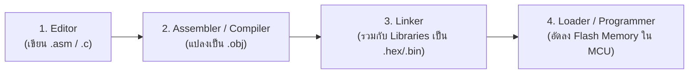

# 📘 Module 04: เจาะลึกเครื่องมือพัฒนา โหมดการอ้างแอดเดรส และคำสั่ง (Lecture 4 Breakdown)

> **อ้างอิงเอกสารประกอบการสอน:** `Lecture 4.pdf` (31 หน้า)  
> **ไฟล์สไลด์ในระบบ:** [lecture_4_complete.md](file:///Users/3rapat/student/internship/CODEFIN/project/vahalla-wealth/private-docs/other-project/uni-work/embedded-system/1/lecture/lecture4-markdown/lecture_4_complete.md)  
> **ภาพประกอบกระบวนการ:** ฝังรูปภาพจริงจากสไลด์ไว้ในเอกสารเรียบร้อยแล้ว

---

## 1. วิเคราะห์สาระสำคัญของ Lecture 4: อาจารย์กำลังสอนอะไร?

ใน Lecture 4 อาจารย์เปลี่ยนผ่านจากฝั่งฮาร์ดแวร์มาสู่ **"การพัฒนาซอฟต์แวร์ระบบฝังตัว (Embedded Software Development Cycle)"** และชุดคำสั่งภาษาแอสเซมบลี:
1. **กระบวนการแปลงโค้ด:** ซอร์สโค้ดภาษา C หรือ Assembly ที่เราเขียนขึ้น เดินทางผ่านวงจร Toolchain (Editor -> Assembler/Compiler -> Linker -> Loader) จนกลายเป็นไฟล์ Hex/Binary แฟลชลงชิปได้อย่างไร
2. **โหมดการอ้างแอดเดรส (Addressing Modes):** วิธีการระบุตัวแปรและข้อมูลในคำสั่งภาษาเครื่อง
3. **ความแตกต่างระหว่างฟังก์ชันทั่วไป (`RET`) กับฟังก์ชันขัดจังหวะ (`RETI`):** หัวใจสำคัญในการคืนสภาวะระบบกลับสู่โปรแกรมหลักหลังจบ ISR!

---

## 2. ห่วงซอฟต์แวร์และเครื่องมือการพัฒนา (System Development Toolchain)

สไลด์หน้า 2-4 อธิบายขั้นตอนการเปลี่ยนซอร์สโค้ดมนุษย์ไปเป็นโค้ดเครื่อง:


*รูปที่ 4.1: แผนผังกระบวนการแปลซอฟต์แวร์ระบบฝังตัว (Editor -> Compiler/Assembler -> Linker -> Executable File -> Loader)*



### รายละเอียดของเครื่องมือแต่ละชนิด:
1. **Editor (ตัวแก้ไขข้อความ):** โปรแกรมที่ใช้นั่งพิมพ์ซอร์สโค้ด เช่นไฟล์ `.asm` (Assembly) หรือ `.c` (C Language)
2. **Assembler (ตัวประกอบภาษา):** แปลงโค้ดภาษาแอสเซมบลี (`.asm`) ไปเป็นไฟล์ภาษาเครื่อง / ออบเจกต์ไฟล์ (`.obj`) พร้อมตรวจสอบไวยากรณ์ (Syntax Errors)
3. **Compiler (ตัวแปลภาษา):** แปลงภาษาระดับสูง เช่น C/C++ ไปเป็นภาษาเครื่องหรือไฟล์ `.obj` พร้อมแจ้ง Warnings/Errors
4. **Linker (ตัวเชื่อมโยง):** รวมไฟล์ `.obj` หลายๆ ไฟล์เข้าด้วยกัน และดึงฟังก์ชันไลบรารีมาตรฐาน (Libraries) มารวมจนได้ไฟล์ที่พร้อมรัน เช่น `.hex` หรือ `.bin`
5. **Loader / In-System Programmer (ตัวโหลด):** ฮาร์ดแวร์/ซอฟต์แวร์เครื่องโปรแกรม (เช่น USB programmer) ที่ทำหน้าที่ไรท์ไฟล์ Binary ลงใน Flash ROM ภายในตัวชิปไมโครคอนโทรลเลอร์

---

## 3. คำสั่งควบคุมตัวประกอบภาษา (Assembler Directives / Pseudo-Opcodes)

Assembler Directives **ไม่ใช่คำสั่งภาษาเครื่องที่ถูกรันโดย CPU** แต่เป็น "คำสั่งบอกทาง (Directions)" ให้กับโปรแกรม Assembler ขณะทำการคอมไพล์!

### Directive ที่สำคัญใน 8051:
1. **`ORG` (Origin):** กำหนดจุดเริ่มต้นแอดเดรสความจำใน ROM ที่จะวางโค้ดต่อไป  
   *ตัวอย่าง:* `ORG 0000H` (วางโค้ดไว้จุดเริ่มต้น Reset) หรือ `ORG 0003H` (วางโค้ด ณ ตำแหน่ง External Interrupt 0 Vector)
2. **`END` (End of Assembly):** สั่งสิ้นสุดไฟล์ซอร์สโค้ด ข้อความใดๆ หลังคำสั่ง `END` จะถูก Assembler ข้ามทั้งหมด
3. **`EQU` (Equate):** กำหนดค่าคงที่ให้กับป้ายชื่อ (Label) โดยไม่กินพื้นที่ RAM/ROM  
   *ตัวอย่าง:* `LED_PIN EQU P1.0` (เวลาเขียนโค้ดใช้คำว่า `LED_PIN` แทน `P1.0`)
4. **`DB` (Define Byte):** จองพื้นที่ความจำ ROM ขนาด 8 บิต (1 Byte) เพื่อเก็บข้อมูลคงที่ (เช่น ตาราง Lookup Table)  
   *ตัวอย่าง:*  
   ```assembly
   ORG 1000H
   MY_DATA: DB 25, 25H, 'A'   ; เก็บเลขฐานสิบ 25, เลขฐานสิบหก 25H, และตัวอักษร ASCII 'A'
   ```

---

## 4. โหมดการอ้างแอดเดรสทั้ง 5 รูปแบบ (5 Addressing Modes in 8051)

โหมดการอ้างแอดเดรสคือรูปแบบในการระบุข้อมูล (Operand) ในคำสั่ง:

```
+-----------------------------+-----------------------+---------------------------------------+
|  โหมดการอ้างแอดเดรส          | ไวยากรณ์ตัวอย่าง      |            คำอธิบายฮาร์ดแวร์          |
+-----------------------------+-----------------------+---------------------------------------+
| 1. Immediate Addressing     | MOV A, #15H           | ข้อมูลฝังอยู่ในคำสั่งโดยตรง (มีเครื่องหมาย #)|
| 2. Register Addressing      | MOV A, R2             | ข้อมูลอยู่ในรีจิสเตอร์ที่ระบุ (A, R0-R7)    |
| 3. Direct Addressing        | MOV A, 30H            | ระบุแอดเดรส RAM/SFR ตรงๆ เช่น 30H หรือ 80H|
| 4. Indirect Addressing      | MOV A, @R1            | ใช้ R0/R1 หรือ DPTR เป็นโพนเตอร์ชี้แอดเดรส|
| 5. Indexed Addressing       | MOVC A, @A+DPTR       | เข้าถึงตารางข้อมูลใน ROM โดยเอา A + DPTR |
+-----------------------------+-----------------------+---------------------------------------+
```

---

## 5. เปรียบเทียบเชิงลึก: คำสั่ง `RET` vs `RETI` (Subroutine vs Interrupt Return)

นี่คือหนึ่งในข้อสอบที่สำคัญที่สุดของ Lecture 4 และเป็นหัวใจของการคืนสภาวะระบบ!


*รูปที่ 4.2: การทำงานของคำสั่ง RET (Subroutine) และ RETI (Interrupt Routine) จากสไลด์ Lecture 4 หน้า 28*

```
      [ การทำงานของ RET (Normal Subroutine) ]       [ การทำงานของ RETI (Interrupt Subroutine) ]

       Main Program        Subroutine               Main Program           ISR Routine
      +------------+      +------------+           +------------+         +------------+
      | CALL Sub   |----> | Code...    |           | (Execution)| --INT-> | Code...    |
      |            |      |            |           |            |         |            |
      | Next Inst  | <--- | RET        |           | Next Inst  | <------ | RETI       |
      +------------+      +------------+           +------------+         +------------+
       - POP PCH (SP)                              - POP PCH (SP)
       - POP PCL (SP-1)                            - POP PCL (SP-1)
       - SP = SP - 2                               - SP = SP - 2
                                                   - **Hardware clears Interrupt-in-Service Flag!**
                                                   - **Re-enables lower/same priority interrupts!**
```

### 5.1 คำสั่ง `RET` (Return from Normal Subroutine)
- ใช้สำหรับจบการทำงานของฟังก์ชันย่อยทั่วไปที่เรียกด้วยคำสั่ง `LCALL` หรือ `ACALL`
- **ลำดับฮาร์ดแวร์เมื่อรัน `RET`:**
  1. `POP PCH` (ดึงแอดเดรสบิตสูงจาก RAM สแต็กกลับคืนสู่ Program Counter บิตสูง)
  2. `POP PCL` (ดึงแอดเดรสบิตต่ำจาก RAM สแต็กกลับคืนสู่ Program Counter บิตต่ำ)
  3. `SP = SP - 2` (ลดค่า Stack Pointer ลง 2 ตำแหน่ง)
  4. CPU กลับไปรันคำสั่งถัดไปในโปรแกรมหลักตามค่า `PC` ที่ได้คืนมา

---

### 5.2 คำสั่ง `RETI` (Return from Interrupt Service Routine) **[หัวใจของ Topic 41]**
- ใช้สำหรับ **จบการทำงานของฟังก์ชันขัดจังหวะ (ISR)** เท่านั้น!
- **ลำดับฮาร์ดแวร์เมื่อรัน `RETI`:**
  1. `POP PCH` (ดึงแอดเดรสบิตสูงจาก RAM สแต็กกลับคืนสู่ `PC_high`)
  2. `POP PCL` (ดึงแอดเดรสบิตต่ำจาก RAM สแต็กกลับคืนสู่ `PC_low`)
  3. `SP = SP - 2` (ลดค่า Stack Pointer ลง 2 ตำแหน่ง)
  4. **[ฟังก์ชันพิเศษเฉพาะ RETI]:** ฮาร์ดแวร์จะส่งสัญญาณล้างแฟล็กสถานะ **Interrupt-in-Service Flip-Flop** ภายในทันที เพื่อบอกชิปว่า "การขัดจังหวะนี้จบลงสมบูรณ์แล้ว" เพื่อเปิดทางให้ระบบรับสัญญาณ Interrupt ในระดับความสำคัญเดียวกันหรือต่ำกว่าในอนาคตได้อีกครั้ง!

> **คำเตือนทางวิศวกรรม:**  
> หากคุณใช้คำสั่ง `RET` แทน `RETI` ในฟังก์ชัน ISR... แม้ CPU จะสามารถกระโดดกลับมาโปรแกรมหลักได้ถูกต้อง **แต่วงจรฮาร์ดแวร์ภายในจะยังคงคิดว่ารัน ISR ค้างอยู่!** ผลคือระบบจะ "บล็อก" สัญญาณ Interrupt ช่องทางเดิมและช่องทางที่มี priority ต่ำกว่า ไม่ยอมให้เกิดขึ้นอีกเลยตลอดไป!

---

## 💡 สรุปความเชื่อมโยงของโมดูล 04

โมดูลนี้ทำให้เราเห็นกระบวนการซอฟต์แวร์ การระบุแอดเดรส และความแตกต่างสำคัญระหว่าง `RET` กับ `RETI` บัดนี้ เรามีองค์ความรู้ครบถ้วนตั้งแต่ระดับไฟฟ้ายันซอฟต์แวร์ พร้อมเข้าสู่ **Module 05: Interrupt Mechanism Masterclass** ซึ่งเป็นเนื้อหาหลักของ Topic 41!
