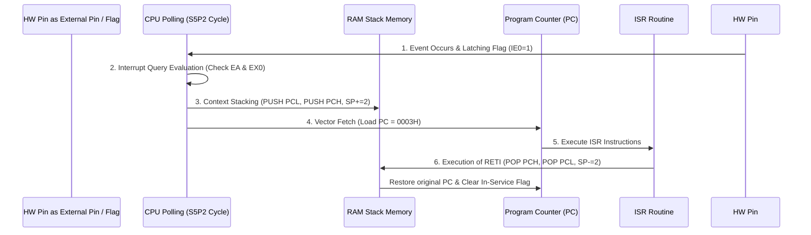

# 📕 Module 05: Masterclass เจาะลึกกลไกการขัดจังหวะ (Topic 41: Interrupt Mechanism)

> **หัวข้อประจำตัวนิสิต:** หัวข้อที่ 41 Interrupt Mechanism  
> **ไฟล์อ้างอิงนำเสนอหลัก:** [interrupt-mechanism-coursework.pdf](file:///Users/3rapat/student/internship/CODEFIN/project/vahalla-wealth/private-docs/other-project/uni-work/embedded-system/1/personal-presentation/version2/interrupt-mechanism-coursework.pdf) | [interrupt-mechanism-coursework-version2-professional.pptx](file:///Users/3rapat/student/internship/CODEFIN/project/vahalla-wealth/private-docs/other-project/uni-work/embedded-system/1/personal-presentation/version2/interrupt-mechanism-coursework-version2-professional.pptx)  
> **เอกสารอ้างอิงบทเรียน:** [TOPIC_LECTURE_MAPPING.md](file:///Users/3rapat/student/internship/CODEFIN/project/vahalla-wealth/private-docs/other-project/uni-work/embedded-system/1/personal-presentation/assignment/TOPIC_LECTURE_MAPPING.md), Lecture Series (1-4), ตำรา Mazidi 8051/AVR, ATmega328P Datasheet, ARM Cortex-M (Joseph Yiu / Jonathan Valvano)  
> **เป้าหมาย:** สร้างความเข้าใจระดับรากแก้วของกลไก Interrupt ทางฮาร์ดแวร์ ไทม์มิ่ง วงจรลอจิก และการเปรียบเทียบกับไมโครคอนโทรลเลอร์ยุคปัจจุบัน เพื่อให้นิสิตนำไปพูดนำเสนอและตอบคำถามอาจารย์ได้อย่างมั่นใจที่สุด

---

## 1. ทำไมระบบฝังตัวต้องมี "กลไกการขัดจังหวะ (Interrupt Mechanism)"?

### 1.1 ปัญหาของ Polling (การวนตรวจวัดสภาวะ)
หากไม่มีระบบขัดจังหวะ วิธีเดียวที่ CPU จะรับรู้เหตุการณ์จากโลกภายนอกได้คือการเขียนโปรแกรมวนลูปตรวจวัดสวิตช์หรือเซนเซอร์ซ้ำๆ เรียกว่า **Polling (การวนตรวจวัด)**

```assembly
; ตัวอย่างโค้ด Polling (CPU เสียเวลาวนลูปตรวจสวิตช์ตลอดเวลา)
CHECK_LOOP:
    JNB P3.2, CHECK_LOOP  ; วนถาม P3.2 ว่าเป็น 0 หรือยัง? ตราบใดที่เป็น 1 ให้วนถามต่อไปเรื่อยๆ
    CALL DO_SOMETHING     ; เมื่อกดปุ่มค่อยไปทำงาน
```

#### ข้อเสียร้ายแรงของ Polling:
1. **สูญเสียพลังงานประมวลผล (Wasted CPU Cycles):** CPU ต้องรันคำสั่งตรวจสอบสวิตช์นับล้านครั้งต่อวินาที โดยไม่ได้ทำประโยชน์อื่นเลย (CPU Utilization สูงโดยเปล่าประโยชน์)
2. **เกิดปัญหารอบการตอบสนองช้า (High Response Latency):** หาก CPU กำลังรันฟังก์ชันคำนวณซับซ้อนอยู่ แล้วเกิดเหตุการณ์ฉุกเฉินภายนอกขึ้น CPU จะไม่รับรู้จนกว่าจะคำนวณเสร็จแล้ววนกลับมาตรวจเช็กพิน!
3. **เสี่ยงพลาดเหตุการณ์ (Missed Events):** หากสัญญาณภายนอกเกิดขึ้นเพียงช่วงสั้นๆ (Pulse สั้น) ขณะที่ CPU กำลังทำอย่างอื่น สัญญาณนั้นจะสูญหายไปโดย CPU ไม่ทันสังเกตเห็น!

---

### 1.2 ทางออกอันทรงประสิทธิภาพ: Interrupt Mechanism (กลไกการขัดจังหวะ)
**Interrupt** คือกลไกระดับฮาร์ดแวร์ที่ยินยอมให้อุปกรณ์ภายนอกหรือหน่วยประมวลผลภายใน ส่งสัญญาณมา **"ขัดจังหวะ"** การทำงานของ CPU ได้ทันทีเมื่อเกิดเหตุการณ์สำคัญ (Asynchronous Event)


*รูปที่ 5.1: บล็อกฮาร์ดแวร์ควบคุมการขัดจังหวะ (Interrupt Control) ภายใน 8051*

CPU สามารถรันโปรแกรมหลัก (Main Program) ไปได้อย่างอิสระ เมื่อมีสัญญาณ Interrupt วิ่งเข้ามา ฮาร์ดแวร์จะกดปุ่ม **"Pause (หยุดชั่วคราว)"** โปรแกรมหลัก บันทึกตำแหน่งที่ทำค้างไว้ แล้วกระโดดไปรัน **Interrupt Service Routine (ISR)** ทันที เมื่อทำเสร็จจะกดปุ่ม **"Resume (ทำงานต่อ)"** กลับมาที่เดิมอย่างราบรื่น!

---

### 1.3 อุปมาอุปไมยเพื่อความเข้าใจง่าย (The Farmer & Chicken Analogy)
> *"เปรียบเสมือน **'เกษตรกรกำลังไถนา' (CPU รันโปรแกรมหลัก)**  
> - **ถ้าใช้ Polling:** เกษตรกรต้องหยุดไถนาทุกๆ 1 นาที แล้วเดินไปเปิดเล้าดูว่า **'แม่ไก่ออกไข่หรือยัง?'** ผลคือไถนาไม่เสร็จเสียที และเสียพลังงานฟรี  
> - **ถ้าใช้ Interrupt:** เกษตรกรไถนาไปเรื่อยๆ โดยติด **'กริ่งไร้สายไว้ที่เล้าไก่'** เมื่อแม่ไก่ออกไข่ กริ่งจะดังขึ้นทันที! เกษตรกรจึงค่อยเดินไปเก็บไข่ (รัน ISR) เมื่อเก็บเสร็จก็เดินกลับมาไถนาต่อที่จุดเดิมได้อย่างมีประสิทธิภาพสูงสุด!"*

---

## 2. ตารางเวกเตอร์และแหล่งขัดจังหวะ 8051 (8051 Interrupt Vector Table Map)


*รูปที่ 5.2: พินฮาร์ดแวร์ Pin 12 (P3.2/\INT0) และ Pin 13 (P3.3/\INT1) สำหรับรับสัญญาณขัดจังหวะภายนอก*

เมื่อเกิด Interrupt ขึ้น ฮาร์ดแวร์ของ 8051 จะบังคับให้ Program Counter (`PC`) กระโดดไปยังแอดเดรสเฉพาะใน ROM เรียกว่า **Vector Address (ตารางเวกเตอร์)**:

```
Address Map in ROM (0000H - 0030H):
+-----------------+-----------------------------------+--------------------+----------------------+
| Vector Address  | Interrupt Source (แหล่งการขัดจังหวะ)| Flag Bit Name      | Hardware Pin / Source|
+-----------------+-----------------------------------+--------------------+----------------------+
|     0000H       | System Reset (รีเซ็ตระบบ)          | RST Pin            | Pin 9                |
|     0003H       | External Interrupt 0 (\INT0)      | IE0 (in TCON)      | Pin 12 (P3.2)        |
|     000BH       | Timer 0 Overflow Interrupt (TF0)  | TF0 (in TCON)      | Timer 0 Register     |
|     0013H       | External Interrupt 1 (\INT1)      | IE1 (in TCON)      | Pin 13 (P3.3)        |
|     001BH       | Timer 1 Overflow Interrupt (TF1)  | TF1 (in TCON)      | Timer 1 Register     |
|     0023H       | Serial Port Interrupt (RI / TI)   | RI (Rx) / TI (Tx)  | UART Hardware        |
+-----------------+-----------------------------------+--------------------+----------------------+
```

> **ข้อสังเกตโครงสร้าง Vector Table:**  
> แอดเดรสของแต่ละ Interrupt อยู่ห่างกันเพียง **8 ไบต์** (เช่น `0003H` ไป `000BH`) ดังนั้นเราจึงไม่สามารถเขียนโปรแกรม ISR ยาวๆ ไว้ที่ตำแหน่ง Vector Address โดยตรงได้!  
> **แนวทางปฏิบัติของวิศวกร:** ใส่คำสั่งกระโดดระยะยาว `LJMP` ไว้ที่ Vector Address เพื่อกระโดดไปรันโค้ด ISR จริงในตำแหน่ง ROM ที่ว่างอยู่!

```assembly
; ตัวอย่างโครงสร้างการจัดวางตาราง Vector Table ใน Assembly
    ORG 0000H
    LJMP MAIN_PROG        ; กระโดดหลบ Vector Table ไปโปรแกรมหลัก

    ORG 0003H             ; Vector Address ของ External Interrupt 0
    LJMP ISR_EXT0         ; กระโดดไปรัน ISR ของ External Interrupt 0

    ORG 0030H
MAIN_PROG:
    ; โค้ดโปรแกรมหลัก...
    SETB EA               ; เปิดสวิตช์รวม Interrupt
    SETB EX0              ; เปิดรับ External Interrupt 0
    SETB IT0              ; ตั้งเป็น Falling-Edge Triggered
HERE: SJMP HERE           ; วนลูปทำงานหลัก

ISR_EXT0:
    ; โค้ดบริการการขัดจังหวะ (ISR)...
    CPL P1.0              ; สลับสภาวะไฟ LED ที่ P1.0
    RETI                  ; กลับสู่โปรแกรมหลัก
```

---

## 3. ลำดับขั้นตอนการทำงานของฮาร์ดแวร์ 6 ขั้นตอน (6-Phase Hardware Execution Sequence)


*รูปที่ 5.3: ตำแหน่งรีจิสเตอร์ SFRs ควบคุม Interrupt (IE ที่ A8H, IP ที่ B8H, TCON ที่ 88H)*

เมื่อมีสัญญาณขัดจังหวะเกิดขึ้น ชิป 8051 จะดำเนินกลไกฮาร์ดแวร์ภายใน **6 ขั้นตอน** ดังนี้:



### 1. Phase 1: Event Occurrence & Flag Latching (สัญญาณเข้าและการลักช์แฟล็ก)
- สัญญาณภายนอกกดปุ่มที่พิน `P3.2 (\INT0)` แรงดันตกลงเป็น 0V
- หากตั้ง `IT0 = 1` (Falling-Edge) วงจรตรวจจับขอบขาลงจะสั่งให้แฟล็ก `IE0` ในรีจิสเตอร์ `TCON` เปลี่ยนสภาวะเป็น **`1`** ทันที

### 2. Phase 2: Polling / Sampling Phase (การสุ่มตรวจสภาวะฮาร์ดแวร์)
- ในทุกๆ สัญญาณนาฬิการอบเครื่อง (Machine Cycle) ฮาร์ดแวร์ 8051 จะสุ่มตรวจแฟล็ก Interrupt ณ จังหวะ **State 5 Phase 2 (S5P2)**
- หากพบแฟล็ก `IE0 = 1` ฮาร์ดแวร์จะนำไปประเมินเงื่อนไขผ่าน AND Gate: **`EA == 1` AND `EX0 == 1`**
- หากผ่านเงื่อนไข และไม่มี Interrupt ที่มี Priority สูงกว่าทำงานอยู่ ฮาร์ดแวร์จะส่งสัญญาณตอบรับ (Acknowledge Interrupt)

### 3. Phase 3: Context Save / Stacking Phase (การบันทึกตำแหน่งเดิมลงสแต็ก)
- ฮาร์ดแวร์ภายในจะยับยั้งการดึงคำสั่งถัดไป และทำการจำลองคำสั่ง `LCALL` โดยอัตโนมัติ:
  1. เพิ่มค่า `SP` ขึ้น 1 (`SP = SP + 1`) และนำค่า `Program Counter` บิตต่ำ (`PCL`) ไป PUSH ลงสแต็ก
  2. เพิ่มค่า `SP` ขึ้นอีก 1 (`SP = SP + 1`) และนำค่า `Program Counter` บิตสูง (`PCH`) ไป PUSH ลงสแต็ก

### 4. Phase 4: Vector Address Fetch Phase (การโหลดแอดเดรสเป้าหมาย)
- ฮาร์ดแวร์จะสั่งเขียนค่าเวกเตอร์แอดเดรสประจำช่องลงใน `Program Counter`  
  (ตัวอย่าง: ช่อง External Interrupt 0 จะโหลดค่า **`PC = 0003H`**)
- **การล้างแฟล็กอัตโนมัติ:** สำหรับ External Interrupt แบบ Falling-Edge (`IT0 = 1`) และ Timer Interrupt ฮาร์ดแวร์จะทำ **Auto-Clear ล้างแฟล็ก `IE0` หรือ `TF0` กลับเป็น 0** ให้โดยอัตโนมัติ!

### 5. Phase 5: ISR Execution Phase (การประมวลผลฟังก์ชัน ISR)
- CPU เริ่มดึงคำสั่งและประมวลผลโค้ดภายในฟังก์ชัน ISR ณ ตำแหน่งเวกเตอร์แอดเดรส
- **ข้อควรระวัง:** หากฟังก์ชัน ISR มีการแก้ไขค่าใน Accumulator `A` หรือ `PSW` ผู้เขียนโปรแกรมต้องสั่ง `PUSH ACC` และ `PUSH PSW` ไว้ที่หัวฟังก์ชัน ISR เพื่อป้องกันไม่ให้ข้อมูลในโปรแกรมหลักเสียหาย!

### 6. Phase 6: Return and Context Restore Phase (การคืนสภาวะด้วย RETI)

*รูปที่ 5.4: การทำงานของคำสั่ง RETI ในการคืนค่า PC และล้างสภาวะ Interrupt In-Service Flag*

- เมื่อรันมาถึงคำสั่งสุดท้ายของ ISR คือ **`RETI`**:
  1. ดึงค่า `PCH` จากสแต็กคืนสู่ `PC` และลด `SP` ลง 1
  2. ดึงค่า `PCL` จากสแต็กคืนสู่ `PC` และลด `SP` ลง 1
  3. ฮาร์ดแวร์ทำ **Internal In-Service Flip-Flop Clear** เพื่อเปิดรับ Interrupt ลำดับถัดไป
  4. CPU กลับมาทำคำสั่งถัดไปในโปรแกรมหลักได้อย่างถูกต้องสมบูรณ์!

---

## 4. กลไกการจัดลำดับความสำคัญและการแทรกซ้อน (Priority Resolution & Nesting)

8051 มีระดับความสำคัญ (Priority Levels) ของ Interrupt ทั้งหมด **2 ระดับ**:
1. **High Priority (ระดับความสำคัญสูง)**
2. **Low Priority (ระดับความสำคัญต่ำ)**

### 4.1 กฎการขัดจังหวะซ้อนขัดจังหวะ (Interrupt Nesting Rules)
1. **Low Priority ISR กำลังรันอยู่:** สามารถถูกขัดจังหวะแทรกแซงโดย **High Priority Interrupt** ได้ทันที (Preemption)
2. **High Priority ISR กำลังรันอยู่:** **ไม่มีสิทธิ์** ถูกขัดจังหวะโดยสัญญาณใดๆ อีกเลย จนกว่าจะรันจบคำสั่ง `RETI`
3. **เกิด Interrupt สองตัวพร้อมกัน:** หากเกิด Interrupt ขึ้นพร้อมกันในสัญญาณนาฬิกาเดียวกัน CPU จะตัดสินด้วย **Natural Priority Sequence (ลำดับฮาร์ดแวร์ดั้งเดิม)** ตามตาราง:

```
Natural Priority Sequence (เมื่อ Priority ระดับเดียวกันเรียกร้องพร้อมกัน):
1. External Interrupt 0 (\INT0)  -- สูงสุด
2. Timer 0 Overflow (TF0)
3. External Interrupt 1 (\INT1)
4. Timer 1 Overflow (TF1)
5. Serial Port (RI / TI)        -- ต่ำสุด
```

---

## 5. การเปรียบเทียบสถาปัตยกรรม Interrupt ระหว่าง 8051, AVR, และ ARM Cortex-M

เพื่อให้ได้คะแนนเต็มและแสดงความเป็นนิสิตวิศวกรรมคอมพิวเตอร์ระดับสูง ให้เปรียบเทียบกลไก Interrupt กับชิปยุคใหม่:

```
+--------------------------+-----------------------+-----------------------+---------------------------------------+
| คุณสมบัติทางฮาร์ดแวร์      | Intel 8051            | AVR ATmega328P        | ARM Cortex-M (NVIC)                   |
+--------------------------+-----------------------+-----------------------+---------------------------------------+
| **ตัวควบคุม Interrupt**  | Basic Interrupt Logic | AVR Interrupt Controller| **NVIC (Nested Vectored Interrupt)**  |
| **จำนวนระดับ Priority**  | 2 ระดับ (High / Low)  | 1 ระดับ (Fixed Vector)| **ขึ้นกับชิป (สูงสุด 256 ระดับ)**      |
| **การ Stacking ข้อมูล**   | PUSH เฉพาะ PC (2 ไบต์) | PUSH เฉพาะ PC (2 ไบต์) | **Hardware Auto-Stacking 8 Registers**|
|                          | (ต้อง PUSH A/PSW เอง)  | (ต้อง PUSH SREG เอง)   | (R0-R3, R12, LR, PC, xPSR)            |
| **เทคโนโลยีลด Latency**  | ไม่มี                  | ไม่มี                  | **Tail-Chaining & Late-Arriving**     |
+--------------------------+-----------------------+-----------------------+---------------------------------------+
```

### ฟีเจอร์ระดับสูงใน ARM Cortex-M NVIC (เพื่อใช้พูดโชว์ในสไลด์):
- **Hardware Auto-Stacking:** เมื่อเกิด Interrupt ฮาร์ดแวร์ของ ARM จะช่วย PUSH รีจิสเตอร์ 8 ตัวลงสแต็กให้อัตโนมัติโดยโปรแกรมเมอร์ไม่ต้องสั่ง!
- **Tail-Chaining:** เมื่อรัน ISR ตัวแรกเสร็จ แล้วมี Interrupt ตัวที่สองรออยู่ ARM จะไม่ทำ POP/PUSH สแต็กกลับไปกลับมา แต่จะสลับไปรัน ISR ตัวที่สองทันที ทำให้เสียเวลาเปลี่ยนผ่านเพียง **6 Clock Cycles** เท่านั้น!

---

## 💡 สรุปความเชื่อมโยงของ Topic 41

คุณได้เรียนรู้กลไกการขัดจังหวะตั้งแต่รากฐานเหตุผล ปัญหาของ Polling ผัง Vector Table ลำดับฮาร์ดแวร์ 6 ขั้นตอน การคืนสภาวะด้วย `RETI` ไปจนถึงการแทรกซ้อน (Nesting) และการเปรียบเทียบเชิงสถาปัตยกรรม พร้อมสำหรับการเตรียมบทพูดและตอบคำถามอาจารย์ใน Module 06 แล้ว!
