```mermaid
gantt
    title 2-Minute Presentation Timeline Budget
    dateFormat  ss
    axisFormat %S sec
    Slide 1 (Intro & Analogy)       :00, 35s
    Slide 2 (Hardware Architecture)  :35, 35s
    Slide 3 (6-Phase Execution Flow) :70, 45s
    Slide 4 (RETI & Modern Arch)    :115, 25s
```

# 📕 Module 06: คู่มือนำเสนอและการตอบคำถามอาจารย์ผู้สอน (Presentation & Defense Guide)

> **ผู้เรียน:** นายธีรภัทร ภู่ระย้า (รหัสนิสิต 66362416 | กลุ่ม 1 ลำดับที่ 4)  
> **หัวข้อประจำตัว:** หัวข้อที่ 41 Interrupt Mechanism  
> **ไฟล์อ้างอิงนำเสนอหลัก:** [interrupt-mechanism-coursework.pdf](file:///Users/3rapat/student/internship/CODEFIN/project/vahalla-wealth/private-docs/other-project/uni-work/embedded-system/1/personal-presentation/version2/interrupt-mechanism-coursework.pdf) | [interrupt-mechanism-coursework-version2-professional.pptx](file:///Users/3rapat/student/internship/CODEFIN/project/vahalla-wealth/private-docs/other-project/uni-work/embedded-system/1/personal-presentation/version2/interrupt-mechanism-coursework-version2-professional.pptx)

---

## 1. ยุทธศาสตร์การนำเสนอ 2 นาทีให้ได้คะแนนเต็ม (2-Minute Presentation Strategy)

ในการนำเสนอระดับมหาวิทยาลัย โดยเฉพาะวิชาการทางวิศวกรรมที่มีเวลาจำกัดเพียง 2 นาที:
1. **ห้ามอ่านสไลด์ตามตัวอักษร:** สไลด์ต้องมีเฉพาะ **วลีสั้น คำสำคัญ (Keywords) และรูปภาพแผนภาพ** เท่านั้น
2. **ใช้อุปมาอุปไมยเปรียบเทียบ (Analogy):** เพื่อให้กรรมการและผู้ฟังเข้าใจความแตกต่างระหว่าง Polling และ Interrupt ได้ทันทีภายใน 15 วินาทีแรก
3. **แสดงความรู้เชิงลึกทางฮาร์ดแวร์:** พูดถึงขั้นตอนการทำงานของฮาร์ดแวร์ รีจิสเตอร์ และสัญญาณนาฬิกา เพื่อแสดงว่า "เข้าใจจริง ไม่มั่ว ไม่ท่องบท"

---

## 2. โครงสร้างสไลด์และบทบรรยายทีละสไลด์ (Slide-by-Slide Script & Time Budget)

```
[เป้าหมายเวลาการบรรยายรวม: 2 นาที 20 วินาที (อยู่ในช่วง 2.00 - 2.59 นาทีอย่างสมบูรณ์แบบ)]
```



---

### 📄 Slide 1: บทนำ ความหมาย และอุปมาอุปไมย (0:00 - 0:35 นาที | เวลา 35 วินาที)

**องค์ประกอบสไลด์ 1:**
- **หัวข้อ:** หัวข้อที่ 41 Interrupt Mechanism (กลไกการขัดจังหวะในระบบฝังตัว)
- **ภาพประกอบ:** แผนภาพเปรียบเทียบ Polling vs Interrupt (ภาพเกษตรกรกับเล้าไก่)
- **Keywords:** Real-Time Response, Polling Wasted Cycles, Asynchronous Hardware Trigger

**บทบรรยาย (สคริปต์พูด):**
> *"เรียนอาจารย์และสวัสดีเพื่อนๆ นิสิตทุกคนครับ ผม ธีรภัทร ภู่ระย้า วันนี้จะมานำเสนอหัวข้อที่ 41 **Interrupt Mechanism** ครับ*
> 
> *ในระบบฝังตัว หากเราใช้วิธี **Polling** หรือการวนตรวจวัดสวิตช์ CPU จะต้องเสียเวลาคำนวณนับล้านรอบโดยเปล่าประโยชน์ เปรียบเหมือน **'เกษตรกรไถนาที่ต้องเดินไปเปิดดูเล้าไก่ทุกๆ 1 นาทีว่าไก่ออกไข่หรือยัง'** ทำให้เสียเวลาและไถนาไม่เสร็จ*
> 
> *แต่กลไก **Interrupt** คือการติด **'กริ่งไร้สายไว้ที่เล้าไก่'** เมื่อมีเหตุการณ์เกิดขึ้น สัญญาณขัดจังหวะจะแจ้งเตือน CPU ทันที เพื่อให้หยุดงานหลักชั่วคราว แล้วไปจัดการเหตุการณ์นั้นได้อย่างทันท่วงทีและประหยัดพลังงานที่สุดครับ"*

---

### 📄 Slide 2: โครงสร้างพินฮาร์ดแวร์และตารางเวกเตอร์ (0:35 - 1:10 นาที | เวลา 35 วินาที)

**องค์ประกอบสไลด์ 2:**
- **หัวข้อ:** ฮาร์ดแวร์ควบคุมและตาราง Vector Table (8051 Interrupt Architecture)
- **ภาพประกอบ:** 8051 40-Pin DIP (`Pin 12 \INT0`, `Pin 13 \INT1`) และผังรีจิสเตอร์ `IE` / `IP`
- **Keywords:** Vector Table (0003H, 0013H), Bit-Addressable SFRs (`IE.7 EA`, `IE.0 EX0`), Edge vs Level Trigger

**บทบรรยาย (สคริปต์พูด):**
> *"ในระดับสถาปัตยกรรมฮาร์ดแวร์ของ 8051 สัญญาณขัดจังหวะภายนอกจะวิ่งเข้าทาง **Pin 12 (\INT0)** และ **Pin 13 (\INT1)** โดยมีรีจิสเตอร์ **IE (Interrupt Enable)** ทำหน้าที่เป็นสวิตช์ควบคุมหลัก ซึ่งสัญญาณจะผ่านไปได้ก็ต่อเมื่อบิต **EA (Global Enable)** และบิตประจำช่องเป็น 1 ทั้งคู่*
> 
> *เมื่อสัญญาณผ่านเข้ามา ฮาร์ดแวร์จะบังคับให้ Program Counter กระโดดไปยังแอดเดรสเฉพาะใน ROM ที่เรียกว่า **Vector Address** เช่น `0003H` สำหรับ External Interrupt 0 และ `0013H` สำหรับ External Interrupt 1 ครับ"*

---

### 📄 Slide 3: กลไกการทำงาน 6 ขั้นตอนเชิงฮาร์ดแวร์ (1:10 - 1:55 นาที | เวลา 45 วินาที)

**องค์ประกอบสไลด์ 3:**
- **หัวข้อ:** ลำดับฮาร์ดแวร์ 6 ขั้นตอนในการขัดจังหวะ (6-Phase Hardware Execution Sequence)
- **ภาพประกอบ:** แผนภาพสแต็ก (Stacking `PUSH PC`) และลำดับเวลา (Timing Sequence)
- **Keywords:** S5P2 Machine Cycle Sampling, Automatic Stacking (`PUSH PC`), ISR Jump, Clear Flag

**บทบรรยาย (สคริปต์พูด):**
> *"กลไกการทำงานภายในฮาร์ดแวร์แบ่งเป็น 6 ขั้นตอนหลักคือ:*
> 1. *เกิดเหตุการณ์และลักช์สัญญาณลงแฟล็ก `IE0`*
> 2. *CPU สุ่มตรวจสัญญาณทุกจังหวะ S5P2 ของ Machine Cycle*
> 3. *ฮาร์ดแวร์ทำ **Stacking** โดย PUSH ค่า Program Counter ปัจจุบันลง RAM สแต็กอัตโนมัติ*
> 4. *ดึงค่า Vector Address โหลดใส่ PC*
> 5. *ประมวลผลคำสั่งในฟังก์ชัน ISR*
> 6. *และเมื่อรันเสร็จสิ้น จะรันคำสั่ง `RETI` เพื่อดึงค่า PC กลับคืนจากสแต็ก และล้างสภาวะ In-Service Flag ทำให้ CPU กลับมาทำงานที่โปรแกรมหลักได้อย่างถูกต้องครับ"*

---

### 📄 Slide 4: คำสั่ง `RETI` และการเปรียบเทียบสถาปัตยกรรมยุคใหม่ (1:55 - 2:20 นาที | เวลา 25 วินาที)

**องค์ประกอบสไลด์ 4:**
- **หัวข้อ:** ความสำคัญของ `RETI` และวิวัฒนาการสถาปัตยกรรม (RETI vs RET & ARM NVIC)
- **ภาพประกอบ:** ตารางเปรียบเทียบ 8051 vs AVR vs ARM Cortex-M NVIC (Tail-Chaining)
- **Keywords:** `RETI` Clears In-Service Flip-Flop, Priority Nesting, ARM NVIC Tail-Chaining

**บทบรรยาย (สคริปต์พูด):**
> *"จุดสำคัญทางวิศวกรรมคือคำสั่ง **`RETI`** แตกต่างจากคำสั่ง `RET` ปกติ เพราะนอกจากคืนค่า PC แล้ว `RETI` จะทำการล้างสภาวะฮาร์ดแวร์ภายในเพื่อเปิดรับ Interrupt ถัดไป*
> 
> *ซึ่งในไมโครคอนโทรลเลอร์ยุคใหม่อย่าง **ARM Cortex-M** ได้พัฒนาชิป **NVIC** ให้มีเทคโนโลยี **Tail-Chaining** ที่ข้ามขั้นตอนการ Pop/Push สแต็กเมื่อมี Interrupt ต่อเนื่อง ช่วยลด Latency เหลือเพียง 6 Clock Cycles เท่านั้นครับ ขอจบการนำเสนอครับ ขอบคุณครับ"*

---

## 3. คลังคำถาม-คำตอบ สำหรับรับมืออาจารย์ผู้สอน (Q&A Defense Cheat Sheet)

เตรียมพร้อมตอบคำถามหยั่งเชิงจากอาจารย์ด้วยคำตอบทางวิศวกรรมที่แม่นยำ:

### ❓ คำถามที่ 1: "ถ้าเขียนโปรแกรม ISR แล้วเผลอใช้คำสั่ง `RET` แทน `RETI` จะเกิดอะไรขึ้นกับฮาร์ดแวร์?"
- **คำตอบเชิงลึก:**  
  *"ถ้าใช้ `RET` แทน `RETI` ค่า Program Counter จะถูก POP กลับมาจากสแต็กและ CPU สามารถกระโดดกลับมารันโปรแกรมหลักได้ตามปกติครับ **แต่ฮาร์ดแวร์ภายในจะยังคงคิดว่ารัน ISR ค้างอยู่** เพราะวงจร Interrupt-in-Service Flip-Flop ไม่ถูกล้างค่า!  
  ผลคือ ชิปจะทำการ **'บล็อก'** สัญญาณ Interrupt ในระดับความสำคัญเดียวกันและระดับที่ต่ำกว่าทั้งหมด ไม่ยอมให้เกิดการขัดจังหวะขึ้นอีกเลยตลอดการทำงานครับ!"*

---

### ❓ คำถามที่ 2: "ความแตกต่างระหว่าง Level-Triggered กับ Edge-Triggered ใน External Interrupt คืออะไร และส่งผลต่อฮาร์ดแวร์อย่างไร?"
- **คำตอบเชิงลึก:**  
  *"แตกต่างกันที่เงื่อนไขการตั้งค่าบิต `IT0` ในรีจิสเตอร์ `TCON` ครับ:  
  - **Level-Triggered (`IT0 = 0`):** ตรวจจับระดับแรงดัน LOW (0V) ตราบใดที่พินถูกกดค้างไว้ที่ 0V ฮาร์ดแวร์จะส่ง Interrupt ซ้ำเรื่อยๆ และ**ฮาร์ดแวร์จะไม่ล้างแฟล็กให้** อุปกรณ์ภายนอกต้องปลดแรงดันออกเองก่อนจบ ISR  
  - **Edge-Triggered (`IT0 = 1`):** ตรวจจับจังหวะขอบขาลง (Falling Edge) จาก 5V ตกลงมา 0V เพียงเสี้ยววินาที ฮาร์ดแวร์จะลักช์ค่าเข้าแฟล็ก `IE0 = 1` และเมื่อ CPU กระโดดเข้า Vector Address **ฮาร์ดแวร์จะทำการ Auto-Clear ล้างแฟล็ก `IE0` กลับเป็น 0 ให้เองโดยอัตโนมัติ**ครับ!"*

---

### ❓ คำถามที่ 3: "ทำไมฮาร์ดแวร์ 8051 ถึงสุ่มตรวจสัญญาณ Interrupt ณ จังหวะ S5P2 ของ Machine Cycle?"
- **คำตอบเชิงลึก:**  
  *"เพราะสถาปัตยกรรม 8051 แบ่ง 1 Machine Cycle ออกเป็น 6 States (S1-S6) แต่ละ State มี 2 Phases (P1-P2) ครับ  
  จังหวะ **S5P2 (State 5 Phase 2)** เป็นช่วงเวลาที่ CPU ประมวลผลคำสั่งปัจจุบันเสร็จสิ้นและพร้อมที่จะตัดสินใจว่า คำสั่งใน Machine Cycle ถัดไปจะไปทำคำสั่งในโปรแกรมหลักต่อ หรือจะเปลี่ยนทิศทางไปทำกระบวนการ Stacking เพื่อกระโดดไป ISR ครับ"*

---

### ❓ คำถามที่ 4: "ถ้ามี Interrupt สองตัวที่เป็น High Priority เกิดขึ้นพร้อมกัน ฮาร์ดแวร์จะตัดสินใจอย่างไร?"
- **คำตอบเชิงลึก:**  
  *"ฮาร์ดแวร์จะใช้ **Natural Priority Sequence (ลำดับสิทธิฮาร์ดแวร์ดั้งเดิม)** ในการตัดสินครับ โดยเรียงลำดับจาก External Interrupt 0 -> Timer 0 -> External Interrupt 1 -> Timer 1 -> Serial Port ดังนั้น External Interrupt 0 จะได้รับการประมวลผลก่อนครับ!"*

---

## 💡 สรุปความพร้อมของนิสิต

เมื่ออ่านชุดเอกสารครบทั้ง 6 โมดูล ตั้งแต่ [00_FOUNDATION_PREREQUISITES.md](file:///Users/3rapat/student/internship/CODEFIN/project/vahalla-wealth/private-docs/other-project/uni-work/embedded-system/1/learning-from-zero/00_FOUNDATION_PREREQUISITES.md) จนถึงโมดูลนี้ คุณจะมีความเข้าใจเชิงลึกในสถาปัตยกรรมระบบฝังตัวและกลไกขัดจังหวะอย่างถ่องแท้ พร้อมสำหรับการนำเสนอและตอบคำถามอาจารย์ได้อย่างมั่นใจ 100%!
