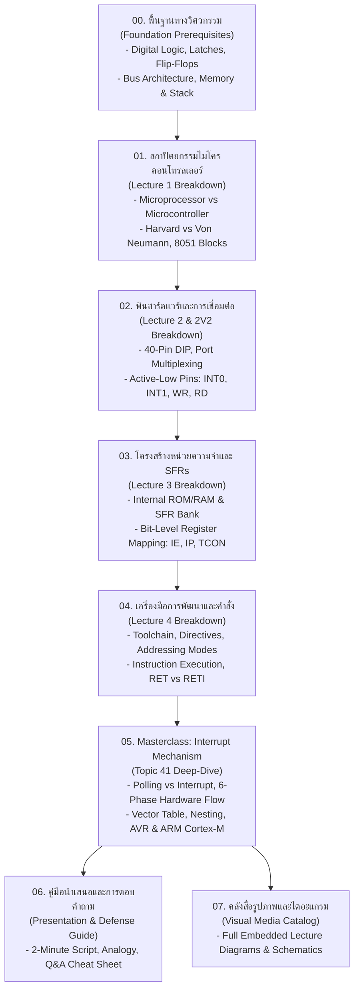

# 📚 หลักสูตรการเรียนรู้ Embedded Systems & Interrupt Mechanism จากศูนย์ถึงระดับผู้เชี่ยวชาญ (Zero to Master)

> **รายวิชา:** 305341 ระบบฝังตัว 1 (Embedded System 1) — สาขาวิชาวิศวกรรมคอมพิวเตอร์ คณะวิศวกรรมศาสตร์ มหาวิทยาลัยนเรศวร  
> **ผู้เรียน:** นายธีรภัทร ภู่ระย้า (รหัสนิสิต 66362416 | กลุ่ม 1 ลำดับที่ 4)  
> **หัวข้อประจำตัว:** หัวข้อที่ 41 Interrupt Mechanism  
> **ที่ตั้งเอกสาร:** `learning-from-zero/`

---

## 🎯 ปรัชญาและวัตถุประสงค์ของหลักสูตร

คลังเอกสารชุดนี้จัดทำขึ้นเพื่อให้นิสิตวิศวกรรมคอมพิวเตอร์สามารถ **"เข้าใจรากลึก"** ของศาสตร์ระบบฝังตัว (Embedded Systems) โดยเริ่มตั้งแต่ศูนย์ ไม่จำเป็นต้องท่องจำ แต่สามารถมองเห็นภาพการไหลของสัญญาณไฟฟ้า (Electrical Signals), การทำงานของลอจิกเกต (Logic Gates), การเปลี่ยนสภาวะของรีจิสเตอร์ (Registers), การทำงานของบัส (System Bus) ไปจนถึงคำสั่งภาษาแอสเซมบลี (Assembly Language) และสถาปัตยกรรมระดับไมโคร (Microarchitecture)

เป้าหมายสูงสุดคือการสร้างความเข้าใจอย่างถ่องแท้ เพื่อให้นำไปถ่ายทอดใน **การนำเสนอสไลด์ 2 นาที (Topic 41: Interrupt Mechanism)** ได้อย่างรู้จริง ตอบคำถามอาจารย์ผู้สอนได้ทุกแง่มุม และก้าวสู่การเป็นวิศวกรคอมพิวเตอร์ที่ออกแบบระบบฝังตัวได้อย่างมืออาชีพ

---

## 🗺️ แผนที่การเรียนรู้ 24 ชั่วโมง (24-Hour Learning Roadmap)

---

## 📖 สารบัญโมดูลเอกสารการเรียนรู้ (Module Directory)

| โมดูล | ชื่อไฟล์เอกสาร | หัวข้อหลักและขอบเนื้อหา |
| :--- | :--- | :--- |
| **Module 00** | [00_FOUNDATION_PREREQUISITES.md](file:///Users/3rapat/student/internship/CODEFIN/project/vahalla-wealth/private-docs/other-project/uni-work/embedded-system/1/learning-from-zero/00_FOUNDATION_PREREQUISITES.md) | **รากฐานวิศวกรรมคอมพิวเตอร์:** ทำไมต้องเรียน Embedded Systems?, สัญญาณดิจิทัล (Active-HIGH / Active-LOW), Tri-State Buffer, D Flip-Flop, Edge/Level Triggering, Fetch-Decode-Execute, Program Counter (PC), Stack Pointer (SP), Bus Systems |
| **Module 01** | [01_LECTURE1_MICROCONTROLLER_ARCHITECTURE.md](file:///Users/3rapat/student/internship/CODEFIN/project/vahalla-wealth/private-docs/other-project/uni-work/embedded-system/1/learning-from-zero/01_LECTURE1_MICROCONTROLLER_ARCHITECTURE.md) | **เจาะลึก Lecture 1:** นิยามระบบฝังตัว, ข้อจำกัดทางวิศวกรรม (Real-time, Power, Cost), Microprocessor vs Microcontroller, Harvard Architecture vs Von Neumann Architecture, บล็อกสถาปัตยกรรมภายใน 8051 (ALU, CU, Registers, Oscillator) |
| **Module 02** | [02_LECTURE2_PINOUT_AND_HARDWARE_INTERFACES.md](file:///Users/3rapat/student/internship/CODEFIN/project/vahalla-wealth/private-docs/other-project/uni-work/embedded-system/1/learning-from-zero/02_LECTURE2_PINOUT_AND_HARDWARE_INTERFACES.md) | **เจาะลึก Lecture 2 & 2V2:** ตัวถัง 40-Pin DIP, กำลังไฟฟ้า VCC/GND, การทำ Multiplexed Address/Data Bus (Port 0 / ALE), พินพอร์ต P0-P3, พินฮาร์ดแวร์สำหรับขัดจังหวะภายนอก `P3.2 (INT0)` และ `P3.3 (INT1)` |
| **Module 03** | [03_LECTURE3_MEMORY_ORGANIZATION_AND_SFRs.md](file:///Users/3rapat/student/internship/CODEFIN/project/vahalla-wealth/private-docs/other-project/uni-work/embedded-system/1/learning-from-zero/03_LECTURE3_MEMORY_ORGANIZATION_AND_SFRs.md) | **เจาะลึก Lecture 3:** ผังหน่วยความจำ Internal ROM 4KB (EA pin), Internal RAM 128B (Register Banks, Bit-Addressable RAM, Scratchpad), External Memory 64KB, Special Function Registers (SFRs `80H-FFH`), ผังบิตในรีจิสเตอร์ `IE` (A8H) และ `IP` (B8H) |
| **Module 04** | [04_LECTURE4_TOOLCHAIN_ADDRESSING_AND_INSTRUCTIONS.md](file:///Users/3rapat/student/internship/CODEFIN/project/vahalla-wealth/private-docs/other-project/uni-work/embedded-system/1/learning-from-zero/04_LECTURE4_TOOLCHAIN_ADDRESSING_AND_INSTRUCTIONS.md) | **เจาะลึก Lecture 4:** ห่วงซอฟต์แวร์ (Editor -> Assembler/Compiler -> Linker -> Loader), Assembler Directives (`ORG`, `DB`, `EQU`, `END`), 5 Addressing Modes, ชุดคำสั่ง Assembly (ADD, SUBB, MUL, DIV, DA A, Jumps), เปรียบเทียบ `RET` vs `RETI` |
| **Module 05** | [05_INTERRUPT_MECHANISM_MASTERCLASS.md](file:///Users/3rapat/student/internship/CODEFIN/project/vahalla-wealth/private-docs/other-project/uni-work/embedded-system/1/learning-from-zero/05_INTERRUPT_MECHANISM_MASTERCLASS.md) | **คอร์สเจาะลึก Interrupt Mechanism (Topic 41):** ปัญหาของ Polling vs ประสิทธิภาพของ Interrupt, ตาราง Vector Table, ลำดับฮาร์ดแวร์ 6 ขั้นตอน, การจัดลำดับความสำคัญและความซ้อนทับ (Priority & Nesting), การเปรียบเทียบสถาปัตยกรรม AVR ATmega328P และ ARM Cortex-M NVIC (Tail-Chaining) |
| **Module 06** | [06_PRESENTATION_DEFENSE_AND_MASTERY_GUIDE.md](file:///Users/3rapat/student/internship/CODEFIN/project/vahalla-wealth/private-docs/other-project/uni-work/embedded-system/1/learning-from-zero/06_PRESENTATION_DEFENSE_AND_MASTERY_GUIDE.md) | **คัมภีร์นำเสนอและป้องกันรายงาน 2 นาที:** บทพูดทีละสไลด์พร้อมตัวจับเวลา, เทคนิคการใช้อุปมาอุปไมย (Analogy), คลังคำถาม-คำตอบ (Q&A Defense Cheat Sheet) สำหรับรับมืออาจารย์ผู้สอน |
| **Module 07** | [07_VISUAL_MEDIA_CATALOG.md](file:///Users/3rapat/student/internship/CODEFIN/project/vahalla-wealth/private-docs/other-project/uni-work/embedded-system/1/learning-from-zero/07_VISUAL_MEDIA_CATALOG.md) | **คลังสื่อการสอนและรูปภาพประกอบฮาร์ดแวร์:** รวบรวมภาพสไลด์คำสอนจริง 300 DPI ทั้งหมด พร้อมคำอธิบายและลิงก์เปิดดูภาพขยายใหญ่ได้ทันที |

---

## 📚 เอกสารอ้างอิงและตำราหลัก (Academic References)

1. **สไลด์คำสอนประจำรายวิชา 305341:**
   - `Lecture1.pdf` (สถาปัตยกรรมและบล็อกประมวลผล)
   - `Lecture 2.pdf` / `Lecture 2V2.pptx` (พินและพอร์ตฮาร์ดแวร์)
   - `Lecture 3.pdf` (โครงสร้างความจำและ SFRs)
   - `Lecture 4.pdf` (เครื่องมือการพัฒนา ภาษาแอสเซมบลี และคำสั่งควบคุม)
2. **ตำราเรียนอ้างอิงระดับสากล:**
   - *The 8051 Microcontroller and Embedded Systems: Using Assembly and C* (Muhammad Ali Mazidi)
   - *ATmega328P 8-bit AVR Microcontroller Datasheet* (Microchip Technology / Atmel)
   - *The Definitive Guide to the ARM Cortex-M3 and Cortex-M4 Processors* (Joseph Yiu)
   - *Introduction to Embedded Systems: A Cyber-Physical Systems Approach* (Edward A. Lee & Sanjit A. Seshia, UC Berkeley)
   - *Embedded Systems: Real-Time Operating Systems for ARM Cortex-M Microcontrollers* (Jonathan W. Valvano)
