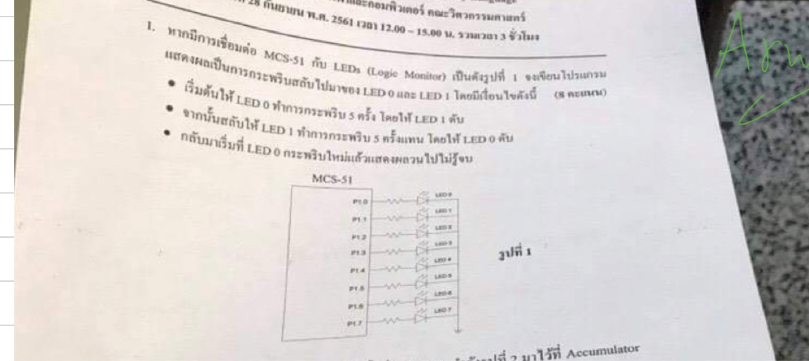
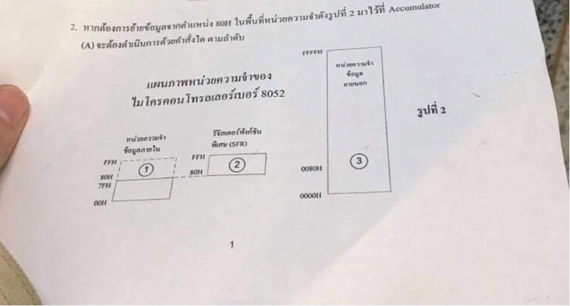
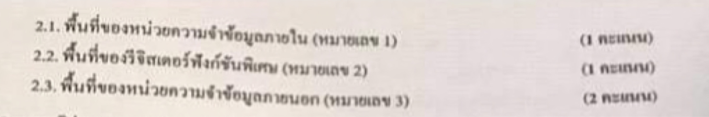
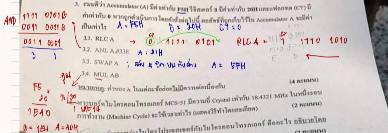
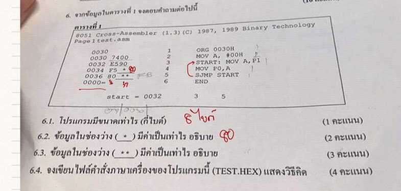

# ถอดโจทย์และวิเคราะห์ข้อสอบจริงกลางภาค 2561 (Real Midterm Exam Paper Analysis)
**วิชา:** ระบบสมองกลฝังตัว (Embedded Systems - MCS-51 / 8051 Microcontroller)  
**ภาควิชา:** วิศวกรรมไฟฟ้าและคอมพิวเตอร์ คณะวิศวกรรมศาสตร์  
**วันเวลาสอบ:** 28 กันยายน พ.ศ. 2561 เวลา 12.00 – 15.00 น. (รวมเวลา 3 ชั่วโมง)  
**แหล่งที่มา:** [Mid (1).pdf](file:///Users/3rapat/student/internship/CODEFIN/project/cwms/vahalla-wealth/private-docs/other-project/uni-work/embedded-system/1/midterm/Mid%20(1).pdf) (รูปถ่ายกระดาษข้อสอบจริง หน้า 7 – 11)

---

## สารบัญข้อสอบ
1. [ข้อมูลภาพรวมของข้อสอบ](#1-ข้อมูลภาพรวมของข้อสอบ)
2. [ข้อ 1: การเขียนโปรแกรมควบคุม LED Logic Monitor กระพริบสลับ (8 คะแนน)](#ข้อ-1-การเขียนโปรแกรมควบคุม-led-logic-monitor-กระพริบสลับ-8-คะแนน)
3. [ข้อ 2: การเข้าถึงหน่วยความจำ 8052 ในพื้นที่ต่างๆ (4 คะแนน)](#ข้อ-2-การเข้าถึงหน่วยความจำ-8052-ในพื้นที่ต่างๆ-4-คะแนน)
4. [ข้อ 3: การประมวลผลคำสั่งทางคณิตศาสตร์และตรรกศาสตร์ (4 คะแนน)](#ข้อ-3-การประมวลผลคำสั่งทางคณิตศาสตร์และตรรกศาสตร์-4-คะแนน)
5. [ข้อ 4: การคำนวณคาบเวลารอบการทำงาน (Machine Cycle) จาก Crystal (2 คะแนน)](#ข้อ-4-การคำนวณคาบเวลารอบการทำงาน-machine-cycle-จาก-crystal-2-คะแนน)
6. [ข้อ 5: เปรียบเทียบความแตกต่างระหว่าง Microprocessor และ Microcontroller (10 คะแนน)](#ข้อ-5-เปรียบเทียบความแตกต่างระหว่าง-microprocessor-และ-microcontroller-10-คะแนน)
7. [ข้อ 6: การวิเคราะห์ตาราง Cross-Assembler และสร้างไฟล์ Intel HEX (10 คะแนน)](#ข้อ-6-การวิเคราะห์ตาราง-cross-assembler-และสร้างไฟล์-intel-hex-10-คะแนน)
8. [คลังภาพสแกนเต็มหน้ากระดาษข้อสอบ (Full Page Scans)](#8-คลังภาพสแกนเต็มหน้ากระดาษข้อสอบ-full-page-scans)

---

## 1. ข้อมูลภาพรวมของข้อสอบ

ข้อสอบชุดนี้เป็นข้อสอบจริงของภาควิชาวิศวกรรมไฟฟ้าและคอมพิวเตอร์ ประกอบด้วยข้อสอบอัตนัย (ข้อเขียน) จำนวน 6 ข้อใหญ่ คะแนนรวมประมาณ 38+ คะแนน เน้นการประยุกต์ใช้งานสถาปัตยกรรม MCS-51 / 8051 และ 8052 ครบถ้วนทั้งด้าน:
- การต่อวงจรฮาร์ดแวร์และการควบคุมพอร์ต I/O
- โครงสร้างและเทคนิคการเข้าถึงหน่วยความจำ (Internal RAM, SFR, External Data RAM)
- การทำงานของชุดคำสั่งและการเปลี่ยนแปลงของรีจิสเตอร์/แฟลก
- การคำนวณความถี่และสัญญาณนาฬิการอบการทำงานของเครื่อง
- ทฤษฎีเปรียบเทียบระบบประมวลผล
- การคอมไพล์/แอสเซมเบิล รหัสภาษาเครื่อง และการสร้างไฟล์ Intel HEX Format

---

## ข้อ 1: การเขียนโปรแกรมควบคุม LED Logic Monitor กระพริบสลับ (8 คะแนน)

### รูปถ่ายกระดาษข้อสอบต้นฉบับ:


---

### ข้อความโจทย์ที่ถอดจากรูปภาพ:
> **1. หากมีการเชื่อมต่อ MCS-51 กับ LEDs (Logic Monitor) เป็นดังรูปที่ 1 จงเขียนโปรแกรมแสดงผลเป็นการกระพริบสลับไปมาของ LED 0 และ LED 1 โดยมีเงื่อนไขดังนี้ (8 คะแนน)**
> - **เริ่มต้นให้ LED 0 ทำการกระพริบ 5 ครั้ง โดยให้ LED 1 ดับ**
> - **จากนั้นสลับให้ LED 1 ทำการกระพริบ 5 ครั้งแทน โดยให้ LED 0 ดับ**
> - **กลับมาเริ่มที่ LED 0 กระพริบใหม่แล้วแสดงผลวนไปไม่รู้จบ**

---

### การวิเคราะห์วงจรฮาร์ดแวร์ (Circuit Analysis):
1. **การเชื่อมต่อพอร์ต:** 
   - วงจรเชื่อมต่อระหว่างบอร์ด MCS-51 ขาพอร์ต `P1.0` ถึง `P1.7` เข้ากับชุดแสดงผล LED (Logic Monitor)
   - ขา `P1.0` ต่อผ่านตัวต้านทานปรับกระแส (Current-limiting Resistor) เข้าขา Anode ของ `LED 0` แล้วขา Cathode ต่อลงกราวด์ (`GND`)
   - ขา `P1.1` ต่อผ่านตัวต้านทานเข้าขา Anode ของ `LED 1` แล้วต่อลงกราวด์ (`GND`)
2. **ระดับลอจิกในการขับหลอด LED (Active-HIGH Logic):**
   - ส่งลอจิก **`1` (HIGH / +5V)** จากพอร์ต -> ไดโอดนำกระแส -> **LED สว่าง (ติด)**
   - ส่งลอจิก **`0` (LOW / 0V)** จากพอร์ต -> ไม่มีกระแสไหล -> **LED ดับ**
3. **พฤติกรรมของระบบที่ต้องการ:**
   - **เฟส 1:** `LED 1` ดับสนิท (`P1.1 = 0`), สั่งให้ `LED 0` (`P1.0`) กระพริบ 5 ครั้ง (ติด $\rightarrow$ หน่วงเวลา $\rightarrow$ ดับ $\rightarrow$ หน่วงเวลา นับเป็น 1 ครั้ง)
   - **เฟส 2:** `LED 0` ดับสนิท (`P1.0 = 0`), สั่งให้ `LED 1` (`P1.1`) กระพริบ 5 ครั้ง (ติด $\rightarrow$ หน่วงเวลา $\rightarrow$ ดับ $\rightarrow$ หน่วงเวลา นับเป็น 1 ครั้ง)
   - **ลูปหลัก:** วนซ้ำไปเรื่อยๆ อย่างไม่มีที่สิ้นสุด

---

### ซอร์สโค้ดภาษาแอสเซมบลี 8051 ฉบับสมบูรณ์ (Full Assembly Solution):

```assembly
; ===================================================================
; โปรแกรม: ควบคุม LED0 และ LED1 กระพริบสลับกันตัวละ 5 ครั้ง วนลูปไม่รู้จบ
; ฮาร์ดแวร์: Active HIGH บนพอร์ต P1.0 (LED0) และ P1.1 (LED1)
; ===================================================================

        ORG     0000H           ; Reset Vector
        LJMP    MAIN            ; ข้ามไปยังโปรแกรมหลัก

        ORG     0030H           ; เริ่มต้นโค้ดโปรแกรมหลัก
MAIN:
        MOV     P1, #00H        ; ดับ LED ทุกดวงเริ่มต้น

MAIN_LOOP:
; -------------------------------------------------------------------
; เฟสที่ 1: LED0 กระพริบ 5 ครั้ง (LED1 ดับตลอดเวลา)
; -------------------------------------------------------------------
        CLR     P1.1            ; ยืนยันให้ LED1 ดับ
        MOV     R2, #5          ; กำหนดจำนวนรอบการกระพริบ 5 ครั้ง
BLINK_LED0:
        SETB    P1.0            ; LED0 ติด (ON)
        ACALL   DELAY           ; หน่วงเวลาขณะติด
        CLR     P1.0            ; LED0 ดับ (OFF)
        ACALL   DELAY           ; หน่วงเวลาขณะดับ
        DJNZ    R2, BLINK_LED0  ; วนทำซ้ำจนครบ 5 รอบ

; -------------------------------------------------------------------
; เฟสที่ 2: LED1 กระพริบ 5 ครั้ง (LED0 ดับตลอดเวลา)
; -------------------------------------------------------------------
        CLR     P1.0            ; ยืนยันให้ LED0 ดับ
        MOV     R2, #5          ; กำหนดจำนวนรอบการกระพริบ 5 ครั้ง
BLINK_LED1:
        SETB    P1.1            ; LED1 ติด (ON)
        ACALL   DELAY           ; หน่วงเวลาขณะติด
        CLR     P1.1            ; LED1 ดับ (OFF)
        ACALL   DELAY           ; หน่วงเวลาขณะดับ
        DJNZ    R2, BLINK_LED1  ; วนทำซ้ำจนครบ 5 รอบ

        SJMP    MAIN_LOOP       ; วนกลับไปเริ่มเฟส 1 ใหม่อย่างไม่รู้จบ

; ===================================================================
; รูทีนย่อยหน่วงเวลา (Software Delay Subroutine)
; ใช้ Nested Loop ของรีจิสเตอร์ R6 และ R7
; ===================================================================
DELAY:
        MOV     R7, #200
D1:     MOV     R6, #250
D2:     DJNZ    R6, D2          ; ลูปใน: 2 Machine Cycles x 250
        DJNZ    R7, D1          ; ลูปนอก: 200 รอบ
        RET                     ; กลับสู่โปรแกรมหลัก

        END                     ; สิ้นสุดโปรแกรม
```

---

## ข้อ 2: การเข้าถึงหน่วยความจำ 8052 ในพื้นที่ต่างๆ (4 คะแนน)

### รูปถ่ายกระดาษข้อสอบต้นฉบับ:



---

### ข้อความโจทย์ที่ถอดจากรูปภาพ:
> **2. หากต้องการย้ายข้อมูลจากตำแหน่ง 80H ในพื้นที่หน่วยความจำดังรูปที่ 2 มาไว้ที่ Accumulator (A) จะต้องดำเนินการด้วยคำสั่งใด ตามลำดับ**
> - **2.1. พื้นที่ของหน่วยความจำข้อมูลภายใน (หมายเลข 1) (1 คะแนน)**
> - **2.2. พื้นที่ของรีจิสเตอร์ฟังก์ชันพิเศษ (หมายเลข 2) (1 คะแนน)**
> - **2.3. พื้นที่ของหน่วยความจำข้อมูลภายนอก (หมายเลข 3) (2 คะแนน)**

---

### การวิเคราะห์แผนภาพหน่วยความจำ (Memory Architecture Analysis):
ในไมโครคอนโทรลเลอร์ **8052** (ซึ่งเป็นรุ่นขยายของ 8051) มีโครงสร้างหน่วยความจำพิเศษที่แอดเดรสช่วง **`80H - FFH` มี 2 บล็อกซ้อนทับกันทางตรรกะ (Overlapping Logical Spaces)**:
1. **หมายเลข (1): Upper 128 Bytes of Internal RAM (`80H - FFH`):**
   - เป็น Data RAM ภายในชิป
   - **กฎของ 8052:** การเข้าถึงบล็อกนี้ **ต้องใช้ Indirect Addressing ผ่าน Pointer `@R0` หรือ `@R1` เท่านั้น**
2. **หมายเลข (2): Special Function Registers (SFRs ช่วง `80H - FFH`):**
   - เป็นรีจิสเตอร์ควบคุมฮาร์ดแวร์ (เช่น `P0` ที่ `80H`, `TCON` ที่ `88H`, `P1` ที่ `90H`, `SCON` ที่ `98H`, `P2` ที่ `A0H`, `IE` ที่ `A8H`, `P3` ที่ `B0H`, `IP` ที่ `B8H`, `PSW` ที่ `D0H`, `ACC` ที่ `E0H`, `B` ที่ `F0H`)
   - **กฎของ 8052:** การเข้าถึง SFRs **ต้องใช้ Direct Addressing เท่านั้น**
3. **หมายเลข (3): External Data Memory (`0000H - FFFFH`):**
   - เป็นหน่วยความจำ RAM ภายนอกชิปขนาดสูงสุด 64 Kbytes
   - **กฎของ 8052:** การอ่าน/เขียนข้อมูล RAM ภายนอก **ต้องใช้คำสั่งตระกูล `MOVX` ร่วมกับ Data Pointer 16 บิต (`DPTR`) หรือ Pointer 8 บิต (`@R0`/`@R1`)**

---

### เฉลยและวิธีทำอย่างละเอียด:

#### ข้อย่อย 2.1: ย้ายข้อมูลจาก Internal RAM หมายเลข (1) ตำแหน่ง 80H มาไว้ที่ A
- **คำตอบ:**
  ```assembly
  MOV     R0, #80H        ; โหลดแอดเดรส 80H เข้าสู่ Pointer Register R0
  MOV     A, @R0          ; ย้ายข้อมูลจาก Internal RAM ตำแหน่งที่ R0 ชี้ มาไว้ที่ A
  ```
  *(หรือใช้ `R1` แทน `R0` ก็ได้ผลถูกต้องเหมือนกัน)*

---

#### ข้อย่อย 2.2: ย้ายข้อมูลจาก SFR หมายเลข (2) ตำแหน่ง 80H มาไว้ที่ A
- **คำตอบ:**
  ```assembly
  MOV     A, 80H          ; ย้ายข้อมูลจาก SFR แอดเดรส 80H (Port 0) มาไว้ที่ A โดยตรง
  ```
  *(หรือเขียน `MOV A, P0` ก็ได้)*

> [!CAUTION]
> **วิเคราะห์ข้อผิดพลาดในลายมือของรุ่นพี่:**
> ในกระดาษทด รุ่นพี่เขียนว่า `MOV A, #80H` ซึ่ง **ผิดหลักการอย่างร้ายแรง!** เพราะการมีเครื่องหมาย `#` หมายถึงการนำ **ค่าคงที่ 80H (Immediate Constant)** ใส่เข้าไปใน A ไม่ใช่การอ่านข้อมูลจากรีจิสเตอร์ SFR ที่แอดเดรส 80H คำตอบที่ถูกต้องทางวิชาการต้อง **ไม่มีเครื่องหมาย `#`** คือ `MOV A, 80H`

---

#### ข้อย่อย 2.3: ย้ายข้อมูลจาก External Data RAM หมายเลข (3) ตำแหน่ง 0080H มาไว้ที่ A
- **คำตอบ:**
  ```assembly
  MOV     DPTR, #0080H    ; กำหนดตำแหน่งแอดเดรส 16 บิต 0080H ให้กับ Data Pointer
  MOVX    A, @DPTR        ; อ่านข้อมูลจาก External Data Memory ที่ DPTR ชี้ มาไว้ที่ A
  ```
  *(หรือหากมองเป็น 8-bit Paged External RAM สามารถใช้: `MOV R0, #80H` แล้วตามด้วย `MOVX A, @R0`)*

> [!WARNING]
> **วิเคราะห์ลายมือของรุ่นพี่:**
> รุ่นพี่เขียน `MOVX @DPTR, #80H` แล้วตามด้วย `MOV A, @DPTR` ซึ่ง **ผิดไวยากรณ์คำสั่ง 8051 ทั้งสองบรรทัด!** เพราะ:
> 1. คำสั่ง `MOVX` ไม่มี Operand แบบ Immediate `#80H` (การโหลดแอดเดรสต้องใช้ `MOV DPTR, #0080H`)
> 2. การอ่าน External RAM ต้องใช้คำสั่ง `MOVX A, @DPTR` (มีตัว `X`) ไม่ใช่ `MOV A, @DPTR` ธรรมดา

---

## ข้อ 3: การประมวลผลคำสั่งทางคณิตศาสตร์และตรรกศาสตร์ (4 คะแนน)

### รูปถ่ายกระดาษข้อสอบต้นฉบับ:


---

### ข้อความโจทย์ที่ถอดจากรูปภาพ:
> **3. สมมติว่า Accumulator (A) มีค่าเท่ากับ F5H รีจิสเตอร์ B มีค่าเท่ากับ 20H และแฟลกทด (CY) มีค่าเท่ากับ 0 หากถูกดำเนินการโดยคำสั่งต่อไปนี้ ผลลัพธ์ที่ถูกเก็บไว้ใน Accumulator A จะมีค่าเป็นเท่าไร (4 คะแนน)**  
> **3.1. RLC A**  
> **3.2. ANL A,#33H**  
> **3.3. SWAP A**  
> **3.4. MUL AB**  
> **หมายเหตุ: ค่าของ A ในแต่ละข้อย่อยไม่มีความต่อเนื่องกัน**

---

### สภาพเริ่มต้นของรีจิสเตอร์และแฟลก:
- $A = \text{F5H} = 1111\ 0101_2$
- $B = 20\text{H} = 0010\ 0000_2 = 32_{10}$
- $CY = 0$

---

### แสดงวิธีทำและเฉลยทีละข้อย่อย:

#### ข้อย่อย 3.1: `RLC A` (Rotate Left through Carry)
- **หลักการทำงาน:** หมุนบิตข้อมูลใน Accumulator ไปทางซ้าย 1 ตำแหน่งผ่าน Carry Flag:
  - บิต 7 ของ A $\rightarrow$ ย้ายไปเก็บใน Carry Flag ($CY$)
  - บิต 6 ถึงบิต 0 $\rightarrow$ เลื่อนไปเป็นบิต 7 ถึงบิต 1
  - Carry Flag เดิม $\rightarrow$ ย้ายเข้ามาเก็บที่บิต 0 ของ A
- **การคำนวณ:**
  - $CY_{\text{เดิม}} = 0$, $A = 1111\ 0101_2$
  - บิต 7 ของ A คือ `1` $\rightarrow$ ส่งให้ $CY_{\text{ใหม่}} = 1$
  - บิต 0 ของ A รับค่า $CY_{\text{เดิม}}$ ซึ่งคือ `0`
  - บิตที่เหลือเลื่อนซ้าย: $[111\ 0101] + [0] = 1110\ 1010_2 = \text{EAH}$
- **ผลลัพธ์:**
  $$\mathbf{A = EAH} \quad (\text{และ } CY = 1)$$

---

#### ข้อย่อย 3.2: `ANL A, #33H` (Bitwise AND with Immediate)
- **หลักการทำงาน:** ทำการบูลีนลอจิก AND ระหว่างค่าใน A กับค่าคงที่ `33H` แบบบิตต่อบิต
- **การคำนวณ:**
  ```
    A   =  F5H  =  1 1 1 1   0 1 0 1
   #33H =  33H  =  0 0 1 1   0 0 1 1
   --------------------------------- (AND)
  ผลลัพธ์       =  0 0 1 1   0 0 0 1  =  31H
  ```
- **ผลลัพธ์:**
  $$\mathbf{A = 31H}$$

---

#### ข้อย่อย 3.3: `SWAP A` (Swap Nibbles)
- **หลักการทำงาน:** สลับข้อมูลระหว่าง 4 บิตบน (High Nibble: $D_7 - D_4$) กับ 4 บิตล่าง (Low Nibble: $D_3 - D_0$) ภายใน Accumulator
- **การคำนวณ:**
  - เดิม $A = \text{F5H}$ (High Nibble = $\text{F} = 1111$, Low Nibble = $5 = 0101$)
  - หลังทำคำสั่ง: High Nibble กลายเป็น $5$, Low Nibble กลายเป็น $\text{F}$
- **ผลลัพธ์:**
  $$\mathbf{A = 5FH}$$

---

#### ข้อย่อย 3.4: `MUL AB` (Multiply Accumulator by Register B)
- **หลักการทำงาน:** นำเลขจำนวนเต็มบวก 8 บิตใน $A$ คูณกับค่าใน $B$ ผลคูณขนาด 16 บิตจะถูกจัดเก็บดังนี้:
  - **Low Byte (8 บิตล่าง)** $\rightarrow$ เก็บใน Accumulator ($A$)
  - **High Byte (8 บิตบน)** $\rightarrow$ เก็บใน Register B ($B$)
  - แฟลก $OV$ จะถูกเซ็ตเป็น `1` หากผลคูณมากกว่า `00FFH` ($B \neq 0$)
- **การคำนวณ:**
  - $A = \text{F5H} = 245_{10}$
  - $B = 20\text{H} = 32_{10}$
  - ผลคูณในระบบเลขฐานสิบ: $245 \times 32 = 7840_{10}$
  - แปลงผลคูณ $7840_{10}$ เป็นเลขฐานสิบหก (Hexadecimal):
    $$7840 \div 4096 = 1 \text{ เศษ } 3744$$
    $$3744 \div 256 = 14 \ (\text{EH}) \text{ เศษ } 160$$
    $$160 \div 16 = 10 \ (\text{AH}) \text{ เศษ } 0$$
    $$\text{ผลคูณ } 16 \text{ บิต} = 1\text{EA0H}$$
  - แยกไบต์บนและไบต์ล่าง:
    - High Byte ($D_{15} - D_8$) = **`1EH`** $\rightarrow$ เก็บใน **Register B**
    - Low Byte ($D_7 - D_0$) = **`A0H`** $\rightarrow$ เก็บใน **Accumulator A**
- **ผลลัพธ์:**
  $$\mathbf{A = A0H} \quad (\text{โดยใน } B = 1\text{EH}, \ OV = 1, \ CY = 0)$$

---

## ข้อ 4: การคำนวณคาบเวลารอบการทำงาน (Machine Cycle) จาก Crystal (2 คะแนน)

### ข้อความโจทย์ที่ถอดจากรูปภาพ:
> **4. หากบอร์ดไมโครคอนโทรลเลอร์ MCS-51 มีความถี่ Crystal เท่ากับ 18.4321 MHz ในหนึ่งรอบการทำงาน (Machine Cycle) จะใช้เวลาเท่าไร (แสดงวิธีทำโดยละเอียด) (2 คะแนน)**

---

### การวิเคราะห์ทฤษฎีระบบสัญญาณนาฬิกา 8051 (Timing Analysis):
1. สถาปัตยกรรมมาตรฐานของ MCS-51 กำหนดโครงสร้างวงจรหารความถี่ภายในไว้ว่า:
   - **1 Machine Cycle** ประกอบด้วย **6 States ($S_1 - S_6$)**
   - แต่ละ State ประกอบด้วย **2 Oscillator Clock Phases ($P_1, P_2$)**
   - ดังนั้น **1 Machine Cycle = 12 Oscillator Clock Cycles**
2. สูตรความสัมพันธ์ทางเวลา:
   $$f_{\text{machine}} = \frac{f_{\text{osc}}}{12}$$
   $$T_{\text{machine}} = \frac{1}{f_{\text{machine}}} = \frac{12}{f_{\text{osc}}}$$

---

### แสดงวิธีทำอย่างละเอียด:
- **กำหนดให้:** ความถี่ของ Crystal Oscillator ($f_{\text{osc}}$) = $18.4321 \text{ MHz} = 18.4321 \times 10^6 \text{ Hz}$

1. **คำนวณความถี่รอบการทำงานของเครื่อง ($f_{\text{machine}}$):**
   $$f_{\text{machine}} = \frac{18.4321 \times 10^6 \text{ Hz}}{12} \approx 1.53600833 \times 10^6 \text{ Hz} \approx 1.536 \text{ MHz}$$

2. **คำนวณเวลาที่ใช้ในหนึ่งรอบการทำงาน ($T_{\text{machine}}$):**
   $$T_{\text{machine}} = \frac{12}{f_{\text{osc}}} = \frac{12}{18.4321 \times 10^6 \text{ s}^{-1}}$$
   $$T_{\text{machine}} \approx 0.65103813 \times 10^{-6} \text{ วินาที}$$
   $$T_{\text{machine}} \approx \mathbf{0.651038 \ \mu\text{s}} \quad (\text{หรือประมาณ } \mathbf{651.04 \text{ ns}})$$

*(หมายเหตุ: ในกรณีที่โจทย์อ้างอิงความถี่มาตรฐาน Crystal อุตสาหกรรม $18.4320 \text{ MHz}$ ค่าคำนวณจะได้ $T_{\text{machine}} = \frac{12}{18.432 \times 10^6} = \frac{1}{1.536 \times 10^6} = 0.6510416 \ \mu\text{s} = 651.04 \text{ ns}$ เช่นเดียวกัน)*

---

## ข้อ 5: เปรียบเทียบความแตกต่างระหว่าง Microprocessor และ Microcontroller (10 คะแนน)

### ข้อความโจทย์ที่ถอดจากรูปภาพ:
> **5. ความแตกต่างระหว่างไมโครโปรเซสเซอร์กับไมโครคอนโทรลเลอร์ คืออะไร อธิบายโดยละเอียด (10 คะแนน)**

---

### การวิเคราะห์และแนวทางการตอบเพื่อให้ได้คะแนนเต็ม 10 คะแนน:
คำถามข้อนี้มีน้ำหนักคะแนนสูงถึง 10 คะแนน การตอบต้องครอบคลุมทั้ง **โครงสร้างฮาร์ดแวร์ภายใน**, **การต่อประสานภายนอก**, **การใช้พลังงาน**, **ต้นทุน**, **ประสิทธิภาพ**, และ **ตัวอย่างการนำไปประยุกต์ใช้งานจริง**

```
+------------------------------------+      +-----------------------------------------+
|        Microprocessor (MPU)        |      |          Microcontroller (MCU)          |
|  +------------------------------+  |      |  +-----------------------------------+  |
|  |           CPU Only           |  |      |  |                CPU                |  |
|  |   (ALU, CU, Registers)       |  |      |  +-----------------------------------+  |
|  +------------------------------+  |      |  | RAM | Flash/ROM | Timers | I/O    |  |
|                                    |      |  | ADC | UART/SPI  | Interrupts     |  |
|  * ต้องต่อ RAM, ROM, I/O ภายนอก *  |      |  +-----------------------------------+  |
|                                    |      |                                         |
|    (General-Purpose Computing)     |      |        (Single-Chip Computer)           |
+------------------------------------+      +-----------------------------------------+
```

---

### ตารางเปรียบเทียบเชิงลึก 8 มิติ (Comprehensive Comparison):

| มิติการเปรียบเทียบ | ไมโครโปรเซสเซอร์ (Microprocessor - MPU) | ไมโครคอนโทรลเลอร์ (Microcontroller - MCU) |
| :--- | :--- | :--- |
| **1. นิยามและโครงสร้างหลัก** | บรรจุเฉพาะหน่วยประมวลผลกลาง (**CPU Only**) ได้แก่ ALU, Control Unit, และ General Registers บนชิป ไม่มีหน่วยความจำหรือพอร์ต I/O ในตัว | บรรจุระบบคอมพิวเตอร์ครบวงจรในชิปเดี่ยว (**Single-Chip Microcomputer**) ประกอบด้วย CPU, RAM, ROM/Flash, I/O Ports, Timers, และ Interrupts เบ็ดเสร็จ |
| **2. การเชื่อมต่อระบบบัส** | ต้องใช้ **System Bus ภายนอก** (Address Bus, Data Bus, Control Bus) ต่อเชื่อมไปยังชิป RAM, ROM, I/O Controller ทำให้วงจร PCB ซับซ้อนและมีขนาดใหญ่ | สัญญาณบัสส่วนใหญ่เชื่อมต่อ **ภายในชิป (Internal Bus)** ขาภายนอกส่วนใหญ่ทำหน้าที่เป็นพอร์ต I/O สำหรับต่อกับเซนเซอร์หรืออุปกรณ์ภายนอกโดยตรง |
| **3. วัตถุประสงค์การใช้งาน** | ออกแบบมาสำหรับงานประมวลผลทั่วไป (**General-Purpose Computing**) ที่ต้องการความยืดหยุ่นสูง รันโปรแกรมที่หลากหลายและซับซ้อน | ออกแบบมาสำหรับงานควบคุมเฉพาะทาง (**Dedicated / Specific Control Application**) มักรันโปรแกรมชุดเดียวตลอดอายุการใช้งาน |
| **4. ความยืดหยุ่น (Flexibility)** | **สูงมาก** สามารถปรับเปลี่ยน เพิ่ม/ลด ขนาดของ RAM, หน่วยความจำถาวร (SSD/HDD), และการ์ดเชื่อมต่อ I/O ต่างๆ ได้ตามความต้องการ | **คงที่** ทรัพยากรภายใน (ขนาด RAM, Flash, จำนวนขา I/O, Timers) ถูกกำหนดตายตัวมาจากโรงงานตามรุ่นของชิป |
| **5. การใช้พลังงานและขนาด** | ใช้พลังงานไฟฟ้าสูง (หลักหลายวัตต์ถึงร้อยวัตต์) เกิดความร้อนสูง ต้องมีระบบระบายความร้อน (Heatsink/Fan) ขนาดวงจรบอร์ดใหญ่ | กินพลังงานต่ำมาก (หลักมิลลิวัตต์หรือไมโครวัตต์) รองรับโหมดประหยัดพลังงาน (Sleep/Power-down) สามารถทำงานด้วยแบตเตอรี่ได้เป็นเวลานาน |
| **6. ความเร็วและประสิทธิภาพ** | ทำงานที่ความถี่สัญญาณนาฬิกาสูงมาก (หลายร้อย MHz ถึงระดับหลาย GHz), สถาปัตยกรรมแบบ Multi-core 32-bit / 64-bit, มีระบบ Cache หลายระดับ | ทำงานที่ความถี่สัญญาณนาฬิกาต่ำกว่า (หลักสิบ kHz ถึงระดับร้อยกว่า MHz), โครงสร้างมักเป็น 8-bit หรือ 32-bit เน้นความแน่นอนของเวลา (Deterministic Timing) |
| **7. ต้นทุนระบบโดยรวม** | ต้นทุนรวมของระบบสูงมาก เนื่องจากต้องซื้อชิปประมวลผล, ชิปหน่วยความจำ, ชิปควบคุม I/O, ชิปจัดการพลังงาน และบอร์ด PCB หลายเลเยอร์ | ต้นทุนต่อชิ้นต่ำมาก (หลักสิบบาทถึงร้อยกว่าบาท) ช่วยลดจำนวนอุปกรณ์บนบอร์ด (BOM Cost) ได้อย่างมหาศาล เหมาะแก่การผลิตเชิงอุตสาหกรรม |
| **8. ตัวอย่างการใช้งานจริง** | Personal Computer (PC), Laptops, Servers, Cloud Data Centers, High-end Smart Devices (เช่น Intel Core i9, AMD Ryzen, Apple M-series) | เครื่องใช้ไฟฟ้าในบ้าน (ไมโครเวฟ, แอร์, เครื่องซักผ้า), ยานยนต์ (ECU, ระบบเบรก ABS), อุปกรณ์การแพทย์, IoT Devices (เช่น MCS-51, PIC, AVR, STM32, ESP32) |

---

## ข้อ 6: การวิเคราะห์ตาราง Cross-Assembler และสร้างไฟล์ Intel HEX (10 คะแนน)

### รูปถ่ายกระดาษข้อสอบต้นฉบับ:


---

### ข้อความโจทย์ที่ถอดจากรูปภาพ:
> **6. จากข้อมูลในตารางที่ 1 จงตอบคำถามต่อไปนี้ (10 คะแนน)**
> 
> **ตารางที่ 1**
> ```text
> 8051 Cross-Assembler (1.3) (C) 1987, 1989 Binary Technology
> Page 1 test.asm
> 
>   0030            1          ORG 0030H
>   0030 7400       2          MOV A, #00H
>   0032 E590       3  START:  MOV A, P1
>   0034 F5 *       4          MOV P0, A
>   0036 80 **      5          SJMP START
>   0000-           6          END
> 
>       start = 0032       3    5
> ```
> 
> - **6.1. โปรแกรมมีขนาดเท่าไร (กี่ไบต์) (1 คะแนน)**
> - **6.2. ข้อมูลในช่องว่าง ( * ) มีค่าเป็นเท่าไร อธิบาย (2 คะแนน)**
> - **6.3. ข้อมูลในช่องว่าง ( ** ) มีค่าเป็นเท่าไร อธิบาย (3 คะแนน)**
> - **6.4. จงเขียนไฟล์คำสั่งภาษาเครื่องของโปรแกรมนี้ (TEST.HEX) แสดงวิธีคิด (4 คะแนน)**

---

### การวิเคราะห์โค้ดและโครงสร้างตาราง Cross-Assembler:
ตาราง Cross-Assembler Listing แสดงผลการแปลงซอร์สโค้ด `test.asm` เป็นรหัสภาษาเครื่อง (Machine Code):
- คอลัมน์ที่ 1: ที่อยู่หน่วยความจำ (Memory Address 16-bit Hexadecimal)
- คอลัมน์ที่ 2: รหัสคำสั่งภาษาเครื่อง (Machine Opcode & Operands)
- คอลัมน์ที่ 3: หมายเลขบรรทัดซอร์สโค้ด (Line Number)
- คอลัมน์ที่ 4: ซอร์สโค้ดภาษาแอสเซมบลี (Source Statements)

---

### เฉลยและแสดงวิธีคิดทีละข้อย่อย:

#### ข้อย่อย 6.1: โปรแกรมมีขนาดเท่าไร (กี่ไบต์) (1 คะแนน)
- **วิธีคิด:** นับจำนวนไบต์ของรหัสภาษาเครื่องที่ถูกสร้างขึ้นจริงในแต่ละคำสั่ง:
  1. บรรทัดที่ 2 (`MOV A, #00H` ที่แอดเดรส `0030H`): มี Machine Code คือ `74 00` $\rightarrow$ **ขนาด 2 ไบต์** (`0030H`, `0031H`)
  2. บรรทัดที่ 3 (`START: MOV A, P1` ที่แอดเดรส `0032H`): มี Machine Code คือ `E5 90` $\rightarrow$ **ขนาด 2 ไบต์** (`0032H`, `0033H`)
  3. บรรทัดที่ 4 (`MOV P0, A` ที่แอดเดรส `0034H`): มี Machine Code คือ `F5 *` $\rightarrow$ **ขนาด 2 ไบต์** (`0034H`, `0035H`)
  4. บรรทัดที่ 5 (`SJMP START` ที่แอดเดรส `0036H`): มี Machine Code คือ `80 **` $\rightarrow$ **ขนาด 2 ไบต์** (`0036H`, `0037H`)
  *(บรรทัดที่ 1 `ORG` และบรรทัดที่ 6 `END` เป็น Assembler Directives ไม่ใช้พื้นที่หน่วยความจำ)*
- **ผลรวมขนาดของโปรแกรม:**
  $$\text{ขนาดรวม} = 2 + 2 + 2 + 2 = \mathbf{8 \ \text{ไบต์ (Bytes)}}$$
  *(ครอบคลุมพื้นที่หน่วยความจำช่วงแอดเดรส `0030H` ถึง `0037H`)*

---

#### ข้อย่อย 6.2: ข้อมูลในช่องว่าง ( * ) มีค่าเป็นเท่าไร อธิบาย (2 คะแนน)
- **วิธีคิด:**
  - คำสั่งในบรรทัดที่ 4 คือ `MOV P0, A`
  - ตามรูปแบบคำสั่งของ 8051 คำสั่งนี้คือ `MOV direct, A` ซึ่งมีโครงสร้างรหัสภาษาเครื่อง 2 ไบต์:
    - Byte 1 = Opcode `F5H`
    - Byte 2 = Direct Address ของรีจิสเตอร์ปลายทาง
  - ในสถาปัตยกรรม MCS-51 รีจิสเตอร์พอร์ต 0 (`P0`) เป็น Special Function Register (SFR) ที่ถูกจัดวางไว้ที่แอดเดรส **`80H`**
- **คำตอบ:**
  $$\mathbf{(*)\ = 80 \quad (\text{หรือ } 80\text{H})}$$
  - **คำอธิบาย:** เป็นแอดเดรสของรีจิสเตอร์ฟังก์ชันพิเศษ `Port 0 (P0)` ซึ่งอยู่ที่ตำแหน่ง `80H` ทำให้คำสั่ง `MOV P0, A` แปลงเป็น Machine Code ได้เป็น `F5 80`

---

#### ข้อย่อย 6.3: ข้อมูลในช่องว่าง ( ** ) มีค่าเป็นเท่าไร อธิบาย (3 คะแนน)
- **วิธีคิด:**
  - คำสั่งในบรรทัดที่ 5 คือ `SJMP START` (Short Jump) ซึ่งอยู่ที่แอดเดรส `0036H` มีขนาด 2 ไบต์ (`0036H` และ `0037H`)
  - รหัสคำสั่ง `SJMP` ประกอบด้วย:
    - Byte 1 = Opcode `80H`
    - Byte 2 = Relative Offset ขนาด 8 บิต (คิดแบบ Two's Complement ในช่วง $-128$ ถึง $+127$)
  - **สูตรการคำนวณ Relative Offset ใน 8051:**
    $$\text{Target Address} = \text{PC of NEXT instruction} + \text{Relative Offset}$$
    $$\text{Relative Offset} = \text{Target Address} - \text{PC of NEXT instruction}$$
  - ตำแหน่งปลายทางเป้าหมาย (`START`) = `0032H`
  - ค่าของ Program Counter (PC) ของคำสั่งถัดไปหลังจาก Fetch คำสั่ง `SJMP` (2 ไบต์) = $0036\text{H} + 2 = \mathbf{0038\text{H}}$
  - คำนวณผลต่าง:
    $$\text{Relative Offset} = 0032\text{H} - 0038\text{H} = -6_{10}$$
  - แปลง $-6_{10}$ ให้อยู่ในรูปเลขฐานสิบหก 8 บิต แบบ Two's Complement:
    $$+6_{10} = 0000\ 0110_2$$
    $$\text{Invert bits (1's complement)} = 1111\ 1001_2$$
    $$\text{Add 1 (2's complement)} = 1111\ 1010_2 = \mathbf{FAH}$$
- **คำตอบ:**
  $$\mathbf{(**)\ = FA \quad (\text{หรือ } \text{FAH})}$$
  - **คำอธิบาย:** เป็นค่าการกระโดดถอยหลัง 6 ไบต์ (Offset = $-6$) จากตำแหน่ง PC ปัจจุบัน (`0038H`) ย้อนกลับไปยังแอดเดรสเป้าหมาย `0032H` ($0038\text{H} + \text{FAH} = 0038\text{H} - 6\text{H} = 0032\text{H}$)

> [!NOTE]
> **การเปรียบเทียบกับลายมือของรุ่นพี่:**
> ในกระดาษข้อสอบ รุ่นพี่ทดเลขไว้ว่า `FB` (กระโดด $-5$) ซึ่งเป็นความผิดพลาดยอดฮิตที่เกิดจากการนำแอดเดรสปัจจุบัน `0037H` มาลบแทนที่จะใช้ PC ของคำสั่งถัดไป (`0038H`) ตามมาตรฐานฮาร์ดแวร์ 8051 ค่าที่ถูกต้องตามสเปกสถาปัตยกรรมคือ **`FA`**

---

#### ข้อย่อย 6.4: จงเขียนไฟล์คำสั่งภาษาเครื่องของโปรแกรมนี้ (TEST.HEX) แสดงวิธีคิด (4 คะแนน)

- **โครงสร้างมาตรฐานของ Intel HEX Record Format:**
  $$:\text{LLAAAATT[DD...]CC}$$
  - `:` = จุดเริ่มต้นของ Record (Start Code)
  - `LL` = Record Length / Byte Count (จำนวนไบต์ของ Data ในบรรทัด เป็นเลขฐานสิบหก 2 หลัก)
  - `AAAA` = Starting Memory Address (แอดเดรสเริ่มต้น 16 บิต เป็นเลขฐานสิบหก 4 หลัก)
  - `TT` = Record Type (`00` = Data Record, `01` = End of File Record)
  - `[DD...]` = ข้อมูลภาษาเครื่อง (Data Bytes)
  - `CC` = **Checksum** (ไบต์ตรวจสอบความถูกต้อง ขนาด 8 บิต)

- **สูตรการคำนวณ Checksum:**
  $$\text{Checksum} = \text{Two's Complement of } \left( \sum (\text{LL} + \text{AAAA}_{\text{high}} + \text{AAAA}_{\text{low}} + \text{TT} + \text{Data Bytes}) \pmod{256} \right)$$
  $$\text{Checksum} = 100\text{H} - (\text{Sum of Bytes} \pmod{100\text{H}})$$

---

### ขั้นตอนการคำนวณทีละบรรทัด (Step-by-Step Calculation):

#### บรรทัดที่ 1: Data Record (บันทึกรหัสภาษาเครื่องทั้ง 8 ไบต์)
1. **Byte Count (`LL`):** มีข้อมูล 8 ไบต์ $\rightarrow$ **`08`**
2. **Start Address (`AAAA`):** เริ่มต้นที่ `0030H` $\rightarrow$ **`0030`**
3. **Record Type (`TT`):** เป็น Data Record $\rightarrow$ **`00`**
4. **Data Bytes (`[DD...]`):** รหัสคำสั่งภาษาเครื่องทั้ง 8 ไบต์:
   - `74 00` (`MOV A, #00H`)
   - `E5 90` (`MOV A, P1`)
   - `F5 80` (`MOV P0, A`)
   - `80 FA` (`SJMP START`)
   - รวมข้อมูล: **`7400E590F58080FA`**
5. **คำนวณ Checksum (`CC`):**
   - นำทุกไบต์ในเรคอร์ดมาบวกกัน:
     $$\text{Sum} = 08\text{H} + 00\text{H} + 30\text{H} + 00\text{H} + 74\text{H} + 00\text{H} + \text{E5H} + 90\text{H} + \text{F5H} + 80\text{H} + 80\text{H} + \text{FAH}$$
     $$\text{แปลงเป็นฐานสิบ} = 8 + 0 + 48 + 0 + 116 + 0 + 229 + 144 + 245 + 128 + 128 + 250 = 1296_{10}$$
     $$1296_{10} = 510\text{H}$$
   - ตัดเหลือ 8 บิตล่าง (Modulo 256):
     $$\text{Low Byte} = 10\text{H}$$
   - หาค่า Two's Complement:
     $$\text{Checksum} = 100\text{H} - 10\text{H} = \mathbf{F0H}$$
6. **ผลลัพธ์บรรทัดที่ 1:**
   ```text
   :080030007400E590F58080FAF0
   ```

---

#### บรรทัดที่ 2: End-of-File Record (EOF Record สิ้นสุดไฟล์)
1. **Byte Count (`LL`):** ไม่มีข้อมูล $\rightarrow$ **`00`**
2. **Address (`AAAA`):** แอดเดรส `0000H` $\rightarrow$ **`0000`**
3. **Record Type (`TT`):** End of File $\rightarrow$ **`01`**
4. **Data Bytes:** ไม่มี
5. **คำนวณ Checksum (`CC`):**
   $$\text{Sum} = 00\text{H} + 00\text{H} + 00\text{H} + 01\text{H} = 01\text{H}$$
   $$\text{Checksum} = 100\text{H} - 01\text{H} = \mathbf{FFH}$$
6. **ผลลัพธ์บรรทัดที่ 2:**
   ```text
   :00000001FF
   ```

---

### เนื้อหาไฟล์ `TEST.HEX` ฉบับสมบูรณ์ (Final HEX File Output):

```hex
:080030007400E590F58080FAF0
:00000001FF
```

*(หมายเหตุเสริม: ในกรณีที่ผู้ตรวจข้อสอบใช้ค่า Offset เป็น `FB` ตามลายมือทดของรุ่นพี่ ผลการคำนวณ Checksum จะได้: $\text{Sum} = 511\text{H} \rightarrow 100\text{H} - 11\text{H} = \text{EFH}$ และจะได้ Record เป็น `:080030007400E590F58080FBEF`)*

---

## 8. คลังภาพสแกนเต็มหน้ากระดาษข้อสอบ (Full Page Scans)

| หน้าที่ | หัวข้อในกระดาษข้อสอบ | ลิงก์รูปภาพ |
| :---: | :--- | :---: |
| **หน้า 7** | ข้อ 1: วงจร Logic Monitor ควบคุม LED | [page-07.png](file:///Users/3rapat/student/internship/CODEFIN/project/cwms/vahalla-wealth/private-docs/other-project/uni-work/embedded-system/1/midterm/02-midterm-real-exam-2561/images/page-scans/page-07.png) |
| **หน้า 8** | ข้อ 2: โครงสร้างหน่วยความจำ 8052 (Internal RAM, SFR, External RAM) | [page-08.png](file:///Users/3rapat/student/internship/CODEFIN/project/cwms/vahalla-wealth/private-docs/other-project/uni-work/embedded-system/1/midterm/02-midterm-real-exam-2561/images/page-scans/page-08.png) |
| **หน้า 9** | ข้อ 3: การคำนวณคำสั่ง (RLC, ANL, SWAP, MUL) และ ข้อ 4: คำนวณ Crystal | [page-09.png](file:///Users/3rapat/student/internship/CODEFIN/project/cwms/vahalla-wealth/private-docs/other-project/uni-work/embedded-system/1/midterm/02-midterm-real-exam-2561/images/page-scans/page-09.png) |
| **หน้า 10** | ข้อ 4 (ต่อ) และ ข้อ 5: เปรียบเทียบ Microprocessor vs Microcontroller | [page-10.png](file:///Users/3rapat/student/internship/CODEFIN/project/cwms/vahalla-wealth/private-docs/other-project/uni-work/embedded-system/1/midterm/02-midterm-real-exam-2561/images/page-scans/page-10.png) |
| **หน้า 11** | ข้อ 6: ตาราง 8051 Cross-Assembler และการสร้างไฟล์ TEST.HEX | [page-11.png](file:///Users/3rapat/student/internship/CODEFIN/project/cwms/vahalla-wealth/private-docs/other-project/uni-work/embedded-system/1/midterm/02-midterm-real-exam-2561/images/page-scans/page-11.png) |
