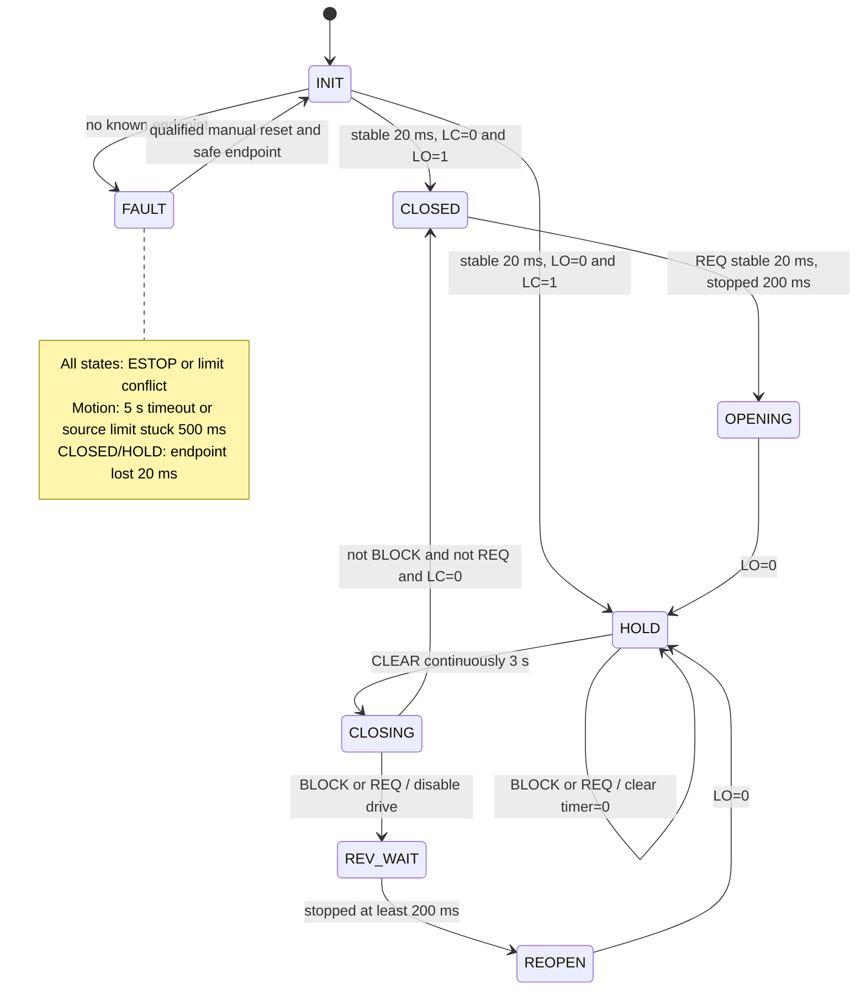

# แบบระบบประตูเลื่อนบานเดี่ยวตรวจจับสิ่งกีดขวางและเปิดกลับ

ชื่อภาษาอังกฤษ: Single-Panel Sliding Door with Obstruction Detection and Reopening  
รายวิชา: Embedded Systems, 8051 / EdSim51  
กลุ่ม 1: 66362416 นายธีรภัทร ภู่ระย้า ลำดับที่ 4 และ 66363116 นางสาวปราณปรียา ศรียอง ลำดับที่ 7  
อาจารย์ที่ปรึกษา: ดร.แสงชัย มังกรทอง  
สถานะ: แบบวิศวกรรมสำหรับชุดสาธิตระดับมหาวิทยาลัย  
วันที่: 17 กันยายน 2026

เอกสารนี้เป็นพิมพ์เขียวหลักของวงจร FSM พารามิเตอร์เวลา และความหมายสัญญาณสำหรับสไลด์และโปรแกรมในโฟลเดอร์เดียวกัน เมื่อแก้พิน เงื่อนไข หรือเวลา ต้องปรับเอกสาร โค้ด และสไลด์ให้ตรงกัน ผลทดสอบที่เกิดขึ้นจริงแยกบันทึกใน `firmware/TEST_RESULTS.md` ส่วนรายการที่ยังไม่ได้วัดต้องไม่เรียกว่าเป็นผลทดลอง

## 1. ข้อกำหนดที่ตรวจสอบจากแหล่งอ้างอิง

1. Lab 2 หน้า 2 ระบุการกำหนด state, state description, transition, event และ guard condition
2. Lab 2 หน้า 12–13 กำหนดประตูบานเดี่ยว มอเตอร์ สายพาน มู่เล่ย์ ลิมิตสวิตช์สองตัว และปุ่มเปิดภายใน/ภายนอก
3. Lab 2 หน้า 14 ต้องแสดง scenario ของปัญหาและออกแบบ solution พร้อม FSM และห้ามซ้ำปัญหา/วิธีแก้กับกลุ่มอื่น
4. `assignment/ASSIGNMENT_BREAKDOWN.md` เป็นเอกสารสรุปและข้อเสนอแนะ ต้องแยกจากข้อความคำสั่งอาจารย์ เช่น คำแนะนำให้ทำ 10–12 หน้าและข้อความกล่าวอ้างมาตรฐานไม่ใช่หลักฐานรับรองระบบนี้ คำขอปัจจุบันกำหนด 8–10 หน้า จึงจัดทำ 10 หน้า
5. ตัวอย่าง `Group 7_Smart door.pdf` หน้า 2 ใช้ keypad/password ควบคุมสิทธิ์เข้าบ้าน หน้า 3 เป็น FSM หน้า 4 เป็น state table หน้า 5 เป็น wiring และหน้า 6–11 เป็น assembly ระบบที่เสนอนี้ใช้รูปแบบการอธิบายดังกล่าว แต่แก้ปัญหาการปิดชนสิ่งกีดขวาง ไม่เพิ่มรหัสผ่าน Arduino หรือ AI
6. ตำราในโฟลเดอร์ textbook มีหลายสถาปัตยกรรม เลือกทฤษฎี FSM และ I/O จาก Lee–Seshia เท่านั้น ส่วน SFR, พอร์ต และ instruction set ใช้เนื้อหา 8051 ของรายวิชาและคู่มืออุปกรณ์ ไม่ย้าย register ของ AVR/ARM มาใช้กับ 8051

ยังไม่ทราบหัวข้อของกลุ่มอื่นทั้งหมด จึงยืนยันได้เฉพาะว่าไม่ซ้ำกรณี keypad ของตัวอย่างที่ได้รับ

## 2. ปัญหา สถานการณ์ และเหตุผลการเลือกแนวทาง

บริบทเป้าหมายคือทางเข้าห้องปรับอากาศภายในบ้านหรือร้านค้าขนาดเล็ก คนสูงอายุอาจเดินผ่านช้ากว่าเวลาค้างเปิดที่ตั้งไว้ เด็กหรือสัตว์เลี้ยงอาจเดินตามมาขณะประตูเริ่มปิด ประตูเดิมใช้เวลาเพียงอย่างเดียวในการตัดสินใจปิด จึงไม่ทราบว่าช่องทางผ่านยังมีสิ่งกีดขวาง

พิจารณาแนวทางแล้วเลือกเซนเซอร์ through-beam สองระดับ เพราะให้สัญญาณดิจิทัลที่อธิบายเป็น guard ได้ ตรวจจับวัตถุที่หยุดนิ่งตัดลำแสงได้ และไม่ต้องประมวลผลภาพ ระบบฝน/เปิดครึ่งบานต้องเพิ่มการตรวจตำแหน่งและไม่ได้แก้ความเสี่ยงการปิดชนโดยตรง ส่วน PIR ตรวจความเคลื่อนไหวไม่เหมาะใช้แทนการตรวจวัตถุหยุดนิ่งในช่องประตู

### Storyboard

| จังหวะ | ประตูตั้งต้น | ระบบที่เสนอ |
|---|---|---|
| 1 ผู้ใช้กดปุ่ม | เปิดจนถึงลิมิตเปิด | ตรวจตำแหน่งและเปิดจนถึงลิมิตเปิด |
| 2 ผู้ใช้ยังอยู่ในช่องผ่าน | ตัวนับยังเดินต่อ | ลำแสงใดลำแสงหนึ่งถูกบัง ล้างตัวนับเวลารอปิด |
| 3 ประตูเริ่มปิดแล้วมีวัตถุเข้ามา | ยังสั่งปิดต่อ | ปิด Enable ของ L293D แล้วเข้า REV_WAIT |
| 4 หลังหยุดจ่ายแรงขับ | ไม่มีเส้นทางกู้คืนเฉพาะ | รออย่างน้อย 200 ms แล้วเปิดกลับจนถึง LO |
| 5 ทางผ่านว่าง | ปิดตามเวลาตั้งต้น | รอทั้งสองลำแสงว่างและปุ่มปล่อยต่อเนื่องอย่างน้อย 3 s จึงปิด |

ในบริบทฝนสาด/ไอน้ำ/ฝุ่น หากลำแสงอ่านไม่ชัด ระบบจะค้างเปิดหรือเปิดกลับ ไม่ลดเวลาเพื่อฝืนปิด ติดตั้งใต้กันสาดและจัดแนวลำแสง ทั้งนี้ยังไม่ได้วัดการประหยัดพลังงานแอร์หรืออัตราการตรวจจับในฝนจริง

## 3. ขอบเขตการสาธิตและข้อจำกัดเชิงกล

- ใช้บานเลื่อนจำลองน้ำหนักเบา ระยะวิ่งออกแบบ 200 mm ไม่ใช่ประตูบ้านขนาดจริง
- ใช้มอเตอร์เกียร์ DC พิกัด 12 V ตัวอย่างที่มีข้อมูลผู้ผลิตคือ Pololu #3041, 100.37:1 HPCB 12 V
- มอเตอร์ดังกล่าวมี stall current เชิงประมาณ 0.75 A ที่ 12 V ซึ่งเกิน L293D 0.6 A จึง **ห้ามต่อโดยไม่มีการจำกัดกระแสตามแบบ**
- ใส่ตัวต้านทานอนุกรมมอเตอร์ 27 Ω ±5%, 10 W และใช้แหล่งจ่ายมอเตอร์ 12.0 V จำกัดกระแส 0.50 A โดยต้องวัดกระแสเริ่มหมุนและกระแสติดขัดจริงก่อนต่อบานประตู
- ที่แหล่งจ่ายสูงสุด 12.6 V และ R ต่ำสุด 25.65 Ω กระแสขณะหยุดนิ่งมีขอบเขตบนเชิงตัวต้านทาน `12.6/25.65 = 0.491 A` แม้ยังไม่รวมความต้านทานขดลวดและแรงดันตกคร่อมไดรเวอร์ ค่านี้ไม่ครอบคลุมการกลับทิศขณะที่มอเตอร์ยังหมุน จึงต้องยืนยันเวลาหยุดจริงก่อนใช้ 200 ms
- ค่าประมาณ R ขดลวดจากข้อมูล stall คือ `12/0.75 = 16 Ω` ดังนั้นกระแส stall ที่ 12 V เมื่อรวม R27 Ω และยังไม่คิด driver drop อยู่ราว `12/(16+27)=0.279 A` เป็นค่าคำนวณ ไม่ใช่ผลวัด
- L293D มีแรงดันตกคร่อมภายใน และ R อนุกรมทำให้แรงดันที่ขั้วมอเตอร์ต่ำกว่า 12 V รวมถึงแรงบิดลดลง ใช้ข้อมูล 330 RPM ที่ 12 V ของมอเตอร์แทนความเร็วจริงในวงจรนี้ไม่ได้
- เลือกมู่เล่ย์เริ่มต้นเส้นผ่านศูนย์กลาง 8 mm ปรับชุดกลไกให้ความเร็ววัดได้ไม่เกิน 80 mm/s และเดินทางครบก่อน timeout 5 s หากแรงบิด/เวลายังไม่พอให้ลดน้ำหนักและแรงเสียดทาน ไม่เพิ่มกระแสเกินพิกัด
- การปิด Enable เป็นการ coast: หยุดจ่ายแรงขับ ไม่ได้หยุดความเร็วเชิงกลเป็นศูนย์ทันที การกลับทิศและระยะหยุดต้องวัดบนชุดจริง
- ตั้งลำแสงในชุดจำลองสูง 20 และ 80 mm จากฐาน เป็นตำแหน่งสำหรับวัตถุทดสอบ ไม่ใช่ค่ามาตรฐานประตูคนเดินจริง ติดแนวลำแสงเยื้องจากระนาบบานประตูเล็กน้อยเพื่อไม่ให้บานประตูบังเซนเซอร์เอง

## 4. อุปกรณ์และการต่ออินเทอร์เฟซ

### 4.1 รายการอุปกรณ์หลัก

| อุปกรณ์ | จำนวน | รายละเอียด |
|---|---:|---|
| บอร์ด 8051 แบบ classic 12T | 1 | 5 V, crystal 12.000 MHz, reset circuit, internal program memory |
| L293D PDIP-16 | 1 | logic 5 V, motor rail 12 V, ใช้ driver 1 และ 2 |
| มอเตอร์เกียร์ 12 V + R27 Ω 10 W | 1 ชุด | ตัวอย่าง #3041 ต้องจำกัดกระแสตามข้อ 3 |
| ชุดประตู มู่เล่ย์ สายพาน | 1 ชุด | ระยะวิ่ง 200 mm มี mechanical end stops |
| Omron E3Z-T61 NPN through-beam | 2 คู่ | emitter/receiver, 12 V, เลือก Light-ON |
| VO617A optocoupler | 2 | interface ของ receiver แต่ละตัว |
| Limit switch SPDT | 2 | ใช้ COM/NO, LOW เมื่อกดถึงปลายทาง |
| ปุ่มเปิดสองตัว + RESET | 3 | momentary NO to ground |
| ปุ่มหยุดฉุกเฉินสองหน้าสัมผัส NC | 1 | NC1 ตัด EN โดยฮาร์ดแวร์, NC2 แจ้ง P2.7 |
| SN74HCT14 + 2N7000 | 1+1 | กลับเฟส RUN_N และ BUZZ_N, ขับ active buzzer 5 V |
| LED แดง/เขียว | 2 | active-low, ตัวต้านทาน 2.2 kΩ ต่อตัว |
| อุปกรณ์พาสซีฟ/แหล่งจ่าย | ตามวงจร | pull-up, decoupling, 5 V logic rail และ 12 V motor/sensor rail |

รายการเป็นแบบเลือกอุปกรณ์อ้างอิง ไม่ใช่รายการสินค้าที่ตรวจสต็อกในประเทศไทยแล้ว สามารถใช้อุปกรณ์เทียบเท่าได้เมื่อยืนยันชนิดเอาต์พุต พิกัด และขั้วสัญญาณใหม่

### 4.2 Pin assignment และระดับตรรกะ

| สัญญาณ | พอร์ต | ขา DIP-40 8051 | 0 | 1 |
|---|---|---:|---|---|
| PB_IN | P2.0 | 21 | กดเปิดภายใน | ปล่อย |
| PB_OUT | P2.1 | 22 | กดเปิดภายนอก | ปล่อย |
| B_LOW | P2.2 | 23 | ลำแสงล่างรับได้ | บัง/ไม่มีไฟ/สายเปิด |
| LO | P2.3 | 24 | เปิดสุด | ยังไม่เปิดสุด |
| LC | P2.4 | 25 | ปิดสุด | ยังไม่ปิดสุด |
| B_HIGH | P2.5 | 26 | ลำแสงบนรับได้ | บัง/ไม่มีไฟ/สายเปิด |
| RESET_N | P2.6 | 27 | กด reset | ปล่อย |
| ESTOP | P2.7 | 28 | NC chain ปกติ | กด E-stop/สายเปิด |
| IN1 | P1.0 | 1 | ตามตาราง motor | ตามตาราง motor |
| IN2 | P1.1 | 2 | ตามตาราง motor | ตามตาราง motor |
| RUN_N | P1.2 | 3 | ขอ enable | disable |
| RED_N | P1.4 | 5 | LED แดงติด | ดับ |
| GREEN_N | P1.5 | 6 | LED เขียวติด | ดับ |
| BUZZ_N | P1.7 | 8 | buzzer ดัง | เงียบ |
| STATE[2:0] | P0.2..0 | 37..39 | รหัส binary ของ state | รหัส binary ของ state |

P2 latch ต้องเป็น FFH ตลอดโปรแกรมเพื่ออ่านอินพุต P0 เป็น open-drain จึงใส่ pull-up 10 kΩ ที่ P0.0..P0.7 หากต้องการวัดขาจริง ค่าสถานะเขียนเป็น `P0 = F8H OR state` พอร์ต P1.3/P1.6 คง 1, P3 คง FFH ไม่ใช้ UART/INT0/INT1 ในแบบนี้

### 4.3 วงจร L293D และภาคจ่ายไฟ

| ขา L293D | ต่อกับ |
|---|---|
| 1, 1,2EN | output U2A ผ่าน NC1 ของ E-stop, pull-down 10 kΩ ที่ EN |
| 2, 1A | P1.0, pull-up 10 kΩ to +5 V |
| 3, 1Y | R27 Ω 10 W แล้วเข้ามอเตอร์ M+ |
| 4,5,12,13 | ground plane ของภาคมอเตอร์/logic |
| 6, 2Y | M− ของมอเตอร์ |
| 7, 2A | P1.1, pull-up 10 kΩ to +5 V |
| 8, VCC2 | +12 V จากแหล่งจ่ายจำกัดกระแสมอเตอร์ 0.50 A |
| 9, 3,4EN | GND ปิด channel ที่ไม่ใช้ |
| 10,15 | GND ไม่ปล่อยลอย |
| 11,14 | ไม่ต่อ |
| 16, VCC1 | +5 V |

U2 SN74HCT14: VCC pin14=5 V, GND pin7=0 V, gate A input1=P1.2 ผ่าน pull-up10 kΩ, output2 ไป NC1 แล้ว EN ดังนั้น `EN = NOT RUN_N` เมื่อ NC1 ปิด ขณะ 8051 reset พอร์ตเป็น 1 จึง disable มอเตอร์ NC1 เปิดทำให้ EN ถูก pull-down แม้ firmware ค้าง

ใส่ ceramic 100 nF ใกล้ VCC1/VCC2 ของ L293D, 100 nF ใกล้ MCU และ HCT14, bulk 470 µF พิกัดอย่างน้อย25 V ใกล้ motor rail และ 100 nF คร่อมมอเตอร์ เดินสายกระแสมอเตอร์กลับ ground แยกจากทางสัญญาณก่อนรวมจุดเดียว L293D มี clamp diodes ภายใน แต่ไม่ใช่วงจรจำกัดกระแสหรือรับรองการเบรก วัดอุณหภูมิจริงโดยเฉพาะกล่องปิดในอากาศร้อน

### 4.4 เซนเซอร์ 12 V และการแยกระดับสัญญาณ

สำหรับแต่ละ E3Z-T61: brown=+12 V sensor rail, blue=0 V sensor rail, black=NPN output เลือก Light-ON แล้วต่อดังนี้

```text
+12V(sensor) -- 1.5kΩ 0.25W -- VO617A pin1(anode)
VO617A pin2(cathode) -------- receiver black(NPN output)
receiver brown=+12V, blue=0V(sensor)
emitter brown=+12V, blue=0V(sensor)

+5V -- 10kΩ --+-- P2.2 หรือ P2.5
              |
         VO617A pin4(collector)
         VO617A pin3(emitter) -- GND(logic)
```

เมื่อรับลำแสง NPN นำกระแส LED ของ optocoupler ติดและดึงขา8051ลง LOW เมื่อบังลำแสง ปิดไฟเซนเซอร์ หรือวงจรเปิด ขา8051ถูกดึงขึ้น HIGH กระแส LED โดยประมาณที่12 V, Vf1.2 V และ NPN drop0.2 V คือ `(12−1.2−0.2)/1500 = 7.07 mA` ตรวจระดับ LOW/HIGH และ CTR ที่อุณหภูมิใช้งานจริง ห้ามต่อสาย12 V เข้าขา8051 โดยตรง

สวิตช์ NO ทุกตัวต่อ COM=GND, NO=input, pull-up10 kΩ to5 V ส่วน NC2 ของ E-stop ต่อระหว่าง P2.7 กับ GND และมี pull-up10 kΩ เช่นกัน ไม่ใช้ RC delay บน beam เพื่อไม่เพิ่มความหน่วงการหยุด

### 4.5 LED, buzzer และฐาน MCU

LED: +5 V → R2.2 kΩ → anode LED, cathode → P1.4 หรือ P1.5 จึงติดเมื่อ output=0 กระแสราว1–1.5 mA

Buzzer: P1.7 ต่อ U2B input pin3, output pin4 ผ่าน100 Ω ไป gate2N7000, gate pull-down100 kΩ, source=GND, drain=buzzer−, buzzer+=5 V ใช้ active buzzer กระแสไม่เกิน30 mA หากเป็นโหลดแม่เหล็กให้ใส่ flyback diode cathodeไป5 V/anodeไปdrain ขาที่เหลือของ HCT14 ผูก input ลง GND ไม่ปล่อยลอย

บอร์ด8051: VCC40=5 V, GND20=0 V, EA31=5 V, oscillator12 MHz ที่ XTAL1/2 พร้อมโหลดcapacitorตามcrystal, RST9 ใช้วงจร reset ของบอร์ด ตรวจเบอร์จริงก่อนใช้ pinout40ขา หากเปลี่ยนเป็น1T/6T หรือclockอื่นต้องคำนวณTimerใหม่

## 5. แบบจำลอง FSM

นิยาม `REQ = (PB_IN=0) OR (PB_OUT=0)`, `BLOCK = (B_LOW=1) OR (B_HIGH=1)`, `CLEAR = NOT BLOCK AND NOT REQ` และ `CONFLICT = (LO=0 AND LC=0)`

ตัวแปรหลัก: `state` (0..7), อายุสถานะ, เวลาทางผ่านว่างต่อเนื่อง, เวลาปุ่มกดต่อเนื่อง, เวลาปลายทางผิดปกติต่อเนื่อง และ reset-armed flag การนับเวลามาจาก tick10 ms ข้อมูล state เป็น Moore output ส่วนการตัด enable อย่างรวดเร็วเป็น transition action

### 5.1 สถานะและเงื่อนไขออก

| state | ความหมาย/พฤติกรรม | transition และ guard |
|---|---|---|
| 0 INIT | motor off รออินพุตคงที่อย่างน้อย20 ms | LC=0,LO=1 ไป CLOSED; LO=0,LC=1 ไป HOLD; ไม่พบปลายทางไป FAULT |
| 1 CLOSED | ปิดและ motor off | REQ คงต่อเนื่อง≥20 ms และอยู่ CLOSED≥200 ms ไป OPENING; LCหายต่อเนื่อง≥20 ms ไปFAULT |
| 2 OPENING | ขับเปิด | LO=0 หยุดแล้วHOLD; LCยังไม่ปล่อยที่500 ms หรือไม่ถึงLOใน5 s ไปFAULT |
| 3 HOLD | เปิดค้าง motor off | CLEARต่อเนื่อง≥3 s ไปCLOSING; BLOCK/REQล้างตัวนับ; LOหายต่อเนื่อง≥20 ms ไปFAULT |
| 4 CLOSING | ขับปิด มีไฟแดง/เสียงเตือน | BLOCKหรือREQ ไปREV_WAITทันที; หากไม่เข้าเงื่อนไขนั้นและLC=0 ไปCLOSED; LOไม่ปล่อยที่500 ms หรือไม่ถึงLCใน5 s ไปFAULT |
| 5 REV_WAIT | coast และเตือน | หยุดอย่างน้อย200 ms ไปREOPEN โดยไม่ต้องรอbeamกลับมาว่าง |
| 6 REOPEN | ขับเปิดกลับและเตือน | LO=0 ไปHOLD; ตรวจtimeout5 s และLCค้างเช่นOPENING |
| 7 FAULT | motor off ไฟแดงและเสียงเตือนค้าง | ปล่อยRESETก่อน จากนั้นกดใหม่คง≥20 ms, E-stopปกติ, beamว่างทั้งคู่, ปุ่มเปิดปล่อย, มีปลายทางเพียงหนึ่งตัว จึงกลับINIT |

ทุกสถานะตรวจ `ESTOP=1` หรือ `CONFLICT` ก่อนเงื่อนไขอื่นและเข้าสู่ FAULT การรีเซ็ตไมโครคอนโทรลเลอร์กลางระยะทางจะไม่ทำให้ระบบค้นหาตำแหน่งโดยเคลื่อนเอง ต้องตัดไฟมอเตอร์และเคลื่อนชุดจำลองด้วยมือไปปลายทางก่อนกู้คืน

ลำดับ priority: (1) E-stop/limit conflict, (2) beam/request ใน CLOSING, (3) ถึงลิมิตปลายทาง, (4) source limit ไม่ปล่อย/timeout, (5) เงื่อนไขปกติอื่น หากไม่มี guard จริงให้คง state เดิม ลำดับนี้ทำให้ input เดียวกันมีผลลัพธ์แน่นอน และถ้า beam ถูกบังพร้อม LC กด จะเลือกเปิดกลับหลัง coast



### 5.2 ตาราง state/output ที่ต้องตรงกับ Assembly

เลข0/1เป็นค่าขาพอร์ต ไม่ใช่สถานะเปิด/ปิดของอุปกรณ์ทั้งหมด สัญญาณที่ลงท้าย `_N` เป็น active-low

| State | P0 hex | P1 hex | IN1 | IN2 | RUN_N | RED_N | GREEN_N | BUZZ_N | P2 latch |
|---|---|---|---:|---:|---:|---:|---:|---:|---|
| INIT | F8 | EC | 0 | 0 | 1 | 0 | 1 | 1 | FF |
| CLOSED | F9 | FC | 0 | 0 | 1 | 1 | 1 | 1 | FF |
| OPENING | FA | D9 | 1 | 0 | 0 | 1 | 0 | 1 | FF |
| HOLD | FB | DC | 0 | 0 | 1 | 1 | 0 | 1 | FF |
| CLOSING | FC | 6A | 0 | 1 | 0 | 0 | 1 | 0 | FF |
| REV_WAIT | FD | 6C | 0 | 0 | 1 | 0 | 1 | 0 | FF |
| REOPEN | FE | 69 | 1 | 0 | 0 | 0 | 1 | 0 | FF |
| FAULT | FF | 6C | 0 | 0 | 1 | 0 | 1 | 0 | FF |

P2 FF เป็นค่า latch ที่โปรแกรมเขียน ไม่ใช่ค่าขาที่อ่าน: ค่า pin เปลี่ยนตามเซนเซอร์ เช่น closed/clear/reset released ปกติคือ4BH และ open/clearคือ53H เมื่อปล่อยลิมิตทั้งสองในระหว่างเดินทางคือ5BH

Motor truth table: EN0 ทำให้ outputs high impedance; EN1 IN1/IN2=10 เปิด,01 ปิด,00 หรือ11 เป็น driveทั้งข้างระดับเดียวกันซึ่งให้พฤติกรรมเบรก โปรแกรมใช้ EN0สำหรับหยุด ไม่ใช้00พร้อมEN1เป็นแบบเบรก

## 6. Timer0, interrupt และการตอบสนอง

เลือก classic8051 12T ที่12.000 MHz จึงมี timer tick `12/fosc = 1 µs` Timer0 mode2 auto reload8bit: `TH0=TL0=06H`, จำนวนครั้งก่อนoverflow `256−6=250` จึงoverflowทุก250 µs ตัวแบ่ง40ครั้งสร้างsoftware tick10 ms โดยไม่ต้องreloadในISR

| พารามิเตอร์ | ค่าออกแบบ | จำนวนช่วง10 msเต็ม |
|---|---:|---:|
| input qualification | 20 ms | 2 |
| coastก่อนกลับทิศ | 200 msขั้นต่ำ | 20 |
| source-limit release deadline | 500 ms | 50 |
| clear hold | 3.00 sขั้นต่ำ | 300 |
| motion timeout | 5.00 s nominal | 500 |

ขณะเปลี่ยน state/เริ่มช่วง qualification ต้องไม่ถือเศษtickแรกเป็น10 msเต็ม มิฉะนั้น200 msอาจเหลือ190 ms ใช้นโยบายเผื่อ/ทิ้งtickแรกตามimplementationเพื่อให้เวลารอขั้นต่ำไม่สั้นลง timeoutมีความละเอียด10 msและscheduler jitter จึงต้องอ่านรายละเอียดและผลวัดเชิงจำลองในโค้ด/รายงานทดสอบ ไม่ใช้เวลานาฬิกาบนเครื่องคอมพิวเตอร์แทนเวลาMCU

Interrupt vector Timer0=000BH, `TMOD=02H`, `ET0=1`, `EA=1`, `TR0=1` ISRสั้น ทำหน้าที่แบ่งเวลาและประกาศtick ส่วนFSMทำในforeground ใช้ `RETI` จบISR ไม่มีexternalinterruptในแบบนี้ เพราะอ่านอุปกรณ์ผ่านP2ซึ่งไม่ใช่INT0/INT1 โปรแกรมรอtickผ่านroutineที่ยังตรวจrawhazardต่อเนื่อง จึงไม่มีdelay3วินาทีที่ละเลยเซนเซอร์

การตอบสนองทางไฟฟ้ารวม = responseของเซนเซอร์ + optocoupler + เวลาจนforegroundอ่านอินพุต + คำสั่งdisable และgate propagation ระยะหยุดทางกลรวมช่วงcoastอีกส่วน เป้าหมายการทดสอบคือrawinputถึงRUN_N=1ภายใน1 msในจำลอง ไม่ใช่คำรับรองว่าประตูจริงหยุดภายใน1 ms

## 7. ซอร์สโค้ดและวิธีใช้ EdSim51

โครงงานมีซอร์สโค้ดสองฉบับที่ผ่านการประกอบและทดสอบด้วย assembler กับ CPU ของ EdSim51 ทั้งคู่

| ไฟล์ | รูปแบบ | การใช้งาน |
|---|---|---|
| [`firmware/SLIDING_DOOR_CLASSROOM.asm`](firmware/SLIDING_DOOR_CLASSROOM.asm) | บล็อกสถานะแบบที่ใช้สอนในชั้นเรียน ตั้งค่าพอร์ต หน่วงเวลาด้วย CALL Delay กับ DJNZ ตรวจเงื่อนไขด้วย JB และ JNB แล้วกระโดดเปลี่ยนสถานะ | ฉบับที่ใช้นำเสนอและแสดงบนสไลด์ทีละสถานะ |
| [`firmware/SLIDING_DOOR.asm`](firmware/SLIDING_DOOR.asm) | ใช้อินเตอร์รัปต์ Timer 0 เป็นฐานเวลา 10 ms แยก foreground FSM ออกจาก ISR และมีเงื่อนไขตรวจความผิดปกติเพิ่มเติม | ฉบับขยายสำหรับอ้างอิงเชิงวิศวกรรม |

ฉบับที่ใช้สอนมีฐานเวลาเดียวคือซับรูทีน Delay ขนาด 20 ms จาก Timer 0 โหมด 1 ค่าเริ่มนับ B1E0H แล้วคูณจำนวนครั้งด้วยรีจิสเตอร์ R1 ได้แก่ 1 ครั้งเป็น 20 ms สำหรับกันสัญญาณกระเพื่อม 10 ครั้งเป็น 200 ms สำหรับหยุดนิ่งก่อนกลับทิศและก่อนรับคำสั่งใหม่ 150 ครั้งเป็น 3.00 s สำหรับเวลาเปิดค้าง และ 250 ครั้งเป็น 5.00 s สำหรับเวลาสูงสุดของการเดินทาง สถานะที่เคลื่อนที่เรียก Delay อยู่ภายในลูป จึงอ่านลำแสงและปุ่มซ้ำทุก 20 ms

ห้ามประกอบโปรแกรมจาก code snippet ในสไลด์ เนื่องจากสไลด์แสดงเฉพาะบล็อกของสถานะนั้น

1. เปิด EdSim51DI2.1.39 ตั้งclock12MHz แล้ว Loadไฟล์assembly
2. Switch bankใช้P2ตามตาราง input, ปิดADCการแปลงที่แชร์P2และไม่ใช้งานUART/keypad ตั้งswitchesให้ได้4BHก่อนRun: P2.7,5,4,2=0 ส่วน6,3,1,0=1
3. กดAssmเพื่อตรวจsyntax แล้วใช้Step/Run ตรวจP0/P1/P2 latchและpin อย่าแก้latchP2เป็น0เพื่อจำลองเซนเซอร์ ให้สลับswitchbank
4. มอเตอร์defaultของEdSimอยู่P3.0/P3.1 หากต้องการเห็นภาพหมุนให้ใช้DIย้ายขามอเตอร์ไปP1.0/P1.1แล้วrestart ตามคู่มือ ตรวจขาแชร์ของLCDด้วย อย่างไรก็ดีโมเดลมอเตอร์ไม่ได้จำลองRUN_N→HCT14→ENหรือแรงเฉื่อยจริง จึงใช้ค่าP1และสถานะเป็นหลักในการประเมิน
5. กดSW0หรือSW1ให้LOWจนOPENING แล้วปล่อยปุ่ม จากนั้นปล่อยLCให้HIGHก่อน500 msและกดLOให้LOWก่อน5 s จะเข้าHOLD
6. ที่HOLDให้beamทั้งสองLOWและปล่อยปุ่ม รอ3 s MCU แล้วเกิดCLOSING ปล่อยLOให้HIGHภายใน500 ms
7. ระหว่างCLOSINGตั้งSW2หรือSW5เป็นHIGH จะเห็นREV_WAIT(P0=FDH) แล้วREOPEN(FEH) กดLOก่อน5 sและรักษาLC=1จึงกลับHOLD
8. ทดสอบFAULTโดยกดLOและLCพร้อมกัน หรือเปิดNCchain(P2.7=1) คืนค่าsafeและปล่อยRESETก่อน จากนั้นกดSW6LOWให้ผ่านqualificationจึงเริ่มINITใหม่

EdSimไม่จำลองตำแหน่งประตู จึงต้องกำหนดลิมิตด้วยมือให้สอดคล้องการเคลื่อนที่ ถ้าลืมปล่อยsource limit โปรแกรมจะเข้าขัดข้องตามที่ออกแบบ การเปลี่ยนDIและปรับสีLEDเป็นการแสดงผล ไม่ใช่การเปลี่ยนcode

## 8. แผนตรวจสอบและเกณฑ์ยอมรับ

### 8.1 ทดสอบ firmware ด้วย EdSim51 CPU/assembler จริง

มีชุดทดสอบ [`firmware/EdSimDoorTest.java`](firmware/EdSimDoorTest.java) ใช้assemblerและCPUจาก `edsim51sh.jar` ของEdSim51DI2.1.39 ในโหมดheadless สั่งอินพุตภายนอกและอ่านoutputs/เวลาMCUโดยตรง ชุดนี้ไม่ใช่การเปิดGUIและไม่ใช่การทดสอบบานประตูจริง รายงานผลจริงอยู่ที่ [`firmware/TEST_RESULTS.md`](firmware/TEST_RESULTS.md)

ผลการรันของฉบับขยายเมื่อ 17 กันยายน 2026 ผ่าน 36 รายการ ไม่มีรายการที่ไม่ผ่าน ตรวจคำสั่งที่ทำงานจริง 41,686,115 คำสั่ง โดยทุกคำสั่งยืนยันว่า P2 latch คงค่า FFH และ P1.0 กับ P1.1 ไม่เป็น 1 พร้อมกันหลังการเขียน P1 ครั้งแรก ค่าเวลาที่วัดได้ ได้แก่ การตรวจปุ่มให้นิ่ง 24.854 ms การหยุดนิ่งก่อนเริ่มเปิด 210.009 ms การหยุดก่อนกลับทิศ 209.795 ms ทางผ่านว่างก่อนปิด 3.019788 s การปล่อยลิมิตต้นทาง 509.988 ms และการเดินทางเกินเวลา 5.009978 s ทุกค่าอยู่เหนือค่าออกแบบขั้นต่ำภายในหนึ่งช่วง tick บวกความคลาดของตัวจัดลำดับงาน

ฉบับที่ใช้นำเสนอมีชุดทดสอบแยกคือ [`firmware/EdSimClassroomTest.java`](firmware/EdSimClassroomTest.java) และรายงานผลที่ [`firmware/TEST_RESULTS_CLASSROOM.md`](firmware/TEST_RESULTS_CLASSROOM.md) ผลการรันผ่าน 20 จาก 20 รายการ ตรวจคำสั่งที่ทำงานจริง 22,006,035 คำสั่ง ค่าเวลาที่วัดได้ ได้แก่ การหยุดนิ่งรวมการยืนยันปุ่ม 220.180 ms การหยุดก่อนกลับทิศ 200.179 ms ทางผ่านว่างก่อนปิด 3.004059 s และการเดินทางเกินเวลา 5.004761 s นอกจากนี้ทุกคำสั่งยังยืนยันว่าการเปลี่ยนทิศทางเกิดขึ้นเฉพาะขณะตัดแรงขับเท่านั้น

| รหัส | กระตุ้น | ผลที่ต้องได้ |
|---|---|---|
| T01 | bootที่LC และbeamclear | INITแล้วCLOSED ไม่เคลื่อนเอง |
| T02 | bootกลางทาง/ลิมิตขัดแย้ง | FAULT, motor disabled |
| T03 | เปิดปกติและถึงLO | OPENINGแล้วHOLD |
| T04 | clearครบ3 s, ถึงLC | CLOSINGแล้วCLOSED |
| T05 | beamล่าง/บนHIGHตอนปิด | ตัดRUN_N, REV_WAIT≥200 ms, REOPEN |
| T06 | ปุ่มเปิดตอนปิด | พฤติกรรมเปิดกลับเช่นเดียวกับT05 |
| T07 | beam/ปุ่มเกิดระหว่างHOLD | เริ่มclear timerใหม่ ไม่ใช้เวลาสะสมเดิม |
| T08 | ไม่ถึงปลายทาง5 s | FAULTและmotor off |
| T09 | source limitค้าง500 ms | FAULT |
| T10 | ESTOPHIGHระหว่างขับ | FAULTและENoff |
| T11 | resetค้างไว้ตั้งแต่เกิดfault | ไม่recover จนปล่อยแล้วกดใหม่พร้อมsafe guards |
| T12 | LCและbeamเกิดพร้อมกันตอนปิด | เลือกREV_WAITตามpriority |
| T13 | requestทันทีหลังถึงLC | OPENINGเริ่มหลังหยุด≥200 ms |
| T14 | glitchที่ปุ่ม/endpoint | ตรวจqualificationและไม่ทำreverseโดยข้ามdeadtime |

ตรวจinvariantตลอดtrace: ระหว่างrunไม่ขับIN1=IN2=1, P2latch=FF, RUN_N=1ในทุกstateหยุด, stateอยู่0..7, การเข้าFAULTไม่เปิดdriveเอง ตรวจstackไม่ชนdataและปริมาณcodeไม่เกินขอบเขต8051ที่เลือก

### 8.2 สิ่งที่ต้องวัดบนชุดสาธิตจริง

| รายการ | วิธี/เกณฑ์ |
|---|---|
| ระดับสัญญาณ | วัดbeamclear LOWและblocked HIGHด้วยมิเตอร์/oscilloscopeที่MCU5Vdomain |
| แหล่งจ่าย/กระแส | ตรวจ5Vlogic,12Vmotor, current limit0.50A, peakไม่เกิน0.50Aในเงื่อนไขทดลอง |
| ทิศมอเตอร์ | ทดสอบแยกจากบาน หาก10ไม่ได้เปิดให้สลับสายM ไม่แก้ชื่อLO/LCตามรูปอย่างเดา |
| ความเร็ว/เวลา | วัด200mm travelก่อน5sและv≤80mm/s ตามdesign target |
| coast | วัดว่าแกนหยุดก่อน200msทุกภาระที่ใช้ หากไม่ผ่านให้เพิ่มdeadtimeในเอกสารและcodeพร้อมกัน |
| ระยะหยุด | วัดตั้งแต่ตัดลำแสงจนหยุดนิ่งด้วยวัตถุจำลองหลายขนาด และกำหนดsensor offsetจากผลจริง |
| สิ่งรบกวน | ทดสอบแสงแดด ไฟหาย สายหลุด การจัดแนวผิด และmotor noise |
| ความร้อน | วัดRกำลังและL293Dทั้งรอบปกติ/ติดขัด หยุดหากร้อนเกินค่าที่เลือกยอมรับจากdatasheet |

ไม่ใช้มือ เด็ก ผู้สูงอายุ หรือสัตว์จริงเป็นวัตถุทดสอบการหนีบ

## 9. ข้อจำกัดและแนวทางพัฒนา

1. สองลำแสงมีช่องว่างตรวจจับ วัตถุที่อยู่ระหว่าง/นอกลำแสงและบริเวณขอบด้านเปิดอาจไม่ถูกตรวจพบ จึงไม่ใช่light curtainหรือpresence sensorที่ครอบคลุมพื้นที่ทั้งหมด
2. outputNPN/optoลัดวงจรค้างLOWอาจดูเหมือนclearและไม่ถูกตรวจพบ ระบบมีความปลอดภัยเพิ่มขึ้นต่อสายเปิด/ไฟหายบางกรณี แต่ไม่ได้มีวงจรตรวจfaultทุกชนิด
3. NOlimitสายขาดถูกตรวจทางอ้อมจากtimeout แต่limitค้างLOWอาจทำให้เข้าใจตำแหน่งผิด โดยเฉพาะตอนboot จำเป็นต้องเพิ่มredundancy/positionfeedbackเมื่อต้องการใช้งานจริง
4. E-stopฮาร์ดแวร์ตัดenableได้ แต่ไม่ทดแทนการออกแบบแรงหยุดฉุกเฉิน ระบบlockทางกล หรือการประเมินทางหนีไฟ
5. ไม่มีwatchdogและdiagnosticcoverageระดับผลิตภัณฑ์ การใช้Timer0interruptช่วยเวลาแต่ไม่ยืนยันว่าซอฟต์แวร์ไม่มีfault
6. การทดสอบจำลองยืนยันลอจิกและการทำงานของคำสั่งภายใต้โมเดลEdSim ไม่ยืนยันแรงหนีบ ความทนฝน/ความร้อน หรือผ่านมาตรฐานประตูคนเดินจริง
7. รุ่นถัดไปควรมีเซนเซอร์presenceที่ผ่านการรับรองในช่องเปิด, safetyedge, encoder, current sensing, watchdog และไดรเวอร์ที่รองรับmotorstallจริง โดยยังคงแยกผลวัดจากสมมติฐาน

## 10. โครงสร้างสไลด์ 18 หน้า

ผู้สอนกำหนดรูปแบบเพิ่มเติมสองข้อ คือ ต้องระบุค่าหน่วงเวลาและแรงดันที่ใช้ให้ชัดเจน และต้องแยกโค้ดแอสเซมบลีหนึ่งสถานะต่อหนึ่งสไลด์พร้อมแผนภาพสถานะกำกับ โครงสร้างสไลด์จึงเป็นดังนี้

1. ชื่อโครงงานและmetadata
2. บทสรุปและวัตถุประสงค์3ข้อ
3. ปัญหาและscenarioเปรียบเทียบ
4. FSM8สถานะและpriority/guards
5. State/outputmatrixและinputlogic
6. วงจร8051–L293D–motorและรายการอุปกรณ์
7. ตารางแรงดันที่ใช้และตารางค่าหน่วงเวลาทุกค่า
8. Startupตรวจตำแหน่งก่อนเริ่มทำงาน
9. ซับรูทีนDelay 20 msด้วยTimer0
10. State1 Closed
11. State2 Opening
12. State3 Hold
13. State4 Closing
14. State5 RevWait
15. State6 Reopen
16. State7 Fault
17. ผลทดสอบfirmwareจริงและสิ่งที่รอทดสอบฮาร์ดแวร์
18. สรุป ข้อจำกัด และพัฒนาต่อ

สไลด์ที่ 8 ถึง 16 ใช้โครงเดียวกัน คือ แผนภาพสถานะย่อยทางซ้าย บล็อกโค้ดของสถานะนั้นทางขวา และการ์ดสรุปค่าพอร์ตกับเวลาที่ใช้

## 11. แหล่งอ้างอิง

- [A1] `assignment/ASSIGNMENT_BREAKDOWN.md` และ `assignment/images/02_fsm_design_steps.png`, `13_sliding_door_components.png`, `14_coursework_assignment.png`; ต้นฉบับ `../LAB/manual/Lab 2 for Mini-Project.pdf`, หน้า2และ12–14
- [A2] `example-project/Group 7_Smart door.pdf`, หน้า2–11 ใช้ศึกษาโครงสร้างการอธิบาย ไม่รับรองความถูกต้องของวงจรตัวอย่างทุกจุด
- [T1] Lee and Seshia, Introduction to Embedded Systems, chapter3, §§3.3–3.4; หน้าเล่ม47–61 (PDF67–81), chapter9 §§9.1.2,9.2.1–9.2.2; PDF246–260 ใน `../textbook/`
- [T2] `../lecture/lecture3-markdown/lecture_3_complete.md`, PDFหน้า12 ตารางSFR; `../learning-from-zero-1/references/nxp-8xc51-8xc52-datasheet.pdf`, หน้า7–8
- [D1] Texas Instruments, [L293/L293D datasheet](https://www.ti.com/lit/ds/symlink/l293.pdf), pinout, recommended conditions, output characteristic และenable truth table
- [D2] Omron, [E3Z-T61 product specification](https://automation.omron.com/en/us/products/family/E3Z/e3z-t61) และ [E3Z datasheet](https://files.omron.eu/downloads/latest/datasheet/en/e3z_compact_photoelectric_sensor_with_built-in_amplifier_datasheet_en.pdf), NPN Light-ON interface
- [D3] Pololu, [100:1 Micro Metal Gearmotor HPCB 12V #3041](https://www.pololu.com/product/3041), 12V/330RPM/no-load80mA และstall extrapolation0.75A
- [D4] Texas Instruments, [SN74HCT14](https://www.ti.com/product/SN74HCT14), 5V TTL-compatible Schmitt inverter
- [D5] Vishay, [VO617A](https://www.vishay.com/en/product/83430/), optocoupler
- [S1] [EdSim51DI User’s Guide](https://edsim51.com/users-guide-2/), assembler directives, dynamicinterface, P2switchbank และdefaultmotorP3.0/P3.1

แหล่งออนไลน์ตรวจเมื่อ17กันยายน2026 ค่าดีไซน์20/200/500ms,3/5sและขนาดชุดจำลองเป็นข้อเสนอของโครงงาน ไม่ใช่ข้อกำหนดที่คัดจากdatasheetหรือมาตรฐาน
