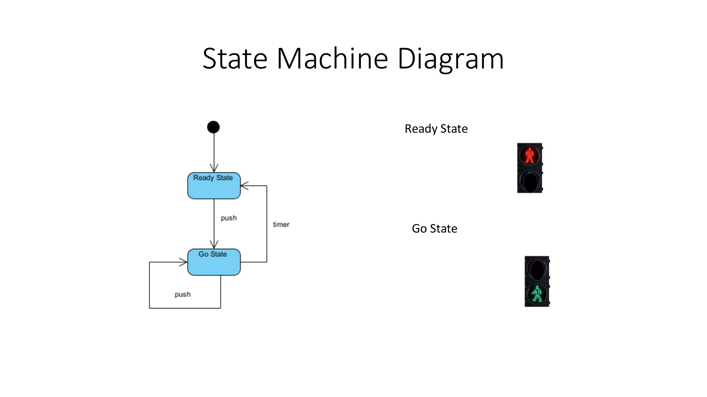
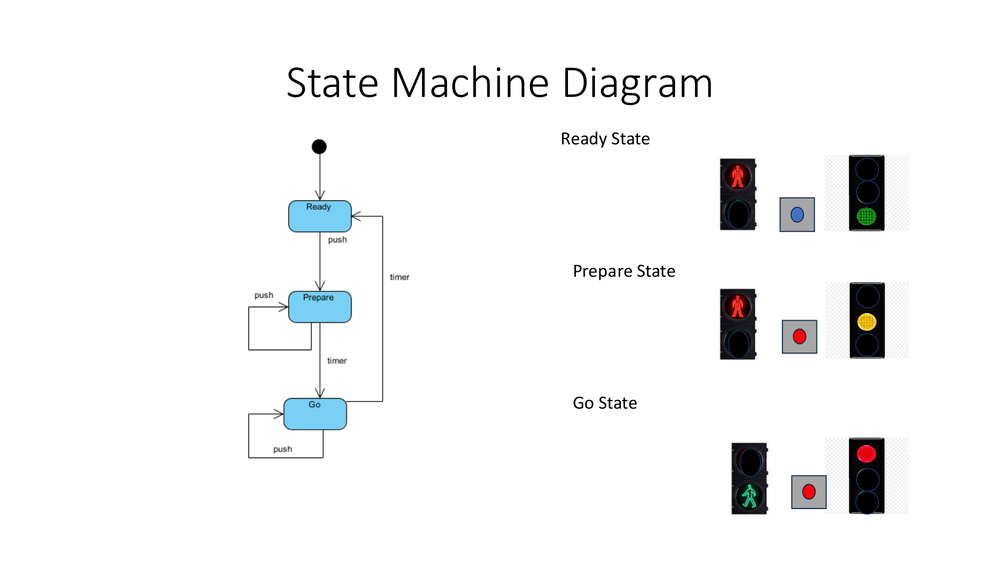
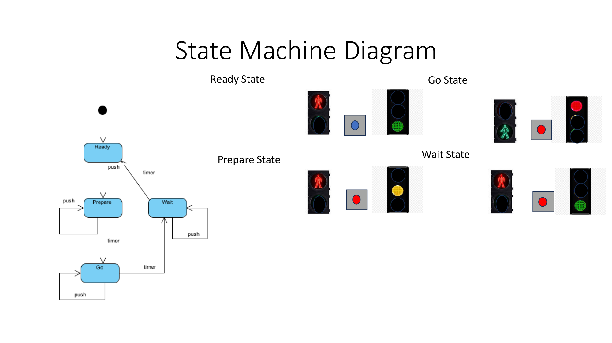
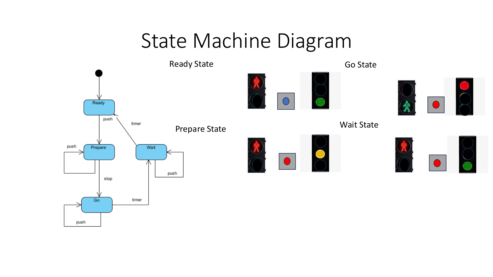
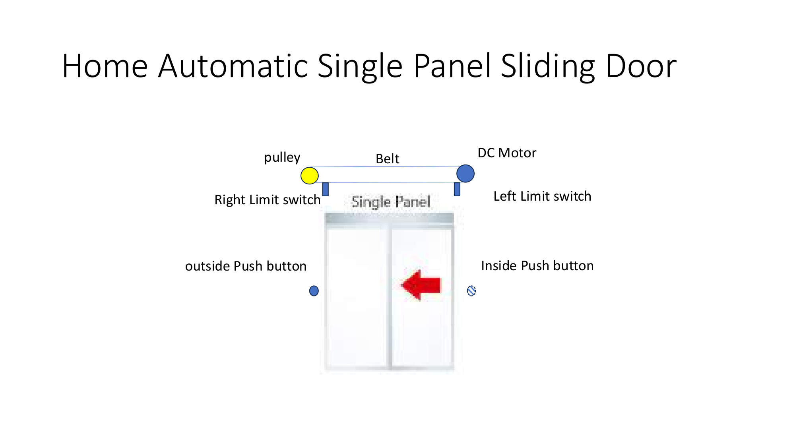

# ข้อกำหนด Mini-Project และแนวทางการดำเนินงาน (Embedded System 8051)

เอกสารอ้างอิง:
- เอกสารคำสั่งปฏิบัติการ: [Lab 2 for Mini-Project.pdf](../../LAB/manual/Lab%202%20for%20Mini-Project.pdf)
- เอกสารโครงงานตัวอย่าง: [Group 7_Smart door.pdf](../example-project/Group%207_Smart%20door.pdf)
- โฟลเดอร์จัดเก็บแผนภาพ: [images/](./images/)

---

## 1. ข้อกำหนดคำสั่งงานจากเอกสาร Lab 2 for Mini-Project

เนื้อหาในเอกสารคำสอนแบ่งออกเป็นสองส่วน ได้แก่ ทฤษฎีการออกแบบ Finite State Machine (หน้า 1 ถึง 10) และโจทย์โครงงาน Mini-Project (หน้า 11 ถึง 14)

### 1.1 กระบวนการออกแบบ Finite State Machine 5 ขั้นตอน (สไลด์หน้า 2)

1. **Define State:** กำหนดสถานะทั้งหมดที่ระบบสามารถเป็นไปได้
2. **Describe State:** ระบุสถานะการทำงานของสัญญาณควบคุมและอุปกรณ์ต่อพ่วงในแต่ละสถานะ (เช่น ระดับตรรกะ 0 หรือ 1 ของพอร์ตขับมอเตอร์และหลอดไฟ)
3. **Draw transition:** ลากเส้นเชื่อมโยงแสดงทิศทางการเปลี่ยนสถานะ
4. **Define transition:** กำหนดเงื่อนไขหรือเหตุการณ์ (Events) ที่กระตุ้นให้เกิดการเปลี่ยนสถานะ (เช่น การกดปุ่ม, สัญญาณจากสวิตช์จำกัดระยะ, สัญญาณตัวนับเวลา)
5. **Define Guard Condition:** กำหนดเงื่อนไขกำกับทางตรรกะที่ต้องเป็นจริงจึงจะอนุญาตให้เกิดการเปลี่ยนสถานะ

### 1.2 กรณีศึกษาตัวอย่างระบบสัญญาณไฟจราจร (สไลด์หน้า 3 ถึง 10)

เอกสารแสดงการพัฒนาระบบควบคุมตามลำดับขั้น:
- **ระบบ 2 สถานะ:** Ready State สลับกับ Go State โดยใช้สัญญาณปุ่มกดและตัวนับเวลา (สไลด์หน้า 4: )
- **ระบบ 3 สถานะ:** เพิ่ม Prepare State (ไฟเตือนสีเหลือง) คั่นระหว่างสถานะ (สไลด์หน้า 6: )
- **ระบบ 4 สถานะ:** เพิ่ม Wait State สำหรับการควบคุมจังหวะการข้ามถนนอย่างปลอดภัย (สไลด์หน้า 8: )
- **ระบบร่วมกับกล้อง AI:** กำหนดสัญญาณ Stop จากกล้องตรวจจับเป็น Guard Condition สำหรับสั่งหยุดการทำงานทันที (สไลด์หน้า 10: )

### 1.3 โจทย์ระบบตั้งต้น: Home Automatic Single Panel Sliding Door (สไลด์หน้า 11 ถึง 13)

ระบบตั้งต้นที่ผู้สอนกำหนดประกอบด้วยฮาร์ดแวร์พื้นฐาน 7 รายการ:
1. **Single Panel:** บานประตูเลื่อนเดี่ยว 1 บาน
2. **DC Motor:** มอเตอร์ไฟฟ้ากระแสตรงสำหรับขับเคลื่อนการเปิดและปิด
3. **Pulley and Belt:** มู่เล่ย์และสายพานส่งกำลังเชิงกล
4. **Left Limit Switch:** สวิตช์จำกัดระยะฝั่งซ้าย (ตรวจจับตำแหน่งเปิดสุดหรือปิดสุด)
5. **Right Limit Switch:** สวิตช์จำกัดระยะฝั่งขวา (ตรวจจับตำแหน่งเปิดสุดหรือปิดสุด)
6. **Inside Push Button:** สวิตช์ปุ่มกดสั่งเปิดจากภายในบ้าน
7. **Outside Push Button:** สวิตช์ปุ่มกดสั่งเปิดจากภายนอกบ้าน

**ลำดับการทำงานพื้นฐานเดิม:**
1. เมื่อมีการกดปุ่มเปิดจากภายในหรือภายนอก มอเตอร์จะเริ่มหมุนเพื่อเลื่อนเปิดประตู
2. เมื่อบานประตูเคลื่อนที่ไปกระทบ Limit Switch ฝั่งเปิด มอเตอร์จะหยุดหมุน
3. ระบบคงสถานะเปิดค้างไว้ตามเวลาที่กำหนดโดยฟังก์ชันตัวนับเวลา (Timer Delay)
4. เมื่อครบกำหนดเวลา มอเตอร์จะหมุนกลับทิศทางเพื่อเลื่อนปิดประตู
5. เมื่อบานประตูเคลื่อนที่ไปกระทบ Limit Switch ฝั่งปิด มอเตอร์จะหยุดหมุนและประตูปิดสนิท

### 1.4 ข้อกำหนดงาน Coursework (สไลด์หน้า 14)

ผู้สอนกำหนดให้ผู้เรียนดำเนินงาน 2 หัวข้อ:
1. **Draw Scenario to show a problem in application of the sliding door:** จัดทำภาพแสดงสถานการณ์เพื่อระบุปัญหาจากการใช้งานระบบประตูเลื่อนแบบตั้งต้น
2. **Write your own solution and draw a state machine diagram:** ระบุแนวทางการแก้ปัญหา และจัดทำ State Machine Diagram แสดงการทำงานของระบบที่พัฒนาขึ้นใหม่
3. **Remark:** กำหนดเงื่อนไขห้ามเลือกปัญหาและวิธีการแก้ไขซ้ำกับกลุ่มอื่น

---

## 2. การวิเคราะห์เอกสารโครงงานตัวอย่าง (กลุ่ม 7: Smart Door)

จากการวิเคราะห์เอกสารนำเสนอของกลุ่ม 7 ([Group 7_Smart door.pdf](../example-project/Group%207_Smart%20door.pdf)) โครงสร้างรายงานประกอบด้วย 11 หน้า:

| ลำดับหน้า | หัวข้อ | สาระสำคัญ |
| :--- | :--- | :--- |
| หน้า 1 | หน้าปก | ชื่อโครงงาน Smart Door (ประตูอัจฉริยะ), กลุ่มที่ 2, รายชื่อและรหัสนิสิตผู้จัดทำ |
| หน้า 2 | Scenario Diagram | ระบุปัญหา: ประตูเดิมไม่มีการตรวจสอบสิทธิ์ ทำให้บุคคลภายนอกสามารถเปิดเข้าบ้านได้ทันที วิธีการแก้ไข: เพิ่มระบบ Lock/Unlock โดยผู้ใช้ต้องกรอกรหัสผ่านผ่าน Keypad ให้ถูกต้อง ภาพประกอบ: จำลองสถานการณ์กรณีใส่รหัสผ่านถูกต้อง (ประตูเปิด) และกรณีใส่รหัสผ่านไม่ถูกต้อง (กระดิ่งเตือนดัง ประตูไม่เปิด) |
| หน้า 3 | State Machine Diagram | แผนภาพ FSM จำนวน 6 สถานะ ได้แก่ close, unlock, opening, open, closing, bell on พร้อมระบุเงื่อนไขการเปลี่ยนสถานะครบถ้วน |
| หน้า 4 | State Description | ตารางแจกแจงสถานะของอุปกรณ์ต่อพ่วงกับไมโครคอนโทรลเลอร์ 8051 ในทุกสถานะ (Motor, Bell, Red LED, Green LED) พร้อมระบุระดับตรรกะบนพอร์ต P1.0, P1.1, P1.4, P1.5, P1.7 |
| หน้า 5 | Hardware Diagram | แผนภาพการเชื่อมต่อวงจรรวมระหว่าง 8051, โมดูลไมโครคอนโทรลเลอร์เสริม (Arduino Uno รับค่าจาก Keypad 4x4 แล้วส่งระดับตรรกะเข้า P0.0), ชิปขับมอเตอร์ L293D, มอเตอร์ 12V DC, Limit Switches, ปุ่มกด และอุปกรณ์ส่งสัญญาณเตือน |
| หน้า 6 ถึง 11 | Assembly Code | ซอร์สโค้ดภาษาแอสเซมบลี 8051 แยกตามสถานะ (หน้า 6: Close State, หน้า 7: Bell On State, หน้า 8: Unlock State, หน้า 9: Opening State, หน้า 10: Open State, หน้า 11: Closing State และฟังก์ชัน delay หน่วงเวลาด้วย Timer 0) |

---

## 3. รายการเอกสารและข้อมูลที่ต้องจัดส่ง (Deliverables Checklist)

เพื่อให้รายงานครบถ้วนตามเกณฑ์การประเมิน เอกสารนำเสนอควรประกอบด้วย 6 ส่วน:

1. **หน้าปกโครงงาน:** ชื่อโครงงานภาษาไทยและอังกฤษ, หมายเลขกลุ่ม, ข้อมูลนิสิตผู้จัดทำ
2. **Scenario Diagram:** แผนภาพแสดงสถานการณ์ปัญหาของประตูเดิม และแผนภาพแสดงการทำงานของระบบใหม่เมื่อเกิดเหตุการณ์ต่างๆ
3. **State Machine Diagram:** แผนภาพ Finite State Machine ระบุ State, Transition, Event, Guard Condition และ Timer
4. **ตาราง State Description:** ตารางกำหนดสถานะทางกายภาพและระดับตรรกะ (0 หรือ 1) บนพอร์ตของ 8051 สำหรับทุกอุปกรณ์ในแต่ละสถานะ
5. **แผนผังวงจรฮาร์ดแวร์ (Hardware Diagram):** การเชื่อมต่อขาพอร์ตไมโครคอนโทรลเลอร์ 8051 กับไอซีขับมอเตอร์ L293D, มอเตอร์ไฟฟ้า, สวิตช์เซนเซอร์ และอุปกรณ์แสดงผล
6. **ซอร์สโค้ดภาษาแอสเซมบลี (8051 Assembly):** โครงสร้างโปรแกรมควบคุมแยกตามสถานะ พร้อมฟังก์ชันหน่วงเวลาด้วย Timer 0 สำหรับทดสอบบนโปรแกรมจำลอง EdSim51

---

## 4. ข้อเสนอแนะแนวทางการเลือกหัวข้อปัญหาและระบบควบคุม

เนื่องจากกลุ่ม 7 ได้ดำเนินงานในหัวข้อระบบรหัสผ่านความปลอดภัย (Keypad Password Access) ไปแล้ว ผู้จัดทำควรเลือกหัวข้อใหม่ที่ไม่ซ้ำซ้อนตามเงื่อนไข Remark:

### ตัวเลือกที่ 1: ระบบป้องกันการหนีบและสิ่งกีดขวาง (Anti-Pinch and Obstacle Safety System)
- **ปัญหาเดิม:** ประตูเลื่อนแบบเดิมเมื่อถึงกำหนดเวลาปิด (Closing) จะเคลื่อนที่ปิดทันที หากมีเด็ก ผู้สูงอายุ สัตว์เลี้ยง หรือสิ่งของกีดขวาง จะเกิดการหนีบกระแทก ทำให้เกิดอันตรายต่อชีวิตและทรัพย์สิน หรือมอเตอร์เกิดความเสียหาย
- **แนวทางการแก้ไข:**
  - ติดตั้ง Safety Optical Beam (เซนเซอร์ลำแสงอินฟราเรด) ขวางช่องประตู และ/หรือ เซนเซอร์ตรวจจับแรงต้านของมอเตอร์
  - เมื่อประตูกำลังปิด (`closing`) หากตรวจพบสิ่งกีดขวาง:
    1. ตัดการทำงานของมอเตอร์ทันที (`emergency_stop`)
    2. ส่งสัญญาณเสียงเตือน (Buzzer) และไฟเตือนสีแดงกะพริบ
    3. สั่งมอเตอร์หมุนกลับทิศทางเพื่อเปิดประตูออกทันที (`auto_reopening`) จนกระทั่งชนสวิตช์เปิดสุด
    4. หน่วงเวลารอให้สิ่งกีดขวางพ้นระยะปลอดภัย (`safe_wait`) ก่อนเริ่มกระบวนการปิดใหม่อีกครั้ง
- **จุดเด่นทางวิศวกรรม:** มีโครงสร้างสถานะฉุกเฉินและ Guard Condition ที่ชัดเจน สอดคล้องกับมาตรฐานความปลอดภัยของประตูอัตโนมัติในงานอุตสาหกรรมจริง

### ตัวเลือกที่ 2: ระบบประตูห้องปลอดเชื้อไร้สัมผัสและฆ่าเชื้อโรคด้วยรังสี UV-C (Touchless Cleanroom and UV-C Disinfection Door)
- **ปัญหาเดิม:** ปุ่มกดเดิมเป็นแหล่งสะสมเชื้อโรค และพื้นที่ทางเข้าไม่มีการฆ่าเชื้อโรคทางอากาศหลังการใช้งาน
- **แนวทางการแก้ไข:**
  - เปลี่ยนปุ่มกดเป็นเซนเซอร์ตรวจจับการเคลื่อนไหวของมือแบบไร้สัมผัส (Hand Wave Sensor)
  - เมื่อประตูปิดสนิทและไม่มีคนอยู่ในพื้นที่ ระบบจะเปิดหลอดกำเนิดรังสี UV-C ฆ่าเชื้อโรคตามเวลาที่กำหนด
  - หากตรวจพบคนเข้ามาใกล้ ระบบจะดับหลอด UV-C ทันทีเพื่อความปลอดภัยก่อนเปิดประตู
- **จุดเด่นทางวิศวกรรม:** มีการควบคุมอุปกรณ์ส่งกำลัง (Motor) ร่วมกับอุปกรณ์เฉพาะทาง (UV-C Relay) ภายใต้เงื่อนไขความปลอดภัย

### ตัวเลือกที่ 3: ระบบประตูเปิดสองระยะประหยัดพลังงานและป้องกันน้ำฝน (Dual-Width Energy Saving and Rain-Aware Door)
- **ปัญหาเดิม:** ประตูเปิดกว้างสุดบานทุกครั้ง ทำให้สูญเสียพลังงานความเย็นจากระบบปรับอากาศ และกรณีมีฝนตก ละอองฝนจะสาดเข้ามาในอาคาร
- **แนวทางการแก้ไข:**
  - เพิ่มเซนเซอร์ตรวจจับน้ำฝน (Rain Sensor) และสวิตช์จำกัดระยะเปิดครึ่งบาน (Half-Open Limit Switch)
  - ในสภาวะปกติคนเดินผ่าน ประตูเปิดเพียงครึ่งบานเพื่อประหยัดพลังงาน
  - หากผู้ใช้กดปุ่มเปิดเต็มบานเพื่อขนของ ประตูจะเปิดจนสุดระยะ
  - หากตรวจพบฝนตก ระบบจะไม่อนุญาตให้เปิดเต็มบานและลดระยะเวลาการเปิดค้างลง
- **จุดเด่นทางวิศวกรรม:** มีการแยกสถานะการทำงานตามโหมด (Multi-Mode FSM) แสดงการใช้ Guard Condition เชิงสภาพแวดล้อม

---

## 5. ลำดับขั้นตอนการดำเนินงาน (Work Breakdown Structure)

1. **การยืนยันหัวข้อโครงงาน:** เลือกปัญหาและแนวทางแก้ไข 1 หัวข้อ (แนะนำตัวเลือกที่ 1: ระบบป้องกันการหนีบและสิ่งกีดขวาง)
2. **การจัดทำ Scenario Diagram:** ร่างภาพจำลองสถานการณ์ Outdoor, Indoor, ปัญหาที่พบ และระบบการทำงานใหม่ที่แก้ไขปัญหา
3. **การออกแบบ State Machine Diagram:** ระบุชื่อสถานะ, เส้นทางการเปลี่ยนสถานะ, สัญญาณกระตุ้น, Guard Conditions และเงื่อนไขตัวนับเวลา
4. **การจัดทำตาราง State Description:** กำหนดค่าตรรกะของขาพอร์ต P0, P1, P2 บน 8051
5. **การออกแบบวงจรฮาร์ดแวร์ (Hardware Schematic):** กำหนดการต่อวงจรไอซี L293D, มอเตอร์ไฟฟ้า, สวิตช์เซนเซอร์ และอุปกรณ์เตือน
6. **การพัฒนาและทดสอบโค้ดภาษาแอสเซมบลี 8051:** เขียนโค้ดควบคุมแยกตามแต่ละสถานะ และทดสอบบนโปรแกรมจำลอง EdSim51
7. **การรวบรวมเป็นเอกสารนำเสนอ (PDF):** จัดรูปเล่มสไลด์ขนาด 10 ถึง 12 หน้าสำหรับนำส่งผู้สอน
