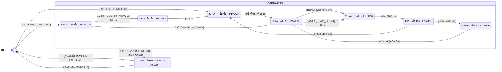

# ข้อ 56: ประตูบานเลื่อนเดี่ยวในบ้าน

**วิชา 305341 Embedded Systems 1 · กลุ่ม 1**  
นายธีรภัทร ภู่ระย้า 66362416 และนางสาวปราณปรียา ศรียอง 66363116  
อาจารย์ ดร.แสงชัย มังกรทอง

ระบบใช้ AT89S52 ที่ 12.000 MHz แบบ 12T จึงมี machine cycle เท่ากับ 1 µs ใช้ปุ่มเปิดด้านในและด้านนอก ปุ่มปิดหนึ่งปุ่ม และโฟโต้เซนเซอร์ Through-beam หนึ่งแนว **ไม่มีตัวนับเวลาปิดอัตโนมัติ** เมื่อพบสิ่งกีดขวางขณะปิด จะตัดแรงขับ พักอย่างน้อย 200 ms เปิดกลับจนสุด แล้วรอคนตรวจทางผ่านและกดปิดใหม่

ชุดนี้ใช้ผังพอร์ตและพฤติกรรมที่กำหนดในเอกสารส่งงาน โดยแยกข้อบกพร่องของโค้ดต้นทางไว้ในรายงานตรวจสอบ ไม่คัดลอกข้อบกพร่องเหล่านั้นมาเป็นคำตอบสอบ

## 1. แผนฝึกเขียนคำตอบภายใน 15 นาที

| เวลา | สิ่งที่เขียน |
|---|---|
| นาที 0–4 | วาด 7 สถานะหลัก เพิ่ม FAULT และลูกศรพร้อมเงื่อนไข |
| นาที 4–6 | ตาราง P0, P1 และทิศเพลา ระบุว่าไฟกับ RUN_N เป็น Active-low |
| นาที 6–12 | เขียนโค้ดลำดับสถานะและส่วน CLOSING → REV_WAIT → REOPENING |
| นาที 12–15 | เขียน Timer 0, เงื่อนไขปล่อยแล้วกดปิดใหม่ และการตัดเข้าภาวะ FAULT |

ส่วนที่ 6 เป็นคำตอบย่อแบบใช้ซับรูทีนร่วมกับคำอธิบายหน้าที่ เหมาะสำหรับฝึกเขียนเหตุผลและลำดับคำสั่ง ไม่ใช่ไฟล์ที่ประกอบได้ลำพัง หากข้อสอบกำหนดให้เขียนคำสั่งของทุกซับรูทีน ต้องขยายจากโค้ดเต็มในส่วนที่ 7 เวลา 15 นาทีเป็นแผนฝึก ไม่ใช่ผลจับเวลาการคัดโค้ดเต็ม

## 2. ผังพอร์ตที่ต้องจำ

| พอร์ต | หน้าที่ | ระดับที่ทำงาน |
|---|---|---|
| P2.0, P2.1 | PB_IN, PB_OUT | 0 = กดเปิด |
| P2.2 | BEAM_DET | 0 = แสงขาด, 1 = แสงผ่าน |
| P2.3, P2.4 | LO, LC | 0 = ถึงลิมิต |
| P2.5 | PB_CLOSE ขา 26 | 0 = กดปิด |
| P2.6 | ไม่ใช้ | Pull-up |
| P2.7 | ESTOP หน้าสัมผัส NC2 | 0 = ปกติ, 1 = กดหยุดหรือวงจรเปิด |
| P1.0, P1.1 | IN1, IN2 | เรียงเป็น IN1 IN2: 10 เปิด, 01 ปิด, 00 หยุด |
| P1.2 | RUN_N | 1 = ตัดแรงขับ, 0 = ขอขับมอเตอร์ |
| P1.4, P1.5, P1.6 | RED_N, GREEN_N, ORANGE_N | 0 = ไฟติด |
| P1.3, P1.7 | สำรอง | คงค่า 1 |
| P0.2…P0.0 | รหัสสถานะ | P0 = F8H OR State |

P0 เป็น open-drain ต้องมี pull-up 10 kΩ แยกแต่ละบิตที่ใช้ ส่วน P2 ต้องเขียน latch เป็น FFH ตอนเริ่มโปรแกรม

สัญญาณ RUN_N ผ่าน SN74HCT14 แล้วผ่าน NC1 ของ E-stop ไปยัง EN1 ขา 1 ของ L293D เมื่อ RUN_N = 1 จะได้ EN1 = 0 เอาต์พุตขับมอเตอร์เป็น High-Z จึงปล่อยไหล ไม่ใช่เบรกทางไฟฟ้า

ระวังการเรียงบิต: คำว่า IN1 IN2 = 10 ไม่ใช่การเขียนเลขฐานสองของ P1.1 P1.0 ซึ่งเรียงกลับกัน

## 3. แผนภาพสถานะ

แบบจำลองมี 7 สถานะทำงานและ FAULT เอาต์พุตในแต่ละสถานะเป็นแบบ Moore ลูกศรใช้เหตุการณ์กับเงื่อนไข ส่วน S เป็นตัวแปรจำเหตุเปิดกลับ: S = SAFETY_SEEN



OPERATING เป็นขอบเขตรวมสถานะ ไม่ใช่สถานะที่ 9 เครื่องหมาย `/` บนลูกศรสองเส้นใช้ตามความหมาย “ทำ action นี้เมื่อเปลี่ยนสถานะ” ไม่ใช่เอาต์พุตมอเตอร์แบบ Mealy

**พร้อมปิด** หมายถึง BEAM_DET = 1 และ PB_IN = PB_OUT = 1 ต้องปล่อย PB_CLOSE คงที่อย่างน้อย 20 ms หลังเข้ารอ แล้วกดใหม่คงที่ 20 ms ถ้ากดตอนเงื่อนไขไม่ผ่าน ให้ทิ้งคำสั่งและกลับไปรอปล่อยปุ่ม ไม่รอให้แสงกลับแล้วปิดเอง

**ลำดับความสำคัญขณะปิด:** E-stop และลิมิตขัดแย้ง → ลำแสงขาด → ปุ่มเปิด → ถึง LC → หมดเวลาวิ่ง หากยังไม่มีเงื่อนไขเปลี่ยนสถานะ ให้คงสถานะเดิม

การเขียน “Moore” ในที่นี้หมายถึงเอาต์พุตมอเตอร์และ LED ขึ้นกับสถานะหลัก ส่วนตัวแปร S และตัวจับเวลาเป็นหน่วยความจำประกอบ หากแจกแจงสถานะภายในทุกบิต แบบจำลองจะละเอียดกว่ากล่องสถานะหลักทั้ง 8 กล่อง

## 4. ตารางเอาต์พุต P1 และ P0 Monitor

ค่า LED ในตารางเป็นระดับลอจิก 0 หมายถึงไฟติด ทิศเพลามองเข้าหาปลายเพลา

| รหัส | สถานะ | เพลา | IN1 | IN2 | RUN_N | RED_N | GREEN_N | ORANGE_N | P1 | P0 |
|---:|---|---|---:|---:|---:|---:|---:|---:|---|---|
| 0 | CLOSED | STOP | 0 | 0 | 1 | 0 | 1 | 1 | ECH | F8H |
| 1 | OPENING | CW | 1 | 0 | 0 | 1 | 0 | 1 | D9H | F9H |
| 2 | OPEN_HOLD | STOP | 0 | 0 | 1 | 1 | 0 | 1 | DCH | FAH |
| 3 | CLOSING | CCW | 0 | 1 | 0 | 0 | 1 | 1 | EAH | FBH |
| 4 | REV_WAIT | Coast | 0 | 0 | 1 | 1 | 1 | 1 | FCH | FCH |
| 5 | REOPENING | CW | 1 | 0 | 0 | 1 | 0 | 1 | D9H | FDH |
| 6 | SAFETY_HOLD | STOP | 0 | 0 | 1 | 1 | 1 | 0 | BCH | FEH |
| 7 | FAULT | Coast | 0 | 0 | 1 | 1 | 1 | 1 | FCH | FFH |

ตัวอย่าง CLOSED: เรียงบิต P1.7 ถึง P1.0 ได้ `1110 1100B = ECH` บิต 3 และ 7 เป็น 1 เสมอ

ก่อนขับเปิดให้เขียน DDH ขณะ RUN_N = 1 แล้วจึง CLR P1.2 จนเป็น D9H ก่อนขับปิดให้เขียน EEH แล้ว CLR P1.2 จนเป็น EAH

## 5. เวลาและเหตุผลของการหน่วง

| ช่วงเวลา | วิธีนับ | หน้าที่ |
|---|---|---|
| 20 ms | Timer 0 Mode 1, TH0=B1H, TL0=E0H | กรองการปล่อยและการกดปุ่ม |
| อย่างน้อย 200 ms | 10 ช่วง ช่วงละ 20 ms | ตัดแรงขับค้างก่อนกลับทิศ |
| ประมาณ 5 s | 250 ช่วง ช่วงละ 20 ms | จำกัดเวลาวิ่งแต่ละเที่ยว |

`65536 − 20000 = 45536 = B1E0H` ที่ 12 MHz แบบ 12T ไทเมอร์เพิ่มค่าทุก 1 µs

20 ms คือช่วงที่ไทเมอร์นับ เวลาเรียกซับรูทีน โหลดค่า และตรวจเงื่อนไขเป็น overhead เพิ่มเติม ดังนั้น 250 รอบไม่ได้รับประกันเส้นตายที่ 5.000000 s พอดี ต้องไม่เรียกว่า “ไม่เกิน 5.0 s แน่นอน” โค้ดอ้างอิงใช้เวลา nominal 5 s ตามวิธีนับรอบที่กำหนด

ช่วง Coast ลดการกลับทิศแบบกระชาก แต่ไม่รับประกันว่าเพลาหยุดแล้วหรือไม่มีแรงดันเหนี่ยวนำกระชาก การยืนยันต้องวัดกับมอเตอร์และภาคขับจริง

## 6. โค้ดลำดับหลักแบบย่อสำหรับเขียนอธิบายในข้อสอบ

ใช้ชื่อตัวช่วยพร้อมระบุหน้าที่ด้านล่าง ห้ามอ้างว่าส่วนย่อนี้ประกอบได้เดี่ยว ๆ

```asm
; S = 20H.0, P2 initialized to FFH, Timer 0 Mode 1
INIT:
    SETB P1.2
    MOV P1,#0FCH
    MOV SP,#2FH
    MOV P2,#0FFH
    MOV TMOD,#01H
    LCALL CHECK_INITIAL_POSITION
    ; ไป CLOSED, OPEN_HOLD หรือ FAULT ตาม LO/LC และ ESTOP

CLOSED:
    MOV A,#0
    LCALL ENTER
    LCALL WAIT_OPEN_20MS
OPENING:
    MOV A,#1
    LCALL ENTER
    LCALL WAIT_LO_5S
    LJMP OPEN_HOLD

OPEN_HOLD:
    MOV A,#2
    SJMP HOLD
SAFETY_HOLD:
    MOV A,#6
HOLD:
    LCALL ENTER
    LCALL FRESH_CLOSE_20MS
    CLR 20H.0
CLOSING:
    MOV A,#3
    LCALL ENTER
    MOV R7,#250
    LCALL TIMER_START
CLOSE_LOOP:
    LCALL CHECK
    JNB P2.2,OBSTACLE
    JNB P2.0,MANUAL_OPEN
    JNB P2.1,MANUAL_OPEN
    JNB P2.4,CLOSE_END
    JNB TF0,CLOSE_LOOP
    DJNZ R7,CLOSE_TICK
    LJMP FAULT
CLOSE_TICK:
    LCALL TIMER_START
    SJMP CLOSE_LOOP
CLOSE_END:
    SETB P1.2
    LJMP CLOSED
OBSTACLE:
    SETB P1.2
    MOV P1,#0FCH
    SETB 20H.0
    SJMP REV_WAIT
MANUAL_OPEN:
    SETB P1.2
    MOV P1,#0FCH
    CLR 20H.0
REV_WAIT:
    MOV A,#4
    LCALL ENTER
    MOV R6,#10
COAST:
    LCALL DELAY_20MS
    DJNZ R6,COAST
REOPENING:
    MOV A,#5
    LCALL ENTER
    LCALL WAIT_LO_5S
    JB 20H.0,SAFETY_HOLD
    LJMP OPEN_HOLD
FAULT:
    SETB P1.2
    MOV P0,#0FFH
    MOV P1,#0FCH
    MOV SP,#2FH
    LCALL MANUAL_RESET
    LJMP INIT
```

ซับรูทีนที่ต้องอธิบายประกอบคำตอบ:

| ชื่อ | หน้าที่ที่ห้ามละ |
|---|---|
| CHECK_INITIAL_POSITION | ตรวจ ESTOP และลิมิตทั้งคู่ ไม่สมมติว่าเริ่ม CLOSED ทุกครั้ง |
| ENTER(A) | SETB P1.2 ก่อน ตั้ง P0=F8H OR A ตั้งทิศขณะปิด EN แล้วจึงใช้ค่า P1 ของสถานะ |
| WAIT_OPEN_20MS | PB_IN หรือ PB_OUT คงที่ 20 ms พร้อมตรวจ global trip |
| WAIT_LO_5S | ตรวจ LO กับ global trip ระหว่างรอ จำกัดเวลาวิ่ง nominal 5 s และตัดขับทันทีที่รับรู้ LO |
| FRESH_CLOSE_20MS | ปล่อยปุ่ม 20 ms แล้วรอกดใหม่ 20 ms ตรวจ beam และปุ่มเปิด ถ้าไม่ผ่านต้องทิ้งคำสั่ง |
| CHECK | ESTOP=1 หรือ LO=LC=0 ให้ไป FAULT แบบไม่กลับมารันงานเดิม |
| DELAY_20MS | ใช้ B1E0H และยังตรวจ global trip ในลูป ห้ามหยุดตรวจ E-stop นาน 20 ms |
| MANUAL_RESET | รอปล่อยแล้วกดปุ่มรีเซ็ต ตรวจ E-stop และกลับ INIT เพื่อตรวจตำแหน่งใหม่ |

คำสั่งหลักของ Timer 0 ที่ควรเขียนเพิ่ม:

```asm
TIMER_START:
    CLR TR0
    MOV TH0,#0B1H
    MOV TL0,#0E0H
    CLR TF0
    SETB TR0
    RET

; ลูปด้านล่างแสดงกรณี Coast ซึ่งต้องนับเต็มช่วง
DELAY_20MS:
    LCALL TIMER_START
T_WAIT:
    LCALL CHECK
    JNB TF0,T_WAIT
    CLR TR0
    CLR TF0
    RET
```

จุดสำคัญในการอธิบาย: CLOSING ตรวจลำแสงซ้ำใน CLOSE_LOOP ระหว่างที่ไทเมอร์กำลังนับ ไม่ใช้การหน่วง 20 ms แบบหยุดตรวจเซนเซอร์ แล้ว SETB P1.2 ก่อนเขียนทิศหรือเปลี่ยนสถานะทุกครั้ง

## 7. โค้ดเต็มและหลักฐานตรวจสอบ

โค้ดเต็มแยกไว้สำหรับประกอบและจำลองจริง ใช้รูทีนร่วมเพื่อลดโค้ดซ้ำ แต่รักษาลอจิกปล่อยปุ่มแล้วกดใหม่ รวมถึงตรวจลิมิตขัดแย้งในทุกสถานะ ผลทดสอบของโค้ดนี้ต้องไม่อ้างว่าเป็นผลทดสอบของไฟล์ส่งงานเดิม

โค้ดอ้างอิงที่ประกอบได้: @[/Users/3rapat/student/internship/CODEFIN/project/cwms/vahalla-wealth/private-docs/other-project/uni-work/embedded-system/1/mini-project/exam-prep/question56/Q56_REFERENCE.asm]
ผลทดสอบ EdSim51: @[/Users/3rapat/student/internship/CODEFIN/project/cwms/vahalla-wealth/private-docs/other-project/uni-work/embedded-system/1/mini-project/exam-prep/question56/REFERENCE_TEST_RESULTS.txt]
รายงานเทียบต้นฉบับและการตรวจ 5 รอบ: @[/Users/3rapat/student/internship/CODEFIN/project/cwms/vahalla-wealth/private-docs/other-project/uni-work/embedded-system/1/mini-project/exam-prep/question56/CONSISTENCY_AUDIT.md]

## 8. เช็กก่อนส่งคำตอบ

- มี CLOSED, OPENING, OPEN_HOLD, CLOSING, REV_WAIT, REOPENING, SAFETY_HOLD และ FAULT
- ไม่มีลูกศรปิดเองเมื่อครบเวลา หรือเมื่อลำแสงกลับมาปกติ
- ใช้ PB_CLOSE ที่ P2.5 และ BEAM_DET ตัวเดียวที่ P2.2
- เขียน STOP/Coast ว่าตัดแรงขับ ไม่เรียกว่าเบรกไฟฟ้า
- ไฟส้มติดเฉพาะ SAFETY_HOLD และต้องกดปิดใหม่
- แยก E-stop ที่ฮาร์ดแวร์ NC1 ออกจากอินพุตแจ้งเหตุ NC2 ที่ P2.7
- ใช้ P1: EC, D9, DC, EA, FC, D9, BC, FC ตามลำดับ ไม่ใช้ค่ารุ่นก่อน
- ใช้ Timer 0 B1E0H และอธิบาย overhead ตามจริง

## แหล่งอ้างอิง

เอกสารโครงงาน: @[/Users/3rapat/student/internship/CODEFIN/project/cwms/vahalla-wealth/private-docs/other-project/uni-work/embedded-system/1/mini-project/submission/Sliding_Door_Safety_Control_Infrared_FSM.pdf]

เฟิร์มแวร์ต้นทาง: @[/Users/3rapat/student/internship/CODEFIN/project/cwms/vahalla-wealth/private-docs/other-project/uni-work/embedded-system/1/mini-project/submission/firmware/SLIDING_DOOR_V2.asm]

ตำแหน่งขาและคุณสมบัติพอร์ตตรวจประกอบกับ [AT89S52 datasheet](https://ww1.microchip.com/downloads/en/DeviceDoc/doc1919.pdf) ส่วนการตัด Enable และ High-Z อ้างอิง [L293D datasheet](https://www.ti.com/lit/ds/symlink/l293d.pdf)
