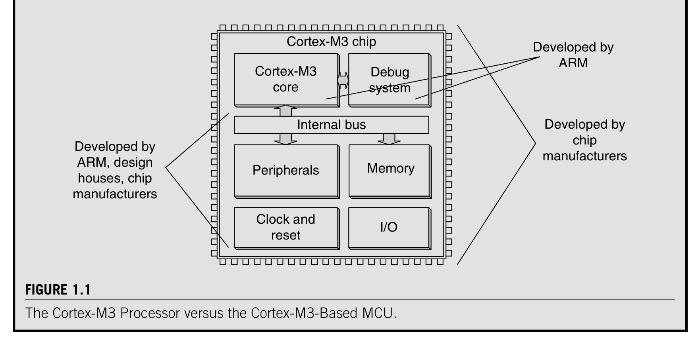
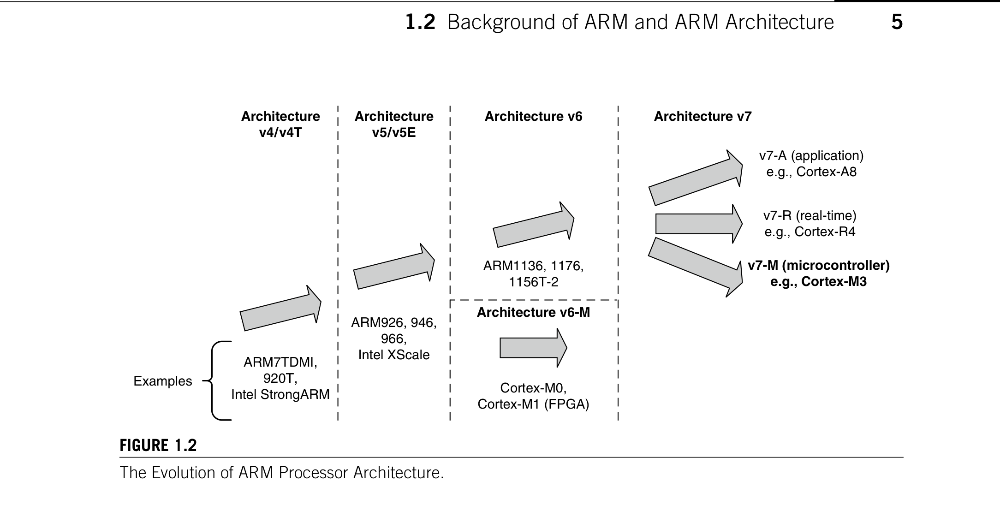
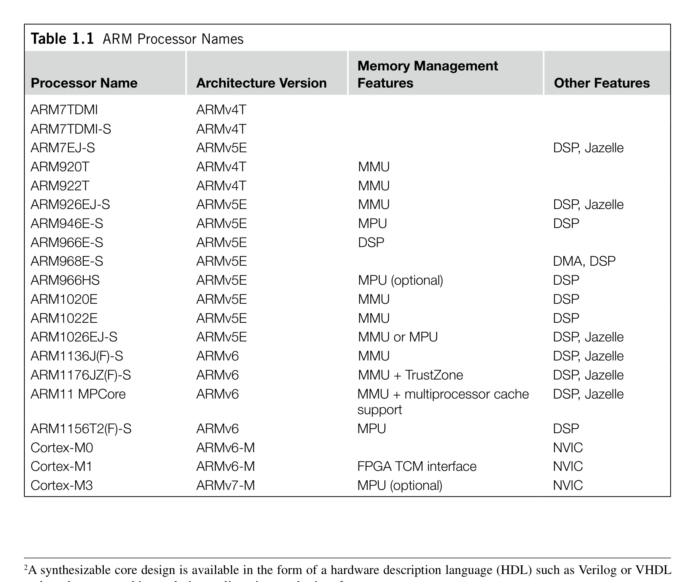
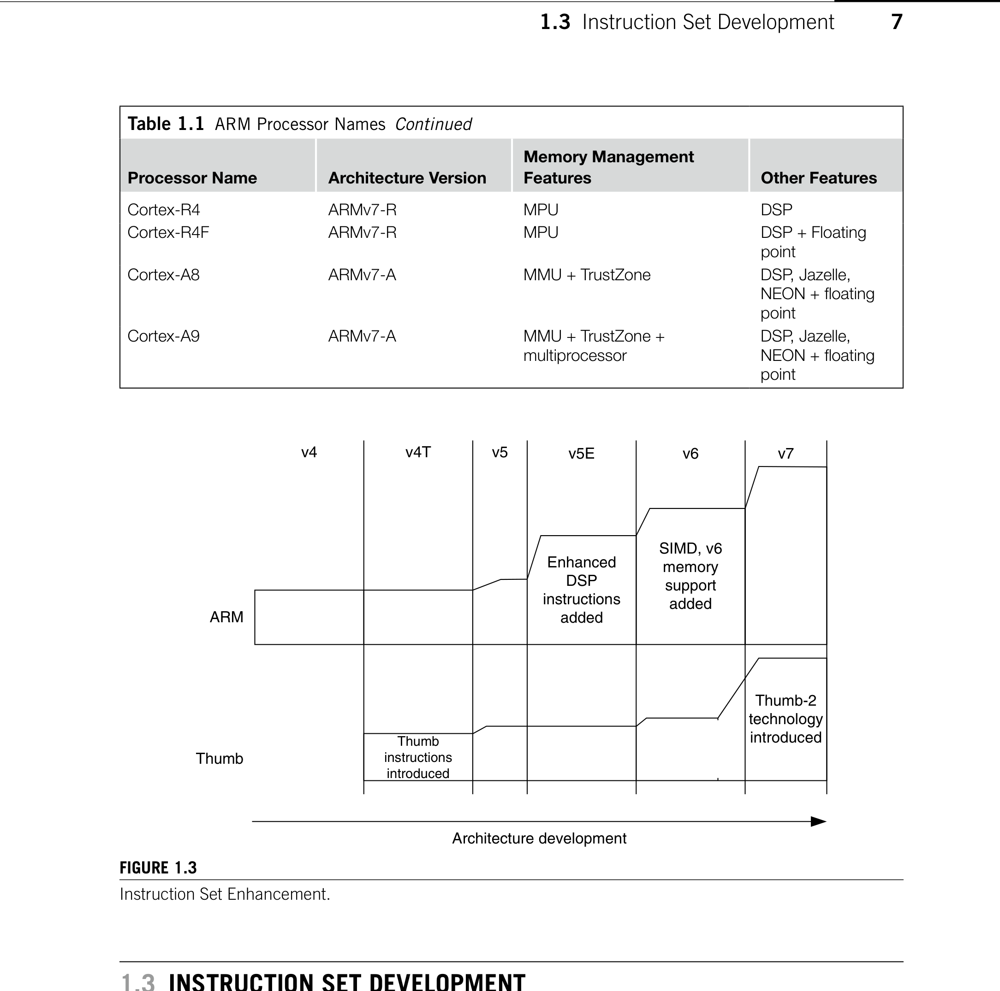
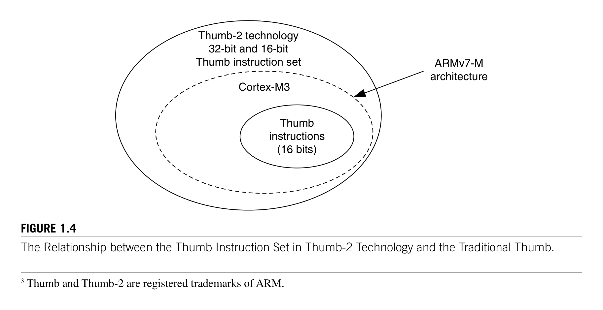

# Chapter
1. Introduction

> **Source PDF**: THE_DEFINITIVE_GUIDE_TO_THE_ARM_CORTEX-МЗ_Stellaris_MCU_9000Series_TEINSTRUMENTS_ARM_SECOND_EDITION.pdf  
> **PDF Page Range**: 28 - 37

---

<!-- Page 28 -->
### [PDF Page 28]

1
Copyright © 2010, Elsevier Inc. All rights reserved.
DOI: 10.1016/B978-0-12-382091-4.00007-4
In This Chapter
What Is the ARM Cortex-M3 Processor?..................................................................................................... 1
Background of ARM and ARM Architecture................................................................................................. 2
Instruction Set Development...................................................................................................................... 7
The Thumb-2 Technology and Instruction Set Architecture.......................................................................... 8
Cortex-M3 Processor Applications............................................................................................................. 9
Organization of This Book........................................................................................................................ 10
Further Reading....................................................................................................................................... 10
CHAPTER
Introduction
1

## 1.1  What Is the ARM Cortex-M3 Processor?

The microcontroller market is vast, with more than 20 billion devices per year estimated to be shipped
in 2010. A bewildering array of vendors, devices, and architectures is competing in this market. The
requirement for higher performance microcontrollers has been driven globally by the industry’s chang-
ing needs; for example, microcontrollers are required to handle more work without increasing a prod-
uct’s frequency or power. In addition, microcontrollers are becoming increasingly connected, whether
by Universal Serial Bus (USB), Ethernet, or wireless radio, and hence, the processing needed to support
these communication channels and advanced peripherals are growing. Similarly, general application
complexity is on the increase, driven by more sophisticated user interfaces, multimedia requirements,
system speed, and convergence of functionalities.
The ARM Cortex™-M3 processor, the first of the Cortex generation of processors released by ARM
in 2006, was primarily designed to target the 32-bit microcontroller market. The Cortex-M3 processor
provides excellent performance at low gate count and comes with many new features previously avail-
able only in high-end processors. The Cortex-M3 addresses the requirements for the 32-bit embedded
processor market in the following ways:
•
Greater performance efficiency: allowing more work to be done without increasing the frequency
or power requirements
•
Low power consumption: enabling longer battery life, especially critical in portable products
including wireless networking applications

<!-- Page 29 -->
### [PDF Page 29]

2
CHAPTER 1  Introduction
•
Enhanced determinism: guaranteeing that critical tasks and interrupts are serviced as quickly as
possible and in a known number of cycles
•
Improved code density: ensuring that code fits in even the smallest memory footprints
•
Ease of use: providing easier programmability and debugging for the growing number of 8-bit and
16-bit users migrating to 32 bits
•
Lower cost solutions: reducing 32-bit-based system costs close to those of legacy 8-bit and 16-bit
devices and enabling low-end, 32-bit microcontrollers to be priced at less than US$1 for the first time
•
Wide choice of development tools: from low-cost or free compilers to full-featured development
suites from many development tool vendors
Microcontrollers based on the Cortex-M3 processor already compete head-on with devices based
on a wide variety of other architectures. Designers are increasingly looking at reducing the system cost,
as opposed to the traditional device cost. As such, organizations are implementing device aggregation,
whereby a single, more powerful device can potentially replace three or four traditional 8-bit devices.
Other cost savings can be achieved by improving the amount of code reuse across all systems.
Because Cortex-M3 processor-based microcontrollers can be easily programmed using the C language
and are based on a well-established architecture, application code can be ported and reused easily,
reducing development time and testing costs.
It is worthwhile highlighting that the Cortex-M3 processor is not the first ARM processor to be used
to create generic microcontrollers. The venerable ARM7 processor has been very successful in this
market, with partners such as NXP (Philips), Texas Instruments, Atmel, OKI, and many other vendors
delivering robust 32-bit Microcontroller Units (MCUs). The ARM7 is the most widely used 32-bit
embedded processor in history, with over 1 billion processors produced each year in a huge variety of
electronic products, from mobile phones to cars.
The Cortex-M3 processor builds on the success of the ARM7 processor to deliver devices that are
significantly easier to program and debug and yet deliver a higher processing ­capability. ­Additionally,
the Cortex-M3 processor introduces a number of features and technologies that meet the specific
requirements of the microcontroller applications, such as nonmaskable interrupts for critical tasks,
highly deterministic nested vector interrupts, atomic bit manipulation, and an optional Memory Protec-
tion Unit (MPU). These factors make the Cortex-M3 processor attractive to existing ARM processor
users as well as many new users considering use of 32-bit MCUs in their ­products.

## 1.2  Background of ARM and ARM Architecture

1.2.1  A Brief History
To help you understand the variations of ARM processors and architecture versions, let’s look at a little
bit of ARM history.
ARM was formed in 1990 as Advanced RISC Machines Ltd., a joint venture of Apple Computer,
Acorn Computer Group, and VLSI Technology. In 1991, ARM introduced the ARM6 processor ­family,
and VLSI became the initial licensee. Subsequently, additional companies, including Texas Instru-
ments, NEC, Sharp, and ST Microelectronics, licensed the ARM processor designs, extending the
applications of ARM processors into mobile phones, computer hard disks, personal digital assistants
(PDAs), home entertainment systems, and many other consumer products.

<!-- Page 30 -->
### [PDF Page 30]

*Description*: Technical diagram and schematic illustration detailing hardware circuit topology, signal routing, and logic operations for Figure 1.1.

> **Figure 1.1**

3
Nowadays, ARM partners ship in excess of 2 billion ARM processors each year. Unlike many
semiconductor companies, ARM does not manufacture processors or sell the chips directly. Instead,
ARM licenses the processor designs to business partners, including a majority of the world’s leading
semiconductor companies. Based on the ARM low-cost and power-efficient processor designs, these
partners create their processors, microcontrollers, and system-on-chip solutions. This business model
is commonly called intellectual property (IP) licensing.
In addition to processor designs, ARM also licenses systems-level IP and various software IPs.
To support these products, ARM has developed a strong base of development tools, hardware, and
­software products to enable partners to develop their own products.
1.2.2  Architecture Versions
Over the years, ARM has continued to develop new processors and system blocks. These include the
popular ARM7TDMI processor and, more recently, the ARM1176TZ(F)-S processor, which is used
in high-end applications such as smart phones. The evolution of features and enhancements to the
­processors over time has led to successive versions of the ARM architecture. Note that architecture
­version numbers are independent from processor names. For example, the ARM7TDMI processor is
based on the ARMv4T architecture (the T is for Thumb® instruction mode support).
The Cortex-M3 Processor versus Cortex-M3-Based MCUs
The Cortex-M3 processor is the central processing unit (CPU) of a microcontroller chip. In addition, a
number of other components are required for the whole Cortex-M3 processor-based microcontroller. After chip
manufacturers license the Cortex-M3 processor, they can put the Cortex-M3 processor in their silicon designs,
adding memory, peripherals, input/output (I/O), and other features. Cortex-M3 processor-based chips from
different manufacturers will have different memory sizes, types, peripherals, and features. This book focuses on
the architecture of the processor core. For details about the rest of the chip, readers are advised to check the
particular chip manufacturer’s documentation.

## 1.2  Background of ARM and ARM Architecture

Figure 1.1
The Cortex-M3 Processor versus the Cortex-M3-Based MCU.
Cortex-M3
core
Debug
system
Memory
Peripherals
Internal bus
Clock and
reset
I/O
Cortex-M3 chip
Developed by
ARM
Developed by
chip
manufacturers
Developed by
ARM, design
houses, chip
manufacturers

<!-- Page 31 -->
### [PDF Page 31]

4
CHAPTER 1  Introduction
The ARMv5E architecture was introduced with the ARM9E processor families, including the
ARM926E-S and ARM946E-S processors. This architecture added “Enhanced” Digital Signal
­Processing (DSP) instructions for multimedia applications.
With the arrival of the ARM11 processor family, the architecture was extended to the ARMv6. New

### features in this architecture included memory system features and Single Instruction–Multiple Data

(SIMD) instructions. Processors based on the ARMv6 architecture include the ARM1136J(F)-S, the
ARM1156T2(F)-S, and the ARM1176JZ(F)-S.
Following the introduction of the ARM11 family, it was decided that many of the new technologies,
such as the optimized Thumb-2 instruction set, were just as applicable to the lower cost markets of micro-
controller and automotive components. It was also decided that although the architecture needed to be con-
sistent from the lowest MCU to the highest performance application processor, there was a need to deliver
processor architectures that best fit applications, enabling very deterministic and low gate count processors
for cost-sensitive markets and feature-rich and high-performance ones for high-end applications.
Over the past several years, ARM extended its product portfolio by diversifying its CPU develop­
ment, which resulted in the architecture version 7 or v7. In this version, the architecture design is
divided into three profiles:
The
•
A profile is designed for high-performance open application platforms.
The
•
R profile is designed for high-end embedded systems in which real-time performance is
needed.
The
•
M profile is designed for deeply embedded microcontroller-type systems.
Let’s look at these profiles in a bit more detail:
•
A Profile (ARMv7-A): Application processors which are designed to handle complex applications
such as high-end embedded operating systems (OSs) (e.g., Symbian, Linux, and Windows
Embedded). These processors requiring the highest processing power, virtual memory system
support with memory management units (MMUs), and, optionally, enhanced Java support and a
secure program execution environment. Example products include high-end mobile phones and
electronic wallets for financial transactions.
•
R Profile (ARMv7-R): Real-time, high-performance processors targeted primarily at the higher end
of the real-time1 market—those applications, such as high-end breaking systems and hard drive
controllers, in which high processing power and high reliability are essential and for which low
latency is important.
•
M Profile (ARMv7-M): Processors targeting low-cost applications in which processing efficiency is
important and cost, power consumption, low interrupt latency, and ease of use are critical, as well
as industrial control applications, including real-time control systems.
The Cortex processor families are the first products developed on architecture v7, and the ­Cortex-M3
processor is based on one profile of the v7 architecture, called ARM v7-M, an architecture specification
for microcontroller products.
1 There is always great debate as to whether we can have a “real-time” system using general processors. By definition, “real
time” means that the system can get a response within a guaranteed period. In any processor-based system, you may or may
not be able to get this response due to choice of OS, interrupt latency, or memory latency, as well as if the CPU is running a
higher priority interrupt.

<!-- Page 32 -->
### [PDF Page 32]

*Description*: Technical diagram and schematic illustration detailing hardware circuit topology, signal routing, and logic operations for Figure 1.2.

> **Figure 1.2**

5

## 1.2  Background of ARM and ARM Architecture

This book focuses on the Cortex-M3 processor, but it is only one of the Cortex product families
that use the ARMv7 architecture. Other Cortex family processors include the Cortex-A8 (application
processor), which is based on the ARMv7-A profile, and the Cortex-R4 (real-time processor), which is
based on the ARMv7-R profile (see Figure 1.2).
The details of the ARMv7-M architecture are documented in The ARMv7-M Architecture Applica-
tion Level Reference Manual [Ref. 2]. This document can be obtained via the ARM web site through a
simple registration process. The ARMv7-M architecture contains the following key areas:
Programmer’s model
•
Instruction set
•
Memory model
•
Debug architecture
•
Processor-specific information, such as interface details and timing, is documented in the Cortex-
M3 Technical Reference Manual (TRM) [Ref. 1]. This manual can be accessed freely on the ARM web
site. The Cortex-M3 TRM also covers a number of implementation details not covered by the architec-
ture specifications, such as the list of supported instructions, because some of the instructions covered
in the ARMv7-M architecture specification are optional on ARMv7-M devices.
1.2.3  Processor Naming
Traditionally, ARM used a numbering scheme to name processors. In the early days (the 1990s), ­suffixes
were also used to indicate features on the processors. For example, with the ARM7TDMI processor, the
T indicates Thumb instruction support, D indicates JTAG debugging, M indicates fast multiplier, and
I indicates an embedded ICE module. Subsequently, it was decided that these features should become
standard features of future ARM processors; therefore, these suffixes are no longer added to the new
Figure 1.2
The Evolution of ARM Processor Architecture.
ARM7TDMI,
920T,
Intel StrongARM
Architecture
v4/v4T
Examples
Architecture v7
v7-A (application)
e.g., Cortex-A8
v7-R (real-time)
e.g., Cortex-R4
v7-M (microcontroller)
e.g., Cortex-M3
Architecture
v5/v5E
ARM926, 946,
966,
Intel XScale
Architecture v6
ARM1136, 1176,
1156T-2
Cortex-M0,
Cortex-M1 (FPGA)
Architecture v6-M

<!-- Page 33 -->
### [PDF Page 33]

*Description*: Hardware reference table detailing register bit field settings, electrical operating limits, or memory configurations for Table 1.1.

> **Table 1.1**

6
CHAPTER 1  Introduction
processor family names. Instead, variations on memory interface, cache, and tightly coupled memory
(TCM) have created a new scheme for processor naming.
For example, ARM processors with cache and MMUs are now given the suffix “26” or “36,”
whereas processors with MPUs are given the suffix “46” (e.g., ARM946E-S). In addition, other suf-
fixes are added to indicate synthesizable2 (S) and Jazelle (J) technology. Table 1.1 presents a summary
of processor names.
With version 7 of the architecture, ARM has migrated away from these complex numbering schemes
that needed to be decoded, moving to a consistent naming for families of processors, with Cortex its
initial brand. In addition to illustrating the compatibility across processors, this system removes confu-
sion between architectural version and processor family number; for example, the ARM7TDMI is not
a v7 processor but was based on the v4T architecture.
2A synthesizable core design is available in the form of a hardware description language (HDL) such as Verilog or VHDL
and can be converted into a design netlist using synthesis software.
Table 1.1  ARM Processor Names
Processor Name
Architecture Version
Memory Management

### Features

Other Features
ARM7TDMI
ARMv4T
ARM7TDMI-S
ARMv4T
ARM7EJ-S
ARMv5E
DSP, Jazelle
ARM920T
ARMv4T
MMU
ARM922T
ARMv4T
MMU
ARM926EJ-S
ARMv5E
MMU
DSP, Jazelle
ARM946E-S
ARMv5E
MPU
DSP
ARM966E-S
ARMv5E
DSP
ARM968E-S
ARMv5E
DMA, DSP
ARM966HS
ARMv5E
MPU (optional)
DSP
ARM1020E
ARMv5E
MMU
DSP
ARM1022E
ARMv5E
MMU
DSP
ARM1026EJ-S
ARMv5E
MMU or MPU
DSP, Jazelle
ARM1136J(F)-S
ARMv6
MMU
DSP, Jazelle
ARM1176JZ(F)-S
ARMv6
MMU + TrustZone
DSP, Jazelle
ARM11 MPCore
ARMv6
MMU + multiprocessor cache
support
DSP, Jazelle
ARM1156T2(F)-S
ARMv6
MPU
DSP
Cortex-M0
ARMv6-M
NVIC
Cortex-M1
ARMv6-M
FPGA TCM interface
NVIC
Cortex-M3
ARMv7-M
MPU (optional)
NVIC

<!-- Page 34 -->
### [PDF Page 34]

*Description*: Technical diagram and schematic illustration detailing hardware circuit topology, signal routing, and logic operations for Figure 1.3.

> **Figure 1.3**

*Description*: Hardware reference table detailing register bit field settings, electrical operating limits, or memory configurations for Table 1.1.

> **Table 1.1**

7

## 1.3  Instruction Set Development

## 1.3  Instruction Set Development

Enhancement and extension of instruction sets used by the ARM processors has been one of the key
driving forces of the architecture’s evolution (see Figure 1.3).
Historically (since ARM7TDMI), two different instruction sets are supported on the ARM processor:
the ARM instructions that are 32 bits and Thumb instructions that are 16 bits. During program execution,
the processor can be dynamically switched between the ARM state and the Thumb state to use either
Table 1.1  ARM Processor Names  Continued
Processor Name
Architecture Version
Memory Management

### Features

Other Features
Cortex-R4
ARMv7-R
MPU
DSP
Cortex-R4F
ARMv7-R
MPU
DSP + Floating
point
Cortex-A8
ARMv7-A
MMU + TrustZone
DSP, Jazelle,
NEON + floating
point
Cortex-A9
ARMv7-A
MMU + TrustZone +
multiprocessor
DSP, Jazelle,
NEON + floating
point
Figure 1.3
Instruction Set Enhancement.
v4
ARM
Thumb
v5
v5E
v6
Enhanced
DSP
instructions
added
SIMD, v6
memory
support
added
v7
Architecture development
Thumb
instructions
introduced
Thumb-2
technology
introduced
v4T

<!-- Page 35 -->
### [PDF Page 35]

*Description*: Technical diagram and schematic illustration detailing hardware circuit topology, signal routing, and logic operations for Figure 1.4.

> **Figure 1.4**

8
CHAPTER 1  Introduction
one of the instruction sets. The Thumb instruction set provides only a subset of the ARM instructions,
but it can provide higher code density. It is useful for products with tight memory ­requirements.
As the architecture version has been updated, extra instructions have been added to both ARM
instructions and Thumb instructions. Appendix B provides some information on the change of Thumb
instructions during the architecture enhancements. In 2003, ARM announced the Thumb-2 instruction
set, which is a new superset of Thumb instructions that contains both 16-bit and 32-bit instructions.
The details of the instruction set are provided in a document called The ARM Architecture ­Reference Man-
ual (also known as the ARM ARM). This manual has been updated for the ARMv5 architecture, the ARMv6
architecture, and the ARMv7 architecture. For the ARMv7 architecture, due to its growth into different pro-
files, the specification is also split into different documents. For the Cortex-M3 instruction set, the complete
details are specified in the ARM v7-M Architecture Application Level ­Reference Manual [Ref. 2]. Appendix A
of this book also covers information regarding instruction sets required for software development.
1.4  The Thumb-2 Technology and Instruction
Set Architecture
The Thumb-23 technology extended the Thumb Instruction Set Architecture (ISA) into a highly ­efficient
and powerful instruction set that delivers significant benefits in terms of ease of use, code size, and per-
formance (see Figure 1.4). The extended instruction set in Thumb-2 is a superset of the previous 16-bit
Thumb instruction set, with additional 16-bit instructions alongside 32-bit instructions. It allows more
complex operations to be carried out in the Thumb state, thus allowing higher efficiency by reducing
the number of states switching between ARM state and Thumb state.
Focused on small memory system devices such as microcontrollers and reducing the size of the proces-
sor, the Cortex-M3 supports only the Thumb-2 (and traditional Thumb) instruction set. Instead of using
ARM instructions for some operations, as in traditional ARM processors, it uses the Thumb-2 instruction
set for all operations. As a result, the Cortex-M3 processor is not backward compatible with traditional
3 Thumb and Thumb-2 are registered trademarks of ARM.
Figure 1.4
The Relationship between the Thumb Instruction Set in Thumb-2 Technology and the Traditional Thumb.
Thumb
instructions
(16 bits)
Thumb-2 technology
32-bit and 16-bit
Thumb instruction set
Cortex-M3
ARMv7-M
architecture

<!-- Page 36 -->
### [PDF Page 36]

9

## 1.5  Cortex-M3 Processor Applications

ARM processors. That is, you cannot run a binary image for ARM7 processors on the Cortex-M3 ­processor.
Nevertheless, the Cortex-M3 processor can execute almost all the 16-bit Thumb instructions, including all
16-bit Thumb instructions supported on ARM7 family processors, making application porting easy.
With support for both 16-bit and 32-bit instructions in the Thumb-2 instruction set, there is no need
to switch the processor between Thumb state (16-bit instructions) and ARM state (32-bit instructions).
For example, in ARM7 or ARM9 family processors, you might need to switch to ARM state if you want
to carry out complex calculations or a large number of conditional operations and good performance is
needed, whereas in the Cortex-M3 processor, you can mix 32-bit instructions with 16-bit instructions
without switching state, getting high code density and high performance with no extra complexity.
The Thumb-2 instruction set is a very important feature of the ARMv7 architecture. Compared
with the instructions supported on ARM7 family processors (ARMv4T architecture), the Cortex-M3
processor instruction set has a large number of new features. For the first time, hardware divide instruc-
tion is available on an ARM processor, and a number of multiply instructions are also available on the
Cortex-M3 processor to improve data-crunching performance. The Cortex-M3 processor also supports
unaligned data accesses, a feature previously available only in high-end processors.

## 1.5  Cortex-M3 Processor Applications

With its high performance and high code density and small silicon footprint, the Cortex-M3 processor
is ideal for a wide variety of applications:
•
Low-cost microcontrollers: The Cortex-M3 processor is ideally suited for low-cost microcontrollers,
which are commonly used in consumer products, from toys to electrical appliances. It is a highly
competitive market due to the many well-known 8-bit and 16-bit microcontroller products on
the market. Its lower power, high performance, and ease-of-use advantages enable embedded
developers to migrate to 32-bit systems and develop products with the ARM architecture.
•
Automotive: Another ideal application for the Cortex-M3 processor is in the automotive industry.
The Cortex-M3 processor has very high-performance efficiency and low interrupt latency, allowing
it to be used in real-time systems. The Cortex-M3 processor supports up to 240 external vectored
interrupts, with a built-in interrupt controller with nested interrupt supports and an optional MPU,
making it ideal for highly integrated and cost-sensitive automotive applications.
Data communications
•
: The processor’s low power and high efficiency, coupled with instructions
in Thumb-2 for bit-field manipulation, make the Cortex-M3 ideal for many communications
applications, such as Bluetooth and ZigBee.
•
Industrial control: In industrial control applications, simplicity, fast response, and reliability are
key factors. Again, the Cortex-M3 processor’s interrupt feature, low interrupt latency, and enhanced
fault-handling features make it a strong candidate in this area.
•
Consumer products: In many consumer products, a high-performance microprocessor (or several of
them) is used. The Cortex-M3 processor, being a small processor, is highly efficient and low in power and
supports an MPU enabling complex software to execute while providing robust memory protection.
There are already many Cortex-M3 processor-based products on the market, including low-end
products priced as low as US$1, making the cost of ARM microcontrollers comparable to or lower than
that of many 8-bit microcontrollers.

<!-- Page 37 -->
### [PDF Page 37]

10
CHAPTER 1  Introduction

## 1.6  Organization of This Book

This book contains a general overview of the Cortex-M3 processor, with the rest of the contents divided
into a number of sections:
Chapters 1 and 2, Introduction and Overview of the Cortex-M3
•
Chapters 3 through 6, Cortex-M3 Basics
•
Chapters 7 through 9, Exceptions and Interrupts
•
Chapters 10 and 11, Cortex-M3 Programming
•
Chapters 12 through 14, Cortex-M3 Hardware Features
•
Chapters 15 and 16, Debug Supports in Cortex-M3
•
Chapters 17 through 21, Application Development with Cortex-M3
•
Appendices
•

## 1.7  Further Reading

This book does not contain all the technical details on the Cortex-M3 processor. It is intended to
be a starter guide for people who are new to the Cortex-M3 processor and a supplemental reference
for people using Cortex-M3 processor-based microcontrollers. To get further detail on the Cortex-M3
­processor, the following documents, available from ARM (www.arm.com) and ARM partner web sites,
should cover most necessary details:
•
The Cortex-M3 Technical Reference Manual (TRM) [Ref. 1] provides detailed information about
the processor, including programmer’s model, memory map, and instruction timing.
•
The ARMv7-M Architecture Application Level Reference Manual [Ref. 2] contains detailed
information about the instruction set and the memory model.
Refer to datasheets for the Cortex-M3 processor-based microcontroller products; visit the manufacturer
•
web site for the datasheets on the Cortex-M3 processor-based product you plan to use.
•
Cortex-M3 User Guides are available from MCU vendors. In some cases, this user guide is available
as a part of a complete microcontroller product manual. This ­document contains a programmer’s
model for the ARM Cortex-M3 processor, and instruction set details, and is customized by each
MCU vendors to match their microcontroller implementations.
Refer to
•
AMBA Specification 2.0 [Ref. 4] for more detail regarding internal AMBA interface bus
­protocol details.
C programming tips for Cortex-M3 can be found in the
•
ARM Application Note 179: Cortex-M3
Embedded Software Development [Ref. 7].
This book assumes that you already have some knowledge of and experience with embedded
­programming, preferably using ARM processors. If you are a manager or a student who wants to learn
the basics without spending too much time reading the whole book or the TRM, Chapter 2 of this book
is a good one to read because it provides a summary on the Cortex-M3 processor.

