# Chapter 2. Overview of the Cortex-M3

> **Source PDF**: THE_DEFINITIVE_GUIDE_TO_THE_ARM_CORTEX-МЗ_Stellaris_MCU_9000Series_TEINSTRUMENTS_ARM_SECOND_EDITION.pdf  
> **PDF Page Range**: 38 - 51

---

<!-- Page 38 -->
### [PDF Page 38]

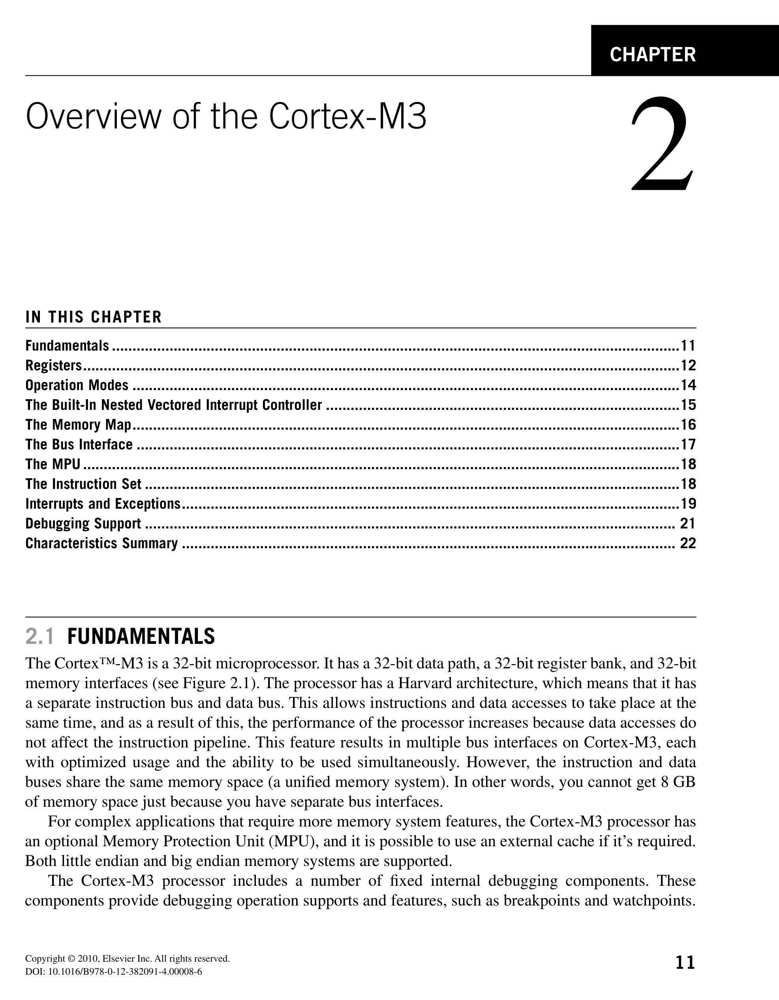
*Description*: Technical diagram and schematic illustration detailing hardware circuit topology, signal routing, and logic operations for Figure 2.1.

> **Figure 2.1**

11
CHAPTER
Copyright © 2010, Elsevier Inc. All rights reserved.
DOI: 10.1016/B978-0-12-382091-4.00008-6
In This Chapter
Fundamentals������������������������������������������������������������������������������������������������������������������������������������������11
Registers�������������������������������������������������������������������������������������������������������������������������������������������������12
Operation Modes�������������������������������������������������������������������������������������������������������������������������������������14
The Built-In Nested Vectored Interrupt Controller��������������������������������������������������������������������������������������15
The Memory Map�������������������������������������������������������������������������������������������������������������������������������������16
The Bus Interface������������������������������������������������������������������������������������������������������������������������������������17
The MPU�������������������������������������������������������������������������������������������������������������������������������������������������18
The Instruction Set����������������������������������������������������������������������������������������������������������������������������������18
Interrupts and Exceptions�������������������������������������������������������������������������������������������������������������������������19
Debugging Support��������������������������������������������������������������������������������������������������������������������������������� 21
Characteristics Summary������������������������������������������������������������������������������������������������������������������������ 22

### Overview of the Cortex-M3

2

## 2.1  Fundamentals

The Cortex™-M3 is a 32-bit microprocessor. It has a 32-bit data path, a 32-bit register bank, and 32-bit
memory interfaces (see Figure 2.1). The processor has a Harvard architecture, which means that it has
a separate instruction bus and data bus. This allows instructions and data accesses to take place at the
same time, and as a result of this, the performance of the processor increases because data accesses do
not affect the instruction pipeline. This feature results in multiple bus interfaces on Cortex-M3, each
with optimized usage and the ability to be used simultaneously. However, the instruction and data
buses share the same memory space (a unified memory system). In other words, you cannot get 8 GB
of memory space just because you have separate bus interfaces.
For complex applications that require more memory system features, the Cortex-M3 processor has
an optional Memory Protection Unit (MPU), and it is possible to use an external cache if it’s required.
Both little endian and big endian memory systems are supported.
The Cortex-M3 processor includes a number of fixed internal debugging components. These
­components provide debugging operation supports and features, such as breakpoints and watchpoints.

<!-- Page 39 -->
### [PDF Page 39]

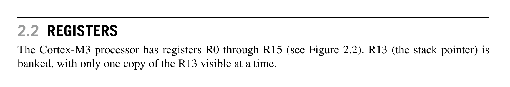
*Description*: Technical diagram and schematic illustration detailing hardware circuit topology, signal routing, and logic operations for Figure 2.2.

> **Figure 2.2**

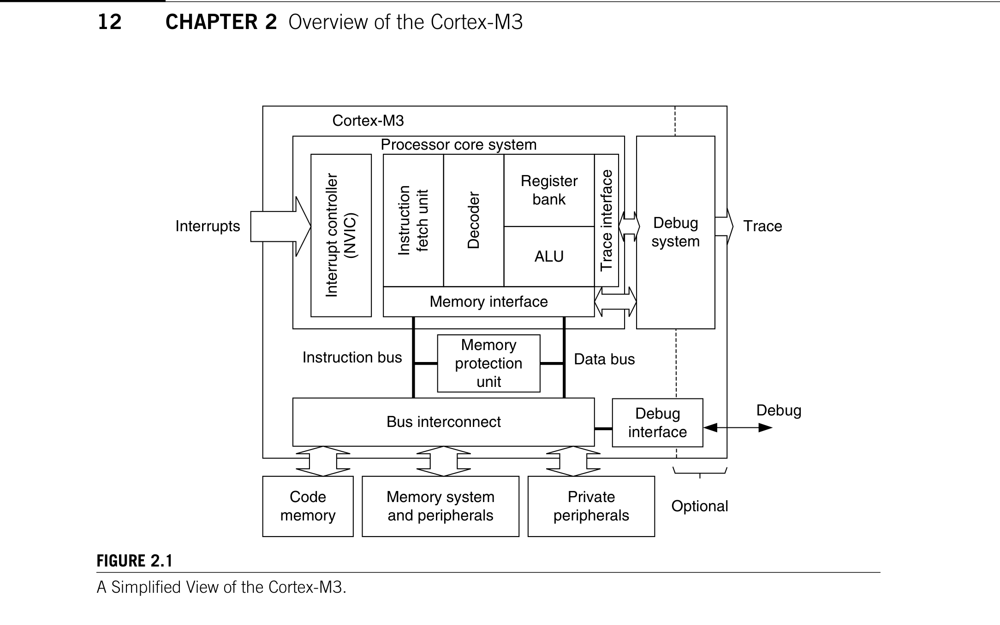
*Description*: Technical diagram and schematic illustration detailing hardware circuit topology, signal routing, and logic operations for Figure 2.1.

> **Figure 2.1**

12
CHAPTER 2  Overview of the Cortex-M3
In addition, optional components provide debugging features, such as instruction trace, and various
types of debugging interfaces.

## 2.2  Registers

The Cortex-M3 processor has registers R0 through R15 (see Figure 2.2). R13 (the stack pointer) is
banked, with only one copy of the R13 visible at a time.
2.2.1  R0–R12: General-Purpose Registers
R0–R12 are 32-bit general-purpose registers for data operations. Some 16-bit Thumb® instructions can
only access a subset of these registers (low registers, R0–R7).
2.2.2  R13: Stack Pointers
The Cortex-M3 contains two stack pointers (R13). They are banked so that only one is visible at a time.
The two stack pointers are as follows:
•
Main Stack Pointer (MSP): The default stack pointer, used by the operating system (OS) kernel
and exception handlers
•
Process Stack Pointer (PSP): Used by user application code
The lowest 2 bits of the stack pointers are always 0, which means they are always word aligned.
Figure 2.1
A Simplified View of the Cortex-M3.
Memory interface
Register
bank
ALU
Instruction
fetch unit
Decoder
Interrupt controller
(NVIC)
Memory
protection
unit
Memory system
and peripherals
Cortex-M3
Processor core system
Interrupts
Debug
Trace
Instruction bus
Trace interface
Bus interconnect
Optional
Debug
interface
Debug
system
Private
peripherals
Code
memory
Data bus

<!-- Page 40 -->
### [PDF Page 40]

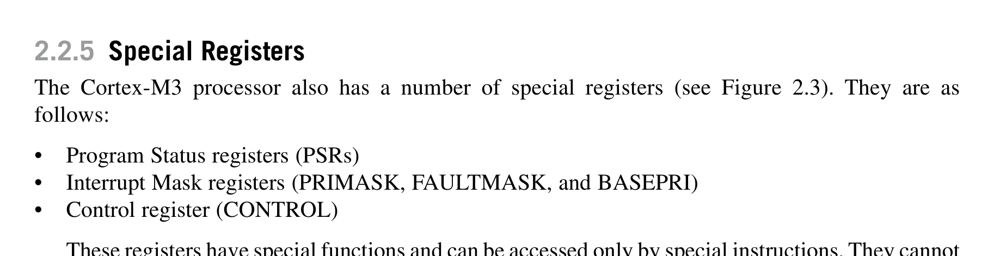
*Description*: Technical diagram and schematic illustration detailing hardware circuit topology, signal routing, and logic operations for Figure 2.3.

> **Figure 2.3**

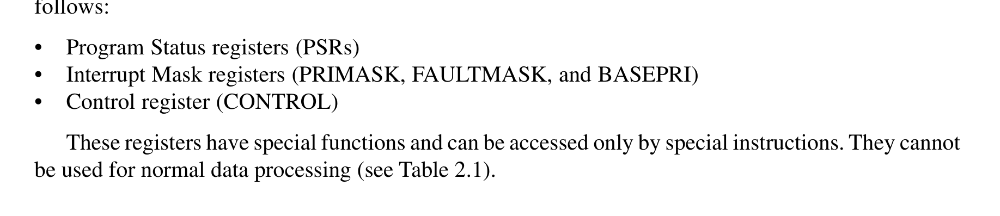
*Description*: Hardware reference table detailing register bit field settings, electrical operating limits, or memory configurations for Table 2.1.

> **Table 2.1**

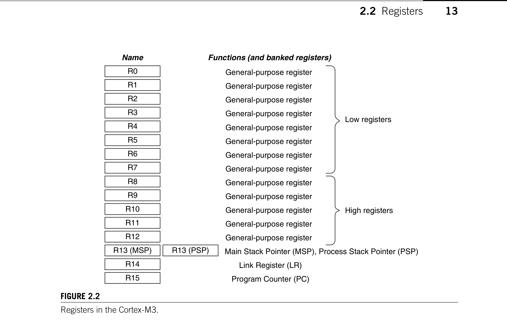
*Description*: Technical diagram and schematic illustration detailing hardware circuit topology, signal routing, and logic operations for Figure 2.2.

> **Figure 2.2**

13

## 2.2  Registers

2.2.3  R14: The Link Register
When a subroutine is called, the return address is stored in the link register.
2.2.4  R15: The Program Counter
The program counter is the current program address. This register can be written to control the
­program flow.
2.2.5  Special Registers
The Cortex-M3 processor also has a number of special registers (see Figure 2.3). They are as
­follows:
Program Status registers (PSRs)
•
Interrupt Mask registers (PRIMASK, FAULTMASK, and BASEPRI)
•
Control register (CONTROL)
•
These registers have special functions and can be accessed only by special instructions. They cannot
be used for normal data processing (see Table 2.1).
Figure 2.2
Registers in the Cortex-M3.
Name
R0
R1
R2
R3
R4
R5
R6
R7
R8
R9
R10
R11
R12
R13 (MSP)
R14
R15
R13 (PSP)
General-purpose register
General-purpose register
General-purpose register
General-purpose register
General-purpose register
General-purpose register
General-purpose register
General-purpose register
General-purpose register
General-purpose register
General-purpose register
General-purpose register
General-purpose register
Main Stack Pointer (MSP), Process Stack Pointer (PSP)
Link Register (LR)
Program Counter (PC)
Low registers
High registers
Functions (and banked registers)

<!-- Page 41 -->
### [PDF Page 41]

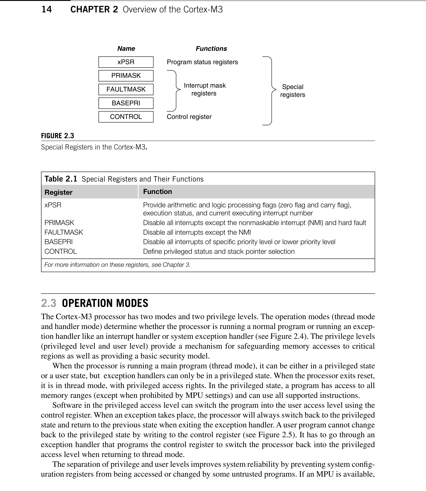
*Description*: Technical diagram and schematic illustration detailing hardware circuit topology, signal routing, and logic operations for Figure 2.4.

> **Figure 2.4**

*Description*: Technical diagram and schematic illustration detailing hardware circuit topology, signal routing, and logic operations for Figure 2.3.

> **Figure 2.3**

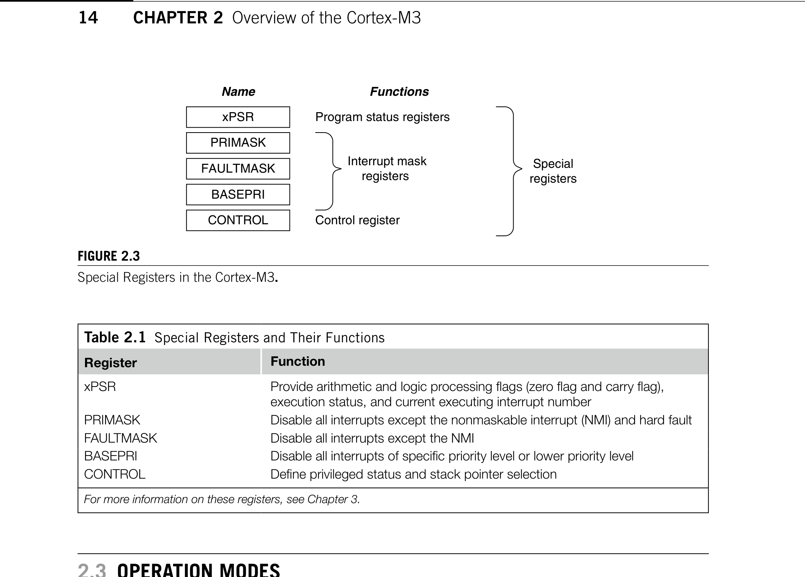
*Description*: Hardware reference table detailing register bit field settings, electrical operating limits, or memory configurations for Table 2.1.

> **Table 2.1**

14
CHAPTER 2  Overview of the Cortex-M3

## 2.3  Operation Modes

The Cortex-M3 processor has two modes and two privilege levels. The operation modes (thread mode
and handler mode) determine whether the processor is running a normal program or running an excep-
tion handler like an interrupt handler or system exception handler (see Figure 2.4). The privilege levels
(privileged level and user level) provide a mechanism for safeguarding memory accesses to critical
regions as well as providing a basic security model.
When the processor is running a main program (thread mode), it can be either in a privileged state
or a user state, but  exception handlers can only be in a privileged state. When the processor exits reset,
it is in thread mode, with privileged access rights. In the privileged state, a program has access to all
memory ranges (except when prohibited by MPU settings) and can use all supported instructions.
Software in the privileged access level can switch the program into the user access level using the
control register. When an exception takes place, the processor will always switch back to the privileged
state and return to the previous state when exiting the exception handler. A user program cannot change
back to the privileged state by writing to the control register (see Figure 2.5). It has to go through an
exception handler that programs the control register to switch the processor back into the privileged
access level when returning to thread mode.
The separation of privilege and user levels improves system reliability by preventing system config-
uration registers from being accessed or changed by some untrusted programs. If an MPU is ­available,
Figure 2.3
Special Registers in the Cortex-M3.
Name
xPSR
PRIMASK
FAULTMASK
BASEPRI
Functions
Program status registers
Interrupt mask
registers
Control register
CONTROL
Special
registers
Table 2.1  Special Registers and Their Functions
Register
Function
xPSR
Provide arithmetic and logic processing flags (zero flag and carry flag),
execution status, and current executing interrupt number
PRIMASK
Disable all interrupts except the nonmaskable interrupt (NMI) and hard fault
FAULTMASK
Disable all interrupts except the NMI
BASEPRI
Disable all interrupts of specific priority level or lower priority level
CONTROL
Define privileged status and stack pointer selection
For more information on these registers, see Chapter 3.

<!-- Page 42 -->
### [PDF Page 42]

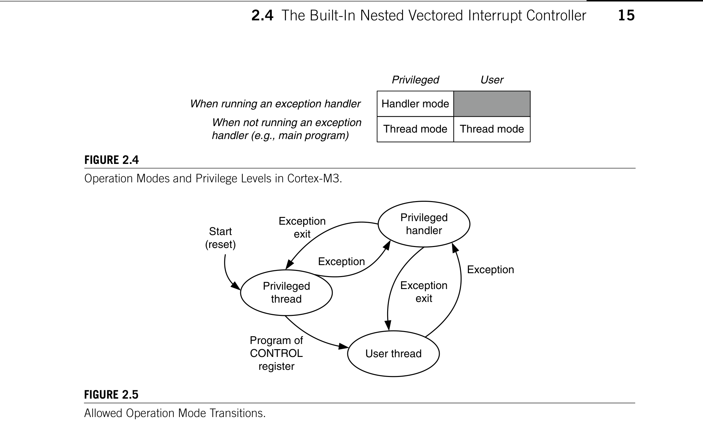
*Description*: Technical diagram and schematic illustration detailing hardware circuit topology, signal routing, and logic operations for Figure 2.5.

> **Figure 2.5**

*Description*: Technical diagram and schematic illustration detailing hardware circuit topology, signal routing, and logic operations for Figure 2.4.

> **Figure 2.4**

15

## 2.4  The Built-In Nested Vectored Interrupt Controller

it can be used in conjunction with privilege levels to protect critical memory locations, such as pro-
grams and data for OSs.
For example, with privileged accesses, usually used by the OS kernel, all memory locations can be
accessed (unless prohibited by MPU setup). When the OS launches a user application, it is likely to be exe-
cuted in the user access level to protect the system from failing due to a crash of untrusted user programs.

## 2.4  The Built-In Nested Vectored Interrupt Controller

The Cortex-M3 processor includes an interrupt controller called the Nested Vectored Interrupt Control-
ler (NVIC). It is closely coupled to the processor core and provides a number of features as follows:
Nested interrupt support
•
Vectored interrupt support
•
Dynamic priority changes support
•
Reduction of interrupt latency
•
Interrupt masking
•
2.4.1  Nested Interrupt Support
The NVIC provides nested interrupt support. All the external interrupts and most of the system excep-
tions can be programmed to different priority levels. When an interrupt occurs, the NVIC compares
Figure 2.5
Allowed Operation Mode Transitions.
Privileged
handler
User thread
Privileged
thread
Start
(reset)
Exception
Exception
exit
Exception
Exception
exit
Program of
CONTROL
register
Figure 2.4
Operation Modes and Privilege Levels in Cortex-M3.
Handler mode
Thread mode
Thread mode
Privileged
When running an exception handler
When not running an exception
handler (e.g., main program)
User

<!-- Page 43 -->
### [PDF Page 43]

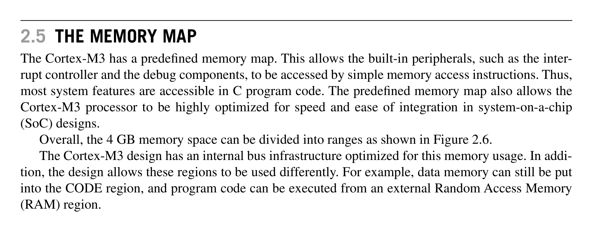
*Description*: Technical diagram and schematic illustration detailing hardware circuit topology, signal routing, and logic operations for Figure 2.6.

> **Figure 2.6**

16
CHAPTER 2  Overview of the Cortex-M3
the priority of this interrupt to the current running priority level. If the priority of the new interrupt is
higher than the current level, the interrupt handler of the new interrupt will override the current run-
ning task.
2.4.2  Vectored Interrupt Support
The Cortex-M3 processor has vectored interrupt support. When an interrupt is accepted, the starting
address of the interrupt service routine (ISR) is located from a vector table in memory. There is no need
to use software to determine and branch to the starting address of the ISR. Thus, it takes less time to
process the interrupt request.
2.4.3  Dynamic Priority Changes Support
Priority levels of interrupts can be changed by software during run time. Interrupts that are being ser-
viced are blocked from further activation until the ISR is completed, so their priority can be changed
without risk of accidental reentry.
2.4.4  Reduction of Interrupt Latency
The Cortex-M3 processor also includes a number of advanced features to lower the interrupt latency.
These include automatic saving and restoring some register contents, reducing delay in switching from
one ISR to another, and handling of late arrival interrupts. Details of these optimization features are
covered in Chapter 9.
2.4.5  Interrupt Masking
Interrupts and system exceptions can be masked based on their priority level or masked completely
using the interrupt masking registers BASEPRI, PRIMASK, and FAULTMASK. They can be used to
ensure that time-critical tasks can be finished on time without being interrupted.

## 2.5  The Memory Map

The Cortex-M3 has a predefined memory map. This allows the built-in peripherals, such as the inter-
rupt controller and the debug components, to be accessed by simple memory access instructions. Thus,
most system features are accessible in C program code. The predefined memory map also allows the
Cortex-M3 processor to be highly optimized for speed and ease of integration in system-on-a-chip
(SoC) designs.
Overall, the 4 GB memory space can be divided into ranges as shown in Figure 2.6.
The Cortex-M3 design has an internal bus infrastructure optimized for this memory usage. In addi-
tion, the design allows these regions to be used differently. For example, data memory can still be put
into the CODE region, and program code can be executed from an external Random Access Memory
(RAM) region.

<!-- Page 44 -->
### [PDF Page 44]

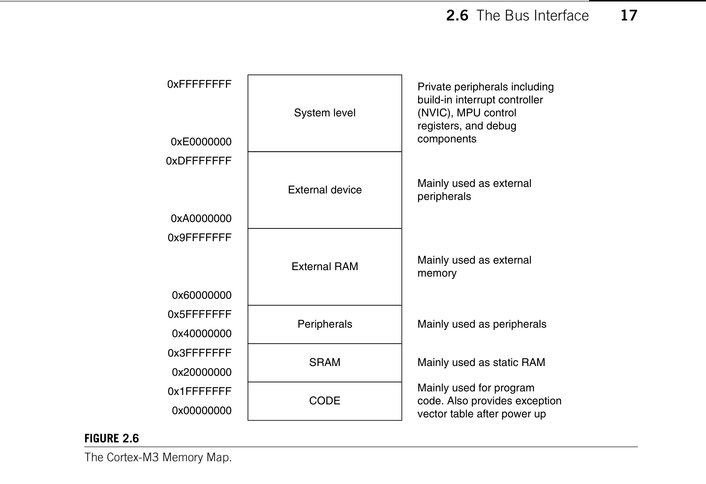
*Description*: Technical diagram and schematic illustration detailing hardware circuit topology, signal routing, and logic operations for Figure 2.6.

> **Figure 2.6**

17

## 2.6  The Bus Interface

The system-level memory region contains the interrupt controller and the debug components. These
devices have fixed addresses, detailed in Chapter 5. By having fixed addresses for these peripherals,
you can port applications between different Cortex-M3 products much more easily.

## 2.6  The Bus Interface

There are several bus interfaces on the Cortex-M3 processor. They allow the Cortex-M3 to carry instruc-
tion fetches and data accesses at the same time. The main bus interfaces are as follows:
Code memory buses
•
System bus
•
Private peripheral bus
•
The code memory region access is carried out on the code memory buses, which physically consist
of two buses, one called I-Code and other called D-Code. These are optimized for instruction fetches
for best instruction execution speed.
The system bus is used to access memory and peripherals. This provides access to the Static Ran-
dom Access Memory (SRAM), peripherals, external RAM, external devices, and part of the system-
level memory regions.
Figure 2.6
The Cortex-M3 Memory Map.
CODE
SRAM
External RAM
External device
Peripherals
0x00000000
0x1FFFFFFF
0x20000000
0x3FFFFFFF
0x40000000
0x5FFFFFFF
0x60000000
0x9FFFFFFF
System level
0xA0000000
0xDFFFFFFF
0xE0000000
0xFFFFFFFF
Mainly used for program
code. Also provides exception
vector table after power up
Mainly used as static RAM
Mainly used as peripherals
Mainly used as external
memory
Mainly used as external
peripherals
Private peripherals including
build-in interrupt controller
(NVIC), MPU control
registers, and debug
components

<!-- Page 45 -->
### [PDF Page 45]

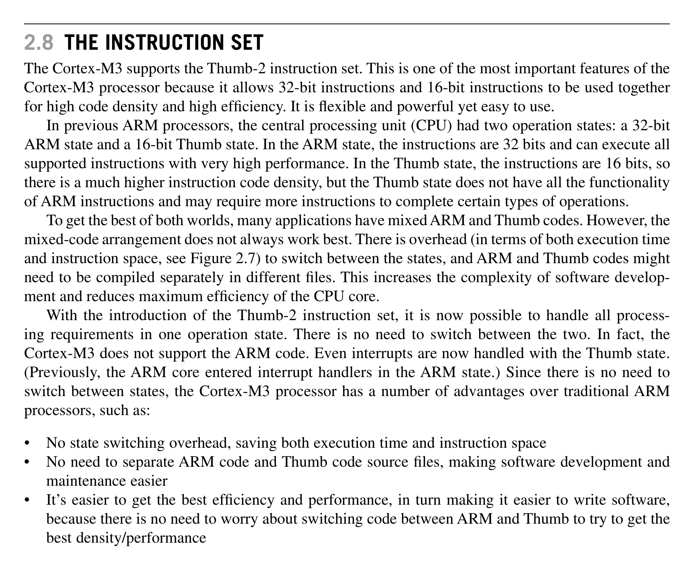
*Description*: Technical diagram and schematic illustration detailing hardware circuit topology, signal routing, and logic operations for Figure 2.7.

> **Figure 2.7**

18
CHAPTER 2  Overview of the Cortex-M3
The private peripheral bus provides access to a part of the system-level memory dedicated to private
peripherals, such as debugging components.

## 2.7  The MPU

The Cortex-M3 has an optional MPU. This unit allows access rules to be set up for privileged access
and user program access. When an access rule is violated, a fault exception is generated, and the fault
exception handler will be able to analyze the problem and correct it, if possible.
The MPU can be used in various ways. In common scenarios, the OS can set up the MPU to protect
data use by the OS kernel and other privileged processes to be protected from untrusted user programs.
The MPU can also be used to make memory regions read-only, to prevent accidental erasing of data or
to isolate memory regions between different tasks in a multitasking system. Overall, it can help make
embedded systems more robust and reliable.
The MPU feature is optional and is determined during the implementation stage of the microcon-
troller or SoC design. For more information on the MPU, refer to Chapter 13.

## 2.8  The Instruction Set

The Cortex-M3 supports the Thumb-2 instruction set. This is one of the most important features of the
Cortex-M3 processor because it allows 32-bit instructions and 16-bit instructions to be used together
for high code density and high efficiency. It is flexible and powerful yet easy to use.
In previous ARM processors, the central processing unit (CPU) had two operation states: a 32-bit
ARM state and a 16-bit Thumb state. In the ARM state, the instructions are 32 bits and can execute all
supported instructions with very high performance. In the Thumb state, the instructions are 16 bits, so
there is a much higher instruction code density, but the Thumb state does not have all the functionality
of ARM instructions and may require more instructions to complete certain types of operations.
To get the best of both worlds, many applications have mixed ARM and Thumb codes. However, the
mixed-code arrangement does not always work best. There is overhead (in terms of both execution time
and instruction space, see Figure 2.7) to switch between the states, and ARM and Thumb codes might
need to be compiled separately in different files. This increases the complexity of software develop-
ment and reduces maximum efficiency of the CPU core.
With the introduction of the Thumb-2 instruction set, it is now possible to handle all process-
ing requirements in one operation state. There is no need to switch between the two. In fact, the
Cortex-M3 does not support the ARM code. Even interrupts are now handled with the Thumb state.
(Previously, the ARM core entered interrupt handlers in the ARM state.) Since there is no need to
switch between states, the Cortex-M3 processor has a number of advantages over traditional ARM
processors, such as:
No state switching overhead, saving both execution time and instruction space
•
No need to separate ARM code and Thumb code source files, making software development and
•
maintenance easier
It’s easier to get the best efficiency and performance, in turn making it easier to write software,
•
because there is no need to worry about switching code between ARM and Thumb to try to get the
best density/performance

<!-- Page 46 -->
### [PDF Page 46]

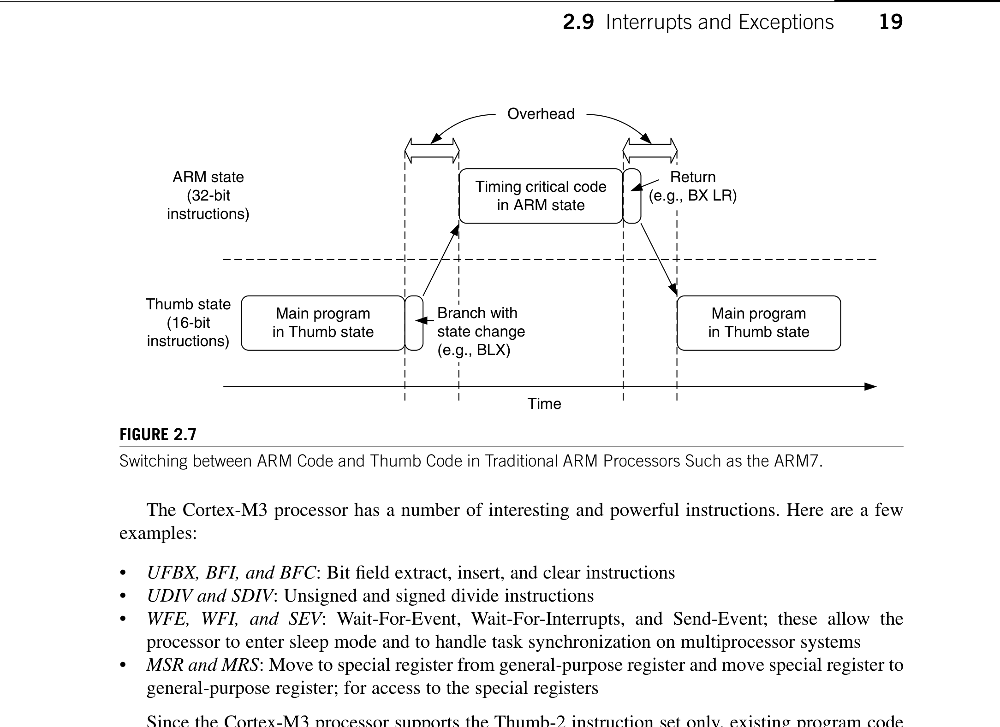
*Description*: Technical diagram and schematic illustration detailing hardware circuit topology, signal routing, and logic operations for Figure 2.7.

> **Figure 2.7**

19

## 2.9  Interrupts and Exceptions

The Cortex-M3 processor has a number of interesting and powerful instructions. Here are a few
examples:
•
UFBX, BFI, and BFC: Bit field extract, insert, and clear instructions
•
UDIV and SDIV: Unsigned and signed divide instructions
•
WFE, WFI, and SEV: Wait-For-Event, Wait-For-Interrupts, and Send-Event; these allow the
processor to enter sleep mode and to handle task synchronization on multiprocessor systems
•
MSR and MRS: Move to special register from general-purpose register and move special register to
general-purpose register; for access to the special registers
Since the Cortex-M3 processor supports the Thumb-2 instruction set only, existing program code
for ARM needs to be ported to the new architecture. Most C applications simply need to be recompiled
using new compilers that support the Cortex-M3. Some assembler codes need modification and porting
to use the new architecture and the new unified assembler framework.
Note that not all the instructions in the Thumb-2 instruction set are implemented on the Cortex-M3.
The ARMv7-M Architecture Application Level Reference Manual [Ref. 2] only requires a subset of the
Thumb-2 instructions to be implemented. For example, coprocessor instructions are not supported on
the ­Cortex-M3 (external data processing engines can be added), and Single Instruction–Multiple Data
(SIMD) is not implemented on the Cortex-M3. In addition, a few Thumb instructions are not supported,
such as Branch with Link and Exchange (BLX) with immediate (used to switch processor state from
Thumb to ARM), a couple of change process state (CPS) instructions, and the SETEND (Set Endian)
instructions, which were introduced in architecture v6. For a complete list of supported instructions,
refer to Appendix A.

## 2.9  Interrupts and Exceptions

The Cortex-M3 processor implements a new exception model, introduced in the ARMv7-M architec-
ture. This exception model differs from the traditional ARM exception model, enabling very efficient
Figure 2.7
Switching between ARM Code and Thumb Code in Traditional ARM Processors Such as the ARM7.
Timing critical code
in ARM state
Main program
in Thumb state
Main program
in Thumb state
Thumb state
(16-bit
instructions)
ARM state
(32-bit
instructions)
Time
Overhead
Branch with
state change
(e.g., BLX)
Return
(e.g., BX LR)

<!-- Page 47 -->
### [PDF Page 47]

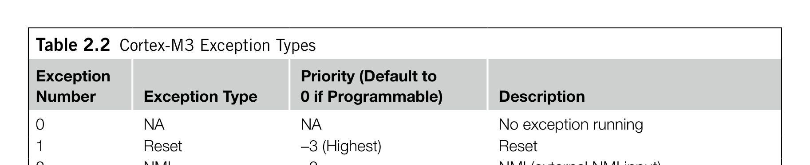
*Description*: Hardware reference table detailing register bit field settings, electrical operating limits, or memory configurations for Table 2.2.

> **Table 2.2**

20
CHAPTER 2  Overview of the Cortex-M3
exception handling. It has a number of system exceptions plus a number of external Interrupt Request
(IRQs) (external interrupt inputs). There is no fast interrupt (FIQ) (fast interrupt in ARM7/ARM9/
ARM10/ARM11) in the Cortex-M3; however, interrupt priority handling and nested interrupt support
are now included in the interrupt architecture. Therefore, it is easy to set up a system that supports
nested interrupts (a higher-priority interrupt can override or preempt a lower-priority interrupt handler)
and that behaves just like the FIQ in traditional ARM processors.
The interrupt features in the Cortex-M3 are implemented in the NVIC. Aside from supporting exter-
nal interrupts, the Cortex-M3 also supports a number of internal exception sources, such as system
fault ­handling. As a result, the Cortex-M3 has a number of predefined exception types, as shown in
Table 2.2.
2.9.1  Low Power and High Energy Efficiency
The Cortex-M3 processor is designed with various features to allow designers to develop low power
and high energy efficient products. First, it has sleep mode and deep sleep mode supports, which can
work with various system-design methodologies to reduce power consumption during idle period.
Table 2.2  Cortex-M3 Exception Types
Exception
Number
Exception Type
Priority (Default to
0 if Programmable)
Description
0
NA
NA
No exception running
1
Reset
-3 (Highest)
Reset
2
NMI
-2
NMI (external NMI input)
3
Hard fault
-1
All fault conditions, if the corresponding
fault handler is not enabled
4
MemManage fault
Programmable
Memory management fault; MPU
violation or access to illegal locations
5
Bus fault
Programmable
Bus error (prefetch abort or data abort)
6
Usage fault
Programmable
Program error
7–10
Reserved
NA
Reserved
11
SVCall
Programmable
Supervisor call
12
Debug monitor
Programmable
Debug monitor (break points,
watchpoints, or external debug request)
13
Reserved
NA
Reserved
14
PendSV
Programmable
Pendable request for system service
15
SYSTICK
Programmable
System tick timer
16
IRQ #0
Programmable
External interrupt #0
17
IRQ #1
Programmable
External interrupt #1
…
…
…
…
255
IRQ #239
Programmable
External interrupt #239
The number of external interrupt inputs is defined by chip manufacturers. A maximum of 240 external interrupt inputs can
be supported. In addition, the Cortex-M3 also has an NMI interrupt input. When it is asserted, the NMI-ISR is executed
unconditionally.

<!-- Page 48 -->
### [PDF Page 48]

21

## 2.10  Debugging Support

Second, its low gate count and design techniques reduce circuit activities in the processor to allow
active power to be reduced. In addition, since Cortex-M3 has high code density, it has lowered the
­program size requirement. At the same time, it allows processing tasks to be completed in a short time,
so that the processor can return to sleep modes as soon as possible to cut down energy use. As a result,
the energy efficiency of Cortex-M3 is better than many 8-bit or 16-bit microcontrollers.
Starting from Cortex-M3 revision 2, a new feature called Wakeup Interrupt Controller (WIC) is
available. This feature allows the whole processor core to be powered down, while processor states are
retained and the processor can be returned to active state almost immediately when an interrupt takes
place. This makes the Cortex-M3 even more suitable for many ultra-low power applications that previ-
ously could only be implemented with 8-bit or 16-bit microcontrollers.

## 2.10  Debugging Support

The Cortex-M3 processor includes a number of debugging features, such as program execution con-
trols, including halting and stepping, instruction breakpoints, data watchpoints, registers and memory
accesses, profiling, and traces.
The debugging hardware of the Cortex-M3 processor is based on the CoreSight™ architecture.
Unlike traditional ARM processors, the CPU core itself does not have a Joint Test Action Group (JTAG)
interface. Instead, a debug interface module is decoupled from the core, and a bus interface called the
Debug Access Port (DAP) is provided at the core level. Through this bus interface, external debuggers
can access control registers to debug hardware as well as system memory, even when the processor is
running. The control of this bus interface is carried out by a Debug Port (DP) device. The DPs currently
available are the Serial-Wire JTAG Debug Port (SWJ-DP) (supports the traditional JTAG protocol as
well as the Serial-Wire protocol) or the SW-DP (supports the Serial-Wire protocol only). A JTAG-DP
module from the ARM CoreSight product family can also be used. Chip manufacturers can choose to
attach one of these DP modules to provide the debug interface.
Chip manufacturers can also include an Embedded Trace Macrocell (ETM) to allow instruction
trace. Trace information is output via the Trace Port Interface Unit (TPIU), and the debug host (usually
a Personal Computer [PC]) can then collect the executed instruction information via external trace-
capturing hardware.
Within the Cortex-M3 processor, a number of events can be used to trigger debug actions. Debug
events can be breakpoints, watchpoints, fault conditions, or external debugging request input signals.
When a debug event takes place, the Cortex-M3 processor can either enter halt mode or execute the
debug monitor exception handler.
The data watchpoint function is provided by a Data Watchpoint and Trace (DWT) unit in the
­Cortex-M3 processor. This can be used to stop the processor (or trigger the debug monitor excep-
tion routine) or to generate data trace information. When data trace is used, the traced data can be
output via the TPIU. (In the CoreSight architecture, multiple trace devices can share one single
trace port.)
In addition to these basic debugging features, the Cortex-M3 processor also provides a Flash Patch
and Breakpoint (FPB) unit that can provide a simple breakpoint function or remap an instruction access
from Flash to a different location in SRAM.

<!-- Page 49 -->
### [PDF Page 49]

22
CHAPTER 2  Overview of the Cortex-M3
An Instrumentation Trace Macrocell (ITM) provides a new way for developers to output data to a
debugger. By writing data to register memory in the ITM, a debugger can collect the data via a trace
interface and display or process them. This method is easy to use and faster than JTAG output.
All these debugging components are controlled via the DAP interface bus on the Cortex-M3 or by a
program running on the processor core, and all trace information is accessible from the TPIU.

## 2.11  Characteristics Summary

Why is the Cortex-M3 processor such a revolutionary product? What are the advantages of using the
Cortex-M3? The benefits and advantages are summarized in this section.
2.11.1  High Performance
The Cortex-M3 processor delivers high performance in microcontroller products:
Many instructions, including multiply, are single cycle. Therefore, the Cortex-M3 processor
•
outperforms most microcontroller products.
Separate data and instruction buses allow simultaneous data and instruction accesses to be
•
performed.
The Thumb-2 instruction set makes state switching overhead history. There’s no need to spend time
•
switching between the ARM state (32 bits) and the Thumb state (16 bits), so instruction cycles and
program size are reduced. This feature has also simplified software development, allowing faster
time to market, and easier code maintenance.
The Thumb-2 instruction set provides extra flexibility in programming. Many data operations can
•
now be simplified using shorter code. This also means that the Cortex-M3 has higher code density
and reduced memory requirements.
Instruction fetches are 32 bits. Up to two instructions can be fetched in one cycle. As a result,
•
there’s more available bandwidth for data transfer.
The Cortex-M3 design allows microcontroller products to operate at high clock frequency (over
•
100 MHz in modern semiconductor manufacturing processes). Even running at the same frequency
as most other microcontroller products, the Cortex-M3 has a better clock per instruction (CPI)
ratio. This allows more work per MHz or designs can run at lower clock frequency for lower power
consumption.
2.11.2  Advanced Interrupt-Handling Features
The interrupt features on the Cortex-M3 processor are easy to use, very flexible, and provide high inter-
rupt processing throughput:
The built-in NVIC supports up to 240 external interrupt inputs. The vectored interrupt feature
•
considerably reduces interrupt latency because there is no need to use software to determine which
IRQ handler to serve. In addition, there is no need to have software code to set up nested interrupt
support.

<!-- Page 50 -->
### [PDF Page 50]

23

## 2.11  Characteristics Summary

The Cortex-M3 processor automatically pushes registers R0–R3, R12, Link register (LR), PSR,
•
and PC in the stack at interrupt entry and pops them back at interrupt exit. This reduces the IRQ
handling latency and allows interrupt handlers to be normal C functions (as explained later in
Chapter 8).
Interrupt arrangement is extremely flexible because the NVIC has programmable interrupt priority
•
control for each interrupt. A minimum of eight levels of priority are supported, and the priority can
be changed dynamically.
Interrupt latency is reduced by special optimization, including late arrival interrupt acceptance and
•
tail-chain interrupt entry.
Some of the multicycle operations, including Load-Multiple (LDM), Store-Multiple (STM),
•
PUSH, and POP, are now interruptible.
On receipt of an NMI request, immediate execution of the NMI handler is guaranteed unless the
•
system is completely locked up. NMI is very important for many safety-critical applications.
2.11.3  Low Power Consumption
The Cortex-M3 processor is suitable for various low-power applications:
The Cortex-M3 processor is suitable for low-power designs because of the low gate count.
•
It has power-saving mode support (SLEEPING and SLEEPDEEP). The processor can enter sleep
•
mode using WFI or WFE instructions. The design has separated clocks for essential blocks, so
clocking circuits for most parts of the processor can be stopped during sleep.
The fully static, synchronous, synthesizable design makes the processor easy to be manufactured
•
using any low power or standard semiconductor process technology.
2.11.4  System Features
The Cortex-M3 processor provides various system features making it suitable for a large number of
applications:
The system provides bit-band operation, byte-invariant big endian mode, and unaligned data access
•
support.
Advanced fault-handling features include various exception types and fault status registers, making
•
it easier to locate problems.
With the shadowed stack pointer, stack memory of kernel and user processes can be isolated. With the
•
optional MPU, the processor is more than sufficient to develop robust software and reliable products.
2.11.5  Debug Supports
The Cortex-M3 processor includes comprehensive debug features to help software developers design
their products:
Supports JTAG or Serial-Wire debug interfaces
•
Based on the CoreSight debugging solution, processor status or memory contents can be accessed
•
even when the core is running

<!-- Page 51 -->
### [PDF Page 51]

24
CHAPTER 2  Overview of the Cortex-M3
Built-in support for six breakpoints and four watchpoints
•
Optional ETM for instruction trace and data trace using DWT
•
New debugging features, including fault status registers, new fault exceptions, and Flash Patch
•
operations, make debugging much easier
ITM provides an easy-to-use method to output debug information from test code
•
PC sampler and counters inside the DWT provide code-profiling information
•

