# Chapter
3. Cortex-M3 Basics

> **Source PDF**: THE_DEFINITIVE_GUIDE_TO_THE_ARM_CORTEX-МЗ_Stellaris_MCU_9000Series_TEINSTRUMENTS_ARM_SECOND_EDITION.pdf  
> **PDF Page Range**: 52 - 69

---

<!-- Page 52 -->
### [PDF Page 52]

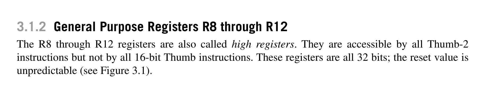
*Description*: Technical diagram and schematic illustration detailing hardware circuit topology, signal routing, and logic operations for Figure 3.1.

> **Figure 3.1**

25
Copyright © 2010, Elsevier Inc. All rights reserved.
DOI: 10.1016/B978-0-12-382091-4.00009-8
In This Chapter
Registers................................................................................................................................................ 25
Special Registers.................................................................................................................................... 29
Operation Mode....................................................................................................................................... 32
Exceptions and Interrupts........................................................................................................................ 35
Vector Tables.......................................................................................................................................... 36
Stack Memory Operations........................................................................................................................ 36
Reset Sequence...................................................................................................................................... 40
CHAPTER
Cortex-M3 Basics
3

## 3.1  Registers

As we’ve seen, the Cortex™-M3 processor has registers R0 through R15 and a number of special
registers. R0 through R12 are general purpose, but some of the 16-bit Thumb® instructions can only
access R0 through R7 (low registers), whereas 32-bit Thumb-2 instructions can access all these reg-
isters. Special registers have predefined functions and can only be accessed by special register access
instructions.
3.1.1  General Purpose Registers R0 through R7
The R0 through R7 general purpose registers are also called low registers. They can be accessed by all
16-bit Thumb instructions and all 32-bit Thumb-2 instructions. They are all 32 bits; the reset value is
­unpredictable.
3.1.2  General Purpose Registers R8 through R12
The R8 through R12 registers are also called high registers. They are accessible by all Thumb-2
instructions but not by all 16-bit Thumb instructions. These registers are all 32 bits; the reset value is
­unpredictable (see Figure 3.1).

<!-- Page 53 -->
### [PDF Page 53]

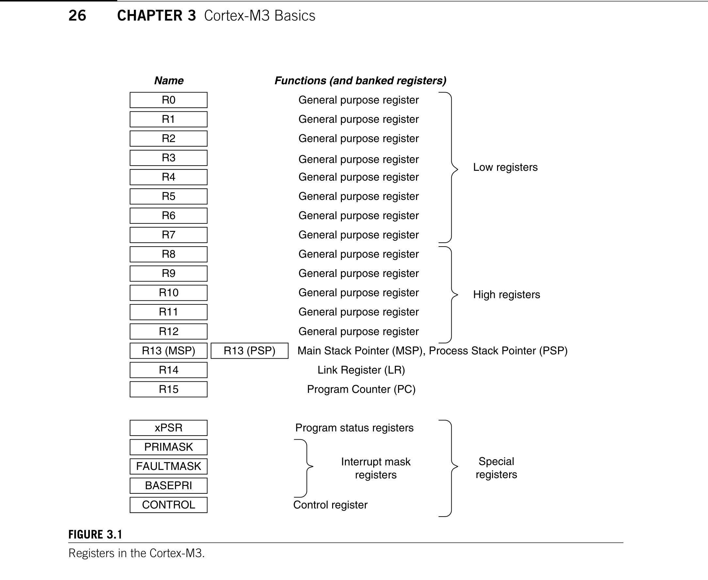
*Description*: Technical diagram and schematic illustration detailing hardware circuit topology, signal routing, and logic operations for Figure 3.1.

> **Figure 3.1**

26
CHAPTER 3  Cortex-M3 Basics
3.1.3  Stack Pointer R13
R13 is the stack pointer (SP). In the Cortex-M3 processor, there are two SPs. This duality allows two
separate stack memories to be set up. When using the register name R13, you can only access the cur-
rent SP; the other one is inaccessible unless you use special instructions to move to special register from
general-purpose register (MSR) and move special register to general-purpose register (MRS). The two
SPs are as follows:
•
Main Stack Pointer (MSP) or SP_main in ARM documentation: This is the default SP; it is used
by the operating system (OS) kernel, exception handlers, and all application codes that require
privileged access.
•
Process Stack Pointer (PSP) or SP_process in ARM documentation: This is used by the base-level
application code (when not running an exception handler).
Figure 3.1
Registers in the Cortex-M3.
Name
R0
R1
R2
R3
R4
R5
R6
R7
R8
R9
R10
R11
R12
R13 (MSP)
R14
R15
R13 (PSP)
General purpose register
General purpose register
General purpose register
General purpose register
General purpose register
General purpose register
General purpose register
General purpose register
General purpose register
General purpose register
General purpose register
General purpose register
General purpose register
Main Stack Pointer (MSP), Process Stack Pointer (PSP)
Link Register (LR)
Program Counter (PC)
Low registers
High registers
xPSR
PRIMASK
FAULTMASK
BASEPRI
Program status registers
Interrupt mask
registers
Control register
CONTROL
Special
registers
Functions (and banked registers)

<!-- Page 54 -->
### [PDF Page 54]

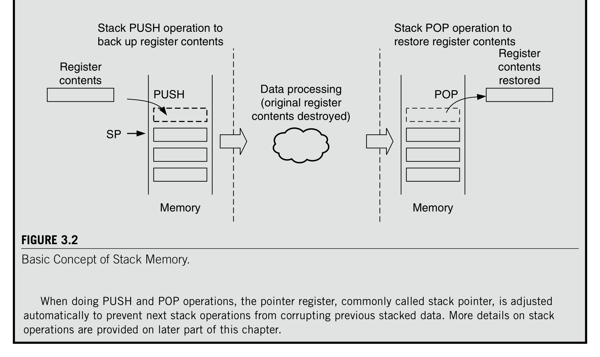
*Description*: Technical diagram and schematic illustration detailing hardware circuit topology, signal routing, and logic operations for Figure 3.2.

> **Figure 3.2**

27

## 3.1  Registers

It is not necessary to use both SPs. Simple applications can rely purely on the MSP. The SPs are used
for accessing stack memory processes such as PUSH and POP.
In the Cortex-M3, the instructions for accessing stack memory are PUSH and POP. The assembly
language syntax is as follows (text after each semicolon [;] is a comment):
PUSH {R0} ; R13=R13-4, then Memory[R13] = R0
POP  {R0} ; R0 = Memory[R13], then R13 = R13 + 4
The Cortex-M3 uses a full-descending stack arrangement. (More detail on this subject can be found
in the “Stack Memory Operations” section of this chapter.) Therefore, the SP decrements when new
data is stored in the stack. PUSH and POP are usually used to save register contents to stack memory at
the start of a subroutine and then restore the registers from stack at the end of the subroutine. You can
PUSH or POP multiple registers in one instruction:
subroutine_1
PUSH
{R0-R7, R12, R14} ; Save registers
...
; Do your processing
POP
{R0-R7, R12, R14} ; Restore registers
BX
R14               ; Return to calling function
Stack PUSH and POP
Stack is a memory usage model. It is simply part of the system memory, and a pointer register (inside the
processor) is used to make it work as a first-in/last-out buffer. The common use of a stack is to save register
contents before some data processing and then restore those contents from the stack after the processing task
is done.
When doing PUSH and POP operations, the pointer register, commonly called stack pointer, is adjusted
automatically to prevent next stack operations from corrupting previous stacked data. More details on stack
operations are provided on later part of this chapter.
Figure 3.2
Basic Concept of Stack Memory.
Data processing
(original register
contents destroyed)
SP
Memory
Register
contents
PUSH
Memory
POP
Register
contents
restored
Stack PUSH operation to
back up register contents
Stack POP operation to
restore register contents

<!-- Page 55 -->
### [PDF Page 55]

28
CHAPTER 3  Cortex-M3 Basics
Instead of using R13, you can use SP (for SP) in your program codes. It means the same thing.
Inside program code, both the MSP and the PSP can be called R13/SP. However, you can access a
particular one using special register access instructions (MRS/MSR).
The MSP, also called SP_main in ARM documentation, is the default SP after power-up; it is used
by kernel code and exception handlers. The PSP, or SP_process in ARM documentation, is typically
used by thread processes in system with embedded OS running.
Because register PUSH and POP operations are always word aligned (their addresses must be 0x0,
0x4, 0x8, ...), the SP/R13 bit 0 and bit 1 are hardwired to 0 and always read as zero (RAZ).
3.1.4  Link Register R14
R14 is the link register (LR). Inside an assembly program, you can write it as either R14 or LR. LR is
used to store the return program counter (PC) when a subroutine or function is called—for example,
when you’re using the branch and link (BL) instruction:
main ; Main program
...
BL function1 ; Call function1 using Branch with Link instruction.
; PC = function1 and
; LR = the next instruction in main
...
function1
...
; Program code for function 1
BX LR
; Return
Despite the fact that bit 0 of the PC is always 0 (because instructions are word aligned or half word
aligned), the LR bit 0 is readable and writable. This is because in the Thumb instruction set, bit 0 is
often used to indicate ARM/Thumb states. To allow the Thumb-2 program for the Cortex-M3 to work
with other ARM processors that support the Thumb-2 technology, this least significant bit (LSB) is
writable and readable.
3.1.5  Program Counter R15
R15 is the PC. You can access it in assembler code by either R15 or PC. Because of the pipelined nature
of the Cortex-M3 processor, when you read this register, you will find that the value is different than the
location of the executing instruction, normally by 4. For example:
0x1000  : MOV R0, PC ;  R0 = 0x1004
In other instructions like literal load (reading of a memory location related to current PC value), the
effective value of PC might not be instruction address plus 4 due to alignment in address calculation.
But the PC value is still at least 2 bytes ahead of the instruction address during execution.
Writing to the PC will cause a branch (but LRs do not get updated). Because an instruction address
must be half word aligned, the LSB (bit 0) of the PC read value is always 0. However, in branching,
either by writing to PC or using branch instructions, the LSB of the target address should be set to 1
because it is used to indicate the Thumb state operations. If it is 0, it can imply trying to switch to the
ARM state and will result in a fault exception in the Cortex-M3.

<!-- Page 56 -->
### [PDF Page 56]

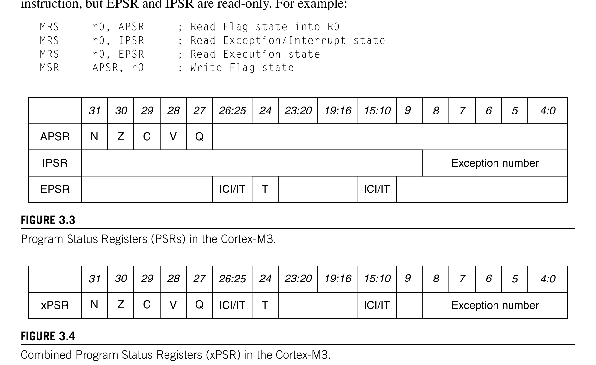
*Description*: Technical diagram and schematic illustration detailing hardware circuit topology, signal routing, and logic operations for Figure 3.3.

> **Figure 3.3**

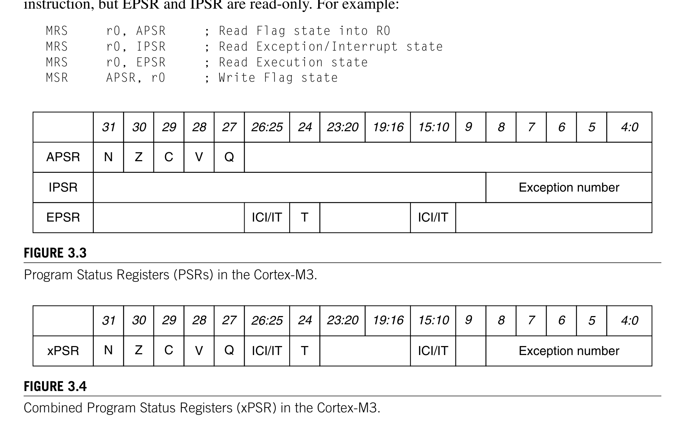
*Description*: Technical diagram and schematic illustration detailing hardware circuit topology, signal routing, and logic operations for Figure 3.4.

> **Figure 3.4**

29

## 3.2  Special Registers

## 3.2  Special Registers

The special registers in the Cortex-M3 processor include the following (see Figures 3.3 and 3.4):
Program Status registers (PSRs)
•
Interrupt Mask registers (PRIMASK, FAULTMASK, and BASEPRI)
•
Control register (CONTROL)
•
Special registers can only be accessed via MSR and MRS instructions; they do not have memory
addresses:
MRS <reg>, <special_reg>; Read special register
MSR <special_reg>, <reg>; write to special register
3.2.1  Program Status Registers
The PSRs are subdivided into three status registers:
Application Program Status register (APSR)
•
Interrupt Program Status register (IPSR)
•
Execution Program Status register (EPSR)
•
The three PSRs can be accessed together or separately using the special register access instructions
MSR and MRS. When they are accessed as a collective item, the name xPSR is used.
You can read the PSRs using the MRS instruction. You can also change the APSR using the MSR
instruction, but EPSR and IPSR are read-only. For example:
MRS      r0, APSR      ; Read Flag state into R0
MRS      r0, IPSR      ; Read Exception/Interrupt state
MRS      r0, EPSR      ; Read Execution state
MSR      APSR, r0      ; Write Flag state
Figure 3.3
Program Status Registers (PSRs) in the Cortex-M3.
31
APSR
IPSR
EPSR
30
29
28
27
26:25
24
23:20
19:16
15:10
9
8
7
6
5
4:0
N
Z
C
V
Q
Exception number
ICI/IT
ICI/IT
T
Figure 3.4
Combined Program Status Registers (xPSR) in the Cortex-M3.
31
xPSR
30
29
28
27
26:25
24
23:20
19:16
15:10
9
8
7
6
5
4:0
N
Z
C
V
Q
Exception number
ICI/IT
ICI/IT
T

<!-- Page 57 -->
### [PDF Page 57]

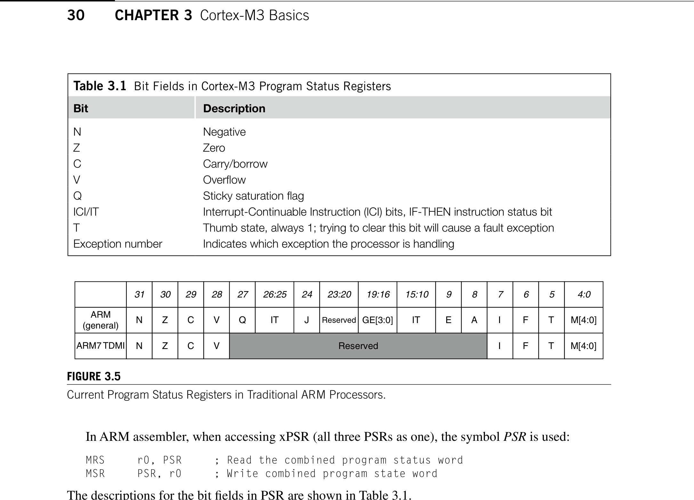
*Description*: Hardware reference table detailing register bit field settings, electrical operating limits, or memory configurations for Table 3.1.

> **Table 3.1**

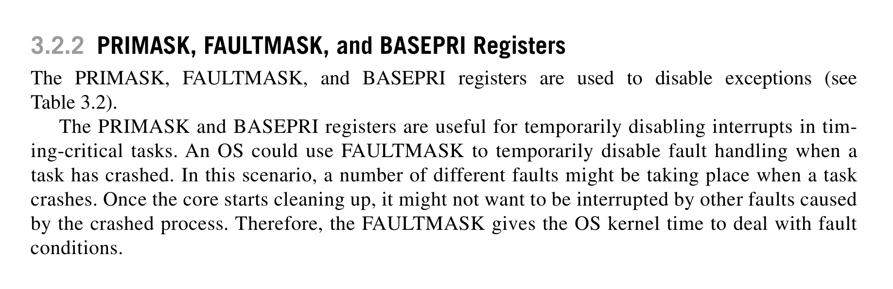
*Description*: Hardware reference table detailing register bit field settings, electrical operating limits, or memory configurations for Table 3.2.

> **Table 3.2**

*Description*: Technical diagram and schematic illustration detailing hardware circuit topology, signal routing, and logic operations for Figure 3.5.

> **Figure 3.5**

30
CHAPTER 3  Cortex-M3 Basics
In ARM assembler, when accessing xPSR (all three PSRs as one), the symbol PSR is used:
MRS      r0, PSR      ; Read the combined program status word
MSR      PSR, r0      ; Write combined program state word
The descriptions for the bit fields in PSR are shown in Table 3.1.
If you compare this with the Current Program Status register (CPSR) in ARM7, you might find
that some bit fields that were used in ARM7 are gone. The Mode (M) bit field is gone because
the Cortex-M3 does not have the operation mode as defined in ARM7. Thumb-bit (T) is moved to
bit 24. Interrupt status (I and F) bits are replaced by the new interrupt mask registers (PRIMASKs),
which are separated from PSR. For comparison, the CPSR in traditional ARM processors is shown
in ­Figure 3.5.
3.2.2  PRIMASK, FAULTMASK, and BASEPRI Registers
The PRIMASK, FAULTMASK, and BASEPRI registers are used to disable exceptions (see
Table 3.2).
The PRIMASK and BASEPRI registers are useful for temporarily disabling interrupts in tim-
ing-critical tasks. An OS could use FAULTMASK to temporarily disable fault handling when a
task has crashed. In this scenario, a number of different faults might be taking place when a task
crashes. Once the core starts cleaning up, it might not want to be interrupted by other faults caused
by the crashed process. Therefore, the FAULTMASK gives the OS kernel time to deal with fault
conditions.
Table 3.1  Bit Fields in Cortex-M3 Program Status Registers
Bit
Description
N
Negative
Z
Zero
C
Carry/borrow
V
Overflow
Q
Sticky saturation flag
ICI/IT
Interrupt-Continuable Instruction (ICI) bits, IF-THEN instruction status bit
T
Thumb state, always 1; trying to clear this bit will cause a fault exception
Exception number
Indicates which exception the processor is handling
Figure 3.5
Current Program Status Registers in Traditional ARM Processors.
31
ARM
(general)
30
29
28
27
26:25
24
23:20
19:16
15:10
9
8
7
6
5
4:0
N
Z
C
V
Q
IT
IT
J
Reserved
E
A
I
F
T
M[4:0]
GE[3:0]
ARM7 TDMI
N
Z
C
V
Reserved
I
F
T
M[4:0]

<!-- Page 58 -->
### [PDF Page 58]

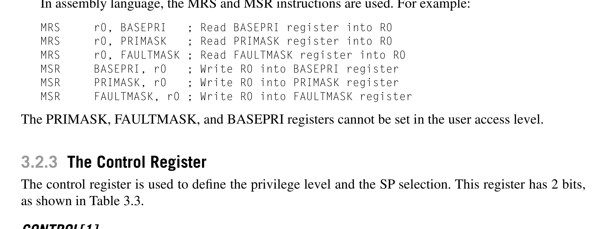
*Description*: Hardware reference table detailing register bit field settings, electrical operating limits, or memory configurations for Table 3.3.

> **Table 3.3**

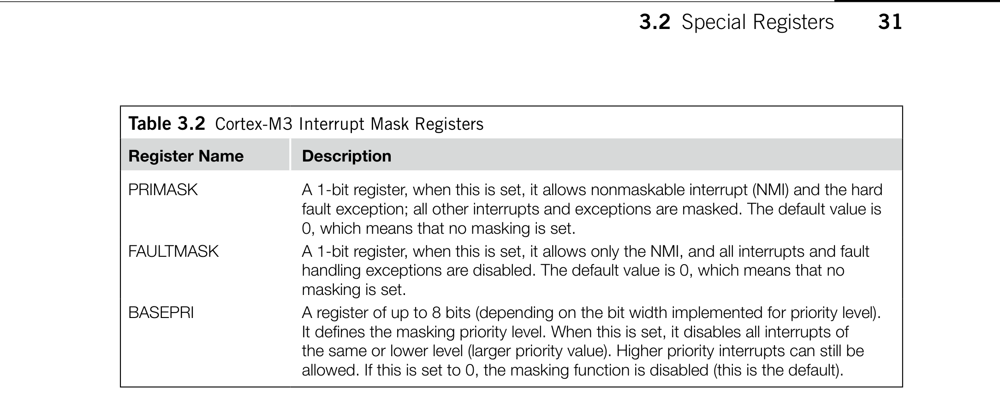
*Description*: Hardware reference table detailing register bit field settings, electrical operating limits, or memory configurations for Table 3.2.

> **Table 3.2**

31

## 3.2  Special Registers

To access the PRIMASK, FAULTMASK, and BASEPRI registers, a number of functions are
­available in the device driver libraries provided by the microcontroller vendors. For example, the
­following:
x = __get_BASEPRI(); // Read BASEPRI register
x = __get_PRIMARK(); // Read PRIMASK register
x = __get_FAULTMASK(); // Read FAULTMASK register
__set_BASEPRI(x); // Set new value for BASEPRI
__set_PRIMASK(x); // Set new value for PRIMASK
__set_FAULTMASK(x); // Set new value for FAULTMASK
__disable_irq(); // Clear PRIMASK, enable IRQ
__enable_irq(); // Set PRIMASK, disable IRQ
Details of these core register access functions are covered in Appendix G. A detailed introduction of
Cortex Microcontroller Software Interface Standard (CMSIS) can be found in Chapter 10.
In assembly language, the MRS and MSR instructions are used. For example:
MRS      r0, BASEPRI   ; Read BASEPRI register into R0
MRS      r0, PRIMASK   ; Read PRIMASK register into R0
MRS      r0, FAULTMASK ; Read FAULTMASK register into R0
MSR      BASEPRI, r0   ; Write R0 into BASEPRI register
MSR      PRIMASK, r0   ; Write R0 into PRIMASK register
MSR      FAULTMASK, r0 ; Write R0 into FAULTMASK register
The PRIMASK, FAULTMASK, and BASEPRI registers cannot be set in the user access level.
3.2.3  The Control Register
The control register is used to define the privilege level and the SP selection. This register has 2 bits,
as shown in Table 3.3.
CONTROL[1]
In the Cortex-M3, the CONTROL[1] bit is always 0 in handler mode. However, in the thread or base
level, it can be either 0 or 1.
Table 3.2  Cortex-M3 Interrupt Mask Registers
Register Name
Description
PRIMASK
A 1-bit register, when this is set, it allows nonmaskable interrupt (NMI) and the hard
fault exception; all other interrupts and exceptions are masked. The default value is
0, which means that no masking is set.
FAULTMASK
A 1-bit register, when this is set, it allows only the NMI, and all interrupts and fault
handling exceptions are disabled. The default value is 0, which means that no
masking is set.
BASEPRI
A register of up to 8 bits (depending on the bit width implemented for priority level).
It defines the masking priority level. When this is set, it disables all interrupts of
the same or lower level (larger priority value). Higher priority interrupts can still be
allowed. If this is set to 0, the masking function is disabled (this is the default).

<!-- Page 59 -->
### [PDF Page 59]

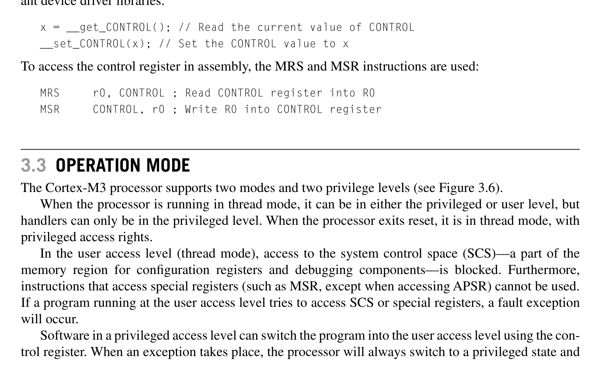
*Description*: Technical diagram and schematic illustration detailing hardware circuit topology, signal routing, and logic operations for Figure 3.6.

> **Figure 3.6**

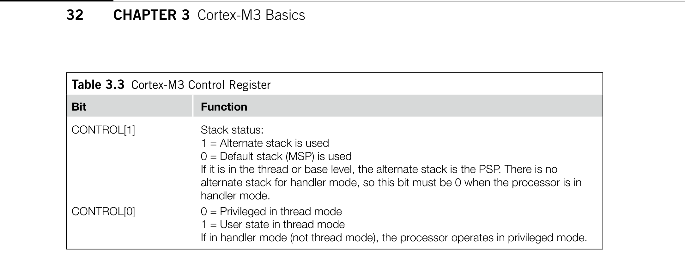
*Description*: Hardware reference table detailing register bit field settings, electrical operating limits, or memory configurations for Table 3.3.

> **Table 3.3**

32
CHAPTER 3  Cortex-M3 Basics
This bit is writable only when the core is in thread mode and privileged. In the user state or handler
mode, writing to this bit is not allowed. Aside from writing to this register, another way to change this
bit is to change bit 2 of the LR when in exception return. This subject is discussed in Chapter 8, where
details on exceptions are described.
CONTROL[0]
The CONTROL[0] bit is writable only in a privileged state. Once it enters the user state, the only way
to switch back to privileged is to trigger an interrupt and change this in the exception handler.
To access the control register in C, the following CMSIS functions are available in CMSIS compli-
ant device driver libraries:
x = __get_CONTROL(); // Read the current value of CONTROL
__set_CONTROL(x); // Set the CONTROL value to x
To access the control register in assembly, the MRS and MSR instructions are used:
MRS      r0, CONTROL ; Read CONTROL register into R0
MSR      CONTROL, r0 ; Write R0 into CONTROL register

## 3.3  Operation Mode

The Cortex-M3 processor supports two modes and two privilege levels (see Figure 3.6).
When the processor is running in thread mode, it can be in either the privileged or user level, but
handlers can only be in the privileged level. When the processor exits reset, it is in thread mode, with
privileged access rights.
In the user access level (thread mode), access to the system control space (SCS)—a part of the
memory region for configuration registers and debugging components—is blocked. Furthermore,
instructions that access special registers (such as MSR, except when accessing APSR) cannot be used.
If a program running at the user access level tries to access SCS or special registers, a fault exception
will occur.
Software in a privileged access level can switch the program into the user access level using the con-
trol register. When an exception takes place, the processor will always switch to a privileged state and
Table 3.3  Cortex-M3 Control Register
Bit
Function
CONTROL[1]
Stack status:
1 = Alternate stack is used
0 = Default stack (MSP) is used
If it is in the thread or base level, the alternate stack is the PSP. There is no
alternate stack for handler mode, so this bit must be 0 when the processor is in
handler mode.
CONTROL[0]
0 = Privileged in thread mode
1 = User state in thread mode
If in handler mode (not thread mode), the processor operates in privileged mode.

<!-- Page 60 -->
### [PDF Page 60]

*Description*: Technical diagram and schematic illustration detailing hardware circuit topology, signal routing, and logic operations for Figure 3.6.

> **Figure 3.6**

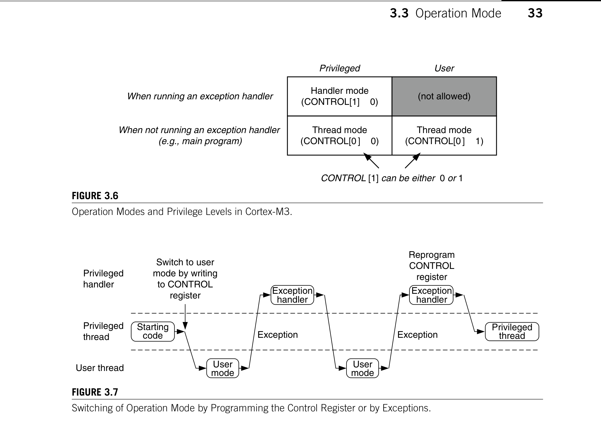
*Description*: Technical diagram and schematic illustration detailing hardware circuit topology, signal routing, and logic operations for Figure 3.7.

> **Figure 3.7**

33

## 3.3  Operation Mode

return to the previous state when exiting the exception handler. A user program cannot change back to
the privileged state directly by writing to the control register. It has to go through an exception handler
that programs the control register to switch the processor back into privileged access level when return-
ing to thread mode. (See Figures 3.7).
The support of privileged and user access levels provides a more secure and robust architecture. For
example, when a user program goes wrong, it will not be able to corrupt control registers in the Nested
Vectored Interrupt Controller (NVIC). In addition, if the Memory Protection Unit (MPU) is present, it
is possible to block user programs from accessing memory regions used by privileged processes.
In simple applications, there is no need to separate the privileged and user access levels. In these
cases, there is no need to use user access level and no need to program the control register.
You can separate the user application stack from the kernel stack memory to avoid the possibility of
crashing a system caused by stack operation errors in user programs. With this arrangement, the user
program (running in thread mode) uses the PSP, and the exception handlers use the MSP. The switching
of SPs is automatic upon entering or leaving the exception handlers (see section 3.6.3). This topic is
discussed in more detail in Chapter 8.
The mode and access level of the processor are defined by the control register. When the control reg-
ister bit 0 is 0, the processor mode changes when an exception takes place (see Figures 3.8 and 3.9).
Figure 3.6
Operation Modes and Privilege Levels in Cortex-M3.
Handler mode
(CONTROL[1] z 0)
Thread mode
(CONTROL[0 ] z 0)
Thread mode
(CONTROL[0 ] z 1)
When running an exception handler
When not running an exception handler
(e.g., main program)
(not allowed)
CONTROL [1] can be either  0 or 1
Privileged
User
Figure 3.7
Switching of Operation Mode by Programming the Control Register or by Exceptions.
Starting
code
Privileged
thread
User thread
Privileged
handler
Switch to user
mode by writing
to CONTROL
register
User
mode
Exception
Exception
User
mode
Reprogram
CONTROL
register
Privileged
thread
Exception
handler
Exception
handler

<!-- Page 61 -->
### [PDF Page 61]

*Description*: Technical diagram and schematic illustration detailing hardware circuit topology, signal routing, and logic operations for Figure 3.10.

> **Figure 3.10**

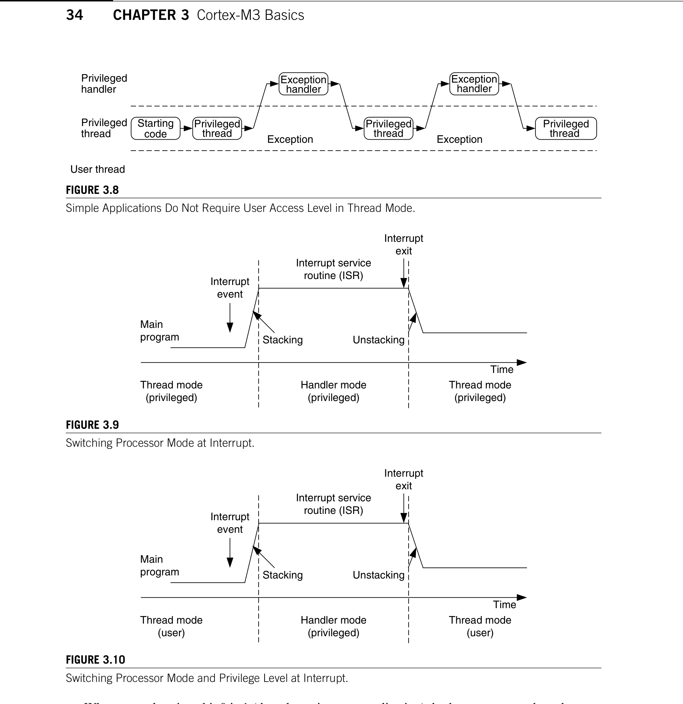
*Description*: Technical diagram and schematic illustration detailing hardware circuit topology, signal routing, and logic operations for Figure 3.8.

> **Figure 3.8**

*Description*: Technical diagram and schematic illustration detailing hardware circuit topology, signal routing, and logic operations for Figure 3.9.

> **Figure 3.9**

34
CHAPTER 3  Cortex-M3 Basics
When control register bit 0 is 1 (thread running user application), both processor mode and access
level change when an exception takes place (see Figure 3.10).
Control register bit 0 is programmable only in the privileged level (see Figure 2.5). For a user-level
program to switch to privileged state, it has to raise an interrupt (for example, supervisor call [SVC])
and write to CONTROL[0] within the handler.
Figure 3.8
Simple Applications Do Not Require User Access Level in Thread Mode.
Privileged
thread
Privileged
thread
Privileged
thread
Exception
handler
Starting
code
Privileged
thread
User thread
Privileged
handler
Exception
Exception
Exception
handler
Figure 3.9
Switching Processor Mode at Interrupt.
Thread mode
(privileged)
Handler mode
(privileged)
Thread mode
(privileged)
Time
Main
program
Interrupt
event
Interrupt service
routine (ISR)
Interrupt
exit
Stacking
Unstacking
Figure 3.10
Switching Processor Mode and Privilege Level at Interrupt.
Thread mode
(user)
Handler mode
(privileged)
Thread mode
(user)
Time
Main
program
Interrupt
event
Interrupt service
routine (ISR)
Interrupt
exit
Stacking
Unstacking

<!-- Page 62 -->
### [PDF Page 62]

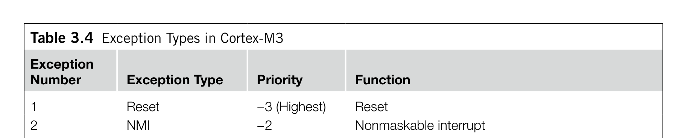
*Description*: Hardware reference table detailing register bit field settings, electrical operating limits, or memory configurations for Table 3.4.

> **Table 3.4**

35

## 3.4  Exceptions and Interrupts

## 3.4  Exceptions and Interrupts

The Cortex-M3 supports a number of exceptions, including a fixed number of system exceptions and
a number of interrupts, commonly called IRQ. The number of interrupt inputs on a Cortex-M3 micro-
controller depends on the individual design. Interrupts generated by peripherals, except System Tick
Timer, are also connected to the interrupt input signals. The typical number of interrupt inputs is 16
or 32. However, you might find some microcontroller designs with more (or fewer) interrupt inputs.
Besides the interrupt inputs, there is also a nonmaskable interrupt (NMI) input signal. The actual
use of NMI depends on the design of the microcontroller or system-on-chip (SoC) product you use. In
most cases, the NMI could be connected to a watchdog timer or a voltage-monitoring block that warns
the processor when the voltage drops below a certain level. The NMI exception can be activated any
time, even right after the core exits reset.
The list of exceptions found in the Cortex-M3 is shown in Table 3.4. A number of the system
exceptions are fault-handling exceptions that can be triggered by various error conditions. The NVIC
also provides a number of fault status registers so that error handlers can determine the cause of the
exceptions.
More details on exception operations in the Cortex-M3 processor are discussed in Chapters 7 to 9.
Table 3.4  Exception Types in Cortex-M3
Exception
Number
Exception Type
Priority
Function
1
Reset
−3 (Highest)
Reset
2
NMI
−2
Nonmaskable interrupt
3
Hard fault
−1
All classes of fault, when the corresponding fault
handler cannot be activated because it is currently
disabled or masked by exception masking
4
MemManage
Settable
Memory management fault; caused by MPU
violation or invalid accesses (such as an instruction
fetch from a nonexecutable region)
5
Bus fault
Settable
Error response received from the bus system;
caused by an instruction prefetch abort or data
access error
6
Usage fault
Settable
Usage fault; typical causes are invalid instructions
or invalid state transition attempts (such as trying to
switch to ARM state in the Cortex-M3)
7–10
—
—
Reserved
11
SVC
Settable
Supervisor call via SVC instruction
12
Debug monitor
Settable
Debug monitor
13
—
—
Reserved
14
PendSV
Settable
Pendable request for system service
15
SYSTICK
Settable
System tick timer
16–255
IRQ
Settable
IRQ input #0–239

<!-- Page 63 -->
### [PDF Page 63]

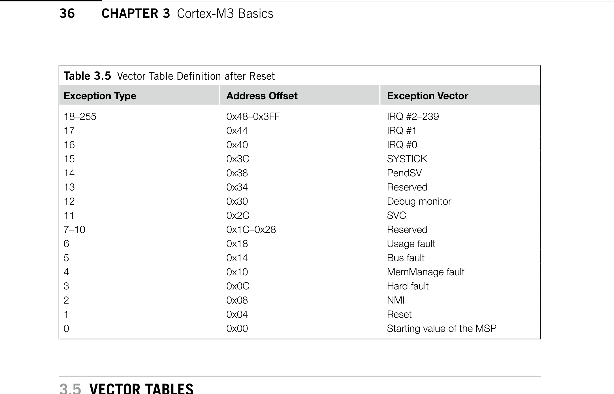
*Description*: Hardware reference table detailing register bit field settings, electrical operating limits, or memory configurations for Table 3.5.

> **Table 3.5**

36
CHAPTER 3  Cortex-M3 Basics

## 3.5  Vector Tables

When an exception event takes place on the Cortex-M3 and is accepted by the processor core, the
­corresponding exception handler is executed. To determine the starting address of the exception han-
dler, a vector table mechanism is used. The vector table is an array of word data inside the system
memory, each representing the starting address of one exception type. The vector table is relocatable,
and the relocation is controlled by a relocation register in the NVIC (see Table 3.5). After reset, this
relocation control register is reset to 0; therefore, the vector table is located in address 0x0 after reset.
For example, if the reset is exception type 1, the address of the reset vector is 1 times 4 (each word
is 4 bytes), which equals 0x00000004, and NMI vector (type 2) is located in 2 × 4 = 0x00000008. The
address 0x00000000 is used to store the starting value for the MSP.
The LSB of each exception vector indicates whether the exception is to be executed in the Thumb
state. Because the Cortex-M3 can support only Thumb instructions, the LSB of all the exception vec-
tors should be set to 1.

## 3.6  Stack Memory Operations

In the Cortex-M3, besides normal software-controlled stack PUSH and POP, the stack PUSH and POP
operations are also carried out automatically when entering or exiting an exception/interrupt handler.
In this section, we examine the software stack operations. (Stack operations during exception handling
are covered in Chapter 9.)
Table 3.5  Vector Table Definition after Reset
Exception Type
Address Offset
Exception Vector
18–255
0x48–0x3FF
IRQ #2–239
17
0x44
IRQ #1
16
0x40
IRQ #0
15
0x3C
SYSTICK
14
0x38
PendSV
13
0x34
Reserved
12
0x30
Debug monitor
11
0x2C
SVC
7–10
0x1C–0x28
Reserved
6
0x18
Usage fault
5
0x14
Bus fault
4
0x10
MemManage fault
3
0x0C
Hard fault
2
0x08
NMI
1
0x04
Reset
0
0x00
Starting value of the MSP

<!-- Page 64 -->
### [PDF Page 64]

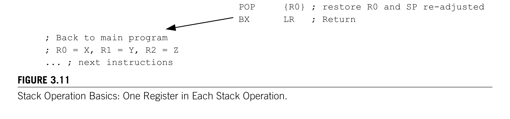
*Description*: Technical diagram and schematic illustration detailing hardware circuit topology, signal routing, and logic operations for Figure 3.11.

> **Figure 3.11**

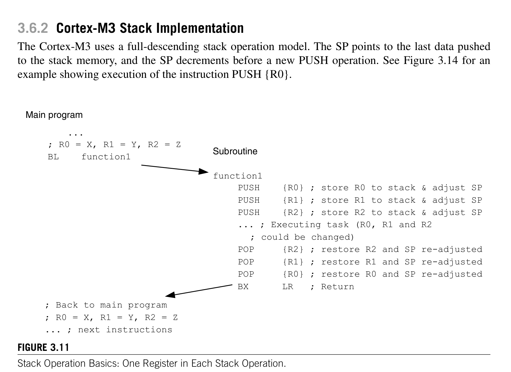
*Description*: Technical diagram and schematic illustration detailing hardware circuit topology, signal routing, and logic operations for Figure 3.14.

> **Figure 3.14**

37

## 3.6  Stack Memory Operations

3.6.1  Basic Operations of the Stack
In general, stack operations are memory write or read operations, with the address specified by an SP.
Data in registers is saved into stack memory by a PUSH operation and can be restored to registers later
by a POP operation. The SP is adjusted automatically in PUSH and POP so that multiple data PUSH
will not cause old stacked data to be erased.
The function of the stack is to store register contents in memory so that they can be restored later,
after a processing task is completed. For normal uses, for each store (PUSH), there must be a cor-
responding read (POP), and the address of the POP operation should match that of the PUSH opera-
tion (see Figure 3.11). When PUSH/POP instructions are used, the SP is incremented/decremented
­automatically.
When program control returns to the main program, the R0–R2 contents are the same as before.
Notice the order of PUSH and POP: The POP order must be the reverse of PUSH.
These operations can be simplified, thanks to PUSH and POP instructions allowing multiple load
and store. In this case, the ordering of a register POP is automatically reversed by the processor (see
Figure 3.12).
You can also combine RETURN with a POP operation. This is done by pushing the LR to the stack
and popping it back to PC at the end of the subroutine (see Figure 3.13).
3.6.2  Cortex-M3 Stack Implementation
The Cortex-M3 uses a full-descending stack operation model. The SP points to the last data pushed
to the stack memory, and the SP decrements before a new PUSH operation. See Figure 3.14 for an
example showing execution of the instruction PUSH {R0}.
Figure 3.11
Stack Operation Basics: One Register in Each Stack Operation.
Main program
...
; R0 = X, R1 = Y, R2 = Z
BL    function1
; Back to main program
; R0 = X, R1 = Y, R2 = Z
... ; next instructions
function1
PUSH    {R0} ; store R0 to stack & adjust SP
PUSH    {R1} ; store R1 to stack & adjust SP
PUSH    {R2} ; store R2 to stack & adjust SP
... ; Executing task (R0, R1 and R2
; could be changed)
POP     {R2} ; restore R2 and SP re-adjusted
POP     {R1} ; restore R1 and SP re-adjusted
POP     {R0} ; restore R0 and SP re-adjusted
BX      LR   ; Return
Subroutine

<!-- Page 65 -->
### [PDF Page 65]

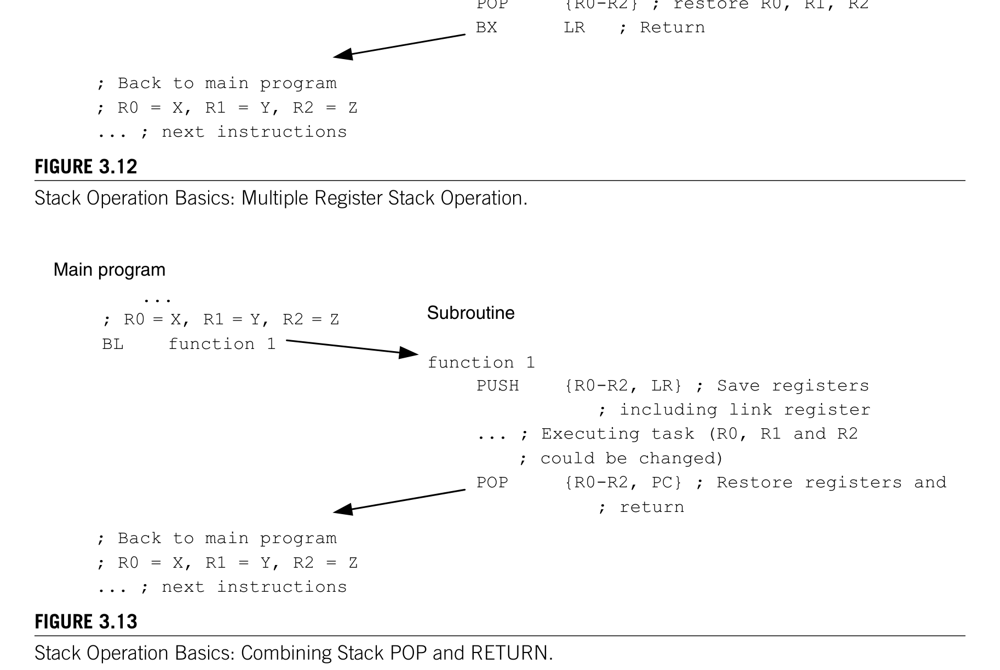
*Description*: Technical diagram and schematic illustration detailing hardware circuit topology, signal routing, and logic operations for Figure 3.12.

> **Figure 3.12**

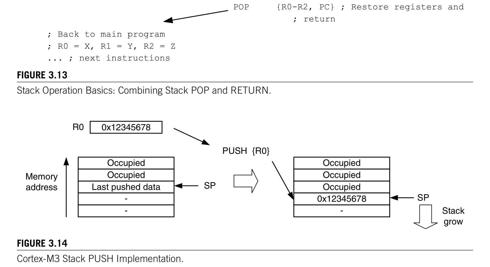
*Description*: Technical diagram and schematic illustration detailing hardware circuit topology, signal routing, and logic operations for Figure 3.13.

> **Figure 3.13**

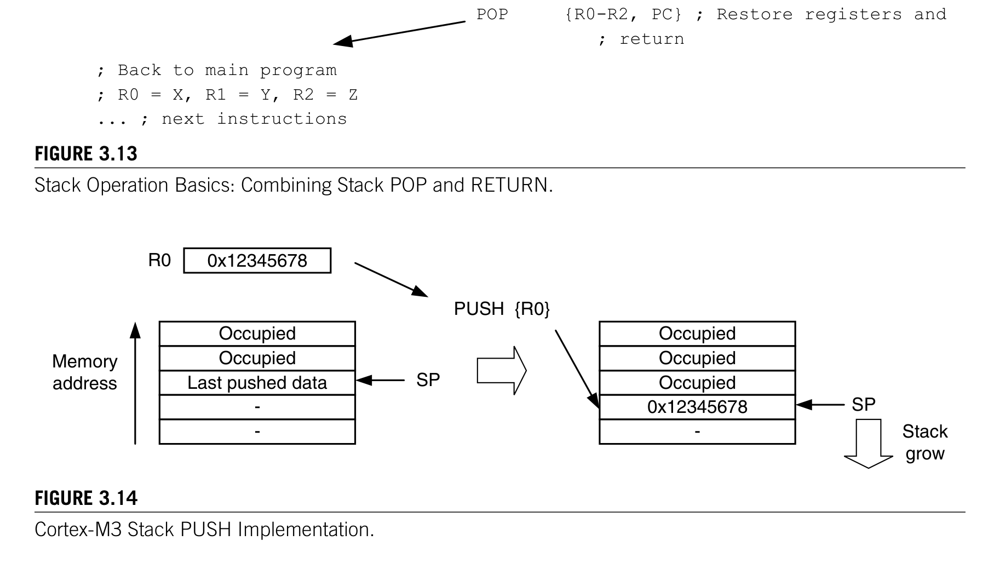
*Description*: Technical diagram and schematic illustration detailing hardware circuit topology, signal routing, and logic operations for Figure 3.14.

> **Figure 3.14**

38
CHAPTER 3  Cortex-M3 Basics
Figure 3.12
Stack Operation Basics: Multiple Register Stack Operation.
Main program
...
BL    function 1
; Back to main program
... ; next instructions
function 1
PUSH    {R0-R2} ; Store R0, R1, R2 to stack
... ; Executing task (R0, R1 and R2
; could be changed)
POP     {R0-R2} ; restore R0, R1, R2
BX      LR   ; Return
Subroutine
; R0 = X, R1 = Y, R2 = Z
; R0 = X, R1 = Y, R2 = Z
Figure 3.13
Stack Operation Basics: Combining Stack POP and RETURN.
Main program
...
; R0 = X, R1 = Y, R2 = Z
BL    function 1
; Back to main program
; R0 = X, R1 = Y, R2 = Z
... ; next instructions
function 1
PUSH    {R0-R2, LR} ; Save registers
; including link register
... ; Executing task (R0, R1 and R2
; could be changed)
POP     {R0-R2, PC} ; Restore registers and
; return
Subroutine
Figure 3.14
Cortex-M3 Stack PUSH Implementation.
Last pushed data
-
-
Memory
address
Occupied
Occupied
SP
0x12345678
R0
PUSH  {R0}
Occupied
0x12345678
-
Occupied
Occupied
SP
Stack
grow

<!-- Page 66 -->
### [PDF Page 66]

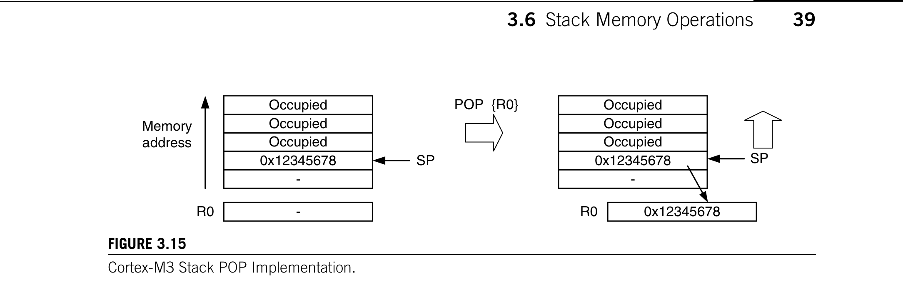
*Description*: Technical diagram and schematic illustration detailing hardware circuit topology, signal routing, and logic operations for Figure 3.15.

> **Figure 3.15**

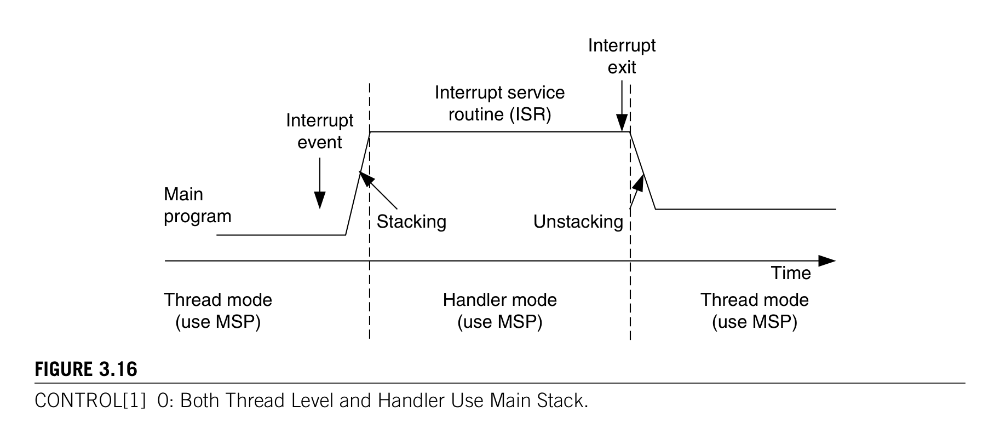
*Description*: Technical diagram and schematic illustration detailing hardware circuit topology, signal routing, and logic operations for Figure 3.16.

> **Figure 3.16**

39

## 3.6  Stack Memory Operations

For POP operations, the data is read from the memory location pointer by SP, and then, the SP is
incremented. The contents in the memory location are unchanged but will be overwritten when the next
PUSH operation takes place (see Figure 3.15).
Because each PUSH/POP operation transfers 4 bytes of data (each register contains 1 word, or 4 bytes),
the SP decrements/increments by 4 at a time or a multiple of 4 if more than 1 register is pushed or popped.
In the Cortex-M3, R13 is defined as the SP. When an interrupt takes place, a number of registers
will be pushed automatically, and R13 will be used as the SP for this stacking process. Similarly, the
pushed registers will be restored/popped automatically when exiting an interrupt handler, and the SP
will also be adjusted.
3.6.3  The Two-Stack Model in the Cortex-M3
As mentioned before, the Cortex-M3 has two SPs: the MSPS and the PSP. The SP register to be used is
controlled by the control register bit 1 (CONTROL[1] in the following text).
When CONTROL[1] is 0, the MSP is used for both thread mode and handler mode (see ­Figure 3.16).
In this arrangement, the main program and the exception handlers share the same stack memory region.
This is the default setting after power-up.
When the CONTROL[1] is 1, the PSP is used in thread mode (see Figure 3.17). In this arrangement,
the main program and the exception handler can have separate stack memory regions. This can prevent
Figure 3.15
Cortex-M3 Stack POP Implementation.
POP  {R0}
R0
-
-
Memory
address
Occupied
Occupied
Occupied
SP
0x12345678
Occupied
0x12345678
0x12345678
R0
-
Occupied
Occupied
SP
Figure 3.16
CONTROL[1]=0: Both Thread Level and Handler Use Main Stack.
Thread mode
(use MSP)
Handler mode
(use MSP)
Thread mode
(use MSP)
Time
Main
program
Interrupt
event
Interrupt service
routine (ISR)
Interrupt
exit
Stacking
Unstacking

<!-- Page 67 -->
### [PDF Page 67]

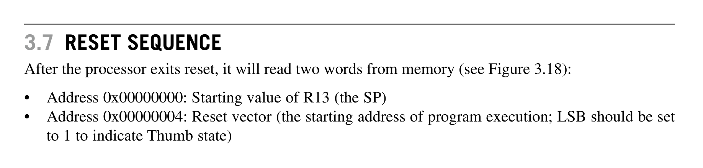
*Description*: Technical diagram and schematic illustration detailing hardware circuit topology, signal routing, and logic operations for Figure 3.18.

> **Figure 3.18**

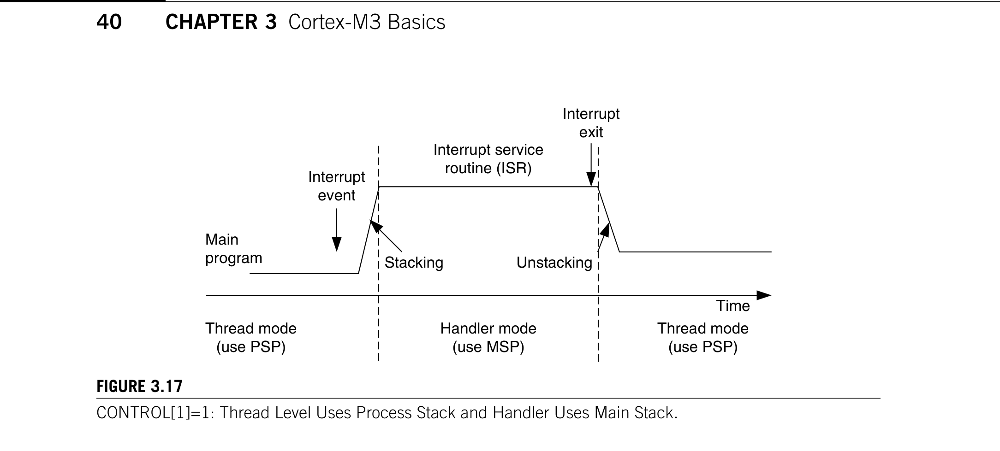
*Description*: Technical diagram and schematic illustration detailing hardware circuit topology, signal routing, and logic operations for Figure 3.17.

> **Figure 3.17**

40
CHAPTER 3  Cortex-M3 Basics
a stack error in a user application from damaging the stack used by the OS (assuming that the user
application runs only in thread mode and the OS kernel executes in handler mode).
Note that in this situation, the automatic stacking and unstacking mechanism will use PSP, whereas
stack operations inside the handler will use MSP.
It is possible to perform read/write operations directly to the MSP and PSP, without any confusion
of which R13 you are referring to. Provided that you are in privileged level, you can access MSP and
PSP values:
x = __get_MSP(); // Read the value of MSP
__set_MSP(x); // Set the value of MSP
x = __get_PSP(); // Read the value of PSP
__set_PSP(x); // Set the value of PSP
In general, it is not recommended to change current selected SP values in a C function, as the stack
memory could be used for storing local variables. To access the SPs in assembly, you can use the MRS
and MSR instructions:
MRS R0, MSP  ; Read Main Stack Pointer to R0
MSR MSP, R0  ; Write R0 to Main Stack Pointer
MRS R0, PSP  ; Read Process Stack Pointer to R0
MSR PSP, R0  ; Write R0 to Process Stack Pointer
By reading the PSP value using an MRS instruction, the OS can read data stacked by the user
­application (such as register contents before SVC). In addition, the OS can change the PSP pointer
value—for example, during context switching in multitasking systems.

## 3.7  Reset Sequence

After the processor exits reset, it will read two words from memory (see Figure 3.18):
Address 0x00000000: Starting value of R13 (the SP)
•
Address 0x00000004: Reset vector (the starting address of program execution; LSB should be set
•
to 1 to indicate Thumb state)
Figure 3.17
CONTROL[1]=1: Thread Level Uses Process Stack and Handler Uses Main Stack.
Thread mode
(use PSP)
Handler mode
(use MSP)
Thread mode
(use PSP)
Time
Main
program
Interrupt
event
Interrupt service
routine (ISR)
Interrupt
exit
Stacking
Unstacking

<!-- Page 68 -->
### [PDF Page 68]

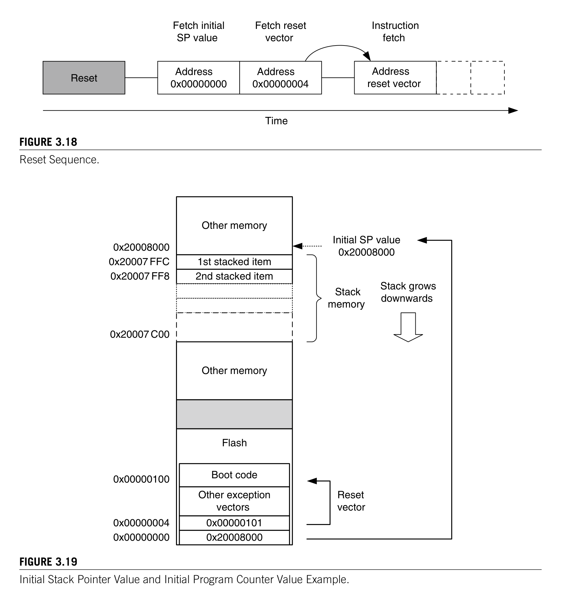
*Description*: Technical diagram and schematic illustration detailing hardware circuit topology, signal routing, and logic operations for Figure 3.18.

> **Figure 3.18**

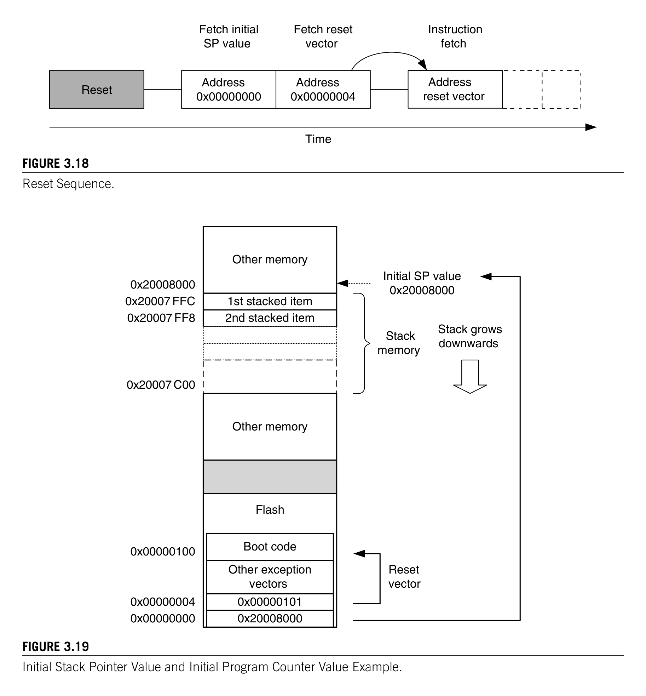
*Description*: Technical diagram and schematic illustration detailing hardware circuit topology, signal routing, and logic operations for Figure 3.19.

> **Figure 3.19**

41

## 3.7  Reset Sequence

This differs from traditional ARM processor behavior. Previous ARM processors executed program code
starting from address 0x0. Furthermore, the vector table in previous ARM devices was instructions (you
have to put a branch instruction there so that your exception handler can be put in another location).
In the Cortex-M3, the initial value for the MSP is put at the beginning of the memory map, followed
by the vector table, which contains vector address values. (The vector table can be relocated to another
location later, during program execution.) In addition, the contents of the vector table are address values
Figure 3.18
Reset Sequence.
Addressz
reset vector
Time
Reset
Addressz
0x00000000
Addressz
0x00000004
Fetch initial
SP value
Fetch reset
vector
Instruction
fetch
Figure 3.19
Initial Stack Pointer Value and Initial Program Counter Value Example.
Other memory
0x20008000
1st stacked item
2nd stacked item
Other memory
0x20007FFC
0x20007FF8
0x20007C00
Stack
memory
Initial SP value
0x20008000
Stack grows
downwards
0x20008000
0x00000000
0x00000004
0x00000101
Boot code
0x00000100
Reset
vector
Other exception
vectors
Flash

<!-- Page 69 -->
### [PDF Page 69]

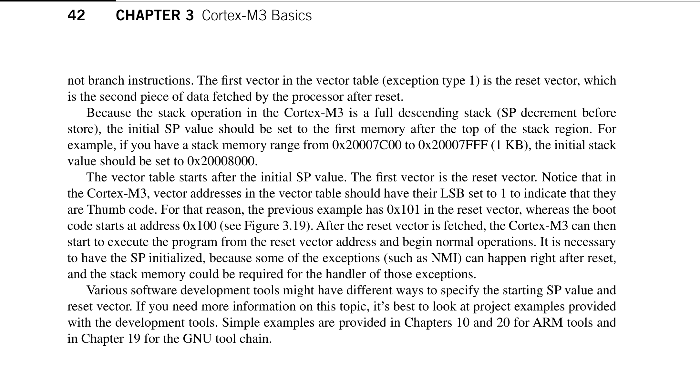
*Description*: Technical diagram and schematic illustration detailing hardware circuit topology, signal routing, and logic operations for Figure 3.19.

> **Figure 3.19**

42
CHAPTER 3  Cortex-M3 Basics
not branch instructions. The first vector in the vector table (exception type 1) is the reset vector, which
is the second piece of data fetched by the processor after reset.
Because the stack operation in the Cortex-M3 is a full descending stack (SP decrement before
store), the initial SP value should be set to the first memory after the top of the stack region. For
example, if you have a stack memory range from 0x20007C00 to 0x20007FFF (1 KB), the initial stack
value should be set to 0x20008000.
The vector table starts after the initial SP value. The first vector is the reset vector. Notice that in
the Cortex-M3, vector addresses in the vector table should have their LSB set to 1 to indicate that they
are Thumb code. For that reason, the previous example has 0x101 in the reset vector, whereas the boot
code starts at address 0x100 (see Figure 3.19). After the reset vector is fetched, the Cortex-M3 can then
start to execute the program from the reset vector address and begin normal operations. It is necessary
to have the SP initialized, because some of the exceptions (such as NMI) can happen right after reset,
and the stack memory could be required for the handler of those exceptions.
Various software development tools might have different ways to specify the starting SP value and
reset vector. If you need more information on this topic, it’s best to look at project examples provided
with the development tools. Simple examples are provided in Chapters 10 and 20 for ARM tools and
in Chapter 19 for the GNU tool chain.

