# Chapter
4. Instruction Sets

> **Source PDF**: THE_DEFINITIVE_GUIDE_TO_THE_ARM_CORTEX-МЗ_Stellaris_MCU_9000Series_TEINSTRUMENTS_ARM_SECOND_EDITION.pdf  
> **PDF Page Range**: 70 - 105


---


<!-- Page 70 -->
### [PDF Page 70]

43
Copyright © 2010, Elsevier Inc. All rights reserved.
DOI: 10.1016/B978-0-12-382091-4.00010-4
In This Chapter
Assembly Basics..................................................................................................................................... 43
Instruction List........................................................................................................................................ 46
Instruction Descriptions........................................................................................................................... 52
Several Useful Instructions in the Cortex-M3............................................................................................ 70
CHAPTER
Instruction Sets
4
This chapter provides some insight into the instruction set in the Cortex™-M3 and examples for a
number of instructions. You’ll also find more information on the instruction set in Appendix A of this
book. For complete details of each instruction, refer to the ARM v7-M Architecture Application Level
Reference Manual [Ref. 2] or user guides from microcontroller vendors.

## 4.1  Assembly Basics

Here, we introduce some basic syntax of ARM assembly to make it easier to understand the rest of the
code examples in this book. Most of the assembly code examples in this book are based on the ARM
assembler tools, with the exception of those in Chapter 19, which focus on the Gnu’s Not Unix tool
chain.
4.1.1  Assembler Language: Basic Syntax
In assembler code, the following instruction formatting is commonly used:
label
opcode operand1, operand2, ...; Comments
The label is optional. Some of the instructions might have a label in front of them so that the address
of the instructions can be determined using the label. Then, you will find the opcode (the instruction)
followed by a number of operands. Normally, the first operand is the destination of the operation. The
number of operands in an instruction depends on the type of instruction, and the syntax format of the


<!-- Page 71 -->
### [PDF Page 71]


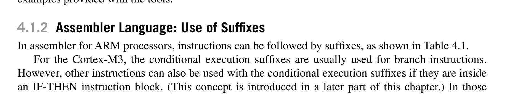
*Description*: Hardware reference table detailing register bit field settings, electrical operating limits, or memory configurations for Table 4.1.

> **Table 4.1**

44
CHAPTER 4  Instruction Sets
operand can also be different. For example, immediate data are usually in the form #number, as shown
here:
MOV R0, #0x12 ; Set R0 = 0x12 (hexadecimal)
MOV R1, #'A'  ; Set R1 = ASCII character A
The text after each semicolon (;) is a comment. These comments do not affect the program operation,
but they can make programs easier for humans to understand.
You can define constants using EQU, and then use them inside your program code. For example,
NVIC_IRQ_SETEN0 EQU 0xE000E100
NVIC_IRQ0_ENABLE EQU 0x1
...
LDR R0,=NVIC_IRQ_SETEN0; ; LDR here is a pseudo-instruction that
; convert to a PC relative load by
; assembler.
MOV R1,#NVIC_IRQ0_ENABLE ; Move immediate data to register
STR R1,[R0]
; Enable IRQ 0 by writing R1 to address
; in R0
A number of data definition directives are available for insertion of constants inside assembly code.
For example, DCI (Define Constant Instruction) can be used to code an instruction if your assembler
cannot generate the exact instruction that you want and if you know the binary code for the instruction.
DCI 0xBE00 ;  Breakpoint (BKPT 0),  a 16-bit instruction
We can use DCB (Define Constant Byte) for byte size constant values, such as characters, and
Define Constant Data (DCD) for word size constant values to define binary data in your code.
LDR R3,=MY_NUMBER  ; Get the memory address value of MY_NUMBER
LDR R4,[R3]
; Get the value code 0x12345678 in R4
...
LDR R0,=HELLO_TXT  ; Get the starting memory address of
; HELLO_TXT
BL PrintText
; Call a function called PrintText to
; display string
...
MY_NUMBER
DCD 0x12345678
HELLO_TXT
DCB "Hello\n",0    ; null terminated string
Note that the assembler syntax depends on which assembler tool you are using. Here, the ARM
assembler tools syntax is introduced. For syntax of other assemblers, it is best to start from the code
examples provided with the tools.
4.1.2  Assembler Language: Use of Suffixes
In assembler for ARM processors, instructions can be followed by suffixes, as shown in Table 4.1.
For the Cortex-M3, the conditional execution suffixes are usually used for branch instructions.
However, other instructions can also be used with the conditional execution suffixes if they are inside
an IF-THEN instruction block. (This concept is introduced in a later part of this chapter.) In those


<!-- Page 72 -->
### [PDF Page 72]


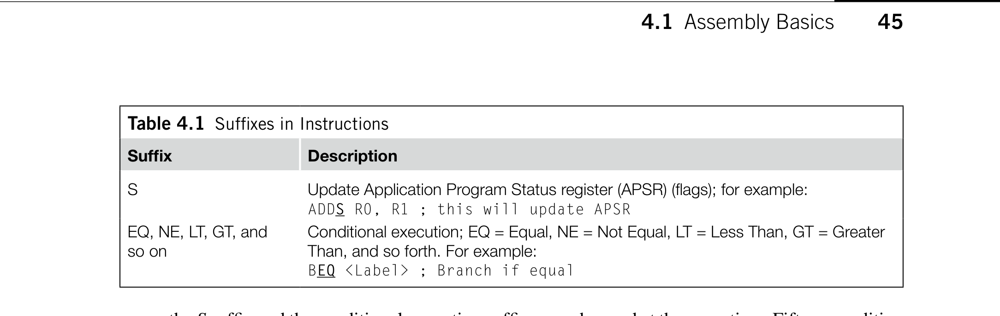
*Description*: Hardware reference table detailing register bit field settings, electrical operating limits, or memory configurations for Table 4.1.

> **Table 4.1**

45

## 4.1  Assembly Basics

cases, the S suffix and the conditional execution suffixes can be used at the same time. Fifteen condition
choices are available, as described later in this chapter.
4.1.3  Assembler Language: Unified Assembler Language
To support and get the best out of the Thumb®-2 instruction set, the Unified Assembler Language
(UAL) was developed to allow selection of 16-bit and 32-bit instructions and to make it easier to port
applications between ARM code and Thumb code by using the same syntax for both. (With UAL, the
syntax of Thumb instructions is now the same as for ARM instructions.)

```assembly
ADD R0, R1     ; R0 = R0 + R1, using Traditional Thumb syntax
ADD R0, R0, R1 ; Equivalent instruction using UAL syntax
```

The traditional Thumb syntax can still be used. The choice between whether the instructions are
interpreted as traditional Thumb code or the new UAL syntax is normally defined by the directive in
the assembly file. For example, with ARM assembler tool, a program code header with “CODE16”
directive implies the code is in the traditional Thumb syntax, and “THUMB” directive implies the code
is in the new UAL syntax.
One thing you need to be careful with reusing traditional Thumb is that some instructions change
the flags in APSR, even if the S suffix is not used. However, when the UAL syntax is used, whether the
instruction changes the flag depends on the S suffix. For example,
AND  R0, R1     ; Traditional Thumb syntax
ANDS R0, R0, R1 ; Equivalent UAL syntax (S suffix is added)
With the new instructions in Thumb-2 technology, some of the operations can be handled by either a
Thumb instruction or a Thumb-2 instruction. For example, R0 = R0 + 1 can be implemented as a 16-bit
Thumb instruction or a 32-bit Thumb-2 instruction. With UAL, you can specify which instruction you
want by adding suffixes:
ADDS   R0, #1 ; Use 16-bit Thumb instruction by default
; for smaller size
ADDS.N R0, #1 ; Use 16-bit Thumb instruction (N=Narrow)
ADDS.W R0, #1 ; Use 32-bit Thumb-2 instruction (W=wide)
The .W (wide) suffix specifies a 32-bit instruction. If no suffix is given, the assembler tool can
choose either instruction but usually defaults to 16-bit Thumb code to get a smaller size. Depending on
tool support, you may also use the .N (narrow) suffix to specify a 16-bit Thumb instruction.
Again, this syntax is for ARM assembler tools. Other assemblers might have slightly different ­syntax.
If no suffix is given, the assembler might choose the instruction for you, with the minimum code size.
Table 4.1  Suffixes in Instructions
Suffix
Description
S
Update Application Program Status register (APSR) (flags); for example:
ADDS R0, R1 ; this will update APSR
EQ, NE, LT, GT, and
so on
Conditional execution; EQ = Equal, NE = Not Equal, LT = Less Than, GT = Greater
Than, and so forth. For example:
BEQ <Label> ; Branch if equal


<!-- Page 73 -->
### [PDF Page 73]


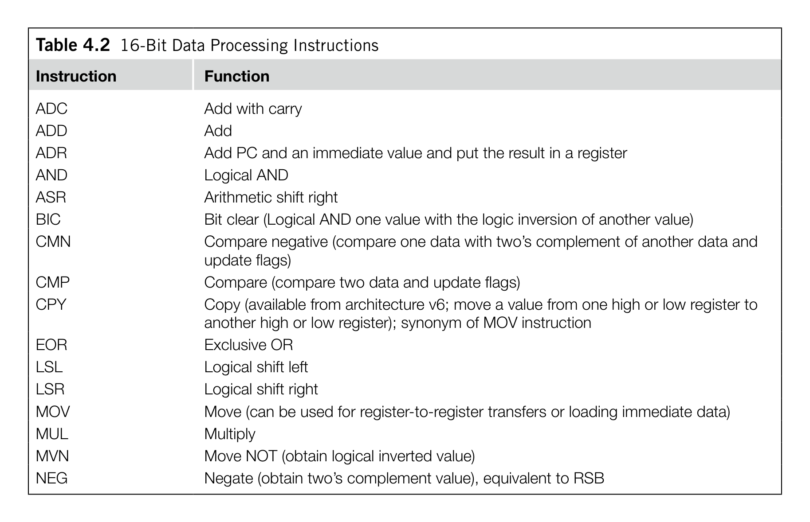
*Description*: Hardware reference table detailing register bit field settings, electrical operating limits, or memory configurations for Table 4.2.

> **Table 4.2**

46
CHAPTER 4  Instruction Sets
In most cases, applications will be coded in C, and the C compilers will use 16-bit instructions
if possible due to smaller code size. However, when the immediate data exceed a certain range or
when the operation can be better handled with a 32-bit Thumb-2 instruction, the 32-bit instruction will
be used.
The 32-bit Thumb-2 instructions can be half word aligned. For example, you can have a 32-bit
instruction located in a half word location.
0x1000 : LDR r0,[r1] ;a 16-bit instructions (occupy 0x1000-0x1001)
0x1002 : RBIT.W r0   ;a 32-bit Thumb-2 instruction (occupy
;  0x1002-0x1005)
Most of the 16-bit instructions can only access registers R0–R7; 32-bit Thumb-2 instructions do not
have this limitation. However, use of PC (R15) might not be allowed in some of the instructions. Refer
to the ARM v7-M Architecture Application Level Reference Manual [Ref. 2] (section A4.6) if you need
to find out more detail in this area.

## 4.2  Instruction List

The supported instructions are listed in Tables 4.2 through 4.9. The complete details of each instruction
are available in the ARM v7-M Architecture Application Level Reference Manual [Ref. 2]. There is also
information of the supported instruction sets in Appendix A.
Table 4.2  16-Bit Data Processing Instructions
Instruction
Function
ADC
Add with carry
ADD
Add
ADR
Add PC and an immediate value and put the result in a register
AND
Logical AND
ASR
Arithmetic shift right
BIC
Bit clear (Logical AND one value with the logic inversion of another value)
CMN
Compare negative (compare one data with two’s complement of another data and
update flags)
CMP
Compare (compare two data and update flags)
CPY
Copy (available from architecture v6; move a value from one high or low register to
another high or low register); synonym of MOV instruction
EOR
Exclusive OR
LSL
Logical shift left
LSR
Logical shift right
MOV
Move (can be used for register-to-register transfers or loading immediate data)
MUL
Multiply
MVN
Move NOT (obtain logical inverted value)
NEG
Negate (obtain two’s complement value), equivalent to RSB


<!-- Page 74 -->
### [PDF Page 74]


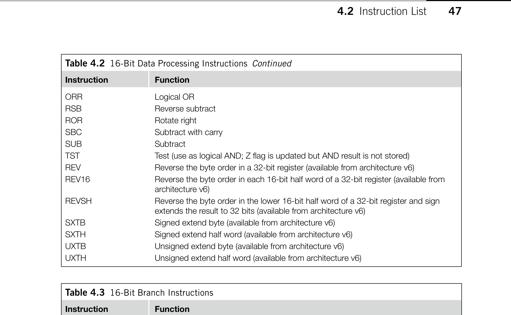
*Description*: Hardware reference table detailing register bit field settings, electrical operating limits, or memory configurations for Table 4.2.

> **Table 4.2**


*Description*: Hardware reference table detailing register bit field settings, electrical operating limits, or memory configurations for Table 4.3.

> **Table 4.3**


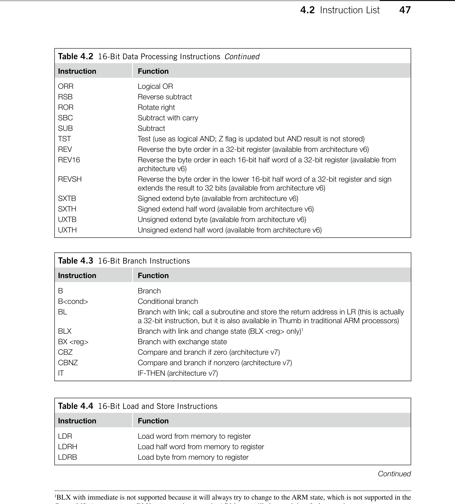
*Description*: Hardware reference table detailing register bit field settings, electrical operating limits, or memory configurations for Table 4.4.

> **Table 4.4**

47

## 4.2  Instruction List

Table 4.2  16-Bit Data Processing Instructions  Continued
Instruction
Function
ORR
Logical OR
RSB
Reverse subtract
ROR
Rotate right
SBC
Subtract with carry
SUB
Subtract
TST
Test (use as logical AND; Z flag is updated but AND result is not stored)
REV
Reverse the byte order in a 32-bit register (available from architecture v6)
REV16
Reverse the byte order in each 16-bit half word of a 32-bit register (available from
architecture v6)
REVSH
Reverse the byte order in the lower 16-bit half word of a 32-bit register and sign
extends the result to 32 bits (available from architecture v6)
SXTB
Signed extend byte (available from architecture v6)
SXTH
Signed extend half word (available from architecture v6)
UXTB
Unsigned extend byte (available from architecture v6)
UXTH
Unsigned extend half word (available from architecture v6)
Table 4.3  16-Bit Branch Instructions
Instruction
Function
B
Branch
B<cond>
Conditional branch
BL
Branch with link; call a subroutine and store the return address in LR (this is actually
a 32-bit instruction, but it is also available in Thumb in traditional ARM processors)
BLX
Branch with link and change state (BLX <reg> only)1
BX <reg>
Branch with exchange state
CBZ
Compare and branch if zero (architecture v7)
CBNZ
Compare and branch if nonzero (architecture v7)
IT
IF-THEN (architecture v7)
1BLX with immediate is not supported because it will always try to change to the ARM state, which is not supported in the
Cortex-M3. Attempts to use BLX <reg> to change to the ARM state will also result in a fault exception.
Table 4.4  16-Bit Load and Store Instructions
Instruction
Function
LDR
Load word from memory to register
LDRH
Load half word from memory to register
LDRB
Load byte from memory to register
Continued


<!-- Page 75 -->
### [PDF Page 75]


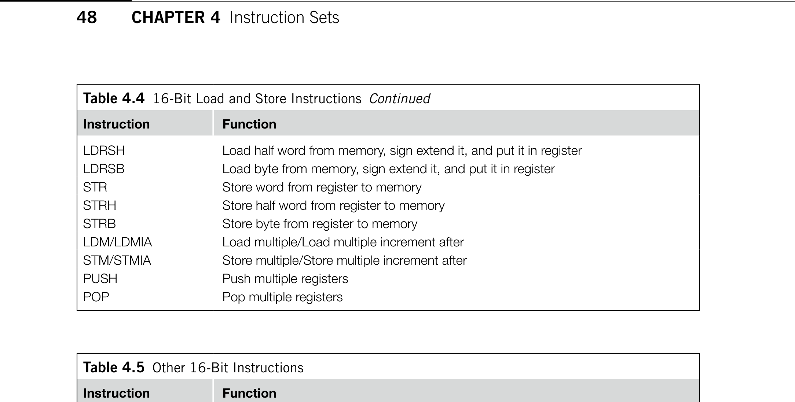
*Description*: Hardware reference table detailing register bit field settings, electrical operating limits, or memory configurations for Table 4.4.

> **Table 4.4**


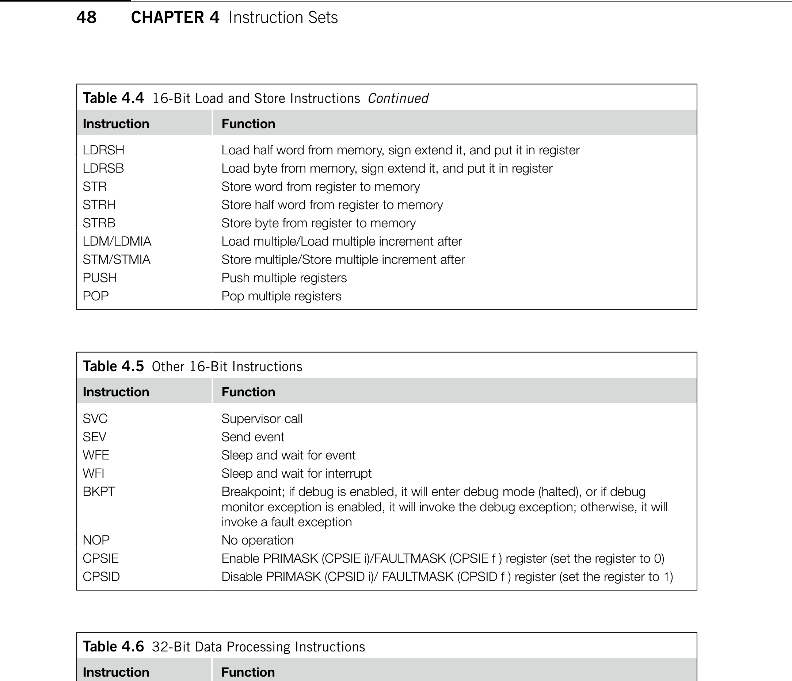
*Description*: Hardware reference table detailing register bit field settings, electrical operating limits, or memory configurations for Table 4.5.

> **Table 4.5**


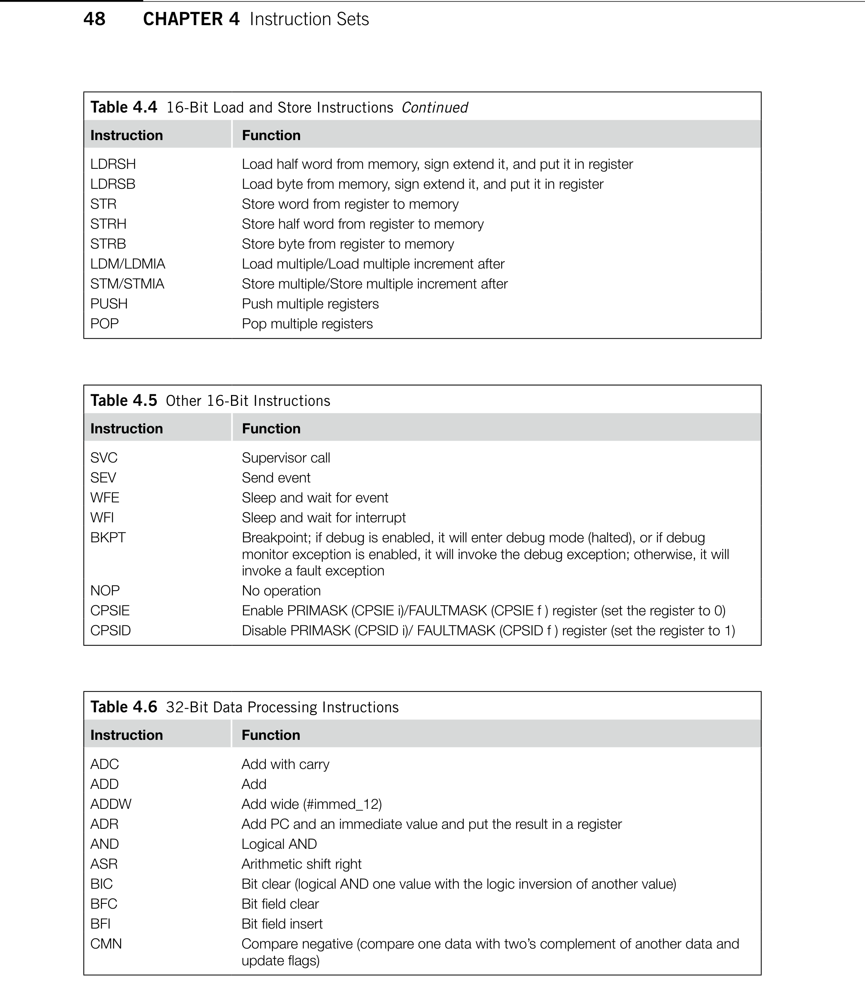
*Description*: Hardware reference table detailing register bit field settings, electrical operating limits, or memory configurations for Table 4.6.

> **Table 4.6**

48
CHAPTER 4  Instruction Sets
Table 4.4  16-Bit Load and Store Instructions  Continued
Instruction
Function
LDRSH
Load half word from memory, sign extend it, and put it in register
LDRSB
Load byte from memory, sign extend it, and put it in register
STR
Store word from register to memory
STRH
Store half word from register to memory
STRB
Store byte from register to memory
LDM/LDMIA
Load multiple/Load multiple increment after
STM/STMIA
Store multiple/Store multiple increment after
PUSH
Push multiple registers
POP
Pop multiple registers
Table 4.5  Other 16-Bit Instructions
Instruction
Function
SVC
Supervisor call
SEV
Send event
WFE
Sleep and wait for event
WFI
Sleep and wait for interrupt
BKPT
Breakpoint; if debug is enabled, it will enter debug mode (halted), or if debug
monitor exception is enabled, it will invoke the debug exception; otherwise, it will
invoke a fault exception
NOP
No operation
CPSIE
Enable PRIMASK (CPSIE i)/FAULTMASK (CPSIE f ) register (set the register to 0)
CPSID
Disable PRIMASK (CPSID i)/ FAULTMASK (CPSID f ) register (set the register to 1)
Table 4.6  32-Bit Data Processing Instructions
Instruction
Function
ADC
Add with carry
ADD
Add
ADDW
Add wide (#immed_12)
ADR
Add PC and an immediate value and put the result in a register
AND
Logical AND
ASR
Arithmetic shift right
BIC
Bit clear (logical AND one value with the logic inversion of another value)
BFC
Bit field clear
BFI
Bit field insert
CMN
Compare negative (compare one data with two’s complement of another data and
update flags)


<!-- Page 76 -->
### [PDF Page 76]


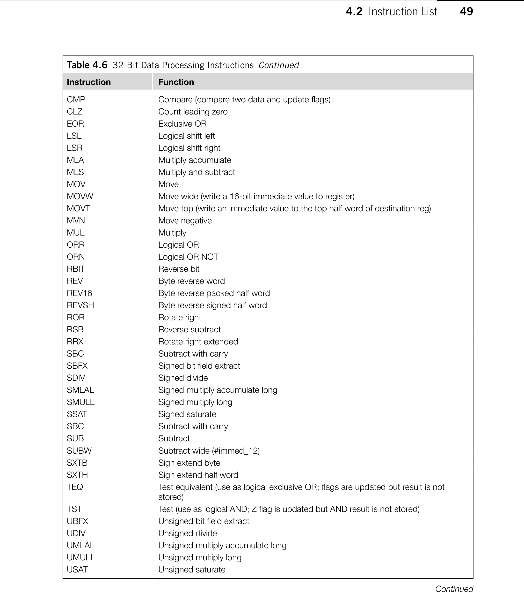
*Description*: Hardware reference table detailing register bit field settings, electrical operating limits, or memory configurations for Table 4.6.

> **Table 4.6**

49

## 4.2  Instruction List

Table 4.6  32-Bit Data Processing Instructions  Continued
Instruction
Function
CMP
Compare (compare two data and update flags)
CLZ
Count leading zero
EOR
Exclusive OR
LSL
Logical shift left
LSR
Logical shift right
MLA
Multiply accumulate
MLS
Multiply and subtract
MOV
Move
MOVW
Move wide (write a 16-bit immediate value to register)
MOVT
Move top (write an immediate value to the top half word of destination reg)
MVN
Move negative
MUL
Multiply
ORR
Logical OR
ORN
Logical OR NOT
RBIT
Reverse bit
REV
Byte reverse word
REV16
Byte reverse packed half word
REVSH
Byte reverse signed half word
ROR
Rotate right
RSB
Reverse subtract
RRX
Rotate right extended
SBC
Subtract with carry
SBFX
Signed bit field extract
SDIV
Signed divide
SMLAL
Signed multiply accumulate long
SMULL
Signed multiply long
SSAT
Signed saturate
SBC
Subtract with carry
SUB
Subtract
SUBW
Subtract wide (#immed_12)
SXTB
Sign extend byte
SXTH
Sign extend half word
TEQ
Test equivalent (use as logical exclusive OR; flags are updated but result is not
stored)
TST
Test (use as logical AND; Z flag is updated but AND result is not stored)
UBFX
Unsigned bit field extract
UDIV
Unsigned divide
UMLAL
Unsigned multiply accumulate long
UMULL
Unsigned multiply long
USAT
Unsigned saturate
Continued


<!-- Page 77 -->
### [PDF Page 77]


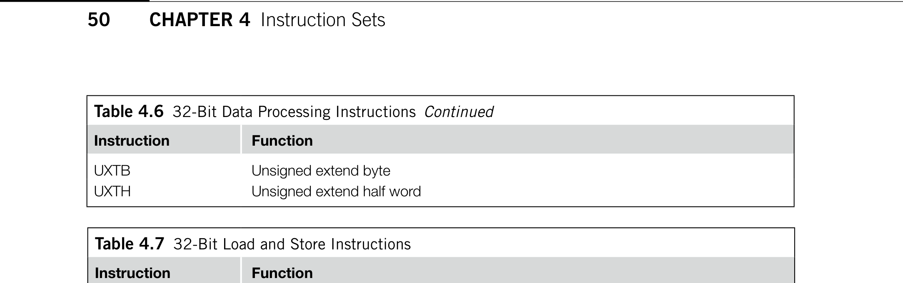
*Description*: Hardware reference table detailing register bit field settings, electrical operating limits, or memory configurations for Table 4.6.

> **Table 4.6**


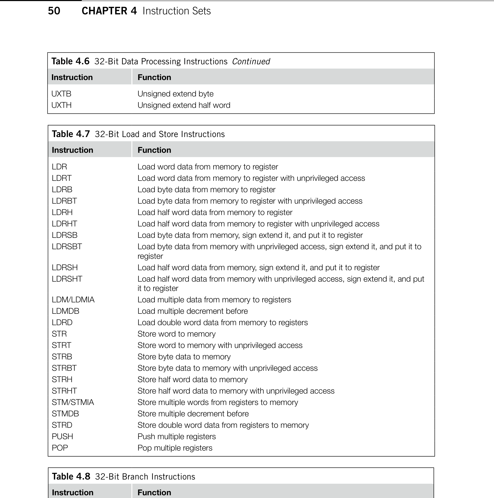
*Description*: Hardware reference table detailing register bit field settings, electrical operating limits, or memory configurations for Table 4.7.

> **Table 4.7**


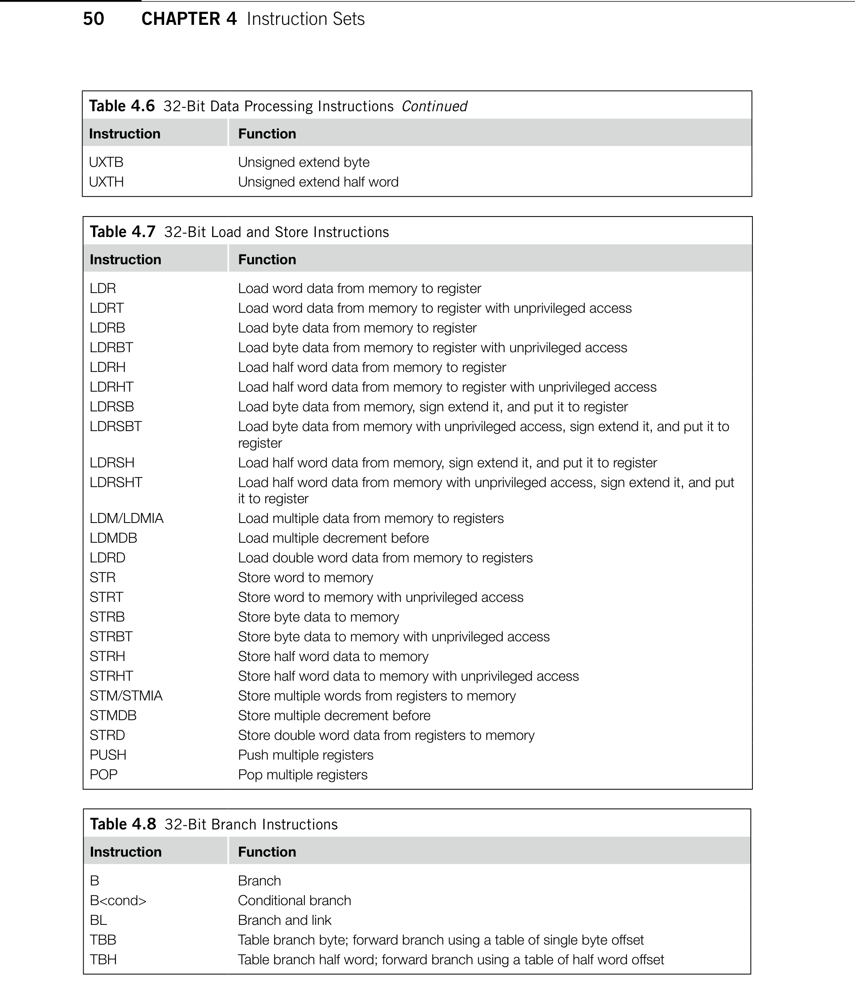
*Description*: Hardware reference table detailing register bit field settings, electrical operating limits, or memory configurations for Table 4.8.

> **Table 4.8**

50
CHAPTER 4  Instruction Sets
Table 4.6  32-Bit Data Processing Instructions  Continued
Instruction
Function
UXTB
Unsigned extend byte
UXTH
Unsigned extend half word
Table 4.7  32-Bit Load and Store Instructions
Instruction
Function
LDR
Load word data from memory to register
LDRT
Load word data from memory to register with unprivileged access
LDRB
Load byte data from memory to register
LDRBT
Load byte data from memory to register with unprivileged access
LDRH
Load half word data from memory to register
LDRHT
Load half word data from memory to register with unprivileged access
LDRSB
Load byte data from memory, sign extend it, and put it to register
LDRSBT
Load byte data from memory with unprivileged access, sign extend it, and put it to
register
LDRSH
Load half word data from memory, sign extend it, and put it to register
LDRSHT
Load half word data from memory with unprivileged access, sign extend it, and put
it to register
LDM/LDMIA
Load multiple data from memory to registers
LDMDB
Load multiple decrement before
LDRD
Load double word data from memory to registers
STR
Store word to memory
STRT
Store word to memory with unprivileged access
STRB
Store byte data to memory
STRBT
Store byte data to memory with unprivileged access
STRH
Store half word data to memory
STRHT
Store half word data to memory with unprivileged access
STM/STMIA
Store multiple words from registers to memory
STMDB
Store multiple decrement before
STRD
Store double word data from registers to memory
PUSH
Push multiple registers
POP
Pop multiple registers
Table 4.8  32-Bit Branch Instructions
Instruction
Function
B
Branch
B<cond>
Conditional branch
BL
Branch and link
TBB
Table branch byte; forward branch using a table of single byte offset
TBH
Table branch half word; forward branch using a table of half word offset


<!-- Page 78 -->
### [PDF Page 78]


*Description*: Hardware reference table detailing register bit field settings, electrical operating limits, or memory configurations for Table 4.10.

> **Table 4.10**


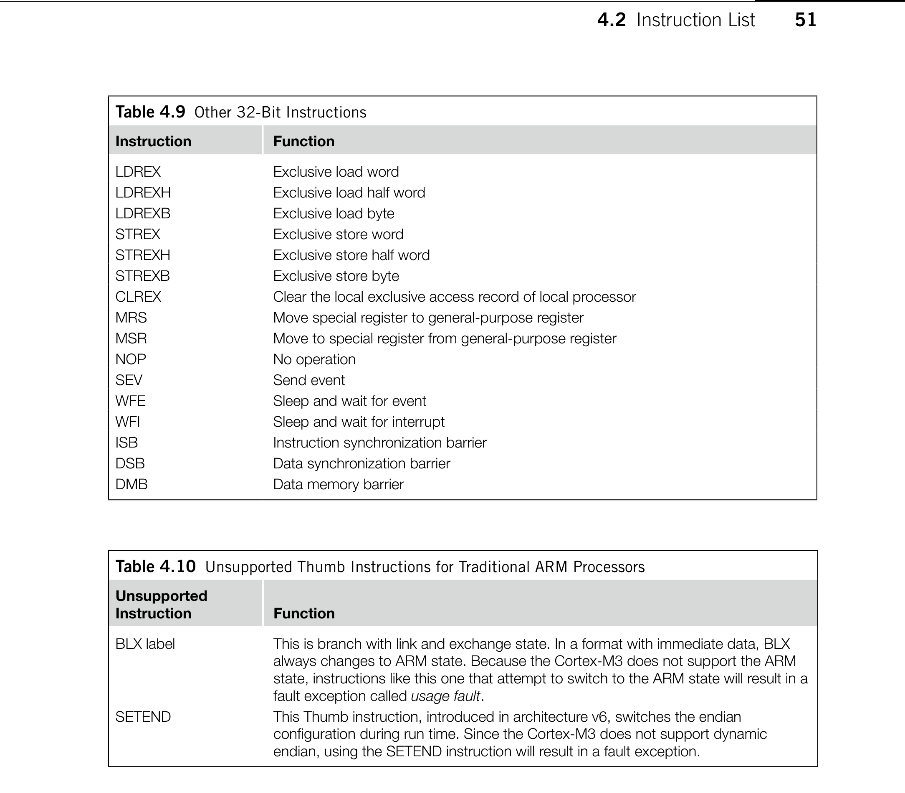
*Description*: Hardware reference table detailing register bit field settings, electrical operating limits, or memory configurations for Table 4.9.

> **Table 4.9**

51

## 4.2  Instruction List

4.2.1  Unsupported Instructions
A number of Thumb instructions are not supported in the Cortex-M3; they are presented in Table 4.10.
A number of instructions listed in the ARM v7-M Architecture Application Level Reference Manual
are not supported in the Cortex-M3. ARM v7-M architecture allows Thumb-2 coprocessor instruc-
tions, but the Cortex-M3 processor does not have any coprocessor support. Therefore, executing
the coprocessor instructions shown in Table 4.11 will result in a fault exception (Usage Fault with
No-Coprocessor “NOCP” bit in Usage Fault Status Register in NVIC set to 1).
Some of the change process state (CPS) instructions are also not supported in the Cortex-M3 (see
Table 4.12). This is because the Program Status register (PSR) definition has changed, so some bits
defined in the ARM architecture v6 are not available in the Cortex-M3.
Table 4.9  Other 32-Bit Instructions
Instruction
Function
LDREX
Exclusive load word
LDREXH
Exclusive load half word
LDREXB
Exclusive load byte
STREX
Exclusive store word
STREXH
Exclusive store half word
STREXB
Exclusive store byte
CLREX
Clear the local exclusive access record of local processor
MRS
Move special register to general-purpose register
MSR
Move to special register from general-purpose register
NOP
No operation
SEV
Send event
WFE
Sleep and wait for event
WFI
Sleep and wait for interrupt
ISB
Instruction synchronization barrier
DSB
Data synchronization barrier
DMB
Data memory barrier
Table 4.10  Unsupported Thumb Instructions for Traditional ARM Processors
Unsupported
Instruction
Function
BLX label
This is branch with link and exchange state. In a format with immediate data, BLX
always changes to ARM state. Because the Cortex-M3 does not support the ARM
state, instructions like this one that attempt to switch to the ARM state will result in a
fault exception called usage fault.
SETEND
This Thumb instruction, introduced in architecture v6, switches the endian
configuration during run time. Since the Cortex-M3 does not support dynamic
endian, using the SETEND instruction will result in a fault exception.


<!-- Page 79 -->
### [PDF Page 79]


*Description*: Hardware reference table detailing register bit field settings, electrical operating limits, or memory configurations for Table 4.13.

> **Table 4.13**


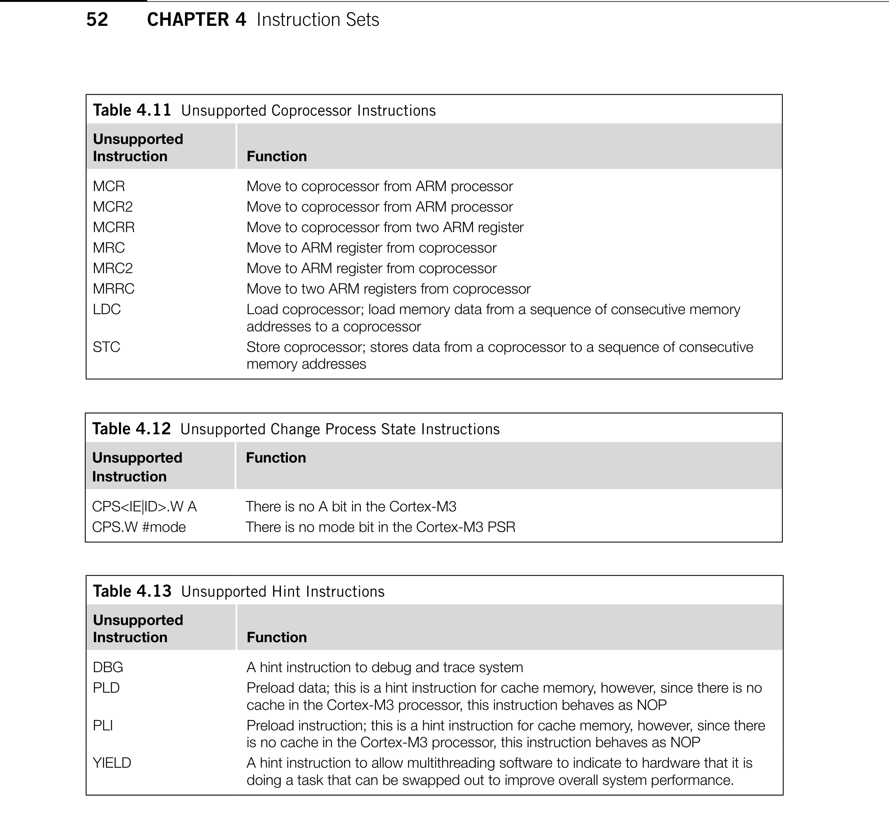
*Description*: Hardware reference table detailing register bit field settings, electrical operating limits, or memory configurations for Table 4.11.

> **Table 4.11**


*Description*: Hardware reference table detailing register bit field settings, electrical operating limits, or memory configurations for Table 4.12.

> **Table 4.12**

52
CHAPTER 4  Instruction Sets
In addition, the hint instructions shown in Table 4.13 will behave as NOP in the Cortex-M3.
All other undefined instructions, when executed, will cause the usage fault exception to take place.

## 4.3  Instruction Descriptions

Here, we introduce some of the commonly used syntax for ARM assembly code. Some of the instruc-
tions have various options such as barrel shifter; these will not be fully covered in this chapter.
Table 4.11  Unsupported Coprocessor Instructions
Unsupported
Instruction
Function
MCR
Move to coprocessor from ARM processor
MCR2
Move to coprocessor from ARM processor
MCRR
Move to coprocessor from two ARM register
MRC
Move to ARM register from coprocessor
MRC2
Move to ARM register from coprocessor
MRRC
Move to two ARM registers from coprocessor
LDC
Load coprocessor; load memory data from a sequence of consecutive memory
addresses to a coprocessor
STC
Store coprocessor; stores data from a coprocessor to a sequence of consecutive
memory addresses
Table 4.12  Unsupported Change Process State Instructions
Unsupported
Instruction
Function
CPS<IE|ID>.W A
There is no A bit in the Cortex-M3
CPS.W #mode
There is no mode bit in the Cortex-M3 PSR
Table 4.13  Unsupported Hint Instructions
Unsupported
Instruction
Function
DBG
A hint instruction to debug and trace system
PLD
Preload data; this is a hint instruction for cache memory, however, since there is no
cache in the Cortex-M3 processor, this instruction behaves as NOP
PLI
Preload instruction; this is a hint instruction for cache memory, however, since there
is no cache in the Cortex-M3 processor, this instruction behaves as NOP
YIELD
A hint instruction to allow multithreading software to indicate to hardware that it is
doing a task that can be swapped out to improve overall system performance.


<!-- Page 80 -->
### [PDF Page 80]


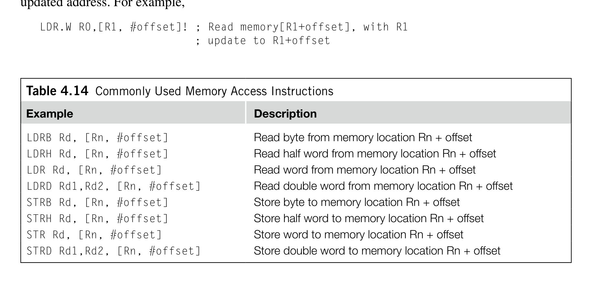
*Description*: Hardware reference table detailing register bit field settings, electrical operating limits, or memory configurations for Table 4.14.

> **Table 4.14**

53

## 4.3  Instruction Descriptions

4.3.1  Assembler Language: Moving Data
One of the most basic functions in a processor is transfer of data. In the Cortex-M3, data transfers can
be of one of the following types:
Moving data between register and register
•
Moving data between memory and register
•
Moving data between special register and register
•
Moving an immediate data value into a register
•
The command to move data between registers is MOV (move). For example, moving data from register
R3 to register R8 looks like this:
MOV R8, R3
Another instruction can generate the negative value of the original data; it is called MVN (move
­negative).
The basic instructions for accessing memory are Load and Store. Load (LDR) transfers data from
memory to registers, and Store transfers data from registers to memory. The transfers can be in different
data sizes (byte, half word, word, and double word), as outlined in Table 4.14.
Multiple Load and Store operations can be combined into single instructions called LDM (Load
Multiple) and STM (Store Multiple), as outlined in Table 4.15.
The exclamation mark (!) in the instruction specifies whether the register Rd should be updated after
the instruction is completed. For example, if R8 equals 0x8000:
STMIA.W R8!, {R0-R3} ; R8 changed to 0x8010 after store
; (increment by 4 words)
STMIA.W R8 , {R0-R3} ; R8 unchanged after store
ARM processors also support memory accesses with preindexing and postindexing. For preindex-
ing, the register holding the memory address is adjusted. The memory transfer then takes place with the
updated address. For example,
LDR.W R0,[R1, #offset]! ; Read memory[R1+offset], with R1
; update to R1+offset
Table 4.14  Commonly Used Memory Access Instructions
Example
Description
LDRB Rd, [Rn, #offset]
Read byte from memory location Rn + offset
LDRH Rd, [Rn, #offset]
Read half word from memory location Rn + offset
LDR Rd, [Rn, #offset]
Read word from memory location Rn + offset
LDRD Rd1,Rd2, [Rn, #offset]
Read double word from memory location Rn + offset
STRB Rd, [Rn, #offset]
Store byte to memory location Rn + offset
STRH Rd, [Rn, #offset]
Store half word to memory location Rn + offset
STR Rd, [Rn, #offset]
Store word to memory location Rn + offset
STRD Rd1,Rd2, [Rn, #offset]
Store double word to memory location Rn + offset


<!-- Page 81 -->
### [PDF Page 81]


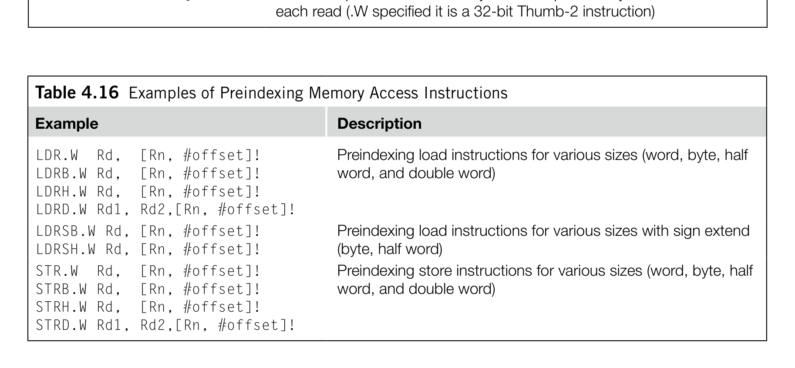
*Description*: Hardware reference table detailing register bit field settings, electrical operating limits, or memory configurations for Table 4.16.

> **Table 4.16**


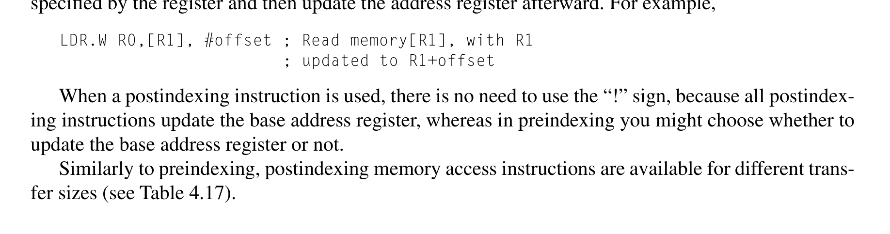
*Description*: Hardware reference table detailing register bit field settings, electrical operating limits, or memory configurations for Table 4.17.

> **Table 4.17**


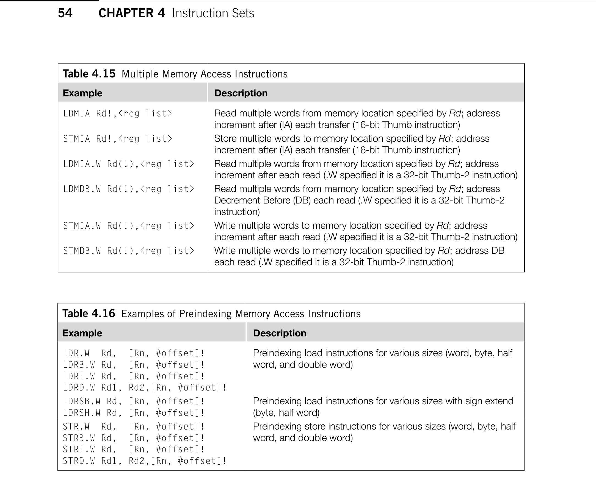
*Description*: Hardware reference table detailing register bit field settings, electrical operating limits, or memory configurations for Table 4.15.

> **Table 4.15**

54
CHAPTER 4  Instruction Sets
The use of the “!” indicates the update of base register R1. The “!” is optional; without it, the instruc-
tion would be just a normal memory transfer with offset from a base address. The preindexing memory
access instructions include load and store instructions of various transfer sizes (see Table 4.16).
Postindexing memory access instructions carry out the memory transfer using the base address
specified by the register and then update the address register afterward. For example,
LDR.W R0,[R1], #offset ; Read memory[R1], with R1
; updated to R1+offset
When a postindexing instruction is used, there is no need to use the “!” sign, because all postindex-
ing instructions update the base address register, whereas in preindexing you might choose whether to
update the base address register or not.
Similarly to preindexing, postindexing memory access instructions are available for different trans-
fer sizes (see Table 4.17).
Table 4.15  Multiple Memory Access Instructions
Example
Description
LDMIA Rd!,<reg list>
Read multiple words from memory location specified by Rd; address
increment after (IA) each transfer (16-bit Thumb instruction)
STMIA Rd!,<reg list>
Store multiple words to memory location specified by Rd; address
increment after (IA) each transfer (16-bit Thumb instruction)
LDMIA.W Rd(!),<reg list>
Read multiple words from memory location specified by Rd; address
increment after each read (.W specified it is a 32-bit Thumb-2 instruction)
LDMDB.W Rd(!),<reg list>
Read multiple words from memory location specified by Rd; address
Decrement Before (DB) each read (.W specified it is a 32-bit Thumb-2
instruction)
STMIA.W Rd(!),<reg list>
Write multiple words to memory location specified by Rd; address
increment after each read (.W specified it is a 32-bit Thumb-2 instruction)
STMDB.W Rd(!),<reg list>
Write multiple words to memory location specified by Rd; address DB
each read (.W specified it is a 32-bit Thumb-2 instruction)
Table 4.16  Examples of Preindexing Memory Access Instructions
Example
Description
LDR.W  Rd,  [Rn, #offset]!
LDRB.W Rd,  [Rn, #offset]!
LDRH.W Rd,  [Rn, #offset]!
LDRD.W Rd1, Rd2,[Rn, #offset]!
Preindexing load instructions for various sizes (word, byte, half
word, and double word)
LDRSB.W Rd, [Rn, #offset]!
LDRSH.W Rd, [Rn, #offset]!
Preindexing load instructions for various sizes with sign extend
(byte, half word)
STR.W  Rd,  [Rn, #offset]!
STRB.W Rd,  [Rn, #offset]!
STRH.W Rd,  [Rn, #offset]!
STRD.W Rd1, Rd2,[Rn, #offset]!
Preindexing store instructions for various sizes (word, byte, half
word, and double word)


<!-- Page 82 -->
### [PDF Page 82]


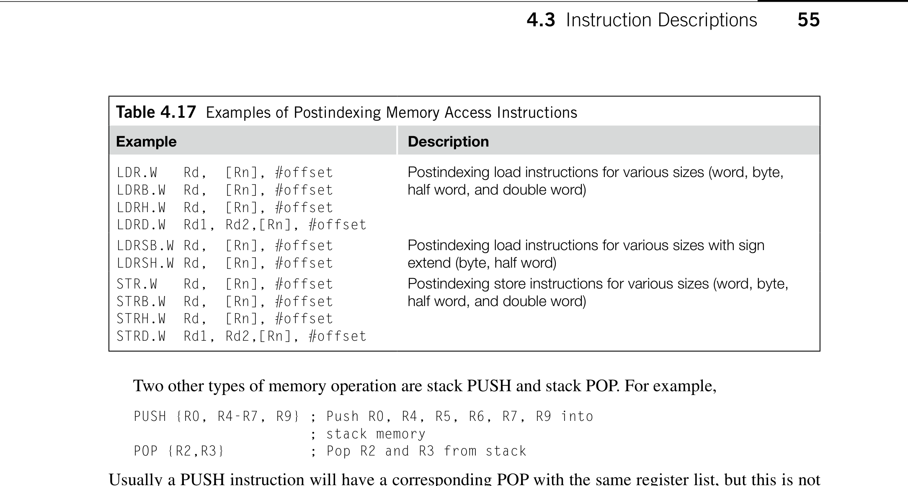
*Description*: Hardware reference table detailing register bit field settings, electrical operating limits, or memory configurations for Table 4.17.

> **Table 4.17**

55

## 4.3  Instruction Descriptions

Two other types of memory operation are stack PUSH and stack POP. For example,
PUSH {R0, R4-R7, R9} ; Push R0, R4, R5, R6, R7, R9 into
; stack memory
POP {R2,R3}
; Pop R2 and R3 from stack
Usually a PUSH instruction will have a corresponding POP with the same register list, but this is not
always necessary. For example, a common exception is when POP is used as a function return:
PUSH {R0-R3, LR} ; Save register contents at beginning of
; subroutine
....
; Processing
POP {R0-R3, PC}	 ; restore registers and return
In this case, instead of popping the LR register back and then branching to the address in LR, we
POP the address value directly in the program counter.
As mentioned in Chapter 3, the Cortex-M3 has a number of special registers. To access these regis-
ters, we use the instructions MRS and MSR. For example,
MRS R0, PSR     ; Read Processor status word into R0
MSR CONTROL, R1 ; Write value of R1 into control register
Unless you’re accessing the APSR, you can use MSR or MRS to access other special registers only in
privileged mode.
Moving immediate data into a register is a common thing to do. For example, you might want to
access a peripheral register, so you need to put the address value into a register beforehand. For small
values (8 bits or less), you can use MOVS (move). For example,
MOVS R0, #0x12 ; Set R0 to 0x12
For a larger value (over 8 bits), you might need to use a Thumb-2 move instruction. For example,
MOVW.W R0, #0x789A ; Set R0 to 0x789A
Or if the value is 32-bit, you can use two instructions to set the upper and lower halves:
MOVW.W R0,#0x789A ; Set R0 lower half to 0x789A
MOVT.W R0,#0x3456 ; Set R0 upper half to 0x3456. Now
; R0=0x3456789A
Table 4.17  Examples of Postindexing Memory Access Instructions
Example
Description
LDR.W   Rd,  [Rn], #offset
LDRB.W  Rd,  [Rn], #offset
LDRH.W  Rd,  [Rn], #offset
LDRD.W  Rd1, Rd2,[Rn], #offset
Postindexing load instructions for various sizes (word, byte,
half word, and double word)
LDRSB.W Rd,  [Rn], #offset
LDRSH.W Rd,  [Rn], #offset
Postindexing load instructions for various sizes with sign
extend (byte, half word)
STR.W   Rd,  [Rn], #offset
STRB.W  Rd,  [Rn], #offset
STRH.W  Rd,  [Rn], #offset
STRD.W  Rd1, Rd2,[Rn], #offset
Postindexing store instructions for various sizes (word, byte,
half word, and double word)


<!-- Page 83 -->
### [PDF Page 83]

56
CHAPTER 4  Instruction Sets
Alternatively, you can also use LDR (a pseudo-instruction provided in ARM assembler). For
­example,
LDR R0, =0x3456789A
This is not a real assembler command, but the ARM assembler will convert it into a PC relative
load instruction to produce the required data. To generate 32-bit immediate data, using LDR is recom-
mended rather than the MOVW.W and MOVT.W combination because it gives better readability and
the assembler might be able to reduce the memory being used if the same immediate data are reused in
several places of the same program.
4.3.2  LDR and ADR Pseudo-Instructions
Both LDR and ADR pseudo-instructions can be used to set registers to a program address value. They
have different syntaxes and behaviors. For LDR, if the address is a program address value, the assem-
bler will automatically set the LSB to 1. For example,
LDR R0, =address1 ; R0 set to 0x4001
...
address1        ; address here is 0x4000
MOV R0, R1 ; address1 contains program code
...
You will find that the LDR instruction will put 0x4001 into R1; the LSB is set to 1 to indicate that
it is Thumb code. If address1 is a data address, LSB will not be changed. For example,
LDR R0, =address1 ; R0 set to 0x4000
...
address1     ; address here is 0x4000
DCD 0x0 ; address1 contains data
...
For ADR, you can load the address value of a program code into a register without setting the LSB
automatically. For example,
ADR R0, address1
...
address1        ; (address here is 0x4000)
MOV R0, R1 ; address1 contains program code
...
You will get 0x4000 in the ADR instruction. Note that there is no equal sign (=) in the ADR statement.
LDR obtains the immediate data by putting the data in the program code and uses a PC relative
load to get the data into the register. ADR tries to generate the immediate value by adding or subtract-
ing instructions (for example, based on the current PC value). As a result, it is not possible to create
all immediate values using ADR, and the target address label must be in a close range. However, using
ADR can generate smaller code sizes compared with LDR.
The 16-bit version of ADR requires that the target address must be word aligned (address value is a
multiple of 4). If the target address is not word aligned, you can use the 32-bit version of ADR instruc-
tion “ADR.W.” If the target address is more than ± 4095 bytes of current PC, you can use “ADRL”
pseudo-instruction, which gives ±1 MB range.


<!-- Page 84 -->
### [PDF Page 84]


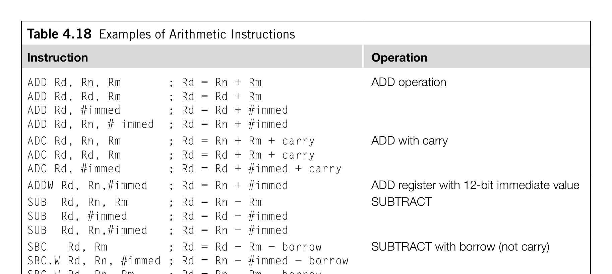
*Description*: Hardware reference table detailing register bit field settings, electrical operating limits, or memory configurations for Table 4.18.

> **Table 4.18**

57

## 4.3  Instruction Descriptions

4.3.3  Assembler Language: Processing Data
The Cortex-M3 provides many different instructions for data processing. A few basic ones are
­introduced here. Many data operation instructions can have multiple instruction formats. For example,
an ADD instruction can operate between two registers or between one register and an immediate data
value:

```assembly
ADD   R0, R0, R1    ; R0 = R0 + R1
ADDS  R0, R0, #0x12 ; R0 = R0 + 0x12
ADD.W R0, R1, R2    ; R0 = R1 + R2
```

These are all ADD instructions, but they have different syntaxes and binary coding.
With the traditional Thumb instruction syntax, when 16-bit Thumb code is used, an ADD instruc-
tion can change the flags in the PSR. However, 32-bit Thumb-2 code can either change a flag or keep
it unchanged. To separate the two different operations, the S suffix should be used if the following
operation depends on the flags:
ADD.W  R0, R1, R2 ; Flag unchanged
ADDS.W R0, R1, R2 ; Flag change
Aside from ADD instructions, the arithmetic functions that the Cortex-M3 supports include subtract
(SUB), multiply (MUL), and unsigned and signed divide (UDIV/SDIV). Table 4.18 shows some of the
most commonly used arithmetic instructions.
Table 4.18  Examples of Arithmetic Instructions
Instruction
Operation

```assembly
ADD Rd, Rn, Rm       ; Rd = Rn + Rm
ADD Rd, Rd, Rm       ; Rd = Rd + Rm
ADD Rd, #immed       ; Rd = Rd + #immed
ADD Rd, Rn, # immed  ; Rd = Rn + #immed
ADD operation
ADC Rd, Rn, Rm       ; Rd = Rn + Rm + carry
ADC Rd, Rd, Rm       ; Rd = Rd + Rm + carry
ADC Rd, #immed       ; Rd = Rd + #immed + carry
ADD with carry
ADDW Rd, Rn,#immed   ; Rd = Rn + #immed
ADD register with 12-bit immediate value
SUB  Rd, Rn, Rm      ; Rd = Rn − Rm
SUB  Rd, #immed      ; Rd = Rd − #immed
SUB  Rd, Rn,#immed   ; Rd = Rn − #immed
```

SUBTRACT
SBC   Rd, Rm         ; Rd = Rd − Rm − borrow
SBC.W Rd, Rn, #immed ; Rd = Rn − #immed − borrow
SBC.W Rd, Rn, Rm     ; Rd = Rn − Rm − borrow
SUBTRACT with borrow (not carry)
RSB.W Rd, Rn, #immed ; Rd = #immed –Rn
RSB.W Rd, Rn, Rm     ; Rd = Rm − Rn
Reverse subtract
MUL   Rd, Rm         ; Rd = Rd * Rm
MUL.W Rd, Rn, Rm     ; Rd = Rn * Rm
Multiply
UDIV Rd, Rn, Rm      ; Rd = Rn/Rm
SDIV Rd, Rn, Rm      ; Rd = Rn/Rm
Unsigned and signed divide


<!-- Page 85 -->
### [PDF Page 85]


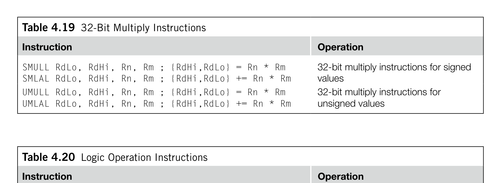
*Description*: Hardware reference table detailing register bit field settings, electrical operating limits, or memory configurations for Table 4.19.

> **Table 4.19**


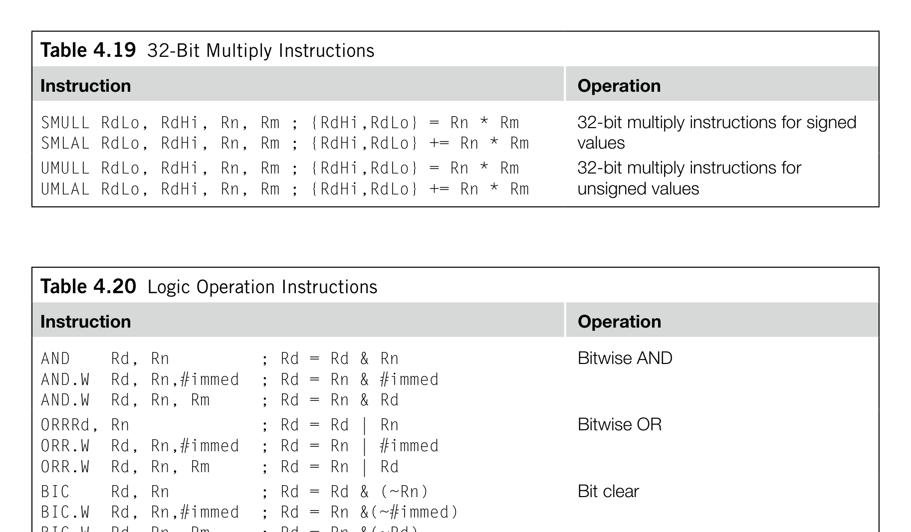
*Description*: Hardware reference table detailing register bit field settings, electrical operating limits, or memory configurations for Table 4.20.

> **Table 4.20**

58
CHAPTER 4  Instruction Sets
These instructions can be used with or without the “S” suffix to determine if the APSR should be
updated. In most cases, if UAL syntax is selected and if “S” suffix is not used, the 32-bit version of the
instructions would be selected as most of the 16-bit Thumb instructions update APSR.
The Cortex-M3 also supports 32-bit multiply instructions and multiply accumulate instructions that
give 64-bit results. These instructions support signed or unsigned values (see Table 4.19).
Another group of data processing instructions are the logical operations instructions and logical
operations such as AND, ORR (or), and shift and rotate functions. Table 4.20 shows some of the most
commonly used logical instructions. These instructions can be used with or without the “S” suffix to
determine if the APSR should be updated. If UAL syntax is used and if “S” suffix is not used, the
32-bit version of the instructions would be selected as all of the 16-bit logic operation instructions
update APSR.
The Cortex-M3 provides rotate and shift instructions. In some cases, the rotate operation can be
combined with other operations (for example, in memory address offset calculation for load/store
instructions). For standalone rotate/shift operations, the instructions shown in Table 4.21 are pro-
vided. Again, a 32-bit version of the instruction is used if “S” suffix is not used and if UAL syntax
is used.
Table 4.19  32-Bit Multiply Instructions
Instruction
Operation
SMULL RdLo, RdHi, Rn, Rm ; {RdHi,RdLo} = Rn * Rm
SMLAL RdLo, RdHi, Rn, Rm ; {RdHi,RdLo} += Rn * Rm
32-bit multiply instructions for signed
values
UMULL RdLo, RdHi, Rn, Rm ; {RdHi,RdLo} = Rn * Rm
UMLAL RdLo, RdHi, Rn, Rm ; {RdHi,RdLo} += Rn * Rm
32-bit multiply instructions for
unsigned values
Table 4.20  Logic Operation Instructions
Instruction
Operation
AND    Rd, Rn         ; Rd = Rd & Rn
AND.W  Rd, Rn,#immed  ; Rd = Rn & #immed
AND.W  Rd, Rn, Rm     ; Rd = Rn & Rd
Bitwise AND
ORRRd, Rn             ; Rd = Rd | Rn
ORR.W  Rd, Rn,#immed  ; Rd = Rn | #immed
ORR.W  Rd, Rn, Rm     ; Rd = Rn | Rd
Bitwise OR
BIC    Rd, Rn         ; Rd = Rd & (~Rn)
BIC.W  Rd, Rn,#immed  ; Rd = Rn &(~#immed)
BIC.W  Rd, Rn, Rm     ; Rd = Rn &(~Rd)
Bit clear
ORN.W  Rd, Rn,#immed  ; Rd = Rn | (~#immed)
ORN.W  Rd, Rn, Rm     ; Rd = Rn | (~Rd)
Bitwise OR NOT
EOR    Rd, Rn         ; Rd = Rd ^ Rn
EOR.W  Rd, Rn,#immed  ; Rd = Rn | #immed
EOR.W  Rd, Rn, Rm     ; Rd = Rn | Rd
Bitwise Exclusive OR


<!-- Page 86 -->
### [PDF Page 86]


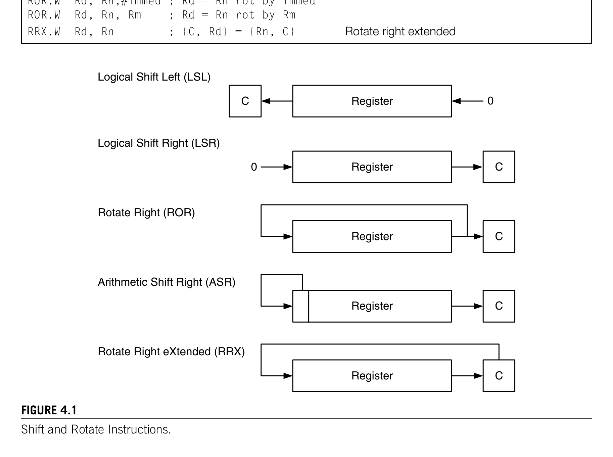
*Description*: Technical diagram and schematic illustration detailing hardware circuit topology, signal routing, and logic operations for Figure 4.1.

> **Figure 4.1**


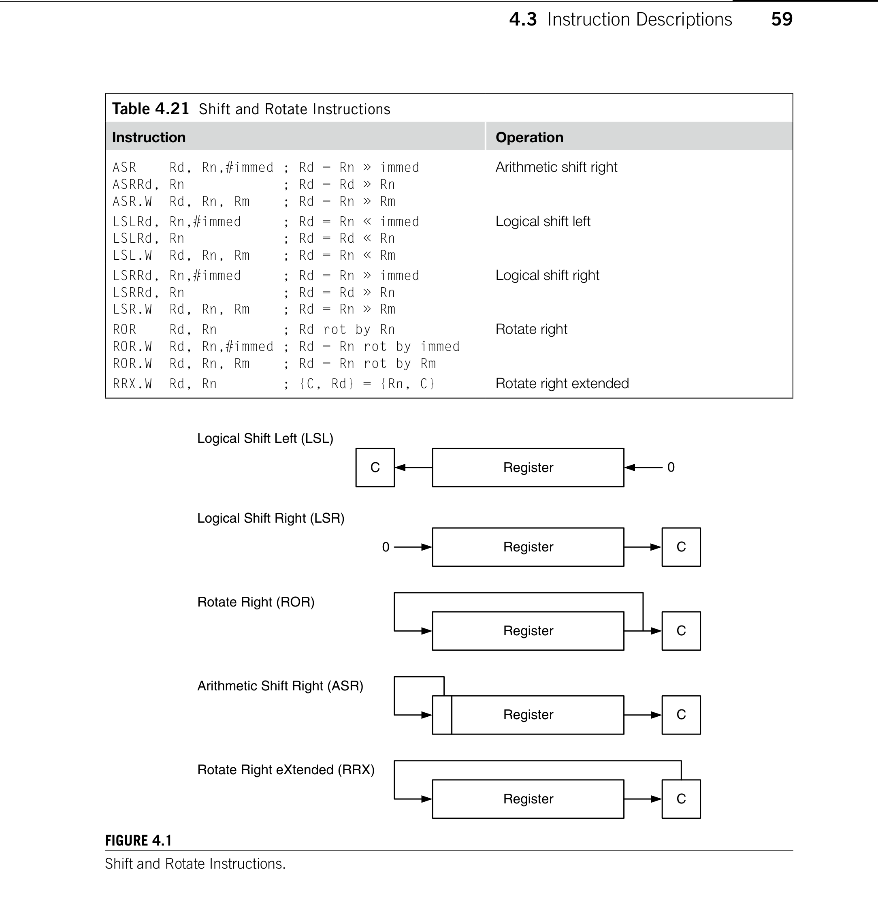
*Description*: Hardware reference table detailing register bit field settings, electrical operating limits, or memory configurations for Table 4.21.

> **Table 4.21**

59

## 4.3  Instruction Descriptions

In UAL syntax, the rotate and shift operations can also update the carry flag if the S suffix is used
(and always update the carry flag if the 16-bit Thumb code is used). See Figure 4.1.
If the shift or rotate operation shifts the register position by multiple bits, the value of the carry flag
C will be the last bit that shifts out of the register.
Table 4.21  Shift and Rotate Instructions
Instruction
Operation
ASR    Rd, Rn,#immed ; Rd = Rn » immed
ASRRd, Rn            ; Rd = Rd » Rn
ASR.W  Rd, Rn, Rm    ; Rd = Rn » Rm
Arithmetic shift right
LSLRd, Rn,#immed     ; Rd = Rn « immed
LSLRd, Rn            ; Rd = Rd « Rn
LSL.W  Rd, Rn, Rm    ; Rd = Rn « Rm
Logical shift left
LSRRd, Rn,#immed     ; Rd = Rn » immed
LSRRd, Rn            ; Rd = Rd » Rn
LSR.W  Rd, Rn, Rm    ; Rd = Rn » Rm
Logical shift right
ROR    Rd, Rn        ; Rd rot by Rn
ROR.W  Rd, Rn,#immed ; Rd = Rn rot by immed
ROR.W  Rd, Rn, Rm    ; Rd = Rn rot by Rm
Rotate right
RRX.W  Rd, Rn        ; {C, Rd} = {Rn, C}
Rotate right extended
Figure 4.1
Shift and Rotate Instructions.
Logical Shift Left (LSL)
Logical Shift Right (LSR)
Rotate Right (ROR)
Arithmetic Shift Right (ASR)
Rotate Right eXtended (RRX)
C
Register
0
C
Register
0
C
Register
C
Register
C
Register


<!-- Page 87 -->
### [PDF Page 87]


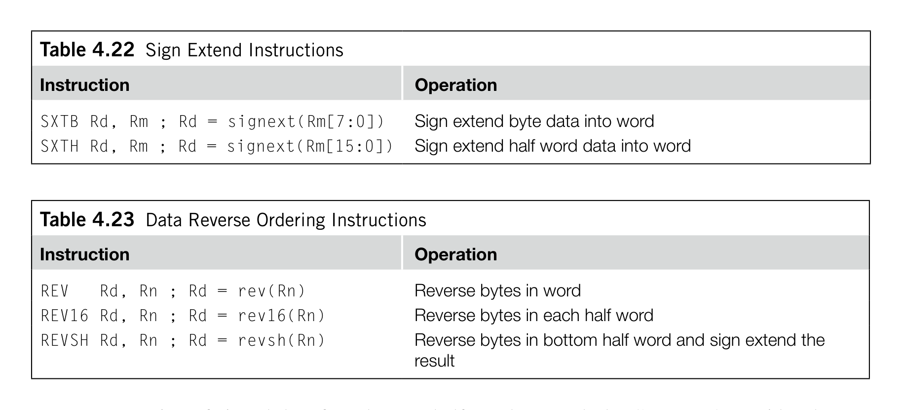
*Description*: Hardware reference table detailing register bit field settings, electrical operating limits, or memory configurations for Table 4.22.

> **Table 4.22**


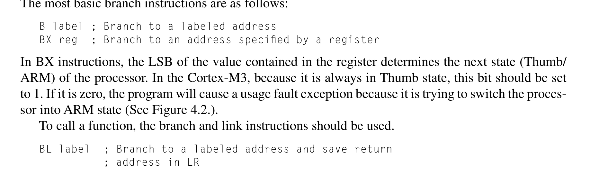
*Description*: Technical diagram and schematic illustration detailing hardware circuit topology, signal routing, and logic operations for Figure 4.2.

> **Figure 4.2**


*Description*: Hardware reference table detailing register bit field settings, electrical operating limits, or memory configurations for Table 4.23.

> **Table 4.23**

60
CHAPTER 4  Instruction Sets
For conversion of signed data from byte or half word to word, the Cortex-M3 provides the two
instructions shown in Table 4.22. Both 16-bit and 32-bit versions are available. The 16-bit version can
only access low registers.
Another group of data processing instructions is used for reversing data bytes in a register (see
Table 4.23). These instructions are usually used for conversion between little endian and big endian
data. See Figure 4.2. Both 16-bit and 32-bit versions are available. The 16-bit version can only access
low ­registers.
The last group of data processing instructions is for bit field processing. They include the instruc-
tions shown in Table 4.24. Examples of these instructions are provided in a later part of this chapter.
4.3.4  Assembler Language: Call and Unconditional Branch
The most basic branch instructions are as follows:
B label ; Branch to a labeled address
BX reg  ; Branch to an address specified by a register
In BX instructions, the LSB of the value contained in the register determines the next state (Thumb/
ARM) of the processor. In the Cortex-M3, because it is always in Thumb state, this bit should be set
to 1. If it is zero, the program will cause a usage fault exception because it is trying to switch the proces-
sor into ARM state (See Figure 4.2.).
To call a function, the branch and link instructions should be used.
BL label  ; Branch to a labeled address and save return
; address in LR
Why Is There Rotate Right But No Rotate Left?
The rotate left operation can be replaced by a rotate right operation with a different rotate offset. For example,
a rotate left by 4-bit operation can be written as a rotate right by 28-bit instruction, which gives the same
result and takes the same amount of time to execute.
Table 4.22  Sign Extend Instructions
Instruction
Operation
SXTB Rd, Rm ; Rd = signext(Rm[7:0])
Sign extend byte data into word
SXTH Rd, Rm ; Rd = signext(Rm[15:0])
Sign extend half word data into word
Table 4.23  Data Reverse Ordering Instructions
Instruction
Operation
REV   Rd, Rn ; Rd = rev(Rn)
Reverse bytes in word
REV16 Rd, Rn ; Rd = rev16(Rn)
Reverse bytes in each half word
REVSH Rd, Rn ; Rd = revsh(Rn)
Reverse bytes in bottom half word and sign extend the
result


<!-- Page 88 -->
### [PDF Page 88]


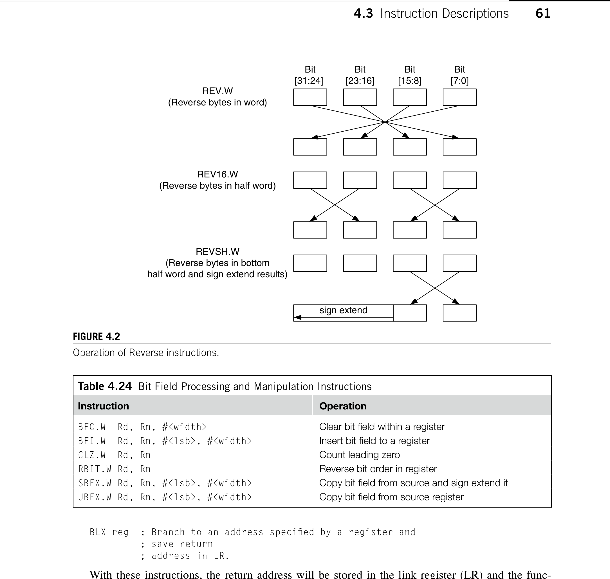
*Description*: Technical diagram and schematic illustration detailing hardware circuit topology, signal routing, and logic operations for Figure 4.2.

> **Figure 4.2**


*Description*: Hardware reference table detailing register bit field settings, electrical operating limits, or memory configurations for Table 4.24.

> **Table 4.24**

61

## 4.3  Instruction Descriptions

BLX reg  ; Branch to an address specified by a register and
; save return
; address in LR.
With these instructions, the return address will be stored in the link register (LR) and the func-
tion can be terminated using BX LR, which causes program control to return to the calling process.
However, when using BLX, make sure that the LSB of the register is 1. Otherwise the processor will
produce a fault exception because it is an attempt to switch to the ARM state.
You can also carry out a branch operation using MOV instructions and LDR instructions. For example,
MOV R15, R0   ; Branch to an address inside R0
LDR R15, [R0] ; Branch to an address in memory location
; specified by R0
Figure 4.2
Operation of Reverse instructions.
REV.W
(Reverse bytes in word)
Bit
[7:0]
Bit
[15:8]
Bit
[23:16]
Bit
[31:24]
REV16.W
(Reverse bytes in half word)
REVSH.W
(Reverse bytes in bottom
half word and sign extend results)
sign extend
Table 4.24  Bit Field Processing and Manipulation Instructions
Instruction
Operation
BFC.W  Rd, Rn, #<width>
Clear bit field within a register
BFI.W  Rd, Rn, #<lsb>, #<width>
Insert bit field to a register
CLZ.W  Rd, Rn
Count leading zero
RBIT.W Rd, Rn
Reverse bit order in register
SBFX.W Rd, Rn, #<lsb>, #<width>
Copy bit field from source and sign extend it
UBFX.W Rd, Rn, #<lsb>, #<width>
Copy bit field from source register


<!-- Page 89 -->
### [PDF Page 89]


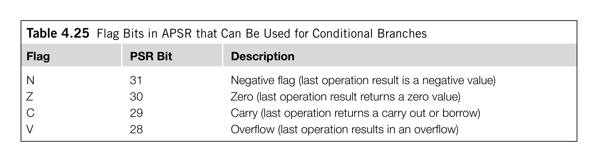
*Description*: Hardware reference table detailing register bit field settings, electrical operating limits, or memory configurations for Table 4.25.

> **Table 4.25**

62
CHAPTER 4  Instruction Sets
POP {R15}
; Do a stack pop operation, and change the
; program counter value
; to the result value.
When using these methods to carry out branches, you also need to make sure that the LSB of the
new program counter value is 0x1. Otherwise, a usage fault exception will be generated because it will
try to switch the processor to ARM mode, which is not allowed in the Cortex-M3 redundancy.
4.3.5  Assembler Language: Decisions and Conditional Branches
Most conditional branches in ARM processors use flags in the APSR to determine whether a branch
should be carried out. In the APSR, there are five flag bits; four of them are used for branch decisions
(see Table 4.25).
There is another flag bit at bit[27], called the Q flag. It is for saturation math operations and is not
used for conditional branches.
Save the LR if You Need to Call a Subroutine
The BL instruction will destroy the current content of your LR. So, if your program code needs the LR later, you
should save your LR before you use BL. The common method is to push the LR to stack in the beginning of
your subroutine. For example,
main
...
BL functionA
...
functionA
PUSH {LR} ; Save LR content to stack
...
BL functionB
...
POP {PC} ; Use stacked LR content to return to main
functionB
PUSH {LR}
...
POP {PC} ; Use stacked LR content to return to functionA
In addition, if the subroutine you call is a C function, you might also need to save the contents in R0–R3
and R12 if these values will be needed at a later stage. According to AAPCS [Ref. 5], the contents in these
registers could be changed by a C function.
Table 4.25  Flag Bits in APSR that Can Be Used for Conditional Branches
Flag
PSR Bit
Description
N
31
Negative flag (last operation result is a negative value)
Z
30
Zero (last operation result returns a zero value)
C
29
Carry (last operation returns a carry out or borrow)
V
28
Overflow (last operation results in an overflow)


<!-- Page 90 -->
### [PDF Page 90]


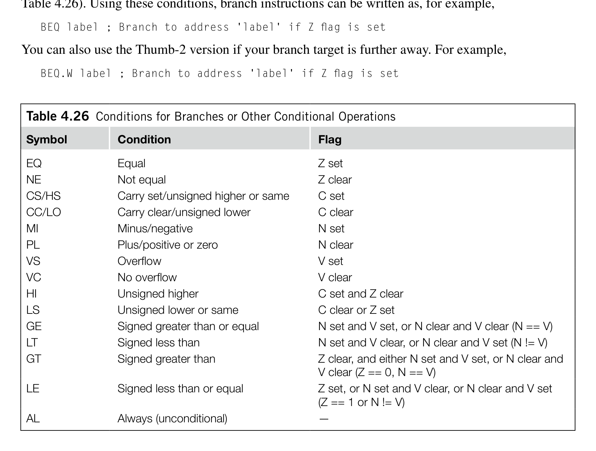
*Description*: Hardware reference table detailing register bit field settings, electrical operating limits, or memory configurations for Table 4.26.

> **Table 4.26**

63

## 4.3  Instruction Descriptions

With combinations of the four flags (N, Z, C, and V ), 15 branch conditions are defined (see
Table 4.26). Using these conditions, branch instructions can be written as, for example,
BEQ label ; Branch to address 'label' if Z flag is set
You can also use the Thumb-2 version if your branch target is further away. For example,
BEQ.W label ; Branch to address 'label' if Z flag is set
Flags in ARM Processors
Often, data processing instructions change the flags in the PSR. The flags might be used for branch decisions,
or they can be used as part of the input for the next instruction. The ARM processor normally contains at least
the Z, N, C, and V flags, which are updated by execution of data processing instructions.
Z (Zero) flag: This flag is set when the result of an instruction has a zero value or when a comparison of two
•
data returns an equal result.
N (Negative) flag: This flag is set when the result of an instruction has a negative value (bit 31 is 1).
•
C (Carry) flag: This flag is for unsigned data processing—for example, in add (ADD) it is set when an
•
overflow occurs; in subtract (SUB) it is set when a borrow did not occur (borrow is the invert of carry).
V (Overflow) flag: This flag is for signed data processing; for example, in an add (ADD), when two positive
•
values added together produce a negative value, or when two negative values added together produce a
positive value.
These flags can also have special results when used with shift and rotate instructions. Refer to the ARM v7-M
Architecture Application Level Reference Manual [Ref. 2] for details.
Table 4.26  Conditions for Branches or Other Conditional Operations
Symbol
Condition
Flag
EQ
Equal
Z set
NE
Not equal
Z clear
CS/HS
Carry set/unsigned higher or same
C set
CC/LO
Carry clear/unsigned lower
C clear
MI
Minus/negative
N set
PL
Plus/positive or zero
N clear
VS
Overflow
V set
VC
No overflow
V clear
HI
Unsigned higher
C set and Z clear
LS
Unsigned lower or same
C clear or Z set
GE
Signed greater than or equal
N set and V set, or N clear and V clear (N == V)
LT
Signed less than
N set and V clear, or N clear and V set (N != V)
GT
Signed greater than
Z clear, and either N set and V set, or N clear and
V clear (Z == 0, N == V)
LE
Signed less than or equal
Z set, or N set and V clear, or N clear and V set
(Z == 1 or N != V)
AL
Always (unconditional)
—


<!-- Page 91 -->
### [PDF Page 91]

64
CHAPTER 4  Instruction Sets
The defined branch conditions can also be used in IF-THEN-ELSE structures. For example,
CMP R0, R1   ; Compare R0 and R1
ITTEE GT     ; If R0 > R1 Then
; if true, first 2 statements execute,
; if false, other 2 statements execute
MOVGT R2, R0 ;      R2 = R0
MOVGT R3, R1 ;      R3 = R1
MOVLE R2, R0 ; Else R2 = R1
MOVLE R3, R1 ;      R3 = R0
APSR flags can be affected by the following:
Most of the 16-bit
•
ALU instructions
32-bit (Thumb-2) ALU instructions with the
•
S suffix; for example, ADDS.W
Compare (e.g., CMP) and Test (e.g., TST, TEQ)
•
Write to APSR/xPSR directly
•
Most of the 16-bit Thumb arithmetic instructions affect the N, Z, C, and V flags. With 32-bit Thumb-2
instructions, the ALU operation can either change flags or not change flags. For example,
ADDS.W R0, R1, R2 ; This 32-bit Thumb instruction updates flag
ADD.W  R0, R1, R2 ; This 32-bit Thumb instruction does not
; update flag
Be careful when reusing program code from old projects. If the old project is in tradition Thumb
syntax; for example, “CODE16” directive is used with ARM assembler, then

```assembly
ADD R0, R1   ; This 16-bit Thumb instruction updates flag
ADD R0, #0x1 ; This 16-bit Thumb instruction updates flag
However, if you used the same code in UAL syntax; that is “THUMB” directive is used with ARM
```

assembler, then

```assembly
ADD R0, R1   ; This 16-bit Thumb instruction does not
```

; update flag

```assembly
ADD R0, #0x1 ; This will become a 32-bit Thumb instruction
```

; that does not update flag
To make sure that the code works correctly with different tools, you should always use the S suffix
if the flags need to be updated for conditional operations such as conditional branches.
The compare (CMP) instruction subtracts two values and updates the flags (just like SUBS), but the
result is not stored in any registers. CMP can have the following formats:
CMP R0, R1    ; Calculate R0 – R1 and update flag
CMP R0, #0x12 ; Calculate R0 – 0x12 and update flag
A similar instruction is the CMN (compare negative). It compares one value to the negative (two’s
complement) of a second value; the flags are updated, but the result is not stored in any registers:
CMN R0, R1    ; Calculate R0 – (-R1) and update flag
CMN R0, #0x12 ; Calculate R0 – (-0x12) and update flag
The TST (test) instruction is more like the AND instruction. It ANDs two values and updates the
flags. However, the result is not stored in any register. Similarly to CMP, it has two input formats:


<!-- Page 92 -->
### [PDF Page 92]

65

## 4.3  Instruction Descriptions

TST R0, R1    ; Calculate R0 AND R1 and update flag
TST R0, #0x12 ; Calculate R0 AND 0x12 and update flag
4.3.6  Assembler Language: Combined Compare and Conditional Branch
With ARM architecture v7-M, two new instructions are provided on the Cortex-M3 to supply a simple
compare with zero and conditional branch operations. These are CBZ (compare and branch if zero) and
CBNZ (compare and branch if nonzero).
The compare and branch instructions only support forward branches. For example,
i = 5;
while (i != 0 ){
func1(); ; call a function
i−−;
}
This can be compiled into the following:
MOV R0, #5       ; Set loop counter
loop1 CBZ R0,loop1exit ; if loop counter = 0 then exit the loop
BL  func1        ; call a function

```assembly
SUB R0, #1       ; loop counter decrement
B   loop1        ; next loop
```

loop1exit
The usage of CBNZ is similar to CBZ, apart from the fact that the branch is taken if the Z flag is not
set (result is not zero). For example,
status = strchr(email_address, '@');
if (status == 0){//status is 0 if @ is not in email_address
show_error_message();
exit(1);
}
This can be compiled into the following:
...
BL   strchr
CBNZ R0, email_looks_okay ; Branch if result is not zero
BL   show_error_message
BL   exit
email_looks_okay
...
The APSR value is not affected by the CBZ and CBNZ instructions.
Assembler Language: Conditional Execution Using IT Instructions
The IT (IF-THEN) block is very useful for handling small conditional code. It avoids branch penalties
because there is no change to program flow. It can provide a maximum of four conditionally executed
instructions.
In IT instruction blocks, the first line must be the IT instruction, detailing the choice of
­execution, followed by the condition it checks. The first statement after the IT command must be


<!-- Page 93 -->
### [PDF Page 93]

66
CHAPTER 4  Instruction Sets
TRUE‑THEN‑­EXECUTE, which is always written as ITxyz, where T means THEN and E means
ELSE. The second through fourth statements can be either THEN (true) or ELSE (false):
IT<x><y><z> <cond>                  ; IT instruction (<x>, <y>,
; <z> can be T or E)
instr1<cond> <operands>             ; 1st instruction (<cond>
; must be same as IT)
instr2<cond or not cond> <operands> ; 2nd instruction (can be
; <cond> or <!cond>
instr3<cond or not cond> <operands> ; 3rd instruction (can be
; <cond> or <!cond>
instr4<cond or not cond> <operands> ; 4th instruction (can be
; <cond> or <!cond>
If a statement is to be executed when <cond> is false, the suffix for the instruction must be the
opposite of the condition. For example, the opposite of EQ is NE, the opposite of GT is LE, and so on.
The following code shows an example of a simple conditional execution:
if (R1<R2) then
R2=R2−R1
R2=R2/2
else
R1=R1−R2
R1=R1/2
In assembly,
CMP     R1, R2 ; If R1 < R2 (less then)
ITTEE   LT     ; then execute instruction 1 and 2
; (indicated by T)
; else execute instruction 3 and 4
; (indicated by E)
SUBLT.W R2,R1  ; 1st instruction
LSRLT.W R2,#1  ; 2nd instruction
SUBGE.W R1,R2  ; 3rd instruction (notice the GE is
; opposite of LT)
LSRGE.W R1,#1  ; 4th instruction
You can have fewer than four conditionally executed instructions. The minimum is 1. You need to
make sure the number of T and E occurrences in the IT instruction matches the number of conditionally
executed instructions after the IT.
If an exception occurs during the IT instruction block, the execution status of the block will be
stored in the stacked PSR (in the IT/Interrupt-Continuable Instruction [ICI] bit field). So, when the
exception handler completes and the IT block resumes, the rest of the instructions in the block can con-
tinue the execution correctly. In the case of using multicycle instructions (for example, multiple load
and store) inside an IT block, if an exception takes place during the execution, the whole instruction is
abandoned and restarted after the interrupt process is completed.


<!-- Page 94 -->
### [PDF Page 94]


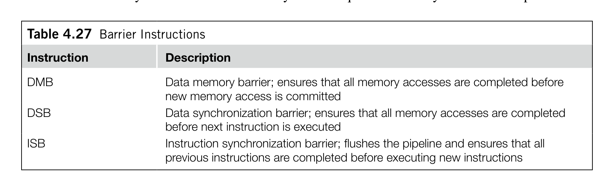
*Description*: Hardware reference table detailing register bit field settings, electrical operating limits, or memory configurations for Table 4.27.

> **Table 4.27**

67

## 4.3  Instruction Descriptions

4.3.7  Assembler Language: Instruction Barrier and Memory Barrier Instructions
The Cortex-M3 supports a number of barrier instructions. These instructions are needed as memory
systems get more and more complex. In some cases, if memory barrier instructions are not used, race
conditions could occur.
For example, if the memory map can be switched by a hardware register, after writing to the mem-
ory switching register you should use the DSB instruction. Otherwise, if the write to the memory
switching register is buffered and takes a few cycles to complete, and the next instruction accesses the
switched memory region immediately, the access could be using the old memory map. In some cases,
this might result in an invalid access if the memory switching and memory access happen at the same
time. Using DSB in this case will make sure that the write to the memory map switching register is
completed before a new instruction is executed.
The following are the three barrier instructions in the Cortex-M3:
DMB
•
DSB
•
ISB
•
These instructions are described in Table 4.27.
The memory barrier instructions can be accessed in C using Cortex Microcontroller Software Inter-
face Standard (CMSIS) compliant device driver library as follows:

```c
void __DMB(void); // Data Memory Barrier
void __DSB(void); // Data Synchronization Barrier
void __ISB(void); // Instruction Synchronization Barrier
```

The DSB and ISB instructions can be important for self-modifying code. For example, if a program
changes its own program code, the next executed instruction should be based on the updated program.
However, since the processor is pipelined, the modified instruction location might have already been
fetched. Using DSB and then ISB can ensure that the modified program code is fetched again.
Architecturally, the ISB instruction should be used after updating the value of the CONTROL regis-
ter. In the Cortex-M3 processor, this is not strictly required. But if you want to make sure your applica-
tion is portable, you should ensure an ISB instruction is used after updating to CONTROL register.
DMB is very useful for multi-processor systems. For example, tasks running on separate processors
might use shared memory to communicate with each other. In these environments, the order of memory
accesses to the shared memory can be very important. DMB instructions can be inserted between accesses
to the shared memory to ensure that the memory access sequence is exactly the same as expected.
Table 4.27  Barrier Instructions
Instruction
Description
DMB
Data memory barrier; ensures that all memory accesses are completed before
new memory access is committed
DSB
Data synchronization barrier; ensures that all memory accesses are completed
before next instruction is executed
ISB
Instruction synchronization barrier; flushes the pipeline and ensures that all
previous instructions are completed before executing new instructions


<!-- Page 95 -->
### [PDF Page 95]


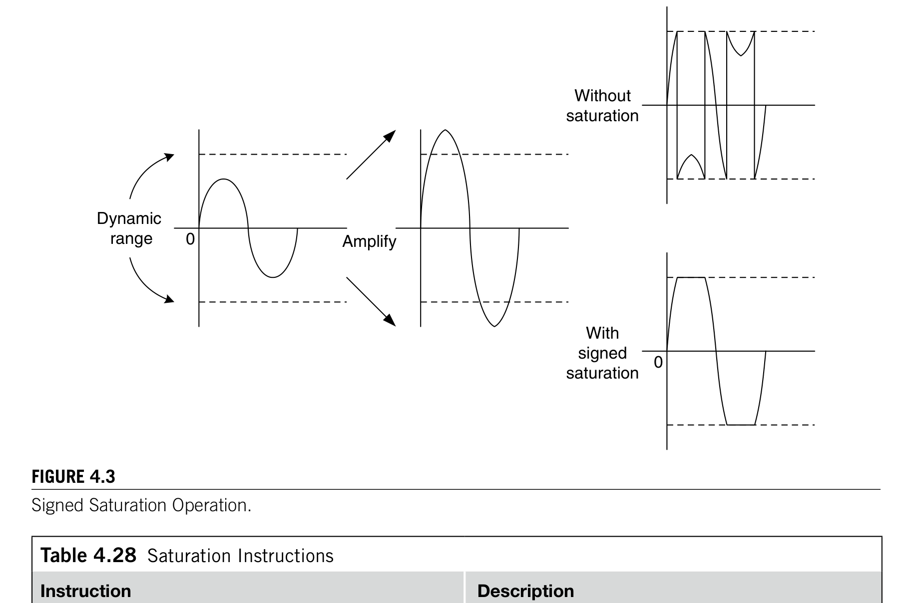
*Description*: Technical diagram and schematic illustration detailing hardware circuit topology, signal routing, and logic operations for Figure 4.3.

> **Figure 4.3**


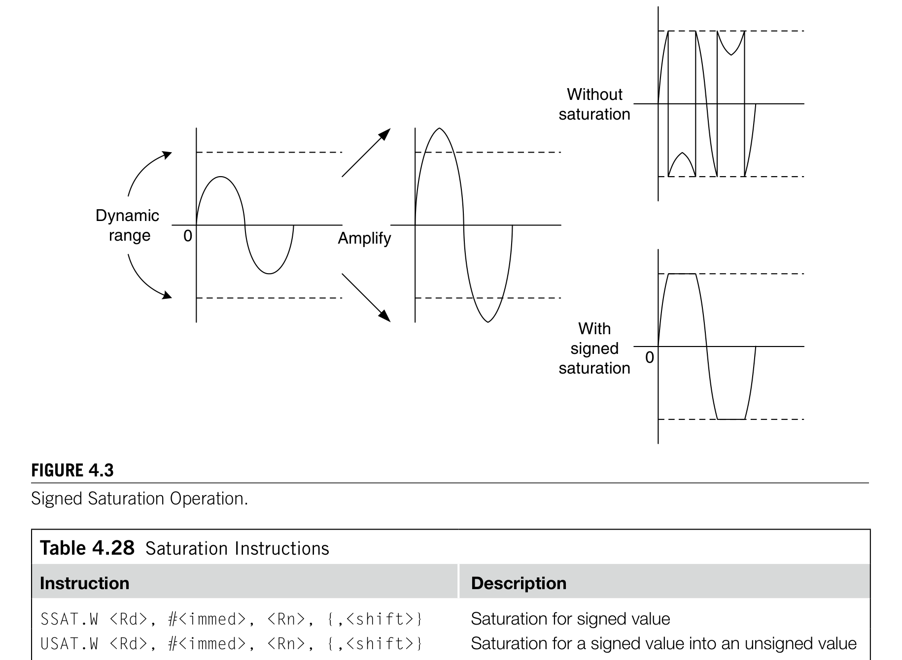
*Description*: Hardware reference table detailing register bit field settings, electrical operating limits, or memory configurations for Table 4.28.

> **Table 4.28**

68
CHAPTER 4  Instruction Sets
More details about memory barriers can be found in the ARM v7-M Architecture Application Level
Reference Manual [Ref. 2].
4.3.8  Assembly Language: Saturation Operations
The Cortex-M3 supports two instructions that provide signed and unsigned saturation operations: SSAT
and USAT (for signed data type and unsigned data type, respectively). Saturation is commonly used
in signal processing—for example, in signal amplification. When an input signal is amplified, there is
a chance that the output will be larger than the allowed output range. If the value is adjusted simply
by removing the unused MSB, an overflowed result will cause the signal waveform to be completely
deformed (see Figure 4.3).
The saturation operation does not prevent the distortion of the signal, but at least the amount of
distortion is greatly reduced in the signal waveform.
The instruction syntax of the SSAT and USAT instructions is outlined here and in Table 4.28.
Figure 4.3
Signed Saturation Operation.
Amplify
Without
saturation
With
signed
saturation
Dynamic
range
0
0
Table 4.28  Saturation Instructions
Instruction
Description
SSAT.W <Rd>, #<immed>, <Rn>, {,<shift>}
Saturation for signed value
USAT.W <Rd>, #<immed>, <Rn>, {,<shift>}
Saturation for a signed value into an unsigned value
Rn: Input value
Shift: Shift operation for input value before saturation; optional, can be #LSL N or #ASR N
Immed: Bit position where the saturation is carried out
Rd: Destination register


<!-- Page 96 -->
### [PDF Page 96]


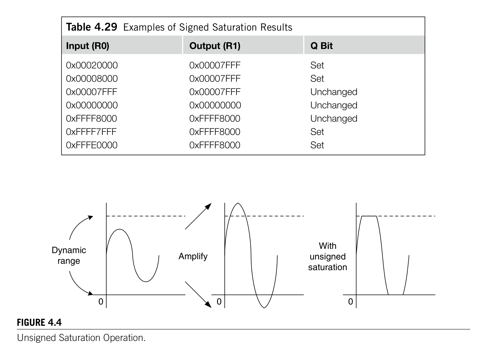
*Description*: Hardware reference table detailing register bit field settings, electrical operating limits, or memory configurations for Table 4.29.

> **Table 4.29**


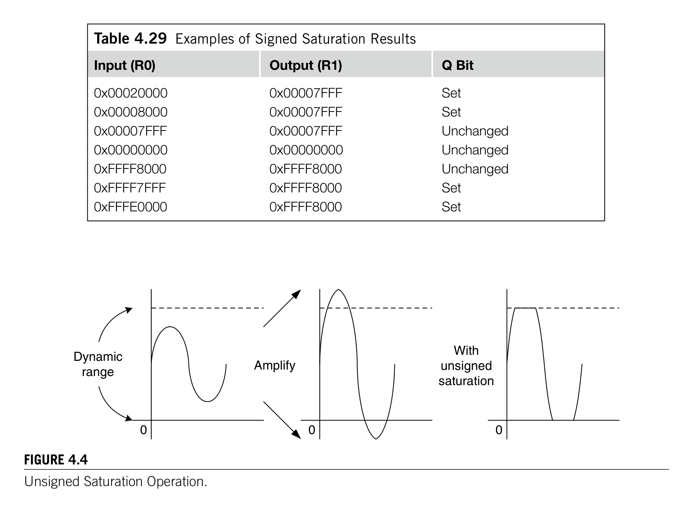
*Description*: Technical diagram and schematic illustration detailing hardware circuit topology, signal routing, and logic operations for Figure 4.4.

> **Figure 4.4**

69

## 4.3  Instruction Descriptions

Besides the destination register, the Q-bit in the APSR can also be affected by the result. The Q
flag is set if saturation takes place in the operation, and it can be cleared by writing to the APSR (see
Table 4.29). For example, if a 32-bit signed value is to be saturated into a 16-bit signed value, the fol-
lowing instruction can be used:
SSAT.W R1, #16, R0
Similarly, if a 32-bit unsigned value is to saturate into a 16-bit unsigned value, the following instruc-
tion can be used:
USAT.W R1, #16, R0
This will provide a saturation feature that has the properties shown in Figure 4.4.
For the preceding 16-bit saturation example instruction, the output values shown in Table 4.30 can
be observed.
Saturation instructions can also be used for data type conversions. For example, they can be used
to convert a 32-bit integer value to 16-bit integer value. However, C compilers might not be able to
directly use these instructions, so intrinsic function or assembler functions (or embedded/inline assem-
bler code) for the data conversion could be required.
Table 4.29  Examples of Signed Saturation Results
Input (R0)
Output (R1)
Q Bit
0x00020000
0x00007FFF
Set
0x00008000
0x00007FFF
Set
0x00007FFF
0x00007FFF
Unchanged
0x00000000
0x00000000
Unchanged
0xFFFF8000
0xFFFF8000
Unchanged
0xFFFF7FFF
0xFFFF8000
Set
0xFFFE0000
0xFFFF8000
Set
Amplify
Dynamic
range
0
0
0
With
unsigned
saturation
Figure 4.4
Unsigned Saturation Operation.


<!-- Page 97 -->
### [PDF Page 97]


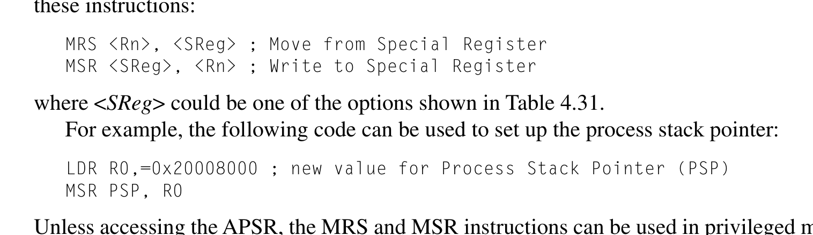
*Description*: Hardware reference table detailing register bit field settings, electrical operating limits, or memory configurations for Table 4.31.

> **Table 4.31**


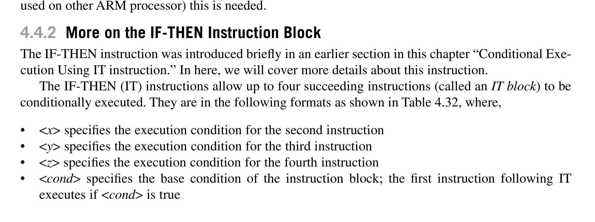
*Description*: Hardware reference table detailing register bit field settings, electrical operating limits, or memory configurations for Table 4.32.

> **Table 4.32**


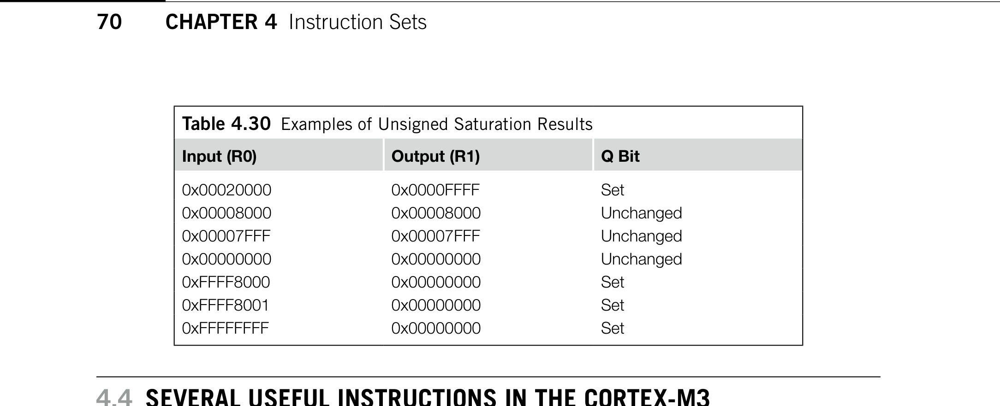
*Description*: Hardware reference table detailing register bit field settings, electrical operating limits, or memory configurations for Table 4.30.

> **Table 4.30**

70
CHAPTER 4  Instruction Sets

## 4.4  Several Useful Instructions In the Cortex-M3

Several useful Thumb-2 instructions from the architecture v7 and v6 are introduced here.
4.4.1  MSR and MRS
These two instructions provide access to the special registers in the Cortex-M3. Here is the syntax of
these instructions:
MRS <Rn>, <SReg> ; Move from Special Register
MSR <SReg>, <Rn> ; Write to Special Register
where <SReg> could be one of the options shown in Table 4.31.
For example, the following code can be used to set up the process stack pointer:
LDR R0,=0x20008000 ; new value for Process Stack Pointer (PSP)
MSR PSP, R0
Unless accessing the APSR, the MRS and MSR instructions can be used in privileged mode only. Oth-
erwise the operation will be ignored, and the returned read data (if MRS is used) will be zero.
After updating the value of the CONTROL register using MSR instruction, it is recommended to
add an ISB instruction to ensure that the effect of the update takes place immediately. On the Cor-
tex-M3 processor this is not strictly required, but for software portability (if the software code is to be
used on other ARM processor) this is needed.
4.4.2  More on the IF-THEN Instruction Block
The IF-THEN instruction was introduced briefly in an earlier section in this chapter “Conditional Exe-
cution Using IT instruction.” In here, we will cover more details about this instruction.
The IF-THEN (IT) instructions allow up to four succeeding instructions (called an IT block) to be
conditionally executed. They are in the following formats as shown in Table 4.32, where,
<
•
x> specifies the execution condition for the second instruction
<
•
y> specifies the execution condition for the third instruction
<
•
z> specifies the execution condition for the fourth instruction
<
•
cond> specifies the base condition of the instruction block; the first instruction following IT
executes if <cond> is true
Table 4.30  Examples of Unsigned Saturation Results
Input (R0)
Output (R1)
Q Bit
0x00020000
0x0000FFFF
Set
0x00008000
0x00008000
Unchanged
0x00007FFF
0x00007FFF
Unchanged
0x00000000
0x00000000
Unchanged
0xFFFF8000
0x00000000
Set
0xFFFF8001
0x00000000
Set
0xFFFFFFFF
0x00000000
Set


<!-- Page 98 -->
### [PDF Page 98]


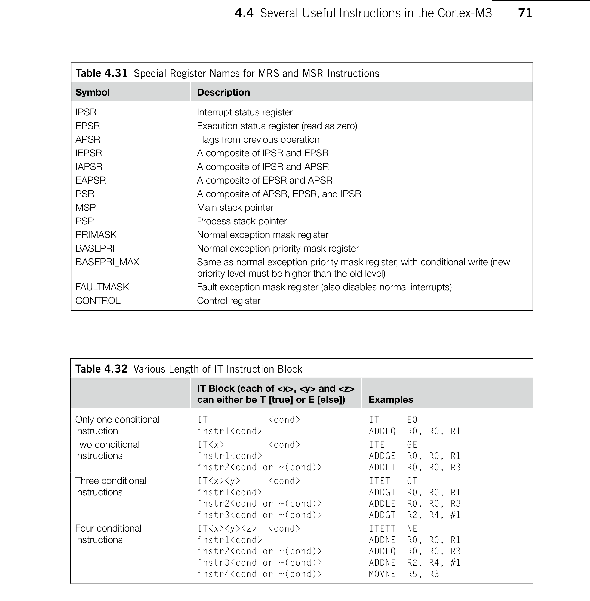
*Description*: Hardware reference table detailing register bit field settings, electrical operating limits, or memory configurations for Table 4.31.

> **Table 4.31**


*Description*: Hardware reference table detailing register bit field settings, electrical operating limits, or memory configurations for Table 4.32.

> **Table 4.32**

71

## 4.4  Several Useful Instructions in the Cortex-M3

The <cond> part uses the same condition symbols as conditional branch. If “AL” is used as <cond>,
then you cannot use “E” in the condition control as it implies the instruction should never get executed.
Each of <x>, <y>, and <z> can be either T (THEN) or E (ELSE), which refers to the base condition
<cond>, whereas <cond> uses traditional syntax such as EQ, NE, GT, or the like.
Table 4.31  Special Register Names for MRS and MSR Instructions
Symbol
Description
IPSR
Interrupt status register
EPSR
Execution status register (read as zero)
APSR
Flags from previous operation
IEPSR
A composite of IPSR and EPSR
IAPSR
A composite of IPSR and APSR
EAPSR
A composite of EPSR and APSR
PSR
A composite of APSR, EPSR, and IPSR
MSP
Main stack pointer
PSP
Process stack pointer
PRIMASK
Normal exception mask register
BASEPRI
Normal exception priority mask register
BASEPRI_MAX
Same as normal exception priority mask register, with conditional write (new
priority level must be higher than the old level)
FAULTMASK
Fault exception mask register (also disables normal interrupts)
CONTROL
Control register
Table 4.32  Various Length of IT Instruction Block
IT Block (each of <x>, <y> and <z>
can either be T [true] or E [else])
Examples
Only one conditional
instruction
IT           <cond>
instr1<cond>
IT     EQ
ADDEQ  R0, R0, R1
Two conditional
instructions
IT<x>        <cond>
instr1<cond>
instr2<cond or ~(cond)>
ITE    GE
ADDGE  R0, R0, R1
ADDLT  R0, R0, R3
Three conditional
instructions
IT<x><y>     <cond>
instr1<cond>
instr2<cond or ~(cond)>
instr3<cond or ~(cond)>
ITET   GT
ADDGT  R0, R0, R1
ADDLE  R0, R0, R3
ADDGT  R2, R4, #1
Four conditional
instructions
IT<x><y><z>  <cond>
instr1<cond>
instr2<cond or ~(cond)>
instr3<cond or ~(cond)>
instr4<cond or ~(cond)>
ITETT  NE
ADDNE  R0, R0, R1
ADDEQ  R0, R0, R3
ADDNE  R2, R4, #1
MOVNE  R5, R3


<!-- Page 99 -->
### [PDF Page 99]


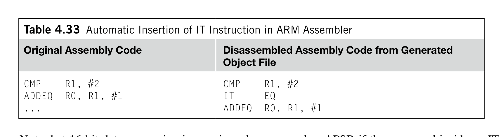
*Description*: Hardware reference table detailing register bit field settings, electrical operating limits, or memory configurations for Table 4.33.

> **Table 4.33**

72
CHAPTER 4  Instruction Sets
Here is an example of IT use:
if (R0 equal R1) then {
R3 = R4 + R5
R3 = R3/2
} else {
R3 = R6 + R7
R3 = R3/2
}
This can be written as follows:
CMP R0, R1       ; Compare R0 and R1
ITTEE EQ         ; If R0 equal R1, Then-Then-Else-Else
ADDEQ R3, R4, R5 ; Add if equal
ASREQ R3, R3, #1 ; Arithmetic shift right if equal
ADDNE R3, R6, R7 ; Add if not equal
ASRNE R3, R3, #1 ; Arithmetic shift right if not equal
Aside from using the IT instruction directly, the IT instruction also helps porting of assembly appli-
cation codes from ARM7TDMI to Cortex-M3. When ARM assembler (including KEIL RealView
Microcontroller Development Kit, which is covered in Chapter 20) is used, and if a conditional execu-
tion instruction is used in assembly code without IT instruction, the assembler can insert the required
IT instruction automatically. An example is shown in Table 4.33. This feature allows existing assembly
code to be reused on Cortex-M3 without ­modifications.
Note that 16-bit data processing instructions does not update APSR if they are used inside an IT
instruction block. If you add the S suffix in the conditional executed instruction, the 32-bit version of
the instruction would be used by the assembler.
4.4.3  SDIV and UDIV
The syntax for signed and unsigned divide instructions is as follows:
SDIV.W <Rd>, <Rn>, <Rm>
UDIV.W <Rd>, <Rn>, <Rm>
The result is Rd = Rn/Rm. For example,
LDR    R0,=300 ; Decimal 300
MOV    R1,#5
UDIV.W R2, R0, R1
This will give you an R2 result of 60 (0x3C).
Table 4.33  Automatic Insertion of IT Instruction in ARM Assembler
Original Assembly Code
Disassembled Assembly Code from Generated
Object File
CMP    R1, #2
ADDEQ  R0, R1, #1
...
CMP    R1, #2
IT     EQ
ADDEQ  R0, R1, #1


<!-- Page 100 -->
### [PDF Page 100]

73

## 4.4  Several Useful Instructions in the Cortex-M3

You can set up the DIVBYZERO bit in the NVIC Configuration Control Register so that when a
divide by zero occurs, a fault exception (usage fault) takes place. Otherwise, <Rd> will become 0 if a
divide by zero takes place.
4.4.4  REV, REVH, and REVSH
REV reverses the byte order in a data word, and REVH reverses the byte order inside a half word. For
example, if R0 is 0x12345678, in executing the following:
REV  R1, R0
REVH R2, R0
R1 will become 0x78563412, and R2 will be 0x34127856. REV and REVH are particularly useful for
converting data between big endian and little endian.
REVSH is similar to REVH except that it only processes the lower half word, and then it sign
extends the result. For example, if R0 is 0x33448899, running:
REVSH R1, R0
R1 will become 0xFFFF9988.
4.4.5  Reverse Bit
The RBIT instruction reverses the bit order in a data word. The syntax is as follows:
RBIT.W <Rd>, <Rn>
This instruction is very useful for processing serial bit streams in data communications. For exam-
ple, if R0 is 0xB4E10C23 (binary value 1011_0100_1110_0001_0000_1100_0010_0011), executing:
RBIT.W R0, R1
R0 will become 0xC430872D (binary value 1100_0100_0011_0000_1000_0111_0010_1101).
4.4.6  SXTB, SXTH, UXTB, and UXTH
The four instructions SXTB, SXTH, UXTB, and UXTH are used to extend a byte or half word data into
a word. The syntax of the instructions is as follows:
SXTB <Rd>, <Rn>
SXTH <Rd>, <Rn>
UXTB <Rd>, <Rn>
UXTH <Rd>, <Rn>
For SXTB/SXTH, the data are sign extended using bit[7]/bit[15] of Rn. With UXTB and UXTH,
the value is zero extended to 32-bit.
For example, if R0 is 0x55AA8765:
SXTB R1, R0 ; R1 = 0x00000065
SXTH R1, R0 ; R1 = 0xFFFF8765
UXTB R1, R0 ; R1 = 0x00000065
UXTH R1, R0 ; R1 = 0x00008765


<!-- Page 101 -->
### [PDF Page 101]

74
CHAPTER 4  Instruction Sets
4.4.7  Bit Field Clear and Bit Field Insert
Bit Field Clear (BFC) clears 1–31 adjacent bits in any position of a register. The syntax of the instruc-
tion is as follows:
BFC.W <Rd>, <#lsb>, <#width>
For example,
LDR   R0,=0x1234FFFF
BFC.W R0, #4, #8
This will give R0 = 0x1234F00F.
Bit Field Insert (BFI) copies 1–31 bits (#width) from one register to any location (#lsb) in another
register. The syntax is as follows:
BFI.W <Rd>, <Rn>, <#lsb>, <#width>
For example,
LDR   R0,=0x12345678
LDR   R1,=0x3355AACC
BFI.W R1, R0, #8, #16 ; Insert R0[15:0] to R1[23:8]
This will give R1 = 0x335678CC.
4.4.8  UBFX and SBFX
UBFX and SBFX are the unsigned and signed bit field extract instructions. The syntax of the instruc-
tions is as follows:
UBFX.W <Rd>, <Rn>, <#lsb>, <#width>
SBFX.W <Rd>, <Rn>, <#lsb>, <#width>
UBFX extracts a bit field from a register starting from any location (specified by #lsb) with any
width (specified by #width), zero extends it, and puts it in the destination register. For example,
LDR    R0,=0x5678ABCD
UBFX.W R1, R0, #4, #8
This will give R1 = 0x000000BC.
Similarly, SBFX extracts a bit field, but its sign extends it before putting it in a destination register.
For example,
LDR    R0,=0x5678ABCD
SBFX.W R1, R0, #4, #8
This will give R1 = 0xFFFFFFBC.
4.4.9  LDRD and STRD
The two instructions LDRD and STRD transfer two words of data from or into two registers. The syn-
tax of the instructions is as follows:
LDRD.W <Rxf>, <Rxf2>, [Rn, #+/−offset]{!} ; Pre-indexed


<!-- Page 102 -->
### [PDF Page 102]


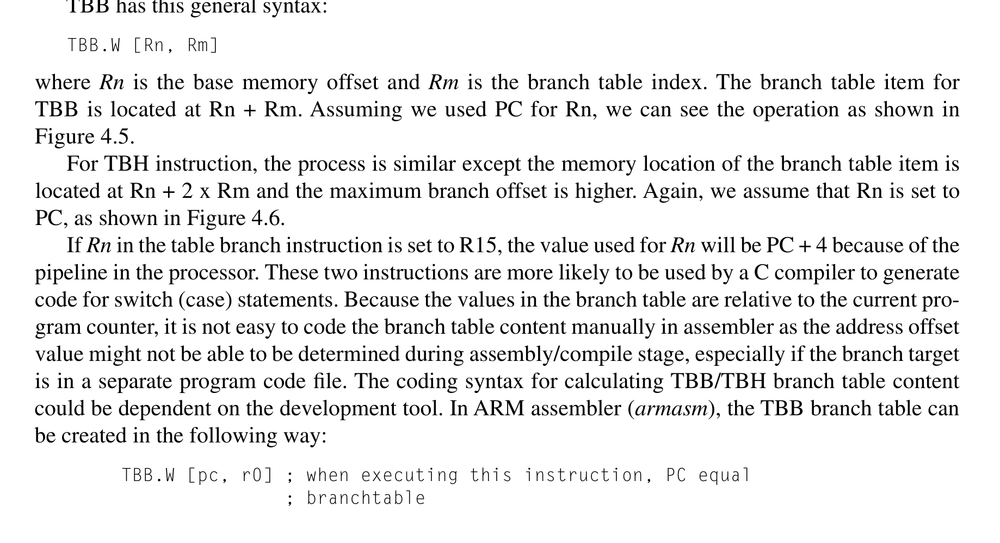
*Description*: Technical diagram and schematic illustration detailing hardware circuit topology, signal routing, and logic operations for Figure 4.5.

> **Figure 4.5**

75

## 4.4  Several Useful Instructions in the Cortex-M3

LDRD.W <Rxf>, <Rxf2>, [Rn], #+/−offset    ; Post-indexed
STRD.W <Rxf>, <Rxf2>, [Rn, #+/−offset]{!} ; Pre-indexed
STRD.W <Rxf>, <Rxf2>, [Rn], #+/−offset    ; Post-indexed
where <Rxf> is the first destination/source register and <Rxf2> is the second destination/source regis-
ter. Avoid using same register for <Rn> and <Rxf> when using LDRD because of an erratum in Cortex-
M3 revision 0 to 2.
For example, the following code reads a 64-bit value located in memory address 0x1000 into R0
and R1:
LDR    R2,=0x1000
LDRD.W R0, R1, [R2] ; This will gives R0 = memory[0x1000],
; R1 = memory[0x1004]
Similarly, we can use STRD to store a 64-bit value in memory. In the following example, preindexed
addressing mode is used:
LDR    R2,=0x1000          ; Base address
STRD.W R0, R1, [R2, #0x20] ; This will gives memory[0x1020] = R0,
; memory[0x1024] = R1
4.4.10  Table Branch Byte and Table Branch Halfword
Table Branch Byte (TBB) and Table Branch Halfword (TBH) are for implementing branch tables. The
TBB instruction uses a branch table of byte size offset, and TBH uses a branch table of half word offset.
Since the bit 0 of a program counter is always zero, the value in the branch table is multiplied by two
before it’s added to PC. Furthermore, because the PC value is the current instruction address plus four,
the branch range for TBB is (2 × 255) + 4 = 514, and the branch range for TBH is (2 × 65535) + 4 =
131074. Both TBB and TBH support forward branch only.
TBB has this general syntax:
TBB.W [Rn, Rm]
where Rn is the base memory offset and Rm is the branch table index. The branch table item for
TBB is located at Rn + Rm. Assuming we used PC for Rn, we can see the operation as shown in
­Figure 4.5.
For TBH instruction, the process is similar except the memory location of the branch table item is
located at Rn + 2 x Rm and the maximum branch offset is higher. Again, we assume that Rn is set to
PC, as shown in Figure 4.6.
If Rn in the table branch instruction is set to R15, the value used for Rn will be PC + 4 because of the
pipeline in the processor. These two instructions are more likely to be used by a C compiler to generate
code for switch (case) statements. Because the values in the branch table are relative to the current pro-
gram counter, it is not easy to code the branch table content manually in assembler as the address offset
value might not be able to be determined during assembly/compile stage, especially if the branch target
is in a separate program code file. The coding syntax for calculating TBB/TBH branch table content
could be dependent on the development tool. In ARM assembler (armasm), the TBB branch table can
be created in the following way:
TBB.W [pc, r0] ; when executing this instruction, PC equal
; branchtable


<!-- Page 103 -->
### [PDF Page 103]


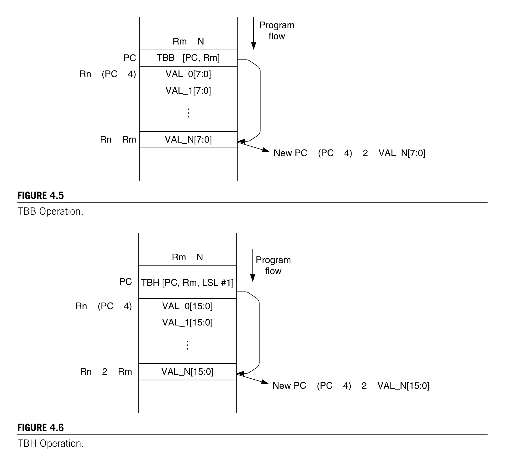
*Description*: Technical diagram and schematic illustration detailing hardware circuit topology, signal routing, and logic operations for Figure 4.5.

> **Figure 4.5**


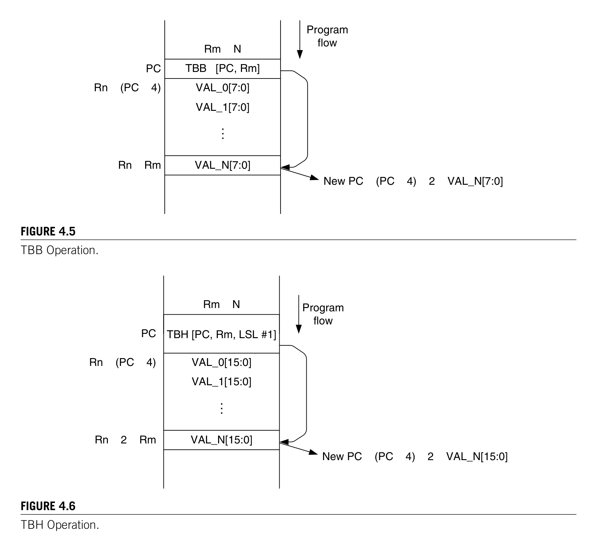
*Description*: Technical diagram and schematic illustration detailing hardware circuit topology, signal routing, and logic operations for Figure 4.6.

> **Figure 4.6**

76
CHAPTER 4  Instruction Sets
branchtable
DCB ((dest0 − branchtable)/2) ; Note that DCB is used because
; the value is 8-bit
DCB ((dest1 − branchtable)/2)
DCB ((dest2 − branchtable)/2)
DCB ((dest3 − branchtable)/2)
dest0
... ; Execute if r0 = 0
dest1
... ; Execute if r0 = 1
dest2
... ; Execute if r0 = 2
dest3
... ; Execute if r0 = 3
Figure 4.5
TBB Operation.
TBB   [PC, Rm]
PC
Rn z (PCz 4)
VAL_N[7:0]
Rnz Rm
Program
flow
New PC z (PC z 4) z 2 z VAL_N[7:0]
VAL_0[7:0]
VAL_1[7:0]
Rmz N
Figure 4.6
TBH Operation.
New PC z (PC z 4) z 2 z VAL_N[15:0]
TBH [PC, Rm, LSL #1]
PC
Rn z (PCz 4)
VAL_N[15:0]
Rnz 2z Rm
Program
flow
VAL_0[15:0]
VAL_1[15:0]
Rmz N


<!-- Page 104 -->
### [PDF Page 104]

77

## 4.4  Several Useful Instructions in the Cortex-M3

When the TBB instruction is executed, the current PC value is at the address labeled as branchtable
(because of the pipeline in the processor). Similarly, for TBH instructions, it can be used as follows:
TBH.W [pc, r0, LSL #1]
branchtable
DCI ((dest0 − branchtable)/2) ; Note that DCI is used because
; the value is 16-bit
DCI ((dest1 − branchtable)/2)
DCI ((dest2 − branchtable)/2)
DCI ((dest3 − branchtable)/2)
dest0
... ; Execute if r0 = 0
dest1
... ; Execute if r0 = 1
dest2
... ; Execute if r0 = 2
dest3
... ; Execute if r0 = 3


<!-- Page 105 -->
### [PDF Page 105]

This page intentionally left blank


