# Chapter 5. Memory Systems

> **Source PDF**: THE_DEFINITIVE_GUIDE_TO_THE_ARM_CORTEX-МЗ_Stellaris_MCU_9000Series_TEINSTRUMENTS_ARM_SECOND_EDITION.pdf  
> **PDF Page Range**: 106 - 125

---

<!-- Page 106 -->
### [PDF Page 106]

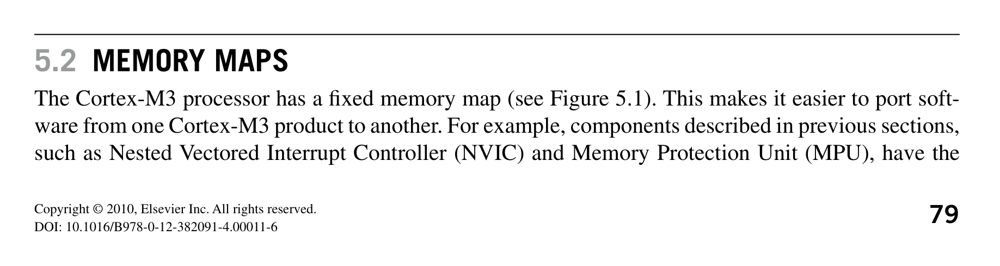
*Description*: Technical diagram and schematic illustration detailing hardware circuit topology, signal routing, and logic operations for Figure 5.1.

> **Figure 5.1**

79
CHAPTER
Copyright © 2010, Elsevier Inc. All rights reserved.
DOI: 10.1016/B978-0-12-382091-4.00011-6
In This Chapter
Memory System Features Overview�����������������������������������������������������������������������������������������������������������79
Memory Maps������������������������������������������������������������������������������������������������������������������������������������������79
Memory Access Attributes������������������������������������������������������������������������������������������������������������������������82
Default Memory Access Permissions��������������������������������������������������������������������������������������������������������83
Bit-Band Operations���������������������������������������������������������������������������������������������������������������������������������84
Unaligned Transfers���������������������������������������������������������������������������������������������������������������������������������92
Exclusive Accesses���������������������������������������������������������������������������������������������������������������������������������93
Endian Mode�������������������������������������������������������������������������������������������������������������������������������������������95
Memory Systems
5

## 5.1  Memory System Features Overview

The Cortex™-M3 processor has different memory architecture from that of traditional ARM proces-
sors. First, it has a predefined memory map that specifies which bus interface is to be used when a
memory location is accessed. This feature also allows the processor design to optimize the access
behavior when different devices are accessed.
Another feature of the memory system in the Cortex-M3 is the bit-band support. This provides
atomic operations to bit data in memory or peripherals. The bit-band operations are supported only in
special memory regions. This topic is covered in more detail later in this chapter.
The Cortex-M3 memory system also supports unaligned transfers and exclusive accesses. These

### features are part of the v7-M architecture. Finally, the Cortex-M3 supports both little endian and big

endian memory configuration.

## 5.2  Memory Maps

The Cortex-M3 processor has a fixed memory map (see Figure 5.1). This makes it easier to port soft-
ware from one ­Cortex-M3 product to another. For example, components described in previous sections,
such as Nested Vectored Interrupt Controller (NVIC) and Memory Protection Unit (MPU), have the

<!-- Page 107 -->
### [PDF Page 107]

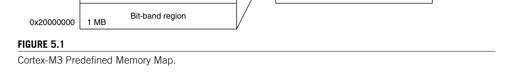
*Description*: Technical diagram and schematic illustration detailing hardware circuit topology, signal routing, and logic operations for Figure 5.1.

> **Figure 5.1**

80
CHAPTER 5  Memory Systems
same memory locations in all Cortex-M3 products. Nevertheless, the memory map definition allows
great flexibility so that manufacturers can differentiate their Cortex-M3-based product from others.
Some of the memory locations are allocated for private peripherals such as debugging components.
They are located in the private peripheral memory region. These debugging components include the
following:
Fetch Patch and Breakpoint Unit (FPB)
•
Data Watchpoint and Trace Unit (DWT)
•
Figure 5.1
Cortex-M3 Predefined Memory Map.
ROM table
External private peripheral bus
ETM
TPIU
Reserved
NVIC
Reserved
FPB
DWT
ITM
Vendor specific
Private peripheral bus:
Debug/external
Private peripheral bus:
Internal
External device
External RAM
Peripherals
SRAM
Code

## 0.5 GB

## 0.5 GB

1 GB

## 0.5 GB

1 GB
0x00000000
0x1FFFFFFF
0x20000000
0x3FFFFFFF
0x40000000
0x5FFFFFFF
0x60000000
0x9FFFFFFF
0xA0000000
0xDFFFFFFF
0xE0000000
0xE003FFFF
0xE0040000
0xE00FFFFF
0xE0100000
0xE0000000
0xE0001000
0xE0002000
0xE0003000
0xE000E000
0xE000F000
Bit-band alias
32 MB
Bit-band region
31 MB
1 MB
Bit-band alias
32 MB
Bit-band region
31 MB
1 MB
0xE000DFFF
0xE003FFFF
0xFFFFFFFF
0xE0040000
0xE0041000
0xE0042000
0xE00FF000
0xE00FEFFF
0x40000000
0x40100000
0x41FFFFFF
0x42000000
0x43FFFFFF
0x20000000
0x20100000
0x21FFFFFF
0x22000000
0x23FFFFFF

<!-- Page 108 -->
### [PDF Page 108]

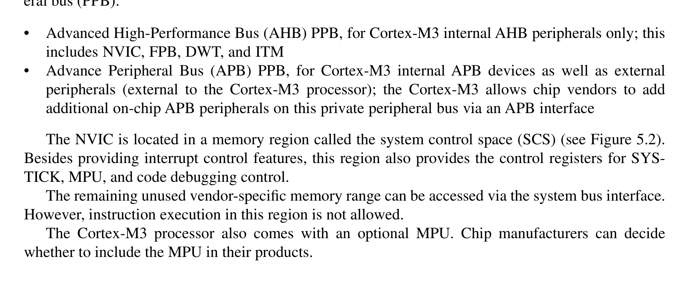
*Description*: Technical diagram and schematic illustration detailing hardware circuit topology, signal routing, and logic operations for Figure 5.2.

> **Figure 5.2**

81

## 5.2  Memory Maps

Instrumentation Trace Macrocell (ITM)
•
Embedded Trace Macrocell (ETM)
•
Trace Port Interface Unit (TPIU)
•
ROM table
•
The details of these components are discussed in later chapters on debugging features.
The Cortex-M3 processor has a total of 4 GB of address space. Program code can be located in the
code region, the Static Random Access Memory (SRAM) region, or the external RAM region. How-
ever, it is best to put the program code in the code region because with this arrangement, the instruction
fetches and data accesses are carried out simultaneously on two separate bus interfaces.
The SRAM memory range is for connecting internal SRAM. Access to this region is carried out
via the system interface bus. In this region, a 32-MB range is defined as a bit-band alias. Within the
32-bit‑band alias memory range, each word address represents a single bit in the 1-MB bit-band
region. A data write access to this bit-band alias memory range will be converted to an atomic READ-
­MODIFY-WRITE operation to the bit-band region so as to allow a program to set or clear individual
data bits in the memory. The bit-band operation applies only to data accesses not instruction fetches.
By putting Boolean information (single bits) in the bit-band region, we can pack multiple Boolean data
in a single word while still allowing them to be accessible individually via bit-band alias, thus saving
memory space without the need for handling READ-MODIFY-WRITE in software. More details on
bit-band alias can be found later in this chapter.
Another 0.5-GB block of address range is allocated to on-chip peripherals. Similar to the SRAM
region, this region supports bit-band alias and is accessed via the system bus interface. However,
instruction execution in this region is not allowed. The bit-band support in the peripheral region makes
it easy to access or change control and status bits of peripherals, making it easier to program peripheral
control.
Two slots of 1-GB memory space are allocated for external RAM and external devices. The differ-
ence between the two is that program execution in the external device region is not allowed, and there
are some differences with the caching behaviors.
The last 0.5-GB memory is for the system-level components, internal peripheral buses, external
peripheral bus, and vendor-specific system peripherals. There are two segments of the private periph-
eral bus (PPB):
Advanced High-Performance Bus (AHB) PPB, for Cortex-M3 internal AHB peripherals only; this
•
includes NVIC, FPB, DWT, and ITM
•
Advance Peripheral Bus (APB) PPB, for Cortex-M3 internal APB devices as well as external
peripherals (external to the Cortex-M3 processor); the Cortex-M3 allows chip vendors to add
additional on-chip APB peripherals on this private peripheral bus via an APB interface
The NVIC is located in a memory region called the system control space (SCS) (see Figure 5.2).
Besides providing interrupt control features, this region also provides the control registers for SYS-
TICK, MPU, and code debugging control.
The remaining unused vendor-specific memory range can be accessed via the system bus interface.
However, instruction execution in this region is not allowed.
The Cortex-M3 processor also comes with an optional MPU. Chip manufacturers can decide
whether to include the MPU in their products.

<!-- Page 109 -->
### [PDF Page 109]

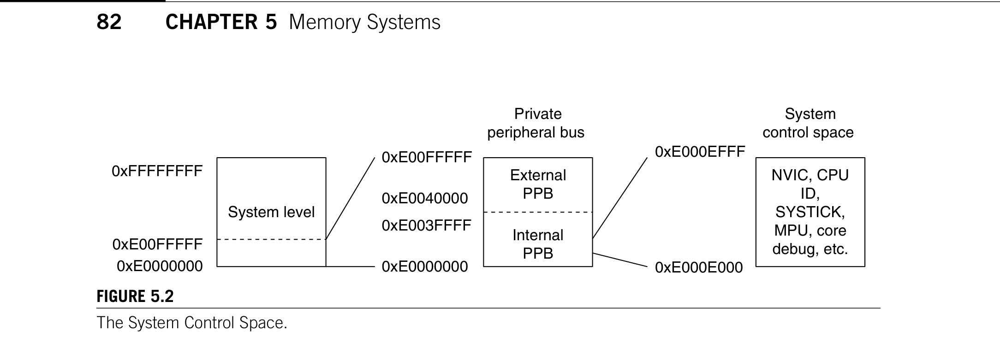
*Description*: Technical diagram and schematic illustration detailing hardware circuit topology, signal routing, and logic operations for Figure 5.2.

> **Figure 5.2**

82
CHAPTER 5  Memory Systems
What we have shown in the memory map is merely a template; individual semiconductor vendors
provide detailed memory maps including the actual location and size of ROM, RAM, and peripheral
memory locations.

## 5.3  Memory Access Attributes

The memory map shows what is included in each memory region. Aside from decoding which memory
block or device is accessed, the memory map also defines the memory attributes of the access. The
memory attributes you can find in the Cortex-M3 processor include the following:
•
Bufferable: Write to memory can be carried out by a write buffer while the processor continues on
next instruction execution.
•	 Cacheable: Data obtained from memory read can be copied to a memory cache so that next time it
is accessed the value can be obtained from the cache to speed up the program execution.
•
Executable: The processor can fetch and execute program code from this memory region.
•
Sharable: Data in this memory region could be shared by multiple bus masters. Memory system
needs to ensure coherency of data between different bus masters in shareable memory region.
The Cortex-M3 bus interfaces output the memory access attributes information to the memory
system for each instruction and data transfer. The default memory attribute settings can be overridden
if MPU is present and the MPU region configurations are programmed differently from the default.
Though the Cortex-M3 processor does not have a cache memory or cache controller, a cache unit can
be added on the microcontroller which can use the memory attribute information to define the memory
access behaviors. In addition, the cache attributes might also affect the operation of memory control-
lers for on-chip memory and off-chip memory, depending on the memory controllers used by the chip
manufacturers.
The memory access attributes for each memory region are as follows:
•
Code memory region (0x00000000–0x1FFFFFFF): This region is executable, and the cache
attribute is write through (WT). You can put data memory in this region as well. If data operations
are carried out for this region, they will take place via the data bus interface. Write transfers to this
region are bufferable.
Figure 5.2
The System Control Space.
System level
0xE0000000
0xFFFFFFFF
0xE00FFFFF
0xE0000000
0xE003FFFF
0xE0040000
0xE00FFFFF
Internal
PPB
External
PPB
Private
peripheral bus
System
control space
0xE000E000
0xE000EFFF
NVIC, CPU
ID,
SYSTICK,
MPU, core
debug, etc.

<!-- Page 110 -->
### [PDF Page 110]

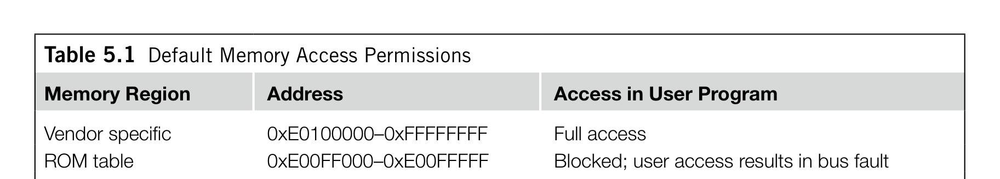
*Description*: Hardware reference table detailing register bit field settings, electrical operating limits, or memory configurations for Table 5.1.

> **Table 5.1**

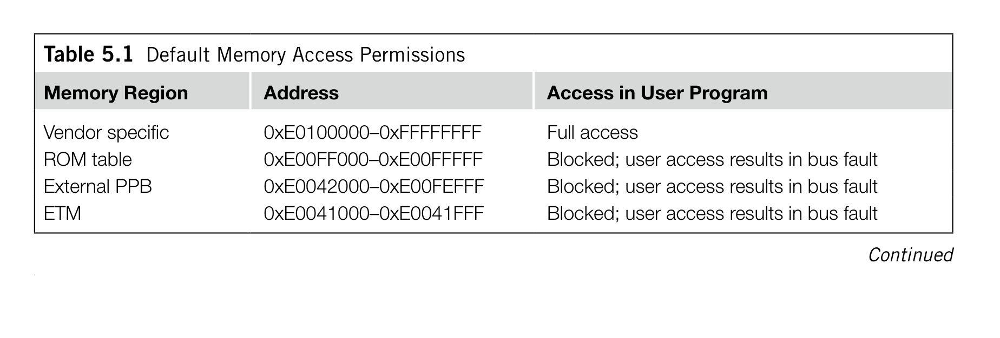
*Description*: Hardware reference table detailing register bit field settings, electrical operating limits, or memory configurations for Table 0.

> **Table 0**

83

## 5.4  Default Memory Access Permissions

•
SRAM memory region (0x20000000–0x3FFFFFFF): This region is intended for on-chip RAM.
Write transfers to this region are bufferable, and the cache attribute is write back, write allocated
(WB-WA). This region is executable, so you can copy program code here and execute it.
•
Peripheral region (0x40000000–0x5FFFFFFF): This region is intended for peripherals. The
accesses are noncacheable. You cannot execute instruction code in this region (Execute Never, or
XN in ARM documentation, such as the Cortex-M3 TRM).
•
External RAM region (0x60000000–0x7FFFFFFF): This region is intended for either on-chip or
off-chip memory. The accesses are cacheable (WB-WA), and you can execute code in this region.
•
External RAM region (0x80000000–0x9FFFFFFF): This region is intended for either on-chip or
off-chip memory. The accesses are cacheable (WT), and you can execute code in this region.
•
External devices (0xA0000000–0xBFFFFFFF): This region is intended for external devices and/or
shared memory that needs ordering/nonbuffered accesses. It is also a nonexecutable region.
•
External devices (0xC0000000–0xDFFFFFFF): This region is intended for external devices and/or
shared memory that needs ordering/nonbuffered accesses. It is also a nonexecutable region.
•
System region (0xE0000000–0xFFFFFFFF): This region is for private peripherals and vendor-specific
devices. It is nonexecutable. For the PPB memory range, the accesses are strongly ordered (noncacheable,
nonbufferable). For the vendor-specific memory region, the accesses are bufferable and noncacheable.
Note that from Revision 1 of the Cortex-M3, the code region memory attribute export to external
memory system is hardwired to cacheable and nonbufferable. This cannot be overridden by MPU con-
figuration. This update only affects the memory system outside the processor (e.g., level 2 cache and
certain types of memory controllers with cache features). Within the processor, the internal write buffer
can still be used for write transfers accessing the code region.

## 5.4  Default Memory Access Permissions

The Cortex-M3 memory map has a default configuration for memory access permissions. This prevents user
programs (non-privileged) from accessing system control memory spaces such as the NVIC. The default
memory access permission is used when either no MPU is present or MPU is present but disabled.
If MPU is present and enabled, the access permission in the MPU setup will determine whether user
accesses are allowed.
The default memory access permissions are shown in Table 5.1.
Table 5.1  Default Memory Access Permissions
Memory Region
Address
Access in User Program
Vendor specific
0xE0100000–0xFFFFFFFF
Full access
ROM table
0xE00FF000–0xE00FFFFF
Blocked; user access results in bus fault
External PPB
0xE0042000–0xE00FEFFF
Blocked; user access results in bus fault
ETM
0xE0041000–0xE0041FFF
Blocked; user access results in bus fault
Continued

<!-- Page 111 -->
### [PDF Page 111]

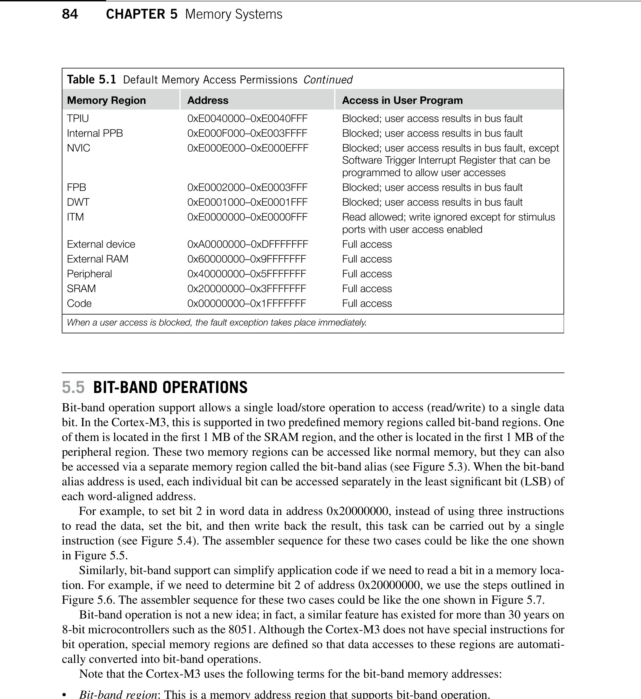
*Description*: Technical diagram and schematic illustration detailing hardware circuit topology, signal routing, and logic operations for Figure 5.3.

> **Figure 5.3**

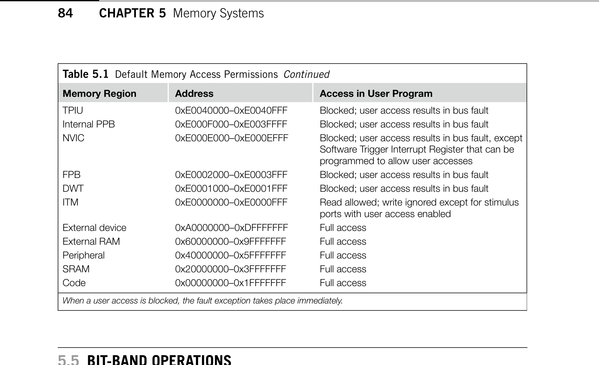
*Description*: Hardware reference table detailing register bit field settings, electrical operating limits, or memory configurations for Table 5.1.

> **Table 5.1**

84
CHAPTER 5  Memory Systems

## 5.5  Bit-Band Operations

Bit-band operation support allows a single load/store operation to access (read/write) to a single data
bit. In the Cortex-M3, this is supported in two predefined memory regions called bit-band regions. One
of them is located in the first 1 MB of the SRAM region, and the other is located in the first 1 MB of the
peripheral region. These two memory regions can be accessed like normal memory, but they can also
be accessed via a separate memory region called the bit-band alias (see Figure 5.3). When the bit-band
alias address is used, each individual bit can be accessed separately in the least significant bit (LSB) of
each word-aligned address.
For example, to set bit 2 in word data in address 0x20000000, instead of using three instructions
to read the data, set the bit, and then write back the result, this task can be carried out by a single
instruction (see Figure 5.4). The assembler sequence for these two cases could be like the one shown
in Figure 5.5.
Similarly, bit-band support can simplify application code if we need to read a bit in a memory loca-
tion. For example, if we need to determine bit 2 of address 0x20000000, we use the steps outlined in
Figure 5.6. The assembler sequence for these two cases could be like the one shown in Figure 5.7.
Bit-band operation is not a new idea; in fact, a similar feature has existed for more than 30 years on
8-bit microcontrollers such as the 8051. Although the Cortex-M3 does not have special instructions for
bit operation, special memory regions are defined so that data accesses to these regions are automati-
cally converted into bit-band operations.
Note that the Cortex-M3 uses the following terms for the bit-band memory addresses:
•
Bit-band region: This is a memory address region that supports bit-band operation.
•
Bit-band alias: Access to the bit-band alias will cause an access (a bit-band operation) to the
bit-band region. (Note: A memory remapping is performed.)
Table 5.1  Default Memory Access Permissions  Continued
Memory Region
Address
Access in User Program
TPIU
0xE0040000–0xE0040FFF
Blocked; user access results in bus fault
Internal PPB
0xE000F000–0xE003FFFF
Blocked; user access results in bus fault
NVIC
0xE000E000–0xE000EFFF
Blocked; user access results in bus fault, except
Software Trigger Interrupt Register that can be
programmed to allow user accesses
FPB
0xE0002000–0xE0003FFF
Blocked; user access results in bus fault
DWT
0xE0001000–0xE0001FFF
Blocked; user access results in bus fault
ITM
0xE0000000–0xE0000FFF
Read allowed; write ignored except for stimulus
ports with user access enabled
External device
0xA0000000–0xDFFFFFFF
Full access
External RAM
0x60000000–0x9FFFFFFF
Full access
Peripheral
0x40000000–0x5FFFFFFF
Full access
SRAM
0x20000000–0x3FFFFFFF
Full access
Code
0x00000000–0x1FFFFFFF
Full access
When a user access is blocked, the fault exception takes place immediately.

<!-- Page 112 -->
### [PDF Page 112]

*Description*: Technical diagram and schematic illustration detailing hardware circuit topology, signal routing, and logic operations for Figure 5.3.

> **Figure 5.3**

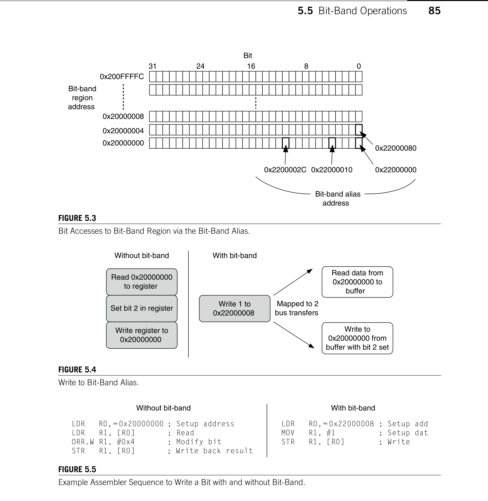
*Description*: Technical diagram and schematic illustration detailing hardware circuit topology, signal routing, and logic operations for Figure 5.4.

> **Figure 5.4**

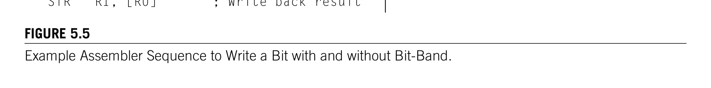
*Description*: Technical diagram and schematic illustration detailing hardware circuit topology, signal routing, and logic operations for Figure 5.5.

> **Figure 5.5**

85
Within the bit-band region, each word is represented by an LSB of 32 words in the bit-band alias
address range. What actually happens is that when the bit-band alias address is accessed, the address
is remapped into a bit-band address. For read operations, the word is read and the chosen bit location
is shifted to the LSB of the read return data. For write operations, the written bit data are shifted to the
required bit position, and a READ-MODIFY-WRITE is performed.

## 5.5  Bit-Band Operations

Figure 5.3
Bit Accesses to Bit-Band Region via the Bit-Band Alias.
0x20000000
0x20000004
0x20000008
0x200FFFFC
0
31
0x22000000
0x2200002C
0x22000080
0x22000010
8
16
24
Bit-band
region
address
Bit-band alias
address
Bit
Figure 5.4
Write to Bit-Band Alias.
Read 0x20000000
to register
Set bit 2 in register
Write register to
0x20000000
Without bit-band
With bit-band
Write 1 to
0x22000008
Read data from
0x20000000 to
buffer
Write to
0x20000000 from
buffer with bit 2 set
Mapped to 2
bus transfers
Figure 5.5
Example Assembler Sequence to Write a Bit with and without Bit-Band.
LDR   R0,=0x20000000 ; Setup address
LDR   R1, [R0]
; Read
ORR.W R1, #0x4
; Modify bit
STR   R1, [R0]       ; Write back result
With bit-band
LDR   R0, = 0x22000008 ; Setup add
MOV   R1, #1
; Setup dat
STR   R1, [R0]
; Write
Without bit-band

<!-- Page 113 -->
### [PDF Page 113]

*Description*: Hardware reference table detailing register bit field settings, electrical operating limits, or memory configurations for Table 5.2.

> **Table 5.2**

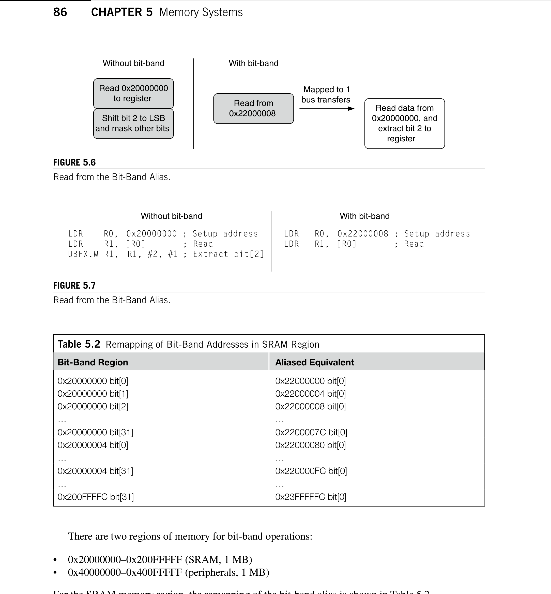
*Description*: Technical diagram and schematic illustration detailing hardware circuit topology, signal routing, and logic operations for Figure 5.6.

> **Figure 5.6**

*Description*: Technical diagram and schematic illustration detailing hardware circuit topology, signal routing, and logic operations for Figure 5.7.

> **Figure 5.7**

86
CHAPTER 5  Memory Systems
There are two regions of memory for bit-band operations:
0x20000000–0x200FFFFF (SRAM, 1 MB)
•
0x40000000–0x400FFFFF (peripherals, 1 MB)
•
For the SRAM memory region, the remapping of the bit-band alias is shown in Table 5.2.
Similarly, the bit-band region of the peripheral memory region can be accessed via bit-band aliased
addresses, as shown in Table 5.3.
Figure 5.6
Read from the Bit-Band Alias.
Read 0x20000000
to register
Shift bit 2 to LSB
and mask other bits
Without bit-band
With bit-band
Read from
0x22000008
Mapped to 1
bus transfers
Read data from
0x20000000, and
extract bit 2 to
register
Figure 5.7
Read from the Bit-Band Alias.
LDR    R0, =0x20000000 ; Setup address
LDR    R1, [R0]       ; Read
UBFX.W R1, R1, #2, #1 ; Extract bit[2]
With bit-band
LDR   R0, = 0x22000008 ; Setup address
LDR   R1, [R0]        ; Read
Without bit-band
Table 5.2  Remapping of Bit-Band Addresses in SRAM Region
Bit-Band Region
Aliased Equivalent
0x20000000 bit[0]
0x22000000 bit[0]
0x20000000 bit[1]
0x22000004 bit[0]
0x20000000 bit[2]
0x22000008 bit[0]
…
…
0x20000000 bit[31]
0x2200007C bit[0]
0x20000004 bit[0]
0x22000080 bit[0]
…
…
0x20000004 bit[31]
0x220000FC bit[0]
…
…
0x200FFFFC bit[31]
0x23FFFFFC bit[0]

<!-- Page 114 -->
### [PDF Page 114]

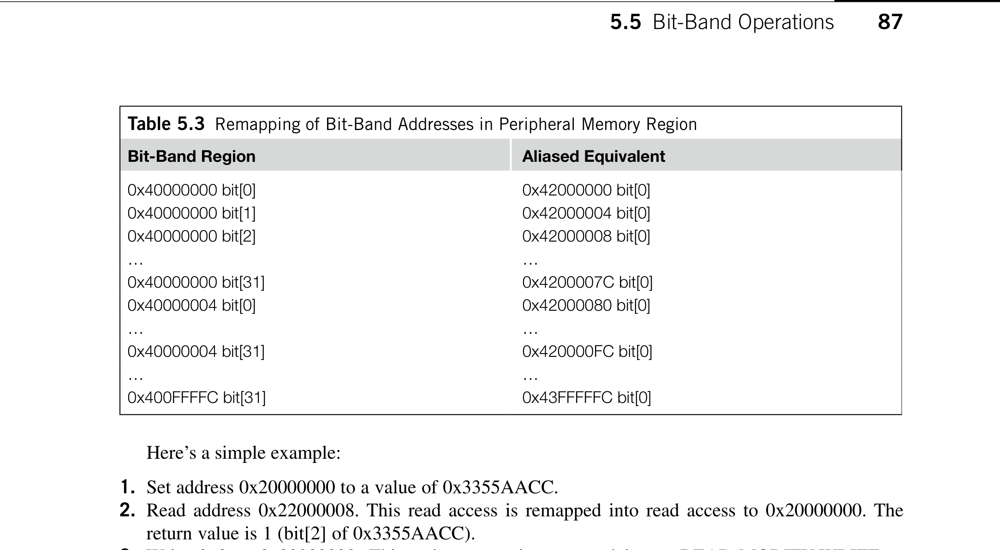
*Description*: Hardware reference table detailing register bit field settings, electrical operating limits, or memory configurations for Table 5.3.

> **Table 5.3**

87

## 5.5  Bit-Band Operations

Here’s a simple example:
Set address 0x20000000 to a value of 0x3355AACC.
1.
Read address 0x22000008. This read access is remapped into read access to 0x20000000. The
2.
return value is 1 (bit[2] of 0x3355AACC).
Write 0x0 to 0x22000008. This write access is remapped into a READ-MODIFY-WRITE to
3.
0x20000000. The value 0x3355AACC is read from memory, bit 2 is cleared, and a result of
0x3355AAC8 is written back to address 0x20000000.
Now, read 0x20000000. That gives you a return value of 0x3355AAC8 (bit[2] cleared).
4.
When you access bit-band alias addresses, only the LSB (bit[0]) in the data is used. In addition,
accesses to the bit-band alias region should not be unaligned. If an unaligned access is carried out to
bit-band alias address range, the result is unpredictable.
5.5.1  Advantages of Bit-Band Operations
So, what are the uses of bit-band operations? We can use them to, for example, implement serial data
transfers in general-purpose input/output (GPIO) ports to serial devices. The application code can be
implemented easily because access to serial data and clock signals can be separated.
Bit-band operation can also be used to simplify branch decisions. For example, if a branch should
be carried out based on 1 single bit in a status register in a peripheral, instead of
Reading the whole register
•
Masking the unwanted bits
•
Comparing and branching
•
Table 5.3  Remapping of Bit-Band Addresses in Peripheral Memory Region
Bit-Band Region
Aliased Equivalent
0x40000000 bit[0]
0x42000000 bit[0]
0x40000000 bit[1]
0x42000004 bit[0]
0x40000000 bit[2]
0x42000008 bit[0]
…
…
0x40000000 bit[31]
0x4200007C bit[0]
0x40000004 bit[0]
0x42000080 bit[0]
…
…
0x40000004 bit[31]
0x420000FC bit[0]
…
…
0x400FFFFC bit[31]
0x43FFFFFC bit[0]
Bit-Band versus Bit-Bang
In the Cortex-M3, we use the term bit-band to indicate that the feature is a special memory band (region) that
provides bit accesses. Bit-bang commonly refers to driving I/O pins under software control to provide serial
communication functions. The bit-band feature in the Cortex-M3 can be used for bit-banging implementations,
but the definitions of these two terms are different.

<!-- Page 115 -->
### [PDF Page 115]

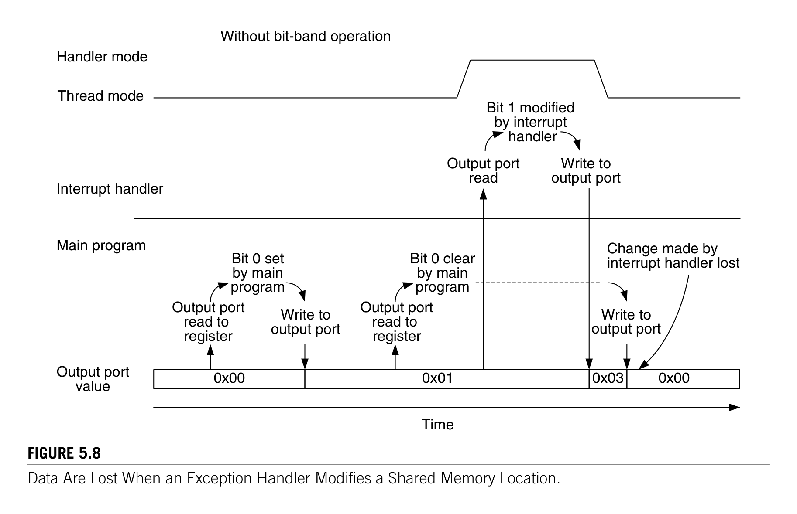
*Description*: Technical diagram and schematic illustration detailing hardware circuit topology, signal routing, and logic operations for Figure 5.8.

> **Figure 5.8**

88
CHAPTER 5  Memory Systems
you can simplify the operations to
Reading the status bit via the bit-band alias (get 0 or 1)
•
Comparing and branching
•
Besides providing faster bit operations with fewer instructions, the bit-band feature in the ­Cortex-M3
is also essential for situations in which resources are being shared by more than one process. One of the
most important advantages or properties of a bit-band operation is that it is atomic. In other words, the
READ-MODIFY-WRITE sequence cannot be interrupted by other bus activities. Without this behav-
ior in, for example, using a software READ-MODIFY-WRITE sequence, the following problem can
occur: consider a simple output port with bit 0 used by a main program and bit 1 used by an interrupt
handler. A software-based READ-MODIFY-WRITE operation can cause data conflicts, as shown in
Figure 5.8.
With the Cortex-M3 bit-band feature, this kind of race condition can be avoided because the READ-
MODIFY-WRITE is carried out at the hardware level and is atomic (the two transfers cannot be pulled
apart) and interrupts cannot take place between them (see Figure 5.9).
Similar issues can be found in multitasking systems. For example, if bit 0 of the output port is
used by Process A and bit 1 is used by Process B, a data conflict can occur in software-based READ-
MODIFY-WRITE (see Figure 5.10).
Figure 5.8
Data Are Lost When an Exception Handler Modifies a Shared Memory Location.
Without bit-band operation
Output port
read to
register
Output port
read to
register
Bit 0 set
by main
program
Bit 0 clear
by main
program
Write to
output port
Write to
output port
Main program
Interrupt handler
Output port
read
Bit 1 modified
by interrupt
handler
Write to
output port
Time
0x00
0x01
0x03
0x00
Thread mode
Handler mode
Change made by
interrupt handler lost
Output port
value

<!-- Page 116 -->
### [PDF Page 116]

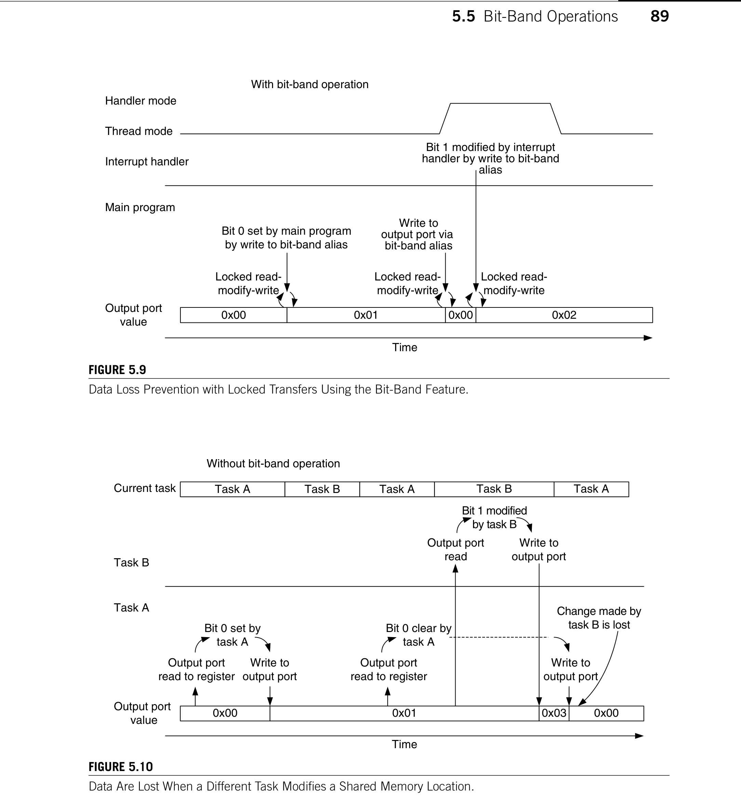
*Description*: Technical diagram and schematic illustration detailing hardware circuit topology, signal routing, and logic operations for Figure 5.9.

> **Figure 5.9**

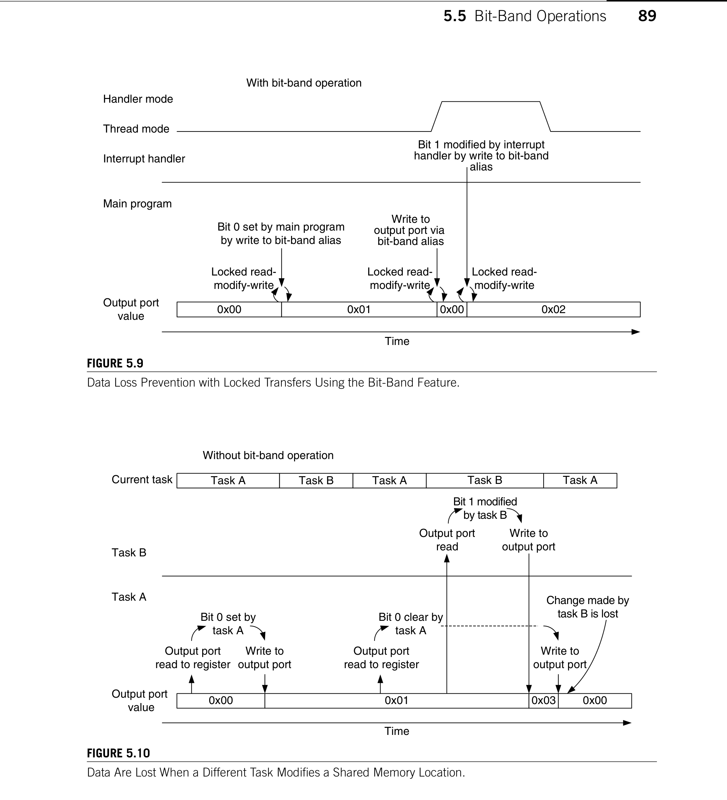
*Description*: Technical diagram and schematic illustration detailing hardware circuit topology, signal routing, and logic operations for Figure 5.10.

> **Figure 5.10**

89

## 5.5  Bit-Band Operations

Figure 5.9
Data Loss Prevention with Locked Transfers Using the Bit-Band Feature.
With bit-band operation
Main program
Interrupt handler
Time
Output port
value
0x00
0x01
0x00
0x02
Thread mode
Handler mode
Locked read-
modify-write
Write to
output port via
bit-band alias
Locked read-
modify-write
Locked read-
modify-write
Bit 0 set by main program
by write to bit-band alias
Bit 1 modified by interrupt
handler by write to bit-band
alias
Figure 5.10
Data Are Lost When a Different Task Modifies a Shared Memory Location.
Without bit-band operation
Output port
read to register
Output port
read to register
Bit 0 set by
task A
Write to
output port
Bit 0 clear by
task A
Write to
output port
Task A
Task B
Output port
read
Bit 1 modified
by task B
Write to
output port
Time
Output port
value
0x00
0x01
0x03
0x00
Current task
Change made by
task B is lost
Task A
Task B
Task A
Task B
Task A

<!-- Page 117 -->
### [PDF Page 117]

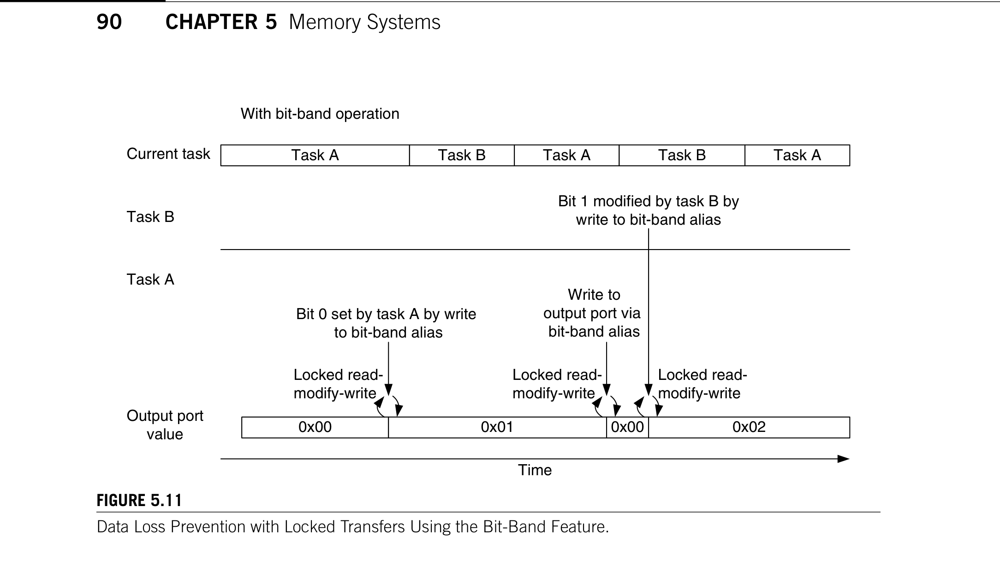
*Description*: Technical diagram and schematic illustration detailing hardware circuit topology, signal routing, and logic operations for Figure 5.11.

> **Figure 5.11**

90
CHAPTER 5  Memory Systems
Again, the bit-band feature can ensure that bit accesses from each task are separated so that no data
conflicts occur (see Figure 5.11).
Besides I/O functions, the bit-band feature can be used for storing and handling Boolean data in the
SRAM region. For example, multiple Boolean variables can be packed into one single memory location
to save memory space, whereas the access to each bit is still completely separated when the access is
carried out via the bit-band alias address range.
For system-on-chip (SoC) designers designing a bit-band-capable device, the device’s memory
address should be located within the bit-band memory, and the lock (HMASTLOCK) signal from the
AHB interface must be checked to make sure that writable register contents will not be changed except
by the bus when a locked transfer is carried out.
5.5.2  Bit-Band Operation of Different Data Sizes
Bit-band operation is not limited to word transfers. It can be carried out as byte transfers or half word
transfers as well. For example, when a byte access instruction (LDRB/STRB) is used to access a
bit-band alias address range, the accesses generated to the bit-band region will be in byte size. The
same applies to half word transfers (LDRH/STRH). When you use nonword transfers to bit-band alias
addresses, the address value should still be word aligned.
5.5.3  Bit-Band Operations in C Programs
There is no native support of bit-band operation in most C compilers. For example, C compilers do
not understand that the same memory can be accessed using two different addresses, and they do not
know that accesses to the bit-band alias will only access the LSB of the memory location. To use the
Figure 5.11
Data Loss Prevention with Locked Transfers Using the Bit-Band Feature.
With bit-band operation
Task A
Task B
Time
Output port
value
0x00
0x01
0x00
0x02
Locked read-
modify-write
Write to
output port via
bit-band alias
Locked read-
modify-write
Locked read-
modify-write
Bit 0 set by task A by write
to bit-band alias
Bit 1 modified by task B by
write to bit-band alias
Current task
Task A
Task B
Task A
Task B
Task A

<!-- Page 118 -->
### [PDF Page 118]

91

## 5.5  Bit-Band Operations

­bit-band feature in C, the simplest solution is to separately declare the address and the bit-band alias of
a memory location. For example:
#define  DEVICE_REG0        *((volatile unsigned long *)  (0x40000000))
#define  DEVICE_REG0_BIT0  *((volatile unsigned long *)  (0x42000000))
#define  DEVICE_REG0_BIT1  *((volatile unsigned long *)  (0x42000004))
...
DEVICE_REG0 = 0xAB; // Accessing the hardware register by normal
// address
...
DEVICE_REG0 = DEVICE_REG0 | 0x2; // Setting bit 1 without using
// bitband feature
...
DEVICE_REG0_BIT1 = 0x1; // Setting bit 1 using bitband feature
// via the bit band alias address
It is also possible to develop C macros to make accessing the bit-band alias easier. For example, we
could set up one macro to convert the bit-band address and the bit number into the bit-band alias address
and set up another macro to access the memory location by taking the address value as a pointer:
// Convert bit band address and bit number into
// bit band alias address
#define BITBAND(addr,bitnum) ((addr & 0xF0000000)+0x2000000+((addr &
0xFFFFF)<<5)+(bitnum <<2))
// Convert the address as a pointer
#define MEM_ADDR(addr) *((volatile unsigned long *) (addr))
Based on the previous example, we rewrite the code as follows:
#define DEVICE_REG0 0x40000000
#define BITBAND(addr,bitnum) ((addr & 0xF0000000)+0x02000000+((addr &
0xFFFFF)<<5)+(bitnum<<2))
#define MEM_ADDR(addr) *((volatile unsigned long *) (addr))
...
MEM_ADDR(DEVICE_REG0) = 0xAB; // Accessing the hardware
// register by normal address
...
// Setting bit 1 without using bitband feature
MEM_ADDR(DEVICE_REG0) = MEM_ADDR(DEVICE_REG0) | 0x2;
...
// Setting bit 1 with using bitband feature
MEM_ADDR(BITBAND(DEVICE_REG0,1)) = 0x1;
Note that when the bit-band feature is used, the variables being accessed might need to be declared
as volatile. The C compilers do not know that the same data could be accessed in two different addresses,
so the volatile property is used to ensure that each time a variable is accessed, the memory location is
accessed instead of a local copy of the data inside the processor.
Starting from ARM RealView Development Suite version 4.0 and Keil MDK-ARM 3.80, bit band
support is provided by __attribute__((bitband)) language extension and __bitband command
line option (see reference 6). You can find further examples of bit-band accesses with C macros using
ARM RealView Compiler Tools in the ARM Application Note 179 [Ref. 7].

<!-- Page 119 -->
### [PDF Page 119]

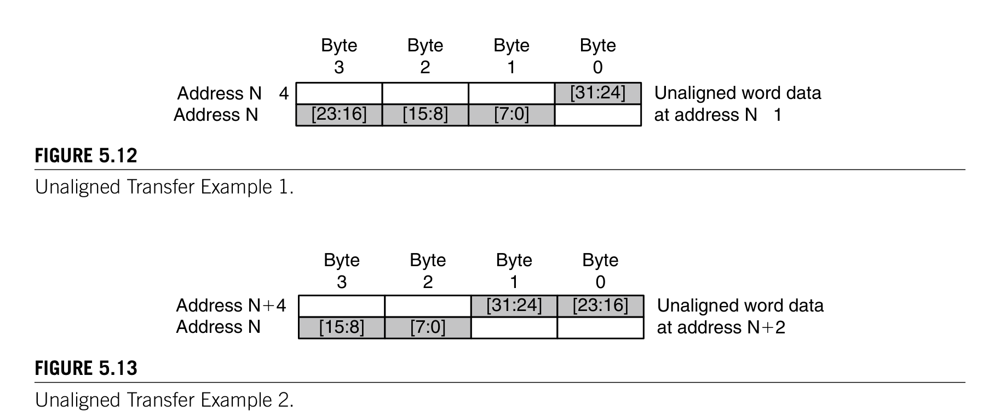
*Description*: Technical diagram and schematic illustration detailing hardware circuit topology, signal routing, and logic operations for Figure 5.12.

> **Figure 5.12**

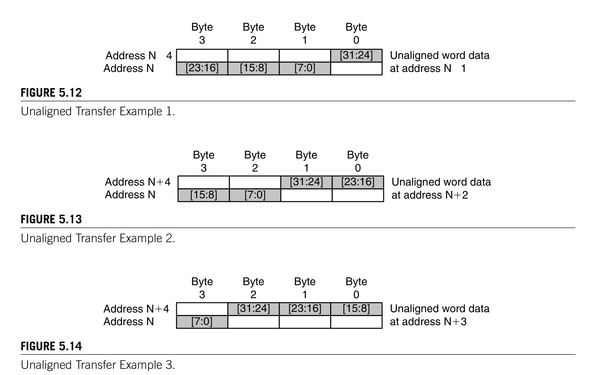
*Description*: Technical diagram and schematic illustration detailing hardware circuit topology, signal routing, and logic operations for Figure 5.13.

> **Figure 5.13**

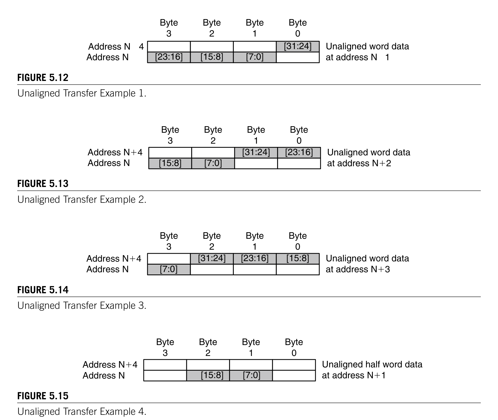
*Description*: Technical diagram and schematic illustration detailing hardware circuit topology, signal routing, and logic operations for Figure 5.14.

> **Figure 5.14**

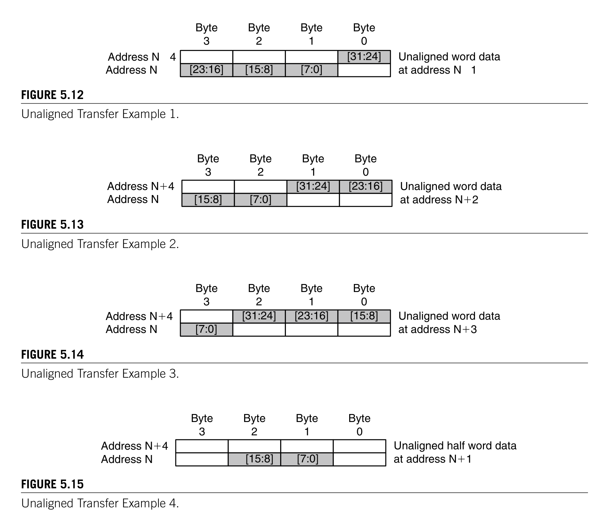
*Description*: Technical diagram and schematic illustration detailing hardware circuit topology, signal routing, and logic operations for Figure 5.15.

> **Figure 5.15**

92
CHAPTER 5  Memory Systems

## 5.6  Unaligned Transfers

The Cortex-M3 supports unaligned transfers on single accesses. Data memory accesses can be defined
as aligned or unaligned. Traditionally, ARM processors (such as the ARM7/ARM9/ARM10) allow
only aligned transfers. That means in accessing memory, a word transfer must have address bit[1] and
bit[0] equal to 0, and a half word transfer must have address bit[0] equal to 0. For example, word data
can be located at 0x1000 or 0x1004, but it cannot be located in 0x1001, 0x1002, or 0x1003. For half
word data, the address can be 0x1000 or 0x1002, but it cannot be 0x1001.
So, what does an unaligned transfer look like? Figures 5.12 through 5.16 show some examples.
Assuming that the memory infrastructure is 32-bit (4 bytes) wide, an unaligned transfer can be any word
size read/write such that the address is not a multiple of 4, as shown in Figures 5.12–5.14, or when the
transfer is in half word size, and the address is not a multiple of 2, as shown in Figures 5.15 and 5.16.
All the byte-size transfers are aligned on the Cortex-M3 because the minimum address step is 1 byte.
Figure 5.12
Unaligned Transfer Example 1.
Address N
Address Nz 4
Byte
3
Byte
2
Byte
1
Byte
0
[23:16]
[15:8]
[7:0]
[31:24]
Unaligned word data
at address Nz 1
Figure 5.13
Unaligned Transfer Example 2.
Address N
Address N4
Byte
3
Byte
2
Byte
1
Byte
0
[15:8]
[7:0]
[31:24]
Unaligned word data
at address N2
[23:16]
Figure 5.14
Unaligned Transfer Example 3.
Byte
3
Byte
2
Byte
1
Byte
0
[7:0]
[31:24]
Unaligned word data
at address N3
[23:16]
[15:8]
Address N
Address N4
Figure 5.15
Unaligned Transfer Example 4.
Byte
3
Byte
2
Byte
1
Byte
0
[7:0]
Unaligned half word data
at address N1
[15:8]
Address N
Address N4

<!-- Page 120 -->
### [PDF Page 120]

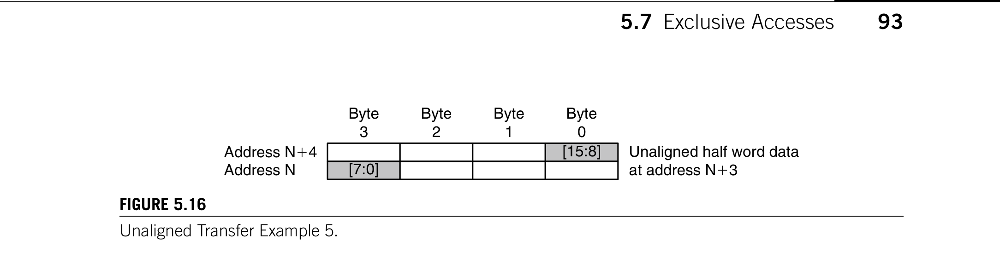
*Description*: Technical diagram and schematic illustration detailing hardware circuit topology, signal routing, and logic operations for Figure 5.16.

> **Figure 5.16**

93

## 5.7  Exclusive Accesses

In the Cortex-M3, unaligned transfers are supported in normal memory accesses (such as LDR,
LDRH, STR, and STRH instructions). There are a number of limitations:
Unaligned transfers are not supported in Load/Store multiple instructions.
•
Stack operations (PUSH/POP) must be aligned.
•
Exclusive accesses (such as LDREX or STREX) must be aligned; otherwise, a fault exception
•
(usage fault) will be triggered.
Unaligned transfers are not supported in bit-band operations. Results will be unpredictable if you
•
attempt to do so.
When unaligned transfers are used, they are actually converted into multiple aligned transfers by the
processor’s bus interface unit. This conversion is transparent, so application programmers do not have
to worry about it. However, when an unaligned transfer takes place, it is broken into separate transfers,
and as a result, it takes more clock cycles for a single data access and might not be good for situations
in which high performance is required. To get the best performance, it’s worth making sure that data
are aligned properly.
It is also possible to set up the NVIC so that an exception is triggered when an unaligned transfer
takes place. This is done by setting the UNALIGN_TRP (unaligned trap) bit in the configuration con-
trol register in the NVIC (0xE000ED14). In this way, the Cortex-M3 generates usage fault exceptions
when unaligned transfers take place. This is useful during software development to test whether an
application produces unaligned transfers.

## 5.7  Exclusive Accesses

You might have noticed that the Cortex-M3 has no SWP instruction (swap), which was used for sema-
phore operations in traditional ARM processors like ARM7TDMI. This is now being replaced by
exclusive access operations. Exclusive accesses were first supported in architecture v6 (for example,
in the ARM1136).
Semaphores are commonly used for allocating shared resources to applications. When a shared
resource can only service one client or application processor, we also call it Mutual Exclusion
(MUTEX). In such cases, when a resource is being used by one process, it is locked to that process
and cannot serve another process until the lock is released. To set up a MUTEX semaphore, a memory
location is defined as the lock flag to indicate whether a shared resource is locked by a process. When
a process or application wants to use the resource, it needs to check whether the resource has been
locked first. If it is not being used, it can set the lock flag to indicate that the resource is now locked. In
traditional ARM processors, the access to the lock flag is carried out by the SWP instruction. It allows
Figure 5.16
Unaligned Transfer Example 5.
Byte
3
Byte
2
Byte
1
Byte
0
[7:0]
Unaligned half word data
at address N3
[15:8]
Address N
Address N4

<!-- Page 121 -->
### [PDF Page 121]

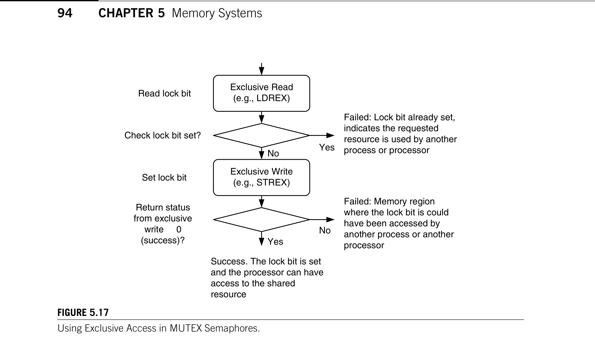
*Description*: Technical diagram and schematic illustration detailing hardware circuit topology, signal routing, and logic operations for Figure 5.17.

> **Figure 5.17**

94
CHAPTER 5  Memory Systems
the lock flag read and write to be atomic, preventing the resource from being locked by two processes
at the same time.
In newer ARM processors, the read/write access can be carried out on separated buses. In such
situations, the SWP instructions can no longer be used to make the memory access atomic because
the read and write in a locked transfer sequence must be on the same bus. Therefore, the locked
transfers are replaced by exclusive accesses. The concept of exclusive access operation is quite
simple but different from SWP; it allows the possibility that the memory location for a semaphore
could be accessed by another bus master or another process running on the same processor (see
Figure 5.17).
To allow exclusive access to work properly in a multiple processor environment, an additional
hardware called “exclusive access monitor” is required. This monitor checks the transfers toward
shared address locations and replies to the processor if an exclusive access is success. The processor
bus ­interface also provides additional control signals1 to this monitor to indicate if the transfer is an
­exclusive access.
If the memory device has been accessed by another bus master between the exclusive read and the
exclusive write, the exclusive access monitor will flag an exclusive failed through the bus system when
the processor attempts the exclusive write. This will cause the return status of the exclusive write to
be 1. In the case of failed exclusive write, the exclusive access monitor also blocks the write transfer
from getting to the exclusive access address.
1Exclusive access signals are available on the system bus and the D-Code bus of the Cortex-M3 processor. They are EXREQD
and EXRESPD for the D-Code bus and EXREQS and EXRESPS for the system bus. The I-Code bus that is used for instruc-
tion fetch cannot generate exclusive accesses.
Exclusive Read
(e.g., LDREX)
Exclusive Write
(e.g., STREX)
Read lock bit
Check lock bit set?
Set lock bit
Yes
Yes
No
No
Failed: Lock bit already set,
indicates the requested
resource is used by another
process or processor
Failed: Memory region
where the lock bit is could
have been accessed by
another process or another
processor
Success. The lock bit is set
and the processor can have
access to the shared
resource
Return status
from exclusive
write z  0
(success)?
Figure 5.17
Using Exclusive Access in MUTEX Semaphores.

<!-- Page 122 -->
### [PDF Page 122]

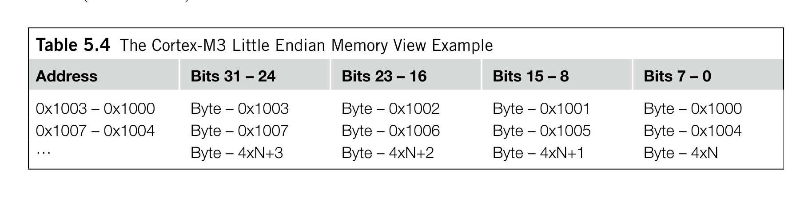
*Description*: Hardware reference table detailing register bit field settings, electrical operating limits, or memory configurations for Table 5.4.

> **Table 5.4**

95

## 5.8  Endian Mode

Exclusive access instructions in the Cortex-M3 include LDREX (word), LDREXB (byte), LDREXH
(half word), STREX (word), STREXB (byte), and STREXH (half word). A simple example of the syn-
tax is as follows:
LDREX  <Rxf>, [Rn, #offset]
STREX  <Rd>, <Rxf>,[Rn, #offset]
Where Rd is the return status of the exclusive write (0 = success and 1 = failure).
Example code for exclusive accesses can be found in Chapter 10. You can also access exclusive
access instructions in C using intrinsic functions provided in Cortex Microcontroller Software Inter-
face Standard (CMSIS) compliant device driver libraries from microcontroller vendors: __LDREX,
__LEDEXH, __LDREXB, __STREX, __STREXH, __STREXB. More details of these functions are
covered in Appendix G.
When exclusive accesses are used, the internal write buffers in the Cortex-M3 bus interface will
be bypassed, even when the MPU defines the region as bufferable. This ensures that semaphore infor-
mation on the physical memory is always up to date and coherent between bus masters. SoC design-
ers using Cortex-M3 on multiprocessor systems should ensure that the memory system enforces data
coherency when exclusive transfers occur.

## 5.8  Endian Mode

The Cortex-M3 supports both little endian and big endian modes. However, the supported memory
type also depends on the design of the rest of the microcontroller (bus connections, memory control-
lers, peripherals, and so on). Make sure that you check your microcontroller datasheets in detail before
developing your software. In most cases, Cortex-M3-based microcontrollers will be little endian. With
little endian mode, the first byte of a word size data is stored in the least significant byte of the 32-bit
memory location (see Table 5.4).
There are some microcontrollers that use big endian mode. In such a case, the first byte of a word
size data is stored in the most significant byte of the 32-bit address memory location (see Table 5.5).
The definition of big endian in the Cortex-M3 is different from the ARM7. In the ARM7TDMI, the big
endian scheme is called word-invariant big endian, also referred as BE-32 in ARM documentation, whereas
in the Cortex-M3, the big endian scheme is called byte-invariant big endian, also referred as BE-8 (byte-
invariant big endian is supported on ARM architecture v6 and v7). The memory view of both schemes is the
same, but the byte lane usage on the bus interface during data transfers is different (see Tables 5.6 and 5.7).
Note that the data transfer on the AHB bus in BE-8 mode uses the same data byte lanes as in little
endian. However, the data byte inside the half word or word data is reversely ordered compared to little
endian (see Table 5.8).
Table 5.4  The Cortex-M3 Little Endian Memory View Example
Address
Bits 31 – 24
Bits 23 – 16
Bits 15 – 8
Bits 7 – 0
0x1003 – 0x1000
Byte – 0x1003
Byte – 0x1002
Byte – 0x1001
Byte – 0x1000
0x1007 – 0x1004
Byte – 0x1007
Byte – 0x1006
Byte – 0x1005
Byte – 0x1004
…
Byte – 4xN+3
Byte – 4xN+2
Byte – 4xN+1
Byte – 4xN

<!-- Page 123 -->
### [PDF Page 123]

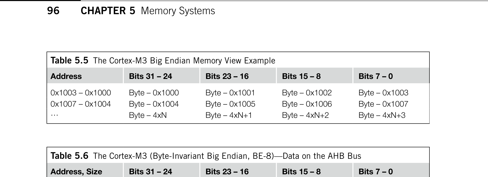
*Description*: Hardware reference table detailing register bit field settings, electrical operating limits, or memory configurations for Table 5.5.

> **Table 5.5**

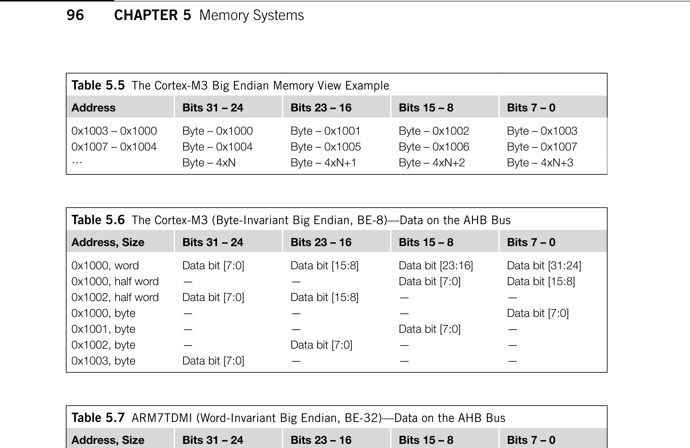
*Description*: Hardware reference table detailing register bit field settings, electrical operating limits, or memory configurations for Table 5.6.

> **Table 5.6**

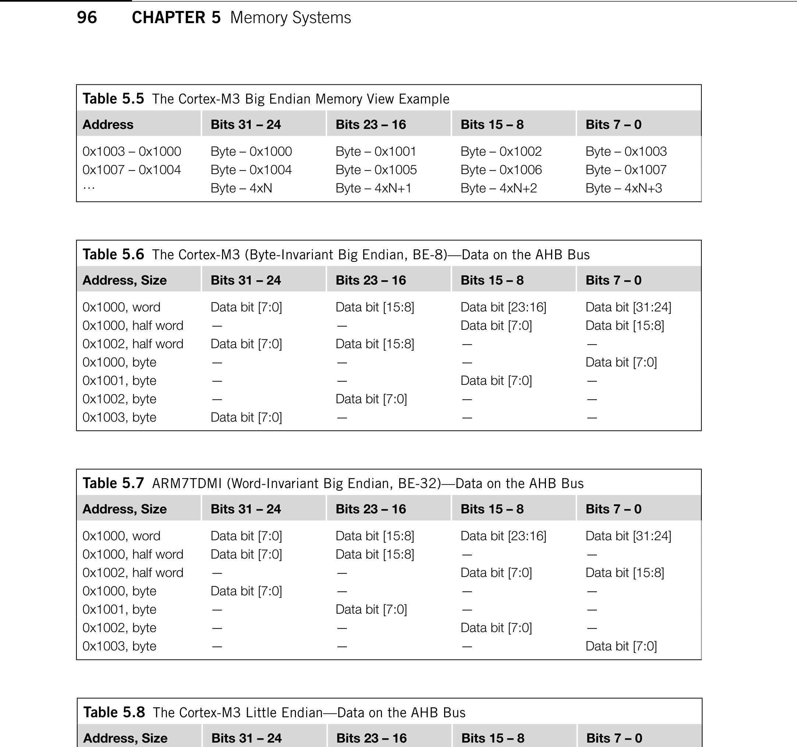
*Description*: Hardware reference table detailing register bit field settings, electrical operating limits, or memory configurations for Table 5.7.

> **Table 5.7**

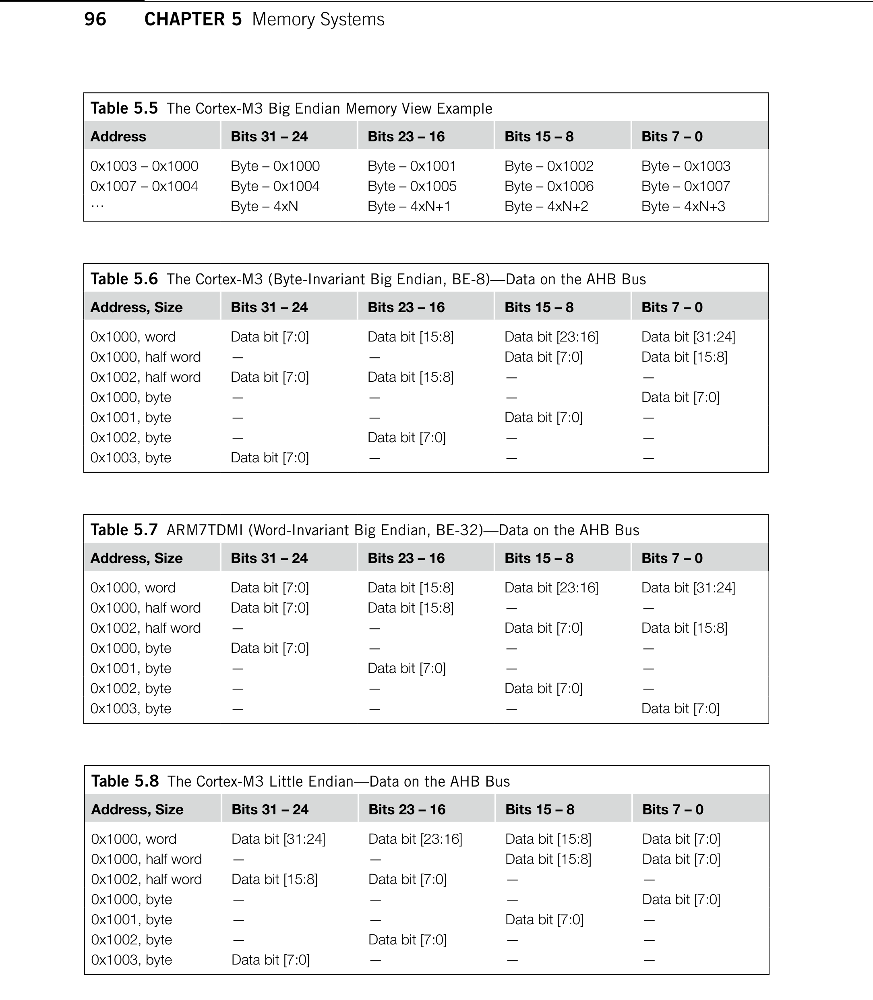
*Description*: Hardware reference table detailing register bit field settings, electrical operating limits, or memory configurations for Table 5.8.

> **Table 5.8**

96
CHAPTER 5  Memory Systems
Table 5.5  The Cortex-M3 Big Endian Memory View Example
Address
Bits 31 – 24
Bits 23 – 16
Bits 15 – 8
Bits 7 – 0
0x1003 – 0x1000
Byte – 0x1000
Byte – 0x1001
Byte – 0x1002
Byte – 0x1003
0x1007 – 0x1004
Byte – 0x1004
Byte – 0x1005
Byte – 0x1006
Byte – 0x1007
…
Byte – 4xN
Byte – 4xN+1
Byte – 4xN+2
Byte – 4xN+3
Table 5.6  The Cortex-M3 (Byte-Invariant Big Endian, BE-8)—Data on the AHB Bus
Address, Size
Bits 31 – 24
Bits 23 – 16
Bits 15 – 8
Bits 7 – 0
0x1000, word
Data bit [7:0]
Data bit [15:8]
Data bit [23:16]
Data bit [31:24]
0x1000, half word
—
—
Data bit [7:0]
Data bit [15:8]
0x1002, half word
Data bit [7:0]
Data bit [15:8]
—
—
0x1000, byte
—
—
—
Data bit [7:0]
0x1001, byte
—
—
Data bit [7:0]
—
0x1002, byte
—
Data bit [7:0]
—
—
0x1003, byte
Data bit [7:0]
—
—
—
Table 5.7  ARM7TDMI (Word-Invariant Big Endian, BE-32)—Data on the AHB Bus
Address, Size
Bits 31 – 24
Bits 23 – 16
Bits 15 – 8
Bits 7 – 0
0x1000, word
Data bit [7:0]
Data bit [15:8]
Data bit [23:16]
Data bit [31:24]
0x1000, half word
Data bit [7:0]
Data bit [15:8]
—
—
0x1002, half word
—
—
Data bit [7:0]
Data bit [15:8]
0x1000, byte
Data bit [7:0]
—
—
—
0x1001, byte
—
Data bit [7:0]
—
—
0x1002, byte
—
—
Data bit [7:0]
—
0x1003, byte
—
—
—
Data bit [7:0]
Table 5.8  The Cortex-M3 Little Endian—Data on the AHB Bus
Address, Size
Bits 31 – 24
Bits 23 – 16
Bits 15 – 8
Bits 7 – 0
0x1000, word
Data bit [31:24]
Data bit [23:16]
Data bit [15:8]
Data bit [7:0]
0x1000, half word
—
—
Data bit [15:8]
Data bit [7:0]
0x1002, half word
Data bit [15:8]
Data bit [7:0]
—
—
0x1000, byte
—
—
—
Data bit [7:0]
0x1001, byte
—
—
Data bit [7:0]
—
0x1002, byte
—
Data bit [7:0]
—
—
0x1003, byte
Data bit [7:0]
—
—
—

<!-- Page 124 -->
### [PDF Page 124]

97

## 5.8  Endian Mode

In the Cortex-M3 processor, the endian mode is set when the processor exits reset. The endian mode
cannot be changed afterward. (There is no dynamic endian switching, and the SETEND instruction is
not supported.) Instruction fetches are always in little endian as are data accesses in the system control
memory space (such as NVIC and FPB) and the external PPB memory range (memory range from
0xE0000000 to 0xE00FFFFF is always little endian).
In case your SoC does not support big endian but one or some of the peripherals you are using con-
tain big endian data, you can easily convert the data between little endian and big endian using some of
the data type conversion instructions in the Cortex-M3. For example, REV and REV16 are very useful
for this kind of conversion.

<!-- Page 125 -->
### [PDF Page 125]

This page intentionally left blank

