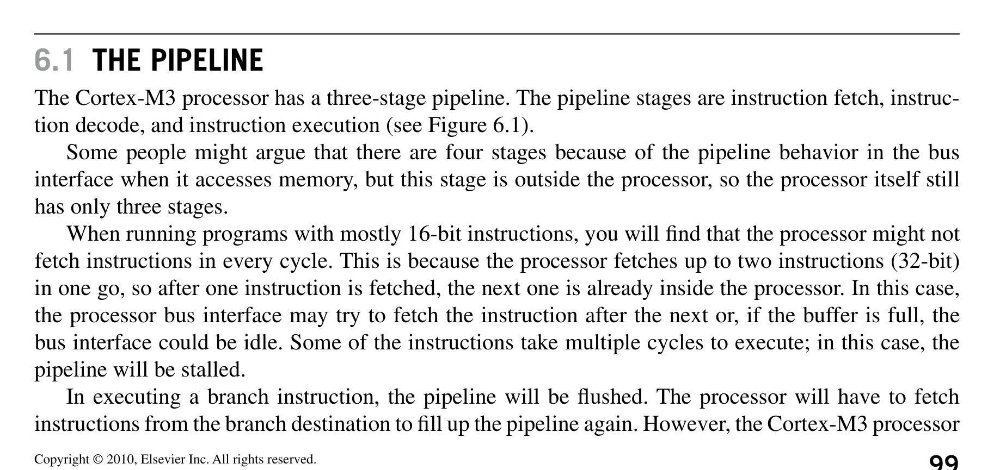
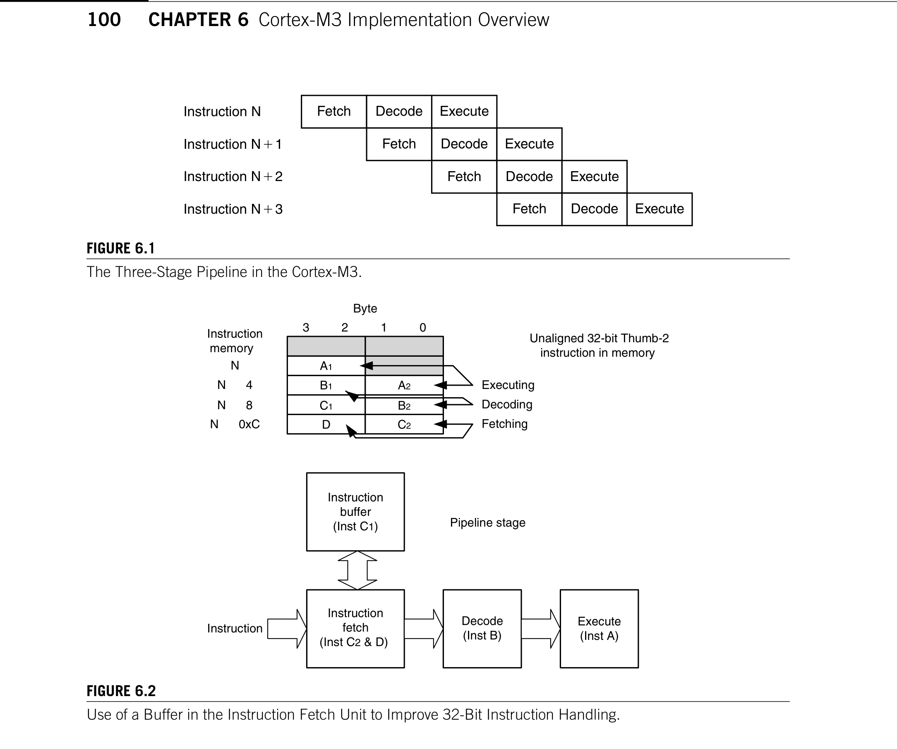
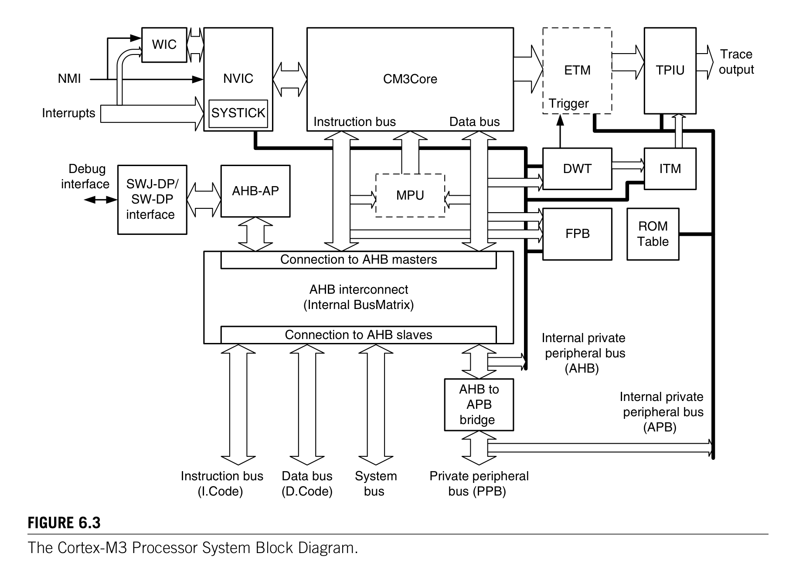
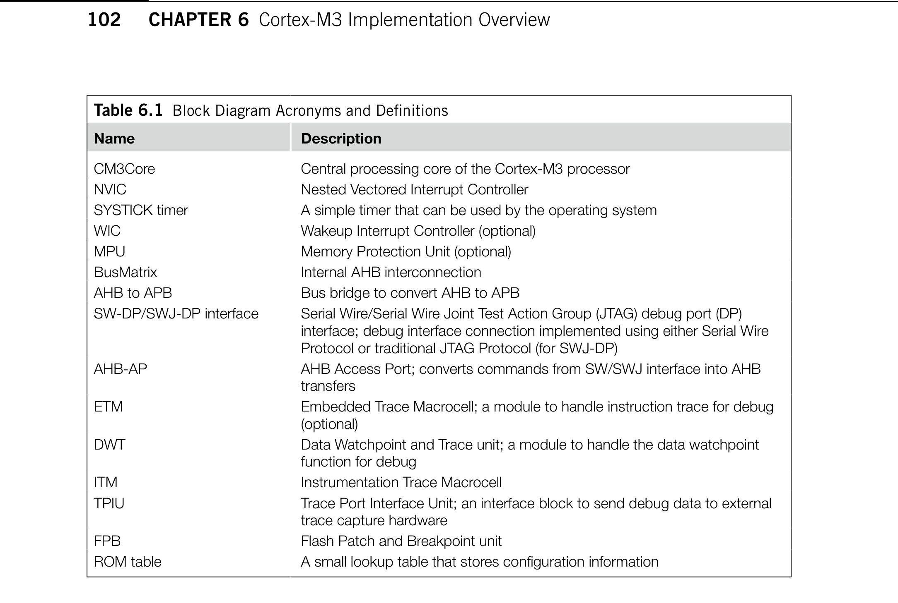
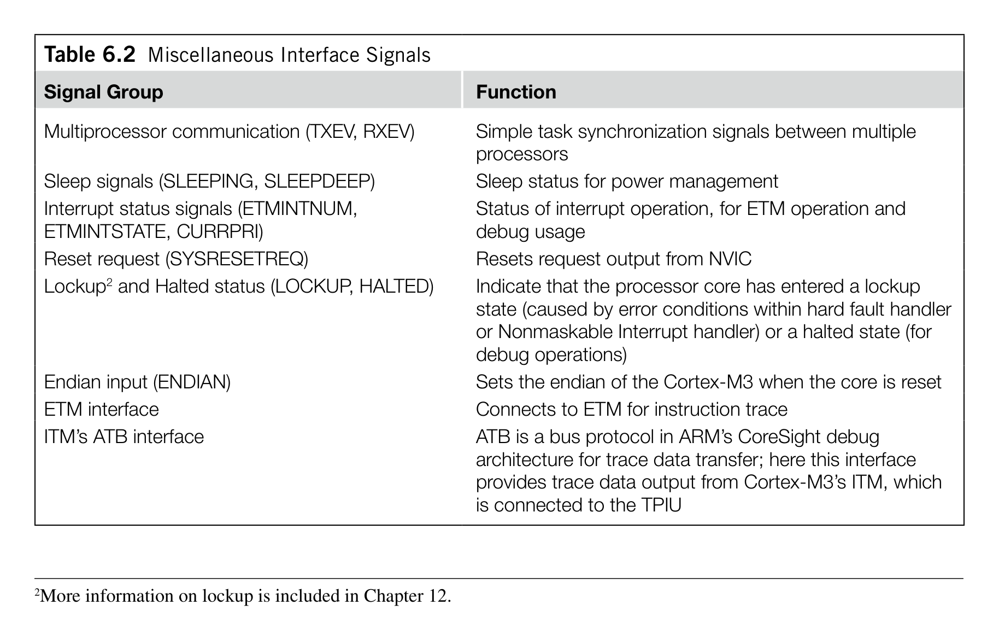
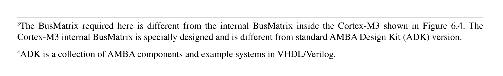
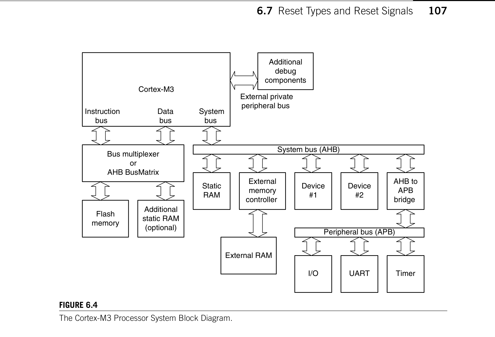
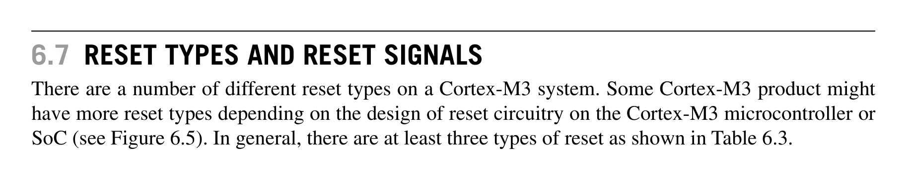
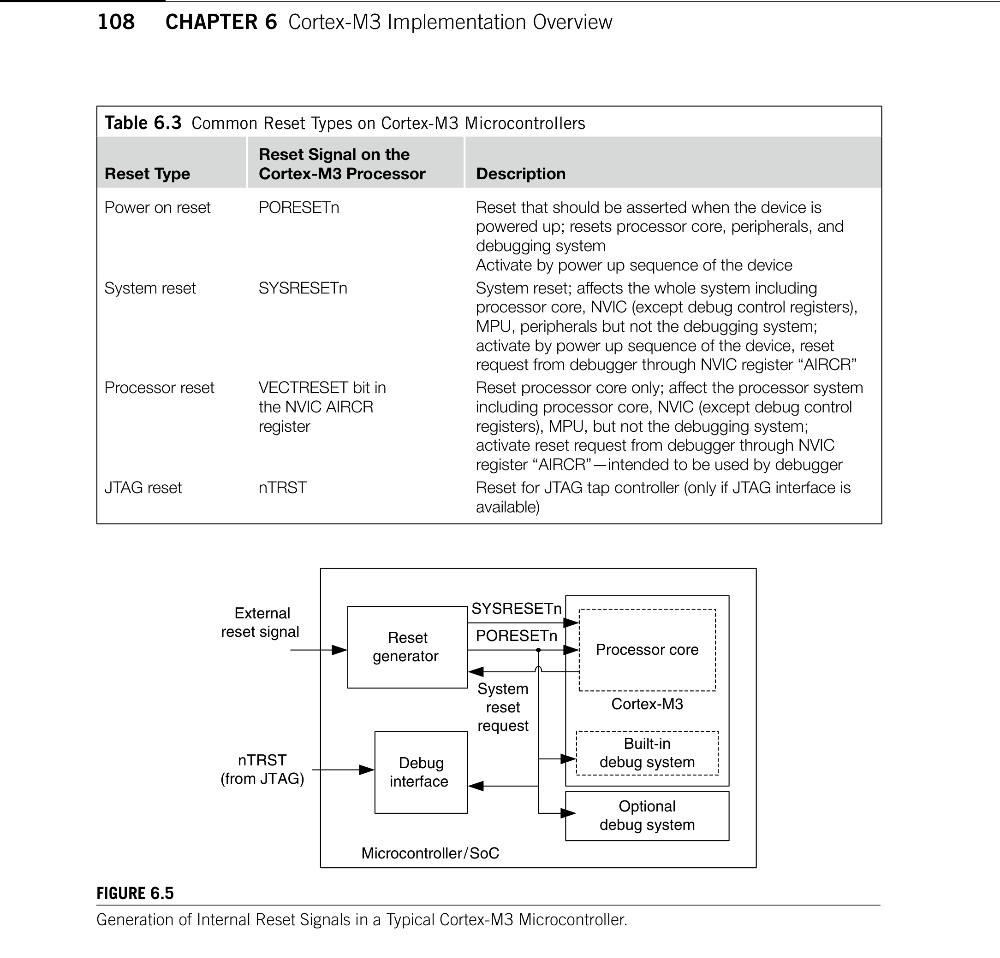

# Chapter 6. Cortex-M3 Implementation Overview

> **Source PDF**: THE_DEFINITIVE_GUIDE_TO_THE_ARM_CORTEX-МЗ_Stellaris_MCU_9000Series_TEINSTRUMENTS_ARM_SECOND_EDITION.pdf  
> **PDF Page Range**: 126 - 135

---

<!-- Page 126 -->
### [PDF Page 126]

*Description*: Technical diagram and schematic illustration detailing hardware circuit topology, signal routing, and logic operations for Figure 6.1.

> **Figure 6.1**

99
Copyright © 2010, Elsevier Inc. All rights reserved.
DOI: 10.1016/B978-0-12-382091-4.00012-8
In This Chapter
The Pipeline........................................................................................................................................... 99
A Detailed Block Diagram...................................................................................................................... 101
Bus Interfaces on the Cortex-M3............................................................................................................ 104
Other Interfaces on the Cortex-M3.......................................................................................................... 105
The External PPB................................................................................................................................... 105
Typical Connections.............................................................................................................................. 106
Reset Types and Reset Signals............................................................................................................... 107
Cortex-M3 Implementation
­Overview
6
This chapter is mainly written for system-on-chip (SoC) designers who are interested in using the
Cortex™-M3 processor in their project. Normal microcontroller users do not need to learn these
details. However, for those who are interested in understanding the internal operations of the Cortex-
M3 ­processor, this chapter provides a good overview of the design.

## 6.1  The Pipeline

The Cortex-M3 processor has a three-stage pipeline. The pipeline stages are instruction fetch, instruc-
tion decode, and instruction execution (see Figure 6.1).
Some people might argue that there are four stages because of the pipeline behavior in the bus
interface when it accesses memory, but this stage is outside the processor, so the processor itself still
has only three stages.
When running programs with mostly 16-bit instructions, you will find that the processor might not
fetch instructions in every cycle. This is because the processor fetches up to two instructions (32-bit)
in one go, so after one instruction is fetched, the next one is already inside the processor. In this case,
the processor bus interface may try to fetch the instruction after the next or, if the buffer is full, the
bus interface could be idle. Some of the instructions take multiple cycles to execute; in this case, the
pipeline will be stalled.
In executing a branch instruction, the pipeline will be flushed. The processor will have to fetch
instructions from the branch destination to fill up the pipeline again. However, the Cortex-M3 ­processor
CHAPTER

<!-- Page 127 -->
### [PDF Page 127]

*Description*: Technical diagram and schematic illustration detailing hardware circuit topology, signal routing, and logic operations for Figure 6.2.

> **Figure 6.2**

*Description*: Technical diagram and schematic illustration detailing hardware circuit topology, signal routing, and logic operations for Figure 6.1.

> **Figure 6.1**

100
CHAPTER 6  Cortex-M3 Implementation ­Overview
supports a number of instructions in v7-M architecture, so some of the short-distance branches can be
avoided by replacing them with conditional execution codes.1
Because of the pipeline nature of the processor and to ensure that the program is compatible with
Thumb® codes, the read value will be the address of the instruction plus 4, when the program counter
is read during instruction execution. If the program counter is used for address generation for memory
accesses, the word aligned value of the instruction address plus 4 would be used. This offset is constant,
independent of the combination of 16-bit Thumb instructions and 32-bit Thumb-2 instructions. This
ensures consistency between Thumb and Thumb-2.
Inside the instruction prefetch unit of the processor core, there is also an instruction buffer (see
­Figure 6.2). This buffer allows additional instructions to be queued before they are needed. This buffer
1For more information, refer to the “IF-THEN Instructions” section of Chapter 4.
Figure 6.1
The Three-Stage Pipeline in the Cortex-M3.
Instruction N
Instruction N1
Instruction N2
Instruction N3
Fetch
Decode
Fetch
Decode
Execute
Fetch
Decode
Execute
Fetch
Decode
Execute
Execute
Figure 6.2
Use of a Buffer in the Instruction Fetch Unit to Improve 32-Bit Instruction Handling.
Instruction
fetch
(Inst C2 & D)
Decode
(Inst B)
Execute
(Inst A)
Instruction
buffer
(Inst C1)
Instruction
B1
A2
C1
B2
D
A1
C2
Instruction
memory
N
N z 4
N z 8
N z 0xC
Byte
0
1
2
3
Executing
Decoding
Fetching
Pipeline stage
Unaligned 32-bit Thumb-2
instruction in memory

<!-- Page 128 -->
### [PDF Page 128]

*Description*: Technical diagram and schematic illustration detailing hardware circuit topology, signal routing, and logic operations for Figure 6.3.

> **Figure 6.3**

101

## 6.2  A Detailed Block Diagram

prevents the pipeline being stalled when the instruction sequence contains 32-bit Thumb-2 instructions
that are not word aligned. However, this buffer does not add an extra stage to the pipeline, so it does not
increase the branch penalty.

## 6.2  A Detailed Block Diagram

The Cortex-M3 processor contains not only the processor core but also a number of components for system
management, as well as debugging support components (see Figure 6.3). These components are linked
together using an Advanced High-Performance Bus (AHB), and an Advanced Peripheral Bus (APB). The
AHB and APB are part of the Advanced Microcontroller Bus Architecture (AMBA) standards [Ref. 4].
Note that the MPU, WIC, and ETM blocks are optional blocks that can be included in the microcon-
troller system at the time of implementation. A number of new components are shown in Table 6.1.
The Cortex-M3 processor is released as a processor subsystem (see Figure 6.3). The CPU core itself
is closely coupled to the interrupt controller (NVIC) and various debug logic blocks:
•
CM3Core: The Cortex-M3 core contains the registers, ALU, data path, and bus interface.
•
NVIC: The NVIC is a built-in interrupt controller. The number of interrupts is customized by chip
manufacturers. The NVIC is closely coupled to the CPU core and contains a number of system
Figure 6.3
The Cortex-M3 Processor System Block Diagram.
CM3Core
NMI
Interrupts
MPU
Instruction bus
Data bus
AHB interconnect
(Internal BusMatrix)
Connection to AHB slaves
Connection to AHB masters
AHB-AP
SWJ-DP/
SW-DP
interface
Debug
interface
AHB to
APB
bridge
Instruction bus
(I.Code)
Data bus
(D.Code)
System
bus
Private peripheral
bus (PPB)
DWT
FPB
Internal private
peripheral bus
(APB)
Internal private
peripheral bus
(AHB)
ITM
TPIU
NVIC
Trace
output
SYSTICK
WIC
ROM
Table
ETM
Trigger

<!-- Page 129 -->
### [PDF Page 129]

*Description*: Hardware reference table detailing register bit field settings, electrical operating limits, or memory configurations for Table 6.1.

> **Table 6.1**

102
CHAPTER 6  Cortex-M3 Implementation ­Overview
control registers. It supports the nested interrupt handling, which means that with the Cortex-M3,
nested interrupt handling is very simple. It also comes with a vectored interrupt feature so that
when an interrupt occurs, it can enter the corresponding interrupt handler routine directly, without
using a shared handler to determine which interrupt has occurred.
•
SYSTICK Timer: The System Tick (SYSTICK) Timer is a basic countdown timer that can be used
to generate interrupts at regular time intervals, even when the system is in sleep mode. It makes
OS porting between Cortex-M3 devices much easier because there is no need to change the OS’s
system timer code. The SYSTICK Timer is implemented as part of the NVIC.
•
WIC: A module interface with NVIC but separated from the main processor design to allow the
system to wake up from interrupt events while the processor (including the NVIC) is completely
stopped or powered down. This module is new from the Cortex-M3 revision 2 and is optional.
•
MPU: The MPU block is optional. This means that some versions of the Cortex-M3 might have
the MPU and some might not. If it is included, the MPU can be used to protect memory contents
by, for example, making memory regions read-only or preventing user applications from accessing
privileged applications data.
•
BusMatrix: A BusMatrix is used as the heart of the Cortex-M3 internal bus system. It is an AHB
interconnection network, allowing transfer to take place on different buses simultaneously unless
both bus masters are trying to access the same memory region. The BusMatrix also provides
Table 6.1  Block Diagram Acronyms and Definitions
Name
Description
CM3Core
Central processing core of the Cortex-M3 processor
NVIC
Nested Vectored Interrupt Controller
SYSTICK timer
A simple timer that can be used by the operating system
WIC
Wakeup Interrupt Controller (optional)
MPU
Memory Protection Unit (optional)
BusMatrix
Internal AHB interconnection
AHB to APB
Bus bridge to convert AHB to APB
SW-DP/SWJ-DP interface
Serial Wire/Serial Wire Joint Test Action Group (JTAG) debug port (DP)
interface; debug interface connection implemented using either Serial Wire
Protocol or traditional JTAG Protocol (for SWJ-DP)
AHB-AP
AHB Access Port; converts commands from SW/SWJ interface into AHB
transfers
ETM
Embedded Trace Macrocell; a module to handle instruction trace for debug
(optional)
DWT
Data Watchpoint and Trace unit; a module to handle the data watchpoint
function for debug
ITM
Instrumentation Trace Macrocell
TPIU
Trace Port Interface Unit; an interface block to send debug data to external
trace capture hardware
FPB
Flash Patch and Breakpoint unit
ROM table
A small lookup table that stores configuration information

<!-- Page 130 -->
### [PDF Page 130]

103

## 6.2  A Detailed Block Diagram

additional data transfer management, including a write buffer as well as bit-oriented operations
(bit-band).
•
AHB to APB: An AHB-to-APB bus bridge is used to connect a number of APB devices such as
debugging components to the private peripheral bus in the Cortex-M3 processor. In addition, the
Cortex-M3 allows chip manufacturers to attach additional APB devices to the external private
peripheral bus (PPB) using this APB bus.
The rest of the components in the block diagram are for debugging support and normally should not be
used by application code.
•
SW-DP/SWJ-DP: The Serial Wire Debug Port (SW-DP)/Serial Wire JTAG Debug Port (SWJ-DP)
work together with the AHB Access Port (AHB-AP) so that external debuggers can generate AHB
transfers to control debug activities. There is no JTAG scan chain inside the processor core of the
Cortex-M3; most debugging functions are controlled by the NVIC registers through AHB accesses.
SWJ-DP supports both the Serial Wire Protocol and the JTAG Protocol, whereas SW-DP can
support only the Serial Wire Protocol.
•	 AHB-AP: The AHB-AP provides access to the whole Cortex-M3 memory through a few registers.
This block is controlled by the SW-DP/SWJ-DP through a generic debug interface called the
Debug Access Port (DAP). To carry out debugging functions, the external debugging hardware
needs to access the AHB-AP through the SW-DP/SWJ-DP to generate the required AHB
transfers.
•
ETM: The ETM is an optional component for instruction trace, so some Cortex-M3 products might
not have real-time instruction trace capability. Trace information is output to the trace port through
TPIU. The ETM control registers are memory mapped, which can be controlled by the debugger
through the DAP.
•
DWT: The DWT allows data watchpoints to be set up. When a data address or data value match
is found, the match hit event can be used to generate watchpoint events to activate the debugger,
generate data trace information, or activate the ETM.
•
ITM: The ITM can be used in several ways. Software can write to this module directly to output
information to TPIU, or the DWT matching events can be used to generate data trace packets
through ITM for output into a trace data stream.
•
TPIU: The TPIU is used to interface with external trace hardware such as trace port analyzers.
Internal to the Cortex-M3, trace information is formatted as Advanced Trace Bus (ATB) packets,
and the TPIU reformats the data to allow data to be captured by external devices.
•
FPB: The FPB is used to provide Flash Patch and Breakpoint functionalities. Flash Patch means
that if an instruction access by the CPU matches a certain address, the address can be remapped to
a different location so that a different value is fetched. Alternatively, the matched address can be
used to trigger a breakpoint event. The Flash Patch feature is very useful for testing, such as adding
diagnosis program code to a device that cannot be used in normal situations unless the FPB is used
to change the program control.
•
ROM table: A small ROM table is provided. This is simply a small lookup table to provide memory
map  information for various system devices and debugging components. Debugging systems use
this table to locate the memory addresses of debugging components. In most cases, the memory map

<!-- Page 131 -->
### [PDF Page 131]

104
CHAPTER 6  Cortex-M3 Implementation ­Overview
should be fixed to the standard memory location, as documented in the Cortex-M3 Technical Reference
Manual (TRM) [Ref. 1], but because some of the debugging components are optional and additional
components can be added, individual chip manufacturers might want to customize their chip’s
debugging features. In this case, the ROM table must be customized and used for debugging software
to determine the correct memory map and hence detect the type of debugging components available.

## 6.3  Bus Interfaces on the Cortex-M3

Unless you are designing an SoC product using the Cortex-M3 processor, it is unlikely that you can
directly access the bus interface signals described here. Normally, the chip manufacturer will hook up
all the bus signals to memory blocks and peripherals, and in a few cases, you might find that the chip
manufacturer connected the bus to a bus bridge and allows external bus systems to be connected off-
chip. The bus interfaces on the Cortex-M3 processor are based on AHB-Lite and APB protocols, which
are documented in the AMBA Specification [Ref. 4].
6.3.1  The I-Code Bus
The I-Code bus is a 32-bit bus based on the AHB-Lite bus protocol for instruction fetches in memory
regions from 0x00000000 to 0x1FFFFFFF. Instruction fetches are performed in word size, even for
16-bit Thumb instructions. Therefore, during execution, the CPU core could fetch up to two Thumb
instructions at a time.
6.3.2  The D-Code Bus
The D-Code bus is a 32-bit bus based on the AHB-Lite bus protocol; it is used for data access in
­memory regions from 0x00000000 to 0x1FFFFFFF. Although the Cortex-M3 processor supports
unaligned transfers, you won’t get any unaligned transfer on this bus, because the bus interface on the
processor core converts the unaligned transfers into aligned transfers for you. Therefore, devices (such
as memory) that attach to this bus need only support AHB-Lite (AMBA 2.0) aligned transfers.
6.3.3  The System Bus
The system bus is a 32-bit bus based on the AHB-Lite bus protocol; it is used for instruction fetch and
data access in memory regions from 0x20000000 to 0xDFFFFFFF and 0xE0100000 to 0xFFFFFFFF.
Similar to the D-Code bus, all the transfers on the system bus are aligned.
6.3.4  The External PPB
The External PPB is a 32-bit bus based on the APB bus protocol. This is intended for private periph-
eral accesses in memory regions 0xE0040000 to 0xE00FFFFF. However, since some part of this APB
memory is already used for TPIU, ETM, and the ROM table, the memory region that can be used for
attaching extra peripherals on this bus is only 0xE0042000 to 0xE00FF000. Transfers on this bus are
word aligned.

<!-- Page 132 -->
### [PDF Page 132]

*Description*: Hardware reference table detailing register bit field settings, electrical operating limits, or memory configurations for Table 6.2.

> **Table 6.2**

105

## 6.5  The External PPB

6.3.5  The DAP Bus
The DAP bus interface is a 32-bit bus based on an enhanced version of the APB specification. This is
for attaching debug interface blocks such as SWJ-DP or SW-DP. Do not use this bus for other purposes.
More information on this interface can be found in Chapter 15, or in the ARM document CoreSight
Technology System Design Guide [Ref. 3].

## 6.4  Other Interfaces on the Cortex-M3

Apart from bus interfaces, the Cortex-M3 processor has a number of other interfaces for various pur-
poses. These signals are unlikely to appear on the pins of the silicon chip, because they are mostly for
connecting to various parts of the SoC or are unused. The details of the signals are contained in the
Cortex-M3 Technical Reference Manual [Ref. 1]. Table 6.2 contains a short summary of some of them.

## 6.5  The External PPB

The Cortex-M3 processor has an External PPB interface. The External PPB interface is based on
the APB protocol in AMBA specification 2.0 (for Cortex-M3 revision 0 and revision 1) or 3.0 (for
­Cortex-M3 revision 2). It is intended for system devices that should not be shared, such as debugging
components.
Table 6.2  Miscellaneous Interface Signals
Signal Group
Function
Multiprocessor communication (TXEV, RXEV)
Simple task synchronization signals between multiple
processors
Sleep signals (SLEEPING, SLEEPDEEP)
Sleep status for power management
Interrupt status signals (ETMINTNUM,
ETMINTSTATE, CURRPRI)
Status of interrupt operation, for ETM operation and
debug usage
Reset request (SYSRESETREQ)
Resets request output from NVIC
Lockup2 and Halted status (LOCKUP, HALTED)
Indicate that the processor core has entered a lockup
state (caused by error conditions within hard fault handler
or Nonmaskable Interrupt handler) or a halted state (for
debug operations)
Endian input (ENDIAN)
Sets the endian of the Cortex-M3 when the core is reset
ETM interface
Connects to ETM for instruction trace
ITM’s ATB interface
ATB is a bus protocol in ARM’s CoreSight debug
architecture for trace data transfer; here this interface
provides trace data output from Cortex-M3’s ITM, which
is connected to the TPIU
2More information on lockup is included in Chapter 12.

<!-- Page 133 -->
### [PDF Page 133]

*Description*: Technical diagram and schematic illustration detailing hardware circuit topology, signal routing, and logic operations for Figure 6.4.

> **Figure 6.4**

106
CHAPTER 6  Cortex-M3 Implementation ­Overview
This bus interface supports the use of CoreSight compliant debug components. To achieve this,
this interface is slightly different from normal APB—it contains an extra signal called PADDR31 that
indicates the source of a transfer. If this signal is 0, it means that the transfer is generated from soft-
ware running on the Cortex-M3. If this signal is 1, it means that the transfer is generated by debugging
hardware. Based on this signal, a peripheral can be designed so that only a debugger can use it, or when
being used by software, only some of the features are allowed.
This bus is not intended for general use, as in peripherals. Although there is nothing to stop
chip designers from designing and attaching general peripherals on this bus, users might find it a
problem for programming later, because of privileged access-level management—for example, to
program the device in the user state or to separate the devices from other memory regions when the
MPU is used.
The External PPB does not support unaligned accesses. Because the data width of the bus is 32-bit
and APB based, when you’re designing peripherals for this memory region, it is necessary to make sure
that all register addresses in the peripheral are word aligned. In addition, when writing software access-
ing devices in this region, it is recommended that you make sure that all the accesses are in word size.
The PPB accesses are always in little endian.

## 6.6  Typical Connections

Because there are a number of bus interfaces on the Cortex-M3 processor, you might find it confusing
to see how it will connect with other devices such as memory or peripherals. Figure 6.4 shows a simpli-
fied example.
Since the Code memory region can be accessed by the instruction bus (if it is an instruction fetch)
and from the data bus (if it is a data access), an AHB bus switch called the BusMatrix3 or an AHB
bus multiplexer is needed. With the BusMatrix, the Flash memory and the additional Static Random
Access Memory (SRAM) (if implemented) can be accessed by either bus interface. The BusMatrix is
available from ARM in the AMBA Design Kit4 (ADK). When both data bus and instruction bus are
trying to access the same memory device at the same time, the data bus access could be given higher
priority for best performance.
Using the AHB BusMatrix, if the instruction bus and the data bus are accessing different memory
devices at the same time (for example, an instruction fetch from fetch and a data bus reading data from
the additional SRAM), the transfers can be carried out simultaneously. If a bus multiplexer is used,
however, the transfers cannot take place at the same time, but the circuit size would be smaller. Com-
mon Cortex-M3 microcontroller designs use system bus for SRAM connection.
The main SRAM block should be connected through the system bus interface, using the SRAM
memory address region. This allows data access to be carried out at the same time as instruction access.
It also allows setting up of Boolean data types by using the bit-band feature.
Some microcontrollers might have an external memory interface. That requires an external memory
controller because you cannot connect off chip memory devices directly to AHB. The external memory
4ADK is a collection of AMBA components and example systems in VHDL/Verilog.
3The BusMatrix required here is different from the internal BusMatrix inside the Cortex-M3 shown in Figure 6.4. The
Cortex-M3 internal BusMatrix is specially designed and is different from standard AMBA Design Kit (ADK) version.

<!-- Page 134 -->
### [PDF Page 134]

*Description*: Technical diagram and schematic illustration detailing hardware circuit topology, signal routing, and logic operations for Figure 6.4.

> **Figure 6.4**

*Description*: Technical diagram and schematic illustration detailing hardware circuit topology, signal routing, and logic operations for Figure 6.5.

> **Figure 6.5**

107

## 6.7  Reset Types and Reset Signals

controller can be connected to the system bus of the Cortex-M3. Additional AHB devices can also be
easily connected to the system bus without the need for a BusMatrix.
Simple peripherals can be connected to the Cortex-M3 through an AHB-to-APB bridge. This allows
the use of the simpler bus protocol APB for peripherals.
The diagram shown in Figure 6.4 is just a very simple example; chip designers might choose
­different bus connection designs. For software/firmware development, you will only need to know the
memory map.
Design blocks shown in the diagram, such as the BusMatrix, AHB-to-APB bus bridge, memory
controller, I/O interface, timer, and universal asynchronous receiver/transmitter (UART), are all avail-
able from ARM and a number of Internet Protocol providers. Because microcontrollers can have dif-
ferent ­providers for the peripherals, you need to access your microcontroller’s datasheet for the correct
­programmer model when you’re developing software for Cortex-M3 systems.

## 6.7  Reset Types and Reset Signals

There are a number of different reset types on a Cortex-M3 system. Some Cortex-M3 product might
have more reset types depending on the design of reset circuitry on the Cortex-M3 microcontroller or
SoC (see Figure 6.5). In general, there are at least three types of reset as shown in Table 6.3.
Figure 6.4
The Cortex-M3 Processor System Block Diagram.
Cortex-M3
Bus multiplexer
or
AHB BusMatrix
Flash
memory
Additional
static RAM
(optional)
Static
RAM
External
memory
controller
Device
#1
Device
#2
AHB to
APB
bridge
System bus (AHB)
Peripheral bus (APB)
I/O
UART
Timer
Additional
debug
components
External private
peripheral bus
System
bus
Data
bus
Instruction
bus
External RAM

<!-- Page 135 -->
### [PDF Page 135]

*Description*: Hardware reference table detailing register bit field settings, electrical operating limits, or memory configurations for Table 6.3.

> **Table 6.3**

*Description*: Technical diagram and schematic illustration detailing hardware circuit topology, signal routing, and logic operations for Figure 6.5.

> **Figure 6.5**

108
CHAPTER 6  Cortex-M3 Implementation ­Overview
The details of the reset signals on the processor can be found in the Cortex-M3 Technical Reference
Manual [Ref. 1]. The reset signals on the processors are connected to the reset generator inside the
microcontroller or SoC. Externally you may find only one or two reset signals.
Table 6.3  Common Reset Types on Cortex-M3 Microcontrollers
Reset Type
Reset Signal on the
Cortex-M3 Processor
Description
Power on reset
PORESETn
Reset that should be asserted when the device is
powered up; resets processor core, peripherals, and
debugging system
Activate by power up sequence of the device
System reset
SYSRESETn
System reset; affects the whole system including
processor core, NVIC (except debug control registers),
MPU, peripherals but not the debugging system;
activate by power up sequence of the device, reset
request from debugger through NVIC register “AIRCR”
Processor reset
VECTRESET bit in
the NVIC AIRCR
register
Reset processor core only; affect the processor system
including processor core, NVIC (except debug control
registers), MPU, but not the debugging system;
activate reset request from debugger through NVIC
register “AIRCR”—intended to be used by debugger
JTAG reset
nTRST
Reset for JTAG tap controller (only if JTAG interface is
available)
Figure 6.5
Generation of Internal Reset Signals in a Typical Cortex-M3 Microcontroller.
Built-in
debug system
Optional
debug system
Processor core
Cortex-M3
Reset
generator
External
reset signal
Debug
interface
SYSRESETn
PORESETn
nTRST
(from JTAG)
Microcontroller/SoC
System
reset
request

