# Chapter 7. Exceptions

> **Source PDF**: THE_DEFINITIVE_GUIDE_TO_THE_ARM_CORTEX-МЗ_Stellaris_MCU_9000Series_TEINSTRUMENTS_ARM_SECOND_EDITION.pdf  
> **PDF Page Range**: 136 - 157

---

<!-- Page 136 -->
### [PDF Page 136]

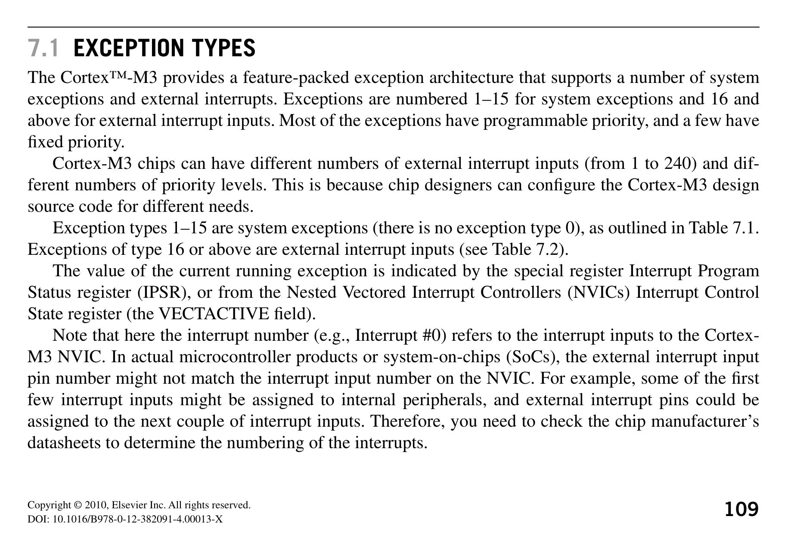
*Description*: Hardware reference table detailing register bit field settings, electrical operating limits, or memory configurations for Table 7.1.

> **Table 7.1**

109
Copyright © 2010, Elsevier Inc. All rights reserved.
DOI: 10.1016/B978-0-12-382091-4.00013-X
CHAPTER
In This Chapter
Exception Types.................................................................................................................................... 109
Definitions of Priority............................................................................................................................. 111
Vector Tables........................................................................................................................................ 117
Interrupt Inputs and Pending Behavior.................................................................................................... 118
Fault Exceptions.................................................................................................................................... 120
Supervisor Call and Pendable Service Call............................................................................................. 126
Exceptions
7

## 7.1  Exception Types

The Cortex™-M3 provides a feature-packed exception architecture that supports a number of system
exceptions and external interrupts. Exceptions are numbered 1–15 for system exceptions and 16 and
above for external interrupt inputs. Most of the exceptions have programmable priority, and a few have
fixed priority.
Cortex-M3 chips can have different numbers of external interrupt inputs (from 1 to 240) and dif-
ferent numbers of priority levels. This is because chip designers can configure the Cortex-M3 design
source code for different needs.
Exception types 1–15 are system exceptions (there is no exception type 0), as outlined in Table 7.1.
Exceptions of type 16 or above are external interrupt inputs (see Table 7.2).
The value of the current running exception is indicated by the special register Interrupt Program
Status register (IPSR), or from the Nested Vectored Interrupt Controllers (NVICs) Interrupt Control
State register (the VECTACTIVE field).
Note that here the interrupt number (e.g., Interrupt #0) refers to the interrupt inputs to the Cortex-
M3 NVIC. In actual microcontroller products or system-on-chips (SoCs), the external interrupt input
pin number might not match the interrupt input number on the NVIC. For example, some of the first
few interrupt inputs might be assigned to internal peripherals, and external interrupt pins could be
assigned to the next couple of interrupt inputs. Therefore, you need to check the chip manufacturer’s
datasheets to determine the numbering of the interrupts.

<!-- Page 137 -->
### [PDF Page 137]

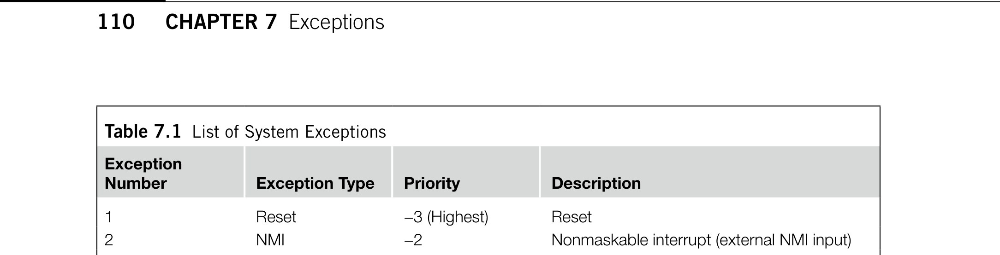
*Description*: Hardware reference table detailing register bit field settings, electrical operating limits, or memory configurations for Table 7.1.

> **Table 7.1**

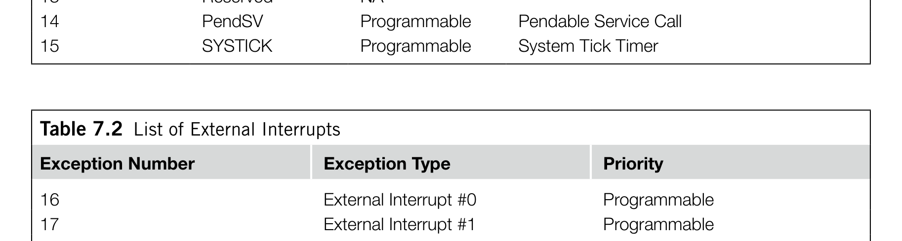
*Description*: Hardware reference table detailing register bit field settings, electrical operating limits, or memory configurations for Table 7.2.

> **Table 7.2**

110
CHAPTER 7  Exceptions
Table 7.1  List of System Exceptions
Exception
Number
Exception Type
Priority
Description
1
Reset
−3 (Highest)
Reset
2
NMI
−2
Nonmaskable interrupt (external NMI input)
3
Hard fault
−1
All fault conditions if the corresponding fault
handler is not enabled
4
MemManage fault
Programmable
Memory management fault; Memory
Protection Unit (MPU) violation or access
to illegal locations
5
Bus fault
Programmable
Bus error; occurs when Advanced High-
Performance Bus (AHB) interface receives an
error response from a bus slave (also called
prefetch abort if it is an instruction fetch or
data abort if it is a data access)
6
Usage fault
Programmable
Exceptions resulting from program error or
trying to access coprocessor (the Cortex-M3
does not support a coprocessor)
7–10
Reserved
NA
—
11
SVC
Programmable
Supervisor Call
12
Debug monitor
Programmable
Debug monitor (breakpoints, watchpoints, or
external debug requests)
13
Reserved
NA
—
14
PendSV
Programmable
Pendable Service Call
15
SYSTICK
Programmable
System Tick Timer
Table 7.2  List of External Interrupts
Exception Number
Exception Type
Priority
16
External Interrupt #0
Programmable
17
External Interrupt #1
Programmable
…
…
…
255
External Interrupt #239
Programmable
When an enabled exception occurs but cannot be carried out immediately (for instance, if a higher-
priority interrupt service routine is running or if the interrupt mask register is set), it will be pended (except
for some fault exceptions1). This means that a register (pending status) will hold the ­exception request
until the exception can be carried out. This is different from traditional ARM processors. ­Previously, the
1There are a few exceptions for the exception-pending behavior. If a fault takes place and the corresponding fault handler
cannot be executed immediately because a higher-priority handler is running, the hard fault handler (highest priority fault
handler) might be executed instead. More details on this topic are covered later in this chapter, where we look at fault excep-
tions; full details can be found in the ARM v7-M Architecture Application Level Reference Manual.

<!-- Page 138 -->
### [PDF Page 138]

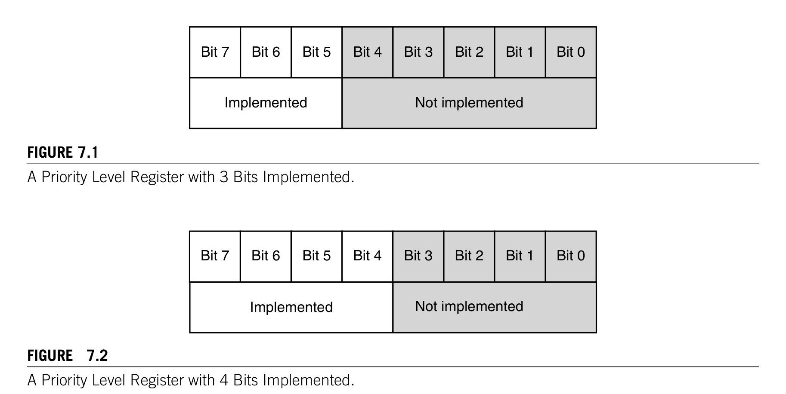
*Description*: Technical diagram and schematic illustration detailing hardware circuit topology, signal routing, and logic operations for Figure 7.1.

> **Figure 7.1**

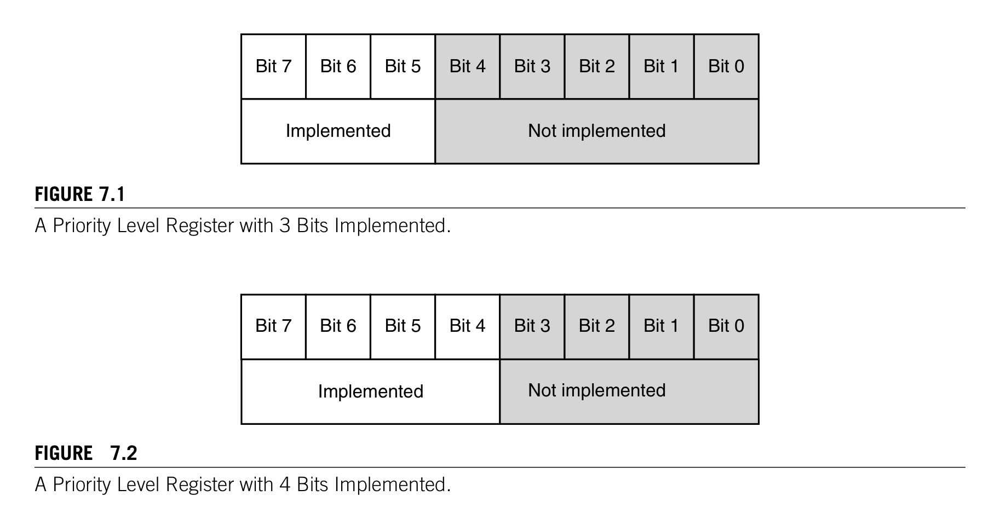
*Description*: Technical diagram and schematic illustration detailing hardware circuit topology, signal routing, and logic operations for Figure 7.2.

> **Figure 7.2**

111

## 7.2  Definitions of Priority

devices that generate interrupts, such as interrupt request (IRQ)/fast interrupt request (FIQ), must hold
the request until they are served. Now, with the pending registers in the NVIC, an occurred interrupt will
be handled even if the source requesting the interrupt deasserts its request signal.

## 7.2  Definitions of Priority

In the Cortex-M3, whether and when an exception can be carried out can be affected by the priority
of the exception. A higher-priority (smaller number in priority level) exception can preempt a lower-
­priority (larger number in priority level) exception; this is the nested exception/interrupt scenario.
Some of the exceptions (reset, NMI, and hard fault) have fixed priority levels. They are negative num-
bers to indicate that they are of higher priority than other exceptions. Other exceptions have program-
mable priority levels.
The Cortex-M3 supports three fixed highest-priority levels and up to 256 levels of programmable
priority (a maximum of 128 levels of preemption). However, most Cortex-M3 chips have fewer sup-
ported levels—for example, 8, 16, 32, and so on. When a Cortex-M3 chip or SoC is being designed,
designers can customize it to obtain the number of levels required. This reduction of levels is imple-
mented by cutting out the Least Significant Bit (LSB) part of the priority configuration registers.
For example, if only 3 bits of priority level are implemented in the design, a priority-level configu-
ration register will look like Figure 7.1.
Because bit 4 to bit 0 are not implemented, they are always read as zero, and writes to these bits will
be ignored. With this setup, we have possible priority levels of 0x00 (high priority), 0x20, 0x40, 0x60,
0x80, 0xA0, 0xC0, and 0xE0 (the lowest).
Similarly, if 4 bits of priority level are implemented in the design, a priority-level configuration
register will look like Figure 7.2.
Figure 7.1
A Priority Level Register with 3 Bits Implemented.
Bit 7
Bit 6
Bit 5
Bit 4
Bit 3
Bit 2
Bit 1
Bit 0
Implemented
Not implemented
Figure   7.2
A Priority Level Register with 4 Bits Implemented.
Bit 7
Bit 6
Bit 5
Bit 4
Bit 3
Bit 2
Bit 1
Bit 0
Implemented
Not implemented

<!-- Page 139 -->
### [PDF Page 139]

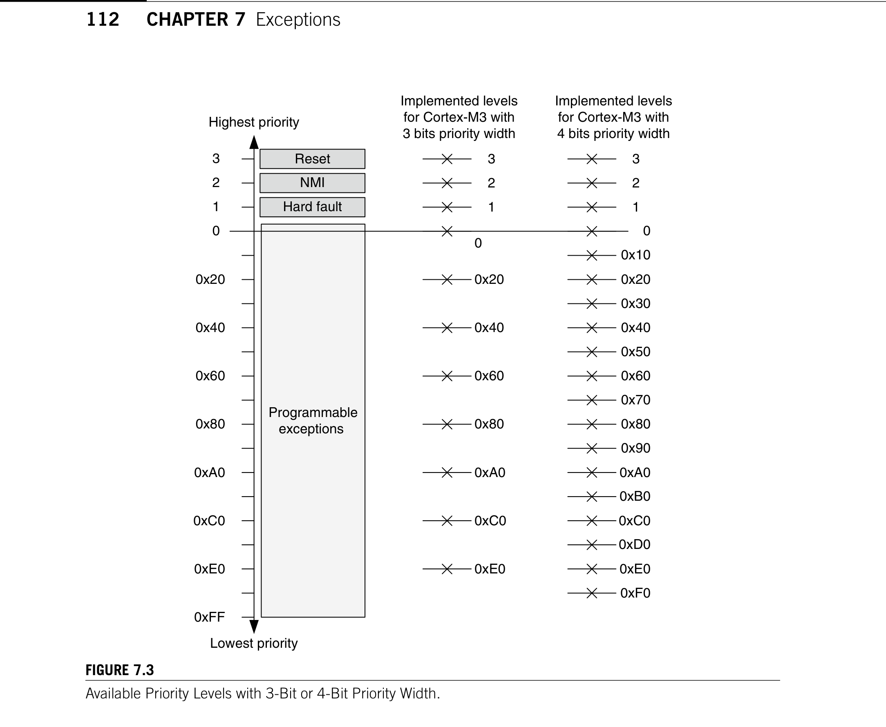
*Description*: Technical diagram and schematic illustration detailing hardware circuit topology, signal routing, and logic operations for Figure 7.3.

> **Figure 7.3**

112
CHAPTER 7  Exceptions
If more bits are implemented, more priority levels will be available (see Figure 7.3). However, more
priority bits can also increase gate counts and hence the power consumption. For the Cortex-M3, the
minimum number of implemented priority register widths is 3 bits (eight levels).
The reason for removing the LSB of the register instead of the Most Significant Bit (MSB) is to
make it easier to port software from one Cortex-M3 device to another. In this way, a program written
for devices with 4-bit priority configuration registers is likely to be able to run on devices with 3-bit
priority configuration registers. If the MSB is removed instead of the LSB, you might get an inversion
of priority arrangement when porting an application from one Cortex-M3 chip to another. For example,
if an application uses priority level 0x05 for IRQ #0 and level 0x03 for IRQ #1, IRQ #1 should have
higher priority. But when MSB bit 2 is removed, IRQ #0 will become level 0x01 and have a higher
priority than IRQ #1.
Figure 7.3
Available Priority Levels with 3-Bit or 4-Bit Priority Width.
Programmable
exceptions
0
z 1
z 2
z 3
z 1
z 2
z 3
z 1
z 2
z 3
0x20
0x40
0x60
0x80
0xA0
0xC0
0xE0
0xFF
Highest priority
Lowest priority
Reset
NMI
Hard fault
Implemented levels
for Cortex-M3 with
3 bits priority width
Implemented levels
for Cortex-M3 with
4 bits priority width
0
0x20
0x40
0x60
0x80
0xA0
0xC0
0xE0
0
0x20
0x40
0x60
0x80
0xA0
0xC0
0xE0
0x30
0x50
0x70
0x90
0xB0
0xD0
0xF0
0x10

<!-- Page 140 -->
### [PDF Page 140]

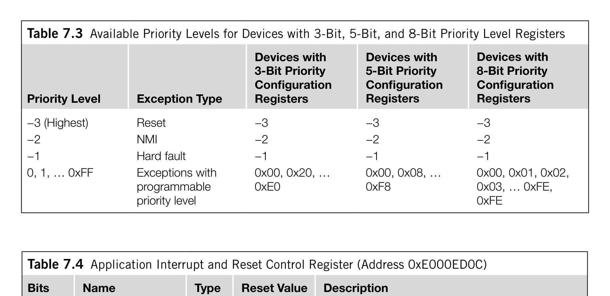
*Description*: Hardware reference table detailing register bit field settings, electrical operating limits, or memory configurations for Table 7.3.

> **Table 7.3**

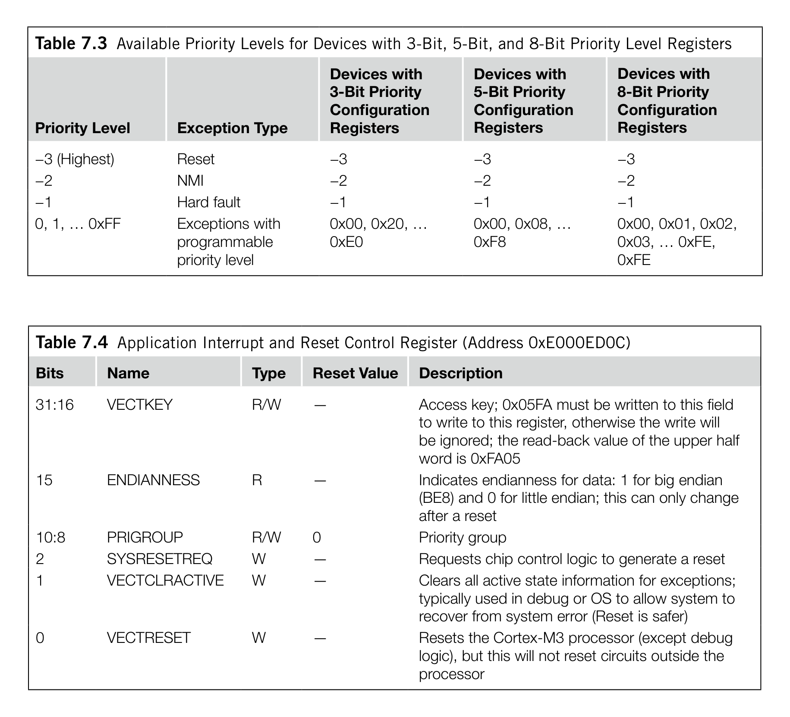
*Description*: Hardware reference table detailing register bit field settings, electrical operating limits, or memory configurations for Table 7.4.

> **Table 7.4**

113
Examples of available exception priority levels for devices with 3-bit, 5-bit, and 8-bit priority reg-
isters are shown in Table 7.3.
Some readers might wonder whether, if the priority level configuration registers are 8 bits wide,
why there are only 128 preemption levels? This is because the 8-bit register is further divided into two
parts: preempt priority and subpriority.
Using a configuration register in the NVIC called Priority Group (a part of the Application
Interrupt and Reset Control register in the NVIC, see Table 7.4), the priority-level configuration
registers for each exception with programmable priority levels is divided into two halves. The
upper half (left bits) is the preempt priority, and the lower half (right bits) is the subpriority (see
Table 7.5).
Table 7.3  Available Priority Levels for Devices with 3-Bit, 5-Bit, and 8-Bit Priority Level Registers
Priority Level
Exception Type
Devices with
3-Bit Priority
Configuration
Registers
Devices with
5-Bit Priority
Configuration
Registers
Devices with
8-Bit Priority
Configuration
Registers
−3 (Highest)
Reset
−3
−3
−3
−2
NMI
−2
−2
−2
−1
Hard fault
−1
−1
−1
0, 1, … 0xFF
Exceptions with
programmable
priority level
0x00, 0x20, …
0xE0
0x00, 0x08, …
0xF8
0x00, 0x01, 0x02,
0x03, … 0xFE,
0xFE
Table 7.4  Application Interrupt and Reset Control Register (Address 0xE000ED0C)
Bits
Name
Type
Reset Value
Description
31:16
VECTKEY
R/W
—
Access key; 0x05FA must be written to this field
to write to this register, otherwise the write will
be ignored; the read-back value of the upper half
word is 0xFA05
15
ENDIANNESS
R
—
Indicates endianness for data: 1 for big endian
(BE8) and 0 for little endian; this can only change
after a reset
10:8
PRIGROUP
R/W
0
Priority group
2
SYSRESETREQ
W
—
Requests chip control logic to generate a reset
1
VECTCLRACTIVE
W
—
Clears all active state information for exceptions;
typically used in debug or OS to allow system to
recover from system error (Reset is safer)
0
VECTRESET
W
—
Resets the Cortex-M3 processor (except debug
logic), but this will not reset circuits outside the
processor

## 7.2  Definitions of Priority

<!-- Page 141 -->
### [PDF Page 141]

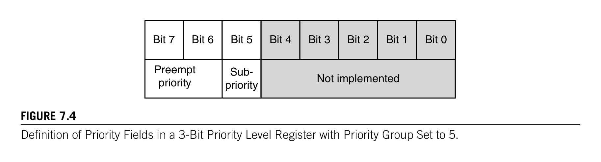
*Description*: Technical diagram and schematic illustration detailing hardware circuit topology, signal routing, and logic operations for Figure 7.4.

> **Figure 7.4**

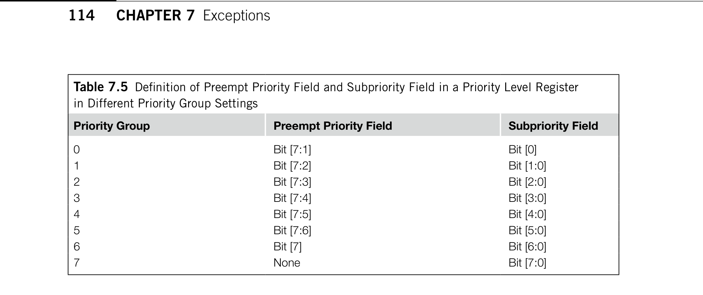
*Description*: Hardware reference table detailing register bit field settings, electrical operating limits, or memory configurations for Table 7.5.

> **Table 7.5**

114
CHAPTER 7  Exceptions
The preempt priority level defines whether an interrupt can take place when the processor is already
running another interrupt handler. The subpriority level value is used only when two exceptions with
the same preempt priority level occurred at the same time. In this case, the exception with higher sub-
priority (lower value) will be handled first.
As a result of the priority grouping, the maximum width of preempt priority is 7, so there can be
128 levels. When the priority group is set to 7, all exceptions with a programmable priority level will
be in the same level, and no preemption between these exceptions will take place, except that hard fault,
NMI, and reset, which have priority of -1, -2, and −3, respectively, can preempt these exceptions.
When deciding the effective preempt priority level and subpriority level, you must take the follow-
ing factors into account:
Implemented priority-level configuration registers
•
Priority group setting
•
For example, if the width of the configuration registers is 3 (bit 7 to bit 5 are available) and priority
group is set to 5, you can have four levels of preempt priority levels (bit 7 to bit 6), and inside each
preempt level there are two levels of subpriority (bit 5).
With the setting as shown in Figure 7.4, the available priority levels are illustrated in Figure 7.5. For
the same design, if the priority group is set to 0x1, there can be only eight preempt priority levels and
no further subpriority levels inside each preempt level. (Bit [1:0] of preempt priority is always 0.) The
definition of the priority level configuration registers is shown in Figure 7.6, and the available priority
levels are illustrated in Figure 7.7.
Table 7.5  Definition of Preempt Priority Field and Subpriority Field in a Priority Level Register
in Different Priority Group Settings
Priority Group
Preempt Priority Field
Subpriority Field
0
Bit [7:1]
Bit [0]
1
Bit [7:2]
Bit [1:0]
2
Bit [7:3]
Bit [2:0]
3
Bit [7:4]
Bit [3:0]
4
Bit [7:5]
Bit [4:0]
5
Bit [7:6]
Bit [5:0]
6
Bit [7]
Bit [6:0]
7
None
Bit [7:0]
Figure 7.4
Definition of Priority Fields in a 3-Bit Priority Level Register with Priority Group Set to 5.
Bit 7
Bit 6
Bit 5
Bit 4
Bit 3
Bit 2
Bit 1
Bit 0
Not implemented
Preempt
priority
Sub-
priority

<!-- Page 142 -->
### [PDF Page 142]

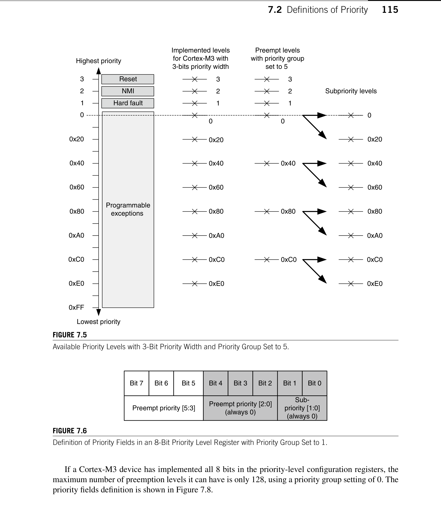
*Description*: Technical diagram and schematic illustration detailing hardware circuit topology, signal routing, and logic operations for Figure 7.8.

> **Figure 7.8**

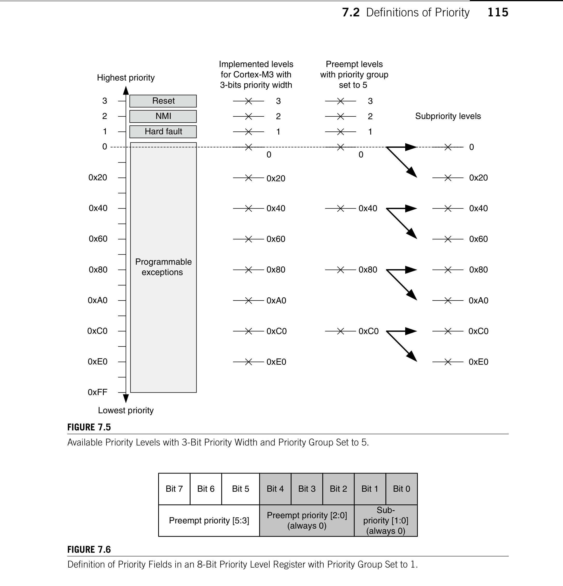
*Description*: Technical diagram and schematic illustration detailing hardware circuit topology, signal routing, and logic operations for Figure 7.5.

> **Figure 7.5**

*Description*: Technical diagram and schematic illustration detailing hardware circuit topology, signal routing, and logic operations for Figure 7.6.

> **Figure 7.6**

115
If a Cortex-M3 device has implemented all 8 bits in the priority-level configuration registers, the
maximum number of preemption levels it can have is only 128, using a priority group setting of 0. The
priority fields definition is shown in Figure 7.8.
Figure 7.5
Available Priority Levels with 3-Bit Priority Width and Priority Group Set to 5.
Programmable
exceptions
0
z 1
z 2
z 3
0x20
0x40
0x60
0x80
0xA0
0xC0
0xE0
0xFF
Highest priority
Lowest priority
Reset
NMI
Hard fault
Implemented levels
for Cortex-M3 with
3-bits priority width
Preempt levels
with priority group
set to 5
0
z 1
z 2
z 3
0x20
0x40
0x60
0x80
0xA0
0xC0
0xE0
0
z 1
z 2
z 3
0x40
0x80
0xC0
Subpriority levels
0
0x20
0x40
0x60
0x80
0xA0
0xC0
0xE0

## 7.2  Definitions of Priority

Figure 7.6
Definition of Priority Fields in an 8-Bit Priority Level Register with Priority Group Set to 1.
Bit 7
Bit 6
Bit 5
Bit 4
Bit 3
Bit 2
Bit 1
Bit 0
Preempt priority [5:3]
Preempt priority [2:0]
(always 0)
Sub-
priority [1:0]
(always 0)

<!-- Page 143 -->
### [PDF Page 143]

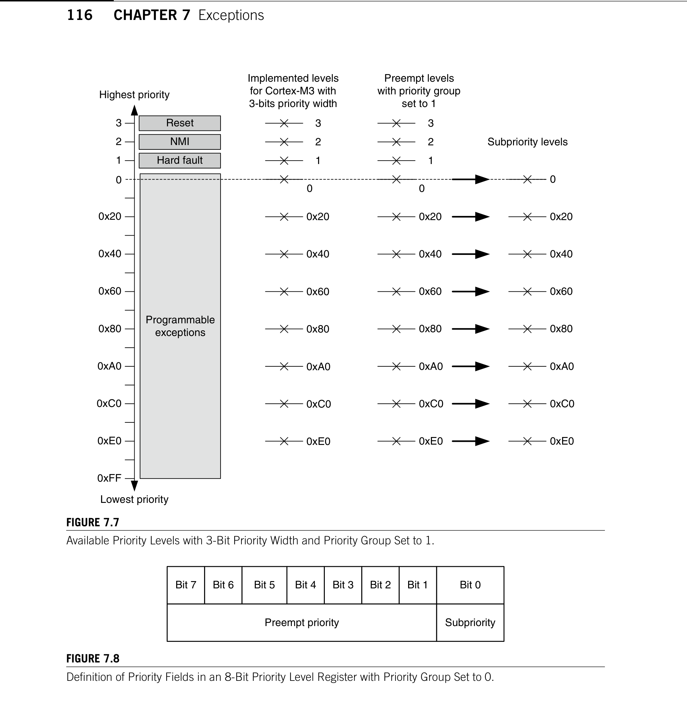
*Description*: Technical diagram and schematic illustration detailing hardware circuit topology, signal routing, and logic operations for Figure 7.7.

> **Figure 7.7**

*Description*: Technical diagram and schematic illustration detailing hardware circuit topology, signal routing, and logic operations for Figure 7.8.

> **Figure 7.8**

116
CHAPTER 7  Exceptions
When two interrupts are asserted at the same time with exactly the same preempt priority level as
well as subpriority level, the interrupt with the smaller exception number has higher priority. (IRQ #0
has higher priority than IRQ #1.)
To avoid unexpected changes of priority levels for interrupts, be careful when writing to the
Application Interrupt and Reset Control register (address 0xE000ED0C). In most cases, after the
Figure 7.7
Available Priority Levels with 3-Bit Priority Width and Priority Group Set to 1.
Programmable
exceptions
0
z 1
z 2
z 3
0x20
0x40
0x60
0x80
0xA0
0xC0
0xE0
0xFF
Highest priority
Lowest priority
Reset
NMI
Hard fault
Implemented levels
for Cortex-M3 with
3-bits priority width
Preempt levels
with priority group
set to 1
0
z 1
z 2
z 3
0x20
0x40
0x60
0x80
0xA0
0xC0
0xE0
0
z 1
z 2
z 3
Subpriority levels
0
0x20
0x40
0x60
0x80
0xA0
0xC0
0xE0
0x20
0x40
0x60
0x80
0xA0
0xC0
0xE0
Figure 7.8
Definition of Priority Fields in an 8-Bit Priority Level Register with Priority Group Set to 0.
Bit 7
Bit 6
Bit 5
Bit 4
Bit 3
Bit 2
Bit 1
Bit 0
Preempt priority
Subpriority

<!-- Page 144 -->
### [PDF Page 144]

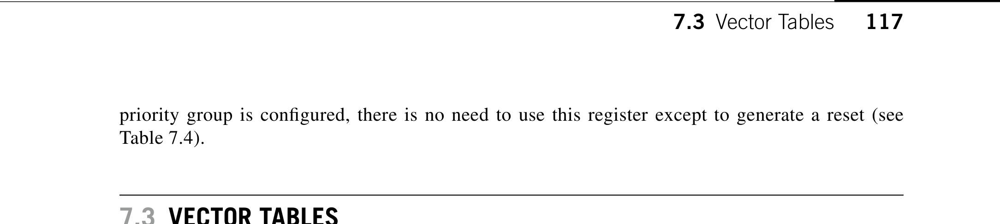
*Description*: Hardware reference table detailing register bit field settings, electrical operating limits, or memory configurations for Table 7.4.

> **Table 7.4**

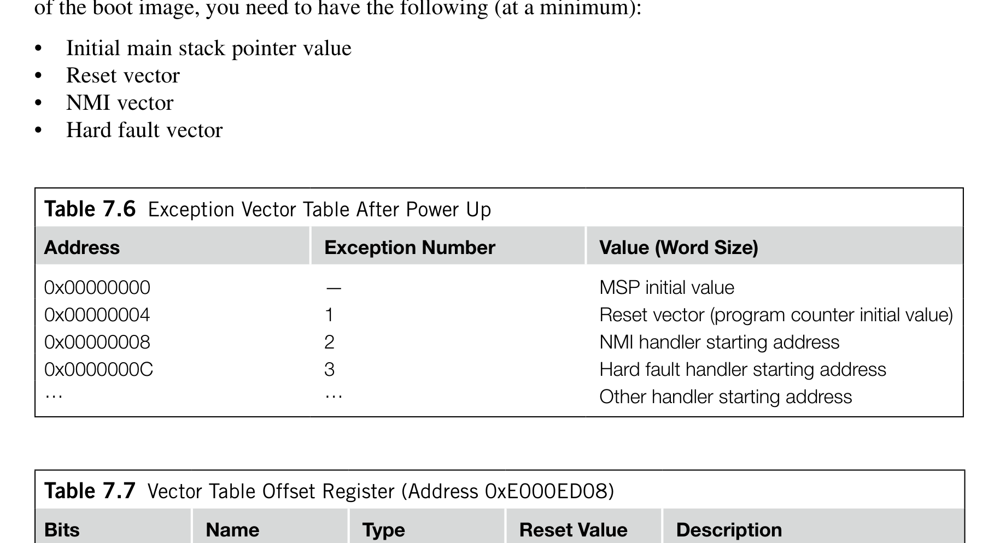
*Description*: Hardware reference table detailing register bit field settings, electrical operating limits, or memory configurations for Table 7.6.

> **Table 7.6**

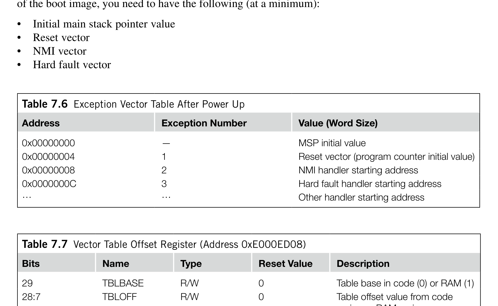
*Description*: Hardware reference table detailing register bit field settings, electrical operating limits, or memory configurations for Table 7.7.

> **Table 7.7**

117

## 7.3  Vector Tables

priority group is configured, there is no need to use this register except to generate a reset (see
Table 7.4).

## 7.3  Vector Tables

When an exception takes place and is being handled by the Cortex-M3, the processor will need to
locate the starting address of the exception handler. This information is stored in the vector table in the
memory. By default, the vector table starts at memory address 0, and the vector address is arranged
according to the exception number times four (see Table 7.6).
Since the address 0x0 should be boot code, usually it will be either Flash memory or ROM devices,
and the value cannot be changed at run time. However, the vector table can be relocated to other
memory locations in the code or Random Access Memory (RAM) region where the RAM is so that
we can change the handlers during run time. This is done by setting a register in the NVIC called the
vector table offset register (address 0xE000ED08). The address offset should be aligned to the vector
table size, extended to the next larger power of 2. For example, if there are 32 IRQ inputs, the total
number of exceptions will be 32 + 16 (system exceptions) = 48. Extending it to the power of 2 makes
it 64. Multiplying it by 4 (4 bytes per vector) makes it 256 bytes (0x100). Therefore, the vector table
offset can be programmed as 0x0, 0x100, 0x200, and so on. The vector table offset register contains the
items shown in Table 7.7.
In applications where you want to allow dynamic changing of exception handlers, in the beginning
of the boot image, you need to have the following (at a minimum):
Initial main stack pointer value
•
Reset vector
•
NMI vector
•
Hard fault vector
•
Table 7.6  Exception Vector Table After Power Up
Address
Exception Number
Value (Word Size)
0x00000000
—
MSP initial value
0x00000004
1
Reset vector (program counter initial value)
0x00000008
2
NMI handler starting address
0x0000000C
3
Hard fault handler starting address
…
…
Other handler starting address
Table 7.7  Vector Table Offset Register (Address 0xE000ED08)
Bits
Name
Type
Reset Value
Description
29
TBLBASE
R/W
0
Table base in code (0) or RAM (1)
28:7
TBLOFF
R/W
0
Table offset value from code
region or RAM region

<!-- Page 145 -->
### [PDF Page 145]

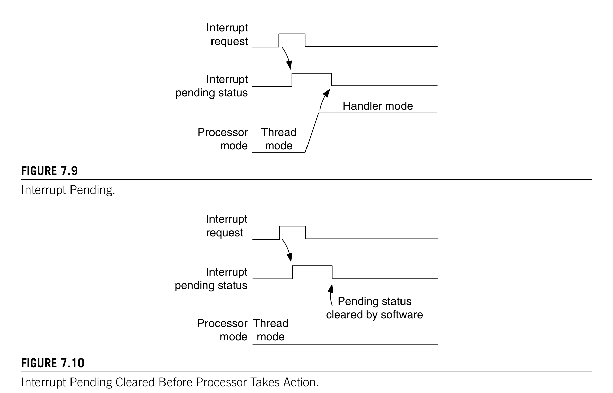
*Description*: Technical diagram and schematic illustration detailing hardware circuit topology, signal routing, and logic operations for Figure 7.9.

> **Figure 7.9**

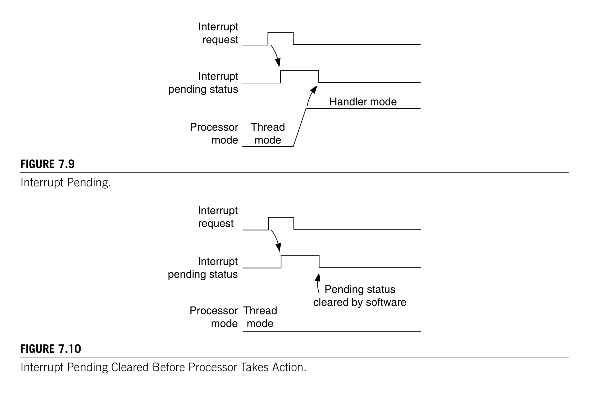
*Description*: Technical diagram and schematic illustration detailing hardware circuit topology, signal routing, and logic operations for Figure 7.10.

> **Figure 7.10**

118
CHAPTER 7  Exceptions
These are required because the NMI and hard fault can potentially occur during your boot process.
Other exceptions cannot take place until they are enabled.
When the booting process is done, you can define a part of your Static Random Access Memory as
the new vector table and relocate the vector table to the new one, which is writable.

## 7.4  Interrupt Inputs and Pending Behavior

This section describes the behavior of IRQ inputs and pending behavior. It also applies to NMI input,
except that an NMI will be executed immediately in most cases, unless the core is already executing an
NMI handler, halted by a debugger, or locked up because of some serious system error.
When an interrupt input is asserted, it will be pended, which means it is put into a state of waiting
for the processor to process the request. Even if the interrupt source deasserts the interrupt, the pended
interrupt status will still cause the interrupt handler to be executed when the priority is allowed. Once the
interrupt handler is started, the pending status is cleared automatically. This is shown in Figure 7.9.
However, if the pending status is cleared before the processor starts responding to the pended inter-
rupt (for example, the interrupt was not taken immediately because PRIMASK/FAULTMASK is set
to 1, and the pending status was cleared by software writing to NVIC interrupt control registers), the
interrupt can be cancelled (Figure 7.10). The pending status of the interrupt can be accessed in the
NVIC and is writable, so you can clear a pending interrupt or use software to pend a new interrupt by
setting the pending register.
Figure 7.9
Interrupt Pending.
Interrupt
request
Interrupt
pending status
Processor
mode
Thread
mode
Handler mode
Figure 7.10
Interrupt Pending Cleared Before Processor Takes Action.
Interrupt
request
Interrupt
pending status
Processor
mode
Thread
mode
Pending status
cleared by software

<!-- Page 146 -->
### [PDF Page 146]

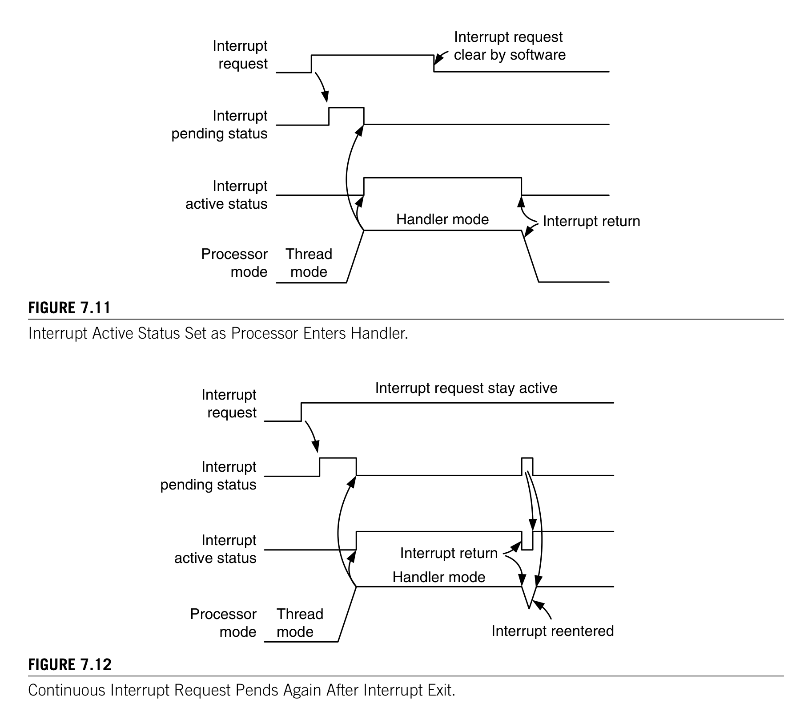
*Description*: Technical diagram and schematic illustration detailing hardware circuit topology, signal routing, and logic operations for Figure 7.11.

> **Figure 7.11**

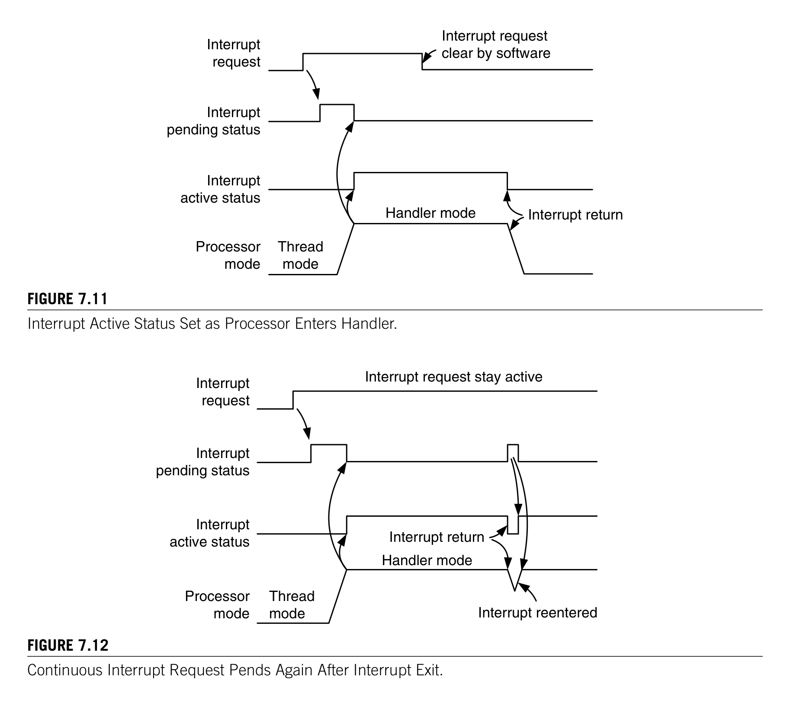
*Description*: Technical diagram and schematic illustration detailing hardware circuit topology, signal routing, and logic operations for Figure 7.12.

> **Figure 7.12**

119

## 7.4  Interrupt Inputs and Pending Behavior

When the processor starts to execute an interrupt, the interrupt becomes active and the pending bit
will be cleared automatically (Figure 7.11). When an interrupt is active, you cannot start processing
the same interrupt again, until the interrupt service routine is terminated with an interrupt return (also
called an exception exit, as discussed in Chapter 9). Then the active status is cleared, and the interrupt
can be processed again if the pending status is 1. It is possible to repend an interrupt before the end of
the interrupt service routine.
If an interrupt source continues to hold the interrupt request signal active, the interrupt will be
pended again at the end of the interrupt service routine as shown in Figure 7.12. This is just like the
traditional ARM7TDMI.
If an interrupt is pulsed several times before the processor starts processing it, it will be treated as
one single interrupt request as illustrated in Figure 7.13. If an interrupt is deasserted and then pulsed
again during the interrupt service routine, it will be pended again as shown in Figure 7.14.
Figure 7.11
Interrupt Active Status Set as Processor Enters Handler.
Interrupt
request
Interrupt
pending status
Processor
mode
Thread
mode
Handler mode
Interrupt
active status
Interrupt request
clear by software
Interrupt return
Figure 7.12
Continuous Interrupt Request Pends Again After Interrupt Exit.
Interrupt
request
Interrupt
pending status
Processor
mode
Thread
mode
Handler mode
Interrupt
active status
Interrupt request stay active
Interrupt return
Interrupt reentered

<!-- Page 147 -->
### [PDF Page 147]

*Description*: Technical diagram and schematic illustration detailing hardware circuit topology, signal routing, and logic operations for Figure 7.13.

> **Figure 7.13**

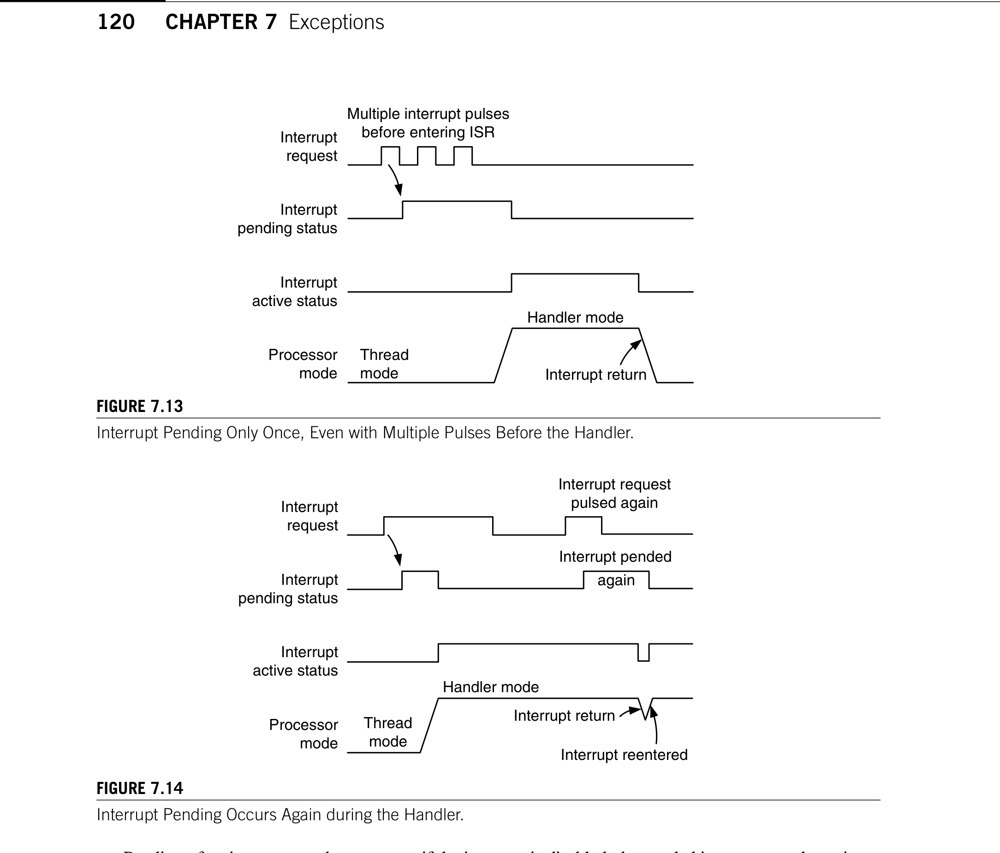
*Description*: Technical diagram and schematic illustration detailing hardware circuit topology, signal routing, and logic operations for Figure 7.14.

> **Figure 7.14**

120
CHAPTER 7  Exceptions
Pending of an interrupt can happen even if the interrupt is disabled; the pended interrupt can then trigger
the interrupt sequence when the enable is set later. As a result, before enabling an interrupt, it could be useful
to check whether the pending register has been set. The interrupt source might have been activated previously
and have set the pending status. If necessary, you can clear the pending status before you enable an interrupt.

## 7.5  Fault Exceptions

A number of system exceptions are useful for fault handling. There are several categories of faults:
Bus faults
•
Memory management faults
•
Usage faults
•
Hard faults
•
Figure 7.13
Interrupt Pending Only Once, Even with Multiple Pulses Before the Handler.
Interrupt
request
Interrupt
pending status
Processor
mode
Thread
mode
Handler mode
Interrupt
active status
Interrupt return
Multiple interrupt pulses
before entering ISR
Figure 7.14
Interrupt Pending Occurs Again during the Handler.
Interrupt
request
Interrupt
pending status
Processor
mode
Thread
mode
Handler mode
Interrupt
active status
Interrupt return
Interrupt request
pulsed again
Interrupt reentered
Interrupt pended
again

<!-- Page 148 -->
### [PDF Page 148]

121

## 7.5  Fault Exceptions

7.5.1  Bus Faults
Bus faults are produced when an error response is received during a transfer on the AHB interfaces. It
can happen at these stages:
Instruction fetch, commonly called
•
prefetch abort
Data read/write, commonly called
•
data abort
In the Cortex-M3, bus faults can also occur during the following:
Stack PUSH in the beginning of interrupt processing, called a
•
stacking error
Stack POP at the end of interrupt processing, called an
•
unstacking error
Reading of an interrupt vector address (vector fetch) when the processor starts the interrupt-
•
handling sequence (a special case classified as a hard fault)
When these types of bus faults (except vector fetches) take place and if the bus fault handler is
enabled and no other exceptions with the same or higher priority are running, the bus fault handler will
be executed. If the bus fault handler is enabled but at the same time the core receives another exception
handler with higher priority, the bus fault exception will be pending. Finally, if the bus fault handler is
not enabled or when the bus fault happens in an exception handler that has the same or higher priority
than the bus fault handler, the hard fault handler will be executed instead. If another bus fault takes
place when running the hard fault handler, the core will enter a lockup state.2
To enable the bus fault handler, you need to set the BUSFAULTENA bit in the System Handler
Control and State register in the NVIC. Before doing that, make sure that the bus fault handler starting
address is set up in the vector table if the vector table has been relocated to RAM.
Hence, how do you find out what went wrong when the processor entered the bus fault handler?
The NVIC has a number of Fault Status registers (FSRs). One of them is the Bus Fault Status register
(BFSR). From this register, the bus fault handler can find out if the fault was caused by data/instruction
access or an interrupt stacking or unstacking operation.
For precise bus faults, the offending instruction can be located by the stacked program counter,
and if the BFARVALID bit in BFSR is set, it is also possible to determine the memory location that
caused the bus fault. This is done by reading another NVIC register called the Bus Fault Address
2More information on the lockup state is covered in Chapter 12.
What Can Cause AHB Error Responses?
Bus faults occur when an error response is received on the AHB bus. The common causes are as follows:
Attempts to access an invalid memory region (for example, a memory location with no memory attached)
•
The device is not ready to accept a transfer (for example, trying to access SDRAM without initializing the
•
SDRAM controller)
Attempts to carry out a transfer with a transfer size not supported by the target device (for example, doing a
•
byte access to a peripheral register that must be accessed as a word)
The device does not accept the transfer for various reasons (for example, a peripheral that can only be
•
programmed at the privileged access level)

<!-- Page 149 -->
### [PDF Page 149]

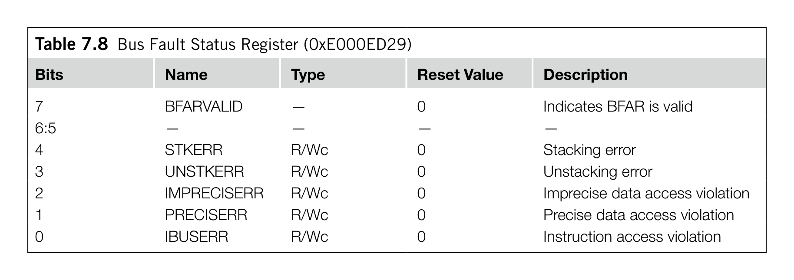
*Description*: Hardware reference table detailing register bit field settings, electrical operating limits, or memory configurations for Table 7.8.

> **Table 7.8**

122
CHAPTER 7  Exceptions
­register (BFAR). However, the same information is not available for imprecise bus faults because by
the time the processor receives the error, the processor could have already executed a number of other
instructions.
The programmer’s model for BFSR is as follows: It is 8 bits wide and can be accessed through
byte transfer to address 0xE000ED29 or with a word transfer to address 0xE000ED28 with BFSR in
the second byte (see Table 7.8). The error indication bit is cleared when a 1 is written to it.
7.5.2  Memory Management Faults
Memory management faults can be caused by memory accesses that violate the setup in the MPU or
by certain illegal accesses (for example, trying to execute code from nonexecutable memory regions),
which can trigger the fault, even if no MPU is presented.
Some of the common MPU faults include the following:
Access to memory regions not defined in MPU setup
•
Writing to read-only regions
•
An access in the user state to a region defined as privileged access only
•
When a memory management fault occurs and if the memory management handler is enabled,
the memory management fault handler will be executed. If the fault occurs at the same time a higher-
­priority exception takes place, the other exceptions will be handled first and the memory management
fault will be pended. If the processor is already running an exception handler with the same or higher
Table 7.8  Bus Fault Status Register (0xE000ED29)
Bits
Name
Type
Reset Value
Description
7
BFARVALID
—
0
Indicates BFAR is valid
6:5
—
—
—
—
4
STKERR
R/Wc
0
Stacking error
3
UNSTKERR
R/Wc
0
Unstacking error
2
IMPRECISERR
R/Wc
0
Imprecise data access violation
1
PRECISERR
R/Wc
0
Precise data access violation
0
IBUSERR
R/Wc
0
Instruction access violation
Precise and Imprecise Bus Faults
Bus faults caused by data accesses can be further classified as precise or imprecise. In imprecise bus faults,
the fault is caused by an already completed operation (such as a buffered write) that might have occurred
a number of clock cycles ago. Precise bus faults are caused by the last completed operation—for example,
a memory read is precise on the Cortex-M3 because the instruction cannot be completed until it receives
the data.

<!-- Page 150 -->
### [PDF Page 150]

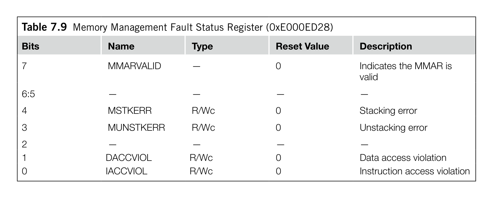
*Description*: Hardware reference table detailing register bit field settings, electrical operating limits, or memory configurations for Table 7.9.

> **Table 7.9**

123
­priority or if the memory management fault handler is not enabled, the hard fault handler will be
executed instead. If a memory management fault takes place inside the hard fault handler or the NMI
handler, the processor will enter the lockup state.
Like the bus fault handler, the memory management fault handler needs to be enabled. This is done
by the MEMFAULTENA bit in the System Handler Control and State register in the NVIC. If the vec-
tor table has been relocated to RAM, the memory management fault handler starting address should be
set up in the vector table first.
The NVIC contains a Memory Management Fault Status register (MFSR) to indicate the cause
of the memory management fault. If the status register indicates that the fault is a data access viola-
tion (DACCVIOL bit) or an instruction access violation (IACCVIOL bit), the offending code can be
located by the stacked program counter. If the MMARVALID bit in the MFSR is set, it is also possible
to determine the memory address location that caused the fault from the Memory Management Address
register (MMAR) in the NVIC.
The programmer’s model for the MFSR is shown in Table 7.9. It is 8 bits wide and can be accessed
through byte transfer or with a word transfer to address 0xE000ED28, with the MFSR in the lowest
byte. As with other FSRs, the fault status bit can be cleared by writing 1 to the bit.
7.5.3  Usage Faults
Usage faults can be caused by a number of things:
Undefined instructions
•
Coprocessor instructions (the Cortex-M3 processor does not support a coprocessor, but it is
•
possible to use the fault exception mechanism to run software compiled for other Cortex processors
through coprocessor emulation)
Trying to switch to the ARM state (software can use this faulting mechanism to test whether the
•
processor it is running on supports the ARM code; because the Cortex-M3 does not support the
ARM state, a usage fault takes place if there’s an attempt to switch)
Invalid interrupt return (link register contains invalid/incorrect values)
•
Unaligned memory accesses using multiple load or store instructions
•

## 7.5  Fault Exceptions

Table 7.9  Memory Management Fault Status Register (0xE000ED28)
Bits
Name
Type
Reset Value
Description
7
MMARVALID
—
0
Indicates the MMAR is
valid
6:5
—
—
—
—
4
MSTKERR
R/Wc
0
Stacking error
3
MUNSTKERR
R/Wc
0
Unstacking error
2
—
—
—
—
1
DACCVIOL
R/Wc
0
Data access violation
0
IACCVIOL
R/Wc
0
Instruction access violation

<!-- Page 151 -->
### [PDF Page 151]

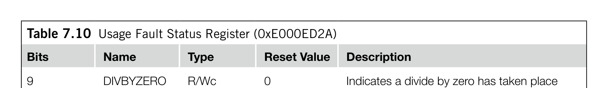
*Description*: Hardware reference table detailing register bit field settings, electrical operating limits, or memory configurations for Table 7.10.

> **Table 7.10**

124
CHAPTER 7  Exceptions
It is also possible, by setting up certain control bits in the NVIC, to generate usage faults for the
following:
Divide by zero
•
Any unaligned memory accesses
•
When a usage fault occurs and if the usage fault handler is enabled, normally the usage fault handler
will be executed. However, if at the same time a higher-priority exception takes place, the usage fault
will be pended. If the processor is already running an exception handler with the same or higher priority
or if the usage fault handler is not enabled, the hard fault handler will be executed instead. If a usage fault
takes place inside the hard fault handler or the NMI handler, the processor will enter the lockup state.
The usage fault handler is enabled by setting the USGFAULTENA bit in the System Handler ­Control
and State register in the NVIC. If the vector table has been relocated to RAM, the usage fault handler
starting address should be set up in the vector table first.
The NVIC provides a Usage Fault Status register (UFSR) for the usage fault handler to determine
the cause of the fault. Inside the handler, the program code that causes the error can also be located
using the stacked program counter value.
The UFSR is shown in Table 7.10. It occupies 2 bytes and can be accessed by half word transfer to
address 0xE000ED2A, or as a word transfer to address 0xE000ED28 with the UFSR in the upper half
word. As with other FSRs, the fault status bit can be cleared by writing 1 to the bit.
Table 7.10  Usage Fault Status Register (0xE000ED2A)
Bits
Name
Type
Reset Value
Description
9
DIVBYZERO
R/Wc
0
Indicates a divide by zero has taken place
(can be set only if DIV_0_TRP is set)
8
UNALIGNED
R/Wc
0
Indicates that an unaligned access fault has
taken place
7:4
—
—
—
—
3
NOCP
R/Wc
0
Attempts to execute a coprocessor instruction
2
INVPC
R/Wc
0
Attempts to do an exception with a bad value
in the EXC_RETURN number
1
INVSTATE
R/Wc
0
Attempts to switch to an invalid state (e.g.,
ARM)
0
UNDEFINSTR
R/Wc
0
Attempts to execute an undefined instruction
Accidentally Switching to the ARM State
One of the most common causes of usage faults is accidentally trying to switch the processor to ARM mode.
This can happen if you load a new value to PC with the LSB equal to 0—for example, if you try to branch to
an address in a register using the BX or BLX instruction without setting the LSB of the target address, have
zero in the LSB of a vector in the exception vector table, or the stacked PC value to be read by POP {PC} is
modified manually, leaving the LSB cleared. When these situations happen, the usage fault exception will take
place with the INVSTATE bit in the UFSR set.

<!-- Page 152 -->
### [PDF Page 152]

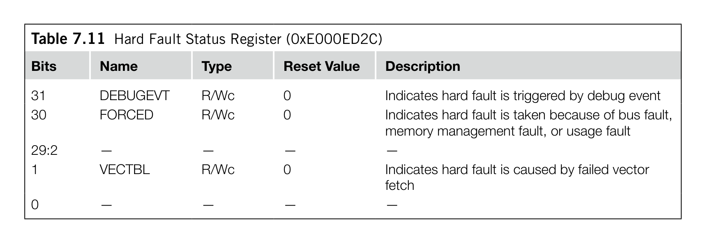
*Description*: Hardware reference table detailing register bit field settings, electrical operating limits, or memory configurations for Table 7.11.

> **Table 7.11**

125
7.5.4  Hard Faults
The hard fault handler can be caused by usage faults, bus faults, and memory management faults if their
handler cannot be executed. In addition, it can also be caused by a bus fault during vector fetch (reading
of a vector table during exception handling). In the NVIC, there is a hard fault status register that can
be used to determine whether the fault was caused by a vector fetch. If not, the hard fault handler will
need to check the other FSRs to determine the cause of the hard fault.
Details of the Hard Fault Status register (HFSR) are shown in Table 7.11. As with other FSRs, the
fault status bit can be cleared by writing 1 to the bit.
7.5.5  Dealing with Faults
During software development, we can use the FSRs to determine the causes of errors in the program
and correct them. A troubleshooting guide is included in Appendix E of this book for common causes
of various faults. In a real running system, the situation is different. After the cause of a fault is deter-
mined, the software will have to decide what to do next. In systems that run an OS, the offending tasks
or applications could be terminated. In some other cases, the system might need a reset. The require-
ments of fault recovery depend on the target application. Doing it properly could make the product
more robust, but it is best to prevent the faults from happening in the first place. The following are some
fault-handling methods:
•
Reset: This can be carried out using the SYSRESETREQ control bit in the Application Interrupt
and Reset Control register in the NVIC. This will reset most parts of the system apart from the
debug logic. Depending on the application, if you do not want to reset the whole system, you could
reset just the processor using the VECTRESET bit.
•
Recovery: In some cases, it might be possible to resolve the problem that caused the fault
exception. For example, in the case of coprocessor instructions, the problem can be resolved using
coprocessor emulation software.
•
Task termination: For systems running an OS, it is likely that the task that caused the fault will be
terminated and restarted if needed.
The FSRs retain their status until they are cleared manually. Fault handlers should clear the fault
status bit they have dealt with. Otherwise, the next time another fault takes place, the fault handler will
Table 7.11  Hard Fault Status Register (0xE000ED2C)
Bits
Name
Type
Reset Value
Description
31
DEBUGEVT
R/Wc
0
Indicates hard fault is triggered by debug event
30
FORCED
R/Wc
0
Indicates hard fault is taken because of bus fault,
memory management fault, or usage fault
29:2
—
—
—
—
1
VECTBL
R/Wc
0
Indicates hard fault is caused by failed vector
fetch
0
—
—
—
—

## 7.5  Fault Exceptions

<!-- Page 153 -->
### [PDF Page 153]

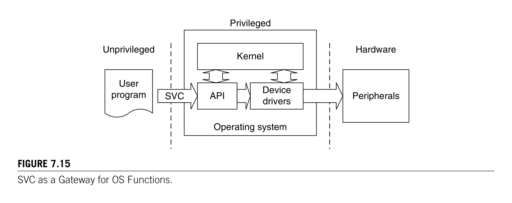
*Description*: Technical diagram and schematic illustration detailing hardware circuit topology, signal routing, and logic operations for Figure 7.15.

> **Figure 7.15**

126
CHAPTER 7  Exceptions
be invoked again and could mistake that the first fault still exists and so will try to deal with it again.
The FSRs use a write-to-clear mechanism (clear by writing 1 to the bits that need to be cleared).
Chip manufacturers can also include an auxiliary FSR in the chip to indicate other fault situations.
The implementation of an AFSR depends on individual chip design requirements.

## 7.6  Supervisor Call and Pendable Service Call

Supervisor Call (SVC) and Pendable Service Call (PendSV) are two exceptions targeted at software and
operating systems. SVC is for generating system function calls. For example, instead of allowing user
programs to directly access hardware, an operating system may provide access to hardware through
an SVC. So when a user program wants to use certain hardware, it generates the SVC exception using
SVC instructions, and then the software exception handler in the operating system is executed and
provides the service the user application requested. In this way, access to hardware is under the control
of the OS, which can provide a more robust system by preventing the user applications from directly
accessing the hardware.
SVC can also make software more portable because the user application does not need to know
the programming details of the hardware. The user program will only need to know the application
programming interface (API) function ID and parameters; the actual hardware-level programming is
handled by device drivers (see Figure 7.15).
SVC exception is generated using the SVC instruction. An immediate value is required for this
instruction, which works as a parameter-passing method. The SVC exception handler can then extract
the parameter and determine what action it needs to perform. For example,
SVC #0x3 ; Call SVC function 3
The traditional syntax for SVC is also acceptable (without the “#”):
SVC 0x3 ; Call SVC function 3
For C language development, the SVC instruction can be generated using __svc function (for ARM
RealView C Compiler or KEIL Microcontroller Development Kit for ARM), or using inline assembly
in other C compilers.
Figure 7.15
SVC as a Gateway for OS Functions.
SVC
Unprivileged
Privileged
User
program
Operating system
API
Device
drivers
Peripherals
Hardware
Kernel

<!-- Page 154 -->
### [PDF Page 154]

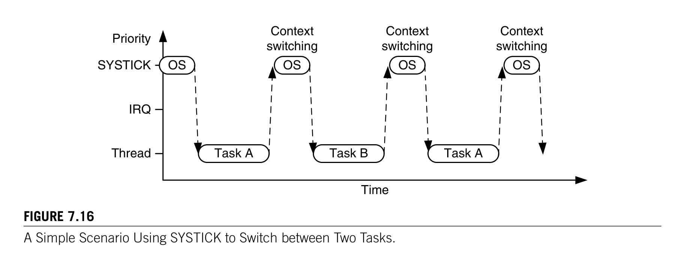
*Description*: Technical diagram and schematic illustration detailing hardware circuit topology, signal routing, and logic operations for Figure 7.16.

> **Figure 7.16**

127
When the SVC handler is executed, you can determine the immediate data value in the SVC instruc-
tion by reading the stacked program counter value, then reading the instruction from that address and
masking out the unneeded bits. If the system uses a Process Stack Pointer for user applications, you
might need to determine which stack was used first. This can be determined from the link register
value when the handler is entered. (This topic is covered in more depth in Chapter 8).
Because of the interrupt priority model in the Cortex-M3, you cannot use SVC inside an SVC han-
dler (because the priority is the same as the current priority). Doing so will result in a usage fault. For
the same reason, you cannot use SVC in an NMI handler or a hard fault handler.
PendSV (Pendable Service Call) works with SVC in the OS. Although SVC (by SVC instruction)
cannot be pended (an application calling SVC will expect the required task to be done immediately),
PendSV can be pended and is useful for an OS to pend an exception so that an action can be performed
after other important tasks are completed. PendSV is generated by writing 1 to the PENDSVSET bit in
the NVIC Interrupt Control State register.
A typical use of PendSV is context switching (switching between tasks). For example, a system
might have two active tasks, and context switching can be triggered by the following:
Calling an SVC function
•
The system timer (SYSTICK)
•
Let’s look at a simple example of having only two tasks in a system, and a context switch is trig-
gered by SYSTICK exceptions (see Figure 7.16).
If an interrupt request takes place before the SYSTICK exception, the SYSTICK exception will
preempt the IRQ handler. In this case, the OS should not carry out the context switching. Otherwise the

## 7.6  Supervisor Call and Pendable Service Call

SVC and Software Interrupt Instruction (ARM7)
If you have used traditional ARM processors (such as the ARM7), you might know that they have a software
interrupt instruction (SWI). The SVC has a similar function, and in fact the binary encoding of SVC instructions
is the same as SWI in ARM7. However, since the exception model has changed, this instruction is renamed to
make sure that programmers will properly port software code from ARM7 to the Cortex-M3.
Figure 7.16
A Simple Scenario Using SYSTICK to Switch between Two Tasks.
Task A
Task B
OS
Priority
OS
Task A
OS
OS
SYSTICK
Thread
IRQ
Context
switching
Context
switching
Context
switching
Time

<!-- Page 155 -->
### [PDF Page 155]

*Description*: Technical diagram and schematic illustration detailing hardware circuit topology, signal routing, and logic operations for Figure 7.17.

> **Figure 7.17**

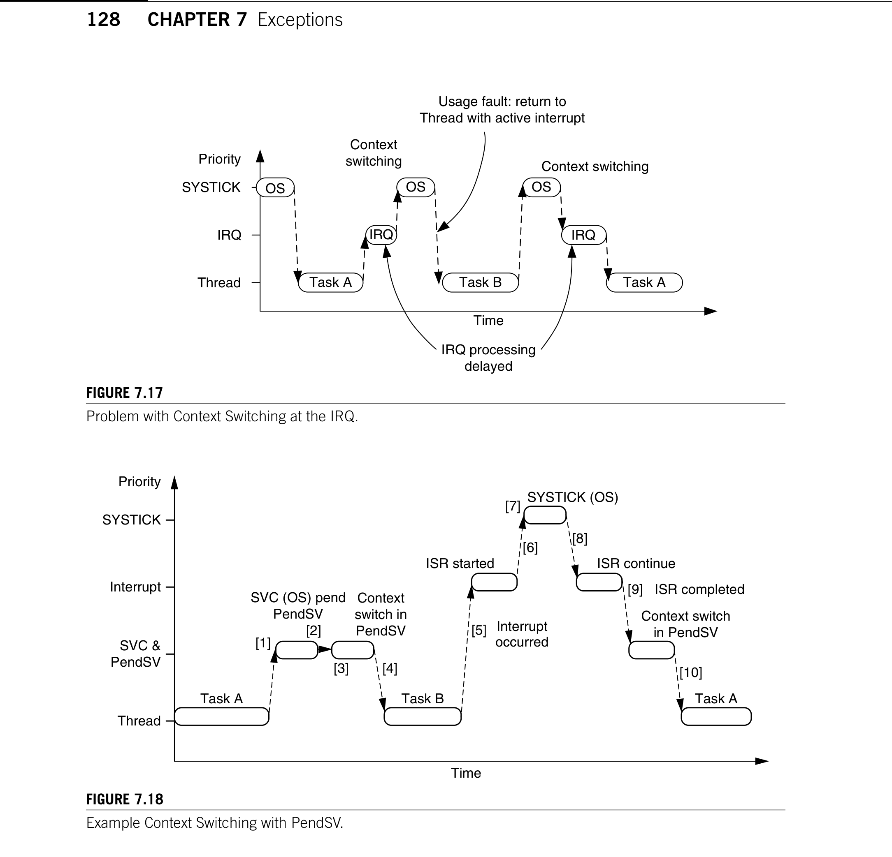
*Description*: Technical diagram and schematic illustration detailing hardware circuit topology, signal routing, and logic operations for Figure 7.18.

> **Figure 7.18**

128
CHAPTER 7  Exceptions
IRQ handler process will be delayed, and for the Cortex-M3, a usage fault could be generated if the OS
tries to switch to thread mode when an interrupt is active (see Figure 7.17).
To avoid the problem of delaying the IRQ processing, some OS implementations carry out only
context switching if they detect that none of the IRQ handlers are being executed. However, this can
result in a very long delay for task switching, especially if the frequency of an interrupt source is close
to that of the SYSTICK exception.
Figure 7.17
Problem with Context Switching at the IRQ.
Task A
Task B
OS
Priority
OS
Task A
OS
SYSTICK
Thread
IRQ
Context
switching
Context switching
Time
IRQ processing
delayed
IRQ
Usage fault: return to
Thread with active interrupt
IRQ
Figure 7.18
Example Context Switching with PendSV.
Priority
SYSTICK
Interrupt
SVC &
PendSV
Thread
Time
Task A
Task B
Task A
[1]
[3]
[4]
[2]
[5]
[6]
[7]
[8]
[9]
[10]
Context switch
in PendSV
ISR continue
ISR started
SYSTICK (OS)
SVC (OS) pend
PendSV
Context
switch in
PendSV
ISR completed
Interrupt
occurred

<!-- Page 156 -->
### [PDF Page 156]

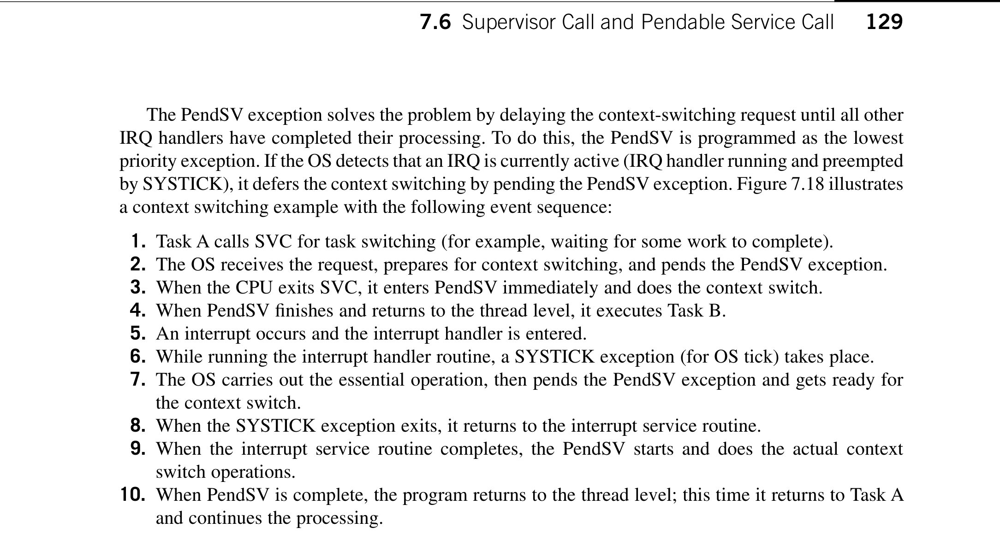
*Description*: Technical diagram and schematic illustration detailing hardware circuit topology, signal routing, and logic operations for Figure 7.18.

> **Figure 7.18**

129
The PendSV exception solves the problem by delaying the context-switching request until all other
IRQ handlers have completed their processing. To do this, the PendSV is programmed as the lowest
priority exception. If the OS detects that an IRQ is currently active (IRQ handler running and ­preempted
by SYSTICK), it defers the context switching by pending the PendSV exception. Figure 7.18 illustrates
a context switching example with the following event sequence:
Task A calls SVC for task switching (for example, waiting for some work to complete).
1.
The OS receives the request, prepares for context switching, and pends the PendSV exception.
2.
When the CPU exits SVC, it enters PendSV immediately and does the context switch.
3.
When PendSV finishes and returns to the thread level, it executes Task B.
4.
An interrupt occurs and the interrupt handler is entered.
5.
While running the interrupt handler routine, a SYSTICK exception (for OS tick) takes place.
6.
The OS carries out the essential operation, then pends the PendSV exception and gets ready for
7.
the context switch.
When the SYSTICK exception exits, it returns to the interrupt service routine.
8.
When the interrupt service routine completes, the PendSV starts and does the actual context
9.
switch operations.
When PendSV is complete, the program returns to the thread level; this time it returns to Task A
10.
and continues the processing.

## 7.6  Supervisor Call and Pendable Service Call

<!-- Page 157 -->
### [PDF Page 157]

This page intentionally left blank

