# Chapter 8. The Nested Vectored Interrupt Controller and Interrupt Control

> **Source PDF**: THE_DEFINITIVE_GUIDE_TO_THE_ARM_CORTEX-МЗ_Stellaris_MCU_9000Series_TEINSTRUMENTS_ARM_SECOND_EDITION.pdf  
> **PDF Page Range**: 158 - 171


---


<!-- Page 158 -->
### [PDF Page 158]

131
Copyright © 2010, Elsevier Inc. All rights reserved.
DOI: 10.1016/B978-0-12-382091-4.00014-1
In This Chapter
Nested Vectored Interrupt Controller Overview........................................................................................ 131
The Basic Interrupt Configuration........................................................................................................... 132
Example Procedures in Setting Up an Interrupt....................................................................................... 138
Software Interrupts................................................................................................................................ 140
The SYSTICK Timer................................................................................................................................ 141

## 8.1  Nested Vectored Interrupt Controller Overview

As we’ve seen, the Nested Vectored Interrupt Controller (NVIC) is an integrated part of the Cortex™-M3
processor. It is closely linked to the Cortex-M3 CPU core logic. Its control registers are accessible
as memory-mapped devices. Besides control registers and control logic for interrupt processing, the
NVIC unit also contains control registers for the SYSTICK Timer, and debugging controls. In this
chapter, we’ll examine the control logic for interrupt processing. Memory Protection Unit and debug-
ging control logic are discussed in later chapters.
The NVIC supports 1–240 external interrupt inputs (commonly known as interrupt request [IRQs]).
The exact number of supported interrupts is determined by the chip manufacturers when they develop
their Cortex-M3 chips. In addition, the NVIC also has a Nonmaskable Interrupt (NMI) input. The
actual function of the NMI is also decided by the chip manufacturer. In some cases, this NMI cannot
be controlled from an external source.
The NVIC can be accessed in the System Control Space (SCS) address range, which is memory
location 0xE000E000. Most of the interrupt control/status registers are accessible only in privileged
mode, except the Software Trigger Interrupt register (STIR), which can be set up to be accessible in
user mode. The interrupt control/status register can be accessed in word, half word, or byte transfers.
In addition, a few other interrupt-masking registers are also involved in the interrupts. They
are the “special registers” covered in Chapter 3 and are accessed through special registers access
­instructions: move special register to ­general-purpose register (MRS) and move to special register
from general-purpose register (MSR) instructions.
The Nested Vectored Interrupt
Controller and Interrupt Control
8
CHAPTER


<!-- Page 159 -->
### [PDF Page 159]


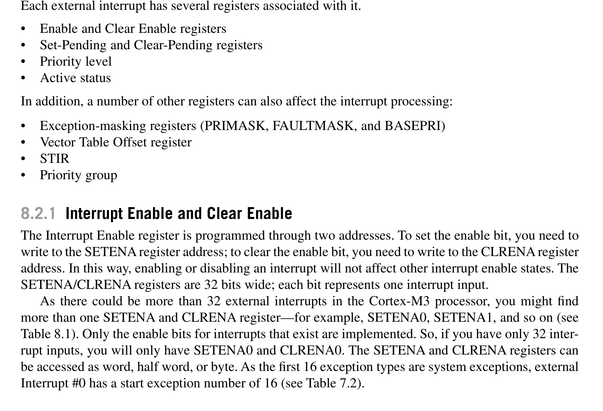
*Description*: Hardware reference table detailing register bit field settings, electrical operating limits, or memory configurations for Table 8.1.

> **Table 8.1**


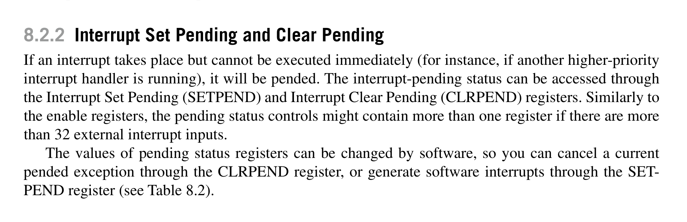
*Description*: Hardware reference table detailing register bit field settings, electrical operating limits, or memory configurations for Table 8.2.

> **Table 8.2**


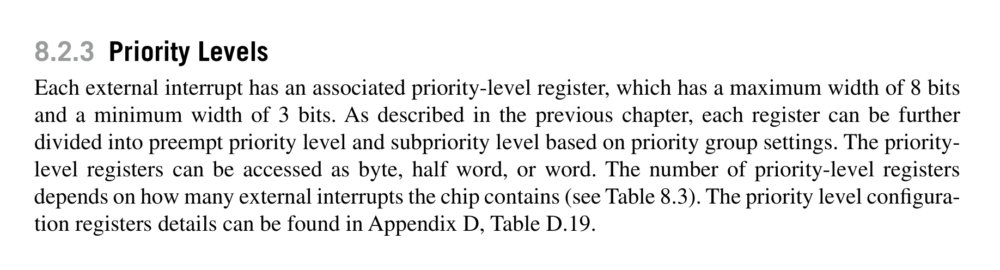
*Description*: Hardware reference table detailing register bit field settings, electrical operating limits, or memory configurations for Table 8.3.

> **Table 8.3**

132
CHAPTER 8  The Nested Vectored Interrupt Controller and Interrupt Control

## 8.2  The Basic Interrupt Configuration

Each external interrupt has several registers associated with it.
Enable and Clear Enable registers
•
Set-Pending and Clear-Pending registers
•
Priority level
•
Active status
•
In addition, a number of other registers can also affect the interrupt processing:
Exception-masking registers (PRIMASK, FAULTMASK, and BASEPRI)
•
Vector Table Offset register
•
STIR
•
Priority group
•
8.2.1  Interrupt Enable and Clear Enable
The Interrupt Enable register is programmed through two addresses. To set the enable bit, you need to
write to the SETENA register address; to clear the enable bit, you need to write to the CLRENA register
address. In this way, enabling or disabling an interrupt will not affect other interrupt enable states. The
SETENA/CLRENA registers are 32 bits wide; each bit represents one interrupt input.
As there could be more than 32 external interrupts in the Cortex-M3 processor, you might find
more than one SETENA and CLRENA register—for example, SETENA0, SETENA1, and so on (see
Table 8.1). Only the enable bits for interrupts that exist are implemented. So, if you have only 32 inter-
rupt inputs, you will only have SETENA0 and CLRENA0. The SETENA and CLRENA registers can
be accessed as word, half word, or byte. As the first 16 exception types are system exceptions, external
Interrupt #0 has a start exception number of 16 (see Table 7.2).
8.2.2  Interrupt Set Pending and Clear Pending
If an interrupt takes place but cannot be executed immediately (for instance, if another higher-priority
interrupt handler is running), it will be pended. The interrupt-pending status can be accessed through
the Interrupt Set Pending (SETPEND) and Interrupt Clear Pending (CLRPEND) registers. Similarly to
the enable registers, the pending status controls might contain more than one register if there are more
than 32 external interrupt inputs.
The values of pending status registers can be changed by software, so you can cancel a current
pended exception through the CLRPEND register, or generate software interrupts through the SET-
PEND register (see Table 8.2).
8.2.3  Priority Levels
Each external interrupt has an associated priority-level register, which has a maximum width of 8 bits
and a minimum width of 3 bits. As described in the previous chapter, each register can be further
divided into preempt priority level and subpriority level based on priority group settings. The priority-
level registers can be accessed as byte, half word, or word. The number of priority-level registers
depends on how many external interrupts the chip contains (see Table 8.3). The priority level configura-
tion registers details can be found in Appendix D, Table D.19.


<!-- Page 160 -->
### [PDF Page 160]


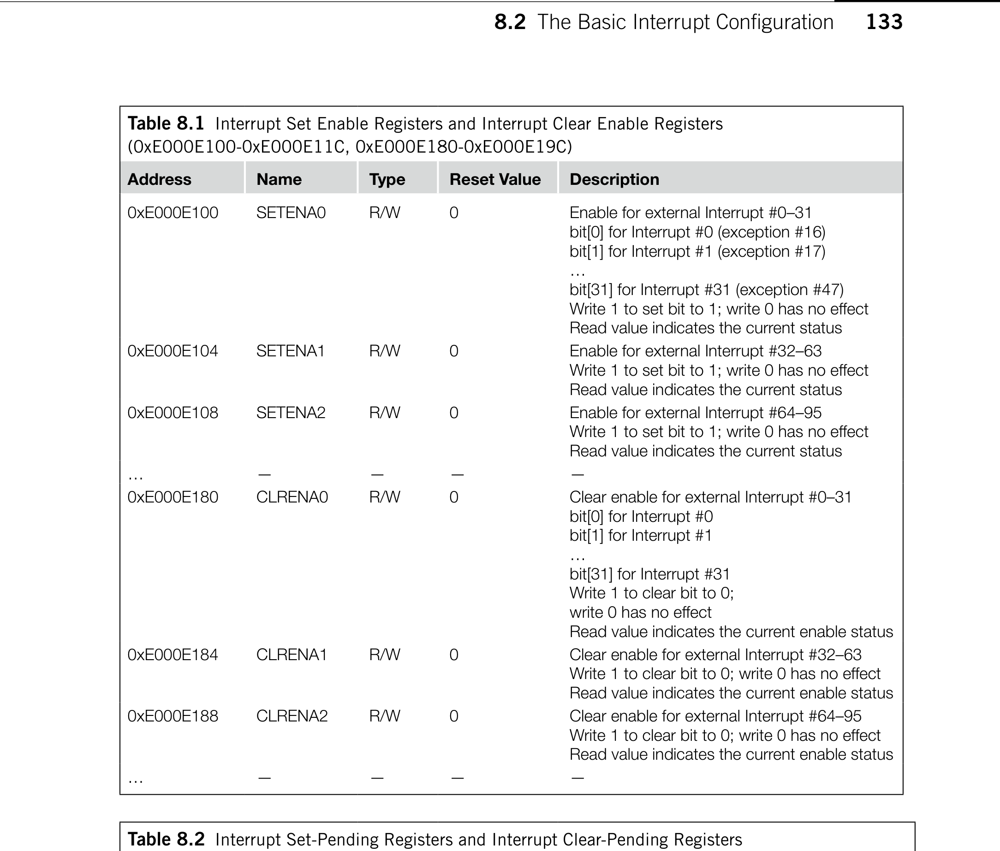
*Description*: Hardware reference table detailing register bit field settings, electrical operating limits, or memory configurations for Table 8.1.

> **Table 8.1**


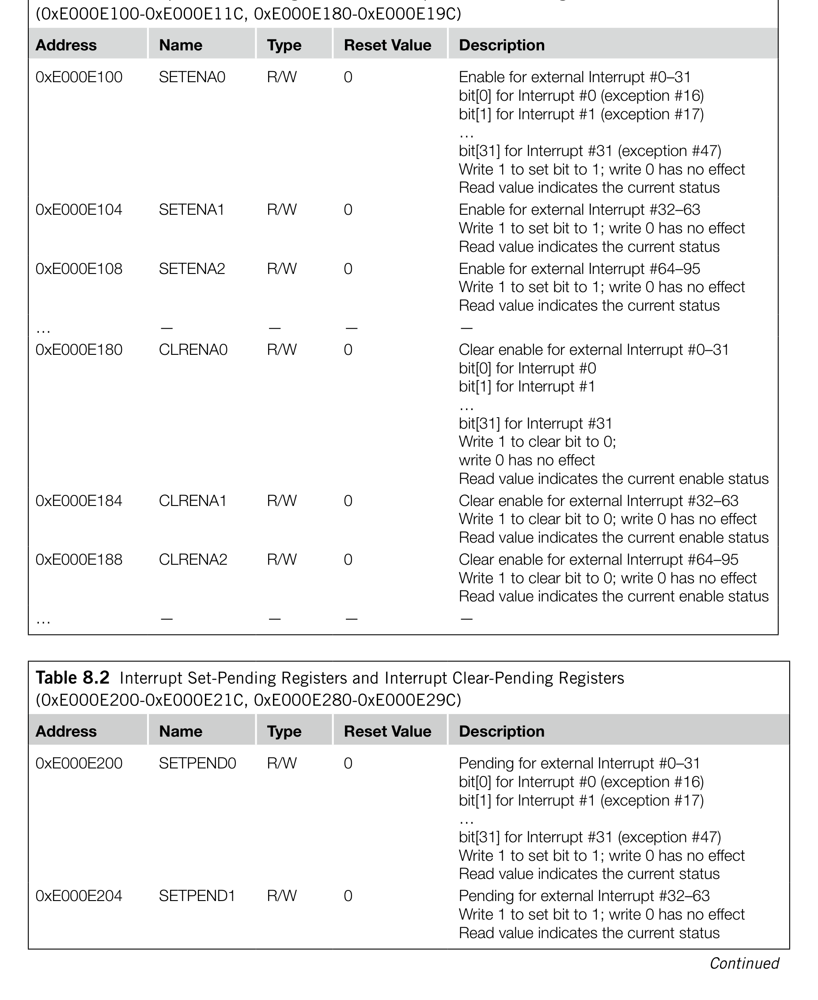
*Description*: Hardware reference table detailing register bit field settings, electrical operating limits, or memory configurations for Table 8.2.

> **Table 8.2**

133

## 8.2  The Basic Interrupt Configuration

Table 8.1  Interrupt Set Enable Registers and Interrupt Clear Enable Registers
(0xE000E100-0xE000E11C, 0xE000E180-0xE000E19C)
Address
Name
Type
Reset Value
Description
0xE000E100
SETENA0
R/W
0
Enable for external Interrupt #0–31
bit[0] for Interrupt #0 (exception #16)
bit[1] for Interrupt #1 (exception #17)
…
bit[31] for Interrupt #31 (exception #47)
Write 1 to set bit to 1; write 0 has no effect
Read value indicates the current status
0xE000E104
SETENA1
R/W
0
Enable for external Interrupt #32–63
Write 1 to set bit to 1; write 0 has no effect
Read value indicates the current status
0xE000E108
SETENA2
R/W
0
Enable for external Interrupt #64–95
Write 1 to set bit to 1; write 0 has no effect
Read value indicates the current status
…
—
—
—
—
0xE000E180
CLRENA0
R/W
0
Clear enable for external Interrupt #0–31
bit[0] for Interrupt #0
bit[1] for Interrupt #1
…
bit[31] for Interrupt #31
Write 1 to clear bit to 0;
write 0 has no effect
Read value indicates the current enable status
0xE000E184
CLRENA1
R/W
0
Clear enable for external Interrupt #32–63
Write 1 to clear bit to 0; write 0 has no effect
Read value indicates the current enable status
0xE000E188
CLRENA2
R/W
0
Clear enable for external Interrupt #64–95
Write 1 to clear bit to 0; write 0 has no effect
Read value indicates the current enable status
…
—
—
—
—
Table 8.2  Interrupt Set-Pending Registers and Interrupt Clear-Pending Registers
(0xE000E200-0xE000E21C, 0xE000E280-0xE000E29C)
Address
Name
Type
Reset Value
Description
0xE000E200
SETPEND0
R/W
0
Pending for external Interrupt #0–31
bit[0] for Interrupt #0 (exception #16)
bit[1] for Interrupt #1 (exception #17)
…
bit[31] for Interrupt #31 (exception #47)
Write 1 to set bit to 1; write 0 has no effect
Read value indicates the current status
0xE000E204
SETPEND1
R/W
0
Pending for external Interrupt #32–63
Write 1 to set bit to 1; write 0 has no effect
Read value indicates the current status
Continued


<!-- Page 161 -->
### [PDF Page 161]


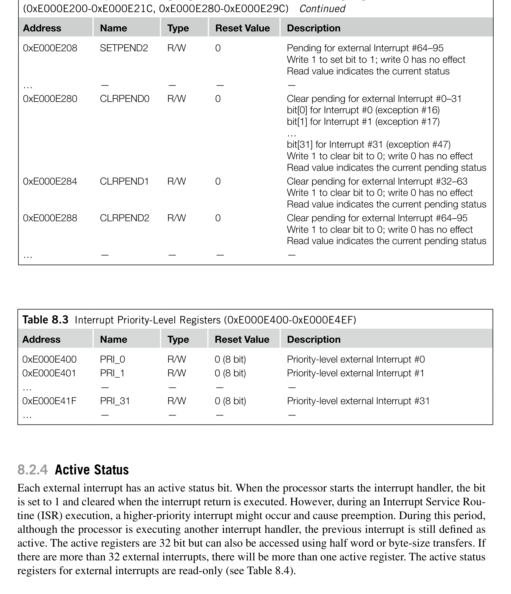
*Description*: Hardware reference table detailing register bit field settings, electrical operating limits, or memory configurations for Table 8.4.

> **Table 8.4**


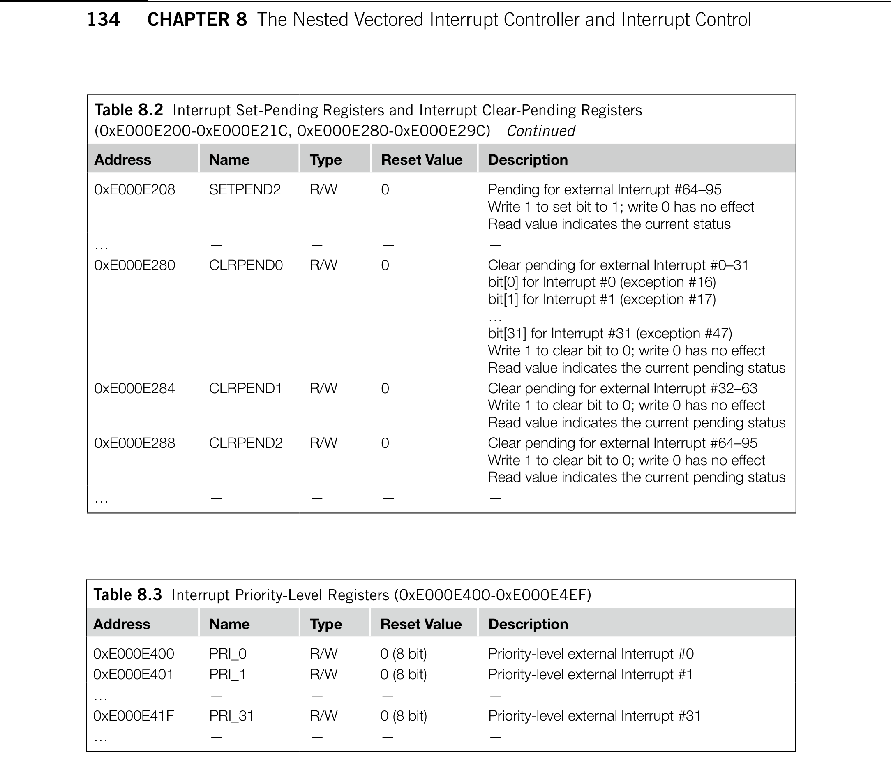
*Description*: Hardware reference table detailing register bit field settings, electrical operating limits, or memory configurations for Table 8.2.

> **Table 8.2**


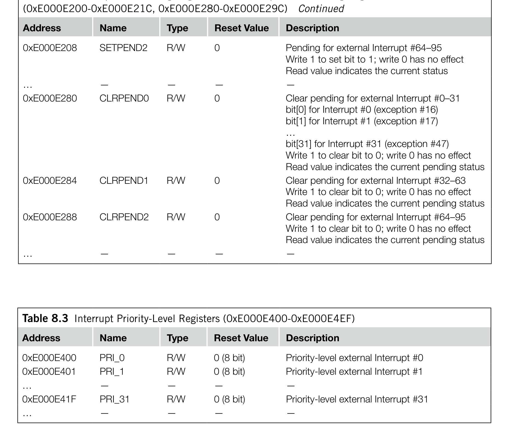
*Description*: Hardware reference table detailing register bit field settings, electrical operating limits, or memory configurations for Table 8.3.

> **Table 8.3**

134
CHAPTER 8  The Nested Vectored Interrupt Controller and Interrupt Control
8.2.4  Active Status
Each external interrupt has an active status bit. When the processor starts the interrupt handler, the bit
is set to 1 and cleared when the interrupt return is executed. However, during an Interrupt Service Rou-
tine (ISR) execution, a higher-priority interrupt might occur and cause preemption. During this period,
although the processor is executing another interrupt handler, the previous interrupt is still defined as
active. The active registers are 32 bit but can also be accessed using half word or byte-size transfers. If
there are more than 32 external interrupts, there will be more than one active register. The active status
registers for external interrupts are read-only (see Table 8.4).
Table 8.2  Interrupt Set-Pending Registers and Interrupt Clear-Pending Registers
(0xE000E200-0xE000E21C, 0xE000E280-0xE000E29C)  Continued
Address
Name
Type
Reset Value
Description
0xE000E208
SETPEND2
R/W
0
Pending for external Interrupt #64–95
Write 1 to set bit to 1; write 0 has no effect
Read value indicates the current status
…
—
—
—
—
0xE000E280
CLRPEND0
R/W
0
Clear pending for external Interrupt #0–31
bit[0] for Interrupt #0 (exception #16)
bit[1] for Interrupt #1 (exception #17)
…
bit[31] for Interrupt #31 (exception #47)
Write 1 to clear bit to 0; write 0 has no effect
Read value indicates the current pending status
0xE000E284
CLRPEND1
R/W
0
Clear pending for external Interrupt #32–63
Write 1 to clear bit to 0; write 0 has no effect
Read value indicates the current pending status
0xE000E288
CLRPEND2
R/W
0
Clear pending for external Interrupt #64–95
Write 1 to clear bit to 0; write 0 has no effect
Read value indicates the current pending status
…
—
—
—
—
Table 8.3  Interrupt Priority-Level Registers (0xE000E400-0xE000E4EF)
Address
Name
Type
Reset Value
Description
0xE000E400
PRI_0
R/W
0 (8 bit)
Priority-level external Interrupt #0
0xE000E401
PRI_1
R/W
0 (8 bit)
Priority-level external Interrupt #1
…
—
—
—
—
0xE000E41F
PRI_31
R/W
0 (8 bit)
Priority-level external Interrupt #31
…
—
—
—
—


<!-- Page 162 -->
### [PDF Page 162]


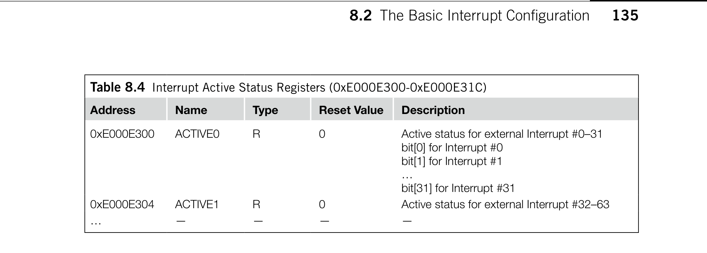
*Description*: Hardware reference table detailing register bit field settings, electrical operating limits, or memory configurations for Table 8.4.

> **Table 8.4**

135

## 8.2  The Basic Interrupt Configuration

8.2.5  PRIMASK and FAULTMASK Special Registers
The PRIMASK register is used to disable all exceptions except NMI and hard fault. It effectively
changes the current priority level to 0 (highest programmable level). In C programming, you can use
the intrinsic functions provided in Cortex Microcontroller Software Interface Standard (CMSIS) com-
pliant device driver libraries or provided in the compiler to set and clear PRIMASK:

```c
void __enable_irq(); // Clear PRIMASK
void __disable_irq(); // Set PRIMASK
void __set_PRIMASK(uint32_t priMask); // Set PRIMASK to value
uint32_t __get_PRIMASK(void); // Read the PRIMASK value
```

For assembly language users, you can change the current status of PRIMASK using Change Pro-
cess State (CPS) instructions:
CPSIE I ; Clear PRIMASK (Enable interrupts)
CPSID I ; Set PRIMASK (Disable interrupts)
This register is also programmable using MRS and MSR instructions. For example,
MOV	  R0, #1
MSR	  PRIMASK, R0 ; Write 1 to PRIMASK to disable all
; interrupts
and
MOV	  R0, #0
MSR	  PRIMASK, R0 ; Write 0 to PRIMASK to allow interrupts
PRIMASK is useful for temporarily disabling all interrupts for critical tasks. When PRIMASK is set,
if a fault takes place, the hard fault handler will be executed.
FAULTMASK is just like PRIMASK except that it changes the effective current priority level
to 21, so that even the hard fault handler is blocked. Only the NMI can be executed when FAULT-
MASK is set. It can be used by fault handlers to raise its priority to 21, so that they can have access
to some features for hard fault exception (more information on this is provided in Chapter 12). In C
programming with CMSIS compliant driver libraries, you can use the intrinsic functions provided in
device driver libraries to set and clear FAULTMASK as follows:

```c
void __set_FAULTMASK(uint32_t faultMask);
uint32_t __get_FAULTMASK(void);
```

Table 8.4  Interrupt Active Status Registers (0xE000E300-0xE000E31C)
Address
Name
Type
Reset Value
Description
0xE000E300
ACTIVE0
R
0
Active status for external Interrupt #0–31
bit[0] for Interrupt #0
bit[1] for Interrupt #1
…
bit[31] for Interrupt #31
0xE000E304
ACTIVE1
R
0
Active status for external Interrupt #32–63
…
—
—
—
—


<!-- Page 163 -->
### [PDF Page 163]

136
CHAPTER 8  The Nested Vectored Interrupt Controller and Interrupt Control
For assembly language users, you can change the current status of FAULTMASK using CPS
instructions as follows:
CPSIE F ; Clear FAULTMASK
CPSID F ; Set FAULTMASK
You can also access the FAULTMASK register using MRS and MSR instructions.
FAULTMASK is cleared automatically upon exiting the exception handler except return from NMI
handler. Both FAULTMASK and PRIMASK registers cannot be set in the user state.
8.2.6  The BASEPRI Special Register
In some cases, you might want to disable interrupts only with priority lower than a certain level. In this
case, you could use the BASEPRI register. To do this, simply write the required masking priority level
to the BASEPRI register. For example, if you want to block all exceptions with priority level equal to
or lower than 0x60, you can write the value to BASEPRI:
__set_BASEPRI(0x60); // Disable interrupts with priority
// 0x60-0xFF using CMSIS
Or in assembly language:
MOV	  R0, #0x60
MSR	  BASEPRI, R0 ; Disable interrupts with priority
; 0x60-0xFF
You can also read back the value of BASEPRI:
x = __get_BASEPRI(void); // Read value of BASEPRI
Or in assembly language:
MRS	  R0, BASEPRI
To cancel the masking, just write 0 to the BASEPRI register:
__set_BASEPRI(0x0); // Turn off BASEPRI masking
Or in assembly language:
MOV	  R0, #0x0
MSR	  BASEPRI, R0 ; Turn off BASEPRI masking
The BASEPRI register can also be accessed using the BASEPRI_MAX register name. It is actually
the same register, but when you use it with this name, it will give you a conditional write operation.
(As far as hardware is concerned, BASEPRI and BASEPRI_MAX are the same register, but in the
assembler code they use different register name coding.) When you use BASEPRI_MAX as a register,
the processor hardware automatically compares the current value and the new value and only allows
the update if it is to be changed to a higher priority level; it cannot be changed to lower priority levels.
For example, consider the following instruction sequence:
MOV	  R0, #0x60
MSR	  BASEPRI_MAX, R0 ; Disable interrupts with priority
; 0x60, 0x61,..., etc


<!-- Page 164 -->
### [PDF Page 164]


*Description*: Hardware reference table detailing register bit field settings, electrical operating limits, or memory configurations for Table 8.5.

> **Table 8.5**

137

## 8.2  The Basic Interrupt Configuration

MOV	  R0, #0xF0
MSR	  BASEPRI_MAX, R0 ; This write will be ignored because
; it is lower
; level than 0x60
MOV	  R0, #0x40
MSR	  BASEPRI_MAX, R0 ; This write is allowed and change the
; masking level to 0x40
To change to a lower masking level or disable the masking, the BASEPRI register name should be
used. The BASEPRI/ BASEPRI_MAX register cannot be set in the user state.
As with other priority-level registers, the formatting of the BASEPRI register is affected
by the number of implemented priority register widths. For example, if only 3 bits are imple-
mented for priority-level registers, BASEPRI can be programmed as 0x00, 0x20, 0x40 … 0xC0,
and 0xE0.
8.2.7  Configuration Registers for Other Exceptions
Usage faults, memory management faults, and bus fault exceptions are enabled by the System Handler
Control and State register (0xE000ED24). The pending status of faults and active status of most system
exceptions are also available from this register (see Table 8.5).
Table 8.5  The System Handler Control and State Register (0xE000ED24)
Bits
Name
Type
Reset Value
Description
18
USGFAULTENA
R/W
0
Usage fault handler enable
17
BUSFAULTENA
R/W
0
Bus fault handler enable
16
MEMFAULTENA
R/W
0
Memory management fault handler enable
15
SVCALLPENDED
R/W
0
SVC pended; SVC was started but was replaced
by a higher-priority exception
14
BUSFAULTPENDED
R/W
0
Bus fault pended; bus fault handler was started
but was replaced by a higher-priority exception
13
MEMFAULTPENDED
R/W
0
Memory management fault pended; memory
management fault started but was replaced by a
higher-priority exception
12
USGFAULTPENDED
R/W
0
Usage fault pended; usage fault started but was
replaced by a higher-priority exception
11
SYSTICKACT
R/W
0
Read as 1 if SYSTICK exception is active
10
PENDSVACT
R/W
0
Read as 1 if PendSV exception is active
8
MONITORACT
R/W
0
Read as 1 if debug monitor exception is active
7
SVCALLACT
R/W
0
Read as 1 if SVC exception is active
3
USGFAULTACT
R/W
0
Read as 1 if usage fault exception is active
1
BUSFAULTACT
R/W
0
Read as 1 if bus fault exception is active
0
MEMFAULTACT
R/W
0
Read as 1 if memory management fault is active
Note: Bit 12 (USGFAULTPENDED) is not available on revision 0 of Cortex-M3.


<!-- Page 165 -->
### [PDF Page 165]


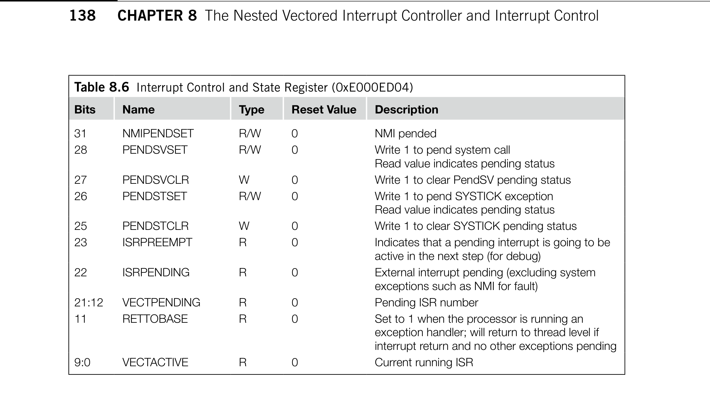
*Description*: Hardware reference table detailing register bit field settings, electrical operating limits, or memory configurations for Table 8.6.

> **Table 8.6**

138
CHAPTER 8  The Nested Vectored Interrupt Controller and Interrupt Control
Be cautious when writing to this register; make sure that the active status bits of system exceptions
are not changed accidentally. Otherwise, if an activated system exception has its active state cleared by
accident, a fault exception will be generated when the system exception handler generates an excep-
tion exit.
Pending for NMI, the SYSTICK Timer, and PendSV is programmable through the Interrupt Control
and State register. In this register, quite a number of the bit fields are for debugging purposes. In most
cases, only the pending bits would be useful for application development (see Table 8.6).

## 8.3  Example Procedures In Setting Up an Interrupt

For most simple applications, the application is stored in ROM and there is no need to change the
exception handlers, we can have the whole vector table coded in the beginning of ROM in the Code
region (0x00000000). This way, the vector table offset will always be 0 and the interrupt vector is
already in ROM. The only steps required to set up an interrupt will be as follows:
Set up the priority group setting. This step is optional. By default priority group setting is zero—
1.
only bit 0 of the priority level register is used for subpriority.
Set up the priority level of the interrupt. This step is optional. By default, all interrupts are at
2.
priority level 0 (highest).
Enable the interrupt.
3.
Here is a simple example procedure for setting up an interrupt:
NVIC_SetPriorityGrouping(5);
NVIC_SetPriority(7, 0xC0); // Set IRQ#7 priority level to 0xC0
NVIC_EnableIRQ(7);
Table 8.6  Interrupt Control and State Register (0xE000ED04)
Bits
Name
Type
Reset Value
Description
31
NMIPENDSET
R/W
0
NMI pended
28
PENDSVSET
R/W
0
Write 1 to pend system call
Read value indicates pending status
27
PENDSVCLR
W
0
Write 1 to clear PendSV pending status
26
PENDSTSET
R/W
0
Write 1 to pend SYSTICK exception
Read value indicates pending status
25
PENDSTCLR
W
0
Write 1 to clear SYSTICK pending status
23
ISRPREEMPT
R
0
Indicates that a pending interrupt is going to be
active in the next step (for debug)
22
ISRPENDING
R
0
External interrupt pending (excluding system
exceptions such as NMI for fault)
21:12
VECTPENDING
R
0
Pending ISR number
11
RETTOBASE
R
0
Set to 1 when the processor is running an
exception handler; will return to thread level if
interrupt return and no other exceptions pending
9:0
VECTACTIVE
R
0
Current running ISR


<!-- Page 166 -->
### [PDF Page 166]


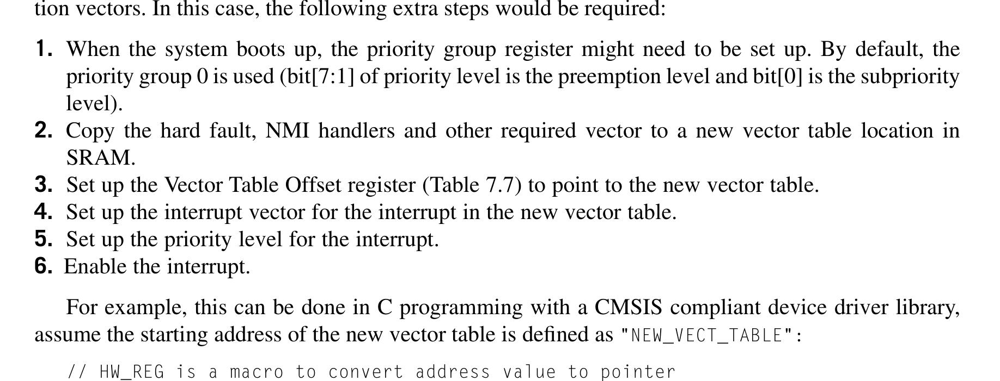
*Description*: Hardware reference table detailing register bit field settings, electrical operating limits, or memory configurations for Table 7.7.

> **Table 7.7**


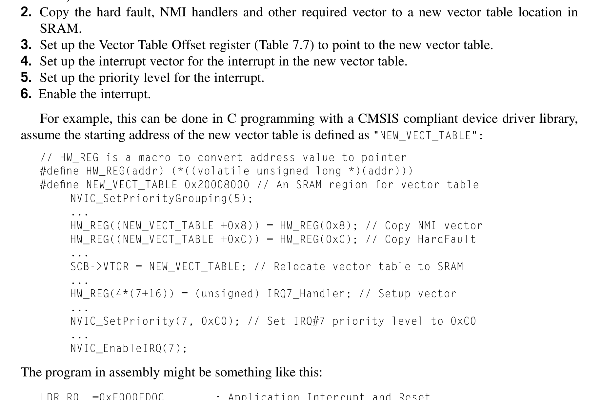
*Description*: Hardware reference table detailing register bit field settings, electrical operating limits, or memory configurations for Table 0.

> **Table 0**

139

## 8.3  Example Procedures in Setting Up an Interrupt

In addition, make sure that you have enough stack memory if you allow a large number of nested inter-
rupt levels. Because exception handlers always use the Main Stack Pointer, the main stack memory
should contain enough space for the largest number of nesting interrupts.
If the interrupt handlers need to be changed at different stage of the application, we might need to
relocate the vector table to Static Random Access Memory (SRAM), so that we can modify the excep-
tion vectors. In this case, the following extra steps would be required:
When the system boots up, the priority group register might need to be set up. By default, the
1.
priority group 0 is used (bit[7:1] of priority level is the preemption level and bit[0] is the subpriority
level).
Copy the hard fault, NMI handlers and other required vector to a new vector table location in
2.
SRAM.
Set up the Vector Table Offset register (Table 7.7) to point to the new vector table.
3.
Set up the interrupt vector for the interrupt in the new vector table.
4.
Set up the priority level for the interrupt.
5.
Enable the interrupt.
6.
For example, this can be done in C programming with a CMSIS compliant device driver library,
assume the starting address of the new vector table is defined as "NEW_VECT_TABLE":
// HW_REG is a macro to convert address value to pointer
#define HW_REG(addr) (*((volatile unsigned long *)(addr)))
#define NEW_VECT_TABLE 0x20008000 // An SRAM region for vector table
NVIC_SetPriorityGrouping(5);
...
HW_REG((NEW_VECT_TABLE +0x8)) = HW_REG(0x8); // Copy NMI vector
HW_REG((NEW_VECT_TABLE +0xC)) = HW_REG(0xC); // Copy HardFault
...
SCB->VTOR = NEW_VECT_TABLE; // Relocate vector table to SRAM
...
HW_REG(4*(7+16)) = (unsigned) IRQ7_Handler; // Setup vector
...
NVIC_SetPriority(7, 0xC0); // Set IRQ#7 priority level to 0xC0
...
NVIC_EnableIRQ(7);
The program in assembly might be something like this:
LDR R0, =0xE000ED0C
; Application Interrupt and Reset
; Control Register
LDR R1, =0x05FA0500
; Priority Group 5 (2/6)
STR R1, [R0]
; Set Priority Group
...
MOV R4,#8
; Vector Table in ROM
LDR R5,=(NEW_VECT_TABLE+8)
LDMIA R4!,{R0-R1}
; Read vectors address for NMI and
; Hard Fault
STMIA R5!,{R0-R1}
; Copy vectors to new vector table
...
LDR R0,=0xE000ED08
; Vector Table Offset Register
LDR R1,=NEW_VECT_TABLE


<!-- Page 167 -->
### [PDF Page 167]


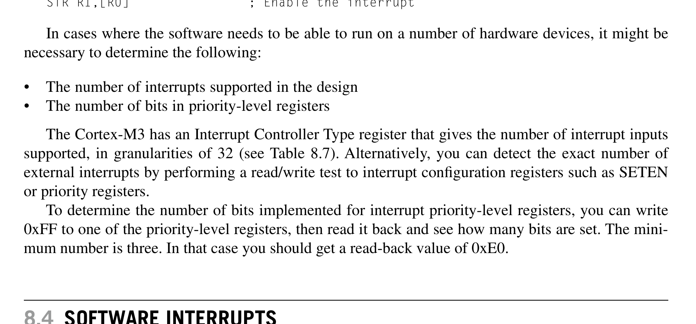
*Description*: Hardware reference table detailing register bit field settings, electrical operating limits, or memory configurations for Table 8.7.

> **Table 8.7**


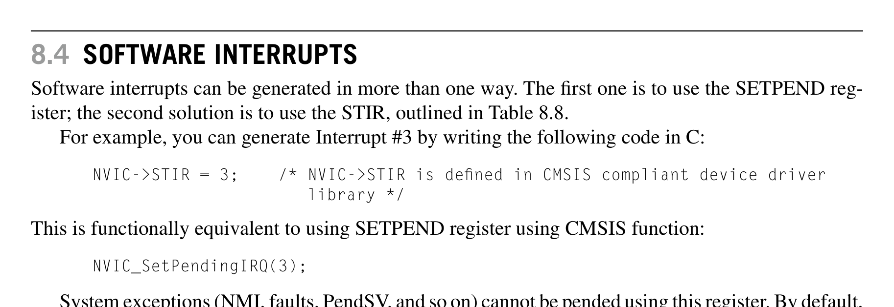
*Description*: Hardware reference table detailing register bit field settings, electrical operating limits, or memory configurations for Table 8.8.

> **Table 8.8**

140
CHAPTER 8  The Nested Vectored Interrupt Controller and Interrupt Control
STR R1,[R0]
; Set vector table to new location
...
LDR R0,=IRQ7_Handler
; Get starting address of IRQ#7 handler
LDR R1,=0xE000ED08
; Vector Table Offset Register
LDR R1,[R1]

```assembly
ADD R1, R1, #(4*(7+16))
; Calculate IRQ#7 handler vector
```

; address
STR R0,[R1]
; Setup vector for IRQ#7
...
LDR R0,=0xE000E400
; External IRQ priority base
MOV R1, #0x0
STRB R1,[R0,#7]
; Set IRQ#7 priority to 0x0
...
LDR R0,=0xE000E100
; SETEN register
MOV R1,#(1<<7)
; IRQ#7 enable bit (value 0x1 shifted
; by 7 bits)
STR R1,[R0]
; Enable the interrupt
In cases where the software needs to be able to run on a number of hardware devices, it might be
necessary to determine the following:
The number of interrupts supported in the design
•
The number of bits in priority-level registers
•
The Cortex-M3 has an Interrupt Controller Type register that gives the number of interrupt inputs
supported, in granularities of 32 (see Table 8.7). Alternatively, you can detect the exact number of
external interrupts by performing a read/write test to interrupt configuration registers such as SETEN
or priority registers.
To determine the number of bits implemented for interrupt priority-level registers, you can write
0xFF to one of the priority-level registers, then read it back and see how many bits are set. The mini-
mum number is three. In that case you should get a read-back value of 0xE0.

## 8.4  Software Interrupts

Software interrupts can be generated in more than one way. The first one is to use the SETPEND reg-
ister; the second solution is to use the STIR, outlined in Table 8.8.
For example, you can generate Interrupt #3 by writing the following code in C:
NVIC->STIR = 3;    /* NVIC->STIR is defined in CMSIS compliant device driver
library */
This is functionally equivalent to using SETPEND register using CMSIS function:
NVIC_SetPendingIRQ(3);
System exceptions (NMI, faults, PendSV, and so on) cannot be pended using this register. By default,
a user program cannot write to the NVIC; however, if it is necessary for a user program to write to this
register, the bit 1 (USERSETMPEND) of the NVIC Configuration Control register (0xE000ED14) can
be set to allow user access to the NVIC’s STIR.


<!-- Page 168 -->
### [PDF Page 168]


*Description*: Hardware reference table detailing register bit field settings, electrical operating limits, or memory configurations for Table 8.7.

> **Table 8.7**


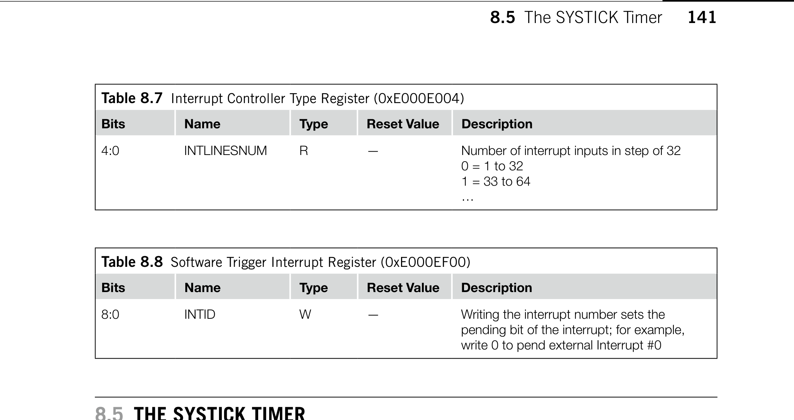
*Description*: Hardware reference table detailing register bit field settings, electrical operating limits, or memory configurations for Table 8.8.

> **Table 8.8**

141

## 8.5  The SYSTICK Timer


## 8.5  The SYSTICK Timer

The SYSTICK Timer is integrated with the NVIC and can be used to generate a SYSTICK exception
(exception type #15). In many operating systems, a hardware timer is used to generate interrupts so that
the OS can carry out task management—for example, to allow multiple tasks to run at different time
slots and to make sure that no single task can lock up the whole system. To do that, the timer needs to
be able to generate interrupts, and if possible, it should be protected from user tasks so that user appli-
cations cannot change the timer behavior.
The Cortex-M3 processor includes a simple timer. Because all Cortex-M3 chips have the same
timer, porting software between different Cortex-M3 products is simplified. The timer is a 24-bit down
counter. It can use the internal free running processor clock signal on the Cortex-M3 processor or an
external reference clock (documented as the STCLK signal on the Cortex-M3 TRM). However, the
source of the STCLK will be decided by chip designers, so the clock frequency might vary between
products. You should check the chip’s datasheet carefully when selecting a clock source.
The SYSTICK Timer can be used to generate interrupts. It has a dedicated exception type and
exception vector. It makes porting operating systems and software easier because the process will be
the same across different Cortex-M3 products. The SYSTICK Timer is controlled by four registers,
shown in Tables 8.9–8.12.
The Calibration Value register provides a solution for applications to generate the same SYS-
TICK interrupt interval when running on various Cortex-M3 products. To use it, just write the value
in TENMS to the reload value register. This will give an interrupt interval of about 10 ms. For other
interrupt timing intervals, the software code will need to calculate a new suitable value from the cali-
bration value. However, the TENMS field might not be available in all Cortex-M3 products (the cali-
bration input signals to the Cortex-M3 might have been tied low), so check with your manufacturer’s
datasheets before using this feature.
Aside from being a system tick timer for operating systems, the SYSTICK Timer can be used in
a number of ways: as an alarm timer, for timing measurement, and more. Note that the SYSTICK
Table 8.7  Interrupt Controller Type Register (0xE000E004)
Bits
Name
Type
Reset Value
Description
4:0
INTLINESNUM
R
—
Number of interrupt inputs in step of 32
0 = 1 to 32
1 = 33 to 64
…
Table 8.8  Software Trigger Interrupt Register (0xE000EF00)
Bits
Name
Type
Reset Value
Description
8:0
INTID
W
—
Writing the interrupt number sets the
pending bit of the interrupt; for example,
write 0 to pend external Interrupt #0


<!-- Page 169 -->
### [PDF Page 169]


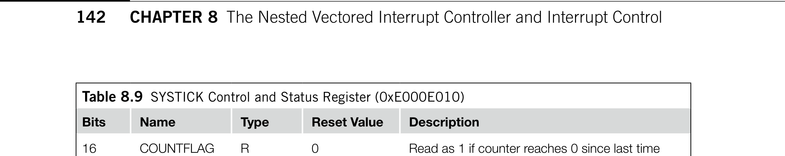
*Description*: Hardware reference table detailing register bit field settings, electrical operating limits, or memory configurations for Table 8.9.

> **Table 8.9**


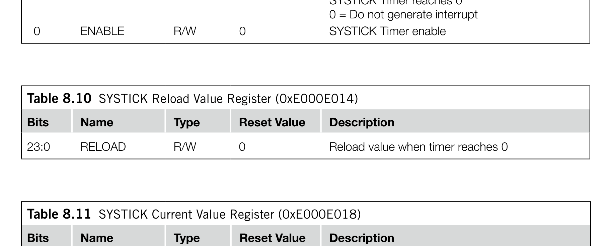
*Description*: Hardware reference table detailing register bit field settings, electrical operating limits, or memory configurations for Table 8.10.

> **Table 8.10**


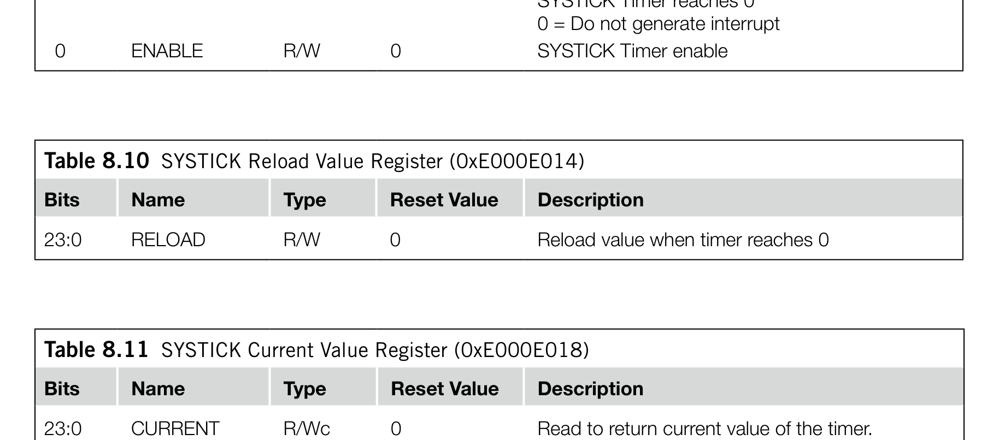
*Description*: Hardware reference table detailing register bit field settings, electrical operating limits, or memory configurations for Table 8.11.

> **Table 8.11**


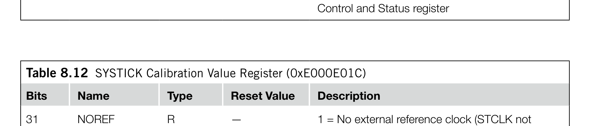
*Description*: Hardware reference table detailing register bit field settings, electrical operating limits, or memory configurations for Table 8.12.

> **Table 8.12**

142
CHAPTER 8  The Nested Vectored Interrupt Controller and Interrupt Control
Table 8.9  SYSTICK Control and Status Register (0xE000E010)
Bits
Name
Type
Reset Value
Description
16
COUNTFLAG
R
0
Read as 1 if counter reaches 0 since last time
this register is read; clear to 0 automatically when
read or when current counter value is cleared
2
CLKSOURCE
R/W
0
0 = External reference clock (STCLK)
1 = Use processor free running clock
1
TICKINT
R/W
0
1 = Enable SYSTICK interrupt generation when
SYSTICK Timer reaches 0
0 = Do not generate interrupt
0
ENABLE
R/W
0
SYSTICK Timer enable
Table 8.10  SYSTICK Reload Value Register (0xE000E014)
Bits
Name
Type
Reset Value
Description
23:0
RELOAD
R/W
0
Reload value when timer reaches 0
Table 8.11  SYSTICK Current Value Register (0xE000E018)
Bits
Name
Type
Reset Value
Description
23:0
CURRENT
R/Wc
0
Read to return current value of the timer.
Write to clear counter to 0. Clearing of current
value also clears COUNTFLAG in SYSTICK
Control and Status register
Table 8.12  SYSTICK Calibration Value Register (0xE000E01C)
Bits
Name
Type
Reset Value
Description
31
NOREF
R
—
1 = No external reference clock (STCLK not
available)
0 = External reference clock available
30
SKEW
R
—
1 = Calibration value is not exactly 10 ms
0 = Calibration value is accurate
23:0
TENMS
R/W
0
Calibration value for 10 ms; chip designer should
provide this value through Cortex-M3 input
signals. If this value is read as 0, calibration value
is not available


<!-- Page 170 -->
### [PDF Page 170]

143

## 8.5  The SYSTICK Timer

Timer stops counting when the processor is halted during debugging. Depending on the design of the
microcontroller, the SysTick Timer could also be stopped when the processor enters certain type of
sleep modes.
To set up the SysTick Timer, the recommended programming sequence is as follows:
Disable
•
SysTick by writing 0 to the SYSTICK Control and Status register.
Write new reload value to the SYSTICK Reload Value register.
•
Write to the SYSTICK Current Value register to clear the current value to 0.
•
Write to the SYSTICK Control and Status register to start the
•
SysTick timer.
This programming sequence can be used on all Cortex-M3 processors. More details of the SysTick
setup is covered in Chapter 14.


<!-- Page 171 -->
### [PDF Page 171]

This page intentionally left blank


