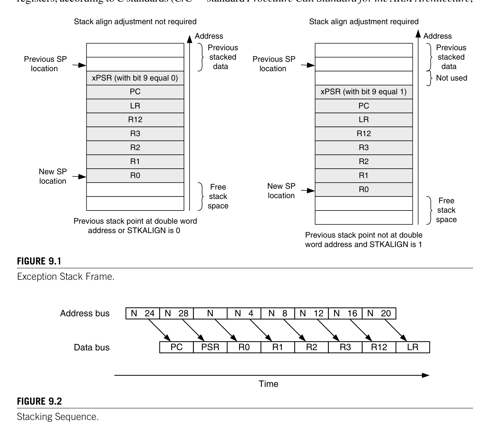
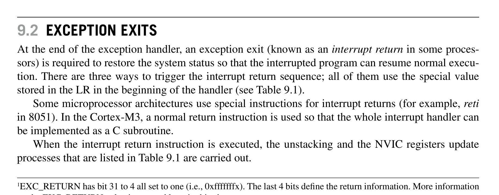
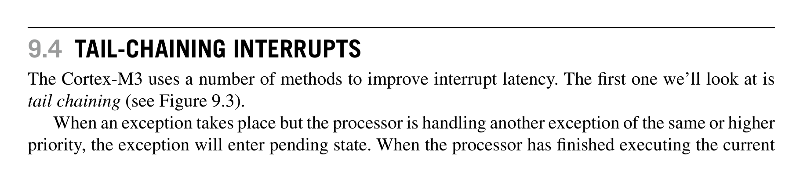
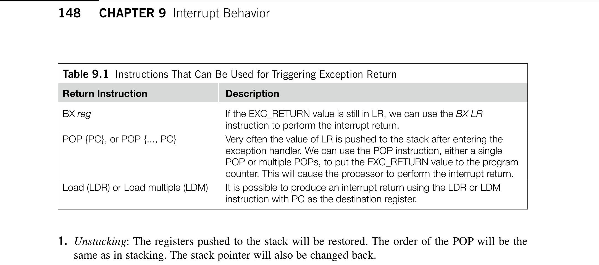
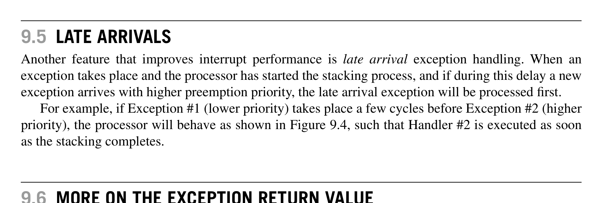
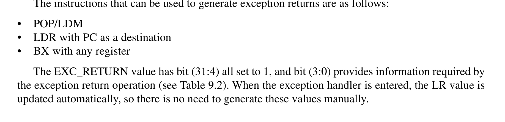
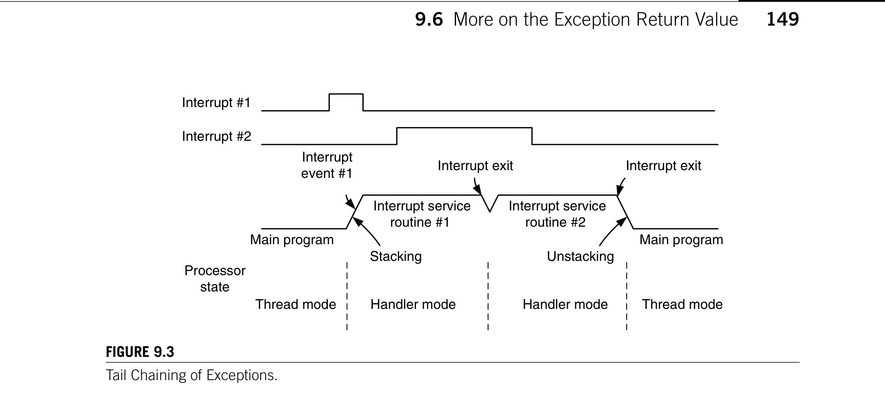
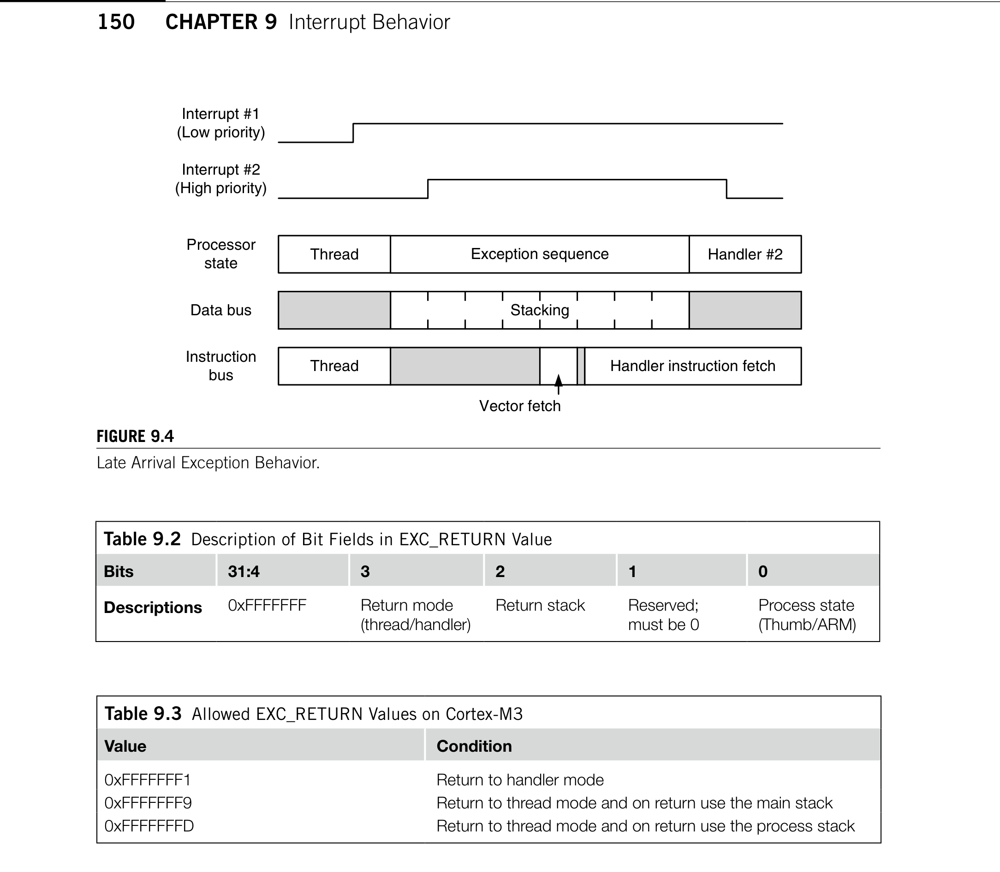
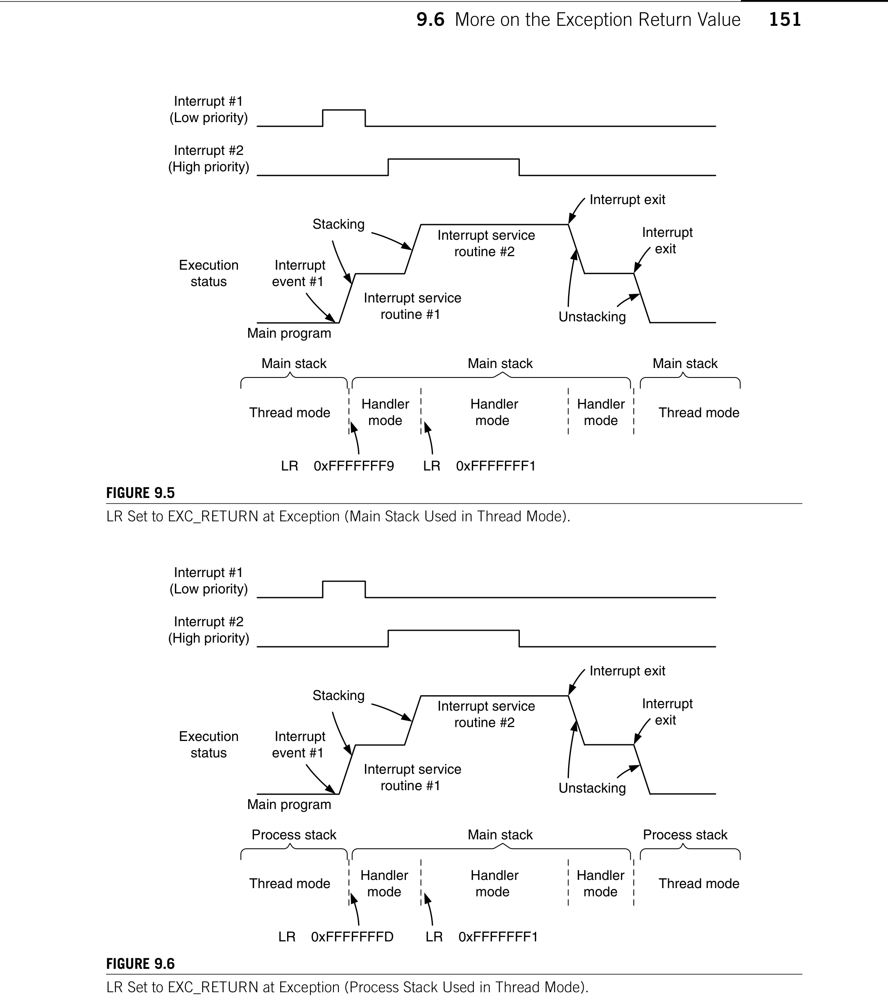
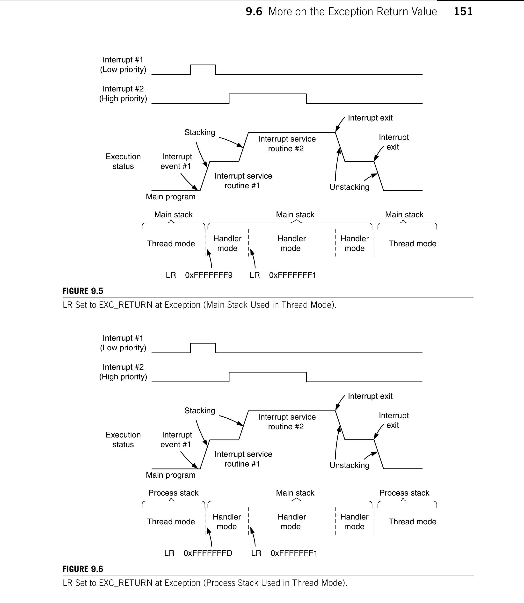

# Chapter
9. Interrupt Behavior

> **Source PDF**: THE_DEFINITIVE_GUIDE_TO_THE_ARM_CORTEX-МЗ_Stellaris_MCU_9000Series_TEINSTRUMENTS_ARM_SECOND_EDITION.pdf  
> **PDF Page Range**: 172 - 181

---

<!-- Page 172 -->
### [PDF Page 172]

145
Copyright © 2010, Elsevier Inc. All rights reserved.
DOI: 10.1016/B978-0-12-382091-4.00015-3
In This Chapter
Interrupt/Exception Sequences............................................................................................................... 145
Exception Exits...................................................................................................................................... 147
Nested Interrupts................................................................................................................................... 148
Tail-Chaining Interrupts......................................................................................................................... 148
Late Arrivals......................................................................................................................................... 149
More on the Exception Return Value....................................................................................................... 149
Interrupt Latency................................................................................................................................... 152
Faults Related to Interrupts.................................................................................................................... 152

## 9.1  Interrupt/Exception Sequences

When an exception takes place, a number of things happen, such as
Stacking (pushing eight registers’ contents to stack)
•
Vector fetch (reading the exception handler starting address from the vector table)
•
Update of the stack pointer, link register (LR), and program counter (PC)
•
9.1.1  Stacking
When an exception takes place, the registers R0–R3, R12, LR, PC, and Program Status (PSR) are
pushed to the stack. If the code that is running uses the Process Stack Pointer (PSP), the process stack
will be used; if the code that is running uses the Main Stack Pointer (MSP), the main stack will be used.
Afterward, the main stack will always be used during the handler, so all nested interrupts will use the
main stack.
The block of eight words of data being pushed to the stack is commonly called a stack frame. Prior
to Cortex™-M3 revision 2, the stack frame was started in any word address by default. In Cortex-M3
revision 2, the stack frame is aligned to double word address by default, although the alignment feature
can be turned off by programming the STKALIGN bit in Nested Vectored Interrupt Controller (NVIC)
CHAPTER
Interrupt Behavior
9

<!-- Page 173 -->
### [PDF Page 173]

*Description*: Technical diagram and schematic illustration detailing hardware circuit topology, signal routing, and logic operations for Figure 9.1.

> **Figure 9.1**

*Description*: Technical diagram and schematic illustration detailing hardware circuit topology, signal routing, and logic operations for Figure 9.2.

> **Figure 9.2**

146
CHAPTER 9  Interrupt Behavior
Configuration Control register to zero. The stack frame feature is also available in ­Cortex-M3 revision
1, but it needs to be enabled by writing 1 to the STKALIGN bit. More details on this register can be
found in Chapter 12.
The data arrangement inside an exception stack frame is shown in Figure 9.1. The order of stack-
ing is shown in Figure 9.2 (assuming that the stack pointer [SP] value is N after the exception). Due to
the pipeline nature of the Advanced High-Performance Bus (AHB) interface, the address and data are
offset by one pipeline state.
The values of PC and PSR are stacked first so that instruction fetch can be started early (which
requires modification of PC) and the Interrupt Program Status register (IPSR) can be updated early.
After ­stacking, SP will be updated, and the stacked data arrangement in the stack memory will look
like Figure 9.1.
The reason the registers R0–R3, R12, LR, PC, and PSR are stacked is that these are caller-saved
registers, according to C standards (C/C++ standard Procedure Call Standard for the ARM ­Architecture,
Figure 9.1
Exception Stack Frame.
xPSR (with bit 9 equal 0)
PC
LR
R12
R3
R2
R1
R0
New SP
location
Free
stack
space
Previous SP
location
New SP
location
Previous SP
location
Previous
stacked
data
Previous stack point at double word
address or STKALIGN is 0
xPSR (with bit 9 equal 1)
PC
LR
R12
R3
R2
R1
R0
Free
stack
space
Previous
stacked
data
Previous stack point not at double
word address and STKALIGN is 1
Not used
Stack align adjustment not required
Stack align adjustment required
Address
Address
Figure 9.2
Stacking Sequence.
Nz 24
Address bus
PC
Nz 28
PSR
N
R0
Nz 4
R1
Nz 8
R2
Nz 12
R3
Nz 16
R12
Nz 20
LR
Data bus
Time

<!-- Page 174 -->
### [PDF Page 174]

*Description*: Hardware reference table detailing register bit field settings, electrical operating limits, or memory configurations for Table 9.1.

> **Table 9.1**

147

## 9.2  Exception Exits

AAPCS [Ref. 5]). This arrangement allows the interrupt handler to be a normal C function because reg-
isters that could be changed by the exception handler are saved in the stack.
The general registers (R0–R3 and R12) are located at the end of the stack frame so that they can be
easily accessed using SP-related addressing. As a result, it’s easy to pass parameters to software inter-
rupts using stacked registers.
9.1.2  Vector Fetches
Although the data bus is busy stacking the registers, the instruction bus carries out another important
task of the interrupt sequence: It fetches the exception vector (the starting address of the exception
handler) from the vector table. Since the stacking and vector fetch are performed on separate bus inter-
faces, they can be carried out at the same time.
9.1.3  Register Updates
After the stacking and vector fetch are completed, the exception vector will start to execute. On entry
of the exception handler, a number of registers will be updated. They are as follows:
•
SP: The SP (either the MSP or the PSP) will be updated to the new location during stacking. During
execution of the interrupt service routine, the MSP will be used if the stack is accessed.
•
PSR: The IPSR (the lowest part of the PSR) will be updated to the new exception number.
•
PC: This will change to the vector handler as the vector fetch completes and starts fetching
instructions from the exception vector.
•
LR: The LR will be updated to a special value called EXC_RETURN.1 This special value drives the
interrupt return operation. The last 4 bits of the LR is used to provide exception return information.
This is covered later in this chapter.
A number of other NVIC registers will also be updated. For example, the pending status of the
exception will be cleared and the active bit of the exception will be set.

## 9.2  Exception Exits

At the end of the exception handler, an exception exit (known as an interrupt return in some proces-
sors) is required to restore the system status so that the interrupted program can resume normal execu-
tion. There are three ways to trigger the interrupt return sequence; all of them use the special value
stored in the LR in the beginning of the handler (see Table 9.1).
Some microprocessor architectures use special instructions for interrupt returns (for example, reti
in 8051). In the Cortex-M3, a normal return instruction is used so that the whole interrupt handler can
be implemented as a C subroutine.
When the interrupt return instruction is executed, the unstacking and the NVIC registers update
processes that are listed in Table 9.1 are carried out.
1EXC_RETURN has bit 31 to 4 all set to one (i.e., 0xfffffffx). The last 4 bits define the return information. More information
on the EXC_RETURN value is covered later in this chapter.

<!-- Page 175 -->
### [PDF Page 175]

*Description*: Technical diagram and schematic illustration detailing hardware circuit topology, signal routing, and logic operations for Figure 9.3.

> **Figure 9.3**

*Description*: Hardware reference table detailing register bit field settings, electrical operating limits, or memory configurations for Table 9.1.

> **Table 9.1**

148
CHAPTER 9  Interrupt Behavior

# 1.	 Unstacking: The registers pushed to the stack will be restored. The order of the POP will be the

same as in stacking. The stack pointer will also be changed back.

# 2.	 NVIC register update: The active bit of the exception will be cleared. For external interrupts, if the

interrupt input is still asserted, the pending bit will be set again, causing it to reenter the interrupt
handler.

## 9.3  Nested Interrupts

Nested interrupt support is built into the Cortex-M3 processor core and the NVIC. There is no need to
use assembler wrapper code to enable nested interrupts. In fact, you do not have to do anything apart
from setting up the appropriate priority level for each interrupt source. First, the NVIC in the Cortex-
M3 processor sorts out the priority decoding for you. So when the processor is handling an exception,
all other exceptions with the same or lower priority will be blocked. Second, the automatic hardware
stacking and unstacking allow the nested interrupt handler to execute without risk of losing data in
registers.
However, one thing needs to be taken care of: Make sure that there is enough space in the main
stack if several nested interrupts are allowed. Since each exception level will use eight words of stack
space and the exception handler code might require extra stack space, it might end up using more stack
memory than expected.
Reentrant exceptions are not allowed in the Cortex-M3. Since each exception has a priority level
assigned and, during exception handling, exceptions with the same or lower priority will be blocked,
the same exception cannot be carried out until the handler is ended. For this reason, Supervisor Call
(SVC) instructions cannot be used inside an SVC handler, since doing so will cause a fault exception.

## 9.4  Tail-Chaining Interrupts

The Cortex-M3 uses a number of methods to improve interrupt latency. The first one we’ll look at is
tail chaining (see Figure 9.3).
When an exception takes place but the processor is handling another exception of the same or higher
priority, the exception will enter pending state. When the processor has finished executing the current
Table 9.1  Instructions That Can Be Used for Triggering Exception Return
Return Instruction
Description
BX reg
If the EXC_RETURN value is still in LR, we can use the BX LR
instruction to perform the interrupt return.
POP {PC}, or POP {..., PC}
Very often the value of LR is pushed to the stack after entering the
exception handler. We can use the POP instruction, either a single
POP or multiple POPs, to put the EXC_RETURN value to the program
counter. This will cause the processor to perform the interrupt return.
Load (LDR) or Load multiple (LDM)
It is possible to produce an interrupt return using the LDR or LDM
instruction with PC as the destination register.

<!-- Page 176 -->
### [PDF Page 176]

*Description*: Technical diagram and schematic illustration detailing hardware circuit topology, signal routing, and logic operations for Figure 9.4.

> **Figure 9.4**

*Description*: Hardware reference table detailing register bit field settings, electrical operating limits, or memory configurations for Table 9.2.

> **Table 9.2**

*Description*: Technical diagram and schematic illustration detailing hardware circuit topology, signal routing, and logic operations for Figure 9.3.

> **Figure 9.3**

149

## 9.6  More on the Exception Return Value

exception handler, it can then process the pended interrupt. Instead of restoring the registers back from
the stack (unstacking) and then pushing them onto the stack again (stacking), the processor skips the
unstacking and stacking steps and enters the exception handler of the pended exception as soon as pos-
sible. In this way, the timing gap between the two exception handlers is considerably reduced.

## 9.5  Late Arrivals

Another feature that improves interrupt performance is late arrival exception handling. When an
exception takes place and the processor has started the stacking process, and if during this delay a new
exception arrives with higher preemption priority, the late arrival exception will be processed first.
For example, if Exception #1 (lower priority) takes place a few cycles before Exception #2 (higher
priority), the processor will behave as shown in Figure 9.4, such that Handler #2 is executed as soon
as the stacking completes.

## 9.6  More on the Exception Return Value

When entering an exception handler, the LR is updated to a special value called EXC_RETURN, with
the upper 28 bits all set to 1. This value, when loaded into the PC at the end of the exception handler
execution, will cause the processor to perform an exception return sequence.
The instructions that can be used to generate exception returns are as follows:
POP/LDM
•
LDR with PC as a destination
•
BX with any register
•
The EXC_RETURN value has bit (31:4) all set to 1, and bit (3:0) provides information required by
the exception return operation (see Table 9.2). When the exception handler is entered, the LR value is
updated automatically, so there is no need to generate these values manually.
Figure 9.3
Tail Chaining of Exceptions.
Interrupt #1
Interrupt #2
Main program
Processor
state
Interrupt service
routine #1
Interrupt service
routine #2
Main program
Interrupt
event #1
Interrupt exit
Interrupt exit
Stacking
Unstacking
Thread mode
Handler mode
Handler mode
Thread mode

<!-- Page 177 -->
### [PDF Page 177]

*Description*: Hardware reference table detailing register bit field settings, electrical operating limits, or memory configurations for Table 9.3.

> **Table 9.3**

*Description*: Hardware reference table detailing register bit field settings, electrical operating limits, or memory configurations for Table 9.2.

> **Table 9.2**

*Description*: Technical diagram and schematic illustration detailing hardware circuit topology, signal routing, and logic operations for Figure 9.4.

> **Figure 9.4**

150
CHAPTER 9  Interrupt Behavior
Bit 0 indicates the process state being used after the exception return. Since the Cortex-M3 supports
only the Thumb® state, bit 0 must be 1. The valid values (for the Cortex-M3) are shown in Table 9.3.
If the thread is using the MSP (main stack), the value of LR will be set to 0xFFFFFFF9 when it
enters an exception, and 0xFFFFFFF1 when a nested exception is entered, as shown in Figure 9.5. If
the thread is using PSP (process stack), the value of LR would be 0xFFFFFFFD when entering the first
exception and 0xFFFFFFF1 for entering a nested exception, as shown in Figure 9.6.
As a result of the EXC_RETURN number format, you cannot perform interrupt returns to an address
in the 0xFFFFFFF0–0xFFFFFFFF memory range. However, since this address is in a nonexecutable
region anyway, it is not a problem.
Table 9.2  Description of Bit Fields in EXC_RETURN Value
Bits
31:4
3
2
1
0
Descriptions
0xFFFFFFF
Return mode
(thread/handler)
Return stack
Reserved;
must be 0
Process state
(Thumb/ARM)
Table 9.3  Allowed EXC_RETURN Values on Cortex-M3
Value
Condition
0xFFFFFFF1
Return to handler mode
0xFFFFFFF9
Return to thread mode and on return use the main stack
0xFFFFFFFD
Return to thread mode and on return use the process stack
Figure 9.4
Late Arrival Exception Behavior.
Interrupt #1
(Low priority)
Interrupt #2
(High priority)
Processor
state
Thread
Handler #2
Exception sequence
Data bus
Stacking
Instruction
bus
Thread
Vector fetch
Handler instruction fetch

<!-- Page 178 -->
### [PDF Page 178]

*Description*: Technical diagram and schematic illustration detailing hardware circuit topology, signal routing, and logic operations for Figure 9.5.

> **Figure 9.5**

*Description*: Technical diagram and schematic illustration detailing hardware circuit topology, signal routing, and logic operations for Figure 9.6.

> **Figure 9.6**

151

## 9.6  More on the Exception Return Value

Figure 9.5
LR Set to EXC_RETURN at Exception (Main Stack Used in Thread Mode).
Interrupt #1
(Low priority)
Interrupt #2
(High priority)
Main program
Interrupt exit
Interrupt
exit
Unstacking
Interrupt service
routine #2
Interrupt service
routine #1
Stacking
Execution
status
Interrupt
event #1
Thread mode
Handler
mode
Handler
mode
Handler
mode
Thread mode
LRz 0xFFFFFFF9
LR z 0xFFFFFFF1
Main stack
Main stack
Main stack
Figure 9.6
LR Set to EXC_RETURN at Exception (Process Stack Used in Thread Mode).
Interrupt #1
(Low priority)
Interrupt #2
(High priority)
Main program
Interrupt exit
Interrupt
exit
Unstacking
Interrupt service
routine #2
Interrupt service
routine #1
Stacking
Execution
status
Interrupt
event #1
Thread mode
Handler
mode
Handler
mode
Handler
mode
Thread mode
LRz 0xFFFFFFFD
LR z 0xFFFFFFF1
Main stack
Process stack
Process stack

<!-- Page 179 -->
### [PDF Page 179]

152
CHAPTER 9  Interrupt Behavior

## 9.7  Interrupt Latency

The term interrupt latency refers to the delay from the start of the interrupt request to the start of
interrupt handler execution. In the Cortex-M3 processor, if the memory system has zero latency, and
provided that the bus system design allows vector fetch and stacking to happen at the same time, the
interrupt latency can be as low as 12 cycles. This includes stacking the registers, vector fetch, and fetch-
ing instructions for the interrupt handler. However, this depends on memory access wait states and a
few other factors.
For tail-chaining interrupts, since there is no need to carry out stacking operations, the latency of
switching from one exception handler to another exception handler can be as low as six cycles.
When the processor is executing a multicycle instruction, such as divide, the instruction could be
abandoned and restarted after the interrupt handler completes. This also applies to load double (LDRD)
and store double (STRD) instructions.
To reduce exception latency, the Cortex-M3 processor allows exceptions in the middle of Mul-
tiple Load and Store instructions (LDM/STM). If the LDM/STM instruction is executing, the current
memory accesses will be completed, and the next register number will be saved in the stacked xPSR
(Interrupt-Continuable Instruction [ICI] bits). After the exception handler completes, the multiple load/
store will resume from the point at which the transfer stopped. There is a corner case: If the multiple
load/store instruction being interrupted is part of an IF-THEN (IT) instruction block, the load/store
instruction will be cancelled and restarted when the interrupt is completed. This is because the ICI bits
and IT execution status bits share the same space in the Execution Program Status Register (EPSR).
In addition, if there is an outstanding transfer on the bus interface, such as a buffered write, the
processor will wait until the transfer is completed. This is necessary to ensure that a bus fault handler
preempts the correct process.
Of course, the interrupt could be blocked if the processor is already executing another exception
handler of the same or higher priority or if the Interrupt Mask register was masking the interrupt request.
In these cases, the interrupt will be pended and will not be processed until the blocking is removed.

## 9.8  Faults Related to Interrupts

Various faults can be caused by exception handling. Let’s take a look at these now.
9.8.1  Stacking
If a bus fault takes place during stacking, the stacking sequence will be terminated and the bus fault
exception will be triggered or pended. If the bus fault is disabled, the hard fault handler will be executed.
Otherwise, if the bus fault handler has higher priority than the original exception, the bus fault handler
will be executed; if not, it will be pended until the original exception is completed. This scenario, called
a stacking error, is indicated by the STKERR (bit 4) in the Bus Fault Status register (0xE000ED29).
If the stacking error is caused by a Memory Protection Unit (MPU) violation, the memory man-
agement fault handler will be executed and the MSTKERR (bit 4) in the Memory Management Fault
Status register (0xE000ED28) will be set to indicate the problem. If the memory management fault is
disabled, the hard fault handler will be executed.

<!-- Page 180 -->
### [PDF Page 180]

153

## 9.8  Faults Related to Interrupts

9.8.2  Unstacking
If a bus fault takes place during unstacking (an interrupt return), the unstacking sequence will be termi-
nated and the bus fault exception will be triggered or pended. If the bus fault is disabled, the hard fault
handler will be executed. Otherwise, if the bus fault handler has higher priority than the current priority
of the executing task (the core could already be executing another exception in a nested interrupt case),
the bus fault handler will be executed. This scenario, called an unstacking error, is indicated by the
UNSTKERR (bit 3) in the Bus Fault Status register (0xE000ED29).
Similarly, if the stacking error is caused by an MPU violation, the memory management fault han-
dler will be executed and the MUNSTKERR (bit 3) in the Memory Management Fault Status register
(0xE000ED28) will be set to indicate the problem. If the memory management fault is disabled, the
hard fault handler will be executed.
9.8.3  Vector Fetches
If a bus fault or memory management fault takes place during a vector fetch, the hard fault handler will
be executed. This is indicated by VECTTBL (bit 1) in the Hard Fault Status register (0xE000ED2C).
9.8.4  Invalid Returns
If the EXC_RETURN number is invalid or does not match the state of the processor (as in using
0xFFFFFFF1 to return to thread mode), it will trigger the usage fault. If the usage fault handler is not
enabled, the hard fault handler will be executed instead. The INVPC bit (bit 2) or INVSTATE (bit 1)
bit in the Usage Fault Status register (0xE000ED2A) will be set, depending on the actual cause of the
fault.

<!-- Page 181 -->
### [PDF Page 181]

This page intentionally left blank

