# Chapter 10. Cortex-M3 Programming

> **Source PDF**: THE_DEFINITIVE_GUIDE_TO_THE_ARM_CORTEX-МЗ_Stellaris_MCU_9000Series_TEINSTRUMENTS_ARM_SECOND_EDITION.pdf  
> **PDF Page Range**: 182 - 209


---


<!-- Page 182 -->
### [PDF Page 182]

155
Copyright © 2010, Elsevier Inc. All rights reserved.
DOI: 10.1016/B978-0-12-382091-4.00016-5
CHAPTER
In This Chapter

### Overview............................................................................................................................................... 155

A Typical Development Flow.................................................................................................................. 155
Using C................................................................................................................................................. 156
CMSIS.................................................................................................................................................. 164
Using Assembly..................................................................................................................................... 169
Using Exclusive Access for Semaphores................................................................................................. 177
Using Bit Band for Semaphores.............................................................................................................. 179
Working with Bit Field Extract and Table Branch..................................................................................... 181

## 10.1  Overview

The Cortex™-M3 can be programmed using either assembly language, C language, or other high-level
languages like National Instruments LabVIEW. For most embedded applications using the Cortex-M3
processor, the software can be written entirely in C language. There are of course some people who pre-
fer to use assembly language or a combination of C and assembly language in their projects. The pro-
cedure of building and downloading the resultant image files to the target device is largely dependent
on the tool chain used. Although this is not the main focus of this book, some simple examples showing
how to use the Gnu’s Not Unix (GNU) and Keil tool chains are provided in Chapters 19 and 20, and an
introduction of using LabVIEW on Cortex-M3 is covered in Chapter 21.

## 10.2  A Typical Development Flow

Various software programs are available for developing Cortex-M3 applications. The concepts of code
generation flow in terms of these tools are similar. For the most basic uses, you will need assembler, a
C compiler, a linker, and binary file generation utilities. For ARM solutions, the RealView Develop-
ment Suite (RVDS) or RealView Compiler Tools (RVCT) provide a file generation flow, as shown in
Cortex-M3 Programming
10


<!-- Page 183 -->
### [PDF Page 183]


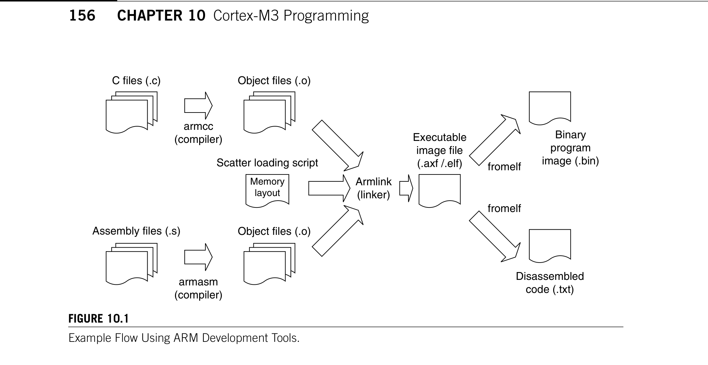
*Description*: Technical diagram and schematic illustration detailing hardware circuit topology, signal routing, and logic operations for Figure 10.1.

> **Figure 10.1**

156
CHAPTER 10  Cortex-M3 Programming
Figure 10.1. The scatter-loading script is optional but often required when the memory map becomes
more complex.
Besides these basic tools, RVDS also contains a large number of utilities, including an Integrated
Development Environment (IDE) and debuggers. Please visit the ARM web site (www.arm.com) for
details.

## 10.3  Using C

For beginners in embedded programming, using C language for software development on the ­Cortex-M3
processor is the best choice. Programming in C with the Cortex-M3 processor is made even easier as
most microcontroller vendors provide device driver libraries written in C to control peripherals. These
can then be included into your project. Since modern C compilers can generate very efficient code, it
is better to program in C than spending a lot of time to try to develop complex routines in assembly
language, which is error prone and less portable.
In this chapter, we will have a quick look at a simple example of using C language to create a simple
program image. Then, we will have a look at some C language development areas including using
device driver libraries and the Cortex Microcontroller Software Interface Standard (CMSIS).
C has the advantage of being portable and easier for implementing complex operations, compared
with assembly language. Since it’s a generic computer language, C does not specify how the processor
is initialized. For these areas, tool chains can have different approaches. The best way to get started is to
look at example codes. For users of ARM C compiler products, such as RVDS or Keil RealView Micro-
controller Development Kit (MDK-ARM), a number of Cortex-M3 program examples are already
included in the installation. For users of the GNU tool chain, Chapter 19 provides a simple C example
based on the CodeSourcery GNU tool chain for ARM.
Figure 10.1
Example Flow Using ARM Development Tools.
C files (.c)
armcc
(compiler)
Object files (.o)
Assembly files (.s)
armasm
(compiler)
Object files (.o)
Scatter loading script
Executable
image file
(.axf /.elf)
Armlink
(linker)
fromelf
fromelf
Binary
program
image (.bin)
Disassembled
code (.txt)
Memory
layout


<!-- Page 184 -->
### [PDF Page 184]

157

## 10.3  Using C

10.3.1  Example of a Simple C Program Using RealView Development Site
A normal program for the Cortex-M3 contains at least the “main” program and a vector table. Let’s
start with the most basic main program that toggles an Light Emitting Diode (LED):
#define LED *((volatile unsigned int *)(0xDFFF000C))

```c
int main (void)
```

{

```c
int i;          /* loop counter for delay function */
volatile int j; /* dummy volatile variable to prevent
```

C compiler from optimize the delay away */
while (1) {
LED = 0x00; /* toogle LED */
for (i=0;i<10;i++) {j=0;} /* delay */
LED = 0x01; /* toogle LED */
for (i=0;i<10;i++) {j=0;} /* delay */
}
return 0;
}
This file is named “blinky.c.” For the vector table, we create a separate C program called “vectors.c.”
The file “vectors.c” contains the vector table, as well as a number of dummy exception handlers (these
can be customized for target application later on):
typedef void(* const ExecFuncPtr)(void) __irq;
extern int __main(void);
/*
* Dummy handlers Exception Handlers
*/
__irq void NMI_Handler(void)
{   while(1); }
__irq void HardFault_Handler(void)
{   while(1); }
__irq void SVC_Handler(void)
{   while(1); }
__irq void DebugMon_Handler(void)
{   while(1); }
__irq void PendSV_Handler(void)
{   while(1); }
__irq void SysTick_Handler(void)
{   while(1); }
__irq void ExtInt0_IRQHandler(void)
{   while(1); }
__irq void ExtInt1_IRQHandler(void)
{   while(1); }
__irq void ExtInt2_IRQHandler(void)
{   while(1); }
__irq void ExtInt3_IRQHandler(void)
{   while(1); }
#pragma arm section rodata="exceptions_area"


<!-- Page 185 -->
### [PDF Page 185]

158
CHAPTER 10  Cortex-M3 Programming
ExecFuncPtr exception_table[] = { /* vector table */
(ExecFuncPtr)0x20002000,
(ExecFuncPtr)__main,
NMI_Handler, /* NMI */
HardFault_Handler,
0, /* MemManage_Handler in Cortex-M3 */
0, /* BusFault_Handler in Cortex-M3 */
0, /* UsageFault_Handler in Cortex-M3 */
0, /* Reserved */
0, /* Reserved */
0, /* Reserved */
0, /* Reserved */
SVC_Handler,
0, /* DebugMon_Handler in Cortex-M3 */
0, /* Reserved */
PendSV_Handler,
SysTick_Handler,
/* External Interrupts*/
ExtInt0_IRQHandler,
ExtInt1_IRQHandler,
ExtInt2_IRQHandler,
ExtInt3_IRQHandler
};
#pragma arm section
Assuming you are using RVDS, you can compile the program using the following command line:
$> armcc –c –g –W blinky.c –o blinky.o
$> armcc –c –g –W vectors.c –o vectors.o
Then the linker can be used to generate the program image. A scatter loading file “led.scat” is used to
tell the linker the memory layout and to put the vector table in the starting of the program image. The
“led.scat” is
#define HEAP_BASE 0x20001000
#define STACK_BASE 0x20002000
#define HEAP_SIZE ((STACK_BASE-HEAP_BASE)/2)
#define STACK_SIZE ((STACK_BASE-HEAP_BASE)/2)
LOAD_REGION 0x00000000 0x00200000
{
VECTORS 0x0 0xC0
{
; Provided by the user in vectors.c
* (exceptions_area)
}
CODE 0xC0 FIXED
{
* (+RO)
}
DATA 0x20000000 0x00010000
{
* (+RW, +ZI)
}


<!-- Page 186 -->
### [PDF Page 186]

159

## 10.3  Using C

;; Heap starts at 4KB and grows upwards
ARM_LIB_HEAP HEAP_BASE EMPTY HEAP_SIZE
{
}
;; Stack starts at the end of the 8KB of RAM
;; And grows downwards for 2KB
ARM_LIB_STACK STACK_BASE EMPTY -STACK_SIZE
{
}
}
And the command line for the linker is
$> armlink –scatter led.scat "--keep=vectors.o(exceptions_area)"
blinky.o vectors.o –o blinky.elf
The executable image blinky.elf is now generated. We can convert it to binary file and disassem-
bly file using fromelf.
/* create binary file */
$> fromelf –-bin blinky.elf –output blinky.bin
/* Create disassembly output */
$> fromelf –c blinky.elf > list.txt
Previously in ARM processors, because there is a Thumb® state and an ARM state, the code for differ-
ent states has to be compiled differently. In the Cortex-M3, there is no such need because everything is
in the Thumb state, and project file management is much simpler.
When you’re developing applications in C, it is recommended that you use the double word
stack alignment function (configured by the STKALIGN bit in the Nested Vectored Interrupt
Controller [NVIC] Configuration Control register). For users of Cortex-M3 revision 2 or future
products, the STKALIGN bit is set by default at reset so there is no need to set up this bit in the
software. Users of Cortex-M3 revision 1 can enable this feature by setting this bit in the beginning
of their applications, for example. The details of STKALIGN feature are covered in Chapter 9.
SCB->CCR = SCB->CCR | 0x200; /* Set STKALIGN */
/* SCB->CCR is defined in device driver library. */
If you are not using a CMSIS compliant device driver, you can use the following code instead.
#define NVIC_CCR *((volatile unsigned long *)(0xE000ED14))
NVIC_CCR = NVIC_CCR | 0x200; /* Set STKALIGN */
Using this feature ensures that the system conforms to Procedure Call Standards for the ARM
Architecture (AAPCS). Additional information on this subject is covered in Chapter 12.
10.3.2  Compile the Same Example Using Keil MDK-ARM
For users of Keil MDK-ARM, it is possible to compile the same program as in RVDS. However, the
command line options and a few symbols in the linker script (scatter loading file) have to be modified.
Based on the example in Section 10.3.1, scatter loading file “led.scat” needed to be modified to


<!-- Page 187 -->
### [PDF Page 187]

160
CHAPTER 10  Cortex-M3 Programming
#define HEAP_BASE 0x20001000
#define STACK_BASE 0x20002000
#define HEAP_SIZE ((STACK_BASE-HEAP_BASE)/2)
#define STACK_SIZE ((STACK_BASE-HEAP_BASE)/2)
LOAD_REGION 0x00000000 0x00200000
{
VECTORS 0x0 0xC0
{
; Provided by the user in vectors.c
* (exceptions_area)
}
CODE 0xC0 FIXED
{
* (+RO)
}
DATA 0x20000000 0x00010000
{
* (+RW, +ZI)
}
;; Heap starts at 4KB and grows upwards
Heap_Mem HEAP_BASE EMPTY HEAP_SIZE
{
}
;; Stack starts at the end of the 8KB of RAM
;; And grows downwards for 2KB
Stack_Mem STACK_BASE EMPTY -STACK_SIZE
{
}
}
And the compile sequence can be created in a DOS batch file
SET PATH=C:\Keil\ARM\BIN40\;%PATH%
SET RVCT40INC=C:\Keil\ARM\RV31\INC
SET RVCT40LIB=C:\Keil\ARM\RV31\LIB
SET CPU_TYPE=Cortex-M3
SET CPU_VENDOR=ARM
SET UV2_TARGET=Target 1
SET CPU_CLOCK=0x00000000
C:\Keil\ARM\BIN40\armcc -c -O3 -W -g -Otime --device DLM vectors.c
C:\Keil\ARM\BIN40\armcc -c -O3 -W -g -Otime --device DLM blinky.c
C:\Keil\ARM\BIN40\armlink --device DLM "--keep=Startup.o(RESET)"
"--first=Startup.o(RESET)" -scatter led.scat --map vectors.o
blinky.o -o blinky.elf
C:\Keil\ARM\BIN40\fromelf --bin blinky.elf -o blinky.bin
In general, it is much easier to use the μVision IDE to create and compile projects rather than using
command lines. Chapter 20 is ideal for beginners who want to start using the Cortex-M3 microcon-
trollers with the Keil Microcontroller Development Kit for ARM (MDK-ARM).


<!-- Page 188 -->
### [PDF Page 188]


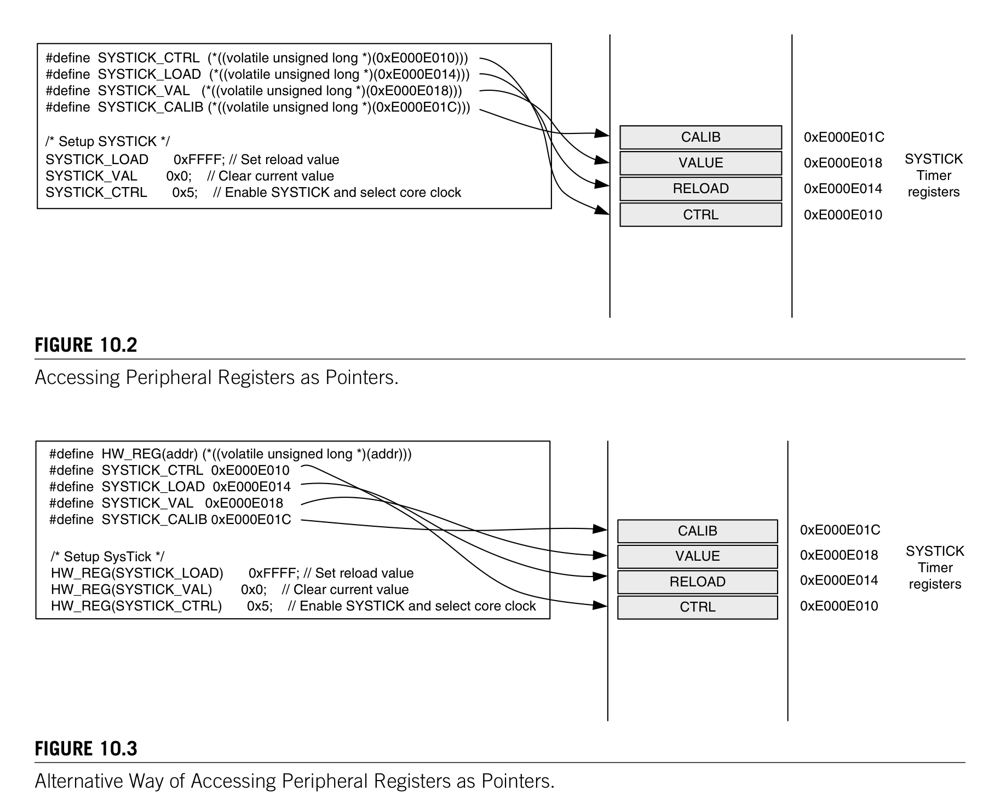
*Description*: Technical diagram and schematic illustration detailing hardware circuit topology, signal routing, and logic operations for Figure 10.2.

> **Figure 10.2**


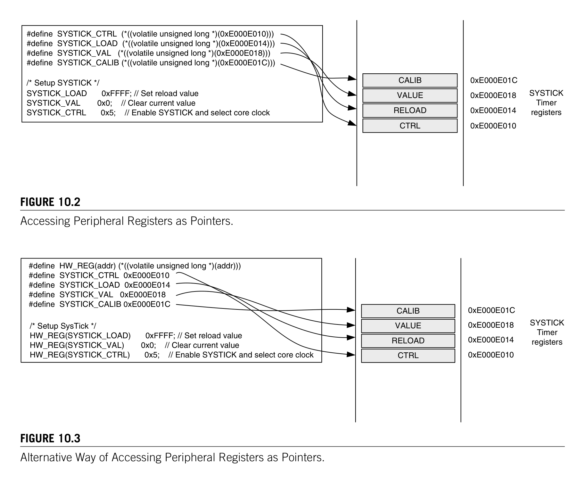
*Description*: Technical diagram and schematic illustration detailing hardware circuit topology, signal routing, and logic operations for Figure 10.3.

> **Figure 10.3**

161

## 10.3  Using C

10.3.3  Accessing Memory-Mapped Registers in C
There are various ways to access memory-mapped peripheral registers in C language. For illustration,
we will use the System Tick (SYSTICK) Timer in the Cortex-M3 as an example peripheral to demon-
strate different access methods in C language. The SYSTICK is a 24-bit timer which contains only four
registers. The functionality of the SYSTICK will be covered in Chapter 14. In the previous examples,
we have already illustrated the easiest method—defining each register as a pointer. To apply the same
solution to the SYSTICK, we can define each register separately. This is illustrated in Figure 10.2.
Based on the same method, we can define a macro to convert address values to C pointer. The
C-code looks a bit different, but the generated code is the same as previous implementation. This is
illustrated in Figure 10.3.
Method 2 is to define the registers as a data structure, and then define a pointer of the defined structure.
This is the method used in CMSIS compliant device driver libraries. This is illustrated in Figure 10.4.
Method 3 also uses data structure, but the base address of the peripheral is defined using a scatter
loading file (or linker script) during linking stage. This is illustrated in Figure 10.5.
Figure 10.2
Accessing Peripheral Registers as Pointers.
#define  SYSTICK_CTRL  (*((volatile unsigned long *)(0xE000E010)))
#define  SYSTICK_LOAD  (*((volatile unsigned long *)(0xE000E014)))
#define  SYSTICK_VAL   (*((volatile unsigned long *)(0xE000E018)))
#define  SYSTICK_CALIB (*((volatile unsigned long *)(0xE000E01C)))
/* Setup SYSTICK */
SYSTICK_LOAD   z 0xFFFF; // Set reload value
SYSTICK_VAL    z 0x0;    // Clear current value
SYSTICK_CTRL   z 0x5;    // Enable SYSTICK and select core clock
CTRL
RELOAD
VALUE
CALIB
SYSTICK
Timer
registers
0xE000E010
0xE000E014
0xE000E018
0xE000E01C
Figure 10.3
Alternative Way of Accessing Peripheral Registers as Pointers.
#define  HW_REG(addr) (*((volatile unsigned long *)(addr)))
#define  SYSTICK_CTRL  0xE000E010
#define  SYSTICK_LOAD  0xE000E014
#define  SYSTICK_VAL   0xE000E018
#define  SYSTICK_CALIB 0xE000E01C
/* Setup SysTick */
HW_REG(SYSTICK_LOAD)   z 0xFFFF; // Set reload value
HW_REG(SYSTICK_VAL)    z 0x0;    // Clear current value
HW_REG(SYSTICK_CTRL)   z 0x5;    // Enable SYSTICK and select core clock
CTRL
RELOAD
VALUE
CALIB
SYSTICK
Timer
registers
0xE000E010
0xE000E014
0xE000E018
0xE000E01C


<!-- Page 189 -->
### [PDF Page 189]


*Description*: Technical diagram and schematic illustration detailing hardware circuit topology, signal routing, and logic operations for Figure 10.5.

> **Figure 10.5**


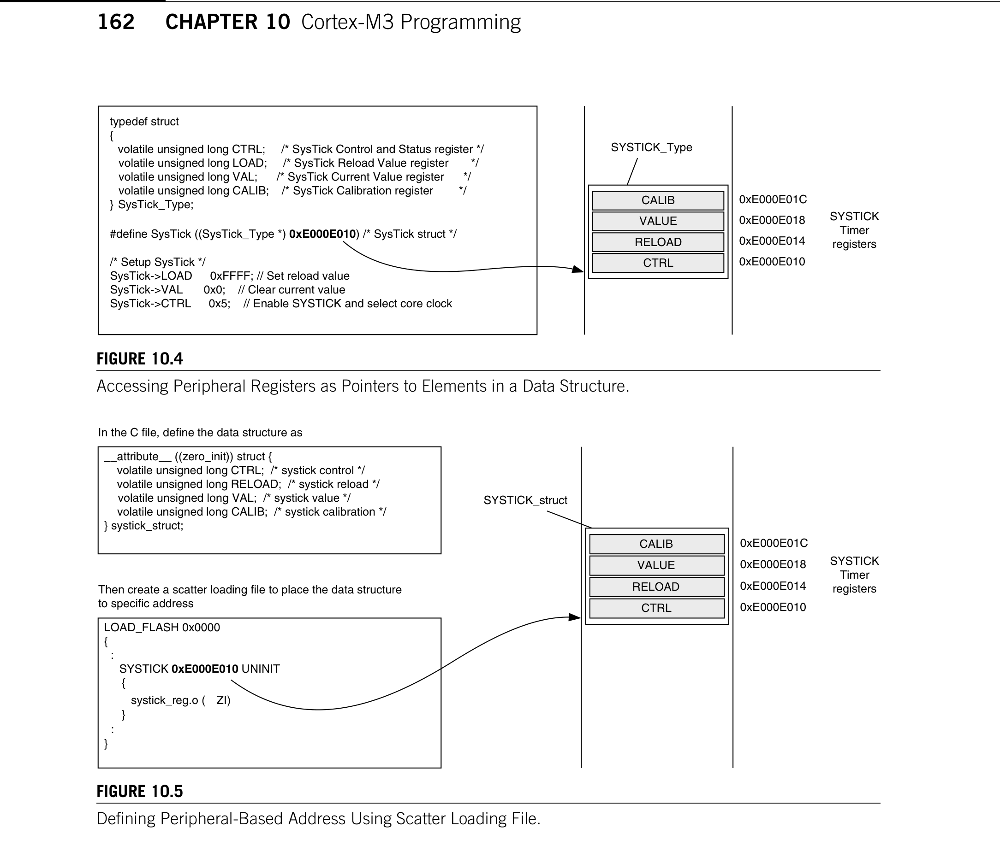
*Description*: Technical diagram and schematic illustration detailing hardware circuit topology, signal routing, and logic operations for Figure 10.4.

> **Figure 10.4**

162
CHAPTER 10  Cortex-M3 Programming
In this case (method is shown in Figure 10.5), the program code using the peripheral has to define
the peripheral as a C pointer in an external object. The code for accessing the register is the same as in
the second method.
Method 1 (shown in Figures 10.2 and 10.3) is the simplest, however, it can result in less efficient
code compared with the others as the address value for the registers are stored separately as constant.
As a result, the code size can be larger and might be slower as it requires more accesses to the program
memory to set up the address values. However, for peripheral control code that only access to one
­register, the efficiency of method 1 is identical to others.
Method 2 (using data structure and a pointer defined in the C-code) is possibly the most com-
monly used. It allows the registers in a peripheral to share just one constant for base address value.
The ­immediate offset address mode can be used for access of each register. This is the method used in
CMSIS, which will be covered later in this chapter.
Figure 10.5
Defining Peripheral-Based Address Using Scatter Loading File.
__attribute__ ((zero_init)) struct {
volatile unsigned long CTRL;  /* systick control */
volatile unsigned long RELOAD;  /* systick reload */
volatile unsigned long VAL;  /* systick value */
volatile unsigned long CALIB;  /* systick calibration */
} systick_struct;
In the C file, define the data structure as
LOAD_FLASH 0x0000
{
:
SYSTICK 0xE000E010 UNINIT
{
systick_reg.o ( z ZI)
}
:
}
Then create a scatter loading file to place the data structure
to specific address
CTRL
RELOAD
VALUE
CALIB
SYSTICK
Timer
registers
0xE000E010
0xE000E014
0xE000E018
0xE000E01C
SYSTICK_struct
Figure 10.4
Accessing Peripheral Registers as Pointers to Elements in a Data Structure.
typedef struct
{
volatile unsigned long CTRL;     /* SysTick Control and Status register */
volatile unsigned long LOAD;     /* SysTick Reload Value register       */
volatile unsigned long VAL;      /* SysTick Current Value register      */
volatile unsigned long CALIB;    /* SysTick Calibration register        */
} SysTick_Type;
#define SysTick ((SysTick_Type *) 0xE000E010) /* SysTick struct */
/* Setup SysTick */
SysTick->LOAD  z 0xFFFF; // Set reload value
SysTick->VAL   z 0x0;    // Clear current value
SysTick->CTRL  z 0x5;    // Enable SYSTICK and select core clock
CTRL
RELOAD
VALUE
CALIB
SYSTICK
Timer
registers
0xE000E010
0xE000E014
0xE000E018
0xE000E01C
SYSTICK_Type


<!-- Page 190 -->
### [PDF Page 190]


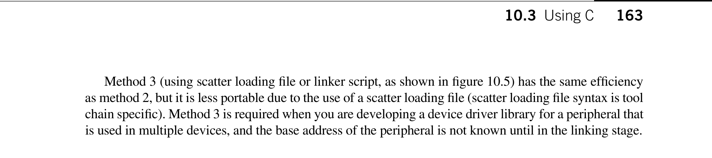
*Description*: Technical diagram and schematic illustration detailing hardware circuit topology, signal routing, and logic operations for Figure 10.5.

> **Figure 10.5**


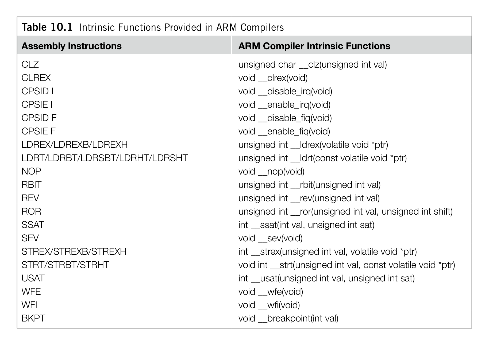
*Description*: Hardware reference table detailing register bit field settings, electrical operating limits, or memory configurations for Table 10.1.

> **Table 10.1**

163

## 10.3  Using C

Method 3 (using scatter loading file or linker script, as shown in figure 10.5) has the same efficiency
as method 2, but it is less portable due to the use of a scatter loading file (scatter loading file syntax is tool
chain specific). Method 3 is required when you are developing a device driver library for a peripheral that
is used in multiple devices, and the base address of the peripheral is not known until in the linking stage.
10.3.4  Intrinsic Functions
Use of the C language can often speed up application development, but in some cases, we need to
use  some instructions that cannot be generated using normal C-code. Some C compilers provide
intrinsic functions for accessing these special instructions. Intrinsic functions are used just like normal
C functions. For example, ARM compilers (including RealView C Compilers and Keil MDK-ARM)
provide the intrinsic functions listed in Table 10.1 for commonly used instructions.
10.3.5  Embedded Assembler and Inline Assembler
As an alternative to using intrinsic functions, we can also directly access assembly instructions in
C-code. This is often necessary in low-level system control or when you need to implement a timing
critical routine and decide to implement it in assembly for the best performance. Most ARM C compil-
ers allow you to include assembly code in form of inline assembler.
Table 10.1  Intrinsic Functions Provided in ARM Compilers
Assembly Instructions
ARM Compiler Intrinsic Functions
CLZ
unsigned char __clz(unsigned int val)
CLREX

```c
void __clrex(void)
```

CPSID I

```c
void __disable_irq(void)
```

CPSIE I

```c
void __enable_irq(void)
```

CPSID F

```c
void __disable_fiq(void)
```

CPSIE F

```c
void __enable_fiq(void)
```

LDREX/LDREXB/LDREXH
unsigned int __ldrex(volatile void *ptr)
LDRT/LDRBT/LDRSBT/LDRHT/LDRSHT
unsigned int __ldrt(const volatile void *ptr)
NOP

```c
void __nop(void)
```

RBIT
unsigned int __rbit(unsigned int val)
REV
unsigned int __rev(unsigned int val)
ROR
unsigned int __ror(unsigned int val, unsigned int shift)
SSAT

```c
int __ssat(int val, unsigned int sat)
```

SEV

```c
void __sev(void)
```

STREX/STREXB/STREXH

```c
int __strex(unsigned int val, volatile void *ptr)
```

STRT/STRBT/STRHT

```c
void int __strt(unsigned int val, const volatile void *ptr)
```

USAT

```c
int __usat(unsigned int val, unsigned int sat)
```

WFE

```c
void __wfe(void)
```

WFI

```c
void __wfi(void)
```

BKPT

```c
void __breakpoint(int val)
```


<!-- Page 191 -->
### [PDF Page 191]


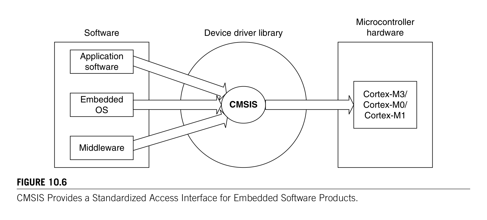
*Description*: Technical diagram and schematic illustration detailing hardware circuit topology, signal routing, and logic operations for Figure 10.6.

> **Figure 10.6**

164
CHAPTER 10  Cortex-M3 Programming
In the ARM compiler, you can add assembly code inside the C program. Traditionally, inline
assembler is used, but the inline assembler in RealView C Compiler does not support instructions in
Thumb-2 technology. Starting with RealView C Compiler version 3.0, a new feature called the Embed-
ded Assembler is included, and it supports the instruction set in Thumb-2. For example, you can insert
assembly functions in your C programs this way:
__asm void SetFaultMask(unsigned int new_value)
{
// Assembly code here
MSR FAULTMASK, new_value // Write new value to FAULTMASK
BX LR                    // Return to calling program
}
Detailed descriptions of Embedded Assembler in RealView C Compiler can be found in the RVCT

## 4.0 Compilation Tools Compiler Guide [Ref. 6].

For the Cortex-M3, Embedded Assembler is useful for tasks, such as direct manipulation of the
stacks and timing critical processing task (codec software).

## 10.4  CMSIS

10.4.1  Background of CMSIS
The Cortex-M3 microcontrollers are gaining momentum in the embedded application market, as more
and more products based on the Cortex-M3 processor and software that support the Cortex-M3 proces-
sor are emerging. At the end of 2008, there were more than five C compiler vendors, and more than
15 embedded Operating Systems (OS) supporting the Cortex-M3 processor. There are also a num-
ber of companies providing embedded software solutions, including codecs, data processing libraries,
and various software and debug solutions. The CMSIS was developed by ARM to allow users of the
­Cortex-M3 microcontrollers to gain the most benefit from all these software solutions and to allow
them to develop their embedded application quickly and reliably (see Figure 10.6).
Figure 10.6
CMSIS Provides a Standardized Access Interface for Embedded Software Products.
Device driver library
CMSIS
Microcontroller
hardware
Cortex-M3/
Cortex-M0/
Cortex-M1
Software
Embedded
OS
Application
software
Middleware


<!-- Page 192 -->
### [PDF Page 192]

165

## 10.4  CMSIS

The CMSIS was started in 2008 to improve software usability and inter-operability of ARM micro-
controller software. It is integrated into the driver libraries provided by silicon vendors, providing a
standardized software interface for the Cortex-M3 processor features, as well as a number of common
system and I/O functions. The library is also supported by software companies including embedded OS
vendors and compiler vendors.
The aims of CMSIS are to:
improve software portability and reusability
•
enable software solution suppliers to develop products that can work seamlessly with device
•
libraries from various silicon vendors
allow embedded developers to develop software quicker with an easy-to-use and standardized
•
software interface
allow embedded software to be used on multiple compiler products
•
avoid device driver compatibility issues when using software solutions from multiple sources
•
The first release of CMSIS was available from fourth quarter of 2008 and has already become part of
the device driver library from microcontroller vendors. The CMSIS is also available for Cortex-M0.
10.4.2  Areas of Standardization
The scope of CMSIS involves standardization in the following areas:
•
Hardware Abstraction Layer (HAL) for Cortex-M processor registers: This includes standardized
register definitions for NVIC, System Control Block registers, SYSTICK register, MPU registers,
and a number of NVIC and core feature access functions.
•
Standardized system exception names: This allows OS and middleware to use system exceptions
easily without compatibility issues.
•
Standardized method of header file organization: This makes it easier for users to learn new Cortex
microcontroller products and improve software portability.
•
Common method for system initialization: Each Microcontroller Unit (MCU) vendor provides a SystemInit()
function in their device driver library for essential setup and configuration, such as initialization of clocks.
Again, this helps new users to start to use Cortex-M microcontrollers and aids software portability.
•
Standardized intrinsic functions: Intrinsic functions are normally used to produce instructions
that cannot be generated by IEC/ISO C.* By having standardized intrinsic functions, software
reusability and portability are considerably improved.
•
Common access functions for communication: This provides a set of software interface functions
for common communication interfaces including universal asynchronous receiver/transmitter
(UART), Ethernet, and Serial Peripheral Interface (SPI). By having these common access functions
in the device driver library, reusability and portability of embedded software are improved. At the
time of writing this book, it is still under development.
•
Standardized way for embedded software to determine system clock frequency: A software variable
called SystemFrequency is defined in device driver code. This allows embedded OS to set up the
SYSTICK unit based on the system clock frequency.
*C/C++ features are specified in a standard document “ISO/IEC 14882” prepared by the International Organization for
­Standards (ISO) and the International Electrotechnical Commission (IEC).


<!-- Page 193 -->
### [PDF Page 193]


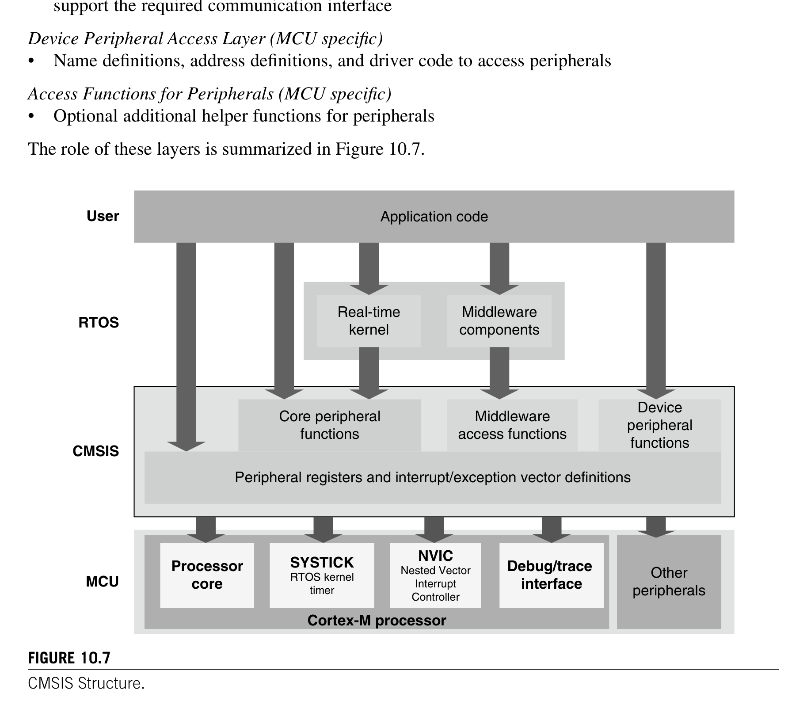
*Description*: Technical diagram and schematic illustration detailing hardware circuit topology, signal routing, and logic operations for Figure 10.7.

> **Figure 10.7**

166
CHAPTER 10  Cortex-M3 Programming
The CMSIS defines the basic requirements to achieve software reusability and portability. MCU
vendors can include additional functions for each peripheral to enrich the features of their software
solution. So using CMSIS does not limit the capability of the embedded products.
10.4.3  Organization of CMSIS
The CMSIS is divided into multiple layers as follows:
Core Peripheral Access Layer
Name definitions, address definitions, and helper functions to access core registers and core peripherals
•
Middleware Access Layer
Common method to access peripherals for the software industry (work in progress)
•
Targeted communication interfaces include Ethernet, UART, and SPI.
•
Allows portable software to perform communication tasks on any Cortex microcontrollers that
•
support the required communication interface
Device Peripheral Access Layer (MCU specific)
Name definitions, address definitions, and driver code to access peripherals
•
Access Functions for Peripherals (MCU specific)
Optional additional helper functions for peripherals
•
The role of these layers is summarized in Figure 10.7.
Figure 10.7
CMSIS Structure.
User
Application code
Real-time
kernel
RTOS
Middleware
components
CMSIS
Peripheral registers and interrupt/exception vector definitions
Core peripheral
functions
Middleware
access functions
Device
peripheral
functions
MCU
Other
peripherals
Cortex-M processor
NVIC
Nested Vector
Interrupt
Controller
SYSTICK
RTOS kernel
timer
Debug/trace
interface
Processor
core


<!-- Page 194 -->
### [PDF Page 194]


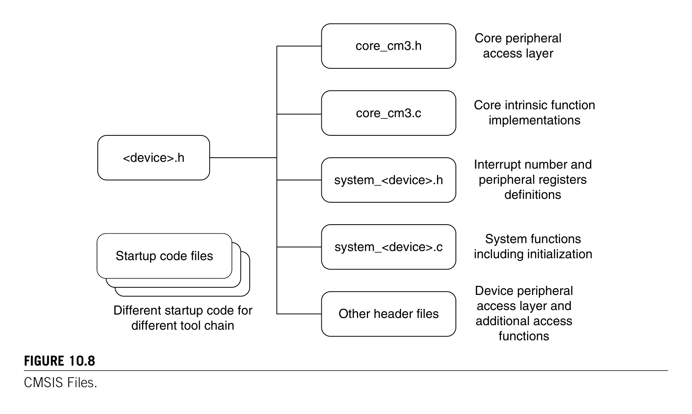
*Description*: Technical diagram and schematic illustration detailing hardware circuit topology, signal routing, and logic operations for Figure 10.8.

> **Figure 10.8**

167

## 10.4  CMSIS

10.4.4  Using CMSIS
Since the CMSIS is incorporated inside the device driver library, there is no special setup requirement
for using CMSIS in projects. For each MCU device, the MCU vendor provides a header file, which
pulls in additional header files required by the device driver library, including the Core Peripheral
Access Layer defined by ARM (see Figure 10.8).
The file core_cm3.h contains the peripheral register definitions and access functions for the
­Cortex-M3 processor peripherals like NVIC, System Control Block registers, and SYSTICK registers.
The core_cm3.h file also contains declaration of CMSIS intrinsic functions to allow C applications to
access instructions that cannot be generated using IEC/ISO C language. In addition, this file also con-
tains a function for outputting a debug message via the Instrumentation Trace Module (ITM).
Note that in some cases, the intrinsic functions in CMSIS could have similar names compared with
the intrinsic functions provided in the C compilers, whereas the CMSIS intrinsic functions are compiler
independent.
The file core_cm3.c contains implementation of CMSIS intrinsic functions that cannot be imple-
mented in core_cm3.h using simple definitions.
The system_<device>.h file contains microcontroller specific interrupt number definitions, and
peripheral register definitions. The system_<device>.c file contains a microcontroller specific function
called SystemInit for system initialization.
In addition, CMSIS compliant device drivers also contain start-up code (which contains the vector
table) for various supported compilers, and CMSIS version of intrinsic functions to allow embedded
software access to all processor core features on different C compiler products.
Examples of using CMSIS can be found on the microcontroller vendor’s web site. You might also
find examples in the device driver libraries itself. Alternatively, you can download the ARM CMSIS
Figure 10.8
CMSIS Files.
<device>.h
core_cm3.h
system_<device>.c
Core peripheral
access layer
System functions
including initialization
Other header files
Device peripheral
access layer and
additional access
functions
system_<device>.h
Interrupt number and
peripheral registers
definitions
core_cm3.c
Core intrinsic function
implementations
Different startup code for
different tool chain
Startup code files


<!-- Page 195 -->
### [PDF Page 195]


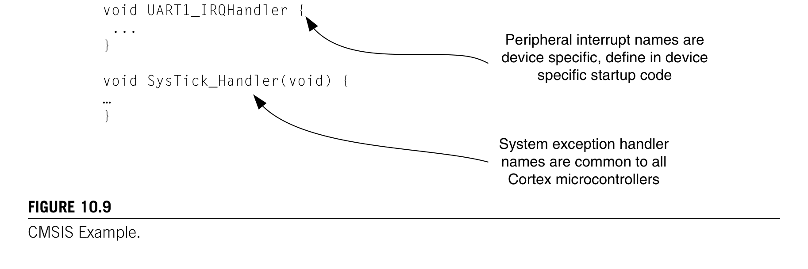
*Description*: Technical diagram and schematic illustration detailing hardware circuit topology, signal routing, and logic operations for Figure 10.9.

> **Figure 10.9**


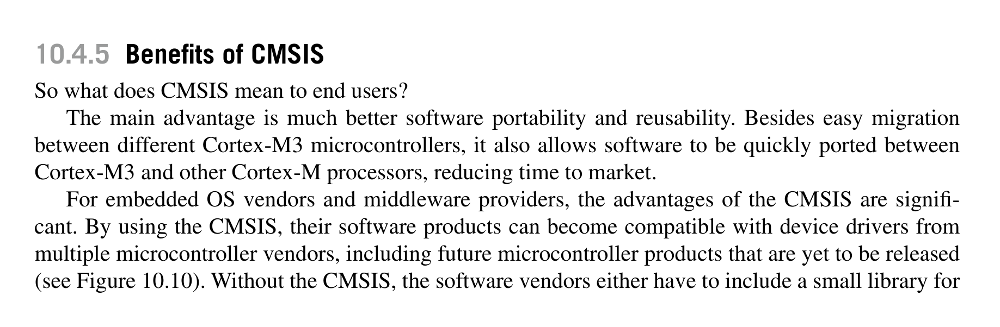
*Description*: Technical diagram and schematic illustration detailing hardware circuit topology, signal routing, and logic operations for Figure 10.10.

> **Figure 10.10**

168
CHAPTER 10  Cortex-M3 Programming
package from www.onarm.com, which contains examples and documentation. Documentation of the
common functions can also be found in this package.
A simple example of using CMSIS in your application development is shown in Figure 10.9. To use
the CMSIS to set up interrupts and exceptions, you need to use the exception/interrupt constants defined
in the system_<device>.h. These exception and interrupt constants are different from the exception
number used in the core internal registers (e.g., Interrupt Program Status Register [IPSR]). For CMSIS,
negative numbers are for system exceptions and positive numbers are for peripheral interrupts.
For development of portable code, you should use the core access functions to access core function-
alities and middleware access functions to access peripheral. This allows the porting of software to be
minimized between different Cortex microcontrollers.
Details of common CMSIS access functions and intrinsic functions can be found in Appendix G.
10.4.5  Benefits of CMSIS
So what does CMSIS mean to end users?
The main advantage is much better software portability and reusability. Besides easy migration
between different Cortex-M3 microcontrollers, it also allows software to be quickly ported between
Cortex-M3 and other Cortex-M processors, reducing time to market.
For embedded OS vendors and middleware providers, the advantages of the CMSIS are signifi-
cant. By using the CMSIS, their software products can become compatible with device drivers from
multiple microcontroller vendors, including future microcontroller products that are yet to be released
(see Figure 10.10). Without the CMSIS, the software vendors either have to include a small library for
Figure 10.9
CMSIS Example.

```c
#include "vendor_device.h"  // For example,
// lm3s_cmsis.h for LuminaryMicro devices
// LPC17xx.h for NXP devices
// stm32f10x.h for ST devices
void main(void) {
SystemInit();
```

…
NVIC_SetPriority(UART1_IRQn, 0x0);
NVIC_EnableIRQ(UART1_IRQn);
…
}

```c
void UART1_IRQHandler {
```

...
}

```c
void SysTick_Handler(void) {
```

…
}
Common name for
system initialization code
(from CMSIS v1.30, this function
is called from startup code)
Interrupt numbers defined in
system_<device>.h
NVIC setup by core access
functions
System exception handler
names are common to all
Cortex microcontrollers
Peripheral interrupt names are
device specific, define in device
specific startup code


<!-- Page 196 -->
### [PDF Page 196]


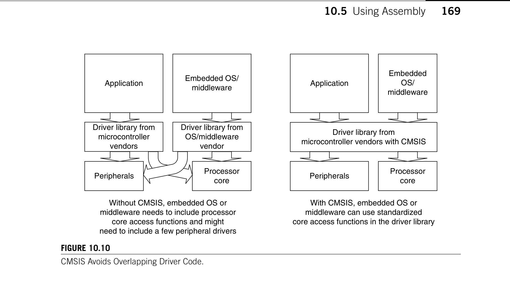
*Description*: Technical diagram and schematic illustration detailing hardware circuit topology, signal routing, and logic operations for Figure 10.10.

> **Figure 10.10**

169

## 10.5  Using Assembly

Cortex-M3 core functions or develop multiple configurations of their product so that it can work with
device libraries from different microcontroller vendors.
The CMSIS has a small memory footprint (less than 1 KB for all core access functions and a few
bytes of RAM). It also avoids overlapping of core peripheral driver code when reusing software code
from other projects.
Since CMSIS is supported by multiple compiler vendors, embedded software can compile and
run with different compilers. As a result, embedded OS and middleware can be MCU vendor inde-
pendent and compiler tool vendor independent. Before availability of CMSIS, intrinsic functions
were generally compiler specific and could cause problems in retargetting the software in a different
compiler.
Since all CMSIS compliant device driver libraries have a similar structure, learning to use different
Cortex-M3 microcontrollers is even easier as the software interface has similar look and feel (no need
to relearn a new application programming interface).
CMSIS is tested by multiple parties and is Motor Industry Software Reliability Association (MISRA)
compliant, thus reducing the validation effort required for developing your own NVIC or core feature
access functions.

## 10.5  Using Assembly

For small projects, it is possible to develop the whole application in assembly language. However, this
is often much harder for beginners. Using assembler, you might be able to get the best optimization
you want, though it might increase your development time, and it could be easy to make mistakes. In
addition, handling complex data structures or function library management can be extremely difficult
Figure 10.10
CMSIS Avoids Overlapping Driver Code.
Driver library from
OS/middleware
vendor
Driver library from
microcontroller
vendors
Embedded OS/
middleware
Application
Peripherals
Processor
core
Embedded
OS/
middleware
Application
Peripherals
Processor
core
Driver library from
microcontroller vendors with CMSIS
Without CMSIS, embedded OS or
middleware needs to include processor
core access functions and might
need to include a few peripheral drivers
With CMSIS, embedded OS or
middleware can use standardized
core access functions in the driver library


<!-- Page 197 -->
### [PDF Page 197]

170
CHAPTER 10  Cortex-M3 Programming
in assembler. Yet even when the C language is used in a project, in some situations part of the program
is implemented in assembly language as follows:
Functions that cannot be implemented in C, such as direct manipulation of stack data or special
•
instructions that cannot be generated by the C compiler in normal C-code
Timing-critical routines
•
Tight memory requirements, causing part of the program to be written in assembly to get the
•
smallest memory size
10.5.1  The Interface between Assembly and C
In various situations, assembly code and the C program interact. For example,
When embedded assembly (or inline assembler, in the case of the GNU tool chain) is used in C
•
program code
When C program code calls a function or subroutine implemented in assembler in a separate file
•
When an assembly program calls a C function or subroutine
•
In these cases, it is important to understand how parameters and return results are passed between the
calling program and the function being called. The mechanisms of these interactions are specified in
the ARM Architecture Procedure Call Standard [AAPCS, [Ref. 5]].
For simple cases, when a calling program needs to pass parameters to a subroutine or function, it
will use registers R0–R3, where R0 is the first parameter, R1 is the second, and so on. Similarly, R0
is used for returning a value at the end of a function. R0–R3 and R12 can be changed by a function or
subroutine whereas the contents of R4–R11 should be restored to the previous state before entering the
function, usually handled by stack PUSH and stack POP.
To make them easier to understand, the examples in this book do not strictly follow AAPCS prac-
tices. If a C function is called by an assembly code, the effect of a possible register change to R0–R3
and R12 will need to be taken into account. If the contents of these registers are needed at a later stage,
these registers might need to be saved on the stack and restored after the C function completes. Since
the example codes mostly only call assembly functions or subroutines that affect a few registers or
restore the register contents at the end, it’s not necessary to save registers R0–R3 and R12.
10.5.2  The First Step in Assembly Programming
This chapter reviews a few examples in assembly language. In most cases, you will be programming
in C, but by looking into some assembler examples, we can gain a better understanding of how to use
the Cortex-M3 processor. The examples here are based on ARM assembler tools (armasm) in RVDS.
For users of Keil MDK-ARM, the command line options are slightly different. For other assembler
tools, the file format and instruction syntax will also need to be modified. In addition, some develop-
ment tools will actually do the startup code for you, so you might not need to worry about creating your
assembly startup code.
The first simple program can be something like this
STACK_TOP EQU 0x20002000; constant for SP starting value
AREA |Header Code |, CODE
DCD STACK_TOP ; Stack top


<!-- Page 198 -->
### [PDF Page 198]

171

## 10.5  Using Assembly

DCD Start     ; Reset vector
ENTRY         ; Indicate program execution start here
Start ; Start of main program
; initialize registers
MOV r0, #10   ; Starting loop counter value
MOV r1, #0    ; starting result
; Calculated 10+9+8+...+1
loop

```assembly
ADD r1, r0    ; R1 = R1 + R0
SUBS r0, #1   ; Decrement R0, update flag ("S" suffix)
BNE loop      ; If result not zero jump to loop
; Result is now in R1
```

deadloop
B deadloop    ; Infinite loop
END           ; End of file
This simple program contains the initial stack pointer (SP) value, the initial program counter (PC)
value, and setup registers and then does the required calculation in a loop.
Assuming you are using ARM RealView compilation tools, this program can be assembled
using
$> armasm --cpu cortex-m3 -o test1.o test1.s
The -o option specifies the output file name. The test1.o is an object file. We then need to use a linker
to create an executable image (ELF). This can be done by
$> armlink --rw_base 0x20000000 --ro_base 0x0 --map -o test1.elf test1.o
Here, --ro-base 0x0 specifies that the read-only region (program ROM) starts at address 0x0; --rw-
base specifies that the read/write region (data memory) starts at address 0x20000000. (In this example
test1.s, we did not have any RAM data defined.) The --map option creates an image map, which is use-
ful for understanding the memory layout of the compiled image.
Finally, we need to create the binary image
$> fromelf --bin --output test1.bin test1.elf
For checking that the image looks like what we wanted, we can also generate a disassembled code list
file by
$> fromelf -c --output test1.list test1.elf
If everything works fine, you can then load your ELF image or binary image into your hardware or
instruction set simulator for testing.
10.5.3  Producing Outputs
It is always more fun when you can connect your microcontroller to the outside world. The simplest way
to do that is to turn on/off the LEDs. However, this practice is quite limiting because it can only repre-
sent very limited information. One of the most common output methods is to send text messages to a
console. In embedded product development, this task is often handled by a UART interface ­connecting


<!-- Page 199 -->
### [PDF Page 199]


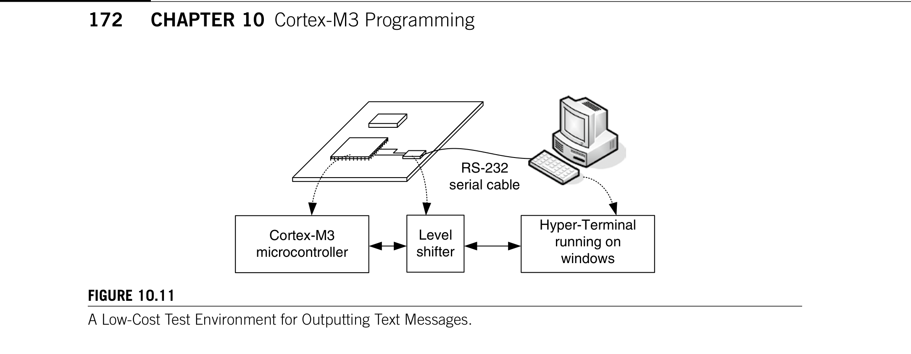
*Description*: Technical diagram and schematic illustration detailing hardware circuit topology, signal routing, and logic operations for Figure 10.11.

> **Figure 10.11**

172
CHAPTER 10  Cortex-M3 Programming
to a personal computer. For example, a computer running a Windows1 system with the Hyper-Terminal
program acting as a console can be a handy way to produce outputs (see Figure 10.11).
The Cortex-M3 processor does not contain a UART interface, but most Cortex-M3 microcontrollers
come with UART provided by the chip manufacturers. The specification of the UART can differ among
various devices, so we won’t attempt to cover the topic in this book. Our next example assumes that a
UART is available and has a status flag to indicate whether the transmit buffer is ready for sending out
new data. A level shifter is needed in the connection because RS-232 has a different voltage level than
the microcontroller I/O pins.
UART is not the only solution to output text messages. A number of features are implemented on
the Cortex-M3 processor to help output debugging messages:
•	 Semihosting: Depending on the debugger and code library support, semihosting (outputting printf
messages via a debug probe device) can be done via debug register in the NVIC. More information
on this topic is covered in Chapter 15. In these cases, you can use printf within your C program,
and the output will be displayed on the console/standard output (STDOUT) of the debugger
software.
•
Instrumentation trace: If the Cortex-M3 microcontroller provides a trace port and an external Trace
Port Analyzer (TPA) is available, instead of using UART to output messages, we can use the ITM.
The trace port works much faster than UART and can offer more data channels.
•
Instrumentation trace via Serial-Wire Viewer (SWV): Alternatively, the Cortex-M3 processor
(revision 1 and later) also provides an SWV operation mode on the Trace Port Interface Unit
(TPIU). This interface allows outputs from ITM to be captured using low-cost hardware instead of
a TPA. However, the bandwidth provided with the SWV mode is limited, so it is not ideal for large
amounts of data (e.g., instruction trace operation).
10.5.4  The “Hello World” Example
Before we try to write a “Hello world” program, we should figure out how to send one character
through the UART. The code used to send a character can be implemented as a subroutine, which can
1Windows and Hyper-Terminal are trademarks of Microsoft Corporation.
Figure 10.11
A Low-Cost Test Environment for Outputting Text Messages.
Cortex-M3
microcontroller
Level
shifter
Hyper-Terminal
running on
windows
RS-232
serial cable


<!-- Page 200 -->
### [PDF Page 200]

173

## 10.5  Using Assembly

be called by other message output codes. If the output device changes, we only need to change this
subroutine and all the text messages can be output by a different device. This modification is usually
called retargetting.
A simple routine to output a character could be something like this
UART0_BASE   EQU   0x4000C000
UART0_FLAG   EQU   UART0_BASE+0x018
UART0_DATA   EQU   UART0_BASE+0x000
Putc
; Subroutine to send a character via UART
; Input R0 = character to send
PUSH {R1,R2, LR}   ; Save registers
LDR R1,=UART0_FLAG
PutcWaitLoop
LDR R2,[R1]        ; Get status flag
TST R2, #0x20      ; Check transmit buffer full flag
; bit
BNE PutcWaitLoop   ; If busy then loop
LDR R1,=UART0_DATA ; otherwise
STRB R0, [R1]      ; Output data to transmit buffer
POP {R1,R2, PC}    ; Return
The register addresses and bit definitions here are just examples; you might need to change the value
for your device. In addition, some UART might require a more complex status-checking process before
the character is output to the transmit buffer. Furthermore, another subroutine call (­Uart0Initialize in
the following example) is required to initialize the UART, but this depends on the UART specification
and will not be covered in this chapter. An example of UART initialization in C for Luminary Micro
LM3S811 devices is covered in Chapter 20.
Now, we can use this subroutine to build a number of functions to display messages:
Puts
; Subroutine to send string to UART
; Input R0 = starting address of string.
; The string should be null terminated
PUSH {R0 ,R1, LR}     ; Save registers
MOV R1, R0
; Copy address to R1, because R0 will
; be used
PutsLoop                         ; as input for Putc
LDRB R0,[R1],#1
; Read one character and increment
; address
CBZ  R0, PutsLoopExit ; if character is null, goto end
BL   Putc             ; Output character to UART
B    PutsLoop         ; Next character
PutsLoopExit
POP {R0, R1, PC}
; Return
With this subroutine, we are ready for our first “Hello world” program:
STACK_TOP   EQU   0x20002000; constant for SP starting value
UART0_BASE  EQU   0x4000C000
UART0_FLAG  EQU   UART0_BASE+0x018
UART0_DATA  EQU   UART0_BASE+0x000


<!-- Page 201 -->
### [PDF Page 201]

174
CHAPTER 10  Cortex-M3 Programming
AREA | Header Code|, CODE
DCD STACK_TOP ; Stack Pointer initial value
DCD Start ; Reset vector
ENTRY
Start
; Start of main program
MOV r0, #0         ; initialize registers
MOV r1, #0
MOV r2, #0
MOV r3, #0
MOV r4, #0
BL  Uart0Initialize ; Initialize the UART0
LDR r0,=HELLO_TXT  ; Set R0 to starting address of string
BL  Puts
deadend
B deadend ; Infinite loop
;--------------------------------
; subroutines
;--------------------------------
Puts
; Subroutine to send string to UART
;Input R0 = starting address of string.
; The string should be null terminated
PUSH {R0 ,R1, LR}  ; Save registers
MOV R1, R0         ; Copy address to R1, because R0 will
; be used
PutsLoop                       ; as input for Putc
LDRB R0,[R1],#1    ; Read one character and increment
; address
CBZ  R0, PutsLoopExit ; if character is null, goto end
BL   Putc            ; Output character to UART
B    PutsLoop        ; Next character
PutsLoopExit
POP {R0, R1, PC}    ; Return
;--------------------------------
Putc
; Subroutine to send a character via UART
; Input R0 = character to send
PUSH {R1,R2, LR}     ; Save registers
LDR   R1,=UART0_FLAG
PutcWaitLoop
LDR   R2,[R1]        ; Get status flag
TST   R2, #0x20      ; Check transmit buffer full flag bit
BNE   PutcWaitLoop   ; If busy then loop
LDR   R1,=UART0_DATA ; otherwise
STR   R0, [R1]       ; Output data to transmit buffer
POP  {R1,R2, PC}     ; Return
;--------------------------------
Uart0Initialize
; Device specific, not shown here
BX    LR ; Return
;--------------------------------
HELLO_TXT
DCB "Hello world\n",0 ; Null terminated Hello
; world string
END     ; End of file


<!-- Page 202 -->
### [PDF Page 202]

175

## 10.5  Using Assembly

The only thing you need to add to this code is the details for the Uart0Initialize subroutine and modify
the UART register address constants at the top of the file.
It will also be useful to have subroutines that output register values as well. To make things easier,
they can all be based on Putc and Puts subroutines we have already done. The first subroutine is to
display hexadecimal values.
PutHex ; Output register value in hexadecimal format
; Input R0 = value to be displayed
PUSH {R0-R3,LR}
MOV R3, R0   ; Save register value to R3 because R0 is used
; for passing input parameter
MOV R0,#'0' ; Starting the display with "0x"
BL  Putc
MOV R0,#'x'
BL  Putc
MOV R1, #8      ; Set loop counter
MOV R2, #28     ; Rotate offset
PutHexLoop
ROR R3,  R2      ; Rotate data value left by 4 bits
; (right 28)
AND R0,  R3,#0xF ; Extract the lowest 4 bit
CMP R0,  #0xA    ; Convert to ASCII
ITE GE
ADDGE R0, #55    ; If larger or equal 10, then convert
; to A-F
ADDLT R0, #48    ; otherwise convert to 0-9
BL Putc           ; Output 1 hex character
SUBS R1,  #1     ; decrement loop counter
BNE PutHexLoop   ; if all 8 hexadecimal character been
; display then
POP {R0-R3,PC}   ; return, otherwise process next 4-bit
This subroutine is useful for outputting register values. However, sometimes we also want to output
register values in decimal. This sounds like a rather complex operation, but in the Cortex-M3 it is easy
because of the hardware multiply and divide instructions. One of the other main problems is that during
calculation, we will get output characters in reverse order, so we need to put the output results in a text
buffer first, wait until the whole text is ready to display, and then use the Puts function to display the
whole result. In this example, a part of the stack memory is used as the text buffer:
PutDec  ; Subroutine to display register value in decimal
; Input R0 = value to be displayed.
; Since it is 32 bit, the maximum number of character
; in decimal format, including null termination is 11
PUSH {R0-R5, LR}  ; Save register values
MOV R3, SP        ; Copy current Stack Pointer to R3

```assembly
SUB SP, SP, #12   ; Reserved 12 bytes as text buffer
```

MOV R1, #0        ; Null character
STRB R1,[R3, #-1]!; Put null character at end of text
; buffer,pre-indexed
MOV R5, #10     ; Set divide value
PutDecLoop
UDIV R4, R0, R5 ; R4 = R0 / 10


<!-- Page 203 -->
### [PDF Page 203]

176
CHAPTER 10  Cortex-M3 Programming
MUL R1, R4, R5     ; R1 = R4 * 10

```assembly
SUB R2, R0, R1     ; R2 = R0 - (R4 * 10) = remainder
```


```assembly
ADD R2, #48        ; convert to ASCII (R2 can only be 0-9)
```

STRB R2,[R3, #-1]! ; Put ascii character in text
; buffer, pre-indexed
MOVS R0, R4        ; Set R0 = Divide result and set Z flag
; if R4=0
BNE PutDecLoop     ; If R0(R4) is already 0, then there
; is no more digit
MOV R0, R3         ; Put R0 to starting location of text
; buffer
BL Puts            ; Display the result using Puts

```assembly
ADD SP, SP, #12    ; Restore stack location
```

POP {R0-R5, PC}    ; Return
With various features in the Cortex-M3 instruction set, the processing to convert values into deci-
mal format display can be implemented in a very short subroutine.
10.5.5  Using Data Memory
Back to our first example: When we were doing the linking stage, we specified the read/write memory
region. How do we put data there? The method is to define a data region in your assembly file. Using
the same example from the beginning, we can store the data in the data memory at 0x20000000 (the
SRAM region). The location of the data section is controlled by a command-line option when you run
the linker:
STACK_TOP   EQU 0x20002000   ; constant for SP starting value
AREA | Header Code|, CODE
DCD STACK_TOP    ; SP initial value
DCD Start        ; Reset vector
ENTRY
Start
; Start of main program
; initialize registers
MOV r0, #10 ; Starting loop counter value
MOV r1, #0  ; starting result
; Calculated 10+9+8+…+1
loop

```assembly
ADD r1, r0      ; R1 = R1 + R0
```

SUBS r0, #1     ; Decrement R0, update flag ("S"
; suffix)
BNE loop        ; If result not zero jump to loop
; Result is now in R1
LDR r0,=MyData1 ; Put address of MyData1 into R0
STR r1,[r0]     ; Store the result in MyData1
deadloop
B deadloop      ; Infinite loop
AREA | Header Data|, DATA
ALIGN 4
MyData1
DCD 0           ; Destination of calculation result
MyData2
DCD 0
END             ; End of file


<!-- Page 204 -->
### [PDF Page 204]


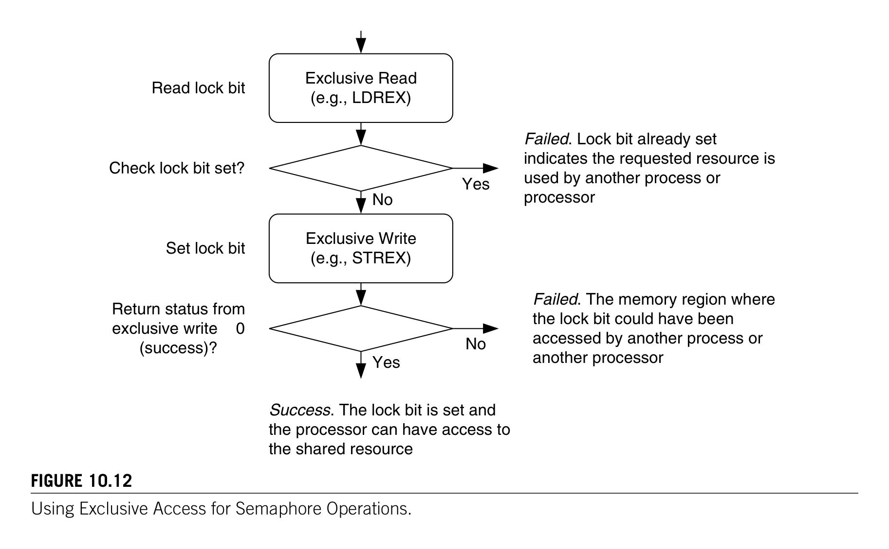
*Description*: Technical diagram and schematic illustration detailing hardware circuit topology, signal routing, and logic operations for Figure 10.12.

> **Figure 10.12**

177

## 10.6  Using Exclusive Access for Semaphores

During the linking stage, the linker will put the DATA region into read/write memory, so the address
for MyData1 will be 0x20000000 in this case.

## 10.6  Using Exclusive Access for Semaphores

Exclusive access instructions are used for semaphore operations—for example, a MUTEX (Mutual
Exclusion) to make sure that a resource is used by only one task. For instance, let’s say that a data vari-
able DeviceALocked in memory can be used to indicate that Device A is being used. If a task wants
to use Device A, it should check the status by reading the variable DeviceALocked. If it is zero, it can
write a 1 to DeviceALocked to lock the device. After it’s finished using the device, it can then clear the
DeviceALocked to zero so that other tasks can use it.
What will happen if two tasks try to access Device A at the same time? In that case, possibly both
tasks will read the variable DeviceALocked, and both will get zero. Then both of them will try writing
back 1 to the variable DeviceALocked to lock the device, and we’ll end up with both tasks believing
that they have exclusive access to Device A. That is where exclusive accesses are used. The STREX
instruction has a return status, which indicates whether the exclusive store has been successful. If two
tasks try to lock a device at the same time, the return status will be 1 (exclusive failed) and the task can
then know that it needs to retry the lock.
Chapter 5 provided some background on the use of exclusive accesses. The flowchart in that earlier
discussion is shown in Figure 10.12.
Figure 10.12
Using Exclusive Access for Semaphore Operations.
Exclusive Read
(e.g., LDREX)
Exclusive Write
(e.g., STREX)
Read lock bit
Check lock bit set?
Set lock bit
Yes
Yes
No
No
Failed. Lock bit already set
indicates the requested resource is
used by another process or
processor
Failed. The memory region where
the lock bit could have been
accessed by another process or
another processor
Success. The lock bit is set and
the processor can have access to
the shared resource
Return status from
exclusive writez 0
(success)?


<!-- Page 205 -->
### [PDF Page 205]

178
CHAPTER 10  Cortex-M3 Programming
The operation can be carried out by the following C-code using intrinsic functions from CMSIS.
Note that the data write operation of STREX will not be carried out if the exclusive monitor returns a
fail status, preventing a lock bit being set when the exclusive access fails:
volatile unsigned int DeviceALocked; // lock variable

```c
int LockDeviceA(void){
unsigned int status; // variable to hold STREX status
// Get the lock status and see if it is already locked
if (__LDREXW(&DeviceALocked) = 0) {
// if not locked, try set lock to 1
status = __STREXW(1, &DeviceALocked);
if (status!=0) return (1); // return fail status
else return(0); // return success status
```

} else {
return(1); // return fail status
}
}
The same operation can also be carried out by the following assembly code:
LockDeviceA
; A simple function to try to lock Device A
; Output R0 : 0 = Success, 1 = failed
If successful, value of 1 will be written to variable
; DeviceALocked
PUSH {R1, R2, LR}
TryToLockDeviceA
LDR   R1,=DeviceALocked  ; Get the lock status
LDREX R2,[R1]
CMP   R2,#0
; Check if it is locked
BNE   LockDeviceAFailed
DeviceAIsNotLocked
MOV    R0,#1
; Try to write 1 to
; DeviceALocked
STREX R2,R0,[R1]
; Exclusive write
CMP    R2, #0
BNE LockDeviceAFailed
; STREX Failed
LockDeviceASucceed
MOV    R0,#0
; Return success status
POP {R1, R2, PC}
; Return
LockDeviceAFailed
MOV R0,#1
; Return fail status
POP {R1, R2, PC}
; Return
If the return status of this function is 1 (exclusive failed), the application tasks should wait a bit and
retry later. In single-processor systems, the common cause of an exclusive access failing is an Interrupt
occurring between the exclusive load and the exclusive store. If the code is run in privileged mode, this
situation can be prevented by setting an Interrupt Mask register, such as PRIMASK, for a short time to
increase the chance of getting the resource locked successfully.
In multiprocessor systems, aside from interrupts, the exclusive store could also fail if another
­processor has accessed the same memory region. To detect memory accesses from different processors,


<!-- Page 206 -->
### [PDF Page 206]


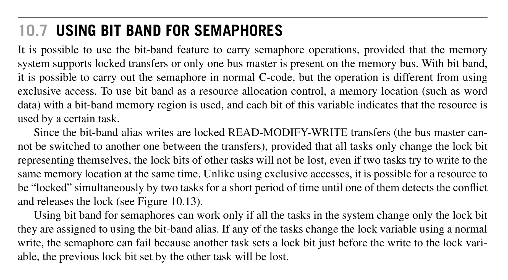
*Description*: Technical diagram and schematic illustration detailing hardware circuit topology, signal routing, and logic operations for Figure 10.13.

> **Figure 10.13**

179

## 10.7  Using Bit Band for Semaphores

the bus infrastructure requires exclusive access monitor hardware to detect whether there is an access
from a different bus master to a memory between the two exclusive accesses. However, in most low-cost
Cortex-M3 microcontrollers, there is only one processor, so this monitor hardware is not required.
With this mechanism, we can be sure that only one task can have access to certain resources. If the
application cannot gain the lock to the resource after a number of times, it might need to quit with a
timeout error. For example, a task that locked a resource might have crashed and the lock remained set.
In these situations, the OS should check which task is using the resource. If the task has completed or
terminated without clearing the lock, the OS might need to unlock the resource.
If the process has started an exclusive access using LDREX and then found that the exclusive
access is no longer needed, it can use the CLREX instruction to clear the local record in the exclusive
access monitor. This can be done with CMSIS function:

```c
void __CLREX(void);
```

If assembly language is used, the CLREX instruction can be used:
CLREX
or
CLREX.W
For the Cortex-M3 processor, all exclusive memory transfers must be carried out sequentially.
­However, if the exclusive access control code has to be reused on other ARM Cortex processors, the
Data Memory Barrier (DMB) instruction might need to be inserted between exclusive transfers to
ensure correct ordering of the memory accesses. Example code of using barrier instructions with exclu-
sive accesses can be found in Section 14.3, Multiprocessor Communication.

## 10.7  Using Bit Band for Semaphores

It is possible to use the bit-band feature to carry semaphore operations, provided that the memory
system supports locked transfers or only one bus master is present on the memory bus. With bit band,
it is possible to carry out the semaphore in normal C-code, but the operation is different from using
exclusive access. To use bit band as a resource allocation control, a memory location (such as word
data) with a bit-band memory region is used, and each bit of this variable indicates that the resource is
used by a certain task.
Since the bit-band alias writes are locked READ-MODIFY-WRITE transfers (the bus master can-
not be switched to another one between the transfers), provided that all tasks only change the lock bit
representing themselves, the lock bits of other tasks will not be lost, even if two tasks try to write to the
same memory location at the same time. Unlike using exclusive accesses, it is possible for a resource to
be “locked” simultaneously by two tasks for a short period of time until one of them detects the conflict
and releases the lock (see Figure 10.13).
Using bit band for semaphores can work only if all the tasks in the system change only the lock bit
they are assigned to using the bit-band alias. If any of the tasks change the lock variable using a normal
write, the semaphore can fail because another task sets a lock bit just before the write to the lock vari-
able, the previous lock bit set by the other task will be lost.


<!-- Page 207 -->
### [PDF Page 207]


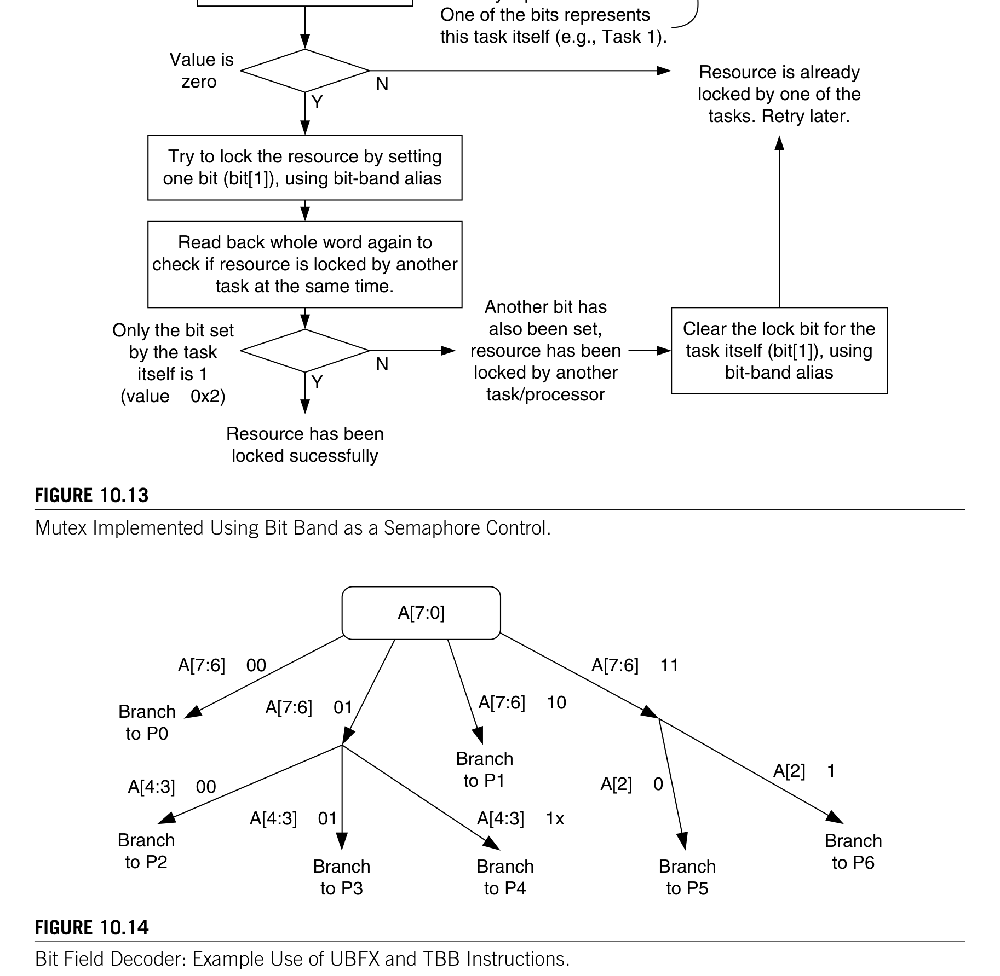
*Description*: Technical diagram and schematic illustration detailing hardware circuit topology, signal routing, and logic operations for Figure 10.13.

> **Figure 10.13**


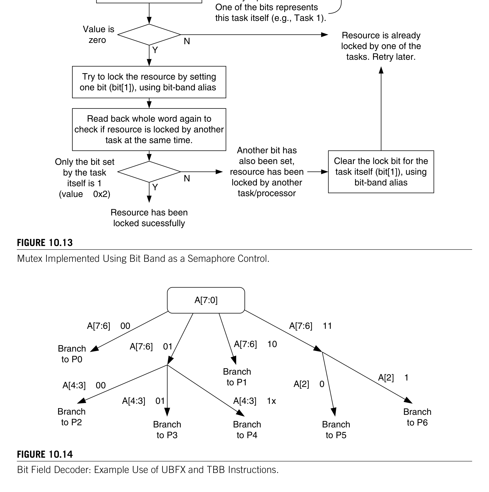
*Description*: Technical diagram and schematic illustration detailing hardware circuit topology, signal routing, and logic operations for Figure 10.14.

> **Figure 10.14**

180
CHAPTER 10  Cortex-M3 Programming
Figure 10.13
Mutex Implemented Using Bit Band as a Semaphore Control.
Read whole word of the
resource lock variable
Value is
zero
N
Resource is already
locked by one of the
tasks. Retry later.
Try to lock the resource by setting
one bit (bit[1]), using bit-band alias
Read back whole word again to
check if resource is locked by another
task at the same time.
N
Another bit has
also been set,
resource has been
locked by another
task/processor
Only the bit set
by the task
itself is 1
(valuez 0x2)
Clear the lock bit for the
task itself (bit[1]), using
bit-band alias
Y
Y
Resource has been
locked sucessfully
Each bit in the word
represents the resource
used by a particular task.
One of the bits represents
this task itself (e.g., Task 1).
Resource lock variable
Task 3
Task 2
Task 1
Task 0
Figure 10.14
Bit Field Decoder: Example Use of UBFX and TBB Instructions.
A[7:0]
A[7:6]z 00
A[7:6] z 01
A[7:6]z 10
A[7:6] z 11
Branch
to P2
Branch
to P3
Branch
to P4
Branch
to P1
Branch
to P5
Branch
to P6
A[4:3] z 00
A[4:3] z 01
A[4:3]z 1x
Branch
to P0
A[2] z 0
A[2] z 1


<!-- Page 208 -->
### [PDF Page 208]


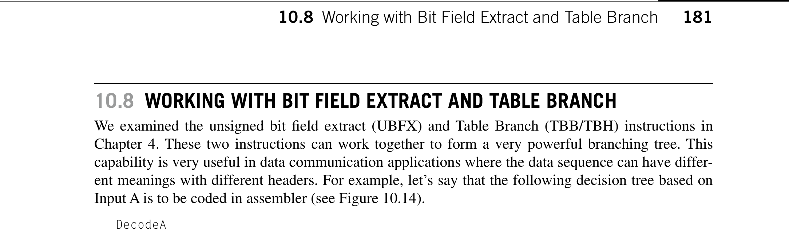
*Description*: Technical diagram and schematic illustration detailing hardware circuit topology, signal routing, and logic operations for Figure 10.14.

> **Figure 10.14**

181

## 10.8  Working with Bit Field Extract and Table Branch


## 10.8  Working with Bit Field Extract and Table Branch

We examined the unsigned bit field extract (UBFX) and Table Branch (TBB/TBH) instructions in
Chapter 4. These two instructions can work together to form a very powerful branching tree. This
capability is very useful in data communication applications where the data sequence can have differ-
ent meanings with different headers. For example, let’s say that the following decision tree based on
Input A is to be coded in assembler (see Figure 10.14).
DecodeA
LDR  R0,=A           ; Get the value of A from memory
LDR  R0,[R0]
UBFX R1, R0, #6, #2  ; Extract bit[7:6] into R1
TBB  [PC, R1]
BrTable1
DCB  ((P0
-BrTable1)/2) ; Branch to P0       if A[7:6] = 00
DCB  ((DecodeA1-BrTable1)/2) ; Branch to DecodeA1 if A[7:6] = 01
DCB  ((P1
-BrTable1)/2) ; Branch to P1       if A[7:6] = 10
DCB  ((DecodeA2-BrTable1)/2) ; Branch to DecodeA1 if A[7:6] = 11
DecodeA1
UBFX  R1, R0, #3, #2 ; Extract bit[4:3] into R1
TBB   [PC, R1]
BrTable2
DCB  ((P2 -BrTable2)/2) ; Branch to P2    if A[4:3] = 00
DCB  ((P3 -BrTable2)/2) ; Branch to P3    if A[4:3] = 01
DCB  ((P4 -BrTable2)/2) ; Branch to P4    if A[4:3] = 10
DCB  ((P4 -BrTable2)/2) ; Branch to P4    if A[4:3] = 11
DecodeA2
TST  R0, #4 ; Only 1 bit is tested, so no need to use UBFX
BEQ  P5
B    P6
P0 ... ; Process 0
P1 ... ; Process 1
P2 ... ; Process 2
P3 ... ; Process 3
P4 ... ; Process 4
P5 ... ; Process 5
P6 ... ; Process 6
This code completes the decision tree in a short assembler code sequence. If the branch target
addresses are at a larger offset, some of the TBB instructions would have to be replaced by TBH
instructions.


<!-- Page 209 -->
### [PDF Page 209]

This page intentionally left blank


