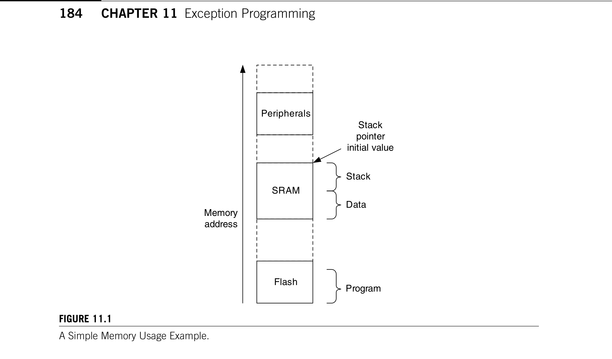
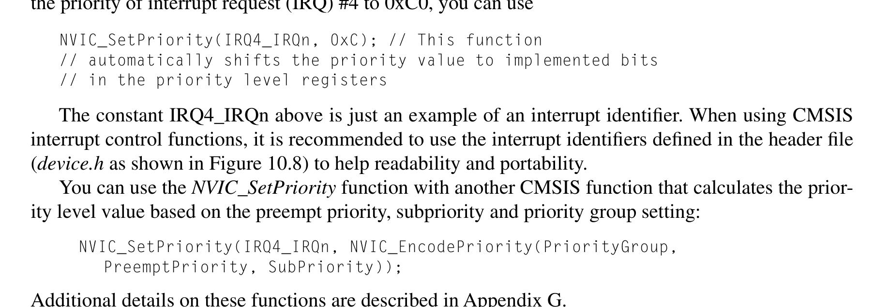
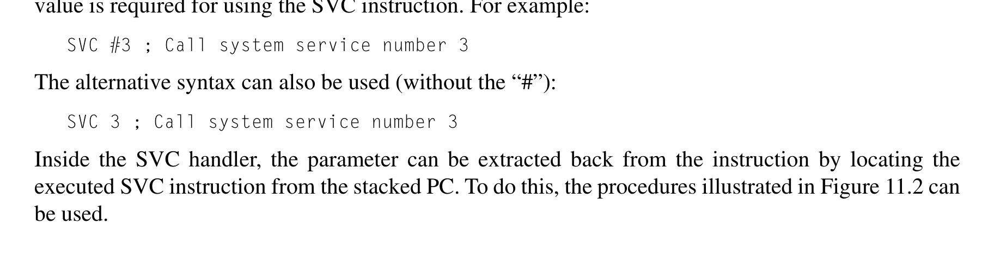
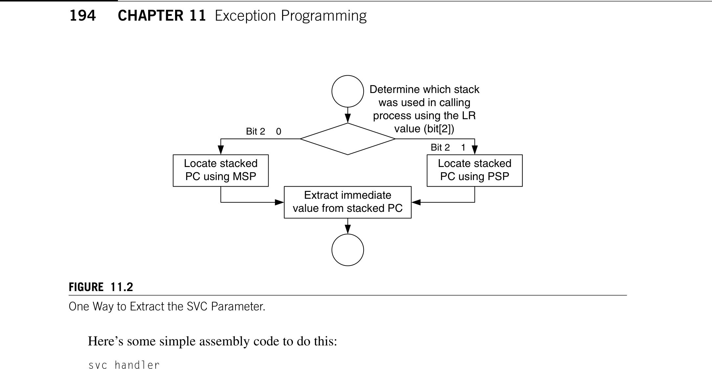
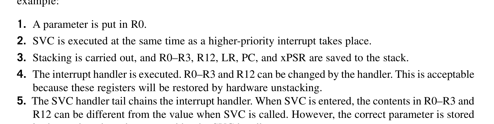

# Chapter 11. Exception Programming

> **Source PDF**: THE_DEFINITIVE_GUIDE_TO_THE_ARM_CORTEX-МЗ_Stellaris_MCU_9000Series_TEINSTRUMENTS_ARM_SECOND_EDITION.pdf  
> **PDF Page Range**: 210 - 227


---


<!-- Page 210 -->
### [PDF Page 210]

183
CHAPTER
Copyright © 2010, Elsevier Inc. All rights reserved.
DOI: 10.1016/B978-0-12-382091-4.00017-7
In This Chapter
Using Interrupts�������������������������������������������������������������������������������������������������������������������������������������183
Exception/Interrupt Handlers������������������������������������������������������������������������������������������������������������������188
Software Interrupts��������������������������������������������������������������������������������������������������������������������������������189
Example of Vector Table Relocation��������������������������������������������������������������������������������������������������������190
Using SVC���������������������������������������������������������������������������������������������������������������������������������������������193
SVC Example: Use for Text Message Output Functions............................................................................. 194
Using SVC with C.................................................................................................................................. 197

## 11.1  Using Interrupts

Interrupts are used in almost all embedded applications. In the Cortex™-M3 processor, the interrupt
controller Nested Vectored Interrupt Controller (NVIC) handles a number of processing tasks for you,
including priority checking and stacking/unstacking of registers. However, a number of tasks have to
be prepared before interrupts can be used:
Stack setup
•
Vector table setup
•
Interrupt priority setup
•
Enable the interrupt
•
11.1.1  Stack Setup
For simple application development, you can use the Main Stack Pointer (MSP) for the whole program.
That way you need to reserve memory that’s just large enough and set the MSP to the top of the stack.
When determining the stack size required, besides checking the stack level that could be used by the
software, you also need to check how many levels of nested interrupts can occur.
For each level of nested interrupts, you need at least eight words of stack. The processing inside
interrupt handlers might need extra stack space as well.
Exception Programming
11


<!-- Page 211 -->
### [PDF Page 211]



*Description*: Technical diagram and schematic illustration detailing hardware circuit topology, signal routing, and logic operations for Figure 11.1.

> **Figure 11.1**

184
CHAPTER 11  Exception Programming
Because the stack operation in the Cortex-M3 is full descending, it is common to put the stack
­initial value at the end of the static memory so that the free space in the Static Random Access Memory
(SRAM) is not fragmented (see Figure 11.1).
For applications that use separate stacks for user code and kernel code, the main stack should have
enough memory for the nested interrupt handlers as well as the stack memory used by the kernel code.
The process stack should have enough memory for the user application code plus one level of stack-
ing space (eight words). This is because stacking from the user thread to the first level of the interrupt
handler uses the process stack.
11.1.2  Vector Table Setup
For simple applications that have fixed interrupt handlers, the vector table can be coded in Flash or
ROM. In this case, there is no need to set up the vector table during run time. However, in some appli-
cations, it is necessary to change the interrupt handlers for different situations. Then, you will need to
relocate the vector table to writable memory.
Before the vector table is relocated, you might need to copy the existing vector table content to the
new vector table location. This includes vector addresses for fault handlers, the nonmaskable interrupt
(NMI), system calls, and so on. Otherwise, invalid vector addresses will be fetched by the processor if
these exceptions take place after the vector table relocation.
After the necessary vector table items are set up and the vector table is relocated, we can add new vectors
to the vector table. For users of Cortex Microcontroller Software Interface Standard (CMSIS) compliant driver
libraries, the vector table offset register can be accessed by “SCB->VTOR” in the core peripheral definition.
void SetVector(unsigned int ExcpType, unsigned int VectorAddress)
{ // Calculate vector location = VTOR + (Exception_Type * 4)
Figure 11.1
A Simple Memory Usage Example.
SRAM
Flash
Peripherals
Memory
address
Stack
pointer
initial value
Program
Data
Stack


<!-- Page 212 -->
### [PDF Page 212]



*Description*: Technical diagram and schematic illustration detailing hardware circuit topology, signal routing, and logic operations for Figure 10.8.

> **Figure 10.8**

185

## 11.1  Using Interrupts

*((volatile unsigned int *) (SCB->VTOR + (ExcpType << 2))) =
VectorAddress | 0x1;
// LSB of vector set to 1 to indicate Thumb
return;
}
For users who prefer programming in assembly, this can be done by the following code example:
; Subroutine for setting vector of an exception based on
; exception type
; (For IRQs add 16 : IRQ #0 = exception type 16)
SetVector
; Input R0 = exception type
; Input R1 = vector address value
PUSH {R2, LR}
LDR R2,=0xE000ED08       ; Vector table offset register
LDR R2, [R2]
ORR R1, R1, #1           ; Set LSB of vector to indicate Thumb
STR R1, [R2, R0, LSL #2] ; Write vector to VectTblOffset+
; ExcpType*4
POP {R2, PC}             ; Return
The setting of least significant bit (LSB) to 1 in the vector is not necessary in most case, as the
compiler or assembler should recognize the address as a Thumb® instruction address and set it
­automatically.
11.1.3  Interrupt Priority Setup
By default, after a reset, all exceptions with programmable priority are in priority level 0. For hard fault
exceptions and NMI, the priority levels are -1 and -2, respectively. For users of CMSIS compliant
device driver libraries, you can use the CMSIS function to set priority level value. For example, to set
the priority of interrupt request (IRQ) #4 to 0xC0, you can use
NVIC_SetPriority(IRQ4_IRQn, 0xC); // This function
// automatically shifts the priority value to implemented bits
// in the priority level registers
The constant IRQ4_IRQn above is just an example of an interrupt identifier. When using CMSIS
interrupt control functions, it is recommended to use the interrupt identifiers defined in the header file
(device.h as shown in Figure 10.8) to help readability and portability.
You can use the NVIC_SetPriority function with another CMSIS function that calculates the prior-
ity level value based on the preempt priority, subpriority and priority group setting:
NVIC_SetPriority(IRQ4_IRQn, NVIC_EncodePriority(PriorityGroup,
PreemptPriority, SubPriority));
Additional details on these functions are described in Appendix G.
If you are programming in assembly language, to program priority-level registers, we can take
advantage of the fact that the registers are byte addressable, making the coding easier. For example:
; Setting IRQ #4 priority to 0xC0
LDR R0, =0xE000E400 ; External Interrupt Priority Reg starting
; address


<!-- Page 213 -->
### [PDF Page 213]

186
CHAPTER 11  Exception Programming
LDR  R1, =0xC0       ; Priority level
STRB R1, [R0, #4]    ; Set IRQ #4 priority (Byte write)
In the Cortex-M3, the width of the interrupt priority configuration registers is specified by chip
manufacturers. The minimum width is 3 bits, and the maximum width is 8 bits. In a CMSIS compliant
device driver, the width of a priority level register is specified by __NVIC_PRIO_BITS. You can deter-
mine the implemented width by writing 0xFF to one of the priority configuration registers and reading
it back. For example, you can do it in assembly with the following code:
; Determine the implemented priority width
LDR  R0,=0xE000E400	; Priority Configuration register for
; external interrupt #0
LDR  R1,=0xFF
STRB R1,[R0]
; Write 0xFF (note : byte size write)
LDRB R1,[R0]
; Read back (e.g. 0xE0 for 3-bits)
RBIT R2, R1
; Bit reverse R2 (e.g. 0x07000000 for
; 3-bits)
CLZ  R1, R2
; Count leading zeros (e.g. 0x5 for 3-bits)
MOV  R2, #8

```assembly
SUB  R2, R2, R1
; Get implemented width of priority
```

; (e.g. 8−5=3 for 3-bits)
MOV  R1, #0x0
STRB R1,[R0]
; Restore to reset value (0x0)
If your application needs to be portable, it is best to use priority levels 0x00, 0x20, 0x40, 0x60,
0x80, 0xA0, 0xC0, and 0xE0 only. This is because all Cortex-M3 devices have these priority levels.
Do not forget to set up the priority for system exceptions and fault handler exceptions as well. If it
is necessary for some of the important interrupts to have higher priority than other system exceptions or
fault handlers, you will need to reduce the priority level of these system exceptions and fault handlers
so that the important interrupts can preempt these handlers.
11.1.4  Enable the Interrupt
After the vector table and interrupt priority are set up, it’s time to enable the interrupt. However, two
steps might be required before you actually enable the interrupt:
If the vector table is located in a memory region that is write buffered, a Data Synchronization
1.
Barrier (DSB) instruction might be needed to ensure that the vector table memory is updated. In
Accessing NVIC Interrupt Registers
For best software compatibility, CMSIS core peripheral access functions should be used for accessing the NVIC
registers including interrupt configurations. Details of the CMSIS core peripheral access function are covered in
Appendix G.
You can also develop your own NVIC interrupt control function if necessary; selecting the right transfer size
can make your program development easier. For the Cortex-M3 processor, most registers in the NVIC can be
accessed using word, half word, or byte transfers. For example, priority-level registers are best programmed with
byte transfers. In this way, there is no need to worry about accidentally changing the priority of other exceptions.
However, this method will not work with Cortex-M0 because the NVIC registers in Cortex-M0 only accept word
size transfers.


<!-- Page 214 -->
### [PDF Page 214]

187

## 11.1  Using Interrupts

most cases, the memory write should be completed within a few clock cycles. However, if your
software needs to be portable between different ARM processors, this step ensures that the core
will get the updated vector if the interrupt takes place immediately after being enabled.
An interrupt might already be pended or asserted beforehand, so it might be needed to clear the
2.
pending status. For example, signal glitches during power-up might have accidentally triggered
some interrupt generation logic. In addition, in some peripherals such as a universal asynchronous
receiver/transmitter (UART), noise from the UART receiver before connection might be mistaken
as data and can cause an interrupt to be pended. Therefore, it can be safer to check and clear the
pending status of an interrupt before enabling it. Depending on the peripheral design, the peripheral
might also need some reinitialization if the pending status was set already.
Inside the NVIC, two separate register addresses are used for enabling and disabling interrupts. This
duality ensures that each interrupt can be enabled or disabled without affecting or losing the other inter-
rupt enable status. Otherwise, through software-based READ-MODIFY-WRITE, changes in enable
register status carried out by interrupt handlers could be lost. To set an enable, the software needs to
compute the correct bit location in the SETEN registers in the NVIC and write 1 to it. Similarly, to clear
an interrupt, the software needs to write a 1 to the corresponding bit in the CLREN registers:
For users of CMSIS compliant driver libraries, the interrupt enable/disable feature can be accessed
by the “NVIC_EnableIRQ” and “NVIC_DisableIRQ” functions. For example:
NVIC_EnableIRQ(UART1_IRQn);  // Enable UART#1 interrupt
// UART1_IRQn is MCU specific and is defined
// in the device driver library
NVIC_DisableIRQ(UART1_IRQn); // Disable UART#1 interrupt
Details of these functions are described in Appendix G.
Assembly language users can create an assembly function to carry out the same ­operation:
; A subroutine to enable an IRQ based on IRQ number
EnableIRQ
; Input R0 = IRQ number
PUSH    {R0–R2, LR}
AND.W   R1, R0, #0x1F  ; Generate enable bit pattern for
; the IRQ
MOV     R2, #1
LSL     R2, R2, R1     ; Bit pattern = (0x1 << (N & 0x1F))
AND.W   R1, R0, #0xE0  ; Generate address offset if IRQ number
; is above 31
LSR     R1, R1, #3     ; Address offset = (N/32)*4 (Each word
; has 32 IRQ enable)
LDR     R0,=0xE000E100 ; SETEN register for external interrupt
; #31–#0
STR R2, [R0, R1]
; Write bit pattern to SETEN register
POP     {R0–R2, PC}
; Restore registers and Return
Likewise, we can write another subroutine for disabling IRQ:
; A subroutine to disable an IRQ based on IRQ number
DisableIRQ
; Input R0 = IRQ number


<!-- Page 215 -->
### [PDF Page 215]

188
CHAPTER 11  Exception Programming
PUSH  {R0–R2, LR}
AND.W R1, R0, #0x1F   ; Generate Disable bit pattern for
; the IRQ
MOV   R2, #1
LSL   R2, R2, R1      ; Bit pattern = (0x1 << (N & 0x1F))
AND.  W R1, R0, #0xE0 ; Generate address offset if IRQ number
; is above 31
LSR   R1, R1, #3      ; Address offset = (N/32)*4 (Each word
; has 32 IRQ enable)
LDR   R0,=0xE000E180  ; CLREN register for external interrupt
; #31–#0
STR   R2, [R0, R1]    ; Write bit pattern to CLREN register
POP   {R0–R2, PC}     ; Restore registers and Return
Similar subroutines can be developed for setting and clearing IRQ pending status registers.

## 11.2  Exception/Interrupt Handlers

In the Cortex-M3, interrupt handlers can be programmed completely in C, whereas in ARM7, an
assembly handler is commonly used to ensure that all registers are saved, and in cases of systems with
nested interrupt support, the processor needs to switch to a different mode to prevent losing informa-
tion. These steps are not required in the Cortex-M3, making programming much easier.
In C language, an interrupt handler could be like

```c
void UART1_Handler(void) {
```

... // processing task for the peripheral
return;
}
For users of the CMSIS compliant device driver library, the interrupt handler name should match the
­interrupt handler name defined by the Microcontroller Unit (MCU) vendor to ensure that the vector is set
up in the vector table correctly. You can find the handler function name in the vector table inside the start-
up codes. For example, for a Keil Microcontroller Development Kit user, the file is startup_<device>.s.
For users of ARM RealView Compilers or the Keil Microcontroller Development Kit, for clarity,
you can add the optional __irq keyword. For example:
__irq void UART1_Handler(void) {
... // process IRQ request for the peripheral
... // Deassert IRQ request in peripheral
return;
}
In assembler, a simple exception handler might look like this:
irq1_handler
; Process IRQ request
...
; Deassert IRQ request in peripheral
...
; Interrupt return
BX  LR


<!-- Page 216 -->
### [PDF Page 216]

189

## 11.3  Software Interrupts

The deassertion of an IRQ inside the interrupt service routine depends on the peripheral design. If
the peripheral generates IRQs in the form of pulses, this step is not required. With the Cortex-M3, if a
peripheral generates IRQs in the form of pulses, the NVIC can store the request as a pending request
status. Once the processor enters the exception handler, the pending status is cleared automatically.
This is different from traditional ARM processors that a peripheral has to maintain its IRQ until it is
served because the interrupt controllers designed for previous ARM cores like ARM7TDMI do not
have the pending memory.
In some cases, where the peripheral can generate multiple IRQs in a short period, the deassertion of
the IRQ in the peripheral might have to be done conditionally to ensure that no requests are missed.
In many cases, the interrupt handler requires more than R0–R3 and R12 to process the interrupt, so we
might need to save some other registers as well. For C language users, there is no need to worry about this,
as the C function saves additional registers automatically if required. For assembly language users, their
interrupt handlers have to perform stack PUSH and POP to ensure the values of R4–R11 are preserved.
The following example saves all registers that are not saved during the stacking process, but if some
of the registers are not used by the exception handler, they can be omitted from the saved register list:
irq1_handler
PUSH {R4–R11, LR} ; Save all registers that are not saved
; during stacking
; Process IRQ request
...
; Deassert IRQ request in peripheral (optional)
...
POP {R4–R11, PC}  ; Restore registers and Interrupt return
Because POP is one of the instructions that can start interrupt returns, we can combine the register
restore and interrupt return in the same instruction.
Depending on the design of a peripheral, it might be necessary for an exception handler to program
the peripheral to deassert the exception request. If the exception request from the peripheral to the
NVIC is a pulse signal, then there is no need for the exception handler to clear the exception request.
Otherwise, the exception handler needs to clear the exception request so that it won’t be pending again
immediately after exception exits. In traditional ARM processors, a peripheral has to maintain its IRQ
until it is served because the interrupt controllers designed for previous ARM cores do not have the
pending memory.
With the Cortex-M3, if a peripheral generates IRQs in the form of pulses, the NVIC can store the
request as a pending request status. Once the processor enters the exception handler, the pending status
is cleared automatically. In this way, the exception handler does not have to program the peripheral to
clear the IRQ.

## 11.3  Software Interrupts

There are various ways to trigger an interrupt:
External interrupt input
•
Setting an interrupt pending register in the NVIC (see Chapter 8)
•
Via the Software Trigger Interrupt register (STIR) in the NVIC (see Chapter 8)
•


<!-- Page 217 -->
### [PDF Page 217]

190
CHAPTER 11  Exception Programming
In most cases, some of the interrupts are unused and can be used as software interrupts. Soft-
ware interrupts can work similar to supervisor call (SVC), allowing accesses to system services.
However, by default, user programs cannot access the NVIC; they can only access the NVIC’s STIR
if the USERSETMPEND bit in the NVIC Configuration Control register is set (see Table D.18 in
­Appendix D).
Unlike the SVC, software interrupts are not precise. In other words, the interrupt preemption does
not necessarily happen immediately, even when there is no blocking from Interrupt Mask registers or
other interrupt service routines. As a result, if the instruction immediately following the write to the
NVIC STIR depends on the result of the software interrupt, the operation could fail because the soft-
ware interrupt could invoke after the instruction is executed.
To solve this problem, use the DSB instruction. For example, users of CMSIS compliant device
driver libraries can use the following code:
NVIC_SetPendingIRQ(SOFTWARE_INTERRUPT_NUMBER);
__DSB();
For assembly language users:
MOV   R0, #SOFTWARE_INTERRUPT_NUMBER
LDR   R1,=0xE000EF00  ; NVIC Software Interrupt Trigger
; Register address
STR   R0, [R1]
; Trigger software interrupt
DSB
; Data synchronization barrier
...
However, there is still another possible problem. If the Interrupt  Mask register is set or if the pro-
gram code generating the software interrupt is an exception handler itself, there could be a chance that
the software interrupt cannot execute. Therefore, the program code generating the software interrupt
should check to see whether the software interrupt has been executed. This can be done by having a
software flag set by the software interrupt handler.
Finally, setting USERSETMPEND can lead to another problem. After this is set, user programs can
trigger any software interrupt except system exceptions. As a result, if the USERSETMPEND is used
and the system contains untrusted user programs, exception handlers need to check whether the excep-
tion is allowed because it could have been triggered from user programs. Ideally, if a system contains
untrusted user programs, it is best to provide system services only via SVC.

## 11.4  Example of Vector Table Relocation

In Chapter 7, we mentioned that the starting vector table should contain a reset vector, an NMI vector,
and a hard fault vector because the NMI and hard fault handler can take place without any exception
enabling. After the program starts, we can then relocate the vector table to a different place in the
SRAM if necessary. In most simple applications, there is no need to relocate the vector table.
If it is necessary to relocate the vector table, then the following steps would be required:
Reserve a memory space for the new vector table
•
: You might need to use linker scripts to reserve
the memory space. The vector table address should be aligned to the vector table size, extended to
the next larger power of 2.


<!-- Page 218 -->
### [PDF Page 218]

191

## 11.4  Example of Vector Table Relocation

•
Copy the existing vector table to the new vector table: Before relocating the vector table, you
need to ensure that the new vector table contains valid vector entries for all required exceptions
including NMI, hard fault, and all enabled exceptions.
•
Write the new exception vector into the new vector table and write to Vector Table Offset Register
to relocate the vector table.
An example of relocating the vector table is covered in Chapter 8. In the following assembly exam-
ple, we demonstrate reservation of memory space for the vector table in the beginning of SRAM and
then the other data variables following it:
STACK_TOP
EQU 0x20002000
; constant for the SP starting value
NVIC_SETEN
EQU 0xE000E100
; NVIC Interrupt Set Enable Registers
; base address
NVIC_VECTTBL
EQU 0xE000ED08
; Vector Table Offset Register
NVIC_AIRCR
EQU 0xE000ED0C
; Application Interrupt and Reset
; Control Register
NVIC_IRQPRI
EQU 0xE000E400
; Interrupt Priority Level register
AREA	 | Header Code
|, CODE
DCD
STACK_TOP
; SP initial value
DCD
Start
; Reset vector
DCD
Nmi_Handler
; NMI handler
DCD
Hf_Handler
; Hard fault handler
ENTRY
Start	; Start of main program
; initialize registers
MOV r0, #0
; initialize registers
MOV r1, #0
...
; Copy old vector table to new vector table
LDR
r0,=0
LDR
r1,=VectorTableBase
LDMIA	 r0!,{r2–r5}      ; Copy 4 words
STMIA	 r1!,{r2–r5}
DSB
; Data synchronization barrier.
; Set vector table offset register
LDR
r0,=NVIC_VECTTBL
LDR
r1,=VectorTableBase
STR
r1,[r0]
...
; Setup Priority group register
LDR
r0,=NVIC_AIRCR
LDR
r1,=0x05FA0500	; Priority group 5
STR
R1,[r0]
; Setup IRQ 0 vector
MOV
r0, #0
; IRQ#0
LDR
r1, =Irq0_Handler
BL
SetupIrqHandler


<!-- Page 219 -->
### [PDF Page 219]

192
CHAPTER 11  Exception Programming
; Setup priority
LDR
r0,=NVIC_IRQPRI
LDR
r1,=0xC0
; IRQ#0 priority
STRB
r1,[r0,#0]
; Set IRQ0 priority at offset=0.
; Note : Byte store
;(IRQ#1 will have offset = 1)
DSB ; Data synchronization barrier. Make sure
; everything ready before enabling interrupt
MOV  r0, #0      ; select IRQ#0
BL   EnableIRQ
...
;------------------------
; functions
SetupIrqHandler
; Input R0 = IRQ number
; R1 = IRQ handler
PUSH    {R0, R2, LR}
LDR     R2,=NVIC_VECTTBL ; Get vector table offset
LDR     R2,[R2]

```assembly
ADD     R0, #16          ; Exception number = IRQ number + 16
LSL     R0, R0, #2       ; Times 4 (each vector is 4 bytes)
ADD     R2, R0           ; Find vector address
STR     R1,[R2]          ; store vector handler
POP     {R0, R2, PC}     ; Return
```

EnableIRQ
; Input R0 = IRQ number
PUSH    {R0 – R3, LR}
AND     R1, R0, #0x1F ; Get lower 5 bit to find bit pattern
MOV     R2, #1
LSL     R2, R2, R1    ; Bit pattern in R2
BIC     R0, #0x1F
LSR      R0, #3        ; word offset. (IRQ number can be
; higher than 32)
LDR     R1, =NVIC_SETEN
STR     R2,[R1, R0]   ; Set enable bit
POP     {R0 – R3, PC} ; Return
;------------------------
; Exception handlers
Hf_Handler
...      ; insert your code here
BX    LR ; Return
Nmi_Handler
...      ; insert your code here
BX    LR ; Return
Irq0_Handler
...      ; insert your code here
BX    LR ; Return
;------------------------
AREA | Header Data|, DATA
ALIGN 4
; Relocated vector table
VectorTableBase SPACE 256 ; Number of bytes


<!-- Page 220 -->
### [PDF Page 220]



*Description*: Technical diagram and schematic illustration detailing hardware circuit topology, signal routing, and logic operations for Figure 11.2.

> **Figure 11.2**

193

## 11.5  Using SVC

VectorTableEnd            ; (256 / 4 = up to 64 exceptions)
MyData1   DCD 0           ; Variables
MyData2   DCD 0
END             ; End of file
This is a slightly long example. Let’s start from the end, the data region, first.
In the data memory region (almost the end of the program), we define a space of 256 bytes as a
vector table (SPACE 256). This allows up to 64 exception vectors to be stored here. You might want to
change the size if you want less or more space for the vector table. The other software variables follow
the vector table space, so the variable MyData1 is now in address 0x20000100.
At the beginning of the code, we defined a number of address constants for the rest of the program. So,
instead of using numbers, we can use these constant names to make the program easier to ­understand.
The initial vector table now contains the reset vector, the NMI vector, and the hard fault handler
vector. The preceding example code illustrates how to set up the exception vectors and does not contain
actual NMI, hard fault, or IRQ handlers. Depending on the actual application, these handlers will have
to be developed. The example uses branch with exchange state (BX) Link register (LR) as the excep-
tion return, but that could be replaced by other valid exception return instructions.
After the initialization of registers, we copy the vector handlers to the new vector table in the
SRAM. This is done by one multiple load and one multiple store instruction. If more vectors need to be
copied, we can simply add extra load/store multiple instructions or increase the number of words to be
copied for each pair of load and store instructions.
After the vector table is ready, we can relocate the vector table to the new one in the SRAM. How-
ever, to ensure that the transfer of the vector handler is complete, the DSB instruction is used.
We then need to set up the rest of the interrupt setting. The first one is the priority group setup. This
needs to be done only once. In the example, two subroutines called SetupIrqHandler and EnableIRQ
have been developed to make it easier to set up interrupts. Using the same code and simply changing
the NVIC_SETEN to NVIC_CLREN, we can also add a similar function called DisableIRQ. After the
handler and priority level have been set up, the IRQ can then be enabled.

## 11.5  Using SVC

SVC is a common way to allow user applications to access the application programming interface
(API) in an OS. This is because the user applications only need to know what parameters to pass to the
OS; they don’t need to know the memory address of API functions.
SVC instructions contain a parameter, which is 8-bit immediate data inside the instruction. The
value is required for using the SVC instruction. For example:
SVC #3 ; Call system service number 3
The alternative syntax can also be used (without the “#”):
SVC 3 ; Call system service number 3
Inside the SVC handler, the parameter can be extracted back from the instruction by locating the
executed SVC instruction from the stacked PC. To do this, the procedures illustrated in Figure 11.2 can
be used.


<!-- Page 221 -->
### [PDF Page 221]



*Description*: Technical diagram and schematic illustration detailing hardware circuit topology, signal routing, and logic operations for Figure 11.2.

> **Figure 11.2**

194
CHAPTER 11  Exception Programming
Here’s some simple assembly code to do this:
svc_handler
TST
LR, #0x4
; Test EXC_RETURN number in LR bit 2
ITE
EQ
; if zero (equal) then
MRSEQ	 R0, MSP
; Main Stack was used, put MSP in R0
MRSNE	 R0, PSP
; else, Process Stack was used, put PSP
; in    R0
LDR
R1,[R0,#24]
; Get stacked PC from stack
LDRB
R0,[R1,# −2]
; Get the immediate data from the
; instruction
; Now the immediate data is in R0
...
BX  LR
; Return to calling function
Once the calling parameter of the SVC is determined, the corresponding SVC function can be exe-
cuted. An efficient way to branch into the correct SVC service code is to use table branch instructions
such as Table Branch Byte (TBB) and Table Branch Halfword (TBH). However, if the table branch
instruction is used, unless it is certain that the SVC calling parameter contains a correct value, you
should do a value check on the parameter to prevent invalid SVC calling from crashing the system.
Note that passing of parameters to the SVC handler and the return value from the SVC handler has
to be carried out via stack frame. The reason for this is covered in the next section.
Because an SVC cannot request another SVC service via the exception mechanism, the SVC han-
dler should directly call another SVC function (for example, BL).

## 11.6  SVC Example: Use for Text Message Output Functions

Previously we developed various subroutines for output functions. Sometimes it is not good enough
to use BL to call the subroutines—for example, when the software code is running in nonprivileged
access level and the text output I/O need privileged accesses. In these cases, we might want to use
Figure  11.2
One Way to Extract the SVC Parameter.
Determine which stack
was used in calling
process using the LR
value (bit[2])
Locate stacked
PC using MSP
Locate stacked
PC using PSP
Extract immediate
value from stacked PC
Bit 2 z 0
Bit 2z 1


<!-- Page 222 -->
### [PDF Page 222]

195

## 11.6  SVC Example: Use for Text Message Output Functions

SVC to act as an entry point for the output functions. For example, a user program can use SVC with
­different parameters to access different services:
LDR   R0,=HELLO_TXT
SVC   #0   ; Display string pointed to by R0
MOV   R0,#'A'
SVC   #1   ; Display character in R0
LDR   R0,=0xC123456
SVC   #2   ; Display hexadecimal value in R0
MOV   R0,#1234
SVC   #3   ; Display decimal value in R0
To use SVC, we might need to set up the SVC handler if the vector table is relocated to SRAM.
We can modify the function that we have created to handle the interrupt (SetupIrqHandler function in
previous section). The only difference is that this function takes an exception type as input (SVC is
exception type 11). In addition, this time we have further optimized the code to use the 32-bit Thumb
instruction features:
SetupExcpHandler
; Setup vector in relocated vector table in SRAM
;Input R0 = Exception number
;
R1 = Exception handler
PUSH
{R0, R2, LR}
LDR
R2,=NVIC_VECTTBL ; Get vector table offset
LDR
R2,[R2]
STR.W
R1,[R2, R0, LSL #2] ; store vector handler in [R2+R0<<2]
POP
{R0, R2, PC} ; Return
For svc_handler, the SVC calling number can be extracted as in the previous example, and the
parameter passed to the SVC can be accessed by reading from the stack. In addition, the decision
branches to reach various functions are added:
svc_handler
TST     LR, #0x4      ; Test EXC_RETURN number in LR bit 2
ITTEE   EQ            ; if zero (equal) then
MRSEQ   R1, MSP       ; Main Stack was used, put MSP in R1
MRSNE   R1, PSP       ; else, Process Stack was used, put PSP
; in R1
LDR     R0,[R1,#0]    ; Get stacked R0 from stack
LDR     R1,[R1,#24]   ; Get stacked PC from stack
LDRB    R1,[R1,#−2]   ; Get the immediate data from the
; instruction
; Now the immediate data is in R1, input parameter is in R0
PUSH    {LR}          ; Store LR to stack
CBNZ    R1,svc_handler_1
BL      Puts          ; Branch to Puts
B       svc_handler_end
svc_handler_1
CMP     R1,#1
BNE     svc_handler_2
BL      Putc          ; Branch to Putc
B       svc_handler_end


<!-- Page 223 -->
### [PDF Page 223]



*Description*: Hardware reference table detailing register bit field settings, electrical operating limits, or memory configurations for Table 4.

> **Table 4**

196
CHAPTER 11  Exception Programming
svc_handler_2
CMP     R1,#2
BNE     svc_handler_3
BL      PutHex        ; Branch to PutHex
B       svc_handler_end
svc_handler_3
CMP     R1,#3
BNE     svc_handler_4
BL      PutDec        ; Branch to PutDec
B       svc_handler_end
svc_handler_4
B       error         ; input not known
...
svc_handler_end
POP     {PC}          ; Return
The svc_handler code should be put close together with the outputting functions so that we can
ensure that they are within the allowed branch range.
Notice that instead of the current contents of the register bank, the stacked register contents
are used for parameter passing. This is because if a higher-priority interrupt takes place when the
SVC is executed, the SVC starts immediately after other interrupt handlers (tail chaining), and the
contents of R0–R3 and R12 might be changed by the executed interrupt handler. This is caused
by the characteristic that unstacking is not carried out if there is tail chaining of interrupts. For
example:
A parameter is put in R0.
1.
SVC is executed at the same time as a higher-priority interrupt takes place.
2.
Stacking is carried out, and R0–R3, R12, LR, PC, and xPSR are saved to the stack.
3.
The interrupt handler is executed. R0–R3 and R12 can be changed by the handler. This is acceptable
4.
because these registers will be restored by hardware unstacking.
The SVC handler tail chains the interrupt handler. When SVC is entered, the contents in R0–R3 and
5.
R12 can be different from the value when SVC is called. However, the correct parameter is stored
in the stack and can be accessed by the SVC handler.
Make the Most of the Addressing Modes
From the code examples of the SetupIrqHandler and SetupExcpHandler routines, we find that the code can be
shortened a lot if we use the addressing mode feature in the Cortex-M3. In SetupIrqHandler, the destination
address of the IRQ vector is calculated, and then, the store is carried out:
SetupIrqHandler /* R0 = IRQ number, R1 = handler address */
PUSH {R0, R2, LR}
LDR  R2,=NVIC_VECTTBL ; Get vector table offset        ; Step 1
LDR  R2,[R2]                                           ; Step 2

```assembly
ADD  R0, #16 ; Exception number = IRQ number + 16      ; Step 3
LSL  R0, R0, #2     ; Times 4 (each vector is 4 bytes) ; Step 4
ADD  R2, R0         ; Find vector address              ; Step 5
STR  R1,[R2]        ; store vector handler             ; Step 6
POP  {R0, R2, PC}   ; Return
```


<!-- Page 224 -->
### [PDF Page 224]

197

## 11.7  Using SVC with C


## 11.7  Using SVC with C

In most cases, an assembler handler code is needed for parameter passing to SVC functions. This is
because the parameters should be passed by the stack, not by registers, as explained earlier. If the SVC
handler is to be developed in C, a simple assembly wrapper code can be used to obtain the stacked
register location and pass it on to the SVC handler. The SVC handler can then extract the SVC number
and parameters from the stack pointer information. Assuming that the RealView Development Suite
(RVDS) or Keil Microcontroller Development Kit for ARM (MDK-ARM) is used, the assembler wrap-
per can be implemented with an Embedded Assembler:
// Assembler wrapper for extracting stack frame starting location.
// Starting address of stack frame is put into R0 and then branch
// to the actual SVC handler.
__asm void svc_handler_wrapper(void)
{
TST   LR, #4
ITE   EQ
MRSEQ R0, MSP
MRSNE R0, PSP
B __cpp(svc_handler)
} // No need to add return (BX LR) at the end of this wrapper
// because return of svc_handler will return execution to where
// SVC is called from
The rest of the SVC handler can then be implemented in C using R0 as input (stack frame starting
location), which is used to extract the SVC number and passing parameters (R0–R3):
In SetupExcpHandler, the operation Steps 4–6 are reduced to just one step:
SetupExcpHandler /* R0 = exception number, R1 = handler address */
PUSH {R0, R2, LR}
LDR   R2,=NVIC_VECTTBL      ; Get vector table offset
LDR   R2,[R2]
STR.W R1,[R2, R0, LSL #2] ; store vector handler in
; [R2+R0<<2]
POP {R0, R2, PC}     ; Return
In general, we can reduce the number of instructions required if the data address is like one of these:
Rn + (2^N) × Rm
•
Rn +/– immediate_offset
•
For the SetupIrqHandler routine, the shortest code we can get is this:
SetupIrqHandler
PUSH {R0, R2, LR}
LDR   R2,=NVIC_VECTTBL    ; Get vector table offset  ; Step 1
LDR   R2,[R2]                                        ; Step 2

```assembly
ADD   R2, #(16*4)         ; Get IRQ vector start     ; Step 3
STR.W R1,[R2, R0, LSL #2] ; Store vector handler     ; Step 4
POP  {R0, R2, PC}      ; Return
```


<!-- Page 225 -->
### [PDF Page 225]

198
CHAPTER 11  Exception Programming
// SVC handler in C, with stack frame location as an input parameter
// used as a memory pointer to an array of arguments.
// svc_args[0] = R0 , svc_args[1] = R1
// svc_args[2] = R2 , svc_args[3] = R3
// svc_args[4] = R12, svc_args[5] = LR
// svc_args[6] = Return address (Stacked PC)
// svc_args[7] = xPSR

```c
void svc_handler(unsigned int * svc_args)
```

{
unsigned int svc_number;
unsigned int svc_r0;
unsigned int svc_r1;
unsigned int svc_r2;
unsigned int svc_r3;
svc_number = ((char *) svc_args[6])[-2]; // Memory[(Stacked PC)-2]
svc_r0 = ((unsigned long) svc_args[0]);
svc_r1 = ((unsigned long) svc_args[1]);
svc_r2 = ((unsigned long) svc_args[2]);
svc_r3 = ((unsigned long) svc_args[3]);
printf ("SVC number = %xn", svc_number);
printf ("SVC parameter 0 = %x\n", svc_r0);
printf ("SVC parameter 1 = %x\n", svc_r1);
printf ("SVC parameter 2 = %x\n", svc_r2);
printf ("SVC parameter 3 = %x\n", svc_r3);
return;
}
Note that SVC cannot return results to the calling program in the same way as in normal C functions.
Normal C functions return values by defining the function with a data type such as unsigned int func( )
and use return to pass the return value, which actually puts the value in register R0. If an SVC handler
put return values in register R0–R3 when exiting the handler, the register values would be overwritten
by the unstacking sequence. Therefore, if an SVC has to return results to a calling program, it must
directly modify the stack frame so that the value can be loaded into the register during unstacking.
To call an SVC inside a C program for ARM RVDS or Keil MDK-ARM, we can use the _ _svc
compiler keyword. For example, if four variables are to be passed to an SVC function number 3, an
SVC named call_svc_3 can be declared as

```c
void __svc(0x03) call_svc_3(unsigned long svc_r0, unsigned long
svc_r1, unsigned long svc_r2, unsigned long svc_r3);
```

This will then allow the C program code to call the SVC function by

```c
int main(void)
```

{
unsigned long p0, p1, p2, p3; // parameters to pass to SVC handler
...
call_svc_3(p0, p1, p2, p3); // call SVC number 3, with parameters
// p0, p1, p2, p3 pass to the SVC
...
return;
}


<!-- Page 226 -->
### [PDF Page 226]

199

## 11.7  Using SVC with C

Detailed information on using the _ _svc keyword in RVDS or RealView C Compiler can be found
in the RVCT 4.0 Compilation Tools Compiler Reference Guide [Ref. 8].
For users of the Gnu’s Not Unix (GNU) tool chain, because there is no _ _svc keyword in GNU
C Compiler (GCC), the SVC has to be accessed by an inline assembler. For example, if the SVC call
number 3 is needed with one input variable and it returns one variable via register R0 (according to the
AAPCS [Ref. 5], the first passing variable uses register R0), the following inline assembler code can
be used to call the SVC:

```c
int MyDataIn = 0x123;
```

__asm __volatile ("mov R0, %0\n"
"svc 3 \n" : "" : ""r" (MyDataIn) );
This inline assembler code can be broken down into the following parts, with input data specified by r
(MyDataIn) and no output field (indicated as "" in the preceding code):
__asm ( assembler_code : output_list : input_list )
More examples using inline assembler in the GNU tool chain can be found in Chapter 19.
For complete details on passing parameters to or from inline assembler, refer to the GNU tool chain
documentation.


<!-- Page 227 -->
### [PDF Page 227]

This page intentionally left blank


