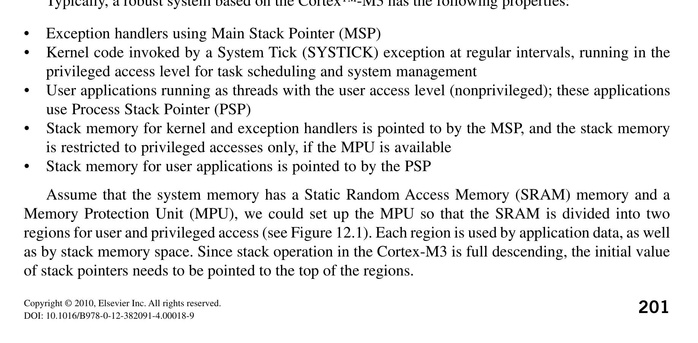
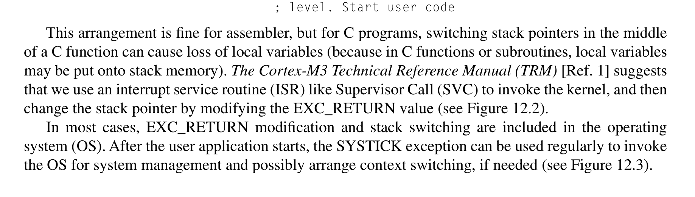
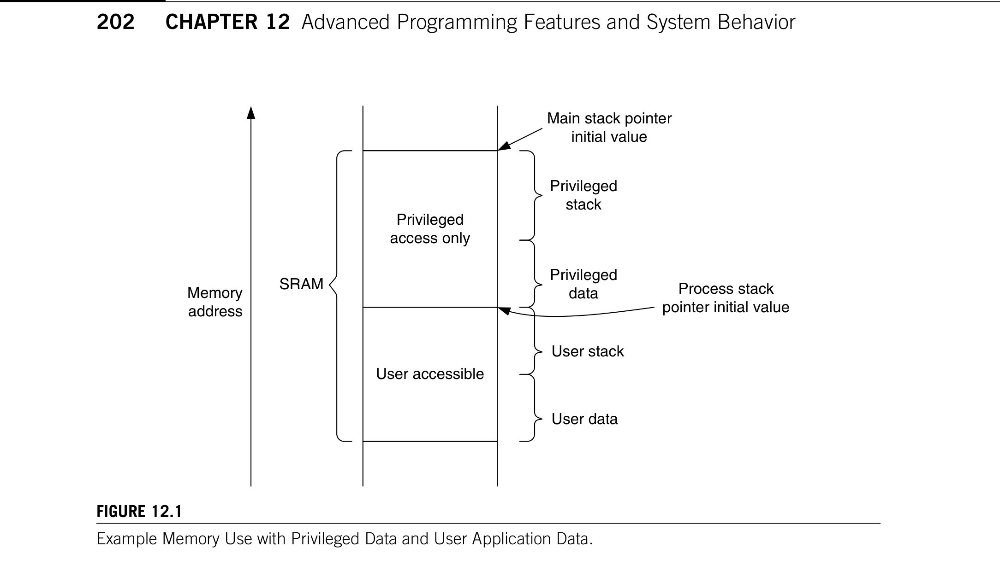
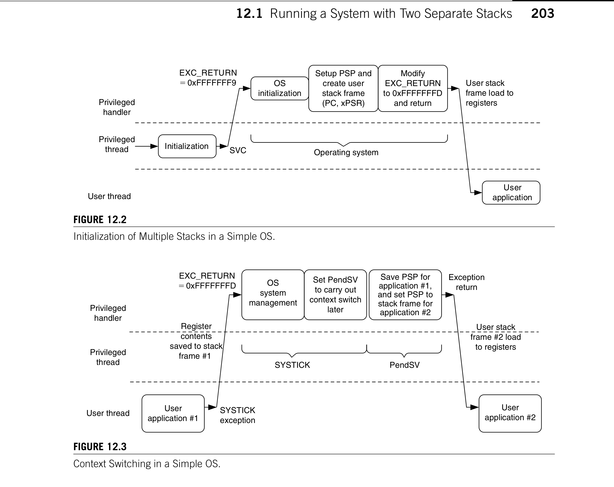
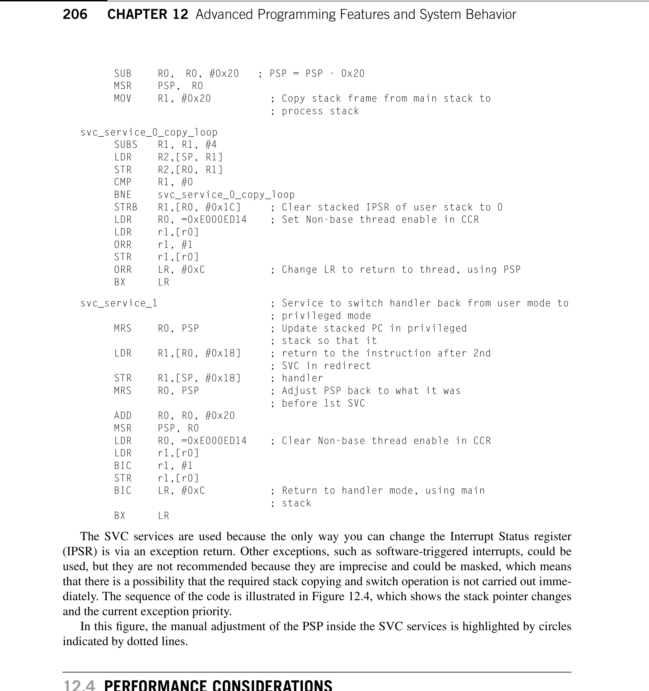
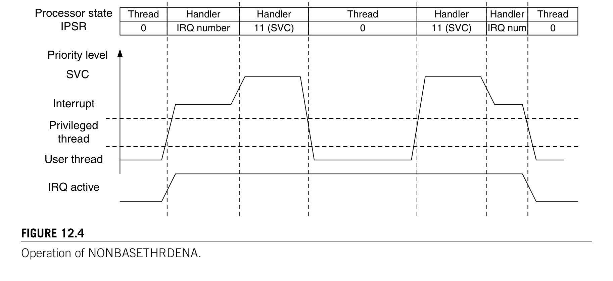
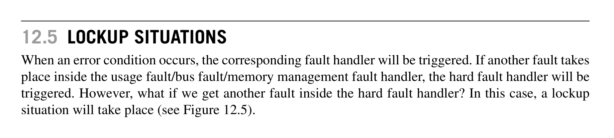
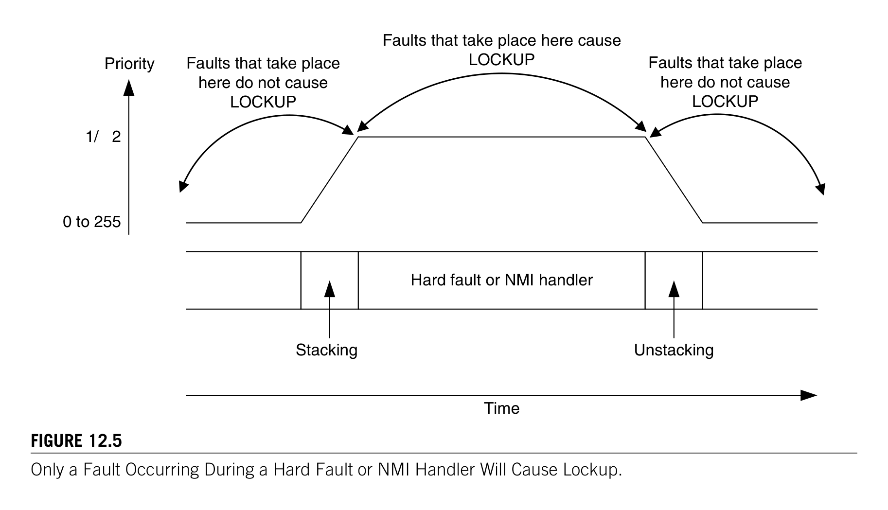

# Chapter 12. Advanced Programming Features and System Behavior

> **Source PDF**: THE_DEFINITIVE_GUIDE_TO_THE_ARM_CORTEX-МЗ_Stellaris_MCU_9000Series_TEINSTRUMENTS_ARM_SECOND_EDITION.pdf  
> **PDF Page Range**: 228 - 237

---

<!-- Page 228 -->
### [PDF Page 228]

*Description*: Technical diagram and schematic illustration detailing hardware circuit topology, signal routing, and logic operations for Figure 12.1.

> **Figure 12.1**

201
Copyright © 2010, Elsevier Inc. All rights reserved.
DOI: 10.1016/B978-0-12-382091-4.00018-9
In This Chapter
Running a System with Two Separate Stacks.......................................................................................... 201
Double-Word Stack Alignment................................................................................................................ 204
Nonbase Thread Enable......................................................................................................................... 205
Performance Considerations.................................................................................................................. 206
Lockup Situations.................................................................................................................................. 208
FAULTMASK.......................................................................................................................................... 210

## 12.1  Running a System with Two Separate Stacks

One of the important features of ARMv7-M architecture is the capability to allow the user application
stack to be separated from the privileged/kernel stack. If the optional Memory Protection Unit (MPU)
is implemented, it could be used to block user applications from accessing kernel stack memory so that
they cannot crash the kernel by memory corruption.
Typically, a robust system based on the Cortex™-M3 has the following properties:
Exception handlers using Main Stack Pointer (MSP)
•
Kernel code invoked by a System Tick (SYSTICK) exception at regular intervals, running in the
•
privileged access level for task scheduling and system management
User applications running as threads with the user access level (nonprivileged); these applications
•
use Process Stack Pointer (PSP)
Stack memory for kernel and exception handlers is pointed to by the MSP, and the stack memory
•
is restricted to privileged accesses only, if the MPU is available
Stack memory for user applications is pointed to by the PSP
•
Assume that the system memory has a Static Random Access Memory (SRAM) memory and a
Memory Protection Unit (MPU), we could set up the MPU so that the SRAM is divided into two
regions for user and privileged access (see Figure 12.1). Each region is used by application data, as well
as by stack memory space. Since stack operation in the Cortex-M3 is full descending, the initial value
of stack pointers needs to be pointed to the top of the regions.
Advanced Programming

### Features and System

Behavior
12
CHAPTER

<!-- Page 229 -->
### [PDF Page 229]

*Description*: Technical diagram and schematic illustration detailing hardware circuit topology, signal routing, and logic operations for Figure 12.2.

> **Figure 12.2**

*Description*: Technical diagram and schematic illustration detailing hardware circuit topology, signal routing, and logic operations for Figure 12.1.

> **Figure 12.1**

202
CHAPTER 12  Advanced Programming Features and System Behavior
After power-up, only the MSP is initialized (by fetching address 0x0 in the power-up sequence).
Additional steps are required to set up a completely robust two-stack system. For applications in assem-
bly code, it can simply be
; Start at privileged level (this code locates in user
; accessible memory)
BL
MpuSetup
; Setup MPU regions and enable memory
; protection
LDR
R0,=PSP_TOP
; Setup Process SP to top of process stack
MSR    PSP, R0
BL
SystickSetup
; Setup Systick and systick exception to
; invoke OS kernel at regular intervals
MOV
R0, #0x3
; Setup CONTROL register so that user
; program use PSP,
MSR
CONTROL, R0  ; and switch current access level to user
ISB
; Instruction Synchronization Barrier
B
UserApplicationStart   ; Now we are in user access
; level. Start user code
This arrangement is fine for assembler, but for C programs, switching stack pointers in the middle
of a C function can cause loss of local variables (because in C functions or subroutines, local variables
may be put onto stack memory). The Cortex-M3 Technical Reference Manual (TRM) [Ref. 1] suggests
that we use an interrupt service routine (ISR) like Supervisor Call (SVC) to invoke the kernel, and then
change the stack pointer by modifying the EXC_RETURN value (see Figure 12.2).
In most cases, EXC_RETURN modification and stack switching are included in the operating
­system (OS). After the user application starts, the SYSTICK exception can be used regularly to invoke
the OS for system management and possibly arrange context switching, if needed (see Figure 12.3).
Figure 12.1
Example Memory Use with Privileged Data and User Application Data.
User accessible
Memory
address
Main stack pointer
initial value
Privileged
data
Privileged
stack
Privileged
access only
SRAM
User data
User stack
Process stack
pointer initial value

<!-- Page 230 -->
### [PDF Page 230]

*Description*: Technical diagram and schematic illustration detailing hardware circuit topology, signal routing, and logic operations for Figure 12.2.

> **Figure 12.2**

*Description*: Technical diagram and schematic illustration detailing hardware circuit topology, signal routing, and logic operations for Figure 12.3.

> **Figure 12.3**

203

## 12.1  Running a System with Two Separate Stacks

Note that context switching is carried out in PendSV (a low-priority exception) to prevent context
switching at the middle of an interrupt handler.
However, many applications do not require an OS, but it is still helpful to use separate stacks for
different sections of application code as a way to improve reliability. One possible way to handle this is
to start Cortex-M3 with the MSP pointed to a process stack region. This way the initialization is done
with the process stack region but using MSP. Before starting the user application, the following code
is executed:
; Start at privileged level, MSP point to User stack
MpuSetup();
// Setup MPU regions and enable memory protection
SystickSetup();
// Setup Systick and systick exception for routine
// system management code
SwitchStackPointer();
// Call an assembly subroutine to switch SP
/*; ------Inside SwitchStackPointer -----
PUSH {R0, R1, LR}
Figure 12.2
Initialization of Multiple Stacks in a Simple OS.
Initialization
OS
initialization
Setup PSP and
create user
stack frame
(PC, xPSR)
Modify
EXC_RETURN
to 0xFFFFFFFD
and return
User
application
Operating system
User stack
frame load to
registers
SVC
EXC_RETURN
0xFFFFFFF9
Privileged
handler
Privileged
thread
User thread
Figure 12.3
Context Switching in a Simple OS.
OS
system
management
Set PendSV
to carry out
context switch
later
Save PSP for
application #1,
and set PSP to
stack frame for
application #2
User
application #2
User
application #1
SYSTICK
User stack
frame #2 load
to registers
SYSTICK
exception
PendSV
Register
contents
saved to stack
frame #1
Exception
return
EXC_RETURN
0xFFFFFFFD
Privileged
handler
Privileged
thread
User thread

<!-- Page 231 -->
### [PDF Page 231]

204
CHAPTER 12  Advanced Programming Features and System Behavior
MRS R0, MSP
; Save current stack pointer
LDR R1, =MSP_TOP
; Change MSP to new location
MSR MSP, R1
MSR PSP, R0
; Store current stack pointer in PSP
MOV R0, #0x3
MSR CONTROL, R0
; Switch to user mode, and use PSP as
; current stack
POP {R0, R1, PC}
; Return
; ------ Back to C program -----*/
; Now we are in User mode, using PSP and the local variables
; still here
UserApplicationStart();
// Start application code in user mode

## 12.2  Double-Word Stack Alignment

In applications that conform to AAPCS1, it is necessary to ensure that the stack pointer value at function
entry should be aligned to the double word address. To achieve this requirement, the stacking address
of registers at exception handling is adjusted accordingly. This is a configurable option on the Cortex-
M3 processor. To enable this feature, the STKALIGN bit in the Nested Vectored Interrupt Controller
(NVIC) Configuration Control register needs to be set (see Table D.18 in Appendix D). For example, if
CMSIS compliant device driver is used in C language project
SCB->CCR = SCB->CCR | 0x200;
If the project is in C but CMSIS is not used,
#define NVIC_CCR *((volatile unsigned long *) (0xE000ED14))
NVIC_CCR = NVIC_CCR | 0x200; /* Set STKALIGN in NVIC */
This can also be done in assembly language
LDR
R0,=0xE000ED14
; Set R0 to be address of NVIC CCR
LDR
R1, [R0]
ORR.W
R1, R1, #0x200
; Set STKALIGN bit
STR
R1, [R0]
; Write to NVIC CCR
When the STKALIGN bit is set during exception stacking, bit 9 of the stacked xPSR (combined
Program Status Register) is used to indicate whether a stack pointer adjustment has been made to align
the stacking. When unstacking, the stack pointer (SP) adjustment checks bit 9 of the stacked xPSR and
adjusts the SP accordingly.
To prevent stack data corruption, the STKALIGN bit must not be changed within an exception
­handler. This can cause a mismatch of stack pointer location before and after the exception.
This feature is available from Cortex-M3 revision 1 onward. Early Cortex-M3 products based on
revision 0 do not have this feature. In Cortex-M3 revision 2, this feature is enabled by default whereas
in revision 1, this needs to be turned on by software.
This feature should be used if the AAPCS conformation is required.
1Procedure Call Standard for the ARM Architecture (AAPCS) [Ref. 5]. An advisory note has been published on the ARM web
site regarding SP alignment and AAPCS; see http://infocenter.arm.com/help/topic/com.arm.doc.ihi0046a/IHI0046A_ABI_
Advisory_1.pdf.

<!-- Page 232 -->
### [PDF Page 232]

205

## 12.3  Nonbase Thread Enable

## 12.3  Nonbase Thread Enable

In the Cortex-M3, it is possible to switch a running interrupt handler from privileged level to user
access level. This is needed when the interrupt handler code is part of a user application and should
not  be allowed to have privileged access. This feature is enabled by the Nonbase Thread Enable
­(NONBASETHRDENA) bit in the NVIC Configuration Control register.
To use this feature, an exception handler redirection is involved. The vector in the vector table
points to a handler running in privileged mode but located in user mode accessible memory
redirect_handler
PUSH
{LR}
SVC
0
; A SVC function to change from privileged to
; user mode
BL User_IRQ_Handler
SVC
1
; A SVC function to change back from user to
; privileged mode
POP
{PC}
; Return
The SVC handler is divided into three parts as follows:
Determine the parameter when calling SVC.
•
SVC service #0 enables the NONBASETHRDENA, adjusts the user stack and EXC_RETURN
•
value, and returns to the redirect handler in user mode, using the process stack.
SVC service #1 disables the NONBASETHRDENA, restores the user stack pointer position, and
•
returns to the redirect handler in privileged mode, using the main stack.
svc_handler
TST
LR,  #0x4
; Test EXC_RETURN bit 2
ITE
EQ
; if zero then
MRSEQ	 R0,  MSP
; Get correct stack pointer to R0
MRSNE	 R0,  PSP
LDR
R1,[R0, #24]
; Get stacked PC
LDRB
R0,[R1, #−2]
; Get parameter at stacked PC – 2
CBZ
r0, svc_service_0
CMP
r0,  #1
BEQ
svc_service_1
B.W
Unknown_SVC_Request
svc_service_0
; Service to switch handler from privileged mode to
; user mode
MRS
R0,  PSP
; Adjust PSP
Use This Feature with Caution
Because of the need to manually adjust the stack and modify the stacked data, this feature should be avoided
in normal application programming. If it is necessary to use this feature, it must be done very carefully, and
the system designer must ensure that the interrupt service routine is terminated correctly. Otherwise, it could
cause some interrupts with the same or lower priority levels to be masked.

<!-- Page 233 -->
### [PDF Page 233]

*Description*: Technical diagram and schematic illustration detailing hardware circuit topology, signal routing, and logic operations for Figure 12.4.

> **Figure 12.4**

206
CHAPTER 12  Advanced Programming Features and System Behavior
SUB
R0,  R0, #0x20
; PSP = PSP - 0x20
MSR
PSP,  R0
MOV
R1, #0x20
; Copy stack frame from main stack to
; process stack
svc_service_0_copy_loop
SUBS
R1, R1, #4
LDR
R2,[SP, R1]
STR
R2,[R0, R1]
CMP
R1, #0
BNE
svc_service_0_copy_loop
STRB
R1,[R0, #0x1C]
; Clear stacked IPSR of user stack to 0
LDR
R0, =0xE000ED14
; Set Non-base thread enable in CCR
LDR
r1,[r0]
ORR
r1, #1
STR
r1,[r0]
ORR
LR, #0xC
; Change LR to return to thread, using PSP
BX
LR
svc_service_1
; Service to switch handler back from user mode to
; privileged mode
MRS
R0, PSP
; Update stacked PC in privileged
; stack so that it
LDR
R1,[R0, #0x18]
; return to the instruction after 2nd
; SVC in redirect
STR
R1,[SP, #0x18]
; handler
MRS
R0, PSP
; Adjust PSP back to what it was
; before 1st SVC
ADD
R0, R0, #0x20
MSR
PSP, R0
LDR
R0, =0xE000ED14
; Clear Non-base thread enable in CCR
LDR
r1,[r0]
BIC
r1, #1
STR
r1,[r0]
BIC
LR, #0xC
; Return to handler mode, using main
; stack
BX
LR
The SVC services are used because the only way you can change the Interrupt Status register
(IPSR) is via an exception return. Other exceptions, such as software-triggered interrupts, could be
used, but they are not recommended because they are imprecise and could be masked, which means
that there is a possibility that the required stack copying and switch operation is not carried out imme-
diately. The sequence of the code is illustrated in Figure 12.4, which shows the stack pointer changes
and the current exception priority.
In this figure, the manual adjustment of the PSP inside the SVC services is highlighted by circles
indicated by dotted lines.

## 12.4  Performance Considerations

To get the best out of the Cortex-M3, a few aspects need to be considered. First, we need to avoid
memory wait states. During the design stage of the microcontroller or SoC, the designer should

<!-- Page 234 -->
### [PDF Page 234]

*Description*: Technical diagram and schematic illustration detailing hardware circuit topology, signal routing, and logic operations for Figure 12.4.

> **Figure 12.4**

207

## 12.4  Performance Considerations

optimize the memory system design to allow instruction and data accesses to be carried out at
the same time, and use 32-bit memories, if possible. For developers, the memory map should be
arranged so that program code is executed from the code region and the majority of data accesses is
done via the system bus. This way data accesses can be carried out at the same time as instruction
fetches.
Second, the interrupt vector table should also be put into the code region, if possible. Thus, vector
fetch and stacking can be carried out at the same time. If the vector table is located in the SRAM, extra
clock cycles might result in interrupt latency because both vector fetch and stacking could share the
same system bus (unless the stack is located in the code region, which uses a D-Code bus).
If possible, avoid using unaligned transfers. An unaligned transfer might take two or more Advanced
High-Performance Bus (AHB) transfers to complete and will slow program performance, so plan your
data structure carefully. In assembly language with ARM tools, you can use the ALIGN directive to
ensure that a data location is aligned.
Most of you might be using C language for development, but for those who are using assembly, you
can use a few tricks to speed up parts of the program.
Figure 12.4
Operation of NONBASETHRDENA.
Main stack
pointer
(MSP)
Process stack
pointer
(PSP)
Processor state
IPSR
Thread
Handler
Handler
Memory
address
User IRQ
handler
Interrupt
SVC 0
SVC 1
SVC 0
return
SVC 1
return
Stack frame
copied to
process stack
Thread
Handler
Handler
Thread
Interrupt
return
0
IRQ number
11 (SVC)
0
11 (SVC)
IRQ num
0
PSP
manually
adjusted
PSP
manually
adjusted
Priority level
Interrupt
Privileged
thread
User thread
IRQ active
SVC

<!-- Page 235 -->
### [PDF Page 235]

*Description*: Technical diagram and schematic illustration detailing hardware circuit topology, signal routing, and logic operations for Figure 12.5.

> **Figure 12.5**

208
CHAPTER 12  Advanced Programming Features and System Behavior
Use memory access instruction with offset. When multiple memory locations in a small region are
1.
to be accessed, instead of writing
LDR
R0, =0xE000E400
; Set interrupt priority #3,#2,#1,#0
LDR
R1, =0xE0C02000
; priority levels
STR
R1,[R0]
LDR
R0, =0xE000E404
; Set interrupt priority #7,#6,#5,#4
LDR
R1, =0xE0E0E0E0
; priority levels
STR
R1,[R0]
you can reduce the program code to the following:
LDR
R0, =0xE000E400
; Set interrupt priority #3,#2,#1,#0
LDR
R1, =0xE0C02000
; priority levels
STR
R1,[R0]
LDR
R1,=0xE0E0E0E0
; priority levels
STR
R1,[R0,#4]
; Set interrupt priority #7,#6,#5,#4
The second store uses an offset of the first address and hence reduces the number of instructions.
Combine multiple memory accesses into Load/Store Multiple instructions (LDM/STM). The
2.
preceding example can be further reduced by using STM instruction as follows:
LDR
R0,=0xE000E400
; Set interrupt priority base
LDR
R1,=0xE0C02000
; priority levels #3,#2,#1,#0
LDR
R2,=0xE0E0E0E0
; priority levels #7,#6,#5,#4
STMIA	 R0, {R1, R2}
Use IF-THEN (IT) instruction blocks to replace small conditional branches. Since the Cortex-M3 is
3.
a pipelined processor, a branch penalty happens when a branch operation is taken. If the conditional
branch operation is used to skip a few instructions, this can be replaced by the IT instruction block,
which might save a few clock cycles.
If an operation can be carried out by either two Thumb
4.
® instructions or a single Thumb-2 instruction,
the Thumb-2 instruction method should be used because it gives a shorter execution time, despite
the fact that the memory size is the same.

## 12.5  Lockup Situations

When an error condition occurs, the corresponding fault handler will be triggered. If another fault takes
place inside the usage fault/bus fault/memory management fault handler, the hard fault handler will be
triggered. However, what if we get another fault inside the hard fault handler? In this case, a lockup
situation will take place (see Figure 12.5).
12.5.1  What Happens During Lockup?
During lockup, the program counter will be forced to 0xFFFFFFFX and will keep fetching from that
address. In addition, an output signal called LOCKUP from the Cortex-M3 will be inserted to indicate
the situation. Chip designers might use this signal to trigger a reset at the system reset generator.

<!-- Page 236 -->
### [PDF Page 236]

*Description*: Technical diagram and schematic illustration detailing hardware circuit topology, signal routing, and logic operations for Figure 12.5.

> **Figure 12.5**

209

## 12.5  Lockup Situations

Lockup can take place when
Faults occur inside the hard fault handler (double fault)
•
Faults occur inside the nonmaskable interrupt (NMI) handler
•
Bus faults occur during the reset sequence (initial SP or program counter (PC) fetch)
•
For double-fault situations, it is still possible for the core to respond to an NMI and execute the NMI
handler. But after the handler completes, it will return to the lockup state, with the program counter
restored to 0xFFFFFFFX. In this case, the system locks up and the current priority level is held at -1.
If an NMI occurs, the processor will still preempt and execute the NMI handler because the NMI has
a higher priority (-2) than the current priority level (-1). When the NMI is complete and returns to the
lockup state, the current exception priority is returned to -1.
Normally, the best way to exit a lockup is to perform a reset. Alternatively, for a system with a
debugger attached, it is possible to halt the core, change the PC to a different value, and start the pro-
gram execution from there. In most cases this might not be a good idea, since a number of registers,
including the interrupt system, might need reinitialization before the system can be returned to normal
operation.
You might wonder why we do not simply reset the core when a lockup takes place. You might want
to do that in a live system, but during software development, we should first try to find out the cause
of the problem. If we reset the core immediately, we might not be able to analyze what went wrong
because registers will be reset and hardware status will be changed. In most Cortex-M3 microcon-
trollers, a watchdog timer can be used to reset the core if it enters the lockup state.
Note that a bus fault that occurs during stack when entering a hard fault handler or NMI handler
does not cause lockup, but the bus fault handler will be pended.
Figure 12.5
Only a Fault Occurring During a Hard Fault or NMI Handler Will Cause Lockup.
z 1/z 2
0 to 255
Priority
Hard fault or NMI handler
Stacking
Unstacking
Faults that take place here cause
LOCKUP
Faults that take place
here do not cause
LOCKUP
Faults that take place
here do not cause
LOCKUP
Time

<!-- Page 237 -->
### [PDF Page 237]

210
CHAPTER 12  Advanced Programming Features and System Behavior
12.5.2  Avoiding Lockup
It is important to take extra care to prevent lockup problems when you’re developing an NMI or hard
fault handler. For example, we can avoid unnecessary stack accesses in a hard fault handler unless we
know that the memory is functioning correctly and the stack pointer is still valid. In developing com-
plex systems, one of the possible causes of a bus fault or memory fault is stack pointer corruption. If
we start the hard fault handler with something like this
hard_fault_handler
PUSH
{R4-R7,LR}
; Bad idea unless you are sure that the
; stack is safe to use!
. . .
and if the fault was caused by a stack error, we could enter lockup in our hard fault handler straight
away. In general, when programming hard fault, bus fault, and memory management fault handlers, it
might be worth checking whether the stack pointer is in a valid range before we carry out more stack
operations. For coding NMI handlers, we can try to reduce risk caused by stack operation by using
R0–R3 and R12 only, since they are already stacked.
One approach for developing hard fault and NMI handlers is to carry out only the essential tasks
inside the handlers, and the rest of the tasks, such as error reporting, can be pended using a separate
exception, such as PendSV or a software interrupt. This helps to ensure that the hard fault handler or
NMI is small and robust.
Furthermore, we should ensure that the NMI and hard fault handler code will not try to use SVC instruc-
tions. Since SVC always has lower priority than hard fault and NMI, using SVC in these handlers will cause
lockup. This might look simple, but when your application is complex and you call functions from different
files in your NMI and hard fault handler, you might accidentally call a function that contains an SVC instruc-
tion. Therefore, before you develop your software, you need to carefully plan the SVC implementation.

## 12.6  FAULTMASK

FAULTMASK is used to escalate a configurable fault handler (bus fault, usage fault or memory man-
agement fault) to hard fault level without the need to invoke hard fault by a real fault. This allows the
configurable fault handler to pretend to be the hard fault handler. By doing this, the fault handler can
have the ability to
Mask bus fault by setting HFHFNMIGN in Configuration Control register. It can be used to probe
1.
the bus system without causing lockup. For example, for checking if a bus bridge is working
correctly.
Bypass the MPU. This allows the fault handler to access an MPU protected memory location
2.
without reprogramming the MPU just to carry out a few transfers to fix faults.
The FAULTMASK usage is different from PRIMASK. PRIMASK is generally used in timing
­critical code, but it doesn’t have the ability to mask bus fault or bypass MPU. With PRIMASK set, all
configurable faults will be escalated to hard fault handler. FAULTMASK is used to allow a configu-
rable fault handler to solve memory-related problems by using features normally only available for a
hard fault handler. However, when FAULTMASK is set, faults such as incorrect undefined instruction,
or using SVC in the wrong priority level, can still cause lockup.

