# Chapter 13. The Memory Protection Unit

> **Source PDF**: THE_DEFINITIVE_GUIDE_TO_THE_ARM_CORTEX-МЗ_Stellaris_MCU_9000Series_TEINSTRUMENTS_ARM_SECOND_EDITION.pdf  
> **PDF Page Range**: 238 - 255


---


<!-- Page 238 -->
### [PDF Page 238]

211
CHAPTER
Copyright © 2010, Elsevier Inc. All rights reserved.
DOI: 10.1016/B978-0-12-382091-4.00019-0
In This Chapter

### Overview............................................................................................................................................... 211

MPU Registers...................................................................................................................................... 212
Setting Up the MPU............................................................................................................................... 218
Typical Setup........................................................................................................................................ 225
The Memory Protection Unit 13

## 13.1  Overview

The Cortex™-M3 design includes an optional Memory Protection Unit (MPU). Including the MPU in
the microcontrollers or system-on-chip (SoC) products provides memory protection features, which can
make the developed products more robust. The MPU needs to be programmed and enabled before use.
If the MPU is not enabled, the memory system behavior is the same as though no MPU is present.
The MPU can improve the reliability of an embedded system by
Preventing user applications from corrupting data used by the operating system
•
Separating data between processing tasks by blocking tasks from accessing others’ data
•
Allowing memory regions to be defined as read-only so that vital data can be protected
•
Detecting unexpected memory accesses (for example, stack corruption)
•
In addition, the MPU can also be used to define memory access characteristics such as caching and
buffering behaviors for different regions.
The MPU sets up the protection by defining the memory map as a number of regions. Up to eight
regions can be defined, but it is also possible to define a default background memory map for privileged
accesses. Accesses to memory locations that are not defined in the MPU regions or not permitted by the
region settings will cause the memory management fault exception to take place.
MPU regions can be overlapped. If a memory location falls on two regions, the memory access
attributes and permission will be based on the highest-numbered region. For example, if a trans-
fer address is within the address range defined for region 1 and region 4, the region 4 settings will
be used.


<!-- Page 239 -->
### [PDF Page 239]


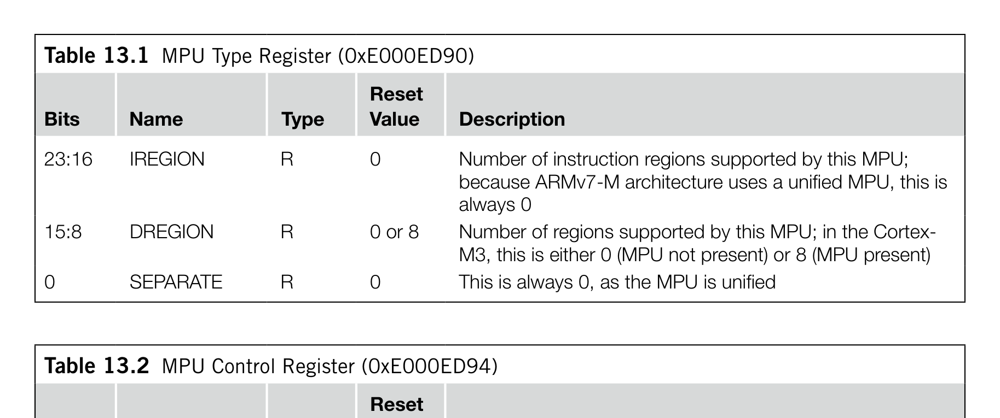
*Description*: Hardware reference table detailing register bit field settings, electrical operating limits, or memory configurations for Table 13.1.

> **Table 13.1**


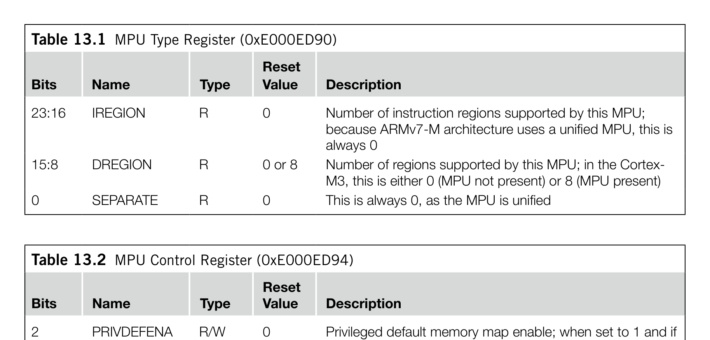
*Description*: Hardware reference table detailing register bit field settings, electrical operating limits, or memory configurations for Table 13.2.

> **Table 13.2**

212
CHAPTER 13  The Memory Protection Unit

## 13.2  MPU Registers

The MPU contains a number of registers. The first one is the MPU Type register. The MPU Type
­register can be used to determine whether the MPU is fitted. If the DREGION field is read as 0, the
MPU is not implemented (see Table 13.1).
The MPU is controlled by a number of registers. The first one is the MPU Control register (see
Table 13.2). This register has three control bits. After reset, the reset value of this register is zero, which
disables the MPU. To enable the MPU, the software should set up the settings for each MPU regions,
and then, set the ENABLE bit in the MPU Control register.
By using PRIVDEFENA and if no other regions are set up, privileged programs will be able to
access all memory locations, and only user programs will be blocked. However, if other MPU regions
are programmed and enabled, they can override the background region. For example, for two systems
with similar region setups but only one with PRIVDEFENA set to 1 (the right-hand side in Figure 13.1),
the one with PRIVDEFENA set to 1 will allow privileged access to background regions.
Setting the enable bit in the MPU Control register is usually the last step in the MPU setup code.
Otherwise, the MPU might generate faults by accident before the region configuration is done. In some
situations, it might be worth clearing the MPU Enable at the start of the MPU configuration routine to
make sure that the MPU faults won’t be triggered by accident during setup of MPU regions.
Table 13.1  MPU Type Register (0xE000ED90)
Bits
Name
Type
Reset
Value
Description
23:16
IREGION
R
0
Number of instruction regions supported by this MPU;
because ARMv7-M architecture uses a unified MPU, this is
always 0
15:8
DREGION
R
0 or 8
Number of regions supported by this MPU; in the Cortex-
M3, this is either 0 (MPU not present) or 8 (MPU present)
0
SEPARATE
R
0
This is always 0, as the MPU is unified
Table 13.2  MPU Control Register (0xE000ED94)
Bits
Name
Type
Reset
Value
Description
2
PRIVDEFENA
R/W
0
Privileged default memory map enable; when set to 1 and if
the MPU is enabled, the default memory map will be used
for privileged accesses as a background region. If this bit is
not set, the background region is disabled and any access
not covered by any enabled region will cause a fault.
1
HFNMIENA
R/W
0
If set to 1, it enables the MPU during the hard fault handler
and nonmaskable interrupt (NMI) handler; otherwise, the
MPU is not enabled (bypassed) for the hard fault handler
and NMI.
0
ENABLE
R/W
0
It enables the MPU if set to 1.


<!-- Page 240 -->
### [PDF Page 240]


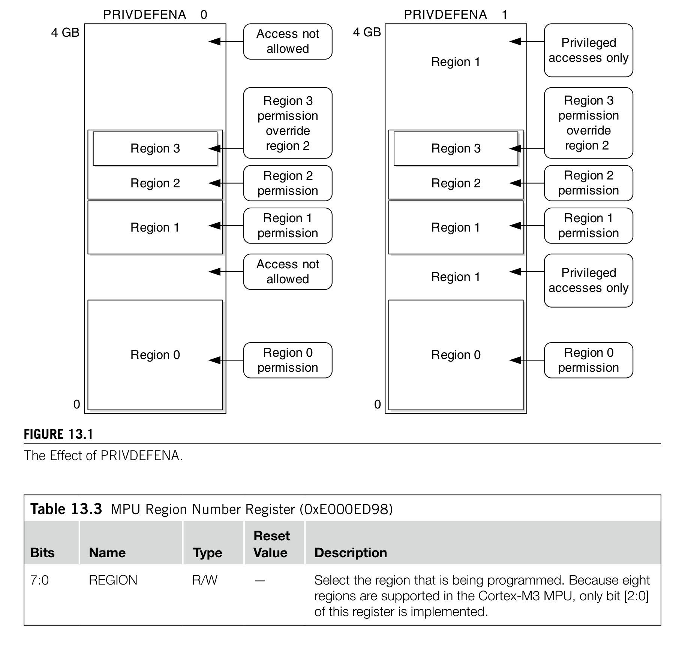
*Description*: Hardware reference table detailing register bit field settings, electrical operating limits, or memory configurations for Table 13.3.

> **Table 13.3**


*Description*: Technical diagram and schematic illustration detailing hardware circuit topology, signal routing, and logic operations for Figure 13.1.

> **Figure 13.1**

213

## 13.2  MPU Registers

The next MPU control register is the MPU Region Number register (see Table 13.3), before each
region is set up, write to this register to select the region to be programmed.
The starting address of each region is defined by the MPU Region Base Address register (see Table
13.4). Using the VALID and REGION fields in this register, we can skip the step of programming the
MPU Region Number register. This might reduce the complexity of the program code, especially if the
whole MPU setup is defined in a lookup table.
We also need to define the properties of each region. This is controlled by the MPU Region Base
Attribute and Size register (see Table 13.5).
The REGION SIZE field (5 bits) in the MPU Region Base Attribute and Size register determines
the size of the region (see Table 13.6).
Table 13.3  MPU Region Number Register (0xE000ED98)
Bits
Name
Type
Reset
Value
Description
7:0
REGION
R/W
—
Select the region that is being programmed. Because eight
regions are supported in the Cortex-M3 MPU, only bit [2:0]
of this register is implemented.
Figure 13.1
The Effect of PRIVDEFENA.
PRIVDEFENAz 0
PRIVDEFENAz 1
0
4 GB
Region 0
Region 1
Region 2
Access not
allowed
Region 2
permission
Region 1
permission
Region 0
permission
Region 3
permission
override
region 2
Access not
allowed
0
4 GB
Region 0
permission
Privileged
accesses only
Region 1
permission
Region 2
permission
Region 3
permission
override
region 2
Privileged
accesses only
Region 3
Region 1
Region 0
Region 1
Region 1
Region 2
Region 3


<!-- Page 241 -->
### [PDF Page 241]


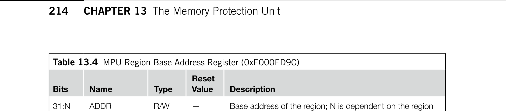
*Description*: Hardware reference table detailing register bit field settings, electrical operating limits, or memory configurations for Table 13.4.

> **Table 13.4**


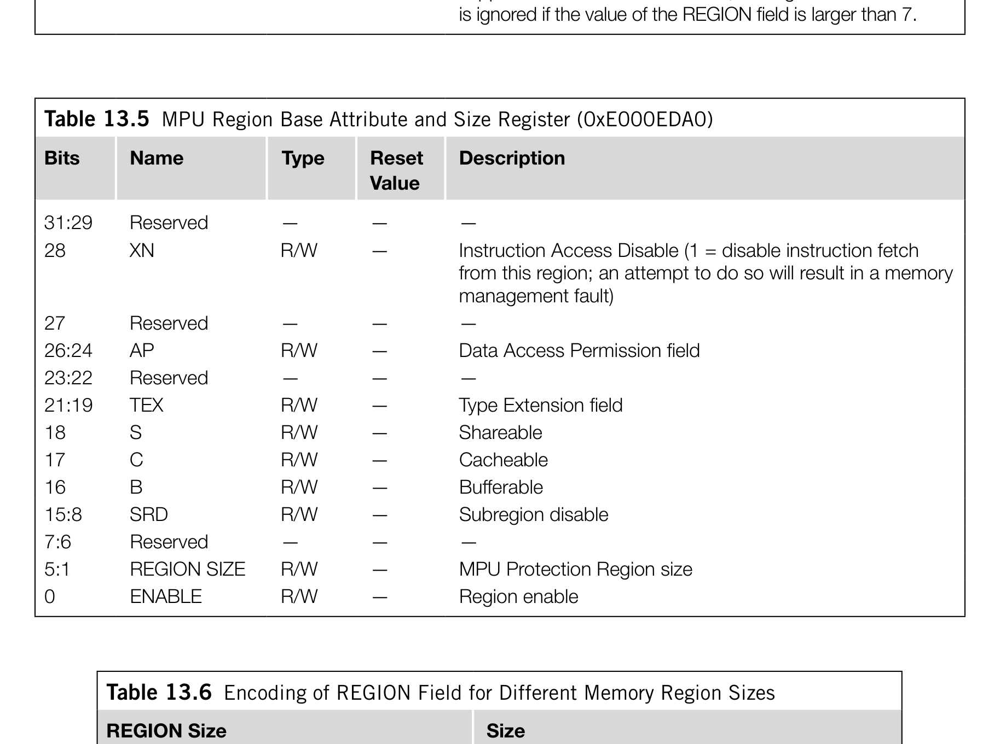
*Description*: Hardware reference table detailing register bit field settings, electrical operating limits, or memory configurations for Table 13.5.

> **Table 13.5**


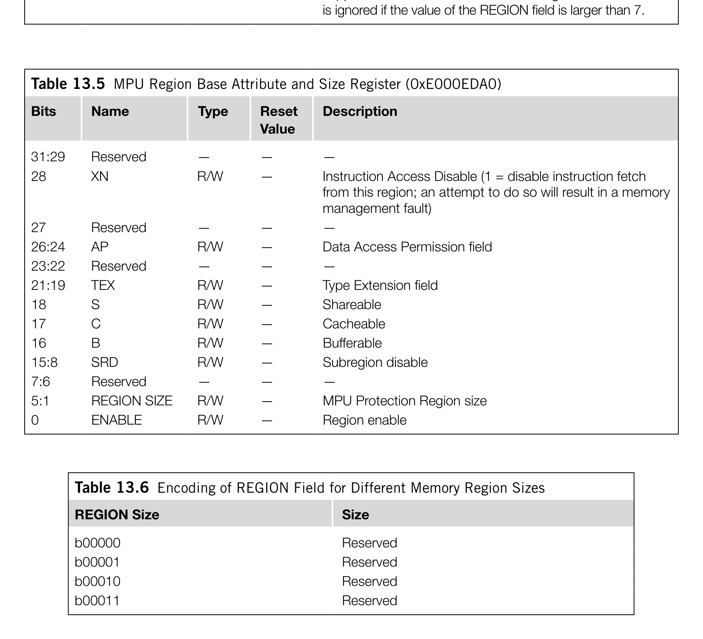
*Description*: Hardware reference table detailing register bit field settings, electrical operating limits, or memory configurations for Table 13.6.

> **Table 13.6**

214
CHAPTER 13  The Memory Protection Unit
Table 13.4  MPU Region Base Address Register (0xE000ED9C)
Bits
Name
Type
Reset
Value
Description
31:N
ADDR
R/W
—
Base address of the region; N is dependent on the region
size—for example, a 64 KB size region will have a base
address field of [31:16].
4
VALID
R/W
—
If this is 1, the REGION defined in bit [3:0] will be used in
this programming step; otherwise, the region selected by
the MPU Region Number register is used.
3:0
REGION
R/W
—
This field overrides the MPU Region Number register if VALID
is 1; otherwise, it is ignored. Because eight regions are
supported in the Cortex-M3 MPU, the region number override
is ignored if the value of the REGION field is larger than 7.
Table 13.5  MPU Region Base Attribute and Size Register (0xE000EDA0)
Bits
Name
Type
Reset
Value
Description
31:29
Reserved
—
—
—
28
XN
R/W
—
Instruction Access Disable (1 = disable instruction fetch
from this region; an attempt to do so will result in a memory
management fault)
27
Reserved
—
—
—
26:24
AP
R/W
—
Data Access Permission field
23:22
Reserved
—
—
—
21:19
TEX
R/W
—
Type Extension field
18
S
R/W
—
Shareable
17
C
R/W
—
Cacheable
16
B
R/W
—
Bufferable
15:8
SRD
R/W
—
Subregion disable
7:6
Reserved
—
—
—
5:1
REGION SIZE
R/W
—
MPU Protection Region size
0
ENABLE
R/W
—
Region enable
Table 13.6  Encoding of REGION Field for Different Memory Region Sizes
REGION Size
Size
b00000
Reserved
b00001
Reserved
b00010
Reserved
b00011
Reserved


<!-- Page 242 -->
### [PDF Page 242]


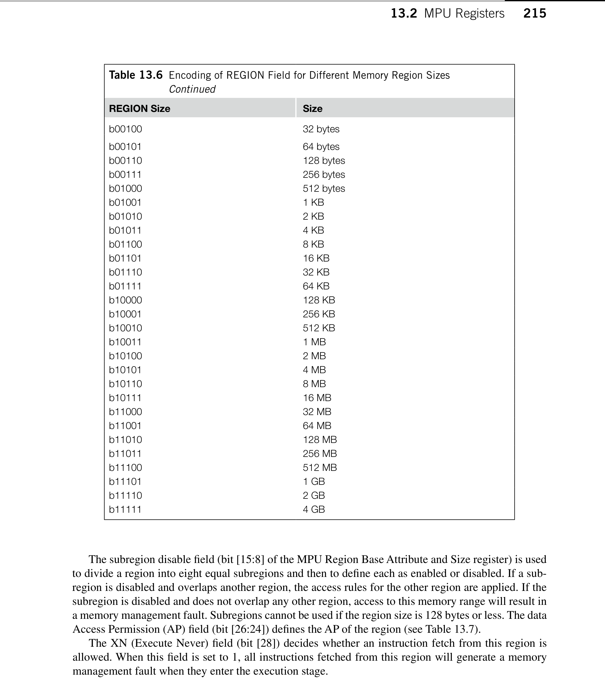
*Description*: Hardware reference table detailing register bit field settings, electrical operating limits, or memory configurations for Table 13.7.

> **Table 13.7**


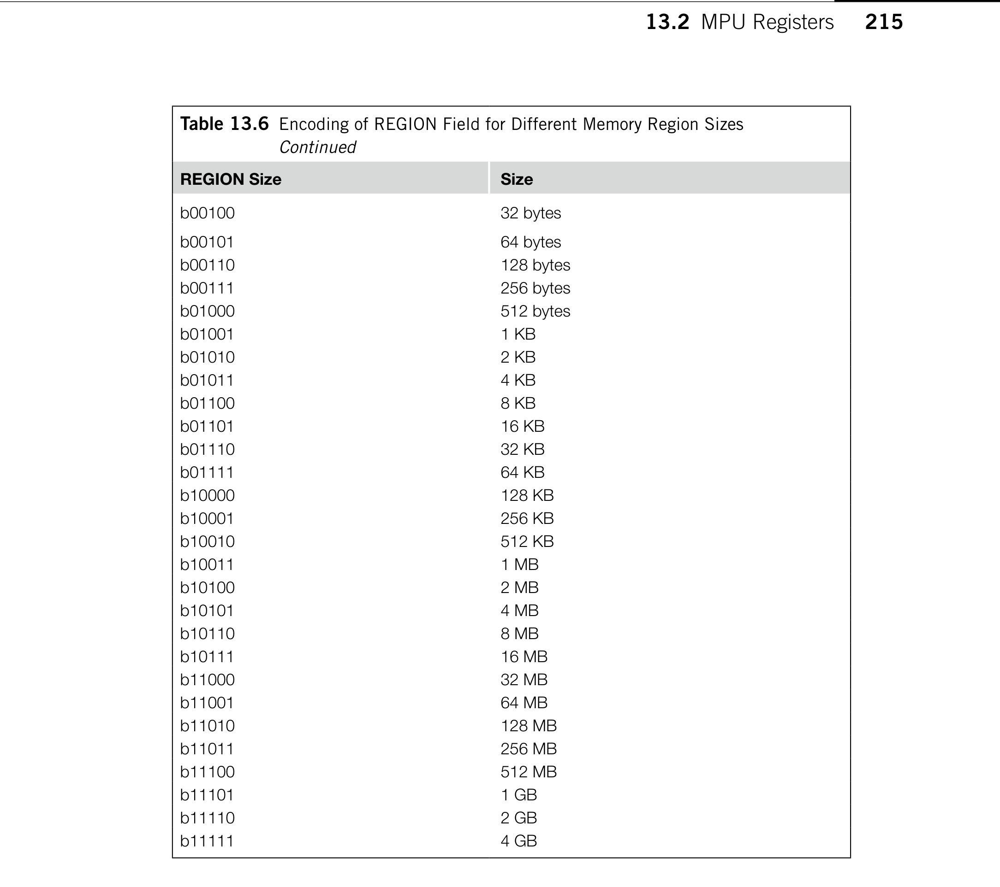
*Description*: Hardware reference table detailing register bit field settings, electrical operating limits, or memory configurations for Table 13.6.

> **Table 13.6**

215

## 13.2  MPU Registers

The subregion disable field (bit [15:8] of the MPU Region Base Attribute and Size register) is used
to divide a region into eight equal subregions and then to define each as enabled or disabled. If a sub-
region is disabled and overlaps another region, the access rules for the other region are applied. If the
subregion is disabled and does not overlap any other region, access to this memory range will result in
a memory management fault. Subregions cannot be used if the region size is 128 bytes or less. The data
Access Permission (AP) field (bit [26:24]) defines the AP of the region (see Table 13.7).
The XN (Execute Never) field (bit [28]) decides whether an instruction fetch from this region is
allowed. When this field is set to 1, all instructions fetched from this region will generate a memory
management fault when they enter the execution stage.
Table 13.6  Encoding of REGION Field for Different Memory Region Sizes
Continued
REGION Size
Size
b00100
32 bytes
b00101
64 bytes
b00110
128 bytes
b00111
256 bytes
b01000
512 bytes
b01001
1 KB
b01010
2 KB
b01011
4 KB
b01100
8 KB
b01101
16 KB
b01110
32 KB
b01111
64 KB
b10000
128 KB
b10001
256 KB
b10010
512 KB
b10011
1 MB
b10100
2 MB
b10101
4 MB
b10110
8 MB
b10111
16 MB
b11000
32 MB
b11001
64 MB
b11010
128 MB
b11011
256 MB
b11100
512 MB
b11101
1 GB
b11110
2 GB
b11111
4 GB


<!-- Page 243 -->
### [PDF Page 243]


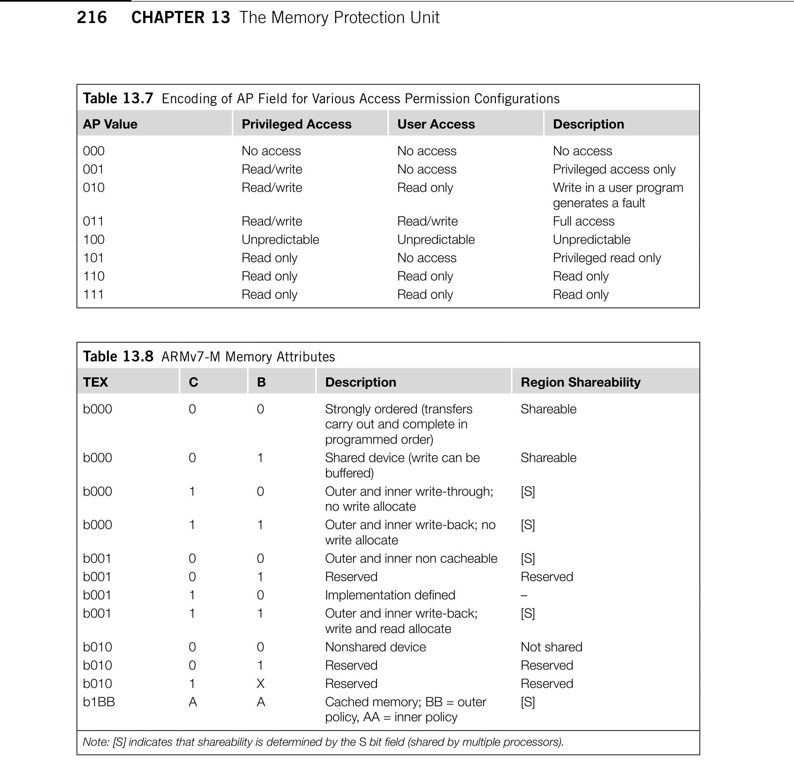
*Description*: Hardware reference table detailing register bit field settings, electrical operating limits, or memory configurations for Table 13.7.

> **Table 13.7**


*Description*: Hardware reference table detailing register bit field settings, electrical operating limits, or memory configurations for Table 101.

> **Table 101**


*Description*: Hardware reference table detailing register bit field settings, electrical operating limits, or memory configurations for Table 13.8.

> **Table 13.8**

216
CHAPTER 13  The Memory Protection Unit
The TEX, S, B, and C fields (bit [21:16]) are more complex. Despite that the Cortex-M3 processor
does not have cache, its implementation follows ARMv7-M architecture, which can support external
cache and more advanced memory systems. Therefore, the region access properties can be programmed
to support different types of memory management models.
Table 13.7  Encoding of AP Field for Various Access Permission Configurations
AP Value
Privileged Access
User Access
Description
000
No access
No access
No access
001
Read/write
No access
Privileged access only
010
Read/write
Read only
Write in a user program
generates a fault
011
Read/write
Read/write
Full access
100
Unpredictable
Unpredictable
Unpredictable
101
Read only
No access
Privileged read only
110
Read only
Read only
Read only
111
Read only
Read only
Read only
Table 13.8  ARMv7-M Memory Attributes
TEX
C
B
Description
Region Shareability
b000
0
0
Strongly ordered (transfers
carry out and complete in
programmed order)
Shareable
b000
0
1
Shared device (write can be
buffered)
Shareable
b000
1
0
Outer and inner write-through;
no write allocate
[S]
b000
1
1
Outer and inner write-back; no
write allocate
[S]
b001
0
0
Outer and inner non cacheable
[S]
b001
0
1
Reserved
Reserved
b001
1
0
Implementation defined
–
b001
1
1
Outer and inner write-back;
write and read allocate
[S]
b010
0
0
Nonshared device
Not shared
b010
0
1
Reserved
Reserved
b010
1
X
Reserved
Reserved
b1BB
A
A
Cached memory; BB = outer
policy, AA = inner policy
[S]
Note: [S] indicates that shareability is determined by the S bit field (shared by multiple processors).


<!-- Page 244 -->
### [PDF Page 244]


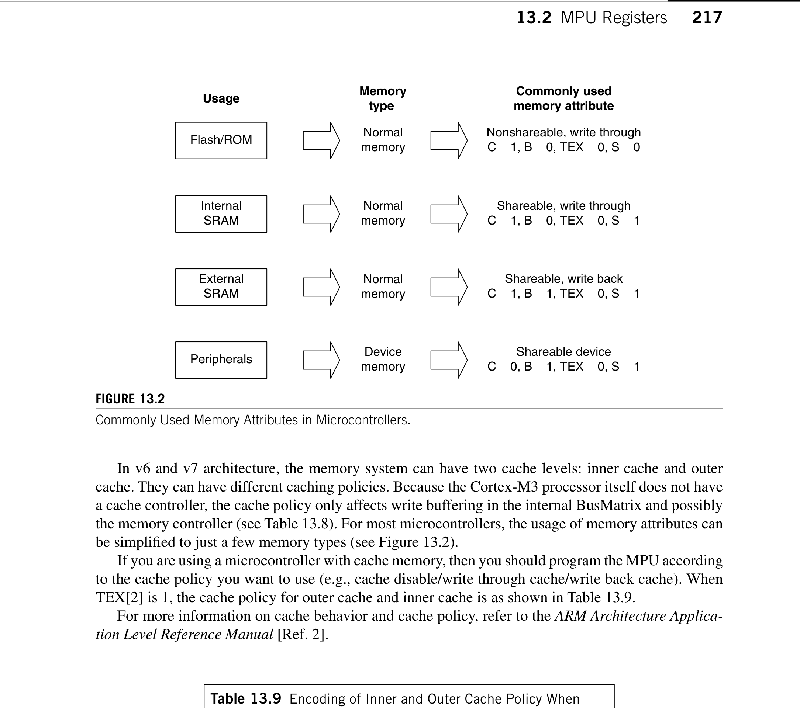
*Description*: Hardware reference table detailing register bit field settings, electrical operating limits, or memory configurations for Table 13.8.

> **Table 13.8**


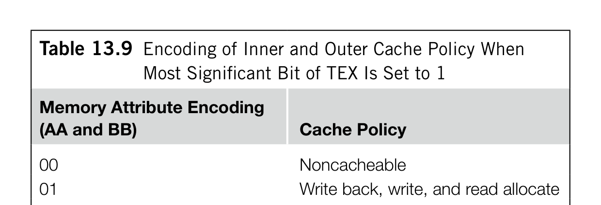
*Description*: Hardware reference table detailing register bit field settings, electrical operating limits, or memory configurations for Table 13.9.

> **Table 13.9**


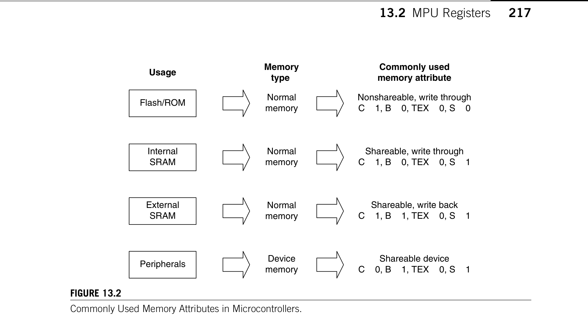
*Description*: Technical diagram and schematic illustration detailing hardware circuit topology, signal routing, and logic operations for Figure 13.2.

> **Figure 13.2**

217

## 13.2  MPU Registers

In v6 and v7 architecture, the memory system can have two cache levels: inner cache and outer
cache. They can have different caching policies. Because the Cortex-M3 processor itself does not have
a cache controller, the cache policy only affects write buffering in the internal BusMatrix and possibly
the memory controller (see Table 13.8). For most microcontrollers, the usage of memory attributes can
be simplified to just a few memory types (see Figure 13.2).
If you are using a microcontroller with cache memory, then you should program the MPU according
to the cache policy you want to use (e.g., cache disable/write through cache/write back cache). When
TEX[2] is 1, the cache policy for outer cache and inner cache is as shown in Table 13.9.
For more information on cache behavior and cache policy, refer to the ARM Architecture Applica-
tion Level Reference Manual [Ref. 2].
Figure 13.2
Commonly Used Memory Attributes in Microcontrollers.
Flash/ROM
Memory
type
Normal
memory
Normal
memory
Normal
memory
Commonly used
memory attribute
Internal
SRAM
Peripherals
Device
memory
Nonshareable, write through
C z 1, B z 0, TEX z 0, S z 0
Shareable, write through
C z 1, B z 0, TEX z 0, S z 1
External
SRAM
Shareable, write back
C z 1, B z 1, TEX z 0, S z 1
Shareable device
C z 0, B z 1, TEX z 0, S z 1
Usage
Table 13.9  Encoding of Inner and Outer Cache Policy When
Most Significant Bit of TEX Is Set to 1
Memory Attribute Encoding
(AA and BB)
Cache Policy
00
Noncacheable
01
Write back, write, and read allocate
10
Write through, no write allocate
11
Write back, no write allocate


<!-- Page 245 -->
### [PDF Page 245]


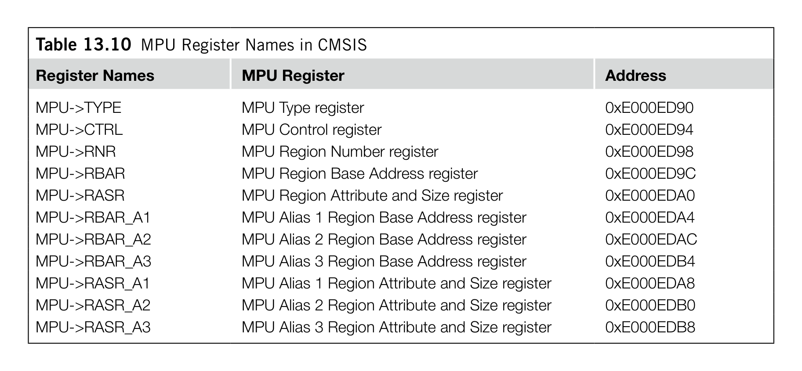
*Description*: Hardware reference table detailing register bit field settings, electrical operating limits, or memory configurations for Table 13.10.

> **Table 13.10**

218
CHAPTER 13  The Memory Protection Unit

## 13.3  Setting Up the MPU

The MPU register might look complicated, but as long as you have a clear idea of the memory regions
that are required for your application, it should not be difficult. Typically, you need to have the follow-
ing memory regions:
Program code for privileged programs (for example, OS kernel and exception handlers)
•
Program code for user programs
•
Data memory for privileged and user programs in various memory regions (e.g.,
•
data and stack
of the application situated in the SRAM (Static Random Access Memory) memory region--
0x20000000 to 0x3FFFFFFF)
Other peripherals
•
It is not necessary to set up a region for the memory in the private peripheral bus range. The MPU
automatically recognizes the private peripheral bus memory addresses and allows privileged software
to perform data accesses in this region.
For Cortex-M3 products, most memory regions can be set up with TEX = b000, C = 1, B = 1.
System devices such as the Nested Vectored Interrupt Controller (NVIC) should be strongly ordered,
and peripheral regions can be programmed as shared devices (TEX = b000, C = 0, B = 1). However,
if you want to make sure that any bus faults occurring in the region are precise bus faults, you should
use a strongly ordered memory attribute (TEX = b000, C = 0, B = 0) so that write buffering is disabled.
However, doing so can reduce system performance.
For users of a Cortex Microcontroller Software Interface Standard (CMSIS) compliant device
driver, the MPU registers can be accessed using the following register names as shown in Table 13.10.
A simple flow for an MPU setup routine is shown in Figure 13.3 on page 220.
Before the MPU is enabled and if the vector table is relocated to RAM, remember to set up the fault
handler for the memory management fault in the vector table, and enable the memory management
fault in the System Handler Control and State register. They are needed to allow the memory manage-
ment fault handler to be executed if an MPU violation takes place.
Table 13.10  MPU Register Names in CMSIS
Register Names
MPU Register
Address
MPU->TYPE
MPU Type register
0xE000ED90
MPU->CTRL
MPU Control register
0xE000ED94
MPU->RNR
MPU Region Number register
0xE000ED98
MPU->RBAR
MPU Region Base Address register
0xE000ED9C
MPU->RASR
MPU Region Attribute and Size register
0xE000EDA0
MPU->RBAR_A1
MPU Alias 1 Region Base Address register
0xE000EDA4
MPU->RBAR_A2
MPU Alias 2 Region Base Address register
0xE000EDAC
MPU->RBAR_A3
MPU Alias 3 Region Base Address register
0xE000EDB4
MPU->RASR_A1
MPU Alias 1 Region Attribute and Size register
0xE000EDA8
MPU->RASR_A2
MPU Alias 2 Region Attribute and Size register
0xE000EDB0
MPU->RASR_A3
MPU Alias 3 Region Attribute and Size register
0xE000EDB8


<!-- Page 246 -->
### [PDF Page 246]

219

## 13.3  Setting Up the MPU

For a simple case of only four required regions, the MPU setup code (without the region checking
and enabling) looks like this:
MPU->RNR  = 0;
// MPU Region Number Register
// select region 0
MPU->RBAR = 0x00000000; // MPU Region Base Address Register
// Base Address = 0x00000000
MPU->RASR = 0x0307002F; // Region Attribute and Size Register
// R/W, TEX=0,S=1,C=1,B=1, 16MB, Enable=1
MPU->RNR  = 1;          // select region 1
MPU->RBAR = 0x20000000; // Base Address = 0x20000000
MPU->RASR = 0x03070033; // R/W, TEX=0,S=1,C=1,B=1, 64MB, Enable=1
MPU->RNR  = 2;          // select region 2
MPU->RBAR = 0x40000000; // Base Address = 0x40000000
MPU->RASR = 0x03050033; // R/W, TEX=0,S=1,C=0,B=1, 64MB, Enable=1
MPU->RNR  = 3;          // select region 3
MPU->RBAR = 0xA0000000; // Base Address = 0xA0000000
MPU->RASR = 0x01040027; // Privileged R/W, TEX=0,S=1,C=0,B=0,
// 1MB, Enable=1
MPU->CTRL = 1;
// MPU Control register – Enable MPU
This can also be coded in assembly language:
LDR      R0,=0xE000ED98  ; Region number register
MOV      R1,#0           ; Select region 0
STR      R1, [R0]
LDR      R1,=0x00000000  ; Base Address = 0x00000000
STR      R1, [R0, #4]    ; MPU Region Base Address Register
LDR      R1,=0x0307002F  ; R/W, TEX=0,S=1,C=1,B=1, 16MB, Enable=1
STR      R1, [R0, #8]    ; MPU Region Attribute and Size Register
MOV      R1,#1           ; Select region 1
STR      R1, [R0]
LDR      R1,=0x20000000  ; Base Address = 0x20000000
STR      R1, [R0, #4]    ; MPU Region Base Address Register
LDR      R1,=0x03070033  ; R/W, TEX=0,S=1,C=1,B=1, 64MB, Enable=1
STR      R1, [R0, #8]    ; MPU Region Attribute and Size Register
MOV      R1,#2           ; Select region 2
STR      R1, [R0]
LDR      R1,=0x40000000  ; Base Address = 0x40000000
STR      R1, [R0, #4]    ; MPU Region Base Address Register
LDR      R1,=0x03050033  ; R/W, TEX=0,S=1,C=0,B=1, 64MB, Enable=1
STR      R1, [R0, #8]    ; MPU Region Attribute and Size Register
MOV      R1,#3           ; Select region 3
STR      R1, [R0]
LDR      R1,=0xA0000000  ; Base Address = 0xA0000000
STR      R1, [R0, #4]    ; MPU Region Base Address Register
LDR      R1,=0x01040027  ; Privileged R/W, TEX=0,S=1,C=0,B=0, 1MB,
; Enable=1
STR      R1, [R0, #8]    ; MPU Region Attribute and Size Register
MOV      R1,#1           ; Enable MPU
STR      R1, [R0,#-4]    ; MPU Control register
; (0xE000ED98-4=0xE000ED94)


<!-- Page 247 -->
### [PDF Page 247]


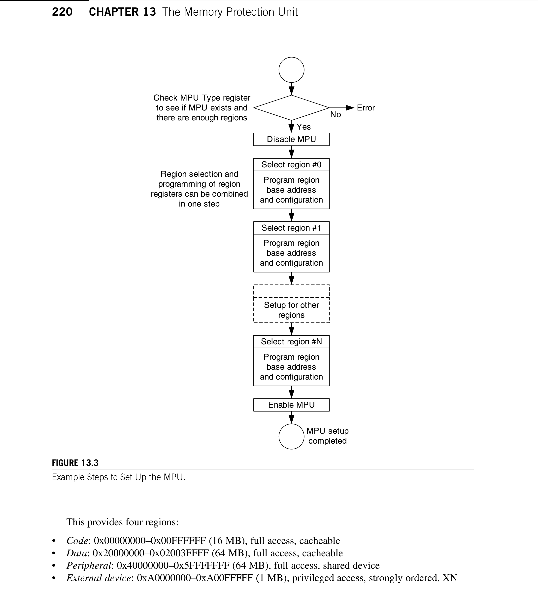
*Description*: Technical diagram and schematic illustration detailing hardware circuit topology, signal routing, and logic operations for Figure 13.3.

> **Figure 13.3**

220
CHAPTER 13  The Memory Protection Unit
This provides four regions:
•
Code: 0x00000000–0x00FFFFFF (16 MB), full access, cacheable
Data
•
: 0x20000000–0x02003FFFF (64 MB), full access, cacheable
•
Peripheral: 0x40000000–0x5FFFFFFF (64 MB), full access, shared device
•
External device: 0xA0000000–0xA00FFFFF (1 MB), privileged access, strongly ordered, XN
Figure 13.3
Example Steps to Set Up the MPU.
Check MPU Type register
to see if MPU exists and
there are enough regions
Error
No
Yes
Disable MPU
Select region #0
Program region
base address
and configuration
Select region #1
Program region
base address
and configuration
Select region #N
Program region
base address
and configuration
Enable MPU
MPU setup
completed
Region selection and
programming of region
registers can be combined
in one step
Setup for other
regions


<!-- Page 248 -->
### [PDF Page 248]

221

## 13.3  Setting Up the MPU

By combining region selection and writing to the base address register, we can shorten the code to this:
MPU->RBAR = 0x00000010; // MPU Region Base Address Register
// Base Address = 0x00000000, valid, region 0
MPU->RASR = 0x0307002F; // Region Attribute and Size Register
// R/W, TEX=0,S=1,C=1,B=1, 16MB, Enable=1
MPU->RBAR = 0x20000011; // Base Address = 0x20000000, valid, region 1
MPU->RASR = 0x03070033; // R/W, TEX=0,S=1,C=1,B=1, 64MB, Enable=1
MPU->RBAR = 0x40000012; // Base Address = 0x40000000, valid, region 2
MPU->RASR = 0x03050033; // R/W, TEX=0,S=1,C=0,B=1, 64MB, Enable=1
MPU->RBAR = 0xA0000013; // Base Address = 0xA0000000, valid, region 3
MPU->RASR = 0x01040027; // Privileged R/W, TEX=0,S=1,C=0,B=0,
// 1MB, Enable=1
MPU->CTRL = 1;          // MPU Control register – Enable MPU
Or, in assembly:
LDR      R0,=0xE000ED9C    ; Region Base Address register
LDR      R1,=0x00000010    ; Base Address = 0x00000000, region 0,
; valid=1
STR      R1, [R0, #0]      ; MPU Region Base Address Register
LDR      R1,=0x0307002F    ; R/W, TEX=0,S=1,C=1,B=1, 16MB, Enable=1
STR      R1, [R0, #4]      ; MPU Region Attribute and Size Register
LDR      R1,=0x20000011    ; Base Address = 0x20000000, region 1,
; valid=1
STR      R1, [R0, #0]      ; MPU Region Base Address Register
LDR      R1,=0x03070033    ; R/W, TEX=0,S=1,C=1,B=1, 64MB, Enable=1
STR      R1, [R0, #4]      ; MPU Region Attribute and Size Register
LDR      R1,=0x40000012    ; Base Address = 0x40000000, region 2,
; valid=1
STR      R1, [R0, #0]      ; MPU Region Base Address Register
LDR      R1,=0x03050033    ; R/W, TEX=0,S=1,C=0,B=1, 64MB, Enable=1
STR      R1, [R0, #4]      ; MPU Region Attribute and Size Register
LDR      R1,=0xA0000013    ; Base Address = 0xA0000000, region 3,
; valid=1
STR      R1, [R0, #0]      ; MPU Region Base Address Register
LDR      R1,=0x01040027    ; R/W, TEX=0,S=1,C=0,B=0, 1MB, Enable=1
STR      R1, [R0, #4]      ; MPU Region Attribute and Size Register
MOV      R1,#1             ; Enable MPU
STR      R1, [R0,#-8]      ; MPU Control register
; (0xE000ED9C-8=0xE000ED94)
We’ve shortened the code quite a bit. However, you can make further enhancements to create even
faster setup code. This is done using MPU aliased register addresses (see Table D.34 in Appendix D).
The aliased register addresses follow the MPU Region Attribute and Size registers and are aliased
to the MPU Base Address register and the MPU Region Attribute and Size register. They produce a
continuous address of eight words, making it possible to use Load/Store Multiple (LDM and STM)
instructions:
LDR     R0,=0xE000ED9C   ; Region Base Address register
LDR     R1,=MPUconfig     ; Table of predefined MPU setup variables


<!-- Page 249 -->
### [PDF Page 249]

222
CHAPTER 13  The Memory Protection Unit
LDMIA   R1!, {R2, R3, R4, R5}; Read 4 words from table
STMIA   R0!, {R2, R3, R4, R5}; write 4 words to MPU
LDMIA   R1!, {R2, R3, R4, R5}; Read next 4 words from table
STMIA   R0!, {R2, R3, R4, R5}; write next 4 words to MPU
B         MPUconfigEnd
ALIGN 4    ; This is needed to make sure the following table
; is word aligned
MPUconfig
; so that we can use load multiple instruction
DCD     0x00000010  ; Base Address = 0x00000000, region 0,
; valid=1
DCD    0x0307002F     ; R/W, TEX=0,S=1,C=1,B=1, 16MB, Enable=1
DCD    0x20000011     ; Base Address = 0x08000000, region 1,
; valid=1
DCD    0x03070033     ; R/W, TEX=0,S=1,C=1,B=1, 64MB, Enable=1
DCD    0x40000012     ; Base Address = 0x40000000, region 2,
; valid=1
DCD    0x03050033     ; R/W, TEX=0,S=1,C=0,B=1, 64MB, Enable=1
DCD    0xA0000013     ; Base Address = 0xA0000000, region 3,
; valid=1
DCD    0x01040027     ; R/W, TEX=0,S=1,C=0,B=0, 1MB, Enable=1
MPUconfigEnd
LDR    R0,=0xE000ED94 ; MPU Control register
MOV    R1,#1          ; Enable MPU
STR    R1, [R0]
This solution, of course, can be used only if all the required information is known beforehand.
Otherwise, a more generic approach has to be used. One way to handle this is to use a subroutine
­(Mpu­RegionSetup) that can set up a region based on a number of input parameters and then call it sev-
eral times to set up different regions:

```c
void MpuRegionSetup(unsigned int addr, unsigned int region,
```

unsigned int size, unsigned int ap, unsigned int MemAttrib,
unsigned int srd, unsigned int XN, unsigned int enable)
{ // Setup procedure for each region
MPU->RBAR = (addr & 0xFFFFFFE0) | (region & 0xF) | 0x10;
MPU->RASR = ((XN & 0x1)<<28) | ((ap & 0x7)<<24) |
((MemAttrib & 0x3F)<<16) | ((srd&0xFF)<<8) |
((size & 0x1F)<<1)| (enable & 0x1);
return;
}

```c
void MpuRegionDisable(unsigned int region)
```

{ // Function to disable an unused region
MPU->RBAR = (region & 0xF) | 0x10;
MPU->RASR = 0; // disable
return;
}

```c
void MpuSetup(void)
```

{ // Setup the whole MPU
MPU->CTRL = 0; // Disable MPU first
MpuRegionSetup(0x00000000, 0, 0x17, 3, 7, 0, 0, 1); // Region 0,16M
MpuRegionSetup(0x20000000, 1, 0x19, 3, 7, 0, 0, 1); // Region 1,64M
MpuRegionSetup(0x40000000, 2, 0x19, 3, 5, 0, 0, 1); // Region 2,64M


<!-- Page 250 -->
### [PDF Page 250]

223

## 13.3  Setting Up the MPU

MpuRegionSetup(0xA0000000, 3, 0x13, 1, 4, 0, 0, 1); // Region 3, 1M
MpuRegionDisable(4); // Disable unused region 4
MpuRegionDisable(5); // Disable unused region 5
MpuRegionDisable(6); // Disable unused region 6
MpuRegionDisable(7); // Disable unused region 7
MPU->CTRL = 1; // Enable MPU
return;
}
In this example, we included a subroutine that is used to disable a region that is not used. This
is necessary if you do not know whether a region has been programmed previously. If an unused
region is previously programmed to be enabled, it needs to be disabled so that it doesn’t affect the new
­configuration.
The MPU setup routines can be rewritten in assembly as
MpuSetup   ; A subroutine to setup the MPU by calling subroutines that
; setup regions
PUSH   {R0-R6,LR}
LDR    R0,=0xE000ED94    ; MPU Control Register
MOV    R1,#0
STR    R1,[R0]           ; Disable MPU
; ---  Region #0 ---
LDR    R0,=0x00000000    ; Region 0: Base Address  = 0x00000000
MOV    R1,#0x0           ; Region 0: Region number  = 0
MOV    R2,#0x17          ; Region 0: Size            = 0x17 (16MB)
MOV    R3,#0x3           ; Region 0: AP                = 0x3 (full
access)
MOV    R4,#0x7           ; Region 0: MemAttrib      = 0x7
MOV    R5,#0x0           ; Region 0: Sub R disable = 0
MOV    R6,#0x1           ; Region 0: {XN, Enable}  = 0,1
BL     MpuRegionSetup
; ---  Region #1 ---
LDR    R0,=0x20000000    ; Region 1: Base Address  = 0x20000000
MOV    R1,#0x1           ; Region 1: Region number = 1
MOV    R2,#0x19          ; Region 1: Size            = 0x19 (64MB)
MOV    R3,#0x3           ; Region 1: AP                = 0x3 (full
access)
MOV    R4,#0x7           ; Region 1: MemAttrib      = 0x7
MOV    R5,#0x0           ; Region 1: Sub R disable = 0
MOV    R6,#0x1           ; Region 1: {XN, Enable}    = 0,1
BL     MpuRegionSetup
...                      ; setup for region #2 and #3
; ---  Region #4-#7 Disable ---
MOV    R0,#4
BL     MpuRegionDisable
MOV    R0,#5
BL     MpuRegionDisable
MOV    R0,#6
BL     MpuRegionDisable
MOV    R0,#7
BL     MpuRegionDisable
LDR    R0,=0xE000ED94    ; MPU Control Register


<!-- Page 251 -->
### [PDF Page 251]

224
CHAPTER 13  The Memory Protection Unit
MOV    R1,#1
STR    R1,[R0]           ; Enable MPU
POP   {R0-R6,PC}         ; Return
MpuRegionSetup
; MPU region setup subroutine
; Input R0 : Base Address
;       R1 : Region number
;       R2 : Size
;       R3 : AP (access permission)
;       R4 : MemAttrib ({TEX[2:0], S, C, B})
;       R5 : Sub region disable
;      R6 : {XN,Enable}
PUSH   {R0-R1, LR}
BIC    R0, R0, #0x1F     ; Clear unused bits in address
BFI    R0, R1, #0, #4    ; Insert region number to R0[3:0]
ORR    R0, R0, #0x10     ; Set valid bit
LDR    R1,=0xE000ED9C    ; MPU Region Base Address Register
STR    R0,[R1]           ; Set base address reg
AND    R0, R6, #0x01     ; Get Enable bit
UBFX   R1, R6, #1, #1    ; Get XN bit
BFI    R0, R1, #28, #1   ; Insert XN to R0[28]
BFI    R0, R2, #1 , #5   ; Insert Region Size field (R2[4:0]) to
; R0[5:1]
BFI    R0, R3, #24, #3   ; Insert AP fields (R3[2:0]) to R0[26:24]
BFI    R0, R4, #16, #6   ; Insert memattrib field (R4[5:0]) to
; R0[21:16]
BFI    R0, R5, #8, #8    ; Insert subregion disable (SRD) fields
; to R0[15:8]
LDR    R1,=0xE000EDA0    ; MPU Region Base Size and Attribute
; Register
STR    R0,[R1]           ; Set base attribute and size reg
POP    {R0-R1, PC}       ; Return
MpuRegionDisable
; Subroutine to disable unused region
; Input R0 : Region number
PUSH   {R1, LR}
AND    R0, R0, #0xF      ; Clear unused bits in Region Number
ORR    R0, R0, #0x10     ; Set valid bit
LDR    R1,=0xE000ED9C    ; MPU Region Base Address Register
STR    R0,[R1]
MOV    R0, #0
LDR    R1,=0xE000EDA0    ; MPU Region Base Size and Attribute
; Register
STR    R0,[R1]           ; Set base attribute and size reg to 0
; (disabled)
POP    {R1, PC}          ; Return
The example shows the application of the Bit Field Insert (BFI) instruction in the Cortex-M3. This can
greatly simplify bit-field merging operations.


<!-- Page 252 -->
### [PDF Page 252]


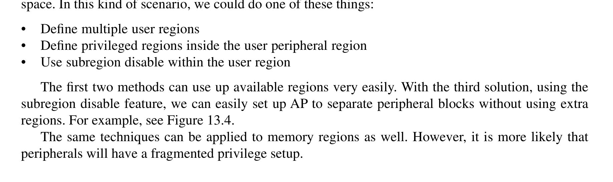
*Description*: Technical diagram and schematic illustration detailing hardware circuit topology, signal routing, and logic operations for Figure 13.4.

> **Figure 13.4**

225

## 13.4  Typical Setup


## 13.4  Typical Setup

In typical applications, the MPU is used when there is a need to prevent user programs from ­accessing
privileged process data and program regions. Usually, this is done by the embedded OS. Between each
context switching, the MPU is reprogrammed by the OS to allow user applications to access their
­application code and data and any other resources they are entitled to access. When developing the
setup routine for the MPU, you need to consider a number of regions:
Code region:
1.
Privileged code, including a starting vector table
a.
User code
b.
SRAM region:
2.
Privileged data, including the main stack
a.
User data, including the process stack
b.
Privileged bit-band alias region
c.
User bit-band alias region
d.
Peripherals:
3.
Privileged peripherals
a.
User peripherals
b.
Privileged peripheral bit-band alias region
c.
User peripheral bit-band alias region
d.
From this list, we have identified 10 regions; more than the eight regions supported by the Cortex-M3
MPU. However, we can define the privileged regions by means of a background region (PRIVDEFENA
set to 1), so there are only five user regions to set up, leaving three spare MPU regions. The unused
regions might still be used for setting up additional regions in external memory, to protect read-only
data or to completely block some part of the memory if necessary. Alternatively, some of the regions
could be merged together to reduce the number of regions required.
13.4.1  Example Use of the Subregion Disable
In some cases, we might have some peripherals accessible by user programs, and a few should be pro-
tected to be privileged accesses only, resulting in fragmentation of user-accessible peripheral memory
space. In this kind of scenario, we could do one of these things:
Define multiple user regions
•
Define privileged regions inside the user peripheral region
•
Use subregion disable within the user region
•
The first two methods can use up available regions very easily. With the third solution, using the
subregion disable feature, we can easily set up AP to separate peripheral blocks without using extra
regions. For example, see Figure 13.4.
The same techniques can be applied to memory regions as well. However, it is more likely that
peripherals will have a fragmented privilege setup.


<!-- Page 253 -->
### [PDF Page 253]


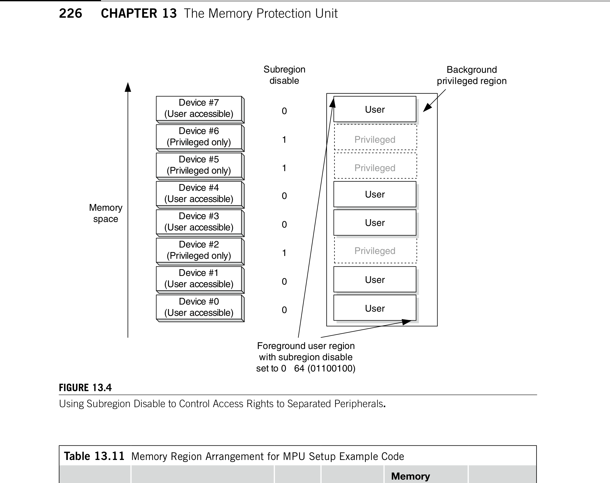
*Description*: Technical diagram and schematic illustration detailing hardware circuit topology, signal routing, and logic operations for Figure 13.4.

> **Figure 13.4**


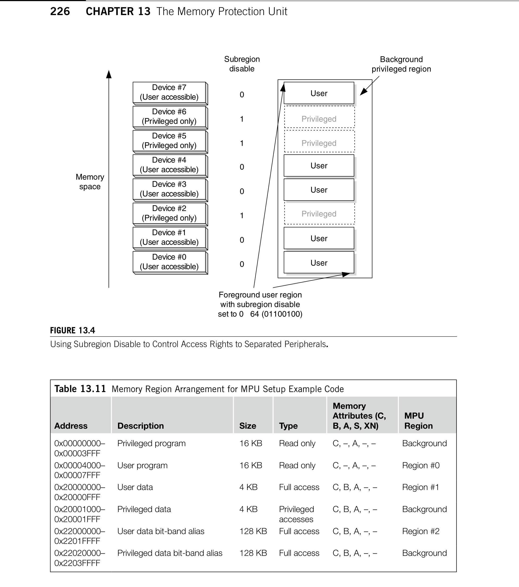
*Description*: Hardware reference table detailing register bit field settings, electrical operating limits, or memory configurations for Table 13.11.

> **Table 13.11**

226
CHAPTER 13  The Memory Protection Unit
Memory
space
Device #7
(User accessible)
Device #6
(Privileged only)
Subregion
disable
0
1
1
0
0
1
0
0
User
User
User
User
User
Background
privileged region
Foreground user region
with subregion disable
set to 0z 64 (01100100)
Privileged
Privileged
Privileged
Device #5
(Privileged only)
Device #4
(User accessible)
Device #3
(User accessible)
Device #1
(User accessible)
Device #0
(User accessible)
Device #2
(Privileged only)
Figure 13.4
Using Subregion Disable to Control Access Rights to Separated Peripherals.
Table 13.11  Memory Region Arrangement for MPU Setup Example Code
Address
Description
Size
Type
Memory
Attributes (C,
B, A, S, XN)
MPU
Region
0x00000000–
0x00003FFF
Privileged program
16 KB
Read only
C, –, A, –, –
Background
0x00004000–
0x00007FFF
User program
16 KB
Read only
C, –, A, –, –
Region #0
0x20000000–
0x20000FFF
User data
4 KB
Full access
C, B, A, –, –
Region #1
0x20001000–
0x20001FFF
Privileged data
4 KB
Privileged
accesses
C, B, A, –, –
Background
0x22000000–
0x2201FFFF
User data bit-band alias
128 KB
Full access
C, B, A, –, –
Region #2
0x22020000–
0x2203FFFF
Privileged data bit-band alias
128 KB
Full access
C, B, A, –, –
Background


<!-- Page 254 -->
### [PDF Page 254]


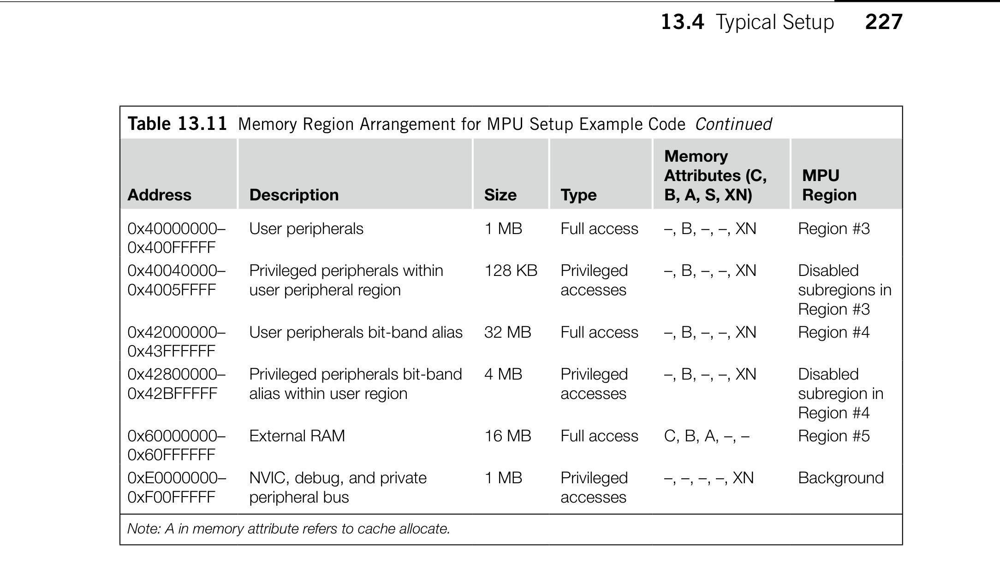
*Description*: Hardware reference table detailing register bit field settings, electrical operating limits, or memory configurations for Table 13.11.

> **Table 13.11**


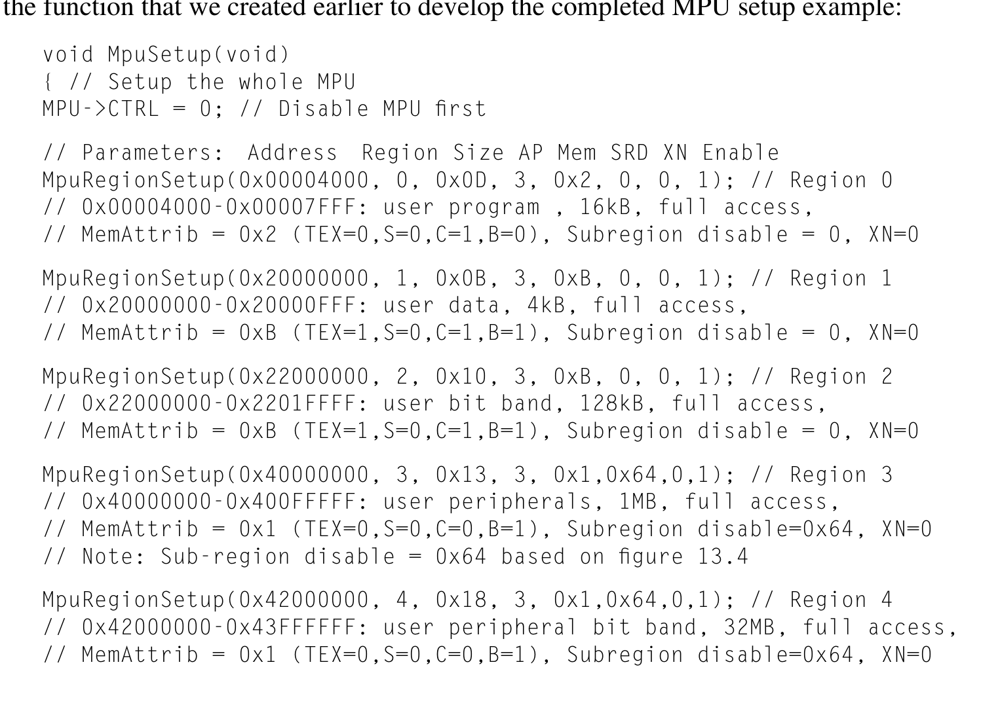
*Description*: Technical diagram and schematic illustration detailing hardware circuit topology, signal routing, and logic operations for Figure 13.4.

> **Figure 13.4**

227

## 13.4  Typical Setup

Let’s assume that the memory regions in Table 13.11 will be used. After the required regions are
defined, we can create the MPU setup code. To make the code easier to understand and modify, we used
the function that we created earlier to develop the completed MPU setup example:

```c
void MpuSetup(void)
```

{ // Setup the whole MPU
MPU->CTRL = 0; // Disable MPU first
// Parameters:  Address  Region Size AP Mem SRD XN Enable
MpuRegionSetup(0x00004000, 0, 0x0D, 3, 0x2, 0, 0, 1); // Region 0
// 0x00004000-0x00007FFF: user program , 16kB, full access,
// MemAttrib = 0x2 (TEX=0,S=0,C=1,B=0), Subregion disable = 0, XN=0
MpuRegionSetup(0x20000000, 1, 0x0B, 3, 0xB, 0, 0, 1); // Region 1
// 0x20000000-0x20000FFF: user data, 4kB, full access,
// MemAttrib = 0xB (TEX=1,S=0,C=1,B=1), Subregion disable = 0, XN=0
MpuRegionSetup(0x22000000, 2, 0x10, 3, 0xB, 0, 0, 1); // Region 2
// 0x22000000-0x2201FFFF: user bit band, 128kB, full access,
// MemAttrib = 0xB (TEX=1,S=0,C=1,B=1), Subregion disable = 0, XN=0
MpuRegionSetup(0x40000000, 3, 0x13, 3, 0x1,0x64,0,1); // Region 3
// 0x40000000-0x400FFFFF: user peripherals, 1MB, full access,
// MemAttrib = 0x1 (TEX=0,S=0,C=0,B=1), Subregion disable=0x64, XN=0
// Note: Sub-region disable = 0x64 based on figure 13.4
MpuRegionSetup(0x42000000, 4, 0x18, 3, 0x1,0x64,0,1); // Region 4
// 0x42000000-0x43FFFFFF: user peripheral bit band, 32MB, full access,
// MemAttrib = 0x1 (TEX=0,S=0,C=0,B=1), Subregion disable=0x64, XN=0
Table 13.11  Memory Region Arrangement for MPU Setup Example Code  Continued
Address
Description
Size
Type
Memory
Attributes (C,
B, A, S, XN)
MPU
Region
0x40000000–
0x400FFFFF
User peripherals
1 MB
Full access
–, B, –, –, XN
Region #3
0x40040000–
0x4005FFFF
Privileged peripherals within
user peripheral region
128 KB
Privileged
accesses
–, B, –, –, XN
Disabled
subregions in
Region #3
0x42000000–
0x43FFFFFF
User peripherals bit-band alias
32 MB
Full access
–, B, –, –, XN
Region #4
0x42800000–
0x42BFFFFF
Privileged peripherals bit-band
alias within user region
4 MB
Privileged
accesses
–, B, –, –, XN
Disabled
subregion in
Region #4
0x60000000–
0x60FFFFFF
External RAM
16 MB
Full access
C, B, A, –, –
Region #5
0xE0000000–
0xF00FFFFF
NVIC, debug, and private
peripheral bus
1 MB
Privileged
accesses
–, –, –, –, XN
Background
Note: A in memory attribute refers to cache allocate.


<!-- Page 255 -->
### [PDF Page 255]


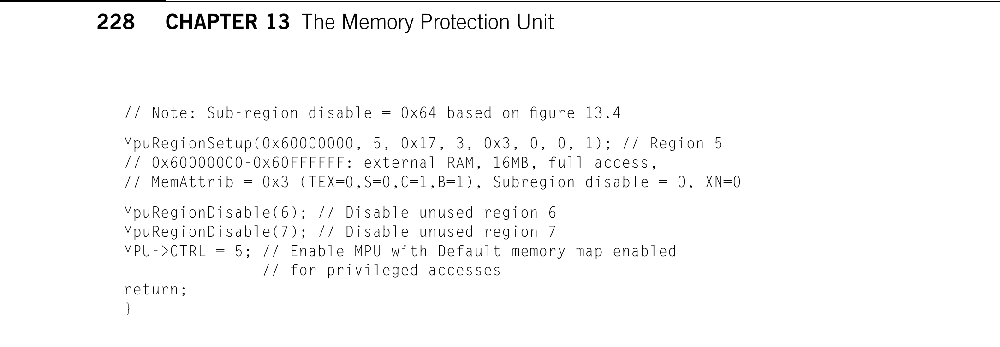
*Description*: Technical diagram and schematic illustration detailing hardware circuit topology, signal routing, and logic operations for Figure 13.4.

> **Figure 13.4**

228
CHAPTER 13  The Memory Protection Unit
// Note: Sub-region disable = 0x64 based on figure 13.4
MpuRegionSetup(0x60000000, 5, 0x17, 3, 0x3, 0, 0, 1); // Region 5
// 0x60000000-0x60FFFFFF: external RAM, 16MB, full access,
// MemAttrib = 0x3 (TEX=0,S=0,C=1,B=1), Subregion disable = 0, XN=0
MpuRegionDisable(6); // Disable unused region 6
MpuRegionDisable(7); // Disable unused region 7
MPU->CTRL = 5; // Enable MPU with Default memory map enabled
// for privileged accesses
return;
}


