# Chapter 14. Other Cortex-M3 Features

> **Source PDF**: THE_DEFINITIVE_GUIDE_TO_THE_ARM_CORTEX-МЗ_Stellaris_MCU_9000Series_TEINSTRUMENTS_ARM_SECOND_EDITION.pdf  
> **PDF Page Range**: 256 - 269


---


<!-- Page 256 -->
### [PDF Page 256]


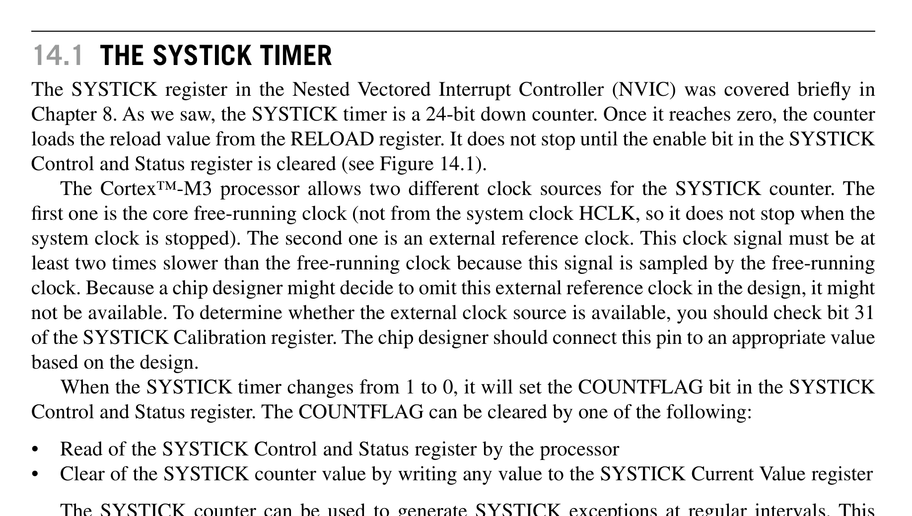
*Description*: Technical diagram and schematic illustration detailing hardware circuit topology, signal routing, and logic operations for Figure 14.1.

> **Figure 14.1**

229
Copyright © 2010, Elsevier Inc. All rights reserved.
DOI: 10.1016/B978-0-12-382091-4.00020-7
In This Chapter
The SYSTICK Timer................................................................................................................................ 229
Power Management............................................................................................................................... 232
Multiprocessor Communication.............................................................................................................. 236
Self-Reset Control................................................................................................................................. 241

## 14.1  The SYSTICK Timer

The SYSTICK register in the Nested Vectored Interrupt Controller (NVIC) was covered briefly in
Chapter 8. As we saw, the SYSTICK timer is a 24-bit down counter. Once it reaches zero, the counter
loads the reload value from the RELOAD register. It does not stop until the enable bit in the SYSTICK
Control and Status register is cleared (see Figure 14.1).
The Cortex™-M3 processor allows two different clock sources for the SYSTICK counter. The
first one is the core free-running clock (not from the system clock HCLK, so it does not stop when the
­system clock is stopped). The second one is an external reference clock. This clock signal must be at
least two times slower than the free-running clock because this signal is sampled by the free-running
clock. Because a chip designer might decide to omit this external reference clock in the design, it might
not be available. To determine whether the external clock source is available, you should check bit 31
of the SYSTICK Calibration register. The chip designer should connect this pin to an appropriate value
based on the design.
When the SYSTICK timer changes from 1 to 0, it will set the COUNTFLAG bit in the SYSTICK
Control and Status register. The COUNTFLAG can be cleared by one of the following:
Read of the SYSTICK Control and Status register by the processor
•
Clear of the SYSTICK counter value by writing any value to the SYSTICK Current Value register
•
The SYSTICK counter can be used to generate SYSTICK exceptions at regular intervals. This
is often necessary for the OS, for task and resources management. To enable SYSTICK exception
Other Cortex-M3 Features
14
CHAPTER


<!-- Page 257 -->
### [PDF Page 257]


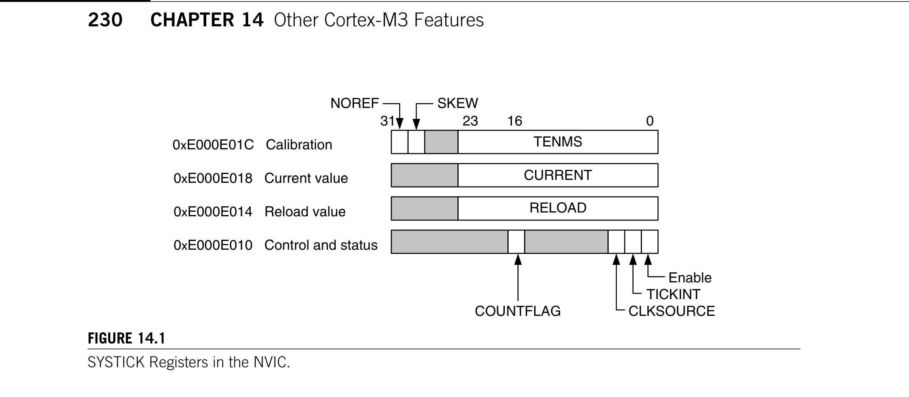
*Description*: Technical diagram and schematic illustration detailing hardware circuit topology, signal routing, and logic operations for Figure 14.1.

> **Figure 14.1**

230
CHAPTER 14  Other Cortex-M3 Features
­generation, the TICKINT bit should be set. In addition, if the vector table has been relocated to Static
Random Access Memory (SRAM), it would be necessary to set up the SYSTICK exception handler
in the vector table. For example:
*((volatile unsigned int *)(SCB->VTOR+(15<<2))) = (unsigned int) SysTick_Handler;
This can be written in assembly language as
; Setup SYSTICK exception handler (only needed if vector table
; is located in RAM)
MOV R0, #0xF
; Exception type 15
LDR R1, =SysTick_handler
; address of exception handler
LDR R2, =0xE000ED08
; Vector table offset register
LDR R2, [R2]
STR R1, [R2, R0, LSL #2]
; Write vector to
; VectTblOffset+ExcpType*4
For users of Cortex Microcontroller Software Interface Standard (CMSIS) compliant device driver,
a function call “SysTick_Config” is available for configuration of the SYSTICK Timer. Please refer to
Appendix G for information on this function. You can also access the SYSTICK registers directly via
the following register names:
•
SysTick->CTRL (Control and Status register)
•
SysTick->LOAD (Reload Value register)
•
SysTick->VAL (Current Value register)
•
SysTick->CALIB (Calibration Value register)
For example, to generate SYSTICK exception every 1024 processor clock cycle, you can use the
following C code:
SysTick->LOAD = 1023;// Count down from 1023 to 0
SysTick->VAL  = 0;     // Clear current value to 0
SysTick->CTRL = 0x7; // Enable SysTick, enable SysTick
// exception and use processor clock
Figure 14.1
SYSTICK Registers in the NVIC.
0xE000E010   Control and status
0xE000E014   Reload value
0xE000E018   Current value
0xE000E01C   Calibration
Enable
TICKINT
CLKSOURCE
COUNTFLAG
RELOAD
CURRENT
TENMS
NOREF
SKEW
16
0
23
31


<!-- Page 258 -->
### [PDF Page 258]

231

## 14.1  The SYSTICK Timer

The same operation can be written in assembly language as follows:
; Enable SYSTICK timer operation and enable SYSTICK interrupt
LDR  R0, =0xE000E010  ; SYSTICK control and status register
MOV  R1, #0
STR  R1, [R0]
; Stop counter to prevent interrupt
; triggered ­accidentally
LDR  R1, =1023
; Trigger every 1024 cycles (since counter
; decrement from 1023 to 0, total of 1024
; cycles, reload value is set to 1023)
STR  R1, [R0,#4]
; Write reload value to reload register
; address
STR  R1, [R0,#8]
; Write any value to current value
; register to clear current value to 0 and
; clear COUNTFLAG
MOV  R1, #0x7
; Clock source = core clock, Enable
; Interrupt, Enable
; SYSTICK counter
STR  R1, [R0]
; Start counter
The SYSTICK counter provides a simple way to allow timing calibration information to be
accessed. The top level of the Cortex-M3 processor has a 24-bit input to which a chip designer can
input a reload value that can be used to generate a 10-ms time interval. This value can be accessed by
the SYSTICK Calibration register. However, this option is not necessarily available, so you’ll need to
check the device’s datasheet to see if you can use this feature.
The SYSTICK counter can also be used as an alarm timer that starts a certain task after a number
of clock cycles. For example, if a task has to be started to execute after 300 clock cycles, we could set
up the task at the SYSTICK exception handler and program the SYSTICK timer so that the task will be
executed when the 300 cycle count is reached:
volatile int SysTickFired; // A global software flag to
// indicate SysTickAlarm executed
...
// Optional:Setup SYSTICK Handler, only needed if vector table
// relocated to SRAM
*((volatile unsigned int *)(SCB->VTOR+(15<<2))) = (unsigned int) SysTickAlarm;
SysTick->CTRL = 0x0;       // Disable SysTick
SysTick->LOAD = (300-12);  // Set Reload value
// Minus 12 because of exception latency
SysTick->VAL  = 0;    // Clear current value to 0
SysTickFired  = 0;    // Setup software flag to zero
SysTick->CTRL = 0x7;  // Enable SysTick, enable SysTick
// exception and use processor clock
while (SysTickFired == 0); // Wait until software flag is set by
// SYSTICK handler
The exception handler can be written as follows:

```c
void SysTickAlarm(void) // SYSTICK exception handler
```

{


<!-- Page 259 -->
### [PDF Page 259]


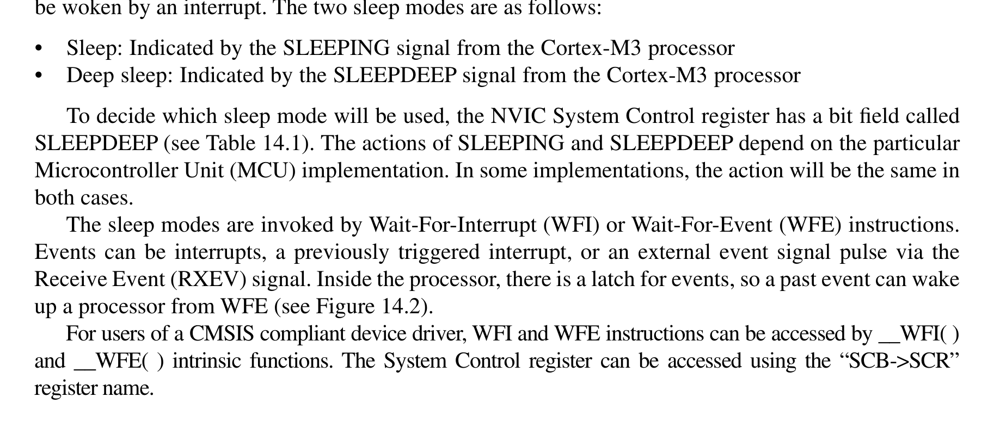
*Description*: Hardware reference table detailing register bit field settings, electrical operating limits, or memory configurations for Table 14.1.

> **Table 14.1**

232
CHAPTER 14  Other Cortex-M3 Features
SysTick->CTRL = 0x0;            // Disable SysTick
// Execute required processing task
SCB->ICSR = SCB->ICSR & (0xFDFFFFFF); // Clear SYSTICK pend bit
// in case it has been pended again
SysTickFired++;
// Update software flag so that the
// main program know that SysTick alarm
// task has been carried out
return;
}
The counter starts with an initial value of zero because it was manually cleared from the main pro-
gram. It then immediately reloads to 288 (300 – 12). We subtract 12 from the count because this is the
number of clock cycles for minimum exception latency. However, if another exception with the same
or a higher priority is running when the SYSTICK counter reaches zero, the start of the exception could
be delayed.
Note that the subtraction of 12 cycles from the reload value in this example is required for only one-
shot alarm timer usage. For periodic counting usage, the reload value should be the number of clock
cycles per period minus 1.
Because the SYSTICK counter does not stop automatically, we need to stop it within the SYSTICK
handler (SysTickAlarm). Furthermore, there’s a chance that the SYSTICK exception could have been
pended again if it was delayed by processing of other exceptions, so the pending status of a SYSTICK
exception needs to be cleared if the SYSTICK exception uses a one-off processing.
In the final step of the SYSTICK exception handler, we set a software variable called SysTickFired
so that the main program knows the required task has been carried out.

## 14.2  Power Management

14.2.1  Sleep Modes
The Cortex-M3 provides sleep modes as a power management feature. During sleep mode, the system
clock can be stopped, but the free-running clock input could still be running to allow the processor to
be woken by an interrupt. The two sleep modes are as follows:
Sleep: Indicated by the SLEEPING signal from the Cortex-M3 processor
•
Deep sleep: Indicated by the SLEEPDEEP signal from the Cortex-M3 processor
•
To decide which sleep mode will be used, the NVIC System Control register has a bit field called
SLEEPDEEP (see Table 14.1). The actions of SLEEPING and SLEEPDEEP depend on the particular
Microcontroller Unit (MCU) implementation. In some implementations, the action will be the same in
both cases.
The sleep modes are invoked by Wait-For-Interrupt (WFI) or Wait-For-Event (WFE) instructions.
Events can be interrupts, a previously triggered interrupt, or an external event signal pulse via the
Receive Event (RXEV) signal. Inside the processor, there is a latch for events, so a past event can wake
up a processor from WFE (see Figure 14.2).
For users of a CMSIS compliant device driver, WFI and WFE instructions can be accessed by __WFI( )
and __WFE( ) intrinsic functions. The System Control register can be accessed using the “SCB->SCR”
register name.


<!-- Page 260 -->
### [PDF Page 260]


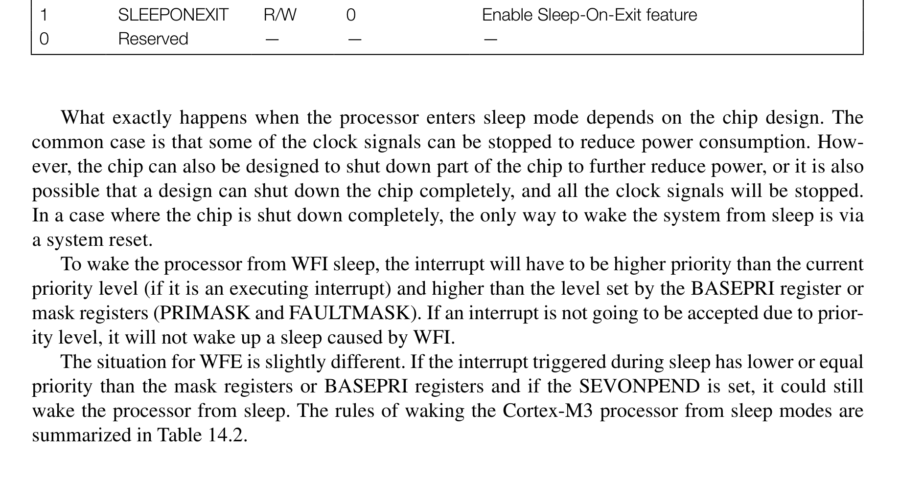
*Description*: Hardware reference table detailing register bit field settings, electrical operating limits, or memory configurations for Table 14.2.

> **Table 14.2**


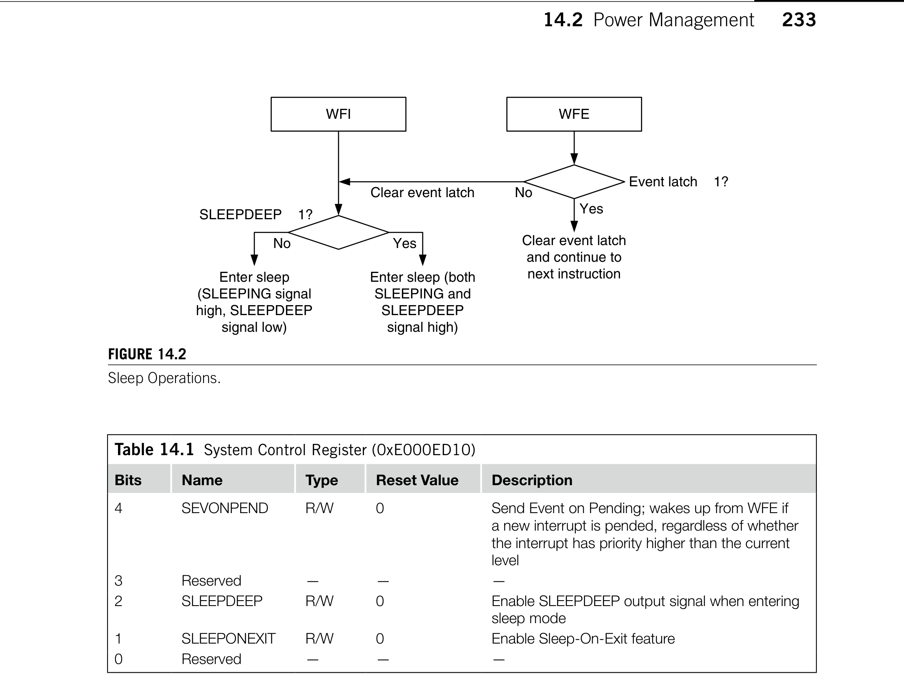
*Description*: Hardware reference table detailing register bit field settings, electrical operating limits, or memory configurations for Table 14.1.

> **Table 14.1**


*Description*: Technical diagram and schematic illustration detailing hardware circuit topology, signal routing, and logic operations for Figure 14.2.

> **Figure 14.2**

233

## 14.2  Power Management

What exactly happens when the processor enters sleep mode depends on the chip design. The
common case is that some of the clock signals can be stopped to reduce power consumption. How-
ever, the chip can also be designed to shut down part of the chip to further reduce power, or it is also
possible that a design can shut down the chip completely, and all the clock signals will be stopped.
In a case where the chip is shut down completely, the only way to wake the system from sleep is via
a system reset.
To wake the processor from WFI sleep, the interrupt will have to be higher priority than the current
priority level (if it is an executing interrupt) and higher than the level set by the BASEPRI register or
mask registers (PRIMASK and FAULTMASK). If an interrupt is not going to be accepted due to prior-
ity level, it will not wake up a sleep caused by WFI.
The situation for WFE is slightly different. If the interrupt triggered during sleep has lower or equal
priority than the mask registers or BASEPRI registers and if the SEVONPEND is set, it could still
wake the processor from sleep. The rules of waking the Cortex-M3 processor from sleep modes are
summarized in Table 14.2.
Table 14.1  System Control Register (0xE000ED10)
Bits
Name
Type
Reset Value
Description
4
SEVONPEND
R/W
0
Send Event on Pending; wakes up from WFE if
a new interrupt is pended, regardless of whether
the interrupt has priority higher than the current
level
3
Reserved
—
—
—
2
SLEEPDEEP
R/W
0
Enable SLEEPDEEP output signal when entering
sleep mode
1
SLEEPONEXIT
R/W
0
Enable Sleep-On-Exit feature
0
Reserved
—
—
—
Figure 14.2
Sleep Operations.
WFI
WFE
Event latch z 1?
Clear event latch
and continue to
next instruction
Yes
No
SLEEPDEEP z 1?
Yes
No
Enter sleep (both
SLEEPING and
SLEEPDEEP
signal high)
Enter sleep
(SLEEPING signal
high, SLEEPDEEP
signal low)
Clear event latch


<!-- Page 261 -->
### [PDF Page 261]


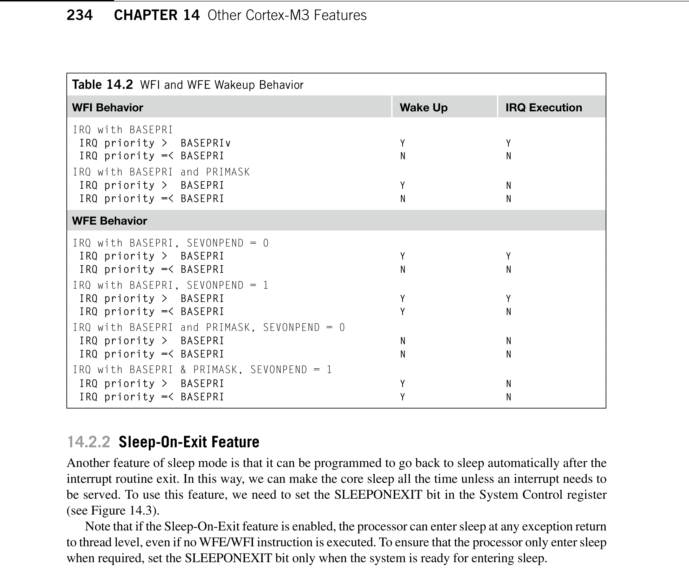
*Description*: Technical diagram and schematic illustration detailing hardware circuit topology, signal routing, and logic operations for Figure 14.3.

> **Figure 14.3**


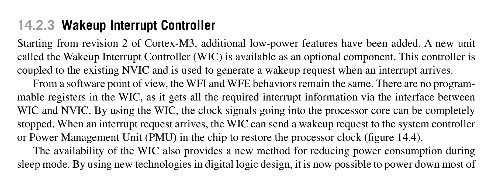
*Description*: Technical diagram and schematic illustration detailing hardware circuit topology, signal routing, and logic operations for Figure 14.4.

> **Figure 14.4**


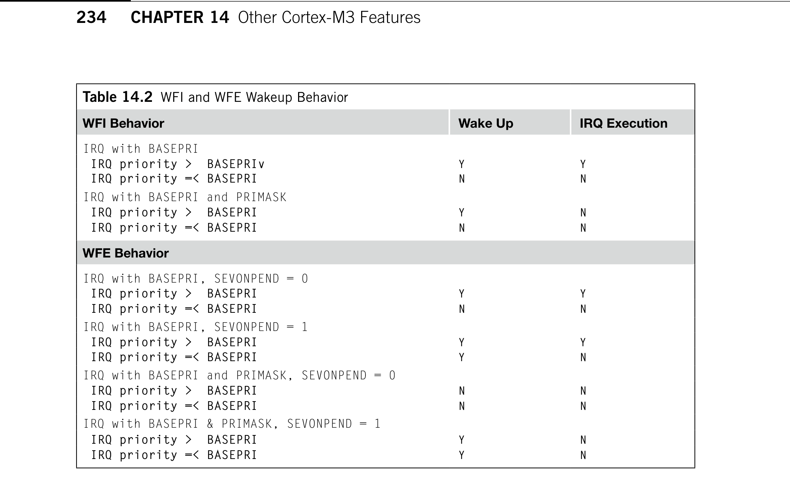
*Description*: Hardware reference table detailing register bit field settings, electrical operating limits, or memory configurations for Table 14.2.

> **Table 14.2**

234
CHAPTER 14  Other Cortex-M3 Features
14.2.2  Sleep-On-Exit Feature
Another feature of sleep mode is that it can be programmed to go back to sleep automatically after the
interrupt routine exit. In this way, we can make the core sleep all the time unless an interrupt needs to
be served. To use this feature, we need to set the SLEEPONEXIT bit in the System Control register
(see Figure 14.3).
Note that if the Sleep-On-Exit feature is enabled, the processor can enter sleep at any exception return
to thread level, even if no WFE/WFI instruction is executed. To ensure that the processor only enter sleep
when required, set the SLEEPONEXIT bit only when the system is ready for entering sleep.
14.2.3  Wakeup Interrupt Controller
Starting from revision 2 of Cortex-M3, additional low-power features have been added. A new unit
called the Wakeup Interrupt Controller (WIC) is available as an optional component. This controller is
coupled to the existing NVIC and is used to generate a wakeup request when an interrupt arrives.
From a software point of view, the WFI and WFE behaviors remain the same. There are no program-
mable registers in the WIC, as it gets all the required interrupt information via the interface between
WIC and NVIC. By using the WIC, the clock signals going into the processor core can be completely
stopped. When an interrupt request arrives, the WIC can send a wakeup request to the system controller
or Power Management Unit (PMU) in the chip to restore the processor clock (figure 14.4).
The availability of the WIC also provides a new method for reducing power consumption during
sleep mode. By using new technologies in digital logic design, it is now possible to power down most of
Table 14.2  WFI and WFE Wakeup Behavior
WFI Behavior
Wake Up
IRQ Execution
IRQ with BASEPRI
IRQ priority >  BASEPRIv
Y
Y
IRQ priority =< BASEPRI
N
N
IRQ with BASEPRI and PRIMASK
IRQ priority >  BASEPRI
Y
N
IRQ priority =< BASEPRI
N
N
WFE Behavior
IRQ with BASEPRI, SEVONPEND = 0
IRQ priority >  BASEPRI
Y
Y
IRQ priority =< BASEPRI
N
N
IRQ with BASEPRI, SEVONPEND = 1
IRQ priority >  BASEPRI
Y
Y
IRQ priority =< BASEPRI
Y
N
IRQ with BASEPRI and PRIMASK, SEVONPEND = 0
IRQ priority >  BASEPRI
N
N
IRQ priority =< BASEPRI
N
N
IRQ with BASEPRI & PRIMASK, SEVONPEND = 1
IRQ priority >  BASEPRI
Y
N
IRQ priority =< BASEPRI
Y
N


<!-- Page 262 -->
### [PDF Page 262]


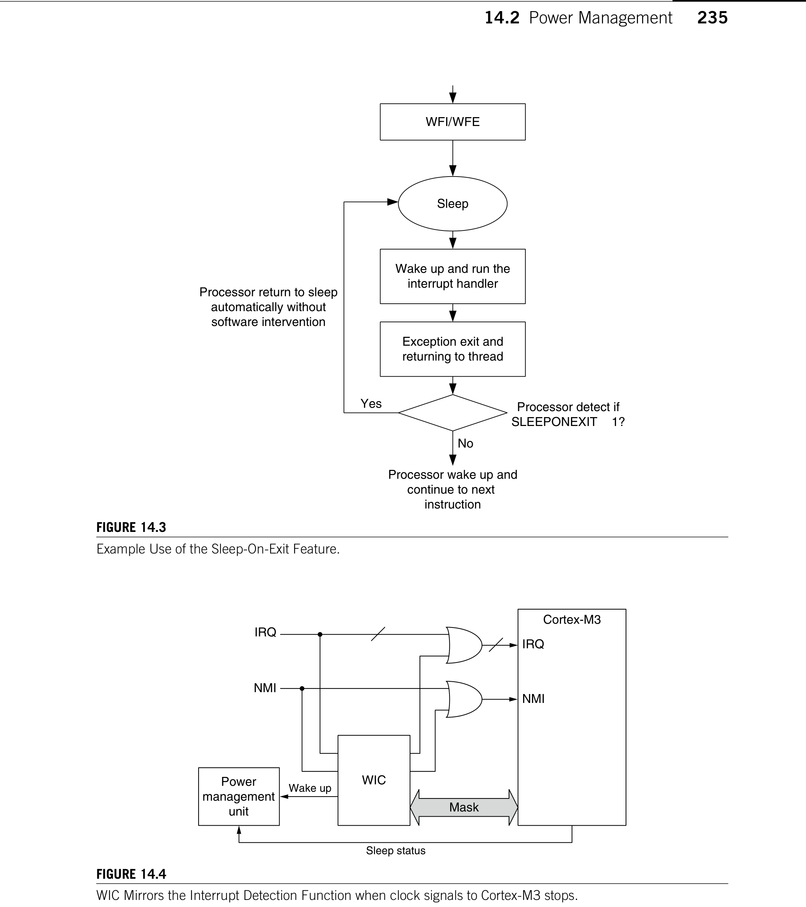
*Description*: Technical diagram and schematic illustration detailing hardware circuit topology, signal routing, and logic operations for Figure 14.3.

> **Figure 14.3**


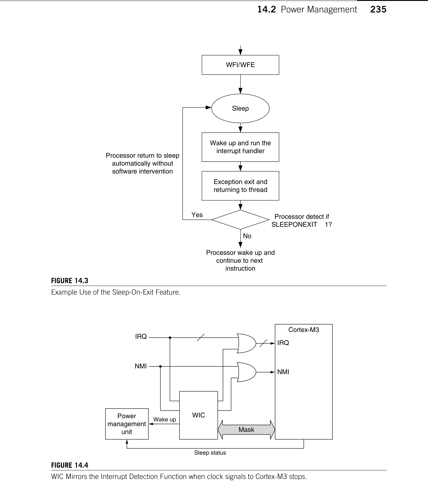
*Description*: Technical diagram and schematic illustration detailing hardware circuit topology, signal routing, and logic operations for Figure 14.4.

> **Figure 14.4**

235

## 14.2  Power Management

Figure 14.3
Example Use of the Sleep-On-Exit Feature.
WFI/WFE
Processor wake up and
continue to next
instruction
Yes
No
Sleep
Wake up and run the
interrupt handler
Processor detect if
SLEEPONEXIT z 1?
Exception exit and
returning to thread
Processor return to sleep
automatically without
software intervention
Figure 14.4
WIC Mirrors the Interrupt Detection Function when clock signals to Cortex-M3 stops.
Cortex-M3
IRQ
NMI
WIC
IRQ
NMI
Mask
Power
management
unit
Sleep status
Wake up


<!-- Page 263 -->
### [PDF Page 263]


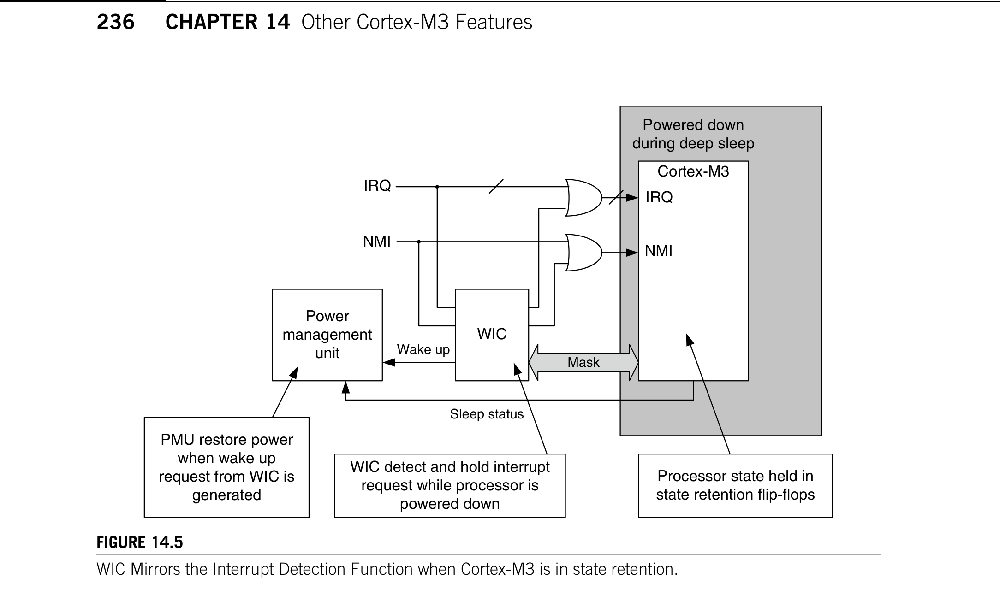
*Description*: Technical diagram and schematic illustration detailing hardware circuit topology, signal routing, and logic operations for Figure 14.5.

> **Figure 14.5**

236
CHAPTER 14  Other Cortex-M3 Features
the Cortex-M3 processor, leaving a small portion of the logic gates to retain the current state of the logic.
This technology is called State Retention Power Gating (SRPG). By using SRPG and WIC together,
most portions of the Cortex-M3 processor can be powered down during deep sleep, leaving a small
amount of logic for state retention (see Figure 14.5). During this power down state, the WIC remains
operational and generates a wakeup request to power up and restore the system state when an interrupt
arrives. As a result, the processor can resume operation and service the interrupt request in a very short
time. The maximum interrupt latency with such arrangement depends on the time required to power up
the system. In most cases, it is in the range of 20 to 30 clock cycles. Normal sleep ­(SLEEPDEEP bit in
the System Control register is zero) does not trigger the power down feature.
The new power down capability is optional and may not be included in some microcontroller prod-
ucts. It requires an on-chip PMU developed by silicon vendors to control the power up and power down
sequences and might need to be programmed before the power down feature is used. Please refer to the
silicon vendor’s documentation for further information. A couple of points to be aware of: the power
down feature stops the SYSTICK timer during deep sleep, and the power down feature is disabled
when a debugger is attached (this is required because debugger needs to access the debug registers
regularly to examine the status of the processor).

## 14.3  Multiprocessor Communication

The Cortex-M3 comes with a simple multiprocessor communication interface for event communication.
The processor has one output signal, called Transmit Event (TXEV), for sending out events, and an input
Figure 14.5
WIC Mirrors the Interrupt Detection Function when Cortex-M3 is in state retention.
Cortex-M3
IRQ
NMI
WIC
IRQ
NMI
Mask
Power
management
unit
Wake up
Sleep status
Powered down
during deep sleep
Processor state held in
state retention flip-flops
WIC detect and hold interrupt
request while processor is
powered down
PMU restore power
when wake up
request from WIC is
generated


<!-- Page 264 -->
### [PDF Page 264]


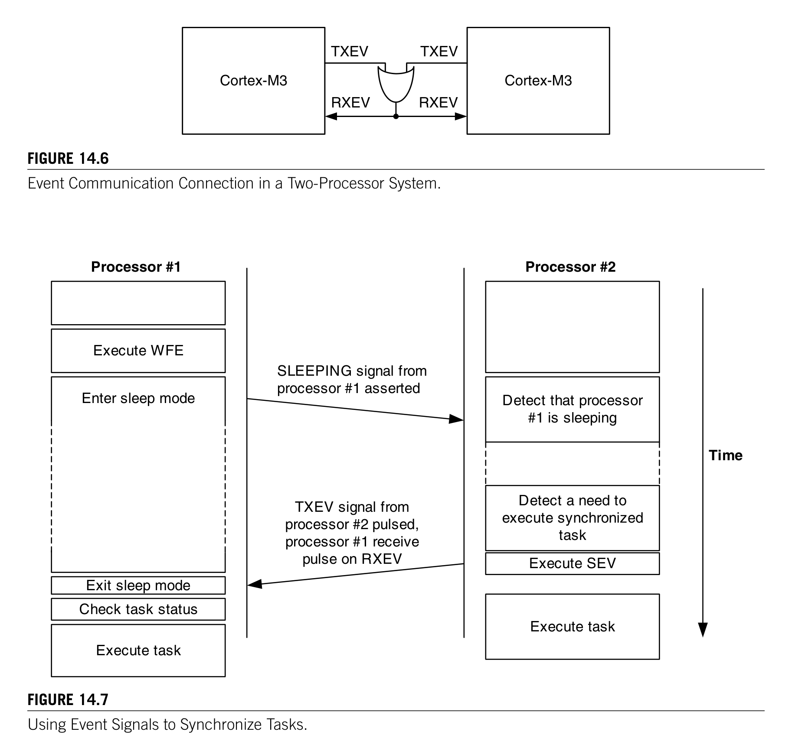
*Description*: Technical diagram and schematic illustration detailing hardware circuit topology, signal routing, and logic operations for Figure 14.6.

> **Figure 14.6**


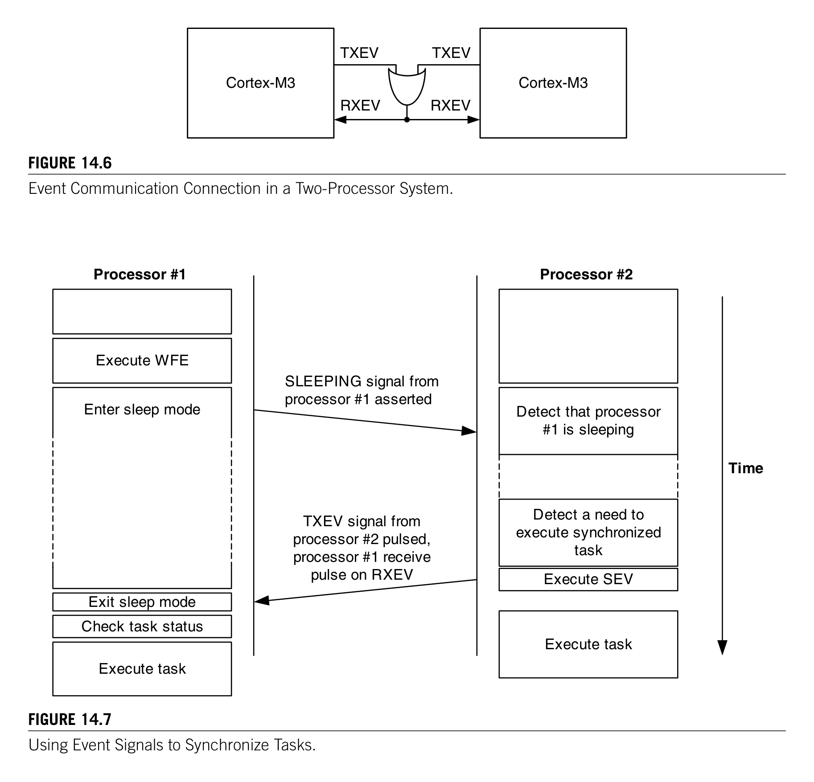
*Description*: Technical diagram and schematic illustration detailing hardware circuit topology, signal routing, and logic operations for Figure 14.7.

> **Figure 14.7**

237

## 14.3  Multiprocessor Communication

signal, called RXEV, for receiving events. For a system with two processors, the event communication
signal connection can be implemented as shown in Figure 14.6.
As mentioned in the previous section “Power Management,” the processor can enter sleep when the
WFE instruction is executed and can continue the instruction execution when an external event is received.
If we use an instruction called Send Event (SEV), one processor can wake up another processor that is in
sleep mode and make sure both processors start executing a task at the same time (see Figure 14.7).
For users of a CMSIS compliant device driver, SEV instruction can be accessed by the __SEV( )
intrinsic functions. Using this feature, we can make both processors start executing a task at the same
time (possibly with small timing differences, depending on actual chip implementation and the software
Figure 14.6
Event Communication Connection in a Two-Processor System.
Cortex-M3
Cortex-M3
TXEV
TXEV
RXEV
RXEV
Figure 14.7
Using Event Signals to Synchronize Tasks.
Processor #1
Processor #2
Execute WFE
Exit sleep mode
Check task status
Execute SEV
Execute task
Execute task
Detect a need to
execute synchronized
task
Detect that processor
#1 is sleeping
Enter sleep mode
TXEV signal from
processor #2 pulsed,
processor #1 receive
pulse on RXEV
SLEEPING signal from
processor #1 asserted
Time


<!-- Page 265 -->
### [PDF Page 265]


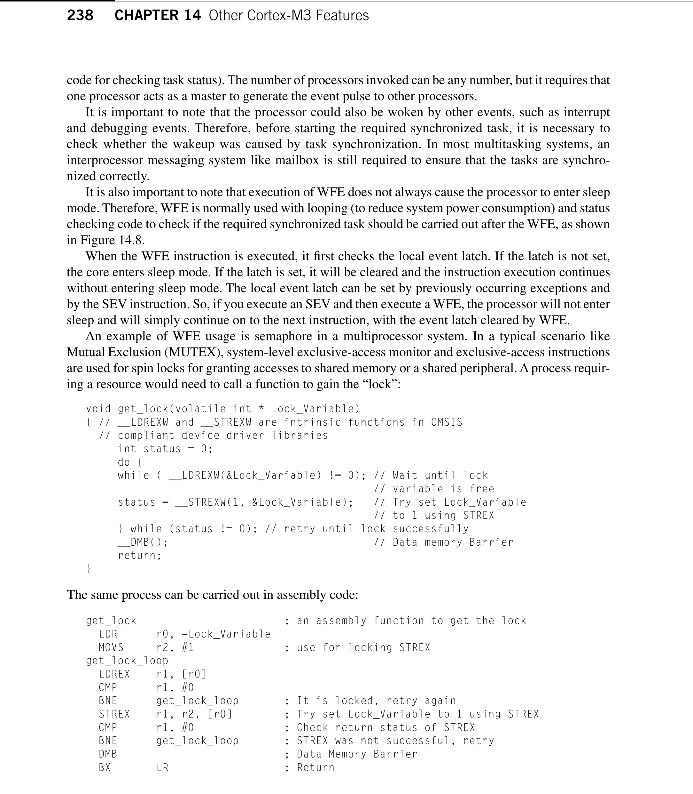
*Description*: Technical diagram and schematic illustration detailing hardware circuit topology, signal routing, and logic operations for Figure 14.8.

> **Figure 14.8**

238
CHAPTER 14  Other Cortex-M3 Features
code for checking task status). The number of processors invoked can be any number, but it requires that
one processor acts as a master to generate the event pulse to other processors.
It is important to note that the processor could also be woken by other events, such as interrupt
and debugging events. Therefore, before starting the required synchronized task, it is necessary to
check whether the wakeup was caused by task synchronization. In most multitasking systems, an
interprocessor messaging system like mailbox is still required to ensure that the tasks are synchro-
nized correctly.
It is also important to note that execution of WFE does not always cause the processor to enter sleep
mode. Therefore, WFE is normally used with looping (to reduce system power consumption) and status
checking code to check if the required synchronized task should be carried out after the WFE, as shown
in Figure 14.8.
When the WFE instruction is executed, it first checks the local event latch. If the latch is not set,
the core enters sleep mode. If the latch is set, it will be cleared and the instruction execution continues
without entering sleep mode. The local event latch can be set by previously occurring exceptions and
by the SEV instruction. So, if you execute an SEV and then execute a WFE, the processor will not enter
sleep and will simply continue on to the next instruction, with the event latch cleared by WFE.
An example of WFE usage is semaphore in a multiprocessor system. In a typical scenario like
Mutual Exclusion (MUTEX), system-level exclusive-access monitor and exclusive-access instructions
are used for spin locks for granting accesses to shared memory or a shared peripheral. A process requir-
ing a resource would need to call a function to gain the “lock”:

```c
void get_lock(volatile int * Lock_Variable)
```

{ // __LDREXW and __STREXW are intrinsic functions in CMSIS
// compliant device driver libraries

```c
int status = 0;
```

do {
while ( __LDREXW(&Lock_Variable) != 0); // Wait until lock
// variable is free
status = __STREXW(1, &Lock_Variable);   // Try set Lock_Variable
// to 1 using STREX
} while (status != 0); // retry until lock successfully
__DMB();                                // Data memory Barrier
return;
}
The same process can be carried out in assembly code:
get_lock                       ; an assembly function to get the lock
LDR      r0, =Lock_Variable
MOVS     r2, #1              ; use for locking STREX
get_lock_loop
LDREX    r1, [r0]
CMP      r1, #0
BNE      get_lock_loop       ; It is locked, retry again
STREX    r1, r2, [r0]        ; Try set Lock_Variable to 1 using STREX
CMP      r1, #0              ; Check return status of STREX
BNE      get_lock_loop       ; STREX was not successful, retry
DMB                          ; Data Memory Barrier
BX       LR                  ; Return


<!-- Page 266 -->
### [PDF Page 266]


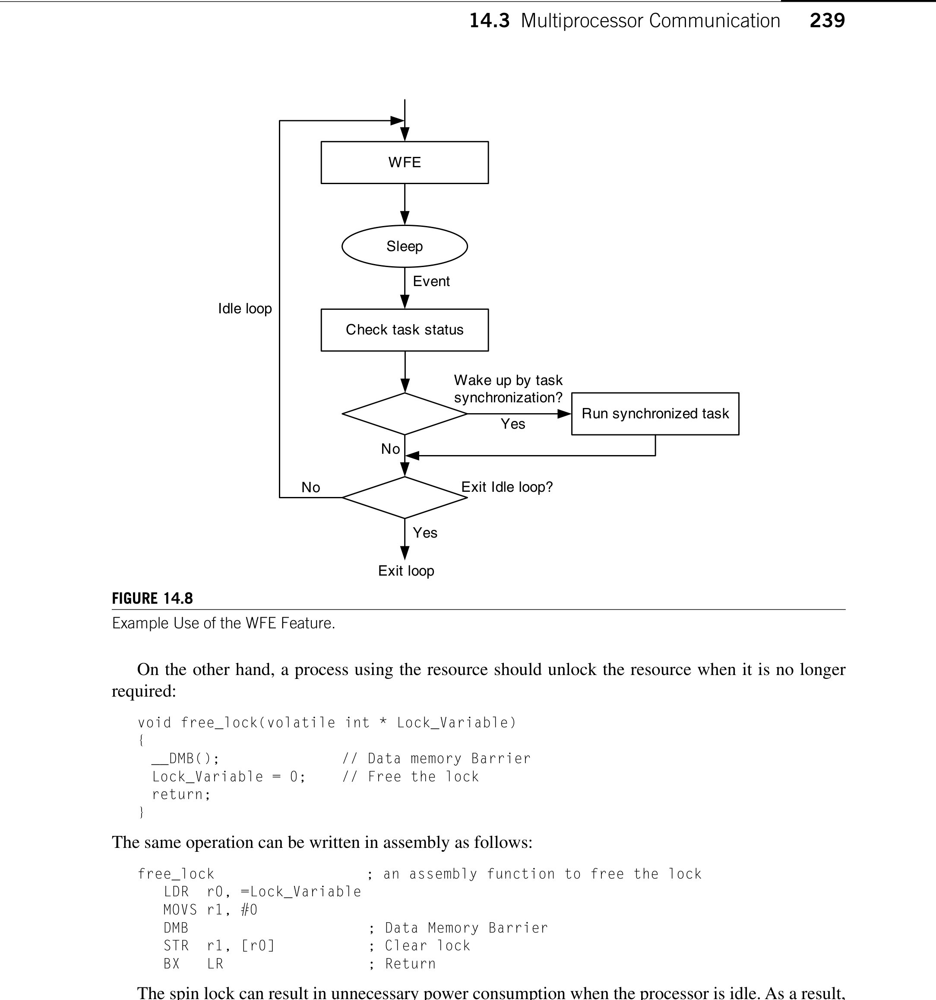
*Description*: Technical diagram and schematic illustration detailing hardware circuit topology, signal routing, and logic operations for Figure 14.8.

> **Figure 14.8**

239

## 14.3  Multiprocessor Communication

On the other hand, a process using the resource should unlock the resource when it is no longer
required:

```c
void free_lock(volatile int * Lock_Variable)
```

{
__DMB();              // Data memory Barrier
Lock_Variable = 0;    // Free the lock
return;
}
The same operation can be written in assembly as follows:
free_lock
; an assembly function to free the lock
LDR  r0, =Lock_Variable
MOVS r1, #0
DMB
; Data Memory Barrier
STR  r1, [r0]
; Clear lock
BX   LR
; Return
The spin lock can result in unnecessary power consumption when the processor is idle. As a result,
we add WFE into these operations to reduce power consumption, while allowing the processor waiting
for the lock to be woken up as soon as the resource is free.
Figure 14.8
Example Use of the WFE Feature.
WFE
Exit loop
Sleep
Run synchronized task
Exit Idle loop?
Event
Yes
No
Wake up by task
synchronization?
Idle loop
Check task status
No
Yes


<!-- Page 267 -->
### [PDF Page 267]

240
CHAPTER 14  Other Cortex-M3 Features

```c
void get_lock_with_WFE(volatile int * Lock_Variable)
```

{

```c
int status = 0;
```

do {
while ( __LDREXW(&Lock_Variable) != 0){ // Wait until lock
__WFE();} // variable is free, if not, enter sleep until event
status = __STREXW(1, &Lock_Variable);    // Try set Lock_Variable
// to 1 using STREX
} while (status != 0); // retry until lock successfully
__DMB();                                 // Data memory Barrier
return;
}
For the function to free the lock, the SEV instruction is used to wake up other processors that are
waiting for the lock.

```c
void free_lock(volatile int * Lock_Variable)
```

{
__DMB(); // Data memory Barrier
Lock_Variable = 0; // Free the lock
__DSB(); // ensure the store is complete
__SEV(); // Send Event to wake up other processors
return;
}
The same operation can be written in assembly as follows:
get_lock_with_WFE
; an assembly function to get the lock
LDR  r0, =Lock_Variable
MOVS r2, #1
; use for locking STREX
get_lock_loop
LDREX  r1,[r0]
CBNZ   r1, lock_is_set; If lock is set, sleep and retry later
STREX  r1, r2, [r0]   ; Try set Lock_Variable to 1 using STREX
CMP    r1, #0         ; Check return status of STREX
BNE get_lock_loop     ; STREX was not successful, retry
DMB                   ; Data Memory Barrier
BX  LR                ; Return
lock_is_set
WFE                   ; Wait for event
B   get_lock_loop     ; woken up, retry again
And for the function that frees the lock, it can be written in assembly as follows:
free_lock_with_SEV
; an assembly function to free the lock
LDR  r0, =Lock_Variable
MOVS r1, #0
DMB
; Data Memory Barrier
STR  r1, [r0]
; Clear lock
DSB
; ensure the store is complete
SEV
; Send Event to wake up other processors
BX   LR
; Return
By combining event communication interface and necessary semaphore code, the power consump-
tion during spin lock can be reduced. Similar techniques can be created for message passing and tasks
synchronizations.


<!-- Page 268 -->
### [PDF Page 268]

241

## 14.4  Self-Reset Control

In most Cortex-M3-based products, there will be only one processor, and the RXEV input is likely
tied to 0 or connected to peripherals that generate events.

## 14.4  Self-Reset Control

The Cortex-M3 provides two self-reset control features. The first reset feature is the SYSRESETREQ
(System Reset Request) bit in the same NVIC register. It allows the Cortex-M3 processor to assert a
reset request signal to the system’s reset generator. Because the system reset generator is not part of
Cortex-M3 design, the implementation of this reset feature depends on the chip design. Therefore, it
is necessary to carefully check the chip’s specification to determine which part of the chip is reset by
this reset control bit.
For users of a CMSIS compliant device driver, the NVIC_SystemReset() function can be used to trig-
ger the system reset using SYSRESETREQ. (A summary of this function can be found in Appendix G.)
Users not using CMSIS can use:
*((volatile unsigned int *)(0xE000ED0C))= 0x05FA0004;
// Set SYSRESETREQ bit (05FA is a write access key)
while(1); // a deadloop is used to ensure no other
// instructions follow the reset is executed
Assembly language users can generate the system reset request using the following example code:
LDR  R0,=0xE000ED0C
; NVIC AIRCR address
LDR  R1,=0x05FA0004
; Set SYSRESETREQ bit (05FA is a write
; access key)
STR  R1,[R0]
deadloop
B deadloop
; a deadloop is used to ensure no other
; instructions follow the reset is executed
The second reset feature is the VECTRESET control bit in the NVIC Application Interrupt and
Reset Control register (bit [0]). Writing 1 to this bit will reset the Cortex-M3 processor, excluding the
debug logic. This does not reset any circuit outside the Cortex-M3 processor. For example, if the system-
on‑chip (SoC) contains a universal asynchronous receiver/transmitter (UART), writing to this bit does
not reset the UART or any peripherals outside the Cortex-M3. This feature is mainly targeted for debug,
or in some case, where the software needs to reset the processor only but not the rest of the system.
*((volatile unsigned int *)(0xE000ED0C))= 0x05FA0001;
// Set VECTRESET bit (05FA is a write access key)
while(1); // a deadloop is used to ensure no other
// instructions follow the reset is executed
The same operation can be carried out in the following assembly code:
LDR  R0,=0xE000ED0C
; NVIC AIRCR address
LDR  R1,=0x05FA0001
; Set VECTRESET bit (05FA is a write
; access key)
STR  R1,[R0]
deadloop
B deadloop
; a deadloop is used to ensure no other
; instructions following the reset is
; executed


<!-- Page 269 -->
### [PDF Page 269]

242
CHAPTER 14  Other Cortex-M3 Features
In general, software reset should be generated using SYSRESETREQ instead of VECTRESET.
This ensures most parts of the system will be reset at the same time. Depending on the chip design, it
might or might not reset all peripherals, the chip and the clocking control logic including Phase-Locked
Loop (PLL). Please refer to the manufacturer datasheet for details.
Note that the delay from assertion of SYSRESETREQ to actual reset from the reset generator can
be an issue in some cases. If there is a delay in the reset generator, you might find the processor still
accepting interrupts after the reset request is set. If you want to stop the core from accepting interrupts
before running this code, you can set the Interrupt Mask register (e.g., PRIMASK or FAULTMASK)
before requesting the reset.


