# Chapter 15. Debug Architecture

> **Source PDF**: THE_DEFINITIVE_GUIDE_TO_THE_ARM_CORTEX-МЗ_Stellaris_MCU_9000Series_TEINSTRUMENTS_ARM_SECOND_EDITION.pdf  
> **PDF Page Range**: 270 - 281

---

<!-- Page 270 -->
### [PDF Page 270]

243
Copyright © 2010, Elsevier Inc. All rights reserved.
DOI: 10.1016/B978-0-12-382091-4.00021-9
In This Chapter
Debugging Features Overview................................................................................................................ 243
CoreSight Overview............................................................................................................................... 244
Debug Modes........................................................................................................................................ 248
Debugging Events.................................................................................................................................. 250
Breakpoint in the Cortex-M3.................................................................................................................. 251
Accessing Register Content in Debug..................................................................................................... 253
Other Core Debugging Features.............................................................................................................. 254
Debug Architecture
15
CHAPTER

## 15.1  Debugging Features Overview

The Cortex™-M3 processor provides a comprehensive debugging environment. Based on the nature of
operations, the debugging features can be classified into two groups.
Invasive debugging:
1.
Program halt and stepping
•
Hardware breakpoints
•
Breakpoint instruction
•
Data watchpoint on access to data address, address range, or data value
•
Register value accesses (both read or write)
•
Debug monitor exception
•
•
ROM-based debugging (Flash Patch)
Noninvasive debugging:
2.
Memory accesses (memory contents can be accessed even when the core is running)
•
Instruction trace (through the optional Embedded Trace Module)
•
Data trace
•
Software trace (through the Instrumentation Trace Module)
•
Profiling (through the Data Watchpoint and Trace [DWT] Module)
•

<!-- Page 271 -->
### [PDF Page 271]

244
CHAPTER 15  Debug Architecture
A number of debugging components are included in the Cortex-M3 processor. The debugging sys-
tem is based on the CoreSight debug architecture, allowing a standardized solution to access debugging
controls, gather trace information, and detect debugging system configuration.

## 15.2  CoreSight Overview

The CoreSight debug architecture covers a wide area, including the debugging interface protocol, debug-
ging bus protocol, control of debugging components, security features, trace data interface, and more.
The CoreSight Technology System Design Guide [Ref. 3] is a useful document for getting an overview
of the architecture. In addition, a number of sections in the Cortex-M3 Technical Reference Manual
[Ref. 1] are descriptions of the debugging components in Cortex-M3 design. These components are
normally used only by debugger software, not by application code. However, it is still useful to briefly
review these items so that we can have a better understanding of how the debugging system works.
15.2.1  Processor Debugging Interface
Unlike traditional ARM7 or ARM9, the debugging system of the Cortex-M3 processor is based on
the CoreSight debug architecture. Traditionally, ARM processors provide a Joint Test Action Group
(JTAG) interface, allowing registers to be accessed and memory interface to be controlled. In the
Cortex-M3, the control to the debug logic on the processor is carried out through a bus interface called
the Debug Access Port (DAP), which is similar to Advanced Peripheral Bus (APB) in Advanced Micro-
controller Bus Architecture (AMBA). The DAP is controlled by another component that converts JTAG
or Serial-Wire (SW) communication protocols into the DAP bus interface protocol.
Because the internal debug bus is similar to APB, a generic bus protocol, it is easy to connect multiple
debugging components, resulting in a very scalable debugging system. In addition, by separating the
debug interface and debug control hardware, the actual interface type used on the chip can become trans-
parent; hence, the same debugging tasks can be carried out no matter what debugging interface you use.
The actual debugging functions in the Cortex-M3 processor core are controlled by the Nested Vec-
tored Interrupt Controller (NVIC) and a number of other debugging components, such as the Flash
Patch and Breakpoint (FPB), DWT, and Instrumentation Trace Macrocell (ITM). The NVIC contains a
number of registers to control the core debugging actions, such as halt and stepping, whereas the other
blocks support features such as watchpoints, breakpoints, and debug message outputs.
15.2.2  The Debug Host Interface
CoreSight technology supports a number of interface types for connection between the debug host
and the system-on-chip (SoC). Traditionally, this has always been JTAG. Now, because the processor
debugging interface has been changed to a generic bus interface, by putting a different interface module
between the debug host and the debug interface of the processor, we can come up with different chips
that have different debug host interfaces, without redesigning the debug interface on the processor.
Currently, Cortex-M3 systems support two types of debug host interface. The first one is the well-
known JTAG interface, and the second one is a new interface protocol called Serial-Wire. The SW
interface reduces the number of signals to two. Several types of debug host interface modules (called
Debug Port, or DP) are available from ARM and they provide the support for the different interface

<!-- Page 272 -->
### [PDF Page 272]

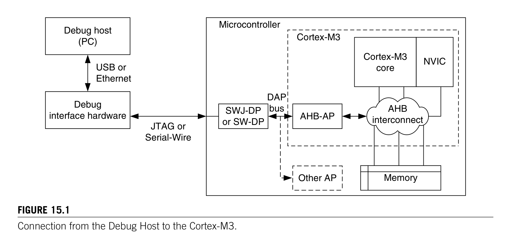
*Description*: Technical diagram and schematic illustration detailing hardware circuit topology, signal routing, and logic operations for Figure 15.1.

> **Figure 15.1**

245

## 15.2  CoreSight Overview

protocols. The debugger hardware is connected to one side of a DP, and the other side is connected to
the DAP, a generic bus interface on the processor.
15.2.3  DP Module, AP Module, and DAP
The connection from external debugging hardware to the debug interface in the Cortex-M3 processor
is divided into multiple stages (see Figure 15.1).
The DP interface module (normally either Serial-Wire JTAG Debug Port [SWJ-DP] or Serial-Wire
Debug Port [SW-DP]) first converts the external signals into a generic 32-bit debug bus (a DAP bus in the
diagram). SWJ-DP supports both JTAG and SW, and SW-DP supports SW only. In the ARM CoreSight
product series, there is also a JTAG Debug Port, which only supports the JTAG protocol; chip manu-
facturers can choose to use one of these DP modules to suit their needs. The address of the DAP bus is
32-bit, with the upper 8 bits of the address bus used to select which device is being accessed. Up to 256
devices can be attached to the DAP bus. Inside the Cortex-M3 processor, only one of the device addresses
is used, so you can attach 255 more access port (AP) devices to the DAP bus if needed. So, theoretically,
you can have hundreds of processors in one chip sharing one JTAG or SW debug ­connection.
After passing through the DAP interface in the Cortex-M3 processor, an AP device called Advanced
High-Performance Bus Access Port (AHB-AP) is connected. This acts as a bus bridge to convert ­commands
into AHB transfers, which are inserted into the internal bus network inside the Cortex-M3. This allows the
memory map of the Cortex-M3, including the debug control registers in the NVIC, to be accessed.
Why Serial-Wire?
The Cortex-M3 is targeted at the low-cost microcontroller market in which some devices have very low pin
counts. For example, some of the low-end versions are in 28-pin packages. Despite the fact that JTAG is a very
popular protocol, using four pins to debug is a lot for a 28-pin device. Therefore, SW is an attractive solution
because it can reduce the number of debug pins to two.
Figure 15.1
Connection from the Debug Host to the Cortex-M3.
Debug host
(PC)
Debug
interface hardware
USB or
Ethernet
JTAG or
Serial-Wire
Microcontroller
SWJ-DP
or SW-DP
AHB-AP
Other AP
Cortex-M3
core
NVIC
Memory
AHB
interconnect
Cortex-M3
DAP
bus

<!-- Page 273 -->
### [PDF Page 273]

246
CHAPTER 15  Debug Architecture
In the CoreSight product series, several types of Access Port (AP) devices are available, including
an Advanced Peripheral Bus Access Port (APB-AP) and a JTAG Access Port (JTAG-AP). The APB-AP
can be used to generate APB transfers, and the JTAG-AP can be used to control traditional JTAG-based
test interfaces such as the debug interface on ARM7.
15.2.4  Trace Interface
Another part of the CoreSight architecture concerns tracing. In the Cortex-M3, there can be three types
of trace sources:
Instruction trace: Generated by the Embedded Trace Macrocell (ETM)
•
Data trace: Generated by the DWT unit
•
Debug message: Generated by ITM, provides message output such as
•
printf in the debugger
graphical user interface
During tracing, the trace results, in the form of data packets, are output from the trace sources
like ETM, using a trace data bus interface called Advanced Trace Bus (ATB). Based on the CoreSight
architecture, if an SoC contains multiple trace sources (e.g., multiprocessors), the ATB data stream can
be merged using ATB merger hardware (in the CoreSight architecture this hardware is called ATB fun-
nel). The final data stream on the chip can then be connected to a Trace Port Interface Unit (TPIU) and
exported to external trace hardware. Once the data reach the debug host (for example, a PC), the data
stream can then be converted back into multiple data streams.
Despite the Cortex-M3 having multiple trace sources, its debugging components are designed to
handle trace merging so that there is no need to add ATB funnel modules. The trace output interface can
be connected directly to a special version of the TPIU designed for the Cortex-M3. The trace data are
then captured by external hardware and collected by the debug host (e.g., a PC) for analysis.
15.2.5  CoreSight Characteristics
The CoreSight-based design has a number of advantages:
The memory content and peripheral registers can be examined even when the processor is running.
•
Multiple processor debug interfaces can be controlled with a single piece of debugger hardware.
•
For example, if JTAG is used, only one Test Access Port (TAP) controller is required, even when
there are multiple processors on the chip.
Internal debugging interfaces are based on simple bus design, making it scalable and easy to
•
develop additional test logic for other parts of the chip or SoC.
It allows multiple trace data streams to be collected in one trace capture device and separated back
•
into multiple streams on the debug host.
The debugging system used in the Cortex-M3 processor is slightly different from the standard Core-
Sight implementation.
Trace components are specially designed in the Cortex-M3. Some of the ATB interface is 8 bits
•
wide in the Cortex-M3, whereas in CoreSight the width is 32 bits.
The debug implementation in the Cortex-M3 does not support TrustZone.
•
1
1TrustZone is an ARM technology that provides security features to embedded products.

<!-- Page 274 -->
### [PDF Page 274]

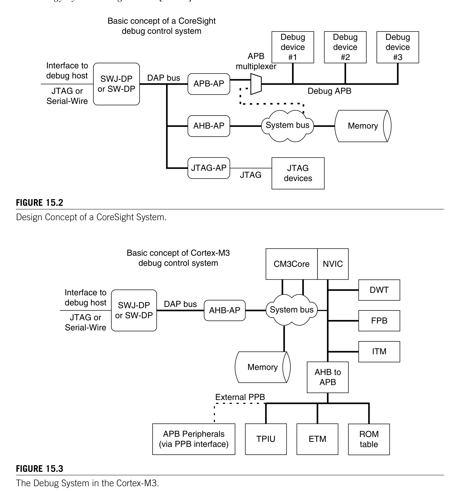
*Description*: Technical diagram and schematic illustration detailing hardware circuit topology, signal routing, and logic operations for Figure 15.2.

> **Figure 15.2**

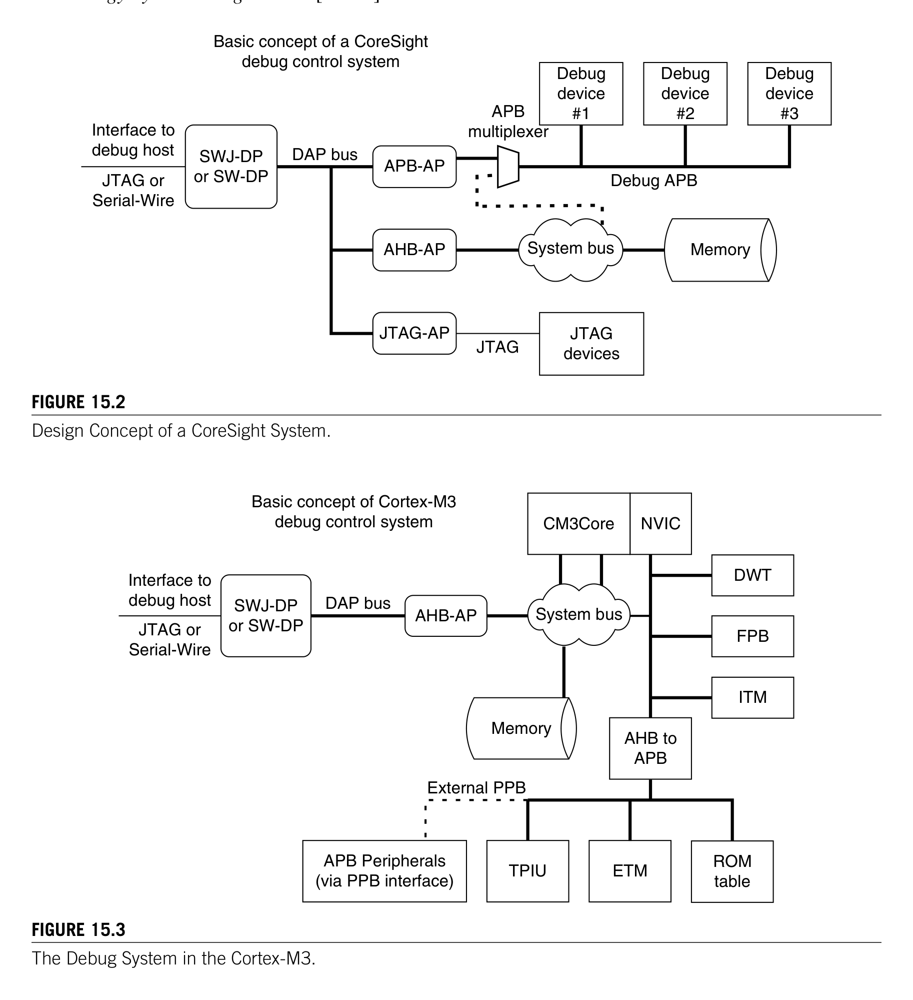
*Description*: Technical diagram and schematic illustration detailing hardware circuit topology, signal routing, and logic operations for Figure 15.3.

> **Figure 15.3**

247

## 15.2  CoreSight Overview

The debug components are part of the system memory map, whereas in standard CoreSight systems,
•
a separate bus (with a separate memory map) is used for controlling debug components. For example,
the conceptual system connection in a CoreSight system can be like the one shown in Figure 15.2.
In the Cortex-M3, the debugging devices share the same system memory map (see Figure 15.3).
Additional information about the CoreSight debug architecture can be found in the CoreSight
­Technology System Design Guide [Ref. 3].
Figure 15.2
Design Concept of a CoreSight System.
JTAG or
Serial-Wire
Interface to
debug host
Basic concept of a CoreSight
debug control system
System bus
Memory
JTAG
devices
Debug APB
DAP bus
JTAG
APB
multiplexer
Debug
device
#1
Debug
device
#2
Debug
device
#3
AHB-AP
JTAG-AP
SWJ-DP
or SW-DP
APB-AP
Figure 15.3
The Debug System in the Cortex-M3.
SWJ-DP
or SW-DP
AHB-AP
NVIC
DWT
FPB
JTAG or
Serial-Wire
Interface to
debug host
Basic concept of Cortex-M3
debug control system
Memory
External PPB
DAP bus
ITM
AHB to
APB
TPIU
ETM
ROM
table
CM3Core
System bus
APB Peripherals
(via PPB interface)

<!-- Page 275 -->
### [PDF Page 275]

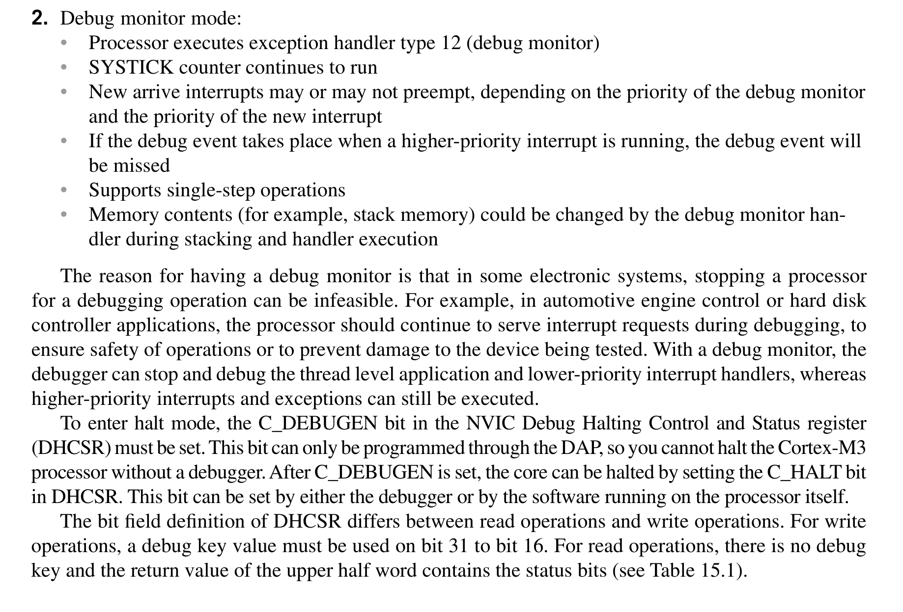
*Description*: Hardware reference table detailing register bit field settings, electrical operating limits, or memory configurations for Table 15.1.

> **Table 15.1**

248
CHAPTER 15  Debug Architecture
Although the debug components in Cortex-M3 are build differently from normal CoreSight systems,
the communication interface and protocols in the Cortex-M3 are compliant to CoreSight architecture
and can be directly attached to other CoreSight systems. For example, CoreSight debug components
like CoreSight TPIU, DPs, and trace infrastructure blocks can be used with Cortex-M3 and allow it to
be extended to a multicore debug system.

## 15.3  Debug Modes

There are two types of debug operation modes in the Cortex-M3. The first one is halt, whereby the pro-
cessor stops program execution completely. The second one is the debug monitor exception, whereby
the processor executes an exception handler to carry out the debugging tasks while still allowing higher-
priority exceptions to take place. Debug monitor is exception type 12 and its priority is programmable. It
can be invoked by means of debug events, as well as by manually setting the pending bit. In summary:
Halt mode:
1.
Instruction execution is stopped
•
The System Tick Timer (SYSTICK) counter is stopped
•
Supports single-step operations
•
Interrupts can be pended and can be invoked during single stepping or be masked so that
•
­external interrupts are ignored during stepping
Debug monitor mode:
2.
Processor executes exception handler type 12 (debug monitor)
•
SYSTICK counter continues to run
•
New arrive interrupts may or may not preempt, depending on the priority of the debug monitor
•
and the priority of the new interrupt
If the debug event takes place when a higher-priority interrupt is running, the debug event will
•
be missed
Supports single-step operations
•
Memory contents (for example, stack memory) could be changed by the debug monitor han-
•
dler during stacking and handler execution
The reason for having a debug monitor is that in some electronic systems, stopping a processor
for a debugging operation can be infeasible. For example, in automotive engine control or hard disk
controller applications, the processor should continue to serve interrupt requests during debugging, to
ensure safety of operations or to prevent damage to the device being tested. With a debug monitor, the
debugger can stop and debug the thread level application and lower-priority interrupt handlers, whereas
higher-priority interrupts and exceptions can still be executed.
To enter halt mode, the C_DEBUGEN bit in the NVIC Debug Halting Control and Status register
(DHCSR) must be set. This bit can only be programmed through the DAP, so you cannot halt the Cortex-M3
processor without a debugger. After C_DEBUGEN is set, the core can be halted by setting the C_HALT bit
in DHCSR. This bit can be set by either the debugger or by the software running on the processor itself.
The bit field definition of DHCSR differs between read operations and write operations. For write
operations, a debug key value must be used on bit 31 to bit 16. For read operations, there is no debug
key and the return value of the upper half word contains the status bits (see Table 15.1).

<!-- Page 276 -->
### [PDF Page 276]

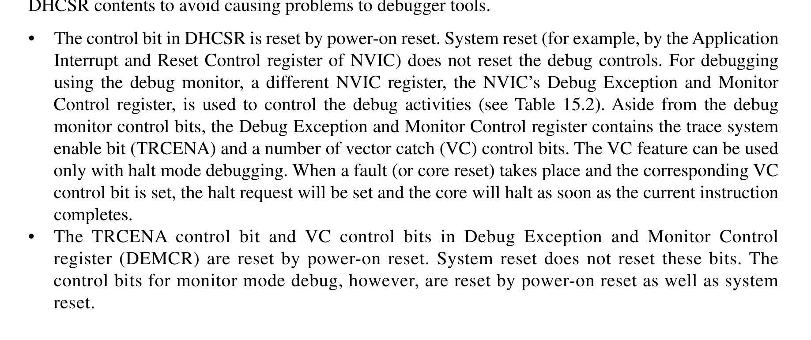
*Description*: Hardware reference table detailing register bit field settings, electrical operating limits, or memory configurations for Table 15.2.

> **Table 15.2**

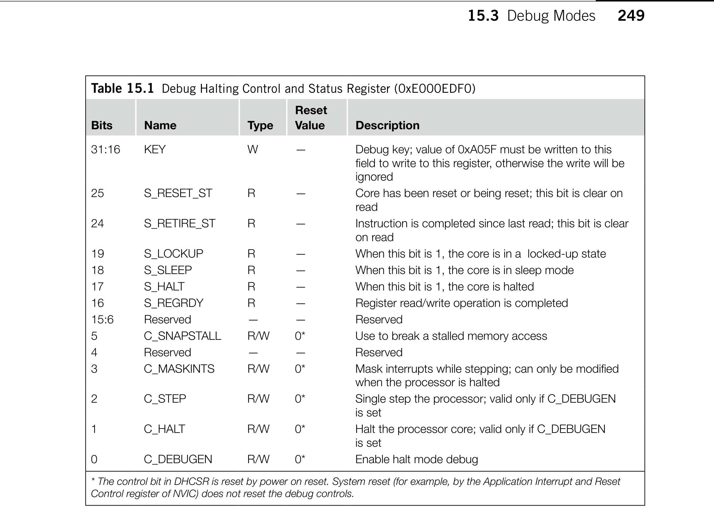
*Description*: Hardware reference table detailing register bit field settings, electrical operating limits, or memory configurations for Table 15.1.

> **Table 15.1**

249
In normal situations, the DHCSR is used only by the debugger. Application codes should not change
DHCSR contents to avoid causing problems to debugger tools.
The control bit in DHCSR is reset by power-on reset. System reset (for example, by the Application
•
Interrupt and Reset Control register of NVIC) does not reset the debug controls. For debugging
using the debug monitor, a different NVIC register, the NVIC’s Debug Exception and Monitor
Control register, is used to control the debug activities (see Table 15.2). Aside from the debug
monitor control bits, the Debug Exception and Monitor Control register contains the trace system
enable bit (TRCENA) and a number of vector catch (VC) control bits. The VC feature can be used
only with halt mode debugging. When a fault (or core reset) takes place and the corresponding VC
control bit is set, the halt request will be set and the core will halt as soon as the current instruction
completes.
The TRCENA control bit and VC control bits in
•
Debug Exception and Monitor Control
register (DEMCR) are reset by power-on reset. System reset does not reset these bits. The
control bits for monitor mode debug, however, are reset by power-on reset as well as system
reset.
Table 15.1  Debug Halting Control and Status Register (0xE000EDF0)
Bits
Name
Type
Reset
Value
Description
31:16
KEY
W
—
Debug key; value of 0xA05F must be written to this
field to write to this register, otherwise the write will be
ignored
25
S_RESET_ST
R
—
Core has been reset or being reset; this bit is clear on
read
24
S_RETIRE_ST
R
—
Instruction is completed since last read; this bit is clear
on read
19
S_LOCKUP
R
—
When this bit is 1, the core is in a  locked-up state
18
S_SLEEP
R
—
When this bit is 1, the core is in sleep mode
17
S_HALT
R
—
When this bit is 1, the core is halted
16
S_REGRDY
R
—
Register read/write operation is completed
15:6
Reserved
—
—
Reserved
5
C_SNAPSTALL
R/W
0*
Use to break a stalled memory access
4
Reserved
—
—
Reserved
3
C_MASKINTS
R/W
0*
Mask interrupts while stepping; can only be modified
when the processor is halted
2
C_STEP
R/W
0*
Single step the processor; valid only if C_DEBUGEN
is set
1
C_HALT
R/W
0*
Halt the processor core; valid only if C_DEBUGEN
is set
0
C_DEBUGEN
R/W
0*
Enable halt mode debug
* The control bit in DHCSR is reset by power on reset. System reset (for example, by the Application Interrupt and Reset
Control register of NVIC) does not reset the debug controls.

## 15.3  Debug Modes

<!-- Page 277 -->
### [PDF Page 277]

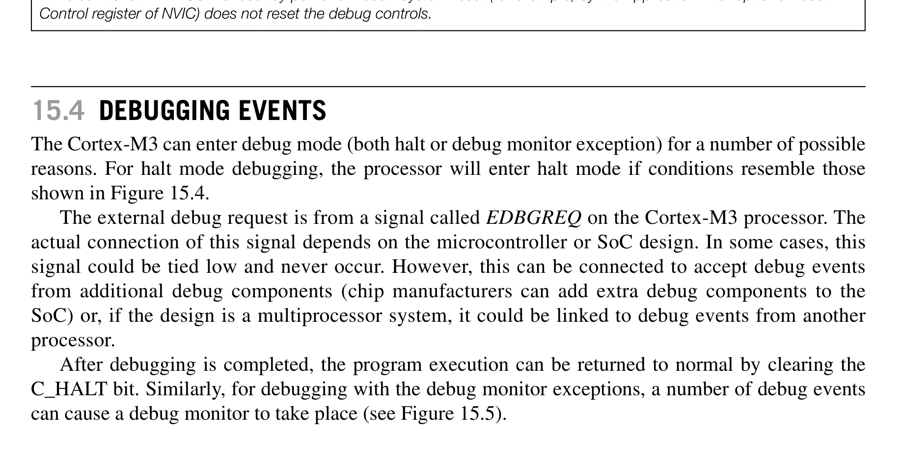
*Description*: Technical diagram and schematic illustration detailing hardware circuit topology, signal routing, and logic operations for Figure 15.4.

> **Figure 15.4**

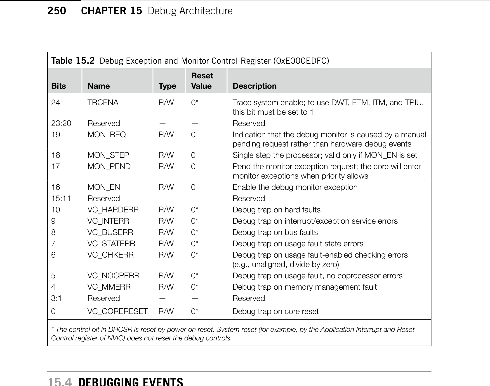
*Description*: Hardware reference table detailing register bit field settings, electrical operating limits, or memory configurations for Table 15.2.

> **Table 15.2**

250
CHAPTER 15  Debug Architecture

## 15.4  Debugging Events

The Cortex-M3 can enter debug mode (both halt or debug monitor exception) for a number of possible
reasons. For halt mode debugging, the processor will enter halt mode if conditions resemble those
shown in Figure 15.4.
The external debug request is from a signal called EDBGREQ on the Cortex-M3 processor. The
actual connection of this signal depends on the microcontroller or SoC design. In some cases, this
signal could be tied low and never occur. However, this can be connected to accept debug events
from additional debug components (chip manufacturers can add extra debug components to the
SoC) or, if the design is a multiprocessor system, it could be linked to debug events from another
processor.
After debugging is completed, the program execution can be returned to normal by clearing the
C_HALT bit. Similarly, for debugging with the debug monitor exceptions, a number of debug events
can cause a debug monitor to take place (see Figure 15.5).
Table 15.2  Debug Exception and Monitor Control Register (0xE000EDFC)
Bits
Name
Type
Reset
Value
Description
24
TRCENA
R/W
0*
Trace system enable; to use DWT, ETM, ITM, and TPIU,
this bit must be set to 1
23:20
Reserved
—
—
Reserved
19
MON_REQ
R/W
0
Indication that the debug monitor is caused by a manual
pending request rather than hardware debug events
18
MON_STEP
R/W
0
Single step the processor; valid only if MON_EN is set
17
MON_PEND
R/W
0
Pend the monitor exception request; the core will enter
monitor exceptions when priority allows
16
MON_EN
R/W
0
Enable the debug monitor exception
15:11
Reserved
—
—
Reserved
10
VC_HARDERR
R/W
0*
Debug trap on hard faults
9
VC_INTERR
R/W
0*
Debug trap on interrupt/exception service errors
8
VC_BUSERR
R/W
0*
Debug trap on bus faults
7
VC_STATERR
R/W
0*
Debug trap on usage fault state errors
6
VC_CHKERR
R/W
0*
Debug trap on usage fault-enabled checking errors
(e.g., unaligned, divide by zero)
5
VC_NOCPERR
R/W
0*
Debug trap on usage fault, no coprocessor errors
4
VC_MMERR
R/W
0*
Debug trap on memory management fault
3:1
Reserved
—
—
Reserved
0
VC_CORERESET
R/W
0*
Debug trap on core reset
* The control bit in DHCSR is reset by power on reset. System reset (for example, by the Application Interrupt and Reset
Control register of NVIC) does not reset the debug controls.

<!-- Page 278 -->
### [PDF Page 278]

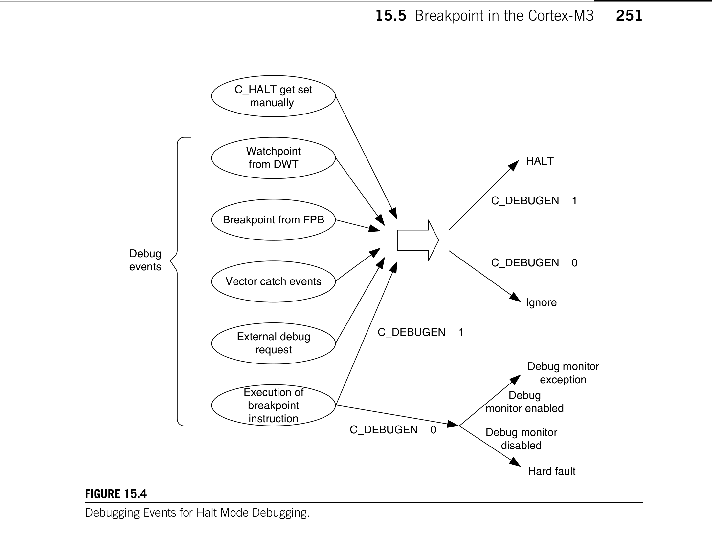
*Description*: Technical diagram and schematic illustration detailing hardware circuit topology, signal routing, and logic operations for Figure 15.4.

> **Figure 15.4**

251

## 15.5  Breakpoint in the Cortex-M3

For debug monitor, the behavior is a bit different from halt mode debugging. This is because the
debug monitor exception is just one type of exception and can be affected by the current priority of the
processor if it is running another exception handler.
After debugging is completed, the program execution can be returned to normal by carrying out an
exception return.

## 15.5  Breakpoint in the Cortex-M3

One of the most commonly used debug features in most microcontrollers is the breakpoint feature. In
the Cortex-M3, the following two types of breakpoint mechanisms are supported:
Breakpoint instruction
•
Breakpoint using address comparators in the FPB
•
Figure 15.4
Debugging Events for Halt Mode Debugging.
C_HALT get set
manually
Watchpoint
from DWT
External debug
request
Breakpoint from FPB
Vector catch events
Execution of
breakpoint
instruction
Debug
events
C_DEBUGEN z 1
C_DEBUGEN z 0
HALT
Ignore
C_DEBUGENz 1
C_DEBUGEN z 0
Hard fault
Debug monitor
exception
Debug monitor
disabled
Debug
monitor enabled

<!-- Page 279 -->
### [PDF Page 279]

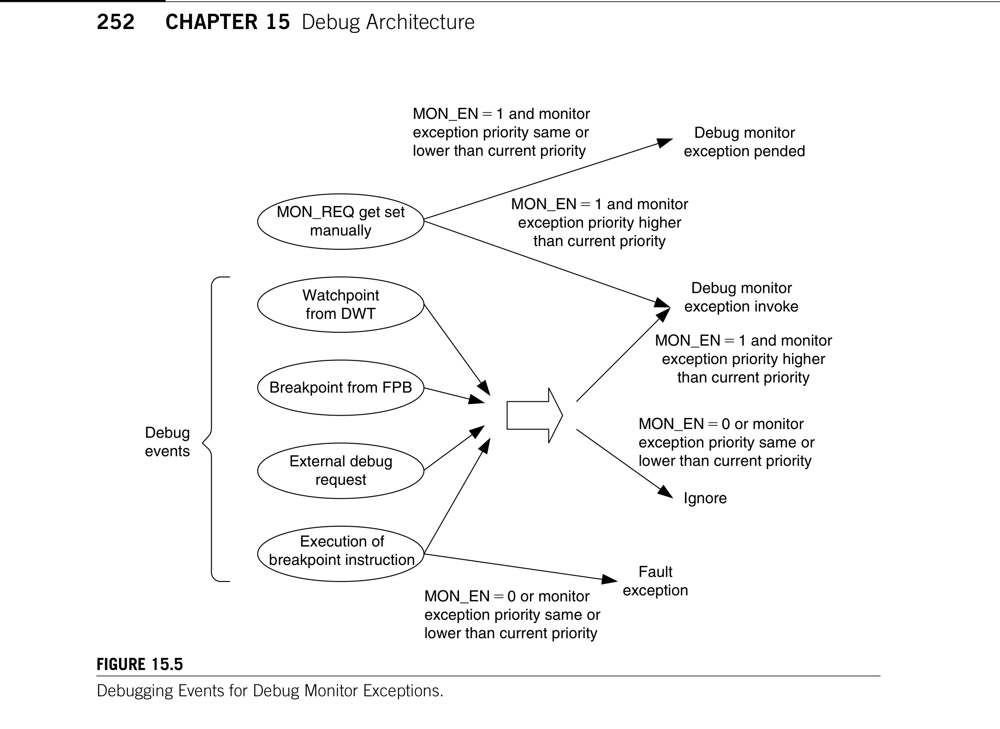
*Description*: Technical diagram and schematic illustration detailing hardware circuit topology, signal routing, and logic operations for Figure 15.5.

> **Figure 15.5**

252
CHAPTER 15  Debug Architecture
The breakpoint instruction (BKPT #immed8) is a 16-bit Thumb® instruction with encoding 0xBExx.
The lower 8 bits depend on the immediate data given following the instruction. When this instruction is
executed, it generates a debug event and can be used to halt the processor core if C_DBGEN is set, or if
the debug monitor is enabled, it can be used to trigger the debug monitor exception. Because the debug
monitor is one type of exception with programmable priority, it can only be used in thread or exception
handlers with priority lower than itself. As a result, if debug monitor is used for debugging, the BKPT
instructions should not be used in exception handlers such as nonmaskable interrupt or hard fault, and
the debug monitor can only be pended and executed after the exception handler is completed.
When the debug monitor exception returns, it is returned to the address of the BKPT instruction,
not the address after the BKPT instruction. This is because in normal use of breakpoint instructions, the
BKPT is used to replace a normal instruction, and when the breakpoint is hit and the debug action is
carried out, the instruction memory is restored to the original instruction, and the rest of the instruction
memory is unaffected.
If the BKPT instruction is executed with C_DEBUGEN = 0 and MON_EN = 0, it will cause the
processor to enter a hard fault exception, with DEBUGEVT in the Hard Fault Status register (HFSR)
set to 1, and BKPT in the Debug Fault Status register (DFSR) also set to 1.
Figure 15.5
Debugging Events for Debug Monitor Exceptions.
MON_REQ get set
manually
Watchpoint
from DWT
Breakpoint from FPB
External debug
request
Execution of
breakpoint instruction
Debug
events
MON_EN 1 and monitor
exception priority higher
than current priority
Debug monitor
exception invoke
Ignore
MON_EN 0 or monitor
exception priority same or
lower than current priority
Fault
exception
MON_EN 0 or monitor
exception priority same or
lower than current priority
MON_EN 1 and monitor
exception priority higher
than current priority
Debug monitor
exception pended
MON_EN 1 and monitor
exception priority same or
lower than current priority

<!-- Page 280 -->
### [PDF Page 280]

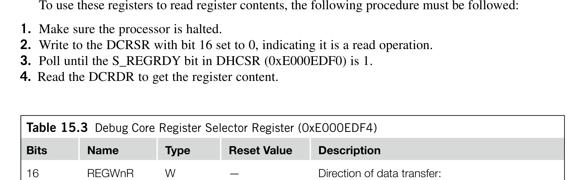
*Description*: Hardware reference table detailing register bit field settings, electrical operating limits, or memory configurations for Table 15.3.

> **Table 15.3**

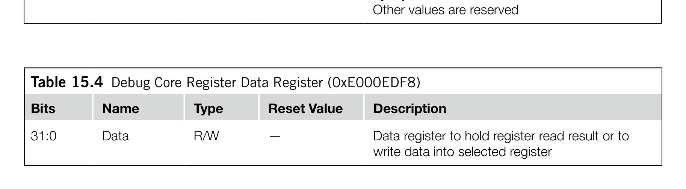
*Description*: Hardware reference table detailing register bit field settings, electrical operating limits, or memory configurations for Table 15.4.

> **Table 15.4**

253

## 15.6  Accessing Register Content in Debug

The FPB unit can be programmed to generate breakpoint events even if the program memory ­cannot
be altered. However, it is limited to six instruction addresses and two literal addresses. More informa-
tion about FPB is covered in the next chapter.

## 15.6  Accessing Register Content in Debug

Two more registers are included in the NVIC to provide debug functionality. They are the Debug
Core Register Selector register (DCRSR) and the Debug Core Register Data register (DCRDR) (see
Tables 15.3 and 15.4). These two registers allow the debugger to access registers of the processors. The
register transfer feature can be used only when the processor is halted.
To use these registers to read register contents, the following procedure must be followed:
Make sure the processor is halted.
1.
Write to the DCRSR with bit 16 set to 0, indicating it is a read operation.
2.
Poll until the S_REGRDY bit in DHCSR (0xE000EDF0) is 1.
3.
Read the DCRDR to get the register content.
4.
Table 15.3  Debug Core Register Selector Register (0xE000EDF4)
Bits
Name
Type
Reset Value
Description
16
REGWnR
W
—
Direction of data transfer:
Write = 1, Read = 0
15:5
Reserved
—
—
—
4:0
REGSEL
W
—
Register to be accessed:
00000 = R0
00001 = R1
. . .
01111 = R15
10000 = xPSR/flags
10001 = Main Stack Pointer (MSP)
10010 = Process Stack Pointer (PSP)
10100 = Special registers:
[31:24] Control
[23:16] FAULTMASK
[15:8] BASEPRI
[7:0] PRIMASK
Other values are reserved
Table 15.4  Debug Core Register Data Register (0xE000EDF8)
Bits
Name
Type
Reset Value
Description
31:0
Data
R/W
—
Data register to hold register read result or to
write data into selected register

<!-- Page 281 -->
### [PDF Page 281]

254
CHAPTER 15  Debug Architecture
Similar operations are needed for writing to a register:
Make sure the processor is halted.
1.
Write data value to the DCRDR.
2.
Write to the DCRSR with bit 16 set to 1, indicating it is a write operation.
3.
Poll until the S_REGRDY bit in DHCSR (0xE000EDF0) is 1.
4.
The DCRSR and the DCRDR registers can only transfer register values during halt mode debug.
For debugging using a debug monitor handler, the contents of some of the register can be accessed from
the stack memory; the others can be accessed directly within the monitor exception handler.
The DCRDR can also be used for semihosting if suitable function libraries and debugger support
are available. For example, when an application executes a printf statement, the text output could be
generated by a number of putc (put character) function calls. The putc function calls can be imple-
mented as functions that store the output character and status to the DCRDR and then trigger the debug
mode. The debugger can then detect the core halt and collect the output character for display. This
operation, however, requires the core to halt, whereas the semihosting solution using ITM does not
have this limitation.

## 15.7  Other Core Debugging Features

The NVIC also contains a number of other features for debugging. These include the following:
•
External debug request signal: The NVIC provides an external debug request signal that allows the
Cortex-M3 processor to enter debug mode through an external event such as debug status of other
processors in a multiprocessor system. This feature is very useful for debugging a multiprocessor
system. In simple microcontrollers, this signal is likely to be tied low.
•
DFSR: Because of the various debug events available on the Cortex-M3, a DFSR (Debug Fault
Status Register) is available for the debugger to determine the debug event that has taken place.
Reset control
•
: During debugging, the processor core can be restarted using the VECTRESET
control bit or SYSRESETREQ control bit in the NVIC Application Interrupt and Reset Control
register (0xE000ED0C). Using this reset control register, the processor can be reset without
affecting the debug components in the system.
•
Interrupt masking: This feature is very useful during stepping. For example, if you need to debug
an application but do not want the code to enter the interrupt service routine during the stepping,
the interrupt request can be masked. This is done by setting the C_MASKINTS bit in the DHCSR
(0xE000EDF0).
•
Stalled bus transfer termination: If a bus transfer is stalled for a very long time, it is possible
to terminate the stalled transfer by an NVIC control register. This is done by setting the
C_SNAPSTALL bit in the DHCSR (0xE000EDF0). This feature can be used only by a debugger
during halt.

