# Chapter
16. Debugging Components

> **Source PDF**: THE_DEFINITIVE_GUIDE_TO_THE_ARM_CORTEX-МЗ_Stellaris_MCU_9000Series_TEINSTRUMENTS_ARM_SECOND_EDITION.pdf  
> **PDF Page Range**: 282 - 295

---

<!-- Page 282 -->
### [PDF Page 282]

255
Copyright © 2010, Elsevier Inc. All rights reserved.
DOI: 10.1016/B978-0-12-382091-4.00022-0
In This Chapter
Introduction�������������������������������������������������������������������������������������������������������������������������������������������255
Trace Components: DWT........................................................................................................................ 256
Trace Components: ITM��������������������������������������������������������������������������������������������������������������������������258
Trace Components: ETM�������������������������������������������������������������������������������������������������������������������������260
Trace Components: TPIU������������������������������������������������������������������������������������������������������������������������261
The Flash Patch and Breakpoint Unit������������������������������������������������������������������������������������������������������262
The Advanced High-Performance Bus Access Port����������������������������������������������������������������������������������264
ROM Table���������������������������������������������������������������������������������������������������������������������������������������������265
CHAPTER
Debugging Components
16

## 16.1  Introduction

The Cortex™-M3 processor comes with a number of debugging components used to provide debugging

### features such as breakpoint, watchpoint, Flash Patch, and trace. If you are an application developer,

there might be a chance that you’ll never need to know the details about these debugging components
because they are normally used only by debugger tools. This chapter will introduce you to the basics of
each debug component. If you want to know the details about things such as the actual programmer’s
model, refer to the Cortex-M3 Technical Reference Manual [Ref. 1].
All the debug trace components, as well as the Flash Patch and Breakpoint (FPB), can be pro-
grammed through the Cortex-M3 Private Peripheral Bus (PPB). In most cases, the components will
only be programmed by the debugging host. It is not recommended for applications to try accessing
the debug components (except stimulus port registers in the Instrumentation Trace Macrocell [ITM])
because this could interfere with the debugger’s operation.
16.1.1  The Trace System in the Cortex-M3
The Cortex-M3 trace system is based on the CoreSight architecture. Trace results are generated in the
form of packets, which can be of various lengths (in terms of number of bytes). The trace components
transfer the packets using Advanced Trace Bus (ATB) to the Trace Port Interface Unit (TPIU), which

<!-- Page 283 -->
### [PDF Page 283]

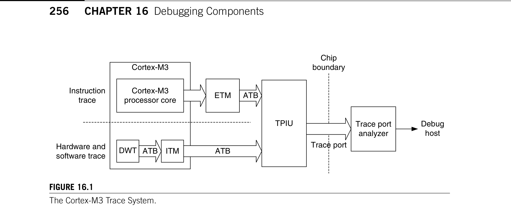
*Description*: Technical diagram and schematic illustration detailing hardware circuit topology, signal routing, and logic operations for Figure 16.1.

> **Figure 16.1**

256
CHAPTER 16  Debugging Components
formats the packets into Trace Interface Protocol. The data is then captured by an external trace capture
device such as a Trace Port Analyzer (TPA), as shown in Figure 16.1.
There are up to three trace sources in a standard Cortex-M3 processor: Embedded Trace Macrocell
(ETM), ITM, and Data Watchpoint and Trace (DWT). Note that the ETM in the Cortex-M3 is optional,
so some Cortex-M3 products do not have instruction trace capability. During operation, each trace
source is assigned a 7-bit ATB Trace ID value (ATID), which is transferred along the trace packets
during merging in the ATB so that the packets can be separated back into multiple trace streams when
they reach the debug host.
Unlike many other standard CoreSight components, the debug components in the Cortex-M3 pro-
cessor include the functionality of merging ATB streams, whereas in standard CoreSight systems, ATB
packet merger, called ATB funnel, is a separate block.
Before using the trace system, the Trace Enable (TRCENA) bit in the Debug Exception and Moni-
tor Control register (DEMCR) must be set to 1 (see Table 15.2 or D.38). Otherwise, the trace system
will be disabled. In normal operations that do not require tracing, clearing the TRCENA bit can disable
some of the trace logic and reduce the power consumption.

## 16.2  Trace Components: DWT

The DWT has a number of debugging functionalities:
It has four comparators, each of which can be configured as follows:
1.
Hardware watch point (generates a watch point event to the processor to invoke debug modes
a.
such as halt or debug monitor)
ETM trigger (causes the ETM to emit a trigger packet in the instruction trace stream)
b.
PC sampler event trigger
c.
Data address sampler trigger
d.
The first comparator can also be used to compare against the clock cycle counter (CYCCNT) instead
of comparing with a data address.
Figure 16.1
The Cortex-M3 Trace System.
Cortex-M3
processor core
ETM
ATB
DWT
ITM
ATB
ATB
TPIU
Instruction
trace
Hardware and
software trace
Trace port
Trace port
analyzer
Debug
host
Chip
boundary
Cortex-M3

<!-- Page 284 -->
### [PDF Page 284]

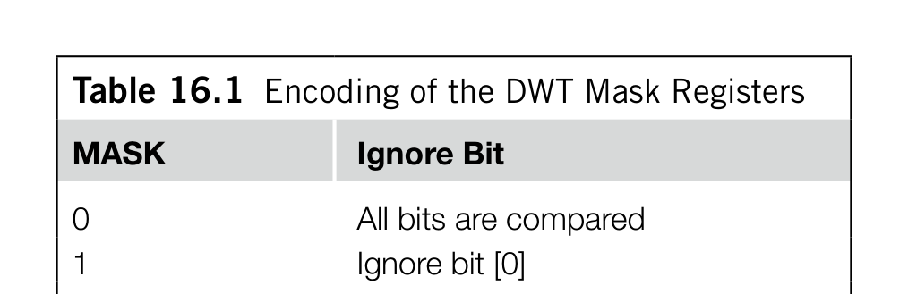
*Description*: Hardware reference table detailing register bit field settings, electrical operating limits, or memory configurations for Table 16.1.

> **Table 16.1**

257

## 16.2  Trace Components: DWT

Counters for counting the following:
2.
Clock cycles (CYCCNT)
a.
Folded instructions
b.
Load store unit operations
c.
Sleep cycles
d.
Cycles per instruction
e.
Interrupt overhead
f.
PC sampling at regular intervals
3.
Interrupt events trace
4.
When used as a hardware watchpoint or ETM trigger, the comparator can be programmed to compare
either data addresses or program counters. When programmed as other functions, it compares the data
addresses.
Each of the comparators has three corresponding registers, which are as follows:
COMP (compare) register
•
MASK register
•
FUNCTION control register
•
The COMP register is a 32-bit register that the data address (or program counter value, or CYCCNT)
compares to. The MASK register determines whether any bit in the data address will be ignored during
the compare (see Table 16.1).
By using the mask register, it is possible to trace data access in an address range of 32 KB maximum
size. However, because of the limited first in/first out (FIFO) size in the DWT and the ITM, it is not
practical to trace lots of data transfers as this will cause trace overflow and result in loss of trace data.
The comparator’s FUNCTION register determines its function. To avoid unexpected behavior, the
MASK register and the COMP register should be programmed before this register is set. If the ­comparator’s
function is to be changed, you should disable the comparator by setting FUNCTION to 0 (disable), then
program the MASK and COMP registers, and then enable the FUNCTION register in the last step.
The rest of the DWT counters are typically used for profiling the application codes. They can be
programmed to emit events (in the form of trace packets) when the counter overflows. One typical
application is to use the CYCCNT register to count the number of clock cycles required for a specific
task, for benchmarking purposes.
Table 16.1  Encoding of the DWT Mask Registers
MASK
Ignore Bit
0
All bits are compared
1
Ignore bit [0]
2
Ignore bit [1:0]
3
Ignore bit [2:0]
…
…
15
Ignore bit [14:0]

<!-- Page 285 -->
### [PDF Page 285]

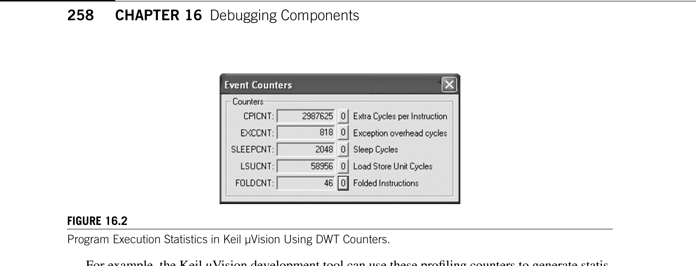
*Description*: Technical diagram and schematic illustration detailing hardware circuit topology, signal routing, and logic operations for Figure 16.2.

> **Figure 16.2**

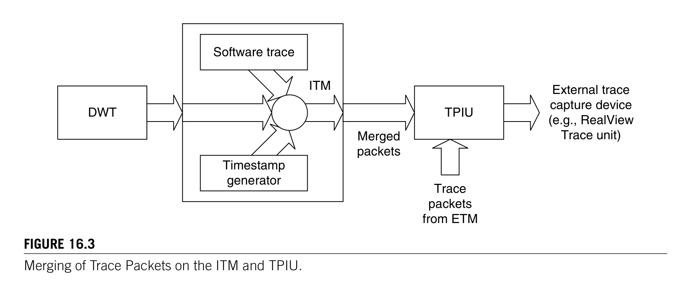
*Description*: Technical diagram and schematic illustration detailing hardware circuit topology, signal routing, and logic operations for Figure 16.3.

> **Figure 16.3**

258
CHAPTER 16  Debugging Components
For example, the Keil μVision development tool can use these profiling counters to generate statis-
tical information (see Figure 16.2). These counters trigger event packets to be generated and are col-
lected by the debugger through the Serial Wire Viewer (SWV) output.
The TRCENA bit in the DEMCR must be set to 1 before the DWT is used. If the DWT is being used
to generate a trace, the DWT enable (DWTEN) bit in the ITM control register should also be enabled.

## 16.3  Trace Components: ITM

The ITM has the following functionalities, as shown in Figure 16.3:
Software can directly write console messages to ITM stimulus ports and output them as trace data.
•
The DWT can generate trace packets and output them through the ITM.
•
The ITM can generate timestamp packets that are inserted into a trace stream to help the debugger
•
find out the timing of events.
Because the ITM uses a trace port to output data, if the microcontroller or system-on-chip (SoC)
does not have TPIU support, the traced information cannot be output. Therefore, it is necessary to
check whether the microcontroller or SoC has all the required features before you use the ITM. In the
Figure 16.3
Merging of Trace Packets on the ITM and TPIU.
DWT
Software trace
Timestamp
generator
ITM
Merged
packets
TPIU
Trace
packets
from ETM
External trace
capture device
(e.g., RealView
Trace unit)
Figure 16.2
Program Execution Statistics in Keil μVision Using DWT Counters.

<!-- Page 286 -->
### [PDF Page 286]

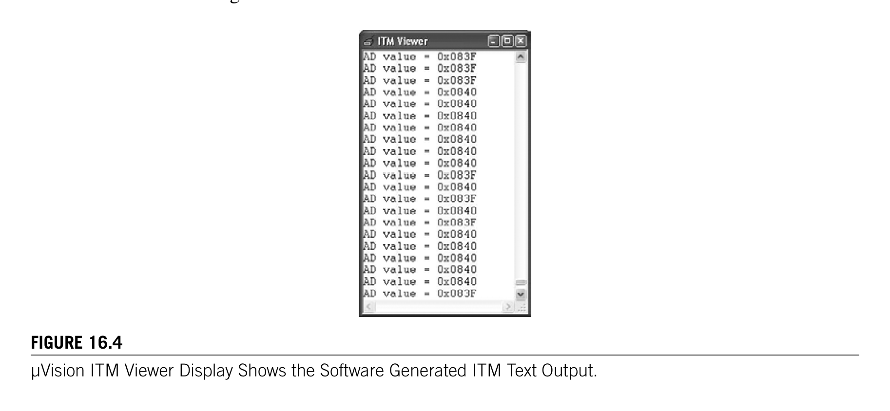
*Description*: Technical diagram and schematic illustration detailing hardware circuit topology, signal routing, and logic operations for Figure 16.4.

> **Figure 16.4**

259

## 16.3  Trace Components: ITM

worst case, if these features are not available, you can still use semihosting via the Nested Vectored
Interrupt Controller (NVIC) debug register (supported by ARM RealView Debugger) or a universal
asynchronous receiver/transmitter (UART) to output console messages.
To use the ITM, the TRCENA bit in the DEMCR must be set to 1. Otherwise, the ITM will be
­disabled and ITM registers cannot be accessed.
In addition, there is also a lock register in the ITM. You need to write the access key 0xC5ACCE55
(CoreSight ACCESS) to this register before programming the ITM. Otherwise, all write operations to
the ITM will be ignored.
Finally, the ITM itself is another control register to control the enabling of individual features. The
control register also contains the ATID field, which is an ID value for the ITM in the ATB. This ID
value must be unique from the IDs for other trace sources, so that the debug host receiving the trace
packet can separate the ITM’s trace packets from other trace packets.
16.3.1  Software Trace with the ITM
One of the main uses of the ITM is to support debug message output (such as printf). The ITM contains
32 stimulus ports, allowing different software processes to output to different ports, and the messages
can be separated later at the debug host. Each port can be enabled or disabled by the Trace Enable regis-
ter and can be programmed (in groups of eight ports) to allow or disallow user processes to write to it.
Unlike UART-based text output, using the ITM to output does not cause much delay for the applica-
tion. A FIFO buffer is used inside the ITM, so writing output messages can be buffered. However, it is
still necessary to check whether the FIFO is full before you write to it.
The output messages can be collected at the trace port interface or the Serial Wire Viewer interface
(SWV) on the TPIU. There is no need to remove code that generates the debug messages from the
final code because if the TRCENA control bit is low, the ITM will be inactive and debug messages will
not be output. You can also switch on the output message in a “live” system and use the Trace Enable
register in the ITM to limit which ports are enabled so that only some of the messages can be output.
For example, the Keil μVision development tool can collect and display the text output using the
ITM viewer shown in Figure 16.4.
Figure 16.4
μVision ITM Viewer Display Shows the Software Generated ITM Text Output.

<!-- Page 287 -->
### [PDF Page 287]

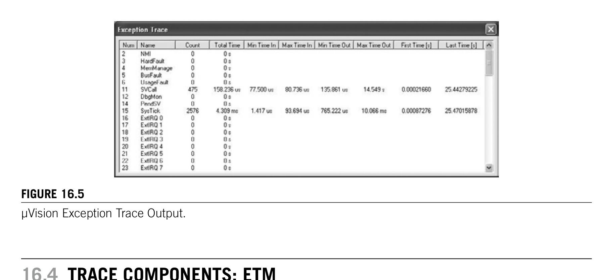
*Description*: Technical diagram and schematic illustration detailing hardware circuit topology, signal routing, and logic operations for Figure 16.5.

> **Figure 16.5**

260
CHAPTER 16  Debugging Components
16.3.2  Hardware Trace with ITM and DWT
The ITM is used in output of hardware trace packets. The packets are generated from the DWT, and the
ITM acts as a trace packet merging unit. To use DWT trace, you need to enable the DWTEN bit in the
ITM control register; the rest of the DWT trace settings still need to be programmed at the DWT.
16.3.3  ITM Timestamp
ITM has a timestamp feature that allows trace capture tools to find out timing information by inserting
delta timestamp packets into the traces when a new trace packet enters the FIFO inside the ITM. The
timestamp packet is also generated when the timestamp counter overflows.
The timestamp packets provide the time difference (delta) with previous events. Using the delta
timestamp packets, the trace capture tools can then establish the timing of when each packet is gener-
ated, and hence reconstruct the timing of various debug events.
Combining the trace functionality of DWT and ITM, we can collect a lot of useful information. For
example, the exception trace windows in the Keil μVision development tool can tell you what excep-
tions have been carried out and how much time was spend on the exceptions, as shown in Figure 16.5.

## 16.4  Trace Components: ETM

The ETM block is used for providing instruction traces. It is optional and might not be available on
some Cortex-M3 products. When it is enabled and when the trace operation starts, it generates instruc-
tion trace packets. A FIFO buffer is provided in the ETM to allow enough time for the trace stream to
be captured.
To reduce the amount of data generated by the ETM, it does not always output exactly what address
the processor has reached/executed. It usually outputs information about program flow and outputs full
addresses only if needed (e.g., if a branch has taken place). Because the debugging host should have a
copy of the binary image, it can then reconstruct the instruction sequence the processor has carried out.
The ETM also interacts with other debugging components such as the DWT. The comparators in the
DWT can be used to generate trigger events in the ETM or to control the trace start/stop.
Figure 16.5
μVision Exception Trace Output.

<!-- Page 288 -->
### [PDF Page 288]

*Description*: Hardware reference table detailing register bit field settings, electrical operating limits, or memory configurations for Table 15.2.

> **Table 15.2**

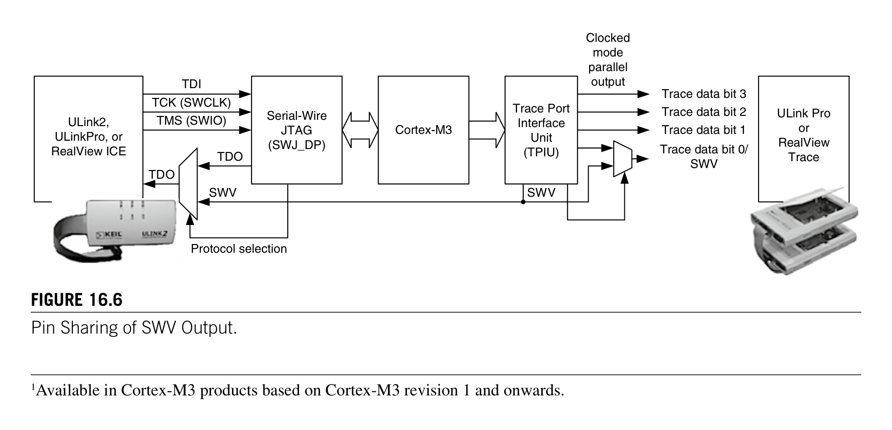
*Description*: Technical diagram and schematic illustration detailing hardware circuit topology, signal routing, and logic operations for Figure 16.6.

> **Figure 16.6**

261

## 16.5  Trace Components: TPIU

Unlike the ETM in traditional ARM processors, the Cortex-M3 ETM does not have its own address
comparators, because the DWT can carry out the comparison for ETM. Furthermore, because the data
trace functionality is carried out by the DWT, the ETM design in the Cortex-M3 is quite different from
traditional ETM for other ARM cores.
To use the ETM in the Cortex-M3, the following setup is required (handled by debug tools):
The TRCENA bit in the DEMCR must be set to 1 (refer to Table 15.2 or D.38).
1.
The ETM needs to be unlocked so that its control registers can be programmed. This can be done
2.
by writing the value 0xC5ACCE55 to the ETM LOCK_ACCESS register.
The ATB ID register (ATID) should be programmed to a unique value so that the trace packet
3.
output through the TPIU can be separated from packets from other trace sources.
The Non-Invasive Debug Enable (
4.
NIDEN) input signal of the ETM must be set to high.
The implementation of this signal is device specific. Refer to the datasheet from your chip’s
manufacturer for details.
Program the ETM control registers for trace generation.
5.

## 16.5  Trace Components: TPIU

The TPIU is used to output trace packets from the ITM, DWT, and ETM to the external capture device
(for example, a TPA). The Cortex-M3 TPIU supports two output modes:
Clocked mode, using up to 4-bit parallel data output ports
•
SWV mode, using single-bit SWV output
•
1
In clocked mode, the actual number of bits being used on the data output port can be programmed to dif-
ferent sizes. This will depend on the chip package as well as the number of signal pins available for trace
output in the application. The maximum trace port size supported by the chip can be determined from
one of the registers in the TPIU. In addition, the speed of trace data output can also be programmed.
1Available in Cortex-M3 products based on Cortex-M3 revision 1 and onwards.
Figure 16.6
Pin Sharing of SWV Output.
Serial-Wire
JTAG
(SWJ_DP)
TMS (SWIO)
TCK (SWCLK)
TDI
TDO
Cortex-M3
Trace Port
Interface
Unit
(TPIU)
SWV
TDO
Protocol selection
Trace data bit 3
Trace data bit 2
Trace data bit 1
Trace data bit 0/
SWV
SWV
Clocked
mode
parallel
output
ULink2,
ULinkPro, or
RealView ICE
ULink Pro
or
RealView
Trace

<!-- Page 289 -->
### [PDF Page 289]

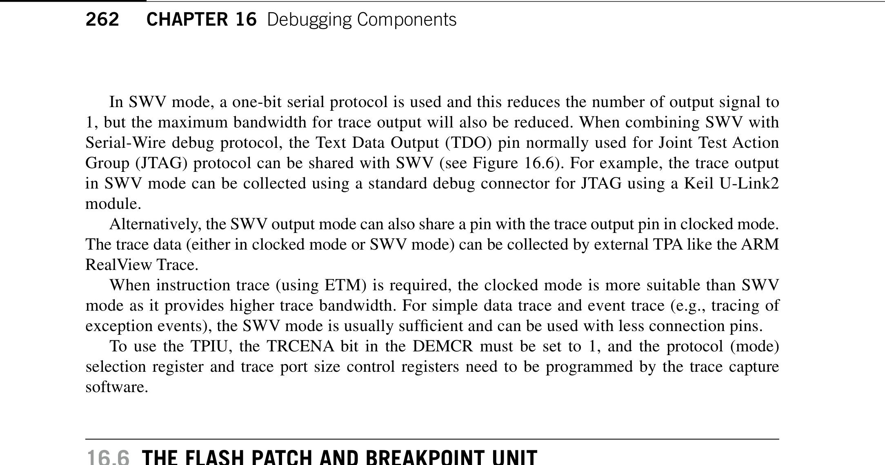
*Description*: Technical diagram and schematic illustration detailing hardware circuit topology, signal routing, and logic operations for Figure 16.6.

> **Figure 16.6**

262
CHAPTER 16  Debugging Components
In SWV mode, a one-bit serial protocol is used and this reduces the number of output signal to
1, but the maximum bandwidth for trace output will also be reduced. When combining SWV with
Serial-Wire debug protocol, the Text Data Output (TDO) pin normally used for Joint Test Action
Group (JTAG) protocol can be shared with SWV (see Figure 16.6). For example, the trace output
in SWV mode can be collected using a standard debug connector for JTAG using a Keil U-Link2
module.
Alternatively, the SWV output mode can also share a pin with the trace output pin in clocked mode.
The trace data (either in clocked mode or SWV mode) can be collected by external TPA like the ARM
RealView Trace.
When instruction trace (using ETM) is required, the clocked mode is more suitable than SWV
mode as it provides higher trace bandwidth. For simple data trace and event trace (e.g., tracing of
exception events), the SWV mode is usually sufficient and can be used with less ­connection pins.
To use the TPIU, the TRCENA bit in the DEMCR must be set to 1, and the protocol (mode)
selection register and trace port size control registers need to be programmed by the trace capture
software.

## 16.6  The Flash Patch and Breakpoint Unit

The FPB has the following two functions:
Hardware breakpoint (generates a breakpoint event to the processor to invoke debug modes such
•
as halt or debug monitor)
Patch instruction or literal data from Code memory space to Static Random Access Memory
•
(SRAM) memory region
16.6.1  Breakpoint Feature
The breakpoint function is fairly easy to understand—during debugging, you can set one or multiple
breakpoints to program addresses or literal constant addresses. If the program code at the breakpoint
addresses get executed, or if the literal constant addresses get accessed, then this triggers the break-
point debug event and causes the program execution to halt (for halt mode debug) or triggers the debug
monitor exception (if debug monitor is used). Then, you can examine the register’s content, memory
contents, debug using single stepping, and so on.
16.6.2  Flash Patch Feature
The Flash Patch function allows using a small programmable memory in the system to apply patches
to a program memory which cannot be modified. For products to be produced in high ­volume, using
mask ROM or one-time-programmable ROM can reduce the cost of the product. But, if a software
bug is found after the device is programmed, it could be costly to replace the devices. By integrat-
ing a small reprogrammable memory, for example, a very small Flash or Electrically ­Erasable
Programmable Read Only Memory (EEPROM), patches can be made to the original software pro-
grammed in the device. For microcontrollers that only use Flash to store software, Flash Patch is
not required as the whole Flash can be erased and reprogrammed easily.

<!-- Page 290 -->
### [PDF Page 290]

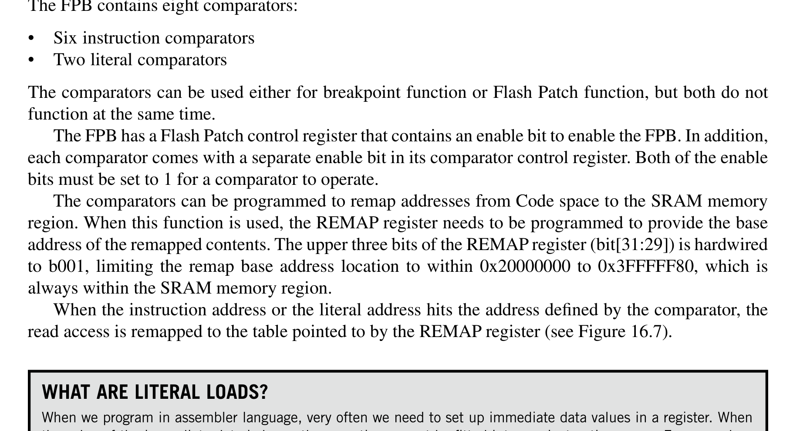
*Description*: Technical diagram and schematic illustration detailing hardware circuit topology, signal routing, and logic operations for Figure 16.7.

> **Figure 16.7**

263

## 16.6  The Flash Patch and Breakpoint Unit

16.6.3  Comparators
The FPB contains eight comparators:
Six instruction comparators
•
Two literal comparators
•
The comparators can be used either for breakpoint function or Flash Patch function, but both do not
function at the same time.
The FPB has a Flash Patch control register that contains an enable bit to enable the FPB. In addition,
each comparator comes with a separate enable bit in its comparator control register. Both of the enable
bits must be set to 1 for a comparator to operate.
The comparators can be programmed to remap addresses from Code space to the SRAM memory
region. When this function is used, the REMAP register needs to be programmed to provide the base
address of the remapped contents. The upper three bits of the REMAP register (bit[31:29]) is hardwired
to b001, limiting the remap base address location to within 0x20000000 to 0x3FFFFF80, which is
always within the SRAM memory region.
When the instruction address or the literal address hits the address defined by the comparator, the
read access is remapped to the table pointed to by the REMAP register (see Figure 16.7).
What Are Literal Loads?
When we program in assembler language, very often we need to set up immediate data values in a register. When
the value of the immediate data is large, the operation cannot be fitted into one instruction space. For example,
LDR   R0, =0xE000E400  ; External Interrupt Priority Register
; starting address
Because no instruction has an immediate value space of 32, we need to put the immediate data in a different
memory space, usually after the program code region, and then use a PC relative load instruction to read the
immediate data into the register. So what we get in the compiled binary code will be something like the following:
LDR   R0, [PC, #<immed_8>*4]
; immed_8 = (address of literal value – PC)/4
...
; literal pool
...
DCD   0xE000E400
...
or with Thumb®-2 instructions:
LDR.W R0, [PC, #+/- <offset_12>]
; offset_12 = address of literal value - PC
...
; literal pool
...
DCD   0xE000E400
...
Because we are likely to use more than one literal value in our code, the assembler or compiler will usually
generate a block of literal data, commonly called the literal pool.
In Cortex-M3, the literal loads are data read operations carried out on the data bus (D-Code bus or System
bus depending on memory location).

<!-- Page 291 -->
### [PDF Page 291]

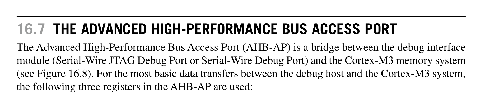
*Description*: Technical diagram and schematic illustration detailing hardware circuit topology, signal routing, and logic operations for Figure 16.8.

> **Figure 16.8**

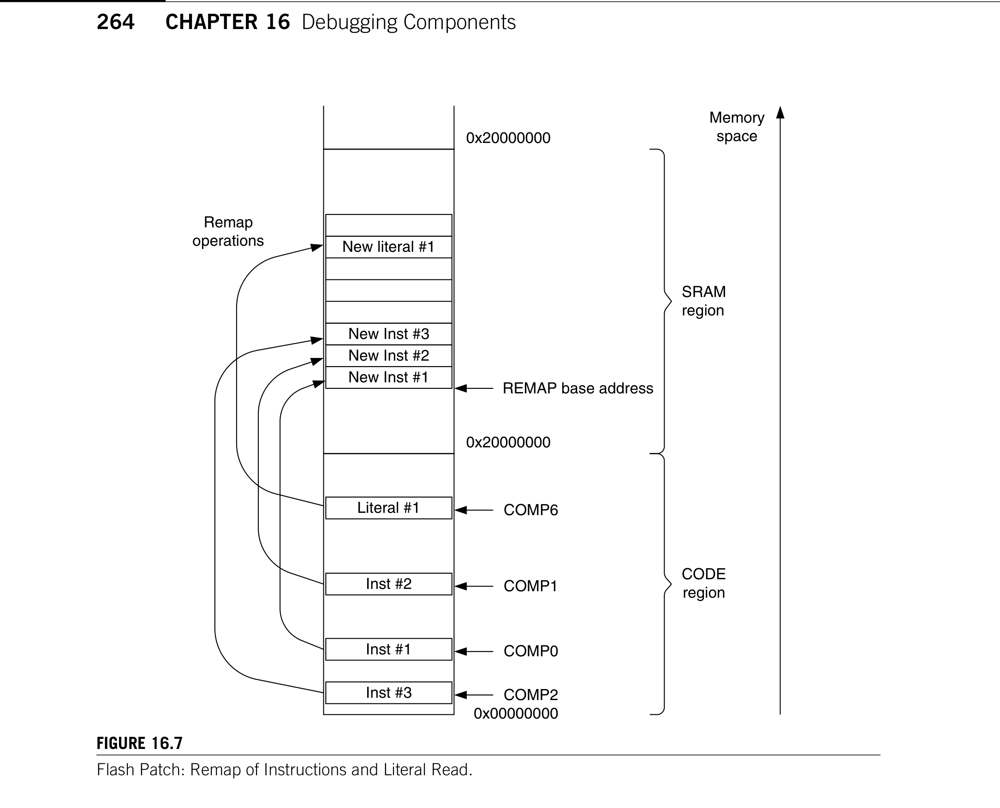
*Description*: Technical diagram and schematic illustration detailing hardware circuit topology, signal routing, and logic operations for Figure 16.7.

> **Figure 16.7**

264
CHAPTER 16  Debugging Components
Using the remap function, it is possible to create some “what-if” test cases in which the original
instruction or a literal value is replaced by a different one; even the program code is in ROM or Flash
memory. An example use is to allow execution of a program or subroutine in the SRAM region by
patching program ROM in the Code region so that a branch to the test program or subroutine can take
place. This makes it possible to debug a ROM-based device.
Alternatively, the six instruction address comparators can be used to generate breakpoints as well
as to invoke halt mode debug or debug monitor exceptions.

## 16.7  The Advanced High-Performance Bus Access Port

The Advanced High-Performance Bus Access Port (AHB-AP) is a bridge between the debug interface
module (Serial-Wire JTAG Debug Port or Serial-Wire Debug Port) and the Cortex-M3 memory ­system
(see Figure 16.8). For the most basic data transfers between the debug host and the Cortex-M3 system,
the ­following three registers in the AHB-AP are used:
Figure 16.7
Flash Patch: Remap of Instructions and Literal Read.
Inst #3
Inst #2
Inst #1
Literal #1
0x20000000
New Inst #3
New Inst #2
New Inst #1
New literal #1
REMAP base address
0x20000000
CODE
region
SRAM
region
COMP6
COMP1
COMP0
COMP2
0x00000000
Remap
operations
Memory
space

<!-- Page 292 -->
### [PDF Page 292]

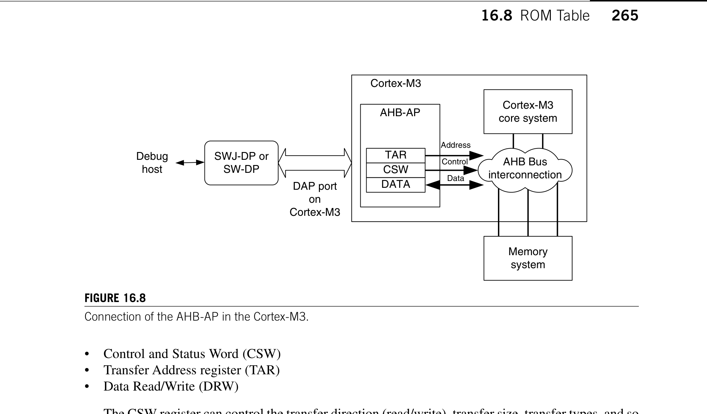
*Description*: Technical diagram and schematic illustration detailing hardware circuit topology, signal routing, and logic operations for Figure 16.8.

> **Figure 16.8**

265

## 16.8  ROM Table

Control and Status Word (CSW)
•
Transfer Address register (TAR)
•
Data Read/Write (DRW)
•
The CSW register can control the transfer direction (read/write), transfer size, transfer types, and so
on. The TAR register is used to specify the transfer address, and the DRW register is used to carry out
the data transfer operation (transfer starts when this register is accessed).
The data register DRW represents exactly what is shown on the bus. For half word and byte trans-
fers, the required data will have to be manually shifted to the correct byte lane by debugger software.
For example, if you want to carry out a data transfer of half word size to address 0x1002, you need to
have the data on bit [31:16] of the DRW register. The AHB-AP can generate unaligned transfers, but it
does not rotate the result data based on the address offset. So, the debugger software will have to either
rotate the data manually or split an unaligned data access into several accesses if needed.
Other registers in the AHB-AP provide additional features. For example, the AHB-AP provides
four banked registers and an automatic address increment function so that access to memory within
close range or sequential transfers can be speeded up. The AHB-AP also contains a register called base
address to indicate the address of ROM table.
In the CSW register, there is one bit called MasterType. This is normally set to 1 so that hardware
receiving the transfer from AHB-AP knows that it is from the debugger. However, the debugger can
pretend to be the core by clearing this bit. In this case, the transfer received by the device attached to the
AHB system should behave as though it is accessed by the processor. This is useful for testing peripher-
als with FIFO that can behave differently when accessed by the debugger.

## 16.8  ROM Table

The ROM table is used to allow autodetection of debug components inside a Cortex-M3 chip. The
Cortex-M3 processor is the first product based on ARM v7-M architecture. It has a defined memory
map and includes a number of debug components. However, in newer Cortex-M devices or if the chip
Figure 16.8
Connection of the AHB-AP in the Cortex-M3.
SWJ-DP or
SW-DP
Debug
host
DAP port
on
Cortex-M3
AHB-AP
TAR
CSW
DATA
Cortex-M3
core system
Address
Control
Data
Memory
system
AHB Bus
interconnection
Cortex-M3

<!-- Page 293 -->
### [PDF Page 293]

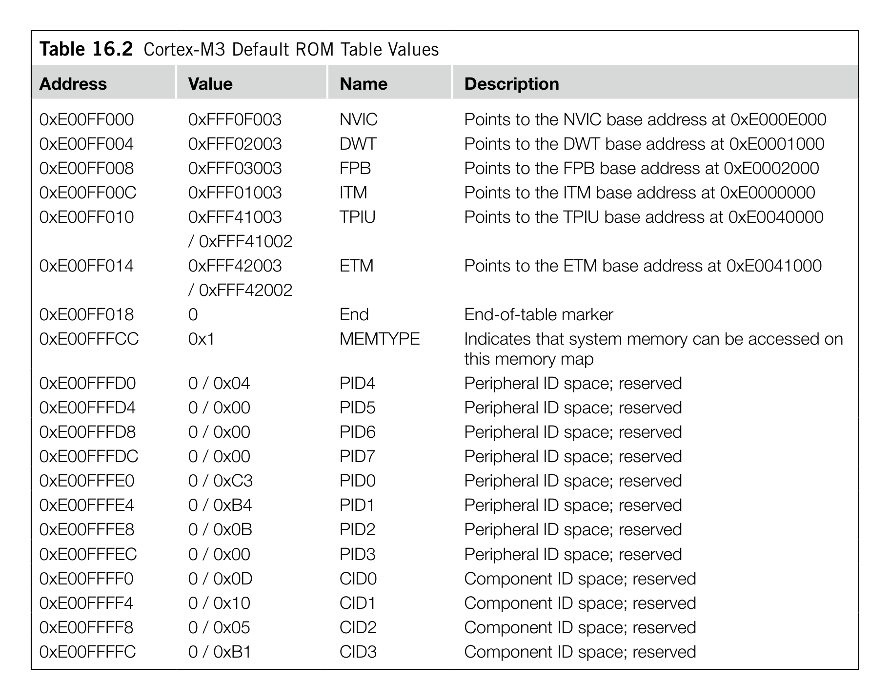
*Description*: Hardware reference table detailing register bit field settings, electrical operating limits, or memory configurations for Table 16.2.

> **Table 16.2**

266
CHAPTER 16  Debugging Components
designers modified the default debug components, the memory map for the debug devices could be dif-
ferent. To allow debug tools to detect the components in the debug system, a ROM table is included; it
provides information on the NVIC and debug block addresses.
The ROM table is located in address 0xE00FF000. Using contents in the ROM table, the memory
locations of system and debug components can be calculated. The debug tool can then check the ID
registers of the discovered components and determine what is available on the system.
For the Cortex-M3, the first entry in the ROM table (0xE00FF000) should contain the offset to
the NVIC memory location. (The default value in the ROM table’s first entry is 0xFFF0F003; bit[1:0]
means that the device exists and there is another entry in the ROM table following. The NVIC offset
can be calculated as 0xE00FF000 + 0xFFF0F000 = 0xE000E000.)
The default ROM table for the Cortex-M3 is shown in Table 16.2. However, because chip manufac-
turers can add, remove, or replace some of the optional debug components with other CoreSight debug
components, the value you find on your Cortex-M3 device could be different.
The lowest two bits of the value indicate whether the device exists. In normal cases, the NVIC,
DWT, and FPB should always be there, so the last two bits are always 1. However, the TPIU and the
Table 16.2  Cortex-M3 Default ROM Table Values
Address
Value
Name
Description
0xE00FF000
0xFFF0F003
NVIC
Points to the NVIC base address at 0xE000E000
0xE00FF004
0xFFF02003
DWT
Points to the DWT base address at 0xE0001000
0xE00FF008
0xFFF03003
FPB
Points to the FPB base address at 0xE0002000
0xE00FF00C
0xFFF01003
ITM
Points to the ITM base address at 0xE0000000
0xE00FF010
0xFFF41003
TPIU
Points to the TPIU base address at 0xE0040000
/ 0xFFF41002
0xE00FF014
0xFFF42003
ETM
Points to the ETM base address at 0xE0041000
/ 0xFFF42002
0xE00FF018
0
End
End-of-table marker
0xE00FFFCC
0x1
MEMTYPE
Indicates that system memory can be accessed on
this memory map
0xE00FFFD0
0 / 0x04
PID4
Peripheral ID space; reserved
0xE00FFFD4
0 / 0x00
PID5
Peripheral ID space; reserved
0xE00FFFD8
0 / 0x00
PID6
Peripheral ID space; reserved
0xE00FFFDC
0 / 0x00
PID7
Peripheral ID space; reserved
0xE00FFFE0
0 / 0xC3
PID0
Peripheral ID space; reserved
0xE00FFFE4
0 / 0xB4
PID1
Peripheral ID space; reserved
0xE00FFFE8
0 / 0x0B
PID2
Peripheral ID space; reserved
0xE00FFFEC
0 / 0x00
PID3
Peripheral ID space; reserved
0xE00FFFF0
0 / 0x0D
CID0
Component ID space; reserved
0xE00FFFF4
0 / 0x10
CID1
Component ID space; reserved
0xE00FFFF8
0 / 0x05
CID2
Component ID space; reserved
0xE00FFFFC
0 / 0xB1
CID3
Component ID space; reserved

<!-- Page 294 -->
### [PDF Page 294]

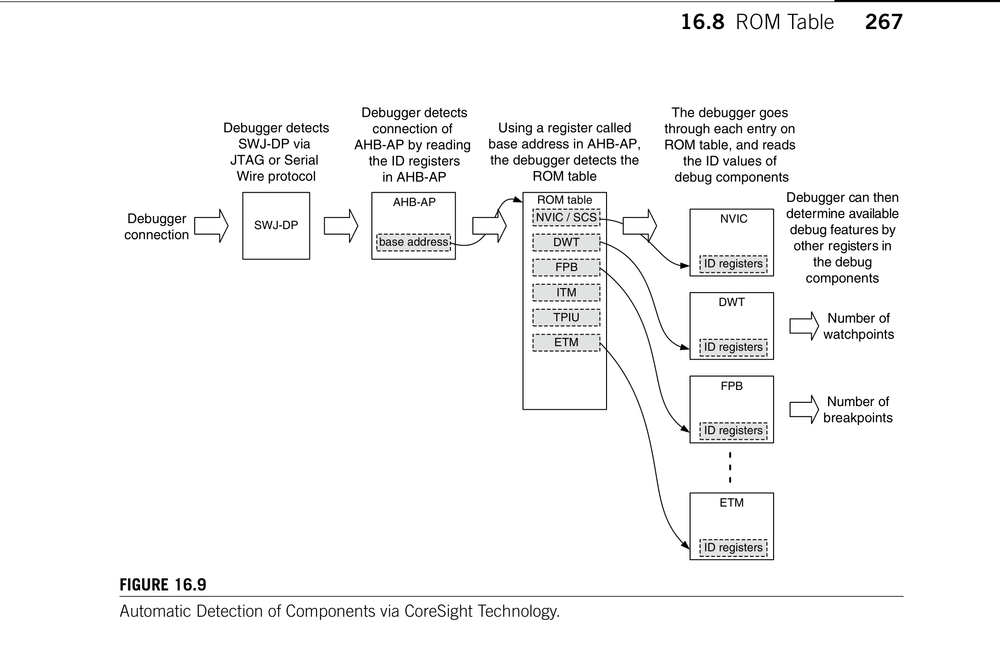
*Description*: Technical diagram and schematic illustration detailing hardware circuit topology, signal routing, and logic operations for Figure 16.9.

> **Figure 16.9**

267

## 16.8  ROM Table

ETM could be taken out by the chip manufacturer and might be replaced with other debugging compo-
nents from the CoreSight product family.
The upper part of the value indicates the address offset from the ROM table base address. For example,
NVIC address = 0xE00FF000 + 0xFFF0F000 = 0xE000E000 (truncated to 32-bit)
For debug tool development using CoreSight technology, it is necessary to determine the address
of debug components from the ROM table. Some Cortex-M3 devices might have a different setup of
the debug component connection that can result in additional base addresses. By calculating the cor-
rect device address from this ROM table, the debugger can determine the base address of the provided
debug component, and then from the component ID of those components the debugger can determine
the type of debug components that are available (see Figure 16.9).
Figure 16.9
Automatic Detection of Components via CoreSight Technology.
Debugger
connection
SWJ-DP
AHB-AP
base address
Debugger detects
SWJ-DP via
JTAG or Serial
Wire protocol
Debugger detects
connection of
AHB-AP by reading
the ID registers
in AHB-AP
ROM table
Using a register called
base address in AHB-AP,
the debugger detects the
ROM table
NVIC / SCS
DWT
FPB
ITM
TPIU
ETM
The debugger goes
through each entry on
ROM table, and reads
the ID values of
debug components
NVIC
ID registers
DWT
ID registers
FPB
Number of
breakpoints
Number of
watchpoints
Debugger can then
determine available
debug features by
other registers in
the debug
components
ID registers
ETM
ID registers

<!-- Page 295 -->
### [PDF Page 295]

This page intentionally left blank

