# Chapter
17. Getting Started with the Cortex-M3 Processor

> **Source PDF**: THE_DEFINITIVE_GUIDE_TO_THE_ARM_CORTEX-МЗ_Stellaris_MCU_9000Series_TEINSTRUMENTS_ARM_SECOND_EDITION.pdf  
> **PDF Page Range**: 296 - 309

---

<!-- Page 296 -->
### [PDF Page 296]

269
Copyright © 2010, Elsevier Inc. All rights reserved.
DOI: 10.1016/B978-0-12-382091-4.00023-2
CHAPTER
In This Chapter
Choosing a Cortex-M3 Product............................................................................................................... 269
Development Tools................................................................................................................................ 270
Differences between the Cortex-M3 Revision 0 and Revision 1................................................................ 272
Differences between the Cortex-M3 Revision 1 and Revision 2................................................................ 274
Benefits and Effects of the Revision 2 New Features............................................................................... 277
Differences between the Cortex-M3 and Cortex-M0................................................................................. 278
Getting Started with
the Cortex-M3 Processor
17

## 17.1  Choosing a Cortex-M3 Product

Aside from memory, peripheral options, and operation speed, a number of other factors make one
Cortex™-M3 product different from another. The Cortex-M3 design supplied by ARM contains a num-
ber of features that are configurable, such as
Number of external interrupts
•
Number of interrupt priority levels (width of priority-level registers)
•
With Memory Protection Unit (MPU) or without MPU
•
With Embedded Trace Macrocell (ETM) or without ETM
•
Choice of debug interface (Serial-Wire (SW), Joint Test Action Group (JTAG), or both)
•
In most projects, the features and specification of the microcontroller will certainly affect your
choice of Cortex-M3 product. For example,
•
Peripherals: For many applications, peripheral support is the main criterion. More peripherals
might be good, but this also affects the microcontroller’s power consumption and price.
•
Memory: Cortex-M3 microcontrollers can have Flash memory from several kilobytes to several
megabytes. In addition, the size of the internal memory might also be important. Usually these
factors will have a direct impact on the price.
•
Clock speed: The Cortex-M3 design from ARM can easily reach more than 100  MHz, even
in 0.18  µm processes. However, manufacturers might specify a lower operation speed due to
limitations of memory access speed.

<!-- Page 297 -->
### [PDF Page 297]

270
CHAPTER 17  Getting Started with Cortex-M3 Processor
•
Footprint: The Cortex-M3 can be available in many different packages, depending on the chip
manufacturer’s decision. Many Cortex-M3 devices are available in low pin count packages, making
them ideal for low-cost manufacturing environments.
Currently, a number of microcontroller vendors are already shipping Cortex-M3-based microcon-
trollers, and a number of other vendors will also soon be shipping Cortex-M3 products. Here, we list
a number of them:
Texas Instruments (formerly LuminaryMicro): The Stellaris Cortex-M3 microcontroller ­product range
has over 100 devices in the family, including devices with 10/100 Ethernet MAC and PHY, USB, CAN,
SPI, I2C, I2S, and so on.
ST Microelectronics: The ST’s Cortex-M3 products included several product lines as follows:
STM32 connectivity line for feature-packed device supporting USB On-The-Go (USB OTG),
•
Ethernet, and memory cards.
STM32L for ultralow-power applications with analog and
•
LCD interface support.
STM32 value line for low-cost applications.
•
Toshiba: The TX03 product series targets various application areas including industrial and automotive
applications, consumer applications, and supporting interfaces, including USB, CAN, Ethernet, and
analog interface on a number of devices.
Atmel: The SAM3U product family supports high-speed USB interface, dual bank flash, communica-
tion interface (SPI, Secure Digital Input Output (SDIO), and Serial Synchronous Controller (SSC)),
memory card interface, as well as ADC.
Energy Micro: The EFM®32 is a highly energy efficient product family with innovative peripherals that
can react and respond without central processing unit (CPU) intervention. Interface support includes
I2C, LCD, ADC, DAC, and special features like Advanced Encryption Standard (AES) support.
NXP: There are two Cortex-M3 product lines in the NXP LPC® product family: the LPC1700 product
line and the LPC1300 product line. The LPC1700 is targeted at high-performance application with
support for fast communication, motor control, and industrial control (e.g., USB, CAN, I2S, and
DAC). LPC1300 is targeted at low-power and mixed signal applications.

## 17.2  Development Tools

To start using the Cortex-M3, you’ll need a number of tools. Typically, they will include the ­following:
A compiler and/or assembler
•
: Software to compile your C or assembler application codes. Almost
all C compiler suites come with an assembler.
•
Instruction set simulator: Software to simulate the instruction execution for debugging in early
stages of software development. This is optional.
In-circuit emulator (ICE) or debug probe
•
: A hardware device to connect your debug host (usually
a personal computer) to the target circuit. The interface can be either JTAG or SW.
A development board
•
: A circuit board that contains the microcontroller.
Trace capture
•
: An optional hardware and software package for capturing instruction traces or
output from Data Watchpoint and Trace (DWT) and Instrumentation Trace Macrocell (ITM)

<!-- Page 298 -->
### [PDF Page 298]

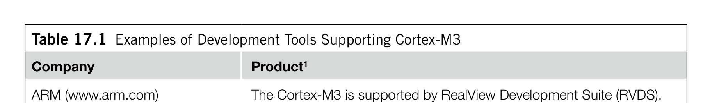
*Description*: Hardware reference table detailing register bit field settings, electrical operating limits, or memory configurations for Table 17.1.

> **Table 17.1**

271

## 17.2  Development Tools

modules that outputs them to human-readable format. Sometimes the trace capture feature can be
build-in as a part of the ICE.
•
An embedded operating system: An operating system (OS) running on the microcontroller. This is
optional; many applications do not require an OS.
17.2.1  C Compiler and Debuggers
A number of C compiler suites and development tools are already available for the Cortex-M3 (see
Table 17.1).
Table 17.1  Examples of Development Tools Supporting Cortex-M3
Company
Product1
ARM (www.arm.com)
The Cortex-M3 is supported by RealView Development Suite (RVDS).
RealView-ICE (RVI) is available for connecting debug target to debug
environment. Note that older products, such as ARM Development
Suite (ADS) and Software Development Toolkit (SDT), do not support the
Cortex-M3.
Keil, an ARM company
(www.keil.com)
The Cortex-M3 is supported in Microcontroller Development Kit (MDK-
ARM). The ULINK™ USB-JTAG adapters are available for connecting
debug target to debug Integrated Development Environment (IDE).
CodeSourcery
(www.codesourcery.com)
GNU Tool Chain for ARM processors is now available at www
.codesourcery.com/gnu_toolchains/arm/
Rowley Associates
(www.rowley.co.uk)
CrossWorks for ARM is a GNU C compiler (GCC)-based development
suite supporting the Cortex-M3 (www.rowley.co.uk/arm/index.htm).
IAR Systems (www.iar.com)
IAR Embedded Workbench for ARM and Cortex provides a C/C++
compiler and debug environment (v4.40 or above). A KickStart kit is
also available, based on the Luminary Micro LM3S102 microcontroller,
including debugger and a J-Link Debug Probe for connecting the target
board to debug IDE.
Lauterbach
(www.lauterbach.com)
JTAG debugger and trace utilities are available from Lauterbach.
Segger (www.segger.com)
Segger J-Link and J-Trace support Cortex-M3 microcontrollers for
debug and trace operations.
Signum (www.signum.com)
JTAGJet and JTAGJet-Trace are in-circuit debuggers supporting
Cortex-M3 microcontrollers for debug and trace operations.
Code Red
(www.code-red-tech.com)
Red Suite™ 2 provides a GCC-based development environment, and
Red Probe is for debug operations supporting JTAG and SW protocols.
National Instrument
(www.ni.com)
LabVIEW Embedded Module for ARM Microcontroller
Raisonance
(www.raisonance.com)
RKit-ARM Software Toolset is a GCC-based toolchain for ARM
Microcontroller. Raisonance also provides debugger (RLink) and starter
kit (STM32 Primer)
GNU GCC
(www.gcc.gnu.org)
The support for the Cortex-M3 processor has been added to the GCC.
1Product names are registered trademarks of the companies listed on the left-hand side of the table.

<!-- Page 299 -->
### [PDF Page 299]

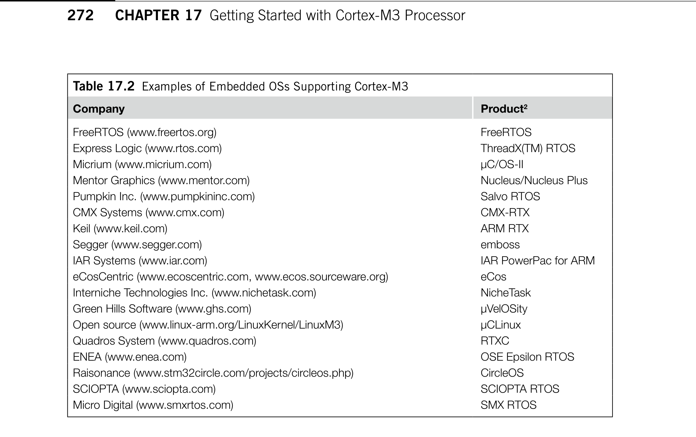
*Description*: Hardware reference table detailing register bit field settings, electrical operating limits, or memory configurations for Table 17.2.

> **Table 17.2**

272
CHAPTER 17  Getting Started with Cortex-M3 Processor
Free GCC-based C compilers are available from Gnu’s Not Unix (GNU) web site and companies
including Code­Sourcery and Raisonance. You can also get evaluation versions of some commercial
tools, such as Keil MDK-ARM, which are fully functional.
17.2.2  Embedded OS Support
Many applications require an OS to handle multithreading and resource management. Many OSs are
developed for the embedded market. Currently, a number of these OSs are supported on the Cortex-M3
(see Table 17.2).

## 17.3  Differences between the Cortex-M3 Revision 0 and Revision 1

Early versions of Cortex-M3 products were based on revision 0 of the Cortex-M3 processor. Products
based on Cortex-M3 revision 1 have been available since the third quarter of 2006. When this book was
first published, all new Cortex-M3-based products should have been based on revision 1. Revision 2
of the Cortex-M3 was released in 2008 with products based on this release available in 2009. It could
be important to know the revision of the chip you are using because there are a number of changes and
improvements in these releases.
Table 17.2  Examples of Embedded OSs Supporting Cortex-M3
Company
Product2
FreeRTOS (www.freertos.org)
FreeRTOS
Express Logic (www.rtos.com)
ThreadX(TM) RTOS
Micrium (www.micrium.com)
µC/OS-II
Mentor Graphics (www.mentor.com)
Nucleus/Nucleus Plus
Pumpkin Inc. (www.pumpkininc.com)
Salvo RTOS
CMX Systems (www.cmx.com)
CMX-RTX
Keil (www.keil.com)
ARM RTX
Segger (www.segger.com)
emboss
IAR Systems (www.iar.com)
IAR PowerPac for ARM
eCosCentric (www.ecoscentric.com, www.ecos.sourceware.org)
eCos
Interniche Technologies Inc. (www.nichetask.com)
NicheTask
Green Hills Software (www.ghs.com)
µVelOSity
Open source (www.linux-arm.org/LinuxKernel/LinuxM3)
µCLinux
Quadros System (www.quadros.com)
RTXC
ENEA (www.enea.com)
OSE Epsilon RTOS
Raisonance (www.stm32circle.com/projects/circleos.php)
CircleOS
SCIOPTA (www.sciopta.com)
SCIOPTA RTOS
Micro Digital (www.smxrtos.com)
SMX RTOS
2Product names are registered trademarks of the companies listed on the left-hand side of the table.

<!-- Page 300 -->
### [PDF Page 300]

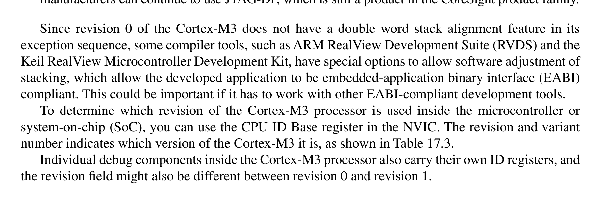
*Description*: Hardware reference table detailing register bit field settings, electrical operating limits, or memory configurations for Table 17.3.

> **Table 17.3**

273

## 17.3  Differences between the Cortex-M3 Revision 0 and Revision 1

For revision 1, the visible changes in the programmer’s model and development features include
the following:
From revision 1, the stacking of registers when an exception occurs can be configured such that it is
•
forced to begin from a double word aligned memory address. This is done by setting the STKALIGN
bit in the Nested Vectored Interrupt Controller (NVIC) Configuration Control register.
For that reason, the NVIC Configuration Control register has the STKALIGN bit.
•
•
Release r1p1 includes the new AUXFAULT (Auxiliary Fault) status register (optional).
Additional features include data value matching added to the DWT.
•
ID register value changes due to the revision fields update.
•
Changes invisible to end users include the following:
The memory attribute for Code memory space is hardwired to cacheable, allocated, nonbufferable,
•
and nonshareable. This affects the I-Code Advanced High-Performance Bus (AHB) and the
D-Code AHB interface but not the system bus interface. The change only affect caching and
buffering behavior outside the processor (e.g. level 2 cache or memory controllers with cache).
The processor internal write buffer behavior does not change and this modification has no effect
on most microcontroller products.
Supports bus multiplexing operation mode between I-Code AHB and D-Code AHB. Under this
•
operation mode, the I-Code and D-Code buses can be merged using a simple bus multiplexer (the
previous solution used an ADK BusMatrix component). This can lower the total gate count.
Added new output port for connection to the AHB Trace Macrocell (HTM, a CoreSight debug
•
component from ARM) for complex data trace operations.
Debug components or debug control registers can be accessed even during system reset; only
•
during power-on reset are those registers inaccessible.
The Trace Port Interface Unit (TPIU) has
•
Serial-Wire Viewer (SWV) operation mode support. This
allows trace information to be captured with low-cost hardware.
In revision 1, the VECTPENDING field in the NVIC Interrupt Control and Status register can be affec­
•
ted by the C_MASKINTS bit in the NVIC Debug Halting Control and Status register. If C_MASKINTS
is set, the VECTPENDING value could be zero if the mask is masking a pending interrupt.
The JTAG-DP debug interface module has been changed to the SW JTAG-Debug Port (SWJ-DP)
•
module (see the next section, “Revision 1 Change: Moving from JTAG-DP to SWJ-DP”). Chip
manufacturers can continue to use JTAG-DP, which is still a product in the CoreSight product family.
Since revision 0 of the Cortex-M3 does not have a double word stack alignment feature in its
exception sequence, some compiler tools, such as ARM RealView Development Suite (RVDS) and the
Keil RealView Microcontroller Development Kit, have special options to allow software adjustment of
stacking, which allow the developed application to be embedded-application binary interface (EABI)
compliant. This could be important if it has to work with other EABI-compliant development tools.
To determine which revision of the Cortex-M3 processor is used inside the microcontroller or
­system-on-chip (SoC), you can use the CPU ID Base register in the NVIC. The revision and variant
number indicates which version of the Cortex-M3 it is, as shown in Table 17.3.
Individual debug components inside the Cortex-M3 processor also carry their own ID registers, and
the revision field might also be different between revision 0 and revision 1.

<!-- Page 301 -->
### [PDF Page 301]

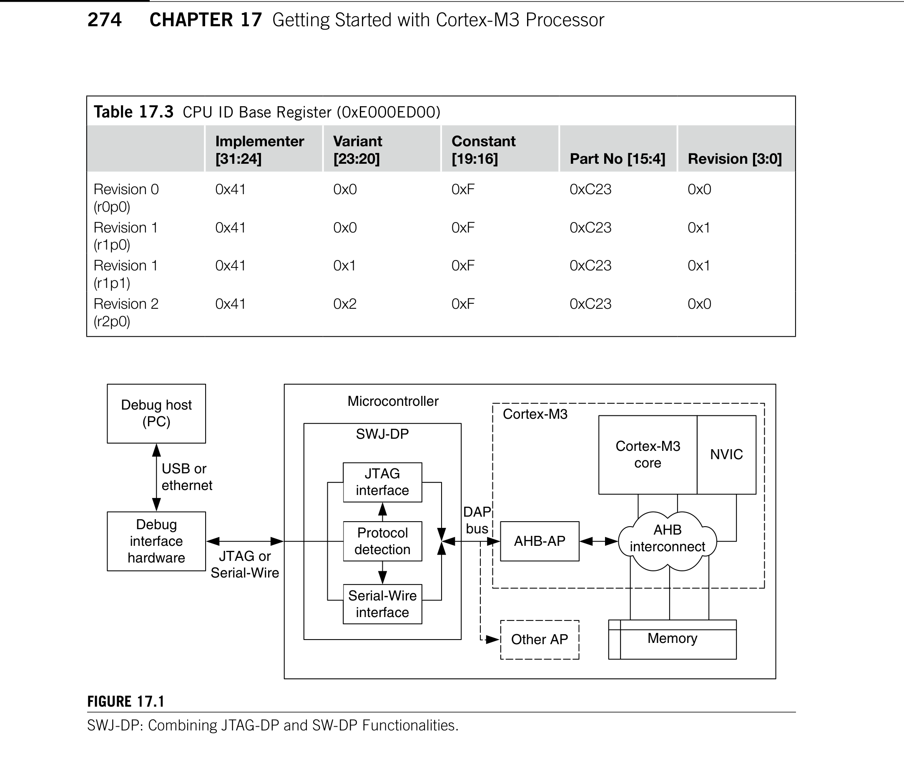
*Description*: Technical diagram and schematic illustration detailing hardware circuit topology, signal routing, and logic operations for Figure 17.1.

> **Figure 17.1**

*Description*: Hardware reference table detailing register bit field settings, electrical operating limits, or memory configurations for Table 17.3.

> **Table 17.3**

274
CHAPTER 17  Getting Started with Cortex-M3 Processor
17.3.1  Revision 1 Change: Moving from JTAG-DP to SWJ-DP
The JTAG-DP provided in some earlier Cortex-M3 products is replaced with the SWJ-DP. The
SWJ-DP combines the function of the SW-DP and the JTAG-DP and with protocol detection (see
­Figure 17.1). Using this component, a Cortex-M3 device can support debugging with both SW and
JTAG ­interfaces.

## 17.4  Differences between the Cortex-M3 Revision 1 and Revision 2

In mid-2008, Revision 2 (r2p0) of the Cortex-M3 was released to silicon vendors. Products using revi-
sion 2 arrived on the market in 2009. Revision 2 has a number of new features, most of them targeted
Table 17.3  CPU ID Base Register (0xE000ED00)
Implementer
[31:24]
Variant
[23:20]
Constant
[19:16]
Part No [15:4]
Revision [3:0]
Revision 0
(r0p0)
0x41
0x0
0xF
0xC23
0x0
Revision 1
(r1p0)
0x41
0x0
0xF
0xC23
0x1
Revision 1
(r1p1)
0x41
0x1
0xF
0xC23
0x1
Revision 2
(r2p0)
0x41
0x2
0xF
0xC23
0x0
Figure 17.1
SWJ-DP: Combining JTAG-DP and SW-DP Functionalities.
Debug host
(PC)
Debug
interface
hardware
USB or
ethernet
JTAG or
Serial-Wire
Microcontroller
AHB-AP
Other AP
Cortex-M3
core
NVIC
Memory
AHB
interconnect
Cortex-M3
DAP
bus
JTAG
interface
Serial-Wire
interface
Protocol
detection
SWJ-DP

<!-- Page 302 -->
### [PDF Page 302]

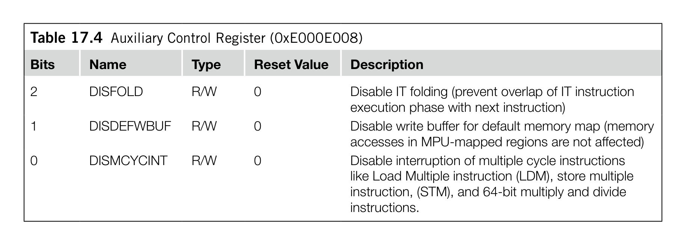
*Description*: Hardware reference table detailing register bit field settings, electrical operating limits, or memory configurations for Table 17.4.

> **Table 17.4**

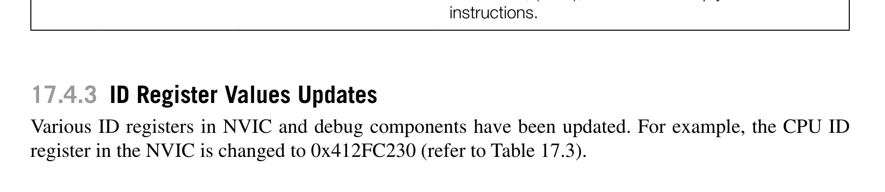
*Description*: Hardware reference table detailing register bit field settings, electrical operating limits, or memory configurations for Table 17.3.

> **Table 17.3**

275

## 17.4  Differences between the Cortex-M3 Revision 1 and Revision 2

at reducing power consumption and offering better debug flexibility. Changes that are visible in the
programmer’s model include the following:
17.4.1  Default Configuration of Double Word Stack Alignment
The double word stack alignment feature for exception stacking is now enabled by default (silicon
vendors may select to retain revision 1 behavior). This reduces the start up overhead for most C appli-
cations (removing the need to set the STKALIGN bit in the NVIC Configuration Control register).
17.4.2  Auxiliary Control Register
An Auxiliary Control register is added to NVIC to allow fine tuning of the processor behavior. For
example, for debugging purposes, it is possible to switch off the write buffers in Cortex-M3 so that bus
faults will be synchronous to the memory access instruction (precise). In this way, the faulting instruc-
tion can be pinpointed from the stacked return address (stacked PC) easily.
The details of the Auxiliary Control register are shown in Table 17.4.
17.4.3  ID Register Values Updates
Various ID registers in NVIC and debug components have been updated. For example, the CPU ID
register in the NVIC is changed to 0x412FC230 (refer to Table 17.3).
17.4.4  Debug Features
For debug features, revision 2 has a number of improvements as follows:
Watchpoint triggered data trace in the DWT now supports tracing of read transfers only and write
•
transfers only. This can reduce the trace data bandwidth required as you can specify the data are
traced only when it is changed, or only when the data are read.
Higher flexibility in implementation of debug features. For example, the number of breakpoints and
•
watchpoints can be reduced to reduce the size of the design in very low-power designs.
Better support in multiprocessor debugging. A new interface is introduced to allow simultaneous
•
restart and single stepping of multiple processors (not visible in the programmer’s view).
Table 17.4  Auxiliary Control Register (0xE000E008)
Bits
Name
Type
Reset Value
Description
2
DISFOLD
R/W
0
Disable IT folding (prevent overlap of IT instruction
execution phase with next instruction)
1
DISDEFWBUF
R/W
0
Disable write buffer for default memory map (memory
accesses in MPU-mapped regions are not affected)
0
DISMCYCINT
R/W
0
Disable interruption of multiple cycle instructions
like Load Multiple instruction (LDM), store multiple
instruction, (STM), and 64-bit multiply and divide
instructions.

<!-- Page 303 -->
### [PDF Page 303]

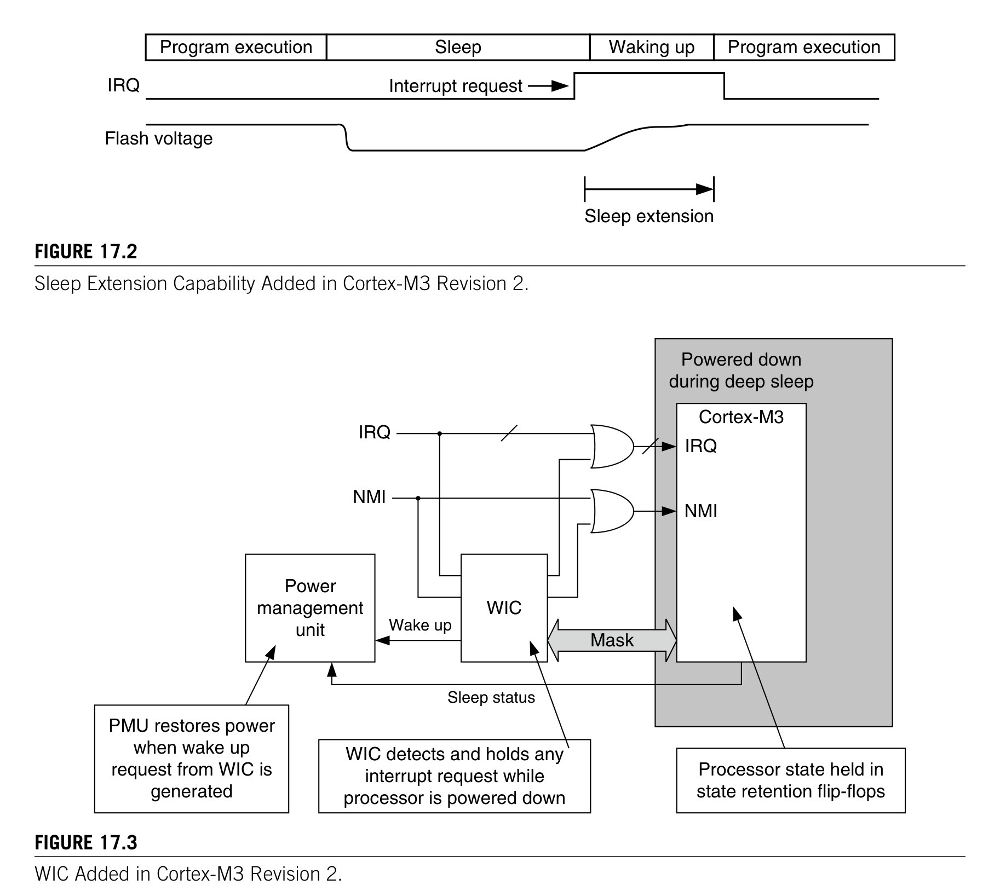
*Description*: Technical diagram and schematic illustration detailing hardware circuit topology, signal routing, and logic operations for Figure 17.2.

> **Figure 17.2**

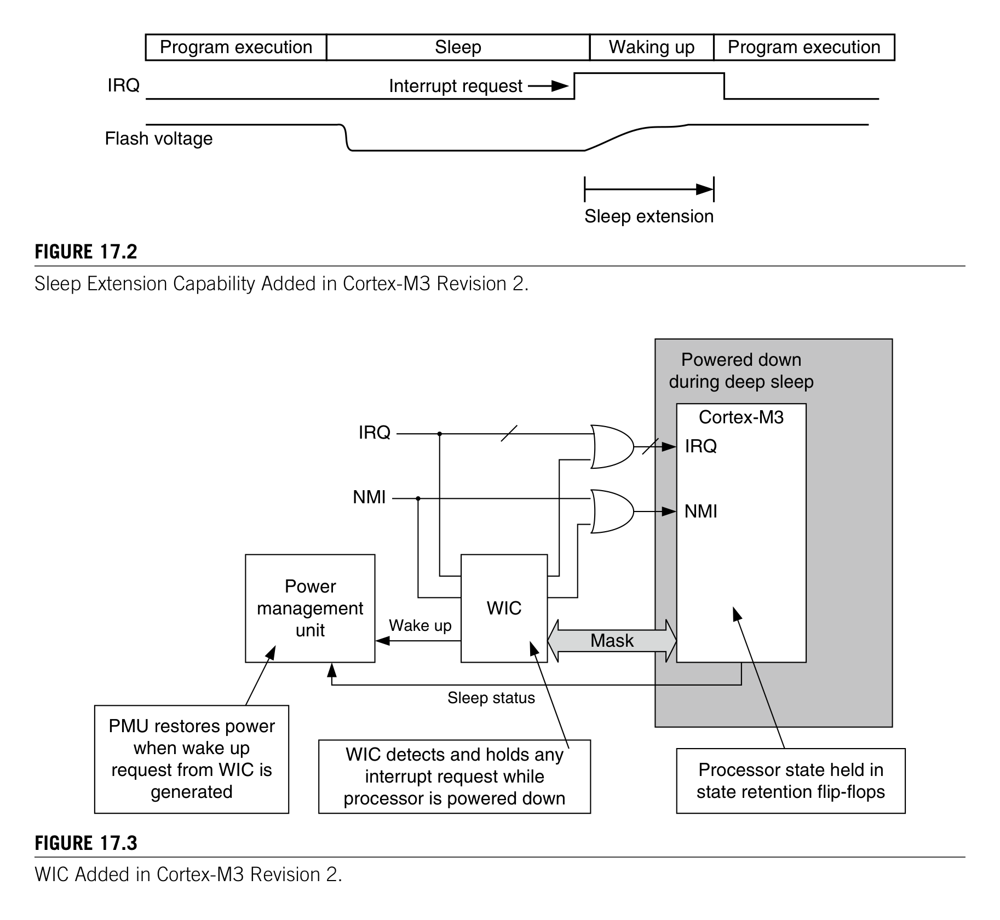
*Description*: Technical diagram and schematic illustration detailing hardware circuit topology, signal routing, and logic operations for Figure 17.3.

> **Figure 17.3**

276
CHAPTER 17  Getting Started with Cortex-M3 Processor
17.4.5  Sleep Features
On the system design level, the existing sleep features have also improved (see Figure 17.2). In ­revision 2, it
is possible for the wake up of the processor to be delayed. This allows more parts of the chip to be powered
down, and the power management system can resume the program execution when the system is ready.
This is needed in some microcontroller designs where some parts of the system are powered down during
sleep, as it might take some time for the voltage supply to be stabilized after power is restored.
Aside from sleep extension, new technology has been used to allow the design to push the
power consumption lower. In previous versions of the Cortex-M3, to allow the processor to wake
up from sleep mode via interrupts, the free running clock of the core needed to be active. Although
the free running clock only drives a small part of the system, it is still better to have this turned off
completely.
Figure 17.2
Sleep Extension Capability Added in Cortex-M3 Revision 2.
Program execution
Sleep
Waking up
Program execution
Interrupt request
IRQ
Flash voltage
Sleep extension
Figure 17.3
WIC Added in Cortex-M3 Revision 2.
Cortex-M3
IRQ
NMI
WIC
IRQ
NMI
Mask
Power
management
unit
Wake up
Sleep status
Powered down
during deep sleep
Processor state held in
state retention flip-flops
WIC detects and holds any
interrupt request while
processor is powered down
PMU restores power
when wake up
request from WIC is
generated

<!-- Page 304 -->
### [PDF Page 304]

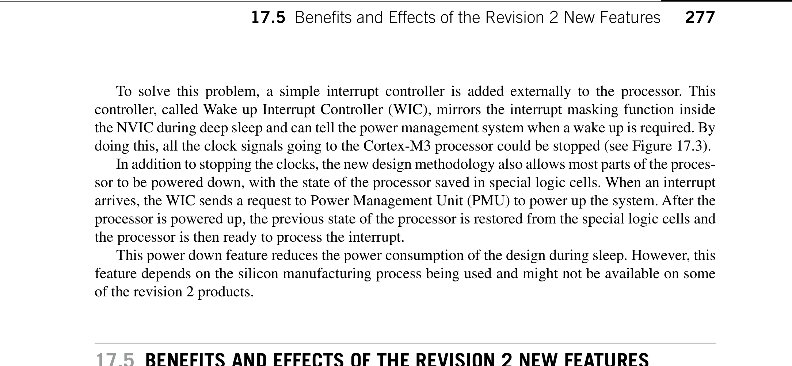
*Description*: Technical diagram and schematic illustration detailing hardware circuit topology, signal routing, and logic operations for Figure 17.3.

> **Figure 17.3**

277

## 17.5  Benefits and Effects of the Revision 2 New Features

To solve this problem, a simple interrupt controller is added externally to the processor. This
­controller, called Wake up Interrupt Controller (WIC), mirrors the interrupt masking function inside
the NVIC during deep sleep and can tell the power management system when a wake up is required. By
doing this, all the clock signals going to the Cortex-M3 processor could be stopped (see Figure 17.3).
In addition to stopping the clocks, the new design methodology also allows most parts of the proces-
sor to be powered down, with the state of the processor saved in special logic cells. When an interrupt
arrives, the WIC sends a request to Power Management Unit (PMU) to power up the system. After the
processor is powered up, the previous state of the processor is restored from the special logic cells and
the processor is then ready to process the interrupt.
This power down feature reduces the power consumption of the design during sleep. However, this
feature depends on the silicon manufacturing process being used and might not be available on some
of the revision 2 products.

## 17.5  Benefits and Effects of the Revision 2 New Features

So what does that means in terms of developing embedded product development?
First, it means lower power consumption for the embedded products and better battery life. When
WIC mode deep sleep is used, only a very small portion of the design needs to be active. Also, in
designs targeted at extremely low power, the silicon vendor can reduce the size of the design by reduc-
ing the number of breakpoint and watchpoints.
Second, it provides better flexibility in debugging and troubleshooting. Beside from the improved data
trace feature that can be used by debugger, we can also use the new Auxiliary Control register to force
write transfers to be nonbufferable to pinpoint faulting instruction or disable interrupts during multiple
cycle instructions so that each multiple load/store instruction will be completed before the exception is
taken, this can make the analysis of memory contents easier. For systems of multiple ­Cortex-M3, revi-
sion 2 also brings the capability of simultaneous restarting and stepping of multiple cores.
In addition, revision 2 has a number of internal optimizations to allow higher performance and
better interface features. This allows silicon vendors to develop faster Cortex-M3 products with more

### features. However, there are a few things that embedded programmers need to be aware of. They are

as ­follows:
Double word stack alignment for exception stack frame
1.
: The exception stack frames will be aligned
to double word memory location by default. Some assembly applications written for revision 0 or
revision 1 that use stack to transfer data to exception handlers could be affected. The exception
handler should determine if stack alignment has been carried out by reading the bit 9 of the stacked
Program Status register (PSR) in the stack frame, then it can determine the address of the stacked
data before the exception. Alternatively, the application can program the STKALIGN bit to 0 to get
the same stacking behavior as revision 0 and revision 1. Applications compliant to EABI standard
(e.g., C-Code compiled using an EABI compliant compiler) are not affected.

# 2.	 SYSTICK Timer might stop in deep sleep: If the Cortex-M3 microcontroller included power down

feature or the core clocks are completely stopped for deep sleep mode, then the SYSTICK Timer
might not be running during deep sleep. Embedded applications that use OS will need to use a
timer externally to the processor core to wake up the processor for event scheduling.

<!-- Page 305 -->
### [PDF Page 305]

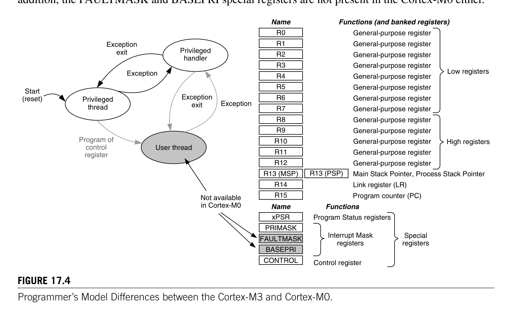
*Description*: Technical diagram and schematic illustration detailing hardware circuit topology, signal routing, and logic operations for Figure 17.4.

> **Figure 17.4**

278
CHAPTER 17  Getting Started with Cortex-M3 Processor

# 3.	 Debug and power-down feature: The new power down feature is disabled when the processor is

connected to a debugger. This is because the debugger needs to access to the processor’s debug
registers during a debug session. During a debug session, the core will still need to be able to be
halted or enter sleep modes, but it should not trigger the power down sequence even if the power
down feature is enabled. For testing of power down operations, the device under test should be
disconnected from the debugger.

## 17.6  Differences between the Cortex-M3 and Cortex-M0

Some of you might have heard of the ARM Cortex-M0 processor. The programmer’s model of the
­Cortex-M0 processor is quite similar to the Cortex-M3. However, it is smaller, supports fewer instructions
and is based on the Von Neumann architecture. The Cortex-M0 processor is developed for ultralow-power
designs and mixed signal applications, where logic gate count is critical. In minimum ­configuration, the
Cortex-M0 processor is only 12 k logic gates in size, smaller than most 16-bit processors and some of
the high-end 8-bit processors. However, the performance of the Cortex-M0 is 0.9 DMIPS per MHz, more
than double of most 16-bit processors, and nearly 10 times of modern 8-bit microcontrollers. This makes
the Cortex-M0 the most energy efficient 32-bit processor for microcontrollers.
17.6.1  Programmer’s Model
There are a number of differences between the programmer’s model of Cortex-M3 and Cortex-M0
­processors (see Figure 17.4). The unprivileged level is only available in the Cortex-M3 processor. In
addition, the FAULTMASK and BASEPRI special registers are not present in the Cortex-M0 either.
Figure 17.4
Programmer’s Model Differences between the Cortex-M3 and Cortex-M0.
Privileged
handler
User thread
Privileged
thread
Start
(reset)
Exception
Exception
exit
Exception
Exception
exit
Program of
control
register
Not available
in Cortex-M0
Functions (and banked registers)
R0
R1
R2
R3
R4
R5
R6
R7
R8
R9
R10
R11
R12
R13 (MSP)
R14
R15
R13 (PSP)
General-purpose register
General-purpose register
General-purpose register
General-purpose register
General-purpose register
General-purpose register
General-purpose register
General-purpose register
General-purpose register
General-purpose register
General-purpose register
General-purpose register
General-purpose register
Main Stack Pointer, Process Stack Pointer
Link register (LR)
Program counter (PC)
Low registers
High registers
Name
xPSR
PRIMASK
FAULTMASK
BASEPRI
Functions
Program Status registers
Interrupt Mask
registers
Control register
CONTROL
Special
registers
Name

<!-- Page 306 -->
### [PDF Page 306]

279

## 17.6  Differences between the Cortex-M3 and Cortex-M0

The xPSR also has some minor differences. The Q bit in the Application Program Status ­register
(APSR) and the Interrupt Continuable Instruction/IF-THEN (ICI/IT) bit fields in the Execution
­Program Status register (EPSR) are not available in the Cortex-M0. The Cortex-M0 processor does
not support the IT instruction block, and interruption of a multiple load or store instruction will result
in the instruction being cancelled and restarted when the interrupt handler completes.
17.6.2  Exceptions and NVIC
The exception operation of the Cortex-M0 processor is the same as in the Cortex-M3. The interrupts
and exceptions are vectored, and the NVIC handles nested exceptions automatically. Some of the sys-
tem exceptions on the Cortex-M3 are not available on the Cortex-M0 processor. These include the bus
fault, usage fault, memory management fault, and the debug monitor exceptions. If a fault occurs in a
Cortex-M0 application, the hard fault handler is executed. Some of the fault status registers available
on the Cortex-M3 are also not available on the Cortex-M0.
The priority registers in the Cortex-M0 are only 2 bits. As a result, only four priority levels are
available for interrupts and system exceptions with configurable priority. There is no dynamic priority
switching support in the Cortex-M0 processor, so the priority of interrupt and exceptions are normally
programmed at the beginning of the application and remain unchanged afterwards. The NVIC in the
Cortex-M0 has a similar programmer’s model compared with the one in the Cortex-M3. However,
the registers are word accessible only. So if the priority level of an interrupt needs to be changed, it
might be necessary to read the whole word, modify the priority level for the interrupt, and then write
it back. A number of registers in the Cortex-M3 NVIC are also not available in the Cortex-M0 NVIC
as ­follows:
•
Vector Table Offset register: The vector table is fixed at address 0x0. However, microcontrollers
might feature memory map switching features to allow changing of exception vectors at run time.
Software Trigger Interrupt register
•
: To generate an exception by software, the Interrupt Set Pending
register is used instead.
Interrupt Active Status register
•
•
Interrupt Controller Type register
17.6.3  Instruction Set
The Cortex-M0 processor is based on ARMv6-M architecture. It supports 16-bit Thumb® instructions
and a few 32-bit Thumb instructions (branch with link [BL], instruction synchronization barrier [ISB],
data synchronization barrier [DSB], data memory barrier [DMB], MRS, and MSR). A number of
instructions in Cortex-M3 are not supported on the Cortex-M0. For example,
IT instruction block
•
Compare and branch (compare and branch if zero [CBZ] and compare and branch if nonzero
•
[CBNZ])
Multiple accumulate instructions (multiply accumulate [MLA], multiply and subtract [MLS],
•
signed multiply accumulate long [SMLAL], and unsigned multiply accumulate long [UMLAL])
and multiply instructions with 64-bit results (unsigned multiply long [UMULL] and signed
multiply long [SMULL])

<!-- Page 307 -->
### [PDF Page 307]

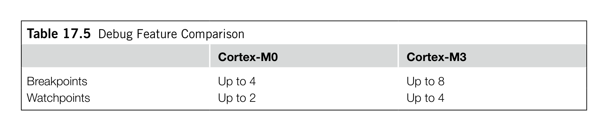
*Description*: Hardware reference table detailing register bit field settings, electrical operating limits, or memory configurations for Table 17.5.

> **Table 17.5**

280
CHAPTER 17  Getting Started with Cortex-M3 Processor
Hardware divide instructions (unsigned divide [UDIV] and signed divide [SDIV]) and saturation
•
(signed saturate [SSAT] and unsigned saturate [USAT])
Table branch instruction (Table Branch Half word [TBH] and Table Branch Byte [TBB])
•
Exclusive access instructions
•
Bit field processing instructions (unsigned bit field extract [UBFX], signed bit field extract [SBFX],
•
Bit Field Insert [BFI], and Bit Field Clear [BFC])
Some data processing instructions (count leading zero [CLZ], rotate right extended [RRX], and
•
reverse bit [RBIT])
Load/store instructions with address modes or register combinations that are only supported with
•
32-bit instruction format
Load/store instructions with translate
•
(load word data from memory to register with unprivileged
access [LDRT] and store word to memory with unprivileged access [STRT])
17.6.4  Memory System Features
Both the memory maps from the Cortex-M3 and Cortex-M0 are divided into a number of regions
including CODE, SRAM, peripherals, and so on. However, a number of memory system features on
the Cortex-M3 are not available in the Cortex-M0. These include the following:
Bit band regions
•
Unaligned transfer support
•
MPU (optional in Cortex-M3 processor)
•
Exclusive accesses
•
17.6.5  Debug Features
The Cortex-M0 processor does not include any trace feature (no ETM, ITM). When compared with the
Cortex-M3, it supports a smaller number of breakpoints and watchpoints. (See Table 17.5.)
In most cases, the debug connection of Cortex-M0 microcontrollers only supports one type of
debug communication protocol (SW debug or JTAG). While for Cortex-M3 microcontroller products,
the debug interface normally supports both SW and JTAG protocols and allows dynamic switching
between the two.
17.6.6  Compatibility
The Cortex-M0 processor is upwards compatible with the Cortex-M3 processor. Programs compiled
for the Cortex-M0 can be used on Cortex-M3 directly. However, programs compiled for Cortex-M3
Table 17.5  Debug Feature Comparison
Cortex-M0
Cortex-M3
Breakpoints
Up to 4
Up to 8
Watchpoints
Up to 2
Up to 4

<!-- Page 308 -->
### [PDF Page 308]

*Description*: Technical diagram and schematic illustration detailing hardware circuit topology, signal routing, and logic operations for Figure 17.5.

> **Figure 17.5**

281

## 17.6  Differences between the Cortex-M3 and Cortex-M0

cannot be used on Cortex-M0 (see Figure 17.5). Due to similarities between the two processors, most
microcontroller applications can be written so that they can be used on either processor (provided that
the memory map and the peripherals are compatible).
If an embedded application is to be used on both Cortex-M3 and Cortex-M0 products, there are
various areas we need to pay attention to so that the application can be compatible with both processors
as follows:
Access to the NVIC registers should use word access only or use core access functions in the
1.
CMSIS compliant device drivers.
To not use any unaligned data: In the Cortex-M3 processor, you can set the UNALIGN_TRP bit
2.
in the Configuration Control register to detect accidental generation of unaligned transfers. On
the Cortex-M0 processor, attempts to generate unaligned transfers always result in a hard fault
exception.
Since bit-band regions are not supported on the Cortex-M0, if the application needs to be used
3.
on both processors, the bit-band feature cannot be used. Alternatively, you can add conditionally
compiled code to provide a software-based solution on the Cortex-M0.
The compatibility between Cortex-M0 and Cortex-M3 brings many advantages to embedded
product developers. Besides from making software porting easy, it also allows embedded developers
to debug their Cortex-M0 applications on a Cortex-M3 platform, which has more debug features like
instruction trace and event trace. To make the behavior of the Cortex-M3 more like Cortex-M0, we
can use the Auxiliary Control register in Cortex-M3 to disable buffered writes. However, since the
Cortex-M3 processor has different instruction timing in a number of instructions compared with the
Cortex-M0, there may still be execution cycle differences between the two.
Figure 17.5
Compatibility between the Cortex-M3 and Cortex-M0 Processors.
Cortex-M0
Cortex-M3
Upward
compatible
Simple porting /
recompile

## 0.9 DMIP/MHz

## 1.25 DMIPS/MHz

Harvard bus
architecture
Von Neumann
architecture
ARMv7-M
architecture
ARMv6-M
architecture

<!-- Page 309 -->
### [PDF Page 309]

This page intentionally left blank

