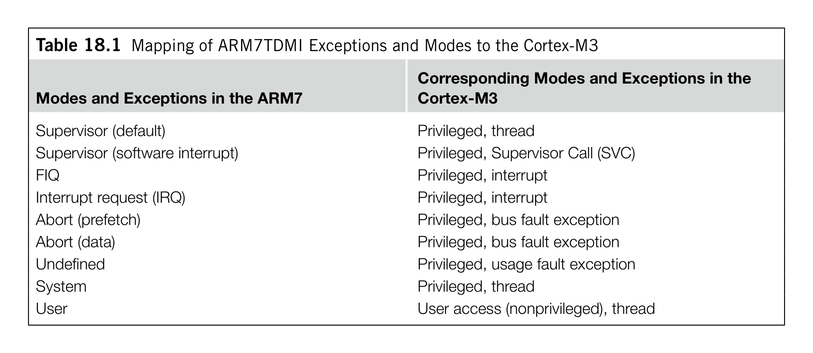

# Chapter 18. Porting Applications from the ARM7 to the Cortex-M3

> **Source PDF**: THE_DEFINITIVE_GUIDE_TO_THE_ARM_CORTEX-МЗ_Stellaris_MCU_9000Series_TEINSTRUMENTS_ARM_SECOND_EDITION.pdf  
> **PDF Page Range**: 310 - 317

---

<!-- Page 310 -->
### [PDF Page 310]

283
Copyright © 2010, Elsevier Inc. All rights reserved.
DOI: 10.1016/B978-0-12-382091-4.00024-4
In This Chapter

### Overview............................................................................................................................................... 283

System Characteristics.......................................................................................................................... 283
Assembly Language Files....................................................................................................................... 286
C Program Files..................................................................................................................................... 288
Precompiled Object Files....................................................................................................................... 288
Optimization.......................................................................................................................................... 289

## 18.1  Overview

For many engineers, porting existing program code to new architecture is a typical task. With the
Cortex™-M3 products starting to emerge on the market, many of us have to face the challenge of
porting ARM7TDMI (referred to as ARM7 in the following text) code to the Cortex-M3. This chapter
evaluates a number of aspects involved in porting applications from the ARM7 to the Cortex-M3.
There are several areas to consider when you’re porting from the ARM7 to the Cortex-M3. They
are as follows:
System characteristics
•
Assembly language files
•
C language files
•
Optimization
•
Overall, low-level code, such as hardware control, task management, and exception handlers,
requires the most changes whereas application codes normally can be ported with minor modification
and recompiling.

## 18.2  System Characteristics

There are a number of system characteristic differences between ARM7-based systems and Cortex-
M3-based systems (e.g., memory map, interrupts, Memory Protection Unit [MPU], system control,
and operation modes).
Porting Applications
from the ARM7 to the
Cortex-M3
18
CHAPTER

<!-- Page 311 -->
### [PDF Page 311]

284
CHAPTER 18  Porting Applications from the ARM7 to the Cortex-M3
18.2.1  Memory Map
The most obvious target of modification in porting programs between different microcontrollers is their
memory map differences. In the ARM7, memory and peripherals can be located in almost any address
whereas the Cortex-M3 processor has a predefined memory map. Memory address differences are
usually resolved in compile and linking stages. Peripheral code porting could be more time consuming
because the programmer model for the peripheral could be completely different. In that case, device
driver codes might need to be completely rewritten.
Many ARM7 products provide a memory remap feature so that the vector table can be remapped
to the Static Random Access Memory (SRAM) after boot-up. In the Cortex-M3, the vector table can
be relocated using the NVIC register so that memory remapping is no longer needed. Therefore, the
memory remap feature might be unavailable in many Cortex-M3 products.
Big endian support in the ARM7 is different from such support in the Cortex-M3. Program files can
be recompiled to the new big endian system, but hardcoded lookup tables might need to be converted
during the porting process.
In ARM720T, and some later ARM processors like ARM9, a feature called high vector is available,
which allows the vector table to be located to 0xFFFF0000. This feature is for supporting Windows CE
and is not available in the Cortex-M3.
18.2.2  Interrupts
The second target is the difference in the interrupt controller being used. Program code to control the
interrupt controller, such as enabling or disabling interrupts, will need to be changed. In addition, new
code is required for setting up interrupt priority levels and vector addresses for various interrupts.
The interrupt return method is also changed. This requires modification of interrupt return in
assembler code or, if C language is used, it might be necessary to make adjustments on compile
directives.
Enable and disable of interrupts, previously done by modifying Current Program Status register
(CPSR), must be replaced by ­setting up the Interrupt Mask register. In addition, in the ARM7T-
DMI, it is possible to reenable interrupt at the same time as interrupt return due to restore of CPSR
from Saved Program Status register (SPSR). In the Cortex-M3, if interrupts are disabled during an
interrupt handler by setting PRIMASK, the PRIMASK should be cleared manually before interrupt
return. Otherwise, the interrupts will remain disabled.
In the Cortex-M3, some registers are automatically saved by the stacking and unstacking mecha-
nisms. Therefore, some of the software stacking operations could be reduced or removed. However, in
the case of the Fast Interrupt request (FIQ) handler, traditional ARM cores have separate registers for
FIQ (R8–R11). Those registers can be used by the FIQ without the need to push them into the stack.
However, in the Cortex-M3, these registers are not stacked automatically, so when an FIQ handler is
ported to the Cortex-M3, either the registers being used by the handler must be changed or a stacking
step will be needed.
Code for nested interrupt handling can be removed. In the Cortex-M3, the NVIC has built-in nested
interrupt handling.
There are also differences in error handling. The Cortex-M3 provides various fault status registers
so that the cause of faults can be located. In addition, new fault types are defined in the Cortex-M3 (e.g.,

<!-- Page 312 -->
### [PDF Page 312]

*Description*: Hardware reference table detailing register bit field settings, electrical operating limits, or memory configurations for Table 18.1.

> **Table 18.1**

285

## 18.2  System Characteristics

stacking and unstacking faults, memory management faults, and hard faults). Therefore, fault handlers
will need to be rewritten.
18.2.3  MPU
The MPU programming model is another system block that needs new program code set up. Microcon-
troller products based on the ARM7TDMI/ARM7TDMI-S do not have MPUs, so moving the applica-
tion code to the Cortex-M3 should not be a problem. However, products based on the ARM720T have
a Memory Management Unit (MMU), which has different functionalities to the MPU in Cortex-M3.
If the application needs to use the MMU (as in a virtual memory system), it cannot be ported to the
Cortex-M3.
18.2.4  System Control
System control is another key area to look into when you’re porting applications. The Cortex-M3 has
built-in instructions for entering sleep mode. In addition, the system controller inside Cortex-M3 prod-
ucts is likely to be completely different from that of the ARM7 products, so function code that involves
system management features will need to be rewritten.
18.2.5  Operation Modes
In the ARM7, there are seven operation modes; in the Cortex-M3, these have been changed to differ-
ence exceptions (see Table 18.1).
The FIQ in the ARM7 can be ported as a normal interrupt request (IRQ) in the Cortex-M3 because
in the Cortex-M3, we can set up the priority for a particular interrupt to be highest; thus it will be able to
preempt other exceptions, just like the FIQ in the ARM7. However, due to the difference between banked
FIQ registers in the ARM7 and the stacked registers in the Cortex-M3, the registers being used in the FIQ
handler must be changed, or the registers used by the handler must be saved to the stack manually.
Table 18.1  Mapping of ARM7TDMI Exceptions and Modes to the Cortex-M3
Modes and Exceptions in the ARM7
Corresponding Modes and Exceptions in the
Cortex-M3
Supervisor (default)
Privileged, thread
Supervisor (software interrupt)
Privileged, Supervisor Call (SVC)
FIQ
Privileged, interrupt
Interrupt request (IRQ)
Privileged, interrupt
Abort (prefetch)
Privileged, bus fault exception
Abort (data)
Privileged, bus fault exception
Undefined
Privileged, usage fault exception
System
Privileged, thread
User
User access (nonprivileged), thread

<!-- Page 313 -->
### [PDF Page 313]

286
CHAPTER 18  Porting Applications from the ARM7 to the Cortex-M3

## 18.3  Assembly Language Files

Porting assembly files depends on whether the file is for ARM state or Thumb® state.
18.3.1  Thumb State
If the file is for Thumb state, the situation is much easier. In most cases, the file can be reused without a
problem. However, a few Thumb instructions in the ARM7 are not supported in the Cortex-M3 as follows:
Any code that tries to switch to ARM state
•
SWI is replaced by SVC (note that the program code for parameters passing and return need to be
•
updated.)
Finally, make sure that the program accesses the stack only in full descending stack operations. It is
possible, though uncommon, to implement a different stacking model differently (e.g., full ascending)
in ARM7TDMI.
18.3.2  ARM State
The situation for ARM code is more complicated. There are several scenarios as follows:
•
Vector table: In the ARM7, the vector table starts from address 0x0 and consists of branch
instructions. In the Cortex-M3, the vector table contains the initial value for the stack pointer and
reset vector address, followed by addresses of exception handlers. Due to these differences, the
vector table will need to be completely rewritten.
•
Register initialization: In the ARM7, it is often necessary to initialize different registers for different
modes. For example, there are banked stack pointers (R13), a link register (R14), and an SPSR
in the ARM7. Since the Cortex-M3 has a different programmer’s model, the register initialization
code will have to be changed. In fact, the register initialization code on the Cortex-M3 will be much
simpler because there is no need to switch the processor into a different mode.
•
Mode switching and state switching codes: Since the operation mode definition in the Cortex-M3
is different from that of the ARM7, the code for mode switching needs to be removed. The same
applies to ARM/Thumb state switching code.
FIQ and Nonmaskable Interrupt
Many engineers might expect the FIQ in the ARM7 to be directly mapped to the nonmaskable interrupt (NMI)
in the Cortex-M3. In some applications it is possible, but a number of differences between the FIQ and the
NMI need special attention when you’re porting applications using the NMI as an FIQ.
First, the NMI cannot be disabled whereas on the ARM7, the FIQ can be disabled by setting the F-bit in
the CPSR. So it is possible in the Cortex-M3 for an NMI handler to start right at boot-up time whereas in the
ARM7, the FIQ is disabled at reset.
Second, you cannot use SVC in an NMI handler on the Cortex-M3 whereas you can use software interrupt
(SWI) in an FIQ handler on the ARM7. During execution of an FIQ handler on the ARM7, it is possible for
other exceptions to take place (except IRQ, because the I-bit is set automatically when the FIQ is served).
However, on the Cortex-M3, a fault exception inside the NMI handler can cause the processor to lock up.

<!-- Page 314 -->
### [PDF Page 314]

287

## 18.3  Assembly Language Files

•
Interrupt enabling and disabling: In the ARM7, interrupts can be enabled or disabled by clearing
or setting the I-bit in the CPSR. In the Cortex-M3, this is done by clearing or setting an Interrupt
Mask register, such as PRIMASK or FAULTMASK. Furthermore, there is no F-bit in the Cortex-
M3 because there is no FIQ input.
•
Coprocessor accesses: There is no coprocessor support on the Cortex-M3, so this kind of operation
cannot be ported.
•
Interrupt handler and interrupt return: In the ARM7, the first instruction of the interrupt handler
is in the vector table, which normally contains a branch instruction to the actual interrupt handler.
In the Cortex-M3, this step is no longer needed. For interrupt returns, the ARM7 relies on manual
adjustment of the return program counter. In the Cortex-M3, the correctly adjusted program
counter is saved into the stack and the interrupt return is triggered by loading EXC_RETURN
into the program counter. Instructions, such as MOVS and SUBS, should not be used as interrupt
returns on the Cortex-M3. Because of these differences, interrupt handlers and interrupt return
codes need modification during porting.
Nested interrupt support code
•
: In the ARM7, when a nested interrupt is needed, usually the IRQ
handler will need to switch the processor to system mode and re-enable the interrupt. This is not
required in the Cortex-M3.
FIQ handler
•
: If an FIQ handler is to be ported, you might need to add an extra step to save the
contents of R8–R11 to stack memory. In the ARM7, R8–R12 are banked, so the FIQ handler can
skip the stack push for these registers. However, on the Cortex-M3, R0–R3 and R12 are saved onto
the stack automatically, but R8–R11 are not.
•	 SWI handler: The SWI is replaced with an SVC. However, when porting an SWI handler to an
SVC, the code to extract the passing parameter for the SWI instruction needs to be updated.
The calling SVC instruction address can be found in the stacked PC, which is different from
the SWI in the ARM7, where the program counter address has to be determined from the link
register.
•
SWP instruction (swap): There is no swap instruction (SWP) in the Cortex-M3. If the SWP was
used for semaphores, the exclusive access instructions should be used as replacement. This requires
rewriting the semaphores code. If the instruction was used purely for data transfers, this can be
replaced by multiple memory access instructions.
Access to CPSR and SPSR
•
: The CPSR in the ARM7 is replaced with Combined Program Status
registers (xPSR) in the Cortex-M3, and the SPSR has been removed. If the application would like
to access the current values of processor flags, the program code can be replaced with read access
to the APSR. If an exception handler would like to access the Program Status register (PSR) before
the exception takes place, it can find the value in the stack memory because the value of xPSR is
automatically saved to the stack when an interrupt is accepted. So there is no need for an SPSR in
the Cortex-M3.
•
Conditional execution: In the ARM7, conditional execution is supported for many ARM instructions
whereas most Thumb-2 instructions do not have the condition field inside the instruction coding.
When porting these codes to the Cortex-M3, the assembly tool might automatically convert these
conditional codes to use the IF-THEN (IT) instruction block; alternatively, we can manually insert
the IT instructions or insert branches to produce conditionally executed codes. One potential issue

<!-- Page 315 -->
### [PDF Page 315]

288
CHAPTER 18  Porting Applications from the ARM7 to the Cortex-M3
with replacing conditional execution code with IT instruction blocks is that it could increase the
code size and, as a result, could cause minor problems, such as load/store operations in some part
of the program could exceed the access range of the instruction.
•
Use of the program counter value in code that involves calculation using the current program
counter: In running ARM code on the ARM7, the read value of the PC during an instruction is the
address of the instruction plus 8. This is because the ARM7 has three pipeline stages and, when
reading the PC during the execution stage, the program counter has already incremented twice,
4 bytes at a time. When porting code that processes the PC value to the Cortex-M3, since the code
will be in Thumb, the offset of the program counter will only be 4.
•
Use of the R13 value: In the ARM7, the stack pointer R13 has 32 bits; in the Cortex-M3 processor,
the lowest 2 bits of the stack pointer are always forced to zero. Therefore, in the unlikely case that
R13 is used as a data register, the code has to be modified because the lowest 2 bits would be lost.
For the rest of the ARM program code, we can try to compile it as Thumb/Thumb-2 and see if
further modifications are needed. For example, some of the preindex and postindex memory access
instructions in the ARM7 are not supported in the Cortex-M3 and have to be recoded into multiple
instructions. Some of the code might have long branch range or large immediate data values that cannot
be compiled as Thumb code and so must be modified to Thumb-2 code manually.

## 18.4  C Program Files

Porting C program files is much easier than porting assembly files. In most cases, application code in
C can be recompiled for the Cortex-M3 without a problem. However, there are still a few areas that
potentially need modification, which are as follows:
•
Inline assemblers: Some C program code might have inline assembly code that needs modification. This
code can be easily located via the __asm keyword. If RealView Development Suite (RVDS)/RealView
Compilation Tools (RVCT) 3.0 or later is used, it should be changed to Embedded Assembler.
•	 Interrupt handler: In the C program you can use __irq to create interrupt handlers that work with
the ARM7. Due to the difference between the ARM7 and the Cortex-M3 interrupt behaviors,
such as saved registers and interrupt returns, depending on development tools being used,
the __irq keyword might need to be removed. (However, in ARM development tools including
RVDS and RVCT, support for the Cortex-M3 is added to the __irq, and use of the __irq directive
is recommended for reasons of clarity.)
ARM C compiler pragma directives like “#pragma arm” and “#pragma thumb” should be removed.

## 18.5  Precompiled Object Files

Most C compilers will provide precompiled object files for various function libraries and startup code.
Some of those (such as startup code for traditional ARM cores) cannot be used on the Cortex-M3 due
to the difference in operation modes and states. A number of them will have source code available and
can be recompiled using Thumb-2 code. Refer to your tool vendor documentation for details.

<!-- Page 316 -->
### [PDF Page 316]

289

## 18.6  Optimization

## 18.6  Optimization

After getting the program to work with the Cortex-M3, you might be able to further improve it to obtain
better performance and lower memory use. A number of areas should be explored:
•
Use of the Thumb-2 instruction: For example, if a 16-bit Thumb instruction transfers data from
one register to another and then carries a data processing operation on it, it might be possible to
replace the sequence with a single Thumb-2 instruction. This can reduce the number of clock cycles
required for the operation.
•
Bit band: If peripherals are located in bit-band regions, access to control register bits can be greatly
simplified by accessing the bit via a bit-band alias.
•
Multiply and divide: Routines that require divide operations, such as converting values into decimals
for display, can be modified to use the divide instructions in the Cortex-M3. For multiplication of
larger data, the multiple instructions in the Cortex-M3, such as unsigned multiply long (UMULL),
signed multiply long (SMULL), multiply accumulate (MLA), multiply and subtract (MLS),
unsigned multiply accumulate long (UMLAL), and signed multiply accumulate long (SMLAL) can
be used to reduce complexity of the code.
Immediate data
•
: Some of the immediate data that cannot be coded in Thumb instructions can be
produced using Thumb-2 instructions.
•
Branches: Some of the longer distance branches that cannot be coded in Thumb code (usually
ending up with multiple branch steps) can be coded with Thumb-2 instructions.
•
Boolean data: Multiple Boolean data (either 0 or 1) can be packed into a single byte/half word/
word in bit-band regions to save memory space. They can then be accessed via the bit-band alias.
Bit-field processing
•
: The Cortex-M3 provides a number of instructions for bit-field processing,
including unsigned bit field extract (UBFX), signed bit field extract (SBFX), Bit Field Insert
(BFI), Bit Field Clear (BFC), and reverse bits (RBIT). They can simplify many program codes for
peripheral programming, data packet formation, or extraction and serial data communications.
•
IT instruction block: Some of the short branches might be replaceable by the IT instruction
block. By doing that, we could avoid wasting clock cycles when the pipeline is flushed during
branching.
ARM/Thumb state switching
•
: In some situations, ARM developers divide code into various files
so that some of them can be compiled to ARM code and others compiled to Thumb code. This
is usually needed to improve code density where execution speed is not critical. With Thumb-2

### features in the Cortex-M3, this step is no longer needed, so some of the state switching overhead

can be removed, producing short code, less overhead, and possibly fewer program files.

<!-- Page 317 -->
### [PDF Page 317]

This page intentionally left blank

