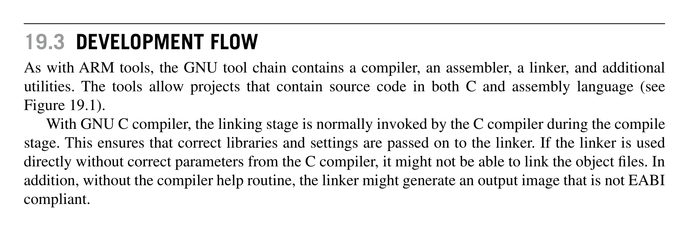
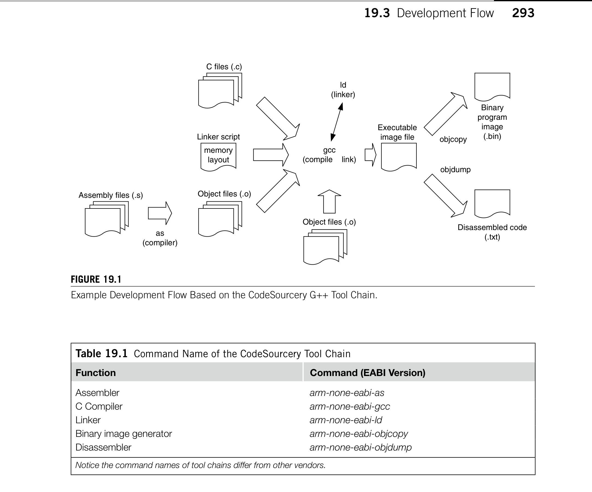
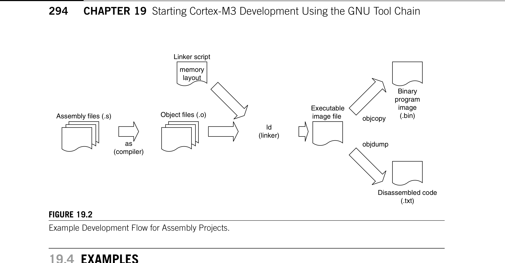
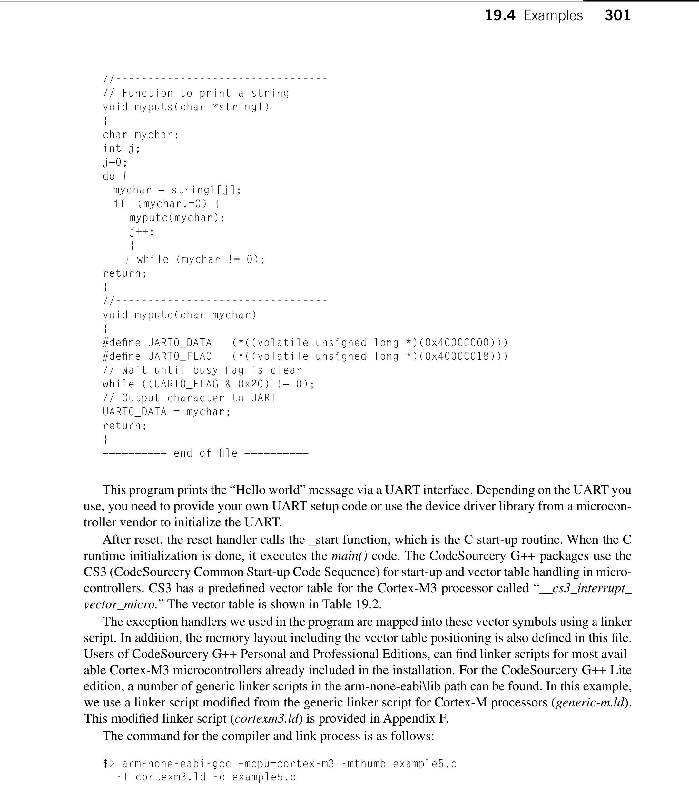
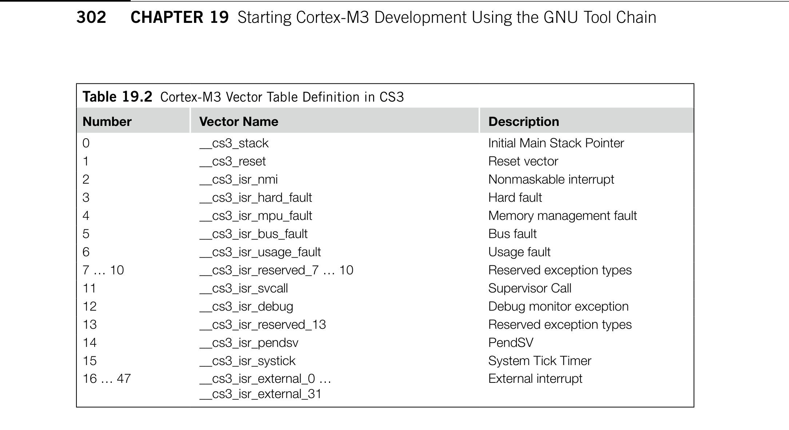

# Chapter 19. Starting Cortex-M3 Development Using the GNU Tool Chain

> **Source PDF**: THE_DEFINITIVE_GUIDE_TO_THE_ARM_CORTEX-МЗ_Stellaris_MCU_9000Series_TEINSTRUMENTS_ARM_SECOND_EDITION.pdf  
> **PDF Page Range**: 318 - 333


---


<!-- Page 318 -->
### [PDF Page 318]

291
Copyright © 2010, Elsevier Inc. All rights reserved.
DOI: 10.1016/B978-0-12-382091-4.00025-6
In This Chapter
Background........................................................................................................................................... 291
Getting the GNU Tool Chain.................................................................................................................... 292
Development Flow................................................................................................................................. 292
Examples.............................................................................................................................................. 294
Accessing Special Registers.................................................................................................................. 304
Using Unsupported Instructions.............................................................................................................. 305
Inline Assembler in the GNU C Compiler................................................................................................. 305
Starting Cortex-M3
Development Using
the GNU Tool Chain
19

## 19.1  Background

Many people use Gnu’s Not Unix (GNU) tool chain for ARM product development, and a number of
development tools for ARM are based on the GNU tool chain. The GNU tool chains supporting the
Cortex™-M3 are available from the GNU gcc source, as well as from a number of vendors providing
precompiled ready-to-use tool chains.
One of the vendors providing the GNU that supports the Cortex-M3 processor is CodeSourcery.
The CodeSourcery ARM compiler is available in various packages:
CodeSourcery G++ Lite: This is freely available from the CodeSourcery web site (www.codesourcery.
com). This free version provides command-line tools only and limited debug support.
CodeSourcery G++ Personal Edition: A popular choice as it is low-cost and has support features,
including the following:
Integration of Eclipse Integrated Development Environment
•
(IDE) environment
Support for a wide range of ARM microcontrollers, including CS3 support for these
•
microcontrollers (e.g., linker scripts and debug configurations)
Evaluation board support including Luminary Micro (Texas Instrument) Stellaris and
•
STMicroelectronics STM32 evaluation boards. This allows full browsing of peripheral
registers. The list of supported boards grows with every release.
CHAPTER


<!-- Page 319 -->
### [PDF Page 319]



*Description*: Technical diagram and schematic illustration detailing hardware circuit topology, signal routing, and logic operations for Figure 19.1.

> **Figure 19.1**

292
CHAPTER 19  Starting Cortex-M3 Development Using the GNU Tool Chain
Large collection of design examples
•
Integrated support for multiple debug interfaces including
•
ARMUSB (built into Stellaris parts)
•
Segger J-Link
•
Keil ULINK2
•
Board Builder Wizard to set up support for custom boards
•
Clone board definitions
•
Modify memory layout
•
Modify reset and start-up sequence
•
Debug configurations
•
Support for importing StellarisWare examples
•
CodeSourcery G++ Professional Edition: All features in Personal Edition plus addition libraries
and unlimited support.
The examples in this chapter are based on the command-line tools in CodeSourcery G++ Lite,
as these areas of information are common to most GNU-based tool chains. This chapter intro-
duces only the most basic steps in using the GNU tool chain. Detailed uses of the tool chain are
­available from documentation from tool vendors and on the Internet and are outside the scope of
this book.
Assembler syntax for GNU assembler (AS in the GNU tool chain) is a bit different from ARM
assembler. These differences include declarations, compile directives, comments, and the like. There-
fore, assembly codes for ARM RealView Development Tools need modification before being used with
the GNU tool chain.

## 19.2  Getting the GNU Tool Chain

The compiled version of the GNU tool chain can be downloaded from www.codesourcery.com/sgpp/
lite/arm. A number of binary builds are available. For the simplest uses, let’s select one with embedded-
application binary interface (EABI) and without a specific embedded OS as the target platform. The
tool chain is available for various development platforms such as Windows and Linux. The examples
shown in this chapter should work with either version.

## 19.3  Development Flow

As with ARM tools, the GNU tool chain contains a compiler, an assembler, a linker, and additional
utilities. The tools allow projects that contain source code in both C and assembly language (see
­Figure 19.1).
With GNU C compiler, the linking stage is normally invoked by the C compiler during the compile
stage. This ensures that correct libraries and settings are passed on to the linker. If the linker is used
directly without correct parameters from the C compiler, it might not be able to link the object files. In
addition, without the compiler help routine, the linker might generate an output image that is not EABI
compliant.


<!-- Page 320 -->
### [PDF Page 320]



*Description*: Hardware reference table detailing register bit field settings, electrical operating limits, or memory configurations for Table 19.1.

> **Table 19.1**


*Description*: Technical diagram and schematic illustration detailing hardware circuit topology, signal routing, and logic operations for Figure 19.1.

> **Figure 19.1**

293

## 19.3  Development Flow

There are versions of the tool chain for different application environments (Symbian, Linux, EABI,
and so on). The filenames of the programs usually have a prefix, depending on your tool chain target
options. For example, if the EABI1 environment is used, the Gnu C Compiler (GCC) command could
be arm-xxxx-eabi-gcc. The following examples use the commands from the CodeSourcery GNU ARM
Tool Chain, as shown in Table 19.1.
If your project is developed completely in assembler, then you could link the objects by using the
linker directly (see Figure 19.2).
1EABI for the ARM architecture—executables must conform to this specification in order for them to be used with various
development tool sets.
Figure 19.1
Example Development Flow Based on the CodeSourcery G++ Tool Chain.
C files (.c)
gcc
(compile z link)
Object files (.o)
Assembly files (.s)
as
(compiler)
Object files (.o)
Linker script
Executable
image file
objdump
objcopy
Binary
program
image
(.bin)
Disassembled code
(.txt)
memory
layout
ld
(linker)
Table 19.1  Command Name of the CodeSourcery Tool Chain
Function
Command (EABI Version)
Assembler
arm-none-eabi-as
C Compiler
arm-none-eabi-gcc
Linker
arm-none-eabi-ld
Binary image generator
arm-none-eabi-objcopy
Disassembler
arm-none-eabi-objdump
Notice the command names of tool chains differ from other vendors.


<!-- Page 321 -->
### [PDF Page 321]



*Description*: Technical diagram and schematic illustration detailing hardware circuit topology, signal routing, and logic operations for Figure 19.2.

> **Figure 19.2**

294
CHAPTER 19  Starting Cortex-M3 Development Using the GNU Tool Chain

## 19.4  Examples

Let’s look at a few examples using the GNU tool chain.
19.4.1  Example 1: The First Program
For a start, let’s try a simple assembly program that we covered in Chapter 10 that calculates 10 + 9 +
8 … + 1:
========== example1.s ==========
/* define constants */
.equ      STACK_TOP, 0x20000800
.text
.syntax unified
.thumb
.global _start
.type start, %function
_start:
.word STACK_TOP, start
/* Start of main program */
start:
movs r0, #10
movs r1, #0
/* Calculate 10+9+8... +1 */
loop:
adds r1, r0
subs r0, #1
bne  loop
/* Result is now in R1 */
deadloop:
b
deadloop
.end
========== end of file ==========
Figure 19.2
Example Development Flow for Assembly Projects.
Assembly files (.s)
as
(compiler)
Object files (.o)
Linker script
Executable
image file
objdump
objcopy
Binary
program
image
(.bin)
Disassembled code
(.txt)
memory
layout
ld
(linker)


<!-- Page 322 -->
### [PDF Page 322]

295

## 19.4  Examples

The
•
.word directive here helps us define the starting stack pointer value as 0x20000800 and the
reset vector as start.
•
.text is a predefined directive indicating that it is a program region that needs to be assembled.
•
.syntax unified indicates that the unified assembly language syntax is used.
•
.thumb indicates that the program code is in Thumb® instruction set. Alternatively, you can use
.code16 for legacy Thumb instruction syntax.
•
.global allows the label _start to be shared with other object files if needed.
•
_start is a label indicating the starting point of the program region.
•
start is a separate label indicating the reset handler.
•
.type start, %function declares that the symbol start is a function. This is necessary for all the
exception vectors in the vector table. Otherwise, the assembler sets the least significant bit (LSB)
of the vector to zero.
•
.end indicates the end of this program file.
Unlike ARM assembler, labels in GNU assemblers are followed by a colon (:). Comments are
quoted with /* and */, and directives are prefixed by a period (.).
Notice that the reset vector (start) is defined as a function (.type start, %function) within thumb
code (.thumb). The reason for this is to force the LSB of the reset vector to 1 to indicate that it starts
in Thumb state. Otherwise, the processor will try starting in ARM mode, resulting in a hard fault. To
assemble this file, we can use as in the following command:
$> arm-none-eabi-as -mcpu=cortex-m3 -mthumb example1.s -o example1.o
This creates the object file example1.o. The options -mcpu and -mthumb define the instruction set
to be used. The linking stage can be done by ld as follows:
$> arm-none-eabi-ld -Ttext 0x0 -o example1.out example1.o
Then, the binary file can be created using Object Copy (objcopy) as follows:
$> arm-none-eabi-objcopy -Obinary example1.out example1.bin
We can examine the output by creating a disassembled code listing file using Object Dump (objdump):
$> arm-none-eabi-objdump -S example1.out > example1.list
which looks like this:
example1.out:  file format elf32-littlearm
Disassembly of section .text:
00000000 <_start>:
0:
20000800	 .word 0x20000800
4:
00000009	 .word 0x00000009
00000008 <start>:
8:
200a	 movs  r0, #10
a:
2100	 movs  r1, #0
0000000c <loop>:
c:
1809	 adds  r1, r1, r0
e:
3801	 subs  r0, #1
10:
d1fc	 bne.n c <loop>
00000012 <deadloop>:
12:
e7fe	 b.n   12 <deadloop>


<!-- Page 323 -->
### [PDF Page 323]

296
CHAPTER 19  Starting Cortex-M3 Development Using the GNU Tool Chain
19.4.2  Example 2: Linking Multiple Files
As mentioned before, we can create multiple object files and link them together. Here, we have an example
of two assembly files: example2a.s and example2b.s; example2a.s contains the vector table only, and
example2b.s contains the program code. The .global is used to pass the address from one file to another:
========== example2a.s ==========
/* define constants */
.equ      STACK_TOP, 0x20000800
.syntax unified
.global vectors_table
.global start
.global nmi_handler
.thumb
vectors_table:
.word STACK_TOP, start, nmi_handler, 0x00000000
.end
========== end of file ==========
========== example2b.s ==========
/* Main program */
.text
.syntax unified
.thumb
.type start, %function
.type nmi_handler, %function
.global _start
.global start
.global nmi_handler
_start:
/* Start of main program */
start:
movs
r0, #10
movs
r1, #0
/* Calculate 10+9+8... +1 */
loop:
adds
r1, r0
subs
r0, #1
bne
loop
/* Result is now in R1 */
deadloop:
b
deadloop
/* Dummy NMI handler for illustration */
nmi_handler:
bx
lr
.end
========== end of file ==========
To create the executable image, the following steps are used:
Assemble example2a.s:
1.
$> arm-none-eabi-as -mcpu=cortex-m3 -mthumb example2a.s -o example2a.o


<!-- Page 324 -->
### [PDF Page 324]

297

## 19.4  Examples

Assemble example2b.s:
2.
$> arm-none-eabi-as -mcpu=cortex-m3 -mthumb example2b.s -o example2b.o
Link the object files to a single image. Note that the order of the object files in the command line
3.
affects the order of the objects in the final executable image:
$> arm-none-eabi-ld -Ttext 0x0 -o example2.out example2a.o example2b.o
The binary file can then be generated as follows:
4.
$> arm-none-eabi-objcopy -Obinary example2.out example2.bin
As in the previous example, we generate a list file to check that we have a correctly assembled
5.
image:
$> arm-none-eabi-objdump -S example2.out > example2.list
As the number of files increases, the compile process can be simplified using a UNIX makefile.
Individual development suites may also have built-in facilities to make the compile process easier.
19.4.3  Example 3: A Simple “Hello World” Program
To be a bit more ambitious, let’s now try the “Hello World” program. (Note: We skipped the universal
asynchronous receiver/transmitter [UART] initialization here; you need to add your own UART ini-
tialization code to try this example. An example of UART initialization in C language is provided in
Chapter 20.)
========== example3a.s ==========
/* define constants */
.equ      STACK_TOP, 0x20000800
.syntax unified
.thumb
.global vectors_table
.global _start
vectors_table:
.word STACK_TOP, _start
.end
========== end of file ==========
========== example3b.s ==========
.text
.syntax unified
.thumb
.global _start
.type _start, %function
_start:
/* Start of main program */
movs	r0, #0
movs	r1, #0
movs	r2, #0
movs	r3, #0
movs	r4, #0
movs	r5, #0


<!-- Page 325 -->
### [PDF Page 325]

298
CHAPTER 19  Starting Cortex-M3 Development Using the GNU Tool Chain
ldr         r0,=hello
bl           puts
movs        r0, #0x4
bl           putc
deadloop:
b             deadloop
hello:
.asciz
"Hello\n"
.align
puts:	 /* Subroutine to send string to UART */
/* Input r0 = starting address of string */
/* The string should be null terminated */
push {r0, r1, lr}
/* Save registers */
mov r1, r0
/* Copy address to R1, because */
/* R0 will be used as input for */
/* putc */
putsloop:
ldrb.w r0,[r1],#1
/* Read one character and increment address */
cbz r0, putsloopexit /* if character is null, goto end */
bl  putc
b   putsloop
putsloopexit:
pop {r0, r1, pc} /* return */
.equ UART0_DATA, 0x4000C000
.equ UART0_FLAG, 0x4000C018
putc:  /* Subroutine to send a character via UART */
/* Input R0 = character to send */
push  {r1, r2, r3, lr}  /* Save registers */
LDR   r1,=UART0_FLAG
putcwaitloop:
ldr
r2,[r1]
/* Get status flag */
tst.w
r2, #0x20
/* Check transmit buffer full flag bit */
bne
putcwaitloop
/* If busy then loop */
ldr
r1,=UART0_DATA
/* otherwise output data to transmit buffer */
str
r0, [r1]
pop
{r1, r2, r3, pc}
/* Return */
.end
========== end of file ==========
In this example, we used .asciz to create a null terminated string. This is equivalent to using .ascii to
define the string and following .byte to create a byte with a value of null. After defining the string, we
used .align to ensure that the next instruction starts in the right place. Otherwise, the assembler might
put the next instruction in an unaligned location.
To compile the program, create the binary image and disassemble outputs, the following steps can
be used:
$> arm-none-eabi-as –mcpu=cortex-m3 -mthumb example3a.s -o example3a.o
$> arm-none-eabi-as –mcpu=cortex-m3 -mthumb example3b.s -o example3b.o


<!-- Page 326 -->
### [PDF Page 326]

299

## 19.4  Examples

$> arm-none-eabi-ld -Ttext 0x0 -o example3.out example3a.o example3b.o
$> arm-none-eabi-objcopy -Obinary example3.out example3.bin
$> arm-none-eabi-objdump -S example3.out > example3.list
19.4.4  Example 4: Data in RAM
Very often we will store the data in Static Random Access Memory (SRAM). The following simple
example shows the required setup:
========== example4.s ==========
.equ
STACK_TOP, 0x20000800
.text
.syntax unified
.thumb
.global _start
.type start, %function
_start:
.word
STACK_TOP, start
/* Start of main program */
start:
movs r0, #10
movs r1, #0
/* Calculate 10+9+8... +1 */
loop:
adds r1, r0
subs r0, #1
bne loop
/* Result is now in R1 */
ldr  r0,=Result
str  r1,[r0]
deadloop:
b    deadloop
/* Data in LC – Local Common section */
.lcomm Result 4 /* A 4 byte data called Result */
.end
========== end of file ==========
In the program, the .lcomm pseudo-op is used to create an uninitialized block of storage inside the
“bss” region. Inside this region, a .word directive is used to reserve a space labelled Result. The pro-
gram code can then access this space using the defined label Result.
To link this program, we need to tell the linker where the RAM is. This can be done using the -Tbss
option, which sets the data segment to the required location:
$> arm-none-eabi-as –mcpu=cortex-m3 -mthumb example4.s -o example4.o
$> arm-none-eabi-ld -Ttext 0x0 -Tbss 0x20000000 -o example4.out example4.o
$> arm-none-eabi-objcopy -Obinary example4.out example4.bin
$> arm-none-eabi-objdump -S example4.out > example4.list


<!-- Page 327 -->
### [PDF Page 327]

300
CHAPTER 19  Starting Cortex-M3 Development Using the GNU Tool Chain
19.4.5  Example 5: C Program
One of the main components in the GNU tool chain is the C compiler. In this example, the whole
executable is coded using C. In addition, a linker script is needed to put the segments in place. First,
let’s look at the C program file:
========== example5.c ==========
// Declare functions

```c
void myputs(char *string1);
void myputc(char mychar);
int  main(void);
void Reset_Handler(void);
void NMI_Handler(void);
void HardFault_Handler(void);
void UartInit(void);
// Declare _start - C startup code
extern void _start(void);
//---------------------------------
void Reset_Handler(void)
```

{
// Call the CS3 reset handler
_start();
}
//---------------------------------
//Dummy handler

```c
void NMI_Handler(void)
```

{
return;
}
//---------------------------------
//Dummy handler

```c
void HardFault_Handler(void)
```

{
return;
}
//---------------------------------

```c
void UartInit(void)
```

{
/* Add your UART initialization code here */
return;
}
//---------------------------------
// Start of main program

```c
int main(void)
```

{
#define NVIC_CCR (*((volatile unsigned long *)(0xE000ED14)))
const char *helloworld="Hello world\n";
NVIC_CCR = NVIC_CCR | 0x200; /* Set STKALIGN in NVIC */
UartInit();
myputs(helloworld);
while(1);
return(0);
}


<!-- Page 328 -->
### [PDF Page 328]



*Description*: Hardware reference table detailing register bit field settings, electrical operating limits, or memory configurations for Table 19.2.

> **Table 19.2**

301

## 19.4  Examples

//---------------------------------
// Function to print a string

```c
void myputs(char *string1)
```

{
char mychar;

```c
int j;
j=0;
```

do {
mychar = string1[j];
if  (mychar!=0) {
myputc(mychar);
j++;
}
} while (mychar != 0);
return;
}
//---------------------------------

```c
void myputc(char mychar)
```

{
#define UART0_DATA   (*((volatile unsigned long *)(0x4000C000)))
#define UART0_FLAG   (*((volatile unsigned long *)(0x4000C018)))
// Wait until busy flag is clear
while ((UART0_FLAG & 0x20) != 0);
// Output character to UART
UART0_DATA = mychar;
return;
}
========== end of file ==========
This program prints the “Hello world” message via a UART interface. Depending on the UART you
use, you need to provide your own UART setup code or use the device driver library from a microcon-
troller vendor to initialize the UART.
After reset, the reset handler calls the _start function, which is the C start-up routine. When the C
runtime initialization is done, it executes the main() code. The CodeSourcery G++ packages use the
CS3 (CodeSourcery Common Start-up Code Sequence) for start-up and vector table handling in micro-
controllers. CS3 has a predefined vector table for the Cortex-M3 processor called “__cs3_interrupt_­
vector_micro.” The vector table is shown in Table 19.2.
The exception handlers we used in the program are mapped into these vector symbols using a linker
script. In addition, the memory layout including the vector table positioning is also defined in this file.
Users of CodeSourcery G++ Personal and Professional Editions, can find linker scripts for most avail-
able Cortex-M3 microcontrollers already included in the installation. For the CodeSourcery G++ Lite
edition, a number of generic linker scripts in the arm-none-eabi\lib path can be found. In this example,
we use a linker script modified from the generic linker script for Cortex-M processors (generic-m.ld).
This modified linker script (cortexm3.ld) is provided in Appendix F.
The command for the compiler and link process is as follows:
$> arm-none-eabi-gcc –mcpu=cortex-m3 -mthumb example5.c
-T cortexm3.ld -o example5.o


<!-- Page 329 -->
### [PDF Page 329]



*Description*: Hardware reference table detailing register bit field settings, electrical operating limits, or memory configurations for Table 19.2.

> **Table 19.2**

302
CHAPTER 19  Starting Cortex-M3 Development Using the GNU Tool Chain
The memory map information is passed on to the linker during the compile stage.
The gcc automatically carried out the linking, so there is no need to carry out a linking stage.
Finally, the binary and disassembled list file can be generated:
$> arm-none-eabi-objcopy -Obinary example5.out example5.bin
$> arm-none-eabi-objdump -S example5.out > example5.list
The use of Reset_Handler in this C example is optional. You can point “__cs_reset” to the “_start”
start-up routine in the linker script instead.
19.4.6  Example 6: C with Retargeting
In the last example, we created our own text output function, but in many cases, we would use the text
output function provided by the C library. For example, we might need to use “printf” for text outputting.
In this case, we need to implement a function to redirect printf output to the UART output routine.
The following example illustrates how to implement retargeting function to support “printf”:
========== example6.c ==========

```c
#include<stdio.h>
// Declare functions
void myputc(char mychar);
int   main(void);
void Reset_Handler(void);
void NMI_Handler(void);
void HardFault_Handler(void);
void UartInit(void);
// Declare _start - C startup code
extern void _start(void);
//---------------------------------
```

Table 19.2  Cortex-M3 Vector Table Definition in CS3
Number
Vector Name
Description
0
__cs3_stack
Initial Main Stack Pointer
1
__cs3_reset
Reset vector
2
__cs3_isr_nmi
Nonmaskable interrupt
3
__cs3_isr_hard_fault
Hard fault
4
__cs3_isr_mpu_fault
Memory management fault
5
__cs3_isr_bus_fault
Bus fault
6
__cs3_isr_usage_fault
Usage fault
7 … 10
__cs3_isr_reserved_7 … 10
Reserved exception types
11
__cs3_isr_svcall
Supervisor Call
12
__cs3_isr_debug
Debug monitor exception
13
__cs3_isr_reserved_13
Reserved exception types
14
__cs3_isr_pendsv
PendSV
15
__cs3_isr_systick
System Tick Timer
16 … 47
__cs3_isr_external_0 …
__cs3_isr_external_31
External interrupt


<!-- Page 330 -->
### [PDF Page 330]

303

## 19.4  Examples


```c
void Reset_Handler(void)
```

{
// Call the CS3 reset handler
_start();
}
//---------------------------------
//Dummy handler

```c
void NMI_Handler(void)
```

{
return;
}
//---------------------------------
//Dummy handler

```c
void HardFault_Handler(void)
```

{
return;
}
//---------------------------------

```c
void UartInit(void)
```

{
/* Add your UART initialization code here */
return;
}
//---------------------------------
// Retarget function

```c
int _write_r(void *reent, int fd, char *ptr, size_t len)
```

{
size_t i;
for (i=0; i<len; i++)
{
myputc(ptr[i]); // call our character output function
}
return len;
}
//---------------------------------
// Start of main program

```c
int main(void)
```

{
#define NVIC_CCR (*((volatile unsigned long *)(0xE000ED14)))
NVIC_CCR = NVIC_CCR | 0x200; /* Set STKALIGN in NVIC */
UartInit();
printf("Hello world\n");
while(1);
return(0);
}
//---------------------------------
// Function to output a character

```c
void myputc(char mychar)
```

{
#define UART0_DATA (*((volatile unsigned long *)(0x4000C000)))
#define UART0_FLAG (*((volatile unsigned long *)(0x4000C018)))
// Wait until busy flag is clear
while ((UART0_FLAG & 0x20) != 0);


<!-- Page 331 -->
### [PDF Page 331]

304
CHAPTER 19  Starting Cortex-M3 Development Using the GNU Tool Chain
// Output character to UART
UART0_DATA = mychar;
return;
}
========== end of file ==========
The retargeting is carried out by implementing the “_write_r” function. This function calls our own
character output routine to display the “Hello world” message.
19.4.7  Example 7: Implement Your Own Vector Table
If you are not using CodeSourcery G++ tool chain, you might need to implement your own vector table.
This can be done by using the following C code:
// Define the vector table
__attribute__ ((section("vectors")))
void (* const VectorArray[])(void) = {
(void (*)(void))((unsigned long) MainStack + sizeof(MainStack)),
Reset_Handler,
NMI_Handler,
HardFault_Handler
};
And the stack memory can be defined using an array:
// Reserve 64 words memory space for the main stack
static unsigned long MainStack[64];
The vector table can be allocated to the start of the memory using linker script. For example:
.text :
{
CREATE_OBJECT_SYMBOLS
__cs3_region_start_rom = .;
*(.cs3.region-head.rom)
__cs3_interrupt_vector = __cs3_interrupt_vector_micro;
*(vectors) /* vector table */
The “vectors” section needs to match the section name used when we declare the vector table. Other-
wise, the vector table will not be allocating to the beginning of the memory correctly.
This method can be useful even when you are using the CodeSourcery tool chain; if you need more
than 32 interrupt vectors, you can create extra vectors and place it right after the CS3 vector table.

## 19.5  Accessing Special Registers

The CodeSourcery GNU ARM tool chain supports access to special registers. The names of the special
registers must be in lowercase. For example:
msr
control, r1
mrs
r1, control
msr
apsr, R1
mrs
r0, psr


<!-- Page 332 -->
### [PDF Page 332]

305

## 19.7  Inline Assembler in the GNU C Compiler


## 19.6  Using Unsupported Instructions

If you are using another GNU ARM tool chain, there might be cases in which the GNU assembler
you are using does not support the assembly instruction that you wanted. In this situation, you can still
insert the instruction in form of binary data using .word. For example:
.equ DW_MSR_CONTROL_R0, 0x8814F380
...
MOV  R0, #0x1
.word	 DW_MSR_CONTROL_R0  /* This set the processor in user mode */
...

## 19.7  Inline Assembler in the GNU C Compiler

As in the ARM C Compiler, the GNU C Compiler supports an inline assembler. The syntax is a little
bit different:
__asm
("
inst1 op1, op2... \n"
"
inst2 op1, op2... \n"
...
"
inst op1, op2... \n"
: output_operands              /* optional */
: input_operands               /* optional */
: clobbered_register_list    /* optional */
);
For example, a simple code to enter sleep mode looks like this:

```c
void Sleep(void)
```

{  // Enter sleep mode using Wait-For-Interrupt
__asm (
"WFI\n"
);
}
If the assembler code needs to have an input variable and an output variable—for example, divide
a variable by 5 in the following code—it can be written as follows:
unsigned int DataIn, DataOut; /* variables for input and output */
...
__asm
("mov   r0, %0\n"
"mov   r3, #5\n"
"udiv  r0, r0, r3\n"
"mov   %1, r0\n"
:"=r" (DataOut) : "r" (DataIn) : "cc", "r3" );
With this code, the input parameter is a C variable called DataIn (%0 first parameter), and the code
returns the result to another C variable called DataOut (%1 second parameter). The inline assembler
code manually modifies register r3 and changes the condition flags cc so that they are listed in the clob-
bered register list.
For more examples of an inline assembler, refer to the GNU tool chain documentation GCC-Inline-
Assembly-HOWTO on the Internet.


<!-- Page 333 -->
### [PDF Page 333]

This page intentionally left blank


