# Chapter 20. Getting Started with the Keil RealView Microcontroller Development Kit

> **Source PDF**: THE_DEFINITIVE_GUIDE_TO_THE_ARM_CORTEX-МЗ_Stellaris_MCU_9000Series_TEINSTRUMENTS_ARM_SECOND_EDITION.pdf  
> **PDF Page Range**: 334 - 361


---


<!-- Page 334 -->
### [PDF Page 334]

307
Copyright © 2010, Elsevier Inc. All rights reserved.
DOI: 10.1016/B978-0-12-382091-4.00026-8
CHAPTER
In This Chapter

### Overview�����������������������������������������������������������������������������������������������������������������������������������������������307

Getting Started with μVision�������������������������������������������������������������������������������������������������������������������308
Outputting the “Hello World” Message Via Universal Asynchronous Receiver/Transmitter�������������������������314
Testing the Software������������������������������������������������������������������������������������������������������������������������������317
Using the Debugger�������������������������������������������������������������������������������������������������������������������������������318
The Instruction Set Simulator�����������������������������������������������������������������������������������������������������������������325
Modifying the Vector Table���������������������������������������������������������������������������������������������������������������������326
Stopwatch Example with Interrupts with CMSIS���������������������������������������������������������������������������������������327
Porting Existing Applications to Use CMSIS��������������������������������������������������������������������������������������������334
Getting Started with the Keil
RealView Microcontroller
Development Kit
20

## 20.1  Overview

Various commercial development platforms are available for the Cortex™-M3. One of the popular
choices is the Keil RealView Microcontroller Development Kit (RealView MDK-ARM). The Real-
View MDK-ARM contains various components as follows:
μVision Integrated Development Environment (IDE)
•
Debugger
•
Simulator
•
RealView Compilation Tools from ARM
•
C/C
•
++ Compiler
Assembler
•
Linker and utilities
•
RTX Real-Time Kernel
•
Detailed start-up code for microcontrollers
•
Flash programming algorithms
•
Program examples
•


<!-- Page 335 -->
### [PDF Page 335]


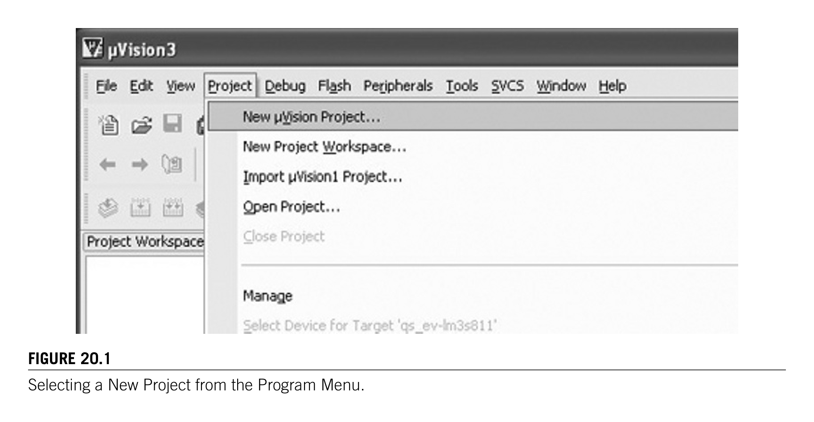
*Description*: Technical diagram and schematic illustration detailing hardware circuit topology, signal routing, and logic operations for Figure 20.1.

> **Figure 20.1**

308
CHAPTER 20  Getting Started with the Keil RealView Microcontroller
For learning about the Cortex-M3 with RealView MDK-ARM, it is not necessary to have ­Cortex-M3
hardware. The μVision environment contains an instruction set simulator that allows testing of simple
programs that do not require a development board.
A free evaluation compact disc read-only memory (CD-ROM) for the Keil tool can be requested
from the Keil web site (www.keil.com). This version is also included in a number of Cortex-M3 evalu-
ation kits from various microcontroller vendors.

## 20.2  Getting Started with mVision

A number of examples are provided with the RealView MDK-ARM, including some examples for
various Cortex-M3 microcontroller products and evaluation boards available on the market. In addi-
tion, you can also download device driver libraries from microcontroller vendor web sites, which also
contain a number of examples. These examples provide a powerful set of device driver libraries that
are ready to use. It’s easy to modify the provided examples to start developing your application or
you can develop your project from scratch. The following examples illustrate how this is done. The
examples shown in this chapter are based on the version 3.80 of Keil MDK-ARM and on Luminary
Micro LM3S811 devices.
After installing the RealView MDK, you can start the μVision from the program menu. After
installation, the μVision might start with a default project for a traditional ARM processor. We can
close the current project and start a new one by selecting New Project in the pull-down menu (see
Figure 20.1).
Figure 20.2 shows a new project directory called HelloWorld is created. Now, we need to select the
targeted device for this project. In this example, the LM3S811 is selected (see Figure 20.3).
Figure 20.1
Selecting a New Project from the Program Menu.


<!-- Page 336 -->
### [PDF Page 336]


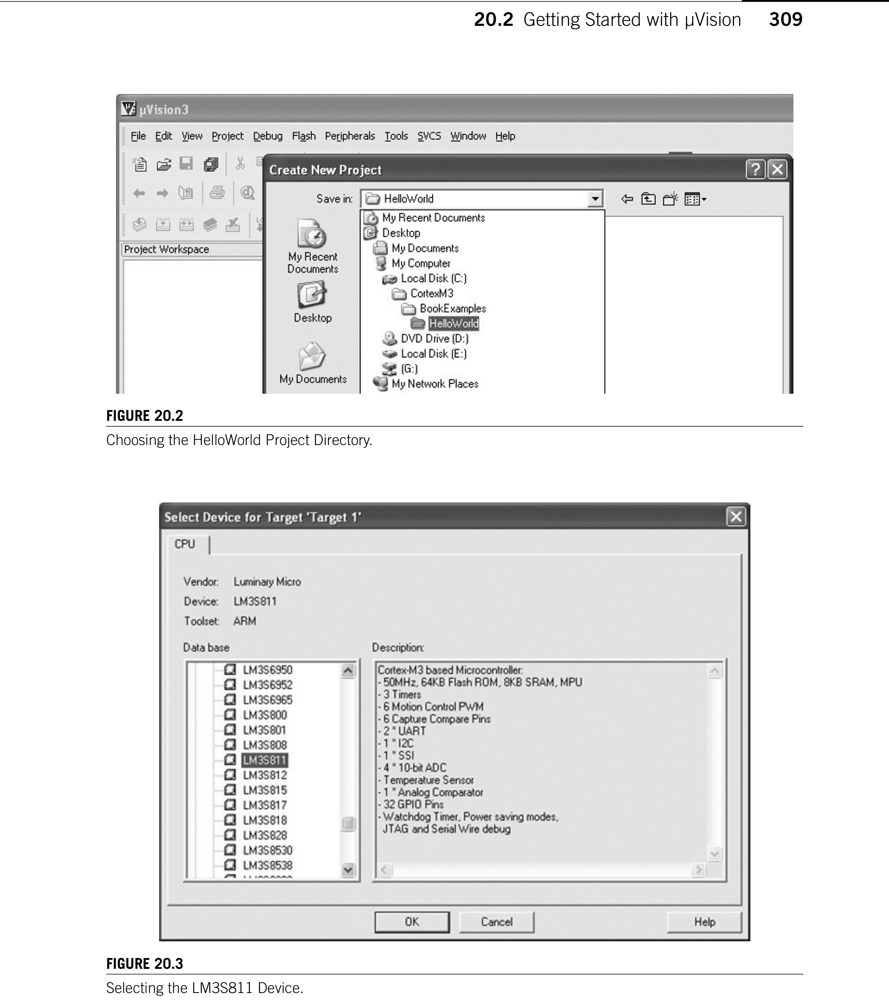
*Description*: Technical diagram and schematic illustration detailing hardware circuit topology, signal routing, and logic operations for Figure 20.2.

> **Figure 20.2**


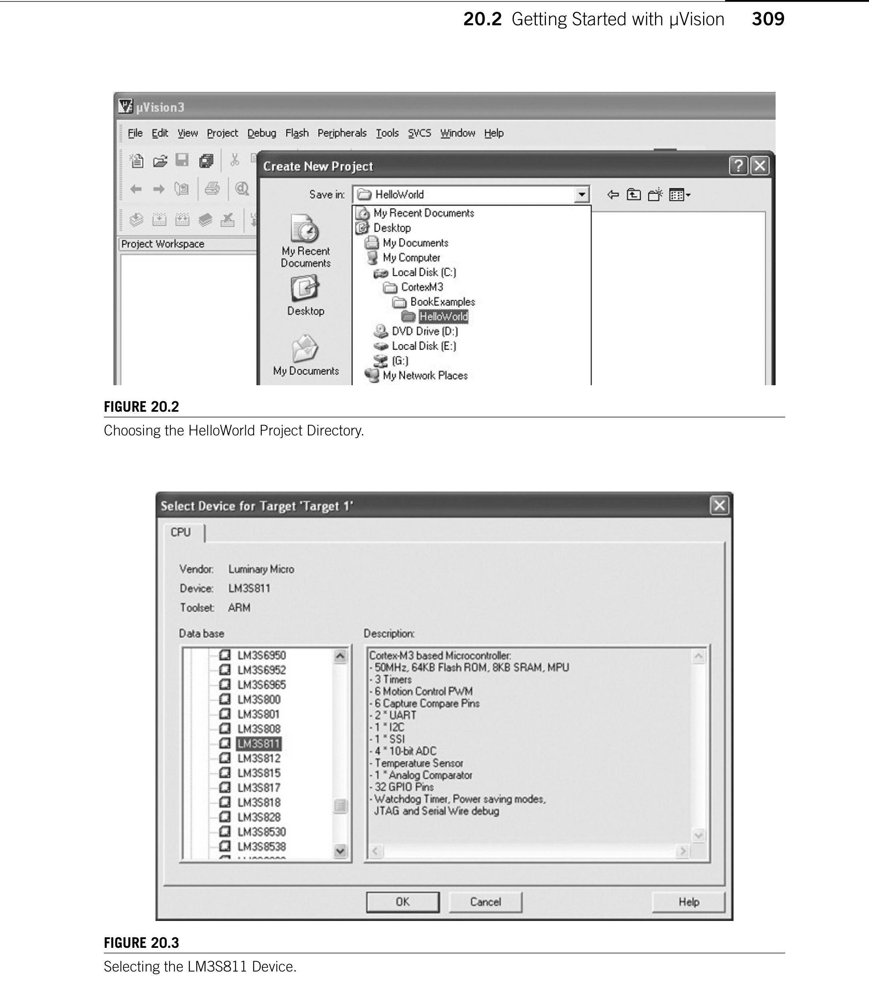
*Description*: Technical diagram and schematic illustration detailing hardware circuit topology, signal routing, and logic operations for Figure 20.3.

> **Figure 20.3**

309

## 20.2  Getting Started with µVision

Figure 20.2
Choosing the HelloWorld Project Directory.
Figure 20.3
Selecting the LM3S811 Device.


<!-- Page 337 -->
### [PDF Page 337]


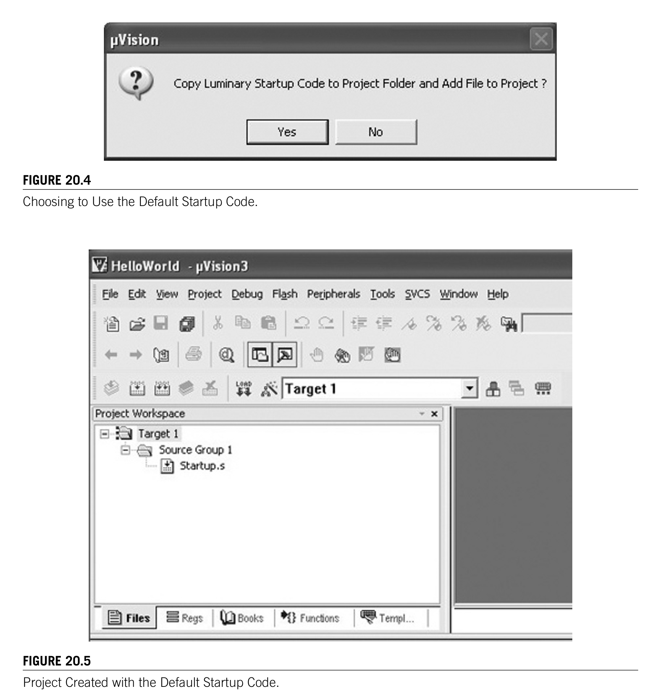
*Description*: Technical diagram and schematic illustration detailing hardware circuit topology, signal routing, and logic operations for Figure 20.4.

> **Figure 20.4**


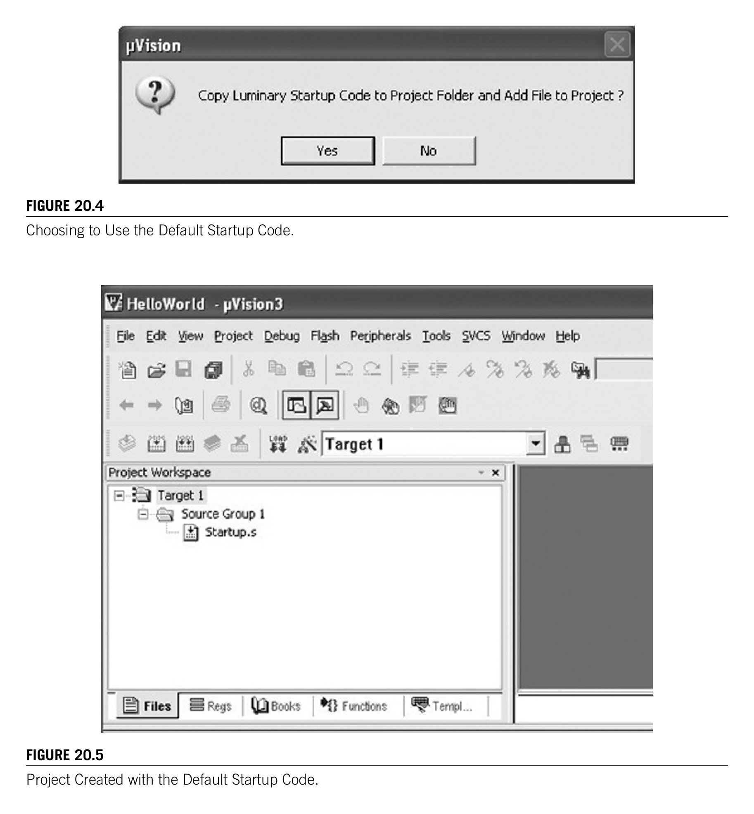
*Description*: Technical diagram and schematic illustration detailing hardware circuit topology, signal routing, and logic operations for Figure 20.5.

> **Figure 20.5**

310
CHAPTER 20  Getting Started with the Keil RealView Microcontroller
The software will then ask if you would like to use the default startup code. In this case, we select
Yes (see Figure 20.4).
As Figure 20.5 shows, we now have a project called Hello with only one file, called Startup.s. We
can create a new C program file containing the main program (see Figure 20.6). A text file is created
and saved as hello.c (see Figure 20.7). As Figure 20.8 shows, we now need to add this file to our project
by right-clicking Source Group 1.
Figure 20.4
Choosing to Use the Default Startup Code.
Figure 20.5
Project Created with the Default Startup Code.


<!-- Page 338 -->
### [PDF Page 338]


*Description*: Technical diagram and schematic illustration detailing hardware circuit topology, signal routing, and logic operations for Figure 20.6.

> **Figure 20.6**


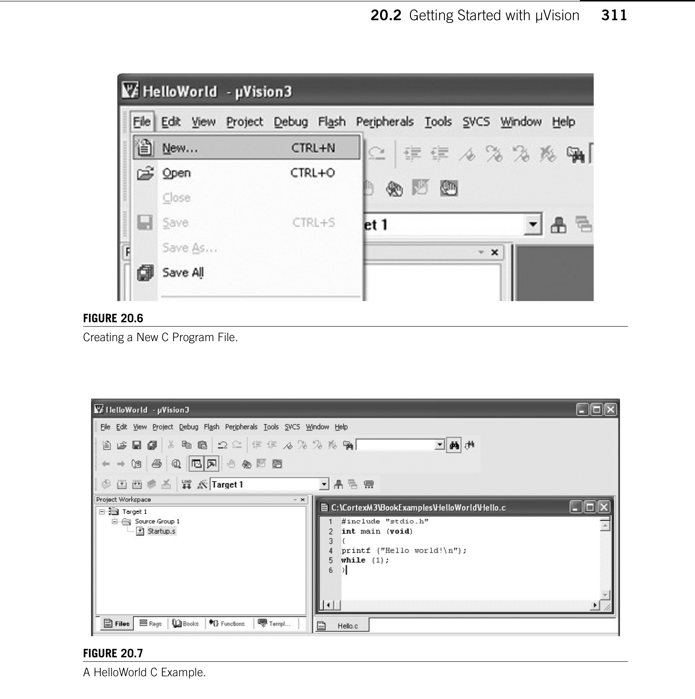
*Description*: Technical diagram and schematic illustration detailing hardware circuit topology, signal routing, and logic operations for Figure 20.7.

> **Figure 20.7**


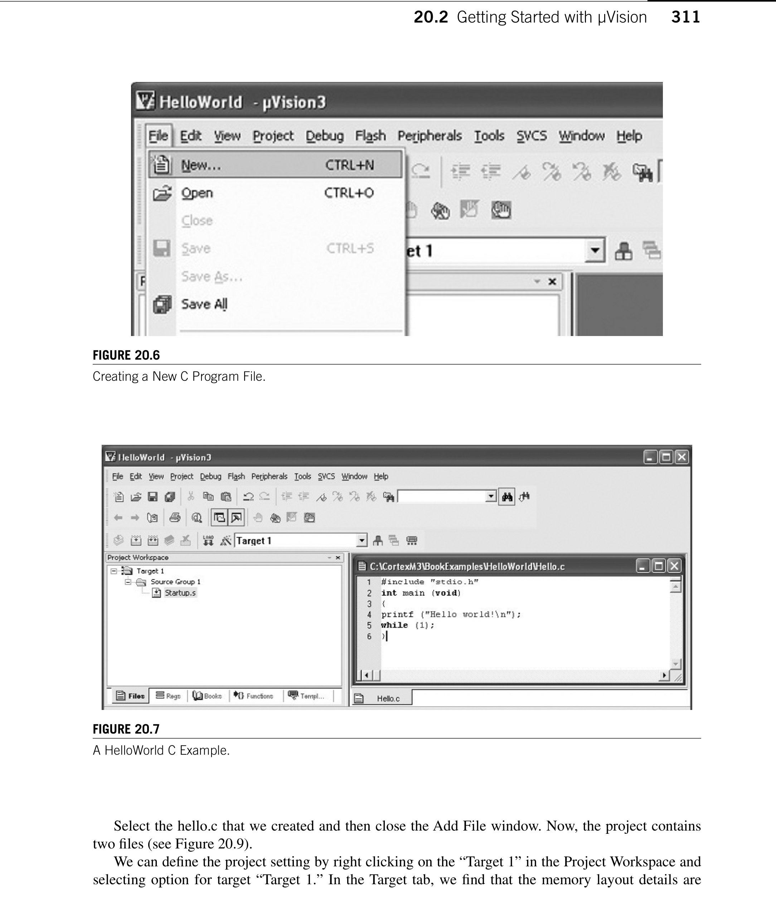
*Description*: Technical diagram and schematic illustration detailing hardware circuit topology, signal routing, and logic operations for Figure 20.9.

> **Figure 20.9**

311

## 20.2  Getting Started with µVision

Figure 20.6
Creating a New C Program File.
Figure 20.7
A HelloWorld C Example.
Select the hello.c that we created and then close the Add File window. Now, the project contains
two files (see Figure 20.9).
We can define the project setting by right clicking on the “Target 1” in the Project Workspace and
selecting option for target “Target 1.” In the Target tab, we find that the memory layout details are


<!-- Page 339 -->
### [PDF Page 339]


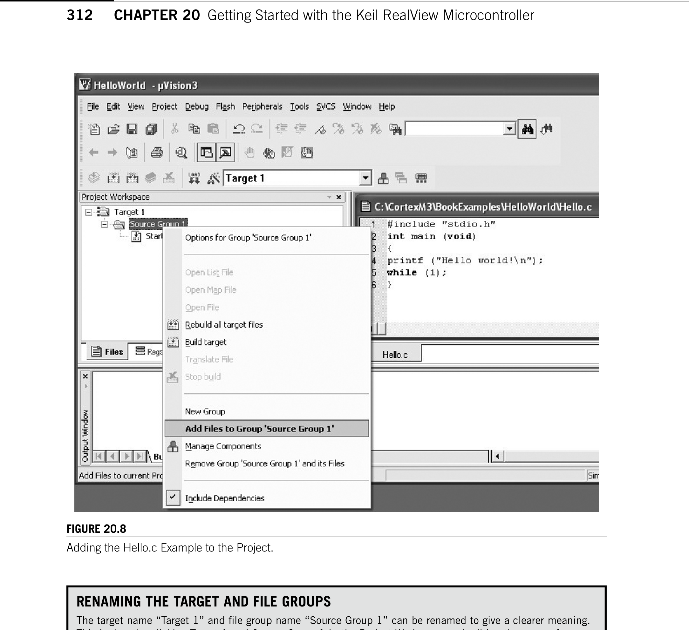
*Description*: Technical diagram and schematic illustration detailing hardware circuit topology, signal routing, and logic operations for Figure 20.8.

> **Figure 20.8**


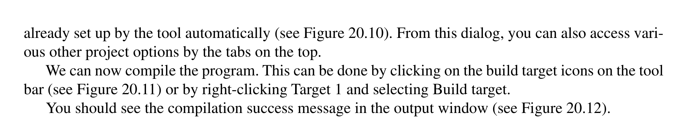
*Description*: Technical diagram and schematic illustration detailing hardware circuit topology, signal routing, and logic operations for Figure 20.10.

> **Figure 20.10**

312
CHAPTER 20  Getting Started with the Keil RealView Microcontroller
Figure 20.8
Adding the Hello.c Example to the Project.
Renaming the Target and File Groups
The target name “Target 1” and file group name “Source Group 1” can be renamed to give a clearer meaning.
This is done by clicking Target 1 and Source Group 1 in the Project Workspace and editing the names from
there.
already set up by the tool automatically (see Figure 20.10). From this dialog, you can also access vari-
ous other project options by the tabs on the top.
We can now compile the program. This can be done by clicking on the build target icons on the tool
bar (see Figure 20.11) or by right-clicking Target 1 and selecting Build target.
You should see the compilation success message in the output window (see Figure 20.12).


<!-- Page 340 -->
### [PDF Page 340]


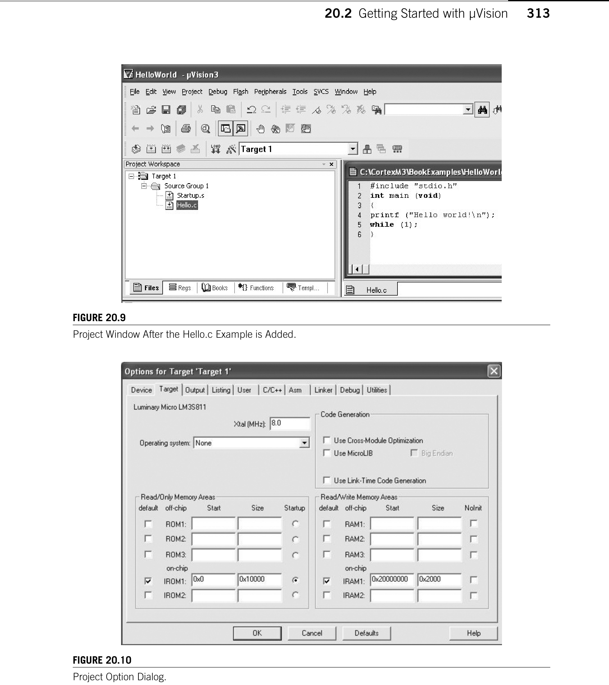
*Description*: Technical diagram and schematic illustration detailing hardware circuit topology, signal routing, and logic operations for Figure 20.9.

> **Figure 20.9**


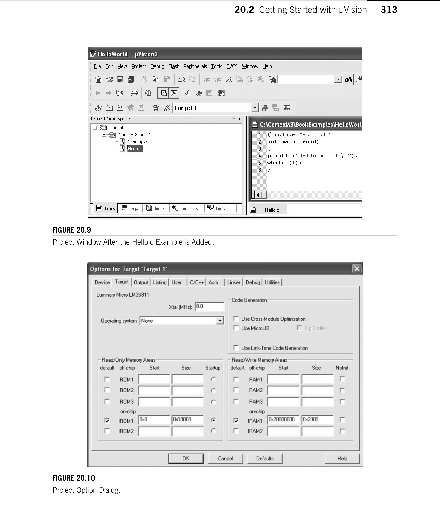
*Description*: Technical diagram and schematic illustration detailing hardware circuit topology, signal routing, and logic operations for Figure 20.10.

> **Figure 20.10**

313

## 20.2  Getting Started with µVision

Figure 20.9
Project Window After the Hello.c Example is Added.
Figure 20.10
Project Option Dialog.


<!-- Page 341 -->
### [PDF Page 341]


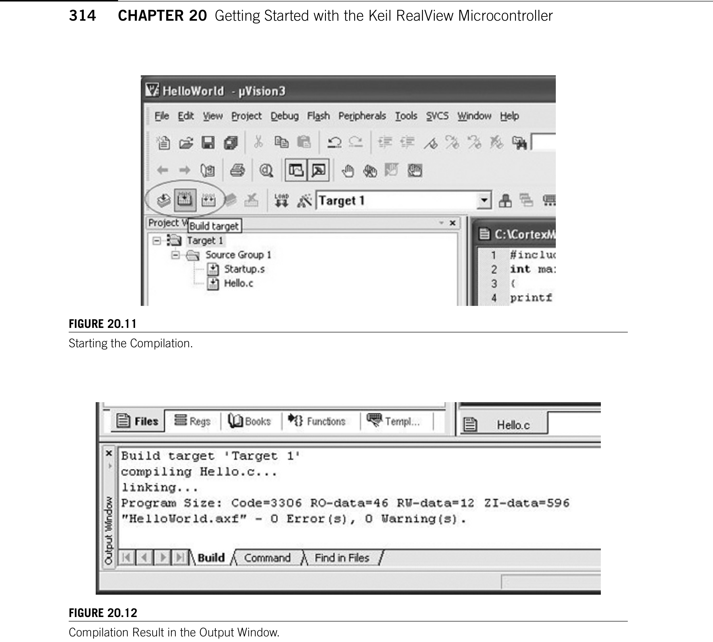
*Description*: Technical diagram and schematic illustration detailing hardware circuit topology, signal routing, and logic operations for Figure 20.11.

> **Figure 20.11**


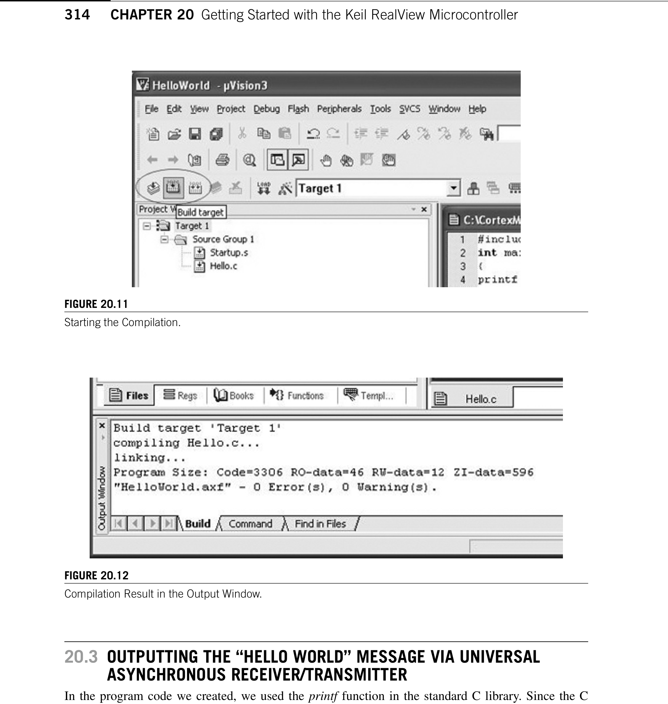
*Description*: Technical diagram and schematic illustration detailing hardware circuit topology, signal routing, and logic operations for Figure 20.12.

> **Figure 20.12**

314
CHAPTER 20  Getting Started with the Keil RealView Microcontroller
Figure 20.11
Starting the Compilation.
Figure 20.12
Compilation Result in the Output Window.
20.3  Outputting the “Hello World” Message Via Universal
Asynchronous Receiver/Transmitter
In the program code we created, we used the printf function in the standard C library. Since the C
library does not know about the actual hardware we are using, if we want to output the text message
using real hardware, such as the universal asynchronous receiver/transmitter (UART) on a chip, we
need additional code.


<!-- Page 342 -->
### [PDF Page 342]

315

## 20.3  Outputting the “Hello World” Message

As mentioned earlier in this book, the implementation of output to actual hardware is often
referred to as retargeting. Besides creating text output, the retargeting code might also include func-
tions for error handling and program termination. In this example, only the text output retargeting
is covered.
For the following code, the “Hello world” message is output to UART 0 of the LM3S811 device.
The target system used is the Luminary Micro LM3S811 evaluation board. The board has a 6 MHz
crystal as a clock source and an internal Phase-Locked Loop (PLL) module that can step up the clock
frequency to 50 MHz after a simple setup process. The baud rate setting is 115 200 and is output to
HyperTerminal running on a Windows PC.
To retarget the printf message, we need to implement the fputc function. In the following code, we
have created an fputc function that calls the sendchar function, which carries out the UART control.
hello.c

```c
#include "stdio.h"
```

#pragma import(__use_no_semihosting_swi)
struct __FILE { int handle; };
FILE __stdout;
#define CR      0x0D // Carriage return
#define LF      0x0A // Linefeed

```c
void Uart0Init(void);
void SetClockFreq(void);
int sendchar(int ch);
// Comment out the following line to use 6MHz clock
```

#define CLOCK50MHZ
// Register addresses
#define SYSCTRL_RCC      *((volatile unsigned long *)(0x400FE060))
#define SYSCTRL_RIS      *((volatile unsigned long *)(0x400FE050))
#define SYSCTRL_RCGC1     *((volatile unsigned long *)(0x400FE104))
#define SYSCTRL_RCGC2     *((volatile unsigned long *)(0x400FE108))
#define GPIOPA_AFSEL     *((volatile unsigned long *)(0x40004420))
#define UART0_DATA        *((volatile unsigned long *)(0x4000C000))
#define UART0_FLAG        *((volatile unsigned long *)(0x4000C018))
#define UART0_IBRD        *((volatile unsigned long *)(0x4000C024))
#define UART0_FBRD        *((volatile unsigned long *)(0x4000C028))
#define UART0_LCRH        *((volatile unsigned long *)(0x4000C02C))
#define UART0_CTRL        *((volatile unsigned long *)(0x4000C030))
#define UART0_RIS          *((volatile unsigned long *)(0x4000C03C))
#define NVIC_CCR           *((volatile unsigned long *)(0xE000ED14))

```c
int main (void)
```

{ // Simple code to output hello world message
NVIC_CCR = NVIC_CCR | 0x200; // Set STKALIGN
SetClockFreq(); // Setup clock setting (50MHz/6MHz)
Uart0Init();
// Initialize Uart0
printf ("Hello world!\n");
while (1);
}

```c
void SetClockFreq(void)
```

{
#ifdef      CLOCK50MHZ
// Set BYPASS, clear USRSYSDIV and SYSDIV
SYSCTRL_RCC = (SYSCTRL_RCC & 0xF83FFFFF) | 0x800 ;
Continued


<!-- Page 343 -->
### [PDF Page 343]

316
CHAPTER 20  Getting Started with the Keil RealView Microcontroller
The SetupClockFreq routine sets the system clock to 50 MHz. The setup sequence is device
­dependent. The subroutine can also be used to set the clock frequency to 6 MHz if the “CLOCK50MHZ”
compile directive is not set.
The UART initialization is carried out inside the Uart0Init subroutine. The setup process includes
setting up the baud rate generator to provide a baud rate of 115 200; configuring the UART to 8 bits,
// Clr OSCSRC, PWRDN and OEN
SYSCTRL_RCC = (SYSCTRL_RCC & 0xFFFFCFCF);
// Change SYSDIV, set USRSYSDIV and Crystal value
SYSCTRL_RCC = (SYSCTRL_RCC & 0xF87FFC3F) | 0x01C002C0;
// Wait until PLLLRIS is set
while ((SYSCTRL_RIS & 0x40)==0); // wait until PLLLRIS is set
// Clear bypass
SYSCTRL_RCC = (SYSCTRL_RCC & 0xFFFFF7FF) ;
#else
// Set BYPASS, clear USRSYSDIV and SYSDIV
SYSCTRL_RCC = (SYSCTRL_RCC & 0xF83FFFFF) | 0x800 ;
#endif
return;
}

```c
void Uart0Init(void)
```

{
SYSCTRL_RCGC1 = SYSCTRL_RCGC1 | 0x0003; // Enable UART0 & UART1 clock
SYSCTRL_RCGC2 = SYSCTRL_RCGC2 | 0x0001; // Enable PORTA clock
UART0_CTRL = 0; // Disable UART
#ifdef
CLOCK50MHZ
UART0_IBRD = 27; // Program baud rate for 50MHz clock
UART0_FBRD = 9;
#else
UART0_IBRD = 3; // Program baud rate for 6MHz clock
UART0_FBRD = 17;
#endif
UART0_LCRH = 0x60; // 8 bit, no parity
UART0_CTRL = 0x301; // Enable TX and RX, and UART enable
GPIOPA_AFSEL = GPIOPA_AFSEL | 0x3; // Use GPIO pins as UART0
return;
}
/* Output a character to UART0 (used by printf function to output data) */

```c
int sendchar (int ch) {
if (ch == '\n') {
while ((UART0_FLAG & 0x8));     // Wait if it is busy
UART0_DATA = CR;          // output extra CR to get correct
```

}                            // display on HyperTerminal
while ((UART0_FLAG & 0x8));      // Wait if it is busy
return (UART0_DATA = ch);        // output data
}
/* Retargetting code for text output */

```c
int fputc(int ch, FILE *f) {
return (sendchar(ch));
```

}

```c
void _sys_exit(int return_code) {
```

/* dummy exit */
label: goto label; /* endless loop */
}


<!-- Page 344 -->
### [PDF Page 344]


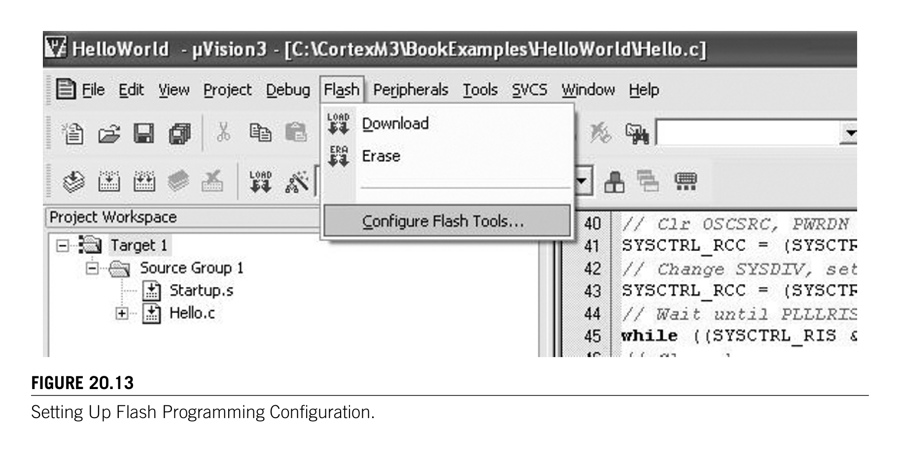
*Description*: Technical diagram and schematic illustration detailing hardware circuit topology, signal routing, and logic operations for Figure 20.13.

> **Figure 20.13**

317

## 20.4  Testing the Software

no parity, and 1 stop bit; and switching the General Purpose Input/Output (GPIO) port to alternate
function because the UART pins are shared with the GPIO port A. Before accessing the UART and the
GPIO, the clocks for these blocks must be turned on. This is done by writing to SYSCTRL_RCGC1 and
SYSCTRL_RCGC2.
The retargeting code is carried out by fputc, a predefined function name for character outputs.
This function calls the sendchar function to output the character to the UART. The sendchar func-
tion outputs an extra carriage return character as a new line is detected. This is needed to get the text
output correct on HyperTerminal; otherwise, the new text in the next line will overwrite the previous
line of text.
After the hello.c program is modified to include the retargeting code, the program is compiled
again.

## 20.4  Testing the Software

If you’ve got the Luminary Micro LM3S811 evaluation board, you can try out the example by down-
loading the compile program into Flash and getting the “Hello world” message display output from
the HyperTerminal. Assuming that you have set up the software drivers that come with the evaluation
board, you can download and test the program by following these steps.
First, set up the Flash download option. This can be accessed from the Flash pull-down menu, as
shown in Figure 20.13.
Inside this menu, we select the Luminary Evaluation Board as the download target for this example
(see Figure 20.14). In this menu, we also can see that μVision supports a number of different debug
hardware.
After selecting the flash download target, we might need to click on the Setting button to ensure that
a suitable setting is used. (The settings are shown in Figure 20.15.)
Figure 20.13
Setting Up Flash Programming Configuration.


<!-- Page 345 -->
### [PDF Page 345]


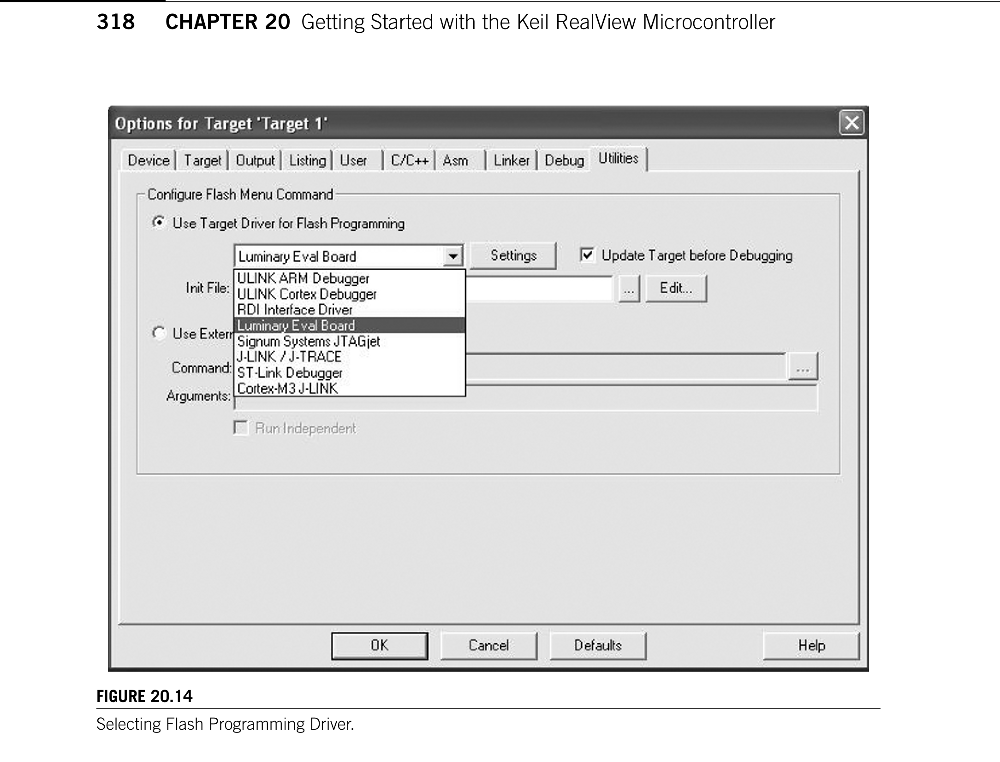
*Description*: Technical diagram and schematic illustration detailing hardware circuit topology, signal routing, and logic operations for Figure 20.14.

> **Figure 20.14**


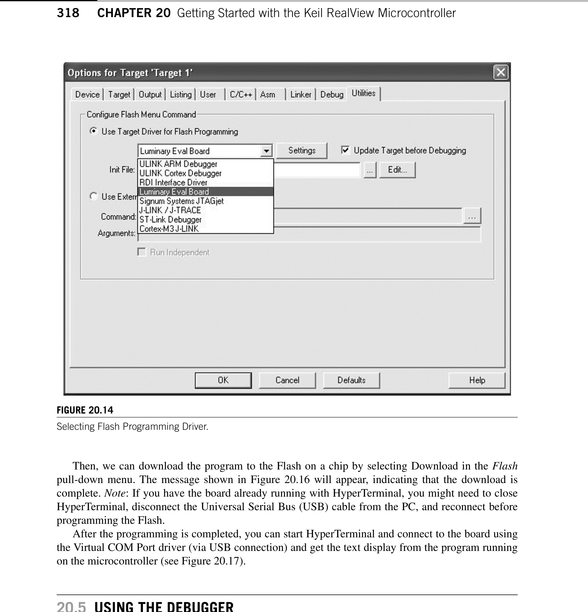
*Description*: Technical diagram and schematic illustration detailing hardware circuit topology, signal routing, and logic operations for Figure 20.16.

> **Figure 20.16**


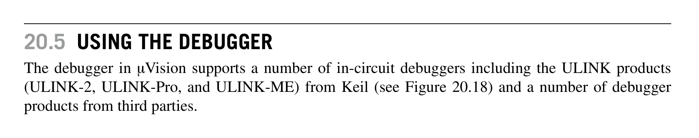
*Description*: Technical diagram and schematic illustration detailing hardware circuit topology, signal routing, and logic operations for Figure 20.18.

> **Figure 20.18**

318
CHAPTER 20  Getting Started with the Keil RealView Microcontroller
Figure 20.14
Selecting Flash Programming Driver.
Then, we can download the program to the Flash on a chip by selecting Download in the Flash
pull-down menu. The message shown in Figure 20.16 will appear, indicating that the download is
complete. Note: If you have the board already running with HyperTerminal, you might need to close
HyperTerminal, disconnect the Universal Serial Bus (USB) cable from the PC, and reconnect before
programming the Flash.
After the programming is completed, you can start HyperTerminal and connect to the board using
the Virtual COM Port driver (via USB connection) and get the text display from the program running
on the microcontroller (see Figure 20.17).

## 20.5  Using the Debugger

The debugger in μVision supports a number of in-circuit debuggers including the ULINK products
(ULINK-2, ULINK-Pro, and ULINK-ME) from Keil (see Figure 20.18) and a number of debugger
products from third parties.


<!-- Page 346 -->
### [PDF Page 346]


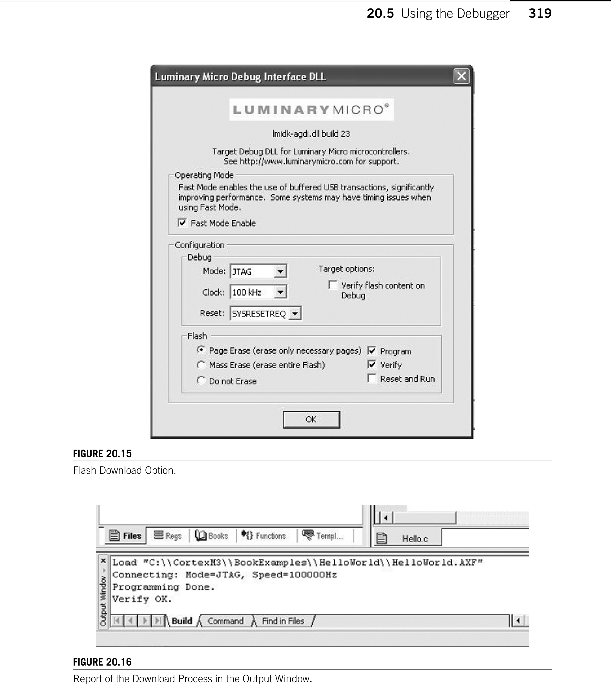
*Description*: Technical diagram and schematic illustration detailing hardware circuit topology, signal routing, and logic operations for Figure 20.15.

> **Figure 20.15**


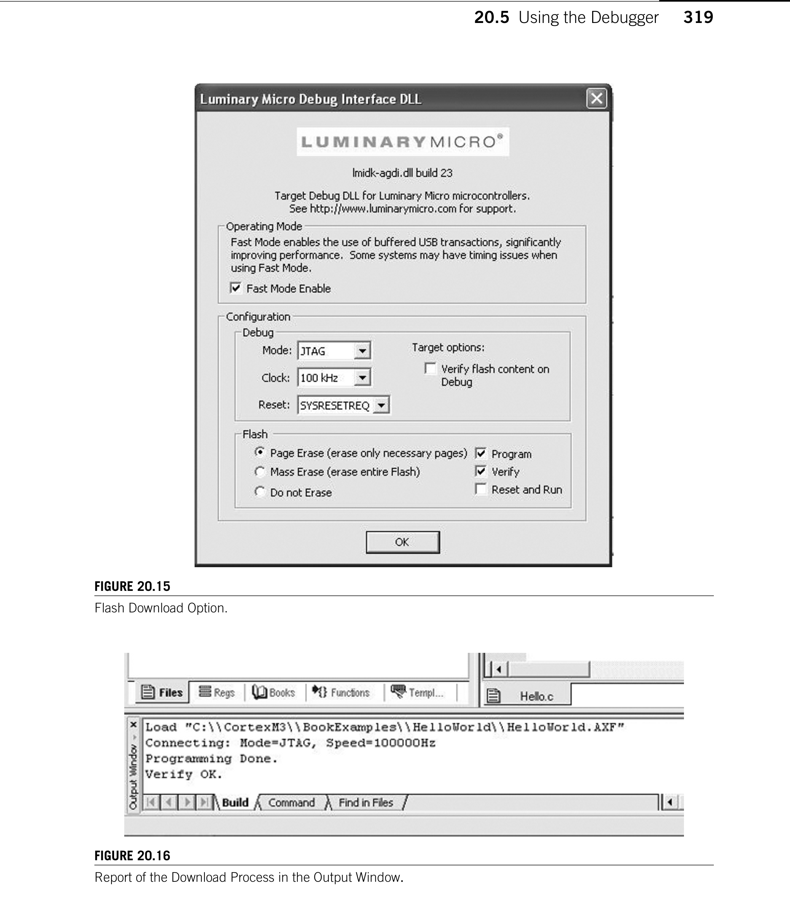
*Description*: Technical diagram and schematic illustration detailing hardware circuit topology, signal routing, and logic operations for Figure 20.16.

> **Figure 20.16**

319

## 20.5  Using the Debugger

Figure 20.15
Flash Download Option.
Figure 20.16
Report of the Download Process in the Output Window.


<!-- Page 347 -->
### [PDF Page 347]


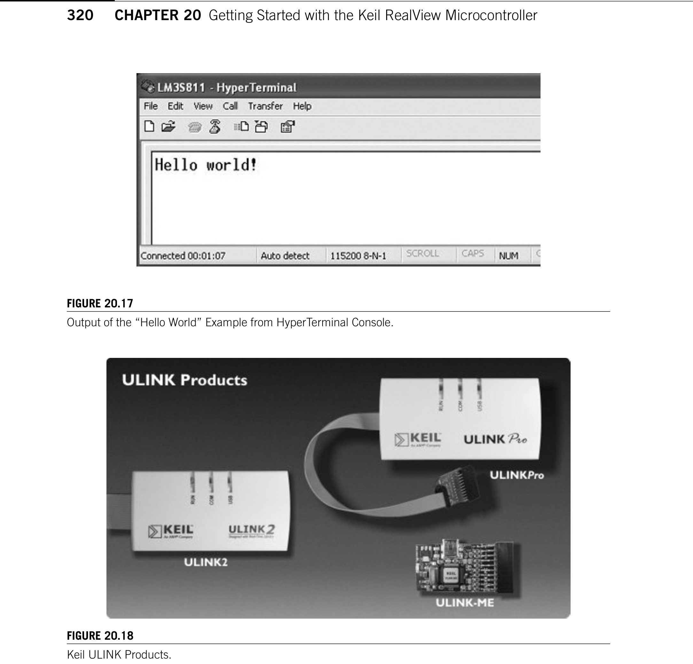
*Description*: Technical diagram and schematic illustration detailing hardware circuit topology, signal routing, and logic operations for Figure 20.17.

> **Figure 20.17**


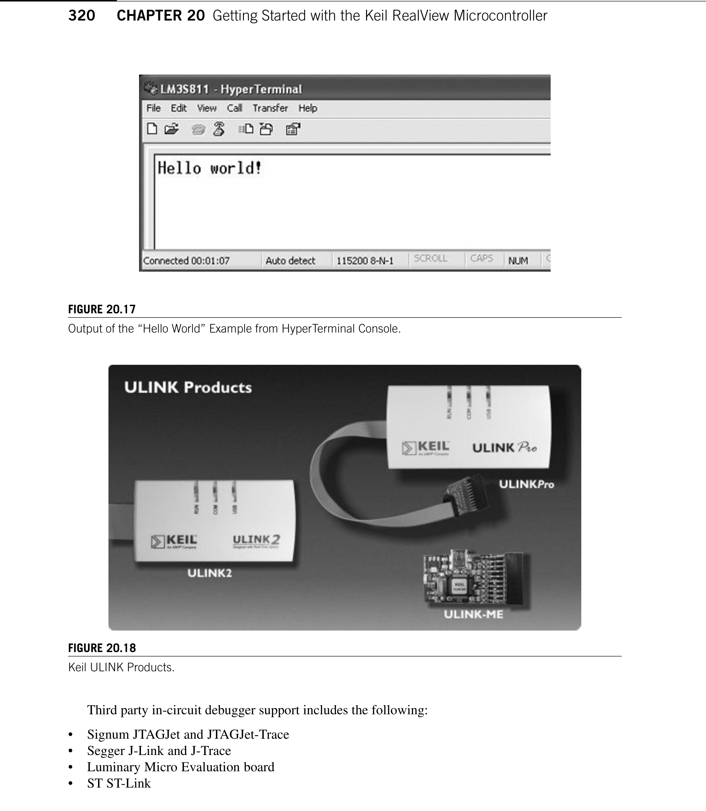
*Description*: Technical diagram and schematic illustration detailing hardware circuit topology, signal routing, and logic operations for Figure 20.18.

> **Figure 20.18**

320
CHAPTER 20  Getting Started with the Keil RealView Microcontroller
Figure 20.17
Output of the “Hello World” Example from HyperTerminal Console.
Third party in-circuit debugger support includes the following:
Signum JTAGJet and JTAGJet-Trace
•
Segger J-Link and J-Trace
•
Luminary Micro Evaluation board
•
ST ST-Link
•
Figure 20.18
Keil ULINK Products.


<!-- Page 348 -->
### [PDF Page 348]


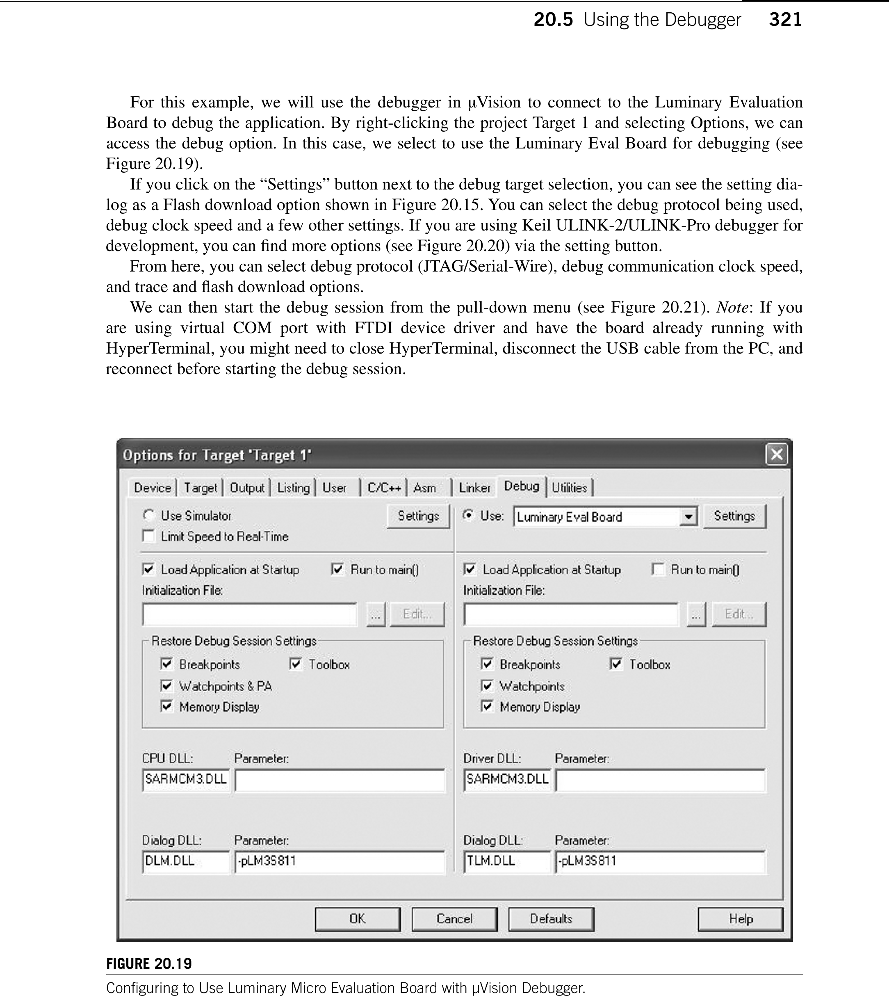
*Description*: Technical diagram and schematic illustration detailing hardware circuit topology, signal routing, and logic operations for Figure 20.19.

> **Figure 20.19**

321

## 20.5  Using the Debugger

Figure 20.19
Configuring to Use Luminary Micro Evaluation Board with μVision Debugger.
For this example, we will use the debugger in μVision to connect to the Luminary Evaluation
Board to debug the application. By right-clicking the project Target 1 and selecting Options, we can
access the debug option. In this case, we select to use the Luminary Eval Board for debugging (see
Figure 20.19).
If you click on the “Settings” button next to the debug target selection, you can see the setting dia-
log as a Flash download option shown in Figure 20.15. You can select the debug protocol being used,
debug clock speed and a few other settings. If you are using Keil ULINK-2/ULINK-Pro debugger for
development, you can find more options (see Figure 20.20) via the setting button.
From here, you can select debug protocol (JTAG/Serial-Wire), debug communication clock speed,
and trace and flash download options.
We can then start the debug session from the pull-down menu (see Figure 20.21). Note: If you
are using virtual COM port with FTDI device driver and have the board already running with
­HyperTerminal, you might need to close HyperTerminal, disconnect the USB cable from the PC, and
reconnect before starting the debug session.


<!-- Page 349 -->
### [PDF Page 349]


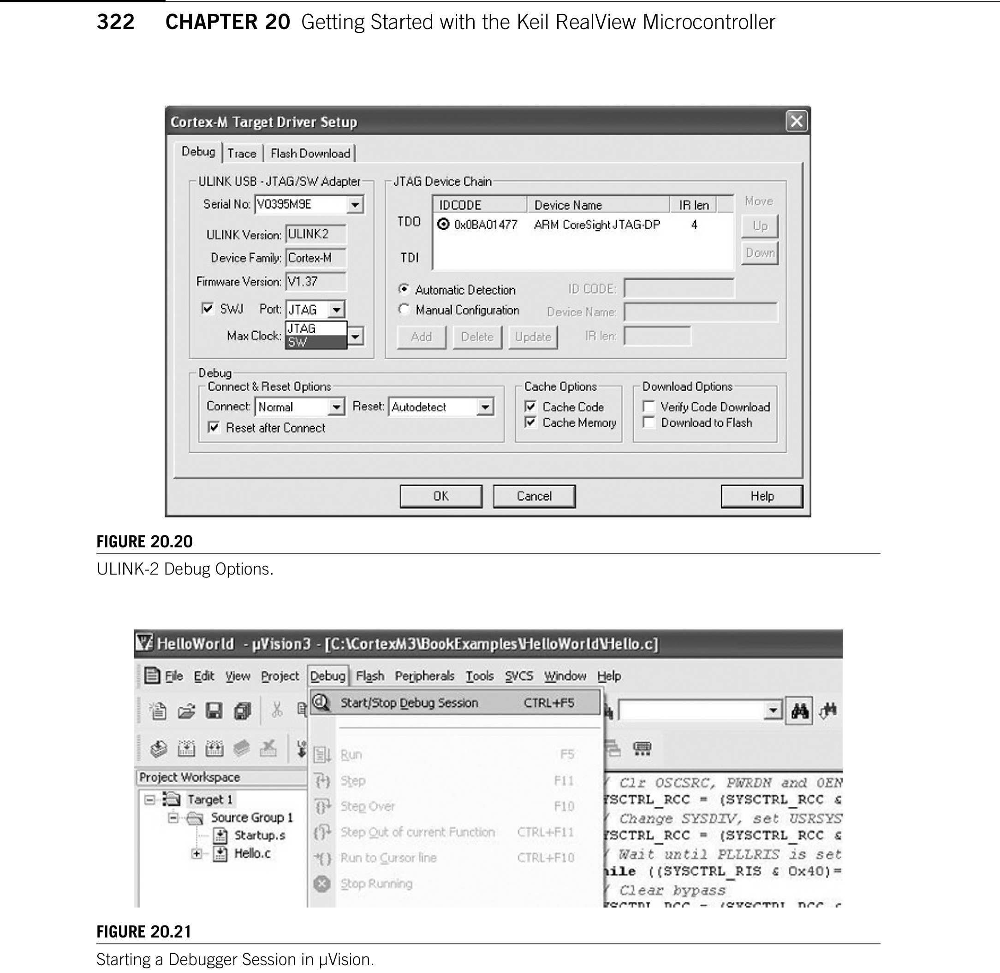
*Description*: Technical diagram and schematic illustration detailing hardware circuit topology, signal routing, and logic operations for Figure 20.20.

> **Figure 20.20**


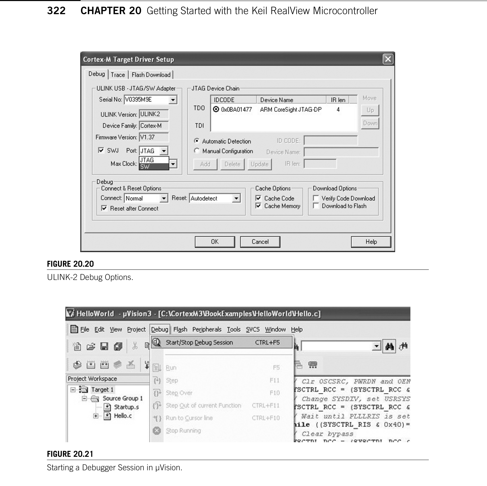
*Description*: Technical diagram and schematic illustration detailing hardware circuit topology, signal routing, and logic operations for Figure 20.21.

> **Figure 20.21**


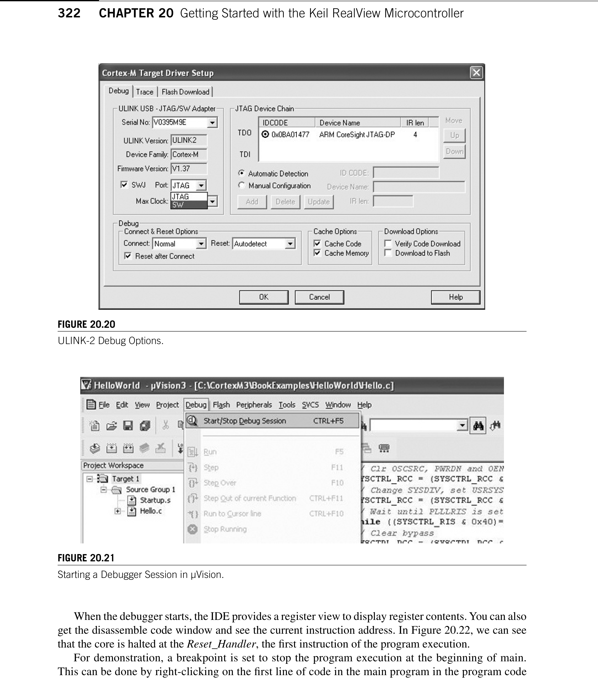
*Description*: Technical diagram and schematic illustration detailing hardware circuit topology, signal routing, and logic operations for Figure 20.22.

> **Figure 20.22**

322
CHAPTER 20  Getting Started with the Keil RealView Microcontroller
Figure 20.20
ULINK-2 Debug Options.
Figure 20.21
Starting a Debugger Session in μVision.
When the debugger starts, the IDE provides a register view to display register contents. You can also
get the disassemble code window and see the current instruction address. In Figure 20.22, we can see
that the core is halted at the Reset_Handler, the first instruction of the program execution.
For demonstration, a breakpoint is set to stop the program execution at the beginning of main.
This can be done by right-clicking on the first line of code in the main program in the program code


<!-- Page 350 -->
### [PDF Page 350]


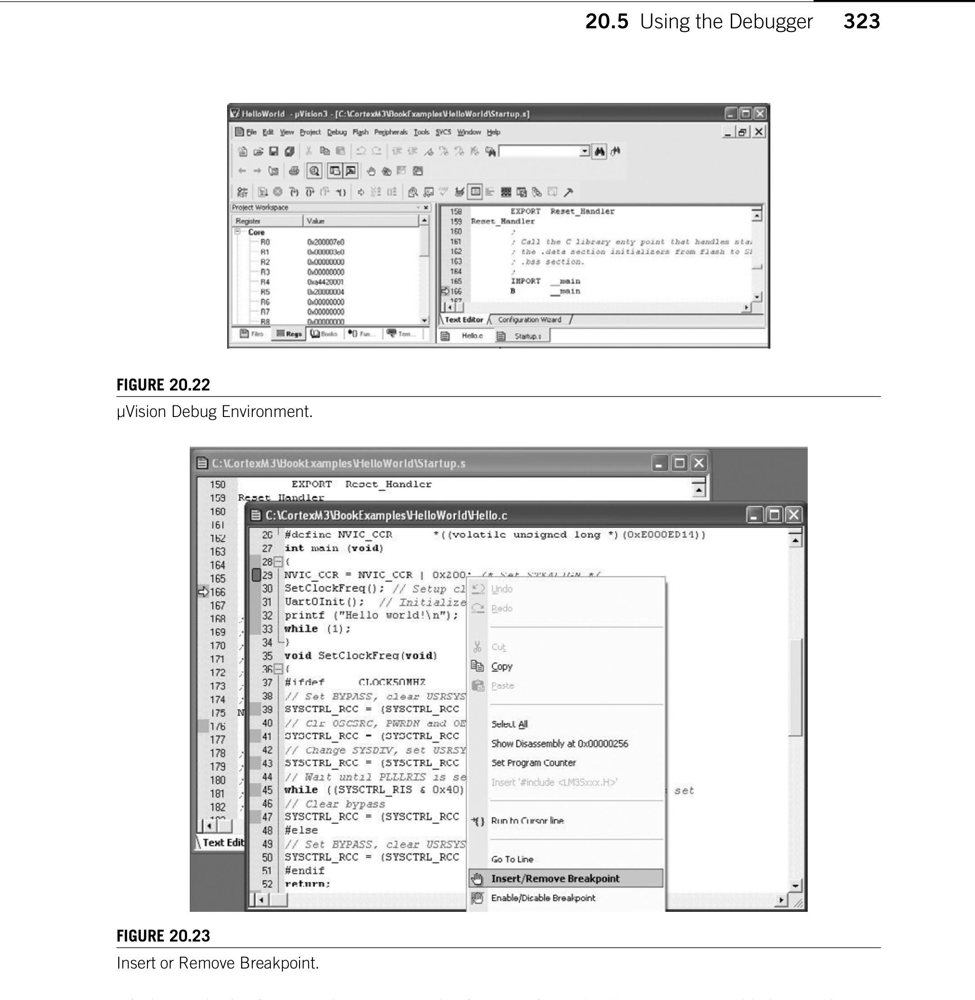
*Description*: Technical diagram and schematic illustration detailing hardware circuit topology, signal routing, and logic operations for Figure 20.22.

> **Figure 20.22**


*Description*: Technical diagram and schematic illustration detailing hardware circuit topology, signal routing, and logic operations for Figure 20.23.

> **Figure 20.23**

323

## 20.5  Using the Debugger

Figure 20.22
μVision Debug Environment.
window and selecting Insert/Remove Breakpoint (see Figure 20.23). Note: We could also use the Run
to main( ) feature in the debug option to get the program execution to stop at the beginning of main.
After the breakpoint is added, a red marker will be shown in the left side of the code line as shown
in line 29 of the code in Figure 20.23. The program execution can then be started using the Run button
on the tool bar (see Figure 20.24).
Figure 20.23
Insert or Remove Breakpoint.


<!-- Page 351 -->
### [PDF Page 351]


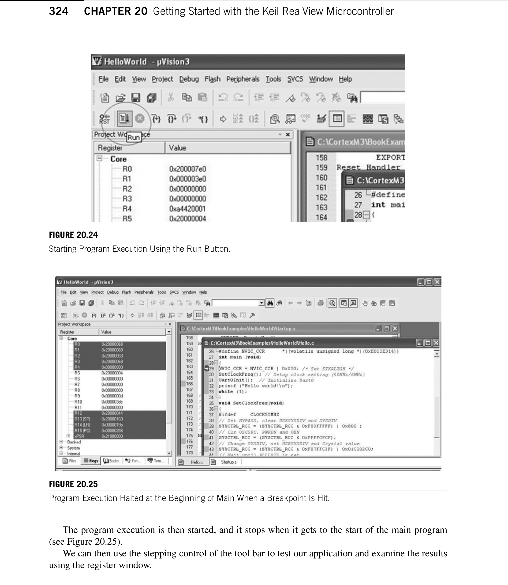
*Description*: Technical diagram and schematic illustration detailing hardware circuit topology, signal routing, and logic operations for Figure 20.25.

> **Figure 20.25**


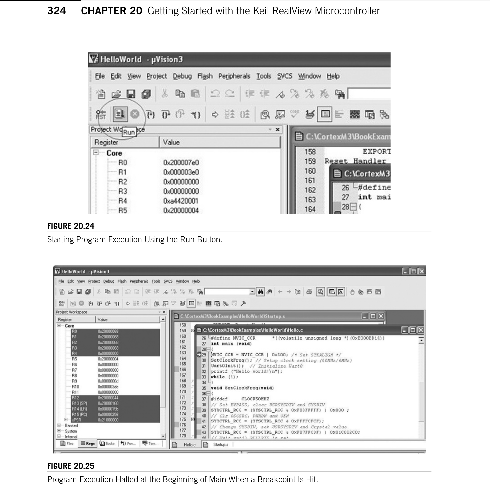
*Description*: Technical diagram and schematic illustration detailing hardware circuit topology, signal routing, and logic operations for Figure 20.24.

> **Figure 20.24**

324
CHAPTER 20  Getting Started with the Keil RealView Microcontroller
Figure 20.25
Program Execution Halted at the Beginning of Main When a Breakpoint Is Hit.
Figure 20.24
Starting Program Execution Using the Run Button.
The program execution is then started, and it stops when it gets to the start of the main program
(see Figure 20.25).
We can then use the stepping control of the tool bar to test our application and examine the results
using the register window.


<!-- Page 352 -->
### [PDF Page 352]


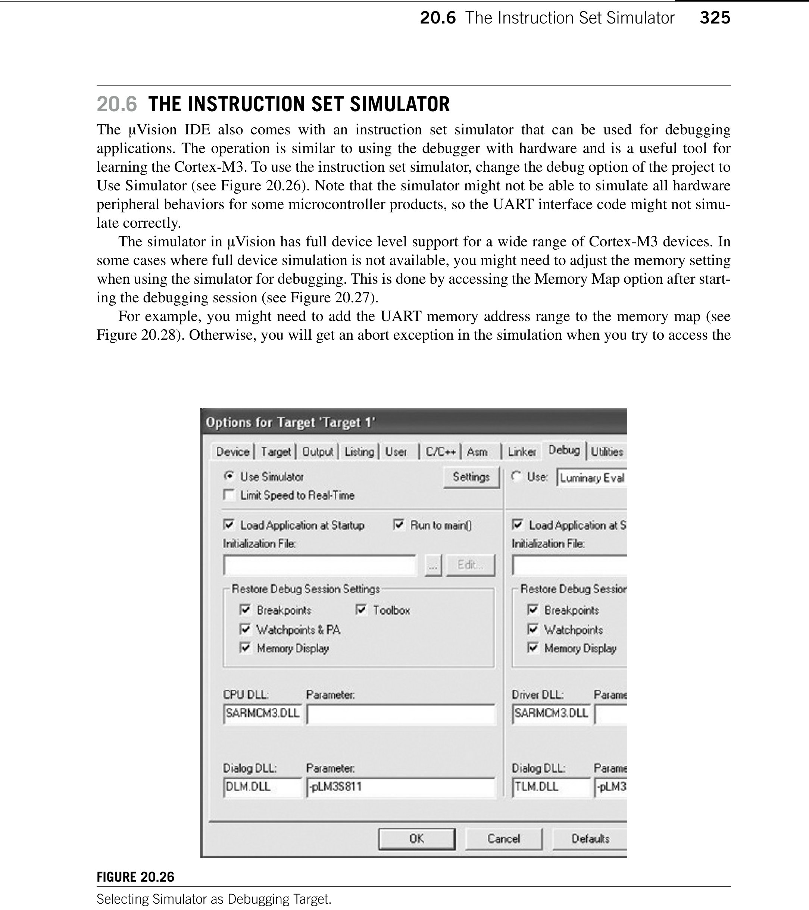
*Description*: Technical diagram and schematic illustration detailing hardware circuit topology, signal routing, and logic operations for Figure 20.26.

> **Figure 20.26**

325

## 20.6  The Instruction Set Simulator

Figure 20.26
Selecting Simulator as Debugging Target.

## 20.6  The Instruction Set Simulator

The μVision IDE also comes with an instruction set simulator that can be used for debugging
­applications. The operation is similar to using the debugger with hardware and is a useful tool for
learning the Cortex-M3. To use the instruction set simulator, change the debug option of the project to
Use Simulator (see Figure 20.26). Note that the simulator might not be able to simulate all hardware
peripheral behaviors for some microcontroller products, so the UART interface code might not simu-
late correctly.
The simulator in μVision has full device level support for a wide range of Cortex-M3 devices. In
some cases where full device simulation is not available, you might need to adjust the memory setting
when using the simulator for debugging. This is done by accessing the Memory Map option after start-
ing the debugging session (see Figure 20.27).
For example, you might need to add the UART memory address range to the memory map (see
Figure 20.28). Otherwise, you will get an abort exception in the simulation when you try to access the


<!-- Page 353 -->
### [PDF Page 353]


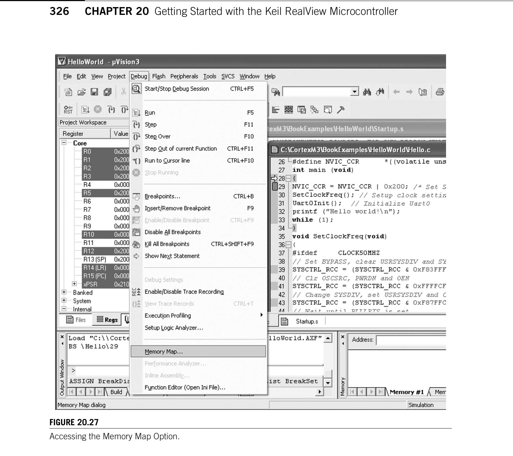
*Description*: Technical diagram and schematic illustration detailing hardware circuit topology, signal routing, and logic operations for Figure 20.27.

> **Figure 20.27**

326
CHAPTER 20  Getting Started with the Keil RealView Microcontroller
Figure 20.27
Accessing the Memory Map Option.
UART. But in most cases, all of the required memory map should have been set up for you when you
specified a microcontroller, so usually this is not necessary.

## 20.7  Modifying the Vector Table

In the previous example, the vector table is defined inside the file Startup.s, which is a standard startup
code the tool prepares automatically. This file contains the vector table, a default reset handler, a default
nonmaskable interrupt (NMI) handler, a default hard fault handler, and a default interrupt handler.
These exception handlers might need to be customized or modified, depending on your application. For


<!-- Page 354 -->
### [PDF Page 354]


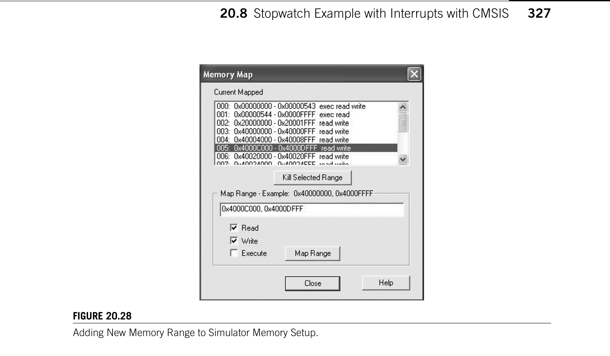
*Description*: Technical diagram and schematic illustration detailing hardware circuit topology, signal routing, and logic operations for Figure 20.28.

> **Figure 20.28**


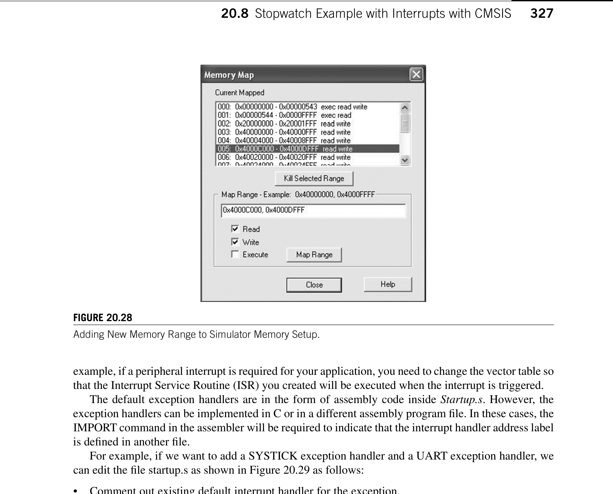
*Description*: Technical diagram and schematic illustration detailing hardware circuit topology, signal routing, and logic operations for Figure 20.29.

> **Figure 20.29**


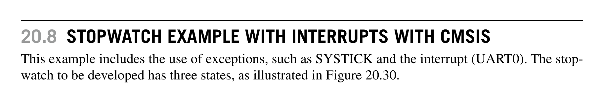
*Description*: Technical diagram and schematic illustration detailing hardware circuit topology, signal routing, and logic operations for Figure 20.30.

> **Figure 20.30**

327

## 20.8  Stopwatch Example with Interrupts with CMSIS

Figure 20.28
Adding New Memory Range to Simulator Memory Setup.
example, if a peripheral interrupt is required for your application, you need to change the vector table so
that the Interrupt Service Routine (ISR) you created will be executed when the interrupt is triggered.
The default exception handlers are in the form of assembly code inside Startup.s. However, the
exception handlers can be implemented in C or in a different assembly program file. In these cases, the
IMPORT command in the assembler will be required to indicate that the interrupt handler address label
is defined in another file.
For example, if we want to add a SYSTICK exception handler and a UART exception handler, we
can edit the file startup.s as shown in Figure 20.29 as follows:
Comment out existing default interrupt handler for the exception.
•
Add the IMPORT commands for the two exception vectors that are defined in the C-code. This is
•
required if the handlers are in a separated C or assembly program file.
Add the exception vectors in the vector table with Define Constant Data (DCD) command.
•
These modifications of startup code (startup.s) for adding exception handlers are not required with
Cortex Microcontroller Software Interface Standard (CMSIS) compliant device driver libraries if the
name of the exception handlers match the handler names specific in the CMSIS startup code. The next
example illustrates how this is done.

## 20.8  Stopwatch Example with Interrupts with CMSIS

This example includes the use of exceptions, such as SYSTICK and the interrupt (UART0). The stop-
watch to be developed has three states, as illustrated in Figure 20.30.


<!-- Page 355 -->
### [PDF Page 355]


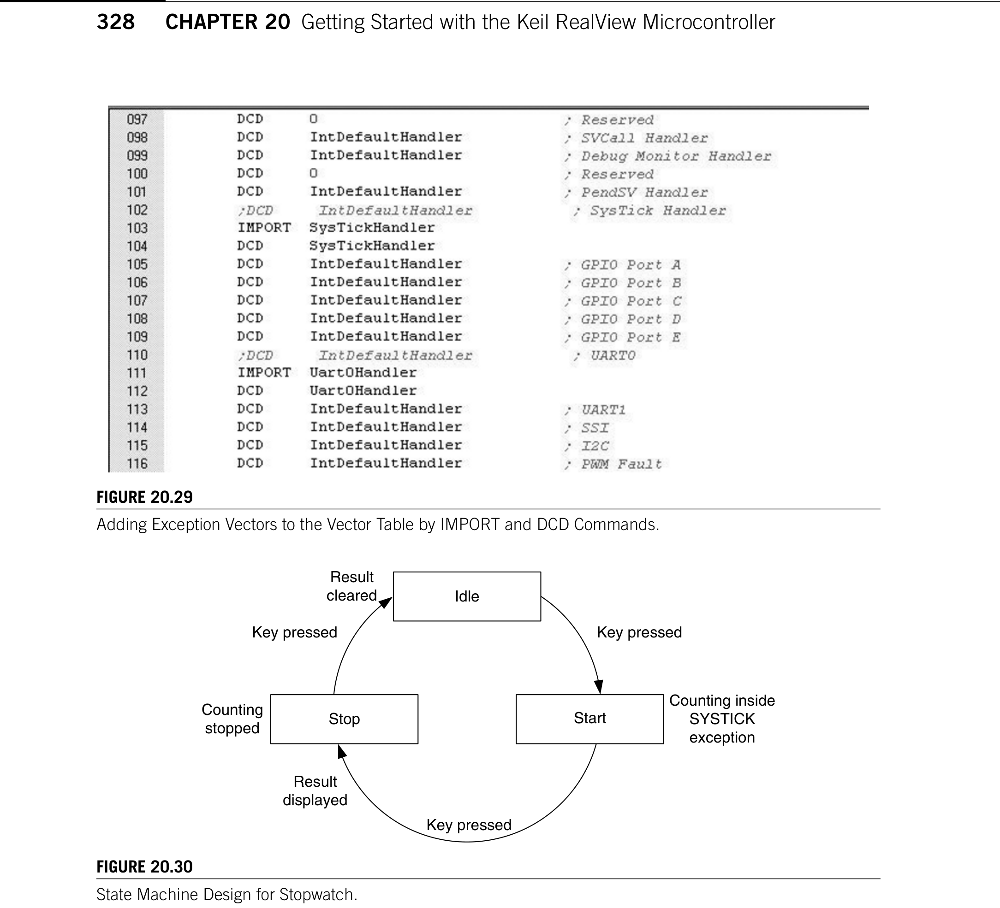
*Description*: Technical diagram and schematic illustration detailing hardware circuit topology, signal routing, and logic operations for Figure 20.29.

> **Figure 20.29**


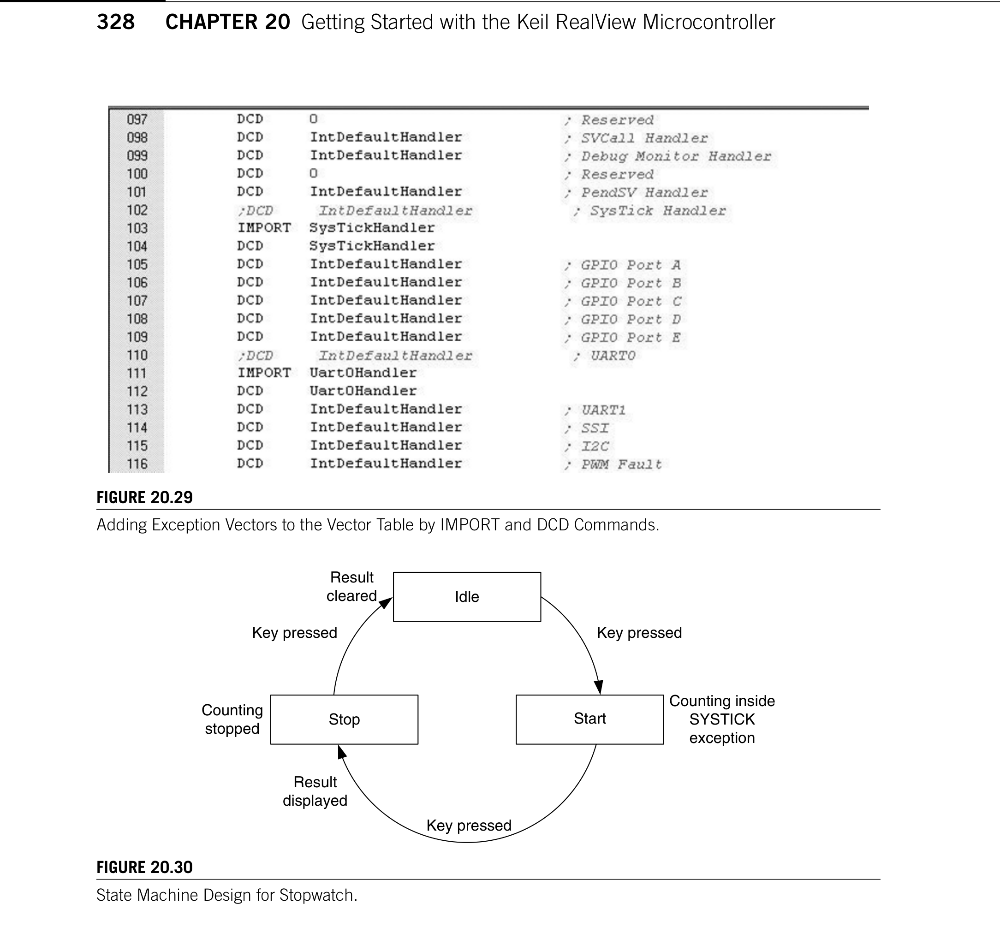
*Description*: Technical diagram and schematic illustration detailing hardware circuit topology, signal routing, and logic operations for Figure 20.30.

> **Figure 20.30**

328
CHAPTER 20  Getting Started with the Keil RealView Microcontroller
Figure 20.29
Adding Exception Vectors to the Vector Table by IMPORT and DCD Commands.
Figure 20.30
State Machine Design for Stopwatch.
Idle
Start
Stop
Key pressed
Key pressed
Key pressed
Counting inside
SYSTICK
exception
Counting
stopped
Result
displayed
Result
cleared
Based on the previous example, the stopwatch is controlled by the PC using the UART interface. To
simplify the example code, we fix the operating speed at 50 MHz.
The timing measurement is carried out by the SYSTICK, which interrupts the processor at 100 Hz.
The SYSTICK is running from the core clock frequency at 50 MHz. Every time the SYSTICK excep-
tion handler is executed and if the stopwatch is running, the counter variable TickCounter increments.
Since display of text via UART is relatively slow, the control of the stopwatch is handled inside the
exception handler and the display of the text and stopwatch values is carried out in the main (thread
level). A simple software state machine is used to control the start, stop, and clear of the stopwatch.


<!-- Page 356 -->
### [PDF Page 356]


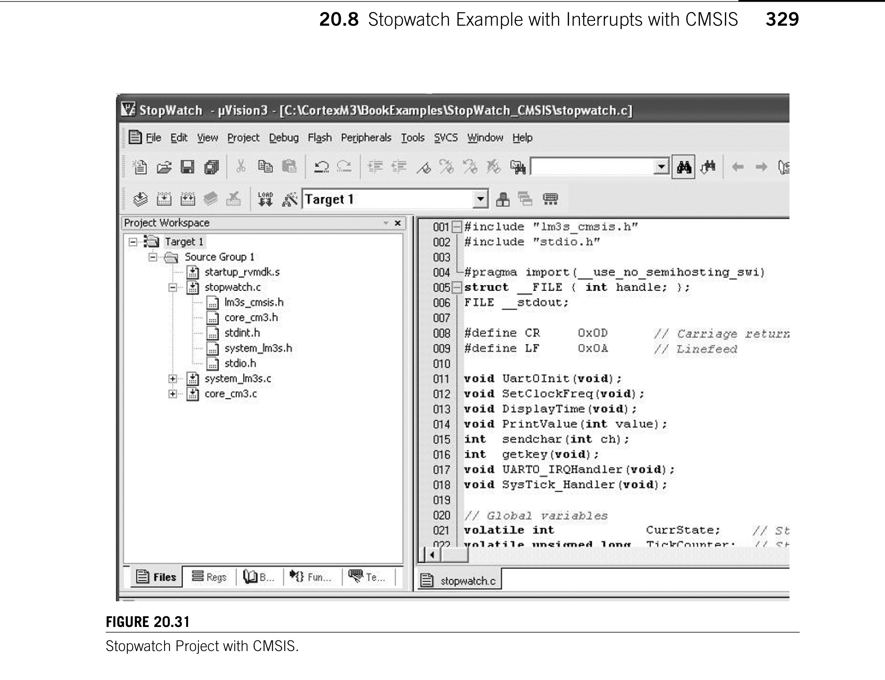
*Description*: Technical diagram and schematic illustration detailing hardware circuit topology, signal routing, and logic operations for Figure 20.31.

> **Figure 20.31**

329

## 20.8  Stopwatch Example with Interrupts with CMSIS

The state machine is controlled via the UART handler, which is triggered every time a character is
received.
Using the same procedure we used for the “Hello world” example, let’s start a new project called
stopwatch. Instead of having hello.c, a C program file called stopwatch.c is added. In addition, we
added a number of other files from the CMSIS in the project.
In Figure 20.31, we can see that the Startup.s is replaced by startup_rvmdk.s, and lm3s_cmsis.h is
included in the stopwatch.c. In addition, system_lm3s.c and core_cm3.c are also included in the project.
The file system_lm3s.c contains SystemInit() function that we use in the program. The file core_cm3.c
contains intrinsic functions. Despite that this example does not use any intrinsic function, this file is
included for completeness.
Some of these filenames are microcontroller vendor specific (e.g., startup_rvmdk.s, and lm3s_
cmsis.h). These CMSIS files used in this project can be found in CMSIS compliant device driver librar-
ies or from the CMSIS files available from www.onarm.com.
Use of CMSIS reduces the complexity of the stopwatch.c because peripheral register definitions
and a number of system functions are provided by CMSIS.
Figure 20.31
Stopwatch Project with CMSIS.


<!-- Page 357 -->
### [PDF Page 357]

330
CHAPTER 20  Getting Started with the Keil RealView Microcontroller
stopwatch.c

```c
#include "lm3s_cmsis.h" // Vendor specific CMSIS header
#include "stdio.h"       // For printf function
```

#pragma import(__use_no_semihosting_swi)
struct __FILE { int handle; };
FILE __stdout;
// Special characters for display function
#define CR 0x0D      // Carriage return
#define LF 0x0A      // Linefeed
// Function definitions

```c
void Uart0Init(void);
// Initialization of UART0
void SetClockFreq(void);
// Set clock frequency to 50MHz
void DisplayTime(void);
// Display time value
int  sendchar(int ch);
// Output character to UART
int  getkey(void);                  // Read charcter from UART
void UART0_IRQHandler(void);
// UART0 interrupt handler
void SysTick_Handler(void);
// SysTick exception handler
// Global variables
volatile int              CurrState;    // State machine
volatile unsigned long  TickCounter;  // Stop watch value
volatile int              KeyReceived;  // Indicate user pressed a key
volatile int              userinput;   // Key pressed by user
```

#define IDLE_STATE 0                            // Definition of state machine
#define RUN_STATE	 1
#define STOP_STATE	2

```c
int main (void)
```

{

```c
int      CurrStateLocal; // A local copy of current state
SystemInit();      // System initialization – part of CMSIS standard
// Not required with CMSIS v1.30 or after
// because this is done in startup code.
SetClockFreq();
// Setup clock setting (50MHz)
// Initialize global variable
CurrState = 0;
KeyReceived = 0;
// Initialization of hardware
SCB->CCR = SCB->CCR | 0x200; // Set STKALIGN
Uart0Init();                    // Initialize Uart0
SysTick_Config(499999);        // Initialize Systick (CMSIS function)
printf ("Stop Watch\n");
```

while (1) {
CurrStateLocal = CurrState; // Make a local copy because the
// value could change by UART handler at any time.
switch (CurrStateLocal) {
case (IDLE_STATE):
printf ("\nPress any key to start\n");
break;
case (RUN_STATE):
printf ("\nPress any key to stop\n");
break;
case (STOP_STATE):
printf ("\nPress any key to clear\n");
break;


<!-- Page 358 -->
### [PDF Page 358]

331

## 20.8  Stopwatch Example with Interrupts with CMSIS

default:
CurrState = IDLE_STATE;
break;
} // end of switch
while (KeyReceived == 0) {
if (CurrStateLocal==RUN_STATE){
DisplayTime();
}
}; // Wait for user input
if (CurrStateLocal==STOP_STATE) {
TickCounter=0;
DisplayTime(); // Display to indicate result is cleared
}
else if (CurrStateLocal==RUN_STATE) {
DisplayTime(); // Display result
}
if (KeyReceived!=0) KeyReceived=0;
}; // end of while loop
} // end of main

```c
void SetClockFreq(void) // Set processor and UART clock
```

{
// Set BYPASS, clear USRSYSDIV and SYSDIV
SYSCTL->RCC = (SYSCTL->RCC & 0xF83FFFFF) | 0x800 ;
// Clr OSCSRC, PWRDN and OEN
SYSCTL->RCC = (SYSCTL->RCC & 0xFFFFCFCF);
// Change SYSDIV, set USRSYSDIV and Crystal value
SYSCTL->RCC = (SYSCTL->RCC & 0xF87FFC3F) | 0x01C002C0;
// Wait until PLLLRIS is set
while ((SYSCTL->RIS & 0x40)==0); // wait until PLLLRIS is set
// Clear bypass
SYSCTL->RCC = (SYSCTL->RCC & 0xFFFFF7FF);
return;
}
// UART0 initialization

```c
void Uart0Init(void)
```

{ // Clock for UART functions
SYSCTL->RCGC1 = SYSCTL->RCGC1 | 0x0003; // Enable UART0 & UART1 clock
SYSCTL->RCGC2 = SYSCTL->RCGC2 | 0x0001; // Enable PORTA clock
// UART setup
UART0->CTL = 0;        // Disable UART
UART0->IBRD = 27;    // Program baud rate for 50MHz clock
UART0->FBRD = 9;
UART0->LCRH = 0x60;  // 8 bit, no parity
UART0->CTL = 0x301;   // Enable TX and RX, and UART enable
UART0->IM = 0x10;     // Enable UART interrupt for receive data
GPIOA->AFSEL = GPIOA->AFSEL | 0x3; // Use GPIO pins as UART0
NVIC_EnableIRQ(UART0_IRQn); // Enable UART interrupt at NVIC
//(CMSIS function)
return;
}
// SYSTICK exception handler

```c
void SysTick_Handler(void) // Function name is conform to CMSIS
```

{
if (CurrState==RUN_STATE) {
TickCounter++;
}
Continued


<!-- Page 359 -->
### [PDF Page 359]

332
CHAPTER 20  Getting Started with the Keil RealView Microcontroller
return;
}
// UART0 RX interrupt handler

```c
void UART0_IRQHandler(void) // Function name defined in CMSIS startup code
```

{
userinput = getkey();
// Indicate a key has been received
KeyReceived++;
// De-assert UART interrupt
UART0->ICR = 0x10;
// Switch state
switch (CurrState) {
case (IDLE_STATE):
CurrState = RUN_STATE;
break;
case (RUN_STATE):
CurrState = STOP_STATE;
break;
case (STOP_STATE):
CurrState = IDLE_STATE;
break;
default:
CurrState = IDLE_STATE;
break;
} // end of switch
return;
}
// Display the time value

```c
void DisplayTime(void)
```

{
unsigned long TickCounterCopy;
unsigned long TmpValue;
sendchar(CR);
TickCounterCopy = TickCounter; // Make a local copy because the
// value could change by SYSTICK handler at any time.
TmpValue        = TickCounterCopy / 6000; // Minutes
printf ("%d", TmpValue);
TickCounterCopy = TickCounterCopy – (TmpValue * 6000);
TmpValue        = TickCounterCopy / 100; // Seconds
sendchar(':');
printf ("%d", TmpValue);
TmpValue        = TickCounterCopy – (TmpValue * 100);
sendchar(':');
printf ("%d", TmpValue); // mini-seconds
sendchar(' ');
sendchar(' ');
return;
}
// Output a character to UART0 (used by printf function to output data)

```c
int sendchar (int ch){
if (ch == '\n'){
while ((UART0->FR & 0x8)); // Wait if it is busy
UART0->DR = CR; // output extra CR to get correct
```

// display on hyperterminal
}
while ((UART0->FR & 0x8)); // Wait if it is busy


<!-- Page 360 -->
### [PDF Page 360]


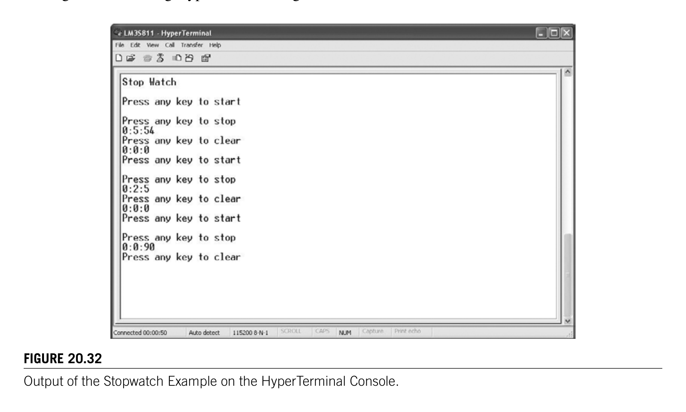
*Description*: Technical diagram and schematic illustration detailing hardware circuit topology, signal routing, and logic operations for Figure 20.32.

> **Figure 20.32**

333

## 20.8  Stopwatch Example with Interrupts with CMSIS

return (UART0->DR = ch); // output data
}
// Get user input

```c
int getkey (void) { // Read character from Serial Port
```

while (UART0->FR & 0x10); // Wait if RX FIFO empty
return (UART0->DR);
}
// Retarget text output

```c
int fputc(int ch, FILE *f) {
```

return (sendchar(ch));
}

```c
void _sys_exit(int return_code) {
```

/* dummy exit */
label: goto label; /* endless loop */
}
When compared with the previous “Hello world” example, the UART initialization has changed slightly to
enable interrupts when a character is received via the UART interface. To enable the UART interrupt request,
the interrupt has to be enabled at the UART Interrupt Mask register, as well as at the NVIC. For the SYS-
TICK, only the exception control at the SYSTICK Control and Status register needs to be programmed.
In addition, a number of extra functions are added, including the UART and SYSTICK handlers,
display functions, and SYSTICK initialization. Depending on the design of the peripheral, an excep-
tion/interrupt handler might need to clear the exception/interrupt request. In this case, the UART han-
dler clears the UART interrupt request using the Interrupt Clear register (UART0->ICR).
After the program is compiled and downloaded to the evaluation board, it can then be tested by con-
necting to a PC running HyperTerminal. Figure 20.32 shows the result.
Figure 20.32
Output of the Stopwatch Example on the HyperTerminal Console.


<!-- Page 361 -->
### [PDF Page 361]

334
CHAPTER 20  Getting Started with the Keil RealView Microcontroller

## 20.9  Porting Existing Applications to Use CMSIS

It is easy to port existing Cortex-M3 applications to use CMSIS. The modifications include the
following:
Replace the default startup code with CMSIS startup code for the targeted microcontroller.
•
Modify the project setup to include CMSIS file.
•
Modify the program to include CMSIS header file
•
Modify the register definitions with CMSIS register definitions
•
Replace existing processor peripheral access functions with CMSIS processor access functions.
•
Name of exception handlers might need to be modified to ensure that they match the exception
•
handler names used by the CMSIS startup code.
Peripheral setup code could be replaced by device driver library functions if available.
•
By changing the application code to use CMSIS, the application becomes more portable, as outlined
in Chapter 10.


