# Chapter 21. Programming the Cortex-M3 ­Microcontrollers in NI LabVIEW

> **Source PDF**: THE_DEFINITIVE_GUIDE_TO_THE_ARM_CORTEX-МЗ_Stellaris_MCU_9000Series_TEINSTRUMENTS_ARM_SECOND_EDITION.pdf  
> **PDF Page Range**: 362 - 375

---

<!-- Page 362 -->
### [PDF Page 362]

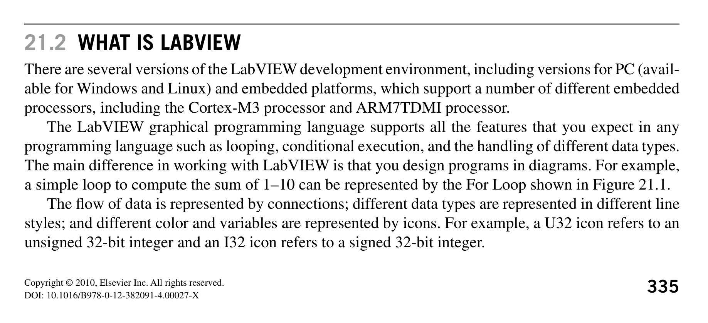
*Description*: Technical diagram and schematic illustration detailing hardware circuit topology, signal routing, and logic operations for Figure 21.1.

> **Figure 21.1**

335
Copyright © 2010, Elsevier Inc. All rights reserved.
DOI: 10.1016/B978-0-12-382091-4.00027-X
In This Chapter

### Overview............................................................................................................................................... 335

What Is LabVIEW................................................................................................................................... 335
Development Flow................................................................................................................................. 337
Example of a LabVIEW Project .............................................................................................................. 339
How It Works ....................................................................................................................................... 343
Additional Features in LabVIEW............................................................................................................. 344
Porting to Another ARM Processor......................................................................................................... 345

## 21.1  Overview

Besides C language and assembly language, there are other ways to create applications for Cortex™-M3
microcontrollers. One of the possible methods is by using the National Instruments LabVIEW graphical
development environment. You can use LabVIEW on PCs as well as ARM microcontrollers, including
Cortex-M3 microcontroller products.

## 21.2  What Is LabVIEW

There are several versions of the LabVIEW development environment, including versions for PC (avail-
able for Windows and Linux) and embedded platforms, which support a number of different embedded
processors, including the Cortex-M3 processor and ARM7TDMI processor.
The LabVIEW graphical programming language supports all the features that you expect in any
programming language such as looping, conditional execution, and the handling of different data types.
The main difference in working with LabVIEW is that you design programs in diagrams. For example,
a simple loop to compute the sum of 1–10 can be represented by the For Loop shown in Figure 21.1.
The flow of data is represented by connections; different data types are represented in different line
styles; and different color and variables are represented by icons. For example, a U32 icon refers to an
unsigned 32-bit integer and an I32 icon refers to a signed 32-bit integer.
Programming the Cortex-M3
­Microcontrollers in NI
LabVIEW
21
CHAPTER

<!-- Page 363 -->
### [PDF Page 363]

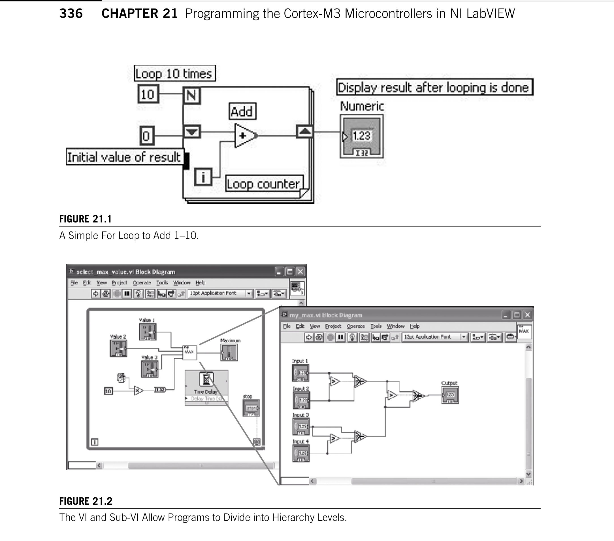
*Description*: Technical diagram and schematic illustration detailing hardware circuit topology, signal routing, and logic operations for Figure 21.2.

> **Figure 21.2**

*Description*: Technical diagram and schematic illustration detailing hardware circuit topology, signal routing, and logic operations for Figure 21.1.

> **Figure 21.1**

336
CHAPTER 21  Programming the Cortex-M3 ­Microcontrollers in NI LabVIEW
Similar to function calls and subroutines in traditional programming, in LabVIEW, you can design the
software into hierarchy of modules called virtual instruments (VIs). Data passing into and outputs from
­sub-VIs indicate connection points so that a higher-hierarchy VI can connect input variables and output vari-
ables to it. For example, the right side of Figure 21.2 shows a sub-VI block diagram that takes four 32-bit inte-
ger inputs and selects the largest value as output. On the left side, the sub-VI is used to find the largest values
from four 32-bit integer value sources: three from the slide bar control and one that is a random number.
The LabVIEW programming environment contains a large number of ready-to-use components
that make your software development easier. These include common data-processing functions (e.g.,
abs—absolute value), signal processing functions, such as filter and spectral analysis, and many user
interface components.
Figure 21.1
A Simple For Loop to Add 1–10.
Figure 21.2
The VI and Sub-VI Allow Programs to Divide into Hierarchy Levels.

<!-- Page 364 -->
### [PDF Page 364]

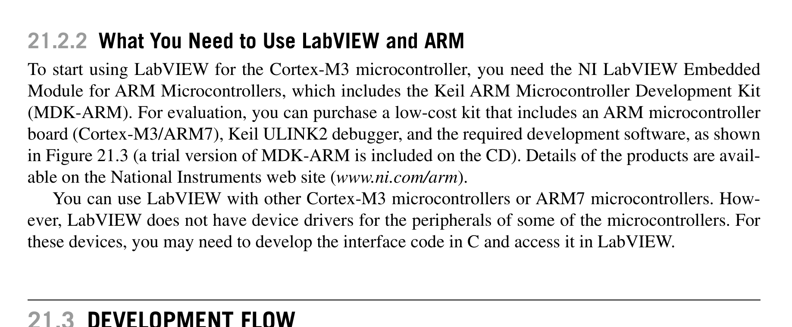
*Description*: Technical diagram and schematic illustration detailing hardware circuit topology, signal routing, and logic operations for Figure 21.3.

> **Figure 21.3**

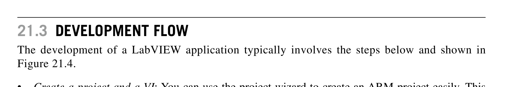
*Description*: Technical diagram and schematic illustration detailing hardware circuit topology, signal routing, and logic operations for Figure 21.4.

> **Figure 21.4**

337

## 21.2  Development Flow

21.2.1  Typical Application Areas
So how does LabVIEW programming compare with traditional programming?
Ease of use—The LabVIEW programming environment makes it much easier to develop complex
applications without the need to learn low-level hardware and software details. This allows different
types of users, from students to scientists, to develop their applications without spending time learning
processor architecture—they can focus on developing the algorithms and features. Domain-experts can
now take advantage of the benefits of microcontroller designs.
Component library—The large number of software components available in LabVIEW also makes
it easy to develop complex applications in a short time. The component library includes hundreds of
mathematical and signal processing functions to quickly develop algorithms. Applications running on
ARM microcontrollers can even connect to a graphical user interface (GUI) running on a PC so users
can control the embedded system and observe the output easily.
Multithreading support—The graphical programming environment is concurrent in nature. It allows
multiple threads to run at the same time. In contrast, in a traditional programming environment, it takes
time for an inexperienced engineer to learn an embedded real time operating system (RTOS) well
enough to develop a multithreading application.
Connectivity to test and data acquisition equipment—The LabVIEW programming environment
provides easy-to-use interface components to data acquisition equipment communications systems as
well as a large number of interface boards for industrial control and educational purposes.
The LabVIEW programming environment is popular in universities, laboratories, and scientific
research institutions. It is commonly used in data acquisition, testing system automation, algorithm
development and modeling, industrial control, and embedded system prototyping.
21.2.2  What You Need to Use LabVIEW and ARM
To start using LabVIEW for the Cortex-M3 microcontroller, you need the NI LabVIEW Embedded
Module for ARM Microcontrollers, which includes the Keil ARM Microcontroller Development Kit
(MDK-ARM). For evaluation, you can purchase a low-cost kit that includes an ARM microcontroller
board (Cortex-M3/ARM7), Keil ULINK2 debugger, and the required development software, as shown
in Figure 21.3 (a trial version of MDK-ARM is included on the CD). Details of the products are avail-
able on the National Instruments web site (www.ni.com/arm).
You can use LabVIEW with other Cortex-M3 microcontrollers or ARM7 microcontrollers. How-
ever, LabVIEW does not have device drivers for the peripherals of some of the microcontrollers. For
these devices, you may need to develop the interface code in C and access it in LabVIEW.

## 21.3  Development Flow

The development of a LabVIEW application typically involves the steps below and shown in
Figure 21.4.
•
Create a project and a VI: You can use the project wizard to create an ARM project easily. This
includes setting up the targeted platform and device drivers. After the project creation, a VI (usually
a blank one) is created.

<!-- Page 365 -->
### [PDF Page 365]

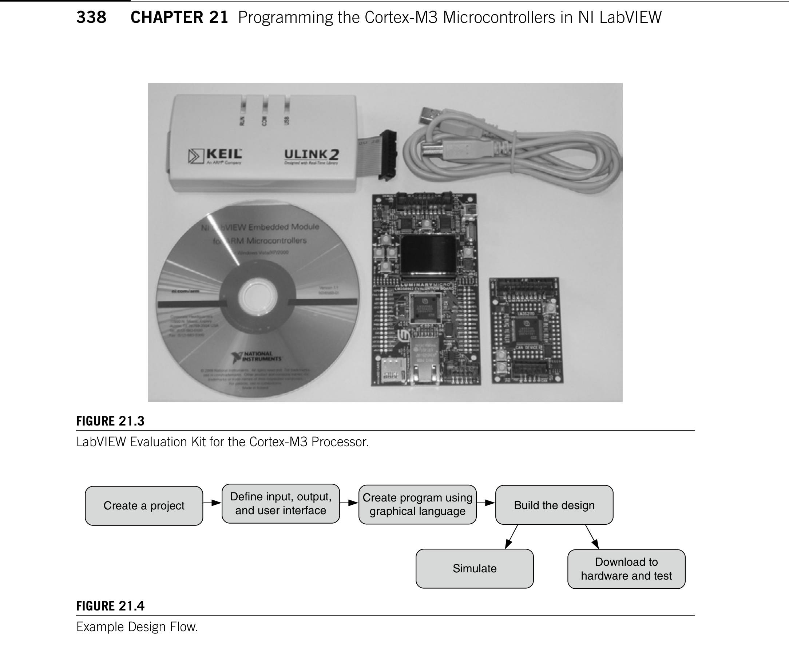
*Description*: Technical diagram and schematic illustration detailing hardware circuit topology, signal routing, and logic operations for Figure 21.4.

> **Figure 21.4**

*Description*: Technical diagram and schematic illustration detailing hardware circuit topology, signal routing, and logic operations for Figure 21.3.

> **Figure 21.3**

338
CHAPTER 21  Programming the Cortex-M3 ­Microcontrollers in NI LabVIEW
•
Define inputs and outputs: These can be hardware interfaces on the microcontroller or user interfaces
running on the PC connected to the system. For hardware interfaces, you need to define the inputs and
outputs as elemental input/output (I/O) in the project before you can use them in your VI design.
Create
•
the application using graphical programming.
•
Build the design.
•
Simulate: It is possible to download the created execution image to the device simulation in the
Keil MDK-ARM to test your application.
•
Download to the microcontroller and test: By default, the program is downloaded to the
microcontroller as a test when the compilation is done. You can use the LabVIEW interface to
pause, stop, or single-step the execution. You can also probe the variable value by clicking the
connection during execution.
Figure 21.4
Example Design Flow.
Create a project
Define input, output,
and user interface
Create program using
graphical language
Build the design
Simulate
Download to
hardware and test
Figure 21.3
LabVIEW Evaluation Kit for the Cortex-M3 Processor.

<!-- Page 366 -->
### [PDF Page 366]

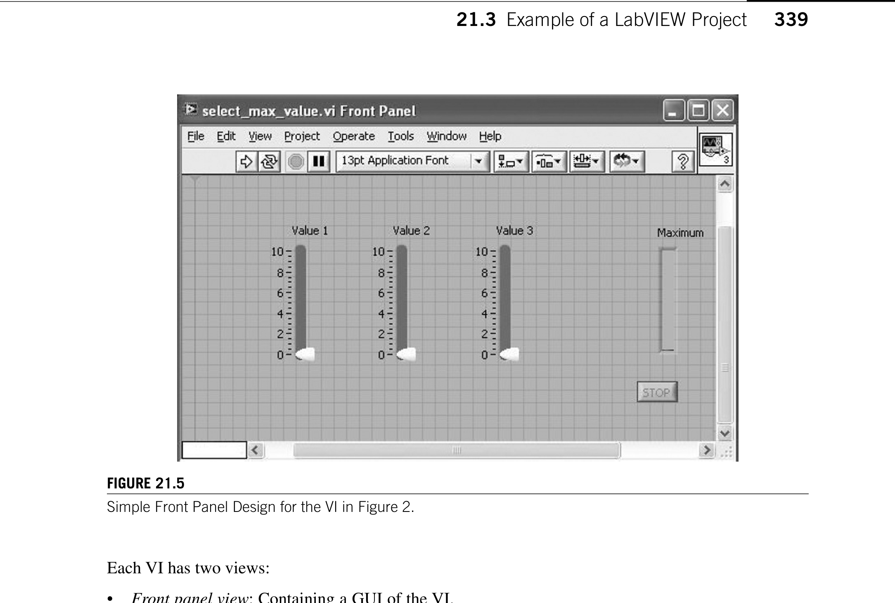
*Description*: Technical diagram and schematic illustration detailing hardware circuit topology, signal routing, and logic operations for Figure 21.5.

> **Figure 21.5**

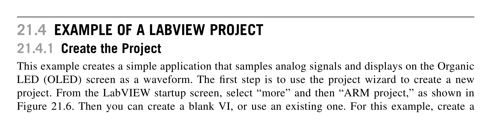
*Description*: Technical diagram and schematic illustration detailing hardware circuit topology, signal routing, and logic operations for Figure 21.6.

> **Figure 21.6**

*Description*: Technical diagram and schematic illustration detailing hardware circuit topology, signal routing, and logic operations for Figure 2.

> **Figure 2**

339

## 21.3  Example of a LabVIEW Project

Each VI has two views:
•
Front panel view: Containing a GUI of the VI.
•

### Block diagram view: Serving as a work-space for graphical programming.

When you create a VI, it has a blank front panel by default. You can then add control elements and
indicator elements to define the inputs and outputs of the system. For instance, in the previous example
of getting the largest integer from three inputs and a random value, the front panel may be similar to
the one shown in Figure 21.5.
You can choose from a variety of control and indicator components in the VI libraries. After you
add these controls and indicators, they become visible in the block diagram view. You can then cus-
tomize properties like data types and create your graphical program by connecting them with various
LabVIEW functions.

## 21.4  Example of a LabVIEW Project

21.4.1  Create the Project
This example creates a simple application that samples analog signals and displays on the Organic
LED (OLED) screen as a waveform. The first step is to use the project wizard to create a new
­project. From the LabVIEW startup screen, select “more” and then “ARM project,” as shown in
Figure 21.6. Then you can create a blank VI, or use an existing one. For this example, create a
Figure 21.5
Simple Front Panel Design for the VI in Figure 2.

<!-- Page 367 -->
### [PDF Page 367]

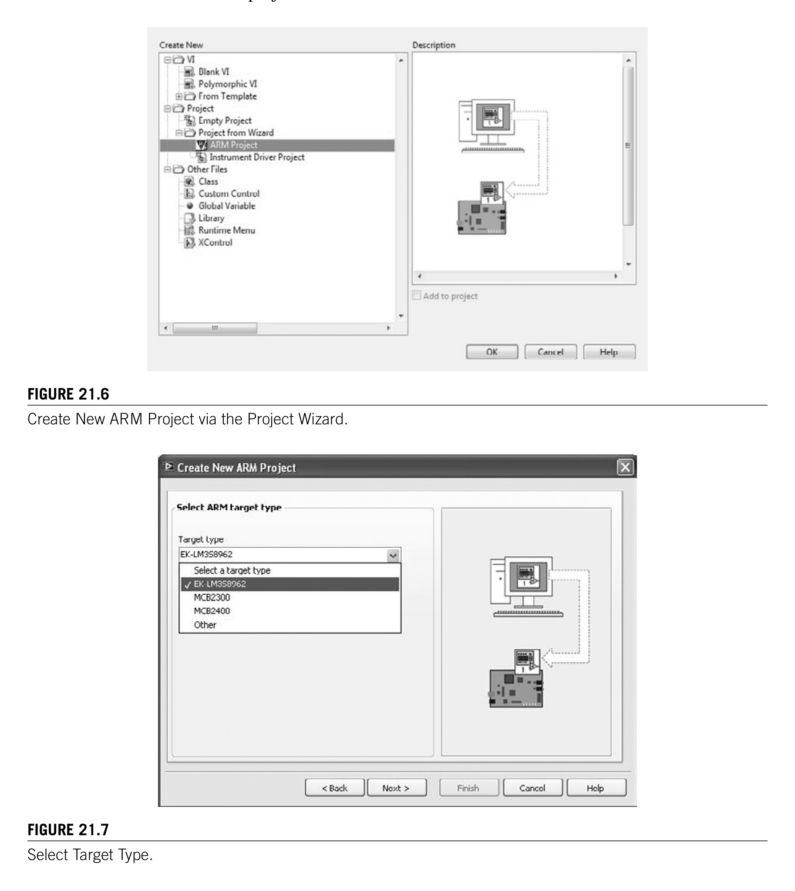
*Description*: Technical diagram and schematic illustration detailing hardware circuit topology, signal routing, and logic operations for Figure 21.7.

> **Figure 21.7**

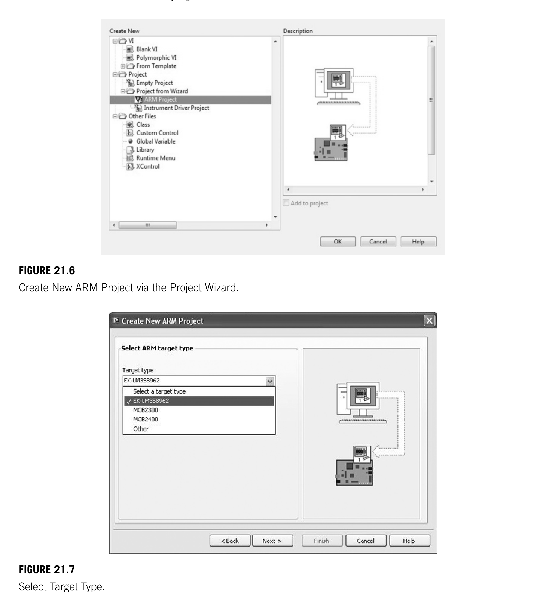
*Description*: Technical diagram and schematic illustration detailing hardware circuit topology, signal routing, and logic operations for Figure 21.6.

> **Figure 21.6**

340
CHAPTER 21  Programming the Cortex-M3 ­Microcontrollers in NI LabVIEW
new VI. Now you have the choice of target type. For this example, select the LM3S8962 evaluation
kit (Figure 21.7).
In the final step, the project wizard builds the specification that allows you to run the project on a
simulator. For this example, run it in hardware instead of selecting the simulator option. The project
creation wizard also saves the project and a default blank VI.
Figure 21.6
Create New ARM Project via the Project Wizard.
Figure 21.7
Select Target Type.

<!-- Page 368 -->
### [PDF Page 368]

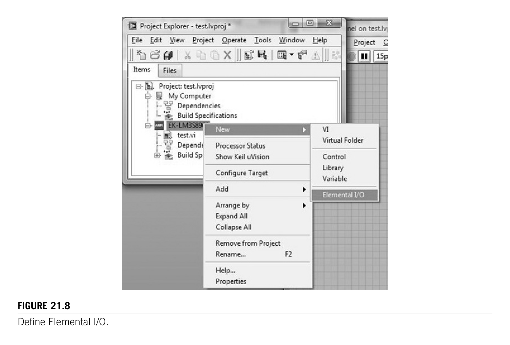
*Description*: Technical diagram and schematic illustration detailing hardware circuit topology, signal routing, and logic operations for Figure 21.8.

> **Figure 21.8**

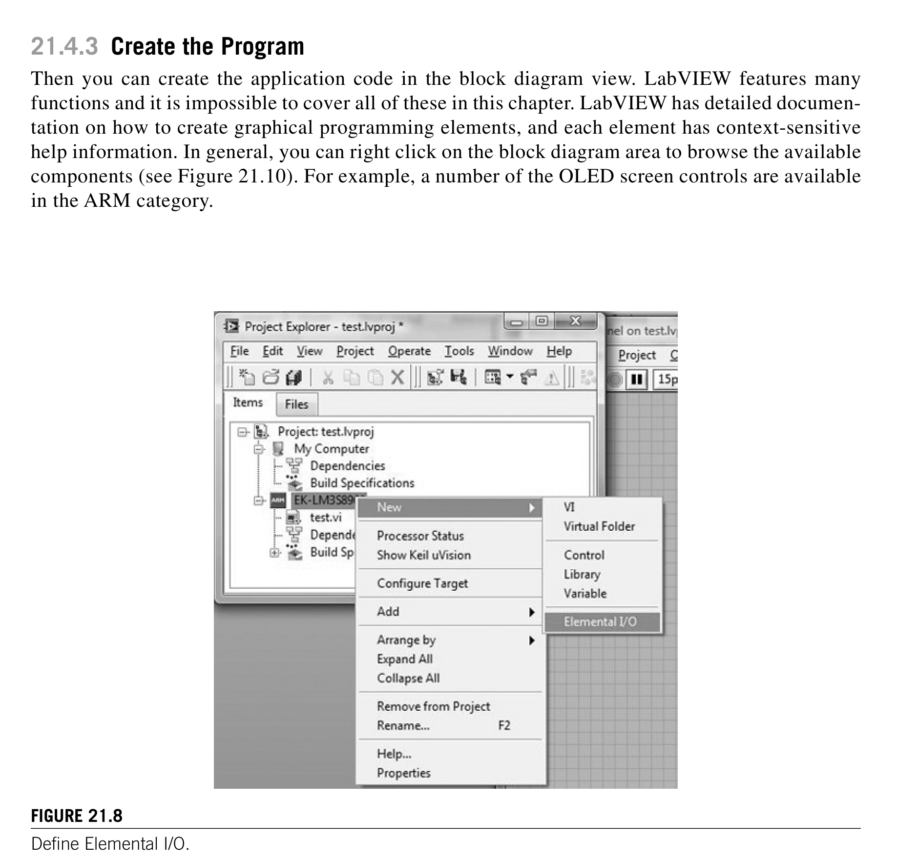
*Description*: Technical diagram and schematic illustration detailing hardware circuit topology, signal routing, and logic operations for Figure 21.10.

> **Figure 21.10**

341

## 21.3  Example of a LabVIEW Project

21.4.2  Define Inputs and Outputs
The next step of the project is to define the inputs and outputs for the applications. In this example, you
need to define only the ADC0 input (the OLED display is controlled by library components, so you
don’t have to define it here). To complete that, right click on the target in the project window and select
“New-> Elemental I/O” (Figure 21.8). Then define the input used in the project in the New Elemental
I/O window, as shown in Figure 21.9.
In this window, a number of other I/O options are available. For example, the push buttons, light
emitting diode (LED), General Purpose Input/Output (GPIO), and Pulse Width Modulator (PWM)
interfaces can help you simplify your project development.
21.4.3  Create the Program
Then you can create the application code in the block diagram view. LabVIEW features many
functions and it is impossible to cover all of these in this chapter. LabVIEW has detailed documen-
tation on how to create graphical programming elements, and each element has context-sensitive
help information. In general, you can right click on the block diagram area to browse the available
components (see Figure 21.10). For example, a number of the OLED screen controls are available
in the ARM category.
Figure 21.8
Define Elemental I/O.

<!-- Page 369 -->
### [PDF Page 369]

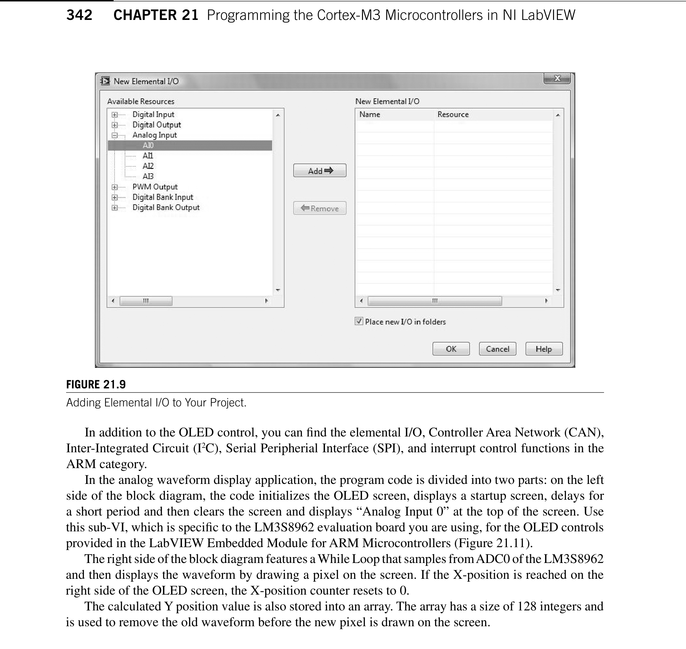
*Description*: Technical diagram and schematic illustration detailing hardware circuit topology, signal routing, and logic operations for Figure 21.11.

> **Figure 21.11**

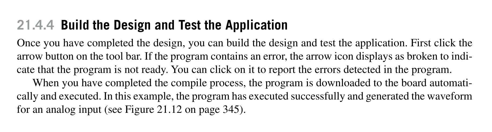
*Description*: Technical diagram and schematic illustration detailing hardware circuit topology, signal routing, and logic operations for Figure 21.12.

> **Figure 21.12**

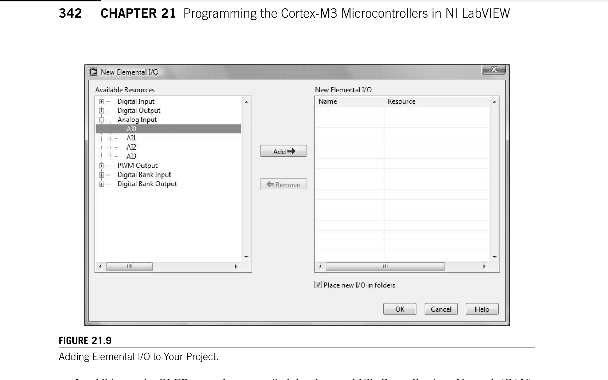
*Description*: Technical diagram and schematic illustration detailing hardware circuit topology, signal routing, and logic operations for Figure 21.9.

> **Figure 21.9**

342
CHAPTER 21  Programming the Cortex-M3 ­Microcontrollers in NI LabVIEW
In addition to the OLED control, you can find the elemental I/O, Controller Area Network (CAN),
Inter-Integrated Circuit (I2C), Serial Peripherial Interface (SPI), and interrupt control functions in the
ARM category.
In the analog waveform display application, the program code is divided into two parts: on the left
side of the block diagram, the code initializes the OLED screen, displays a startup screen, delays for
a short period and then clears the screen and displays “Analog Input 0” at the top of the screen. Use
this sub-VI, which is specific to the LM3S8962 evaluation board you are using, for the OLED controls
provided in the LabVIEW Embedded Module for ARM Microcontrollers (Figure 21.11).
The right side of the block diagram features a While Loop that samples from ADC0 of the LM3S8962
and then displays the waveform by drawing a pixel on the screen. If the X-position is reached on the
right side of the OLED screen, the X-position counter resets to 0.
The calculated Y position value is also stored into an array. The array has a size of 128 integers and
is used to remove the old waveform before the new pixel is drawn on the screen.
21.4.4  Build the Design and Test the Application
Once you have completed the design, you can build the design and test the application. First click the
arrow button on the tool bar. If the program contains an error, the arrow icon displays as broken to indi-
cate that the program is not ready. You can click on it to report the errors detected in the program.
When you have completed the compile process, the program is downloaded to the board automati-
cally and executed. In this example, the program has executed successfully and generated the waveform
for an analog input (see Figure 21.12 on page 345).
Figure 21.9
Adding Elemental I/O to Your Project.

<!-- Page 370 -->
### [PDF Page 370]

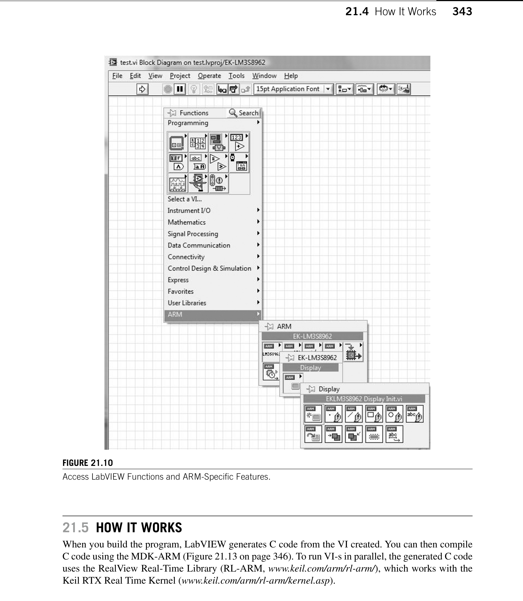
*Description*: Technical diagram and schematic illustration detailing hardware circuit topology, signal routing, and logic operations for Figure 21.13.

> **Figure 21.13**

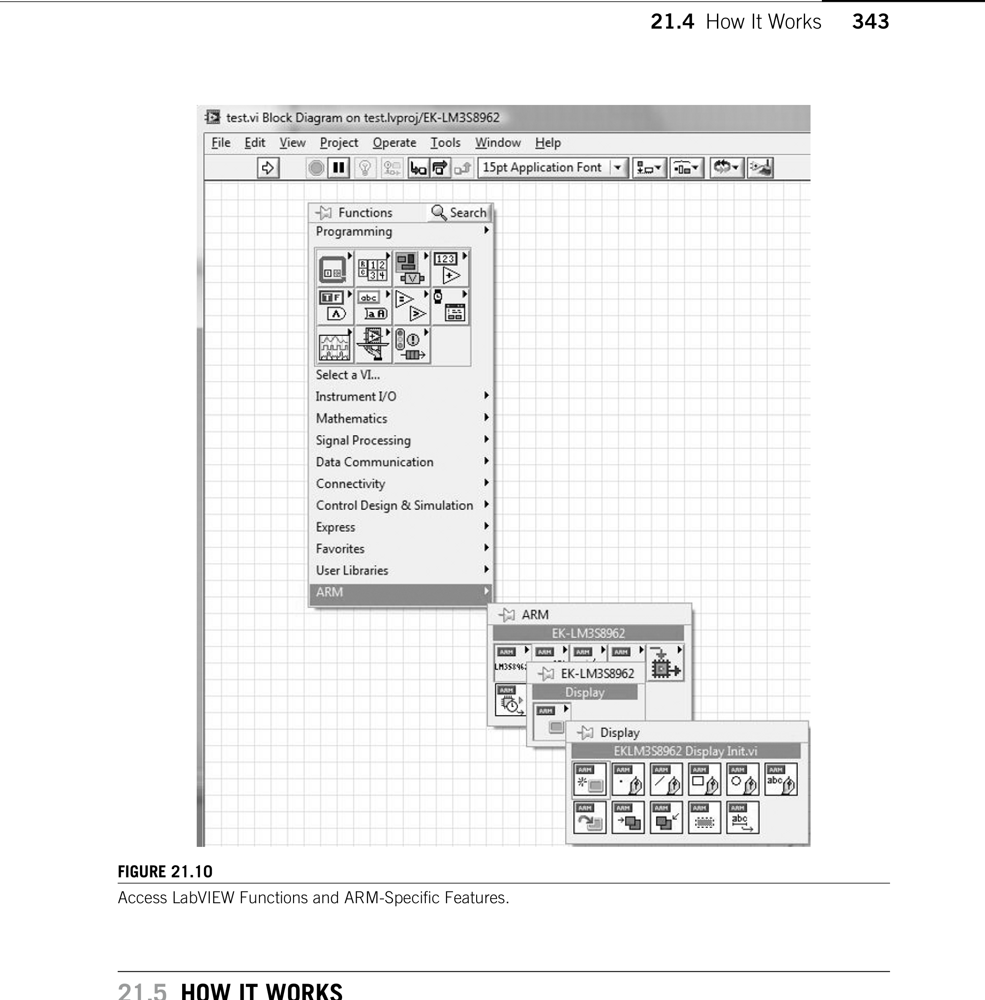
*Description*: Technical diagram and schematic illustration detailing hardware circuit topology, signal routing, and logic operations for Figure 21.10.

> **Figure 21.10**

343

## 21.4  How It Works

## 21.5  How It Works

When you build the program, LabVIEW generates C code from the VI created. You can then compile
C code using the MDK-ARM (Figure 21.13 on page 346). To run VI-s in parallel, the generated C code
uses the RealView Real-Time Library (RL-ARM, www.keil.com/arm/rl-arm/), which works with the
Keil RTX Real Time ­Kernel (www.keil.com/arm/rl-arm/kernel.asp).
Figure 21.10
Access LabVIEW Functions and ARM-Specific Features.

<!-- Page 371 -->
### [PDF Page 371]

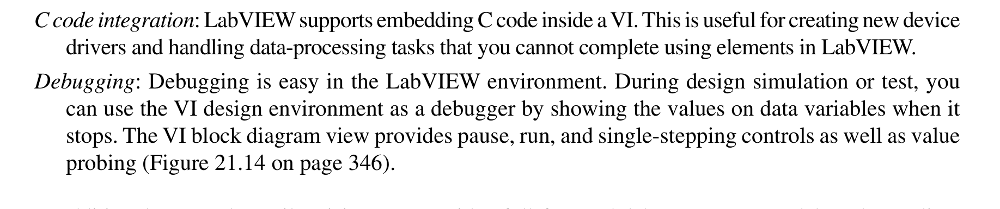
*Description*: Technical diagram and schematic illustration detailing hardware circuit topology, signal routing, and logic operations for Figure 21.14.

> **Figure 21.14**

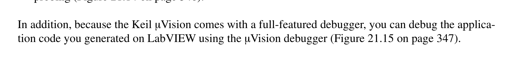
*Description*: Technical diagram and schematic illustration detailing hardware circuit topology, signal routing, and logic operations for Figure 21.15.

> **Figure 21.15**

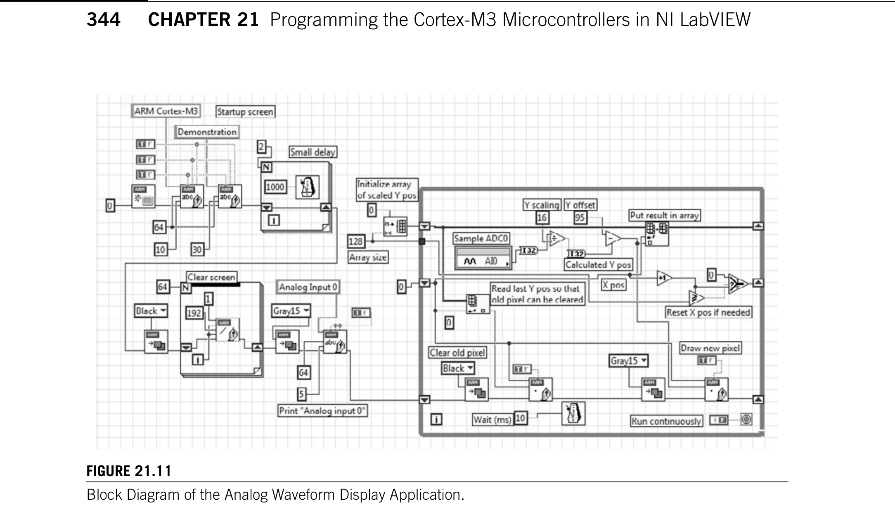
*Description*: Technical diagram and schematic illustration detailing hardware circuit topology, signal routing, and logic operations for Figure 21.11.

> **Figure 21.11**

344
CHAPTER 21  Programming the Cortex-M3 ­Microcontrollers in NI LabVIEW
In addition to the capability of multithreading, using the RL-ARM provides access to a variety of
drivers including timing control, Transmission Control Protocol/Internet Protocol (TCP/IP) stack, and
CAN protocol stack.

## 21.6  Additional Features in LabVIEW

Semihosting: LabVIEW supports the creation of GUIs running on the debug host (PC). This is very
useful for system prototyping because developing GUIs running on a microcontroller can be a time-
consuming task. The LabVIEW library supports user-interface elements including switches, slide
bars, and graphs, making it easy to create professional GUIs in just a few mouse clicks. During
operation, the GUIs are running on the PC and the data are communicated to the running microcon-
troller target via the debug connection Joint Test Action Group, TCP/IP, or Serial. This allows you
to control and access the results on the hardware in real time.
C code integration: LabVIEW supports embedding C code inside a VI. This is useful for creating new device
drivers and handling data-processing tasks that you cannot complete using elements in LabVIEW.
Debugging: Debugging is easy in the LabVIEW environment. During design simulation or test, you
can use the VI design environment as a debugger by showing the values on data variables when it
stops. The VI block diagram view provides pause, run, and single-stepping controls as well as value
probing (Figure 21.14 on page 346).
In addition, because the Keil μVision comes with a full-featured debugger, you can debug the applica-
tion code you generated on LabVIEW using the μVision debugger (Figure 21.15 on page 347).
Figure 21.11

### Block Diagram of the Analog Waveform Display Application.

<!-- Page 372 -->
### [PDF Page 372]

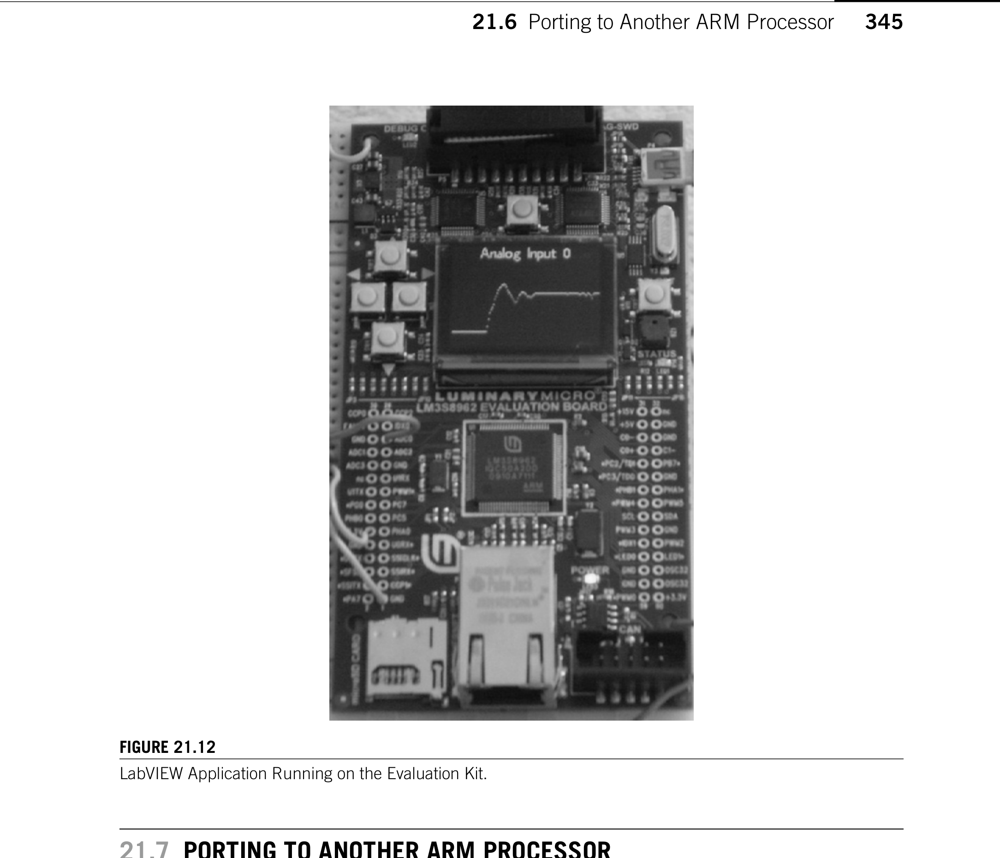
*Description*: Technical diagram and schematic illustration detailing hardware circuit topology, signal routing, and logic operations for Figure 21.12.

> **Figure 21.12**

345

## 21.7  Porting to Another ARM Processor

In addition to running your LabVIEW application using the evaluation kit, you can port the application
to other Cortex-M3 microcontrollers or other ARM microcontrollers that are supported by the RTX
Real-Time Kernel. This typically involves the following steps:
•
Port the RTX Real-Time Kernel: This step is not required for Cortex-M3 devices because the
processor contains the required support for the RTX Real-Time Kernel. However, if you choose
to use ARM7 microcontrollers, you may need this. A port for the RTX Real-Time Kernel may
already be available in the Keil MDK-ARM installation options. You can determine if an RTX port
is available for your ARM microcontroller by browsing the \Keil\ARM\Startup directory. If an
RTX_Conf*.c is already available for the microcontroller target, then the RTX Real-Time Kernel
has already been ported.

## 21.6  Porting to Another ARM Processor

Figure 21.12
LabVIEW Application Running on the Evaluation Kit.

<!-- Page 373 -->
### [PDF Page 373]

*Description*: Technical diagram and schematic illustration detailing hardware circuit topology, signal routing, and logic operations for Figure 21.14.

> **Figure 21.14**

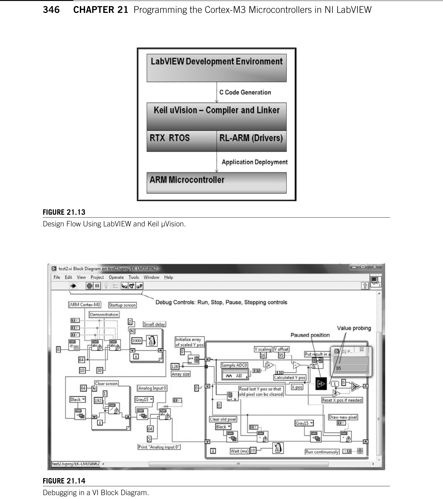
*Description*: Technical diagram and schematic illustration detailing hardware circuit topology, signal routing, and logic operations for Figure 21.13.

> **Figure 21.13**

346
CHAPTER 21  Programming the Cortex-M3 ­Microcontrollers in NI LabVIEW
Figure 21.14
Debugging in a VI Block Diagram.
Figure 21.13
Design Flow Using LabVIEW and Keil μVision.

<!-- Page 374 -->
### [PDF Page 374]

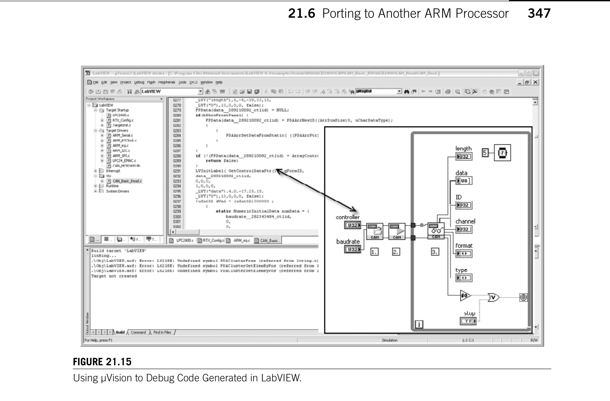
*Description*: Technical diagram and schematic illustration detailing hardware circuit topology, signal routing, and logic operations for Figure 21.15.

> **Figure 21.15**

347
•
Create the target in LabVIEW and incorporate the Keil toolchain: You can do this by manually
creating the target folder.
•
Integrate the Real-Time Agent Module for debugging: You may need to customize the RTX_config.c
to include the Real-Time Agent Configuration option.
•
Develop peripheral and I/O drivers: You can implement this step using the Element I/O Device
Editor.
For more detailed information on the porting process, view the National Instruments online
tutorial   titled LabVIEW Embedded for ARM Porting Guide (http://zone.ni.com/devzone/cda/tut/p/
id/6994).

## 21.6  Porting to Another ARM Processor

Figure 21.15
Using μVision to Debug Code Generated in LabVIEW.

<!-- Page 375 -->
### [PDF Page 375]

This page intentionally left blank

