# Chapter 1: Computer Architecture

> **Textbook**: Embedded Systems: Real-Time Operating Systems for ARM Cortex-M Microcontrollers  
> **Author**: Jonathan W. Valvano  
> **PDF Page Range**: 18 - 91


---


<!-- Page 18 -->
### [PDF Page 18]

1. Computer Architecture

# Chapter 1 objectives are to:

• Present a brief review of computer architecture
• Overview the ARM ® Cortex ™-M processor including assembly
language
• Introduce the Texas Instruments MSP432/TM4C family of
microcontrollers
The overall objective of this book is to teach the design of real-time operating
systems for embedded systems. We define a system as real time if there is a
small and bounded delay between the time when a task should be completed

```assembly
and when it is actually completed. We will present both fundamental principles
and practical solutions. Interfacing to the microcontroller was presented in
```

detail in Volume 2 and reviewed in the first two chapters of this book. The
overlap allows this book to stand alone as a text to teach embedded real time
operating systems. This first chapter will review the architecture of the Texas
Instruments MSP432/TM4C family of microcontrollers. When designing
operating systems, we need to understand the details of the architecture. In
particular, we must perform many functions in assembly language. Furthermore,
managing memory will require an intimate understanding of how the processor
accesses memory at the most basic level.


<!-- Page 19 -->
### [PDF Page 19]

1.1. Introduction to Real-Time Operating Systems
1.1.1. Real-time operating systems
A computer system has many types of resources such as memory, I/O, data, and
processors. A real-time operating system (RTOS) is software that manages these
resources, guaranteeing all timing constraints are satisfied. Figure 1.1 illustrates the
relationship between hardware and software. On the left is a basic system without an
operating system. Software is written by a single vendor for a specific
microcontroller. As the system becomes more complex (middle figure), an operating
system facilitates the integration of software from multiple vendors. By providing a
hardware abstraction layer (HAL) an operating system simplifies porting
application code from one microcontroller to another. In order to provide additional
processing power, embedded systems of the future will require multiple
microcontrollers, processors with specialized coprocessors and/or a microcontroller
with multiple cores (right figure). Synchronization and assigning tasks across
distributed processors are important factors. As these systems become more
complex, the role of the operating system will be increasingly important.

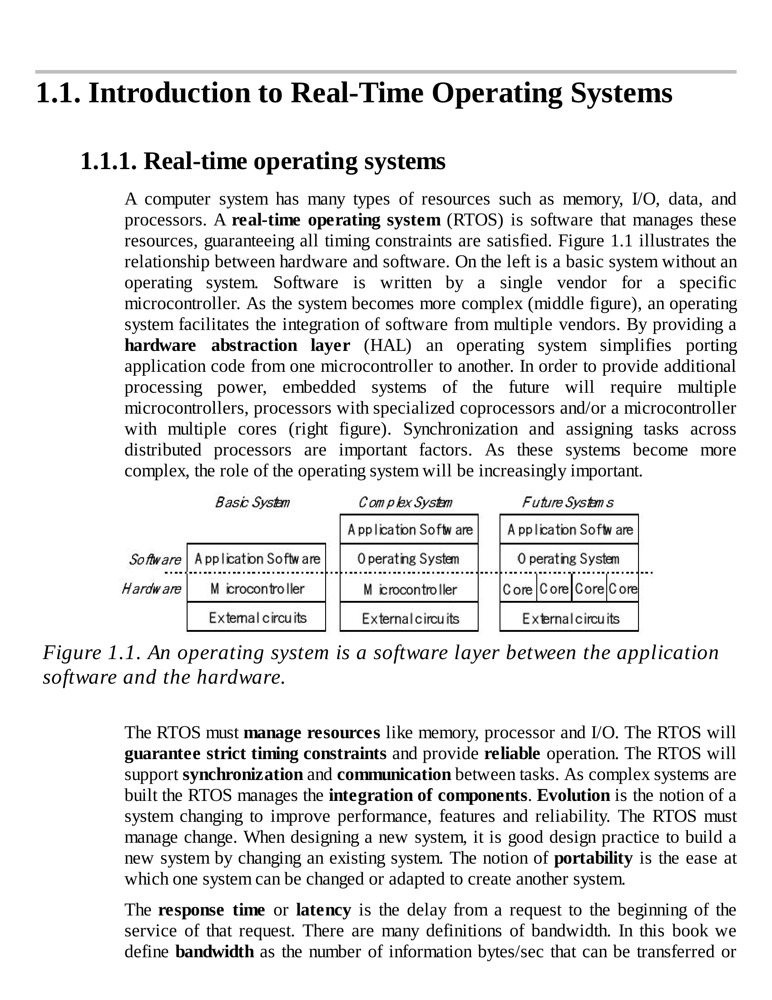
*Description*: Technical schematic and block diagram illustrating circuit operation, signal pathways, and functional behavior for Figure 1.1: An operating system is a software layer between the application.

> **Figure 1.1: An operating system is a software layer between the application**

software and the hardware.
The RTOS must manage resources like memory, processor and I/O. The RTOS will
guarantee strict timing constraints and provide reliable operation. The RTOS will
support synchronization and communication between tasks. As complex systems are
built the RTOS manages the integration of components. Evolution is the notion of a
system changing to improve performance, features and reliability. The RTOS must
manage change. When designing a new system, it is good design practice to build a
new system by changing an existing system. The notion of portability is the ease at
which one system can be changed or adapted to create another system.
The response time or latency is the delay from a request to the beginning of the
service of that request. There are many definitions of bandwidth. In this book we
define bandwidth as the number of information bytes/sec that can be transferred or


<!-- Page 20 -->
### [PDF Page 20]

processed. We can compare and contrast regular operating systems with real-time
operating systems.
Regular OS
Real-time OS
Complex
Simple
Best effort
Guaranteed response
Fairness
Strict timing constraints
Average bandwidth
Minimum and maximum
limits
Unknown components
Known components
Unpredictable behavior
Predictable behavior
Plug and play
Upgradable

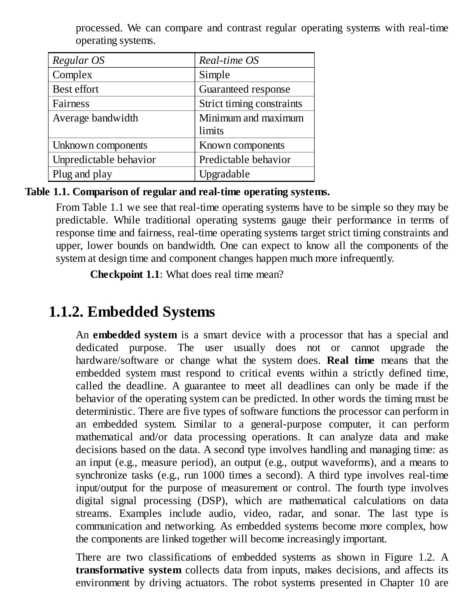
*Description*: Reference table detailing hardware parameters, register bit patterns, performance metrics, or memory configurations for Table 1.1: Comparison of regular and real-time operating systems..

> **Table 1.1: Comparison of regular and real-time operating systems.**

From Table 1.1 we see that real-time operating systems have to be simple so they may be
predictable. While traditional operating systems gauge their performance in terms of
response time and fairness, real-time operating systems target strict timing constraints and
upper, lower bounds on bandwidth. One can expect to know all the components of the
system at design time and component changes happen much more infrequently.
Checkpoint 1.1: What does real time mean?
1.1.2. Embedded Systems
An embedded system is a smart device with a processor that has a special and
dedicated purpose. The user usually does not or cannot upgrade the
hardware/software or change what the system does. Real time means that the
embedded system must respond to critical events within a strictly defined time,
called the deadline. A guarantee to meet all deadlines can only be made if the
behavior of the operating system can be predicted. In other words the timing must be
deterministic. There are five types of software functions the processor can perform in
an embedded system. Similar to a general-purpose computer, it can perform
mathematical and/or data processing operations. It can analyze data and make
decisions based on the data. A second type involves handling and managing time: as
an input (e.g., measure period), an output (e.g., output waveforms), and a means to
synchronize tasks (e.g., run 1000 times a second). A third type involves real-time
input/output for the purpose of measurement or control. The fourth type involves
digital signal processing (DSP), which are mathematical calculations on data
streams. Examples include audio, video, radar, and sonar. The last type is
communication and networking. As embedded systems become more complex, how
the components are linked together will become increasingly important.
There are two classifications of embedded systems as shown in Figure 1.2. A
transformative system collects data from inputs, makes decisions, and affects its
environment by driving actuators. The robot systems presented in Chapter 10 are


<!-- Page 21 -->
### [PDF Page 21]

examples of transformative systems. A reactive system collects data in a continuous
fashion and produce outputs also in a continuous fashion. Digital signal processing
algorithms presented in Chapter 6 are examples of reactive systems.

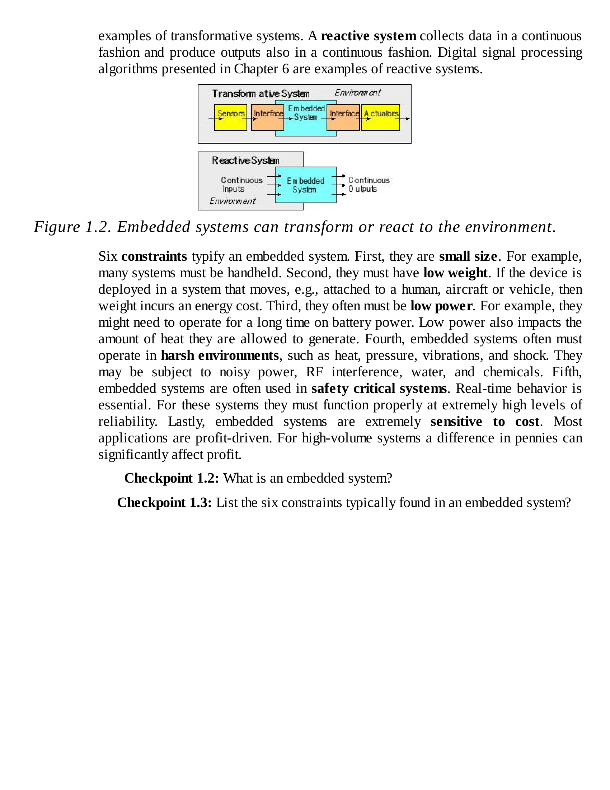
*Description*: Technical schematic and block diagram illustrating circuit operation, signal pathways, and functional behavior for Figure 1.2: Embedded systems can transform or react to the environment..

> **Figure 1.2: Embedded systems can transform or react to the environment.**

Six constraints typify an embedded system. First, they are small size. For example,
many systems must be handheld. Second, they must have low weight. If the device is
deployed in a system that moves, e.g., attached to a human, aircraft or vehicle, then
weight incurs an energy cost. Third, they often must be low power. For example, they
might need to operate for a long time on battery power. Low power also impacts the
amount of heat they are allowed to generate. Fourth, embedded systems often must
operate in harsh environments, such as heat, pressure, vibrations, and shock. They
may be subject to noisy power, RF interference, water, and chemicals. Fifth,
embedded systems are often used in safety critical systems. Real-time behavior is
essential. For these systems they must function properly at extremely high levels of
reliability. Lastly, embedded systems are extremely sensitive to cost. Most
applications are profit-driven. For high-volume systems a difference in pennies can
significantly affect profit.
Checkpoint 1.2: What is an embedded system?
Checkpoint 1.3: List the six constraints typically found in an embedded system?


<!-- Page 22 -->
### [PDF Page 22]

1.2. Computer Architecture
1.2.1. Computers, processors, and microcontrollers
Given that an operating system is a manager of resources provided by the underlying
architecture, it would serve the reader well to get acquainted with the architecture the
OS must manage. In this section we will delve into these details of the building
blocks of computer architecture, followed by the specifics of the ARM Cortex M4
processor architecture, in particular TI’s implementation of the ARM ISA found on
the TM4C and MSP432.
A computer combines a central processing unit (CPU), random access memory
(RAM), read only memory (ROM), and input/output (I/O) ports. The common bus in

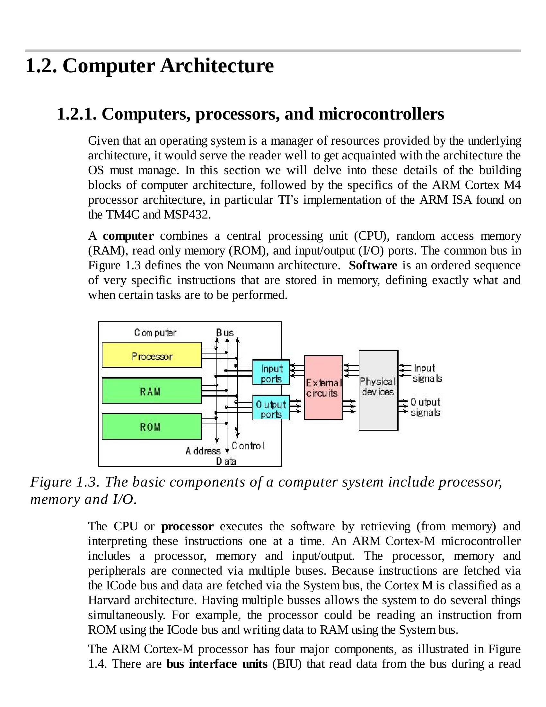
*Description*: Architectural block diagram detailing logic modules, memory buses, internal registers, and hardware interconnections for Figure 1.3: defines the von Neumann architecture.  Software is an ordered sequence.

> **Figure 1.3: defines the von Neumann architecture.  Software is an ordered sequence**

of very specific instructions that are stored in memory, defining exactly what and
when certain tasks are to be performed.


*Description*: Architectural block diagram detailing logic modules, memory buses, internal registers, and hardware interconnections for Figure 1.3: The basic components of a computer system include processor,.

> **Figure 1.3: The basic components of a computer system include processor,**

memory and I/O.
The CPU or processor executes the software by retrieving (from memory) and
interpreting these instructions one at a time. An ARM Cortex-M microcontroller
includes a processor, memory and input/output. The processor, memory and
peripherals are connected via multiple buses. Because instructions are fetched via
the ICode bus and data are fetched via the System bus, the Cortex M is classified as a
Harvard architecture. Having multiple busses allows the system to do several things
simultaneously. For example, the processor could be reading an instruction from
ROM using the ICode bus and writing data to RAM using the System bus.
The ARM Cortex-M processor has four major components, as illustrated in Figure
1.4. There are bus interface units (BIU) that read data from the bus during a read


<!-- Page 23 -->
### [PDF Page 23]

cycle and write data onto the bus during a write cycle. The BIU always drives the
address bus and the control signals of the bus. The effective address register (EAR)
contains the memory address used to fetch the data needed for the current instruction.
Cortex-M microcontrollers execute Thumb instructions extended with Thumb-2
technology. An overview of these instructions will be presented in Section 1.5. Many
functions in an operating system will require detailed understanding of the
architecture and assembly language.
The control unit (CU) orchestrates the sequence of operations in the processor. The
CU issues commands to the other three components. The instruction register (IR)
contains the operation code (or op code) for the current instruction. When extended
with Thumb-2 technology, op codes are either 16 or 32 bits wide.
The arithmetic logic unit (ALU) performs arithmetic and logic operations. Addition,
subtraction, multiplication and division are examples of arithmetic operations.
Examples of logic operations are, and, or, exclusive-or, and shift. Many processors
used in embedded applications support specialized operations such as table lookup,
multiply and accumulate, and overflow detection.

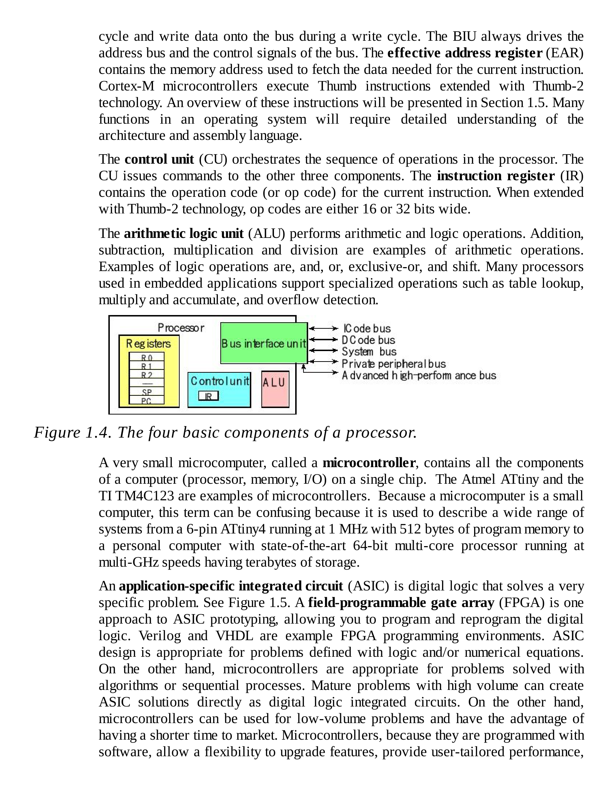
*Description*: Architectural block diagram detailing logic modules, memory buses, internal registers, and hardware interconnections for Figure 1.4: The four basic components of a processor..

> **Figure 1.4: The four basic components of a processor.**

A very small microcomputer, called a microcontroller, contains all the components
of a computer (processor, memory, I/O) on a single chip.  The Atmel ATtiny and the
TI TM4C123 are examples of microcontrollers.  Because a microcomputer is a small
computer, this term can be confusing because it is used to describe a wide range of
systems from a 6-pin ATtiny4 running at 1 MHz with 512 bytes of program memory to
a personal computer with state-of-the-art 64-bit multi-core processor running at
multi-GHz speeds having terabytes of storage.
An application-specific integrated circuit (ASIC) is digital logic that solves a very
specific problem. See Figure 1.5. A field-programmable gate array (FPGA) is one
approach to ASIC prototyping, allowing you to program and reprogram the digital
logic. Verilog and VHDL are example FPGA programming environments. ASIC
design is appropriate for problems defined with logic and/or numerical equations.
On the other hand, microcontrollers are appropriate for problems solved with
algorithms or sequential processes. Mature problems with high volume can create
ASIC solutions directly as digital logic integrated circuits. On the other hand,
microcontrollers can be used for low-volume problems and have the advantage of
having a shorter time to market. Microcontrollers, because they are programmed with
software, allow a flexibility to upgrade features, provide user-tailored performance,


<!-- Page 24 -->
### [PDF Page 24]


```assembly
and solve problems with uncertain or changing requirements. Some systems have
```

both microcontrollers and ASICs.

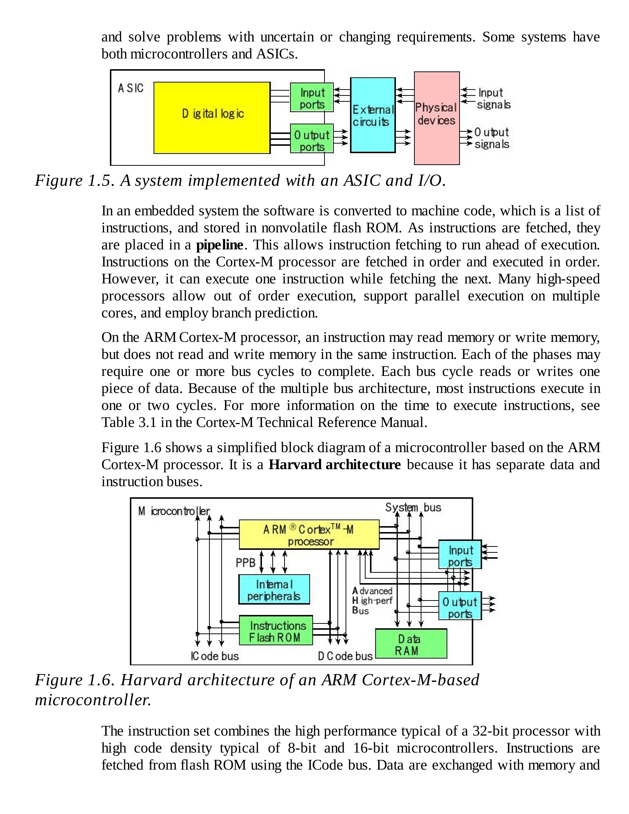
*Description*: Technical schematic and block diagram illustrating circuit operation, signal pathways, and functional behavior for Figure 1.5: A system implemented with an ASIC and I/O..

> **Figure 1.5: A system implemented with an ASIC and I/O.**

In an embedded system the software is converted to machine code, which is a list of
instructions, and stored in nonvolatile flash ROM. As instructions are fetched, they
are placed in a pipeline. This allows instruction fetching to run ahead of execution.
Instructions on the Cortex-M processor are fetched in order and executed in order.
However, it can execute one instruction while fetching the next. Many high-speed
processors allow out of order execution, support parallel execution on multiple
cores, and employ branch prediction.
On the ARM Cortex-M processor, an instruction may read memory or write memory,
but does not read and write memory in the same instruction. Each of the phases may
require one or more bus cycles to complete. Each bus cycle reads or writes one
piece of data. Because of the multiple bus architecture, most instructions execute in
one or two cycles. For more information on the time to execute instructions, see


*Description*: Reference table detailing hardware parameters, register bit patterns, performance metrics, or memory configurations for Table 3.1: in the Cortex-M Technical Reference Manual..

> **Table 3.1: in the Cortex-M Technical Reference Manual.**


*Description*: Architectural block diagram detailing logic modules, memory buses, internal registers, and hardware interconnections for Figure 1.6: shows a simplified block diagram of a microcontroller based on the ARM.

> **Figure 1.6: shows a simplified block diagram of a microcontroller based on the ARM**

Cortex-M processor. It is a Harvard architecture because it has separate data and
instruction buses.


*Description*: Architectural block diagram detailing logic modules, memory buses, internal registers, and hardware interconnections for Figure 1.6: Harvard architecture of an ARM Cortex-M-based.

> **Figure 1.6: Harvard architecture of an ARM Cortex-M-based**

microcontroller.
The instruction set combines the high performance typical of a 32-bit processor with
high code density typical of 8-bit and 16-bit microcontrollers. Instructions are
fetched from flash ROM using the ICode bus. Data are exchanged with memory and


<!-- Page 25 -->
### [PDF Page 25]

I/O via the system bus interface. There are many sophisticated debugging features
utilizing the DCode bus. An interrupt is a hardware-triggered software function,
which is extremely important for real-time embedded systems. The latency of an
interrupt service is the time between hardware trigger and software response. Some
internal peripherals, like the nested vectored interrupt controller (NVIC),
communicate directly with the processor via the private peripheral bus (PPB). The
tight integration of the processor and interrupt controller provides fast execution of
interrupt service routines (ISRs), dramatically reducing the interrupt latency.
Checkpoint 1.4: Why do you suppose the Cortex M has so many busses?
Checkpoint 1.5: Notice the debugger exists on the DCode bus. Why is this a good
idea?
1.2.2. Memory
One kibibyte (KiB) equals 1024 bytes of memory. The TM4C123 has 256 kibibytes
(218 bytes) of flash ROM and 32 kibibytes (215 bytes) of RAM. The MSP432 also has
256 kibibytes (218 bytes) of flash ROM but has 64 kibibytes (216 bytes) of RAM. We
view the memory as continuous virtual address space with the RAM beginning at
0x2000.0000, and the flash ROM beginning at 0x0000.0000.
The microcontrollers in the Cortex-M family differ by the amount of memory and by
the types of I/O modules. There are hundreds of members in this family; some of them
are listed in Table 1.2. The memory maps of TM4C123 and MSP432 are shown in


*Description*: Technical schematic and block diagram illustrating circuit operation, signal pathways, and functional behavior for Figure 1.7: Although this course focuses on two microcontrollers from Texas.

> **Figure 1.7: Although this course focuses on two microcontrollers from Texas**

Instruments, all ARM Cortex-M microcontrollers have similar memory maps. In
general, Flash ROM begins at address 0x0000.0000, RAM begins at 0x2000.0000,
the peripheral I/O space is from 0x4000.0000 to 0x5FFF.FFFF, and I/O modules on
the private peripheral bus exist from 0xE000.0000 to 0xE00F.FFFF. In particular, the
only differences in the memory map for the various members of the Cortex-M family
are the ending addresses of the flash and RAM.
Part number
RAM Flash
I/O
I/O modules
MSP432P401RIPZ
64
256
84
floating point, DMA
TM4C123GH6PM
32
256
43
floating point, CAN, DMA,
USB, PWM
TM4C1294NCPDT
256
1024
90
floating point, CAN, DMA,
USB, PWM, Ethernet
STM32F051R8T6
8
64
55
DAC, Touch sensor, DMA,
I2S, HDMI, PWM
MKE02Z64VQH2
4
64
53
PWM
KiB
KiB
pins

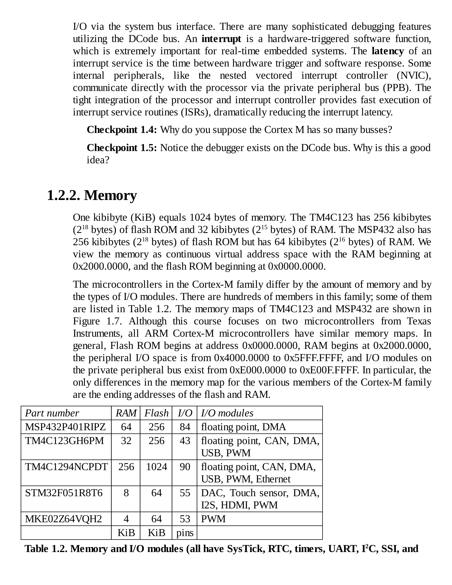
*Description*: Reference table detailing hardware parameters, register bit patterns, performance metrics, or memory configurations for Table 1.2: Memory and I/O modules (all have SysTick, RTC, timers, UART, I2C, SSI, and.

> **Table 1.2: Memory and I/O modules (all have SysTick, RTC, timers, UART, I2C, SSI, and**


<!-- Page 26 -->
### [PDF Page 26]

ADC).
Having multiple buses means the processor can perform multiple tasks in parallel.
On the TM4C123, general purpose input/output (GPIO) ports can be accessed using
either the PPB or AHPB. The following is some of the tasks that can occur in parallel
ICode bus
Fetch opcode from ROM
DCode bus
Read constant data from ROM
System bus
Read/write data from RAM or I/O, fetch opcode from RAM
PPB
Read/write data from internal peripherals like the NVIC
AHPB
Read/write data from internal peripherals like the USB
Instructions and data are accessed using a common bus on a von Neumann machine.
The Cortex-M processor is a Harvard architecture because instructions are fetched
on the ICode bus and data accessed on the system bus. The address signals on the
ARM Cortex-M processor include 32 lines, which together specify the memory
address (0x0000.0000 to 0xFFFF.FFFF) that is currently being accessed. The
address specifies both which module (input, output, RAM, or ROM) as well as
which cell within the module will communicate with the processor. The data signals
contain the information that is being transferred and also include 32 bits. However,
on the system bus it can also transfer 8-bit or 16-bit data. The control signals specify
the timing, the size, and the direction of the transfer.

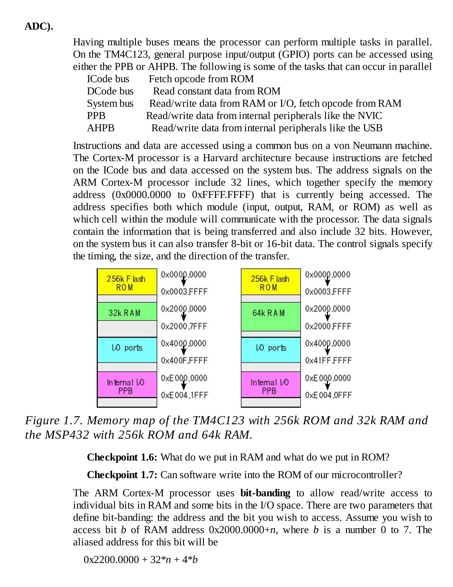
*Description*: Register layout and memory mapping diagram specifying bit fields, stack pointer allocations, and memory address boundaries for Figure 1.7: Memory map of the TM4C123 with 256k ROM and 32k RAM and.

> **Figure 1.7: Memory map of the TM4C123 with 256k ROM and 32k RAM and**

the MSP432 with 256k ROM and 64k RAM.
Checkpoint 1.6: What do we put in RAM and what do we put in ROM?
Checkpoint 1.7: Can software write into the ROM of our microcontroller?
The ARM Cortex-M processor uses bit-banding to allow read/write access to
individual bits in RAM and some bits in the I/O space. There are two parameters that
define bit-banding: the address and the bit you wish to access. Assume you wish to
access bit b of RAM address 0x2000.0000+n, where b is a number 0 to 7. The
aliased address for this bit will be
0x2200.0000 + 32*n + 4*b


<!-- Page 27 -->
### [PDF Page 27]

Reading this address will return a 0 or a 1. Writing a 0 or 1 to this address will
perform an atomic read-modify-write modification to the bit.
If we consider 32-bit word-aligned data in RAM, the same bit-banding formula still
applies. Let the word address be 0x2000.0000+n. n starts at 0 and increments by 4.
In this case, we define b as the bit from 0 to 31. In little-endian format, bit 1 of the
byte at 0x2000.0001 is the same as bit 9 of the word at 0x2000.0000.The aliased
address for this bit will still be
0x2200.0000 + 32*n + 4*b
Examples of bit-banded addressing are listed in Table 1.3. Writing a 1 to location
0x2200.0018 will set bit 6 of RAM location 0x2000.0000. Reading location
0x2200.0024 will return a 0 or 1 depending on the value of bit 1 of RAM location
0x2000.0001.
RAM
address
Offset
n
Bit b
Bit-banded
alias
0x2000.0000
0
0
0x2200.0000
0x2000.0000
0
1
0x2200.0004
0x2000.0000
0
2
0x2200.0008
0x2000.0000
0
3
0x2200.000C
0x2000.0000
0
4
0x2200.0010
0x2000.0000
0
5
0x2200.0014
0x2000.0000
0
6
0x2200.0018
0x2000.0000
0
7
0x2200.001C
0x2000.0001
1
0
0x2200.0020
0x2000.0001
1
1
0x2200.0024


*Description*: Reference table detailing hardware parameters, register bit patterns, performance metrics, or memory configurations for Table 1.3: Examples of bit-banded addressing..

> **Table 1.3: Examples of bit-banded addressing.**

Checkpoint 1.8: What address do you use to access bit 3 of the byte at
0x2000.1010?
Checkpoint 1.9: What address do you use to access bit 22 of the word at
0x2001.0000?
The other bit-banding region is the I/O space from 0x4000.0000 through
0x400F.FFFF. In this region, let the I/O address be 0x4000.0000+n, and let b
represent the bit 0 to 7. The aliased address for this bit will be 0x4200.0000 + 32*n
+ 4*b
Checkpoint 1.10: What address do you use to access bit 7 of the byte at
0x4000.0030?


<!-- Page 28 -->
### [PDF Page 28]

1.3. Cortex-M Processor Architecture
1.3.1. Registers
The registers on an ARM Cortex-M processor are depicted in Figure 1.8. R0 to R12
are general purpose registers and contain either data or addresses. Register R13
(also called the stack pointer, SP) points to the top element of the stack. Actually,
there are two stack pointers: the main stack pointer (MSP) and the process stack
pointer (PSP). Only one stack pointer is active at a time. In a high-reliability
operating system, we could activate the PSP for user software and the MSP for
operating system software. This way the user program could crash without disturbing
the operating system. Most of the commercially available real-time operating systems
available on the Cortex M will use the PSP for user code and MSP for OS code.
Register R14 (also called the link register, LR) is used to store the return location for
functions. The LR is also used in a special way during exceptions, such as interrupts.
Register R15 (also called the program counter, PC) points to the next instruction to
be fetched from memory. The processor fetches an instruction using the PC and then
increments the PC by the length (in bytes) of the instruction fetched.
Checkpoint 1.11: How are registers R13 R14 and R15 special?

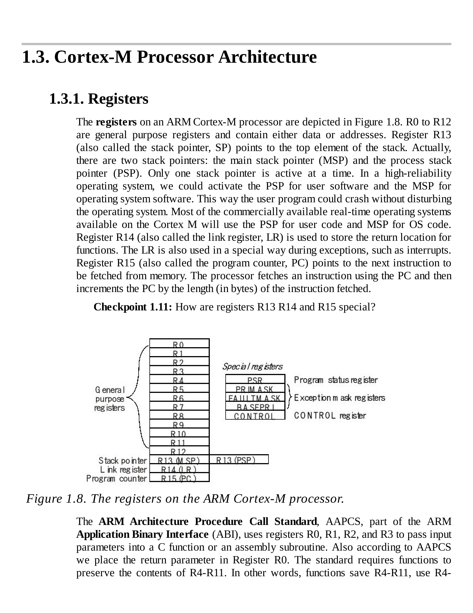
*Description*: Register layout and memory mapping diagram specifying bit fields, stack pointer allocations, and memory address boundaries for Figure 1.8: The registers on the ARM Cortex-M processor..

> **Figure 1.8: The registers on the ARM Cortex-M processor.**

The ARM Architecture Procedure Call Standard, AAPCS, part of the ARM
Application Binary Interface (ABI), uses registers R0, R1, R2, and R3 to pass input
parameters into a C function or an assembly subroutine. Also according to AAPCS
we place the return parameter in Register R0. The standard requires functions to
preserve the contents of R4-R11. In other words, functions save R4-R11, use R4-


<!-- Page 29 -->
### [PDF Page 29]

R11, and then restore R4-R11 before returning. Another restriction is to keep the
stack aligned to 64 bits, by pushing and popping an even number of registers.
There are three status registers named Application Program Status Register (APSR),
the Interrupt Program Status Register (IPSR), and the Execution Program Status
Register (EPSR) as shown in Figure 1.9.  These registers can be accessed
individually or in combination as the Program Status Register (PSR).

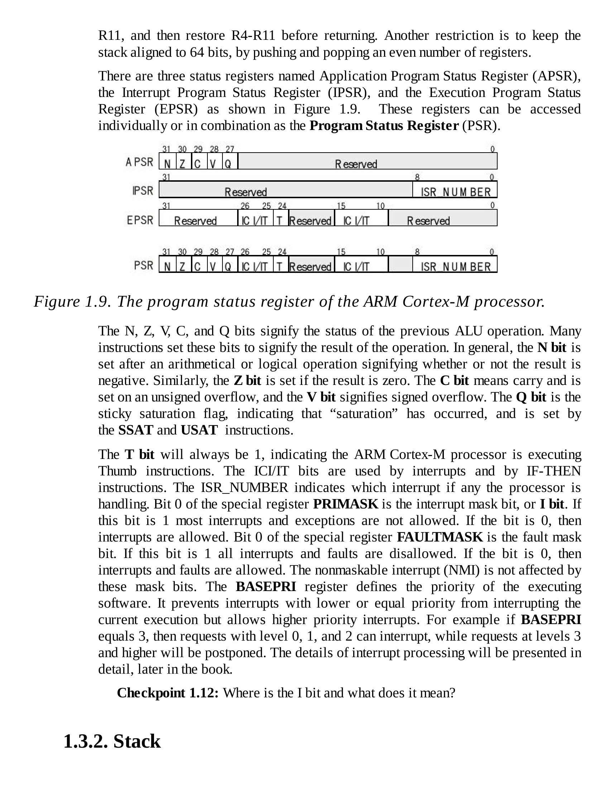
*Description*: Register layout and memory mapping diagram specifying bit fields, stack pointer allocations, and memory address boundaries for Figure 1.9: The program status register of the ARM Cortex-M processor..

> **Figure 1.9: The program status register of the ARM Cortex-M processor.**

The N, Z, V, C, and Q bits signify the status of the previous ALU operation. Many
instructions set these bits to signify the result of the operation. In general, the N bit is
set after an arithmetical or logical operation signifying whether or not the result is
negative. Similarly, the Z bit is set if the result is zero. The C bit means carry and is
set on an unsigned overflow, and the V bit signifies signed overflow. The Q bit is the
sticky saturation flag, indicating that “saturation” has occurred, and is set by
the SSAT and USAT  instructions.
The T bit will always be 1, indicating the ARM Cortex-M processor is executing
Thumb instructions. The ICI/IT bits are used by interrupts and by IF-THEN
instructions. The ISR_NUMBER indicates which interrupt if any the processor is
handling. Bit 0 of the special register PRIMASK is the interrupt mask bit, or I bit. If
this bit is 1 most interrupts and exceptions are not allowed. If the bit is 0, then
interrupts are allowed. Bit 0 of the special register FAULTMASK is the fault mask
bit. If this bit is 1 all interrupts and faults are disallowed. If the bit is 0, then
interrupts and faults are allowed. The nonmaskable interrupt (NMI) is not affected by
these mask bits. The BASEPRI register defines the priority of the executing
software. It prevents interrupts with lower or equal priority from interrupting the
current execution but allows higher priority interrupts. For example if BASEPRI
equals 3, then requests with level 0, 1, and 2 can interrupt, while requests at levels 3

```assembly
and higher will be postponed. The details of interrupt processing will be presented in
```

detail, later in the book.
Checkpoint 1.12: Where is the I bit and what does it mean?
1.3.2. Stack


<!-- Page 30 -->
### [PDF Page 30]

The stack is a last-in-first-out temporary storage. Managing the stack is an important
function for the operating system. To create a stack, a block of RAM is allocated for
this temporary storage. On the ARM Cortex-M processor, the stack always operates
on 32-bit data. The stack pointer (SP) points to the 32-bit data on the top of the stack.
The stack grows downwards in memory as we push data on to it so, although we
refer to the most recent item as the “top of the stack” it is actually the item stored at
the lowest address! To push data on the stack, the stack pointer is first decremented
by 4, and then the 32-bit information is stored at the address specified by SP. To pop
data from the stack, the 32-bit information pointed to by SP is first retrieved, and then
the stack pointer is incremented by 4. SP points to the last item pushed, which will
also be the next item to be popped. The processor allows for two stacks, the main
stack and the process stack, with independent copies of the stack pointer.  The boxes
in Figure 1.10 represent 32-bit storage elements in RAM. The grey boxes in the
figure refer to actual data stored on the stack, and the white boxes refer to locations
in memory that do not contain stack data. This figure illustrates how the stack is used
to push the contents of Registers R0, R1, and R2 in that order. Assume Register R0
initially contains the value 1, R1 contains 2 and R2 contains 3. The drawing on the
left shows the initial stack. The software executes these six

```assembly
PUSH {R0}
PUSH {R1}
PUSH {R2}
POP {R3}
POP {R4}
POP {R5}
```


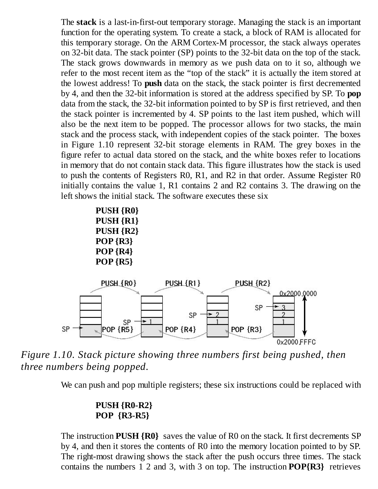
*Description*: Register layout and memory mapping diagram specifying bit fields, stack pointer allocations, and memory address boundaries for Figure 1.10: Stack picture showing three numbers first being pushed, then.

> **Figure 1.10: Stack picture showing three numbers first being pushed, then**

three numbers being popped.
We can push and pop multiple registers; these six instructions could be replaced with

```assembly
PUSH {R0-R2}
POP  {R3-R5}
```

The instruction PUSH {R0}  saves the value of R0 on the stack. It first decrements SP
by 4, and then it stores the contents of R0 into the memory location pointed to by SP.
The right-most drawing shows the stack after the push occurs three times. The stack
contains the numbers 1 2 and 3, with 3 on top. The instruction POP{R3}  retrieves


<!-- Page 31 -->
### [PDF Page 31]

data from the stack. It first moves the value from memory pointed to by SP into R3,

```assembly
and then it increments SP by 4. After the pop occurs three times the stack reverts to
```

its original state and registers R3, R4 and R5 contain 3 2 1 respectively. We define
the 32-bit word pointed to by SP as the top entry of the stack. If it exists, we define
the 32-bit data immediately below the top, at SP+4, as next to top. Proper use of the
stack requires following these important rules
1. Functions should have an equal number of pushes and pops
2. Stack accesses (push or pop) should not be performed outside the
allocated area
3. Stack reads and writes should not be performed within the free
area
4. Stack push should first decrement SP, then store the data
5. Stack pop should first read the data, and then increment SP
Functions that violate rule number 1 will probably crash when incorrect data are
popped off at a later time. Violations of rule number 2 can be caused by a stack
underflow or overflow. Overflow occurs when the number of elements became larger
than the allocated space. Stack underflow is caused when there are more pops than
pushes, and is always the result of a software bug. A stack overflow can be caused
by two reasons. If the software mistakenly pushes more than it pops, then the stack
pointer will eventually overflow its bounds. Even when there is exactly one pop for
each push, a stack overflow can occur if the stack is not allocated large enough. The
processor will generate a bus fault when the software tries read from or write to an
address that doesn’t exist. If valid RAM exists below the stack then further stack
operations will corrupt data in this memory.
First, we will consider the situation where the allocated stack area is placed at the
beginning of RAM. For example, assume we allocate 4096 bytes for the stack from
0x2000.0000 to 0x2000.0FFF; see the left side of Figure 1.11. The SP is initialized
to 0x2000.1000, and the stack is considered empty. If the SP becomes less than
0x2000.0000 a stack overflow has occurred. The stack overflow will cause a bus
fault because there is nothing at address 0x1FFF.FFFC. If the software tries to read
from or write to any location greater than or equal to 0x2000.1000 then a stack
underflow has occurred. At this point the stack and global variables exist at
overlapping addresses. Stack underflow is a very difficult bug to recognize, because
the first consequence will be unexplained changes to data stored in global variables.


<!-- Page 32 -->
### [PDF Page 32]


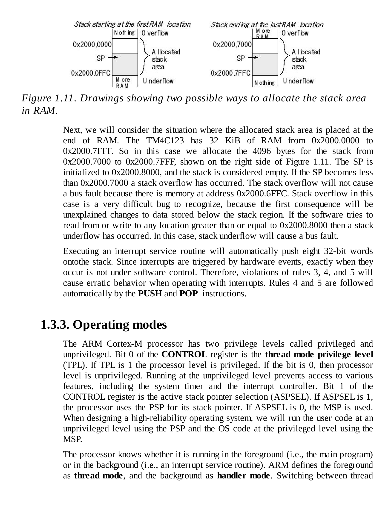
*Description*: Register layout and memory mapping diagram specifying bit fields, stack pointer allocations, and memory address boundaries for Figure 1.11: Drawings showing two possible ways to allocate the stack area.

> **Figure 1.11: Drawings showing two possible ways to allocate the stack area**

in RAM.
Next, we will consider the situation where the allocated stack area is placed at the
end of RAM. The TM4C123 has 32 KiB of RAM from 0x2000.0000 to
0x2000.7FFF. So in this case we allocate the 4096 bytes for the stack from
0x2000.7000 to 0x2000.7FFF, shown on the right side of Figure 1.11. The SP is
initialized to 0x2000.8000, and the stack is considered empty. If the SP becomes less
than 0x2000.7000 a stack overflow has occurred. The stack overflow will not cause
a bus fault because there is memory at address 0x2000.6FFC. Stack overflow in this
case is a very difficult bug to recognize, because the first consequence will be
unexplained changes to data stored below the stack region. If the software tries to
read from or write to any location greater than or equal to 0x2000.8000 then a stack
underflow has occurred. In this case, stack underflow will cause a bus fault.
Executing an interrupt service routine will automatically push eight 32-bit words
ontothe stack. Since interrupts are triggered by hardware events, exactly when they
occur is not under software control. Therefore, violations of rules 3, 4, and 5 will
cause erratic behavior when operating with interrupts. Rules 4 and 5 are followed
automatically by the PUSH and POP  instructions.
1.3.3. Operating modes
The ARM Cortex-M processor has two privilege levels called privileged and
unprivileged. Bit 0 of the CONTROL register is the thread mode privilege level
(TPL). If TPL is 1 the processor level is privileged. If the bit is 0, then processor
level is unprivileged. Running at the unprivileged level prevents access to various
features, including the system timer and the interrupt controller. Bit 1 of the
CONTROL register is the active stack pointer selection (ASPSEL). If ASPSEL is 1,
the processor uses the PSP for its stack pointer. If ASPSEL is 0, the MSP is used.
When designing a high-reliability operating system, we will run the user code at an
unprivileged level using the PSP and the OS code at the privileged level using the
MSP.
The processor knows whether it is running in the foreground (i.e., the main program)
or in the background (i.e., an interrupt service routine). ARM defines the foreground
as thread mode, and the background as handler mode. Switching between thread


<!-- Page 33 -->
### [PDF Page 33]


```assembly
and handler modes occurs automatically. The processor begins in thread mode,
signified by ISR_NUMBER=0. Whenever it is servicing an interrupt it switches to
```

handler mode, signified by setting ISR_NUMBER to specify which interrupt is being
processed. All interrupt service routines run using the MSP. In particular, the context
is saved onto whichever stack pointer is active, but during the execution of the ISR,
the MSP is used. For a high reliability operation all interrupt service routines will
reside in the operating system. User code can be run under interrupt control by
providing hooks, which are function pointers. The user can set function pointers
during initialization, and the operating system will call the function during the
interrupt service routine.
Observation: Processor modes and the stack are essential components of
building a reliable operating system. In particular the processor mode is an
architectural feature that allows the operating system to restrict access to critical
system resources.
1.3.4. Reset
A reset occurs immediately after power is applied and can also occur by pushing the
reset button available on most boards. After a reset, the processor is in thread mode,
running at a privileged level, and using the MSP stack pointer. The 32-bit value at
flash ROM location 0 is loaded into the SP. All stack accesses are word aligned.
Thus, the least significant two bits of SP must be 0. A reset also loads the 32-bit
value at location 4 into the PC. This value is called the reset vector. All instructions
are halfword aligned. Thus, the least significant bit of PC must be 0. However, the
assembler will set the least significant bit in the reset vector, so the processor will
properly initialize the Thumb bit (T) in the PSR. On the Cortex-M processor, the T
bit should always be set to 1. On reset, the processor initializes the LR to
0xFFFFFFFF.
1.3.5. Clock system
Normally, the execution speed of a microcontroller is determined by an external
crystal. The Texas Instruments MSP-EXP432P401R board has a 48 MHz crystal. The
Texas Instruments EK-TM4C123GXL and EK-TM4C1294-XL boards have a 16
MHz crystal. The TM4C microcontrollers have a phase-lock-loop (PLL) that allows
the software to adjust the execution speed of the computer. Typically, the choice of
frequency involves the tradeoff between software execution speed and electrical
power. In other words, slowing down the bus clock will require less power to
operate and generate less heat. Speeding up the bus clock obviously allows for more
calculations per second.
The default bus speed of the MSP432 and TM4C microcontrollers is that of the


<!-- Page 34 -->
### [PDF Page 34]

internal oscillator. For example, the default bus speed for the MSP432 is 3 MHz
±0.5%. The default bus speed for the TM4C internal oscillator is 16 MHz ±1%. The
internal oscillator is significantly less precise than the crystal, but it requires less
power and does not need an external crystal. This means for most applications we
will activate the main oscillator using the crystal so we can have a stable bus clock.
We will call library functions to select the clock source and bus frequency. In this
book, we will assume the MSP432 is running at 48 MHz, the TM4C123 is running at
80 MHz, and the TM4C1294 is running at 120 MHz. For more details on the clock
systems refer to Volume 2 of this series.


<!-- Page 35 -->
### [PDF Page 35]

1.4. Texas Instruments Cortex-M Microcontrollers
1.4.1. Introduction to I/O
I/O is an important part of embedded systems in general. One of the important
features of an operating system is to manage I/O. Input and output are the means of an
embedded system to interact with its world. The external devices attached to the
microcontroller provide functionality for the system. These devices connect to the
microcontroller through ports. A pin is a specific wire on the microcontroller through
which we perform input or output. A collection of pins grouped by common
functionality is called a port. An input port is hardware on the microcontroller that
allows information about the external world to enter into the computer. The
microcontroller also has hardware called an output port to send information out to
the external world. The GPIO (General Purpose Input Output) pins on a
microcontroller are programmable to be digital input, digital output, analog input or
complex and protocol (like UART etc.) specific.
Microcontrollers use most of their pins for I/O (called GPIO), see Figure 1.12. Only
a few pins are not used for I/O. Examples of pins not used for I/O include power,
ground, reset, debugging, and the clock. More specifically, the TM4C123 uses 43 of
its 64 pins for I/O. The TM4C1294 uses 90 of its 128 pins for I/O. Similarly, the
MSP432 uses 84 of its 100 pins for I/O.

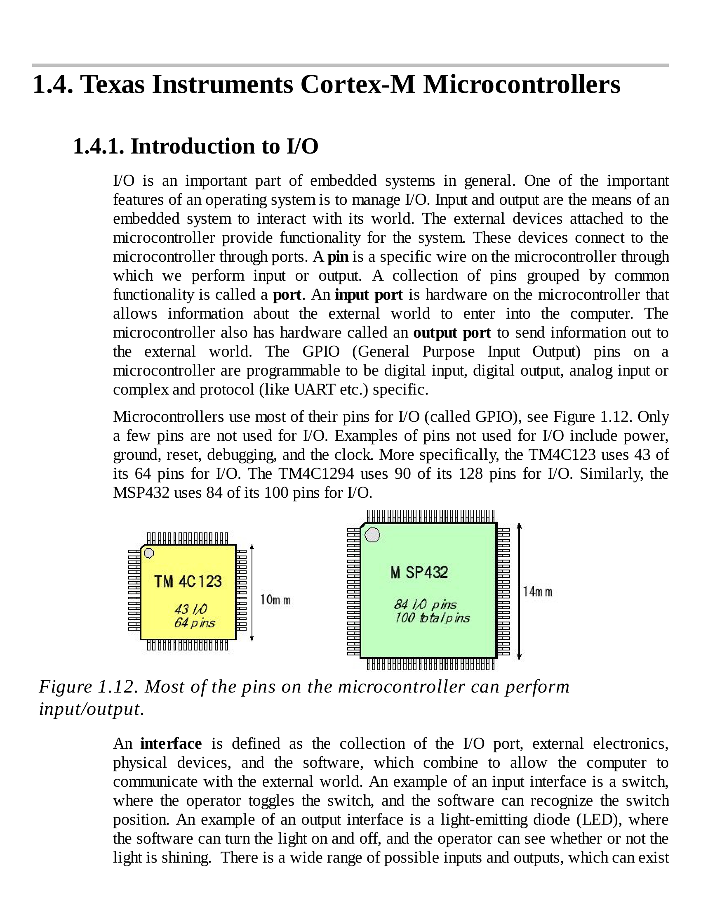
*Description*: Hardware pinout and board interface diagram mapping microcontroller pins, BoosterPack headers, switches, LEDs, and physical connectors for Figure 1.12: Most of the pins on the microcontroller can perform.

> **Figure 1.12: Most of the pins on the microcontroller can perform**

input/output.
An interface is defined as the collection of the I/O port, external electronics,
physical devices, and the software, which combine to allow the computer to
communicate with the external world. An example of an input interface is a switch,
where the operator toggles the switch, and the software can recognize the switch
position. An example of an output interface is a light-emitting diode (LED), where
the software can turn the light on and off, and the operator can see whether or not the
light is shining.  There is a wide range of possible inputs and outputs, which can exist


<!-- Page 36 -->
### [PDF Page 36]

in either digital or analog form. In general, we can classify I/O interfaces into four
categories
Parallel/Digital - binary data are available simultaneously on a
group of lines
Serial - binary data are available one bit at a time on a single
line
Analog - data are encoded as an electrical voltage, current or
power
Time - data are encoded as a period, frequency, pulse width or
phase shift
In a system with memory-mapped I/O, as shown in Figure 1.13, the I/O ports are
connected to the processor in a manner similar to memory. I/O ports are assigned
addresses, and the software accesses I/O using reads and writes to the specific I/O
addresses.  These addresses appear like regular memory addresses, except accessing
them results in manipulation of a functionality of the mapped I/O port, hence the term
memory-mapped I/O. As a result, the software inputs from an input port using the
same instructions as it would if it were reading from memory. Similarly, the software
outputs from an output port using the same instructions as it would if it were writing
to memory.

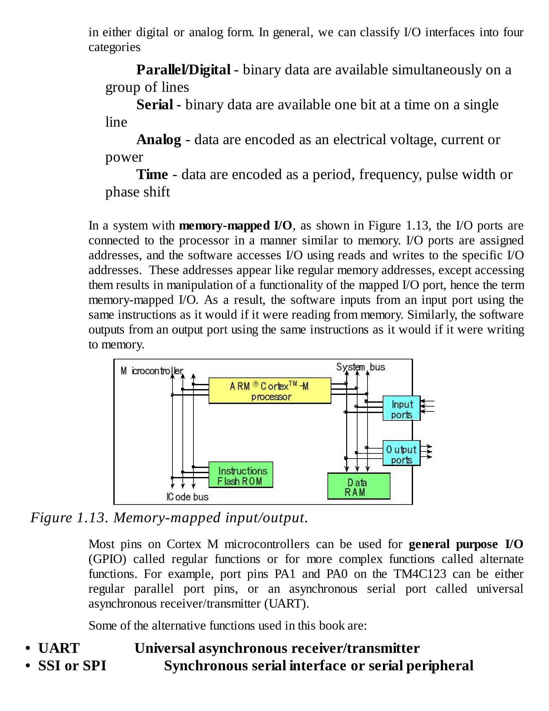
*Description*: Technical schematic and block diagram illustrating circuit operation, signal pathways, and functional behavior for Figure 1.13: Memory-mapped input/output..

> **Figure 1.13: Memory-mapped input/output.**

Most pins on Cortex M microcontrollers can be used for general purpose I/O
(GPIO) called regular functions or for more complex functions called alternate
functions. For example, port pins PA1 and PA0 on the TM4C123 can be either
regular parallel port pins, or an asynchronous serial port called universal
asynchronous receiver/transmitter (UART).
Some of the alternative functions used in this book are:
•  UART
Universal asynchronous receiver/transmitter
•  SSI or SPI
Synchronous serial interface or serial peripheral


<!-- Page 37 -->
### [PDF Page 37]

interface
•  I2C
Inter-integrated circuit
•  Timer
Periodic interrupts
•  PWM
Pulse width modulation
•  ADC
Analog to digital converter, measurement analog signals
The UART can be used for serial communication between computers. It is
asynchronous and allows for simultaneous communication in both directions. The SSI
(also called SPI) is used to interface medium-speed I/O devices. In this class, we
will use SSI to interface a graphics display. I2C is a simple I/O bus that we will use
to interface low speed peripheral devices. In this class we use I2C to interface a light
sensor and a temperature sensor. We will use the timer modules to create periodic
interrupts. PWM outputs could be used to apply variable power to motor interfaces.
However, in this class we use PWM to adjust the volume of the buzzer. The ADC
will be used to measure the amplitude of analog signals, and will be important in
data acquisition systems. In this class we will connect the microphone, joystick and
accelerometer to the ADC.
Joint Test Action Group (JTAG), standardized as the IEEE 1149.1, is a standard test
access port used to program and debug the microcontroller board. Each
microcontroller uses four port pins for the JTAG interface.
Checkpoint 1.13: What is the difference between a pin and a port?
Checkpoint 1.14: List four types of input/output.
1.4.2. Texas Instruments TM4C123 LaunchPad I/O pins

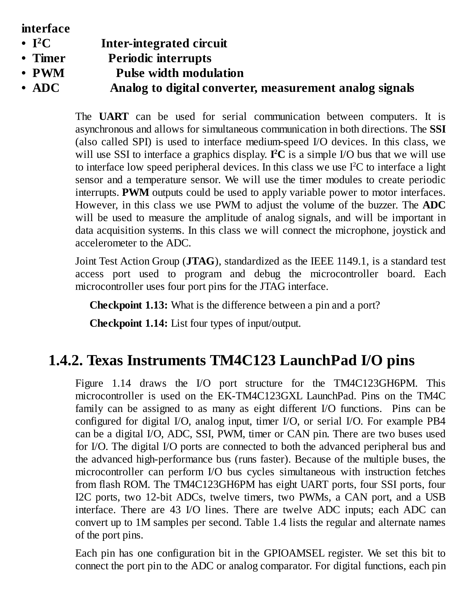
*Description*: Technical schematic and block diagram illustrating circuit operation, signal pathways, and functional behavior for Figure 1.14: draws the I/O port structure for the TM4C123GH6PM. This.

> **Figure 1.14: draws the I/O port structure for the TM4C123GH6PM. This**

microcontroller is used on the EK-TM4C123GXL LaunchPad. Pins on the TM4C
family can be assigned to as many as eight different I/O functions.  Pins can be
configured for digital I/O, analog input, timer I/O, or serial I/O. For example PB4
can be a digital I/O, ADC, SSI, PWM, timer or CAN pin. There are two buses used
for I/O. The digital I/O ports are connected to both the advanced peripheral bus and
the advanced high-performance bus (runs faster). Because of the multiple buses, the
microcontroller can perform I/O bus cycles simultaneous with instruction fetches
from flash ROM. The TM4C123GH6PM has eight UART ports, four SSI ports, four
I2C ports, two 12-bit ADCs, twelve timers, two PWMs, a CAN port, and a USB
interface. There are 43 I/O lines. There are twelve ADC inputs; each ADC can
convert up to 1M samples per second. Table 1.4 lists the regular and alternate names
of the port pins.
Each pin has one configuration bit in the GPIOAMSEL register. We set this bit to
connect the port pin to the ADC or analog comparator. For digital functions, each pin


<!-- Page 38 -->
### [PDF Page 38]

also has four bits in the GPIOPCTL register, which we set to specify the alternative
function for that pin (0 means regular I/O port). Not every pin can be connected to
every alternative function. See Table 1.4.
Pins PC3 – PC0 were left off Table 1.4 because these four pins are reserved for the
JTAG debugger, and should not be used for regular I/O. Notice, most alternate
function modules (e.g., U0Rx) only exist on one pin (PA0). While other functions
could be mapped to two or three pins (CAN0Rx could be mapped to PB4, PE4 or
PF3.)
The two pins PD7 and PF0 are associated with NMI; these two pins are initially
locked. This means if you plan to use PD7 or PF0 you will need to unlock it by first
writing 0x4C4F434B to the lock register and then setting bits in the commit register.
This code unlocks PF0
GPIO_PORTF_LOCK_R = 0x4C4F434B;   // unlock GPIO Port F
GPIO_PORTF_CR_R = 0x1F;           // allow changes to PF4-0

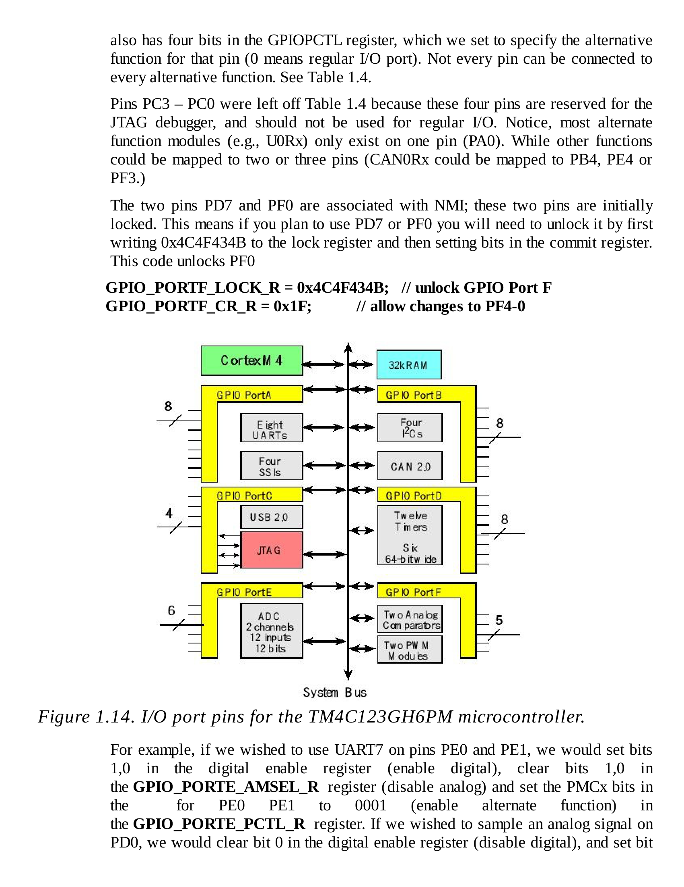
*Description*: Hardware pinout and board interface diagram mapping microcontroller pins, BoosterPack headers, switches, LEDs, and physical connectors for Figure 1.14: I/O port pins for the TM4C123GH6PM microcontroller..

> **Figure 1.14: I/O port pins for the TM4C123GH6PM microcontroller.**

For example, if we wished to use UART7 on pins PE0 and PE1, we would set bits
1,0 in the digital enable register (enable digital), clear bits 1,0 in
the GPIO_PORTE_AMSEL_R  register (disable analog) and set the PMCx bits in
the
for
PE0
PE1
to
0001
(enable
alternate
function)
in
the GPIO_PORTE_PCTL_R  register. If we wished to sample an analog signal on
PD0, we would clear bit 0 in the digital enable register (disable digital), and set bit


<!-- Page 39 -->
### [PDF Page 39]

0 in the GPIOAMSEL (enable analog), and activate one of the ADCs to sample
channel 7.
The TM4C LaunchPad evaluation board (Figure 1.15) is a low-cost development
board available as part number EK-TM4C123GXL from www.ti.com and from
regular electronic distributors like Digikey, Mouser, and Avnet. The kit provides an
integrated Stellaris In-Circuit Debug Interface (ICDI), which allows programming

```assembly
and debugging of the onboard TM4C microcontroller. One USB cable is used by the
```

debugger (ICDI), and the other USB allows the user to develop USB applications
(device). The user can select board power to come from either the debugger (ICDI)
or the USB device (device) by setting the Power selection switch.
The LaunchPad board can also be used as a JTAG debugger for another target by
removing the VDD jumper and connecting the target to PC0=TCK, PC1=TMS,
PC2=TDI, and PC3=TDO
IO
Ain
0
1
2
3
4
5
6
7
8
9
14
PA0
Port U0Rx
CAN1Rx
PA1
Port U0Tx
CAN1Tx
PA2
Port
SSI0Clk
PA3
Port
SSI0Fss
PA4
Port
SSI0Rx
PA5
Port
SSI0Tx
PA6
Port
I2C1SCL
M1PWM2
PA7
Port
I2C1SDA
M1PWM3
PB0
USB0ID
Port U1Rx
T2CCP0
PB1 USB0VBUS Port U1Tx
T2CCP1
PB2
Port
I2C0SCL
T3CCP0
PB3
Port
I2C0SDA
T3CCP1
PB4
Ain10
Port
SSI2Clk
M0PWM2
T1CCP0
CAN0Rx
PB5
Ain11
Port
SSI2Fss
M0PWM3
T1CCP1
CAN0Tx
PB6
Port
SSI2Rx
M0PWM0
T0CCP0
PB7
Port
SSI2Tx
M0PWM1
T0CCP1
PC4
C1-
Port U4Rx
U1Rx
M0PWM6
IDX1 WT0CCP0
U1RTS
PC5
C1+
Port U4Tx
U1Tx
M0PWM7
PhA1 WT0CCP1
U1CTS
PC6
C0+
Port U3Rx
PhB1 WT1CCP0 USB0epen
PC7
C0-
Port U3Tx
WT1CCP1 USB0pflt
PD0
Ain7
Port SSI3Clk SSI1Clk I2C3SCL M0PWM6 M1PWM0
WT2CCP0
PD1
Ain6
Port SSI3Fss SSI1Fss I2C3SDA M0PWM7 M1PWM1
WT2CCP1
PD2
Ain5
Port SSI3Rx SSI1Rx
M0Fault0
WT3CCP0 USB0epen
PD3
Ain4
Port SSI3Tx SSI1Tx
IDX0 WT3CCP1 USB0pflt
PD4 USB0DM Port U6Rx
WT4CCP0
PD5
USB0DP Port U6Tx
WT4CCP1
PD6
Port U2Rx
M0Fault0
PhA0 WT5CCP0
PD7
Port U2Tx
PhB0 WT5CCP1
NMI
PE0
Ain3
Port U7Rx
PE1
Ain2
Port U7Tx
PE2
Ain1
Port


<!-- Page 40 -->
### [PDF Page 40]

PE3
Ain0
Port
PE4
Ain9
Port U5Rx
I2C2SCL M0PWM4 M1PWM2
CAN0Rx
PE5
Ain8
Port U5Tx
I2C2SDA M0PWM5 M1PWM3
CAN0Tx
PF0
Port U1RTS SSI1Rx CAN0Rx
M1PWM4 PhA0 T0CCP0
NMI
C0o
PF1
Port U1CTS SSI1Tx
M1PWM5 PhB0 T0CCP1
C1o TRD1
PF2
Port
SSI1Clk
M0Fault0 M1PWM6
T1CCP0
TRD0
PF3
Port
SSI1Fss CAN0Tx
M1PWM7
T1CCP1
TRCLK
PF4
Port
M1Fault0 IDX0 T2CCP0 USB0epen


*Description*: Register layout and memory mapping diagram specifying bit fields, stack pointer allocations, and memory address boundaries for Table 1.4: PMCx bits in the GPIOPCTL register on the LM4F/TM4C specify alternate.

> **Table 1.4: PMCx bits in the GPIOPCTL register on the LM4F/TM4C specify alternate**

functions. PB1, PB0, PD4 and PD5 are hardwired to the USB device. PA0 and PA1 are
hardwired to the serial port. PWM is not available on LM4F120.

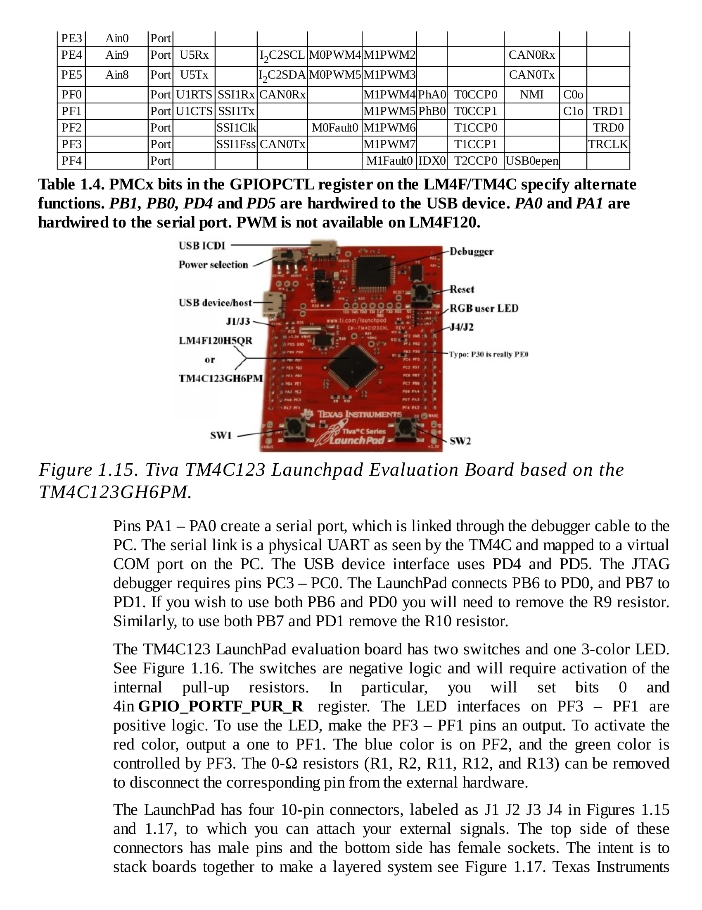
*Description*: Hardware pinout and board interface diagram mapping microcontroller pins, BoosterPack headers, switches, LEDs, and physical connectors for Figure 1.15: Tiva TM4C123 Launchpad Evaluation Board based on the.

> **Figure 1.15: Tiva TM4C123 Launchpad Evaluation Board based on the**

TM4C123GH6PM.
Pins PA1 – PA0 create a serial port, which is linked through the debugger cable to the
PC. The serial link is a physical UART as seen by the TM4C and mapped to a virtual
COM port on the PC. The USB device interface uses PD4 and PD5. The JTAG
debugger requires pins PC3 – PC0. The LaunchPad connects PB6 to PD0, and PB7 to
PD1. If you wish to use both PB6 and PD0 you will need to remove the R9 resistor.
Similarly, to use both PB7 and PD1 remove the R10 resistor.
The TM4C123 LaunchPad evaluation board has two switches and one 3-color LED.
See Figure 1.16. The switches are negative logic and will require activation of the
internal
pull-up
resistors.
In
particular,
you
will
set
bits
0
and
4in GPIO_PORTF_PUR_R  register. The LED interfaces on PF3 – PF1 are
positive logic. To use the LED, make the PF3 – PF1 pins an output. To activate the
red color, output a one to PF1. The blue color is on PF2, and the green color is
controlled by PF3. The 0-Ω resistors (R1, R2, R11, R12, and R13) can be removed
to disconnect the corresponding pin from the external hardware.
The LaunchPad has four 10-pin connectors, labeled as J1 J2 J3 J4 in Figures 1.15

```assembly
and 1.17, to which you can attach your external signals. The top side of these
```

connectors has male pins and the bottom side has female sockets. The intent is to
stack boards together to make a layered system see Figure 1.17. Texas Instruments


<!-- Page 41 -->
### [PDF Page 41]

also supplies Booster Packs, which are pre-made external devices that will plug into
this 40-pin connector. The Booster Packs for the MSP430 LaunchPad are compatible
(one simply plugs these 20-pin connectors into the outer two rows) with this board.
The inner 10-pin headers (connectors J3 and J4) are not intended to be compatible
with other TI LaunchPads. J3 and J4 apply only to Tiva Booster Packs.
There are a number of good methods to connect external circuits to the LaunchPad.
One method is to purchase a male to female jumper cable (e.g., item number 826 at
www.adafruit.com). A second method is to solder a solid wire into a female socket
(e.g., Hirose DF11-2428SCA) creating a male to female jumper wire.

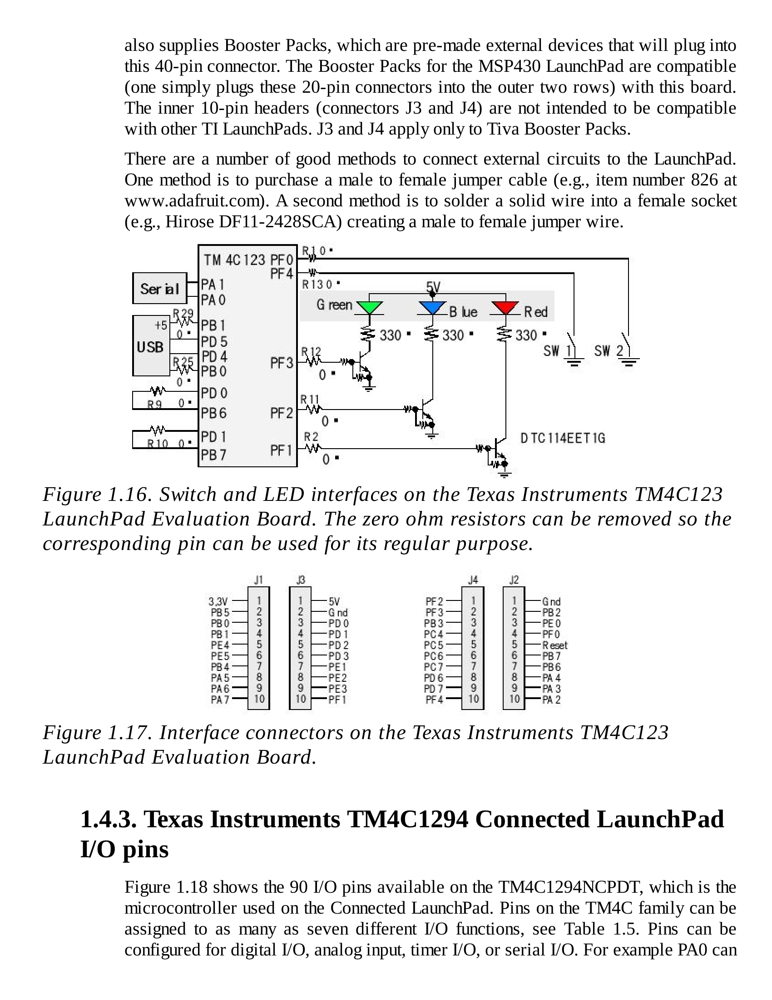
*Description*: Hardware pinout and board interface diagram mapping microcontroller pins, BoosterPack headers, switches, LEDs, and physical connectors for Figure 1.16: Switch and LED interfaces on the Texas Instruments TM4C123.

> **Figure 1.16: Switch and LED interfaces on the Texas Instruments TM4C123**

LaunchPad Evaluation Board. The zero ohm resistors can be removed so the
corresponding pin can be used for its regular purpose.


*Description*: Hardware pinout and board interface diagram mapping microcontroller pins, BoosterPack headers, switches, LEDs, and physical connectors for Figure 1.17: Interface connectors on the Texas Instruments TM4C123.

> **Figure 1.17: Interface connectors on the Texas Instruments TM4C123**

LaunchPad Evaluation Board.
1.4.3. Texas Instruments TM4C1294 Connected LaunchPad
I/O pins


*Description*: Hardware pinout and board interface diagram mapping microcontroller pins, BoosterPack headers, switches, LEDs, and physical connectors for Figure 1.18: shows the 90 I/O pins available on the TM4C1294NCPDT, which is the.

> **Figure 1.18: shows the 90 I/O pins available on the TM4C1294NCPDT, which is the**

microcontroller used on the Connected LaunchPad. Pins on the TM4C family can be
assigned to as many as seven different I/O functions, see Table 1.5. Pins can be
configured for digital I/O, analog input, timer I/O, or serial I/O. For example PA0 can


<!-- Page 42 -->
### [PDF Page 42]

be digital I/O, serial input, I2C clock, Timer I/O, or CAN receiver. There are two
buses used for I/O. Unlike the TM4C123, the digital I/O ports are only connected to
the advanced high-performance bus. The microcontroller can perform I/O bus cycles
simultaneous with instruction fetches from flash ROM. The TM4C1294NCPDT has
eight UART ports, four SSI ports, ten I2C ports, two 12-bit ADCs, eight timers, two
CAN ports, a USB interface, 8 PWM outputs, and an Ethernet port. Of the 90 I/O
lines, twenty pins can be used for analog inputs to the ADC. The ADC can convert up
to 1M samples per second. Table 1.5 lists the regular and alternate functions of the
port pins.


*Description*: Hardware pinout and board interface diagram mapping microcontroller pins, BoosterPack headers, switches, LEDs, and physical connectors for Figure 1.18: I/O port pins for the TM4C1294NCPDT microcontroller..

> **Figure 1.18: I/O port pins for the TM4C1294NCPDT microcontroller.**


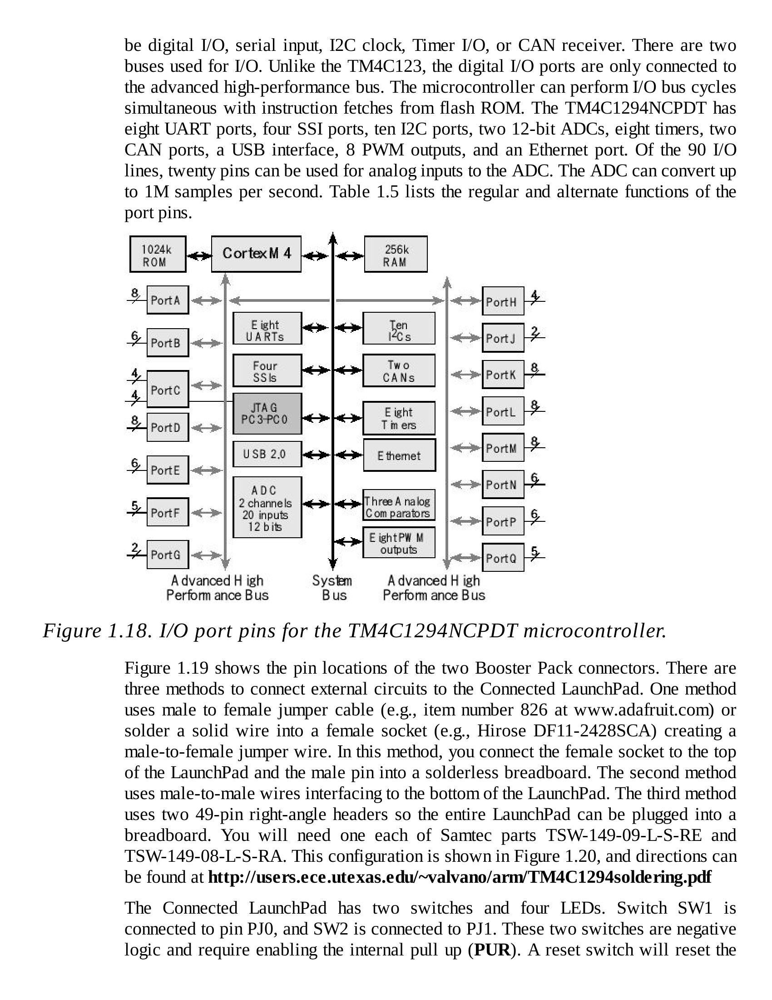
*Description*: Hardware pinout and board interface diagram mapping microcontroller pins, BoosterPack headers, switches, LEDs, and physical connectors for Figure 1.19: shows the pin locations of the two Booster Pack connectors. There are.

> **Figure 1.19: shows the pin locations of the two Booster Pack connectors. There are**

three methods to connect external circuits to the Connected LaunchPad. One method
uses male to female jumper cable (e.g., item number 826 at www.adafruit.com) or
solder a solid wire into a female socket (e.g., Hirose DF11-2428SCA) creating a
male-to-female jumper wire. In this method, you connect the female socket to the top
of the LaunchPad and the male pin into a solderless breadboard. The second method
uses male-to-male wires interfacing to the bottom of the LaunchPad. The third method
uses two 49-pin right-angle headers so the entire LaunchPad can be plugged into a
breadboard. You will need one each of Samtec parts TSW-149-09-L-S-RE and
TSW-149-08-L-S-RA. This configuration is shown in Figure 1.20, and directions can
be found at http://users.ece.utexas.edu/~valvano/arm/TM4C1294soldering.pdf
The Connected LaunchPad has two switches and four LEDs. Switch SW1 is
connected to pin PJ0, and SW2 is connected to PJ1. These two switches are negative
logic and require enabling the internal pull up (PUR). A reset switch will reset the


<!-- Page 43 -->
### [PDF Page 43]

microcontroller and your software will start when you release the switch. Positive
logic LEDs D1, D2, D3, and D4 are connected to PN1, PN0, PF4, and PF0
respectively. A power LED indicates that 3.3 volt power is present on the board.
R19 is a 0 Ω resistor connecting PA3 and PQ2. Similarly, R20 is a 0 Ω resistor
connecting PA2 and PQ3. You need to remove R19 if you plan to use both PA3 and
PQ2. You need to remove R20 if you plan to use both PA2 and PQ3. See Figures 1.20

```assembly
and 1.21.
```


*Description*: Hardware pinout and board interface diagram mapping microcontroller pins, BoosterPack headers, switches, LEDs, and physical connectors for Figure 1.19: Interface connectors on the EK-TM4C1294-XL LaunchPad.

> **Figure 1.19: Interface connectors on the EK-TM4C1294-XL LaunchPad**

Evaluation Board.

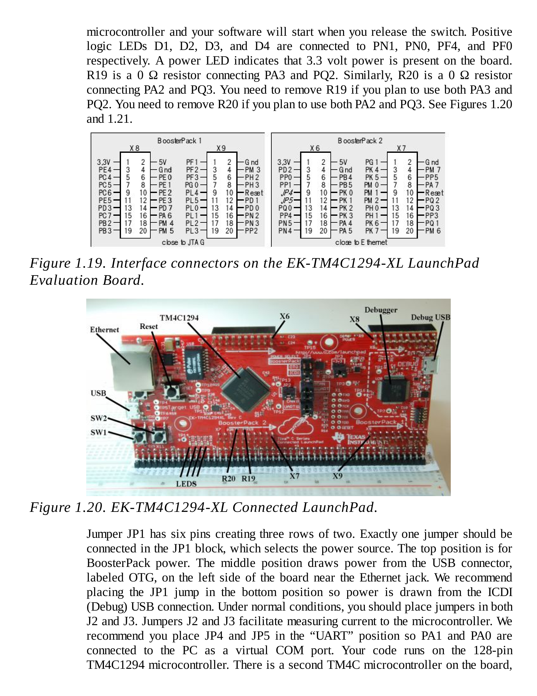
*Description*: Hardware pinout and board interface diagram mapping microcontroller pins, BoosterPack headers, switches, LEDs, and physical connectors for Figure 1.20: EK-TM4C1294-XL Connected LaunchPad..

> **Figure 1.20: EK-TM4C1294-XL Connected LaunchPad.**

Jumper JP1 has six pins creating three rows of two. Exactly one jumper should be
connected in the JP1 block, which selects the power source. The top position is for
BoosterPack power. The middle position draws power from the USB connector,
labeled OTG, on the left side of the board near the Ethernet jack. We recommend
placing the JP1 jump in the bottom position so power is drawn from the ICDI
(Debug) USB connection. Under normal conditions, you should place jumpers in both
J2 and J3. Jumpers J2 and J3 facilitate measuring current to the microcontroller. We
recommend you place JP4 and JP5 in the “UART” position so PA1 and PA0 are
connected to the PC as a virtual COM port. Your code runs on the 128-pin
TM4C1294 microcontroller. There is a second TM4C microcontroller on the board,


<!-- Page 44 -->
### [PDF Page 44]

which acts as the JTAG debugger for your TM4C1294. You connect the Debug USB
to a PC in order to download and debug software on the board. The other USB is for
user applications.
Pin
Analog
1
2
3
5
6
7
11
13
14
15
PA0 -
U0Rx
I2C9SCL T0CCP0 -
-
CAN0Rx -
-
-
-
PA1 -
U0Tx
I2C9SDA T0CCP1 -
-
CAN0Tx
-
-
-
-
PA2 -
U4Rx
I2C8SCL T1CCP0 -
-
-
-
-
-
SSI0C
PA3 -
U4Tx
I2C8SDA T1CCP1 -
-
-
-
-
-
SSI0F
PA4 -
U3Rx
I2C7SCL T2CCP0 -
-
-
-
-
-
SSI0X
PA5 -
U3Tx
I2C7SDA T2CCP1 -
-
-
-
-
-
SSI0X
PA6 -
U2Rx
I2C6SCL T3CCP0 USB0EPEN -
-
-
SSI0XDAT2 -
EPI0
PA7 -
U2Tx
I2C6SDA T3CCP1 USB0PFLT -
-
USB0EPEN SSI0XDAT3 -
EPI0
PB0 USB0ID
U1Rx
I2C5SCL T4CCP0 -
-
CAN1Rx -
-
-
-
PB1 USB0VBUS U1Tx
I2C5SDA T4CCP1 -
-
CAN1Tx
-
-
-
-
PB2 -
-
I2C0SCL T5CCP0 -
-
-
-
-
USB0STP
EPI0
PB3 -
-
I2C0SDA T5CCP1 -
-
-
-
-
USB0CLK EPI0
PB4 AIN10
U0CTS I2C5SCL -
-
-
-
-
-
-
SSI1F
PB5 AIN11
U0RTS I2C5SDA -
-
-
-
-
-
-
SSI1C
PC4 C1-
U7Rx
-
-
-
-
-
-
-
-
EPI0
PC5 C1+
U7Tx
-
-
-
-
RTCCLK -
-
-
EPI0
PC6 C0+
U5Rx
-
-
-
-
-
-
-
-
EPI0
PC7 C0-
U5Tx
-
-
-
-
-
-
-
-
EPI0
PD0 AIN15
-
I2C7SCL T0CCP0 C0o
-
-
-
-
-
SSI2X
PD1 AIN14
-
I2C7SDA T0CCP1 C1o
-
-
-
-
-
SSI2X
PD2 AIN13
-
I2C8SCL T1CCP0 C2o
-
-
-
-
-
SSI2F
PD3 AIN12
-
I2C8SDA T1CCP1 -
-
-
-
-
-
SSI2C
PD4 AIN7
U2Rx
-
T3CCP0 -
-
-
-
-
-
SSI1X
PD5 AIN6
U2Tx
-
T3CCP1 -
-
-
-
-
-
SSI1X
PD6 AIN5
U2RTS -
T4CCP0 USB0EPEN -
-
-
-
-
SSI2X
PD7 AIN4
U2CTS -
T4CCP1 USB0PFLT -
-
-
-
-
SSI2X
PE0 AIN3
U1RTS -
-
-
-
-
-
-
-
-
PE1 AIN2
U1DSR -
-
-
-
-
-
-
-
-
PE2 AIN1
U1DCD -
-
-
-
-
-
-
-
-
PE3 AIN0
U1DTR -
-
-
-
-
-
-
-
-
PE4 AIN9
U1RI
-
-
-
-
-
-
-
-
SSI1X
PE5 AIN8
-
-
-
-
-
-
-
-
-
SSI1X
PF0 -
-
-
-
EN0LED0
M0PWM0
-
-
-
SSI3XDAT1 TRD
PF1 -
-
-
-
EN0LED2
M0PWM1
-
-
-
SSI3XDAT0 TRD
PF2 -
-
-
-
-
M0PWM2
-
-
-
SSI3Fss
TRD
PF3 -
-
-
-
-
M0PWM3
-
-
-
SSI3Clk
TRCL
PF4 -
-
-
-
EN0LED1
M0FAULT0 -
-
-
SSI3XDAT2 TRD
PG0 -
-
I2C1SCL -
EN0PPS
M0PWM4
-
-
-
-
EPI0
PG1 -
-
I2C1SDA -
-
M0PWM5
-
-
-
-
EPI0
PH0 -
U0RTS -
-
-
-
-
-
-
-
EPI0
PH1 -
U0CTS -
-
-
-
-
-
-
-
EPI0
PH2 -
U0DCD -
-
-
-
-
-
-
-
EPI0
PH3 -
U0DSR -
-
-
-
-
-
-
-
EPI0
PJ0 -
U3Rx
-
-
EN0PPS
-
-
-
-
-
-
PJ1 -
U3Tx
-
-
-
-
-
-
-
-
-
PK0 AIN16
U4Rx
-
-
-
-
-
-
-
-
EPI0


<!-- Page 45 -->
### [PDF Page 45]

PK1 AIN17
U4Tx
-
-
-
-
-
-
-
-
EPI0
PK2 AIN18
U4RTS -
-
-
-
-
-
-
-
EPI0
PK3 AIN19
U4CTS -
-
-
-
-
-
-
-
EPI0
PK4 -
-
I2C3SCL -
EN0LED0
M0PWM6
-
-
-
-
EPI0
PK5 -
-
I2C3SDA -
EN0LED2
M0PWM7
-
-
-
-
EPI0
PK6 -
-
I2C4SCL -
EN0LED1
M0FAULT1 -
-
-
-
EPI0
PK7 -
U0RI
I2C4SDA -
RTCCLK
M0FAULT2 -
-
-
-
EPI0
PL0 -
-
I2C2SDA -
-
M0FAULT3 -
-
-
USB0D0
EPI0
PL1 -
-
I2C2SCL -
-
PhA0
-
-
-
USB0D1
EPI0
PL2 -
-
-
-
C0o
PhB0
-
-
-
USB0D2
EPI0
PL3 -
-
-
-
C1o
IDX0
-
-
-
USB0D3
EPI0
PL4 -
-
-
T0CCP0 -
-
-
-
-
USB0D4
EPI0
Pin
Analog
1
2
3
5
6
7
11
13
14
15
PL5 -
-
-
T0CCP1 -
-
-
-
-
USB0D5
EPI0
PL6 USB0DP
-
-
T1CCP0 -
-
-
-
-
-
-
PL7 USB0DM
-
-
T1CCP1 -
-
-
-
-
-
-
PM0 -
-
-
T2CCP0 -
-
-
-
-
-
EPI0
PM1 -
-
-
T2CCP1 -
-
-
-
-
-
EPI0
PM2 -
-
-
T3CCP0 -
-
-
-
-
-
EPI0
PM3 -
-
-
T3CCP1 -
-
-
-
-
-
EPI0
PM4 TMPR3
U0CTS -
T4CCP0 -
-
-
-
-
-
-
PM5 TMPR2
U0DCD -
T4CCP1 -
-
-
-
-
-
-
PM6 TMPR1
U0DSR -
T5CCP0 -
-
-
-
-
-
-
PM7 TMPR0
U0RI
-
T5CCP1 -
-
-
-
-
-
-
PN0 -
U1RTS -
-
-
-
-
-
-
-
-
PN1 -
U1CTS -
-
-
-
-
-
-
-
-
PN2 -
U1DCD U2RTS
-
-
-
-
-
-
-
EPI0
PN3 -
U1DSR U2CTS
-
-
-
-
-
-
-
EPI0
PN4 -
U1DTR U3RTS
I2C2SDA -
-
-
-
-
-
EPI0
PN5 -
U1RI
U3CTS
I2C2SCL -
-
-
-
-
-
EPI0
PP0 C2+
U6Rx
-
-
-
-
-
-
-
-
SSI3X
PP1 C2-
U6Tx
-
-
-
-
-
-
-
-
SSI3X
PP2 -
U0DTR -
-
-
-
-
-
-
USB0NXT EPI0
PP3 -
U1CTS U0DCD
-
-
-
RTCCLK -
-
USB0DIR
EPI0
PP4 -
U3RTS U0DSR
-
-
-
-
-
-
USB0D7
-
PP5 -
U3CTS I2C2SCL -
-
-
-
-
-
USB0D6
-
PQ0 -
-
-
-
-
-
-
-
-
SSI3Clk
EPI0
PQ1 -
-
-
-
-
-
-
-
-
SSI3Fss
EPI0
PQ2 -
-
-
-
-
-
-
-
-
SSI3XDAT0 EPI0
PQ3 -
-
-
-
-
-
-
-
-
SSI3XDAT1 EPI0
PQ4 -
U1Rx
-
-
-
-
DIVSCLK -
-
-
-

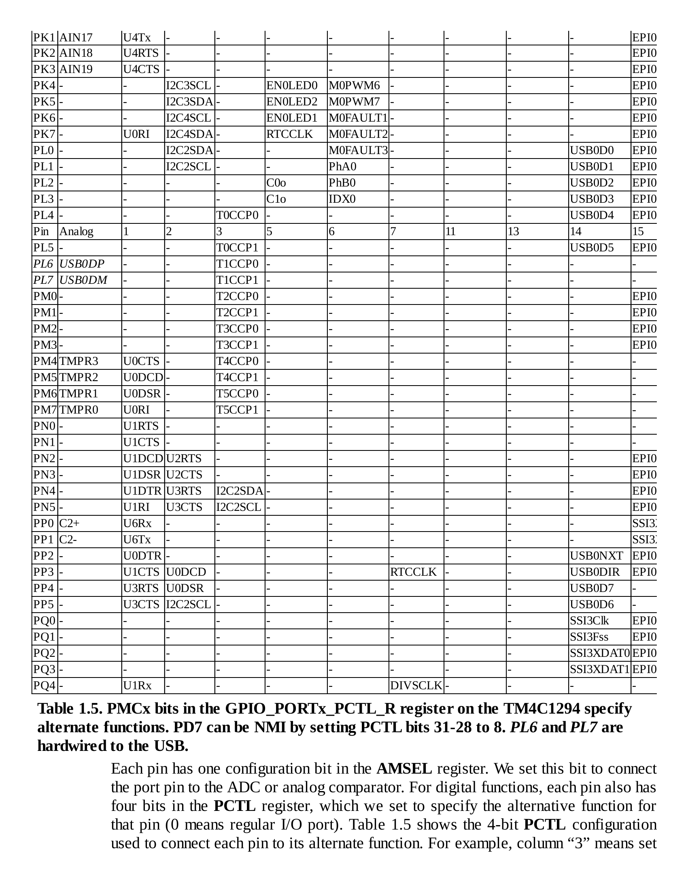
*Description*: Register layout and memory mapping diagram specifying bit fields, stack pointer allocations, and memory address boundaries for Table 1.5: PMCx bits in the GPIO_PORTx_PCTL_R register on the TM4C1294 specify.

> **Table 1.5: PMCx bits in the GPIO_PORTx_PCTL_R register on the TM4C1294 specify**

alternate functions. PD7 can be NMI by setting PCTL bits 31-28 to 8. PL6 and PL7 are
hardwired to the USB.
Each pin has one configuration bit in the AMSEL register. We set this bit to connect
the port pin to the ADC or analog comparator. For digital functions, each pin also has
four bits in the PCTL register, which we set to specify the alternative function for
that pin (0 means regular I/O port). Table 1.5 shows the 4-bit PCTL configuration
used to connect each pin to its alternate function. For example, column “3” means set


<!-- Page 46 -->
### [PDF Page 46]

4-bit field in PCTL to 0011.
Pins PC3 – PC0 were left off Table 1.5 because these four pins are reserved for the
JTAG debugger and should not be used for regular I/O. Notice, some alternate
function modules (e.g., U0Rx) only exist on one pin (PA0), while other functions
could be mapped to two or three pins. For example,  T0CCP0 could be mapped to
one of the following: PA0, PD0, or PL4.
The PCTL bits in Table 1.5 can be tricky to understand. For example, if we wished to
use UART6 on pins PP0 and PP1, we would set bits 1,0 in the DEN register
(enable), clear bits 1,0 in the AMSEL register (disable), write a 0001,0001 to bits
7–0
in
the
PCTL
register
(UART)
GPIO_PORTP_PCTL_R
=
(GPIO_PORTP_PCTL_R&0xFFFFFFFF)+0x00000011; and set bits 1,0 in the
AFSEL register (enable alternate function). If we wished to sample an analog signal
on PD0, we would set bit 0 in the alternate function select register AFSEL, clear bit
0 in the digital enable register DEN (disable digital), set bit 0 in the analog mode
select register AMSEL (enable analog), and activate one of the ADCs to sample
channel 15.
Jumpers JP4 and JP5 select whether the serial port on UART0 (PA1 – PA0) or on
UART2 (PD5 – 4) is linked through the debugger cable to the PC. The serial link is a
physical UART as seen by the TM4C1294 and is mapped to a virtual COM port on
the PC. The USB device interface uses PL6 and PL7. The JTAG debugger requires
pins PC3 – PC0.

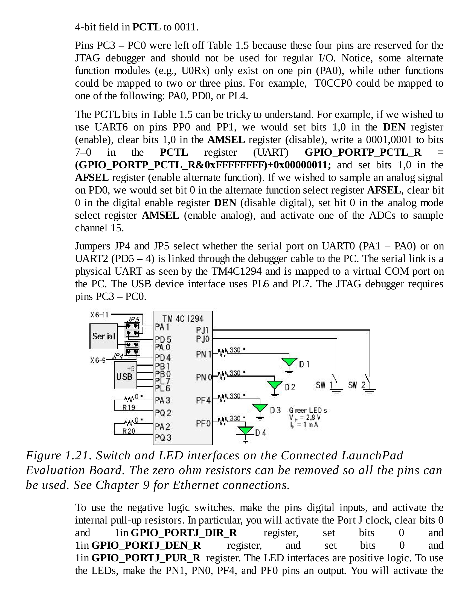
*Description*: Hardware pinout and board interface diagram mapping microcontroller pins, BoosterPack headers, switches, LEDs, and physical connectors for Figure 1.21: Switch and LED interfaces on the Connected LaunchPad.

> **Figure 1.21: Switch and LED interfaces on the Connected LaunchPad**

Evaluation Board. The zero ohm resistors can be removed so all the pins can
be used. See Chapter 9 for Ethernet connections.
To use the negative logic switches, make the pins digital inputs, and activate the
internal pull-up resistors. In particular, you will activate the Port J clock, clear bits 0
and
1in GPIO_PORTJ_DIR_R
register,
set
bits
0
and
1in GPIO_PORTJ_DEN_R
register,
and
set
bits
0
and
1in GPIO_PORTJ_PUR_R  register. The LED interfaces are positive logic. To use
the LEDs, make the PN1, PN0, PF4, and PF0 pins an output. You will activate the


<!-- Page 47 -->
### [PDF Page 47]

Port N clock, set bits 0 and 1in GPIO_PORTN_DIR_R  register, and set bits 0 and
1in GPIO_PORTN_DEN_R  register. You will activate the Port F clock, set bits 0
and
4in GPIO_PORTF_DIR_R
register,
and
set
bits
0
and
4in GPIO_PORTF_DEN_R  register.
1.4.4. Texas Instruments MSP432 LaunchPad I/O pins

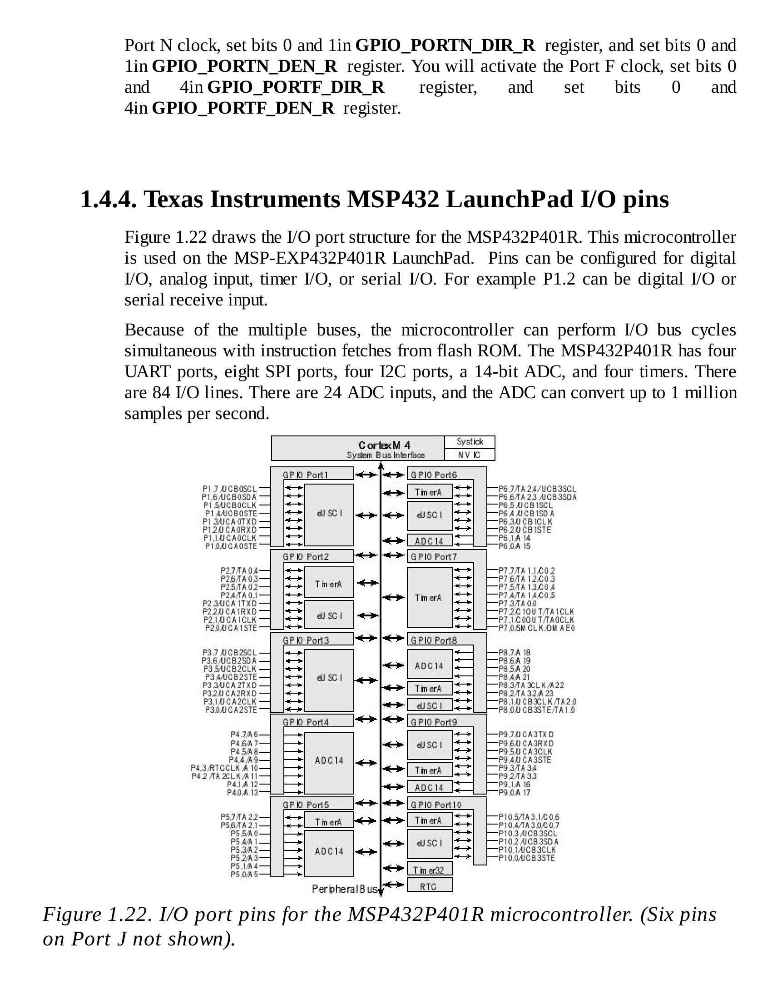
*Description*: Technical schematic and block diagram illustrating circuit operation, signal pathways, and functional behavior for Figure 1.22: draws the I/O port structure for the MSP432P401R. This microcontroller.

> **Figure 1.22: draws the I/O port structure for the MSP432P401R. This microcontroller**

is used on the MSP-EXP432P401R LaunchPad.  Pins can be configured for digital
I/O, analog input, timer I/O, or serial I/O. For example P1.2 can be digital I/O or
serial receive input.
Because of the multiple buses, the microcontroller can perform I/O bus cycles
simultaneous with instruction fetches from flash ROM. The MSP432P401R has four
UART ports, eight SPI ports, four I2C ports, a 14-bit ADC, and four timers. There
are 84 I/O lines. There are 24 ADC inputs, and the ADC can convert up to 1 million
samples per second.


*Description*: Hardware pinout and board interface diagram mapping microcontroller pins, BoosterPack headers, switches, LEDs, and physical connectors for Figure 1.22: I/O port pins for the MSP432P401R microcontroller. (Six pins.

> **Figure 1.22: I/O port pins for the MSP432P401R microcontroller. (Six pins**

on Port J not shown).


<!-- Page 48 -->
### [PDF Page 48]

The MSP432 LaunchPad evaluation board (Figure 1.23) is a low-cost development
board available as part number MSP-EXP432P401R from www.ti.com and from
regular electronic distributors like Digikey, Mouser, element14, and Avnet. The
board includes XDS110-ET, an open-source onboard debugger, which allows
programming and debugging of the MSP432 microcontroller. The USB interface is
used by the debugger and includes a serial channel.


*Description*: Hardware pinout and board interface diagram mapping microcontroller pins, BoosterPack headers, switches, LEDs, and physical connectors for Figure 1.23: LaunchPad based on the MSP432P401RIPZ..

> **Figure 1.23: LaunchPad based on the MSP432P401RIPZ.**

The MSP432 LaunchPad evaluation board has two switches, one 3-color LED and
one red LED, as shown in Figure 1.24. The switches are negative logic and will
require activation of the internal pull-up resistors. In this class we will not use the
switches and LEDs on the LaunchPad, but rather focus on the hardware provided by
the MK-II BoosterPack.

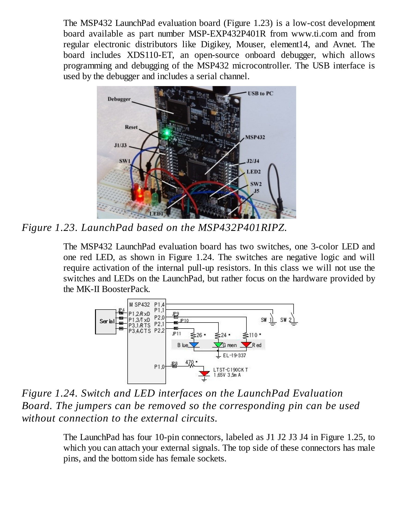
*Description*: Hardware pinout and board interface diagram mapping microcontroller pins, BoosterPack headers, switches, LEDs, and physical connectors for Figure 1.24: Switch and LED interfaces on the LaunchPad Evaluation.

> **Figure 1.24: Switch and LED interfaces on the LaunchPad Evaluation**

Board. The jumpers can be removed so the corresponding pin can be used
without connection to the external circuits.
The LaunchPad has four 10-pin connectors, labeled as J1 J2 J3 J4 in Figure 1.25, to
which you can attach your external signals. The top side of these connectors has male
pins, and the bottom side has female sockets.


<!-- Page 49 -->
### [PDF Page 49]


*Description*: Hardware pinout and board interface diagram mapping microcontroller pins, BoosterPack headers, switches, LEDs, and physical connectors for Figure 1.25: Interface connectors on the MSP432 LaunchPad Evaluation.

> **Figure 1.25: Interface connectors on the MSP432 LaunchPad Evaluation**

Board, 67 I/O pins.
1.4.5. Interfacing to a LaunchPad
The LaunchPad ecosystem allows boards to stack together to make a layered system,
see Figure 1.26. The engineering community has developed BoosterPacks, which are
pre-made external devices that will plug into this 40-pin connector. In addition to the
40-pin header on all LaunchPads, the MSP432 and TM4C1294 LaunchPads have
additional headers on the end.

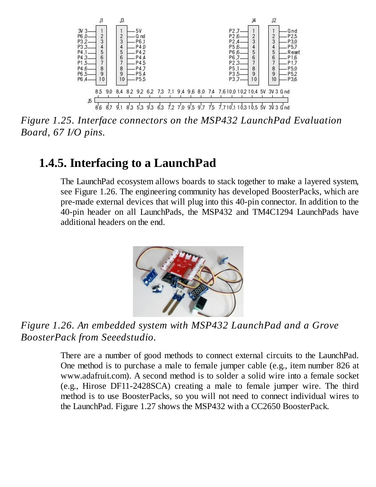
*Description*: Hardware pinout and board interface diagram mapping microcontroller pins, BoosterPack headers, switches, LEDs, and physical connectors for Figure 1.26: An embedded system with MSP432 LaunchPad and a Grove.

> **Figure 1.26: An embedded system with MSP432 LaunchPad and a Grove**

BoosterPack from Seeedstudio.
There are a number of good methods to connect external circuits to the LaunchPad.
One method is to purchase a male to female jumper cable (e.g., item number 826 at
www.adafruit.com). A second method is to solder a solid wire into a female socket
(e.g., Hirose DF11-2428SCA) creating a male to female jumper wire. The third
method is to use BoosterPacks, so you will not need to connect individual wires to
the LaunchPad. Figure 1.27 shows the MSP432 with a CC2650 BoosterPack.


<!-- Page 50 -->
### [PDF Page 50]


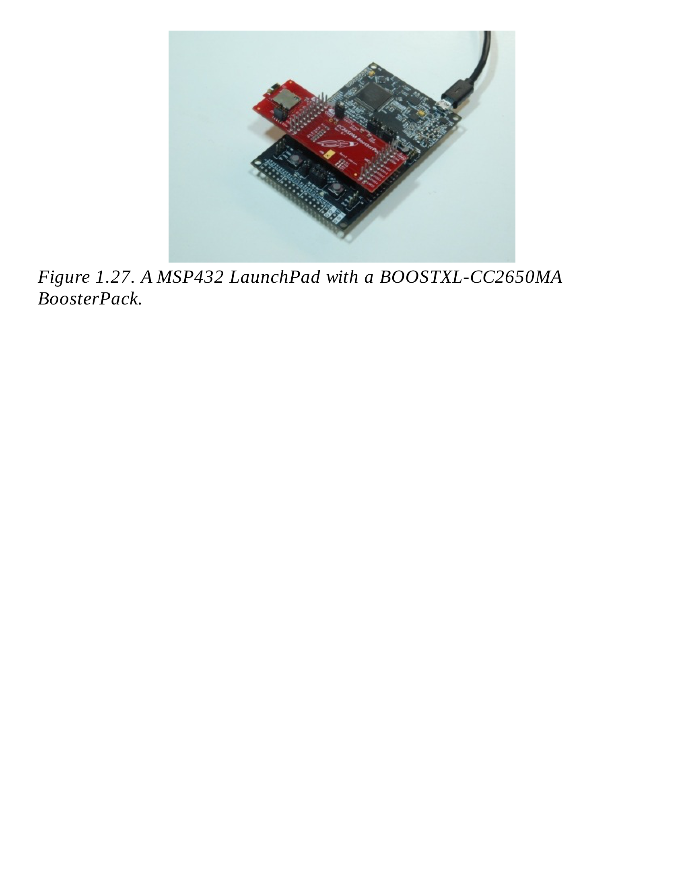
*Description*: Hardware pinout and board interface diagram mapping microcontroller pins, BoosterPack headers, switches, LEDs, and physical connectors for Figure 1.27: A MSP432 LaunchPad with a BOOSTXL-CC2650MA.

> **Figure 1.27: A MSP432 LaunchPad with a BOOSTXL-CC2650MA**

BoosterPack.


<!-- Page 51 -->
### [PDF Page 51]

1.5. ARM Cortex-M Assembly Language
This section focuses on the ARM Cortex-M assembly language. There are many
ARM processors, and this book focuses on Cortex-M microcontrollers, which
executes Thumb instructions extended with Thumb-2 technology. This section does
not present all the Thumb instructions. Rather, we present a few basic instructions. In
particular, we will show only twelve instructions, which will be both necessary and
sufficient to construct your operating system. For further details, please refer to the
appendix or to the ARM Cortex-M Technical Reference Manual.
1.5.1. Syntax
Assembly instructions have four fields separated by spaces or tabs as illustrated in

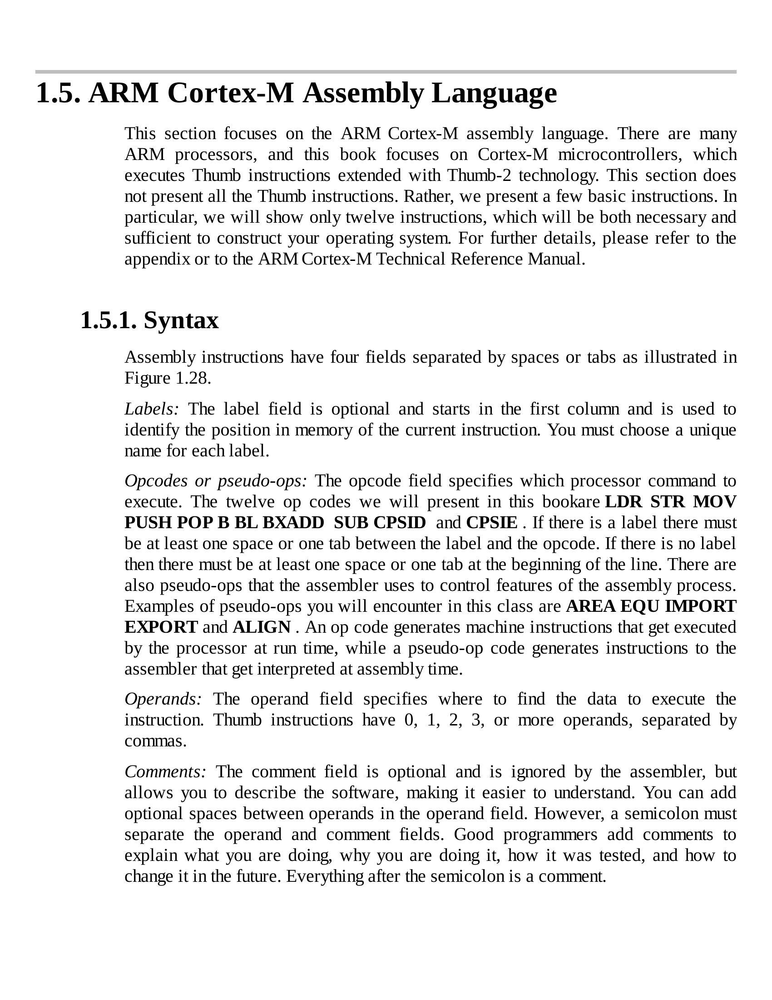
*Description*: Technical schematic and block diagram illustrating circuit operation, signal pathways, and functional behavior for Figure 1.28.

> **Figure 1.28**

Labels: The label field is optional and starts in the first column and is used to
identify the position in memory of the current instruction. You must choose a unique
name for each label.
Opcodes or pseudo-ops: The opcode field specifies which processor command to
execute. The twelve op codes we will present in this bookare LDR STR MOV

```assembly
PUSH POP B BL BXADD  SUB CPSID  and CPSIE . If there is a label there must
```

be at least one space or one tab between the label and the opcode. If there is no label
then there must be at least one space or one tab at the beginning of the line. There are
also pseudo-ops that the assembler uses to control features of the assembly process.
Examples of pseudo-ops you will encounter in this class are AREA EQU IMPORT
EXPORT and ALIGN . An op code generates machine instructions that get executed
by the processor at run time, while a pseudo-op code generates instructions to the
assembler that get interpreted at assembly time.
Operands: The operand field specifies where to find the data to execute the
instruction. Thumb instructions have 0, 1, 2, 3, or more operands, separated by
commas.
Comments: The comment field is optional and is ignored by the assembler, but
allows you to describe the software, making it easier to understand. You can add
optional spaces between operands in the operand field. However, a semicolon must
separate the operand and comment fields. Good programmers add comments to
explain what you are doing, why you are doing it, how it was tested, and how to
change it in the future. Everything after the semicolon is a comment.


<!-- Page 52 -->
### [PDF Page 52]


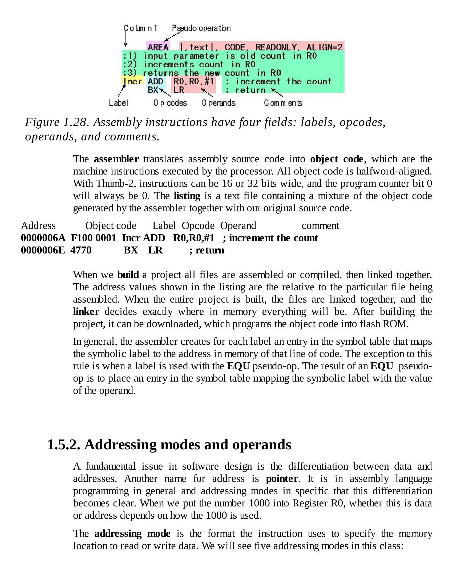
*Description*: Technical schematic and block diagram illustrating circuit operation, signal pathways, and functional behavior for Figure 1.28: Assembly instructions have four fields: labels, opcodes,.

> **Figure 1.28: Assembly instructions have four fields: labels, opcodes,**

operands, and comments.
The assembler translates assembly source code into object code, which are the
machine instructions executed by the processor. All object code is halfword-aligned.
With Thumb-2, instructions can be 16 or 32 bits wide, and the program counter bit 0
will always be 0. The listing is a text file containing a mixture of the object code
generated by the assembler together with our original source code.
Address           Object code      Label  Opcode  Operand                 comment
0000006A  F100 0001  Incr ADD   R0,R0,#1   ; increment the count
0000006E  4770            BX    LR          ; return
When we build a project all files are assembled or compiled, then linked together.
The address values shown in the listing are the relative to the particular file being
assembled. When the entire project is built, the files are linked together, and the
linker decides exactly where in memory everything will be. After building the
project, it can be downloaded, which programs the object code into flash ROM.
In general, the assembler creates for each label an entry in the symbol table that maps
the symbolic label to the address in memory of that line of code. The exception to this
rule is when a label is used with the EQU pseudo-op. The result of an EQU  pseudo-
op is to place an entry in the symbol table mapping the symbolic label with the value
of the operand.
1.5.2. Addressing modes and operands
A fundamental issue in software design is the differentiation between data and
addresses. Another name for address is pointer. It is in assembly language
programming in general and addressing modes in specific that this differentiation
becomes clear. When we put the number 1000 into Register R0, whether this is data
or address depends on how the 1000 is used.
The addressing mode is the format the instruction uses to specify the memory
location to read or write data. We will see five addressing modes in this class:


<!-- Page 53 -->
### [PDF Page 53]

Immediate
Data within the instruction

```assembly
MOV R0,#1
```

Indexed
Data pointed to by register

```assembly
LDR R0,[R1]
```

Indexed with offset
Data pointed to by register

```assembly
LDR R0,[R1,#4]
```

PC-relative
Location is offset relative to PC

```assembly
BL  Incr
```

Register-list
List of registers

```assembly
PUSH {R4,LR}
```

No addressing mode:Some instructions operate completely within the processor and
require no memory data fetches. For example, the ADD  R1,R2,R3  instruction
performs R2+R3 and stores the sum into R1.
Immediate addressing mode:If the data is found in the instruction itself, like MOV
R0,#1 , the instruction uses immediate addressing mode.
Indexed addressing mode: A register that contains the address or location of data is
called a pointer or index register. Indexed addressingmode uses a register pointer to
access memory. There are many variations of indexed addressing. In this class, you
will use two types of indexed addressing. The form [Rx]  uses Register Rx as a
pointer, where Rxis any of the Registers from R0 to R12. The second type you will
need is called indexed with offset, which has the form [Rx,#n] , where n is a number
from -255 to 4095. This addressing mode will access memory at Rx+n, without
modifying Rx.
PC-relative addressing mode: The addressing mode that uses the PC as the pointer is
called PC-relative addressing mode. It is used for branching, for calling functions,

```assembly
and accessing constant data stored in ROM. The addressing mode is called PC-
```

relative because the machine code contains the address difference between where the
program is now and the address to which the program will access.
There are many more addressing modes, but for now, these few addressing modes, as
illustrated below, are enough to get us started.
Checkpoint 1.15: What does the addressing mode specify?
Checkpoint 1.16: How does the processor differentiate between data and
addresses?
1.5.3. List of twelve instructions
We will only need 12 assembly instructions in order to design our own real-time
operating system. The following lists the load and store instructions we will need.

```assembly
LDR Rd, [Rn]      ; load 32-bit memory at [Rn] to Rd
STR  Rt, [Rn]      ; store Rt to 32-bit memory at [Rn]
LDR Rd, [Rn, #n] ; load 32-bit memory at [Rn+n] to Rd
STR Rt, [Rn, #n] ; store Rt to 32-bit memory at [Rn+n]
```


<!-- Page 54 -->
### [PDF Page 54]

Let M be the 32-bit value specified by the 12-bit constant #imm12 . When Rd  is
absent for add and subtract, the result is placed back in Rn . The following lists a
few more instructions we will need.

```assembly
MOV   Rd, Rn         ;Rd = Rn
MOV   Rd, #imm12     ;Rd = M
ADD   Rd, Rn, Rm     ;Rd = Rn + Rm
ADD   Rd, Rn, #imm12 ;Rd = Rn + M
SUB   Rd, Rn, Rm     ;Rd = Rn - Rm
SUB   Rd, Rn, #imm12 ;Rd = Rn - M
CPSID I              ;disable interrupts, I=1
CPSIE I              ;enable interrupts, I=0
```

Normally the computer executes one instruction after another in a linear fashion. In
particular, the next instruction to execute is typically found immediately following the
current instruction. We use branch instructions to deviate from this straight line path.
These branches use PC-relative addressing.

```assembly
B     label     ;branch to label
BX    Rm        ;branch indirect to location specified by Rm
BL    label     ;branch to subroutine at label
```

These are the push and pop instructions we will need

```assembly
PUSH {Rn,Rm}   ; push Rn and Rm onto the stack
PUSH  {Rn-Rm}   ; push all registers from Rn to Rm onto stack
POP   {Rn,Rm}   ; pop two 32-bit numbers off stack into Rn, Rm
POP   {Rn-Rm}  ; pop multiple 32-bit off stack to Rn - Rm
```

When pushing and popping multiple registers, it does not matter the order specified
in the instruction. Rather, the registers are stored in memory such that the register
with the smaller number is stored at the address with a smaller value. For example,
consider the execution of PUSH  {R1,R4-R6} . Assume the registers R1, R4, R5, and
R6 initially contain the values 1, 4, 5, and 6 respectively. Figure 1.29shows the value
from lowest-numbered R1 is positioned at the lowest stack address. If four entries
are popped with the POP  {R0,R2,R7,R9}  instruction, the value from the lowest
stack address is loaded into the lowest-numbered R0.
Observation: To push 32-bit data on the stack, first the SP is decremented by 4,

```assembly
and then the data are stored from a register to the RAM location pointed to by SP.
```

Observation: To pop 32-bit data from the stack, first the data are read from the
RAM location pointed to by the SP into a register, and then the SP is incremented
by 4.


<!-- Page 55 -->
### [PDF Page 55]


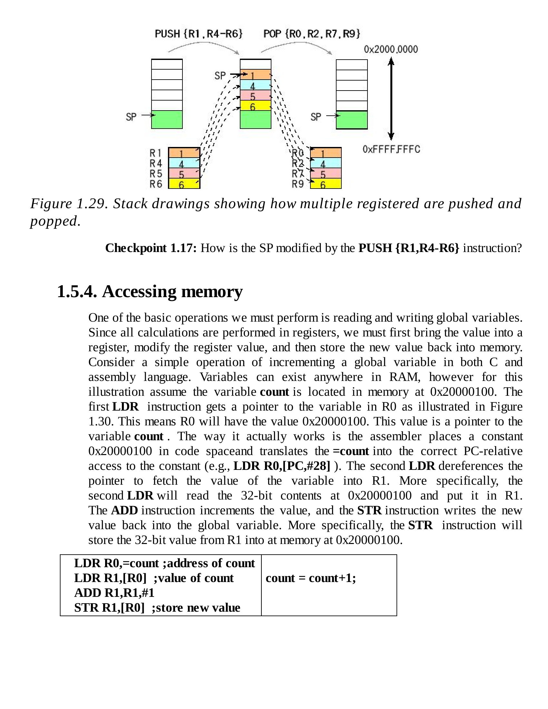
*Description*: Register layout and memory mapping diagram specifying bit fields, stack pointer allocations, and memory address boundaries for Figure 1.29: Stack drawings showing how multiple registered are pushed and.

> **Figure 1.29: Stack drawings showing how multiple registered are pushed and**

popped.
Checkpoint 1.17: How is the SP modified by the PUSH {R1,R4-R6} instruction?
1.5.4. Accessing memory
One of the basic operations we must perform is reading and writing global variables.
Since all calculations are performed in registers, we must first bring the value into a
register, modify the register value, and then store the new value back into memory.
Consider a simple operation of incrementing a global variable in both C and
assembly language. Variables can exist anywhere in RAM, however for this
illustration assume the variable count is located in memory at 0x20000100. The
first LDR  instruction gets a pointer to the variable in R0 as illustrated in Figure
1.30. This means R0 will have the value 0x20000100. This value is a pointer to the
variable count . The way it actually works is the assembler places a constant
0x20000100 in code spaceand translates the =count into the correct PC-relative
access to the constant (e.g., LDR R0,[PC,#28] ). The second LDR dereferences the
pointer to fetch the value of the variable into R1. More specifically, the
second LDR will read the 32-bit contents at 0x20000100 and put it in R1.
The ADD instruction increments the value, and the STR instruction writes the new
value back into the global variable. More specifically, the STR  instruction will
store the 32-bit value from R1 into at memory at 0x20000100.

```assembly
LDR R0,=count ;address of count
LDR R1,[R0]  ;value of count
ADD R1,R1,#1
STR R1,[R0]  ;store new value
```

count = count+1;


<!-- Page 56 -->
### [PDF Page 56]


*Description*: Register layout and memory mapping diagram specifying bit fields, stack pointer allocations, and memory address boundaries for Figure 1.30: Indexed addressing using R0 as a register pointer to access.

> **Figure 1.30: Indexed addressing using R0 as a register pointer to access**

memory. Data is moved into R1. Code space is where we place programs,

```assembly
and data space is where we place variables. The dotted arrows in this figure
```

represent the motion of information, and the solid arrow is a pointer.
Let’s work through code similar to what we will use in Chapter 3as part of our
operating system. The above example used indexed addressing with an implicit offset
of 0. However, you will also need to understand indexed addressing with an explicit
offset. In this example, assume RunPt  points to a linked list as shown in Figure 1.31.
A node of the list is a structure (struct in C) with multiple entries of different types. A
linked list is a set of nodes where one of the entries of the node is a pointer or link to
another node of the same type. In this example, the second entry of the list is a pointer
to the next node in the list. Figure 1.31 shows three of many nodes that are strung
together in a sequence defined by their pointers.

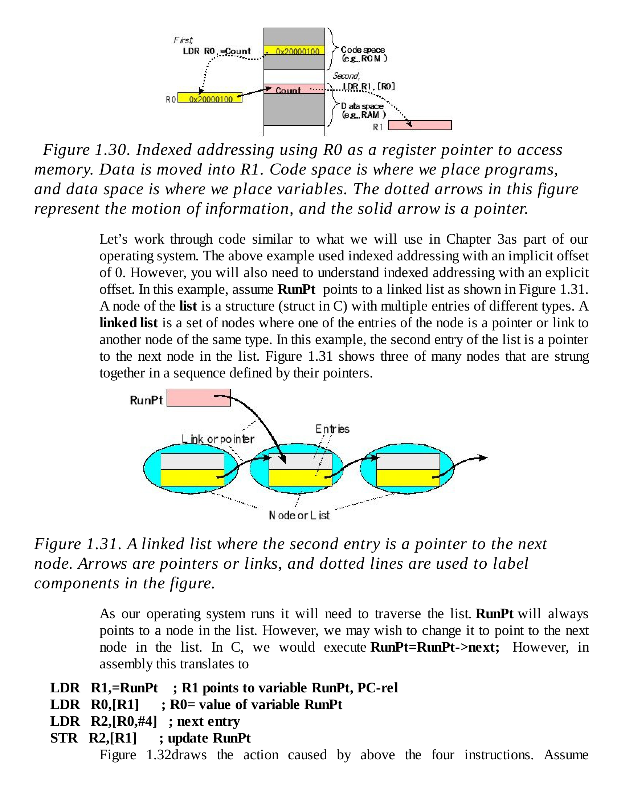
*Description*: Technical schematic and block diagram illustrating circuit operation, signal pathways, and functional behavior for Figure 1.31: A linked list where the second entry is a pointer to the next.

> **Figure 1.31: A linked list where the second entry is a pointer to the next**

node. Arrows are pointers or links, and dotted lines are used to label
components in the figure.
As our operating system runs it will need to traverse the list. RunPt will always
points to a node in the list. However, we may wish to change it to point to the next
node in the list. In C, we would execute RunPt=RunPt->next;  However, in
assembly this translates to

```assembly
LDR   R1,=RunPt    ; R1 points to variable RunPt, PC-rel
LDR   R0,[R1]      ; R0= value of variable RunPt
LDR   R2,[R0,#4]   ; next entry
STR   R2,[R1]      ; update RunPt
```


*Description*: Technical schematic and block diagram illustrating circuit operation, signal pathways, and functional behavior for Figure 1.32: draws the action caused by above the four instructions. Assume.

> **Figure 1.32: draws the action caused by above the four instructions. Assume**


<!-- Page 57 -->
### [PDF Page 57]

initially RunPt points to the middle node of the list. Each entry of the node is 32 bits
or four bytes of memory. The first two instructions read the value of RunPt into R0.
Since RunPt points to the middle node in the linked list in this figure, R0 will also
point to this node. Since each entry is 4 bytes, R0+4 points to the second entry, which
is the next pointer. The instruction LDR R2,[R0,#4] will read the 32-bit value
pointed to by R0+4 and place it in R2. Even though the memory address is calculated
as R0+4, the Register R0 itself is not modified by this instruction. R2 now points to
the right-most node in the list. The last instruction updates RunPt  so it now points to
the right-most node shown in the Figure 1.32.

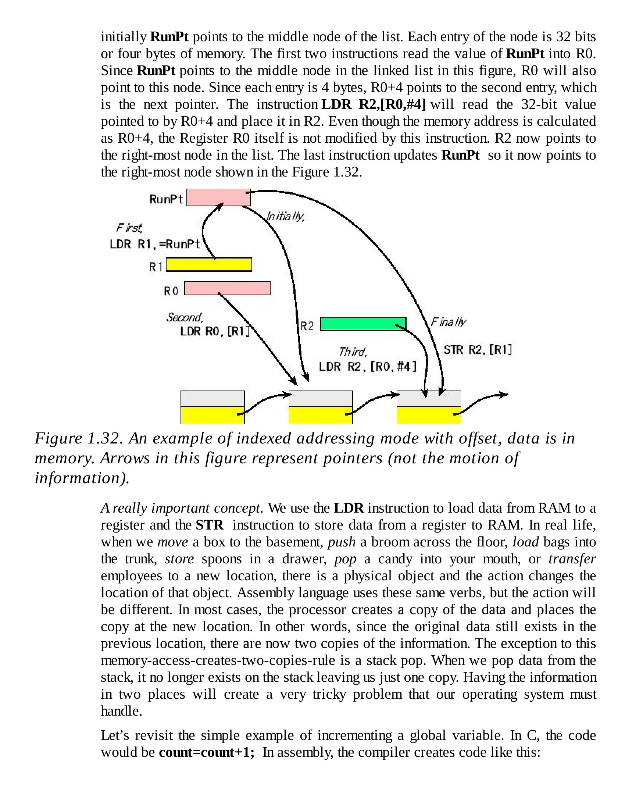
*Description*: Technical schematic and block diagram illustrating circuit operation, signal pathways, and functional behavior for Figure 1.32: An example of indexed addressing mode with offset, data is in.

> **Figure 1.32: An example of indexed addressing mode with offset, data is in**

memory. Arrows in this figure represent pointers (not the motion of
information).
A really important concept. We use the LDR instruction to load data from RAM to a
register and the STR  instruction to store data from a register to RAM. In real life,
when we move a box to the basement, push a broom across the floor, load bags into
the trunk, store spoons in a drawer, pop a candy into your mouth, or transfer
employees to a new location, there is a physical object and the action changes the
location of that object. Assembly language uses these same verbs, but the action will
be different. In most cases, the processor creates a copy of the data and places the
copy at the new location. In other words, since the original data still exists in the
previous location, there are now two copies of the information. The exception to this
memory-access-creates-two-copies-rule is a stack pop. When we pop data from the
stack, it no longer exists on the stack leaving us just one copy. Having the information
in two places will create a very tricky problem that our operating system must
handle.
Let’s revisit the simple example of incrementing a global variable. In C, the code
would be count=count+1;  In assembly, the compiler creates code like this:


<!-- Page 58 -->
### [PDF Page 58]


```assembly
LDR R0,=count ;address of count
LDR R1,[R0]   ;value of count
;two copies of count: in memory and in R1
ADD R1,#1
;two copies of count with different values
STR R1,[R0]  ;store new value
```

The instruction LDR R1,[R0]   loads the contents of the variable count  into R1. At
this point, there are two copies of the data, the original in RAM and the copy in R1.
After the ADD instruction, the two copies have different values. When designing an
operating system, we will take special care to handle shared information stored in
global RAM, making sure we access the proper copy. In Section 2.2.4, we will
discuss in detail the concept of race conditions and critical sections. These very
important problems arise from the problem generated by this concept of having
multiple copies of information.
1.5.5. Functions
Subroutines, procedures, and functions are programs that can be called to perform
specific tasks. They are important conceptual tools because they allow us to develop
modular software.  The programming languages Pascal, FORTRAN, and Ada
distinguish between functions, which return values, and procedures, which do not. On
the other hand, the programming languages C, C++, Java, and Lisp do not make this
distinction and treat functions and procedures as synonymous. Object-oriented
programming languages use the term method to describe functions that are part of
classes; Objects being instantiation of classes. In assembly language, we use the term
subroutine for all subprograms whether or not they return a value. Modular
programming allows us to build complex systems using simple components. In this
section we present a short introduction on the syntax for defining assembly
subroutines. We define a subroutine by giving it a name in the label field, followed
by instructions, which when executed, perform the desired effect. The last instruction
in a subroutine will be BX LR , which we use to return from the subroutine.
The function in Program 1.1 and Figure 1.33will increment the global
variable count . The AREA DATA directive specifies the following lines are placed
in data space (typically RAM). The SPACE 4  pseudo-op allocates4 uninitialized
bytes. The AREA CODE directive specifies the following lines are placed in code
space (typically ROM). The |.text| connects this program to the C code generated by
the compiler. ALIGN=2  will force the machine code to be halfword-aligned as
required.
In assembly language, we will use the BL instruction to call this subroutine. At run
time, the BL  instruction will save the return address in the LR register. The return
address is the location of the instruction immediately after the BL instruction. At the


<!-- Page 59 -->
### [PDF Page 59]

end of the subroutine, the BX LR  instruction will get the return address from the LR
register, returning the program to the place from which the subroutine was called.
More precisely, it returns to the instruction immediately after the instruction that
performed the subroutine call. The comments specify the order of execution. The
while-loop causes instructions 4–10 to be repeated over and over.

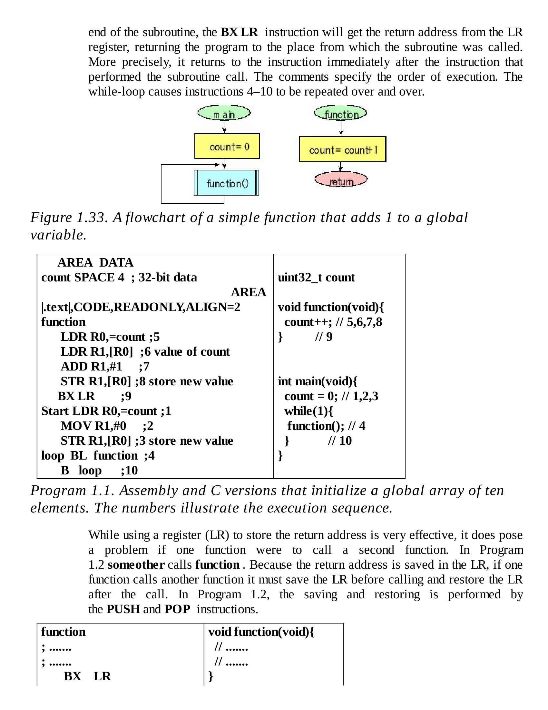
*Description*: Timing waveform and execution flowchart illustrating signal transitions, state machine progression, or algorithm logic for Figure 1.33: A flowchart of a simple function that adds 1 to a global.

> **Figure 1.33: A flowchart of a simple function that adds 1 to a global**

variable.
AREA  DATA
count SPACE 4  ; 32-bit data
AREA
|.text|,CODE,READONLY,ALIGN=2
function

```assembly
LDR R0,=count ;5
LDR R1,[R0]  ;6 value of count
ADD R1,#1     ;7
STR R1,[R0] ;8 store new value
BX LR        ;9
Start LDR R0,=count ;1
MOV R1,#0     ;2
STR R1,[R0] ;3 store new value
loop  BL  function  ;4
B   loop      ;10
```


```c
uint32_t count
```


```c
void function(void){
count++; // 5,6,7,8
}          // 9
```

int main(void){
count = 0; // 1,2,3

```c
while(1){
function(); // 4
}            // 10
}
```


*Description*: Technical schematic and block diagram illustrating circuit operation, signal pathways, and functional behavior for Program 1.1: Assembly and C versions that initialize a global array of ten.

> **Program 1.1: Assembly and C versions that initialize a global array of ten**

elements. The numbers illustrate the execution sequence.
While using a register (LR) to store the return address is very effective, it does pose
a problem if one function were to call a second function. In Program

## 1.2 someother calls function . Because the return address is saved in the LR, if one

function calls another function it must save the LR before calling and restore the LR
after the call. In Program 1.2, the saving and restoring is performed by
the PUSH and POP  instructions.
function
; .......
; .......

```assembly
BX    LR
void function(void){
// .......
// .......
}
```


<!-- Page 60 -->
### [PDF Page 60]

someother
; .......

```assembly
PUSH  {R4,LR}
BL    function
POP   {R4,LR}
; .......
BX    LR
```


```c
void someother(void){
// .......
function();
// .......
}
```


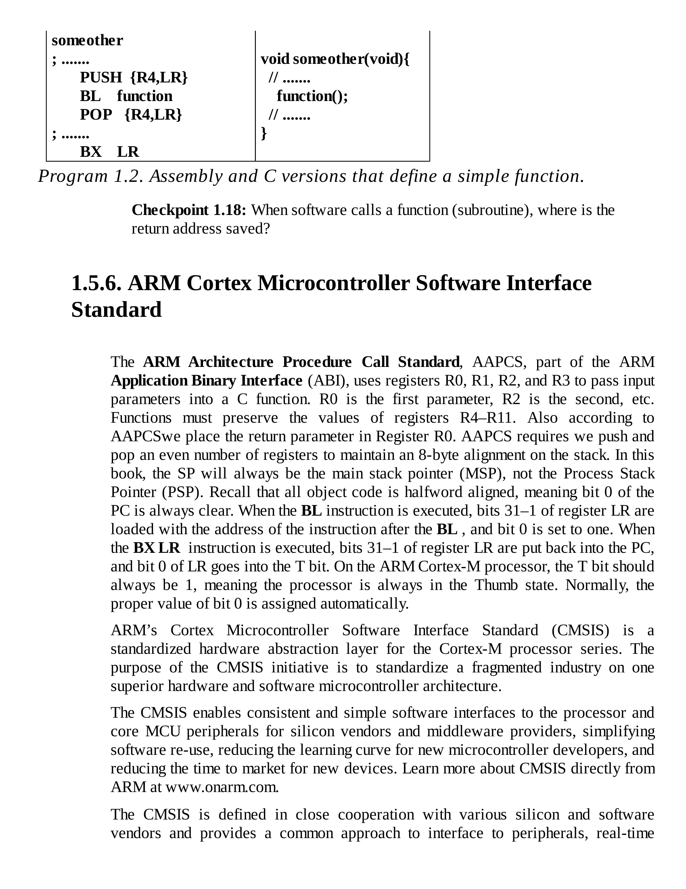
*Description*: Technical schematic and block diagram illustrating circuit operation, signal pathways, and functional behavior for Program 1.2: Assembly and C versions that define a simple function..

> **Program 1.2: Assembly and C versions that define a simple function.**

Checkpoint 1.18: When software calls a function (subroutine), where is the
return address saved?
1.5.6. ARM Cortex Microcontroller Software Interface
Standard
The ARM Architecture Procedure Call Standard, AAPCS, part of the ARM
Application Binary Interface (ABI), uses registers R0, R1, R2, and R3 to pass input
parameters into a C function. R0 is the first parameter, R2 is the second, etc.
Functions must preserve the values of registers R4–R11. Also according to
AAPCSwe place the return parameter in Register R0. AAPCS requires we push and

```assembly
pop an even number of registers to maintain an 8-byte alignment on the stack. In this
```

book, the SP will always be the main stack pointer (MSP), not the Process Stack
Pointer (PSP). Recall that all object code is halfword aligned, meaning bit 0 of the
PC is always clear. When the BL instruction is executed, bits 31–1 of register LR are
loaded with the address of the instruction after the BL , and bit 0 is set to one. When
the BX LR  instruction is executed, bits 31–1 of register LR are put back into the PC,

```assembly
and bit 0 of LR goes into the T bit. On the ARM Cortex-M processor, the T bit should
```

always be 1, meaning the processor is always in the Thumb state. Normally, the
proper value of bit 0 is assigned automatically.
ARM’s Cortex Microcontroller Software Interface Standard (CMSIS) is a
standardized hardware abstraction layer for the Cortex-M processor series. The
purpose of the CMSIS initiative is to standardize a fragmented industry on one
superior hardware and software microcontroller architecture.
The CMSIS enables consistent and simple software interfaces to the processor and
core MCU peripherals for silicon vendors and middleware providers, simplifying
software re-use, reducing the learning curve for new microcontroller developers, and
reducing the time to market for new devices. Learn more about CMSIS directly from
ARM at www.onarm.com.
The CMSIS is defined in close cooperation with various silicon and software
vendors and provides a common approach to interface to peripherals, real-time


<!-- Page 61 -->
### [PDF Page 61]

operating systems, and middleware components. The CMSIS is intended to enable
the combination of software components from multiple middleware vendors. The
CMSIS components are:
CMSIS-CORE: API for the Cortex-M processor core and peripherals. It provides at
standardized interface for Cortex-M0, Cortex-M3, Cortex-M4, SC000, and SC300.
Included are also SIMD intrinsic functions for Cortex-M4 SIMD instructions.
CMSIS-DSP: DSP Library Collection with over 60 Functions for various data types:
fixed-point (fractional q7, q15, q31) and single precision floating-point (32-bit). The
library is available for Cortex-M0, Cortex-M3, and Cortex-M4. The Cortex-M4
implementation is optimized for the SIMD instruction set.
CMSIS-RTOS API: Common API for Real-Time operating systems. It provides a
standardized programming interface that is portable to many RTOS and enables
software templates, middleware, libraries, and other components that can work
across supported RTOS systems.
CMSIS-SVD: System View Description for Peripherals. Describes the peripherals
of a device in an XML file and can be used to create peripheral awareness in
debuggers or header files with peripheral register and interrupt definitions.
Checkpoint 1.19: What is the purpose of AAPCS?
1.5.7. Conditional execution
If-then-else control structures are commonly found in computer software. If
the BHS or the BGE  were to branch, the instruction pipeline would have to be
flushed and refilled. In order to optimize execution speed for short if-then and if-
then-else control structures, the ARM Cortex-M processoremploys conditional
execution. The conditional execution begins with the IT  instruction, which specifies
the number of instructions in the control structure (1 to 4) and the conditional for the
first instruction. The syntax is
IT{x{y{z}}} cond
where x  y and z  specify the existence of the optional second, third, or fourth
conditional instruction respectively. We can specify x  y and z as T for execute if true
or E for else. The cond  field choices are listed in Table 1.6.
Suffix
Flags
Meaning
EQ
Z = 1
Equal
NE
Z = 0
Not equal
CS or  HS
C = 1
Higher or same, unsigned ≥
CC or
LO
C = 0
Lower, unsigned <


<!-- Page 62 -->
### [PDF Page 62]

MI
N = 1
Negative
PL
N = 0
Positive or zero
VS
V = 1
Overflow
VC
V = 0
No overflow
HI
C = 1 and Z = 0
Higher, unsigned >
LS
C = 0 or Z = 1
Lower or same, unsigned ≤
GE
N = = V
Greater than or equal, signed ≥
LT
N != V
Less than, signed <
GT
Z = 0 and N = V Greater than, signed >
LE
Z = 1 or N != V
Less than or equal, signed ≤
AL
Can have any
value
Always. This is the default when no
suffix is specified.

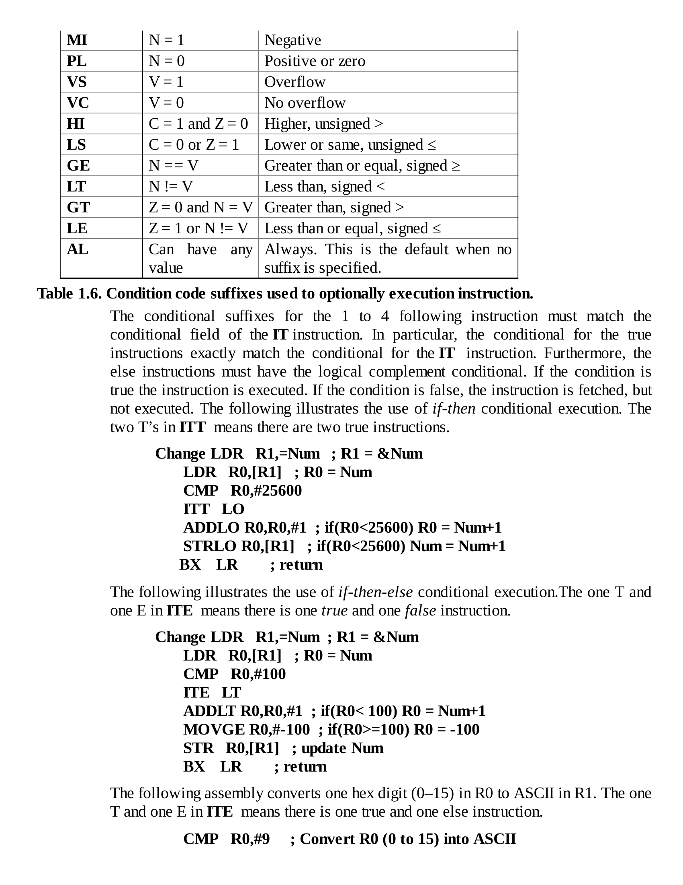
*Description*: Reference table detailing hardware parameters, register bit patterns, performance metrics, or memory configurations for Table 1.6: Condition code suffixes used to optionally execution instruction..

> **Table 1.6: Condition code suffixes used to optionally execution instruction.**

The conditional suffixes for the 1 to 4 following instruction must match the
conditional field of the IT instruction. In particular, the conditional for the true
instructions exactly match the conditional for the IT  instruction. Furthermore, the
else instructions must have the logical complement conditional. If the condition is
true the instruction is executed. If the condition is false, the instruction is fetched, but
not executed. The following illustrates the use of if-then conditional execution. The
two T’s in ITT  means there are two true instructions.
Change LDR   R1,=Num   ; R1 = &Num

```assembly
LDR   R0,[R1]   ; R0 = Num
CMP   R0,#25600
```

ITT   LO
ADDLO R0,R0,#1  ; if(R0<25600) R0 = Num+1
STRLO R0,[R1]   ; if(R0<25600) Num = Num+1

```assembly
BX    LR        ; return
```

The following illustrates the use of if-then-else conditional execution.The one T and
one E in ITE  means there is one true and one false instruction.
Change LDR   R1,=Num  ; R1 = &Num

```assembly
LDR   R0,[R1]   ; R0 = Num
CMP   R0,#100
```

ITE   LT
ADDLT R0,R0,#1  ; if(R0< 100) R0 = Num+1
MOVGE R0,#-100  ; if(R0>=100) R0 = -100

```assembly
STR   R0,[R1]   ; update Num
BX    LR        ; return
```

The following assembly converts one hex digit (0–15) in R0 to ASCII in R1. The one
T and one E in ITE  means there is one true and one else instruction.

```assembly
CMP   R0,#9     ; Convert R0 (0 to 15) into ASCII
```


<!-- Page 63 -->
### [PDF Page 63]

ITE   GT        ; Next 2 are conditional
ADDGT R1,R0,#55 ; Convert 0xA -> 'A'
ADDLE R1,R0,#48 ; Convert 0x0 -> '0'
By
themselves,
the
conditional
branch
instructions
do
not
require
a
preceding IT instruction. However, a conditional branch can be used as the last
instruction of an IT  block. There are a lot of restrictions on IT. For more details,
refer to the programming reference manual.
This macro creates a new assembly instruction that is faster than MUL . This
approach can be used to multiply by any constant in the form of 2n±1. If x is a
variable, then 15x = (x<<4)-x.
MACRO
MUL15 $Rd,$Rn

```assembly
RSB   $Rd,$Rn,$Rn,LSL #4
```

MEND
This approach can also be used to multiply by any constant in the form of 1±2-n. For
example, to multiply by 7/8 we implement x - (x>>3). Themacro MUL7_8 is
unsigned multiply by 7/8.
MACRO
MUL7_8 $Rd,$Rn

```assembly
SUB   $Rd,$Rn,$Rn,LSR #3
```

MEND
1.5.8. Stack usage
The stack can be used to store temporary information. If a subroutine modifies a
register, it is a matter of programmer style as to whether or not it should save and
restore the register. According to AAPCS a subroutine can freely change R0–R3 and
R12, but save and restore any other register it changes. In particular, if one subroutine
calls another subroutine, then it must save and restore the LR. AAPCS also requires
pushing and popping multiples of 8 bytes, which means an even number of registers.
In the following example, assume the function modifies register R0, R4, R7, R8 and
calls another function. The programming style dictates registers R4 R7 R8 and LR be
saved. Notice the return address is pushed on the stack as LR, but popped off into
PC. When multiple registers are pushed or popped, the data exist in memory with the
lowest numbered register using the lowest memory address. In other words, the
registers in the { } can be specified in any order. Of course remember to balance the
stack by having the same number of pops as pushes.
Func   PUSH {R4,R7,R8,LR} ; save registers as needed
; body of the function


<!-- Page 64 -->
### [PDF Page 64]


```assembly
POP  {R4,R7,R8,PC}  ; restore registers and return
```

The ARM processor has a lot of registers, and we appropriately should use them for
temporary information such as function parameters and local variables. However,
when there are a lot of parameters or local variables we can place them on the stack.

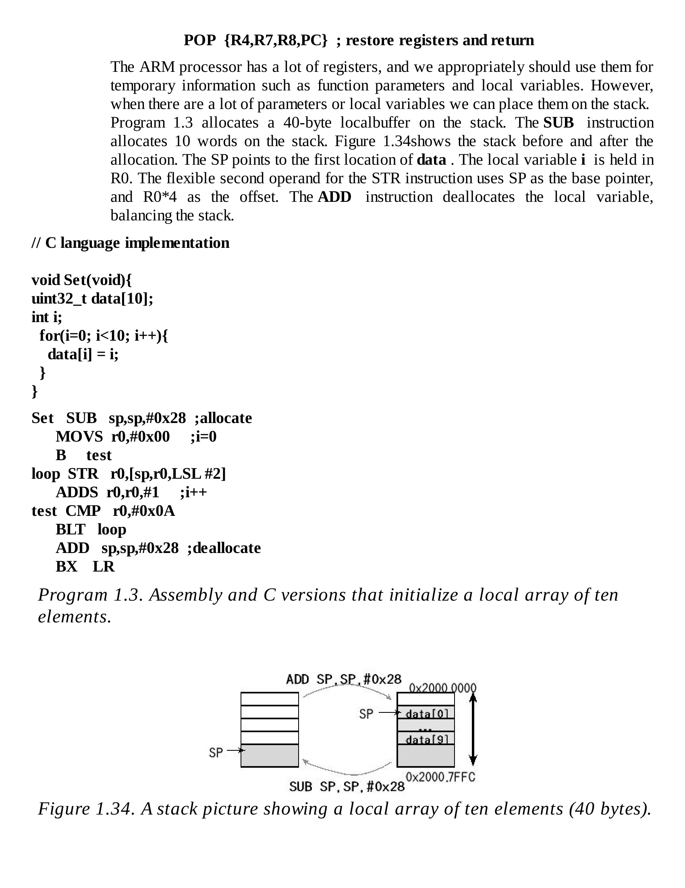
*Description*: Register layout and memory mapping diagram specifying bit fields, stack pointer allocations, and memory address boundaries for Program 1.3: allocates a 40-byte localbuffer on the stack. The SUB  instruction.

> **Program 1.3: allocates a 40-byte localbuffer on the stack. The SUB  instruction**

allocates 10 words on the stack. Figure 1.34shows the stack before and after the
allocation. The SP points to the first location of data . The local variable i  is held in
R0. The flexible second operand for the STR instruction uses SP as the base pointer,

```assembly
and R0*4 as the offset. The ADD  instruction deallocates the local variable,
```

balancing the stack.
// C language implementation

```c
void Set(void){
uint32_t data[10];
int i;
for(i=0; i<10; i++){
data[i] = i;
}
}
Set   SUB   sp,sp,#0x28  ;allocate
MOVS  r0,#0x00     ;i=0
B     test
```

loop  STR   r0,[sp,r0,LSL #2]
ADDS  r0,r0,#1     ;i++
test  CMP   r0,#0x0A
BLT   loop

```assembly
ADD   sp,sp,#0x28  ;deallocate
BX    LR
```


*Description*: Technical schematic and block diagram illustrating circuit operation, signal pathways, and functional behavior for Program 1.3: Assembly and C versions that initialize a local array of ten.

> **Program 1.3: Assembly and C versions that initialize a local array of ten**

elements.


*Description*: Register layout and memory mapping diagram specifying bit fields, stack pointer allocations, and memory address boundaries for Figure 1.34: A stack picture showing a local array of ten elements (40 bytes)..

> **Figure 1.34: A stack picture showing a local array of ten elements (40 bytes).**


<!-- Page 65 -->
### [PDF Page 65]

We will also use the stack to save program state during interrupt processing.
1.5.9. Floating-point math
If the range of numbers is unknown or large, then the numbers must be represented in
a floating-point format. Conversely, we can use fixed point when the range of values
is small and known. The IEEE Standard for Binary Floating-Point Arithmetic or
ANSI/IEEE Std 754-1985 is the most widely-used format for floating-point numbers.
There are three common IEEE formats: single-precision (32-bit), double-precision
(64-bit), and double-extended precision (80-bits). The 32-bit short real format as
implemented by the TM4C is presented here. The floating-point format, f, for the
single-precision data type is shown in Figure 1.35. Computers use binary floating
point because it is faster to shift than it is to multiply/divide by 10.
Bit 31
Mantissa sign, s=0 for positive, s=1 for negative
Bits 30:23
8-bit biased binary exponent 0 ≤ e ≤ 255
Bits 22:0
24-bit mantissa, m, expressed as a binary fraction,
A binary 1 as the most significant bit is implied.
m = 1.m1m2m3...m23

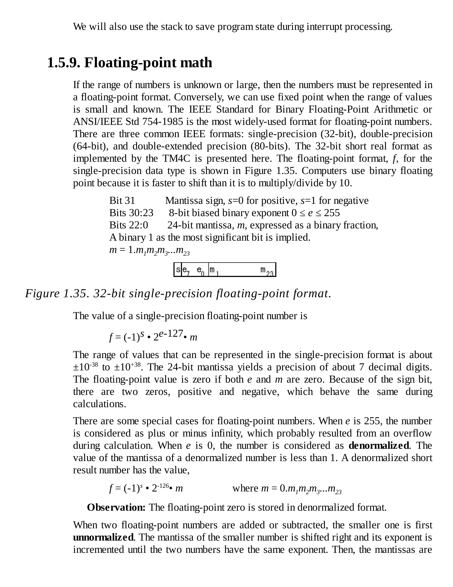
*Description*: Technical schematic and block diagram illustrating circuit operation, signal pathways, and functional behavior for Figure 1.35: 32-bit single-precision floating-point format..

> **Figure 1.35: 32-bit single-precision floating-point format.**

The value of a single-precision floating-point number is
f = (-1)s • 2e-127• m
The range of values that can be represented in the single-precision format is about
±10-38 to ±10+38. The 24-bit mantissa yields a precision of about 7 decimal digits.
The floating-point value is zero if both e and m are zero. Because of the sign bit,
there are two zeros, positive and negative, which behave the same during
calculations.
There are some special cases for floating-point numbers. When e is 255, the number
is considered as plus or minus infinity, which probably resulted from an overflow
during calculation. When e is 0, the number is considered as denormalized. The
value of the mantissa of a denormalized number is less than 1. A denormalized short
result number has the value,
f = (-1)s • 2-126• m
where m = 0.m1m2m3...m23
Observation: The floating-point zero is stored in denormalized format.
When two floating-point numbers are added or subtracted, the smaller one is first
unnormalized. The mantissa of the smaller number is shifted right and its exponent is
incremented until the two numbers have the same exponent. Then, the mantissas are


<!-- Page 66 -->
### [PDF Page 66]

added or subtracted. Lastly, the result is normalized. To illustrate the floating-point
addition, consider the case of 10+0.1. First, we show the original numbers in
floating-point format. The mantissa is shown in binary format.
10.0 = (-1)0 •23 • 1.01000000000000000000000
+ 0.1 = (-1)0 •2-4• 1.10011001100110011001101
Every time the exponent is incremented the mantissa is shifted to the right. Notice that
7 binary digits are lost. The 0.1 number is unnormalized, but now the two numbers
have the same exponent. Often the result of the addition or subtraction will need to be
normalized. In this case the sum did not need normalization.
10.0 = (-1)0 •23 • 1.01000000000000000000000
+ 0.1 = (-1)0 •23 • 0.00000011001100110011001 1001101
10.1 = (-1)0 •23 • 1.01000011001100110011001
When two floating-point numbers are multiplied, their mantissas are multiplied and
their exponents are added. When dividing two floating-point numbers, their mantissas
are divided and their exponents are subtracted. After multiplication and division, the
result is normalized.
Roundoff is the error that occurs as a result of an arithmetic operation. For example,
the multiplication of two 64-bit mantissas yields a 128-bit product. The final result is
normalized into a normalized floating-point number with a 64-bit mantissa. Roundoff
is the error caused by discarding the least significant bits of the product. Roundoff
during addition and subtraction can occur in two places. First, an error can result
when the smaller number is shifted right. Second, when two n-bit numbers are added
the result is n+1 bits, so an error can occur as the n+1 sum is squeezed back into an
n-bit result.
Truncation is the error that occurs when a number is converted from one format to
another. For example, when an 80-bit floating-point number is converted to 32-bit
floating-point format, 40 bits are lost as the 64-bit mantissa is truncated to fit into the
24-bit mantissa. Recall, the number 0.1 could not be exactly represented as a short
real floating-point number. This is an example of truncation as the true fraction was
truncated to fit into the finite number of bits available.
If the range is known and small and a fixed-point system can be used, then a 32-bit
fixed-point number system will have better resolution than a 32-bit floating-point
system. For a fixed range of values (i.e., one with a constant exponent), a 32-bit
floating-point system has only 23 bits of precision, while a 32-bit fixed-point system
has 9 more bits of precision.

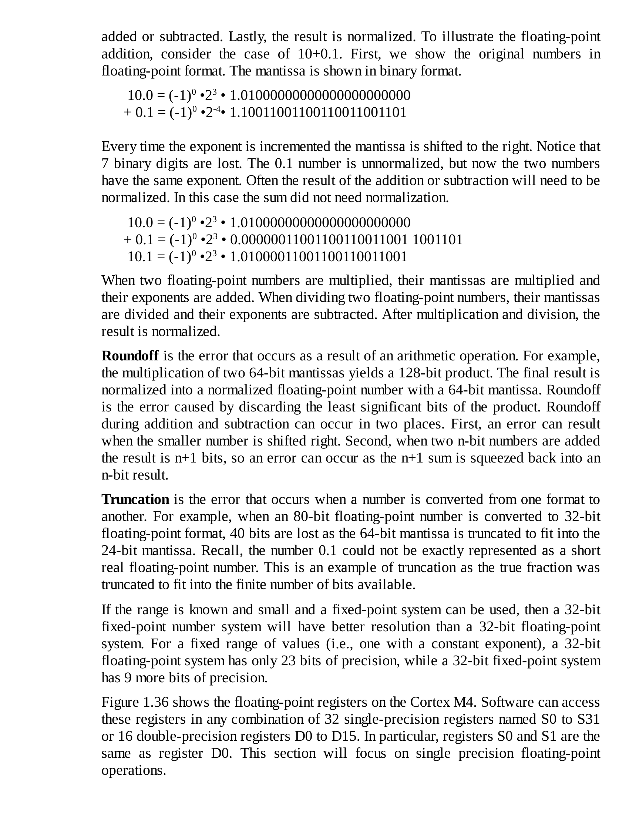
*Description*: Register layout and memory mapping diagram specifying bit fields, stack pointer allocations, and memory address boundaries for Figure 1.36: shows the floating-point registers on the Cortex M4. Software can access.

> **Figure 1.36: shows the floating-point registers on the Cortex M4. Software can access**

these registers in any combination of 32 single-precision registers named S0 to S31
or 16 double-precision registers D0 to D15. In particular, registers S0 and S1 are the
same as register D0. This section will focus on single precision floating-point
operations.


<!-- Page 67 -->
### [PDF Page 67]


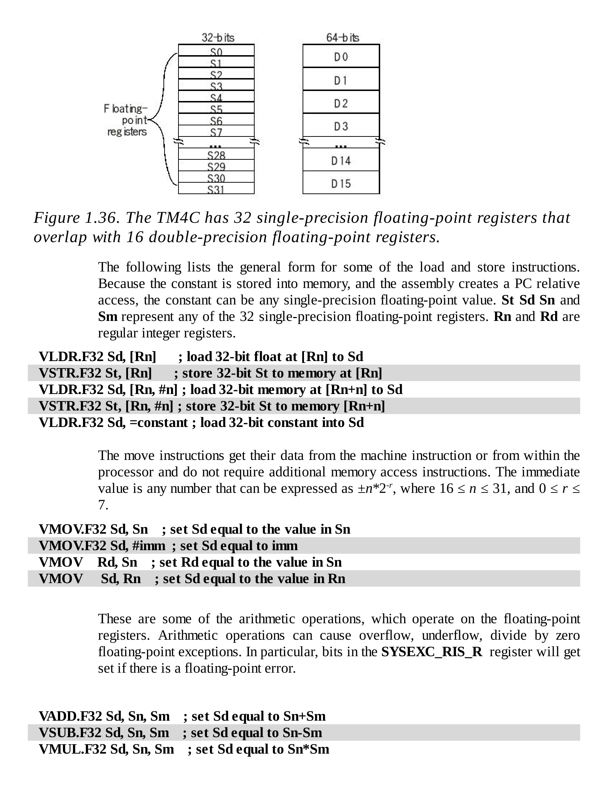
*Description*: Register layout and memory mapping diagram specifying bit fields, stack pointer allocations, and memory address boundaries for Figure 1.36: The TM4C has 32 single-precision floating-point registers that.

> **Figure 1.36: The TM4C has 32 single-precision floating-point registers that**

overlap with 16 double-precision floating-point registers.
The following lists the general form for some of the load and store instructions.
Because the constant is stored into memory, and the assembly creates a PC relative
access, the constant can be any single-precision floating-point value. St Sd Sn and
Sm represent any of the 32 single-precision floating-point registers. Rn and Rd are
regular integer registers.
VLDR.F32 Sd, [Rn]      ; load 32-bit float at [Rn] to Sd
VSTR.F32 St, [Rn]      ; store 32-bit St to memory at [Rn]
VLDR.F32 Sd, [Rn, #n] ; load 32-bit memory at [Rn+n] to Sd
VSTR.F32 St, [Rn, #n] ; store 32-bit St to memory [Rn+n]
VLDR.F32 Sd, =constant ; load 32-bit constant into Sd
The move instructions get their data from the machine instruction or from within the
processor and do not require additional memory access instructions. The immediate
value is any number that can be expressed as ±n*2-r, where 16 ≤ n ≤ 31, and 0 ≤ r ≤
7.
VMOV.F32 Sd, Sn    ; set Sd equal to the value in Sn
VMOV.F32 Sd, #imm  ; set Sd equal to imm
VMOV    Rd, Sn    ; set Rd equal to the value in Sn
VMOV     Sd, Rn    ; set Sd equal to the value in Rn
These are some of the arithmetic operations, which operate on the floating-point
registers. Arithmetic operations can cause overflow, underflow, divide by zero
floating-point exceptions. In particular, bits in the SYSEXC_RIS_R  register will get
set if there is a floating-point error.
VADD.F32 Sd, Sn, Sm    ; set Sd equal to Sn+Sm
VSUB.F32 Sd, Sn, Sm    ; set Sd equal to Sn-Sm
VMUL.F32 Sd, Sn, Sm    ; set Sd equal to Sn*Sm


<!-- Page 68 -->
### [PDF Page 68]

VDIV.F32 Sd, Sn, Sm    ; set Sd equal to Sn/Sm
VNEG.F32 Sd, Sm        ; set Sd equal to -Sm
VABS.F32 Sd, Sm        ; set Sd equal to the absolute value of Sm
VSQRT.F32 Sd, Sm       ; set Sd equal to the square root of Sm
The following example implements a digital 60 Hz notch filter (see Section 6.4). The
new ADC input is passed by value in register S0 and the filter outputis returned by
value also in register S0. In C, we define a single-precision floating-point variable
using float .
float y,y1,y2; // outputs
float x,x1,x2; // input
// fs = 1000 Hz
// cutoff 60 Hz
// alpha = 0.99
float Notch60Hz(float in){
x2 = x1; x1 = x; x = in;
y2 = y1; y1 = y;
y = x
- 1.8595529717765*x1
+ x2
+ 1.84095744205874*y1
- 0.9801*y2;
return y;
}
AREA    DATA, ALIGN=2
y    SPACE   4  ; current filter output
y1   SPACE   4  ; filter output 1ms ago
y2   SPACE   4  ; filter output 2ms ago
x    SPACE   4  ; current filter input
x1    SPACE   4  ; input 1ms ago
x2   SPACE   4  ; input 2ms ago
AREA |.text|,CODE,READONLY,ALIGN=2
THUMB
; Input: S0 is new input
; Output: S0 is filter output
Notch60Hz

```assembly
LDR      R0,=x
VLDR.F32 S1,[R0,#4] ;read previous x1
VSTR.F32 S1,[R0,#8] ;S1 is x2
VLDR.F32 S2,[R0,#0] ;read previous x
VSTR.F32 S2,[R0,#4] ;S2 is x1
VSTR.F32 S0,[R0,#0] ;S0 is x = in
LDR      R1,=y
VLDR.F32 S3,[R1,#4] ;read previous y1
VSTR.F32 S3,[R1,#8] ;S3 is y2
VLDR.F32 S4,[R1,#0] ;read previous y
VSTR.F32 S4,[R1,#4] ;S4 is y1
VLDR.F32 S5,=-1.8595529717765
```

VMUL.F32 S2,S2,S5
VADD.F32 S0,S0,S2 ;-1.8595529717765*x1
VADD.F32 S0,S0,S1 ;+x2
VLDR.F32 S5,=1.84095744205874
VMUL.F32 S4,S4,S5
VADD.F32 S0,S0,S4;+1.84095744205874*y1
VLDR.F32 S5,=-0.9801
VMUL.F32 S3,S3,S5


<!-- Page 69 -->
### [PDF Page 69]

VADD.F32 S0,S0,S3 ; -0.9801*y2
VSTR.F32 S0,[R1,#0] ;set y

```assembly
BX  LR
```


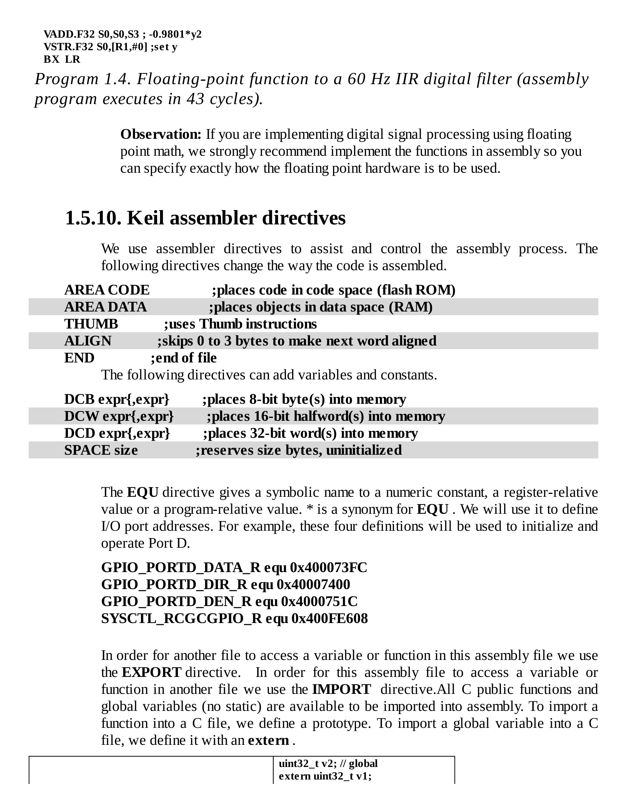
*Description*: Technical schematic and block diagram illustrating circuit operation, signal pathways, and functional behavior for Program 1.4: Floating-point function to a 60 Hz IIR digital filter (assembly.

> **Program 1.4: Floating-point function to a 60 Hz IIR digital filter (assembly**

program executes in 43 cycles).
Observation: If you are implementing digital signal processing using floating
point math, we strongly recommend implement the functions in assembly so you
can specify exactly how the floating point hardware is to be used.
1.5.10. Keil assembler directives
We use assembler directives to assist and control the assembly process. The
following directives change the way the code is assembled.
AREA CODE
;places code in code space (flash ROM)
AREA DATA
;places objects in data space (RAM)
THUMB
;uses Thumb instructions
ALIGN
;skips 0 to 3 bytes to make next word aligned
END
;end of file
The following directives can add variables and constants.
DCB expr{,expr}
;places 8-bit byte(s) into memory
DCW expr{,expr}
;places 16-bit halfword(s) into memory
DCD expr{,expr}
;places 32-bit word(s) into memory
SPACE size
;reserves size bytes, uninitialized
The EQU directive gives a symbolic name to a numeric constant, a register-relative
value or a program-relative value. * is a synonym for EQU . We will use it to define
I/O port addresses. For example, these four definitions will be used to initialize and
operate Port D.
GPIO_PORTD_DATA_R equ 0x400073FC
GPIO_PORTD_DIR_R equ 0x40007400
GPIO_PORTD_DEN_R equ 0x4000751C
SYSCTL_RCGCGPIO_R equ 0x400FE608
In order for another file to access a variable or function in this assembly file we use
the EXPORT directive.  In order for this assembly file to access a variable or
function in another file we use the IMPORT  directive.All C public functions and
global variables (no static) are available to be imported into assembly. To import a
function into a C file, we define a prototype. To import a global variable into a C
file, we define it with an extern .

```c
uint32_t v2; // global
extern uint32_t v1;
```


<!-- Page 70 -->
### [PDF Page 70]

AREA
DATA, ALIGN=2
EXPORT  v1
EXPORT  f1
IMPORT  v2
v1   SPACE
4  ; global
AREA |.text|,CODE,READONLY,ALIGN=2
THUMB
f1    LDR  R1,=v2

```assembly
LDR  R2,[R1] ; contents
ADD  R0,R0,R2
BX   LR
```


```c
uint32_t f1(uint32_t in);
```


```c
void f2(void){
v1 = f1(v1);
}
```


<!-- Page 71 -->
### [PDF Page 71]

1.6. Pointers in C
1.6.1. Pointers
At the assembly level, we implement pointers using indexed addressing mode. For
example, a register contains an address, and the instruction reads or writes memory
specified by that address. Basically, we place the address into a register, then use
indexed addressing mode to access the data. In this case, the register holds the
pointer. Figure 1.37illustrates three examples that utilize pointers. In this figure, Pt
SP  GetPt  PutPt  are pointers, where the arrows show to where they point, and the
shaded boxes represent data. An array or string is a simple structure containing
multiple equal-sized elements. We set a pointer to the address of the first element,
then use indexed addressing mode to access the elements inside. We have introduced
the stack previously, and it is an important component of an operating system. The
stack pointer (SP) points to the top element on the stack. A linked list contains some
elements that are pointers themselves. The pointers are used to traverse the data

```c
structure. Linked lists will be used through this bookto maintain the states of threads
```

in our RTOS. The first in first out (FIFO) queue is an important data structure for I/O
programming because it allows us to pass data from one module to another. One
module puts data into the FIFO and another module gets data out of the FIFO. There
is a GetPt that points to the oldest data (to be removed next) and a PutPt  that points
to an empty space (location to be stored into next). The FIFO queue will be used
excessively in this book.

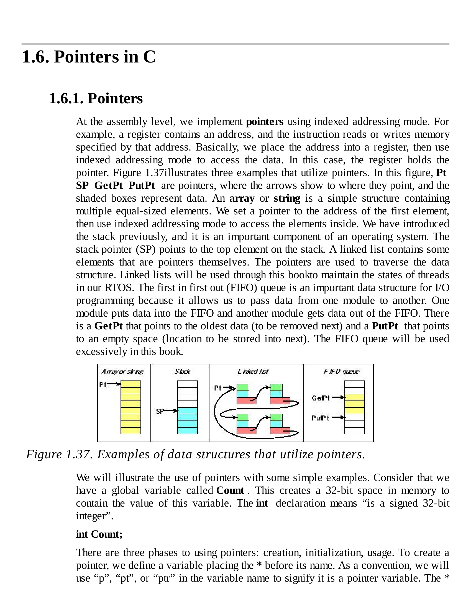
*Description*: Technical schematic and block diagram illustrating circuit operation, signal pathways, and functional behavior for Figure 1.37: Examples of data structures that utilize pointers..

> **Figure 1.37: Examples of data structures that utilize pointers.**

We will illustrate the use of pointers with some simple examples. Consider that we
have a global variable called Count . This creates a 32-bit space in memory to
contain the value of this variable. The int  declaration means “is a signed 32-bit
integer”.
int Count;
There are three phases to using pointers: creation, initialization, usage. To create a
pointer, we define a variable placing the * before its name. As a convention, we will
use “p”, “pt”, or “ptr” in the variable name to signify it is a pointer variable. The *


<!-- Page 72 -->
### [PDF Page 72]

means “is a pointer to”. Therefore, int *  means “is a pointer to a signed 32-bit
integer”.
int *cPt;
To initialize a pointer, we must set it to point to something. Whenever we make an
assignment in C, the type of the value must match the type of the variable. The
following executable code makes cPt point to Count . We see the type of Count is
signed 32-bit integer, so the type of &Count  is a pointer to a signed 32-bit integer.
cPt  = &Count;
Assume we have another variable called x , and assume the value of Count is 42.
Using the pointer is called dereferencing. If we place a *cPt inside an expression,
then *cPt is replaced with the value at that address. So this operation will set x
equal to 42.
x = (*cPt);
If we place a *cPt as the assignment, then the value of the expression is stored into
the memory at the address of the pointer. So, this operation will set Count  equal to
5;
(*cPt) = 5;
We can use the dereferencing operator in both the expression and as the assignment.
These operations will increment Count .
(*cPt) = (*cPt) + 1;
(*cPt) += 1;
(*cPt)++;
Functions that require data to be passed by the value they hold are said to use call-
by-value parameter passing. With an input parameter using call by value, the data
itself is passed into the function. For an output parameter using return by value, the
result of the function is a value, and the value itself is returned. According to
AAPCS, the first four input parameters are passed in R0 to R3 and the output
parameter is returned in R0. Alternatively, if you pass a pointer to the data, rather
than the data itself, we will be able to pass large amounts of data. Passing a pointer
to data is classified as call-by-reference. For large amounts of data, call by
reference is faster, because the data need not be copied from calling program to the
called subroutine. In call by reference, the one copy of the data exists in the calling
program, and a pointer to it is passed to the subroutine. In this way, the subroutine
actually performs read/write access to the original data. Call by reference is also a
convenient mechanism to return data as well. Passing a pointer to an object allows
this object (a primitive data type like char, int, or a collection like an array, or a
composite struct data type) to be an input parameter and an output parameter.
Our real-time operating system will make heavy use of pointers. In this example, the
function is allowed to read and write the original data:


<!-- Page 73 -->
### [PDF Page 73]


```c
void Increment(int *cpt){
(*cpt) = (*cpt)+1;
}
```

We will also use pointers for arrays, linked-lists, stacks, and first-in-first-out queues.
If your facility with pointers is weak, we suggest you review pointers.
Checkpoint 1.20: What are pointers and why are they important?
1.6.2. Arrays

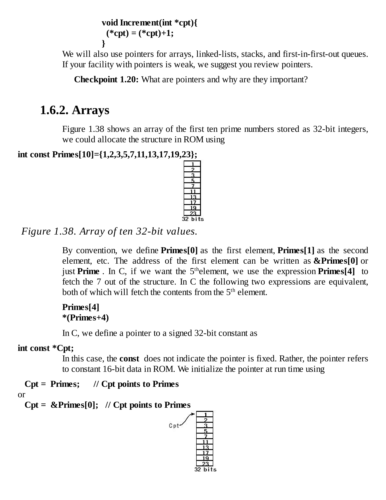
*Description*: Technical schematic and block diagram illustrating circuit operation, signal pathways, and functional behavior for Figure 1.38: shows an array of the first ten prime numbers stored as 32-bit integers,.

> **Figure 1.38: shows an array of the first ten prime numbers stored as 32-bit integers,**

we could allocate the structure in ROM using
int const Primes[10]={1,2,3,5,7,11,13,17,19,23};


*Description*: Technical schematic and block diagram illustrating circuit operation, signal pathways, and functional behavior for Figure 1.38: Array of ten 32-bit values..

> **Figure 1.38: Array of ten 32-bit values.**

By convention, we define Primes[0] as the first element, Primes[1] as the second
element, etc. The address of the first element can be written as &Primes[0] or
just Prime . In C, if we want the 5thelement, we use the expression Primes[4]  to
fetch the 7 out of the structure. In C the following two expressions are equivalent,
both of which will fetch the contents from the 5th element.
Primes[4]
*(Primes+4)
In C, we define a pointer to a signed 32-bit constant as
int const *Cpt;
In this case, the const  does not indicate the pointer is fixed. Rather, the pointer refers
to constant 16-bit data in ROM. We initialize the pointer at run time using
Cpt =  Primes;      // Cpt points to Primes
or
Cpt =  &Primes[0];   // Cpt points to Primes


<!-- Page 74 -->
### [PDF Page 74]


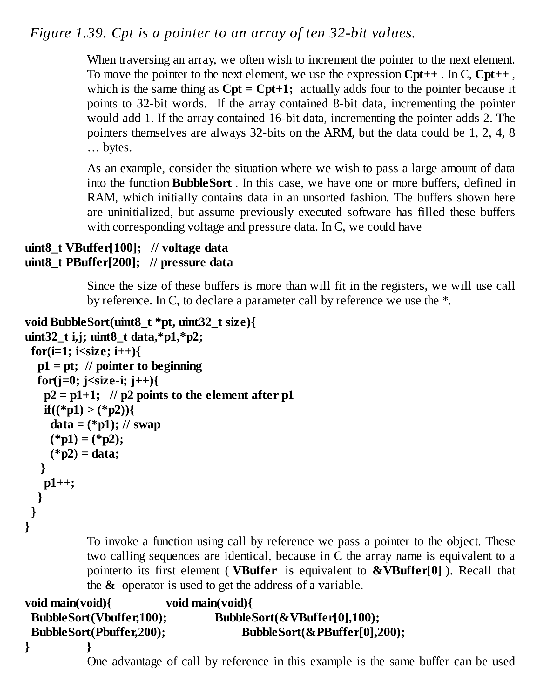
*Description*: Technical schematic and block diagram illustrating circuit operation, signal pathways, and functional behavior for Figure 1.39: Cpt is a pointer to an array of ten 32-bit values..

> **Figure 1.39: Cpt is a pointer to an array of ten 32-bit values.**

When traversing an array, we often wish to increment the pointer to the next element.
To move the pointer to the next element, we use the expression Cpt++ . In C, Cpt++ ,
which is the same thing as Cpt = Cpt+1;  actually adds four to the pointer because it
points to 32-bit words.  If the array contained 8-bit data, incrementing the pointer
would add 1. If the array contained 16-bit data, incrementing the pointer adds 2. The
pointers themselves are always 32-bits on the ARM, but the data could be 1, 2, 4, 8
… bytes.
As an example, consider the situation where we wish to pass a large amount of data
into the function BubbleSort . In this case, we have one or more buffers, defined in
RAM, which initially contains data in an unsorted fashion. The buffers shown here
are uninitialized, but assume previously executed software has filled these buffers
with corresponding voltage and pressure data. In C, we could have

```c
uint8_t VBuffer[100];   // voltage data
uint8_t PBuffer[200];   // pressure data
```

Since the size of these buffers is more than will fit in the registers, we will use call
by reference. In C, to declare a parameter call by reference we use the *.

```c
void BubbleSort(uint8_t *pt, uint32_t size){
uint32_t i,j; uint8_t data,*p1,*p2;
for(i=1; i<size; i++){
p1 = pt;  // pointer to beginning
for(j=0; j<size-i; j++){
p2 = p1+1;   // p2 points to the element after p1
if((*p1) > (*p2)){
data = (*p1); // swap
(*p1) = (*p2);
(*p2) = data;
}
p1++;
}
}
}
```

To invoke a function using call by reference we pass a pointer to the object. These
two calling sequences are identical, because in C the array name is equivalent to a
pointerto its first element ( VBuffer  is equivalent to &VBuffer[0] ). Recall that
the &  operator is used to get the address of a variable.

```c
void main(void){
void main(void){
BubbleSort(Vbuffer,100);
BubbleSort(&VBuffer[0],100);
BubbleSort(Pbuffer,200);
BubbleSort(&PBuffer[0],200);
}
}
```

One advantage of call by reference in this example is the same buffer can be used


<!-- Page 75 -->
### [PDF Page 75]

also as the return parameter. In particular, this sort routine re-arranges the data in the
same original buffer. Since RAM is a scarce commodity on most microcontrollers,
not having to allocate two buffers will reduce RAM requirements for the system.
From a security perspective, call by reference is more vulnerable than call by value.
If we have important information, then a level of trust is required to pass a pointer to
the original data to a subroutine. Since call by value creates a copy of the data at the
time of the call, it is slower but more secure. With call by value, the original data is
protected from subroutines that are called.
Checkpoint 1.21: If an array has 10 elements, what is the range of index values
used to access the data?
1.6.3. Linked lists
The linked list is an important data structure used in operating systems. Each element
(node) contains data and a pointer to another element as shown in Figure 1.40. Given
that a node in the list is a composite of data and a pointer, we use struct  to declare a
composite data type. A composite data type can be made up of primitive data type,
pointers and also other composite data-types.

```c
struct Node{
struct Node *Next;
int Data;
};
typedef struct Node NodeType;
```

In this simple example, the Data field is just a 32-bit number, we will expand our
node to contain multiple data fields each storing a specific attribute of the node.
There is a pointer to the first element, called the head pointer. The last element in the
list has a null pointer in its next field to indicate the end of the list.

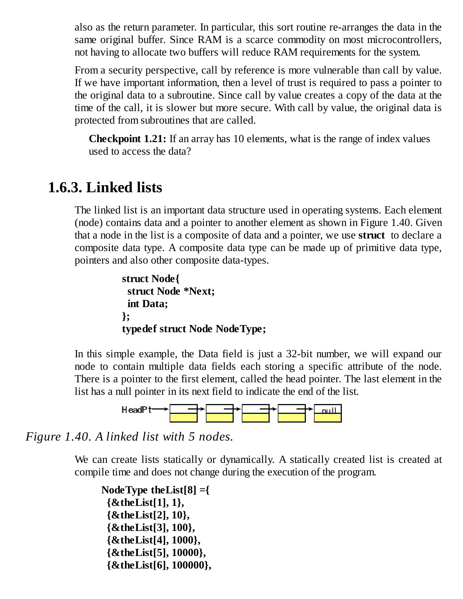
*Description*: Technical schematic and block diagram illustrating circuit operation, signal pathways, and functional behavior for Figure 1.40: A linked list with 5 nodes..

> **Figure 1.40: A linked list with 5 nodes.**

We can create lists statically or dynamically. A statically created list is created at
compile time and does not change during the execution of the program.
NodeType theList[8] ={
{&theList[1], 1},
{&theList[2], 10},
{&theList[3], 100},
{&theList[4], 1000},
{&theList[5], 10000},
{&theList[6], 100000},


<!-- Page 76 -->
### [PDF Page 76]

{&theList[7], 1000000},
{0,           10000000}};
NodeType *HeadPt = theList;   // points to first element
The following function searches the list to see if a data value exists in the list.
int Search(int x){ NodeType *pt;
pt = HeadPt; // start at beginning

```c
while(pt){
if(pt->Data == x) return 1; // found
pt = pt->Next;
}
return 0; // not found
}
```

This example created the linked-list statically. The compiler will generate code prior
to running main (called premain) that will initialize the eight nodes. To do this
initialization, there will be two copies of the structure: the initial copy in ROM used
during premain, and the RAM copy used by the program during execution. If the
program needs to change this structure during execution then having two copies is
fine. However, if the program does not change the structure, then you could put a
single copy in ROM by adding const to the definition. In this case, HeadPt  will be
in RAM but the linked list will be in ROM.
const struct Node{
const struct Node *Next;
int Data;
};

```c
typedef const struct Node NodeType;
NodeType theList[8] ={
{&theList[1], 1},
{&theList[2], 10},
{&theList[3], 100},
{&theList[4], 1000},
{&theList[5], 10000},
{&theList[6], 100000},
{&theList[7], 1000000},
{0,           10000000}};
NodeType *HeadPt = theList;   // points to first element
```

It is possible to create a linked list dynamically and grow/shrink the list as a program
executes. However, in keeping with our goal to design a simple RTOS, we will
refrain from doing any dynamic allocation, which would require the management of a
heap.   Most real-time systems do not allow the heap (malloc and free) to be
accessed by the application programmer, because the use of the heap could lead to


<!-- Page 77 -->
### [PDF Page 77]

nondeterministic behavior (the activity of one program affects the behavior of
another completely unrelated program).
Checkpoint 1.22: What is a linked list and in what ways is it better than an array?
In what ways is are arrays better?


<!-- Page 78 -->
### [PDF Page 78]

1.7. Memory Management
1.7.1. Use of the heap
In the previous two volumes, we have seen two types of allocation: permanent
allocation in global variables and temporary allocation in local variables. When we
allocate local variables in registers or on the stack these variables must be private to
the function and cannot be shared with other functions. Furthermore, each time the
function is invoked new local variables are created, and data from previous
instantiations are not available. This behavior is usually exactly what we want to
happen with local variables. However, we can use the heap (or memory manager)
to have temporary allocation in a way that is much more flexible. In particular, we
will be able to explicitly define when data are allocated and when they are
deallocated with the only restriction being we first allocate, next we use, and then we
deallocate. Furthermore, we can control the scope of the data in a flexible manner.
The use of the heap involves two system functions: malloc and free . When we wish
to allocate space,we call malloc and specify how many bytes we need. malloc will
return a pointer to the new object, which we must store in a pointer variable. If the
heap has no more space, malloc will return a 0, which means null pointer. The heap
implements temporary allocation, so when we are done with the data, we return it to
the heap by calling free . Consider the following simple example with three
functions.

```c
int32_t *Pt;
void Begin(void){
Pt = (*int32_t)malloc(4*20); // allocate 20 words
}
void Use(void){ int32_t i;
for(i = 0; i < 20; i++)
Pt[i] = i; // put data into array
}
void End(void){
free(Pt);
}
```

The pointer Pt  is permanently allocated. The left side of Figure 1.41 shows that
initially, even though the pointer exists, it does not point to anything. More
specifically, the compiler will initialize it to 0; this 0 is defined as a nullpointer,
meaning it is not valid. When malloc is called the pointer is now valid and points to
a 20-word array. The array is inside the heap and Pt points to it. Any time
after malloc is called and before free  is called,the array exists and can be accessed


<!-- Page 79 -->
### [PDF Page 79]

via the pointer Pt . After you call free , the pointer has the same value as before.
However, the array itself does not exist. I.e., these 80 bytes do not belong to your
program anymore. In particular, after you call free , the heap is allowed to allocate
these bytes to some other program. Weird and crazy errors will occur if you attempt
to dereference the pointer before the array is allocated, or after it is released.

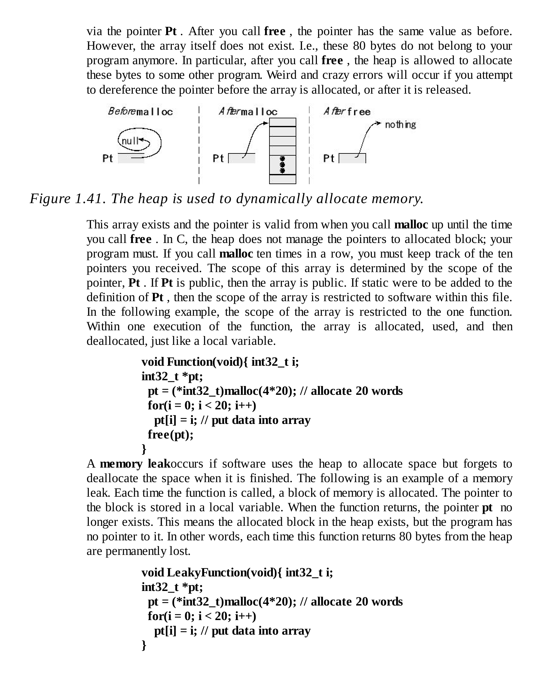
*Description*: Technical schematic and block diagram illustrating circuit operation, signal pathways, and functional behavior for Figure 1.41: The heap is used to dynamically allocate memory..

> **Figure 1.41: The heap is used to dynamically allocate memory.**

This array exists and the pointer is valid from when you call malloc up until the time
you call free . In C, the heap does not manage the pointers to allocated block; your
program must. If you call malloc ten times in a row, you must keep track of the ten
pointers you received. The scope of this array is determined by the scope of the
pointer, Pt . If Pt is public, then the array is public. If static were to be added to the
definition of Pt , then the scope of the array is restricted to software within this file.
In the following example, the scope of the array is restricted to the one function.
Within one execution of the function, the array is allocated, used, and then
deallocated, just like a local variable.

```c
void Function(void){ int32_t i;
int32_t *pt;
pt = (*int32_t)malloc(4*20); // allocate 20 words
for(i = 0; i < 20; i++)
pt[i] = i; // put data into array
free(pt);
}
```

A memory leakoccurs if software uses the heap to allocate space but forgets to
deallocate the space when it is finished. The following is an example of a memory
leak. Each time the function is called, a block of memory is allocated. The pointer to
the block is stored in a local variable. When the function returns, the pointer pt  no
longer exists. This means the allocated block in the heap exists, but the program has
no pointer to it. In other words, each time this function returns 80 bytes from the heap
are permanently lost.

```c
void LeakyFunction(void){ int32_t i;
int32_t *pt;
pt = (*int32_t)malloc(4*20); // allocate 20 words
for(i = 0; i < 20; i++)
pt[i] = i; // put data into array
}
```


<!-- Page 80 -->
### [PDF Page 80]

Internal fragmentation is storage that is allocated for the convenient of the
operating system but contains no information. This space is wasted. Often this space
is wasted in order to improve speed or provide for a simpler implementation. The
fragmentation is called "internal" because the wasted storage is inside the allocated
region. External fragmentation exists when the largest memory block that can be
allocated is less than the total amount of free space in the heap. External
fragmentation occurs in simple memory managers because memory is allocated in
contiguous blocks. External fragmentation occurs over time as free storage becomes
divided into many small pieces. It is a particular problem when an application
allocates and deallocates blocks of storage of varying sizes. The result is that
although free storage is available, it is effectively unusable because it is divided into
pieces that are too small to satisfy the demands of the application. The term
"external" refers to the fact that the unusable storage is outside the allocated regions.
Checkpoint 1.23: Depending on the microcontroller architecture, it may be faster
to access variables allocated on either a 16-bit word or 32-bit boundary. If the
compiler skips memory cells in order to align variables, is this internal or
external fragmentation?
1.7.2. Simple fixed-size heap
In general, the heap manager allows the program to allocate a variable block size, but
in this section we will develop a simplified heap manager handles just fixed
sizeblocks. In this example, the block size is specified by the constant SIZE . The
initialization will create a linked list of all the free blocks (Figure 1.42).

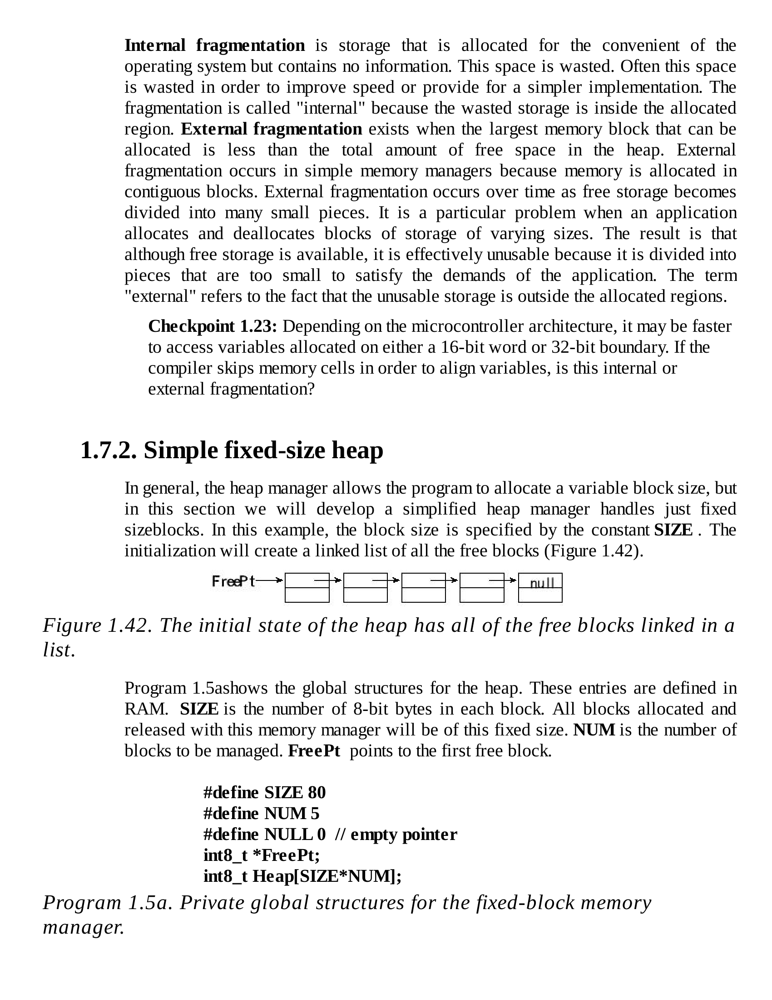
*Description*: Technical schematic and block diagram illustrating circuit operation, signal pathways, and functional behavior for Figure 1.42: The initial state of the heap has all of the free blocks linked in a.

> **Figure 1.42: The initial state of the heap has all of the free blocks linked in a**

list.


*Description*: Technical schematic and block diagram illustrating circuit operation, signal pathways, and functional behavior for Program 1.5: ashows the global structures for the heap. These entries are defined in.

> **Program 1.5: ashows the global structures for the heap. These entries are defined in**

RAM. SIZE is the number of 8-bit bytes in each block. All blocks allocated and
released with this memory manager will be of this fixed size. NUM is the number of
blocks to be managed. FreePt  points to the first free block.
#define SIZE 80
#define NUM 5
#define NULL 0  // empty pointer

```c
int8_t *FreePt;
int8_t Heap[SIZE*NUM];
```


*Description*: Technical schematic and block diagram illustrating circuit operation, signal pathways, and functional behavior for Program 1.5: a. Private global structures for the fixed-block memory.

> **Program 1.5: a. Private global structures for the fixed-block memory**

manager.


<!-- Page 81 -->
### [PDF Page 81]

Initialization must be performed before the heap can be used. Program 1.5bshows the
software that partitions the heap into blocks and links them together. FreePt  points
to a linear linked list of free blocks.

```c
void Heap_Init(void){
int8_t *pt;
FreePt = &Heap[0];
for(pt=&Heap[0]; pt!=&Heap[SIZE*(NUM-1)]; pt=pt+SIZE){
*(int32_t *)pt =(int32_t)(pt+SIZE);
}
*(int32_t*)pt = NULL;
}
```


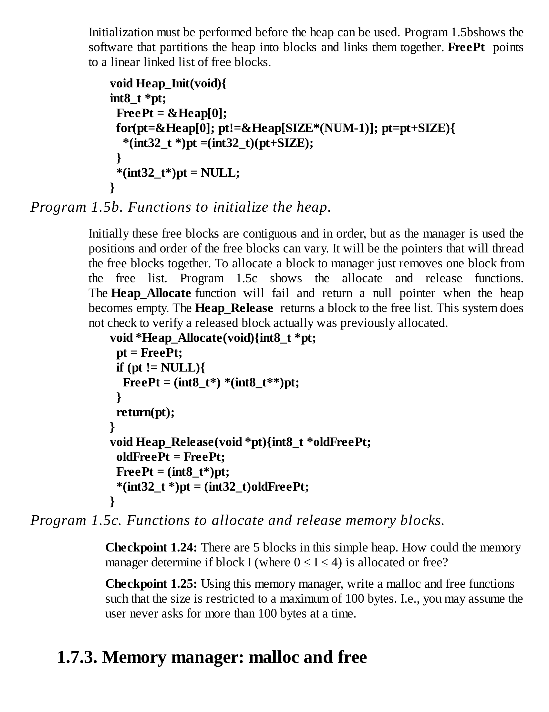
*Description*: Technical schematic and block diagram illustrating circuit operation, signal pathways, and functional behavior for Program 1.5: b. Functions to initialize the heap..

> **Program 1.5: b. Functions to initialize the heap.**

Initially these free blocks are contiguous and in order, but as the manager is used the
positions and order of the free blocks can vary. It will be the pointers that will thread
the free blocks together. To allocate a block to manager just removes one block from
the free list. Program 1.5c shows the allocate and release functions.
The Heap_Allocate function will fail and return a null pointer when the heap
becomes empty. The Heap_Release  returns a block to the free list. This system does
not check to verify a released block actually was previously allocated.
void *Heap_Allocate(void){int8_t *pt;
pt = FreePt;

```c
if (pt != NULL){
FreePt = (int8_t*) *(int8_t**)pt;
}
return(pt);
}
void Heap_Release(void *pt){int8_t *oldFreePt;
oldFreePt = FreePt;
FreePt = (int8_t*)pt;
*(int32_t *)pt = (int32_t)oldFreePt;
}
```


*Description*: Technical schematic and block diagram illustrating circuit operation, signal pathways, and functional behavior for Program 1.5: c. Functions to allocate and release memory blocks..

> **Program 1.5: c. Functions to allocate and release memory blocks.**

Checkpoint 1.24: There are 5 blocks in this simple heap. How could the memory
manager determine if block I (where 0 ≤ I ≤ 4) is allocated or free?
Checkpoint 1.25: Using this memory manager, write a malloc and free functions
such that the size is restricted to a maximum of 100 bytes. I.e., you may assume the
user never asks for more than 100 bytes at a time.
1.7.3. Memory manager: malloc and free


<!-- Page 82 -->
### [PDF Page 82]

The heapis a large piece of memory, managed by the operating system, used for
temporary allocation. The memory manager has at least three functions: one for
initialization ( Heap_Init ), one function for allocation and a third function for
deallocation.
Most
compilers
support
memory
management,
implementing malloc and free . However, in this example we develop an equivalent
solution, with names Heap_Malloc and Heap_Free . You can download a version of
the memory manager described in this section at the book web site. It is called
Heap_xxx and was developed by Jacob Egner as an example to illustrate
programming style. It runs on the TM4C compiled with the ARM Keil uVision, but
should operate without change on other microcontrollers and other compilers. The
heap itself is statically allocated storage assigned by the compiler. For a 32-bit
microcontroller we could define the 2000-byte heap using
static int32_t Heap[500];
Typically, the operating system calls Heap_Init  during the initialization process.
The initial heap is one large free block, as shown in Figure 1.43. The initial heap has
498 words of allocatable space and 2 words of overhead.

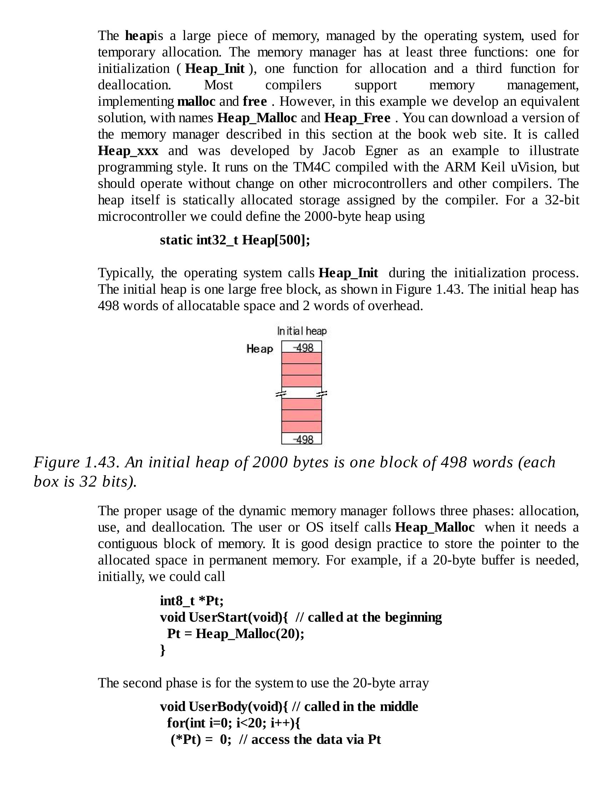
*Description*: Technical schematic and block diagram illustrating circuit operation, signal pathways, and functional behavior for Figure 1.43: An initial heap of 2000 bytes is one block of 498 words (each.

> **Figure 1.43: An initial heap of 2000 bytes is one block of 498 words (each**

box is 32 bits).
The proper usage of the dynamic memory manager follows three phases: allocation,
use, and deallocation. The user or OS itself calls Heap_Malloc  when it needs a
contiguous block of memory. It is good design practice to store the pointer to the
allocated space in permanent memory. For example, if a 20-byte buffer is needed,
initially, we could call

```c
int8_t *Pt;
void UserStart(void){  // called at the beginning
Pt = Heap_Malloc(20);
}
```

The second phase is for the system to use the 20-byte array

```c
void UserBody(void){ // called in the middle
for(int i=0; i<20; i++){
(*Pt) =  0;  // access the data via Pt
```


<!-- Page 83 -->
### [PDF Page 83]

}
// rest of user programs
}
When the program is finished with the block, it is released by calling Heap_Free .

```c
void UserFinish(void){ // called at the end
Heap_Free(Pt);
}
```

Checkpoint 1.26: What happens if a function allocates a block, stores a pointer to
the block in a local variable, and then returns from the function without
deallocating the block?
Saving the pointer to an allocated block in a local variable does not make sense. If
the memory is needed for the duration of just one function call, the block should be
allocated on the stack. For example, if a 20-byte buffer is needed, we could call

```c
void User(void){ int8_t buffer[20];
// use 20-byte buffer
}
```

The heap is divided into blocks of variable size. As shown in Figure 1.44, there are
two copies of the block size, one counter stored at the beginning (Header) and other
copy of the counter stored at the end of the block (Trailer). These two counters will
be classified as internal fragmentation because they exist for the convenience of the
operating system. If the counter is positive the block is being used (previously
allocated). If the counter is negative the block is free. The value of the counter
determines the size of the block in 32-bit words, not including the two counters
themselves. If the counter is implemented as a 32-bit signed number ( int32_t ), then
a heap of up to 231*4 bytes (2 gibibytes) can be managed. The number of bytes in a
block will be divisible by four.  I.e., blocks are aligned to 32-bit word boundaries.
For example, if the user asks for a block with 17 bytes, 20 bytes will be allocated.
These 3 wasted bytes are a form of internal fragmentation. Furthermore, the block
with 5 words of data actually requires 7 words of memory.

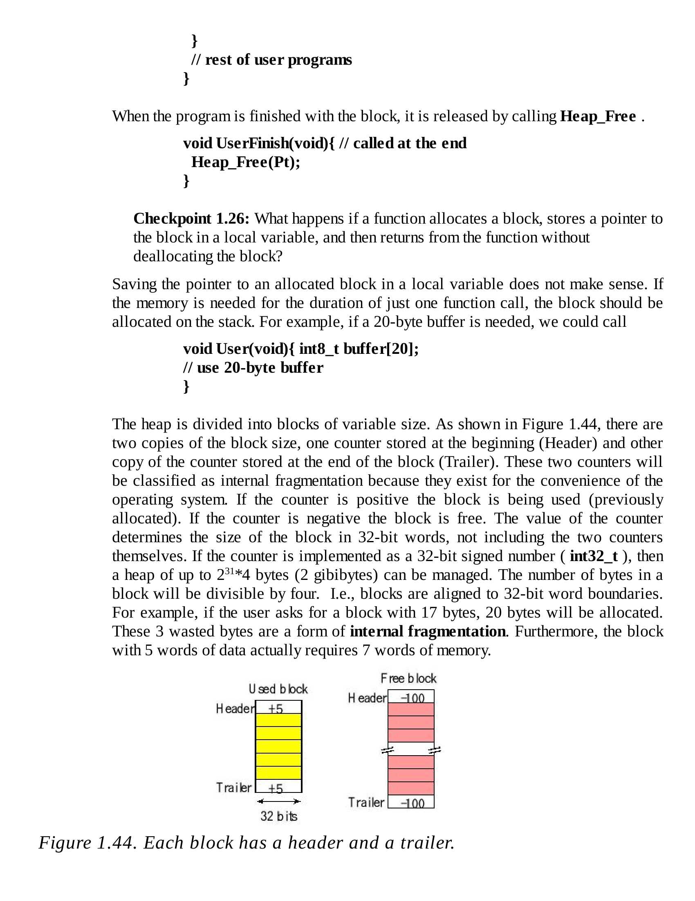
*Description*: Technical schematic and block diagram illustrating circuit operation, signal pathways, and functional behavior for Figure 1.44: Each block has a header and a trailer..

> **Figure 1.44: Each block has a header and a trailer.**


<!-- Page 84 -->
### [PDF Page 84]

When allocating blocks we can use a number of algorithms to choose which block to
allocate. Let nbe the number of bytes requested by Heap_Malloc .
First fit uses the first free block with a size greater than or equal to n.
Best fit uses the smallest free block with a size greater than or equal to n.
Worst fit uses the largest free block with a size greater than or equal to n.
Depending on the allocation pattern of the user program, these three allocation
methods will have differing levels of external fragmentation. The implementation on
the book web site as Heap_xxx uses first fit.
Checkpoint 1.27: How would you change the way free blocks are organized to
implement best fit?
When a block is allocated, a free block is divided to two parts. Figure 1.45illustrates
the process of allocating a 20-word block using a 100-word free block. In this
example, 80 bytes is 20 words. The 100-word free block is divided into a 20-word
block and a 78-word block. A pointer to the 20-word block is returned
by Heap_Malloc .
When allocating a block, the free block may not be large enough to split in two. For
example, if the user were to have asked for 392 bytes (98 words) in Figure 1.45, it
would be better to give the user the entire 100-word block, because the 8 bytes (2
words) are too small to create a useful block. These extra 8 bytes allocated to the
user constitute internal fragmentation.

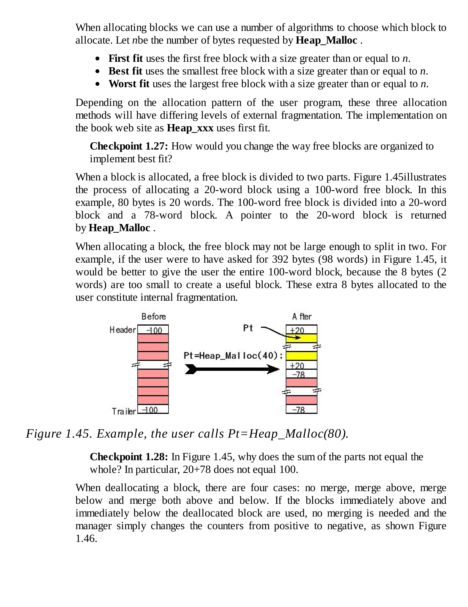
*Description*: Technical schematic and block diagram illustrating circuit operation, signal pathways, and functional behavior for Figure 1.45: Example, the user calls Pt=Heap_Malloc(80)..

> **Figure 1.45: Example, the user calls Pt=Heap_Malloc(80).**

Checkpoint 1.28: In Figure 1.45, why does the sum of the parts not equal the
whole? In particular, 20+78 does not equal 100.
When deallocating a block, there are four cases: no merge, merge above, merge
below and merge both above and below. If the blocks immediately above and
immediately below the deallocated block are used, no merging is needed and the
manager simply changes the counters from positive to negative, as shown Figure
1.46.


<!-- Page 85 -->
### [PDF Page 85]


*Description*: Technical schematic and block diagram illustrating circuit operation, signal pathways, and functional behavior for Figure 1.46: Example, the user calls Heap_Free(Pt)..

> **Figure 1.46: Example, the user calls Heap_Free(Pt).**

If the block immediately above is free and immediately below is used, a merge above
is needed and the manager will combine two blocks into one big free block, as
shown Figure 1.47. There are two special cases when deallocating blocks. If the
block is the first block in the heap, you cannot merge it above, and if the block is the
last block in the heap, you cannot merge it below.

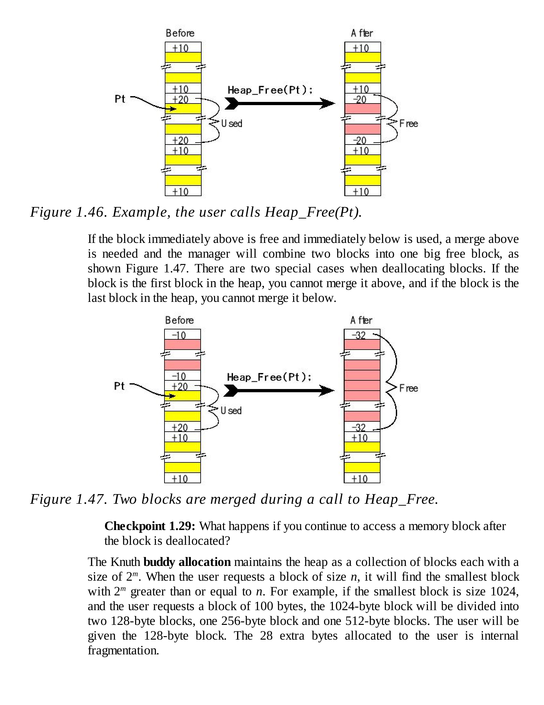
*Description*: Technical schematic and block diagram illustrating circuit operation, signal pathways, and functional behavior for Figure 1.47: Two blocks are merged during a call to Heap_Free..

> **Figure 1.47: Two blocks are merged during a call to Heap_Free.**

Checkpoint 1.29: What happens if you continue to access a memory block after
the block is deallocated?
The Knuth buddy allocation maintains the heap as a collection of blocks each with a
size of 2m. When the user requests a block of size n, it will find the smallest block
with 2m greater than or equal to n. For example, if the smallest block is size 1024,

```assembly
and the user requests a block of 100 bytes, the 1024-byte block will be divided into
```

two 128-byte blocks, one 256-byte block and one 512-byte blocks. The user will be
given the 128-byte block. The 28 extra bytes allocated to the user is internal
fragmentation.


<!-- Page 86 -->
### [PDF Page 86]

1.8. Introduction to debugging
Microcontroller-related problems often require the use of specialized equipment to
debug the system hardware and software. Useful hardware tools include a logic
probe, an oscilloscope, a logic analyzer, and a JTAG debugger. A logic probe is a
handheld device with an LED or buzzer. You place the probe on your digital circuit

```assembly
and LED/buzzer will indicate whether the signal is high or low. An oscilloscope, or
```

scope, graphically displays information about an electronic circuit, where the voltage
amplitude versus time is displayed. A scope has one or two channels, with many
ways to trigger or capture data. A scope is particularly useful when interfacing
analog signals using an ADC or DAC. The PicoScope 2104 (from
http://www.picotech.com/) is a low-cost but effective tool for debugging
microcontroller circuits. A logic analyzer is essentially a multiple channel digital
storage scope with many ways to trigger. As shown in Figure 1.48, we can connect
the logic analyzer to digital signals that are part of the system, or we can connect the
logic analyzer channels to unused microcontroller pins and add software to toggle
those pins at strategic times/places. As a troubleshooting aid, it allows the
experimenter to observe numerous digital signals at various points in time and thus
make decisions based upon such observations. One problem with logic analyzers is
the massive amount of information that it generates. To use an analyzer effectively
one must learn proper triggering mechanisms to capture data at appropriate times
eliminating the need to sift through volumes of output. The logic analyzer figures in
this
book
were
collected
with
a
logic
analyzer
Digilent
(from
http://www.digilentinc.com/). The Analog Discovery combines a logic analyzer with
an oscilloscope, creating an extremely effective debugging tool.

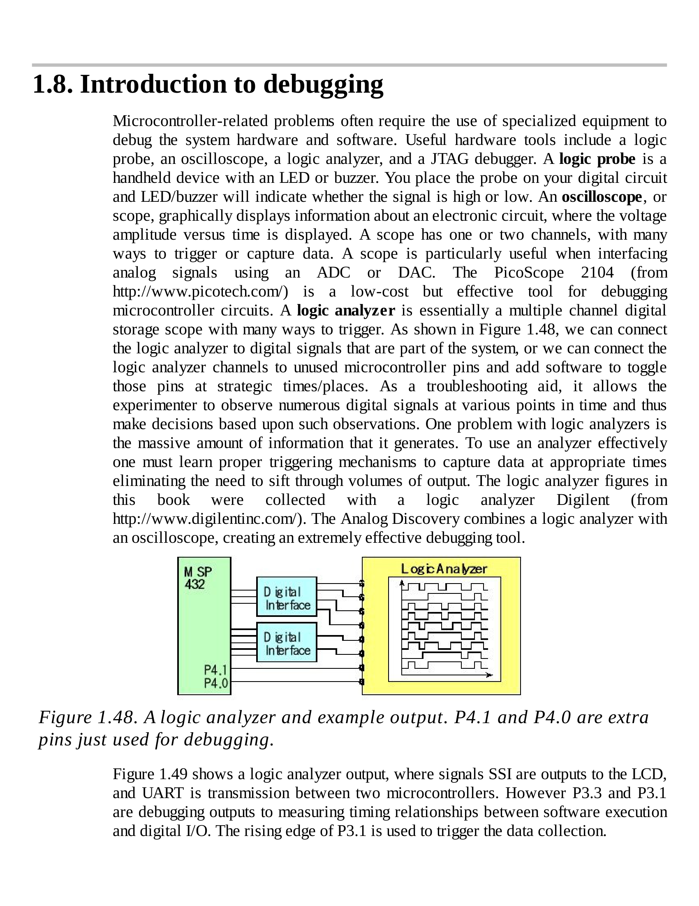
*Description*: Technical schematic and block diagram illustrating circuit operation, signal pathways, and functional behavior for Figure 1.48: A logic analyzer and example output. P4.1 and P4.0 are extra.

> **Figure 1.48: A logic analyzer and example output. P4.1 and P4.0 are extra**

pins just used for debugging.


*Description*: Technical schematic and block diagram illustrating circuit operation, signal pathways, and functional behavior for Figure 1.49: shows a logic analyzer output, where signals SSI are outputs to the LCD,.

> **Figure 1.49: shows a logic analyzer output, where signals SSI are outputs to the LCD,**


```assembly
and UART is transmission between two microcontrollers. However P3.3 and P3.1
```

are debugging outputs to measuring timing relationships between software execution

```assembly
and digital I/O. The rising edge of P3.1 is used to trigger the data collection.
```


<!-- Page 87 -->
### [PDF Page 87]


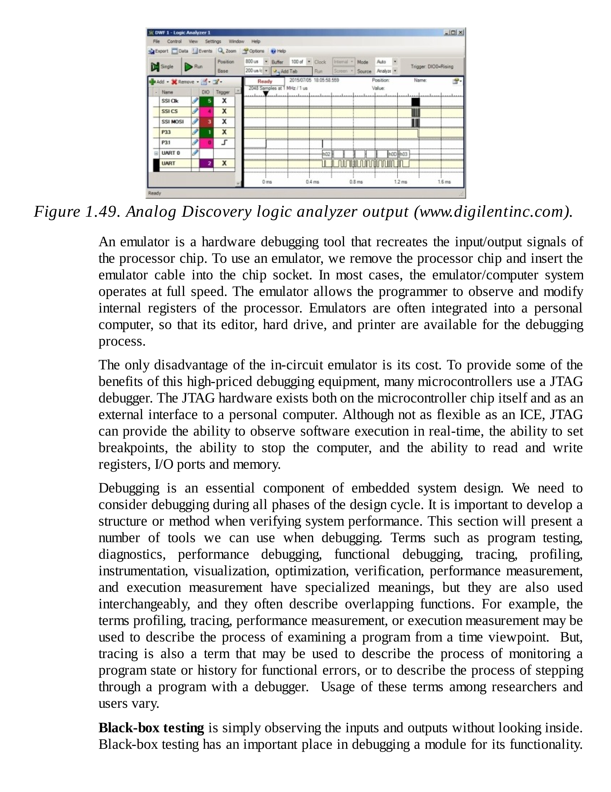
*Description*: Technical schematic and block diagram illustrating circuit operation, signal pathways, and functional behavior for Figure 1.49: Analog Discovery logic analyzer output (www.digilentinc.com)..

> **Figure 1.49: Analog Discovery logic analyzer output (www.digilentinc.com).**

An emulator is a hardware debugging tool that recreates the input/output signals of
the processor chip. To use an emulator, we remove the processor chip and insert the
emulator cable into the chip socket. In most cases, the emulator/computer system
operates at full speed. The emulator allows the programmer to observe and modify
internal registers of the processor. Emulators are often integrated into a personal
computer, so that its editor, hard drive, and printer are available for the debugging
process.
The only disadvantage of the in-circuit emulator is its cost. To provide some of the
benefits of this high-priced debugging equipment, many microcontrollers use a JTAG
debugger. The JTAG hardware exists both on the microcontroller chip itself and as an
external interface to a personal computer. Although not as flexible as an ICE, JTAG
can provide the ability to observe software execution in real-time, the ability to set
breakpoints, the ability to stop the computer, and the ability to read and write
registers, I/O ports and memory.
Debugging is an essential component of embedded system design. We need to
consider debugging during all phases of the design cycle. It is important to develop a

```c
structure or method when verifying system performance. This section will present a
```

number of tools we can use when debugging. Terms such as program testing,
diagnostics, performance debugging, functional debugging, tracing, profiling,
instrumentation, visualization, optimization, verification, performance measurement,

```assembly
and execution measurement have specialized meanings, but they are also used
```

interchangeably, and they often describe overlapping functions. For example, the
terms profiling, tracing, performance measurement, or execution measurement may be
used to describe the process of examining a program from a time viewpoint.  But,
tracing is also a term that may be used to describe the process of monitoring a
program state or history for functional errors, or to describe the process of stepping
through a program with a debugger.  Usage of these terms among researchers and
users vary.
Black-box testing is simply observing the inputs and outputs without looking inside.
Black-box testing has an important place in debugging a module for its functionality.


<!-- Page 88 -->
### [PDF Page 88]

On the other hand, white-box testing allows you to control and observe the internal
workings of a system. A common mistake made by new engineers is to just perform
black box testing. Effective debugging uses both. One must always start with black-
box testing by subjecting a hardware or software module to appropriate test-cases.
Once we document the failed test-cases, we can use them to aid us in effectively
performing the task of white-box testing. Unit testing involves evaluating each
module separately before combining the components into the larger system.
Integration testing occurs when multiple components are integrated together.
We define a debugging instrument as software code that is added to the program for
the purpose of debugging. A print statement is a common example of an instrument.
Using the editor, we add print statements to our code that either verify proper
operation or display run-time errors.
Nonintrusiveness is the characteristic or quality of a debugger that allows the
software/hardware system to operate normally as if the debugger did not exist.
Intrusiveness is used as a measure of the degree of perturbation caused in program
performance by the debugging instrument itself. Let t be the time required to execute
the instrument, and let Δt be the average time in between executions of the instrument.
One quantitative measure of intrusiveness is t/Δt, which is the fraction of available
processor time used by the debugger. For example, a print statement added to your
source code may be very intrusive because it might significantly affect the real-time
interaction of the hardware and software. Observing signals that already exist as part
of the system with an oscilloscope or logic analyzer is nonintrusive, meaning the
presence of the scope/analyzer has no effect on the system being measured. A
debugging instrument is classified as minimally intrusive if it has a negligible effect
on the system being debugged. In a real microcontroller system, breakpoints and
single-stepping are also intrusive, because the real hardware continues to change
while the software has stopped. When a program interacts with real-time events, the
performance can be significantly altered when using intrusive debugging tools. To be
effective we must employ nonintrusive or minimally intrusive methods.
Checkpoint 1.30: What does it mean for a debugging instrument to be minimally
intrusive? Give both a general answer and a specific criterion.
Although, a wide variety of program monitoring and debugging tools are available
today, in practice it is found that an overwhelming majority of users either still prefer
or rely mainly upon “rough and ready” manual methods for locating and correcting
program errors.  These methods include desk-checking, dumps, and print statements,
with print statements being one of the most popular manual methods.  Manual
methods are useful because they are readily available, and they are relatively simple
to use.  But, the usefulness of manual methods is limited: they tend to be highly
intrusive, and they do not provide adequate control over repeatability, event
selection, or event isolation. A real-time system, where software execution timing is
critical, usually cannot be debugged with simple print statements, because the print
statement itself will require too much time to execute.


<!-- Page 89 -->
### [PDF Page 89]

The first step of debugging is to stabilize the system. In the debugging context, we
stabilize the problem by creating a test routine that fixes (or stabilizes) all the inputs.
In this way, we can reproduce the exact inputs over and over again. Once stabilized,
if we modify the program, we are sure that the change in our outputs is a function of
the modification we made in our software and not due to a change in the input
parameters.
Acceleration means we will speed up the testing process. When we are testing one
module we can increase how fast the functions are called in an attempt to expose
possible faults. Furthermore, since we can control the test environment, we will vary
the test conditions over a wide range of possible conditions. Stress testing means
we run the system beyond the requirements to see at what point it breaks down.
When a system has a small number of possible inputs (e.g., less than a million), it
makes sense to test them all. When the number of possible inputs is large we need to
choose a set of inputs. Coverage defines the subset of possible inputs selected for
testing. A corner case is defined as a situation at the boundary where multiple inputs
are at their maximum, like the corner of a 3-D cube. At the corner small changes in
input may cause lots of internal and external changes. In particular, we need to test
the cases we think might be difficult (e.g., the clock output increments one second
from 11:59:59 PM December 31, 1999.) There are many ways to decide on the
coverage. We can select values:
• Near the extremes and in the middle
• Most typical of how our clients will properly use the system
• Most typical of how our clients will improperly use the system
• That differ by one
• You know your system will find difficult
• Using a random number generator
Maintenance Tip: First, find the things that will break you. Second, break them.
To stabilize the system we define a fixed set of inputs to test, run the system on these
inputs, and record the outputs. Debugging is a process of finding patterns in the
differences between recorded behavior and expected results. The advantage of
modular programming is that we can perform modular debugging. We make a list of
modules that might be causing the bug. We can then create new test routines to
stabilize these modules and debug them one at a time. Unfortunately, sometimes all
the modules seem to work, but the combination of modules does not. In this case we
study the interfaces between the modules, looking for intended and unintended (e.g.,
unfriendly code) interactions.
Common error: Sometimes the original system operates properly, and the
debugging code has bugs.


<!-- Page 90 -->
### [PDF Page 90]

1.9. Exercises

## 1.1  There are two R13s. What is special about R13? Why are there two of them?

What is the initial value in R13 after a reset?

## 1.2  What is in R14 when a function is called? How do you write code so that

function calls can be nested? What is the initial value in R14 after a reset?

## 1.3  What is in Register 15? Why is bit 0 of Register 15 always 0? What happens

when you load a value into Register 15 with bit 0 set? What is the initial value in
R15 after a reset?

## 1.4  Why are there so many buses on the ARM Cortex-M processor?


## 1.5  Write C code that sets bit 30 of memory location 0x2000.4000 using bit-banding.


## 1.6  Write C code that clears bit 15 of memory location 0x2000.1000 using bit-

banding.

## 1.7  Write C code that sets bit 5 of memory location 0x4000.4400 using bit-banding.

What effect does this operation have?

## 1.8  Write C code that clears bit 3 of memory location 0x4000.7400 using bit-

banding. What effect does this operation have?

## 1.9  Where is the interrupt enable bit on ARM Cortex-M processor? Which value

enables interrupts: 0 or 1?
1.10Does the associative principle hold for signed integer multiply and divide?
Assume Out1 Out2 A B C are all the same precision (e.g., 32 bits). In particular do
these two C calculations always achieve identical outputs? If not, give an example.
Out1 = (A*B)/C;
Out2 = A*(B/C);
1.11Does the associative principle hold for signed integer addition and subtraction?
Assume Out3 Out4 A B C  are all the same precision (e.g., 32 bits). In particular do
these two C calculations always achieve identical outputs? If not, give an example.
Out3 = (A+B)-C;
Out4 = A+(B-C);

## 1.12  According to AAPCS, which registers must be preserved and which registers

are free to modify by a function?

## 1.13  A C function has this prototype, void MyProg(int a, int b, int c) . If one placed

a breakpoint at the beginning of this function, where would you find the parameters a,
b, and c?

## 1.14  Write two assembly functions that return R0 equal to 31 times the input. One

function uses the multiply function and one uses the shift and reverse subtract. Make


<!-- Page 91 -->
### [PDF Page 91]

the functions comply with AAPC, so R0 is the input and R0 is the output.

## 1.15  Let R0 and R1 be two unsigned integers. Write assembly code that makes R0

the larger of the two using the conditional assembly instruction IT .

## 1.16  Consider a software system that allocates memory block i of Sizei in the order

of i = 0, 1, 2, ...  In this system, blocks will always be deallocated in the opposite
order. Prove that the memory manage will never result in fragmentation (two free
blocks that are not adjacent.) Write three functions (init, malloc, and free) that
implement a heap used in this manner.
#define SIZE 1000

```c
uint8_t Heap[SIZE];
```


