# Chapter 2: Microcontroller Input/Output

> **Textbook**: Embedded Systems: Real-Time Operating Systems for ARM Cortex-M Microcontrollers  
> **Author**: Jonathan W. Valvano  
> **PDF Page Range**: 92 - 204


---


<!-- Page 92 -->
### [PDF Page 92]

2. Microcontroller Input/Output

# Chapter 2 objectives are to:

• Overview digital I/O on the MSP432 and TM4C
• Review interrupt synchronization
• Introduce timer and edge-triggered interrupts
• Define simple serial communication using the UART and SPI
• Present timer I/O with input capture and PWM
• Overview analog I/O using a DAC and an ADC
The overall objective of this book is to teach the design of real-time operating
systems for embedded systems. This chapter will review interfacing to the
Texas Instruments MSP432/TM4C family of microcontrollers. Hardware and
software aspects of interfacing to the microcontroller were presented in detail
in Volume 2. In particular, this chapter is an abridged version of Volume 2
summarizing I/O interfacing concepts, presenting some reference material. The
reader can refer to Volume 2 for more details including more design examples.


<!-- Page 93 -->
### [PDF Page 93]

2.1. Parallel I/O
On most embedded microcontrollers, the I/O ports are memory mapped. This means
the software can access an input/output port simply by reading from or writing to the
appropriate address. It is important to realize that even though I/O operations “look”
like reads and writes to memory variables, the I/O ports often DO NOT act like
memory. For example, some bits are read-only, some are write-only, some can only
be cleared, others can only be set, and some bits cannot be modified. To make our
software more readable we include symbolic definitions for the I/O ports. We set the
direction register to specify which pins are input and which are output. Individual
port pins can be general purpose I/O (GPIO) or have an alternate function.
With a parallel input software reads a binary one if the input pin is high. The
software reads a binary zero if the input pin is low. With a parallel output, when the
software writes a 1, the output pin goes high. When the software writes a 0, the
output pin goes low. Microcontrollers allow parallel I/O to 8 or 16 pins at a time,
hence the classification as parallel I/O.
2.1.1. TM4C I/O programming
Pins have a regular (GPIO) or can have one of multiple alternate functions. By
default, the alternate function register (e.g., GPIO_PORTD_AFSEL_R ) is zero,
specifying the corresponding bits are regular GPIO pins. We will set bits in the
alternative function register when we wish to activate the functions listed in Tables
1.4, and 1.5. Typically, we write to the direction and alternate function registers once
during
the
initialization
phase.
We
use
the
data
register(e.g., GPIO_PORTD_DATA_R ) to perform input/output on the port.
Conversely, we read and write the data register multiple times to perform input and
output respectively during the running phase. The only differences among the TM4C
family are the number of ports and available pins in each port. For example, the
TM4C1294 has fifteen digital I/O ports A (8 bits), B (6 bits), C (8 bits), D (8 bits), E
(6 bits), F (5 bits), G (2 bits), H (4 bits), J (2 bits), K (8 bits), L (8 bits), M (8 bits),
N(6 bits), P (6 bits), and Q (5 bits). Furthermore, the TM4C1294 has different
addresses for ports. Refer to the file tm4c1294ncpdt.h or to the data sheet for more
the specific addresses of its I/O ports.
To initialize an I/O port for general use we perform seven steps, see Program 2.1. We
will skip steps three four and six in this chapter because the default state after a reset
is to disable analog function and disable alternate function. First, we activate the
clock for the port by setting the corresponding bit in RCGCGPIO register. Because
it takes time for the clock to stabilize, we next will wait for its status bit in the
PRGPIO to be true. Second, we unlock the port; unlocking is needed only for pins


<!-- Page 94 -->
### [PDF Page 94]

PD7, and PF0 on the TM4C123. The only pin needing unlocking on the TM4C1294 is
PD7. Third, we disable the analog function of the pin, because we will be using the
pin for digital I/O. Fourth, we clear bits in the PCTL (Tables 1.4, 1.5) to select
regular digital function. Fifth, we set its direction register. The direction register
specifies bit for bit whether the corresponding pins are input or output. A bit in DIR
set to 0 means input and 1 means output. Sixth, we clear bits in the alternate function
register, and lastly, we enable the digital port. Turning on the clock must be first. If
the pin needs unlocking that must be second. However, the other five steps can occur
in any order.

```c
void PortF_Init(void){ // TM4C123 has PortF bits 4-0
SYSCTL_RCGCGPIO_R |= 0x00000020;  // 1) activate clock for Port F
while((SYSCTL_PRGPIO_R&0x00000020) == 0){};// wait for stabilization
GPIO_PORTF_LOCK_R = 0x4C4F434B;   // 2) unlock GPIO Port F
GPIO_PORTF_CR_R = 0x1F;           // allow changes to PF4-0
GPIO_PORTF_AMSEL_R = 0x00;        // 3) disable analog on PF
GPIO_PORTF_PCTL_R = 0x00000000;   // 4) PCTL GPIO on PF4-0
GPIO_PORTF_DIR_R = 0x0E;          // 5) PF4,PF0 in, PF3-1 out
GPIO_PORTF_AFSEL_R = 0x00;        // 6) disable alt funct on PF4-0
GPIO_PORTF_PUR_R = 0x11;          // enable pull-up on PF0 and PF4
GPIO_PORTF_DEN_R = 0x1F;          // 7) enable digital I/O on PF4-0
}
uint32_t PortF_Input(void){
return (GPIO_PORTF_DATA_R&0x11);  // read PF4,PF0 inputs
}
void PortF_Output(uint32_t data){
GPIO_PORTF_DATA_R = data;      // write PF3-PF1 outputs
}
```


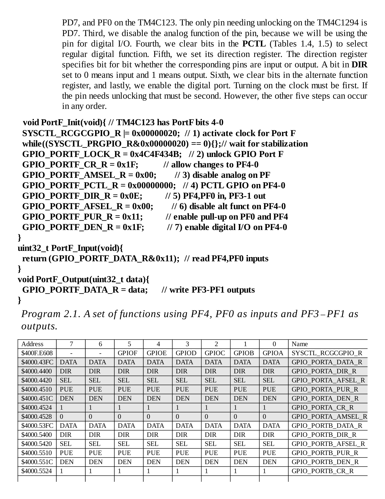
*Description*: Technical schematic and block diagram illustrating circuit operation, signal pathways, and functional behavior for Program 2.1: A set of functions using PF4, PF0 as inputs and PF3 –PF1 as.

> **Program 2.1: A set of functions using PF4, PF0 as inputs and PF3 –PF1 as**

outputs.
Address
7
6
5
4
3
2
1
0
Name
$400F.E608
-
-
GPIOF
GPIOE
GPIOD
GPIOC
GPIOB
GPIOA
SYSCTL_RCGCGPIO_R
$4000.43FC
DATA
DATA
DATA
DATA
DATA
DATA
DATA
DATA
GPIO_PORTA_DATA_R
$4000.4400
DIR
DIR
DIR
DIR
DIR
DIR
DIR
DIR
GPIO_PORTA_DIR_R
$4000.4420
SEL
SEL
SEL
SEL
SEL
SEL
SEL
SEL
GPIO_PORTA_AFSEL_R
$4000.4510
PUE
PUE
PUE
PUE
PUE
PUE
PUE
PUE
GPIO_PORTA_PUR_R
$4000.451C
DEN
DEN
DEN
DEN
DEN
DEN
DEN
DEN
GPIO_PORTA_DEN_R
$4000.4524
1
1
1
1
1
1
1
1
GPIO_PORTA_CR_R
$4000.4528
0
0
0
0
0
0
0
0
GPIO_PORTA_AMSEL_R
$4000.53FC
DATA
DATA
DATA
DATA
DATA
DATA
DATA
DATA
GPIO_PORTB_DATA_R
$4000.5400
DIR
DIR
DIR
DIR
DIR
DIR
DIR
DIR
GPIO_PORTB_DIR_R
$4000.5420
SEL
SEL
SEL
SEL
SEL
SEL
SEL
SEL
GPIO_PORTB_AFSEL_R
$4000.5510
PUE
PUE
PUE
PUE
PUE
PUE
PUE
PUE
GPIO_PORTB_PUR_R
$4000.551C
DEN
DEN
DEN
DEN
DEN
DEN
DEN
DEN
GPIO_PORTB_DEN_R
$4000.5524
1
1
1
1
1
1
1
1
GPIO_PORTB_CR_R


<!-- Page 95 -->
### [PDF Page 95]

$4000.5528
0
0
AMSEL
AMSEL
0
0
0
0
GPIO_PORTB_AMSEL_R
$4000.63FC
DATA
DATA
DATA
DATA
JTAG
JTAG
JTAG
JTAG
GPIO_PORTC_DATA_R
$4000.6400
DIR
DIR
DIR
DIR
JTAG
JTAG
JTAG
JTAG
GPIO_PORTC_DIR_R
$4000.6420
SEL
SEL
SEL
SEL
JTAG
JTAG
JTAG
JTAG
GPIO_PORTC_AFSEL_R
$4000.6510
PUE
PUE
PUE
PUE
JTAG
JTAG
JTAG
JTAG
GPIO_PORTC_PUR_R
$4000.651C
DEN
DEN
DEN
DEN
JTAG
JTAG
JTAG
JTAG
GPIO_PORTC_DEN_R
$4000.6524
1
1
1
1
JTAG
JTAG
JTAG
JTAG
GPIO_PORTC_CR_R
$4000.6528
AMSEL
AMSEL
AMSEL
AMSEL
JTAG
JTAG
JTAG
JTAG
GPIO_PORTC_AMSEL_R
$4000.73FC
DATA
DATA
DATA
DATA
DATA
DATA
DATA
DATA
GPIO_PORTD_DATA_R
$4000.7400
DIR
DIR
DIR
DIR
DIR
DIR
DIR
DIR
GPIO_PORTD_DIR_R
$4000.7420
SEL
SEL
SEL
SEL
SEL
SEL
SEL
SEL
GPIO_PORTD_AFSEL_R
$4000.7510
PUE
PUE
PUE
PUE
PUE
PUE
PUE
PUE
GPIO_PORTD_PUR_R
$4000.751C
DEN
DEN
DEN
DEN
DEN
DEN
DEN
DEN
GPIO_PORTD_DEN_R
$4000.7524
CR
1
1
1
1
1
1
1
GPIO_PORTD_CR_R
$4000.7528
0
0
AMSEL
AMSEL
AMSEL
AMSEL
AMSEL
AMSEL
GPIO_PORTD_AMSEL_R
$4002.43FC
DATA
DATA
DATA
DATA
DATA
DATA
GPIO_PORTE_DATA_R
$4002.4400
DIR
DIR
DIR
DIR
DIR
DIR
GPIO_PORTE_DIR_R
$4002.4420
SEL
SEL
SEL
SEL
SEL
SEL
GPIO_PORTE_AFSEL_R
$4002.4510
PUE
PUE
PUE
PUE
PUE
PUE
GPIO_PORTE_PUR_R
$4002.451C
DEN
DEN
DEN
DEN
DEN
DEN
GPIO_PORTE_DEN_R
$4002.4524
1
1
1
1
1
1
GPIO_PORTE_CR_R
$4002.4528
AMSEL
AMSEL
AMSEL
AMSEL
AMSEL
AMSEL
GPIO_PORTE_AMSEL_R
$4002.53FC
DATA
DATA
DATA
DATA
DATA
GPIO_PORTF_DATA_R
$4002.5400
DIR
DIR
DIR
DIR
DIR
GPIO_PORTF_DIR_R
$4002.5420
SEL
SEL
SEL
SEL
SEL
GPIO_PORTF_AFSEL_R
$4002.5510
PUE
PUE
PUE
PUE
PUE
GPIO_PORTF_PUR_R
$4002.551C
DEN
DEN
DEN
DEN
DEN
GPIO_PORTF_DEN_R
$4002.5524
1
1
1
1
CR
GPIO_PORTF_CR_R
$4002.5528
0
0
0
0
0
GPIO_PORTF_AMSEL_R
31-28
27-24
23-20
19-16
15-12
11-8
7-4
3-0
$4000.452C
PMC7
PMC6
PMC5
PMC4
PMC3
PMC2
PMC1
PMC0
GPIO_PORTA_PCTL_R
$4000.552C
PMC7
PMC6
PMC5
PMC4
PMC3
PMC2
PMC1
PMC0
GPIO_PORTB_PCTL_R
$4000.652C
PMC7
PMC6
PMC5
PMC4
0x1
0x1
0x1
0x1
GPIO_PORTC_PCTL_R
$4000.752C
PMC7
PMC6
PMC5
PMC4
PMC3
PMC2
PMC1
PMC0
GPIO_PORTD_PCTL_R
$4002.452C
PMC5
PMC4
PMC3
PMC2
PMC1
PMC0
GPIO_PORTE_PCTL_R
$4002.552C
PMC4
PMC3
PMC2
PMC1
PMC0
GPIO_PORTF_PCTL_R
$4000.6520
LOCK (write 0x4C4F434B to unlock, other locks) (reads 1 if locked, 0 if unlocked)
GPIO_PORTC_LOCK_R
$4000.7520
LOCK (write 0x4C4F434B to unlock, other locks) (reads 1 if locked, 0 if unlocked)
GPIO_PORTD_LOCK_R
$4002.5520
LOCK (write 0x4C4F434B to unlock, other locks) (reads 1 if locked, 0 if unlocked)
GPIO_PORTF_LOCK_R

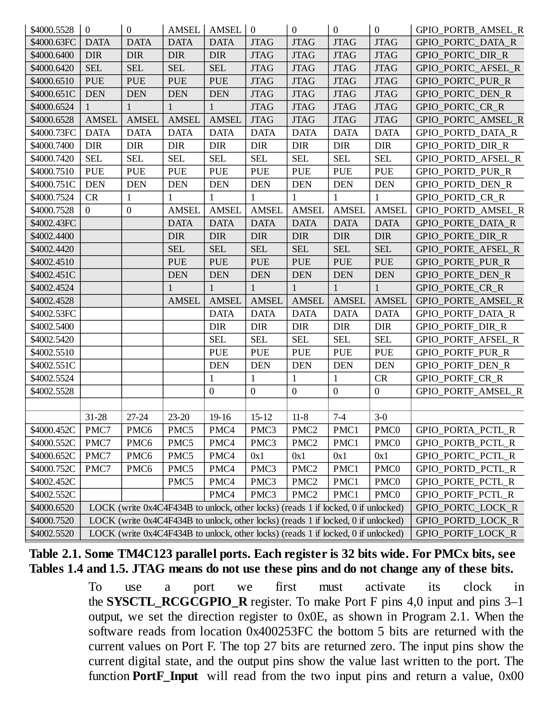
*Description*: Register layout and memory mapping diagram specifying bit fields, stack pointer allocations, and memory address boundaries for Table 2.1: Some TM4C123 parallel ports. Each register is 32 bits wide. For PMCx bits, see.

> **Table 2.1: Some TM4C123 parallel ports. Each register is 32 bits wide. For PMCx bits, see**

Tables 1.4 and 1.5. JTAG means do not use these pins and do not change any of these bits.
To
use
a
port
we
first
must
activate
its
clock
in
the SYSCTL_RCGCGPIO_R register. To make Port F pins 4,0 input and pins 3–1
output, we set the direction register to 0x0E, as shown in Program 2.1. When the
software reads from location 0x400253FC the bottom 5 bits are returned with the
current values on Port F. The top 27 bits are returned zero. The input pins show the
current digital state, and the output pins show the value last written to the port. The
function PortF_Input  will read from the two input pins and return a value, 0x00


<!-- Page 96 -->
### [PDF Page 96]

0x01, 0x10 or 0x11, depending on the current status of the inputs. The
function PortF_Output  will write new values to the three output pins.
In Program 2.1 the assumption was the software module had access to all of Port F. In
other words, this software owned all five pins of Port F. In most cases, a software
module needs access to only some of the port pins. If two or more software modules
access the same port, a conflict will occur if one module changes modes or output
values owned by another module. It is good software design to write friendly
software, which only affects the individual pins as needed. Friendly software does
not change the other bits in a shared register. Conversely, unfriendly software
modifies more bits of a register than it needs to. The difficulty of unfriendly code is
each module will run properly when tested by itself, but weird bugs result when two
or more modules are combined.
Consider the problem that a software module need to output to just Port F bit 1. After
enabling the clock for Port F, we use read-modify-write software to initialize just pin
1
SYSCTL_RCGCGPIO_R |= 0x00000020; // activate clock for Port F

```c
while((SYSCTL_PRGPIO_R&0x00000020) == 0){};// clock stabilization
GPIO_PORTF_AMSEL_R &= ~0x02;      // disable analog on PF1
GPIO_PORTF_PCTL_R &= ~0x000000F0; // PCTL GPIO on PF1
GPIO_PORTF_DIR_R |= 0x02;         // PF1 is an output
GPIO_PORTF_AFSEL_R &= ~0x02;      // regular port function
GPIO_PORTF_DEN_R |= 0x02;         // PF1 is enabled as a digital port
```

There is no conflict if two or more modules enable the clock for Port F. There are
two ways on the Cortex-M microcontroller to access individual port bits. The first
method is to use read-modify-write software to change just pin 1.  A read-or-write
sequence can be used to set one or more bits.
GPIO_PORTF_DATA_R |= 0x02;       // make PF1 high
A read-and-write sequence can be used to clear one or more bits.
GPIO_PORTF_DATA_R &= ~0x02;      // make PF1 low
The second method uses the bit-specific addressing. The TM4C family implements a
more flexible way to access port pins than the bit-banding. This bit-specific
addressing doesn’t work for all the I/O registers, just the parallel port data registers.
This mechanism allows collective access to 1 to 8 bits in a data port. We define eight
address offset constants in Table 2.2. Basically, if we are interested in bit b, the
constant is 4*2b. There 256 possible bit combinations we might be interested in
accessing, from all of them to none of them. Each possible bit combination has a
separate address for accessing that combination. For each bit we are interested in,
we add up the corresponding constants from Table 2.2 and then add that sum to the
base address for the port. The base addresses for the data ports can be found in GPIO


<!-- Page 97 -->
### [PDF Page 97]

chapter of the microcontroller data sheet. For example, assume we are interested in
Port A bits 1, 2, and 3. The base address for Port A is 0x4000.4000, and the
constants
are
0x0020,
0x0010
and
0x008.
The
sum
of
0x4000.4000+0x0020+0x0010+0x008 is the address 0x4000.4038. If we read from
0x4000.4038 only bits 1, 2, and 3 will be returned. If we write to this address only
bits 1, 2, and 3 will be modified.
If we wish to access
bit
Constant
7
0x0200
6
0x0100
5
0x0080
4
0x0040
3
0x0020
2
0x0010
1
0x0008
0
0x0004

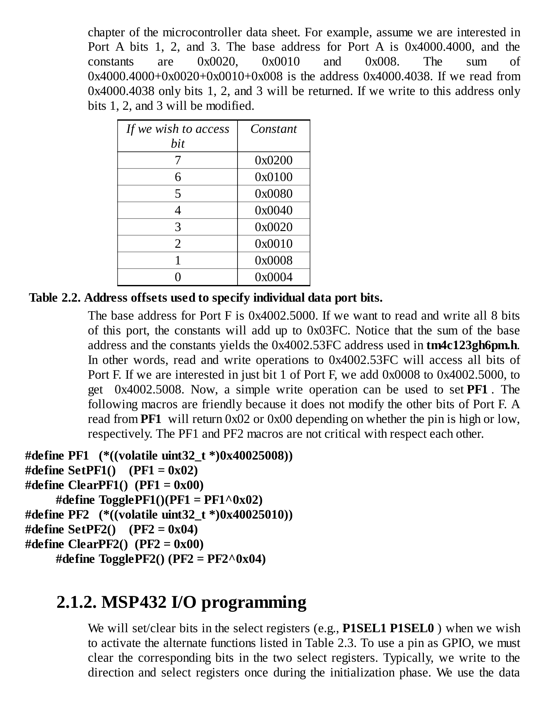
*Description*: Reference table detailing hardware parameters, register bit patterns, performance metrics, or memory configurations for Table 2.2: Address offsets used to specify individual data port bits..

> **Table 2.2: Address offsets used to specify individual data port bits.**

The base address for Port F is 0x4002.5000. If we want to read and write all 8 bits
of this port, the constants will add up to 0x03FC. Notice that the sum of the base
address and the constants yields the 0x4002.53FC address used in tm4c123gh6pm.h.
In other words, read and write operations to 0x4002.53FC will access all bits of
Port F. If we are interested in just bit 1 of Port F, we add 0x0008 to 0x4002.5000, to
get  0x4002.5008. Now, a simple write operation can be used to set PF1 . The
following macros are friendly because it does not modify the other bits of Port F. A
read from PF1  will return 0x02 or 0x00 depending on whether the pin is high or low,
respectively. The PF1 and PF2 macros are not critical with respect each other.
#define PF1   (*((volatile uint32_t *)0x40025008))
#define SetPF1()    (PF1 = 0x02)
#define ClearPF1()  (PF1 = 0x00)
#define TogglePF1()(PF1 = PF1^0x02)
#define PF2   (*((volatile uint32_t *)0x40025010))
#define SetPF2()    (PF2 = 0x04)
#define ClearPF2()  (PF2 = 0x00)
#define TogglePF2() (PF2 = PF2^0x04)
2.1.2. MSP432 I/O programming
We will set/clear bits in the select registers (e.g., P1SEL1 P1SEL0 ) when we wish
to activate the alternate functions listed in Table 2.3. To use a pin as GPIO, we must
clear the corresponding bits in the two select registers. Typically, we write to the
direction and select registers once during the initialization phase. We use the data


<!-- Page 98 -->
### [PDF Page 98]

registers(e.g., P1IN P1OUT ) to perform the actual input/output on the port. Table

## 2.4 shows the parallel port registers for Ports 1 and 2, but there are similar registers

for other ports 3 – 10. Each register in Table 2.4 is 8 bits wide.
To make a pin an output, we set the corresponding bit in the PxDIRregister to 1. In
addition, we can also set the corresponding bit in the drive strength register
(e.g., P2DS ) to increase the maximum IOL and IOH of the pin to 20 mA. Normal
strength is DS=0, and increased strength, called high drive, is DS=1. High-drive with
DS=1 is available only on P2.0 – P2.3.
Pin
PxSEL1=0,
PxSEL0=0
PxSEL1=0, PxSEL0=1
PxSEL1=1,
PxSEL0=0
PxSEL1=1,
PxSEL0=1
P1.0
Port
UCA0STE
P1.1
Port
UCA0CLK
P1.2
Port
UCA0RXD/UCA0SOMI
P1.3
Port
UCA0TXD/UCA0SIMO
P1.4
Port
UCB0STE
P1.5
Port
UCB0CLK
P1.6
Port
UCB0SIMO/UCB0SDA
P1.7
Port
UCB0SOMI/UCB0SCL
P2.0
Port
UCA1STE
P2.1
Port
UCA1CLK
P2.2
Port
UCA1RXD/UCA1SOMI
P2.3
Port
UCA1TXD/UCA1SIMO
P2.4
Port
TA0.CCI1Aa / TA0.1b
P2.5
Port
TA0.CCI2Aa / TA0.2b
P2.6
Port
TA0.CCI3Aa / TA0.3b
P2.7
Port
TA0.CCI4Aa / TA0.4b
P3.0
Port
UCA2STE
P3.1
Port
UCA2CLK
P3.2
Port
UCA2RXD/UCA2SOMI
P3.3
Port
UCA2TXD/UCA2SIMO
P3.4
Port
UCB2STE
P3.5
Port
UCB2CLK
P3.6
Port
UCB2SIMO/UCB2SDA
P3.7
Port
UCB2SOMI/UCB2SCL
P4.0
Port
A13
P4.1
Port
A12
P4.2
Port
ACLKb
TA2CLKa
A11
P4.3
Port
MCLKb
RTCCLKb
A10
P4.4
Port
HSMCLKb
SVMHOUTb
A9
P4.5
Port
A8
P4.6
Port
A7
P4.7
Port
A6
P5.0
Port
A5
P5.1
Port
A4
P5.2
Port
A3
P5.3
Port
A2
P5.4
Port
A1


<!-- Page 99 -->
### [PDF Page 99]

P5.5
Port
A0
P5.6
Port
TA2.CCI1Aa / TA2.1b
VREF+, VeREF+,
C1.7
P5.7
Port
TA2.CCI2Aa / TA2.2b
VREF-, VeREF-,
C1.6
P6.0
Port
A15
P6.1
Port
A14
P6.2
Port
UCB1STE
C1.5
P6.3
Port
UCB1CLK
C1.4
P6.4
Port
UCB1SIMO/UCB1SDA
C1.3
P6.5
Port
UCB1SOMI/UCB1SCL
C1.2
P6.6
Port
TA2.CCI3Aa / TA2.3b UCB3SIMO/UCB3SDA
C1.1
P6.7
Port
TA2.CCI4Aa / TA2.4b
UCB3SOMI/UCB3SCL
C1.0
P7.0
Port
DMAE0a / SMCLKb
P7.1
Port
TA0CLKa / C0OUTb
P7.2
Port
TA1CLKa / C1OUTb
P7.3
Port
TA0.CCI0Aa / TA0.0b
P7.4
Port
TA1.CCI4Aa / TA1.4b
C0.5
P7.5
Port
TA1.CCI3Aa / TA1.3b
C0.4
P7.6
Port
TA1.CCI2Aa / TA1.2b
C0.3
P7.7
Port
TA1.CCI1Aa / TA1.1b
C0.2
P8.0
Port
UCB3STE
TA1.CCI0Aa / TA1.0b
C0.1
P8.1
Port
UCB3CLK
TA2.CCI0Aa / TA2.0b
C0.0
Pin
PxSEL1=0,
PxSEL0=0
PxSEL1=0, PxSEL0=1
PxSEL1=1,
PxSEL0=0
PxSEL1=1,
PxSEL0=1
P8.2
Port
TA3.CCI2Aa / TA3.2b
A23
P8.3
Port
TA3CLKa
A22
P8.4
Port
A21
P8.5
Port
A20
P8.6
Port
A19
P8.7
Port
A18
P9.0
Port
A17
P9.1
Port
A16
P9.2
Port
TA3.CCI3Aa / TA3.3b
P9.3
Port
TA3.CCI4Aa / TA3.4b
P9.4
Port
UCA3STE
P9.5
Port
UCA3CLK
P9.6
Port
UCA3RXD/UCA3SOMI
P9.7
Port
UCA3TXD/UCA3SIMO
P10.0
Port
UCB3STE
P10.1
Port
UCB3CLK
P10.2
Port
UCB3SIMO/UCB3SDA
P10.3
Port
UCB3SOMI/UCB3SCL
P10.4
Port
TA3.CCI0Aa / TA3.0b
C0.7
P10.5
Port
TA3.CCI1Aa / TA3.1b
C0.6

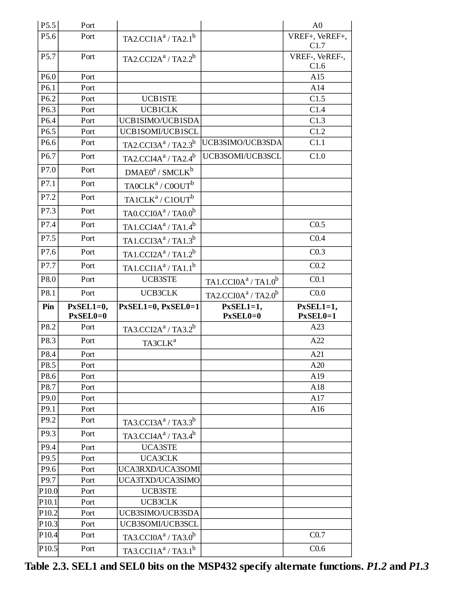
*Description*: Reference table detailing hardware parameters, register bit patterns, performance metrics, or memory configurations for Table 2.3: SEL1 and SEL0 bits on the MSP432 specify alternate functions. P1.2 and P1.3.

> **Table 2.3: SEL1 and SEL0 bits on the MSP432 specify alternate functions. P1.2 and P1.3**


<!-- Page 100 -->
### [PDF Page 100]

are hardwired to the serial port. a means DIR register is zero, b means DIR register is one.
To make a pin an input, we clear the corresponding bit in the PxDIR register to 0. In
addition, we can activate a pull up or pull down resistor on an input pin. To activate
a pull up resistor, we set PxREN=1 and PxOUT=1. To activate a pull down resistor,
we set PxREN=1 and clear PxOUT=0. The equalivalent resistance of the pull up or
pull down resistor is about 20 – 50 kΩ.
Address
7
6
5
4
3
2
1
0
Name
0x4000.4C00
DATA
DATA
DATA
DATA
DATA
DATA
DATA
DATA
P1IN
0x4000.4C02
DATA
DATA
DATA
DATA
DATA
DATA
DATA
DATA
P1OUT
0x4000.4C04
DIR
DIR
DIR
DIR
DIR
DIR
DIR
DIR
P1DIR
0x4000.4C06
REN
REN
REN
REN
REN
REN
REN
REN
P1REN
0x4000.4C08
DS
DS
DS
DS
DS
DS
DS
DS
P1DS
0x4000.4C0A
SEL0
SEL0
SEL0
SEL0
SEL0
SEL0
SEL0
SEL0
P1SEL0
0x4000.4C0C
SEL1
SEL1
SEL1
SEL1
SEL1
SEL1
SEL1
SEL1
P1SEL1
0x4000.4C01
DATA
DATA
DATA
DATA
DATA
DATA
DATA
DATA
P2IN
0x4000.4C03
DATA
DATA
DATA
DATA
DATA
DATA
DATA
DATA
P2OUT
0x4000.4C05
DIR
DIR
DIR
DIR
DIR
DIR
DIR
DIR
P2DIR
0x4000.4C07
REN
REN
REN
REN
REN
REN
REN
REN
P2REN
0x4000.4C09
DS
DS
DS
DS
DS
DS
DS
DS
P2DS
0x4000.4C0B
SEL0
SEL0
SEL0
SEL0
SEL0
SEL0
SEL0
SEL0
P2SEL0
0x4000.4C0D
SEL1
SEL1
SEL1
SEL1
SEL1
SEL1
SEL1
SEL1
P2SEL1


*Description*: Register layout and memory mapping diagram specifying bit fields, stack pointer allocations, and memory address boundaries for Table 2.4: MSP432 parallel ports 1 and 2. Each register is 8 bits wide. For SEL bits, see.

> **Table 2.4: MSP432 parallel ports 1 and 2. Each register is 8 bits wide. For SEL bits, see**


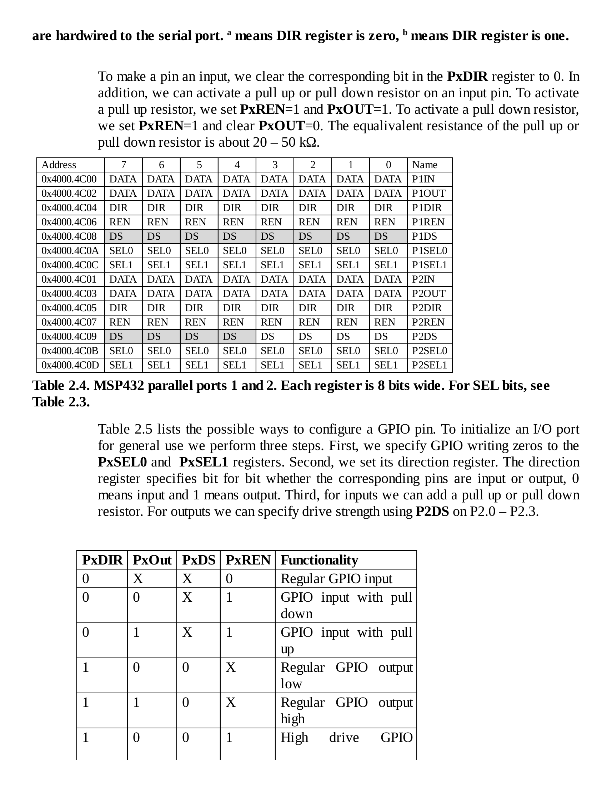
*Description*: Reference table detailing hardware parameters, register bit patterns, performance metrics, or memory configurations for Table 2.3.

> **Table 2.3**


*Description*: Hardware pinout and board interface diagram mapping microcontroller pins, BoosterPack headers, switches, LEDs, and physical connectors for Table 2.5: lists the possible ways to configure a GPIO pin. To initialize an I/O port.

> **Table 2.5: lists the possible ways to configure a GPIO pin. To initialize an I/O port**

for general use we perform three steps. First, we specify GPIO writing zeros to the
PxSEL0 and  PxSEL1 registers. Second, we set its direction register. The direction
register specifies bit for bit whether the corresponding pins are input or output, 0
means input and 1 means output. Third, for inputs we can add a pull up or pull down
resistor. For outputs we can specify drive strength using P2DS on P2.0 – P2.3.
PxDIR PxOut PxDS PxREN Functionality
0
X
X
0
Regular GPIO input
0
0
X
1
GPIO input with pull
down
0
1
X
1
GPIO input with pull
up
1
0
0
X
Regular GPIO output
low
1
1
0
X
Regular GPIO output
high
1
0
0
1
High
drive
GPIO


<!-- Page 101 -->
### [PDF Page 101]

output low
1
1
0
1
High
drive
GPIO
output high

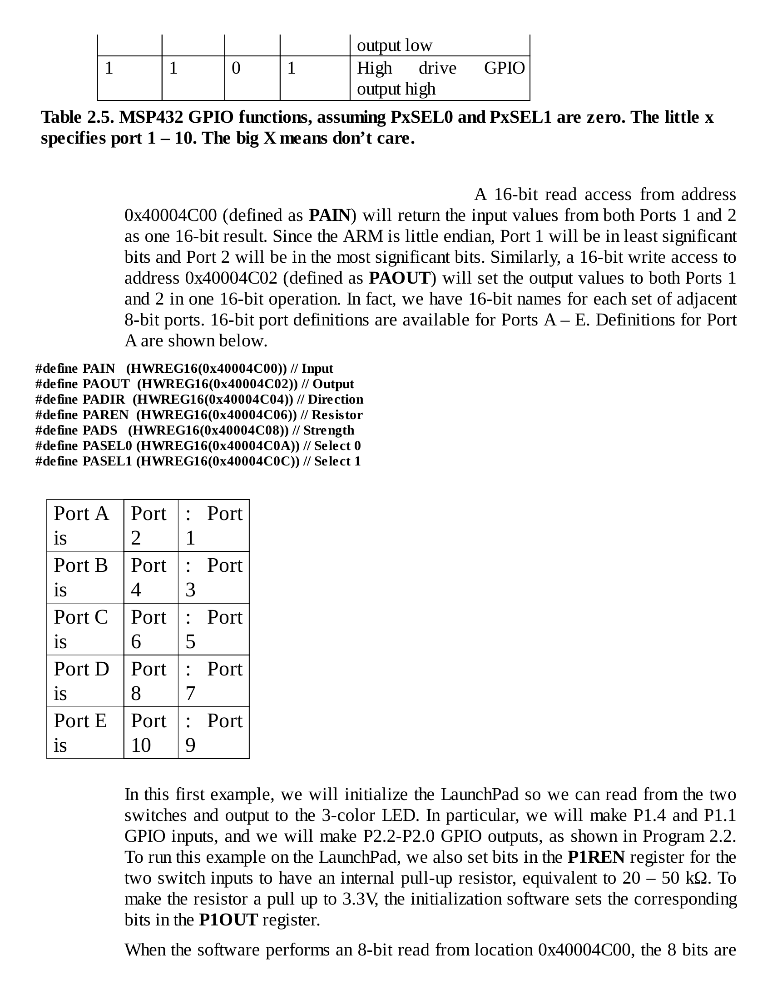
*Description*: Reference table detailing hardware parameters, register bit patterns, performance metrics, or memory configurations for Table 2.5: MSP432 GPIO functions, assuming PxSEL0 and PxSEL1 are zero. The little x.

> **Table 2.5: MSP432 GPIO functions, assuming PxSEL0 and PxSEL1 are zero. The little x**

specifies port 1 – 10. The big X means don’t care.
A 16-bit read access from address
0x40004C00 (defined as PAIN) will return the input values from both Ports 1 and 2
as one 16-bit result. Since the ARM is little endian, Port 1 will be in least significant
bits and Port 2 will be in the most significant bits. Similarly, a 16-bit write access to
address 0x40004C02 (defined as PAOUT) will set the output values to both Ports 1

```assembly
and 2 in one 16-bit operation. In fact, we have 16-bit names for each set of adjacent
```

8-bit ports. 16-bit port definitions are available for Ports A – E. Definitions for Port
A are shown below.
#define PAIN   (HWREG16(0x40004C00)) // Input
#define PAOUT  (HWREG16(0x40004C02)) // Output
#define PADIR  (HWREG16(0x40004C04)) // Direction
#define PAREN  (HWREG16(0x40004C06)) // Resistor
#define PADS   (HWREG16(0x40004C08)) // Strength
#define PASEL0 (HWREG16(0x40004C0A)) // Select 0
#define PASEL1 (HWREG16(0x40004C0C)) // Select 1
Port A
is
Port
2
:   Port
1
Port B
is
Port
4
:   Port
3
Port C
is
Port
6
:   Port
5
Port D
is
Port
8
:   Port
7
Port E
is
Port
10
:   Port
9
In this first example, we will initialize the LaunchPad so we can read from the two
switches and output to the 3-color LED. In particular, we will make P1.4 and P1.1
GPIO inputs, and we will make P2.2-P2.0 GPIO outputs, as shown in Program 2.2.
To run this example on the LaunchPad, we also set bits in the P1REN register for the
two switch inputs to have an internal pull-up resistor, equivalent to 20 – 50 kΩ. To
make the resistor a pull up to 3.3V, the initialization software sets the corresponding
bits in the P1OUT register.
When the software performs an 8-bit read from location 0x40004C00, the 8 bits are


<!-- Page 102 -->
### [PDF Page 102]

returned with the values currently on Port 1. When reading an I/O port, the input pins
report the high/low state currently on the input, and the output pins show the value
last written to the port. The function Port1_Input  will read from all eight Port 1
pins, and return a value depending on the status of the pins at the time of the read.
When writing to an I/O port, the input pins are not affected, and the output pins are
changed to the value written to the port. That value remains until written again. The
function Port2_Output will write new values to the output pins. The #include will
define symbolic names for all the I/O ports for that microcontroller.
The msp432p401r.h  file comes with the compiler installation. Use the proper one
for your microcontroller. Program 2.2 writes all bits of the port registers, and this is
an inappropriate method of I/O programming. In general, it is better to set/clear bits
on an individual basis.
Observation: High drive strength (DS=1) is only available on P2.0 P2.1 P2.2

```assembly
and P2.3. Setting DS=1 does not make the current 20 mA, rather makes it possible
```

for the pin to drive up to 20 mA if needed.

```c
void Port1_Init(void){
P1SEL0 &= ~0x12;
P1SEL1 &= ~0x12;    // 1) configure P1.4 and P1.1 as GPIO
P1DIR &= ~0x12;     // 2) make P1.4 and P1.1 in
P1REN |= 0x12;      // 3) enable pull resistors on P1.4 and P1.1
P1OUT |= 0x12;      //    P1.4 and P1.1 are pull-up
}
uint8_t Port1_Input(void){
return (P1IN&0x12);   // read P1.4,P1.1 inputs
}
void Port2_Init(void){
P2SEL0 &= ~0x07;
P2SEL1 &= ~0x07;    // 1) configure P2.2-P2.0 as GPIO
P2DIR |= 0x07;      // 2) make P2.2-P2.0 out
P2DS |= 0x07;       // 3) activate increased drive strength
P2OUT &= ~0x07;    //    all LEDs off
}
void Port2_Output(uint8_t data){ // write three outputs bits of P2
P2OUT = (P2OUT&0xF8)|data;
}
```


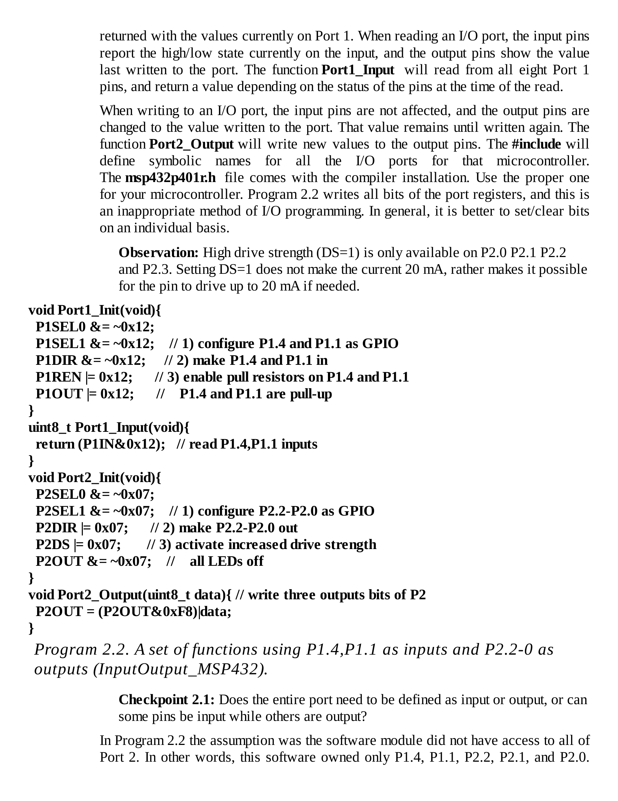
*Description*: Technical schematic and block diagram illustrating circuit operation, signal pathways, and functional behavior for Program 2.2: A set of functions using P1.4,P1.1 as inputs and P2.2-0 as.

> **Program 2.2: A set of functions using P1.4,P1.1 as inputs and P2.2-0 as**

outputs (InputOutput_MSP432).
Checkpoint 2.1: Does the entire port need to be defined as input or output, or can
some pins be input while others are output?
In Program 2.2 the assumption was the software module did not have access to all of
Port 2. In other words, this software owned only P1.4, P1.1, P2.2, P2.1, and P2.0.


<!-- Page 103 -->
### [PDF Page 103]

Good design practice clearly specifies which pins belong to which software
modules. If two or more software modules access the same port, a conflict will occur
if one module changes modes or output values owned by another module. It is good
software design to write friendly software, which only affects the individual pins as
needed. Friendly software does not change the other bits in a shared register.
Conversely, unfriendly software modifies more bits of a register than it needs to. The
difficulty of unfriendly code is each module will run properly when tested by itself,
but weird bugs result when two or more modules are combined. A read-or-write
sequence can be used to set one or more bits. A read-and-write sequence can be used
to clear one or more bits.
The second method uses the bit-banding. In this example, assume P1.0 is an output
connected to the LED. The regular 8-bit access for P1OUT  is 0x40004C02. For bit-
banding of bit 0 of this address, n=0x4C01 and b =0. The address for this bit will be
0x42000000 + 32*n + 4*b = 0x42000000 + 32*0x4C02 + 4*0 = 0x42098040
In C we can create an I/O port label for just bit 0 of Port 1 output.
#define LEDOUT (*((volatile uint8_t *)(0x42098040)))
With this bit-banded definition, accessing P1.0 is much simpler. Writing a 1 to a bit-
banded address sets that bit, and writing a 0 clears that bit (without affecting the
other 7 bits).
#define LED_On() (LEDOUT = 0x01)
#define LED_Off() (LEDOUT = 0x00)
We can also create bit-banded addresses for the two switches on the LaunchPad.
Reading a bit-banded address returns 0 or 1 depending on if the bit is clear or set.
SW2 is Port 1 bit 4 and SW1 is Port 1 bit 1. The address of P1IN is 0x40004C00.
For bit-banding of this address, n=0x4C00. The aliased addresses for bits 4 and 1
will be
0x42000000 + 32*0x4C00 + 4*4 = 0x42098010
0x42000000 + 32*0x4C00 + 4*1 = 0x42098004
In C we can create I/O port label for SW1 and SW2 input.
#define SW2IN (*((volatile uint8_t *)(0x42098010)))
#define SW1IN (*((volatile uint8_t *)(0x42098004)))
The switches are negative logic. Using SW2IN will return a 1 if P1.4 is 1 (SW2
switch not pressed), and will return a 0 if P1.4 is 0 (SW2 switch pressed).
Using SW1IN  will return a 1 if P1.1 is 1 (SW1 switch not pressed), and will return
a 0 if P1.1 is 0 (SW1 switch pressed).
Bit-banding only works for individual bits. It cannot be used to access more than one
bit at a time. Recall the 3-color LED is interfaced on P2.2 P2.1 and P2.0. There is no
bit-banded address to allow us to set all three bits in one operation. We could use
bit-banding to access the colors on P2.2 P2.1 and P2.0 individually.


<!-- Page 104 -->
### [PDF Page 104]

#define BLUELED  (*((volatile uint8_t *)(0x42098068)))
#define GREENLED (*((volatile uint8_t *)(0x42098064)))
#define REDLED   (*((volatile uint8_t *)(0x42098060)))
To make the LED yellow, we turn on red, turn on green, and turn off blue:
REDLED   = 1;
GREENLED = 1;
BLUELED  = 0;


<!-- Page 105 -->
### [PDF Page 105]

2.2. Interrupts
Another concept we need the reader to have a thorough understanding of is an
Interrupt. An interrupt is a hardware/software triggered software action, see Figure
2.1. In this class we will see three types of interrupts. A software interrupt is
triggered by software. Executing the SVC  (supervisor call) instruction will generate
an interrupt. There is another software interrupt on the Cortex M called PendSV,
which is also triggered by software. We will see a third mechanism for software
interrupt in this chapter where the software executes explicit code to trigger a
SysTick timer interrupt.
The second type of interrupt is a periodic interrupt, which is triggered periodically
by a hardware timer. The MSP432/TM4C microcontrollers have SysTick and Timer
interrupts. The ISR will perform an action we wish to perform on a regular basis.
For example, a data acquisition system needs to read the ADC at a regular rate.
The third type of interrupt is triggered by input/output events. With an input device,
the hardware will request an interrupt when input device has new data. The software
interrupt service routine (ISR) will read from the input device and save (put) the data
into a data structure located in shared memory, see Figure 2.1. When the system
wishes to process the data, it will check the status of the data structure, and if there is
some data it will get it from the data structure located in shared memory.
With an output device, the hardware will request an interrupt when the output device
is idle. The ISR will get data from a data structure located in shared memory, and
then write to the device. When the system wishes to output data, it will check the
status of the data structure, and if there is room in the data structure, software will
write (put) its data.
Interrupts are an important synchronization mechanism in a real-time operating
system because there will be multiple tasks to perform. To achieve real-time
response interrupt-based synchronization serves as an important tool.

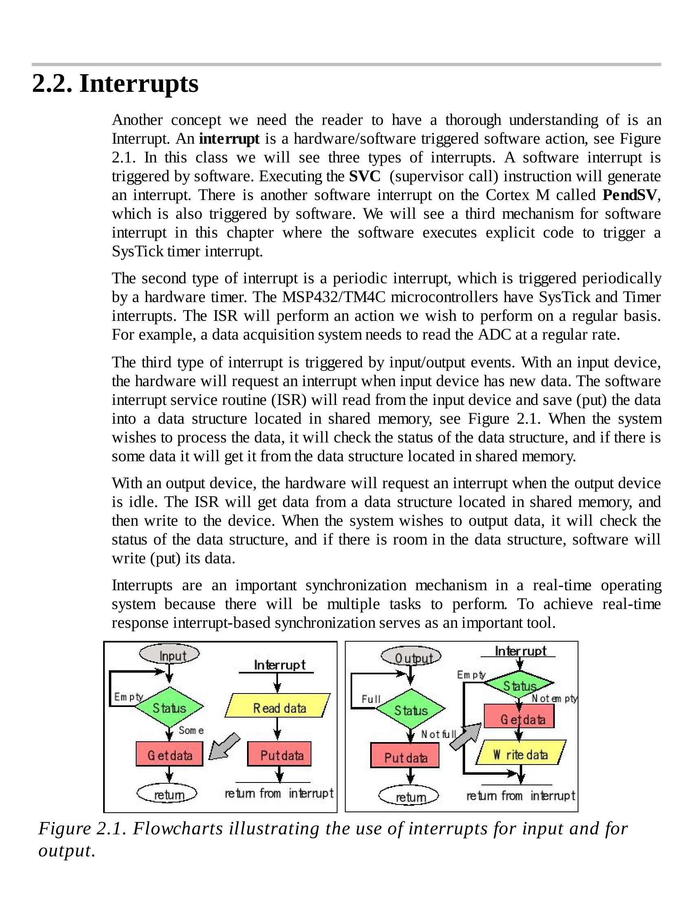
*Description*: Timing waveform and execution flowchart illustrating signal transitions, state machine progression, or algorithm logic for Figure 2.1: Flowcharts illustrating the use of interrupts for input and for.

> **Figure 2.1: Flowcharts illustrating the use of interrupts for input and for**

output.


<!-- Page 106 -->
### [PDF Page 106]

2.2.1. NVIC
On the ARM Cortex-M processor, exceptions include resets, software interrupts and
hardware interrupts. Each exception has an associated 32-bit vector that points to the
memory location where the ISR that handles the exception is located. Vectors are
stored in ROM at the beginning of memory. Program 2.3 shows the first few vectors
as defined in the startup_TM4C123.s file for the TM4C123 and the
startup_msp432.sfile for the MSP432. DCD  is an assembler pseudo-op that defines
a 32-bit constant. ROM location 0x0000.0000 has the initial stack pointer, and
location 0x0000.0004 contains the initial program counter, which is called the reset
vector.  It holds the address of a function called the reset handler, which is the first
thing executed following reset. There are hundreds of possible interrupt sources and
their 32-bit vectors are listed in order starting with location 0x0000.0008. From a
programming perspective, we can attach ISRs to interrupts by writing the ISRs as
regular assembly subroutines or C functions with no input or output parameters and
editing the startup_TM4C123.s or startup_msp432.s file to specify those functions
for the appropriate interrupt. In this class, we will write our ISRs using standard
function names so that the startup files need not be edited. For example, we will
simply name the ISRfor SysTick periodic interrupt as SysTick_Handler . The ISR
for this interrupt is a 32-bit pointer located at ROM address 0x0000.003C. Because
the vectors are in ROM, this linkage is defined at compile time and not at run time.
After the first 16 vectors, each processor will be different so check the data sheet.
EXPORT  __Vectors
__Vectors                             ; address    ISR
DCD     StackMem + Stack      ; 0x00000000 Top of Stack
DCD     Reset_Handler         ; 0x00000004 Reset Handler
DCD     NMI_Handler           ; 0x00000008 NMI Handler
DCD     HardFault_Handler     ; 0x0000000C Hard Fault Handler
DCD     MemManage_Handler     ; 0x00000010 MPU Fault Handler
DCD     BusFault_Handler      ; 0x00000014 Bus Fault Handler
DCD     UsageFault_Handler    ; 0x00000018 Usage Fault Handler
DCD     0                     ; 0x0000001C Reserved
DCD     0                     ; 0x00000020 Reserved
DCD     0                     ; 0x00000024 Reserved
DCD     0                     ; 0x00000028 Reserved
DCD     SVC_Handler           ; 0x0000002C SVCall Handler
DCD     DebugMon_Handler      ; 0x00000030 Debug Monitor Handler
DCD     0                     ; 0x00000034 Reserved
DCD     PendSV_Handler        ; 0x00000038 PendSV Handler
DCD     SysTick_Handler       ; 0x0000003C SysTick Handler

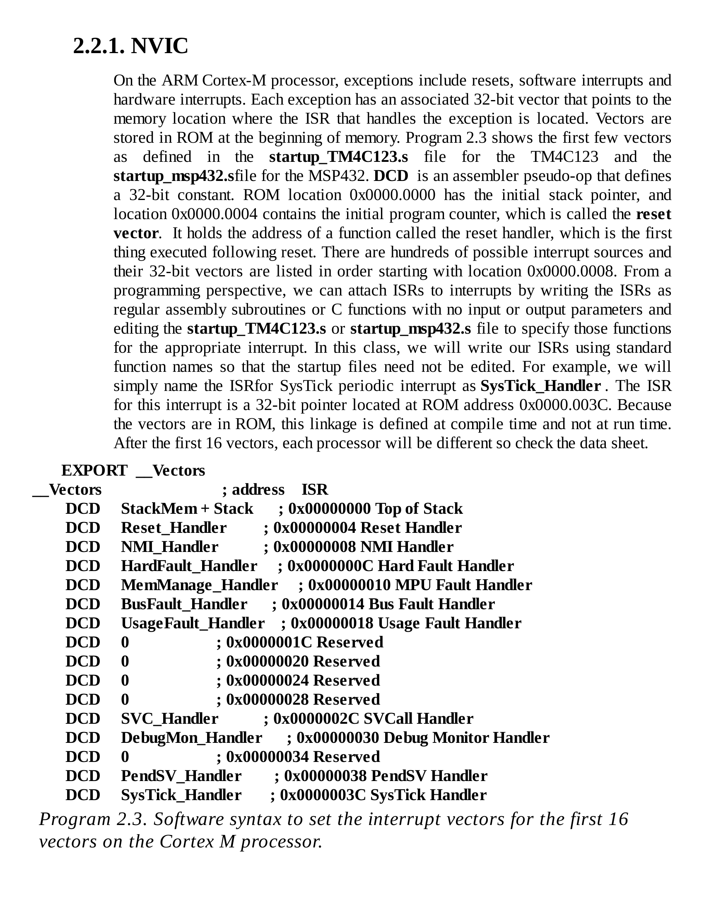
*Description*: Technical schematic and block diagram illustrating circuit operation, signal pathways, and functional behavior for Program 2.3: Software syntax to set the interrupt vectors for the first 16.

> **Program 2.3: Software syntax to set the interrupt vectors for the first 16**

vectors on the Cortex M processor.


<!-- Page 107 -->
### [PDF Page 107]


*Description*: Reference table detailing hardware parameters, register bit patterns, performance metrics, or memory configurations for Table 2.6: lists the interrupt sources we will use on the TM4C123 and Table 2.7.

> **Table 2.6: lists the interrupt sources we will use on the TM4C123 and Table 2.7**

shows similar interrupts on the MSP432. Interrupt numbers 0 to 15 contain the faults,
software interrupts and SysTick; these interrupts will be handled differently from
interrupts 16 to 154.
Vector
address
Number
IRQ
ISR name in Startup.s
NVIC priority
Priority
bits
0x00000038
14
-2
PendSV_Handler
SYS_PRI3
23 – 21
0x0000003C
15
-1
SysTick_Handler
SYS_PRI3
31 – 29
0x000001E0
120
104
WideTimer5A_Handler
NVIC_PRI26_R
7 – 5


*Description*: Reference table detailing hardware parameters, register bit patterns, performance metrics, or memory configurations for Table 2.6: Some of the interrupt vectors for the TM4C (goes to number 154 on the M4)..

> **Table 2.6: Some of the interrupt vectors for the TM4C (goes to number 154 on the M4).**

Vector
address
Number
IRQ
ISR name in Startup.s
NVIC priority
Priority
bits
0x00000038
14
-2
PendSV_Handler
SYS_PRI3
23 – 21
0x0000003C
15
-1
SysTick_Handler
SYS_PRI3
31 – 29
0x000000A4
41
25
T32_INT1_IRQHandler
NVIC_IPR6
15 – 13


*Description*: Reference table detailing hardware parameters, register bit patterns, performance metrics, or memory configurations for Table 2.7: Some of the interrupt vectors for the MSP432 (goes to number 154 on the M4)..

> **Table 2.7: Some of the interrupt vectors for the MSP432 (goes to number 154 on the M4).**

Interrupts on the Cortex-M are controlled by the Nested Vectored Interrupt Controller
(NVIC). To activate an interrupt source we need to set its priority and enable that
source in the NVIC. SysTick interrupt only requires arming the SysTick module for
interrupts and enabling interrupts on the processor (I=0 in the PRIMASK). Other
interrupts require additional initialization. In addition to arming and enabling, we
will set bit 8 in the NVIC_EN3_R to activate WideTimer5A interrupts on the
TM4C123. Similarly, we will set bit 25 in the NVIC_ISER0 to activate T32_INT1
interrupts on the MSP432. This activation is in addition to the arm and enable steps.
Each interrupt source has an 8-bit priority field. However, on the TM4C123 and
MSP432 microcontrollers, only the top three bits of the 8-bit field are used. This
allows us to specify the interrupt priority level for each device from 0 to 7, with 0
being the highest priority. The priority of the SysTick interrupt is found in bits 31 –
29 of the SYS_PRI3  register. Other interrupts have corresponding priority registers.
The interrupt number (number column in Tables 2.6 and 2.7) is loaded into the IPSR
register when an interrupt is being serviced. The servicing of interrupts does not set
the I bit in the PRIMASK, so a higher priority interrupt can suspend the execution of
a lower priority ISR. If a request of equal or lower priority is generated while an
ISR is being executed, that request is postponed until the ISR is completed. In
particular, those devices that need prompt service should be given high priority.


*Description*: Technical schematic and block diagram illustrating circuit operation, signal pathways, and functional behavior for Figure 2.2: shows the context switch from executing in the foreground to running a.

> **Figure 2.2: shows the context switch from executing in the foreground to running a**

SysTick periodic interrupt. The I bit in the PRIMASK is 0 signifying interrupts are
enabled. Initially, the interrupt number (ISRNUM) in the IPSR register is 0, meaning
we are running in Thread mode (i.e., the main program, and not an ISR). Handler
mode is signified by a nonzero value in IPSR. When BASEPRI register is zero, all
interrupts are allowed and the BASEPRI register is not active.


<!-- Page 108 -->
### [PDF Page 108]

When a SysTick interrupt is triggered, the current instruction is finished. (a) Eight
registers are pushed on the stack with R0 on top. These registers are pushed onto the
stack using whichever stack pointer is active: either the MSP or PSP. (b) The vector
address is loaded into the PC (“Vector address” column in Tables 2.6 and 2.7). (c)
The IPSR register is set to 15 (“Number” column in Tables 2.6 and 2.7) (d) The top
24 bits of LR are set to 0xFFFFFF, signifying the processor is executing an ISR. The
bottom eight bits specify how to return from interrupt.
0xE1 Return to Handler mode MSP (using floating point state)
0xE9 Return to Thread mode MSP (using floating point state)
0xED Return to Thread mode PSP (using floating point state)
0xF1 Return to Handler mode MSP
0xF9 Return to Thread mode MSP  ← we will mostly be using this
one
0xFD Return to Thread mode PSP
After pushing the registers, the processor always uses the main stack pointer (MSP)
during the execution of the ISR. Events b, c, and d can occur simultaneously.

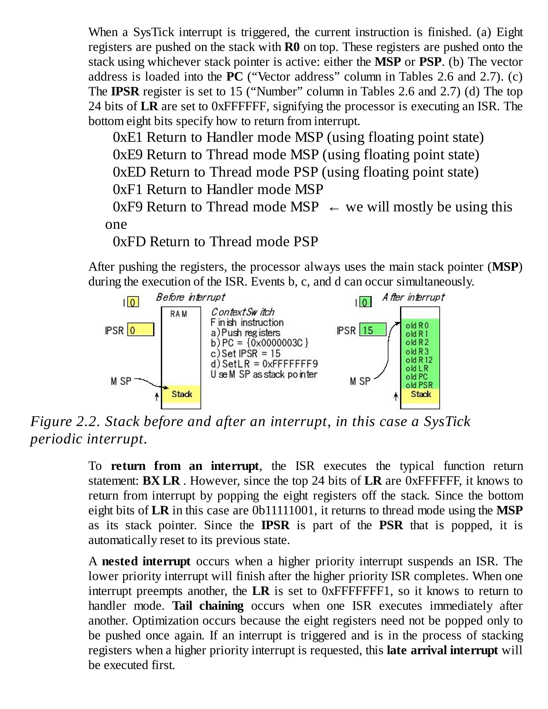
*Description*: Register layout and memory mapping diagram specifying bit fields, stack pointer allocations, and memory address boundaries for Figure 2.2: Stack before and after an interrupt, in this case a SysTick.

> **Figure 2.2: Stack before and after an interrupt, in this case a SysTick**

periodic interrupt.
To return from an interrupt, the ISR executes the typical function return
statement: BX LR . However, since the top 24 bits of LR are 0xFFFFFF, it knows to
return from interrupt by popping the eight registers off the stack. Since the bottom
eight bits of LR in this case are 0b11111001, it returns to thread mode using the MSP
as its stack pointer. Since the IPSR is part of the PSR that is popped, it is
automatically reset to its previous state.
A nested interrupt occurs when a higher priority interrupt suspends an ISR. The
lower priority interrupt will finish after the higher priority ISR completes. When one
interrupt preempts another, the LR is set to 0xFFFFFFF1, so it knows to return to
handler mode. Tail chaining occurs when one ISR executes immediately after
another. Optimization occurs because the eight registers need not be popped only to
be pushed once again. If an interrupt is triggered and is in the process of stacking
registers when a higher priority interrupt is requested, this late arrival interrupt will
be executed first.


<!-- Page 109 -->
### [PDF Page 109]

On the Cortex-M4, if an interrupt occurs while in the floating point state, an
additional 18 words are pushed on the stack. These 18 words will save the state of
the floating point processor. Bits 7-4 of the LR will be 0b1110 (0xE), signifying it
was interrupted during a floating point state. When the ISR returns, it knows to pull
these 18 words off the stack and restore the state of the floating point processor. We
will not use floating point in this class.
Priority determines the order of service when two or more requests are made
simultaneously. Priority also allows a higher priority request to suspend a lower
priority request currently being processed. Usually, if two requests have the same
priority, we do not allow them to interrupt each other. NVIC assigns a priority level
to each interrupt trigger. This mechanism allows a higher priority trigger to interrupt
the ISR of a lower priority request. Conversely, if a lower priority request occurs
while running an ISR of a higher priority trigger, it will be postponed until the higher
priority service is complete.


*Description*: Technical schematic and block diagram illustrating circuit operation, signal pathways, and functional behavior for Program 2.4: shows two functions that can be used to enable and disable interrupts..

> **Program 2.4: shows two functions that can be used to enable and disable interrupts.**

DisableInterrupts

```assembly
CPSID  I
BX     LR
```

EnableInterrupts

```assembly
CPSIE  I
BX     LR
```


*Description*: Technical schematic and block diagram illustrating circuit operation, signal pathways, and functional behavior for Program 2.4: Assembly functions needed for interrupt enabling and.

> **Program 2.4: Assembly functions needed for interrupt enabling and**

disabling.
2.2.2. SysTick periodic interrupts
The SysTick Timer is a core device on the Cortex M architecture, which is most
commonly used as a periodic timer. When used as a periodic timer one can setup the
countdown to zero event to cause an interrupt. By setting up an initial reload value
the timer is made to periodically interrupt at a predetermined rate decided by the
reload value. Periodic timers as an interfacing technique are required for data
acquisition and control systems, because software servicing must be performed at
accurate time intervals. For a data acquisition system, it is important to establish an
accurate sampling rate. The time in between ADC samples must be equal (and
known) in order for the digital signal processing to function properly. Similarly, for
microcontroller-based control systems, it is important to maintain both the input rate
of the sensors and the output rate of the actuators. Periodic events are so important
that most microcontrollers have multiple ways to generate periodic interrupts. In this
book our operating system will use periodic interrupts to schedule threads.
Assume we have a 1-ms periodic interrupt. This means the interrupt service routine
(ISR) is triggered to run 1000 times per second. Let Count be a global variable that


<!-- Page 110 -->
### [PDF Page 110]

is incremented inside the ISR. Figure 2.3 shows how to use the interrupt to run Task 1
every N ms and run Task 2 every M ms.

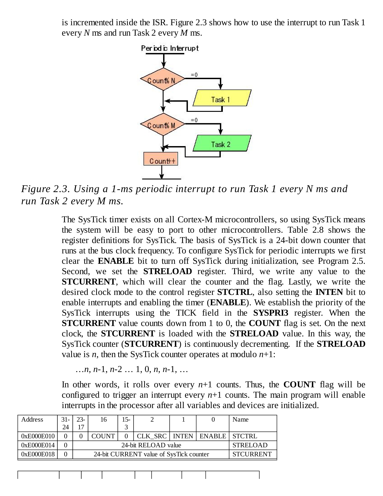
*Description*: Technical schematic and block diagram illustrating circuit operation, signal pathways, and functional behavior for Figure 2.3: Using a 1-ms periodic interrupt to run Task 1 every N ms and.

> **Figure 2.3: Using a 1-ms periodic interrupt to run Task 1 every N ms and**

run Task 2 every M ms.
The SysTick timer exists on all Cortex-M microcontrollers, so using SysTick means
the system will be easy to port to other microcontrollers. Table 2.8 shows the
register definitions for SysTick. The basis of SysTick is a 24-bit down counter that
runs at the bus clock frequency. To configure SysTick for periodic interrupts we first
clear the ENABLE bit to turn off SysTick during initialization, see Program 2.5.
Second, we set the STRELOAD register. Third, we write any value to the
STCURRENT, which will clear the counter and the flag. Lastly, we write the
desired clock mode to the control register STCTRL, also setting the INTEN bit to
enable interrupts and enabling the timer (ENABLE). We establish the priority of the
SysTick interrupts using the TICK field in the SYSPRI3 register. When the
STCURRENT value counts down from 1 to 0, the COUNT flag is set. On the next
clock, the STCURRENT is loaded with the STRELOAD value. In this way, the
SysTick counter (STCURRENT) is continuously decrementing.  If the STRELOAD
value is n, then the SysTick counter operates at modulo n+1:
…n, n-1, n-2 … 1, 0, n, n-1, …
In other words, it rolls over every n+1 counts. Thus, the COUNT flag will be
configured to trigger an interrupt every n+1 counts. The main program will enable
interrupts in the processor after all variables and devices are initialized.
Address
31-
24
23-
17
16
15-
3
2
1
0
Name
0xE000E010
0
0
COUNT
0
CLK_SRC
INTEN
ENABLE
STCTRL
0xE000E014
0
24-bit RELOAD value
STRELOAD
0xE000E018
0
24-bit CURRENT value of SysTick counter
STCURRENT


<!-- Page 111 -->
### [PDF Page 111]

Address
31-29
28-24
23-21
20-
8
7-5
4-0
Name
0xE000ED20
TICK
0
PENDSV
0
DEBUG
0
SYSPRI3

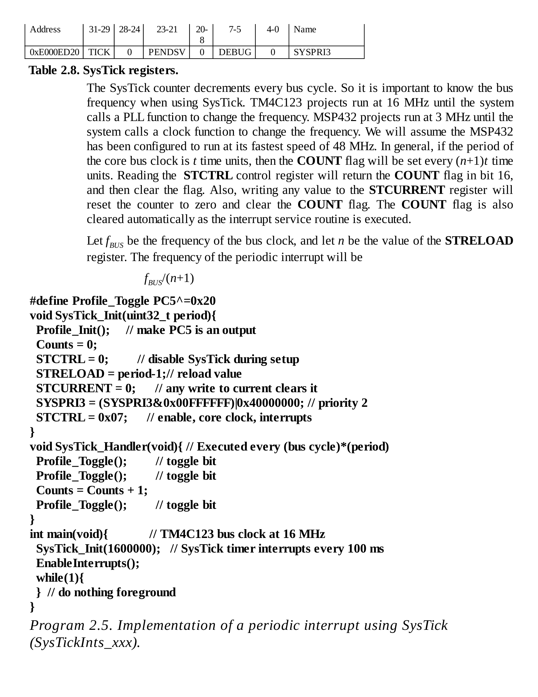
*Description*: Register layout and memory mapping diagram specifying bit fields, stack pointer allocations, and memory address boundaries for Table 2.8: SysTick registers..

> **Table 2.8: SysTick registers.**

The SysTick counter decrements every bus cycle. So it is important to know the bus
frequency when using SysTick. TM4C123 projects run at 16 MHz until the system
calls a PLL function to change the frequency. MSP432 projects run at 3 MHz until the
system calls a clock function to change the frequency. We will assume the MSP432
has been configured to run at its fastest speed of 48 MHz. In general, if the period of
the core bus clock is t time units, then the COUNT flag will be set every (n+1)t time
units. Reading the  STCTRL control register will return the COUNT flag in bit 16,

```assembly
and then clear the flag. Also, writing any value to the STCURRENT register will
```

reset the counter to zero and clear the COUNT flag. The COUNT flag is also
cleared automatically as the interrupt service routine is executed.
Let fBUS be the frequency of the bus clock, and let n be the value of the STRELOAD
register. The frequency of the periodic interrupt will be
fBUS/(n+1)
#define Profile_Toggle PC5^=0x20

```c
void SysTick_Init(uint32_t period){
Profile_Init();     // make PC5 is an output
Counts = 0;
STCTRL = 0;         // disable SysTick during setup
STRELOAD = period-1;// reload value
STCURRENT = 0;      // any write to current clears it
SYSPRI3 = (SYSPRI3&0x00FFFFFF)|0x40000000; // priority 2
STCTRL = 0x07;      // enable, core clock, interrupts
}
void SysTick_Handler(void){ // Executed every (bus cycle)*(period)
Profile_Toggle();         // toggle bit
Profile_Toggle();         // toggle bit
Counts = Counts + 1;
Profile_Toggle();         // toggle bit
}
int main(void){             // TM4C123 bus clock at 16 MHz
SysTick_Init(1600000);   // SysTick timer interrupts every 100 ms
EnableInterrupts();
while(1){
}  // do nothing foreground
}
```


*Description*: Technical schematic and block diagram illustrating circuit operation, signal pathways, and functional behavior for Program 2.5: Implementation of a periodic interrupt using SysTick.

> **Program 2.5: Implementation of a periodic interrupt using SysTick**

(SysTickInts_xxx).


<!-- Page 112 -->
### [PDF Page 112]

Checkpoint 2.2: If the MSP432 bus clock is 48 MHz, what reload value yields a
100 Hz (10ms) periodic interrupt?
2.2.3. Periodic timer interrupts
Because time is a precious commodity for embedded systems there is a rich set of
features available to manage time. If you connect a digital input to the
microcontroller you could measure its
Period, time from one edge to the next
Frequency, number of edges in a fixed amount of time
Pulse width, time the signal is high, or time the signal is low
If there are multiple digital inputs, then you can measure more complicated
parameters such as frequency difference, period difference or phase.
Alternately, you can create a digital output and have the software set its
Period
Frequency
Duty cycle (pulse-width modulation)
If there are multiple digital outputs, then you can create more complicated patterns
that are used in stepper motor and brushless DC motor controllers. For examples of
projects that manage time on the TM4C123 see examples at
http://users.ece.utexas.edu/~valvano/arm/#Timer
http://edx-org-
utaustinx.s3.amazonaws.com/UT601x/ValvanoWareTM4C123.zip
For all the example projects on the TM4C123/MSP432 download and unzip these
projects:
http://edx-org-utaustinx.s3.amazonaws.com/UT601x/ValvanoWare.zip
However, in this section, we present the basic principles needed to create periodic
interrupts using the timer. We begin by presenting five hardware components needed
as shown in Figure 2.4.

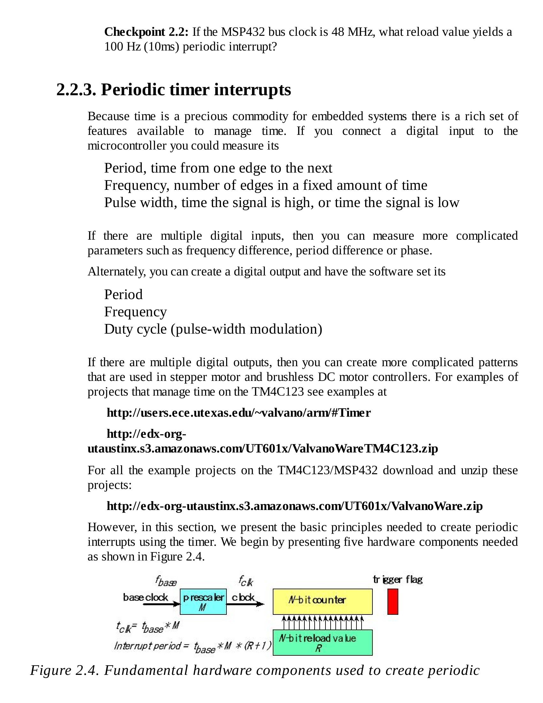
*Description*: Architectural block diagram detailing logic modules, memory buses, internal registers, and hardware interconnections for Figure 2.4: Fundamental hardware components used to create periodic.

> **Figure 2.4: Fundamental hardware components used to create periodic**


<!-- Page 113 -->
### [PDF Page 113]

interrupts.
The central component for creating periodic interrupts is a hardware counter. The
counter may be 16, 24, 32, 48, or 64 bits wide. Let N be the number of bits in the
counter. When creating periodic interrupts, it doesn’t actually matter if the module
counts up or counts down. However, most of the software used in this class will
configure the counter to decrement.
Just like SysTick, as the counter counts down to 0, it sets a trigger flag and reloads
the counter with a new value. The second component will be the reload value, which
is the N-bit value loaded into the counter when it rolls over. Typically, the reload
value is a constant set once by the software during initialization. Let R be this
constant value.
The third component is the trigger flag, which is set when the counter reaches 0.
This flag will be armed to request an interrupt. Software in the ISR will execute code
to acknowledge or clear this flag.
The fourth component will be the base clock with which we control the entire
hardware system. On the TM4C123, we will select the 80-MHz system clock. On the
MSP432, we will select the 12-MHz SMCLK. In both cases, these clocks are
derived from the crystal; hence timing will be both accurate and stable. Let fbase be
the frequency of the base clock (80 MHz or 12 MHz) and tbase be the period of this
clock (12.5 ns or about 83.33 ns).
The fifth component will be a prescaler, which sits between the base clock and the
clock used to decrement the counter. Most systems create the prescaler using a
modulo-M counter, where M is greater than or equal to 1. This way, the frequency

```assembly
and period of the clock used to decrement the counter will be
fclk = fbase /M
tclk = tbase *M
```

Software can configure the prescaler to slow down the counting. However, the
interrupt period will be an integer multiple of tclk. In addition, the interrupt period
must be less than 2N
* tclk. Thus, the smaller the prescale M is, the finer control the
software has in selecting the interrupt period. On the other hand, the larger prescale
M is, the longer the interrupt could be. Thus, the prescaler allows the software to
control the tradeoff between maximum interrupt period and the fine-tuning selection
of the interrupt period.
Because the counter goes from the reload value down to 0, and then back to the
reload value, an interrupt will be triggered every R+1 counts. Thus the interrupt
period, P, will be
P = tbase *M * (R + 1)
Solving this equation for R, if we wish to create an interrupt with period P, we make
R = (P /(tbase *M )) – 1


<!-- Page 114 -->
### [PDF Page 114]

Remember R must be an integer less than 2N. Most timers have a limited choice for
the prescale M. Luckily, most microcontrollers have a larger number of timers. The
TM4C123 has six 32-bit timers and six 64-bit timers. The MSP432 has four 16-bit
timers and two 32-bit timers. The board support package, presented in the next
section, provides support for two independent periodic interrupts. Initialization
software follows these steps.
0) Activate the base clock for the timer
1) Disable timer during initialization
2) Set the timer mode to continuous down counting with automatic
reload
3) Set the reload value, R
4) Set the prescale, M
5) Arm the trigger flag in the timer
6) Arm the timer in the NVIC
7) Set the priority in the NVIC
8) Clear trigger flag
9) Enable timer after timer is completely configured
10) Enable interrupts (I=0), typically done after all initializations are
complete
For more details on the timers for the TM4C123 or MSP432, see the corresponding
Volume 2. However, we present one simple solution that executes a user task at a
periodic rate with units of µs.  We will generate a periodic interrupt and call the user
task from the ISR. Assuming an 80 MHz bus clock, we disable the prescale, meaning
the timer counts every 12.5ns. To define the user task, we will create a private global
variable containing a pointer to the user’s function. We will set the variable during
initialization and call that function at run time. Another name for a dynamically set
function pointer is a hook. The maximum possible value for period  is 12.5ns*232,
which is about 53 seconds. Simple solutions for the TM4C and MSP432 are shown
in Program 2.6. You will find many more on the book web site.
void (*PeriodicTask)(void);  // user function

```c
void Timer0B_Init(void(*task)(void), uint32_t period){
SYSCTL_RCGCTIMER_R |= 0x0001;    // 0) activate timer0
PeriodicTask = task;             // user function
TIMER0_CTL_R &= ~0x00000100;     // 1) disable timer0B during setup
TIMER0_CFG_R = 0x00000000;       // 2) configure for 32-bit timer mode
TIMER0_TBMR_R = 0x00000002;      //   configure for periodic mode
TIMER0_TBILR_R = period-1;       // 3) reload value
TIMER0_TBPR_R = 0;              // 4) no prescale, 12.5ns clock
TIMER0_IMR_R |= 0x00000100;      // 5) arm timeout interrupt
NVIC_EN0_R = (1<<20);          // 6) enable interrupt 20 in NVIC
```


<!-- Page 115 -->
### [PDF Page 115]

NVIC_PRI5_R = (NVIC_PRI5_R&0xFFFFFF00)|0x00000040; // 7) priority 2
TIMER0_ICR_R = 0x00000100;       // 8) clear timer0B timeout flag
TIMER0_CTL_R |= 0x00000100;      // 9) enable timer0B
}

```c
void Timer0B_Handler(void){
TIMER0_ICR_R = 0x00000100;       // acknowledge timer0B timeout
(*PeriodicTask)();               // execute user task
}
```


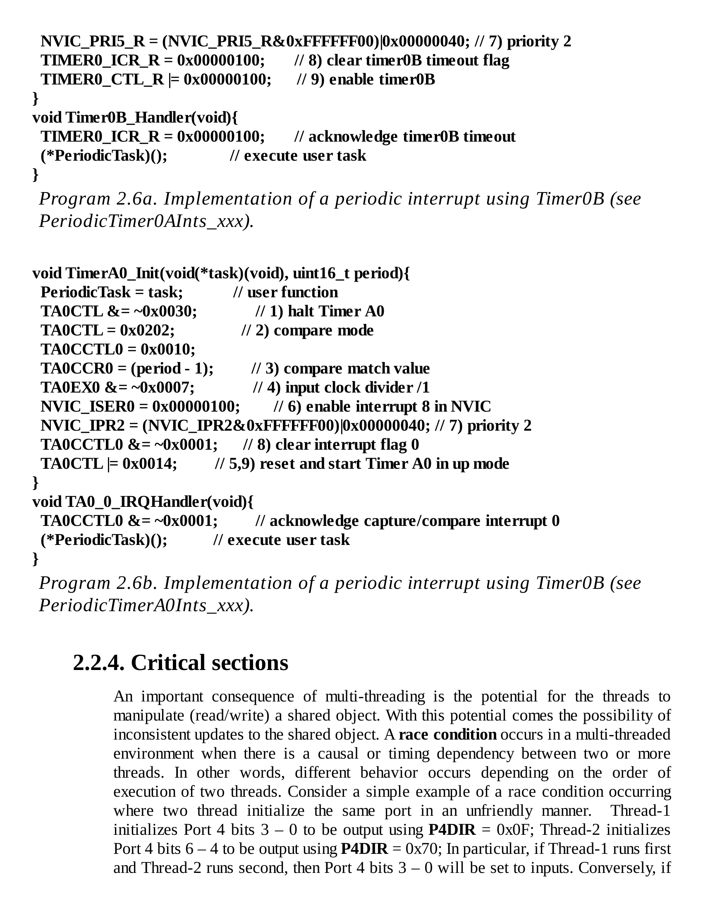
*Description*: Technical schematic and block diagram illustrating circuit operation, signal pathways, and functional behavior for Program 2.6: a. Implementation of a periodic interrupt using Timer0B (see.

> **Program 2.6: a. Implementation of a periodic interrupt using Timer0B (see**

PeriodicTimer0AInts_xxx).

```c
void TimerA0_Init(void(*task)(void), uint16_t period){
PeriodicTask = task;            // user function
TA0CTL &= ~0x0030;              // 1) halt Timer A0
TA0CTL = 0x0202;                // 2) compare mode
TA0CCTL0 = 0x0010;
TA0CCR0 = (period - 1);         // 3) compare match value
TA0EX0 &= ~0x0007;              // 4) input clock divider /1
NVIC_ISER0 = 0x00000100;        // 6) enable interrupt 8 in NVIC
NVIC_IPR2 = (NVIC_IPR2&0xFFFFFF00)|0x00000040; // 7) priority 2
TA0CCTL0 &= ~0x0001;      // 8) clear interrupt flag 0
TA0CTL |= 0x0014;         // 5,9) reset and start Timer A0 in up mode
}
void TA0_0_IRQHandler(void){
TA0CCTL0 &= ~0x0001;         // acknowledge capture/compare interrupt 0
(*PeriodicTask)();           // execute user task
}
```


*Description*: Technical schematic and block diagram illustrating circuit operation, signal pathways, and functional behavior for Program 2.6: b. Implementation of a periodic interrupt using Timer0B (see.

> **Program 2.6: b. Implementation of a periodic interrupt using Timer0B (see**

PeriodicTimerA0Ints_xxx).
2.2.4. Critical sections
An important consequence of multi-threading is the potential for the threads to
manipulate (read/write) a shared object. With this potential comes the possibility of
inconsistent updates to the shared object. A race condition occurs in a multi-threaded
environment when there is a causal or timing dependency between two or more
threads. In other words, different behavior occurs depending on the order of
execution of two threads. Consider a simple example of a race condition occurring
where two thread initialize the same port in an unfriendly manner.  Thread-1
initializes Port 4 bits 3 – 0 to be output using P4DIR = 0x0F; Thread-2 initializes
Port 4 bits 6 – 4 to be output using P4DIR = 0x70; In particular, if Thread-1 runs first

```assembly
and Thread-2 runs second, then Port 4 bits 3 – 0 will be set to inputs. Conversely, if
```


<!-- Page 116 -->
### [PDF Page 116]

Thread-2 runs first and Thread-1 runs second, then Port 4 bits 6 – 4 will be set to
inputs. This is a race condition caused by unfriendly code. The solution to this
problem is to write the two initializations in a friendly manner, and make both
initializations atomic.
In a second example of a race condition, assume two threads are trying to get data
from the same input device. Both call the input function to receive data from the input
device. When data arrives at the input, the thread that executes first will capture the
data.
In general, if two threads access the same global memory and one of the accesses is a
write, then there is a causal dependency between the execution of the threads. Such
dependencies when not properly handled cause unpredictable behavior where the
execution order may affect the outcome. Such scenarios are referred to as race
conditions. While shared global variables are important in multithreaded systems
because they are required to pass data between threads, they result in complex
behavior (and hard to find bugs). Therefore, a programmer must pay careful attention
to avoid race conditions.
A program segment is reentrant if it can be concurrently executed by two (or more)
threads. Note that, to run concurrently means both threads are ready to run though
only one thread is currently running. To implement reentrant software, we place
variables in registers or on the stack, and avoid storing into global memory
variables. When writing in assembly, we use registers, or the stack for parameter
passing to create reentrant subroutines. Typically, each thread will have its own set
of registers and stack. A non-reentrant subroutine will have a section of code called a
vulnerable window or critical section. A critical section may exist when two
different functions access and modify the same memory-resident data structure. E.g.,
1) One thread calls a non-reentrant function
2) It is executing in the critical section when interrupted by a
second thread
3) The second thread calls the same non-reentrant function.
There are a number of scenarios that can happen next. In the most common scenario,
the second thread is allowed to complete the execution of the function, control is then
returned to the first thread, and the first thread finishes the function. This first
scenario is the usual case with interrupt programming. In the second scenario, the
second thread executes part of the critical section, is interrupted and then re-entered
by a third thread, the third thread finishes, the control is returned to the second thread

```assembly
and it finishes, lastly the control is returned to the first thread and it finishes. This
```

second scenario can happen in interrupt programming if the second interrupt has
higher priority than the first.

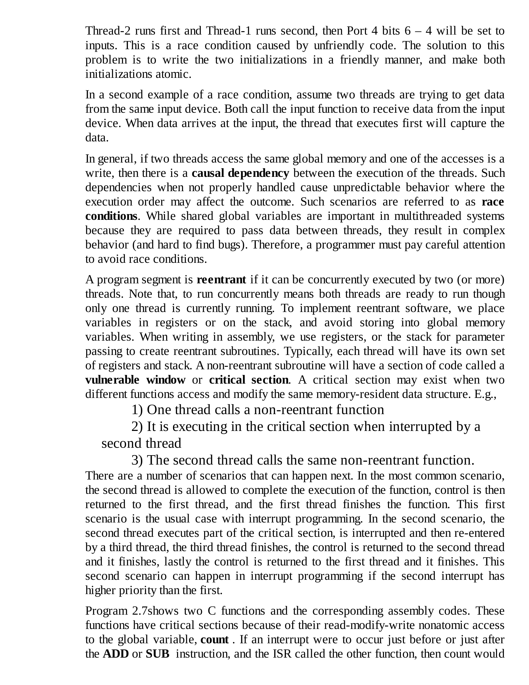
*Description*: Technical schematic and block diagram illustrating circuit operation, signal pathways, and functional behavior for Program 2.7: shows two C functions and the corresponding assembly codes. These.

> **Program 2.7: shows two C functions and the corresponding assembly codes. These**

functions have critical sections because of their read-modify-write nonatomic access
to the global variable, count . If an interrupt were to occur just before or just after
the ADD or SUB  instruction, and the ISR called the other function, then count would


<!-- Page 117 -->
### [PDF Page 117]

be in error.
count    SPACE  4
Producer LDR  r1,[pc,#116] ;
R0= &count

```assembly
LDR  r0,[r1]      ;
R0=count
ADD  r0,r0,#1
STR  r0,[r1]      ; update
BX   lr
```

Consumer
LDR
r1,
[pc,#96]  ; R0= &count

```assembly
LDR  r0,[r1]      ; R0=count
SUB  r0,r0,#1
STR  r0,[r1]      ; update
BX   lr
```

DCD  num

```c
int32_t volatile count;
void Producer(void){
// other stuff
count = count + 1;
// other stuff
}
void Consumer(void){
// other stuff
count = count – 1;
// other stuff
}
```


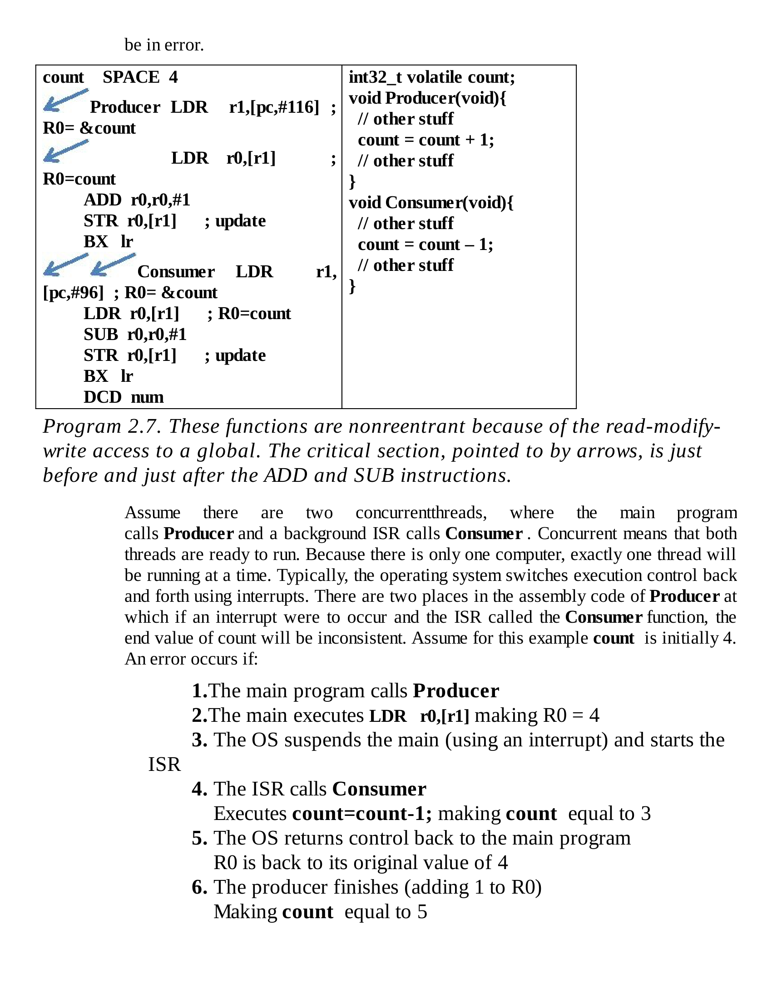
*Description*: Technical schematic and block diagram illustrating circuit operation, signal pathways, and functional behavior for Program 2.7: These functions are nonreentrant because of the read-modify-.

> **Program 2.7: These functions are nonreentrant because of the read-modify-**

write access to a global. The critical section, pointed to by arrows, is just
before and just after the ADD and SUB instructions.
Assume
there
are
two
concurrentthreads,
where
the
main
program
calls Producer and a background ISR calls Consumer . Concurrent means that both
threads are ready to run. Because there is only one computer, exactly one thread will
be running at a time. Typically, the operating system switches execution control back

```assembly
and forth using interrupts. There are two places in the assembly code of Producer at
```

which if an interrupt were to occur and the ISR called the Consumer function, the
end value of count will be inconsistent. Assume for this example count  is initially 4.
An error occurs if:
1.The main program calls Producer
2.The main executes LDR  r0,[r1] making R0 = 4
3. The OS suspends the main (using an interrupt) and starts the
ISR
4. The ISR calls Consumer
Executes count=count-1; making count  equal to 3
5. The OS returns control back to the main program
R0 is back to its original value of 4
6. The producer finishes (adding 1 to R0)
Making count  equal to 5


<!-- Page 118 -->
### [PDF Page 118]

The expected behavior with the producer and consumer executing once is that count
would remain at 4. However, the race condition resulted in an inconsistency
manifesting as a lost consumption. As the reader may have observed, the cause of the
problem is the non-atomicity of the read-modify-write operation involved in reading

```assembly
and writing to the count ( count=count+1 or count=count-1 ) variable. An atomic
```

operation is one that once started is guaranteed to finish. In most computers, once an
assembly instruction has begun, the instruction must be finished before the computer
can process an interrupt. The same is not the case with C instructions which
themselves translate to multiple assembly instructions. In general, nonreentrant code
can be grouped into three categories all involving 1) nonatomic sequences, 2) writes

```assembly
and 3) global variables. We will classify I/O ports as global variables for the
```

consideration of critical sections. We will group registers into the same category as
local variables because each thread will have its own registers and stack.
The first group is the read-modify-write sequence:
1. The software reads the global variable producing a copy of the
data
2. The software modifies the copy (original variable is still
unmodified)
3. The software writes the modification back into the global variable.
In the second group, we have a write followed by read, where the global variable is
used for temporary storage:
1. The software writes to the global variable (only copy of the
information)
2. The software reads from the global variable expecting the original
data to be there.
In the third group, we have a non-atomic multi-step write to a global variable:
1. The software writes part of the new value to a global variable
2. The software writes the rest of the new value to a global variable.
Observation: When considering reentrant software and vulnerable windows we
classify accesses to I/O ports the same as accesses to global variables.
Observation: Sometimes we store temporary information in global variables out
of laziness. This practice is to be discouraged because it wastes memory and may
cause the module to not be reentrant.
Sometimes we can have a critical section between two different software functions
(one function called by one thread, and another function called by a different thread).


<!-- Page 119 -->
### [PDF Page 119]

In addition to above three cases, a non-atomic multi-step read will be critical when
paired with a multi-step write.  For example, assume a data structure has multiple
components (e.g., hours, minutes, and seconds). In this case, the write to the data

```c
structure will be atomic because it occurs in a high priority ISR. The critical section
```

exists in the foreground between steps 1 and 3. In this case, a critical section exists
even though no software has actually been reentered.
Foreground thread
1. The main reads some of the
data
3. The main reads the rest of
the data
Background thread
2. ISR writes to the data

```c
structure
```

In a similar case, a non-atomic multi-step write will be critical when paired with a
multi-step read. Again, assume a data structure has multiple components. In this
case, the read from the data structure will be atomic because it occurs in a high
priority ISR. The critical section exists in the foreground between steps 1 and 3.
Foreground thread
1. The main writes some of the
data
3. The main writes the rest of
the data
Background thread
2. ISR reads from the data

```c
structure
```

When multiple threads are active, it is possible for two threads to be executing the
same program. For example, the system may be running in the foreground and calls a
function. Part way through execution of the function, an interrupt occurs. If the ISR
also calls the same function, two threads are simultaneously executing the function.
If critical sections do exist, we can either eliminate them by removing the access to
the global variable or implement mutual exclusion, which simply means only one
thread at a time is allowed to execute in the critical section. In general, if we can
eliminate the global variables, then the subroutine becomes reentrant. Without global
variables there are no “vulnerable” windows because each thread has its own
registers and stack. Sometimes one must access global memory to implement the
desired function. Remember that all I/O ports are considered global. Furthermore,
global variables are necessary to pass data between threads. Program 2.8 shows two
functions that can be used to implement mutual exclusion.
;*********** StartCritical ************************
; make a copy of previous I bit, disable interrupts
; inputs:  none
voutputs: previous I bit
StartCritical
MRS    R0, PRIMASK  ; save old status

```assembly
CPSID  I            ; mask all (except faults)
```


<!-- Page 120 -->
### [PDF Page 120]


```assembly
BX     LR
;*********** EndCritical ************************
; using the copy of previous I bit, restore I bit to previous value
; inputs:  previous I bit  outputs: none
```

EndCritical
MSR    PRIMASK, R0

```assembly
BX     LR
```


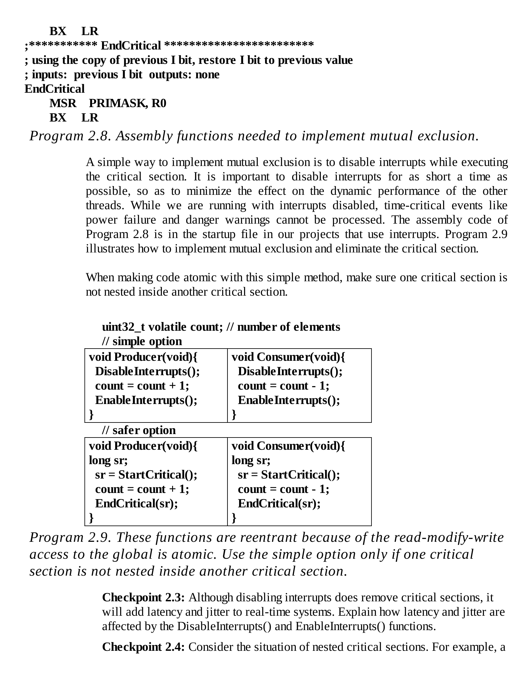
*Description*: Technical schematic and block diagram illustrating circuit operation, signal pathways, and functional behavior for Program 2.8: Assembly functions needed to implement mutual exclusion..

> **Program 2.8: Assembly functions needed to implement mutual exclusion.**

A simple way to implement mutual exclusion is to disable interrupts while executing
the critical section. It is important to disable interrupts for as short a time as
possible, so as to minimize the effect on the dynamic performance of the other
threads. While we are running with interrupts disabled, time-critical events like
power failure and danger warnings cannot be processed. The assembly code of


*Description*: Technical schematic and block diagram illustrating circuit operation, signal pathways, and functional behavior for Program 2.8: is in the startup file in our projects that use interrupts. Program 2.9.

> **Program 2.8: is in the startup file in our projects that use interrupts. Program 2.9**

illustrates how to implement mutual exclusion and eliminate the critical section.
When making code atomic with this simple method, make sure one critical section is
not nested inside another critical section.

```c
uint32_t volatile count; // number of elements
// simple option
void Producer(void){
DisableInterrupts();
count = count + 1;
EnableInterrupts();
}
void Consumer(void){
DisableInterrupts();
count = count - 1;
EnableInterrupts();
}
// safer option
void Producer(void){
long sr;
sr = StartCritical();
count = count + 1;
EndCritical(sr);
}
void Consumer(void){
long sr;
sr = StartCritical();
count = count - 1;
EndCritical(sr);
}
```


*Description*: Technical schematic and block diagram illustrating circuit operation, signal pathways, and functional behavior for Program 2.9: These functions are reentrant because of the read-modify-write.

> **Program 2.9: These functions are reentrant because of the read-modify-write**

access to the global is atomic. Use the simple option only if one critical
section is not nested inside another critical section.
Checkpoint 2.3: Although disabling interrupts does remove critical sections, it
will add latency and jitter to real-time systems. Explain how latency and jitter are
affected by the DisableInterrupts() and EnableInterrupts() functions.
Checkpoint 2.4: Consider the situation of nested critical sections. For example, a


<!-- Page 121 -->
### [PDF Page 121]

function with a critical section calls another function that also has a critical
section. What would happen if you simply added disable interrupts at the
beginning and a re-enable interrupts at the end of each critical section?
2.2.5. Executing periodic tasks
The timers provide a simple way to execute periodic tasks. A periodic task is one
that is performed on a fixed time basis. This interfacing technique is required for data
acquisition and control systems, because software servicing must be performed at
accurate time intervals. For a data acquisition system, it is important to establish an
accurate sampling rate. The time in between ADC samples must be equal (and
known) in order for the digital signal processing to function properly. Similarly, for
microcontroller-based control systems, it is important to maintain both the ADC and
DAC timing. The general purpose timers can also create periodic interrupts. The
operating system will use periodic interrupts to schedule threads.
Another application of periodic interrupts is called “intermittent polling” or
“periodic polling”. Figure 2.5 shows busy wait side by side with periodic polling. In
busy-wait synchronization, the main program polls the I/O devices continuously. With
periodic polling, the I/O devices are polled on a regular basis (established by the
periodic interrupt.) If no device needs service, then the interrupt simply returns. If the
polling period is Δt, then on average the interface latency will be ½Δt, and the worst
case latency will be Δt. Periodic polling is appropriate for low bandwidth devices
where real-time response is not necessary. This method frees the main program from
the I/O tasks.
We use periodic polling if the following two conditions apply:
1. The I/O hardware cannot generate interrupts directly
2. We wish to perform the I/O functions in the background


<!-- Page 122 -->
### [PDF Page 122]


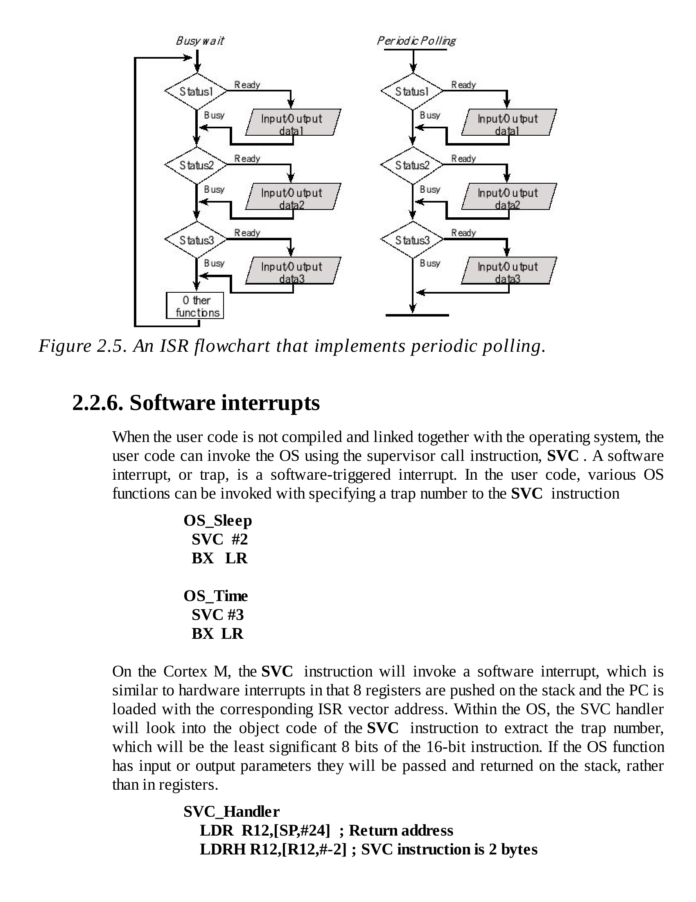
*Description*: Timing waveform and execution flowchart illustrating signal transitions, state machine progression, or algorithm logic for Figure 2.5: An ISR flowchart that implements periodic polling..

> **Figure 2.5: An ISR flowchart that implements periodic polling.**

2.2.6. Software interrupts
When the user code is not compiled and linked together with the operating system, the
user code can invoke the OS using the supervisor call instruction, SVC . A software
interrupt, or trap, is a software-triggered interrupt. In the user code, various OS
functions can be invoked with specifying a trap number to the SVC  instruction
OS_Sleep
SVC  #2

```assembly
BX   LR
```

OS_Time
SVC #3

```assembly
BX  LR
```

On the Cortex M, the SVC  instruction will invoke a software interrupt, which is
similar to hardware interrupts in that 8 registers are pushed on the stack and the PC is
loaded with the corresponding ISR vector address. Within the OS, the SVC handler
will look into the object code of the SVC  instruction to extract the trap number,
which will be the least significant 8 bits of the 16-bit instruction. If the OS function
has input or output parameters they will be passed and returned on the stack, rather
than in registers.
SVC_Handler

```assembly
LDR  R12,[SP,#24]  ; Return address
LDRH R12,[R12,#-2] ; SVC instruction is 2 bytes
```


<!-- Page 123 -->
### [PDF Page 123]


```assembly
BIC  R12,#0xFF00   ; Extract trap number in R12
LDM  SP,{R0-R3}    ; Get any parameters
```

…

```assembly
BL OS_xxx          ; Call OS routine by number
```

…

```assembly
STR  R0,[SP]       ; Store return value
BX   LR            ; Return from exception
```

PendSV is similar to SVC in that the interrupt is invoked by software and not
hardware. To trigger a PendSV interrupt we write a 1 to bit 28 of the interrupt
control register. PendSV does not have a trap number, so we typically use it for just
one dedicated purpose.
INTCTRL = 0x10000000; // trigger PendSV
Similarly, software can trigger a SysTick interrupt by writing a 1 to bit 26.
INTCTRL = 0x04000000; // trigger SysTick


<!-- Page 124 -->
### [PDF Page 124]

2.3. First in First Out (FIFO) Queues
The first in first out (FIFO) queue is an important data structure for I/O programming
because it allows us to pass data from one module to another. One module puts data
into the FIFO and another module gets data out of the FIFO. Programs 2.10 and 2.11
define macros allowing us to create as many FIFOs as we need. These FIFO
implementations are meant for embedded systems without an operating system, hence
they do not include semaphore synchronization.
// macro to create a pointer FIFO
#define AddPointerFifo(NAME,SIZE,TYPE,SUCCESS,FAIL) \
TYPE volatile *NAME ## PutPt;    \
TYPE volatile *NAME ## GetPt;    \
TYPE static NAME ## Fifo [SIZE];        \
void NAME ## Fifo_Init(void){           \
NAME ## PutPt = NAME ## GetPt = &NAME ## Fifo[0]; \
}                                       \
int NAME ## Fifo_Put (TYPE data){       \
TYPE volatile *nextPutPt;             \
nextPutPt = NAME ## PutPt + 1;        \

```c
if(nextPutPt == &NAME ## Fifo[SIZE]){ \
nextPutPt = &NAME ## Fifo[0];       \
}                                     \
if(nextPutPt == NAME ## GetPt ){      \
return(FAIL);                       \
}                                     \
else{                                 \
*( NAME ## PutPt ) = data;          \
NAME ## PutPt = nextPutPt;          \
return(SUCCESS);                    \
}                                     \
}                                       \
int NAME ## Fifo_Get (TYPE *datapt){    \
if( NAME ## PutPt == NAME ## GetPt ){ \
return(FAIL);                       \
}                                     \
*datapt = *( NAME ## GetPt ## ++);    \
if( NAME ## GetPt == &NAME ## Fifo[SIZE]){ \
NAME ## GetPt = &NAME ## Fifo[0];   \
}                                     \
return(SUCCESS);                      \
}
```


<!-- Page 125 -->
### [PDF Page 125]


*Description*: Technical schematic and block diagram illustrating circuit operation, signal pathways, and functional behavior for Program 2.10: Two-pointer macro implementation of a FIFO..

> **Program 2.10: Two-pointer macro implementation of a FIFO.**

To create a 20-element FIFO storing unsigned 16-bit numbers that returns 1 on
success and 0 on failure we invoke
AddPointerFifo(Rx, 20, uint16_t, 1, 0)
creating the three functions RxFifo_Init() , RxFifo_Get() ,and RxFifo_Put() .

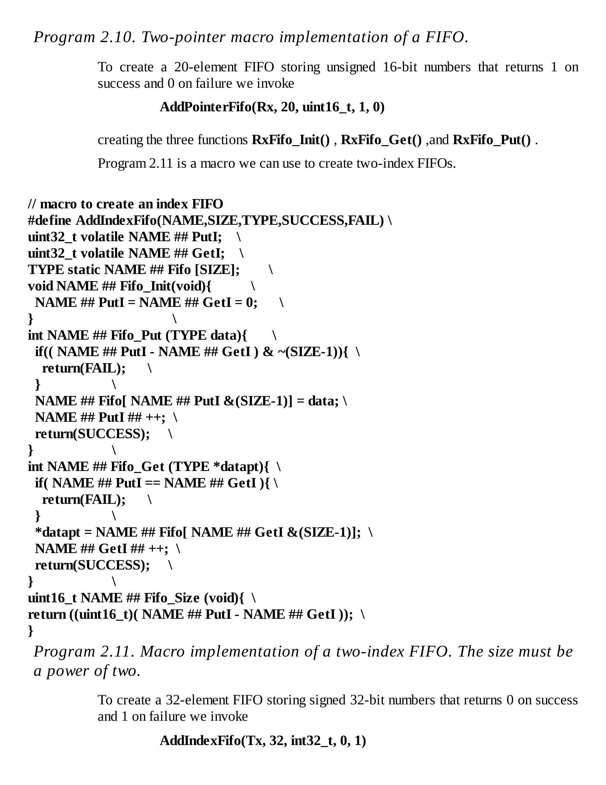
*Description*: Technical schematic and block diagram illustrating circuit operation, signal pathways, and functional behavior for Program 2.11: is a macro we can use to create two-index FIFOs..

> **Program 2.11: is a macro we can use to create two-index FIFOs.**

// macro to create an index FIFO
#define AddIndexFifo(NAME,SIZE,TYPE,SUCCESS,FAIL) \

```c
uint32_t volatile NAME ## PutI;    \
uint32_t volatile NAME ## GetI;    \
TYPE static NAME ## Fifo [SIZE];        \
void NAME ## Fifo_Init(void){           \
NAME ## PutI = NAME ## GetI = 0;      \
}                                       \
int NAME ## Fifo_Put (TYPE data){       \
if(( NAME ## PutI - NAME ## GetI ) & ~(SIZE-1)){  \
return(FAIL);      \
}                    \
NAME ## Fifo[ NAME ## PutI &(SIZE-1)] = data; \
NAME ## PutI ## ++;  \
return(SUCCESS);     \
}                      \
int NAME ## Fifo_Get (TYPE *datapt){  \
if( NAME ## PutI == NAME ## GetI ){ \
return(FAIL);      \
}                    \
*datapt = NAME ## Fifo[ NAME ## GetI &(SIZE-1)];  \
NAME ## GetI ## ++;  \
return(SUCCESS);     \
}                      \
uint16_t NAME ## Fifo_Size (void){  \
return ((uint16_t)( NAME ## PutI - NAME ## GetI ));  \
}
```


*Description*: Technical schematic and block diagram illustrating circuit operation, signal pathways, and functional behavior for Program 2.11: Macro implementation of a two-index FIFO. The size must be.

> **Program 2.11: Macro implementation of a two-index FIFO. The size must be**

a power of two.
To create a 32-element FIFO storing signed 32-bit numbers that returns 0 on success

```assembly
and 1 on failure we invoke
```

AddIndexFifo(Tx, 32, int32_t, 0, 1)


<!-- Page 126 -->
### [PDF Page 126]

creating
the
four
functions
TxFifo_Init() ,
TxFifo_Get() ,
TxFifo_Put() ,and TxFifo_Size() . We can use the following macro to collect
histogram data. Basically, we can add Collect()  to places where data are added to
the FIFO.
#define Collect() (Histogram[TxFifo_Size()]++;)


<!-- Page 127 -->
### [PDF Page 127]

2.4. Edge-triggered Interrupts
2.4.1. Edge-triggered interrupts on the TM4C123
Synchronizing software to hardware events requires the software to recognize when
the hardware changes states from busy to done. Many times the busy to done state
transition is signified by a rising (or falling) edge on a status signal in the hardware.
For these situations, we connect this status signal to an input of the microcontroller,

```assembly
and we use edge-triggered interfacing to configure the interface to set a flag on the
```

rising (or falling) edge of the input. Using edge-triggered interfacing allows the
software to respond quickly to changes in the external world. If we are using busy-
wait synchronization, the software waits for the flag. If we are using interrupt
synchronization, we configure the flag to request an interrupt when set. Each of the
digital I/O pins on the TM4C family can be configured for edge triggering. Table 2.9
lists some the registers available for Port A. For more details, refer to the datasheet
for your specific microcontroller. Any or all of digital I/O pins can be configured as
an edge-triggered input.  When writing C code using these registers, include the
header file for your particular microcontroller (e.g., tm4c123gh6pm.h).
To use any of the features for a digital I/O port, we first enable its clock in the
SYSCTL_RCGCGPIO_R. For each bit we wish to use we must set the
corresponding DEN (Digital Enable) bit. To use a pin as regular digital input or
output, we clear its AFSEL (Alternate Function Select) bit. Setting the AFSEL will
activate the pin’s special function (e.g., UART, I2C, CAN etc.) For regular digital
input/output, we clear DIR (Direction) bits to make them input, and we set DIR bits
to make them output.
Address
7
6
5
4
3
2
1
0
Name
$4000.43FC
DATA
DATA
DATA
DATA
DATA
DATA
DATA
DATA
GPIO_PORTA_DATA_R
$4000.4400
DIR
DIR
DIR
DIR
DIR
DIR
DIR
DIR
GPIO_PORTA_DIR_R
$4000.4404
IS
IS
IS
IS
IS
IS
IS
IS
GPIO_PORTA_IS_R
$4000.4408
IBE
IBE
IBE
IBE
IBE
IBE
IBE
IBE
GPIO_PORTA_IBE_R
$4000.440C
IEV
IEV
IEV
IEV
IEV
IEV
IEV
IEV
GPIO_PORTA_IEV_R
$4000.4410
IME
IME
IME
IME
IME
IME
IME
IME
GPIO_PORTA_IM_R
$4000.4414
RIS
RIS
RIS
RIS
RIS
RIS
RIS
RIS
GPIO_PORTA_RIS_R
$4000.4418
MIS
MIS
MIS
MIS
MIS
MIS
MIS
MIS
GPIO_PORTA_MIS_R
$4000.441C
ICR
ICR
ICR
ICR
ICR
ICR
ICR
ICR
GPIO_PORTA_ICR_R
$4000.4420
SEL
SEL
SEL
SEL
SEL
SEL
SEL
SEL
GPIO_PORTA_AFSEL_R
$4000.4500
DRV2
DRV2
DRV2
DRV2
DRV2
DRV2
DRV2
DRV2
GPIO_PORTA_DR2R_R
$4000.4504
DRV4
DRV4
DRV4
DRV4
DRV4
DRV4
DRV4
DRV4
GPIO_PORTA_DR4R_R
$4000.4508
DRV8
DRV8
DRV8
DRV8
DRV8
DRV8
DRV8
DRV8
GPIO_PORTA_DR8R_R
$4000.450C
ODE
ODE
ODE
ODE
ODE
ODE
ODE
ODE
GPIO_PORTA_ODR_R
$4000.4510
PUE
PUE
PUE
PUE
PUE
PUE
PUE
PUE
GPIO_PORTA_PUR_R
$4000.4514
PDE
PDE
PDE
PDE
PDE
PDE
PDE
PDE
GPIO_PORTA_PDR_R


<!-- Page 128 -->
### [PDF Page 128]

$4000.4518
SLR
SLR
SLR
SLR
SLR
SLR
SLR
SLR
GPIO_PORTA_SLR_R
$4000.451C
DEN
DEN
DEN
DEN
DEN
DEN
DEN
DEN
GPIO_PORTA_DEN_R
$4000.4524
CR
CR
CR
CR
CR
CR
CR
CR
GPIO_PORTA_CR_R
$4000.4528
AMSEL
AMSEL
AMSEL
AMSEL
AMSEL
AMSEL
AMSEL
AMSEL
GPIO_PORTA_AMSEL_R
31-28
27-24
23-20
19-16
15-12
11-8
7-4
3-0
$4000.452C
PMC7
PMC6
PMC5
PMC4
PMC3
PMC2
PMC1
PMC0
GPIO_PORTA_PCTL_R
$4000.4520
LOCK (write 0x4C4F434B to unlock, other locks) (reads 1 if locked, 0 if unlocked)
GPIO_PORTA_LOCK_R


*Description*: Register layout and memory mapping diagram specifying bit fields, stack pointer allocations, and memory address boundaries for Table 2.9: Port A registers for the TM4C..

> **Table 2.9: Port A registers for the TM4C.**

We clear bits in the AMSEL register to use the port for digital I/O. AMSEL bits exist
for those pins which have analog functionality. We set the alternative function using
both AFSEL and PCTL registers. On the TM4C123, we need to unlock PD7 and
PF0 if we wish to use them. On the TM4C1294, only PD7 needs unlocking. Because
PC3-0 implements the JTAG debugger, we will never unlock these pins. To unlock a
pin, we first write 0x4C4F434B to the LOCK register, and then we write zeros to the
CR register.
To configure an edge-triggered pin, we first enable the clock on the port and
configure the pin as a regular digital input. We can trigger on the rising, falling, or
both edges, as listed in Table 2.10. Clearing the IS (Interrupt Sense) bit configures
the bit for edge triggering. If the IS bit were to be set, the trigger occurs on the level
of the pin.
DIR
AFSEL
IS
IBE
IEV
IME
Port mode
0
0
0
0
0
0
Input, falling edge trigger,
busy wait
0
0
0
0
1
0
Input, rising edge trigger,
busy wait
0
0
0
1
-
0
Input, both edges trigger,
busy wait
0
0
0
0
0
1
Input, falling edge trigger,
interrupt
0
0
0
0
1
1
Input, rising edge trigger,
interrupt
0
0
0
1
-
1
Input, both edges trigger,
interrupt

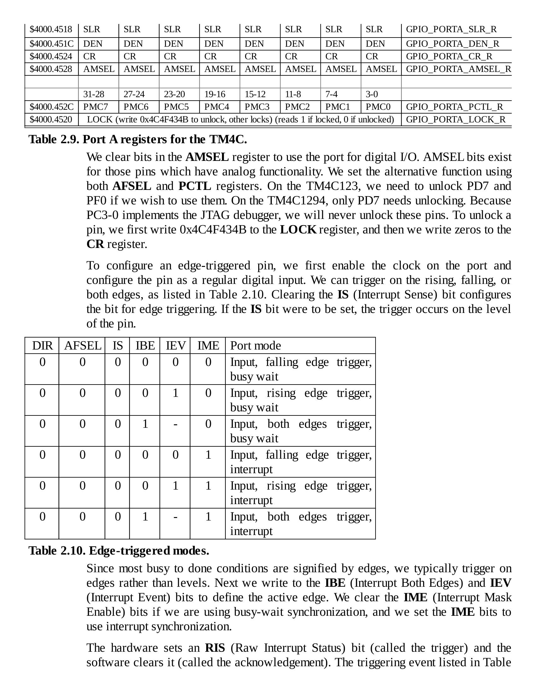
*Description*: Reference table detailing hardware parameters, register bit patterns, performance metrics, or memory configurations for Table 2.10: Edge-triggered modes..

> **Table 2.10: Edge-triggered modes.**

Since most busy to done conditions are signified by edges, we typically trigger on
edges rather than levels. Next we write to the IBE (Interrupt Both Edges) and IEV
(Interrupt Event) bits to define the active edge. We clear the IME (Interrupt Mask
Enable) bits if we are using busy-wait synchronization, and we set the IME bits to
use interrupt synchronization.
The hardware sets an RIS (Raw Interrupt Status) bit (called the trigger) and the
software clears it (called the acknowledgement). The triggering event listed in Table


<!-- Page 129 -->
### [PDF Page 129]


## 2.10 will set the corresponding RISbit in the GPIO_PORTA_RIS_R  register

regardless of whether or not that bit is allowed to request a controller interrupt. In
other words, clearing an IME bit disables the corresponding pin’s interrupt, but it
will still set the corresponding RIS bit when the interrupt would have occurred. The
software can acknowledge the event by writing ones to the corresponding
IC(Interrupt Clear) bit in the GPIO_PORTA_IC_R  register. The RISbits are read
only, meaning if the software were to write to this registers, it would have no effect.
For example, to clear bits 2, 1, and 0 in the GPIO_PORTA_RIS_R register, we
write a 0x07 to the GPIO_PORTA_IC_R  register. Writing zeros into IC bits will
not affect the RIS bits.
For input signals we have the option of adding either a pull-up resistor or a pull-
down resistor. If we set the corresponding PUE (Pull-Up Enable) bit on an input pin,
the equivalent of a 50 to 110 kΩ resistor to +3.3 V power is internally connected to
the pin. Similarly, if we set the corresponding PDE (Pull-Down Enable) bit on an
input pin, the equivalent of a 55 to 180 kΩ resistor to ground is internally connected
to the pin. We cannot have both pull-up and a pull-down resistor, so setting a bit in
one register automatically clears the corresponding bit in the other register.
A typical application of pull-up and pull-down mode is the interface of simple
switches. Using these modes eliminates the need for an external resistor when
interfacing a switch. The switch interfaces for the two switches on the LaunchPad are
illustrated in Figure 2.6. The Port F interfaces employ software-configured internal
resistors, implementing negative logic inputs.
Checkpoint 2.5: What do negative logic and positive logic mean in the context of
interfacing switches?

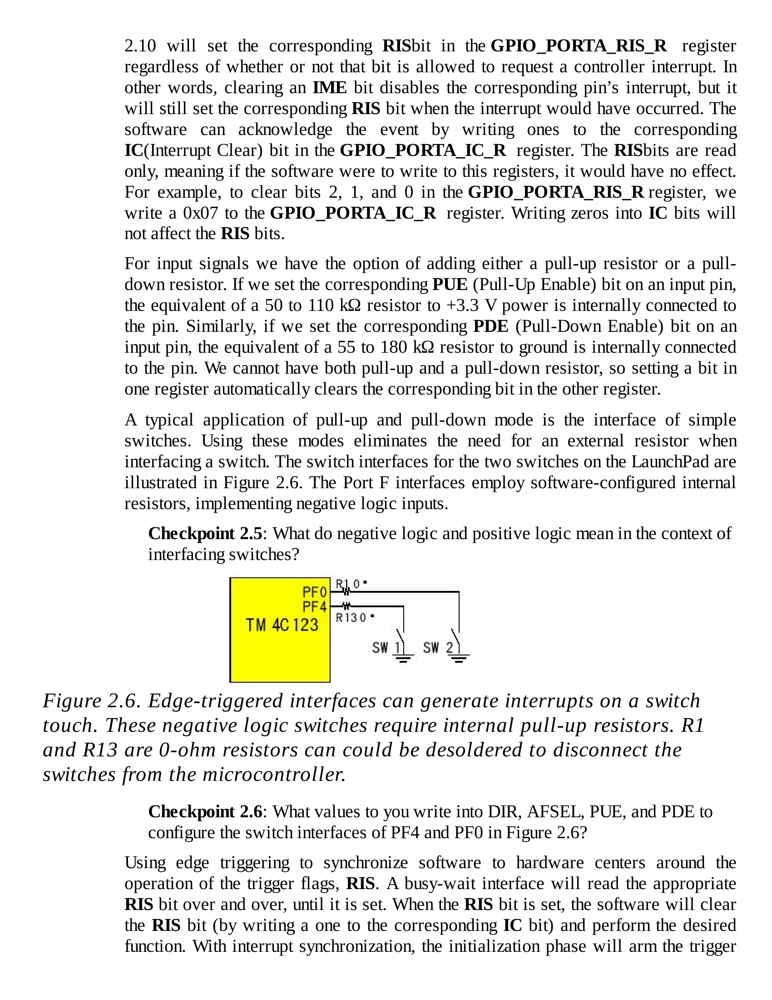
*Description*: Hardware pinout and board interface diagram mapping microcontroller pins, BoosterPack headers, switches, LEDs, and physical connectors for Figure 2.6: Edge-triggered interfaces can generate interrupts on a switch.

> **Figure 2.6: Edge-triggered interfaces can generate interrupts on a switch**

touch. These negative logic switches require internal pull-up resistors. R1

```assembly
and R13 are 0-ohm resistors can could be desoldered to disconnect the
```

switches from the microcontroller.
Checkpoint 2.6: What values to you write into DIR, AFSEL, PUE, and PDE to
configure the switch interfaces of PF4 and PF0 in Figure 2.6?
Using edge triggering to synchronize software to hardware centers around the
operation of the trigger flags, RIS. A busy-wait interface will read the appropriate
RIS bit over and over, until it is set. When the RIS bit is set, the software will clear
the RIS bit (by writing a one to the corresponding IC bit) and perform the desired
function. With interrupt synchronization, the initialization phase will arm the trigger


<!-- Page 130 -->
### [PDF Page 130]

flag by setting the corresponding IME bit. In this way, the active edge of the pin will
set the RIS and request an interrupt. The interrupt will suspend the main program and
run a special interrupt service routine (ISR). This ISR will clear the RIS bit and
perform the desired function. At the end of the ISR it will return, causing the main
program to resume. In particular, five conditions must be simultaneously true for an
edge-triggered interrupt to be requested:
• The trigger flag bit is set (RIS)
• The arm bit is set (IME)
• The level of the edge-triggered interrupt must be less than
BASEPRI
• The edge-triggered interrupt must be enabled in the
NVIC_EN0_R
• The edge-triggered interrupt must be disabled in the
NVIC_DIS0_R
• Bit 0 of the special register PRIMASK is 0

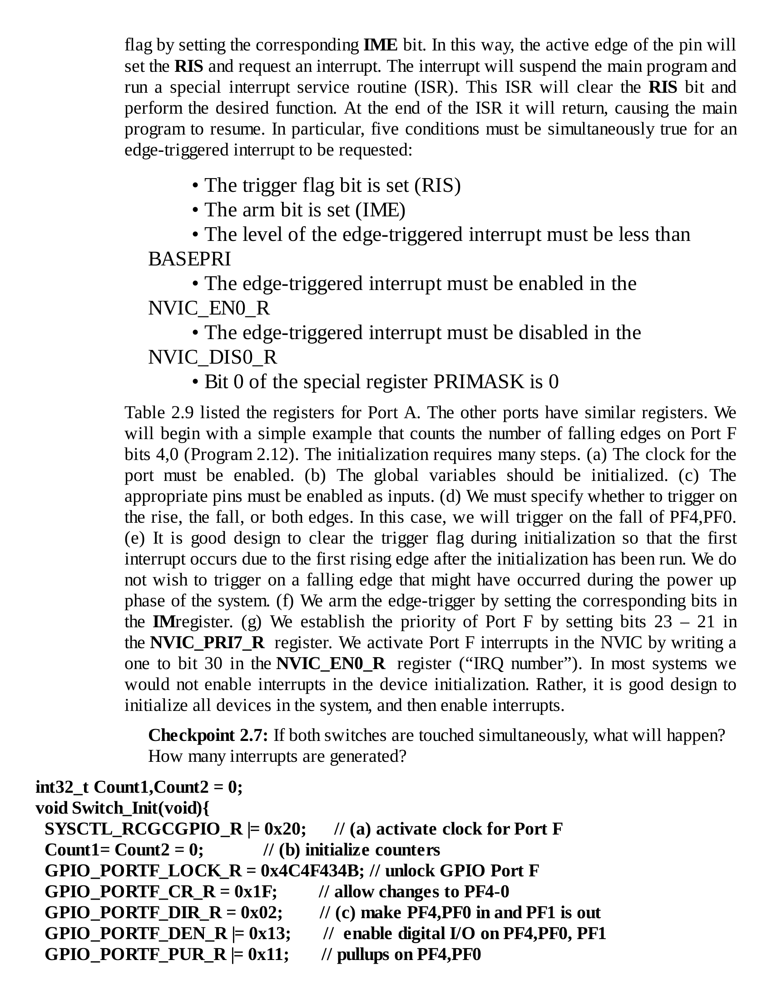
*Description*: Register layout and memory mapping diagram specifying bit fields, stack pointer allocations, and memory address boundaries for Table 2.9: listed the registers for Port A. The other ports have similar registers. We.

> **Table 2.9: listed the registers for Port A. The other ports have similar registers. We**

will begin with a simple example that counts the number of falling edges on Port F
bits 4,0 (Program 2.12). The initialization requires many steps. (a) The clock for the
port must be enabled. (b) The global variables should be initialized. (c) The
appropriate pins must be enabled as inputs. (d) We must specify whether to trigger on
the rise, the fall, or both edges. In this case, we will trigger on the fall of PF4,PF0.
(e) It is good design to clear the trigger flag during initialization so that the first
interrupt occurs due to the first rising edge after the initialization has been run. We do
not wish to trigger on a falling edge that might have occurred during the power up
phase of the system. (f) We arm the edge-trigger by setting the corresponding bits in
the IMregister. (g) We establish the priority of Port F by setting bits 23 – 21 in
the NVIC_PRI7_R  register. We activate Port F interrupts in the NVIC by writing a
one to bit 30 in the NVIC_EN0_R  register (“IRQ number”). In most systems we
would not enable interrupts in the device initialization. Rather, it is good design to
initialize all devices in the system, and then enable interrupts.
Checkpoint 2.7: If both switches are touched simultaneously, what will happen?
How many interrupts are generated?

```c
int32_t Count1,Count2 = 0;
void Switch_Init(void){
SYSCTL_RCGCGPIO_R |= 0x20;      // (a) activate clock for Port F
Count1= Count2 = 0;             // (b) initialize counters
GPIO_PORTF_LOCK_R = 0x4C4F434B; // unlock GPIO Port F
GPIO_PORTF_CR_R = 0x1F;         // allow changes to PF4-0
GPIO_PORTF_DIR_R = 0x02;        // (c) make PF4,PF0 in and PF1 is out
GPIO_PORTF_DEN_R |= 0x13;       //  enable digital I/O on PF4,PF0, PF1
GPIO_PORTF_PUR_R |= 0x11;       // pullups on PF4,PF0
```


<!-- Page 131 -->
### [PDF Page 131]

GPIO_PORTF_IS_R &= ~0x11;       // (d) PF4,PF0 are edge-sensitive
GPIO_PORTF_IBE_R &= ~0x11;      //     PF4,PF0 are not both edges
GPIO_PORTF_IEV_R &= ~0x11;      //     PF4,PF0 falling edge event
GPIO_PORTF_ICR_R = 0x11;        // (e) clear flags
GPIO_PORTF_IM_R |= 0x11;        // (f) arm interrupt on PF4,PF0
NVIC_PRI7_R = (NVIC_PRI7_R&0xFF00FFFF)|0x00A00000; // (g) priority 5
NVIC_EN0_R = 0x40000000;        // (h) enable interrupt 30 in NVIC
}

```c
void GPIOPortF_Handler(void){
if(GPIO_PORTF_RIS_R&0x10){  // poll PF4
GPIO_PORTF_ICR_R = 0x10;  // acknowledge flag4
Count1++;                // event occurred
}
if(GPIO_PORTF_RIS_R&0x01){  // poll PF0
GPIO_PORTF_ICR_R = 0x01;  // acknowledge flag0
Count2++;                // event occurred
}
}
```


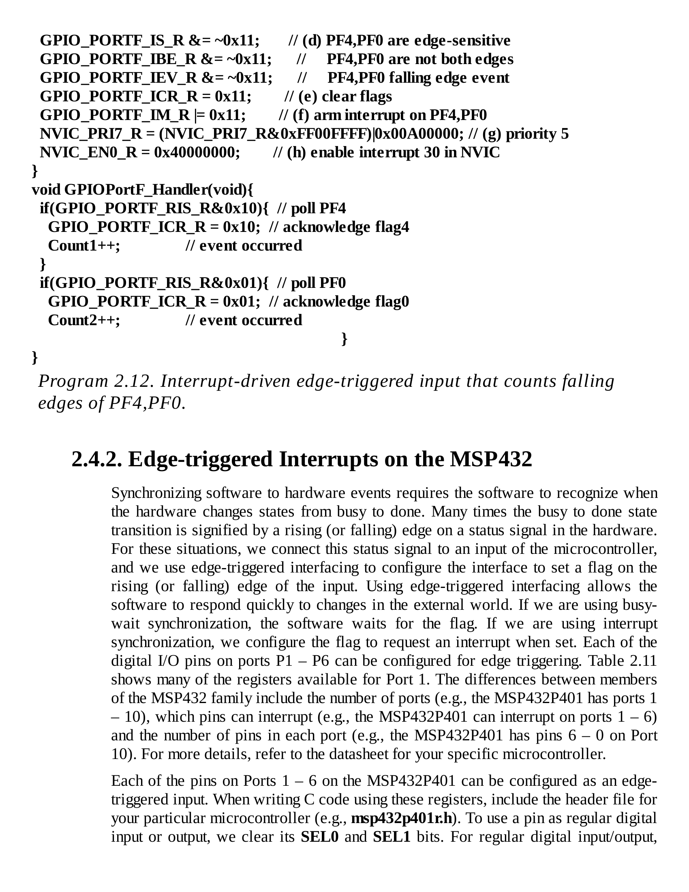
*Description*: Technical schematic and block diagram illustrating circuit operation, signal pathways, and functional behavior for Program 2.12: Interrupt-driven edge-triggered input that counts falling.

> **Program 2.12: Interrupt-driven edge-triggered input that counts falling**

edges of PF4,PF0.
2.4.2. Edge-triggered Interrupts on the MSP432
Synchronizing software to hardware events requires the software to recognize when
the hardware changes states from busy to done. Many times the busy to done state
transition is signified by a rising (or falling) edge on a status signal in the hardware.
For these situations, we connect this status signal to an input of the microcontroller,

```assembly
and we use edge-triggered interfacing to configure the interface to set a flag on the
```

rising (or falling) edge of the input. Using edge-triggered interfacing allows the
software to respond quickly to changes in the external world. If we are using busy-
wait synchronization, the software waits for the flag. If we are using interrupt
synchronization, we configure the flag to request an interrupt when set. Each of the
digital I/O pins on ports P1 – P6 can be configured for edge triggering. Table 2.11
shows many of the registers available for Port 1. The differences between members
of the MSP432 family include the number of ports (e.g., the MSP432P401 has ports 1
– 10), which pins can interrupt (e.g., the MSP432P401 can interrupt on ports 1 – 6)

```assembly
and the number of pins in each port (e.g., the MSP432P401 has pins 6 – 0 on Port
```

10). For more details, refer to the datasheet for your specific microcontroller.
Each of the pins on Ports 1 – 6 on the MSP432P401 can be configured as an edge-
triggered input. When writing C code using these registers, include the header file for
your particular microcontroller (e.g., msp432p401r.h). To use a pin as regular digital
input or output, we clear its SEL0 and SEL1 bits. For regular digital input/output,


<!-- Page 132 -->
### [PDF Page 132]

we clear DIR (Direction) bits to make them input, and we set DIR bits to make them
output.
Address
7
6
5
4
3
2
1
0
Name
0x4000.4C00
DATA
DATA
DATA
DATA
DATA
DATA
DATA
DATA
P1IN
0x4000.4C02
DATA
DATA
DATA
DATA
DATA
DATA
DATA
DATA
P1OUT
0x4000.4C04
DIR
DIR
DIR
DIR
DIR
DIR
DIR
DIR
P1DIR
0x4000.4C06
REN
REN
REN
REN
REN
REN
REN
REN
P1REN
0x4000.4C08
DS
DS
DS
DS
DS
DS
DS
DS
P1DS
0x4000.4C0A
SEL0
SEL0
SEL0
SEL0
SEL0
SEL0
SEL0
SEL0
P1SEL0
0x4000.4C0C
SEL1
SEL1
SEL1
SEL1
SEL1
SEL1
SEL1
SEL1
P1SEL1
0x4000.4C0E
P1IV
P1IV
0x4000.4C18
IES
IES
IES
IES
IES
IES
IES
IES
P1IES
0x4000.4C1A
IE
IE
IE
IE
IE
IE
IE
IE
P1IE
0x4000.4C1C
IFG
IFG
IFG
IFG
IFG
IFG
IFG
IFG
P1IFG

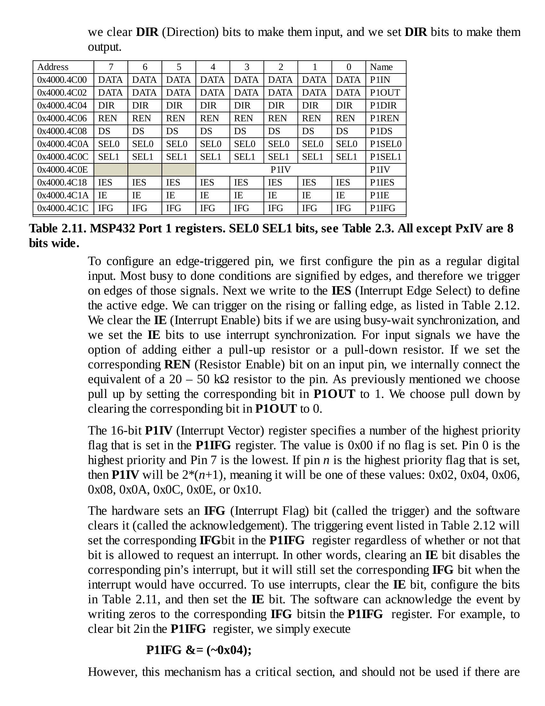
*Description*: Register layout and memory mapping diagram specifying bit fields, stack pointer allocations, and memory address boundaries for Table 2.11: MSP432 Port 1 registers. SEL0 SEL1 bits, see Table 2.3. All except PxIV are 8.

> **Table 2.11: MSP432 Port 1 registers. SEL0 SEL1 bits, see Table 2.3. All except PxIV are 8**

bits wide.
To configure an edge-triggered pin, we first configure the pin as a regular digital
input. Most busy to done conditions are signified by edges, and therefore we trigger
on edges of those signals. Next we write to the IES (Interrupt Edge Select) to define
the active edge. We can trigger on the rising or falling edge, as listed in Table 2.12.
We clear the IE (Interrupt Enable) bits if we are using busy-wait synchronization, and
we set the IE bits to use interrupt synchronization. For input signals we have the
option of adding either a pull-up resistor or a pull-down resistor. If we set the
corresponding REN (Resistor Enable) bit on an input pin, we internally connect the
equivalent of a 20 – 50 kΩ resistor to the pin. As previously mentioned we choose
pull up by setting the corresponding bit in P1OUT to 1. We choose pull down by
clearing the corresponding bit in P1OUT to 0.
The 16-bit P1IV (Interrupt Vector) register specifies a number of the highest priority
flag that is set in the P1IFG register. The value is 0x00 if no flag is set. Pin 0 is the
highest priority and Pin 7 is the lowest. If pin n is the highest priority flag that is set,
then P1IV will be 2*(n+1), meaning it will be one of these values: 0x02, 0x04, 0x06,
0x08, 0x0A, 0x0C, 0x0E, or 0x10.
The hardware sets an IFG (Interrupt Flag) bit (called the trigger) and the software
clears it (called the acknowledgement). The triggering event listed in Table 2.12 will
set the corresponding IFGbit in the P1IFG  register regardless of whether or not that
bit is allowed to request an interrupt. In other words, clearing an IE bit disables the
corresponding pin’s interrupt, but it will still set the corresponding IFG bit when the
interrupt would have occurred. To use interrupts, clear the IE bit, configure the bits
in Table 2.11, and then set the IE bit. The software can acknowledge the event by
writing zeros to the corresponding IFG bitsin the P1IFG  register. For example, to
clear bit 2in the P1IFG  register, we simply execute
P1IFG &= (~0x04);
However, this mechanism has a critical section, and should not be used if there are


<!-- Page 133 -->
### [PDF Page 133]

multiple interrupts active on a single port. The example will illustrate using P1IV to
acknowledge.
DIR
SEL0
SEL1
IE
IES Port mode
0
00
0
0
Input, rising edge trigger
0
00
0
1
Input, falling edge trigger
0
00
1
0
Input, rising edge trigger,
interrupt
0
00
1
1
Input, falling edge trigger,
interrupt


*Description*: Reference table detailing hardware parameters, register bit patterns, performance metrics, or memory configurations for Table 2.12: Edge-triggered modes..

> **Table 2.12: Edge-triggered modes.**

A typical application of pull-up and pull-down mode is the interface of simple
switches. Using these modes eliminates the need for an external resistor when
interfacing a switch. The P1.1 and P1.4 interfaces will use software-configured
internal resistors. The P1.1 and P1.4 interfaces in Figure 2.7 implement negative
logic switch inputs.

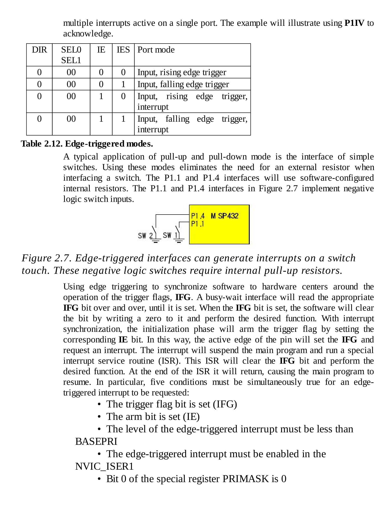
*Description*: Hardware pinout and board interface diagram mapping microcontroller pins, BoosterPack headers, switches, LEDs, and physical connectors for Figure 2.7: Edge-triggered interfaces can generate interrupts on a switch.

> **Figure 2.7: Edge-triggered interfaces can generate interrupts on a switch**

touch. These negative logic switches require internal pull-up resistors.
Using edge triggering to synchronize software to hardware centers around the
operation of the trigger flags, IFG. A busy-wait interface will read the appropriate
IFG bit over and over, until it is set. When the IFG bit is set, the software will clear
the bit by writing a zero to it and perform the desired function. With interrupt
synchronization, the initialization phase will arm the trigger flag by setting the
corresponding IE bit. In this way, the active edge of the pin will set the IFG and
request an interrupt. The interrupt will suspend the main program and run a special
interrupt service routine (ISR). This ISR will clear the IFG bit and perform the
desired function. At the end of the ISR it will return, causing the main program to
resume. In particular, five conditions must be simultaneously true for an edge-
triggered interrupt to be requested:
•  The trigger flag bit is set (IFG)
•  The arm bit is set (IE)
•  The level of the edge-triggered interrupt must be less than
BASEPRI
•  The edge-triggered interrupt must be enabled in the
NVIC_ISER1
•  Bit 0 of the special register PRIMASK is 0


<!-- Page 134 -->
### [PDF Page 134]

In Volumes 1 and 2, we developed blind-cycle and busy-wait solutions. However, in
this section we will redesign the systems using interrupt synchronization. Table 2.11
lists the registers for Port 1. The other ports have similar registers. However, only
Ports 1 – 6 can request interrupts. We will begin with a simple example that counts
the number of falling edges on Port 1 bits 1 and 4 (Program 2.13). The initialization
requires many steps. We enable interrupts ( EnableInterrupts() ) only after all
devices are initialized.
(a) The global variables should be initialized.
(b) The appropriate pins must be enabled as inputs.
(c) We must specify whether to trigger on the rising or the falling edge. We will
trigger on the falling of either P1.1 or P1.4. A falling edge occurs whenever we touch
either SW1 or SW2.
(d) It is good design to clear the trigger flag during initialization so that the first
interrupt occurs due to the first falling edge after the initialization has been run. We
do not wish to trigger on a rising edge that might have occurred during the power up
phase of the system.
(e) We arm the edge-trigger by setting the corresponding bits in the IE register.
(f) We establish the priority of Port 1 by setting bits 31 – 29 in the NVIC_IPR8
register.
(g) We activate Port 1 interrupts in the NVIC by setting bit 3 in
the NVIC_ISER1 register.
The proper way to poll the interrupt is to use P1IV. If the software reads P1IV it
will get the number (2*(n+1)) where n is the pin number of the lowest bit with a
pending interrupt. This access will clear only flag n.

```c
int32_t Count1,Count2 = 0;
void Switch_Init(void){
Count1 = Count2 = 0;         // (a) initialize counters
P1SEL1 &= ~0x12;              // (b) configure P1.1, P1.4 as GPIO
P1SEL0 &= ~0x12;              //     built-in Buttons 1 and 2
P1DIR &= ~0x12;               //     make P1.1, P1.4 in
P1REN |= 0x12;                //     enable pull resistors
P1OUT |= 0x12;                //     P1.1, P1.4 is pull-up
P1IES |= 0x12;                // (c) P1.1, P1.4 is falling edge event
P1IFG &= ~0x12;               // (d) clear flag1 and flag4
P1IE |= 0x12;                 // (e) arm interrupt on P1.1, P1.4
NVIC_IPR8 = (NVIC_IPR8&0x00FFFFFF)|0x40000000; // (f) priority 2
NVIC_ISER1 = 0x00000008;      // (g) enable interrupt 35 in NVIC
}
void PORT1_IRQHandler(void){ uint8_t status;
status = P1IV; // 4 for P1.1 and 10 for P1.4
```


<!-- Page 135 -->
### [PDF Page 135]


```c
if(status == 4){
Count1++;                // event occurred
}
if(status == 10){
Count2++;                // event occurred
}
}
```


*Description*: Technical schematic and block diagram illustrating circuit operation, signal pathways, and functional behavior for Program 2.13: Interrupt-driven edge-triggered input that counts falling.

> **Program 2.13: Interrupt-driven edge-triggered input that counts falling**

edges of P1.4 and P1.1.


<!-- Page 136 -->
### [PDF Page 136]

2.5. UART Interface
In this section we will develop a simple device driver using the Universal
Asynchronous Receiver/Transmitter (UART). This serial port allows the
microcontroller to communicate with devices such as other computers, printers, input
sensors, and LCDs.  Serial transmission involves sending one bit a time, such that the
data is spread out over time. The total number of bits transmitted per second is called
the baud rate. The reciprocal of the baud rate is the bit time, which is the time to
send one bit. Most microcontrollers have at least one UART. The details of the
UART operation on the MSP432/TM4C can be found in Volume 2. In this book, we
present general features common to all devices, and also include interrupt driven
drivers. Each UART will have a baud rate control register, which we use to select
the transmission rate. Each device is capable of creating its own serial clock with a
transmission frequency approximately equal to the serial clock in the computer with
which it is communicating. A frame is the smallest complete unit of serial
transmission. Figure 2.8 plots the signal versus time on a serial port, showing a
single frame, which includes a start bit (which is 0), 8 bits of data (least significant
bit first), and a stop bit (which is 1).  There is always only one start bit, but the
UARTs allow us to select the 5 to 8 data bits and 1 or 2 stop bits. The UART can add
even, odd, or no parity bit. However, we will employ the typical protocol of 1 start
bit, 8 data bits, no parity, and 1 stop bit. This protocol is used for both transmitting

```assembly
and receiving. The information rate, or bandwidth, is defined as the amount of data
```

or useful information transmitted per second. From Figure 2.8, we see that 10 bits are
sent for every byte of usual data. Therefore, the bandwidth of the serial channel (in
bytes/second) is the baud rate (in bits/sec) divided by 10.

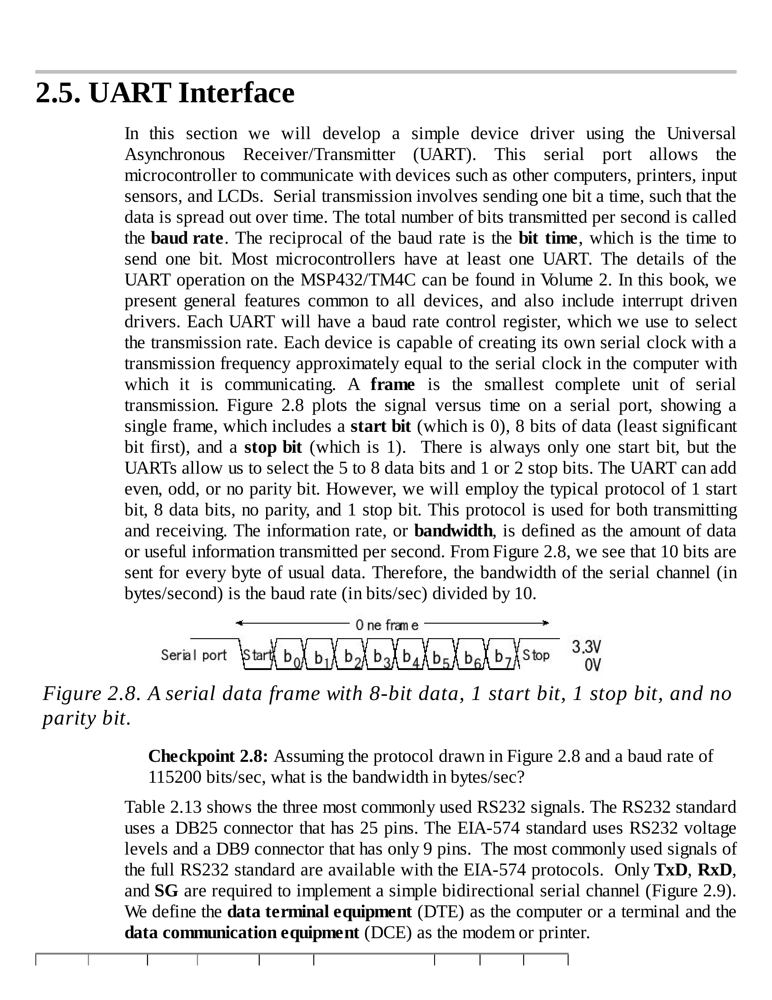
*Description*: Technical schematic and block diagram illustrating circuit operation, signal pathways, and functional behavior for Figure 2.8: A serial data frame with 8-bit data, 1 start bit, 1 stop bit, and no.

> **Figure 2.8: A serial data frame with 8-bit data, 1 start bit, 1 stop bit, and no**

parity bit.
Checkpoint 2.8: Assuming the protocol drawn in Figure 2.8 and a baud rate of
115200 bits/sec, what is the bandwidth in bytes/sec?


*Description*: Reference table detailing hardware parameters, register bit patterns, performance metrics, or memory configurations for Table 2.13: shows the three most commonly used RS232 signals. The RS232 standard.

> **Table 2.13: shows the three most commonly used RS232 signals. The RS232 standard**

uses a DB25 connector that has 25 pins. The EIA-574 standard uses RS232 voltage
levels and a DB9 connector that has only 9 pins.  The most commonly used signals of
the full RS232 standard are available with the EIA-574 protocols.  Only TxD, RxD,

```assembly
and SG are required to implement a simple bidirectional serial channel (Figure 2.9).
```

We define the data terminal equipment (DTE) as the computer or a terminal and the
data communication equipment (DCE) as the modem or printer.


<!-- Page 137 -->
### [PDF Page 137]

DB25
Pin
RS232
Name
DB9
Pin
EIA-
574
Name
Signal Description
True DTE DCE
2
BA
3
103
TxD
Transmit Data
-12V out
in
3
BB
2
104
RxD
Receive Data
-12V
in
out
7
AB
5
102
SG
Signal Ground


*Description*: Reference table detailing hardware parameters, register bit patterns, performance metrics, or memory configurations for Table 2.13: The commonly-used signals on the RS232 and EIA-574 protocols..

> **Table 2.13: The commonly-used signals on the RS232 and EIA-574 protocols.**


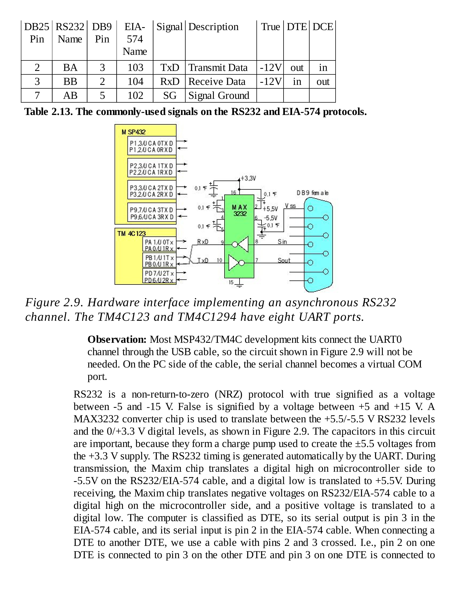
*Description*: Hardware pinout and board interface diagram mapping microcontroller pins, BoosterPack headers, switches, LEDs, and physical connectors for Figure 2.9: Hardware interface implementing an asynchronous RS232.

> **Figure 2.9: Hardware interface implementing an asynchronous RS232**

channel. The TM4C123 and TM4C1294 have eight UART ports.
Observation: Most MSP432/TM4C development kits connect the UART0
channel through the USB cable, so the circuit shown in Figure 2.9 will not be
needed. On the PC side of the cable, the serial channel becomes a virtual COM
port.
RS232 is a non-return-to-zero (NRZ) protocol with true signified as a voltage
between -5 and ‑15 V. False is signified by a voltage between +5 and +15 V. A
MAX3232 converter chip is used to translate between the +5.5/-5.5 V RS232 levels

```assembly
and the 0/+3.3 V digital levels, as shown in Figure 2.9. The capacitors in this circuit
```

are important, because they form a charge pump used to create the ±5.5 voltages from
the +3.3 V supply. The RS232 timing is generated automatically by the UART. During
transmission, the Maxim chip translates a digital high on microcontroller side to
-5.5V on the RS232/EIA‑574 cable, and a digital low is translated to +5.5V. During
receiving, the Maxim chip translates negative voltages on RS232/EIA‑574 cable to a
digital high on the microcontroller side, and a positive voltage is translated to a
digital low. The computer is classified as DTE, so its serial output is pin 3 in the
EIA‑574 cable, and its serial input is pin 2 in the EIA‑574 cable. When connecting a
DTE to another DTE, we use a cable with pins 2 and 3 crossed. I.e., pin 2 on one
DTE is connected to pin 3 on the other DTE and pin 3 on one DTE is connected to


<!-- Page 138 -->
### [PDF Page 138]

pin 2 on the other DTE.  When connecting a DTE to a DCE, then the cable passes the
signals straight across. In all situations, the grounds are connected together using the
SG wire in the cable. This channel is classified as full duplex, because transmission
can occur in both directions simultaneously.

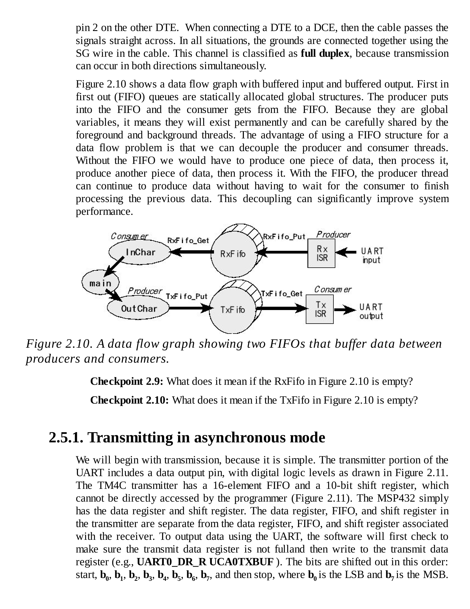
*Description*: Technical schematic and block diagram illustrating circuit operation, signal pathways, and functional behavior for Figure 2.10: shows a data flow graph with buffered input and buffered output. First in.

> **Figure 2.10: shows a data flow graph with buffered input and buffered output. First in**

first out (FIFO) queues are statically allocated global structures. The producer puts
into the FIFO and the consumer gets from the FIFO. Because they are global
variables, it means they will exist permanently and can be carefully shared by the
foreground and background threads. The advantage of using a FIFO structure for a
data flow problem is that we can decouple the producer and consumer threads.
Without the FIFO we would have to produce one piece of data, then process it,
produce another piece of data, then process it. With the FIFO, the producer thread
can continue to produce data without having to wait for the consumer to finish
processing the previous data. This decoupling can significantly improve system
performance.


*Description*: Technical schematic and block diagram illustrating circuit operation, signal pathways, and functional behavior for Figure 2.10: A data flow graph showing two FIFOs that buffer data between.

> **Figure 2.10: A data flow graph showing two FIFOs that buffer data between**

producers and consumers.
Checkpoint 2.9: What does it mean if the RxFifo in Figure 2.10 is empty?
Checkpoint 2.10: What does it mean if the TxFifo in Figure 2.10 is empty?
2.5.1. Transmitting in asynchronous mode
We will begin with transmission, because it is simple. The transmitter portion of the
UART includes a data output pin, with digital logic levels as drawn in Figure 2.11.
The TM4C transmitter has a 16-element FIFO and a 10-bit shift register, which
cannot be directly accessed by the programmer (Figure 2.11). The MSP432 simply
has the data register and shift register. The data register, FIFO, and shift register in
the transmitter are separate from the data register, FIFO, and shift register associated
with the receiver. To output data using the UART, the software will first check to
make sure the transmit data register is not fulland then write to the transmit data
register (e.g., UART0_DR_R UCA0TXBUF ). The bits are shifted out in this order:
start, b0, b1, b2, b3, b4, b5, b6, b7, and then stop, where b0 is the LSB and b7 is the MSB.


<!-- Page 139 -->
### [PDF Page 139]

The transmit data register is write only, which means the software can write to it (to
start a new transmission) but cannot read from it. Even though the transmit data
register is at the same address as the receive data register, the transmit and receive
data registers are two separate registers.

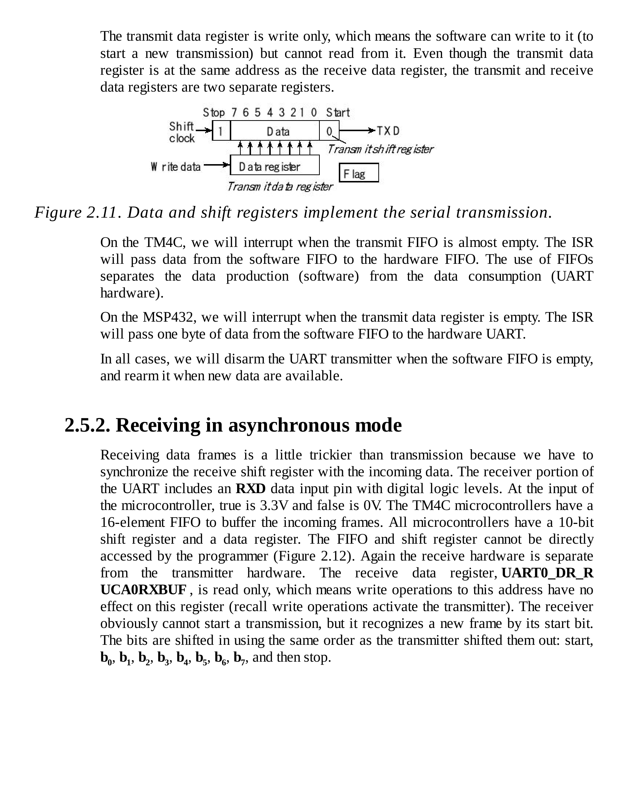
*Description*: Register layout and memory mapping diagram specifying bit fields, stack pointer allocations, and memory address boundaries for Figure 2.11: Data and shift registers implement the serial transmission..

> **Figure 2.11: Data and shift registers implement the serial transmission.**

On the TM4C, we will interrupt when the transmit FIFO is almost empty. The ISR
will pass data from the software FIFO to the hardware FIFO. The use of FIFOs
separates the data production (software) from the data consumption (UART
hardware).
On the MSP432, we will interrupt when the transmit data register is empty. The ISR
will pass one byte of data from the software FIFO to the hardware UART.
In all cases, we will disarm the UART transmitter when the software FIFO is empty,

```assembly
and rearm it when new data are available.
```

2.5.2. Receiving in asynchronous mode
Receiving data frames is a little trickier than transmission because we have to
synchronize the receive shift register with the incoming data. The receiver portion of
the UART includes an RXD data input pin with digital logic levels. At the input of
the microcontroller, true is 3.3V and false is 0V. The TM4C microcontrollers have a
16-element FIFO to buffer the incoming frames. All microcontrollers have a 10-bit
shift register and a data register. The FIFO and shift register cannot be directly
accessed by the programmer (Figure 2.12). Again the receive hardware is separate
from the transmitter hardware. The receive data register, UART0_DR_R
UCA0RXBUF , is read only, which means write operations to this address have no
effect on this register (recall write operations activate the transmitter). The receiver
obviously cannot start a transmission, but it recognizes a new frame by its start bit.
The bits are shifted in using the same order as the transmitter shifted them out: start,
b0, b1, b2, b3, b4, b5, b6, b7, and then stop.


<!-- Page 140 -->
### [PDF Page 140]


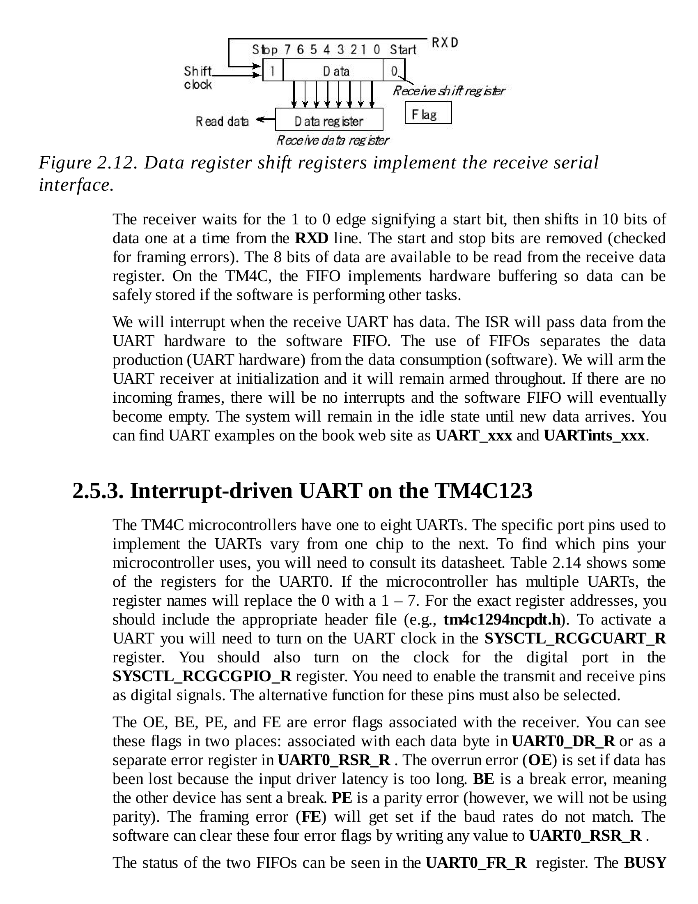
*Description*: Register layout and memory mapping diagram specifying bit fields, stack pointer allocations, and memory address boundaries for Figure 2.12: Data register shift registers implement the receive serial.

> **Figure 2.12: Data register shift registers implement the receive serial**

interface.
The receiver waits for the 1 to 0 edge signifying a start bit, then shifts in 10 bits of
data one at a time from the RXD line. The start and stop bits are removed (checked
for framing errors). The 8 bits of data are available to be read from the receive data
register. On the TM4C, the FIFO implements hardware buffering so data can be
safely stored if the software is performing other tasks.
We will interrupt when the receive UART has data. The ISR will pass data from the
UART hardware to the software FIFO. The use of FIFOs separates the data
production (UART hardware) from the data consumption (software). We will arm the
UART receiver at initialization and it will remain armed throughout. If there are no
incoming frames, there will be no interrupts and the software FIFO will eventually
become empty. The system will remain in the idle state until new data arrives. You
can find UART examples on the book web site as UART_xxx and UARTints_xxx.
2.5.3. Interrupt-driven UART on the TM4C123
The TM4C microcontrollers have one to eight UARTs. The specific port pins used to
implement the UARTs vary from one chip to the next. To find which pins your
microcontroller uses, you will need to consult its datasheet. Table 2.14 shows some
of the registers for the UART0. If the microcontroller has multiple UARTs, the
register names will replace the 0 with a 1 – 7. For the exact register addresses, you
should include the appropriate header file (e.g., tm4c1294ncpdt.h). To activate a
UART you will need to turn on the UART clock in the SYSCTL_RCGCUART_R
register. You should also turn on the clock for the digital port in the
SYSCTL_RCGCGPIO_R register. You need to enable the transmit and receive pins
as digital signals. The alternative function for these pins must also be selected.
The OE, BE, PE, and FE are error flags associated with the receiver. You can see
these flags in two places: associated with each data byte in UART0_DR_R or as a
separate error register in UART0_RSR_R . The overrun error (OE) is set if data has
been lost because the input driver latency is too long. BE is a break error, meaning
the other device has sent a break. PE is a parity error (however, we will not be using
parity). The framing error (FE) will get set if the baud rates do not match. The
software can clear these four error flags by writing any value to UART0_RSR_R .
The status of the two FIFOs can be seen in the UART0_FR_R  register. The BUSY


<!-- Page 141 -->
### [PDF Page 141]

flag is set while the transmitter still has unsent bits. It will become zero when the
transmit FIFO is empty and the last stop bit has been sent. If you implement busy-wait
output by first outputting then waiting for BUSY to become 0, then the routine will
write new data and return after that particular data has been completely transmitted.
The UART0_CTL_R  control register contains the bits that turn on the UART. TXE
is the Transmitter Enable bit, and RXE is the Receiver Enable bit. We set TXE,
RXE, and UARTEN equal to 1 in order to activate the UART device.  However, we
should clear UARTEN during the initialization sequence.
31–
12
11
10
9
8
7–0
Name
$4000.C000
OE
BE
PE
FE
DATA
UART0_DR_R
31–3
3
2
1
0
$4000.C004
OE
BE
PE
FE
UART0_RSR_R
31–
8
7
6
5
4
3
2–0
$4000.C018
TXFE
RXFF
TXFF
RXFE
BUSY
UART0_FR_R
31–
16
15–0
$4000.C024
DIVINT
UART0_IBRD_R
31–6
5–0
$4000.C028
DIVFRAC
UART0_FBRD_R
31–
8
7
6 – 5
4
3
2
1
0
$4000.C02C
SPS
WLEN
FEN
STP2
EPS
PEN
BRK
UART0_LCRH_R
31–
10
9
8
7
6–3
2
1
0
$4000.C030
RXE
TXE
LBE
SIRLP
SIREN
UARTEN
UART0_CTL_R
31–6
5-3
2-0
$4000.C034
RXIFLSEL
TXIFLSEL
UART0_IFLS_R
31-
11
10
9
8
7
6
5
4
$4000.C038
OEIM
BEIM
PEIM
FEIM
RTIM
TXIM
RXIM
UART0_IM_R
$4000.C03C
OERIS
BERIS
PERIS
FERIS
RTRIS
TXRIS
RXRIS
UART0_RIS_R
$4000.C040
OEMIS
BEMIS
PEMIS
FEMIS
RTMIS
TXMIS
RXMIS
UART0_MIS_R
$4000.C044
OEIC
BEIC
PEIC
FEIC
RTIC
TXIC
RXIC
UART0_ICR_R

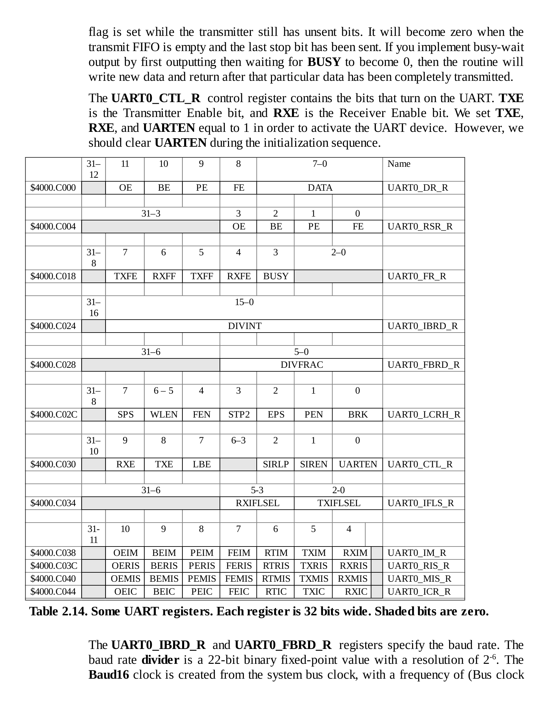
*Description*: Register layout and memory mapping diagram specifying bit fields, stack pointer allocations, and memory address boundaries for Table 2.14: Some UART registers. Each register is 32 bits wide. Shaded bits are zero..

> **Table 2.14: Some UART registers. Each register is 32 bits wide. Shaded bits are zero.**

The UART0_IBRD_R  and UART0_FBRD_R  registers specify the baud rate. The
baud rate divider is a 22-bit binary fixed-point value with a resolution of 2-6. The
Baud16 clock is created from the system bus clock, with a frequency of (Bus clock


<!-- Page 142 -->
### [PDF Page 142]

frequency)/divider. The baud rate is 16 times slower than Baud16
Baud rate = Baud16/16 = (Bus clock frequency)/(16*divider)
For example, if the bus clock is 8 MHz and the desired baud rate is 19200 bits/sec,
then the divider should be 8,000,000/16/19200 or 26.04167. As a binary fixed-point
number, this number is about 11010.000011. We can establish this baud rateby putting
the 11010 into UART0_IBRD_R and the 000011 into UART0_FBRD_R . In reality,
11010.000011 is equal to 1667/64 or 26.046875. The baud rates in the transmitter

```assembly
and receiver must match within 5% for the channel to operate properly. The error for
```

this example is 0.02%.
The
three
registers UART0_LCRH_R , UART0_IBRD_R ,

```assembly
and UART0_FBRD_R form an internal 30-bit register. This internal register is only
```

updated when a write operation to UART0_LCRH_R is performed, so any changes
to the baud-rate divisor must be followed by a write to the UART0_LCRH_R
register for the changes to take effect. Out of reset, both FIFOs are disabled and act
as 1-byte-deep holding registers. The FIFOs are enabled by setting the FENbit
in UART0_LCRH_R .
To use interrupts, we will enable the FIFOs by setting the FENbit in
the UART0_LCRH_R  register. RXIFLSEL specifies the receive FIFO level that
causes an interrupt. TXIFLSEL specifies the transmit FIFO level that causes an
interrupt.
RXIFLSEL RX FIFOSet RXMIS interrupt trigger when
0x0
≥ ⅛ full
Receive FIFO goes from 1 to 2 characters
0x1
≥ ¼ full
Receive FIFO goes from 3 to 4 characters
0x2
≥ ½ full
Receive FIFO goes from 7 to 8 characters
0x3
≥ ¾ full
Receive FIFO goes from 11 to 12 characters
0x4
≥ ⅞ full
Receive FIFO goes from 13 to 14 characters
TXIFLSEL TX FIFOSet TXMIS interrupt trigger when
0x0
≤ ⅞ empty
Transmit FIFO goes from 15 to 14 characters
0x1
≤ ¾ empty
Transmit FIFO goes from 13 to 12 characters
0x2
≤ ½ empty
Transmit FIFO goes from 9 to 8 characters
0x3
≤ ¼ empty
Transmit FIFO goes from 5 to 4 characters
0x4
≤ ⅛ empty
Transmit FIFO goes from 3 to 2 characters
There are seven possible interrupt trigger flags that are in the UART0_RIS_R
register. The setting of the TXRIS and RXRIS flags is defined above. The OERIS
flag is set on an overrun, new incoming frame received but the receive FIFO is full.
The BERIS flag is set on a break error. The PERIS flag is set on a parity error. The
FERIS flag is set on a framing error (stop bit is not high). The RTRISis set on a
receiver timeout, which is when the receiver FIFO is not empty and no incoming
frames have occurred in a 32-bit time period.  Each of the seven trigger flags has a
corresponding
arm
bit
in
the UART0_IM_R
register.
A
bit
in
the


<!-- Page 143 -->
### [PDF Page 143]

UART0_MIS_R register set if the trigger flag is both set and armed. To
acknowledge an interrupt (make the trigger flag become zero), software writes a 1 to
the corresponding bit in UART0_IC_R .
The UART system has two channels, one for input and one for output, and each
channel employs a separate FIFO queue. Program 2.14 shows the interrupt-driven
UART device driver. During initialization, Port A pins 0 and 1 are enabled as
alternate function digital signals. The two software FIFOs are initialized.  The baud
rate is set at 115200 bits/sec, and the hardware FIFOs are enabled. A transmit
interrupt will occur as the transmit FIFO goes from 2 elements down to 1 element.
Not waiting until the hardware FIFO is completely empty allows the software to
refill the hardware FIFO and maintain a continuous output stream, achieving
maximum bandwidth. There are two conditions that will request a receive interrupt.
First, if the receive FIFO goes from 2 to 3 elements a receive interrupt will be
requested. At this time there is still 13 free spaces in the receive FIFO so the latency
requirement for this real-time input will be 130 bit times (about 1 ms). The other
potential source of receiver interrupts is the receiver time out. This trigger will occur
if the receiver becomes idle and there are data in the receiver FIFO. This trigger will
allow the interface to receive input data when it comes just one or two frames at a
time. In the NVIC, the priority is set at 2 and UART0 (IRQ=5) is activated. Normally,
one does not enable interrupts in the individual initialization functions. Rather,
interrupts should be enabled in the main program, after all initialization functions
have completed.
When the main thread wishes to output it calls UART_OutChar , which will put the
data into the software FIFO. FIFOs will be presented in detail later in Section 4.3.
Next, it copies as much data from the software FIFO into the hardware FIFO and
arms the transmitter. The transmitter interrupt service will also get as much data from
the
software
FIFO
and
put
it
into
the
hardware
FIFO.
The copySoftwareToHardware function has a critical section and is called by
both UART_OutChar  and the ISR. To remove the critical section,the transmitter is
temporarily
disarmed
in
the UART_OutChar function
when copySoftwareToHardware  is called. This helper function guarantees data is
transmitted in the same order it was produced. When input frames are received they
are placed into the receive hardware FIFO. If this FIFO goes from 2 to 3 elements, or
if the receiver becomes idle with data in the FIFO, a receive interrupt occurs. The
helper function copyHardwareToSoftware will get from the receive hardware FIFO

```assembly
and put into the receive software FIFO. When the main thread wished to input data it
```

calls UART_InChar . This function simply gets from the software FIFO. If the
receive software FIFO is empty, it will spin.
#define FIFOSIZE   16         // size of the FIFOs (must be power of 2)
#define FIFOSUCCESS 1         // return value on success
#define FIFOFAIL    0         // return value on failure
AddIndexFifo(Rx, FIFOSIZE, char, FIFOSUCCESS, FIFOFAIL)
AddIndexFifo(Tx, FIFOSIZE, char, FIFOSUCCESS, FIFOFAIL)


<!-- Page 144 -->
### [PDF Page 144]


```c
void UART_Init(void){
SYSCTL_RCGCUART_R |= 0x01; // activate UART0
SYSCTL_RCGCGPIO_R |= 0x01; // activate port A
RxFifo_Init();  TxFifo_Init();        // initialize empty FIFOs
UART0_CTL_R &= ~UART_CTL_UARTEN;      // disable UART
UART0_IBRD_R = 3;   // IBRD=int(6,000,000/(16*115,200)) = int(3.2552)
UART0_FBRD_R = 16;  // FBRD = round(0.2552 * 64) = 16
UART0_LCRH_R = (UART_LCRH_WLEN_8|UART_LCRH_FEN); // 8-bit, FIFOs
UART0_IFLS_R &= ~0x3F; // TX FIFO <= 1/8 full, RX FIFO >= 1/8 full
UART0_IFLS_R += (UART_IFLS_TX1_8|UART_IFLS_RX1_8);// and RX time-out
UART0_IM_R |= (UART_IM_RXIM|UART_IM_TXIM|UART_IM_RTIM);
UART0_CTL_R |= 0x0301;                // enable RXE TXE UARTEN
GPIO_PORTA_AFSEL_R |= 0x03;           // enable alt funct on PA1-0
GPIO_PORTA_DEN_R |= 0x03;             // enable digital I/O on PA1-0
NVIC_PRI1_R = (NVIC_PRI1_R&0xFFFF00FF)|0x00004000; // UART0=priority 2
NVIC_EN0_R = NVIC_EN0_INT5;         // enable interrupt 5 in NVIC
EnableInterrupts();
}
// copy from hardware RX FIFO to software RX FIFO
// stop when hardware RX FIFO is empty or software RX FIFO is full
void static copyHardwareToSoftware(void){  char letter;
while(((UART0_FR_R&UART_FR_RXFE)==0)&&(RxFifo_Size() < (FIFOSIZE-1))){
letter = UART0_DR_R;
RxFifo_Put(letter);
}
}
// copy from software TX FIFO to hardware TX FIFO
// stop when software TX FIFO is empty or hardware TX FIFO is full
void static copySoftwareToHardware(void){  char letter;
while(((UART0_FR_R&UART_FR_TXFF) == 0) && (TxFifo_Size() > 0)){
TxFifo_Get(&letter);
UART0_DR_R = letter;
}
}
// input ASCII character from UART
// spin if RxFifo is empty
char UART_InChar(void){
char letter;
while(RxFifo_Get(&letter) == FIFOFAIL){};
return(letter);
}
// output ASCII character to SCI
// spin if TxFifo is full
void UART_OutChar(char data){
```


<!-- Page 145 -->
### [PDF Page 145]


```c
while(TxFifo_Put(data) == FIFOFAIL){};
UART0_IM_R &= ~UART_IM_TXIM;          // disable TX FIFO interrupt
copySoftwareToHardware();
UART0_IM_R |= UART_IM_TXIM;           // enable TX FIFO interrupt
}
// at least one of three things has happened:
// hardware TX FIFO goes from 3 to 2 or less items
// hardware RX FIFO goes from 1 to 2 or more items
// UART receiver has timed out
void UART0_Handler(void){
if(UART0_RIS_R&UART_RIS_TXRIS){       // hardware TX FIFO <= 2 items
UART0_ICR_R = UART_ICR_TXIC;        // acknowledge TX FIFO
// copy from software TX FIFO to hardware TX FIFO
copySoftwareToHardware();
if(TxFifo_Size() == 0){             // software TX FIFO is empty
UART0_IM_R &= ~UART_IM_TXIM;      // disable TX FIFO interrupt
}
}
if(UART0_RIS_R&UART_RIS_RXRIS){       // hardware RX FIFO >= 2 items
UART0_ICR_R = UART_ICR_RXIC;        // acknowledge RX FIFO
// copy from hardware RX FIFO to software RX FIFO
copyHardwareToSoftware();
}
if(UART0_RIS_R&UART_RIS_RTRIS){       // receiver timed out
UART0_ICR_R = UART_ICR_RTIC;        // acknowledge receiver time out
// copy from hardware RX FIFO to software RX FIFO
copyHardwareToSoftware();
}
}
```


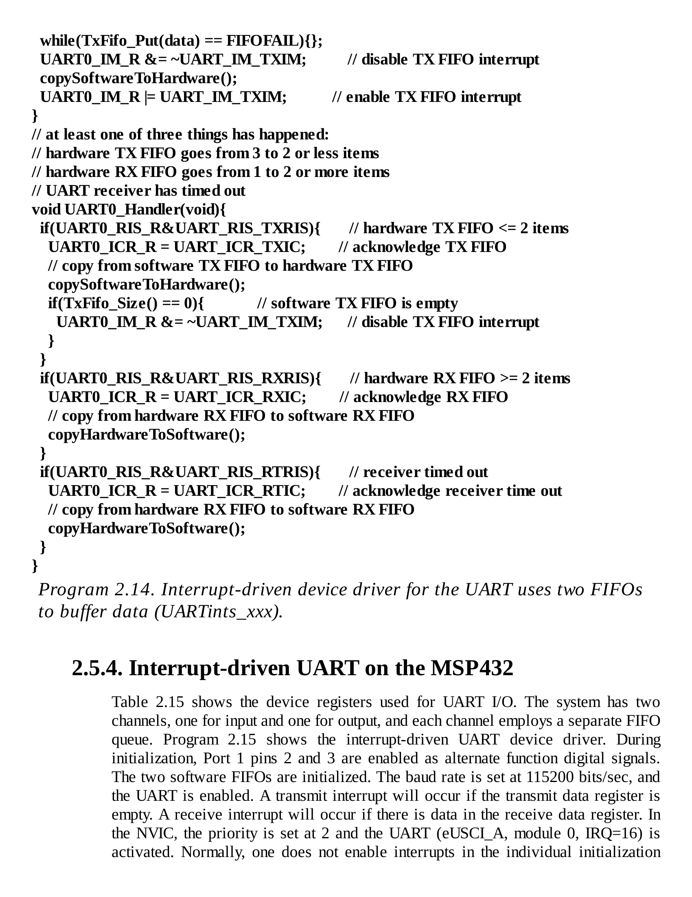
*Description*: Technical schematic and block diagram illustrating circuit operation, signal pathways, and functional behavior for Program 2.14: Interrupt-driven device driver for the UART uses two FIFOs.

> **Program 2.14: Interrupt-driven device driver for the UART uses two FIFOs**

to buffer data (UARTints_xxx).
2.5.4. Interrupt-driven UART on the MSP432


*Description*: Register layout and memory mapping diagram specifying bit fields, stack pointer allocations, and memory address boundaries for Table 2.15: shows the device registers used for UART I/O. The system has two.

> **Table 2.15: shows the device registers used for UART I/O. The system has two**

channels, one for input and one for output, and each channel employs a separate FIFO
queue. Program 2.15 shows the interrupt-driven UART device driver. During
initialization, Port 1 pins 2 and 3 are enabled as alternate function digital signals.
The two software FIFOs are initialized. The baud rate is set at 115200 bits/sec, and
the UART is enabled. A transmit interrupt will occur if the transmit data register is
empty. A receive interrupt will occur if there is data in the receive data register. In
the NVIC, the priority is set at 2 and the UART (eUSCI_A, module 0, IRQ=16) is
activated. Normally, one does not enable interrupts in the individual initialization


<!-- Page 146 -->
### [PDF Page 146]

functions. Rather, interrupts should be enabled in the main program, after all
initialization functions have completed.
We will employ TXIFG and RXIFG interrupt trigger flags, located in the UCA0IFG
register. The arm bits TXIE and RXIE are located in the UCA0IE register.  TXIFG
is set when the TXBUF is empty meaning it is safe to start another output. Writing to
TXBUF automatically clears TXIFG, acknowledging the transmit interrupt. RXIFG
is set when the RXBUF is full meaning it is time to read the RXBUF. Reading
RXBUF automatically clears RXIFG, acknowledging the receive interrupt. The
Interrupt Enable Registers UCAxIE and UCBxIE are reset after a hardware reset or
when the USCI module is in reset (bit 0 of UCxxCTLW0 is 1).
When the main thread wishes to output it calls UART_OutChar , which will put the
data into the software TxFifo. Next, it enables the transmit interrupts. The UART ISR
will copy data from the TxFifo to the TXBUF. The use of the FIFO guarantees data is
transmitted in order. When the TxFifo becomes empty it will disarm the transmit
interrupts.
15
14
13
12
11
10
9
8
0x40001000
PEN
PAR
MSB
7BIT
SPB
MODEx
SYNC
UCAxCTLW0
7
6
5
4
3
2
1
0
SSELx
RXEIE
BRKIE
DORM
TXADDR
TXBRK
SWRST
UCAxCTLW0
15 – 0
0x40001006
UCBRx
UCAxBRW
15 – 8
7 – 4
3 – 1
0
0x40001008
BRSx
BRFx
UCOS16
UCAxMCTLW
7
6
5
4
3
2
1
0
0x4000100A
LISTEN
FE
OE
PE
BRK
RXERR
IDLE
BUSY
UCAxSTATW
15 – 8
7 – 0
0x4000100C
RXBUFx
UCAxRXBUF
15 – 8
7 – 0
0x4000100E
TXBUFx
UCAxTXBUF
15 – 4
3
2
1
0
0x4000101A
TXCPTIE
STTIE
TXIE
RXIE
UCAxIE
15 – 4
3
2
1
0
0x4000101C
TXCPTIFG
STTIFG
TXIFG
RXIFG
UCAxIFG

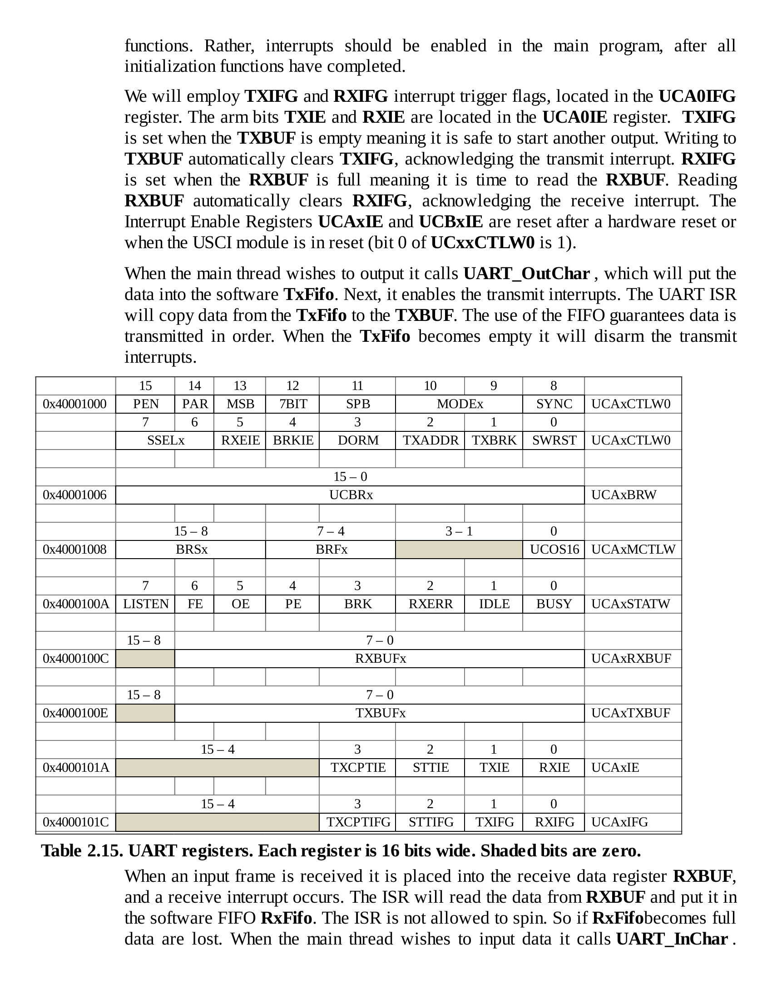
*Description*: Register layout and memory mapping diagram specifying bit fields, stack pointer allocations, and memory address boundaries for Table 2.15: UART registers. Each register is 16 bits wide. Shaded bits are zero..

> **Table 2.15: UART registers. Each register is 16 bits wide. Shaded bits are zero.**

When an input frame is received it is placed into the receive data register RXBUF,

```assembly
and a receive interrupt occurs. The ISR will read the data from RXBUF and put it in
```

the software FIFO RxFifo. The ISR is not allowed to spin. So if RxFifobecomes full
data are lost. When the main thread wishes to input data it calls UART_InChar .


<!-- Page 147 -->
### [PDF Page 147]

This function simply gets from the software FIFO. In contrast to the ISR, the
foreground is allowed to spin. So if the main program calls UART_InChar  and the
RxFifo is empty, it will spin.
#define FIFOSIZE   16         // size of the FIFOs (must be power of 2)
#define FIFOSUCCESS 1         // return value on success
#define FIFOFAIL    0         // return value on failure
AddIndexFifo(Rx, FIFOSIZE, char, FIFOSUCCESS, FIFOFAIL)
AddIndexFifo(Tx, FIFOSIZE, char, FIFOSUCCESS, FIFOFAIL)

```c
void UART_Init(void){  // should be called only once
RxFifo_Init();       // initialize FIFOs
TxFifo_Init();
UCA0CTLW0 = 0x0001;  // hold the USCI module in reset mode
UCA0CTLW0 = 0x00C1;  // UART,SMCLK, 8bit, 1 stop,no parity, LSB first
UCA0BRW = 26;        // UCBR = baud rate = 3000000/115200 = 26.0417
UCA0MCTLW = 0x0000;  // clear first and second modulation, UCOS16=0
P1SEL0 |= 0x0C;
P1SEL1 &= ~0x0C;      // P1.3 and P1.2 as primary module function
NVIC_IPR4 = (NVIC_IPR4&0xFFFFFF00)|0x00000040; // priority 2
NVIC_ISER0 = 0x00010000; // enable interrupt 16 in NVIC
UCA0CTLW0 &= ~0x0001;    // enable the USCI module
UCA0IE = 0x0001;     // enable interrupts on receive full
// disable interrupts on transmit, start, complete
}                      // must modify UCxxIE while USCI module not reset
// input ASCII character from UART
// spin if RxFifo is empty
char UART_InChar(void){
char letter;
while(RxFifo_Get(&letter) == FIFOFAIL){};
return(letter);
}
// output ASCII character to UART
// spin if TxFifo is full
void UART_OutChar(char data){
while(TxFifo_Put(data) == FIFOFAIL){}; // spin if full
UCA0IE = 0x0003;           // enable interrupts on transmit empty
}
// interrupt 16 occurs on either:
// UCTXIFG TX data register is empty
// UCRXIFG RX data register is full
// vector at 0x00000080 in startup_msp432.s
void EUSCIA0_IRQHandler(void){ char data;
if(UCA0IFG&0x02){             // TX data register empty
if(TxFifo_Get(&data) == FIFOFAIL){
```


<!-- Page 148 -->
### [PDF Page 148]

UCA0IE = 0x0001;        // disable interrupts on transmit empty
}else{
UCA0TXBUF = data;         // send data, acknowledge interrupt
}
}

```c
if(UCA0IFG&0x01){             // RX data register full
RxFifo_Put((char)UCA0RXBUF);// clears UCRXIFG
}
}
```


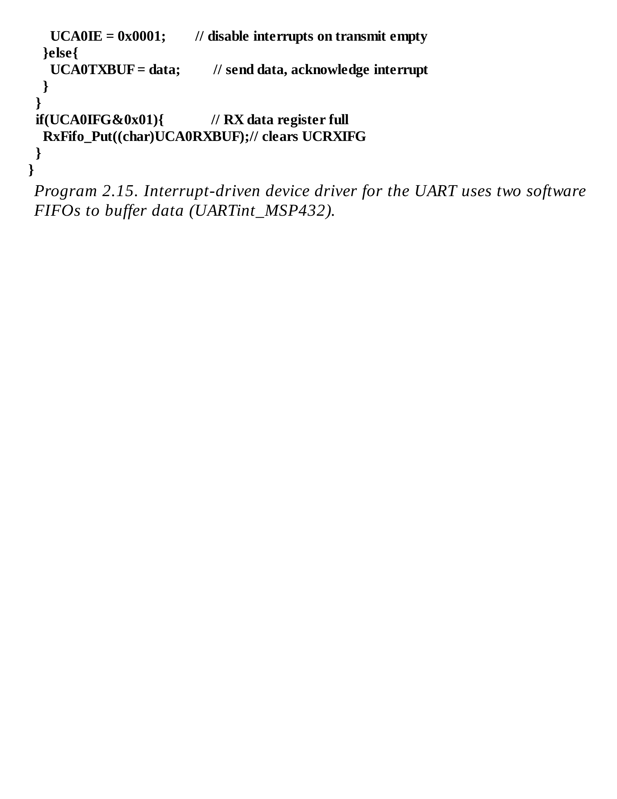
*Description*: Technical schematic and block diagram illustrating circuit operation, signal pathways, and functional behavior for Program 2.15: Interrupt-driven device driver for the UART uses two software.

> **Program 2.15: Interrupt-driven device driver for the UART uses two software**

FIFOs to buffer data (UARTint_MSP432).


<!-- Page 149 -->
### [PDF Page 149]

2.6. Synchronous Transmission and Receiving using
the SSI
SSI allows microcontrollers to communicate synchronously with peripheral devices

```assembly
and other microcontrollers. The SSI system can operate as a master or as a slave.
```

The channel can have one master and one slave, or it can have one master and
multiple slaves. With multiple slaves, the configuration can be a star (centralized
master connected to each slave), or a ring (each node has one receiver and one
transmitter, where the nodes are connected in a circle.) The master initiates all data
communication. Figure 2.13 shows the I/O port locations of some of the synchronous
serial ports on the Texas Instruments microcontrollers.

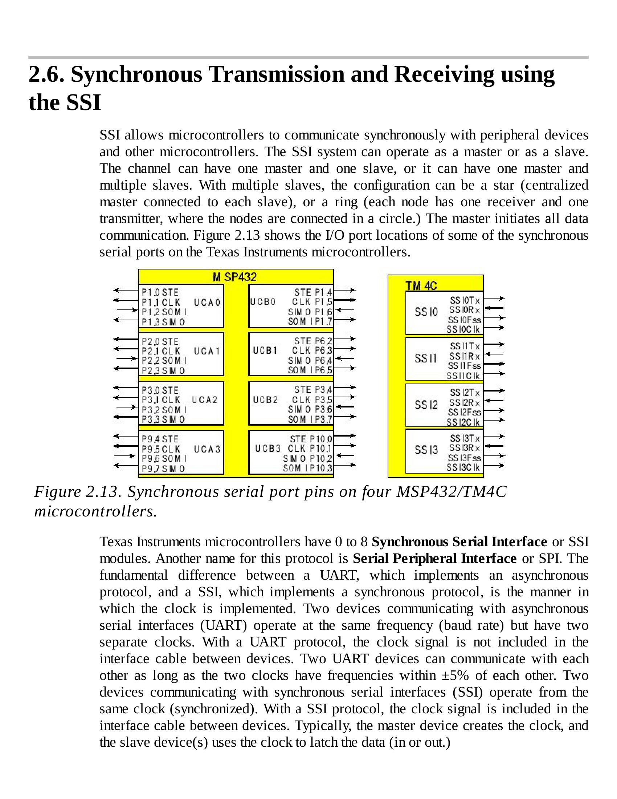
*Description*: Hardware pinout and board interface diagram mapping microcontroller pins, BoosterPack headers, switches, LEDs, and physical connectors for Figure 2.13: Synchronous serial port pins on four MSP432/TM4C.

> **Figure 2.13: Synchronous serial port pins on four MSP432/TM4C**

microcontrollers.
Texas Instruments microcontrollers have 0 to 8 Synchronous Serial Interface or SSI
modules. Another name for this protocol is Serial Peripheral Interface or SPI. The
fundamental difference between a UART, which implements an asynchronous
protocol, and a SSI, which implements a synchronous protocol, is the manner in
which the clock is implemented. Two devices communicating with asynchronous
serial interfaces (UART) operate at the same frequency (baud rate) but have two
separate clocks. With a UART protocol, the clock signal is not included in the
interface cable between devices. Two UART devices can communicate with each
other as long as the two clocks have frequencies within ±5% of each other. Two
devices communicating with synchronous serial interfaces (SSI) operate from the
same clock (synchronized). With a SSI protocol, the clock signal is included in the
interface cable between devices. Typically, the master device creates the clock, and
the slave device(s) uses the clock to latch the data (in or out.)


<!-- Page 150 -->
### [PDF Page 150]

The SSI protocol includes four I/O lines. The slave select SSI0Fss/STE is an
optional negative logic control signal from master to slave signal signifying the
channel is active. The second line, SCK/CLK, is a 50% duty cycle clock generated
by the master. The SSI0Tx/SIMO (master out slave in, MOSI) is a data line driven
by the master and received by the slave. The SSI0Rx/SOMI (master in slave out,
MISO) is a data line driven by the slave and received by the master. In order to work
properly, the transmitting device uses one edge of the clock to change its output, and
the receiving device uses the other edge to accept the data.

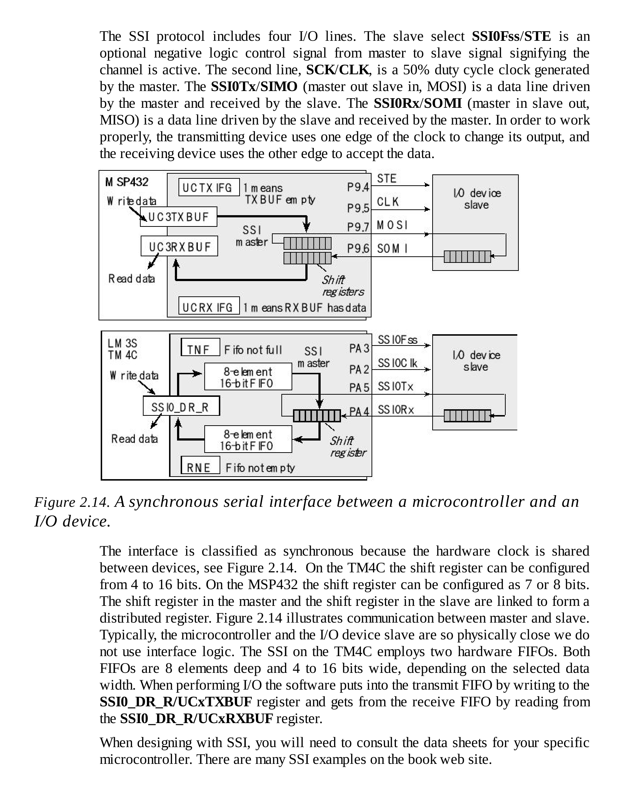
*Description*: Hardware pinout and board interface diagram mapping microcontroller pins, BoosterPack headers, switches, LEDs, and physical connectors for Figure 2.14: A synchronous serial interface between a microcontroller and an.

> **Figure 2.14: A synchronous serial interface between a microcontroller and an**

I/O device.
The interface is classified as synchronous because the hardware clock is shared
between devices, see Figure 2.14.  On the TM4C the shift register can be configured
from 4 to 16 bits. On the MSP432 the shift register can be configured as 7 or 8 bits.
The shift register in the master and the shift register in the slave are linked to form a
distributed register. Figure 2.14 illustrates communication between master and slave.
Typically, the microcontroller and the I/O device slave are so physically close we do
not use interface logic. The SSI on the TM4C employs two hardware FIFOs. Both
FIFOs are 8 elements deep and 4 to 16 bits wide, depending on the selected data
width. When performing I/O the software puts into the transmit FIFO by writing to the
SSI0_DR_R/UCxTXBUF register and gets from the receive FIFO by reading from
the SSI0_DR_R/UCxRXBUF register.
When designing with SSI, you will need to consult the data sheets for your specific
microcontroller. There are many SSI examples on the book web site.


<!-- Page 151 -->
### [PDF Page 151]

2.7. Input Capture or Input Edge Time Mode
2.7.1. Basic principles
The Texas Instruments microcontrollers have timers that are separate and distinct
from SysTick, see Figure 2.15. Input edge time mode (or input capture mode) is used
to make time measurements on input signals.  We can use input capture to measure the
period or pulse width of digital-level signals. The input capture system can also be
used to trigger interrupts on rising or falling transitions of external signals. Each
timer input capture module has
An external input pin, e.g., CCP0/TAx.y
A clock, with prescale, used to measure time
Control registers to set the mode
Flag register that indicate status
Arm and enable registers to implement interrupts
A capture register, e.g., TAR/TAxCCRy
The various members of the MSP432/TM4C family have from zero to twenty input
capture pins, and the pins are grouped into modules. Figure 2.15 shows the port pins

```assembly
and timer modules used for input capture on the MSP432 and TM4C123. On the
```

TM4C, the input capture and output compare pins are labeled TxCCPy. On the
MSP432, the input capture and output compare pins are labeled TAx.y. Some timer
modules are not attached to any I/O pins. For example, the TM4C1294 has eight
timers, but Timer 6 and Timer 7 do not have I/O pins. Timers without pins can be
used to generate periodic interrupts, but not for input capture. Tables 1.4, and 1.5
describe how to attach I/O pins to the timer modules.
In this book we use the term arm to describe the bit that allows/denies a specific flag
from requesting an interrupt. The Texas Instruments manuals refer to this bit as a
mask. I.e., the device is armed when the mask bit is 1. Typically, there is a separate
arm bit for every flag that can request an interrupt. An external input signal is
connected to the input capture pin.


<!-- Page 152 -->
### [PDF Page 152]


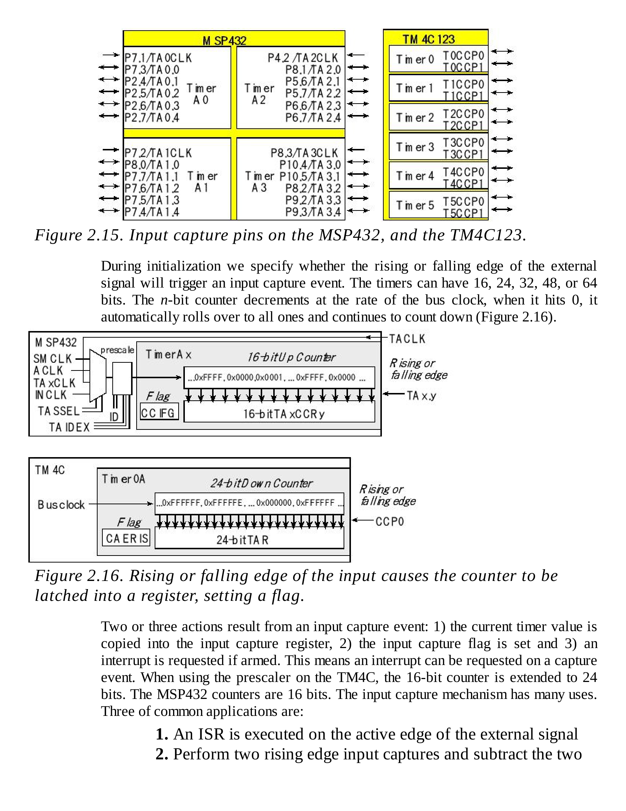
*Description*: Hardware pinout and board interface diagram mapping microcontroller pins, BoosterPack headers, switches, LEDs, and physical connectors for Figure 2.15: Input capture pins on the MSP432, and the TM4C123..

> **Figure 2.15: Input capture pins on the MSP432, and the TM4C123.**

During initialization we specify whether the rising or falling edge of the external
signal will trigger an input capture event. The timers can have 16, 24, 32, 48, or 64
bits. The n-bit counter decrements at the rate of the bus clock, when it hits 0, it
automatically rolls over to all ones and continues to count down (Figure 2.16).


*Description*: Technical schematic and block diagram illustrating circuit operation, signal pathways, and functional behavior for Figure 2.16: Rising or falling edge of the input causes the counter to be.

> **Figure 2.16: Rising or falling edge of the input causes the counter to be**

latched into a register, setting a flag.
Two or three actions result from an input capture event: 1) the current timer value is
copied into the input capture register, 2) the input capture flag is set and 3) an
interrupt is requested if armed. This means an interrupt can be requested on a capture
event. When using the prescaler on the TM4C, the 16-bit counter is extended to 24
bits. The MSP432 counters are 16 bits. The input capture mechanism has many uses.
Three of common applications are:
1. An ISR is executed on the active edge of the external signal
2. Perform two rising edge input captures and subtract the two


<!-- Page 153 -->
### [PDF Page 153]

to get period
3. Perform a rising edge and then a falling edge capture and
subtract the two measurements to get pulse width
2.7.2. Period measurement on the TM4C123
Next we will overview the specific input capture functions on the TM4C family. This
section is intended to supplement rather than replace the data sheets. When designing
systems with input capture, please refer to the reference manual of your specific
microcontroller. Table 2.16 shows some of the registers for Timer 0. We begin
initialization by enabling the clock for the timer and for the digital port we will be
using. We enable the digital pin and select its alternative function. We will disable
the timer during initialization by clearing the TAEN (or TBEN) bit in
the TIMER0_CTL_R  register. To use 16-bit mode, we set GPTMCFG field to 4.
We clear the TAAMS (or TBAMS) bit for capture mode. We set the TACMR (or
TBCMR) bit for input edge time mode. The TAMR (or TBMR) field is set to 3 for
capture mode. In summary, we write a 0x0007 to the TIMER0_TAMR_R  register to
select input capture mode. Table 2.17 lists the edge capture modes for TAEVENT
(or TBEVENT.)
When we are measuring time with prescaler, such as period measurement and pulse
width measurement, we set the 24-bit reload value to 0xFFFFFF. In this way, the 24-
bit subtraction of two capture events yields the time difference between events. In
particular,
we
will
initialize TIMER0_TAILR_R
to
0xFFFF

```assembly
and TIMER0_TAPR_R  to 0xFF. We arm the input capture by setting the CAEIM
```

(or CBEIM) bit in the TIMER0_IMR_R  register. It is good practice to clear the
trigger flag in the initialization so that the first interrupt occurs do to actions
occurring after the initialization, and not due to edges that might have occurred during
power up. The trigger flags are in the TIMER0_RIS_R  register. These flags are
cleared by writing 1’s into corresponding bits in the TIMER0_ICR_R  register.
After all configuration bits are set, the Timer can be enabled by setting the TAEN (or
TBEN) bit in the TIMER0_CTL_R  register. If interrupts are required, then the
NVIC must be configured by setting the priority and enabling the appropriate
interrupt number.
There
is
an
8-bit
prescaler
defined
for
each
submodules
A
and
B: TIMER0_TAPMR_R and  TIMER0_TBPMR_R . The prescalers on the TM4C
are used to extend the 16-bit timer to 24 bits. The TAEVENTbits
of TIMER0_CTL_R  register specify whether the rising or falling edge of CCP0
will trigger an input capture event on Timer 0A. Two or three actions result from an
input capture event: 1) the current timer value is copied into the input capture
register, TIMER0_TAR_R , 2) the input capture flag (CAERIS) is set, and 3) an
interrupt is requested if the mask bit (CAEIM) is 1.  The CAERIS and CBERIS flag
bitsin the TIMER0_RIS_R  register do not behave like a regular memory location.


<!-- Page 154 -->
### [PDF Page 154]

In particular, the flag cannot be set by software. Rather, an input capture or output
compare hardware event will set the flag.
31–3
2–0
Name
$4003.0000
GPTMCFG
TIMER0_CFG_R
31–4
3
2
1-0
$4003.0004
TAAMS
TACMR
TAMR
TIMER0_TAMR_R
31–4
3
2
1-0
$4003.0008
TBAMS
TBCMR
TBMR
TIMER0_TBMR_R
14
13
11-10
8
6
5
3-2
0
$4003.000C TBPWML TBOTE TBEVENT
TBEN
TAPWML
TAOTE
TAEVENT
TAEN
TIMER0_CTL_R
31-11
10
9
8
7-4
2
1
0
$4003.0018
CBEIM
CBMIM
TBTOIM
CAEIM
CAMIM
TATOIM TIMER0_IMR_R
31-11
10
9
8
7-4
2
1
0
$4003.001C
CBERIS
CBMRIS
TBTORIS
CAERIS
CAMRIS
TATORIS TIMER0_RIS_R
31-11
10
9
8
7-4
2
1
0
$4003.0020
CBEMIS CBMMIS TBTOMIS
CAEMIS
CAMMIS
TATOMIS TIMER0_MIS_R
31-11
10
9
8
7-4
2
1
0
$4003.0020
CBECINT CBMCINT TBTOCINT
CAECINT CAMCINT TATOCINT TIMER0_ICR_R
31–16
15–0
$4003.0028
TAILRH
TAILRL
TIMER0_TAILR_R
31–16
15–0
$4003.002C
TBILRL
TIMER0_TBILR_R
31–16
15–0
$4003.0030
TAMRH
TAMRL
_TAMATCHR_R
31–16
15–0
$4003.0034
TBMRL
_TBMATCHR_R
31–8
7-0
$4003.0038
TAPSR
TIMER0_TAPR_R
31–8
7-0
$4003.003C
TBPSR
TIMER0_TBPR_R
31–8
7-0
$4003.0040
TAPSMR
TIMER0_TAPMR_R
31–8
7-0
$4003.0044
TBPSMR
TIMER0_TBPMR_R


<!-- Page 155 -->
### [PDF Page 155]

31–16
15-0
$4003.0048
TARH
TARL
TIMER0_TAR_R
31–16
15-0
$4003.004C
TBRL
TIMER0_TBR_R


*Description*: Register layout and memory mapping diagram specifying bit fields, stack pointer allocations, and memory address boundaries for Table 2.16: Timer0 registers. Each register is 32 bits wide. Shaded bits are zero. The bits.

> **Table 2.16: Timer0 registers. Each register is 32 bits wide. Shaded bits are zero. The bits**

shown in bold will be used in this section. Timers 1, 2, … have the same formats.
The other peculiar behavior of the flag is that the software must write a one to
the TIMER0_ICR_R  register in order to clear the flag. If the software writes a zero
to the TIMER0_ICR_R  register, no change will occur. From Table 2.16, we see the
CAERIStrigger flag is in bit 2 of the TIMER0_RIS_R  register. The proper way to
clear this trigger flag is
TIMER0_ICR_R = 0x0004;
Writes the TIMER0_RIS_R  register have no effect. No effect occurs in the bits to
which we write a zero in the TIMER0_ICR_R  register.
TAEVENT Active edge
00
Capture on rising
01
Capture on falling
10
Reserved
11
Capture on both rising and falling


*Description*: Reference table detailing hardware parameters, register bit patterns, performance metrics, or memory configurations for Table 2.17: Two control bits define the active edge used for input capture (TBEVENT is the.

> **Table 2.17: Two control bits define the active edge used for input capture (TBEVENT is the**

same).
Before one implements a system that measures period, it is appropriate to consider
the issues of resolution, precision and range. The resolution of a period measurement
is defined as the smallest change in period that can reliably be detected. In the
following example, the TM4C123 bus clock is 80 MHz. This means, if the period
increases by 12.5 ns, then there will be one more Timer clock between the first rising
edge and the second rising edge. In this situation, the 24-bit subtraction will increase
by 1, therefore the period measurement resolution is 12.5 ns. The resolution is the
smallest measurable change. Resolution definesthe units of the measurement. In this
first example, if the calculation of Period  results in 1000, then it represents a period
of 1000•12.5ns or 12.5µs.  The precision of the period measurement is defined as the
number of separate and distinguishable measurements.  If the 24-bit counter is used,
there are about 16 million different periods that can be measured. We can specify the
precision in alternatives, e.g., 224, or in bits, e.g., 24 bits. The last issue to consider is
the range of the period measurement, which is defined as the minimum and maximum
values that can reliably be measured. We are concerned what happens if the period is
too small or too large. A good measurement system should be able to detect
overflows and underflows. In addition, we would not like the system to crash, or


<!-- Page 156 -->
### [PDF Page 156]

hang-up if the input period is out of range. Similarly, it is desirable if the system can
detect when there is no period. For edge detection, the input must be high for at least
two system clock periods and low for at least two system clock periods.
In this example, the digital input signal is connected to an input capture pin. If the
motor shaft rotates once there will be N rising edges on the pin. Each rising edge will
cause an input capture interrupt (Figure 2.17).

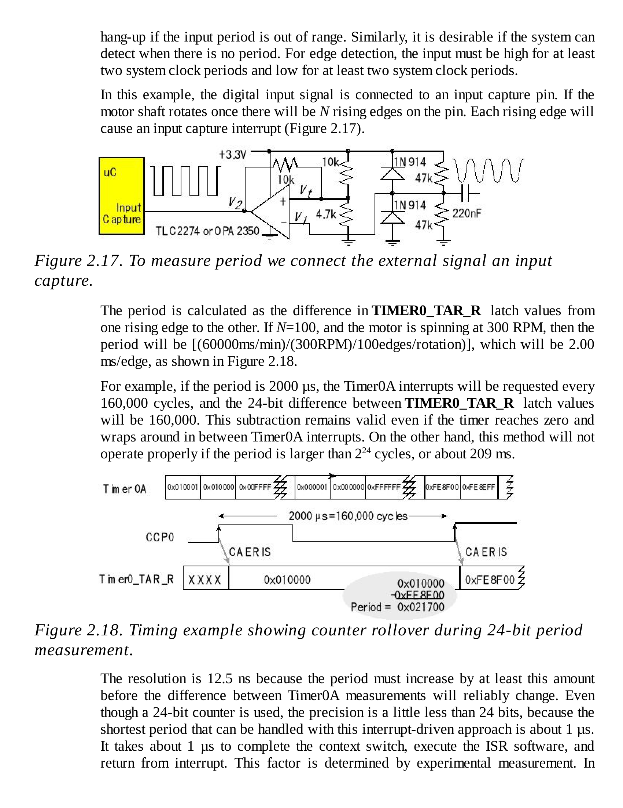
*Description*: Technical schematic and block diagram illustrating circuit operation, signal pathways, and functional behavior for Figure 2.17: To measure period we connect the external signal an input.

> **Figure 2.17: To measure period we connect the external signal an input**

capture.
The period is calculated as the difference in TIMER0_TAR_R  latch values from
one rising edge to the other. If N=100, and the motor is spinning at 300 RPM, then the
period will be [(60000ms/min)/(300RPM)/100edges/rotation)], which will be 2.00
ms/edge, as shown in Figure 2.18.
For example, if the period is 2000 µs, the Timer0A interrupts will be requested every
160,000 cycles, and the 24-bit difference between TIMER0_TAR_R  latch values
will be 160,000. This subtraction remains valid even if the timer reaches zero and
wraps around in between Timer0A interrupts. On the other hand, this method will not
operate properly if the period is larger than 224 cycles, or about 209 ms.


*Description*: Timing waveform and execution flowchart illustrating signal transitions, state machine progression, or algorithm logic for Figure 2.18: Timing example showing counter rollover during 24-bit period.

> **Figure 2.18: Timing example showing counter rollover during 24-bit period**

measurement.
The resolution is 12.5 ns because the period must increase by at least this amount
before the difference between Timer0A measurements will reliably change. Even
though a 24-bit counter is used, the precision is a little less than 24 bits, because the
shortest period that can be handled with this interrupt-driven approach is about 1 µs.
It takes about 1 µs to complete the context switch, execute the ISR software, and
return from interrupt. This factor is determined by experimental measurement. In


<!-- Page 157 -->
### [PDF Page 157]

other words, as the period approaches 1 µs, a higher and higher percentage of the
computer execution is utilized just in the handler itself. For example, if you wanted to
limit execution time in this ISR to 5%, then the shorted period you could measure
would be 20 µs.
Because the input capture interrupt has a separate vector the software does not poll.
An interrupt is requested on each rising edge of the input signal. In this situation we
count all the cycles required to process the interrupt. The period measurement system
written for the TM4C123 is presented in Program 2.16. The 24-bit subtraction is
produced by ANDing the difference with 0x0FFFFFF, calculating the number of bus
clocks between rising edges. The first period measurement will be incorrect and
should be neglected.

```c
uint32_t Period;              // 24-bit, 12.5 ns units
uint32_t static First;        // Timer0A first edge, 12.5 ns units
int32_t Done;                // mailbox status set each rising
void PeriodMeasure_Init(void){
SYSCTL_RCGCTIMER_R |= 0x01;      // activate timer0
SYSCTL_RCGCGPIO_R |= 0x02;       // activate port B
First = 0;                       // first will be wrong
Done = 0;                        // set on subsequent
GPIO_PORTB_DIR_R &= ~0x40;       // make PB6 input
GPIO_PORTB_AFSEL_R |= 0x40;      // enable alt funct on PB6
GPIO_PORTB_DEN_R |= 0x40;        // configure PB6 as T0CCP0
GPIO_PORTB_PCTL_R = (GPIO_PORTB_PCTL_R&0xF0FFFFFF)+0x07000000;
TIMER0_CTL_R &= ~0x00000001;     // disable timer0A during setup
TIMER0_CFG_R = 0x00000004;       // configure for 16-bit capture mode
TIMER0_TAMR_R = 0x00000007;      // configure for rising edge event
TIMER0_CTL_R &= ~0x0000000C;     // rising edge
TIMER0_TAILR_R = 0x0000FFFF;     // start value
TIMER0_TAPR_R = 0xFF;            // activate prescale, creating 24-bit
TIMER0_IMR_R |= 0x00000004;      // enable capture match interrupt
TIMER0_ICR_R = 0x00000004;       // clear timer0A capture match flag
TIMER0_CTL_R |= 0x00000001;      // timer0A 24-b, +edge, interrupts
NVIC_PRI4_R = (NVIC_PRI4_R&0x00FFFFFF)|0x40000000; //Timer0A=priority 2
NVIC_EN0_R = 1<<19;            // enable interrupt 19 in NVIC
EnableInterrupts();
}
void Timer0A_Handler(void){
TIMER0_ICR_R = 0x00000004;       // acknowledge timer0A capture
Period = (First - TIMER0_TAR_R)&0x00FFFFFF; // 12.5ns resolution
First = TIMER0_TAR_R;           // setup for next
Done = 1;                        // set semaphore
}
```


<!-- Page 158 -->
### [PDF Page 158]


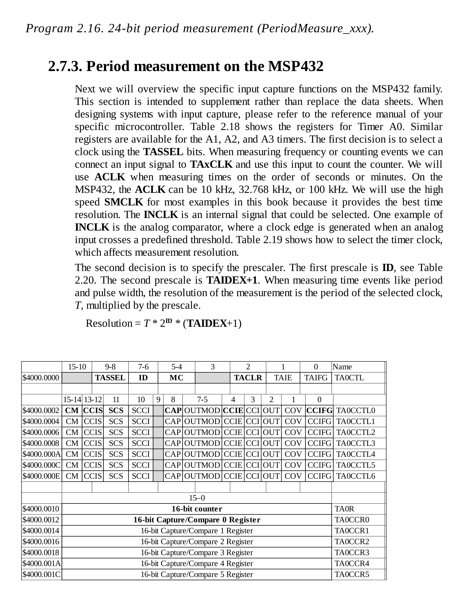
*Description*: Technical schematic and block diagram illustrating circuit operation, signal pathways, and functional behavior for Program 2.16: 24-bit period measurement (PeriodMeasure_xxx)..

> **Program 2.16: 24-bit period measurement (PeriodMeasure_xxx).**

2.7.3. Period measurement on the MSP432
Next we will overview the specific input capture functions on the MSP432 family.
This section is intended to supplement rather than replace the data sheets. When
designing systems with input capture, please refer to the reference manual of your
specific microcontroller. Table 2.18 shows the registers for Timer A0. Similar
registers are available for the A1, A2, and A3 timers. The first decision is to select a
clock using the TASSEL bits. When measuring frequency or counting events we can
connect an input signal to TAxCLK and use this input to count the counter. We will
use ACLK when measuring times on the order of seconds or minutes. On the
MSP432, the ACLK can be 10 kHz, 32.768 kHz, or 100 kHz. We will use the high
speed SMCLK for most examples in this book because it provides the best time
resolution. The INCLK is an internal signal that could be selected. One example of
INCLK is the analog comparator, where a clock edge is generated when an analog
input crosses a predefined threshold. Table 2.19 shows how to select the timer clock,
which affects measurement resolution.
The second decision is to specify the prescaler. The first prescale is ID, see Table
2.20. The second prescale is TAIDEX+1. When measuring time events like period

```assembly
and pulse width, the resolution of the measurement is the period of the selected clock,
```

T, multiplied by the prescale.
Resolution = T * 2ID * (TAIDEX+1)
15-10
9-8
7-6
5-4
3
2
1
0
Name
$4000.0000
TASSEL
ID
MC
TACLR
TAIE
TAIFG  TA0CTL
15-14 13-12
11
10
9
8
7-5
4
3
2
1
0
$4000.0002 CM CCIS SCS
SCCI
CAP OUTMOD CCIE CCI OUT COV CCIFG  TA0CCTL0
$4000.0004
CM CCIS
SCS
SCCI
CAP OUTMOD CCIE CCI OUT COV CCIFG  TA0CCTL1
$4000.0006
CM CCIS
SCS
SCCI
CAP OUTMOD CCIE CCI OUT COV CCIFG  TA0CCTL2
$4000.0008
CM CCIS
SCS
SCCI
CAP OUTMOD CCIE CCI OUT COV CCIFG  TA0CCTL3
$4000.000A CM CCIS
SCS
SCCI
CAP OUTMOD CCIE CCI OUT COV CCIFG  TA0CCTL4
$4000.000C CM CCIS
SCS
SCCI
CAP OUTMOD CCIE CCI OUT COV CCIFG  TA0CCTL5
$4000.000E CM CCIS
SCS
SCCI
CAP OUTMOD CCIE CCI OUT COV CCIFG  TA0CCTL6
15–0
$4000.0010
16-bit counter
TA0R
$4000.0012
16-bit Capture/Compare 0 Register
TA0CCR0
$4000.0014
16-bit Capture/Compare 1 Register
TA0CCR1
$4000.0016
16-bit Capture/Compare 2 Register
TA0CCR2
$4000.0018
16-bit Capture/Compare 3 Register
TA0CCR3
$4000.001A
16-bit Capture/Compare 4 Register
TA0CCR4
$4000.001C
16-bit Capture/Compare 5 Register
TA0CCR5


<!-- Page 159 -->
### [PDF Page 159]

$4000.001E
16-bit Capture/Compare 6 Register
TA0CCR6
15-3
2-0
$4000.0020
TAIDEX
TA0EX0
15-0
$4000.002E
TAIV
TA0IV


*Description*: Register layout and memory mapping diagram specifying bit fields, stack pointer allocations, and memory address boundaries for Table 2.18: Timer A0 registers. Each register is 16 bits wide. Shaded bits are reserved. The.

> **Table 2.18: Timer A0 registers. Each register is 16 bits wide. Shaded bits are reserved. The**

bits shown in bold will be used in this section. Timers 1, 2, and 3 have the same formats.
TASSEL Selected Clock
00
TAxCLK
01
ACLK
10
SMCLK
11
INCLK

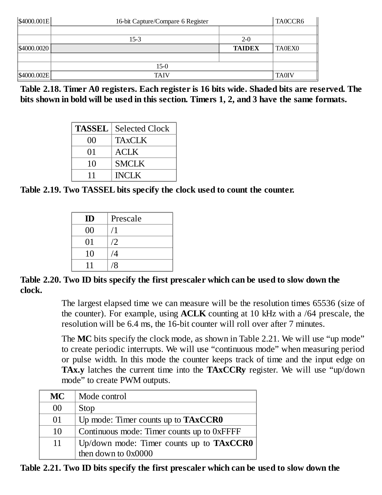
*Description*: Reference table detailing hardware parameters, register bit patterns, performance metrics, or memory configurations for Table 2.19: Two TASSEL bits specify the clock used to count the counter..

> **Table 2.19: Two TASSEL bits specify the clock used to count the counter.**

ID
Prescale
00
/1
01
/2
10
/4
11
/8


*Description*: Reference table detailing hardware parameters, register bit patterns, performance metrics, or memory configurations for Table 2.20: Two ID bits specify the first prescaler which can be used to slow down the.

> **Table 2.20: Two ID bits specify the first prescaler which can be used to slow down the**

clock.
The largest elapsed time we can measure will be the resolution times 65536 (size of
the counter). For example, using ACLK counting at 10 kHz with a /64 prescale, the
resolution will be 6.4 ms, the 16-bit counter will roll over after 7 minutes.
The MC bits specify the clock mode, as shown in Table 2.21. We will use “up mode”
to create periodic interrupts. We will use “continuous mode” when measuring period
or pulse width. In this mode the counter keeps track of time and the input edge on
TAx.y latches the current time into the TAxCCRy register. We will use “up/down
mode” to create PWM outputs.
MC
Mode control
00
Stop
01
Up mode: Timer counts up to TAxCCR0
10
Continuous mode: Timer counts up to 0xFFFF
11
Up/down mode: Timer counts up to TAxCCR0
then down to 0x0000


*Description*: Reference table detailing hardware parameters, register bit patterns, performance metrics, or memory configurations for Table 2.21: Two ID bits specify the first prescaler which can be used to slow down the.

> **Table 2.21: Two ID bits specify the first prescaler which can be used to slow down the**


<!-- Page 160 -->
### [PDF Page 160]

clock.
Writing a 1 to the TACLR bit will reset the timer and automatically clear the
TACLR bit. The TAIFG flag bit is set when the timer rolls over. Its associated arm
bit is TAIE. To clear this interrupt trigger, the software writes a 0 to TAIFG.
As mentioned earlier for each timer there are seven associated submodules. Five of
the submodules have a pin that could be used as an input to measure time events or as
an output to generate waveforms. Table 2.22 lists the three choices for selecting the
edge that will cause an input capture event. A capture event copies the TAxR counter
into TAxCCRy register and sets the CCIFG flag. If armed (CCIE) this flag will
interrupt. To acknowledge the interrupt, the software writes a zero into the flag.
These are the steps to configure an input capture:
1) Connect the input signal to one of the TAx.y timer pins
2) Specify the timer function in its PxSEL1 and PxSEL0 register
3) Specify it as an input by clearing the direction bit in PxDIR
4) Halt the timer during initialization (MC=00)
5) Select the clock source and prescaler
6) Specify the rising, falling or both edges in the CM bits (Table
2.22)
Set CCIS to 00 to select the input pin
Set SCS to 1 to synchronize input pin to the clock (prevents
glitches)
Set CAP to 1 for capture mode
Set CCIE to arm the CCIFG capture flag
7) Set the interrupt priority in the NVIC
8) Arm the interrupt in the NVIC
9) Reset and start the timer, placing it in continuous mode
CM
Capture mode
00
No capture
01
Capture on rising edge
10
Capture on falling edge
11
Capture on both rising and falling edges

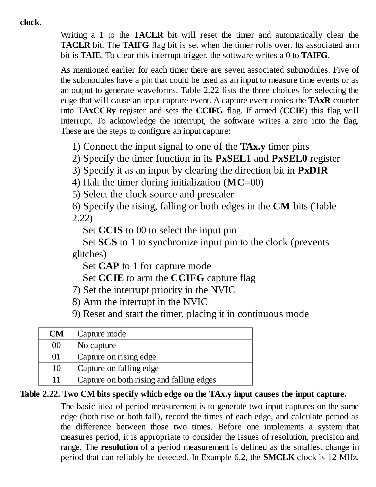
*Description*: Reference table detailing hardware parameters, register bit patterns, performance metrics, or memory configurations for Table 2.22: Two CM bits specify which edge on the TAx.y input causes the input capture..

> **Table 2.22: Two CM bits specify which edge on the TAx.y input causes the input capture.**

The basic idea of period measurement is to generate two input captures on the same
edge (both rise or both fall), record the times of each edge, and calculate period as
the difference between those two times. Before one implements a system that
measures period, it is appropriate to consider the issues of resolution, precision and
range. The resolution of a period measurement is defined as the smallest change in
period that can reliably be detected. In Example 6.2, the SMCLK clock is 12 MHz.


<!-- Page 161 -->
### [PDF Page 161]

This means, if the period increases by 83.3 ns, then there will be one more Timer
clock between the first rising edge and the second rising edge. In this situation, the
16-bit subtraction will increase by 1, therefore the period measurement resolution is

## 83.3 ns. The resolution is the smallest measurable change. Resolution definesthe units

of the measurement. In this first example, if the calculation of Period  results in 1000,
then it represents a period of 1000•83.3ns or 83.3µs.  The precision of the period
measurement is defined as the number of separate and distinguishable measurements.
If the 16-bit counter is used, there are about 65,536 different periods that can be
measured. We can specify the precision in alternatives, e.g., 216, or in bits, e.g., 16
bits. The last issue to consider is the range of the period measurement, which is
defined as the minimum and maximum values that can reliably be measured. We are
concerned what happens if the period is too small or too large. A good measurement
system should be able to detect overflows and underflows. In addition, we would not
like the system to crash, or hang-up if the input period is out of range. Similarly, it is
desirable if the system can detect when there is no period. For edge detection, the
input must be high for at least two system clock periods and low for at least two
timer clock periods.
In this example, the digital input signal is connected to an input capture pin,
P7.3/TA0.0. The diodes, 47k, and 220nF create a 0 to 3.3V signal on V1. The 10k-
4.7k create a reference voltage Vt, and the 10k positive feedback resistor removes
glitches. V2 is a squarewave at the same frequency as the input. Let N be the number
of rising edges as the shaft rotates once. We will set the timer period to 5.33µs. Each
rising edge will cause Timer A0 to generate an input capture interrupt (Figure 2.19).

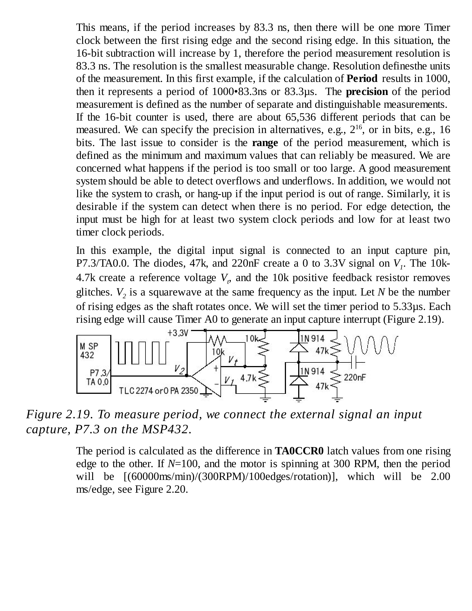
*Description*: Technical schematic and block diagram illustrating circuit operation, signal pathways, and functional behavior for Figure 2.19: To measure period, we connect the external signal an input.

> **Figure 2.19: To measure period, we connect the external signal an input**

capture, P7.3 on the MSP432.
The period is calculated as the difference in TA0CCR0 latch values from one rising
edge to the other. If N=100, and the motor is spinning at 300 RPM, then the period
will be [(60000ms/min)/(300RPM)/100edges/rotation)], which will be 2.00
ms/edge, see Figure 2.20.


<!-- Page 162 -->
### [PDF Page 162]


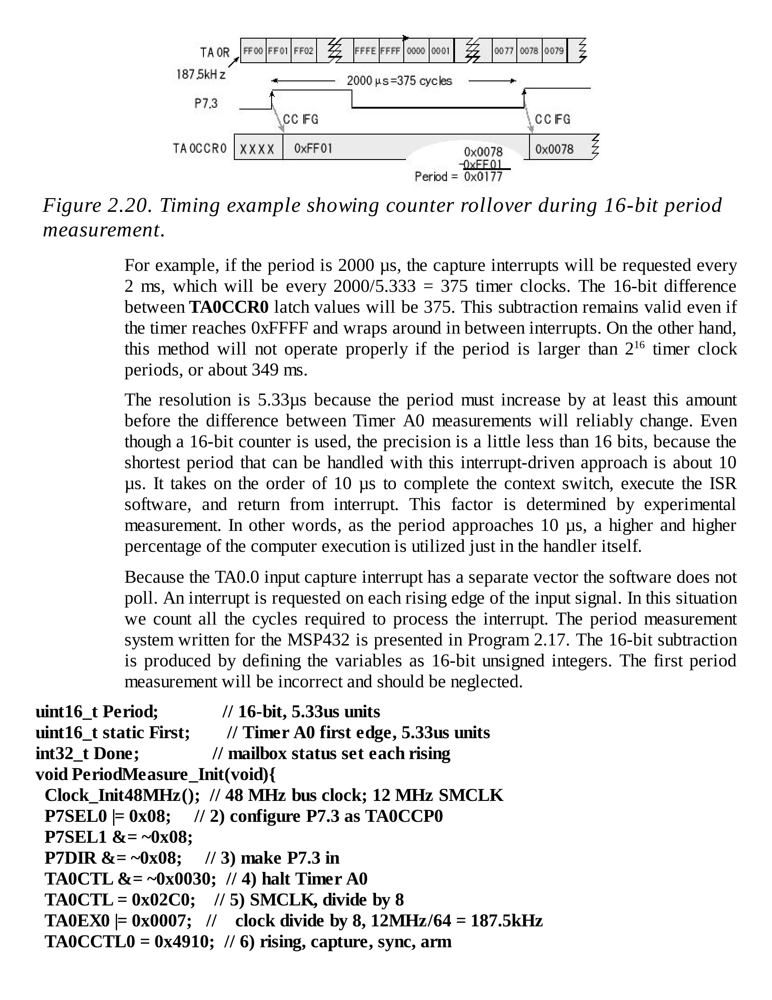
*Description*: Timing waveform and execution flowchart illustrating signal transitions, state machine progression, or algorithm logic for Figure 2.20: Timing example showing counter rollover during 16-bit period.

> **Figure 2.20: Timing example showing counter rollover during 16-bit period**

measurement.
For example, if the period is 2000 µs, the capture interrupts will be requested every
2 ms, which will be every 2000/5.333 = 375 timer clocks. The 16-bit difference
between TA0CCR0 latch values will be 375. This subtraction remains valid even if
the timer reaches 0xFFFF and wraps around in between interrupts. On the other hand,
this method will not operate properly if the period is larger than 216 timer clock
periods, or about 349 ms.
The resolution is 5.33µs because the period must increase by at least this amount
before the difference between Timer A0 measurements will reliably change. Even
though a 16-bit counter is used, the precision is a little less than 16 bits, because the
shortest period that can be handled with this interrupt-driven approach is about 10
µs. It takes on the order of 10 µs to complete the context switch, execute the ISR
software, and return from interrupt. This factor is determined by experimental
measurement. In other words, as the period approaches 10 µs, a higher and higher
percentage of the computer execution is utilized just in the handler itself.
Because the TA0.0 input capture interrupt has a separate vector the software does not
poll. An interrupt is requested on each rising edge of the input signal. In this situation
we count all the cycles required to process the interrupt. The period measurement
system written for the MSP432 is presented in Program 2.17. The 16-bit subtraction
is produced by defining the variables as 16-bit unsigned integers. The first period
measurement will be incorrect and should be neglected.
uint16_t Period;              // 16-bit, 5.33us units
uint16_t static First;        // Timer A0 first edge, 5.33us units

```c
int32_t Done;                // mailbox status set each rising
void PeriodMeasure_Init(void){
Clock_Init48MHz();  // 48 MHz bus clock; 12 MHz SMCLK
P7SEL0 |= 0x08;     // 2) configure P7.3 as TA0CCP0
P7SEL1 &= ~0x08;
P7DIR &= ~0x08;     // 3) make P7.3 in
TA0CTL &= ~0x0030;  // 4) halt Timer A0
TA0CTL = 0x02C0;    // 5) SMCLK, divide by 8
TA0EX0 |= 0x0007;   //    clock divide by 8, 12MHz/64 = 187.5kHz
TA0CCTL0 = 0x4910;  // 6) rising, capture, sync, arm
```


<!-- Page 163 -->
### [PDF Page 163]

NVIC_IPR2 = (NVIC_IPR2&0xFFFFFF00)|0x00000040; // 7) priority 2
NVIC_ISER0 = 0x00000100; // 8) enable interrupt 8 in NVIC
TA0CTL |= 0x0024;       // 9) reset and start in continuous mode
EnableInterrupts();
}

```c
void TA0_0_IRQHandler(void){
TA0CCTL0 &= ~0x0001;       // acknowledge TA0.0 capture
Period = TA0CCR0 - First; // 5.33us resolution
First = TA0CCR0;           // setup for next
Done = 1;                  // set semaphore
}
```


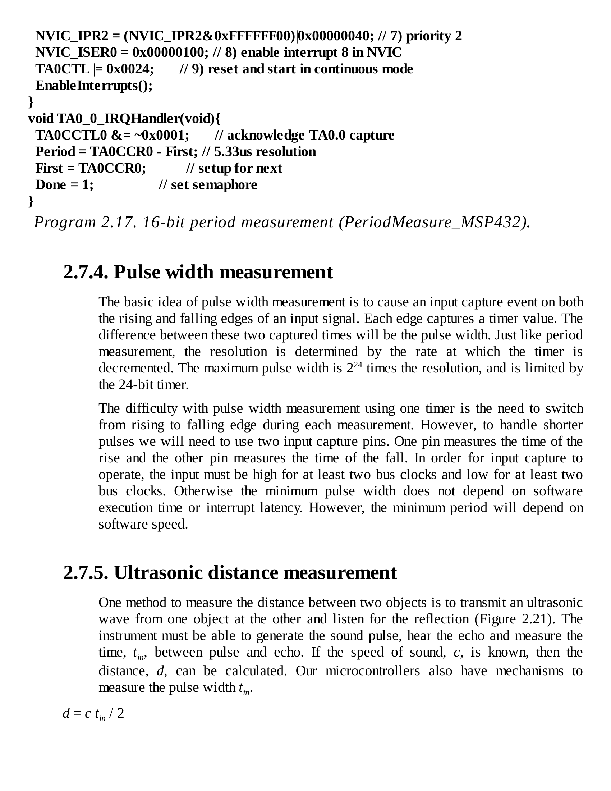
*Description*: Technical schematic and block diagram illustrating circuit operation, signal pathways, and functional behavior for Program 2.17: 16-bit period measurement (PeriodMeasure_MSP432)..

> **Program 2.17: 16-bit period measurement (PeriodMeasure_MSP432).**

2.7.4. Pulse width measurement
The basic idea of pulse width measurement is to cause an input capture event on both
the rising and falling edges of an input signal. Each edge captures a timer value. The
difference between these two captured times will be the pulse width. Just like period
measurement, the resolution is determined by the rate at which the timer is
decremented. The maximum pulse width is 224 times the resolution, and is limited by
the 24-bit timer.
The difficulty with pulse width measurement using one timer is the need to switch
from rising to falling edge during each measurement. However, to handle shorter
pulses we will need to use two input capture pins. One pin measures the time of the
rise and the other pin measures the time of the fall. In order for input capture to
operate, the input must be high for at least two bus clocks and low for at least two
bus clocks. Otherwise the minimum pulse width does not depend on software
execution time or interrupt latency. However, the minimum period will depend on
software speed.
2.7.5. Ultrasonic distance measurement
One method to measure the distance between two objects is to transmit an ultrasonic
wave from one object at the other and listen for the reflection (Figure 2.21). The
instrument must be able to generate the sound pulse, hear the echo and measure the
time, tin, between pulse and echo. If the speed of sound, c, is known, then the
distance, d, can be calculated. Our microcontrollers also have mechanisms to
measure the pulse width tin.
d = c tin / 2


<!-- Page 164 -->
### [PDF Page 164]


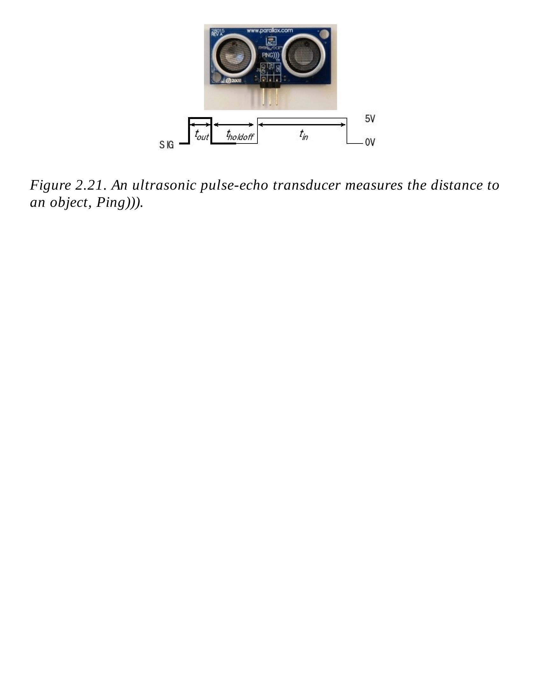
*Description*: Technical schematic and block diagram illustrating circuit operation, signal pathways, and functional behavior for Figure 2.21: An ultrasonic pulse-echo transducer measures the distance to.

> **Figure 2.21: An ultrasonic pulse-echo transducer measures the distance to**

an object, Ping))).


<!-- Page 165 -->
### [PDF Page 165]

2.8. Pulse Width Modulation
Generating output waves is an essential task for real-time systems, so the
microcontrollers have multiple methods to create output waves. Pulse width
modulation (PWM) is an effective and thus popular mechanism for the embedded
microcontrollers to control external devices. Typically, the period of a PWM output
is fixed, and the duty cycle is varied. The output is one for High cycles and then zero
for Low cycles. To make the period constant we will configure it so High+Low is a
constant.
2.8.1. Pulse width modulation on the TM4C123
PWM outputs are so important, the TM4C has a dedicated PWM modules. The
number of PWMs and associated pins vary from one microcontroller to the next, see

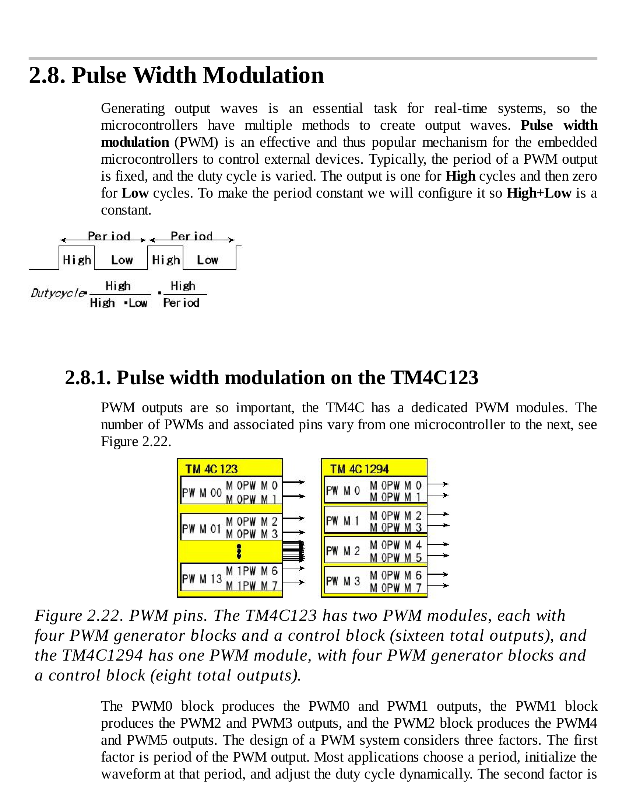
*Description*: Technical schematic and block diagram illustrating circuit operation, signal pathways, and functional behavior for Figure 2.22.

> **Figure 2.22**


*Description*: Hardware pinout and board interface diagram mapping microcontroller pins, BoosterPack headers, switches, LEDs, and physical connectors for Figure 2.22: PWM pins. The TM4C123 has two PWM modules, each with.

> **Figure 2.22: PWM pins. The TM4C123 has two PWM modules, each with**

four PWM generator blocks and a control block (sixteen total outputs), and
the TM4C1294 has one PWM module, with four PWM generator blocks and
a control block (eight total outputs).
The PWM0 block produces the PWM0 and PWM1 outputs, the PWM1 block
produces the PWM2 and PWM3 outputs, and the PWM2 block produces the PWM4

```assembly
and PWM5 outputs. The design of a PWM system considers three factors. The first
```

factor is period of the PWM output. Most applications choose a period, initialize the
waveform at that period, and adjust the duty cycle dynamically. The second factor is


<!-- Page 166 -->
### [PDF Page 166]

precision, which is the total number of duty cycles that can be created. A 16-bit
channel can potentially create up to 65536 different duty cycles. However, since the
duty cycle register must be less than or equal to the period register, the precision of
the system is determined by the value written to the period register. The last
consideration is the number of channels. Different members of the TM4C family have
from zero to sixteen PWM outputs (refer to the data sheet for your specific
microcontroller.)

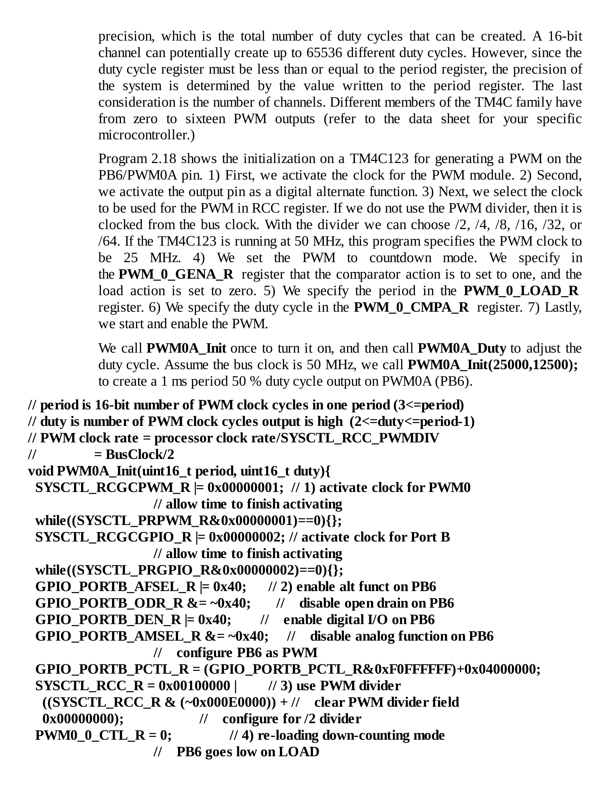
*Description*: Technical schematic and block diagram illustrating circuit operation, signal pathways, and functional behavior for Program 2.18: shows the initialization on a TM4C123 for generating a PWM on the.

> **Program 2.18: shows the initialization on a TM4C123 for generating a PWM on the**

PB6/PWM0A pin. 1) First, we activate the clock for the PWM module. 2) Second,
we activate the output pin as a digital alternate function. 3) Next, we select the clock
to be used for the PWM in RCC register. If we do not use the PWM divider, then it is
clocked from the bus clock. With the divider we can choose /2, /4, /8, /16, /32, or
/64. If the TM4C123 is running at 50 MHz, this program specifies the PWM clock to
be 25 MHz. 4) We set the PWM to countdown mode. We specify in
the PWM_0_GENA_R  register that the comparator action is to set to one, and the
load action is set to zero. 5) We specify the period in the PWM_0_LOAD_R
register. 6) We specify the duty cycle in the PWM_0_CMPA_R  register. 7) Lastly,
we start and enable the PWM.
We call PWM0A_Init once to turn it on, and then call PWM0A_Duty to adjust the
duty cycle. Assume the bus clock is 50 MHz, we call PWM0A_Init(25000,12500);
to create a 1 ms period 50 % duty cycle output on PWM0A (PB6).
// period is 16-bit number of PWM clock cycles in one period (3<=period)
// duty is number of PWM clock cycles output is high  (2<=duty<=period-1)
// PWM clock rate = processor clock rate/SYSCTL_RCC_PWMDIV
//                = BusClock/2

```c
void PWM0A_Init(uint16_t period, uint16_t duty){
SYSCTL_RCGCPWM_R |= 0x00000001;  // 1) activate clock for PWM0
// allow time to finish activating
while((SYSCTL_PRPWM_R&0x00000001)==0){};
SYSCTL_RCGCGPIO_R |= 0x00000002; // activate clock for Port B
// allow time to finish activating
while((SYSCTL_PRGPIO_R&0x00000002)==0){};
GPIO_PORTB_AFSEL_R |= 0x40;      // 2) enable alt funct on PB6
GPIO_PORTB_ODR_R &= ~0x40;       //    disable open drain on PB6
GPIO_PORTB_DEN_R |= 0x40;        //    enable digital I/O on PB6
GPIO_PORTB_AMSEL_R &= ~0x40;     //    disable analog function on PB6
//    configure PB6 as PWM
GPIO_PORTB_PCTL_R = (GPIO_PORTB_PCTL_R&0xF0FFFFFF)+0x04000000;
SYSCTL_RCC_R = 0x00100000 |         // 3) use PWM divider
```

((SYSCTL_RCC_R & (~0x000E0000)) + //    clear PWM divider field
0x00000000);                     //    configure for /2 divider
PWM0_0_CTL_R = 0;                // 4) re-loading down-counting mode
//    PB6 goes low on LOAD


<!-- Page 167 -->
### [PDF Page 167]

PWM0_0_GENA_R = 0x000000C8;      //    PB6 goes high on CMPA down
PWM0_0_LOAD_R = period - 1;      // 5) cycles needed to count down to 0
PWM0_0_CMPA_R = duty - 1;        // 6) count value when output rises
PWM0_0_CTL_R |= 0x00000001;      // 7) start PWM0 Generator 0
PWM0_ENABLE_R |= 0x00000001;     //    enable PWM0 Generator 0
}
// change duty cycle
// duty is number of PWM clock cycles output is high  (2<=duty<=period-1)

```c
void PWM0A_Duty(uint16_t duty){
PWM0_0_CMPA_R = duty - 1;        // 6) count value when output rises
}
```


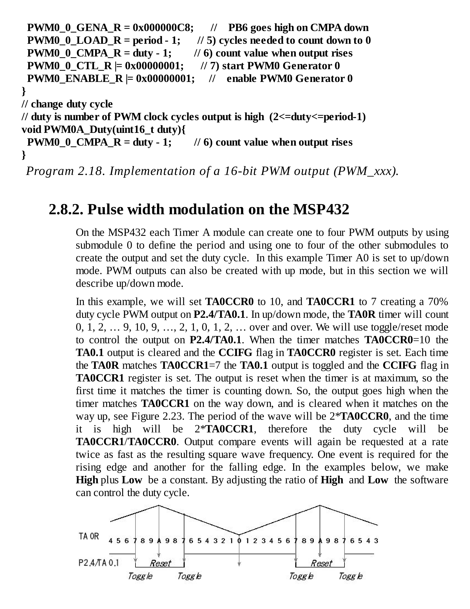
*Description*: Technical schematic and block diagram illustrating circuit operation, signal pathways, and functional behavior for Program 2.18: Implementation of a 16-bit PWM output (PWM_xxx)..

> **Program 2.18: Implementation of a 16-bit PWM output (PWM_xxx).**

2.8.2. Pulse width modulation on the MSP432
On the MSP432 each Timer A module can create one to four PWM outputs by using
submodule 0 to define the period and using one to four of the other submodules to
create the output and set the duty cycle.  In this example Timer A0 is set to up/down
mode. PWM outputs can also be created with up mode, but in this section we will
describe up/down mode.
In this example, we will set TA0CCR0 to 10, and TA0CCR1 to 7 creating a 70%
duty cycle PWM output on P2.4/TA0.1. In up/down mode, the TA0R timer will count
0, 1, 2, … 9, 10, 9, …, 2, 1, 0, 1, 2, … over and over. We will use toggle/reset mode
to control the output on P2.4/TA0.1. When the timer matches TA0CCR0=10 the
TA0.1 output is cleared and the CCIFG flag in TA0CCR0 register is set. Each time
the TA0R matches TA0CCR1=7 the TA0.1 output is toggled and the CCIFG flag in
TA0CCR1 register is set. The output is reset when the timer is at maximum, so the
first time it matches the timer is counting down. So, the output goes high when the
timer matches TA0CCR1 on the way down, and is cleared when it matches on the
way up, see Figure 2.23. The period of the wave will be 2*TA0CCR0, and the time
it
is
high
will
be
2*TA0CCR1,
therefore
the
duty
cycle
will
be
TA0CCR1/TA0CCR0. Output compare events will again be requested at a rate
twice as fast as the resulting square wave frequency. One event is required for the
rising edge and another for the falling edge. In the examples below, we make
High plus Low  be a constant. By adjusting the ratio of High  and Low  the software
can control the duty cycle.


<!-- Page 168 -->
### [PDF Page 168]


*Description*: Technical schematic and block diagram illustrating circuit operation, signal pathways, and functional behavior for Figure 2.23: The PWM output with timer in up-down mode and output.

> **Figure 2.23: The PWM output with timer in up-down mode and output**

compare in toggle-reset mode.
This implementation occurs in hardware and does not require interrupts. Therefore, it
can generate waves close to 0 or 100% duty cycle. Figure 2.24 shows a system using
two PWM outputs to control two DC motors. The interface driver will be shown in
Section 10.2.


*Description*: Technical schematic and block diagram illustrating circuit operation, signal pathways, and functional behavior for Figure 2.24: The PWM output can adjust the power to two DC motors..

> **Figure 2.24: The PWM output can adjust the power to two DC motors.**

Program
2.19configures
Timer
A0
for
two
PWM
outputs.
The
user
calls PWM_Init once to turn it on, and then calls PWM_Duty  to adjust the duty
cycle.

```c
void PWM_Init(uint16_t period, uint16_t duty1, uint16_t duty2){
Clock_Init48MHz();      // 48 MHz HFXTCLK, SMCLK = 12 MHz
P2DIR |= 0x30;          // P2.4, P2.5 output
P2SEL0 |= 0x30;         // P2.4, P2.5 TimerA0 functions
P2SEL1 &= ~0x30;        // P2.4, P2.5 TimerA0 functions
TA0CCTL0 = 0x0080;      // CCI0 toggle
TA0CCR0 = period;       // Period is 2*period*8*83.33ns is 1.333*period
TA0EX0 = 0x0000;        //    divide by 1
TA0CCTL1 = 0x0040;      // CCR1 toggle/reset
TA0CCR1 = duty1;        // CCR1 duty cycle is duty1/period
TA0CCTL2 = 0x0040;      // CCR2 toggle/reset
TA0CCR2 = duty2;        // CCR2 duty cycle is duty2/period
TA0CTL = 0x02F0;        // SMCLK=12MHz, divide by 8, up-down mode
}
void PWM_Duty1(uint16_t duty1){
TA0CCR1 = duty1;        // CCR1 duty cycle is duty1/period
}
void PWM_Duty2(uint16_t duty2){
TA0CCR2 = duty2;        // CCR2 duty cycle is duty2/period
}
```


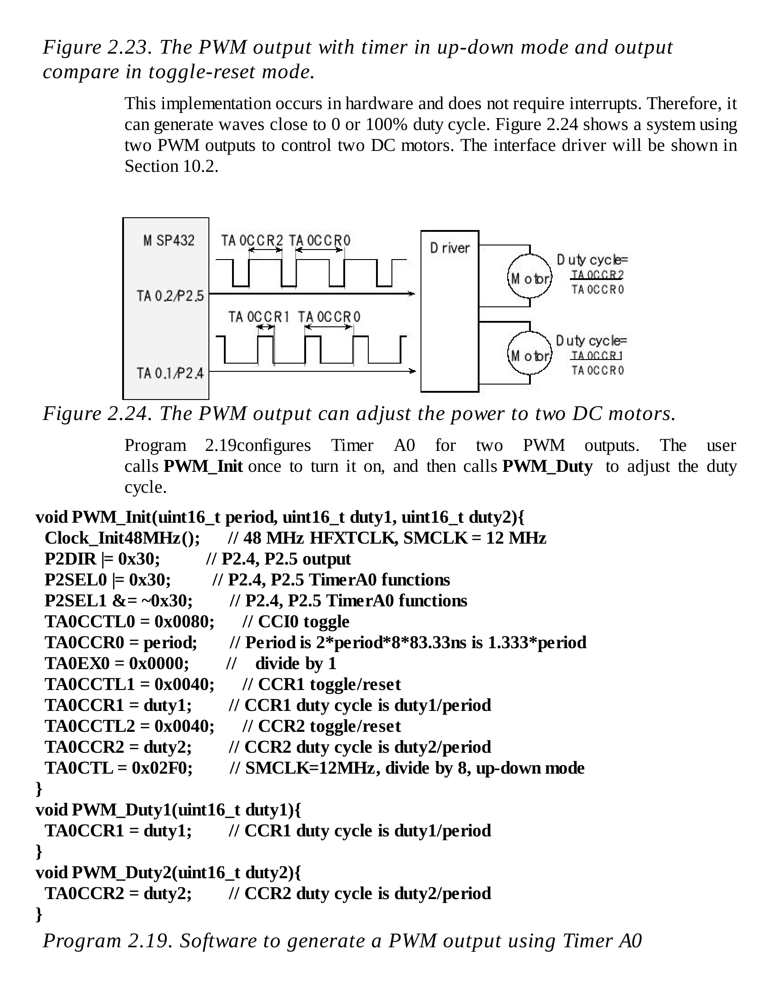
*Description*: Technical schematic and block diagram illustrating circuit operation, signal pathways, and functional behavior for Program 2.19: Software to generate a PWM output using Timer A0.

> **Program 2.19: Software to generate a PWM output using Timer A0**


<!-- Page 169 -->
### [PDF Page 169]

(TimerA0PWM_MSP432).
Checkpoint 2.11: When does an output compare event occur when in PWM
mode?
Checkpoint 2.12: What happens during an output compare event in PWM mode?
Divide by 8 slows down the 12 MHz SMCLK to count the timer every 666.7ns.


*Description*: Technical schematic and block diagram illustrating circuit operation, signal pathways, and functional behavior for Figure 2.25: shows the logic analyzer output when Program 2.19is called.

> **Figure 2.25: shows the logic analyzer output when Program 2.19is called**

with PWM_Init(10,7,2)  creating a 70% duty cycle PWM on P2.4 and a 20% duty
cycle PWM on P2.5. Just like Figure 2.11 the timer counts 0 to 10, and then 9 to 1, so
there are 20 counts per wave. 20 counts times 666.7ns creates the 13.33μs period for
P2.4 and P2.5. When the timer is 7, P2.4 is toggled, and when the timer is 2, P2.5 is
toggled.


*Description*: Technical schematic and block diagram illustrating circuit operation, signal pathways, and functional behavior for Figure 2.25: The PWM output with 13.33us period and 70% on P2.4 and.

> **Figure 2.25: The PWM output with 13.33us period and 70% on P2.4 and**

20% on P2.5.
With the counter in up mode, we can use OUTMOD=7 (reset/set) mode to create
PWM outputs. In this mode the period of the wave will be TA0CCR0+1, and the
time it is high will be TA0CCR1, therefore the duty cycle will once again be
TA0CCR1/(TA0CCR0+1). When creating PWMs with this approach all outputs
will go high at the same time.


<!-- Page 170 -->
### [PDF Page 170]

2.9. Analog Output
A digital to analog convertor (DAC) converts digital signals into analog form as
illustrated in Figure 2.26. Although one can interface a DAC to a regular output port,
most DACs are interfaced using high-speed synchronous protocols. The DAC output
can be current or voltage. Additional analog processing may be required to filter,
amplify or modulate the signal. We can also use DACs to design variable gain or
variable offset analog circuits.
The DAC precision is the number of distinguishable DAC outputs (e.g., 1024
alternatives, 10 bits). The DAC range is the maximum and minimum DAC output
(volts, amps). The DAC resolution is the smallest distinguishable change in output.
The units of resolution are in volts or amps depending on whether the output is
voltage or current. The resolution is the change in output that occurs when the digital
input changes by 1.
Range(volts) = Precision(alternatives) • Resolution(volts)
The DAC accuracy is (Actual - Ideal) / Ideal where Ideal is referred to the National
Institute of Standards and Technology (NIST). One can choose the full scale range of
the DAC to simplify the use of fixed-point math. For example, if an 8-bit DAC had a
full scale range of 0 to 2.55 volts, then the resolution would be exactly 10 mV. This
means that if the DAC digital input were 12310, then the DAC output voltage would
be 1.23 volts.

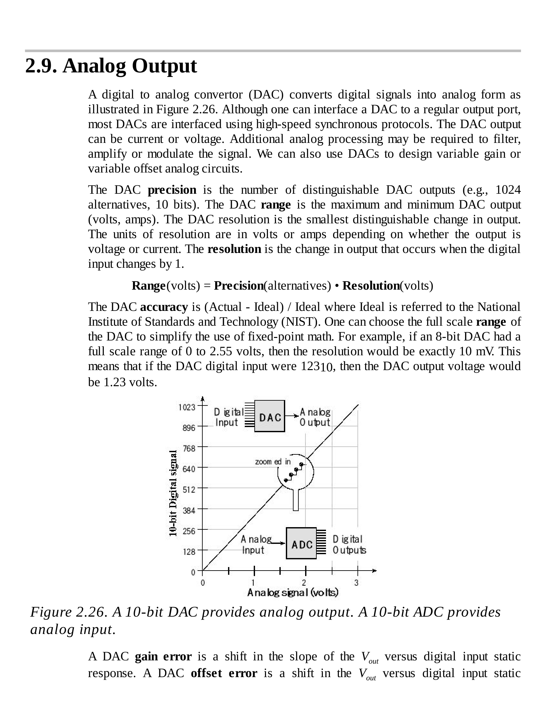
*Description*: Technical schematic and block diagram illustrating circuit operation, signal pathways, and functional behavior for Figure 2.26: A 10-bit DAC provides analog output. A 10-bit ADC provides.

> **Figure 2.26: A 10-bit DAC provides analog output. A 10-bit ADC provides**

analog input.
A DAC gain error is a shift in the slope of the Vout versus digital input static
response. A DAC offset error is a shift in the Vout versus digital input static


<!-- Page 171 -->
### [PDF Page 171]

response. The DAC transient response has three components: delay phase, slewing
phase, ringing phase. During the delay phase, the input has changed but the output has
not yet begun to change. During the slewing phase, the output changes rapidly. During
the ringing phase, the output oscillates while it stabilizes. For purposes of linearity,
let m, n be digital inputs, and let f(n) be the analog output of the DAC, see Figure
2.27. One quantitative measure of linearity is the correlation coefficient of a linear
regression fit of the f(n) responses. If ∆ is the DAC resolution, it is linear if
f(n+1)-f(n) = f(m+1)-f(m)  = ∆
for all n, m
The DAC is monotonic if
sign(f(n+1)-f(n)) = sign(f(m+1)-f(m))
for all n, m
Conversely, the DAC is nonlinear if
f(n+1)-f(n) ≠ f(m+1)-f(m)
for some n, m
Practically speaking all DACs are nonlinear, but the worst nonlinearity is
nonmonotonicity.  The DAC is nonmonotonic if
sign(f(n+1)-f(n)) ≠ sign(f(m+1)-f(m))
for some n, m

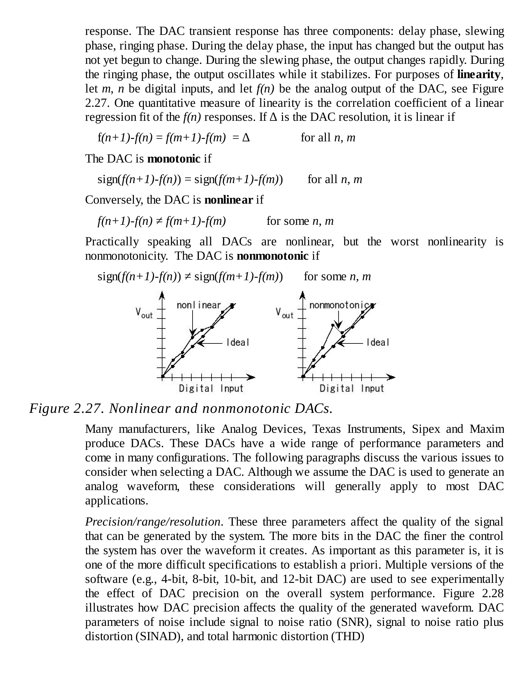
*Description*: Technical schematic and block diagram illustrating circuit operation, signal pathways, and functional behavior for Figure 2.27: Nonlinear and nonmonotonic DACs..

> **Figure 2.27: Nonlinear and nonmonotonic DACs.**

Many manufacturers, like Analog Devices, Texas Instruments, Sipex and Maxim
produce DACs. These DACs have a wide range of performance parameters and
come in many configurations. The following paragraphs discuss the various issues to
consider when selecting a DAC. Although we assume the DAC is used to generate an
analog waveform, these considerations will generally apply to most DAC
applications.
Precision/range/resolution. These three parameters affect the quality of the signal
that can be generated by the system. The more bits in the DAC the finer the control
the system has over the waveform it creates. As important as this parameter is, it is
one of the more difficult specifications to establish a priori. Multiple versions of the
software (e.g., 4-bit, 8-bit, 10-bit, and 12-bit DAC) are used to see experimentally
the effect of DAC precision on the overall system performance. Figure 2.28
illustrates how DAC precision affects the quality of the generated waveform. DAC
parameters of noise include signal to noise ratio (SNR), signal to noise ratio plus
distortion (SINAD), and total harmonic distortion (THD)


<!-- Page 172 -->
### [PDF Page 172]


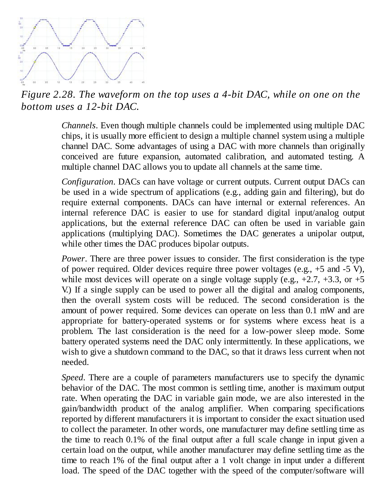
*Description*: Technical schematic and block diagram illustrating circuit operation, signal pathways, and functional behavior for Figure 2.28: The waveform on the top uses a 4-bit DAC, while on one on the.

> **Figure 2.28: The waveform on the top uses a 4-bit DAC, while on one on the**

bottom uses a 12-bit DAC.
Channels. Even though multiple channels could be implemented using multiple DAC
chips, it is usually more efficient to design a multiple channel system using a multiple
channel DAC. Some advantages of using a DAC with more channels than originally
conceived are future expansion, automated calibration, and automated testing. A
multiple channel DAC allows you to update all channels at the same time.
Configuration. DACs can have voltage or current outputs. Current output DACs can
be used in a wide spectrum of applications (e.g., adding gain and filtering), but do
require external components. DACs can have internal or external references. An
internal reference DAC is easier to use for standard digital input/analog output
applications, but the external reference DAC can often be used in variable gain
applications (multiplying DAC). Sometimes the DAC generates a unipolar output,
while other times the DAC produces bipolar outputs.
Power. There are three power issues to consider. The first consideration is the type
of power required. Older devices require three power voltages (e.g., +5 and -5 V),
while most devices will operate on a single voltage supply (e.g., +2.7, +3.3, or +5
V.) If a single supply can be used to power all the digital and analog components,
then the overall system costs will be reduced. The second consideration is the
amount of power required. Some devices can operate on less than 0.1 mW and are
appropriate for battery-operated systems or for systems where excess heat is a
problem. The last consideration is the need for a low-power sleep mode. Some
battery operated systems need the DAC only intermittently. In these applications, we
wish to give a shutdown command to the DAC, so that it draws less current when not
needed.
Speed. There are a couple of parameters manufacturers use to specify the dynamic
behavior of the DAC. The most common is settling time, another is maximum output
rate. When operating the DAC in variable gain mode, we are also interested in the
gain/bandwidth product of the analog amplifier. When comparing specifications
reported by different manufacturers it is important to consider the exact situation used
to collect the parameter. In other words, one manufacturer may define settling time as
the time to reach 0.1% of the final output after a full scale change in input given a
certain load on the output, while another manufacturer may define settling time as the
time to reach 1% of the final output after a 1 volt change in input under a different
load. The speed of the DAC together with the speed of the computer/software will


<!-- Page 173 -->
### [PDF Page 173]

determine the effective frequency components in the generated waveforms. Both the
software (rate at which the software outputs new values to the DAC) and the DAC
speed must be fast enough for the given application. In other words, if the software
outputs new values to the DAC at a rate faster than the DAC can respond, then errors
will occur. Figure 2.29 illustrates the effect of DAC output rate on the quality of the
generated waveform. According to the Nyquist Theorem states the digital data rate
must be greater than twice the maximum frequency component of the desired analog
waveform. However, both waveforms in Figure 2.29 satisfy the Nyquist Theorem,
but increasing the output rate by eight improves the signal to noise ratio by eight. 31
dB is a ratio of about 35 to 1, and 49 dB is a ratio of about 281 to 1. If the goal is to
create a sine wave at a fixed frequency, we could improve the SNR greatly by using
an analog low pass filter.
Experimental data of a 32-output 523 Hz sine-wave      Experimental data of a 256-output 523 Hz
sine-wave
Signal/noise ratio is 31 dB (3dB- -28dB)
Signal/noise ratio is 49 dB (3dB- -46dB)

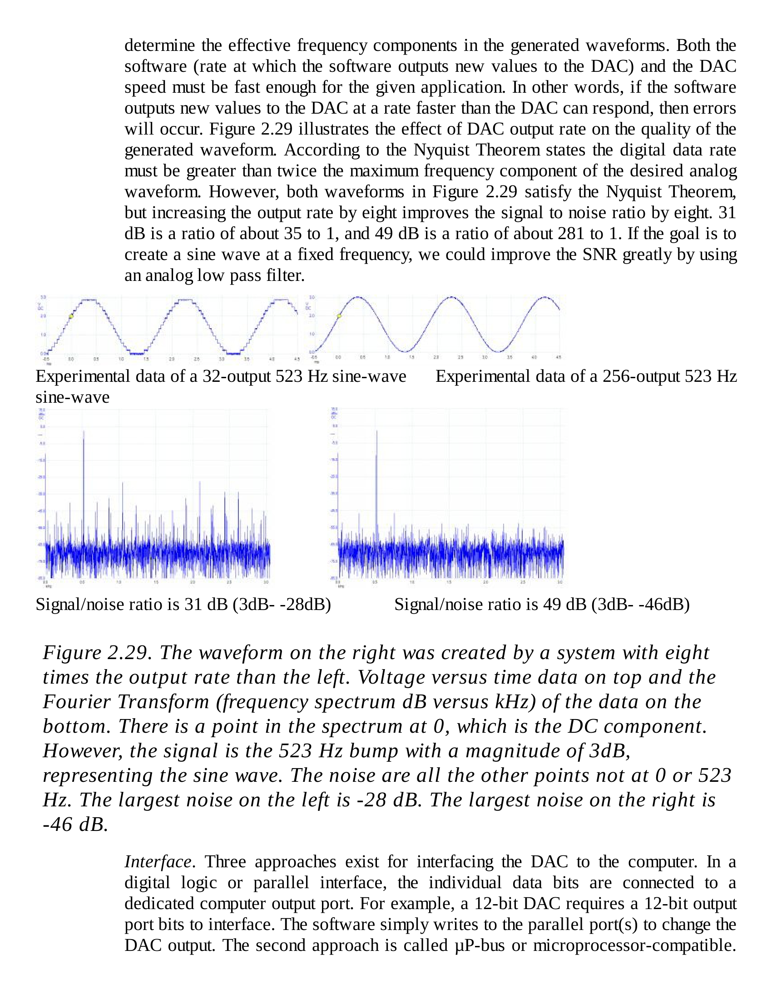
*Description*: Technical schematic and block diagram illustrating circuit operation, signal pathways, and functional behavior for Figure 2.29: The waveform on the right was created by a system with eight.

> **Figure 2.29: The waveform on the right was created by a system with eight**

times the output rate than the left. Voltage versus time data on top and the
Fourier Transform (frequency spectrum dB versus kHz) of the data on the
bottom. There is a point in the spectrum at 0, which is the DC component.
However, the signal is the 523 Hz bump with a magnitude of 3dB,
representing the sine wave. The noise are all the other points not at 0 or 523
Hz. The largest noise on the left is -28 dB. The largest noise on the right is
-46 dB.
Interface. Three approaches exist for interfacing the DAC to the computer. In a
digital logic or parallel interface, the individual data bits are connected to a
dedicated computer output port. For example, a 12-bit DAC requires a 12-bit output
port bits to interface. The software simply writes to the parallel port(s) to change the
DAC output. The second approach is called µP-bus or microprocessor-compatible.


<!-- Page 174 -->
### [PDF Page 174]

These devices are intended to be interfaced onto the address/data bus of an expanded
mode microcontroller. The third approach is a high-speed serial interface like I2C or
SPI. This approach requires the fewest number of I/O pins. Even if the
microcontroller does not support the SPI interface directly, these devices can be
interfaced to regular I/O pins via the bit-banging software approach.
Package. DIP packages are convenient for creating and testing an original prototype.
On the other hand, surface mount packages require less board space. Because surface
mount packages do not require holes in the PC board, circuits with these devices are
easier/cheaper to produce.
Cost. Cost is always a factor in engineering design. Beside the direct costs of the
individual components in the DAC interface, other considerations that affect cost
include: 1) power supply requirements; 2) manufacturing costs; 3) the labor involved
in individual calibration if required; and 4) software development costs.


<!-- Page 175 -->
### [PDF Page 175]

2.10. Analog Input
2.10.1. ADC Parameters
An analog to digital converter (ADC) converts an analog signal into digital form. The
input signal is usually an analog voltage (Vin), and the output is a binary number. The
ADC precision is the number of distinguishable ADC inputs (e.g., 4096 alternatives,
12 bits). The ADC range is the maximum and minimum ADC input (volts, amps).
The ADC resolution is the smallest distinguishable change in input (volts, amps).
The resolution is the change in input that causes the digital output to change by 1.
Range(volts) = Precision(alternatives) • Resolution(volts)
Normally we don’t specify accuracy for just the ADC, but rather we give the
accuracy of the entire system (including transducer, analog circuit, ADC and
software). Therefore, accuracy is defined as part of the systems approach to data
acquisition systems. An ADC is monotonic if it has no missing codes. This means if
the analog signal is a slow rising voltage, then the digital output will hit all values
sequentially. The ADC is linear if the resolution is constant through the range. Let f(x)
be the input/output ADC transfer function. One quantitative measure of linearity is
the correlation coefficient of a linear regression fit of the f(x) responses. The ADC
speed is the time to convert, called tc. The ADC cost is a function of the number and
price of internal components. There are four common encoding schemes for an ADC.

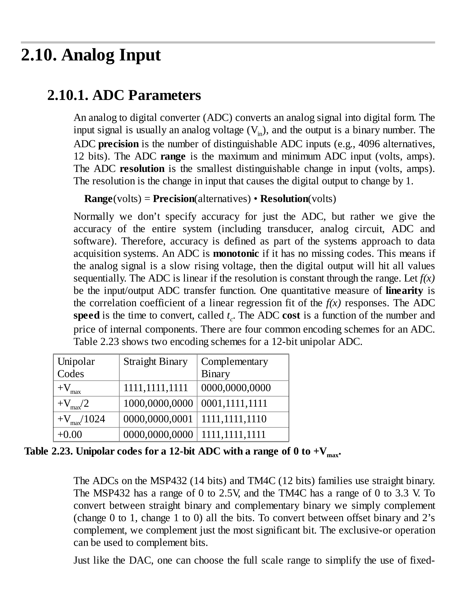
*Description*: Reference table detailing hardware parameters, register bit patterns, performance metrics, or memory configurations for Table 2.23: shows two encoding schemes for a 12-bit unipolar ADC..

> **Table 2.23: shows two encoding schemes for a 12-bit unipolar ADC.**

Unipolar
Codes
Straight Binary
Complementary
Binary
+Vmax
1111,1111,1111
0000,0000,0000
+Vmax/2
1000,0000,0000 0001,1111,1111
+Vmax/1024
0000,0000,0001 1111,1111,1110
+0.00
0000,0000,0000 1111,1111,1111


*Description*: Reference table detailing hardware parameters, register bit patterns, performance metrics, or memory configurations for Table 2.23: Unipolar codes for a 12-bit ADC with a range of 0 to +Vmax..

> **Table 2.23: Unipolar codes for a 12-bit ADC with a range of 0 to +Vmax.**

The ADCs on the MSP432 (14 bits) and TM4C (12 bits) families use straight binary.
The MSP432 has a range of 0 to 2.5V, and the TM4C has a range of 0 to 3.3 V. To
convert between straight binary and complementary binary we simply complement
(change 0 to 1, change 1 to 0) all the bits. To convert between offset binary and 2’s
complement, we complement just the most significant bit. The exclusive-or operation
can be used to complement bits.
Just like the DAC, one can choose the full scale range to simplify the use of fixed-


<!-- Page 176 -->
### [PDF Page 176]

point math. For example, if a 10-bit ADC had a full scale range of 0 to 1.023 volts,
then the resolution would be exactly 1 mV. This means that if the ADC input voltage
were 0.234 volts, then the result would be 23410.
The total harmonic distortion (THD) of a signal is a measure of the harmonic
distortion present and is defined as the ratio of the sum of the powers of all harmonic
components to the power of the fundamental frequency. Basically, it is a measure of
all the noise processes in an ADC and usually is given in dB full scale. A similar
parameter is signal-to-noise and distortion ratio (SINAD), which is measured by
placing a pure sine wave at the input of the ADC (signal) and measuring the ADC
output (signal plus noise). We can compare precision in bits to signal-to-noise ratio
in dB using the relation dB = 20 log10(2n). For example, the 12-bit MAX1247 ADC
has a SINAD of 73 dB. Notice that 20 log10(212) is 72 dB. The ADCs on most
microcontrollers use the successive approximation technique.
For a discussion of ADC techniques, see Chapter 8 of Volume 2.
2.10.2. Internal ADC on TM4C

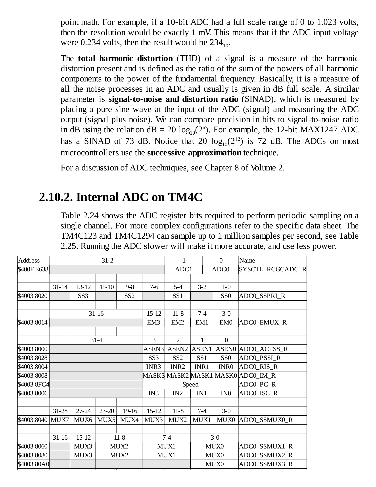
*Description*: Register layout and memory mapping diagram specifying bit fields, stack pointer allocations, and memory address boundaries for Table 2.24: shows the ADC register bits required to perform periodic sampling on a.

> **Table 2.24: shows the ADC register bits required to perform periodic sampling on a**

single channel. For more complex configurations refer to the specific data sheet. The
TM4C123 and TM4C1294 can sample up to 1 million samples per second, see Table
2.25. Running the ADC slower will make it more accurate, and use less power.
Address
31-2
1
0
Name
$400F.E638
ADC1
ADC0
SYSCTL_RCGCADC_R
31-14
13-12
11-10
9-8
7-6
5-4
3-2
1-0
$4003.8020
SS3
SS2
SS1
SS0
ADC0_SSPRI_R
31-16
15-12
11-8
7-4
3-0
$4003.8014
EM3
EM2
EM1
EM0
ADC0_EMUX_R
31-4
3
2
1
0
$4003.8000
ASEN3 ASEN2 ASEN1 ASEN0 ADC0_ACTSS_R
$4003.8028
SS3
SS2
SS1
SS0
ADC0_PSSI_R
$4003.8004
INR3
INR2
INR1
INR0
ADC0_RIS_R
$4003.8008
MASK3 MASK2 MASK1 MASK0 ADC0_IM_R
$4003.8FC4
Speed
ADC0_PC_R
$4003.800C
IN3
IN2
IN1
IN0
ADC0_ISC_R
31-28
27-24
23-20
19-16
15-12
11-8
7-4
3-0
$4003.8040 MUX7 MUX6 MUX5 MUX4
MUX3
MUX2
MUX1
MUX0 ADC0_SSMUX0_R
31-16
15-12
11-8
7-4
3-0
$4003.8060
MUX3
MUX2
MUX1
MUX0
ADC0_SSMUX1_R
$4003.8080
MUX3
MUX2
MUX1
MUX0
ADC0_SSMUX2_R
$4003.80A0
MUX0
ADC0_SSMUX3_R


<!-- Page 177 -->
### [PDF Page 177]

31 30
29
28 27 26
…
8
7
6
5
4
3
2
1
0
$4003.8044 TS7IE7END7D7TS6IE6
…
D2TS1 IE1 END1D1TS0 IE0 END0D0ADC0_SSCTL0_R
15 14
13
12 11 10
9
8
7
6
5
4
3
2
1
0
$4003.8064 TS3IE3END3D3TS2IE2END2D2TS1 IE1 END1D1TS0 IE0 END0D0ADC0_SSCTL1_R
$4003.8084 TS3IE3END3D3TS2IE2END2D2TS1 IE1 END1D1TS0 IE0 END0D0ADC0_SSCTL2_R
$4003.80A4
TS0 IE0 END0D0ADC0_SSCTL3_R
31-10
11-0
$4003.8048
DATA
ADC0_SSFIFO0_R
$4003.8068
DATA
ADC0_SSFIFO1_R
$4003.8088
DATA
ADC0_SSFIFO2_R
$4003.80A8
DATA
ADC0_SSFIFO3_R

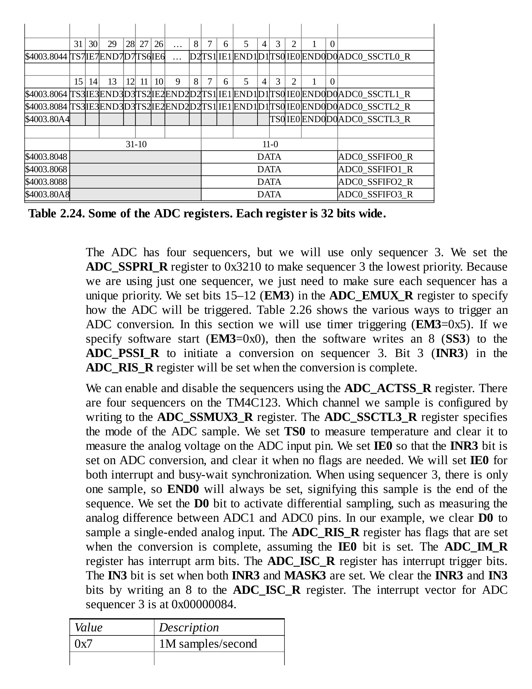
*Description*: Register layout and memory mapping diagram specifying bit fields, stack pointer allocations, and memory address boundaries for Table 2.24: Some of the ADC registers. Each register is 32 bits wide..

> **Table 2.24: Some of the ADC registers. Each register is 32 bits wide.**

The ADC has four sequencers, but we will use only sequencer 3. We set the
ADC_SSPRI_R register to 0x3210 to make sequencer 3 the lowest priority. Because
we are using just one sequencer, we just need to make sure each sequencer has a
unique priority. We set bits 15–12 (EM3) in the ADC_EMUX_R register to specify
how the ADC will be triggered. Table 2.26 shows the various ways to trigger an
ADC conversion. In this section we will use timer triggering (EM3=0x5). If we
specify software start (EM3=0x0), then the software writes an 8 (SS3) to the
ADC_PSSI_R to initiate a conversion on sequencer 3. Bit 3 (INR3) in the
ADC_RIS_R register will be set when the conversion is complete.
We can enable and disable the sequencers using the ADC_ACTSS_R register. There
are four sequencers on the TM4C123. Which channel we sample is configured by
writing to the ADC_SSMUX3_R register. The ADC_SSCTL3_R register specifies
the mode of the ADC sample. We set TS0 to measure temperature and clear it to
measure the analog voltage on the ADC input pin. We set IE0 so that the INR3 bit is
set on ADC conversion, and clear it when no flags are needed. We will set IE0 for
both interrupt and busy-wait synchronization. When using sequencer 3, there is only
one sample, so END0 will always be set, signifying this sample is the end of the
sequence. We set the D0 bit to activate differential sampling, such as measuring the
analog difference between ADC1 and ADC0 pins. In our example, we clear D0 to
sample a single-ended analog input. The ADC_RIS_R register has flags that are set
when the conversion is complete, assuming the IE0 bit is set. The ADC_IM_R
register has interrupt arm bits. The ADC_ISC_R register has interrupt trigger bits.
The IN3 bit is set when both INR3 and MASK3 are set. We clear the INR3 and IN3
bits by writing an 8 to the ADC_ISC_R register. The interrupt vector for ADC
sequencer 3 is at 0x00000084.
Value
Description
0x7
1M samples/second


<!-- Page 178 -->
### [PDF Page 178]

0x5
500K samples/second
0x3
250K samples/second
0x1
125K samples/second

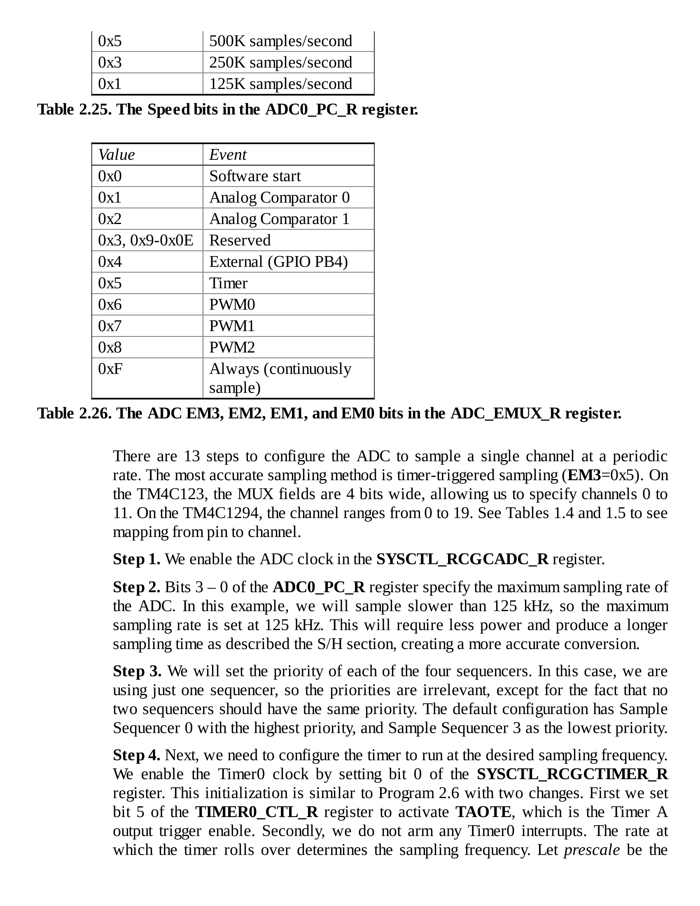
*Description*: Register layout and memory mapping diagram specifying bit fields, stack pointer allocations, and memory address boundaries for Table 2.25: The Speed bits in the ADC0_PC_R register..

> **Table 2.25: The Speed bits in the ADC0_PC_R register.**

Value
Event
0x0
Software start
0x1
Analog Comparator 0
0x2
Analog Comparator 1
0x3, 0x9-0x0E
Reserved
0x4
External (GPIO PB4)
0x5
Timer
0x6
PWM0
0x7
PWM1
0x8
PWM2
0xF
Always (continuously
sample)


*Description*: Register layout and memory mapping diagram specifying bit fields, stack pointer allocations, and memory address boundaries for Table 2.26: The ADC EM3, EM2, EM1, and EM0 bits in the ADC_EMUX_R register..

> **Table 2.26: The ADC EM3, EM2, EM1, and EM0 bits in the ADC_EMUX_R register.**

There are 13 steps to configure the ADC to sample a single channel at a periodic
rate. The most accurate sampling method is timer-triggered sampling (EM3=0x5). On
the TM4C123, the MUX fields are 4 bits wide, allowing us to specify channels 0 to
11. On the TM4C1294, the channel ranges from 0 to 19. See Tables 1.4 and 1.5 to see
mapping from pin to channel.
Step 1. We enable the ADC clock in the SYSCTL_RCGCADC_R register.
Step 2. Bits 3 – 0 of the ADC0_PC_R register specify the maximum sampling rate of
the ADC. In this example, we will sample slower than 125 kHz, so the maximum
sampling rate is set at 125 kHz. This will require less power and produce a longer
sampling time as described the S/H section, creating a more accurate conversion.
Step 3. We will set the priority of each of the four sequencers. In this case, we are
using just one sequencer, so the priorities are irrelevant, except for the fact that no
two sequencers should have the same priority. The default configuration has Sample
Sequencer 0 with the highest priority, and Sample Sequencer 3 as the lowest priority.
Step 4. Next, we need to configure the timer to run at the desired sampling frequency.
We enable the Timer0 clock by setting bit 0 of the SYSCTL_RCGCTIMER_R
register. This initialization is similar to Program 2.6 with two changes. First we set
bit 5 of the TIMER0_CTL_R register to activate TAOTE, which is the Timer A
output trigger enable. Secondly, we do not arm any Timer0 interrupts. The rate at
which the timer rolls over determines the sampling frequency. Let prescale be the


<!-- Page 179 -->
### [PDF Page 179]

value loaded into TIMER0_TAPR_R, and let period be the value loaded into
TIMER0_TAILR_R.  If the period of the bus clock frequency is Δt, then the ADC
sampling period will be
Δt *(prescale + 1)*(period + 1)
The fastest sampling rate is determined by the speed of the processor handling the
ADC interrupts and by the speed of the main program consuming the data from the
FIFO. If the bus clock is 80 MHz, the slowest possible sampling rate for this example
is 80MHz/232, which is about 0.018 Hz, which is every 53 seconds.
Step 5. Before configuring the sequencer, we need to disable it. To disable
sequencer 3, we write a 0 to bit 3 (ASEN3) in the ADC0_ACTSS_R register.
Disabling the sequencer during programming prevents erroneous execution if a
trigger event were to occur during the configuration process.
Step 6. We configure the trigger event for the sample sequencer in the
ADC0_EMUX_R register.  For this example, we write a 0101 to bits 15–12 (EM3)
specifying timer trigger mode.
Step 7. For each sample in the sample sequence, configure the corresponding input
source in the ADC0_SSMUXn register.  In this example, we write the channel
number (0, 1, 2, or 3) to bits 3–0 in the ADC0_SSMUX3_R register.
Step 8. For each sample in the sample sequence, we configure the sample control
bits in the corresponding nibble in the ADC0_SSCTLn register. When programming
the last nibble, ensure that the END bit is set. Failure to set the END bit causes
unpredictable behavior. Sequencer 3 has only one sample, so we write a 0110 to the
ADC0_SSCTL3_R register.  Bit 3 is the TS0 bit, which we clear because we are
not measuring temperature. Bit 2 is the IE0 bit, which we set because we want to
request an interrupt when the sample is complete. Bit 1 is the END0 bit, which is set
because this is the last (and only) sample in the sequence. Bit 0 is the D0 bit, which
we clear because we do not wish to use differential mode.
Step 9. If interrupts are to be used, write a 1 to the corresponding mask bit in the
ADC0_IM_R register. We want an interrupt to occur when the conversion is
complete (set bit 3, MASK3).
Step 10. We enable the sample sequencer logic by writing a 1 to the corresponding
ASENn. To enable sequencer 3, we write a 1 to bit 3 (ASEN3) in the
ADC0_ACTSS_R register.
Step 11. The priority of the ADC0 sequencer 3 interrupts are in bits 13–15 of the
NVIC_PRI4_R register.
Step 12. Since we are requesting interrupts, we need to enable interrupts in the
NVIC. ADC sequencer 3 interrupts are enabled by setting bit 17 in the
NVIC_EN0_R register.
Step 13. Lastly, we must enable interrupts in the PRIMASK register.


<!-- Page 180 -->
### [PDF Page 180]

The timer starts the conversion at a regular rate. Bit 3 (INR3) in the ADC0_RIS_R
register will be set when the conversion is done. This bit is armed and enabled for
interrupting, so conversion complete will trigger an interrupt. The IN3 bit in the
ADC0_ISC_R register triggers the interrupt.  The ISR acknowledges the interrupt by
writing a 1 to bit 3 (IN3). The 12-bit result is read from the ADC0_SSFIFO3_R
register. The book web site for has example code. In order to reduce latency of other
interrupt requests in the system, this ISR simply stores the 12-bit conversion in a
FIFO, to be processed later in the main program. Program 2.20 shows the
initialization and interrupt service routine to affect the periodic sampling. For the
port pin, we disable its DEN, clear its DIR, set its AFSEL and enable its AMSEL bit.

```c
void ADC0_InitTimer0ATriggerSeq3PD3(uint32_t period){
volatile uint32_t delay;
SYSCTL_RCGCADC_R |= 0x01;     // 1) activate ADC0
SYSCTL_RCGCGPIO_R |= 0x08;    // Port D clock
delay = SYSCTL_RCGCGPIO_R;    // allow time for clock to stabilize
GPIO_PORTD_DIR_R &= ~0x08;    // make PD3 input
GPIO_PORTD_AFSEL_R |= 0x08;   // enable alternate function on PD3
GPIO_PORTD_DEN_R &= ~0x08;    // disable digital I/O on PD3
GPIO_PORTD_AMSEL_R |= 0x08;   // enable analog functionality on PD3
ADC0_PC_R = 0x01;             // 2) configure for 125K samples/sec
ADC0_SSPRI_R = 0x3210;        // 3) seq 0 is highest, seq 3 is lowest
SYSCTL_RCGCTIMER_R |= 0x01;   // 4) activate timer0
delay = SYSCTL_RCGCGPIO_R;
TIMER0_CTL_R = 0x00000000;    // disable timer0A during setup
TIMER0_CTL_R |= 0x00000020;   // enable timer0A trigger to ADC
TIMER0_CFG_R = 0;             // configure for 32-bit timer mode
TIMER0_TAMR_R = 0x00000002;   // configure for periodic mode
TIMER0_TAPR_R = 0;            // prescale value for trigger
TIMER0_TAILR_R = period-1;    // start value for trigger
TIMER0_IMR_R = 0x00000000;    // disable all interrupts
TIMER0_CTL_R |= 0x00000001;   // enable timer0A 32-b, periodic
ADC0_ACTSS_R &= ~0x08;        // 5) disable sample sequencer 3
ADC0_EMUX_R = (ADC0_EMUX_R&0xFFFF0FFF)+0x5000; // 6) timer trigger
ADC0_SSMUX3_R = 4;            // 7) PD3 is analog channel 4
ADC0_SSCTL3_R = 0x06;         // 8) set flag and end after first sample
ADC0_IM_R |= 0x08;            // 9) enable SS3 interrupts
ADC0_ACTSS_R |= 0x08;         // 10) enable sample sequencer 3
NVIC_PRI4_R = (NVIC_PRI4_R&0xFFFF00FF)|0x00004000; // 11)priority 2
NVIC_EN0_R = 1<<17;           // 12) enable interrupt 17 in NVIC
EnableInterrupts();           // 13) enable interrupts
}
void ADC0Seq3_Handler(void){
ADC0_ISC_R = 0x08;        // acknowledge ADC sequence 3 completion
Fifo_Put(ADC0_SSFIFO3_R);  // pass to foreground
```


<!-- Page 181 -->
### [PDF Page 181]

}

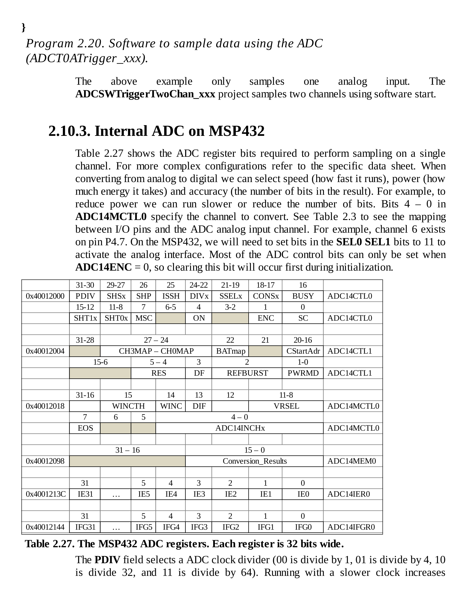
*Description*: Technical schematic and block diagram illustrating circuit operation, signal pathways, and functional behavior for Program 2.20: Software to sample data using the ADC.

> **Program 2.20: Software to sample data using the ADC**

(ADCT0ATrigger_xxx).
The
above
example
only
samples
one
analog
input.
The
ADCSWTriggerTwoChan_xxx project samples two channels using software start.
2.10.3. Internal ADC on MSP432


*Description*: Register layout and memory mapping diagram specifying bit fields, stack pointer allocations, and memory address boundaries for Table 2.27: shows the ADC register bits required to perform sampling on a single.

> **Table 2.27: shows the ADC register bits required to perform sampling on a single**

channel. For more complex configurations refer to the specific data sheet. When
converting from analog to digital we can select speed (how fast it runs), power (how
much energy it takes) and accuracy (the number of bits in the result). For example, to
reduce power we can run slower or reduce the number of bits. Bits 4 – 0 in
ADC14MCTL0 specify the channel to convert. See Table 2.3 to see the mapping
between I/O pins and the ADC analog input channel. For example, channel 6 exists
on pin P4.7. On the MSP432, we will need to set bits in the SEL0 SEL1 bits to 11 to
activate the analog interface. Most of the ADC control bits can only be set when
ADC14ENC = 0, so clearing this bit will occur first during initialization.
31-30
29-27
26
25
24-22
21-19
18-17
16
0x40012000
PDIV
SHSx
SHP
ISSH
DIVx
SSELx
CONSx
BUSY
ADC14CTL0
15-12
11-8
7
6-5
4
3-2
1
0
SHT1x
SHT0x
MSC
ON
ENC
SC
ADC14CTL0
31-28
27 – 24
22
21
20-16
0x40012004
CH3MAP – CH0MAP
BATmap
CStartAdr
ADC14CTL1
15-6
5 – 4
3
2
1-0
RES
DF
REFBURST
PWRMD
ADC14CTL1
31-16
15
14
13
12
11-8
0x40012018
WINCTH
WINC
DIF
VRSEL
ADC14MCTL0
7
6
5
4 – 0
EOS
ADC14INCHx
ADC14MCTL0
31 – 16
15 – 0
0x40012098
Conversion_Results
ADC14MEM0
31
5
4
3
2
1
0
0x4001213C
IE31
…
IE5
IE4
IE3
IE2
IE1
IE0
ADC14IER0
31
5
4
3
2
1
0
0x40012144
IFG31
…
IFG5
IFG4
IFG3
IFG2
IFG1
IFG0
ADC14IFGR0


*Description*: Register layout and memory mapping diagram specifying bit fields, stack pointer allocations, and memory address boundaries for Table 2.27: The MSP432 ADC registers. Each register is 32 bits wide..

> **Table 2.27: The MSP432 ADC registers. Each register is 32 bits wide.**

The PDIV field selects a ADC clock divider (00 is divide by 1, 01 is divide by 4, 10
is divide 32, and 11 is divide by 64). Running with a slower clock increases


<!-- Page 182 -->
### [PDF Page 182]

accuracy but will take longer to convert. We will set the SHSx field to 000 to select
the ADC14SC signal as the sample and hold source. SHP is the sample and hold
pulse mode select. With SHP=0 the ADC runs faster. The ISSH bit can be used to
invert the sample and hold pulse. We will clear this bit. We use the 3-bit DIVx field
to select another ADC clock divider. If the value of this field is n, then there will be
a divide by n+1. Again this defines a tradeoff between accuracy and speed. The 3-bit
field SSELx defines the clock source. We will set it to 100 to select the SMCLK. For
other choices see Table 2.28.
Value
ADC Clock Source
000
MODCLK
001
SYSCLK
010
ACLK
011
MCLK
100
SMCLK
101
HSMCLK

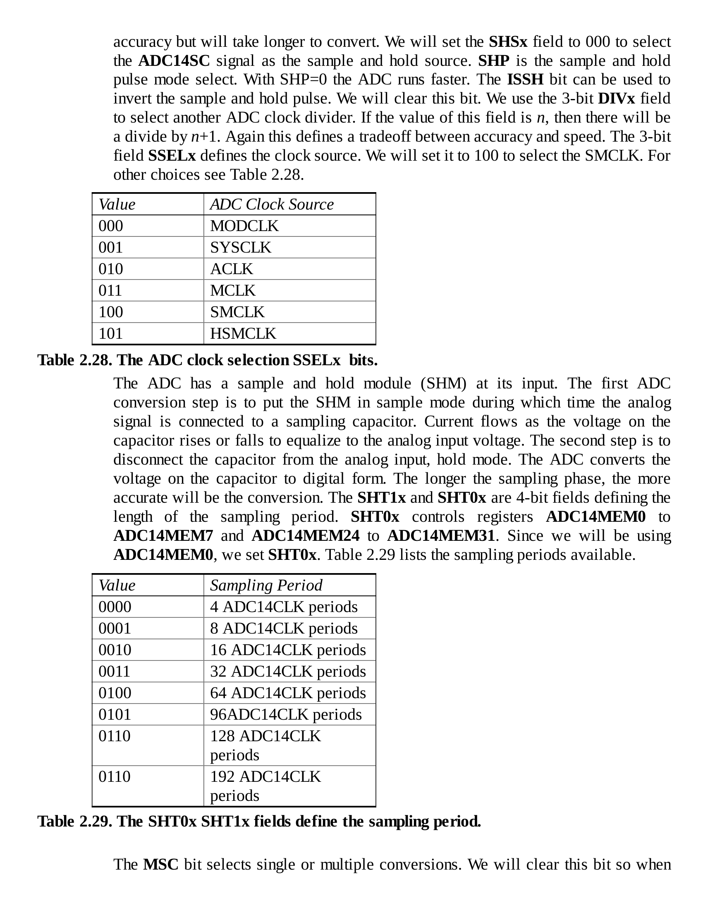
*Description*: Reference table detailing hardware parameters, register bit patterns, performance metrics, or memory configurations for Table 2.28: The ADC clock selection SSELx  bits..

> **Table 2.28: The ADC clock selection SSELx  bits.**

The ADC has a sample and hold module (SHM) at its input. The first ADC
conversion step is to put the SHM in sample mode during which time the analog
signal is connected to a sampling capacitor. Current flows as the voltage on the
capacitor rises or falls to equalize to the analog input voltage. The second step is to
disconnect the capacitor from the analog input, hold mode. The ADC converts the
voltage on the capacitor to digital form. The longer the sampling phase, the more
accurate will be the conversion. The SHT1x and SHT0x are 4-bit fields defining the
length of the sampling period. SHT0x controls registers ADC14MEM0 to
ADC14MEM7 and ADC14MEM24 to ADC14MEM31. Since we will be using
ADC14MEM0, we set SHT0x. Table 2.29 lists the sampling periods available.
Value
Sampling Period
0000
4 ADC14CLK periods
0001
8 ADC14CLK periods
0010
16 ADC14CLK periods
0011
32 ADC14CLK periods
0100
64 ADC14CLK periods
0101
96ADC14CLK periods
0110
128 ADC14CLK
periods
0110
192 ADC14CLK
periods


*Description*: Reference table detailing hardware parameters, register bit patterns, performance metrics, or memory configurations for Table 2.29: The SHT0x SHT1x fields define the sampling period..

> **Table 2.29: The SHT0x SHT1x fields define the sampling period.**

The MSC bit selects single or multiple conversions. We will clear this bit so when


<!-- Page 183 -->
### [PDF Page 183]

the software starts conversion it takes sample and stops. We set the ON bit to apply
power to the ADC. We set the ENC bit to enable the ADC. As mentioned earlier we
clear the ENC bit while configuring the ADC. The software will set the SC bit to
start an ADC conversion. Software writes one to SC but this bit is automatically
cleared.
There are 32 ADC14MEMx registers, x = 0 – 31, similar to ADC14MEM0 and 32
ADC14MCTLx registers similar to ADC14MCTL0 shown in Table 2.27. The 5-bit
CStartAdr field specifies the conversion start address. These bits select which
ADC14 conversion memory register is used for a single conversion or for the first
conversion in a sequence. The value of CStartAdr is 0 to 31, corresponding to
ADC14MEM0
to
ADC14MEM31.
We
will
use
ADC14MEM0
and
ADC14MCTL0 in our example by setting CStartAdr to 0.
The RES field specifies the ADC resolution. Again we can trade off accuracy for
speed. Set RES to 00 for 8-bit conversion, set RES to 01 for 10 bits, set RES to 10
for 12 bits and set it to 11 for 14 bits. We set the REFBURST bit if we desire to turn
off the reference when not in use. In our example, we will clear this bit to have the
reference on continuously.
The PWRMD field defines the power modes. Setting it to 00 will use the most
power but allow for 14-bit conversions at the highest speed. We set PWRMD to 10
for low-power mode and can be used for 12-bit, 10-bit and 8-bit resolutions.
We perform the following steps to timer-trigger the ADC and sample data
periodically using interrupt synchronization, see Program 2.21. This method has no
sampling jitter.
Step 1. Halt the timer during initialization
Step 2. We enable the timer to use SMCLK, divide by 1, stop mode, and disable
interrupts. Interrupts will be generated by the ADC module when the conversion is
complete and not by the timer when the conversion is started.
Step 3. We configure the timer to start the ADC conversion periodically. In
particular, bits 15-10 are 0 because we do not need capture events. Bit 8 is zero to
use compare mode. Bits 7-5 are 011 to create set/reset output mode, which will be a
squarewave created automatically by the timer and sent to the ADC. The frequency of
this squarewave will set the ADC sampling rate. An analog-to-digital conversion is
initiated with a rising edge of the timer squarewave output. Bit 4 is clear because the
timer does not create interrupts.
Step 4. In this step we set the sampling period. If the SMCLKis 12 MHz, then 1 ms
period output will be created if we write a 5999 into TA0CCR1  and we write a
11999 into TA0CCR0 .
Step 5. This step configures the timer clock as divide by 1.
Step 6. Before configuring the analog reference, we make sure it is idle.
Step 7. Bits 5-4 (REFVSEL) set to 1,1 to select the 2.5V reference. This defines the
ADC range to be 0 to 2.5V. Bit 3 (REFTCOFF ) is set to disable the temperature
sensor. Disabling the sensor saves power. Bit 1 (REFOUT) is clear to disconnect


<!-- Page 184 -->
### [PDF Page 184]

the reference from P5.6 .Bit 0 (REFON) is set to enable the reference.
Step 8. After configuring the analog reference, we wait for it to stabilize.
Step 9. Before configuring the ADC, we disable it. Clearing bit 1 (ADC14ENC)
allows us to program the ADC modes.
Step 10. Before configuring the ADC, we make sure it is idle.
Step 11. We write to the ADC14CTL0  register to set the ADC conversion mode.
Bits 31-30 (PDIV) are set to 0,0 to specify a predivide by 1. Bits 29-27 (SHSx) are
set to 0,0,1 to select TA0_C1 output as the ADC trigger source. Again, a rising edge
of the timer output will initiate an ADC conversion. We set bit 26 (SHP) to make the
sample/hold use pulse mode. We clear bit 25  (ISSH) so the sample-and-hold  is not
inverted. We set bits 24-22 (DIVx) to 0,0,0 to the clock divider to 1. We set bits 21-
19 (SSELx) to 1,0,0 to select the SMCLK to run the ADC. We set bits 18-17
(CONSEQx) to 1,0 to set the ADC mode to Repeat-single-channel. We will set both
bits 15-12 (SHT1x) and bits 11-8 (SHT0x) to select 32 clocks each for sample-and-
hold times 1 and 0. The longer we sample the more accurate the result, but the longer
it takes to do the conversion. We clear bit 7 (MSC) so there is one sample per rising
edge of the trigger. Set bit 4 (ON) to power up the ADC.
Step 12. We write to the ADC14CTL1  register to set additional ADC modes.  We
set bits 20-16 (STARTADDx) to 0,0,0,0,0 to use ADC14MEM0 as the starting
address. We set bits 5-4 (RES) to 1,1 to select 14-bit conversion requiring 16
clocks. Clearing bit 3 (DF) specifies binary unsigned mode. Clearing bit 2
(REFBURST) will power the reference continuously. Clearing bits 1-0 (PWRMD)
specifies regular power mode. It takes more power to leave the power on, but the
results will be more accurate.
Step 13. Writing to the ADC14MCTL0  register the range and the channel. We clear
bit 14   (WINC) to disable the comparator. We clear bit 13 (DIF) to specify single-
ended mode. We set bits 11-8 (VRSEL) to 0,0,0,1 to set the positive reference to
VREF (2.5V) and the negative reference to ground. We set bit 7 (EOS) to activate an
end of sequence event. Bits 4-0 (INCHx) set the input channel. Writing a 6 specifies
channel 6, which is P4.7.
Step 14. In this step we arm the IFG0 for interrupts and disarm the other flags.
Step 15. We set the SEL0 and SEL1 bits for P4.7 to specify analog input.
Step 16. we set the ENC bit to enable the ADC.
Step 17. We specify the priority of the ADC interrupt. Because the trigger occurs in
hardware this interrupt priority needs to high enough so the ISR is run within 1 ms
(before another sample would be triggered).
Step 18. We enable ADC interrupts in the NVIC
Step 19. Lastly, we activate the timer to begin sampling. Interrupts will be enabled in
the main program after all devices initialized

```c
void ADC0_InitTA0TriggerCh6(uint16_t period){
TA0CTL &= ~0x0030; // 1) halt Timer A0
TA0CTL = 0x0200;   // 2)SMCLK, stop mode, divide by one, no interrupt
TA0CCTL1 = 0x0060; // 3) no capture, compare mode, set/reset
TA0CCR1 = (period-1)/2;  // 4) specify sampling period
```


<!-- Page 185 -->
### [PDF Page 185]

TA0CCR0 = (period - 1);
TA0EX0 &= ~0x0007; // 5) configure for input clock divider /1

```c
while(REFCTL0&0x0400){}; // 6) wait for the reference to be idle
REFCTL0 = 0x0039;  // 7) configure reference for static 2.5V
while((REFCTL0&0x1000) == 0){};  // 8) wait for reference to stabilize
ADC14CTL0 &= ~0x00000002;        // 9) allow programming
while(ADC14CTL0&0x00010000){};   // 10) wait for BUSY to be zero
ADC14CTL0 = 0x0C243310;     // 11) ADC mode
ADC14CTL1 = 0x00000030;     // 12) ADC14MEM0, 14-bit, ref on, regular
ADC14MCTL0 = 0x00000186;    // 13) 0 to 2.5V, channel 6
ADC14IER0 = 0x00000001;     // 14) enable ADC14IFG0 interrupt
ADC14IER1 = 0;              //    disable these interrupts
P4SEL1 |= 0x80;             // 15) analog mode on A6, P4.7
P4SEL0 |= 0x80;
ADC14CTL0 |= 0x00000002;    // 16) enable
NVIC_IPR6 = (NVIC_IPR6&0xFFFFFF00)|0x00000040; // 17) priority 2
NVIC_ISER0 = 0x01000000;    // 18) enable interrupt 24 in NVIC
TA0CTL |= 0x0014;           // 19) reset and start Timer A0 in up mode
}
void ADC14_IRQHandler(void){ uint16_t result;
if((ADC14IFGR0&0x00000001) == 0x00000001){
Fifo_Put(ADC14MEM0);} // pass to foreground
}
```


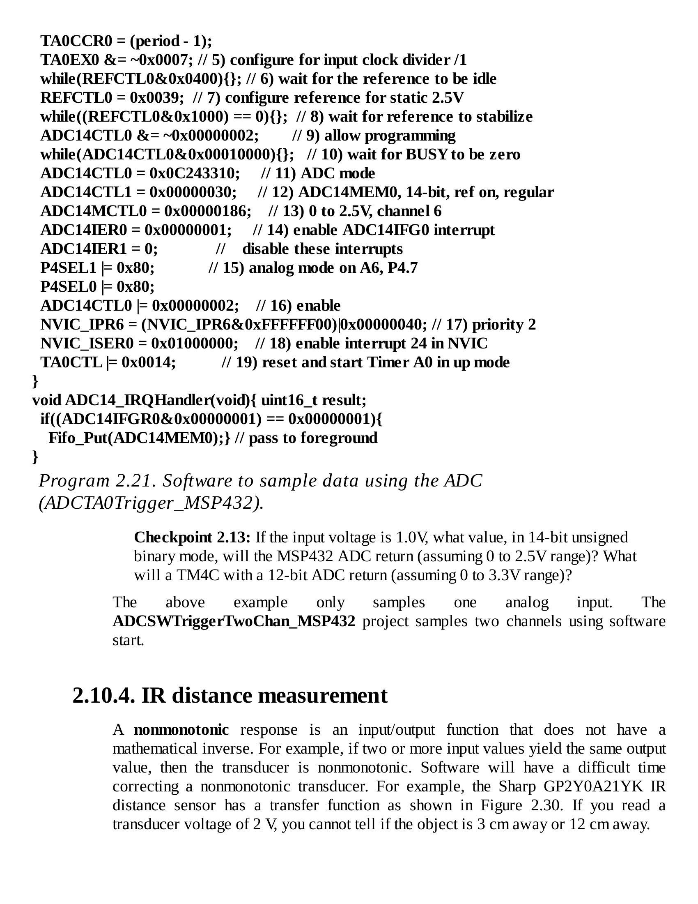
*Description*: Technical schematic and block diagram illustrating circuit operation, signal pathways, and functional behavior for Program 2.21: Software to sample data using the ADC.

> **Program 2.21: Software to sample data using the ADC**

(ADCTA0Trigger_MSP432).
Checkpoint 2.13: If the input voltage is 1.0V, what value, in 14-bit unsigned
binary mode, will the MSP432 ADC return (assuming 0 to 2.5V range)? What
will a TM4C with a 12-bit ADC return (assuming 0 to 3.3V range)?
The
above
example
only
samples
one
analog
input.
The
ADCSWTriggerTwoChan_MSP432 project samples two channels using software
start.
2.10.4. IR distance measurement
A nonmonotonic response is an input/output function that does not have a
mathematical inverse. For example, if two or more input values yield the same output
value, then the transducer is nonmonotonic. Software will have a difficult time
correcting a nonmonotonic transducer. For example, the Sharp GP2Y0A21YK IR
distance sensor has a transfer function as shown in Figure 2.30. If you read a
transducer voltage of 2 V, you cannot tell if the object is 3 cm away or 12 cm away.


<!-- Page 186 -->
### [PDF Page 186]


*Description*: Technical schematic and block diagram illustrating circuit operation, signal pathways, and functional behavior for Figure 2.30: The Sharp IR distance sensor exhibits nonmonotonic behavior..

> **Figure 2.30: The Sharp IR distance sensor exhibits nonmonotonic behavior.**

The transducer in Figure 2.17 uses IR light to measure distance to a reflecting object.
These sensors require a nonuniform power, so placing a 10 µF near the power line of
the sensor reduces noise on other components. If the object is more than 6 cm away,
the output voltage is inversely related to voltage. If N is the ADC sample, then
distance can be calculated as
d = c/N
where c is a calibration constant


*Description*: Technical schematic and block diagram illustrating circuit operation, signal pathways, and functional behavior for Figure 2.31: shows this sensor has a significant amount of noise. The nonlinear.

> **Figure 2.31: shows this sensor has a significant amount of noise. The nonlinear**

median filter, presented in Chapter 6, is a good choice to improve signal to noise
ratio.


*Description*: Technical schematic and block diagram illustrating circuit operation, signal pathways, and functional behavior for Figure 2.31: Noise on a GP2Y0A21YK IR distance sensor shows large.

> **Figure 2.31: Noise on a GP2Y0A21YK IR distance sensor shows large**

periodic spikes.


<!-- Page 187 -->
### [PDF Page 187]

2.11. OS Considerations for I/O Devices

### 2.11.1 Board Support Package

The entire book deals with interfacing I/O devices to build embedded systems.
However, in this section we will study two considerations of how the OS can manage
I/O. It is good design practice to provide an abstraction for the I/O layer. Names for
this abstraction include hardware abstraction layer (HAL), device driver, and board
support package (BSP). From an operating system perspective, the goal is the make it
easier to port the system from one hardware platform to another. The system becomes
more portable if we create a BSP for our hardware devices. A BSP could allow you
to encapsulate the following:
Timer initialization
ISR Handlers
LED output functions
Switch input functions
Setting up the interrupt controller
Setting up communication channel
CAN, I2C, ADC, DAC, SPI, serial, graphics
Example 2.1. Design a BSP for using a periodic interrupt.
Solution: In any abstraction, we need to separate what the system does from how it
does it. What we use a periodic interrupt for is to run a task at a fixed rate. How we
do it on the microcontroller is to enable the SysTick timer and configure it to
interrupt periodically, as presented previously in Section 2.2.2. What the user needs
is an OS function that he or she can call specifying their task and how often it should
run.
We can abstract the periodic interrupt, by defining the function in Program 2.22,
which is essentially Program 2.5 with the flexibility to specify the task to run and the
period with which to run it. We have hidden from the user the details of the
microcontroller.
To
run
the
function Task once
a
second,
the
user
calls OS_AddPeriodicTask(1000,&Task);

```c
uint32_t static volatile Count;
uint32_t static Period;
void (*CallBack)(void);  // call back function
void SysTick_Handler(void){
```


<!-- Page 188 -->
### [PDF Page 188]

Count++;

```c
if(Count==Period){
Count = 0;
(*CallBack)();      // execute call back process
}
}
//--------------------- OS_AddPeriodicTask ---------------------
// Input: thePeriod is a time period in ms
//        fp is a function to be executed at this period
// Output: none
// Example: to toggle PD0 once a second, we can
//   void toggle(void){PORTD0 ^= 0x01;}
//   OS_AddPeriodicTask(1000,&toggle);
void OS_AddPeriodicTask(uint32_t thePeriod, void(*fp)(void)){
DisableInterrupt();      // make initialization ritual atomic
Period = thePeriod;
CallBack = fp;
Count  = 0;
NVIC_ST_CTRL_R = 0;         // disable SysTick during setup
NVIC_ST_RELOAD_R = 49999;   // reload value, 1ms
NVIC_ST_CURRENT_R = 0;      // any write to current clears it
NVIC_SYS_PRI3_R = (NVIC_SYS_PRI3_R&0x00FFFFFF)|0x40000000; //priority
```

2
NVIC_ST_CTRL_R = 0x00000007;// enable with core clock and interrupts
EnableInterrupts();
}

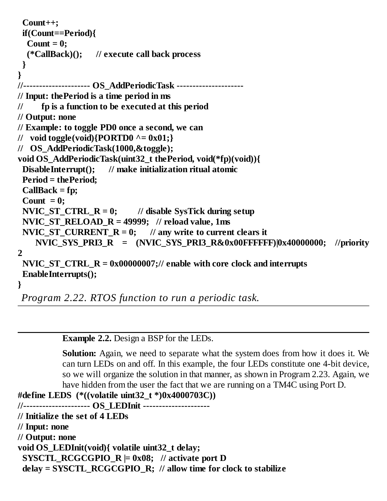
*Description*: Technical schematic and block diagram illustrating circuit operation, signal pathways, and functional behavior for Program 2.22: RTOS function to run a periodic task..

> **Program 2.22: RTOS function to run a periodic task.**

Example 2.2. Design a BSP for the LEDs.
Solution: Again, we need to separate what the system does from how it does it. We
can turn LEDs on and off. In this example, the four LEDs constitute one 4-bit device,
so we will organize the solution in that manner, as shown in Program 2.23. Again, we
have hidden from the user the fact that we are running on a TM4C using Port D.
#define LEDS  (*((volatile uint32_t *)0x4000703C))
//--------------------- OS_LEDInit ---------------------
// Initialize the set of 4 LEDs
// Input: none
// Output: none

```c
void OS_LEDInit(void){ volatile uint32_t delay;
SYSCTL_RCGCGPIO_R |= 0x08;   // activate port D
delay = SYSCTL_RCGCGPIO_R;  // allow time for clock to stabilize
```


<!-- Page 189 -->
### [PDF Page 189]

GPIO_PORTD_DIR_R |= 0x0F;    // make PD3-0 out
GPIO_PORTD_AFSEL_R &= ~0x0F; // regular port function
GPIO_PORTD_DEN_R |= 0x0F;    // enable digital I/O on PD3-0
}
//--------------------- OS_LED_Out ---------------------
// Output to the 4 LEDs
// Input: number from 0 to 15, specifying which LEDs are on and off
// Output: none

```c
void OS_LEDOut(uint32_t number){
LEDS = number; // friendly access
}
```


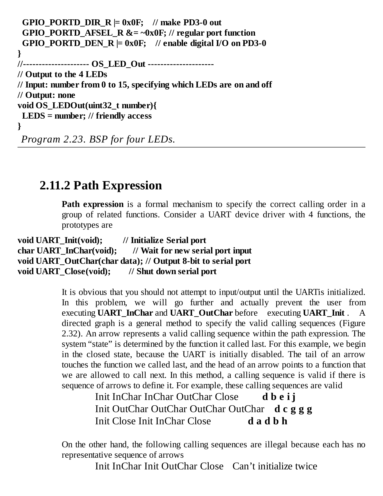
*Description*: Technical schematic and block diagram illustrating circuit operation, signal pathways, and functional behavior for Program 2.23: BSP for four LEDs..

> **Program 2.23: BSP for four LEDs.**


### 2.11.2 Path Expression

Path expression is a formal mechanism to specify the correct calling order in a
group of related functions. Consider a UART device driver with 4 functions, the
prototypes are

```c
void UART_Init(void);         // Initialize Serial port
char UART_InChar(void);       // Wait for new serial port input
void UART_OutChar(char data); // Output 8-bit to serial port
void UART_Close(void);        // Shut down serial port
```

It is obvious that you should not attempt to input/output until the UARTis initialized.
In this problem, we will go further and actually prevent the user from
executing UART_InChar and UART_OutChar before
executing UART_Init .
A
directed graph is a general method to specify the valid calling sequences (Figure
2.32). An arrow represents a valid calling sequence within the path expression. The
system “state” is determined by the function it called last. For this example, we begin
in the closed state, because the UART is initially disabled. The tail of an arrow
touches the function we called last, and the head of an arrow points to a function that
we are allowed to call next. In this method, a calling sequence is valid if there is
sequence of arrows to define it. For example, these calling sequences are valid
Init InChar InChar OutChar Close
d b e i j
Init OutChar OutChar OutChar OutChar d c g g g
Init Close Init InChar Close
d a d b h
On the other hand, the following calling sequences are illegal because each has no
representative sequence of arrows
Init InChar Init OutChar Close
Can’t initialize twice


<!-- Page 190 -->
### [PDF Page 190]

Close
Can’t close because already disabled
OutChar OutChar OutChar Can’t output without initialization

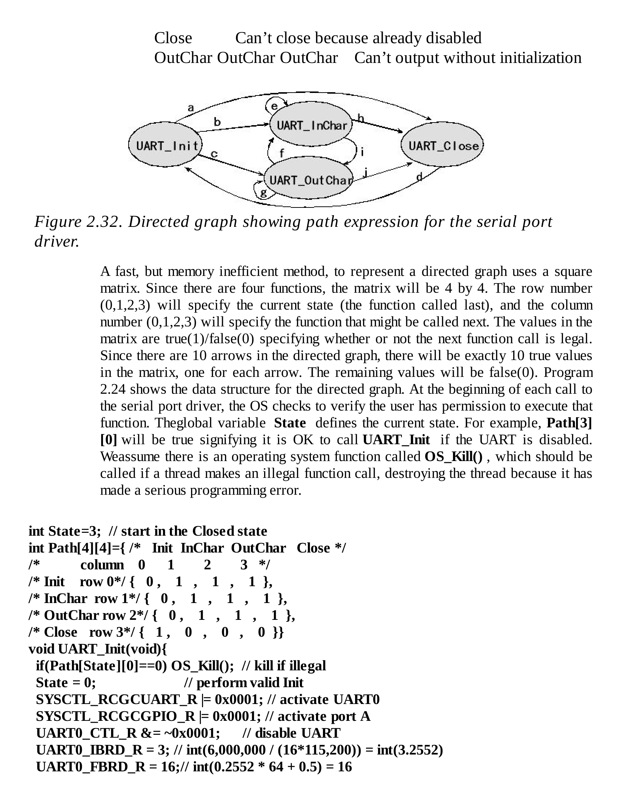
*Description*: Technical schematic and block diagram illustrating circuit operation, signal pathways, and functional behavior for Figure 2.32: Directed graph showing path expression for the serial port.

> **Figure 2.32: Directed graph showing path expression for the serial port**

driver.
A fast, but memory inefficient method, to represent a directed graph uses a square
matrix. Since there are four functions, the matrix will be 4 by 4. The row number
(0,1,2,3) will specify the current state (the function called last), and the column
number (0,1,2,3) will specify the function that might be called next. The values in the
matrix are true(1)/false(0) specifying whether or not the next function call is legal.
Since there are 10 arrows in the directed graph, there will be exactly 10 true values
in the matrix, one for each arrow. The remaining values will be false(0). Program

## 2.24 shows the data structure for the directed graph. At the beginning of each call to

the serial port driver, the OS checks to verify the user has permission to execute that
function. Theglobal variable  State  defines the current state. For example, Path[3]
[0] will be true signifying it is OK to call UART_Init  if the UART is disabled.
Weassume there is an operating system function called OS_Kill() , which should be
called if a thread makes an illegal function call, destroying the thread because it has
made a serious programming error.
int State=3;  // start in the Closed state
int Path[4][4]={ /*   Init  InChar  OutChar   Close */
/*           column    0      1        2        3   */
/* Init    row 0*/ {   0 ,    1   ,    1   ,    1  },
/* InChar  row 1*/ {   0 ,    1   ,    1   ,    1  },
/* OutChar row 2*/ {   0 ,    1   ,    1   ,    1  },
/* Close   row 3*/ {   1 ,    0   ,    0   ,    0  }}

```c
void UART_Init(void){
if(Path[State][0]==0) OS_Kill();  // kill if illegal
State = 0;                        // perform valid Init
SYSCTL_RCGCUART_R |= 0x0001; // activate UART0
SYSCTL_RCGCGPIO_R |= 0x0001; // activate port A
UART0_CTL_R &= ~0x0001;      // disable UART
UART0_IBRD_R = 3; // int(6,000,000 / (16*115,200)) = int(3.2552)
UART0_FBRD_R = 16;// int(0.2552 * 64 + 0.5) = 16
```


<!-- Page 191 -->
### [PDF Page 191]

UART0_LCRH_R = 0x0070;       // 8-bit word length, enable FIFO
UART0_CTL_R = 0x0301;        // enable RXE, TXE and UART
GPIO_PORTA_AFSEL_R |= 0x03;  // enable alt funct on PA1-0
GPIO_PORTA_DEN_R |= 0x03;    // enable digital I/O on PA1-0
}
char UART_InChar(void){

```c
if(Path[State][1]==0) OS_Kill();  // kill if illegal
State = 1;                        // perform valid InChar
while((UART0_FR_R&0x0010) != 0); // wait until RXFE is 0
return((char)(UART0_DR_R&0xFF));
}
void UART_OutChar(char data){
if(Path[State][2]==0) OS_Kill();  // kill if illegal
State = 2;                        // perform valid OutChar
while((UART0_FR_R&0x0020) != 0);  // wait until TXFF is 0
UART0_DR_R = data;
}
void UART_Close(void){
if(Path[State][3]==0) OS_Kill();  // kill if illegal
State = 3;                        // perform valid Close
UART0_CTL_R &= ~0x0001;      // disable UART
}
```


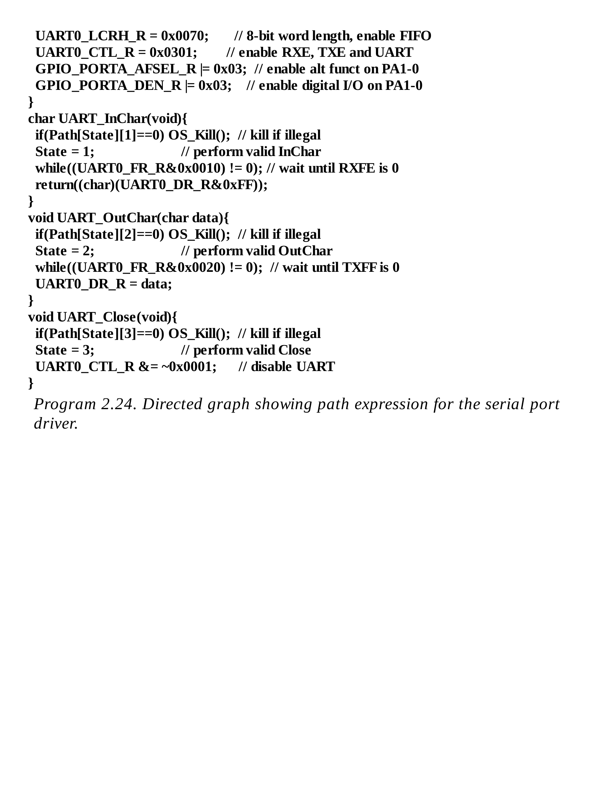
*Description*: Technical schematic and block diagram illustrating circuit operation, signal pathways, and functional behavior for Program 2.24: Directed graph showing path expression for the serial port.

> **Program 2.24: Directed graph showing path expression for the serial port**

driver.


<!-- Page 192 -->
### [PDF Page 192]

2.12. Debugging
2.12.1. Functional Debugging
Functional debugging involves the verification of input/output parameters. It is a
static process where inputs are supplied, the system is run, and the outputs are
compared against the expected results. We will present seven methods of functional
debugging.
1. Single Stepping or Trace. Many debuggers allow you to set the program counter to
a specific address then execute one instruction at a time. StepOver will execute one
instruction, unless that instruction is a subroutine call, in which case the simulator
will execute the entire subroutine and stop at the instruction following the subroutine
call. StepOut assumes the execution has already entered a function and will finish
execution of the function and stop at the instruction following the function call.
2. Breakpoints without filtering. The first step of debugging is to stabilize the
system with the bug. In the debugging context, we stabilize the problem by creating a
test routine that fixes (or stabilizes) all the inputs. In this way, we can reproduce the
exact inputs over and over again. Once stabilized, if we modify the program, we are
sure that the change in our outputs is a function of the modification we made in our
software and not due to a change in the input parameters. A breakpoint is a
mechanism to tag places in our software, which when executed will cause the
software to stop.
3. Conditional breakpoints. One of the problems with breakpoints is that sometimes
we have to observe many breakpoints before the error occurs. One way to deal with
this problem is the conditional breakpoint. Add a global variable called count  and
initialize it to zero in the ritual. Add the following conditional breakpoint to the
appropriate location, and run the system again (you can change the 32 to match the
situation that causes the error).

```c
if(++count==32){
breakpoint();     // <= place breakpoint here
}
```

Notice that the breakpoint occurs only on the 32nd time the break is encountered. Any
appropriate condition can be substituted.
4. Instrumentation: print statements. The use of print statements is a popular and
effective means for functional debugging. The difficulty with print statements in
embedded systems is that a standard “printer” may not be available. Another problem
with printing is that most embedded systems involve time-dependent interactions
with its external environment. The print statement itself may so slow that the
debugging instrument itself causes the system to fail. Therefore, the print statement is


<!-- Page 193 -->
### [PDF Page 193]

usually intrusive. One exception to this rule is if the printing channel occurs in the
background using interrupts, and the time between print statements (t2) is large
compared to the time to execution one print (t1), then the print statements will be
minimally intrusive. Nevertheless, this book will focus on debugging methods that do
not rely on the availability of a printer.
5. Instrumentation: dump into array without filtering. One of the difficulties with
print statements is that they can significantly slow down the execution speed in real-
time systems. Many times the bandwidth of the print functions cannot keep pace with
data being generated by the debugging process. For example, our system may wish to
call a function 1000 times a second (or every 1 ms). If we add print statements to it
that require 50 ms to perform, the presence of the print statements will significantly
affect the system operation. In this situation, the print statements would be considered
extremely intrusive. Another problem with print statements occurs when the system is
using the same output hardware for its normal operation, as is required to perform the
print function. In this situation, debugger output and normal system output are
intertwined. To solve both these situations, we can add a debugger instrument that
dumps strategic information into arrays at run time. Assume P1 is an input and P2 is
an output port that are strategic to the system. The first step when instrumenting a
dump is to define a buffer in RAM to save the debugging measurements.
The Debug_Cnt will be used to index into the buffers. Debug_Cnt  must be
initialized to zero, before the debugging begins. The debugging instrument, shown in

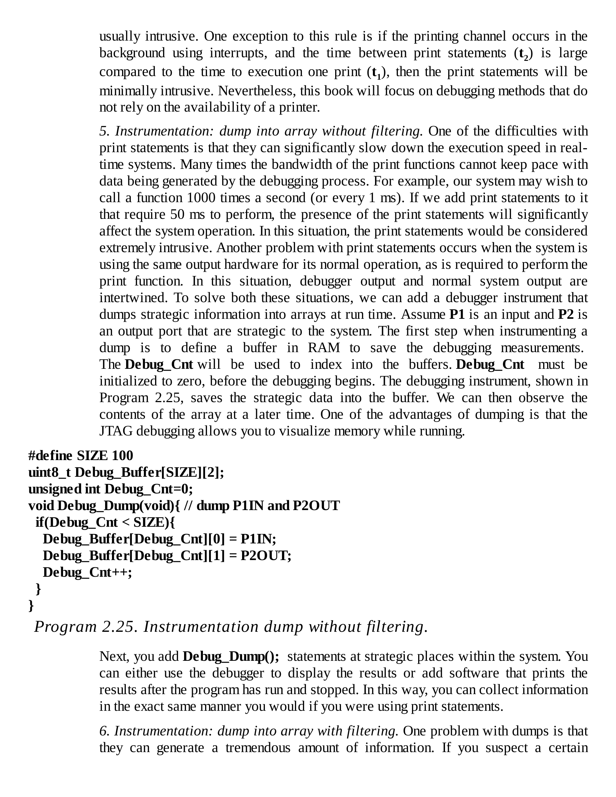
*Description*: Technical schematic and block diagram illustrating circuit operation, signal pathways, and functional behavior for Program 2.25: , saves the strategic data into the buffer. We can then observe the.

> **Program 2.25: , saves the strategic data into the buffer. We can then observe the**

contents of the array at a later time. One of the advantages of dumping is that the
JTAG debugging allows you to visualize memory while running.
#define SIZE 100

```c
uint8_t Debug_Buffer[SIZE][2];
unsigned int Debug_Cnt=0;
void Debug_Dump(void){ // dump P1IN and P2OUT
if(Debug_Cnt < SIZE){
Debug_Buffer[Debug_Cnt][0] = P1IN;
Debug_Buffer[Debug_Cnt][1] = P2OUT;
Debug_Cnt++;
}
}
```


*Description*: Technical schematic and block diagram illustrating circuit operation, signal pathways, and functional behavior for Program 2.25: Instrumentation dump without filtering..

> **Program 2.25: Instrumentation dump without filtering.**

Next, you add Debug_Dump();  statements at strategic places within the system. You
can either use the debugger to display the results or add software that prints the
results after the program has run and stopped. In this way, you can collect information
in the exact same manner you would if you were using print statements.
6. Instrumentation: dump into array with filtering. One problem with dumps is that
they can generate a tremendous amount of information. If you suspect a certain


<!-- Page 194 -->
### [PDF Page 194]

situation is causing the error, you can add a filter to the instrument. A filter is a
software/hardware condition that must be true in order to place data into the array. In
this situation, if we suspect the error occurs when the pointer nears the end of the
buffer, we could add a filter that saves in the array only when data matches a certain
condition. In the example shown in Program 2.26, the instrument saves the strategic
variables into the buffer only when P1.7  is high.
#define SIZE 100

```c
uint8_t Debug_Buffer[SIZE][2];
unsigned int Debug_Cnt=0;
void Debug_FilteredDump(void){ // dump P1IN and P2OUT
if((P1IN&0x80)&&(Debug_Cnt < SIZE)){
Debug_Buffer[Debug_Cnt][0] = P1IN;
Debug_Buffer[Debug_Cnt][1] = P2OUT;
Debug_Cnt ++;
}
}
```


*Description*: Technical schematic and block diagram illustrating circuit operation, signal pathways, and functional behavior for Program 2.26: Instrumentation dump with filter..

> **Program 2.26: Instrumentation dump with filter.**

7. Monitor using the LED heartbeat. Another tool that works well for real-time
applications is the monitor. A monitor is an independent output process, somewhat
similar to the print statement, but one that executes much faster and thus is much less
intrusive. An LCD can be an effective monitor for small amounts of information if the
time between outputs is much larger than the time to output. Another popular monitor
is the LED. You can place one or more LEDs on individual otherwise unused output
bits. Software toggles these LEDs to let you know what parts of the program are
running. An LED is an example of a Boolean monitor or heartbeat.  Assume an LED
is attached to MSP432 Port 1 bit 0. Program 2.27 will toggle the LED.
#define LEDOUT (*((volatile uint8_t *)(0x42000000+32*0x4C02+4*0)))
#define Debug_HeartBeat() (LEDOUT ^= 0x01)

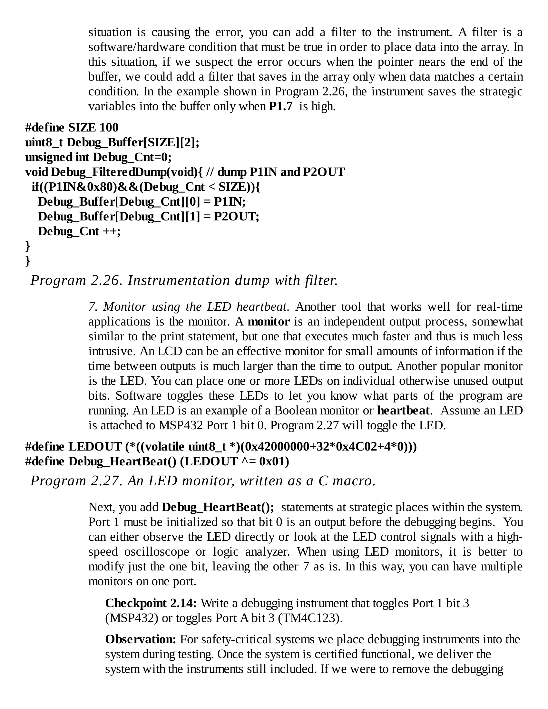
*Description*: Technical schematic and block diagram illustrating circuit operation, signal pathways, and functional behavior for Program 2.27: An LED monitor, written as a C macro..

> **Program 2.27: An LED monitor, written as a C macro.**

Next, you add Debug_HeartBeat();  statements at strategic places within the system.
Port 1 must be initialized so that bit 0 is an output before the debugging begins.  You
can either observe the LED directly or look at the LED control signals with a high-
speed oscilloscope or logic analyzer. When using LED monitors, it is better to
modify just the one bit, leaving the other 7 as is. In this way, you can have multiple
monitors on one port.
Checkpoint 2.14: Write a debugging instrument that toggles Port 1 bit 3
(MSP432) or toggles Port A bit 3 (TM4C123).
Observation: For safety-critical systems we place debugging instruments into the
system during testing. Once the system is certified functional, we deliver the
system with the instruments still included. If we were to remove the debugging


<!-- Page 195 -->
### [PDF Page 195]

instruments we would be obligated to retest the changed system.
2.12.2. Performance Debugging (FFT analysis)
Performance debugging involves the verification of timing behavior of our system. It
is a dynamic process where the system is run, and the dynamic behavior of the system
is compared against the expected results. We will present three methods of
performance debugging, then apply the techniques to measure execution speed.
1. Counting bus cycles. For simple programs with little and no branching and for
simple microcontrollers, we can estimate the execution speed by looking at the
assembly code and adding up the time to execute each instruction.
2. Instrumentation measuring with an independent counter. SysTick is a 24-bit
counter decremented every bus clock. It automatically rolls over when it gets to 0. If
we are sure the execution speed of our function is less than 224 bus cycles, we can use
this timer to collect timing information with only a minimal amount of intrusiveness.
3. Instrumentation Output Port. Another method to measure real-time execution
involves an output port and an oscilloscope. Connect a microcontroller output bit to
your scope. Add debugging instruments that set/clear these output bits at strategic
places. Remember to set the port’s direction register to 1.  Assume an oscilloscope is
attached to TM4C123 Port F bit 2. Program 2.28 can be used to set and clear the bit.
#define PF2   (*((volatile uint32_t *)0x40025010))
#define Debug_Set()   (PF2 = 0x04)
#define Debug_Clear() (PF2 = 0x00)

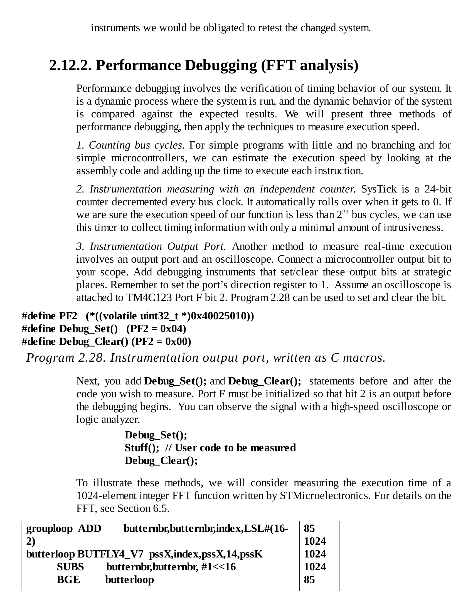
*Description*: Technical schematic and block diagram illustrating circuit operation, signal pathways, and functional behavior for Program 2.28: Instrumentation output port, written as C macros..

> **Program 2.28: Instrumentation output port, written as C macros.**

Next, you add Debug_Set(); and Debug_Clear();  statements before and after the
code you wish to measure. Port F must be initialized so that bit 2 is an output before
the debugging begins.  You can observe the signal with a high-speed oscilloscope or
logic analyzer.
Debug_Set();
Stuff();  // User code to be measured
Debug_Clear();
To illustrate these methods, we will consider measuring the execution time of a
1024-element integer FFT function written by STMicroelectronics. For details on the
FFT, see Section 6.5.
grouploop  ADD        butternbr,butternbr,index,LSL#(16-
2)
butterloop BUTFLY4_V7  pssX,index,pssX,14,pssK
SUBS        butternbr,butternbr, #1<<16
BGE         butterloop
85
1024
1024
1024
85


<!-- Page 196 -->
### [PDF Page 196]


```assembly
ADD         tmp, index, index, LSL#1
ADD         pssX, pssX, tmp
```

DEC         butternbr
MOVS        tmp2, butternbr, LSL#16
IT          NE
SUBNE       pssK, pssK, tmp
BNE         grouploop
85
85
85
85
85
85

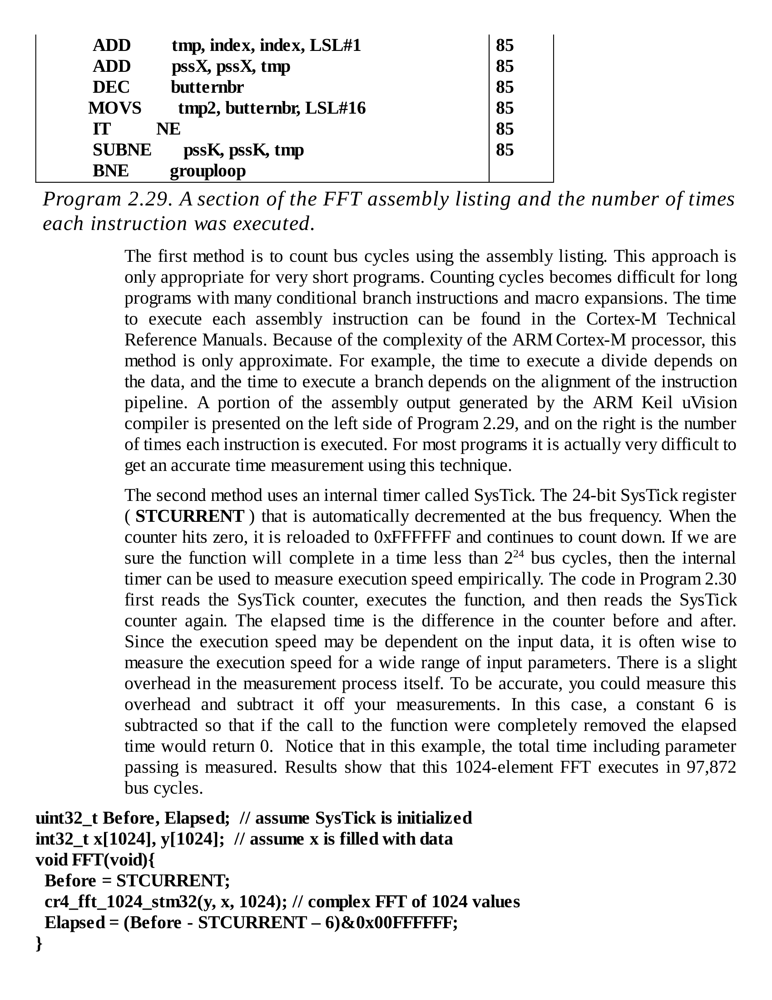
*Description*: Technical schematic and block diagram illustrating circuit operation, signal pathways, and functional behavior for Program 2.29: A section of the FFT assembly listing and the number of times.

> **Program 2.29: A section of the FFT assembly listing and the number of times**

each instruction was executed.
The first method is to count bus cycles using the assembly listing. This approach is
only appropriate for very short programs. Counting cycles becomes difficult for long
programs with many conditional branch instructions and macro expansions. The time
to execute each assembly instruction can be found in the Cortex-M Technical
Reference Manuals. Because of the complexity of the ARM Cortex-M processor, this
method is only approximate. For example, the time to execute a divide depends on
the data, and the time to execute a branch depends on the alignment of the instruction
pipeline. A portion of the assembly output generated by the ARM Keil uVision
compiler is presented on the left side of Program 2.29, and on the right is the number
of times each instruction is executed. For most programs it is actually very difficult to
get an accurate time measurement using this technique.
The second method uses an internal timer called SysTick. The 24-bit SysTick register
( STCURRENT ) that is automatically decremented at the bus frequency. When the
counter hits zero, it is reloaded to 0xFFFFFF and continues to count down. If we are
sure the function will complete in a time less than 224 bus cycles, then the internal
timer can be used to measure execution speed empirically. The code in Program 2.30
first reads the SysTick counter, executes the function, and then reads the SysTick
counter again. The elapsed time is the difference in the counter before and after.
Since the execution speed may be dependent on the input data, it is often wise to
measure the execution speed for a wide range of input parameters. There is a slight
overhead in the measurement process itself. To be accurate, you could measure this
overhead and subtract it off your measurements. In this case, a constant 6 is
subtracted so that if the call to the function were completely removed the elapsed
time would return 0.  Notice that in this example, the total time including parameter
passing is measured. Results show that this 1024-element FFT executes in 97,872
bus cycles.

```c
uint32_t Before, Elapsed;  // assume SysTick is initialized
int32_t x[1024], y[1024];  // assume x is filled with data
void FFT(void){
Before = STCURRENT;
cr4_fft_1024_stm32(y, x, 1024); // complex FFT of 1024 values
Elapsed = (Before - STCURRENT – 6)&0x00FFFFFF;
}
```


<!-- Page 197 -->
### [PDF Page 197]


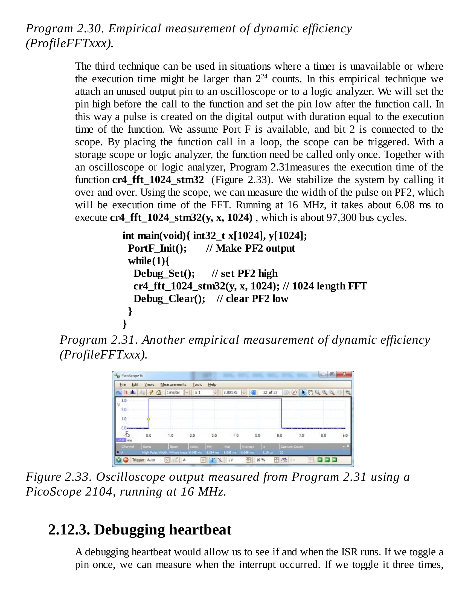
*Description*: Technical schematic and block diagram illustrating circuit operation, signal pathways, and functional behavior for Program 2.30: Empirical measurement of dynamic efficiency.

> **Program 2.30: Empirical measurement of dynamic efficiency**

(ProfileFFTxxx).
The third technique can be used in situations where a timer is unavailable or where
the execution time might be larger than 224 counts. In this empirical technique we
attach an unused output pin to an oscilloscope or to a logic analyzer. We will set the
pin high before the call to the function and set the pin low after the function call. In
this way a pulse is created on the digital output with duration equal to the execution
time of the function. We assume Port F is available, and bit 2 is connected to the
scope. By placing the function call in a loop, the scope can be triggered. With a
storage scope or logic analyzer, the function need be called only once. Together with
an oscilloscope or logic analyzer, Program 2.31measures the execution time of the
function cr4_fft_1024_stm32  (Figure 2.33). We stabilize the system by calling it
over and over. Using the scope, we can measure the width of the pulse on PF2, which
will be execution time of the FFT. Running at 16 MHz, it takes about 6.08 ms to
execute cr4_fft_1024_stm32(y, x, 1024) , which is about 97,300 bus cycles.
int main(void){ int32_t x[1024], y[1024];
PortF_Init();       // Make PF2 output

```c
while(1){
Debug_Set();      // set PF2 high
cr4_fft_1024_stm32(y, x, 1024); // 1024 length FFT
Debug_Clear();    // clear PF2 low
}
}
```


*Description*: Technical schematic and block diagram illustrating circuit operation, signal pathways, and functional behavior for Program 2.31: Another empirical measurement of dynamic efficiency.

> **Program 2.31: Another empirical measurement of dynamic efficiency**

(ProfileFFTxxx).


*Description*: Technical schematic and block diagram illustrating circuit operation, signal pathways, and functional behavior for Figure 2.33: Oscilloscope output measured from Program 2.31 using a.

> **Figure 2.33: Oscilloscope output measured from Program 2.31 using a**

PicoScope 2104, running at 16 MHz.
2.12.3. Debugging heartbeat
A debugging heartbeat would allow us to see if and when the ISR runs. If we toggle a
pin once, we can measure when the interrupt occurred. If we toggle it three times,


<!-- Page 198 -->
### [PDF Page 198]

like Program 2.5, we can also measure the execution time of the ISR. The first and
second edges of PC5 signify the start of the ISR. The third edgeoccurs at the end of
the ISR. The PC5^=0x20;  takes 4 instructions or 7 cycles
480D      LDR  r0,[pc,#52]  ; pointer to PC5
6BC0      LDR  r1,[r0]      ; read PC5
F0800020  EOR  r1,r1,#0x20  ; toggle
63C8      STR  r1,[r0]      ; write PC5
These three debugging instruments add 21 bus cycles to each ISR. Thus, if the time
between interrupts is large compared to these 21 cycles, this heartbeat will be
minimally intrusive.


*Description*: Hardware pinout and board interface diagram mapping microcontroller pins, BoosterPack headers, switches, LEDs, and physical connectors for Figure 2.34: shows a zoomed in view of the profile pin measured during one.

> **Figure 2.34: shows a zoomed in view of the profile pin measured during one**

execution of the SysTick ISR. The first two toggles signify the ISR has started. The
time from second to third toggle illustrates the body of the ISR takes 1.2 µs of
execution time.


*Description*: Technical schematic and block diagram illustrating circuit operation, signal pathways, and functional behavior for Figure 2.34: Profile of a single execution of the SysTick ISR measured on a.

> **Figure 2.34: Profile of a single execution of the SysTick ISR measured on a**

TM4C123 running at 16 MHz.

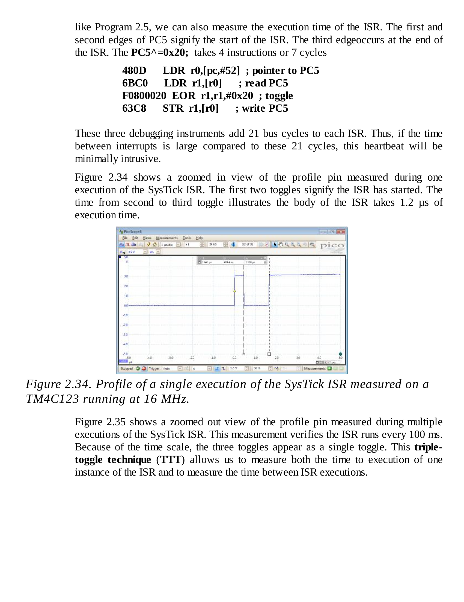
*Description*: Hardware pinout and board interface diagram mapping microcontroller pins, BoosterPack headers, switches, LEDs, and physical connectors for Figure 2.35: shows a zoomed out view of the profile pin measured during multiple.

> **Figure 2.35: shows a zoomed out view of the profile pin measured during multiple**

executions of the SysTick ISR. This measurement verifies the ISR runs every 100 ms.
Because of the time scale, the three toggles appear as a single toggle. This triple-
toggle technique (TTT) allows us to measure both the time to execution of one
instance of the ISR and to measure the time between ISR executions.


<!-- Page 199 -->
### [PDF Page 199]


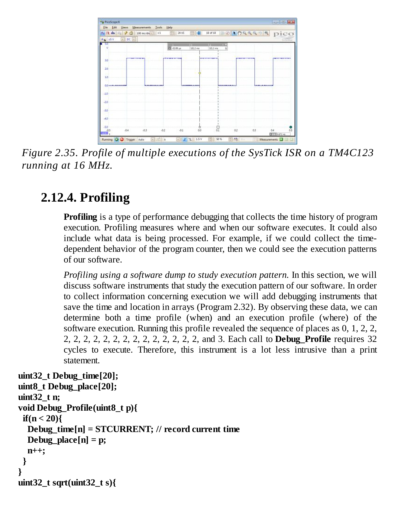
*Description*: Technical schematic and block diagram illustrating circuit operation, signal pathways, and functional behavior for Figure 2.35: Profile of multiple executions of the SysTick ISR on a TM4C123.

> **Figure 2.35: Profile of multiple executions of the SysTick ISR on a TM4C123**

running at 16 MHz.
2.12.4. Profiling
Profiling is a type of performance debugging that collects the time history of program
execution. Profiling measures where and when our software executes. It could also
include what data is being processed. For example, if we could collect the time-
dependent behavior of the program counter, then we could see the execution patterns
of our software.
Profiling using a software dump to study execution pattern. In this section, we will
discuss software instruments that study the execution pattern of our software. In order
to collect information concerning execution we will add debugging instruments that
save the time and location in arrays (Program 2.32). By observing these data, we can
determine both a time profile (when) and an execution profile (where) of the
software execution. Running this profile revealed the sequence of places as 0, 1, 2, 2,
2, 2, 2, 2, 2, 2, 2, 2, 2, 2, 2, 2, 2, 2, and 3. Each call to Debug_Profile requires 32
cycles to execute. Therefore, this instrument is a lot less intrusive than a print
statement.

```c
uint32_t Debug_time[20];
uint8_t Debug_place[20];
uint32_t n;
void Debug_Profile(uint8_t p){
if(n < 20){
Debug_time[n] = STCURRENT; // record current time
Debug_place[n] = p;
n++;
}
}
uint32_t sqrt(uint32_t s){
```


<!-- Page 200 -->
### [PDF Page 200]


```c
uint32_t t;       // t*t becomes s
int n;            // loop counter
Debug_Profile(0);
t = s/10+1;    // initial guess
Debug_Profile(1);
for(n = 16; n; --n){  // will finish
Debug_Profile(2);
t = ((t*t+s)/t)/2;
}
Debug_Profile(3);
return t;
}
```


*Description*: Hardware pinout and board interface diagram mapping microcontroller pins, BoosterPack headers, switches, LEDs, and physical connectors for Program 2.32: A time/position profile dumping into a data array..

> **Program 2.32: A time/position profile dumping into a data array.**


<!-- Page 201 -->
### [PDF Page 201]

2.13. Exercises

## 2.1 Draw a flowchart for a line-tracking robot. There are two inputs from the line

sensors on the bottom, labeled Right and Left. If both sensors are true, then the robot
is on the line. If Right is true and Left is false, the robot is veering off the left. If
Right is false and Left is true, the robot is veering off the right. If both are false, the
robot is off the line. There are two outputs to the motors labeled GoRight and
GoLeft. If both outputs are true, the robot will go straight. If GoRight is true and
GoLeft is false, the robot will turn left. If GoRight is false and GoLeft is true, the
robot will turn left. If both outputs are false, then the robot will stop.

## 2.2 A digital output of one microcontroller is connected to a digital input of another

microcontroller. The output is configured with 2mA drive. The two microcontrollers
share a common ground.
a) When the output is high, which way does current flow along the wire between the
pins?
b) When the output is high, which way does current flow along the wire between the
pins?
c) When the output is high how much current flows? (less than 2µA, exactly 2µA,
between exactly 2µA and 2mA, exactly 2mA, or more than 2mA).
d) When the output is low how much current flows? (less than 2µA, exactly 2µA,
between exactly 2µA and 2mA, exactly 2mA, or more than 2mA).

## 2.3 Consider the situation in which the output of one digital circuit is connected to the

inputs of two other digital circuits. There are no other connections on this signal, i.e.,
one output is tied to two inputs. The output specifications of the first circuit are VOH,
VOL, IOH, and IOL. The input specifications of the second and third circuits are VIH,
VIL, IIH, and IIL. These are the specifications, like you would find in a data sheet, not
actual measurements of voltage and current like you would measure in lab with a
DVM. Give the four inequalities relating these eight parameters (VOH, VOL, IOH, IOL,
VIH, VIL, IIH, and IIL.) that must be true in order for the interface to operate properly. It
may be necessary to also add numbers to these inequalities.

## 2.4 Interface an LED to the microcontroller. Show the interface circuit, the

initialization software, and two functions: one to turn it on and one to turn it off.
Make the initialization friendly and use bit-specific addressing on the two functions.
a) The LED parameters are Id=1.5mA and Vd = 1.6V


<!-- Page 202 -->
### [PDF Page 202]

b) The LED parameters are Id=2.5mA and Vd = 1.7V
c) The LED parameters are Id=25mA and Vd = 1.8V

## 2.5 Write software that maintains hours (0 to 23), minutes (0 to 59) and seconds (0 to

59).

## 2.6 Rewrite the code in Program 2.5, so Counts  is incremented every 1 second.

Assume the bus clock is 50 MHz.

## 2.7 Rewrite the code in Program 2.5, so SysTick_Init  takes another input parameter,

a call-by-reference to a function. This user defined function will be called in the ISR.

## 2.8 Write a formula relating baud rate (in bits/sec) to bandwidth (in bytes/sec) for a

UART.

## 2.9 Sketch the step response of the following circuit. In particular draw the output

wave as the input signal goes from 0 to 3.3 V. 1nF*10kΩ is 10 µsec.

## 2.10 Consider the situation in which a software FIFO queue is used to buffer data

between a main program and an output UART interrupt service routine (like Section
2.4). The main program calls UART_OutChar , which in turn puts one byte into a
software FIFO. The ISR is triggered when the UART hardware FIFO is not full. The
UART ISR gets data from the software FIFO and puts it to the hardware FIFO.
Experimental measurements show that the rate at which UART_OutChar  is called
varies over time with an average rate of 1,000 times/sec. What does it mean? Choose
A-F and briefly justify your selection.
A) The system could work, but the system is CPU bound
B) The system does not work, but could be corrected by increasing software FIFO
size
C) The system could work, but the system is I/O bound
D) The system does not work, but could be corrected by increasing baud rate
E) The system works, but the software FIFO is not needed and could be
replaced by a global variable
F) The system could work, but interrupts are not needed in this system
a) The UART baud rate is 5,000 bits/sec.
b) The UART baud rate is 100,000 bits/sec.

## 2.11 UART interrupts are armed so that interrupts occur when new data arrives into

the microcontroller (like Section 2.4). Consider the situation in which a FIFO queue
is used to buffer data between the receiverISR and the main program.
The UART0_Handler
reads UART0_DR_R
and
saves
the
data
by
calling RxFifo_Put . When the main program wants input it calls UART_InChar ,
which in turn calls RxFifo_Get . Experimental observations show the software FIFO


<!-- Page 203 -->
### [PDF Page 203]

is usually empty, and has at most 3 elements. What does it mean? Choose A-F and
briefly justify your selection.
A) The system is CPU bound
B) Bandwidth could be increased by increasing the software FIFO size
C) The system is I/O bound
D) The software FIFO could be replaced by a global variable
E) The latency is small and bounded
F) Interrupts are not needed in this system

## 2.12 The main program synthesizes a waveform (defines a sequence of DAC output

values) and a periodic output compare interrupt will output the data to the DAC
separated by a fixed time. A software FIFO queue is used to buffer data between a
main program (e.g., main program calls DAC_Out , which in turn calls Fifo_Put ). A
timer interrupt service routine calls Fifo_Get  and actually writes to the DAC. At the
beginning of the ISR, experimental observations show this software FIFO is usually
empty, and has at most 3 elements. What does it mean? Choose A-F.
A) The system not operating properly because it is CPU bound
B) The system not operating properly but could be fixed by increasing
software FIFO size
C) The system is not operating properly because it is I/O bound
D) The system is operating properly, but the software FIFO could be
replaced by a global variable
E) The system is operating properly, but bandwidth could be increased
by increasing the timer interrupt rate
F) The system is operating properly, but interrupts are not needed in this
system

## 2.13 Assume you are outputting a sin wave using an n-bit DAC. What is the maximum

table size you could use, such that if you increased the size of the table beyond that
size, there would be no more improvements in waveform quality?

## 2.14 You wish to record sound. The frequency components you wish to analyze are

200 to 2000 Hz. The signal to noise ratio of your microphone is 50 dB. What ADC
precision and sampling rate would you choose? Justify your answer.

## 2.15 You wish to measure pressure from 0 to 300 mmHg with a resolution of 0.1

mmHg. The frequency components you wish to analyze are 0 to 200 Hz. What ADC
precision and sampling rate would you choose? Justify your answer.

## 2.16 You wish to measure distance (0 to 1 cm) using the 10-bit ADC on the

microcontroller. The sampling rate is 1000 Hz. The frequencies of interest are 0 to
100 Hz. The ADC range is 0 to 3V. The sensitivity of the transducer and amplifier is
3V/cm. The signal to noise ratio of your analog circuit is 45 dB. Which of the
following changes will improve the quality of the system the most? Justify your
answer.
A) increasing the ADC precision
B) increasing the ADC sampling rate


<!-- Page 204 -->
### [PDF Page 204]

C) increasing the gain of the amplifier
D) changing the transducer to one with less noise

## 2.17 Most ADC codes are linear (Figure 2.26). Under what conditions would it be

better to design a nonlinear ADC? Give an example application needing a nonlinear
ADC.

## 2.18 Define ADC sampling jitter. Estimate the sampling jitter of sampling in Program

2.20.

## 2.19 Write a busy-wait function that samples ADC channels 1, 2, and 3. Show the

initialization routine and the input function that returns all three samples. Design in
such a way that it could operate concurrently with Program 2.20 sampling channel 0
in the background.

## 2.20 Write an interrupting system that samples ADC channel 1 at 200 Hz. Show the

initialization routine and the ISR. Data should be spooled into a software FIFO.
Design in such a way that it could operate concurrently with Program 2.20 sampling
channel 0 in the background. Channel 0 is not being sampled at 200 Hz.

## 2.21 Write a busy-wait function that collects 1000 samples of ADC channel 0 at 500

kHz.  Show the initialization routine and the input function that collects the 1000
samples. Assume there are no interrupts active and this is the only ADC task. Assume
the bus clock is 50 MHz.

## 2.22 Consider the following BSP function that outputs an 8-bit number to a port. Add

debugging dumps that record the last 32 data values to the port.
// MSP432 version

```c
void BSP_Out(uint8_t data){
P2OUT = data;
}
// TM4C version
void BSP_Out(uint8_t data){
GPIO_PORTB_DATA_R =
data;
}
```

Write the debugging instruments in such a way that data need not be shifted. For
example,if I is the index at which the last value was written ( I ranges from 0 to 31),
then (I-n)&0x1F  will be the index of the nth previous data.


