# Chapter 3: Thread Management

> **Textbook**: Embedded Systems: Real-Time Operating Systems for ARM Cortex-M Microcontrollers  
> **Author**: Jonathan W. Valvano  
> **PDF Page Range**: 205 - 250


---


<!-- Page 205 -->
### [PDF Page 205]

3. Thread Management

# Chapter 3 objectives are to:

• Introduce real-time operating systems
• Discuss memory management and show solution to manage a heap
• Define threads and discuss multithreading
• Use spinlock semaphores to implement thread synchronization
• Present debugging techniques applicable for real-time systems
This chapter introduces real-time operating systems. The operating system must
manage system resources and in this chapter we will begin with memory and
the processor. We will develop a heap to provide dynamic memory allocation.
Our first simple OS will employ a round robin preemptive scheduler.


<!-- Page 206 -->
### [PDF Page 206]

3.1. Introduction to RTOS
3.1.1. Motivation
Consider a system with one input task, one output tasks and two non I/O tasks, as
shown in Figure 3.1. The non-I/O tasks are called function3 and function4.  Here are
two possible ways of structuring a solution to the problem. The left side of the figure
shows a busy-wait solution, where a single main program runs through the tasks by
checking to see if the conditions for running the task have occurred. Busy-wait
solution is appropriate for problems where the execution patterns for tasks are fixed

```assembly
and well-known, and the tasks are tightly coupled. An alternative to busy-wait is to
```

assign one thread per task. Interrupt synchronization is appropriate for I/O even if the
execution pattern for I/O is unknown or can dynamically change at run time. The
difficultly with the single-foreground multiple-background threaded solutions
developed without an operating system stems from answering, “How to handle
complex systems with multiple foreground tasks that are loosely coupled?” A real-
time operating system (RTOS) with a thread scheduler allows us to run multiple
foreground threads, as shown on the right side of the figure. As a programmer we
simply write multiple programs that all “look” like main programs. Once we have an
operating system, we write Task1, Task2, Task3, and Task4 such that each behaves
like a main program. One of the features implemented in an RTOS is a thread
scheduler, which will run all threads in a manner that satisfies the constraints of the
system.


<!-- Page 207 -->
### [PDF Page 207]


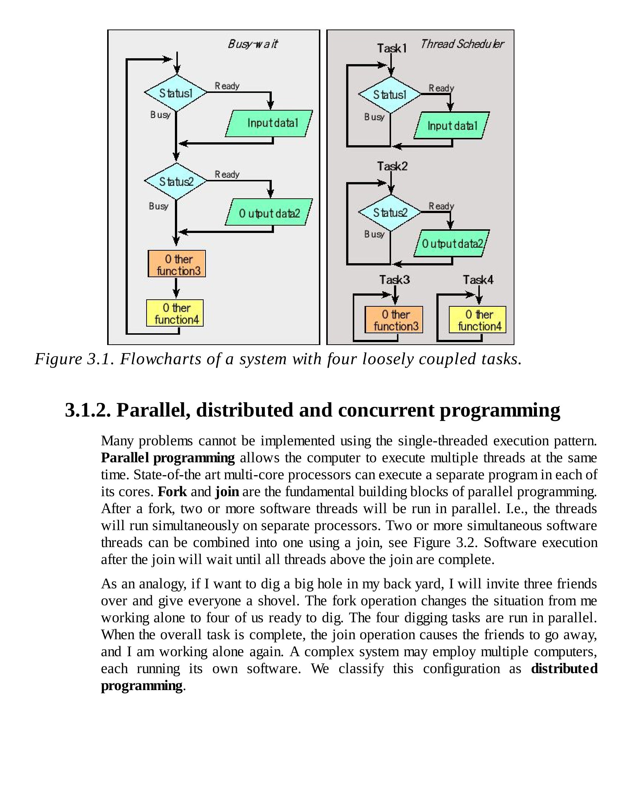
*Description*: Timing waveform and execution flowchart illustrating signal transitions, state machine progression, or algorithm logic for Figure 3.1: Flowcharts of a system with four loosely coupled tasks..

> **Figure 3.1: Flowcharts of a system with four loosely coupled tasks.**

3.1.2. Parallel, distributed and concurrent programming
Many problems cannot be implemented using the single-threaded execution pattern.
Parallel programming allows the computer to execute multiple threads at the same
time. State-of-the art multi-core processors can execute a separate program in each of
its cores. Fork and join are the fundamental building blocks of parallel programming.
After a fork, two or more software threads will be run in parallel. I.e., the threads
will run simultaneously on separate processors. Two or more simultaneous software
threads can be combined into one using a join, see Figure 3.2. Software execution
after the join will wait until all threads above the join are complete.
As an analogy, if I want to dig a big hole in my back yard, I will invite three friends
over and give everyone a shovel. The fork operation changes the situation from me
working alone to four of us ready to dig. The four digging tasks are run in parallel.
When the overall task is complete, the join operation causes the friends to go away,

```assembly
and I am working alone again. A complex system may employ multiple computers,
```

each running its own software. We classify this configuration as distributed
programming.


<!-- Page 208 -->
### [PDF Page 208]


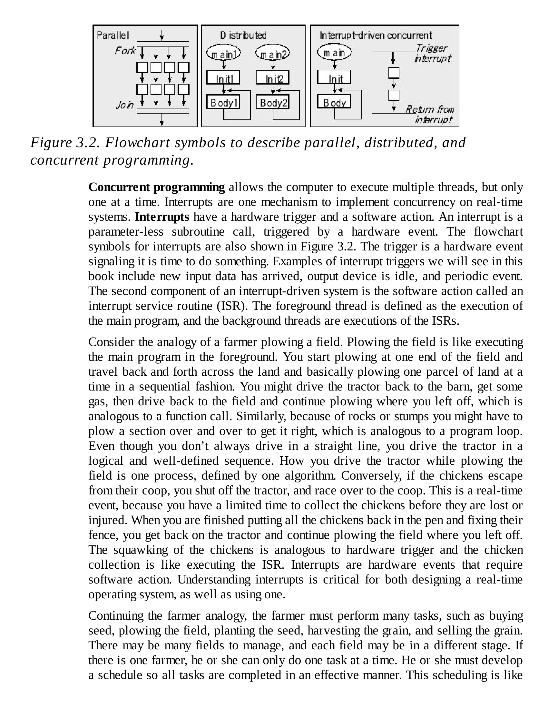
*Description*: Timing waveform and execution flowchart illustrating signal transitions, state machine progression, or algorithm logic for Figure 3.2: Flowchart symbols to describe parallel, distributed, and.

> **Figure 3.2: Flowchart symbols to describe parallel, distributed, and**

concurrent programming.
Concurrent programming allows the computer to execute multiple threads, but only
one at a time. Interrupts are one mechanism to implement concurrency on real-time
systems. Interrupts have a hardware trigger and a software action. An interrupt is a
parameter-less subroutine call, triggered by a hardware event. The flowchart
symbols for interrupts are also shown in Figure 3.2. The trigger is a hardware event
signaling it is time to do something. Examples of interrupt triggers we will see in this
book include new input data has arrived, output device is idle, and periodic event.
The second component of an interrupt-driven system is the software action called an
interrupt service routine (ISR). The foreground thread is defined as the execution of
the main program, and the background threads are executions of the ISRs.
Consider the analogy of a farmer plowing a field. Plowing the field is like executing
the main program in the foreground. You start plowing at one end of the field and
travel back and forth across the land and basically plowing one parcel of land at a
time in a sequential fashion. You might drive the tractor back to the barn, get some
gas, then drive back to the field and continue plowing where you left off, which is
analogous to a function call. Similarly, because of rocks or stumps you might have to
plow a section over and over to get it right, which is analogous to a program loop.
Even though you don’t always drive in a straight line, you drive the tractor in a
logical and well-defined sequence. How you drive the tractor while plowing the
field is one process, defined by one algorithm. Conversely, if the chickens escape
from their coop, you shut off the tractor, and race over to the coop. This is a real-time
event, because you have a limited time to collect the chickens before they are lost or
injured. When you are finished putting all the chickens back in the pen and fixing their
fence, you get back on the tractor and continue plowing the field where you left off.
The squawking of the chickens is analogous to hardware trigger and the chicken
collection is like executing the ISR. Interrupts are hardware events that require
software action. Understanding interrupts is critical for both designing a real-time
operating system, as well as using one.
Continuing the farmer analogy, the farmer must perform many tasks, such as buying
seed, plowing the field, planting the seed, harvesting the grain, and selling the grain.
There may be many fields to manage, and each field may be in a different stage. If
there is one farmer, he or she can only do one task at a time. He or she must develop
a schedule so all tasks are completed in an effective manner. This scheduling is like


<!-- Page 209 -->
### [PDF Page 209]

the one in a real-time operating system (RTOS). The RTOS is given many foreground
tasks to perform and the rate to execute them. To be effective and efficient, just like
the farmer, the RTOS needs to know how long each task requires to run, and what the
relative priority is between tasks. The farm with many workers is analogous to an
RTOS running on multiple processors. In this case, synchronization and
communication are critical parts of the solution.
3.1.3. Introduction to threads
A program is a sequence of software commands connected together to affect a
desired outcome. Programs perform input, make decisions, record information, and
generate outputs. Programmers generate software using an editor with a keyboard and
display. Programs are compiled and downloaded into the flash ROM of our
microcontroller. Programs themselves are static and lifeless entities. However, when
we apply power to the microcontroller, the processor executes the machine code of
the programs in the ROM. A thread is defined as either execution itself or the action
caused by the execution. Either way we see that threads are dynamic, and thus it is
threads that breathe life into our systems. A thread therefore is a program in action,
accordingly, in addition to the program (instructions) to execute it also has the state
of the program. The thread state is captured by the current contents of the registers

```assembly
and the local variables, both of which are stored on the thread’s stack.
```

For example, Figure 3.3 shows a system with four programs. We define Thread1 as
the execution of Task1. Another name for thread is light-weight process. Multiple
threads typically cooperate to implement the desired functionality of the system. We
could use hardware-triggered interrupts to create multiple threads. However, in this
class the RTOS will create the multiple threads that make up our system. Figure 3.3
shows the threads having separate programs. All threads do have a program to
execute, but it is acceptable for multiple threads to run the same program. Since each
thread has a separate stack, its local variables are private, which means it alone has
access to its own local variables.

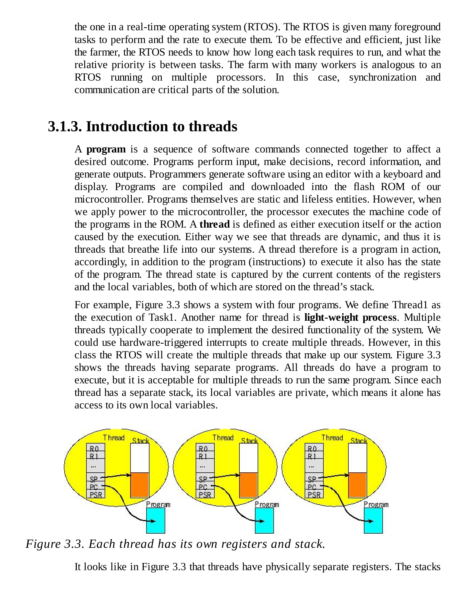
*Description*: Register layout and memory mapping diagram specifying bit fields, stack pointer allocations, and memory address boundaries for Figure 3.3: Each thread has its own registers and stack..

> **Figure 3.3: Each thread has its own registers and stack.**

It looks like in Figure 3.3 that threads have physically separate registers. The stacks


<!-- Page 210 -->
### [PDF Page 210]

will be physically separate, but in reality there is just one set of registers that is
switched between the threads as the thread scheduler operates. The thread switcher
will suspend one thread by pushing all the registers on its stack, saving the SP,
changing the SP to point to the stack of the next thread to run, then pulling all the
registers off the new stack.
Since threads interact for a common goal, they do share resources such as global
memory, and I/O devices (Figure 3.4).  However, to reduce complexity it is the best
to limit the amount of sharing. It is better to use a well-controlled means to pass data

```assembly
and synchronize threads.
```


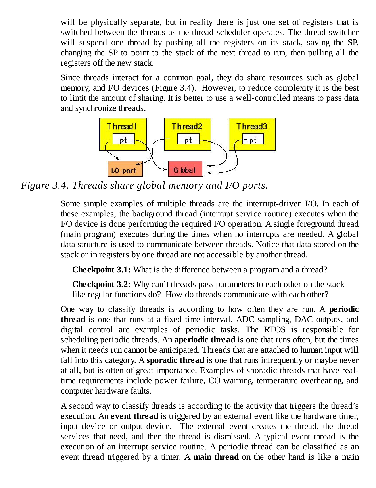
*Description*: Technical schematic and block diagram illustrating circuit operation, signal pathways, and functional behavior for Figure 3.4: Threads share global memory and I/O ports..

> **Figure 3.4: Threads share global memory and I/O ports.**

Some simple examples of multiple threads are the interrupt-driven I/O. In each of
these examples, the background thread (interrupt service routine) executes when the
I/O device is done performing the required I/O operation. A single foreground thread
(main program) executes during the times when no interrupts are needed. A global
data structure is used to communicate between threads. Notice that data stored on the
stack or in registers by one thread are not accessible by another thread.
Checkpoint 3.1: What is the difference between a program and a thread?
Checkpoint 3.2: Why can’t threads pass parameters to each other on the stack
like regular functions do?  How do threads communicate with each other?
One way to classify threads is according to how often they are run. A periodic
thread is one that runs at a fixed time interval. ADC sampling, DAC outputs, and
digital control are examples of periodic tasks. The RTOS is responsible for
scheduling periodic threads. An aperiodic thread is one that runs often, but the times
when it needs run cannot be anticipated. Threads that are attached to human input will
fall into this category. A sporadic thread is one that runs infrequently or maybe never
at all, but is often of great importance. Examples of sporadic threads that have real-
time requirements include power failure, CO warning, temperature overheating, and
computer hardware faults.
A second way to classify threads is according to the activity that triggers the thread’s
execution. An event thread is triggered by an external event like the hardware timer,
input device or output device.  The external event creates the thread, the thread
services that need, and then the thread is dismissed. A typical event thread is the
execution of an interrupt service routine. A periodic thread can be classified as an
event thread triggered by a timer. A main thread on the other hand is like a main


<!-- Page 211 -->
### [PDF Page 211]

program, it runs for a long time performing tasks like input, storage, decisions, and
output. Main threads can be thought of as cycle-stealing threads because they run
when there are no events to service.
3.1.4. States of a main thread
A main thread can be in one of four states, as shown in Figure 3.5. The arrows in

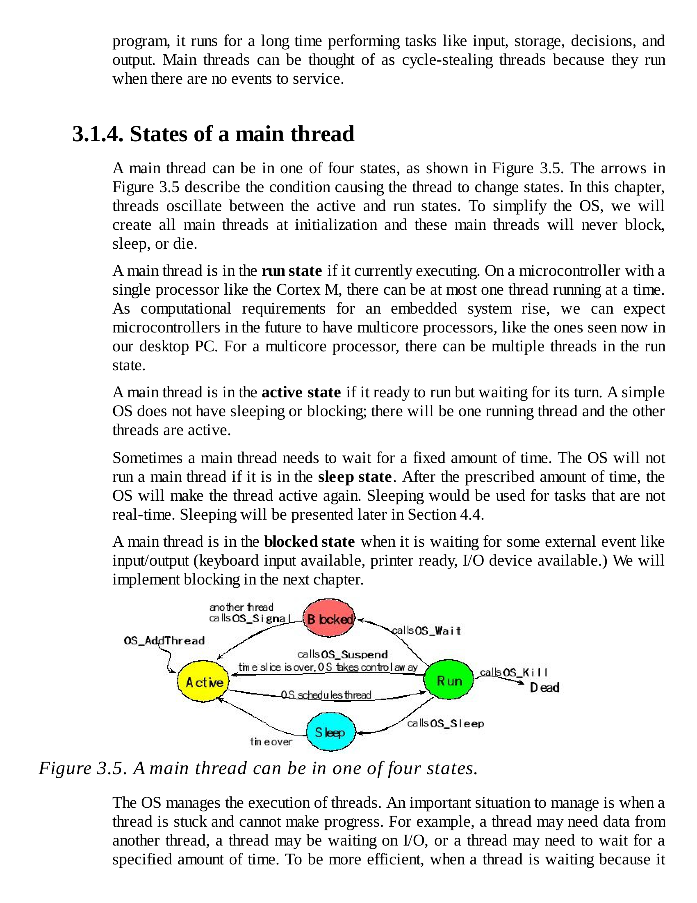
*Description*: Technical schematic and block diagram illustrating circuit operation, signal pathways, and functional behavior for Figure 3.5: describe the condition causing the thread to change states. In this chapter,.

> **Figure 3.5: describe the condition causing the thread to change states. In this chapter,**

threads oscillate between the active and run states. To simplify the OS, we will
create all main threads at initialization and these main threads will never block,
sleep, or die.
A main thread is in the run state if it currently executing. On a microcontroller with a
single processor like the Cortex M, there can be at most one thread running at a time.
As computational requirements for an embedded system rise, we can expect
microcontrollers in the future to have multicore processors, like the ones seen now in
our desktop PC. For a multicore processor, there can be multiple threads in the run
state.
A main thread is in the active state if it ready to run but waiting for its turn. A simple
OS does not have sleeping or blocking; there will be one running thread and the other
threads are active.
Sometimes a main thread needs to wait for a fixed amount of time. The OS will not
run a main thread if it is in the sleep state. After the prescribed amount of time, the
OS will make the thread active again. Sleeping would be used for tasks that are not
real-time. Sleeping will be presented later in Section 4.4.
A main thread is in the blocked state when it is waiting for some external event like
input/output (keyboard input available, printer ready, I/O device available.) We will
implement blocking in the next chapter.


*Description*: Technical schematic and block diagram illustrating circuit operation, signal pathways, and functional behavior for Figure 3.5: A main thread can be in one of four states..

> **Figure 3.5: A main thread can be in one of four states.**

The OS manages the execution of threads. An important situation to manage is when a
thread is stuck and cannot make progress. For example, a thread may need data from
another thread, a thread may be waiting on I/O, or a thread may need to wait for a
specified amount of time. To be more efficient, when a thread is waiting because it


<!-- Page 212 -->
### [PDF Page 212]

cannot make progress it will block, meaning it will not run until the time at which it
can make progress. Similarly, to improve efficiency, when a thread needs to wait for
a prescribed amount of time, it will sleep, meaning it will not run until the elapsed
wait time has passed. Blocking and sleeping will free up the processor to perform
actual work. A simple OS without blocking and sleeping must simply spin while the
thread is waiting on an event. A thread that is spinning remains in the active state, and
wastes its entire time slice checking the condition over and over.
3.1.5. Real-time systems
Designing a RTOS requires many decisions to be made. Therefore, it is important to
have performance criteria with which to evaluate one alternative to another. A
common performance criterion used in Real-Time Systems is Deadline, a timing
constraint with many definitions in the literature. In this class we will define specific
timing constraints that apply to design of embedded systems. Bandwidth is defined as
the information rate. It specifies the amount of actual data per unit time that are input,
processed, or output.
In a real-time system operations performed must meet logical correctness and also be
completed on time (i.e., meet timing constraints). Non real-time systems require
logical correctness but have no timing requirements. The tolerance of a real-time
system towards failure to meet the timing requirements determines whether we
classify it as hard real time, firm real time, or soft real time. If missing a timing
constraint is unacceptable, we call it a hard real-time system. In a firm real-time
system, the value of an operation completed past its timing constraint is considered
zero but not harmful. In a soft real-time system, the value of an operation diminishes
the further it completes after the timing constraint.
Hard real time: For example, if the pressure inside a module in a chemical plant
rises above a threshold, failure to respond through an automated corrective operation
of opening a pressure valve within a timing constraint can be catastrophic. The
system managing the operations in such a scenario is a hard real-time operating
system.
Firm real time: An example of a firm real-time system is a streaming multimedia
communication system where failure to render one video frame on time in a 30
frames per second stream can be perceived as a loss of quality but does not affect the
user experience significantly.
Soft real time: An example of a soft real-time system is an automated stock trading
system where excessive delay in formulating an automated response to buy/sell may
diminish the monetary value one can gain from the trade. The delivery of email is
usually soft real time, because the value of the information reduces the longer it
takes.
Observation: Please understand that the world has not reached consensus of the


<!-- Page 213 -->
### [PDF Page 213]

definitions of hard, firm and soft. Rather than classify names to the real-time
system, think of this issue is as a continuum. There is a continuous progression of
the consequence of missing a deadline: catastrophic (hard) → zero effect and no
harm (firm) → still some good can come from finishing after deadline (soft).
Similarly: there is a continuous progression for the value of missing a deadline:
negative value (hard), zero value (firm) and some but diminishing positive value
(soft).
To better understand real-time systems, timing constraints can be classified into two
types. The first type is event-response. The event is a software or hardware trigger
that signifies something important has occurred and must be handled. The response is
the system’s reaction to that event. Examples of event-response tasks include:
Operator pushes a button ->
Software performs action
Temperature is too hot
->
Turn on cooling fan
Supply voltage is too low
->
Activate back up battery
Input device has new data ->
Read and process input data
Output device is idle
->
Perform another output
The specific timing constraint for this type of system is called latency, which is the
time between the event and the completion of the response. Let Ei be the times that
events occur in our system, and Ti be the times these events are serviced. Latency is
defined as
Δi = Ti – Eifor i = 0, 1, 2, …, n-1
where n is the number of measurements collected. The timing constraint is the
maximum value for latency, Δi, that is acceptable. In most cases, the system will not
be able to anticipate the event, so latency for this type of system will always be
positive.
A second type of timing constraint occurs with prescheduled tasks. For example, we
could schedule a task to run periodically. If we define fs as the desired frequency of a
periodic task, then the desired period is Δt = 1/fs. Examples of prescheduled tasks
include:
Every 30 seconds
->
Software checks for smoke
At 22 kHz
->
Output new data to DACs creating sound
At 1 week, 1 month, 1 year->
Perform system maintenance
At 300 Hz
->
Input new data from ADC measuring EKG
At 6 months of service
->
Deactivate system because it is at
end of life
For periodic, the desired time to run the i’th periodic instance of the task is given as


<!-- Page 214 -->
### [PDF Page 214]

Di = T0 +i*Δtfor i = 0, 1, 2, …, n-1
where T0 is the starting time for the system. For prescheduled tasks, we define jitter
as the difference between desired time a task is supposed to run and the actual time it
is run. Let Ti be the actual times the task is run, so in this case jitter is
δti = Ti – Di
for i = 0, 1, 2, …, n-1
Notice for prescheduled tasks the jitter can be positive (late) or negative (early), see

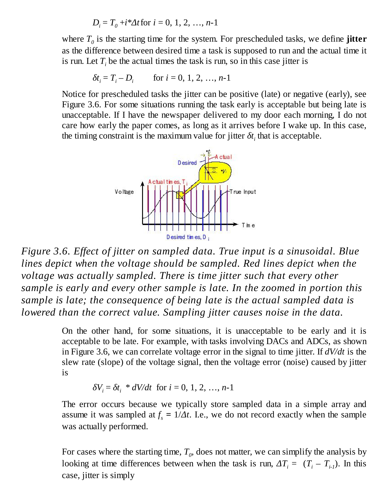
*Description*: Reference table detailing hardware parameters, register bit patterns, performance metrics, or memory configurations for Figure 3.6: For some situations running the task early is acceptable but being late is.

> **Figure 3.6: For some situations running the task early is acceptable but being late is**

unacceptable. If I have the newspaper delivered to my door each morning, I do not
care how early the paper comes, as long as it arrives before I wake up. In this case,
the timing constraint is the maximum value for jitter δti that is acceptable.


*Description*: Technical schematic and block diagram illustrating circuit operation, signal pathways, and functional behavior for Figure 3.6: Effect of jitter on sampled data. True input is a sinusoidal. Blue.

> **Figure 3.6: Effect of jitter on sampled data. True input is a sinusoidal. Blue**

lines depict when the voltage should be sampled. Red lines depict when the
voltage was actually sampled. There is time jitter such that every other
sample is early and every other sample is late. In the zoomed in portion this
sample is late; the consequence of being late is the actual sampled data is
lowered than the correct value. Sampling jitter causes noise in the data.
On the other hand, for some situations, it is unacceptable to be early and it is
acceptable to be late. For example, with tasks involving DACs and ADCs, as shown
in Figure 3.6, we can correlate voltage error in the signal to time jitter. If dV/dt is the
slew rate (slope) of the voltage signal, then the voltage error (noise) caused by jitter
is
δVi = δti  * dV/dt for i = 0, 1, 2, …, n-1
The error occurs because we typically store sampled data in a simple array and
assume it was sampled at fs = 1/Δt. I.e., we do not record exactly when the sample
was actually performed.
For cases where the starting time, T0, does not matter, we can simplify the analysis by
looking at time differences between when the task is run, ΔTi =  (Ti – Ti-1). In this
case, jitter is simply


<!-- Page 215 -->
### [PDF Page 215]

δti = ΔTi - Δt
for i = 0, 1, 2, …, n-1
We will classify a system with periodic tasks as real-time if the jitter is always less
than a small but acceptable value. In other words, the software task always meets its
timing constraint.  More specifically, we must be able to place an upper bound, k, on
the time jitter.
-k ≤ δti ≤ +k  for all i
For a hard real-time system, we are interested in the worst case. So we measure
Min = minimum δti for all measurements i
Max = maximum δti for all measurements i
Jitter = Max - Min = (maximum δti – minimum δti)
In most situations, the time jitter will be dominated by the time the microcontroller
runs with interrupts disabled. For lower priority interrupts, it is also affected by the
length and frequency of higher priority interrupt requests.
To further clarify this situation, we must clearly identify the times at which the Ti
measurements are collected. We could define this time as when the task is started or
when the task is completed. When sampling an ADC, the important time is when the
ADC sampling is started. More specifically, it is the time the ADC sample/hold
module is changed from sample to hold mode. This is because the ADC captures or
latches the analog input at the moment the sample/hold is set to hold. For tasks with a
DAC, the important time is when the DAC is updated. More specifically, it is the
time the DAC is told to update its output voltage.
In this class, we use the term real-time and hard real-time to mean the same thing.
Real-time for event-response tasks means the system has small and bounded latency.
Real-time for periodic tasks means the system has small and bounded jitter.  In other
words, a real-time operating system (RTOS) is one that guarantees that the difference
between when tasks are supposed to run and when they actually are run is short and
bounded.
Checkpoint 3.3: Consider a task that inputs data from the serial port. When new
data arrives the serial port triggers an event. When the software services that
event, it reads and processes the new data. The serial port has hardware to store
incoming data (2 on the MSP432, 16 on the TM4C123) such that if the buffer is
full and more data arrives, the new data is lost. Is this system hard, firm, or soft
real time?
Checkpoint 3.4: Consider a hearing aid that inputs sounds from a microphone,
manipulates the sound data, and then outputs the data to a speaker. The system
usually has small and bounded jitter, but occasionally other tasks in the hearing
aid cause some data to be late, causing a noise pulse on the speaker. Is this system
hard, firm or soft real time?


<!-- Page 216 -->
### [PDF Page 216]

Checkpoint 3.5: Consider a task that outputs data to a printer. When the printer is
idle the printer triggers an event. When the software services that event, it sends
more data to the printer. Is this system hard, firm or soft real time?
3.1.6. Producer/Consumer problem using a mailbox
One of the classic problems our operating system must handle is communication
between threads. We define a producer thread as one that creates or produces data. A
consumer thread is a thread that consumes (and removes) data. The communication
mechanism we will use in this chapter is a mailbox (Figure 3.7). The mailbox has a
Data field and a Status field. Mailboxes will be statically allocated global

```c
structures. Because they are global variables, it means they will exist permanently
and can be carefully shared by more than one task. The advantage of using a structure
```

like a mailbox for a data flow problem is that we can decouple the producer and
consumer threads. In the next chapter, we will replace the mailbox with a first in first
one (FIFO) queue. The use of a FIFO can significantly improve system performance.


*Description*: Technical schematic and block diagram illustrating circuit operation, signal pathways, and functional behavior for Figure 3.7: The mailbox is used to send data from the producer thread to the.

> **Figure 3.7: The mailbox is used to send data from the producer thread to the**

consumer thread.
There are many producer/consumer applications in the field of embedded systems. In

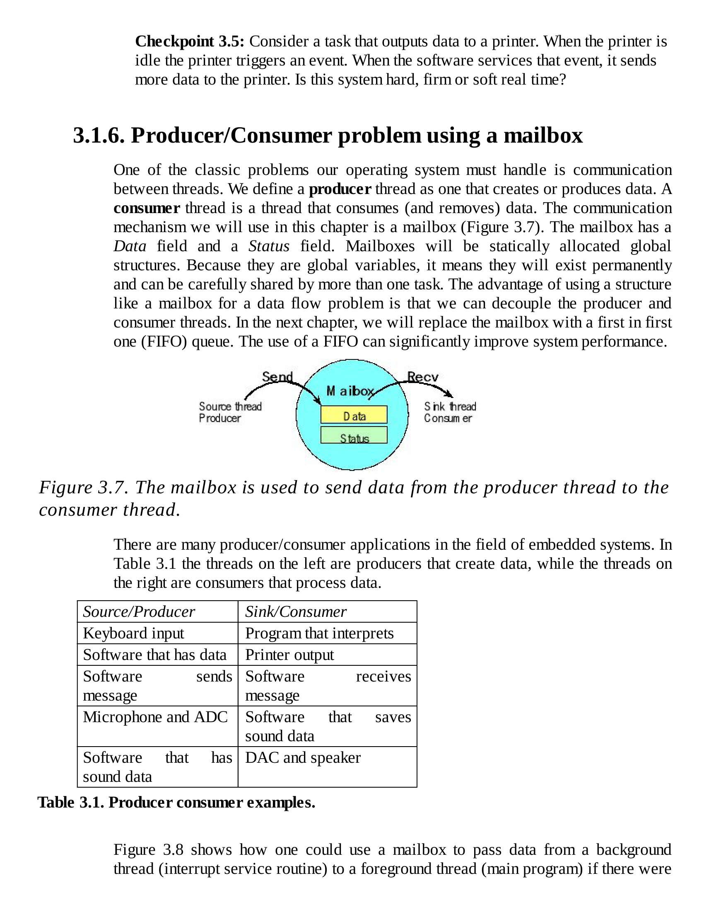
*Description*: Reference table detailing hardware parameters, register bit patterns, performance metrics, or memory configurations for Table 3.1: the threads on the left are producers that create data, while the threads on.

> **Table 3.1: the threads on the left are producers that create data, while the threads on**

the right are consumers that process data.
Source/Producer
Sink/Consumer
Keyboard input
Program that interprets
Software that has data
Printer output
Software
sends
message
Software
receives
message
Microphone and ADC
Software
that
saves
sound data
Software
that
has
sound data
DAC and speaker


*Description*: Reference table detailing hardware parameters, register bit patterns, performance metrics, or memory configurations for Table 3.1: Producer consumer examples..

> **Table 3.1: Producer consumer examples.**


*Description*: Technical schematic and block diagram illustrating circuit operation, signal pathways, and functional behavior for Figure 3.8: shows how one could use a mailbox to pass data from a background.

> **Figure 3.8: shows how one could use a mailbox to pass data from a background**

thread (interrupt service routine) to a foreground thread (main program) if there were


<!-- Page 217 -->
### [PDF Page 217]

no operating system.

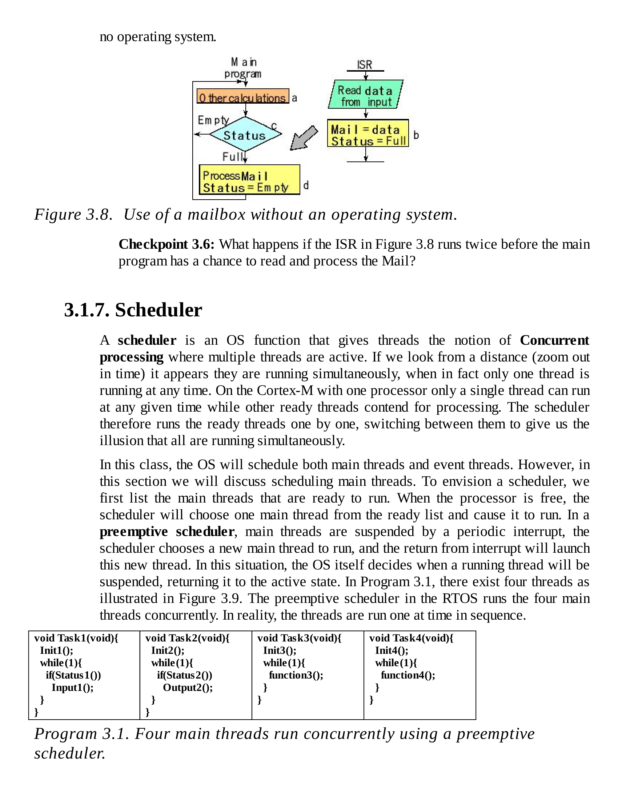
*Description*: Technical schematic and block diagram illustrating circuit operation, signal pathways, and functional behavior for Figure 3.8: Use of a mailbox without an operating system..

> **Figure 3.8: Use of a mailbox without an operating system.**

Checkpoint 3.6: What happens if the ISR in Figure 3.8 runs twice before the main
program has a chance to read and process the Mail?
3.1.7. Scheduler
A scheduler is an OS function that gives threads the notion of Concurrent
processing where multiple threads are active. If we look from a distance (zoom out
in time) it appears they are running simultaneously, when in fact only one thread is
running at any time. On the Cortex-M with one processor only a single thread can run
at any given time while other ready threads contend for processing. The scheduler
therefore runs the ready threads one by one, switching between them to give us the
illusion that all are running simultaneously.
In this class, the OS will schedule both main threads and event threads. However, in
this section we will discuss scheduling main threads. To envision a scheduler, we
first list the main threads that are ready to run. When the processor is free, the
scheduler will choose one main thread from the ready list and cause it to run. In a
preemptive scheduler, main threads are suspended by a periodic interrupt, the
scheduler chooses a new main thread to run, and the return from interrupt will launch
this new thread. In this situation, the OS itself decides when a running thread will be
suspended, returning it to the active state. In Program 3.1, there exist four threads as
illustrated in Figure 3.9. The preemptive scheduler in the RTOS runs the four main
threads concurrently. In reality, the threads are run one at time in sequence.

```c
void Task1(void){
Init1();
while(1){
if(Status1())
Input1();
}
}
void Task2(void){
Init2();
while(1){
if(Status2())
Output2();
}
}
void Task3(void){
Init3();
while(1){
function3();
}
}
void Task4(void){
Init4();
while(1){
function4();
}
}
```


*Description*: Technical schematic and block diagram illustrating circuit operation, signal pathways, and functional behavior for Program 3.1: Four main threads run concurrently using a preemptive.

> **Program 3.1: Four main threads run concurrently using a preemptive**

scheduler.


<!-- Page 218 -->
### [PDF Page 218]


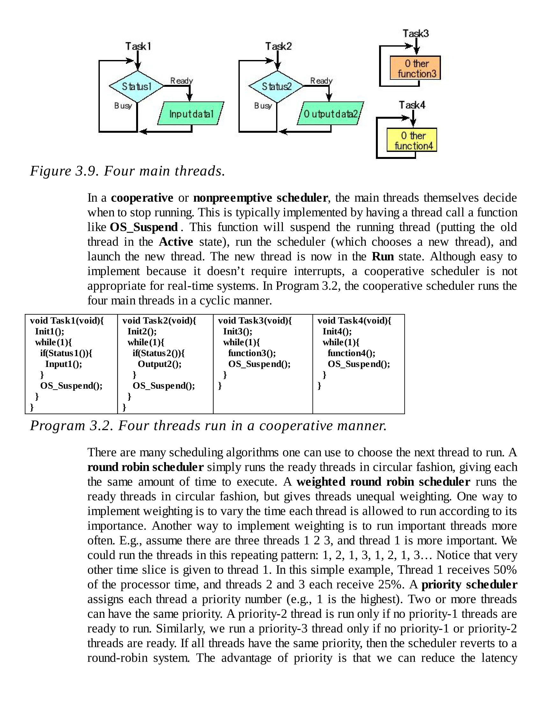
*Description*: Technical schematic and block diagram illustrating circuit operation, signal pathways, and functional behavior for Figure 3.9: Four main threads..

> **Figure 3.9: Four main threads.**

In a cooperative or nonpreemptive scheduler, the main threads themselves decide
when to stop running. This is typically implemented by having a thread call a function
like OS_Suspend . This function will suspend the running thread (putting the old
thread in the Active state), run the scheduler (which chooses a new thread), and
launch the new thread. The new thread is now in the Run state. Although easy to
implement because it doesn’t require interrupts, a cooperative scheduler is not
appropriate for real-time systems. In Program 3.2, the cooperative scheduler runs the
four main threads in a cyclic manner.

```c
void Task1(void){
Init1();
while(1){
if(Status1()){
Input1();
}
OS_Suspend();
}
}
void Task2(void){
Init2();
while(1){
if(Status2()){
Output2();
}
OS_Suspend();
}
}
void Task3(void){
Init3();
while(1){
function3();
OS_Suspend();
}
}
void Task4(void){
Init4();
while(1){
function4();
OS_Suspend();
}
}
```


*Description*: Technical schematic and block diagram illustrating circuit operation, signal pathways, and functional behavior for Program 3.2: Four threads run in a cooperative manner..

> **Program 3.2: Four threads run in a cooperative manner.**

There are many scheduling algorithms one can use to choose the next thread to run. A
round robin scheduler simply runs the ready threads in circular fashion, giving each
the same amount of time to execute. A weighted round robin scheduler runs the
ready threads in circular fashion, but gives threads unequal weighting. One way to
implement weighting is to vary the time each thread is allowed to run according to its
importance. Another way to implement weighting is to run important threads more
often. E.g., assume there are three threads 1 2 3, and thread 1 is more important. We
could run the threads in this repeating pattern: 1, 2, 1, 3, 1, 2, 1, 3… Notice that very
other time slice is given to thread 1. In this simple example, Thread 1 receives 50%
of the processor time, and threads 2 and 3 each receive 25%. A priority scheduler
assigns each thread a priority number (e.g., 1 is the highest). Two or more threads
can have the same priority. A priority-2 thread is run only if no priority-1 threads are
ready to run. Similarly, we run a priority-3 thread only if no priority-1 or priority-2
threads are ready. If all threads have the same priority, then the scheduler reverts to a
round-robin system. The advantage of priority is that we can reduce the latency


<!-- Page 219 -->
### [PDF Page 219]

(response time) for important tasks by giving those tasks a high priority. The
disadvantage is that on a busy system, low priority threads may never be run. This
situation is called starvation.
Schedulers for real-time systems may use other metrics to decide thread
importance/priority.  A deadline is when a task should complete relative to when it is
ready to run. The time to deadline is the time between now and the deadline. If you
have a paper due on Friday, and it is Tuesday, the time-to-deadline is 3 days.
Furthermore, we define slack time as the time-to-deadline minus the how long it will
take to complete the task. If you have a paper due on Friday, it is Tuesday and it will
take you one day to write the paper, your slack time is 2 days. Once the slack time
becomes negative, you will miss your deadline. There are many other ways to assign
priority:
Minimize latency for real-time tasks
Assign a dollar cost for delayed service and minimize cost
Give priority to I/O bound tasks over CPU bound tasks
Give priority to tasks that need to run more frequently
Smallest time-to-deadline first
Least slack time first
A thread’s priority may be statically assigned or can be changed dynamically as the
system progresses. An exponential queue is a dynamic scheduling algorithm, with
varying priorities and time slices. If a thread blocks on I/O, its priority is increased

```assembly
and its time slice is halved. If it runs to completion of a time slice, its priority is
```

decreased and its time slice is doubled.
Another dynamic scheduling algorithm uses the notion of aging to solve starvation. In
this scheme, threads have a permanent fixed priority and a temporary working
priority. The permanent priority is assigned according the rules of the previous
paragraph, but the temporary priority is used to actually schedule threads.
Periodically the OS increases the temporary priority of threads that have not been run
in a long time. Once a thread is run, its temporary priority is reset back to its
permanent priority.
Assigning priority to tasks according to how often they are required to run (their
periodicity) is called a Rate Monotonic Scheduler. Assume we have m tasks that
are periodic, running with periods Tj (0 ≤ j ≤ m-1). We assign priorities according to
these periods with more frequent tasks having higher priorities. Furthermore, let Ej be
the maximum time to execute each task. Assuming there is little interaction between
tasks, the Rate Monotonic Theorem can be used to predict if a scheduling solution
exists. Tasks can be scheduled if


<!-- Page 220 -->
### [PDF Page 220]

and
What this means is, as long as the total utilization of the set of tasks is below 69.32%
(ln(2) ≈ 0.6932) RMS will guarantee to meet all timing constraints. The practical
application of the Rate Monotonic Theorem is extremely limited because most
systems exhibit a high degree of coupling between tasks. Nevertheless, it does
motivate a consideration that applies to all real-time operating systems. Let Ej be the
time to execute each task, and let Tj be the time between executions of each task. In
general, Ej/Tj will be the percentage of time Task j needs to run. The sum of these
percentages across all tasks yields a parameter that estimates processor utilization.
Average Utilization ≡
Maximum Utilization ≡
If utilization is over 100% there will be no solution. If utilization is below 5%, the
processor may be too fast for your problem. The solution could be to slow down the
clock and save power. As the sum goes over 50% and begins to approach 100%, it
will be more and more difficult to schedule all tasks. The solution will be to use a
faster processor or simplify the tasks. An effective system will operate in the 5 to
50% range.
Checkpoint 3.7: What happens if the average utilization is over 1?
Checkpoint 3.8: What happens if the average utilization is less than 1, but the
maximum utilization is over 1?


<!-- Page 221 -->
### [PDF Page 221]

3.2. Function pointers
As we work our way towards constructing an OS there are some advanced
programming concepts we require the reader to be familiar with. One such concept is
“function pointers”. Normally, when software in module A wishes to invoke software
in module B, module A simply calls a function in module B. The function in module

```assembly
B performs some action and returns to A. At this point, typically, this exchange is
```

complete. A callback is a mechanism through which the software in module B can
call back a preset function in module A at a later time. Another name for callback is
hook. To illustrate this concept, let module A be the user code and module B be the
operating system. To setup a callback, we first write a user function (e.g., CallMe ),

```assembly
and then the user calls the OS passing this function as a parameter.
int count;
void CallMe(void){
count++;
}
```

The OS immediately returns to the user, but at some agreed upon condition, the OS
can invoke a call back to the user by executing this function.
As we initialize the operating system, the user code must tell the OS a list of tasks
that should be run. More specifically, the user code will pass into the operating
system pointers to user functions. In C on the Cortex M, all pointers are 32-bit
addresses regardless of the type of pointer. A function pointer is simply a pointer to
a function. In this book, all tasks or threads will be defined as void-void functions,
like CallMe. In other words, threads take no inputs and return no output.
There are three operations we can perform on function pointers. The first is declaring
a function pointer variable. Just like other pointers, we specify the type and add * in
front of the name. We think it is good style to include p , pt , or ptr  in pointer names.
The syntax looks like this
void (*TaskPt)(void);
Although the above line looks a little bit like a prototype, it is not a prototype. Rather
this line creates a variable of type function pointer. We can read this declaration
as TaskPt  is a pointer to a function that takes no input and returns no output.
Just like other variables, we need to set its value before using it. To set a function
pointer we assign it a value of the proper type. In this case, TaskPt  is a pointer to a
void-void function, so we assign it the address of a void-void function by executing
this code at run time.
TaskPt = &CallMe;  // TaskPt points to CallMe


<!-- Page 222 -->
### [PDF Page 222]

Just like other pointers (to variables), to access what a pointer is pointing to, we
dereference it using *. In this case, to run the function we execute
*TaskPt();   // call the function to which it points
As an example, let’s look at one of the features in the BSP package. The
function BSP_PeriodicTask_Init  will initialize a timer so a user function will run
periodically. Notice the user function is called from inside the interrupt service
routine.
void (*PeriodicTask)(void);    // user function

```c
void BSP_PeriodicTask_Init(void(*task)(void),  // user function
uint32_t freq,      // frequency in Hz
uint8_t priority){  // priority
// . . .
PeriodicTask = task;             // user function
// . . .
}
void T32_INT1_IRQHandler(void){
TIMER32_INTCLR1 = 0x00000001;    // acknowledge Timer 1 interrupt
(*PeriodicTask)();               // execute user task
}
```

The user code creates a void-void function and calls BSP_PeriodicTask_Init  to
attach this function to the periodic interrupt:
BSP_PeriodicTask_Init(&checkbuttons, 10, 2);
Another application of function pointers is a hook. A hook is an OS feature that
allows the user to attach functions to strategic places in the OS. Examples of places
we might want to place hooks include: whenever the OS has finished initialization,
the OS is running the scheduler, or whenever a new thread is created. To use a hook,
the user writes a function, calls the OS and passes a function pointer. When that event
occurs, the OS calls the user function. Hooks are extremely useful for debugging.
The compiler resolves addresses used in function calls during linking. Once you
download the code, you cannot change it unless you reedit source code, recompile

```assembly
and redownload. Callbacks are a mechanism to change which function gets called
```

dynamically, at run time. In a more complex system, the OS and the user code might
not be compiled at the same time. One could compile and load the OS onto the
system. Later, one compiles and loads the user code onto the same system. The two
modules are then linked together using function pointers. For an example of this
typeof linking, see OS_AddThreads  later in the chapter.


<!-- Page 223 -->
### [PDF Page 223]

3.3. Thread Management
3.3.1. Two types of threads
A fundamental concept in operating systems is the notion of an execution context
referred to as a thread. We introduced threads and their components in Section 3.1.3,
we will now look at the types of threads and how they are treated differently in the
OS. We define two types of threads in this book. Event threads are attached to
hardware and should execute on changes in hardware status. Examples include
periodic threads that should be executed at a fixed rate (for example, data acquisition

```assembly
and control), input threads that should be executed when new data are available at the
```

input device (like the operator pushed a button), and output threads that should be
executed when the output device is idle and new data are available for output. They
are typically defined as void-void  functions. The time to execute an event thread
should be short and bounded. In other words, event threads must execute and return.
The time to execute an event thread must always be less than a small value (e.g.,
10µs). In an embedded system without an OS, event threads are simply the interrupt
service routines (ISRs). However, with a RTOS, we will have the OS manage the
processor and I/O, and therefore the OS will manage the ISRs. The user will write
the software executed as an event thread, but the OS will manage the ISR and call the
appropriate event thread. Communication between threads will be managed by the
OS. For example, threads could use a FIFO to pass data.

```c
void periodicThread(void){ // called periodically
PerformTask();
}
void inputThread(void){ // new input is available
data = ReadInput(); // input data from hardware
Send(data);         // pass data to other software
}
void outputThread(void){ // output is idle
data = Recv();      // get data from other software
WriteOutput(data);  // output data to hardware
}
```

The second type of thread is a main thread. Without an OS, embedded systems
typically have one main program that is executed on start up. This main initializes the
system and defines the high level behavior of the system. In an OS however, we will
have multiple main threads. Main threads execute like main programs that never
return. These threads execute an initialization once and then repeatedly execute a
sequence of steps within a while loop. Here in this chapter, we will specify all the
main threads at initialization and these threads will exist indefinitely. However, in
later chapters we will allow main threads to be created during execution, and we


<!-- Page 224 -->
### [PDF Page 224]

will allow main threads to be destroyed dynamically.

```c
void mainThread(void){
Init();
while(1){
Body();
}
}
```


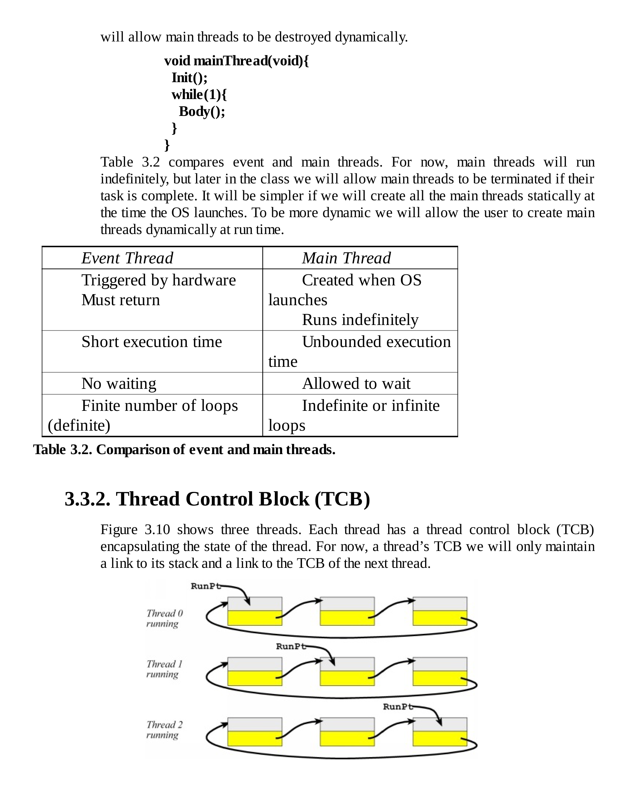
*Description*: Reference table detailing hardware parameters, register bit patterns, performance metrics, or memory configurations for Table 3.2: compares event and main threads. For now, main threads will run.

> **Table 3.2: compares event and main threads. For now, main threads will run**

indefinitely, but later in the class we will allow main threads to be terminated if their
task is complete. It will be simpler if we will create all the main threads statically at
the time the OS launches. To be more dynamic we will allow the user to create main
threads dynamically at run time.
Event Thread
Main Thread
Triggered by hardware
Must return
Created when OS
launches
Runs indefinitely
Short execution time
Unbounded execution
time
No waiting
Allowed to wait
Finite number of loops
(definite)
Indefinite or infinite
loops


*Description*: Reference table detailing hardware parameters, register bit patterns, performance metrics, or memory configurations for Table 3.2: Comparison of event and main threads..

> **Table 3.2: Comparison of event and main threads.**

3.3.2. Thread Control Block (TCB)


*Description*: Technical schematic and block diagram illustrating circuit operation, signal pathways, and functional behavior for Figure 3.10: shows three threads. Each thread has a thread control block (TCB).

> **Figure 3.10: shows three threads. Each thread has a thread control block (TCB)**

encapsulating the state of the thread. For now, a thread’s TCB we will only maintain
a link to its stack and a link to the TCB of the next thread.


<!-- Page 225 -->
### [PDF Page 225]


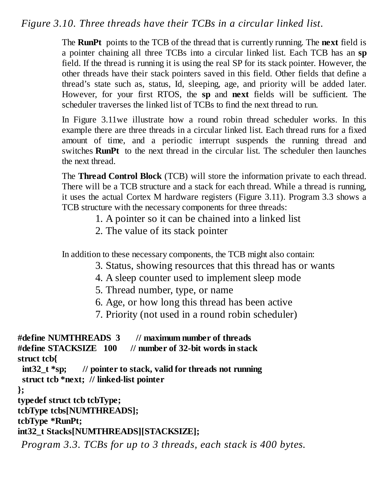
*Description*: Technical schematic and block diagram illustrating circuit operation, signal pathways, and functional behavior for Figure 3.10: Three threads have their TCBs in a circular linked list..

> **Figure 3.10: Three threads have their TCBs in a circular linked list.**

The RunPt  points to the TCB of the thread that is currently running. The next field is
a pointer chaining all three TCBs into a circular linked list. Each TCB has an sp
field. If the thread is running it is using the real SP for its stack pointer. However, the
other threads have their stack pointers saved in this field. Other fields that define a
thread’s state such as, status, Id, sleeping, age, and priority will be added later.
However, for your first RTOS, the sp and next fields will be sufficient. The
scheduler traverses the linked list of TCBs to find the next thread to run.
In Figure 3.11we illustrate how a round robin thread scheduler works. In this
example there are three threads in a circular linked list. Each thread runs for a fixed
amount of time, and a periodic interrupt suspends the running thread and
switches RunPt  to the next thread in the circular list. The scheduler then launches
the next thread.
The Thread Control Block (TCB) will store the information private to each thread.
There will be a TCB structure and a stack for each thread. While a thread is running,
it uses the actual Cortex M hardware registers (Figure 3.11). Program 3.3 shows a
TCB structure with the necessary components for three threads:
1. A pointer so it can be chained into a linked list
2. The value of its stack pointer
In addition to these necessary components, the TCB might also contain:
3. Status, showing resources that this thread has or wants
4. A sleep counter used to implement sleep mode
5. Thread number, type, or name
6. Age, or how long this thread has been active
7. Priority (not used in a round robin scheduler)
#define NUMTHREADS  3       // maximum number of threads
#define STACKSIZE   100      // number of 32-bit words in stack

```c
struct tcb{
int32_t *sp;       // pointer to stack, valid for threads not running
struct tcb *next;  // linked-list pointer
};
typedef struct tcb tcbType;
tcbType tcbs[NUMTHREADS];
tcbType *RunPt;
int32_t Stacks[NUMTHREADS][STACKSIZE];
```


*Description*: Register layout and memory mapping diagram specifying bit fields, stack pointer allocations, and memory address boundaries for Program 3.3: TCBs for up to 3 threads, each stack is 400 bytes..

> **Program 3.3: TCBs for up to 3 threads, each stack is 400 bytes.**


<!-- Page 226 -->
### [PDF Page 226]


*Description*: Register layout and memory mapping diagram specifying bit fields, stack pointer allocations, and memory address boundaries for Figure 3.11: The running thread uses the actual registers, while the other.

> **Figure 3.11: The running thread uses the actual registers, while the other**

threads have their register values saved on the stack. For the running thread
the sp field is not valid, while the sp field on other threads points to the top
of its stack.
3.3.3. Creation of threads

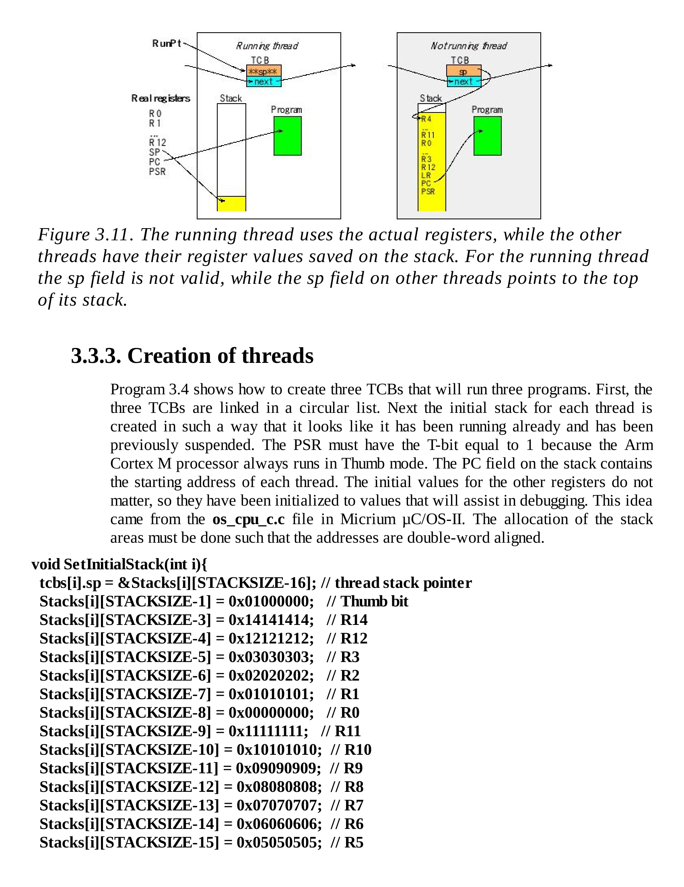
*Description*: Technical schematic and block diagram illustrating circuit operation, signal pathways, and functional behavior for Program 3.4: shows how to create three TCBs that will run three programs. First, the.

> **Program 3.4: shows how to create three TCBs that will run three programs. First, the**

three TCBs are linked in a circular list. Next the initial stack for each thread is
created in such a way that it looks like it has been running already and has been
previously suspended. The PSR must have the T-bit equal to 1 because the Arm
Cortex M processor always runs in Thumb mode. The PC field on the stack contains
the starting address of each thread. The initial values for the other registers do not
matter, so they have been initialized to values that will assist in debugging. This idea
came from the os_cpu_c.c file in Micrium µC/OS-II. The allocation of the stack
areas must be done such that the addresses are double-word aligned.

```c
void SetInitialStack(int i){
tcbs[i].sp = &Stacks[i][STACKSIZE-16]; // thread stack pointer
Stacks[i][STACKSIZE-1] = 0x01000000;   // Thumb bit
Stacks[i][STACKSIZE-3] = 0x14141414;   // R14
Stacks[i][STACKSIZE-4] = 0x12121212;   // R12
Stacks[i][STACKSIZE-5] = 0x03030303;   // R3
Stacks[i][STACKSIZE-6] = 0x02020202;   // R2
Stacks[i][STACKSIZE-7] = 0x01010101;   // R1
Stacks[i][STACKSIZE-8] = 0x00000000;   // R0
Stacks[i][STACKSIZE-9] = 0x11111111;   // R11
Stacks[i][STACKSIZE-10] = 0x10101010;  // R10
Stacks[i][STACKSIZE-11] = 0x09090909;  // R9
Stacks[i][STACKSIZE-12] = 0x08080808;  // R8
Stacks[i][STACKSIZE-13] = 0x07070707;  // R7
Stacks[i][STACKSIZE-14] = 0x06060606;  // R6
Stacks[i][STACKSIZE-15] = 0x05050505;  // R5
```


<!-- Page 227 -->
### [PDF Page 227]

Stacks[i][STACKSIZE-16] = 0x04040404;  // R4
}
int OS_AddThreads(void(*task0)(void), void(*task1)(void),
void(*task2)(void)){

```c
int32_t status;
status = StartCritical();
tcbs[0].next = &tcbs[1]; // 0 points to 1
tcbs[1].next = &tcbs[2]; // 1 points to 2
tcbs[2].next = &tcbs[0]; // 2 points to 0
SetInitialStack(0); Stacks[0][STACKSIZE-2] = (int32_t)(task0); // PC
SetInitialStack(1); Stacks[1][STACKSIZE-2] = (int32_t)(task1); // PC
SetInitialStack(2); Stacks[2][STACKSIZE-2] = (int32_t)(task2); // PC
RunPt = &tcbs[0];       // thread 0 will run first
EndCritical(status);
return 1;               // successful
}
```


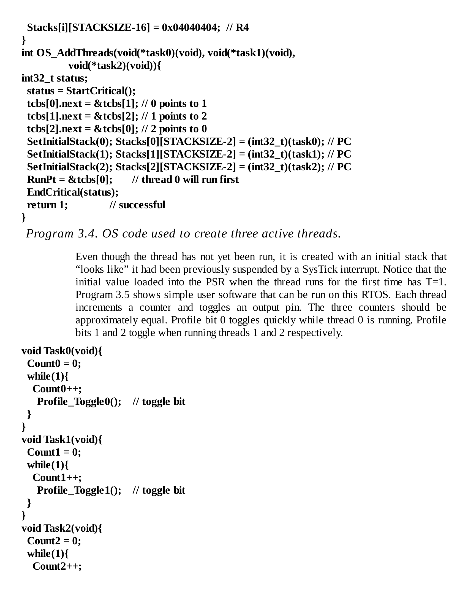
*Description*: Technical schematic and block diagram illustrating circuit operation, signal pathways, and functional behavior for Program 3.4: OS code used to create three active threads..

> **Program 3.4: OS code used to create three active threads.**

Even though the thread has not yet been run, it is created with an initial stack that
“looks like” it had been previously suspended by a SysTick interrupt. Notice that the
initial value loaded into the PSR when the thread runs for the first time has T=1.


*Description*: Technical schematic and block diagram illustrating circuit operation, signal pathways, and functional behavior for Program 3.5: shows simple user software that can be run on this RTOS. Each thread.

> **Program 3.5: shows simple user software that can be run on this RTOS. Each thread**

increments a counter and toggles an output pin. The three counters should be
approximately equal. Profile bit 0 toggles quickly while thread 0 is running. Profile
bits 1 and 2 toggle when running threads 1 and 2 respectively.

```c
void Task0(void){
Count0 = 0;
while(1){
Count0++;
Profile_Toggle0();    // toggle bit
}
}
void Task1(void){
Count1 = 0;
while(1){
Count1++;
Profile_Toggle1();    // toggle bit
}
}
void Task2(void){
Count2 = 0;
while(1){
Count2++;
```


<!-- Page 228 -->
### [PDF Page 228]

Profile_Toggle2();    // toggle bit
}
}
#define THREADFREQ 500  // frequency in Hz
int main(void){
OS_Init();            // initialize, disable interrupts
Profile_Init();       // enable digital I/O on profile pins
OS_AddThreads(&Task0, &Task1, &Task2);
OS_Launch(BSP_Clock_GetFreq()/THREADFREQ); // interrupts enabled
return 0;             // this never executes
}


*Description*: Technical schematic and block diagram illustrating circuit operation, signal pathways, and functional behavior for Program 3.5: Example user code with three threads..

> **Program 3.5: Example user code with three threads.**

3.3.4. Launching the OS
SysTick will be used to perform the preemptive thread switching. We will set the
SysTick to the lowest level so we know it will only suspend foreground threads
(Program 3.6).

```c
void OS_Init(void){
DisableInterrupts();
BSP_Clock_InitFastest();// set processor clock to desired speed
}
```


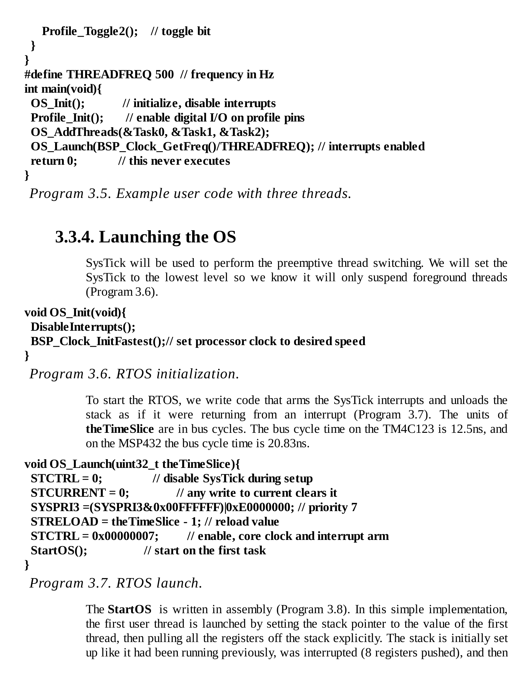
*Description*: Technical schematic and block diagram illustrating circuit operation, signal pathways, and functional behavior for Program 3.6: RTOS initialization..

> **Program 3.6: RTOS initialization.**

To start the RTOS, we write code that arms the SysTick interrupts and unloads the
stack as if it were returning from an interrupt (Program 3.7). The units of
theTimeSlice are in bus cycles. The bus cycle time on the TM4C123 is 12.5ns, and
on the MSP432 the bus cycle time is 20.83ns.

```c
void OS_Launch(uint32_t theTimeSlice){
STCTRL = 0;                // disable SysTick during setup
STCURRENT = 0;               // any write to current clears it
SYSPRI3 =(SYSPRI3&0x00FFFFFF)|0xE0000000; // priority 7
STRELOAD = theTimeSlice - 1; // reload value
STCTRL = 0x00000007;         // enable, core clock and interrupt arm
StartOS();                  // start on the first task
}
```


*Description*: Technical schematic and block diagram illustrating circuit operation, signal pathways, and functional behavior for Program 3.7: RTOS launch..

> **Program 3.7: RTOS launch.**

The StartOS  is written in assembly (Program 3.8). In this simple implementation,
the first user thread is launched by setting the stack pointer to the value of the first
thread, then pulling all the registers off the stack explicitly. The stack is initially set
up like it had been running previously, was interrupted (8 registers pushed), and then


<!-- Page 229 -->
### [PDF Page 229]

suspended (another 8 registers pushed). When launch the first thread for the first time
we do not execute a return from interrupt (we just pull 16 registers from its stack).
Thus, the state of the thread is initialized and is now ready to run.
StartOS

```assembly
LDR     R0, =RunPt  ; currently running thread
LDR     R1, [R0]     ; R1 = value of RunPt
LDR     SP, [R1]     ; new thread SP; SP = RunPt->sp;
POP     {R4-R11}     ; restore regs r4-11
POP     {R0-R3}     ; restore regs r0-3
POP     {R12}
ADD     SP, SP, #4  ; discard LR from initial stack
POP     {LR}         ; start location
ADD     SP, SP, #4  ; discard PSR
CPSIE   I           ; Enable interrupts at processor level
BX      LR          ; start first thread
```


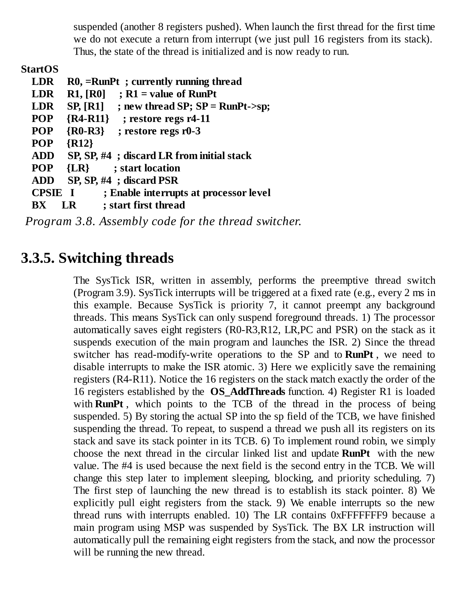
*Description*: Technical schematic and block diagram illustrating circuit operation, signal pathways, and functional behavior for Program 3.8: Assembly code for the thread switcher..

> **Program 3.8: Assembly code for the thread switcher.**

3.3.5. Switching threads
The SysTick ISR, written in assembly, performs the preemptive thread switch
(Program 3.9). SysTick interrupts will be triggered at a fixed rate (e.g., every 2 ms in
this example. Because SysTick is priority 7, it cannot preempt any background
threads. This means SysTick can only suspend foreground threads. 1) The processor
automatically saves eight registers (R0-R3,R12, LR,PC and PSR) on the stack as it
suspends execution of the main program and launches the ISR. 2) Since the thread
switcher has read-modify-write operations to the SP and to RunPt , we need to
disable interrupts to make the ISR atomic. 3) Here we explicitly save the remaining
registers (R4-R11). Notice the 16 registers on the stack match exactly the order of the
16 registers established by the  OS_AddThreads function. 4) Register R1 is loaded
with RunPt , which points to the TCB of the thread in the process of being
suspended. 5) By storing the actual SP into the sp field of the TCB, we have finished
suspending the thread. To repeat, to suspend a thread we push all its registers on its
stack and save its stack pointer in its TCB. 6) To implement round robin, we simply
choose the next thread in the circular linked list and update RunPt  with the new
value. The #4 is used because the next field is the second entry in the TCB. We will
change this step later to implement sleeping, blocking, and priority scheduling. 7)
The first step of launching the new thread is to establish its stack pointer. 8) We
explicitly pull eight registers from the stack. 9) We enable interrupts so the new
thread runs with interrupts enabled. 10) The LR contains 0xFFFFFFF9 because a
main program using MSP was suspended by SysTick. The BX LR instruction will
automatically pull the remaining eight registers from the stack, and now the processor
will be running the new thread.


<!-- Page 230 -->
### [PDF Page 230]

The first time a thread runs, the only registers that must be set are PC, SP, the T-bit in
the PSR (T=1), and the I-bit in the PSR (I=0). For debugging purposes, we do
initialize the other registers the first time each thread is run, but these other initial
values do not matter. We learned this trick of setting the initial register value to the
register number (e.g., R5 is initially 0x05050505) from Micrium uC/OS-II. Notice in
this simple example, the first time Task0 runs it will be executed as a result of
StartOS. However, the first time Task1 and Task2 are run, it will be executed as a
result of running the SysTick_Handler. In particular, the initial LR and PSR for
Task0 are set explicitly in StartOS, while the initial LR and PSR for Task1 and
Task2 are defined in the initial stack set in SetInitialStack. An alternative approach
to launching would have been to set the SP to the R4 field of its stack, set the LR to
0xFFFFFFF9 and jump to line 8 of the scheduler. Most commercial RTOS use this
alternative approach because it makes it easier to change. But we decided to present
this StartOS because we feel it is easier to understand the steps needed to launch.

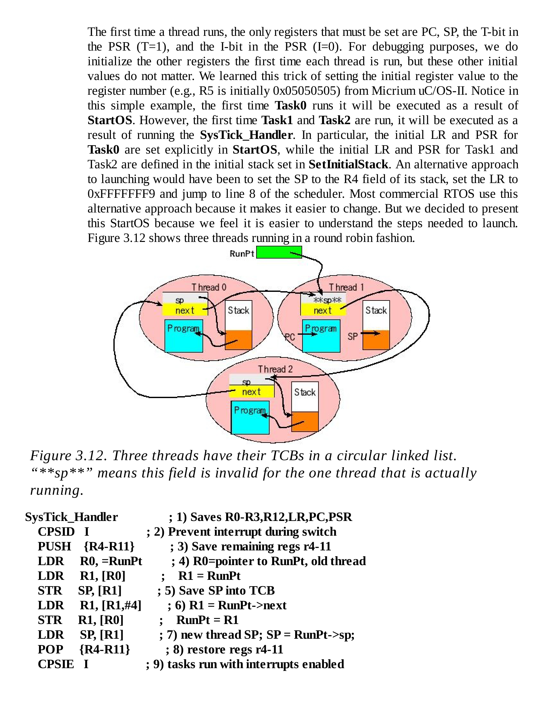
*Description*: Technical schematic and block diagram illustrating circuit operation, signal pathways, and functional behavior for Figure 3.12: shows three threads running in a round robin fashion..

> **Figure 3.12: shows three threads running in a round robin fashion.**


*Description*: Technical schematic and block diagram illustrating circuit operation, signal pathways, and functional behavior for Figure 3.12: Three threads have their TCBs in a circular linked list..

> **Figure 3.12: Three threads have their TCBs in a circular linked list.**

“**sp**” means this field is invalid for the one thread that is actually
running.
SysTick_Handler                ; 1) Saves R0-R3,R12,LR,PC,PSR

```assembly
CPSID   I                  ; 2) Prevent interrupt during switch
PUSH    {R4-R11}           ; 3) Save remaining regs r4-11
LDR     R0, =RunPt         ; 4) R0=pointer to RunPt, old thread
LDR     R1, [R0]           ;    R1 = RunPt
STR     SP, [R1]           ; 5) Save SP into TCB
LDR     R1, [R1,#4]        ; 6) R1 = RunPt->next
STR     R1, [R0]           ;    RunPt = R1
LDR     SP, [R1]           ; 7) new thread SP; SP = RunPt->sp;
POP     {R4-R11}           ; 8) restore regs r4-11
CPSIE   I                  ; 9) tasks run with interrupts enabled
```


<!-- Page 231 -->
### [PDF Page 231]


```assembly
BX      LR                ; 10) restore R0-R3,R12,LR,PC,PSR
```


*Description*: Technical schematic and block diagram illustrating circuit operation, signal pathways, and functional behavior for Program 3.9: Assembly code for the thread switcher..

> **Program 3.9: Assembly code for the thread switcher.**

3.3.6. Profiling the OS
You can find this simple RTOS in the starter projects as RTOS_xxx, where xxx
refers to the specific microcontroller on which the example was tested. Figures 3.13

```assembly
and 3.14 show profiles of this RTOS at different time scales. We can estimate the
```

thread switch time to be about 0.8 µs, because of the gap between the last edge on
one pin to the first edge on the next pin. In this case because the thread switch occurs
every 2 ms, the 0.8-µs thread-switch overhead is not significant.


*Description*: Technical schematic and block diagram illustrating circuit operation, signal pathways, and functional behavior for Figure 3.13: The RTOS runs three threads by giving each a 2ms, measured in.

> **Figure 3.13: The RTOS runs three threads by giving each a 2ms, measured in**

simulator for the TM4C123.

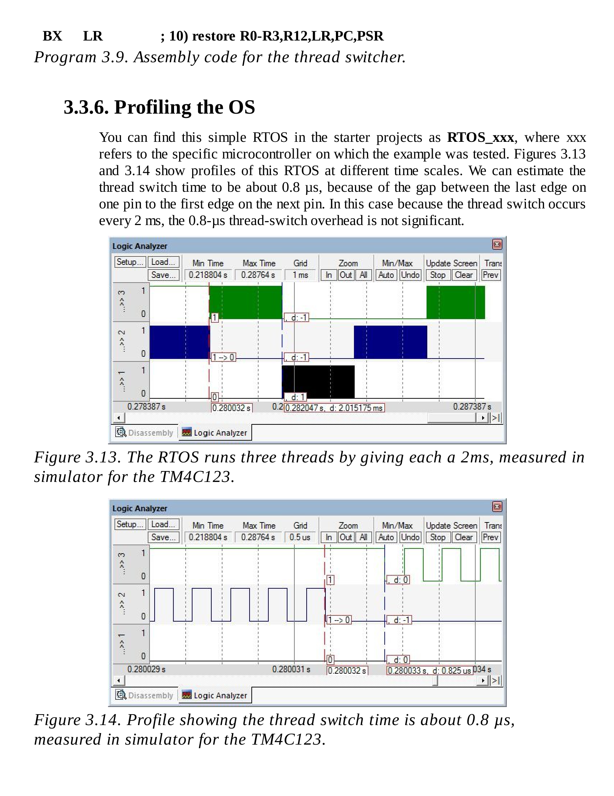
*Description*: Technical schematic and block diagram illustrating circuit operation, signal pathways, and functional behavior for Figure 3.14: Profile showing the thread switch time is about 0.8 µs,.

> **Figure 3.14: Profile showing the thread switch time is about 0.8 µs,**

measured in simulator for the TM4C123.


<!-- Page 232 -->
### [PDF Page 232]

3.3.7. Linking assembly to C
One of the limitations of the previous scheduler is that it’s written entirely in
assembly. Although fast, assembly programming is hard to extend and hard to debug.
One simple way to extend this round robin scheduler is to have the assembly SysTick
ISR call a C function, as shown in Program 3.10. The purpose of the C function is to
run the scheduler and update the RunPt with the thread to run next. You can find this
simple RTOS as RoundRobin_xxx, where xxx refers to the specific microcontroller
on which the example was tested.

```c
void Scheduler(void){
RunPt = RunPt->next;    // Round Robin
}
```


*Description*: Technical schematic and block diagram illustrating circuit operation, signal pathways, and functional behavior for Program 3.10: Round robin scheduler written in C..

> **Program 3.10: Round robin scheduler written in C.**

The new SysTick ISR calls the C function in order to find the next thread to run,

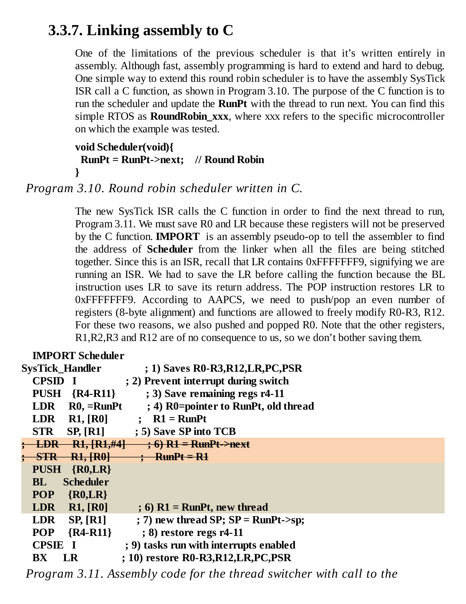
*Description*: Register layout and memory mapping diagram specifying bit fields, stack pointer allocations, and memory address boundaries for Program 3.11: We must save R0 and LR because these registers will not be preserved.

> **Program 3.11: We must save R0 and LR because these registers will not be preserved**

by the C function. IMPORT  is an assembly pseudo-op to tell the assembler to find
the address of Scheduler from the linker when all the files are being stitched
together. Since this is an ISR, recall that LR contains 0xFFFFFFF9, signifying we are
running an ISR. We had to save the LR before calling the function because the BL
instruction uses LR to save its return address. The POP instruction restores LR to
0xFFFFFFF9. According to AAPCS, we need to push/pop an even number of
registers (8-byte alignment) and functions are allowed to freely modify R0-R3, R12.
For these two reasons, we also pushed and popped R0. Note that the other registers,
R1,R2,R3 and R12 are of no consequence to us, so we don’t bother saving them.
IMPORT Scheduler
SysTick_Handler                ; 1) Saves R0-R3,R12,LR,PC,PSR

```assembly
CPSID   I                  ; 2) Prevent interrupt during switch
PUSH    {R4-R11}           ; 3) Save remaining regs r4-11
LDR     R0, =RunPt         ; 4) R0=pointer to RunPt, old thread
LDR     R1, [R0]           ;    R1 = RunPt
STR     SP, [R1]           ; 5) Save SP into TCB
;    LDR     R1, [R1,#4]        ; 6) R1 = RunPt->next
;    STR     R1, [R0]           ;    RunPt = R1
PUSH    {R0,LR}
BL      Scheduler
POP     {R0,LR}
LDR     R1, [R0]           ; 6) R1 = RunPt, new thread
LDR     SP, [R1]           ; 7) new thread SP; SP = RunPt->sp;
POP     {R4-R11}           ; 8) restore regs r4-11
CPSIE   I                  ; 9) tasks run with interrupts enabled
BX      LR                ; 10) restore R0-R3,R12,LR,PC,PSR
```


*Description*: Technical schematic and block diagram illustrating circuit operation, signal pathways, and functional behavior for Program 3.11: Assembly code for the thread switcher with call to the.

> **Program 3.11: Assembly code for the thread switcher with call to the**


<!-- Page 233 -->
### [PDF Page 233]

scheduler written in C.
In this implementation, we are running the C function Scheduler with interrupts
disabled. On one hand this is good because all read-modify-write operations to
shared globals will execute atomically, and not create critical sections. On the other
hand, since interrupts are disabled, it will delay other possibly more important
interrupts from being served. Running with interrupts disabled will cause time jitter
for periodic threads and latency for event-response threads. A way to minimize jitter
is to run the periodic tasks inside this Scheduler function itself.
3.3.8. Periodic tasks
A very appropriate feature of a RTOS is scheduling periodic tasks. If the number of
periodic tasks is small, the OS can assign a unique periodic hardware timer for each
task. Another simple solution is to run the periodic tasks in the scheduler. For
example, assume the thread switch is occurring every 1 ms, and we wish to run the
function PeriodicUserTask()  every 10 ms, then we could modify the scheduler as
shown in Figure 3.15 and Program 3.12. Assume the OS initialized the counter to 0.
In order for this OS to run properly, the time to execute the periodic task must be very
short and always return. These periodic tasks cannot spin or block.
This approach has very little time jitter because SysTick interrupts occur at a fixed

```assembly
and accurate rate. The SysTick ISR calls the Scheduler, and then the Scheduler calls
```

the user task. The execution delay from the SysTick trigger to the running of the user
task is a constant, so the time between executions of the user task is fixed and exactly
equal to the SysTick trigger period.

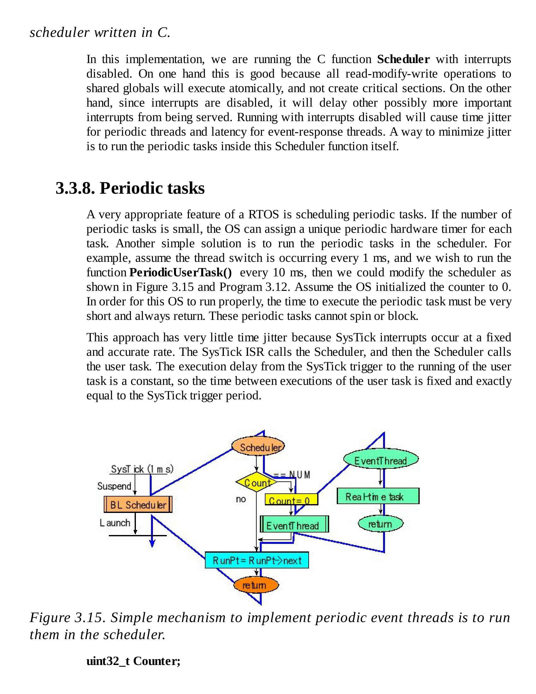
*Description*: Technical schematic and block diagram illustrating circuit operation, signal pathways, and functional behavior for Figure 3.15: Simple mechanism to implement periodic event threads is to run.

> **Figure 3.15: Simple mechanism to implement periodic event threads is to run**

them in the scheduler.

```c
uint32_t Counter;
```


<!-- Page 234 -->
### [PDF Page 234]

#define NUM 10
void (*PeriodicTask1)(void); // pointer to user function

```c
void Scheduler(void){
if((++Counter) == NUM){
(*PeriodicTask1)();      // runs every NUM ms
Counter = 0;
}
RunPt = RunPt->next;       // Round Robin scheduler
}
```


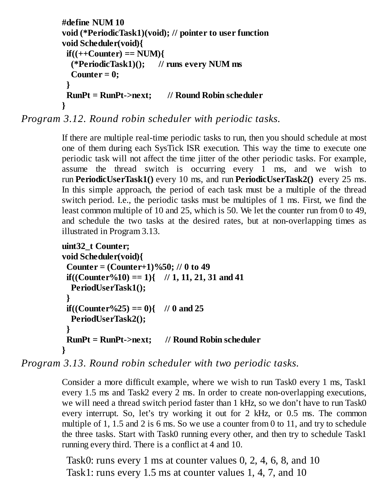
*Description*: Technical schematic and block diagram illustrating circuit operation, signal pathways, and functional behavior for Program 3.12: Round robin scheduler with periodic tasks..

> **Program 3.12: Round robin scheduler with periodic tasks.**

If there are multiple real-time periodic tasks to run, then you should schedule at most
one of them during each SysTick ISR execution. This way the time to execute one
periodic task will not affect the time jitter of the other periodic tasks. For example,
assume the thread switch is occurring every 1 ms, and we wish to
run PeriodicUserTask1() every 10 ms, and run PeriodicUserTask2()  every 25 ms.
In this simple approach, the period of each task must be a multiple of the thread
switch period. I.e., the periodic tasks must be multiples of 1 ms. First, we find the
least common multiple of 10 and 25, which is 50. We let the counter run from 0 to 49,

```assembly
and schedule the two tasks at the desired rates, but at non-overlapping times as
```

illustrated in Program 3.13.

```c
uint32_t Counter;
void Scheduler(void){
Counter = (Counter+1)%50; // 0 to 49
if((Counter%10) == 1){    // 1, 11, 21, 31 and 41
PeriodUserTask1();
}
if((Counter%25) == 0){    // 0 and 25
PeriodUserTask2();
}
RunPt = RunPt->next;      // Round Robin scheduler
}
```


*Description*: Technical schematic and block diagram illustrating circuit operation, signal pathways, and functional behavior for Program 3.13: Round robin scheduler with two periodic tasks..

> **Program 3.13: Round robin scheduler with two periodic tasks.**

Consider a more difficult example, where we wish to run Task0 every 1 ms, Task1
every 1.5 ms and Task2 every 2 ms. In order to create non-overlapping executions,
we will need a thread switch period faster than 1 kHz, so we don’t have to run Task0
every interrupt. So, let’s try working it out for 2 kHz, or 0.5 ms. The common
multiple of 1, 1.5 and 2 is 6 ms. So we use a counter from 0 to 11, and try to schedule
the three tasks. Start with Task0 running every other, and then try to schedule Task1
running every third. There is a conflict at 4 and 10.
Task0: runs every 1 ms at counter values 0, 2, 4, 6, 8, and 10
Task1: runs every 1.5 ms at counter values 1, 4, 7, and 10


<!-- Page 235 -->
### [PDF Page 235]

So, let’s try running faster at 4 kHz or every 0.25 ms. The common multiple is still 6
ms, but now the counter goes from 0 to 23. We can find a solution
Task0: runs every 1 ms at counter values 0, 4, 8, 12, 16, and 20
Task1: runs every 1.5 ms at counter values 1, 7, 13, and 19
Task2: runs every 2 ms at counter values 2, 10, and 18
In order this system to operate, the maximum time to execute each task must be very
short compared to the period used to switch threads.


<!-- Page 236 -->
### [PDF Page 236]

3.4. Semaphores
Remember that when an embedded system employs a real-time operating system to
manage threads, typically this system combines multiple hardware/software objects
to solve one dedicated problem. In other words, the components of an embedded
system are tightly coupled. For example, in lab all threads together implement a
personal fitness device. The fact that an embedded system has many components that
combine to solve a single problem leads to the criteria that threads must have
mechanisms to interact with each other. The fact that an embedded system may be
deployed in safety-critical environments also implies that these interactions be
effective and reliable.
We will use semaphores to implement synchronization, sharing and communication
between
threads.
A
semaphore
is
a
counter
with
three
functions:
OS_InitSemaphore, OS_Wait, and OS_Signal. Initialization occurs once at the
start, but wait and signal are called at run time to provide synchronization between
threads. Other names for wait are pend and P (derived from the Dutch word
proberen, which means to test). Other names for signal are post and V (derived from
the Dutch word verhogen, which means to increment).
The concept of a semaphore was originally conceived by the Dutch computer
scientist Edsger Dijkstra in 1965. He received many awards including the 1972
Turing Award. He was the Schlumberger Centennial Chair of Computer Sciences at
The University of Texas at Austin from 1984 until 2000. Interestingly he was one of
the early critics of the GOTO instruction in high-level languages. Partly due to his
passion, structured programming languages like C, C++ and Java have almost
completely replaced non-structured languages like BASIC, COBOL, and FORTRAN.
In this book we will develop three implementations of semaphores, but we will begin
with the simplest implementation called “spin-lock” (Figure 3.16). Each semaphore
has a counter. If the thread calls OS_Wait  with the counter equal to zero it will
“spin” (do nothing) until the counter goes above zero (Program 3.14). Once the
counter is greater than zero, the counter is decremented, and the wait function returns.
In this simple implementation, the OS_Signal just increments the counter. In the
context of the previous round robin scheduler, a thread that is “spinning” will
perform no useful work, but eventually will be suspended by the SysTick handler,

```assembly
and then other threads will execute. It is important to allow interrupts to occur while
```

the thread is spinning so that the software does not hang. The read-modify-write
operations on the counter, s , is a critical section. So the read-modify-write sequence
must be made atomic, because the scheduler might switch threads in between any two
instructions that execute with the interrupts enabled. Program 3.14 shows the
spinlock implementation of semaphores.


<!-- Page 237 -->
### [PDF Page 237]


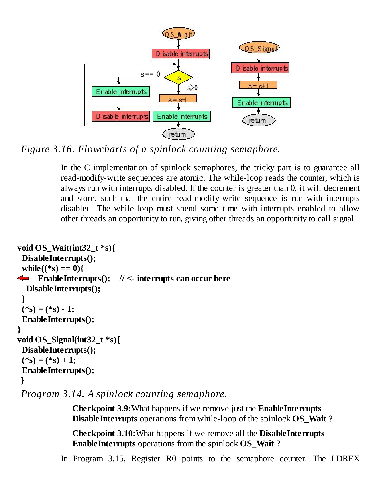
*Description*: Hardware pinout and board interface diagram mapping microcontroller pins, BoosterPack headers, switches, LEDs, and physical connectors for Figure 3.16: Flowcharts of a spinlock counting semaphore..

> **Figure 3.16: Flowcharts of a spinlock counting semaphore.**

In the C implementation of spinlock semaphores, the tricky part is to guarantee all
read-modify-write sequences are atomic. The while-loop reads the counter, which is
always run with interrupts disabled. If the counter is greater than 0, it will decrement

```assembly
and store, such that the entire read-modify-write sequence is run with interrupts
```

disabled. The while-loop must spend some time with interrupts enabled to allow
other threads an opportunity to run, giving other threads an opportunity to call signal.

```c
void OS_Wait(int32_t *s){
DisableInterrupts();
while((*s) == 0){
EnableInterrupts();    // <- interrupts can occur here
DisableInterrupts();
}
(*s) = (*s) - 1;
EnableInterrupts();
}
void OS_Signal(int32_t *s){
DisableInterrupts();
(*s) = (*s) + 1;
EnableInterrupts();
}
```


*Description*: Hardware pinout and board interface diagram mapping microcontroller pins, BoosterPack headers, switches, LEDs, and physical connectors for Program 3.14: A spinlock counting semaphore..

> **Program 3.14: A spinlock counting semaphore.**

Checkpoint 3.9:What happens if we remove just the EnableInterrupts
DisableInterrupts operations from while-loop of the spinlock OS_Wait ?
Checkpoint 3.10:What happens if we remove all the DisableInterrupts
EnableInterrupts operations from the spinlock OS_Wait ?
In Program 3.15, Register R0 points to the semaphore counter. The LDREX


<!-- Page 238 -->
### [PDF Page 238]

STREXcombination is a read-modify-write sequence that implements mutual
exclusion. During a potential race condition, the first thread to execute LDREX
captures exclusive access to the counter. When the thread with exclusive access
performs STREX then the actual store will occur, and then the counter is considered
free again. If a second thread executes LDREX during the period of exclusive access
of another thread, it will capture an invalid version of the counter. However, when
this second thread attempts STREX, it will not store. In this case, the assembly
instruction STREXPL R2,R1,[R0]  attempts to store the value in R1 through the
pointer in R0. R2 is loaded with 0 if the store was allowed because this thread had
exclusive access. On the other hand, R2 is loaded with 1 if the store did not happen
because another thread had ownership. In this example, if R2 is nonzero, it will try it
again.
OS_Wait             ;R0 points to counter
LDREX   R1, [R0] ; counter
SUBS    R1, #1   ; counter -1,
ITT     PL       ; ok if >= 0
STREXPL R2,R1,[R0]  ; try update
CMPPL   R2, #0   ; succeed?
BNE     OS_Wait  ; no, try again

```assembly
BX      LR
OS_Signal ; R0 points to counter
LDREX   R1, [R0]  ; counter
ADD     R1, #1    ; counter + 1
STREX   R2,R1,[R0]  ; try update
CMP     R2, #0    ; succeed?
BNE     OS_Signal ;no, try again
BX      LR
```


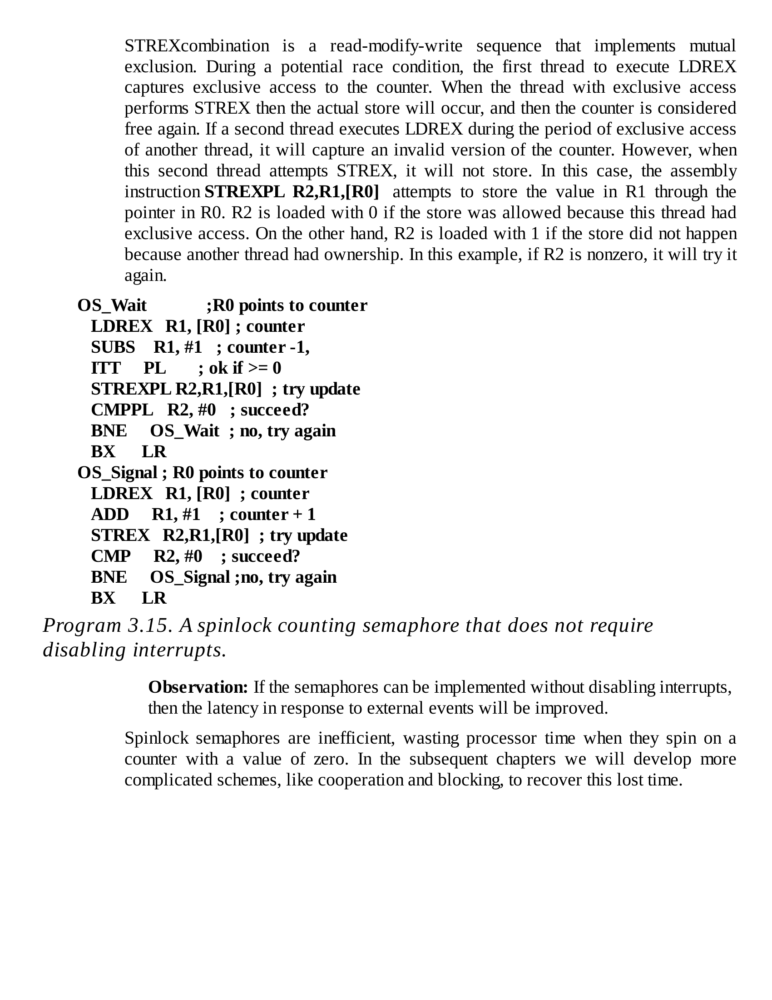
*Description*: Hardware pinout and board interface diagram mapping microcontroller pins, BoosterPack headers, switches, LEDs, and physical connectors for Program 3.15: A spinlock counting semaphore that does not require.

> **Program 3.15: A spinlock counting semaphore that does not require**

disabling interrupts.
Observation: If the semaphores can be implemented without disabling interrupts,
then the latency in response to external events will be improved.
Spinlock semaphores are inefficient, wasting processor time when they spin on a
counter with a value of zero. In the subsequent chapters we will develop more
complicated schemes, like cooperation and blocking, to recover this lost time.


<!-- Page 239 -->
### [PDF Page 239]

3.5. Thread Synchronization
3.5.1. Resource sharing, nonreentrant code or mutual
exclusion
This section can be used in two ways. First it provides a short introduction to the
kinds of problems that can be solved using semaphores. In other words, if you have a
problem similar to one of these examples, then you should consider a thread
scheduler with semaphores as one possible implementation. Second, this section
provides the basic approach to solving these particular problems.
When we use a semaphore, we usually can assign a meaning or significance to the
counter value. In the first application we could use a semaphore as a lock so only one
thread at a time has access to a shared object. Another name for this semaphore is
mutex, because it provides mutual exclusion. If the semaphore is 1 it means the
object is free. If the semaphore is 0 it means the object is busy being used by another
thread. For this application the initial value of the semaphore ( x ) is 1, because the
object is initially free. A thread calls OS_Wait to capture the object (decrement
counter) and that same thread calls OS_Signal to release the object (increment
counter).

```c
void Thread1(void){
Init1();
while(1){
OS_Wait(&x);
// exclusive access
```

OS_Signal(&x);
// other processing
}
}

```c
void Thread2(void){
Init2();
while(1){
OS_Wait(&x);
// exclusive access
```

OS_Signal(&x);
// other processing
}
}
The objective of this example is to share a common resource on a one at a time basis,
also referred to as “mutually exclusive” fashion. The critical section (or vulnerable
window) of nonreentrant software is that region that should only be executed by one
thread at a time. As an example, the common resource we will consider is a display
device (LCD). Mutual exclusion in this context means that once a thread has begun
executing a set of LCD functions, then no other thread is allowed to use the LCD. See

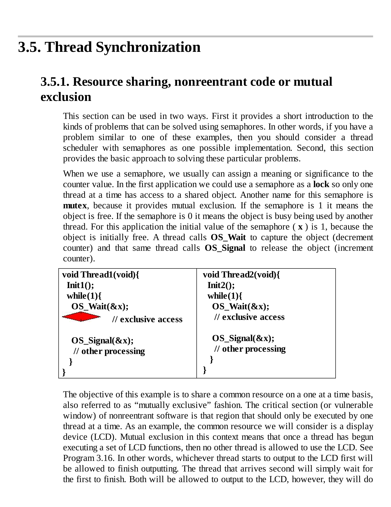
*Description*: Technical schematic and block diagram illustrating circuit operation, signal pathways, and functional behavior for Program 3.16: In other words, whichever thread starts to output to the LCD first will.

> **Program 3.16: In other words, whichever thread starts to output to the LCD first will**

be allowed to finish outputting. The thread that arrives second will simply wait for
the first to finish. Both will be allowed to output to the LCD, however, they will do


<!-- Page 240 -->
### [PDF Page 240]

so on a one at a time basis. The mechanism to create mutual exclusion is to initialize
the semaphore to 1, execute OS_Wait at the start of the critical section, and then
execute OS_Signal  at the end of the critical section. In this way, the information sent
to one part of the LCD is not mixed with information sent to another part of the LCD.
Initially, the semaphore is 1. If  LCDmutex  is 1, it means the LCDis free.
If LCDmutex  is 0, it means the LCD is busy and no thread is waiting. In this chapter,
a thread that calls OS_Wait  on a semaphore already 0 will wait until the semaphore
becomes greater than 0. For a spinlock semaphore in this application, the possible
values are only 0 (busy) or 1 (free). A semaphore that can only be 0 or 1 is called a
binary semaphore.

```c
void Task5(void){
Init5();
while(1){
Unrelated5();
OS_Wait(&LCDmutex);
BSP_LCD_SetCursor(5,  0);
BSP_LCD_OutUDec4(Time/10,COLOR);
BSP_LCD_SetCursor(5,  1);
BSP_LCD_OutUDec4(Steps,COLOR);
BSP_LCD_SetCursor(16, 0);
BSP_LCD_OutUFix2_1(TempData,COLOR);
BSP_LCD_SetCursor(16, 1);
BSP_LCD_OutUDec4(SoundRMS,COLOR);
OS_Signal(&LCDmutex);
}
}
void Task2(void){
Init2();
while(1){
Unrelated2();
OS_Wait(&LCDmutex);
BSP_LCD_PlotPoint(Data,COLOR);
BSP_LCD_PlotIncrement();
OS_Signal(&LCDmutex);
}
}
```


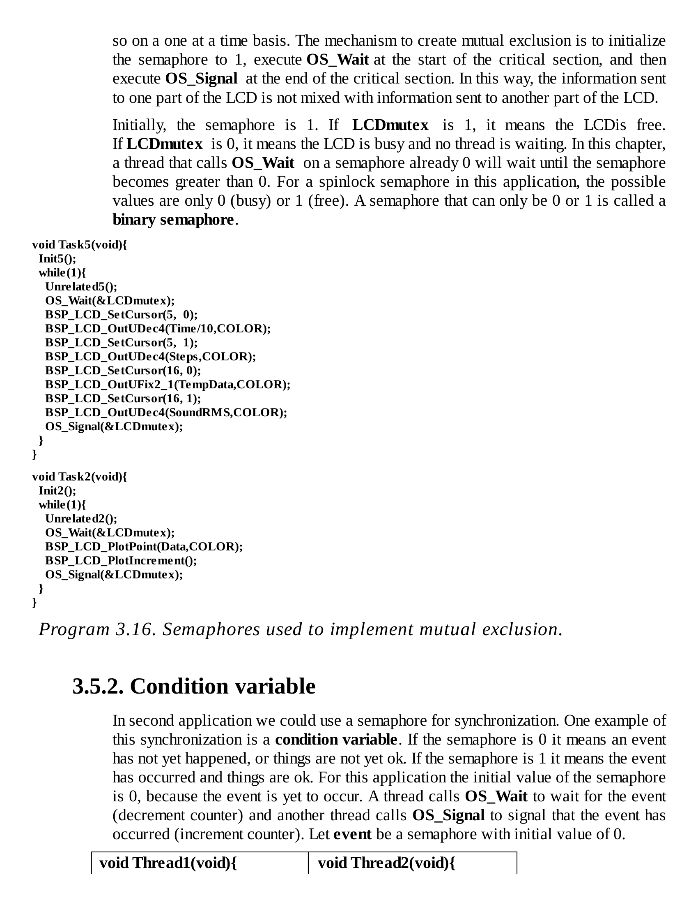
*Description*: Technical schematic and block diagram illustrating circuit operation, signal pathways, and functional behavior for Program 3.16: Semaphores used to implement mutual exclusion..

> **Program 3.16: Semaphores used to implement mutual exclusion.**

3.5.2. Condition variable
In second application we could use a semaphore for synchronization. One example of
this synchronization is a condition variable. If the semaphore is 0 it means an event
has not yet happened, or things are not yet ok. If the semaphore is 1 it means the event
has occurred and things are ok. For this application the initial value of the semaphore
is 0, because the event is yet to occur. A thread calls OS_Wait to wait for the event
(decrement counter) and another thread calls OS_Signal to signal that the event has
occurred (increment counter). Let event be a semaphore with initial value of 0.

```c
void Thread1(void){
void Thread2(void){
```


<!-- Page 241 -->
### [PDF Page 241]

Init1();
OS_Wait(&event);
// wait for event to occur

```c
while(1){
// other processing
}
}
Init2();
// the event has occurred
OS_Signal(&event);
while(1){
// other processing
}
}
```

3.5.3. Thread communication between two threads using a
mailbox
The objective of this example is to communicate between two main threads using a
mailbox. In this first implementation both the producer and consumer are main
threads, which are scheduled by the round robin thread scheduler (Program 3.17).
The producer first generates data, and then it calls SendMail (). Consumer first
calls RecvMail (), and then it processes the data. Mail is a shared global variable
that is written by a producer thread and read by a consumer thread.  In this way, data
flows from the producer to the consumer. The Send semaphore allows the producer
to tell the consumer that new mail is available. The Ack semaphore is a mechanism
for the consumer to tell the producer, the mail was received.  If Send is 0, it means
the shared global does not have valid data. If Send is 1, it means the shared global
does have valid data. If Ack is 0, it means the consumer has not yet read the global.
If Ack is 1, it means the consumer has read the global. The sequence of operation
depends on which thread arrives first. Initially, semaphores Send and Ack are both
0. Consider the case where the producer executes first.
Execution             Mail  Send   Ack    Comments
Initially
none   0
0
Producer sets Mail valid   0
0
Producer gets here first
Producer signals Send
valid   1
0
Producer waits on Ack
valid   1
0
Producer spins because Ack =0
Consumer waits
on Send
valid   0
0
Returns immediately
because Send was 1
Consumer reads Mail  none   0
0
Reading once means Mail not valid
Consumer signals Ack
none   0
1
Consumer continues to execute
Producer finishes wait
none   0
0
Producer continues to execute
Next, consider the case where the consumer executes first.
Execution             Mail  Send   Ack    Comments
Initially
none   0
0


<!-- Page 242 -->
### [PDF Page 242]

Consumer waits on send
none   0
0
Consumer spins because Send
=0
Producer sets Mail valid   0
0
Producer gets here second
Producer signals Send
valid   1
0
Producer waits on Ack
valid   1
0
Producer spins because Ack =0
Consumer finishes wait
valid   0
0
Consumer continues to execute
Consumer reads Mail  none   0
0
Reading once means Mail not valid
Consumer signals Ack
none   0
1
Consumer continues to execute
Producer finishes wait
none   0
0
Producer continues to execute
There are two semaphores and one shared global data.

```c
uint32_t Mail;  // shared data
int32_t Send=0; // semaphore
int32_t Ack=0;  // semaphore
```

The basic idea of this example is for one thread to send data to another. The producer
calls SendMail and the consumer calls RecvMail .

```c
void SendMail(uint32_t data){
Mail = data;
```

OS_Signal(&Send);
OS_Wait(&Ack);
}

```c
void Producer(void){
Init1();
while(1){ uint32_t int myData;
myData = MakeData();
SendMail(myData);
Unrelated1();
}
}
uint32_t RecvMail(void){
uint32_t theData;
OS_Wait(&Send);
theData = Mail;  // read mail
OS_Signal(&Ack);
return theData;
}
void Consumer(void){
Init2();
while(1){ uint32_t thisData;
thisData = RecvMail();
Unrelated2();
}
}
```


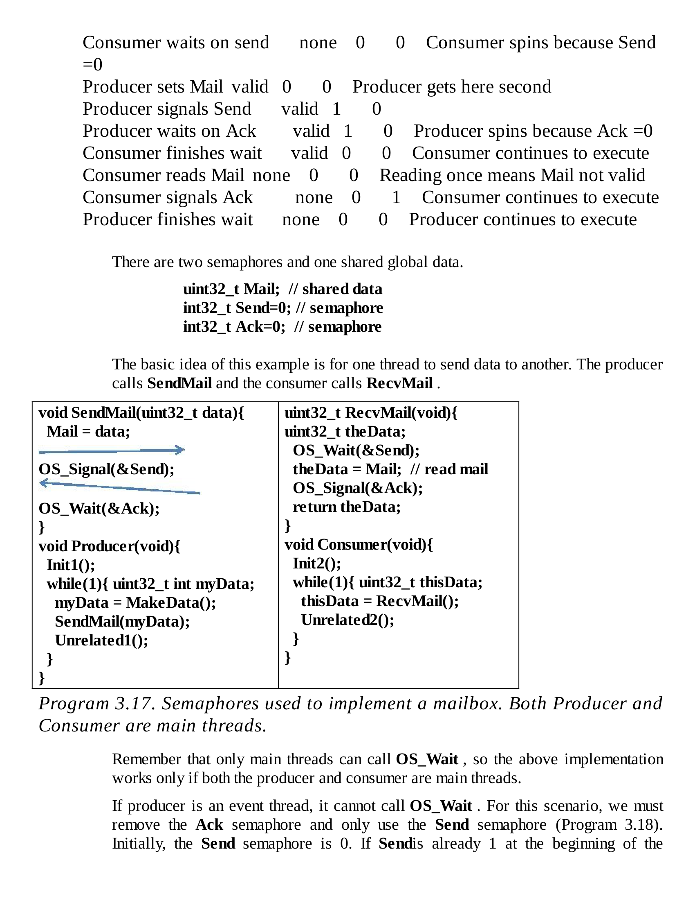
*Description*: Technical schematic and block diagram illustrating circuit operation, signal pathways, and functional behavior for Program 3.17: Semaphores used to implement a mailbox. Both Producer and.

> **Program 3.17: Semaphores used to implement a mailbox. Both Producer and**

Consumer are main threads.
Remember that only main threads can call OS_Wait , so the above implementation
works only if both the producer and consumer are main threads.
If producer is an event thread, it cannot call OS_Wait . For this scenario, we must
remove the Ack semaphore and only use the Send semaphore (Program 3.18).
Initially, the Send semaphore is 0. If Sendis already 1 at the beginning of the


<!-- Page 243 -->
### [PDF Page 243]

producer, it means there is already unread data in the mailbox. In this situation, data
will be lost. In this implementation, the error count, Lost , is incremented every time
the producer calls SendMail()  whenever the mailbox is already full.

```c
uint32_t Lost=0;
```

void
SendMail(uint32_t data){
Mail = data;

```c
if(Send){
Lost++;
}else{
OS_Signal(&Send);
}
}
void Producer(void){
uint32_t int myData;
myData = MakeData();
SendMail(myData);
Unrelated1();
}
uint32_t RecvMail(void){
OS_Wait(&Send);
return Mail;  // read mail
}
```


```c
void Consumer(void){
Init2();
while(1){ uint32_t thisData;
thisData = RecvMail();
Unrelated2();
}
}
```


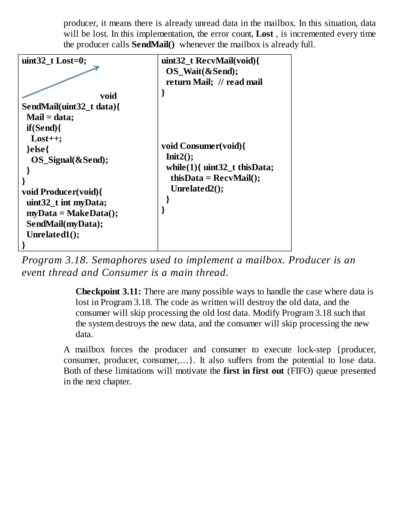
*Description*: Technical schematic and block diagram illustrating circuit operation, signal pathways, and functional behavior for Program 3.18: Semaphores used to implement a mailbox. Producer is an.

> **Program 3.18: Semaphores used to implement a mailbox. Producer is an**

event thread and Consumer is a main thread.
Checkpoint 3.11: There are many possible ways to handle the case where data is
lost in Program 3.18. The code as written will destroy the old data, and the
consumer will skip processing the old lost data. Modify Program 3.18 such that
the system destroys the new data, and the consumer will skip processing the new
data.
A mailbox forces the producer and consumer to execute lock-step {producer,
consumer, producer, consumer,…}. It also suffers from the potential to lose data.
Both of these limitations will motivate the first in first out (FIFO) queue presented
in the next chapter.


<!-- Page 244 -->
### [PDF Page 244]

3.6. Process Management
One of the requirements of a thread manager was that threads be tightly coupled,
sharing a common objective. In this context, tightly coupled is categorized by threads
that share global data and share I/O devices. However, if we have multiple software
tasks that are loosely coupled then we require a more complex scheduler. Again in
this context, loosely coupled means that they do not share data or I/O devices. We
define processes as software tasks that are loosely coupled. Each process has its
own stack, code, data (globals), and heap. The stack, code, data, and I/O of one
process are not shared with other processes. See Figure 3.17.

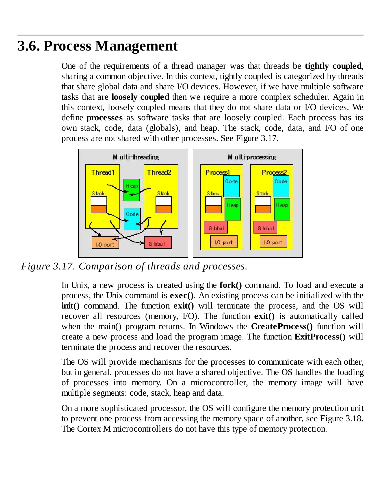
*Description*: Reference table detailing hardware parameters, register bit patterns, performance metrics, or memory configurations for Figure 3.17: Comparison of threads and processes..

> **Figure 3.17: Comparison of threads and processes.**

In Unix, a new process is created using the fork() command. To load and execute a
process, the Unix command is exec(). An existing process can be initialized with the
init() command. The function exit() will terminate the process, and the OS will
recover all resources (memory, I/O). The function exit() is automatically called
when the main() program returns. In Windows the CreateProcess() function will
create a new process and load the program image. The function ExitProcess() will
terminate the process and recover the resources.
The OS will provide mechanisms for the processes to communicate with each other,
but in general, processes do not have a shared objective. The OS handles the loading
of processes into memory. On a microcontroller, the memory image will have
multiple segments: code, stack, heap and data.
On a more sophisticated processor, the OS will configure the memory protection unit
to prevent one process from accessing the memory space of another, see Figure 3.18.
The Cortex M microcontrollers do not have this type of memory protection.


<!-- Page 245 -->
### [PDF Page 245]


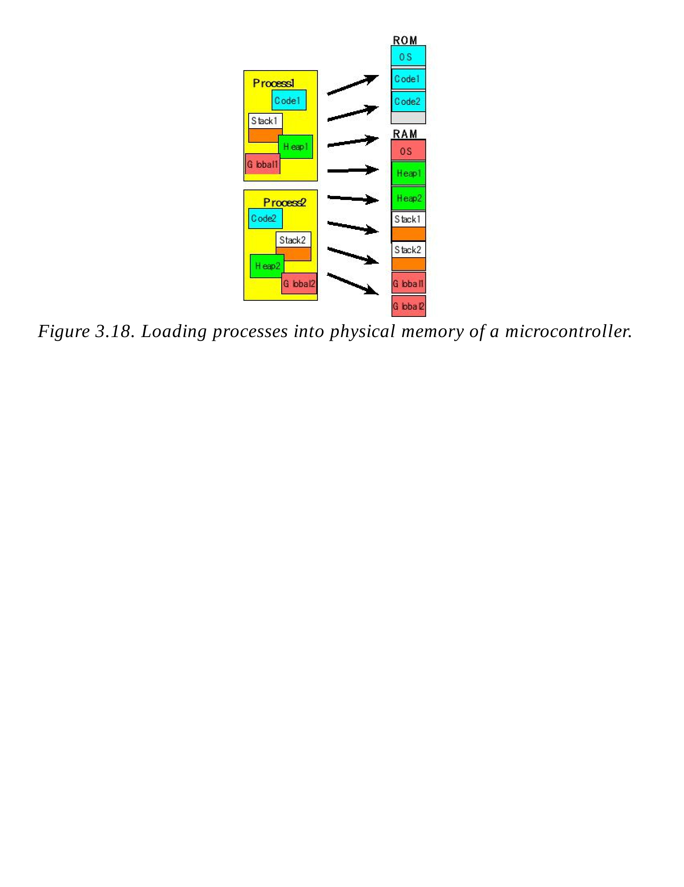
*Description*: Technical schematic and block diagram illustrating circuit operation, signal pathways, and functional behavior for Figure 3.18: Loading processes into physical memory of a microcontroller..

> **Figure 3.18: Loading processes into physical memory of a microcontroller.**


<!-- Page 246 -->
### [PDF Page 246]

3.7. Dynamic loading and linking
The Executable and Linking Format (ELF) standard simplifies software
development by providing with a set of binary interface definitions that apply to
multiple environments. For example, code created with one compiler can be
combined with code created with a second compiler and these two software objects
can be executed together. The standard reduces the need for compiling all software
objects into one project.
After we compile and before we execute code onto a microcontroller, the various
software modules must be combined (linked) and then loaded (programmed into
ROM). The following lists some of the sections used by the Keil IDE
Linking: sections
Object files -> executables
Code (RO / .text)
Data (RW / .data)
Zero data (ZI / .bss)
String/symbol table
Object files are binary representations of software created by the compiler and
linker that can be executed by the processor. For convenience there are two parallel
views of the same object file. The linker interacts using the Linking View and the
operating system interacts using the Executable View at run time, as shown in Figure
3.19.

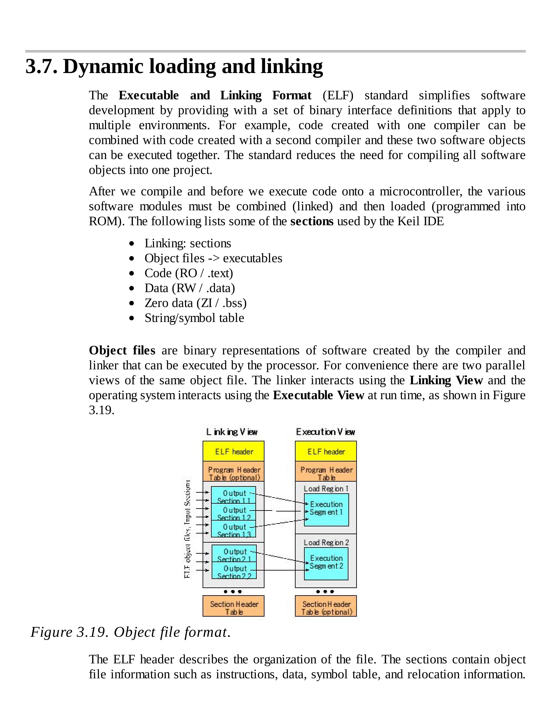
*Description*: Technical schematic and block diagram illustrating circuit operation, signal pathways, and functional behavior for Figure 3.19: Object file format..

> **Figure 3.19: Object file format.**

The ELF header describes the organization of the file. The sections contain object
file information such as instructions, data, symbol table, and relocation information.


<!-- Page 247 -->
### [PDF Page 247]

The program header table explains how to create the image. If the file is used to
create an executable image, then it will have a program header table. Relocatable
files do not need a program header table. The section header table describes the
sections, including section name, size, and type. Files used during linking must have a
section header table, and files used during execution need not have a section header
table. The figure implies an order for sections and segments, however only the ELF
header has a fixed position, while sections and segments have no order.
On a microcontroller like the Cortex M there are three types of memory segments.
See Figure 3.20. Typically, we place instructions and fixed constants in ROM. Keil
labels this segment as RO or .text. As we can see the compiler creates an image
where this RO segment begins at 0x00000000. However, when this segment is
loaded into memory, it is combined with other ROM segments and possibly moved to
another position in ROM other than 0x00000000. The second type of segment is RW
or .data segment. This segment contains global variables that have initial values. The
compiler creates an image where this RW segment begins at 0x20000000. However,
when this segment is loaded into memory, it is combined with other RW segments and
possibly moved to another position in RAM other than 0x20000000. The ZI segment
also contains global variables; however, these variables are initialized to 0. Again,
when the ZI segments are loaded, these too may be moved to other positions in RAM.
Loading is the process of placing all these segments into appropriate places in
memory. Linking is defined as the process of combining the segments and fixing up
all cross referenced addresses. The executable image also includes a starting
location for execution.

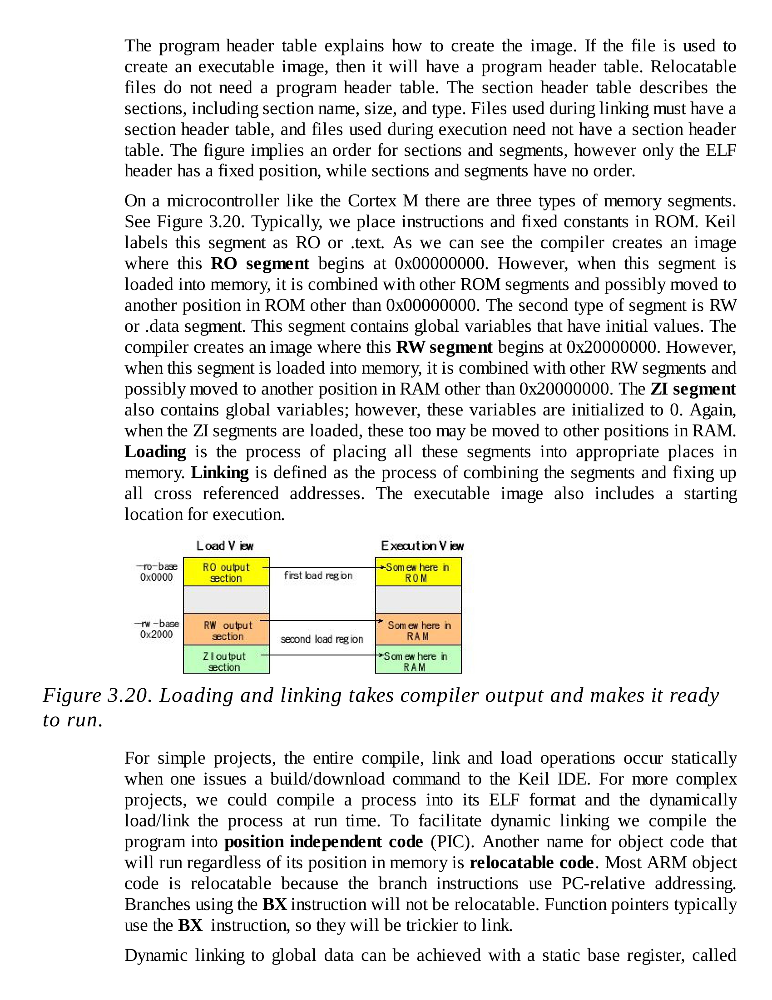
*Description*: Technical schematic and block diagram illustrating circuit operation, signal pathways, and functional behavior for Figure 3.20: Loading and linking takes compiler output and makes it ready.

> **Figure 3.20: Loading and linking takes compiler output and makes it ready**

to run.
For simple projects, the entire compile, link and load operations occur statically
when one issues a build/download command to the Keil IDE. For more complex
projects, we could compile a process into its ELF format and the dynamically
load/link the process at run time. To facilitate dynamic linking we compile the
program into position independent code (PIC). Another name for object code that
will run regardless of its position in memory is relocatable code. Most ARM object
code is relocatable because the branch instructions use PC-relative addressing.
Branches using the BX instruction will not be relocatable. Function pointers typically
use the BX  instruction, so they will be trickier to link.
Dynamic linking to global data can be achieved with a static base register, called


<!-- Page 248 -->
### [PDF Page 248]

position-independent data. In the following example, R9 points to the beginning of
the global variable space for this program. R9 is set dynamically by the
loader/linker. All global variables have a fixed offset from this base register.
; regular access to global
v1   SPACE   4  ; global
f1    LDR  R1,=v1

```assembly
LDR  R2,[R1] ; contents of v1
uint32_t v2; // global
;R9 points to global space
;ofs is offset of this variable
LDR  R2,[R9,#ofs]
```

With dynamic linking and loading we need a mechanism to call OS functions that are
not compiled with the user program. The typically solution for linking to OS
functions is to use the SVC  or software trap instruction. The implementation of
software trap was described in Section 2.2.6.
For
a
detailed
description
of
the
ELF
format,
search
“ELF”
on
http://infocenter.arm.com


<!-- Page 249 -->
### [PDF Page 249]

3.8. Exercises

## 3.1 In 16 words or less for each, give definitions of the following terms: jitter, real-

time, call back, profile, semaphore, and scheduler.

## 3.2 Compare and contrast thread and process.


## 3.3 Compare and contrast event thread and main thread.


## 3.4 Compare and contrast parallel, distributed and concurrent programming.


## 3.5 Compare and contrast hard, firm and soft real time. Give an example of each

different from the ones in the chapter.

## 3.6 Please name the following schedulers (round robin, rate monotonic, priority,

cooperative, and exponential queue):
A. A dynamic scheduler that shifts importance depending on if the
thread ran to the completion of its time slice.
B. Run the ready threads in circular fashion, giving each the same
amount of time to execute
C. Assign importance according to these periods with more frequent
tasks having higher importance.
D. Threads themselves decide when to stop running
E. Run the most important ready threads first, running less important
threads only if there are no important threads ready

## 3.7 We can use semaphores to limit access to resources. In the following example

both threads need access to a printer and an SPI port. The binary semaphore sPrint
provides mutual exclusive access to the printer and the binary semaphore sSPI
provides mutual exclusive access to the SPI port. Consider the following scenario to
see if it has any bugs.
Thread 1
bwait(&sPrint);
bwait(&sSPI);
OutSPI(4);
printf("Hasta luego");
OutSPI(6);
bsignal(&sPrint);
bsignal(&sSPI);
Thread 2
bwait(&sSPI);
bwait(&sPrint);
OutSPI(5);
printf("tchau");
OutSPI(7);
bsignal(&sSPI);
bsignal(&sPrint);
If there is a bug, show the correction

## 3.8 You have three tasks. Task 1 takes a maximum of 1 ms to execute and runs every

10 ms. Task 2 takes a maximum of 0.5 ms to execute and runs every 1 ms. Task 3


<!-- Page 250 -->
### [PDF Page 250]

takes a maximum of 1 ms to execute and runs every 100 ms. Is there a possible
scheduling algorithm for these three tasks?

## 3.9 You have four tasks. Task 1 takes a maximum of 1 ms to execute and runs every 5

ms. Task 2 takes a maximum of 0.5 ms to execute and runs every 2 ms. Task 3 takes a
maximum of 1 ms to execute and runs every 20 ms. Task 4 takes a maximum of 6 ms
to execute and runs every 10 ms. Is there a possible scheduling algorithm for these
three tasks?

## 3.10 You have four tasks. Task 1 takes a maximum of 1 ms to execute and runs every

5 ms. Task 2 takes a maximum of 0.5 ms to execute and runs every 2 ms. Task 3 takes
a maximum of 1 ms to execute and runs every 20 ms. Task 4 takes a maximum of 5 ms
to execute and runs every 10 ms.  Do you think a scheduling algorithm exists? Justify
your answer.


