# Chapter 4: Time Management

> **Textbook**: Embedded Systems: Real-Time Operating Systems for ARM Cortex-M Microcontrollers  
> **Author**: Jonathan W. Valvano  
> **PDF Page Range**: 251 - 291


---


<!-- Page 251 -->
### [PDF Page 251]

4. Time Management

# Chapter 4 objectives are to:

• Implement cooperation using OS_Suspend
• Design and implement blocking semaphores
• Implement data flow with first in first out (FIFO) queues
• Implement sleeping
• Employ periodic interrupts to manage periodic tasks
An important aspect of real-time systems is managing time, more specifically
minimizing wastage of time through an idle busy-wait. Such busy-wait
operations were used in our simple implementation of semaphores in the last
chapter. In this chapter we will see how we can recover this wasted time.


<!-- Page 252 -->
### [PDF Page 252]

4.1. Cooperation
4.1.1. Spin-lock semaphore implementation with cooperation
Sometimes the OS or the thread knows the thread can no longer make progress. If a
thread wishes to cooperatively release control of the processor it can call
OS_Suspend, which will halt this thread and run another thread. Because all the
threads work together to solve a single problem, adding cooperation at strategic
places allows the system designer to greatly improve performance. When threads
wish to suspend themselves, they call OS_Suspend . Again, the SysTick ISR must be
configured as a priority 7 interrupt so that it does not attempt to suspend any
hardware ISRs that may be running. OS_Suspend  can only be called by a main
thread. Note that it is possible to force a SysTick interrupt by bypassing the normal
“count to zero” event that causes it. To do this, we write a 1 to bit 26 of the
INTCTRL register, which causes the SysTick interrupt. Writing zeros to the other
bits of this register has no effect. This operation will set the Countflag in SysTick

```assembly
and the ISR will suspend the current thread, runs the SysTick_Handler (which calls
```

the scheduler), and then launch another thread. In this first implementation, we will
not reset the SysTick timer from interrupting normally (count to zero). Rather we
simply inject another execution of the ISR. If we were 75% through the 1-ms time
slice when OS_Suspend  is called, this operation will suspend the current thread and
grant the remaining 0.25-ms time to the next thread.
One way to make a spin-lock semaphore more efficient is to place a suspend in the
while loop as it is spinning, as shown on the right of Figure 4.1 and as Program 4.1.
This way, if the semaphore is not available, the thread stops running. If there are n
other running threads and the time slice is Δt, then the semaphore is checked every
n*Δt, and very little processor time is wasted on the thread which cannot run. One
way to suspend a thread is to trigger a SysTick interrupt.

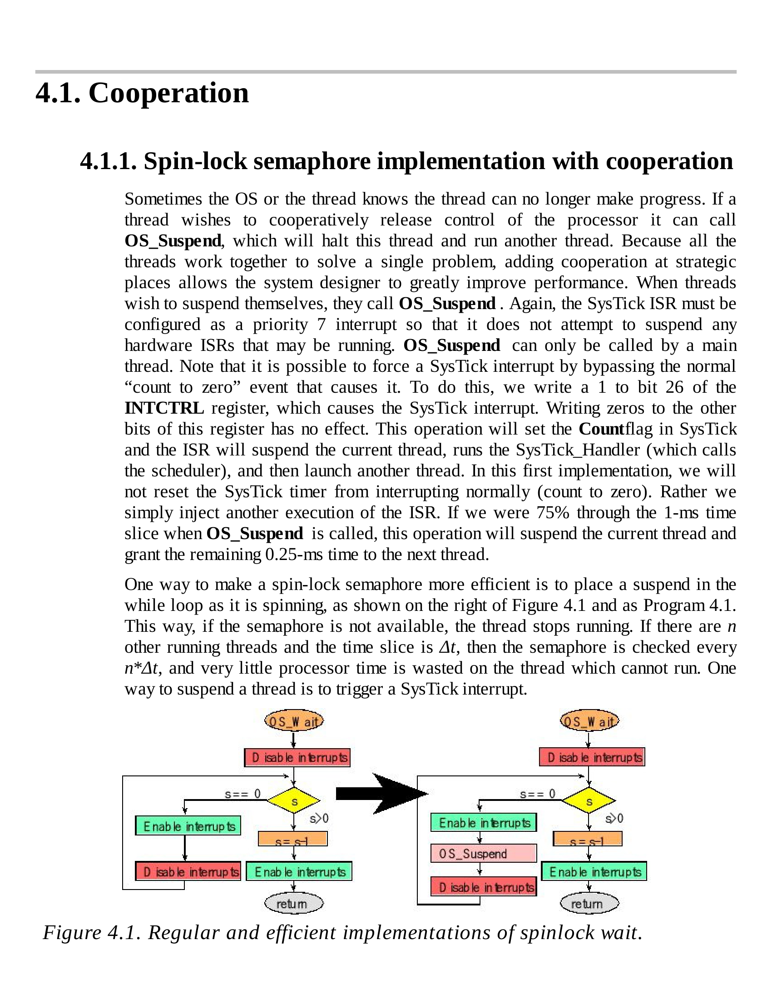
*Description*: Hardware pinout and board interface diagram mapping microcontroller pins, BoosterPack headers, switches, LEDs, and physical connectors for Figure 4.1: Regular and efficient implementations of spinlock wait..

> **Figure 4.1: Regular and efficient implementations of spinlock wait.**


<!-- Page 253 -->
### [PDF Page 253]


```c
void OS_Suspend(void){
INTCTRL = 0x04000000; // trigger SysTick
}
void OS_Wait(int32_t *s){
DisableInterrupts();
while((*s) == 0){
EnableInterrupts();
OS_Suspend(); // run thread switcher
DisableInterrupts();
}
(*s) = (*s) - 1;
EnableInterrupts();
}
```


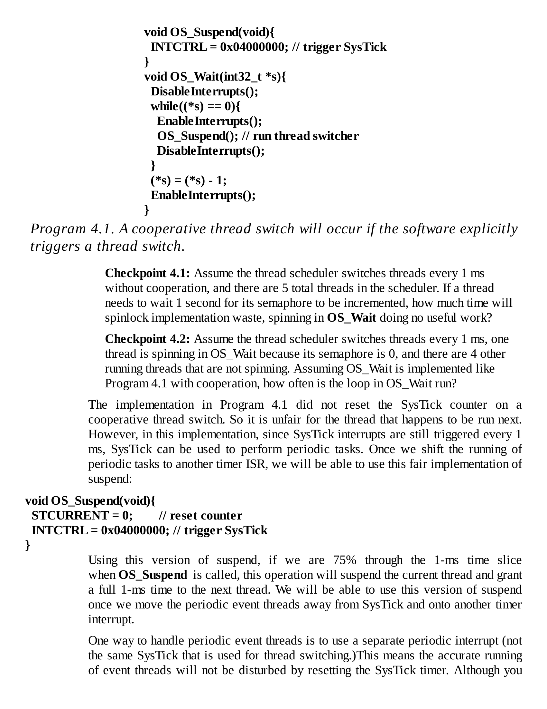
*Description*: Technical schematic and block diagram illustrating circuit operation, signal pathways, and functional behavior for Program 4.1: A cooperative thread switch will occur if the software explicitly.

> **Program 4.1: A cooperative thread switch will occur if the software explicitly**

triggers a thread switch.
Checkpoint 4.1: Assume the thread scheduler switches threads every 1 ms
without cooperation, and there are 5 total threads in the scheduler. If a thread
needs to wait 1 second for its semaphore to be incremented, how much time will
spinlock implementation waste, spinning in OS_Wait doing no useful work?
Checkpoint 4.2: Assume the thread scheduler switches threads every 1 ms, one
thread is spinning in OS_Wait because its semaphore is 0, and there are 4 other
running threads that are not spinning. Assuming OS_Wait is implemented like


*Description*: Technical schematic and block diagram illustrating circuit operation, signal pathways, and functional behavior for Program 4.1: with cooperation, how often is the loop in OS_Wait run?.

> **Program 4.1: with cooperation, how often is the loop in OS_Wait run?**

The implementation in Program 4.1 did not reset the SysTick counter on a
cooperative thread switch. So it is unfair for the thread that happens to be run next.
However, in this implementation, since SysTick interrupts are still triggered every 1
ms, SysTick can be used to perform periodic tasks. Once we shift the running of
periodic tasks to another timer ISR, we will be able to use this fair implementation of
suspend:

```c
void OS_Suspend(void){
STCURRENT = 0;        // reset counter
INTCTRL = 0x04000000; // trigger SysTick
}
```

Using this version of suspend, if we are 75% through the 1-ms time slice
when OS_Suspend  is called, this operation will suspend the current thread and grant
a full 1-ms time to the next thread. We will be able to use this version of suspend
once we move the periodic event threads away from SysTick and onto another timer
interrupt.
One way to handle periodic event threads is to use a separate periodic interrupt (not
the same SysTick that is used for thread switching.)This means the accurate running
of event threads will not be disturbed by resetting the SysTick timer. Although you


<!-- Page 254 -->
### [PDF Page 254]

could use either version of OS_Suspend , resetting the counter will be fairer.
4.1.2. Cooperative Scheduler
In this section we will develop a 3-thread cooperative round-robin scheduler by
letting the tasks suspend themselves by triggering a SysTick interrupt.
You can find this cooperative OS as Cooperative_xxx, where xxx refers to the
specific microcontroller on which the example was tested, Program 4.2. Figure 4.2
shows a profile of this OS. We can estimate the thread switch time to be about 1 µs,
because of the gap between the last edge on one pin to the first edge on the next pin.
In this case, because the thread switch occurs every 1.3 µs, the 1-µs thread-switch
overhead is significant. Even though SysTick interrupts are armed, the SysTick
hardware never triggers an interrupt. Instead, each thread voluntarily suspends itself
before the 1-ms interval.

```c
void Task0(void){
Count0 = 0;
while(1){
Count0++;
Profile_Toggle0();    // toggle bit
OS_Suspend();
}
}
void Task1(void){
Count1 = 0;
while(1){
Count1++;
Profile_Toggle1();    // toggle bit
OS_Suspend();
}
}
void Task2(void){
Count2 = 0;
while(1){
Count2++;
Profile_Toggle2();    // toggle bit
OS_Suspend();
}
}
```


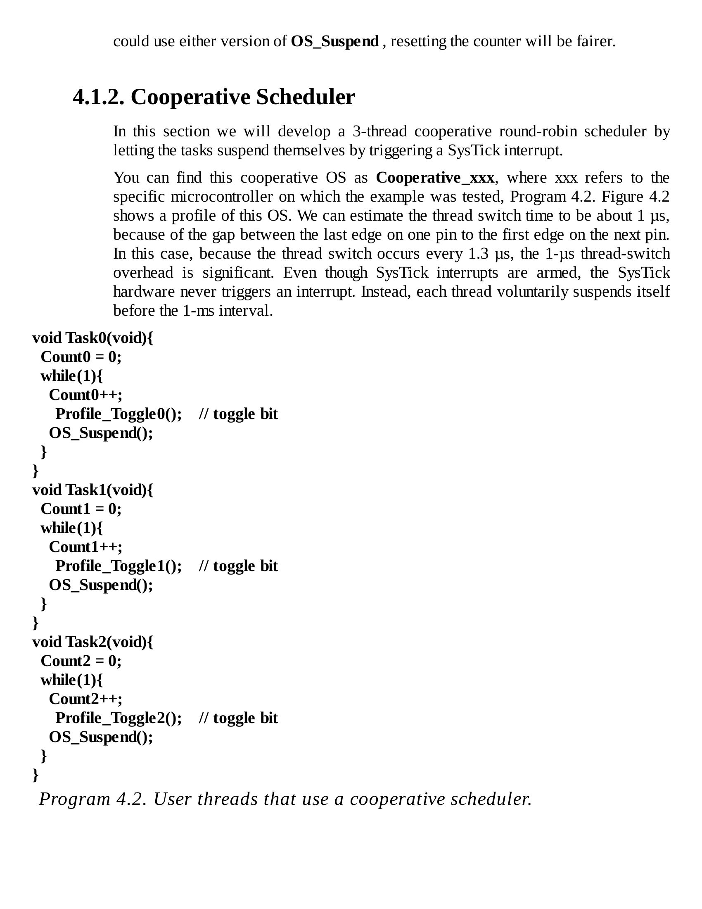
*Description*: Technical schematic and block diagram illustrating circuit operation, signal pathways, and functional behavior for Program 4.2: User threads that use a cooperative scheduler..

> **Program 4.2: User threads that use a cooperative scheduler.**


<!-- Page 255 -->
### [PDF Page 255]


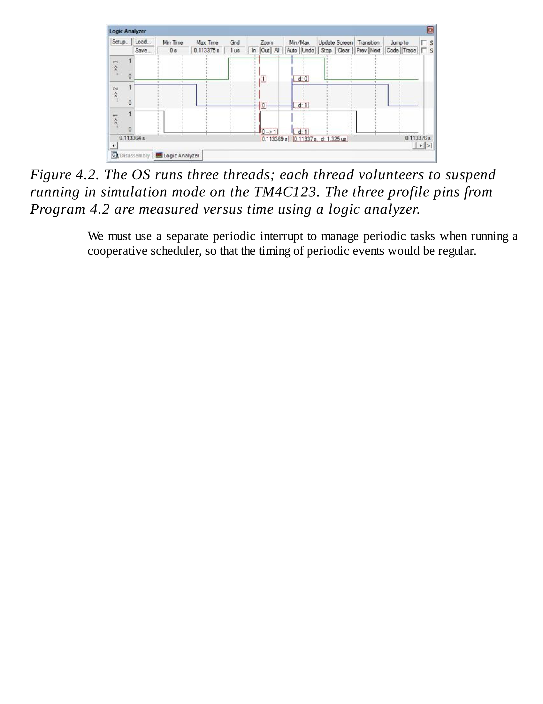
*Description*: Technical schematic and block diagram illustrating circuit operation, signal pathways, and functional behavior for Figure 4.2: The OS runs three threads; each thread volunteers to suspend.

> **Figure 4.2: The OS runs three threads; each thread volunteers to suspend**

running in simulation mode on the TM4C123. The three profile pins from


*Description*: Technical schematic and block diagram illustrating circuit operation, signal pathways, and functional behavior for Program 4.2: are measured versus time using a logic analyzer..

> **Program 4.2: are measured versus time using a logic analyzer.**

We must use a separate periodic interrupt to manage periodic tasks when running a
cooperative scheduler, so that the timing of periodic events would be regular.


<!-- Page 256 -->
### [PDF Page 256]

4.2. Blocking semaphores
4.2.1. The need for blocking
The basic idea of a blocking semaphore will be to prevent a thread from running
(we say the thread is blocked) when the thread needs a resource that is unavailable.
There are three reasons we will replace spin-lock semaphores with blocking
semaphores. The first reason is an obvious inefficiency in having threads spin while
there is nothing for them to do. Blocking semaphores will be a means to recapture
this lost processing time. Essentially, with blocking semaphores, a thread will not run
unless it has useful work it can accomplish. Even with spinlock/cooperation it is
wasteful to launch a thread you know can’t run, only to suspend itself 10 μs later.
The second problem with spin-lock semaphores is a fairnessissue. Consider the case
with threads 1 2 3 running in round robin order. Assume thread 1 is the one
calling Signal , and threads 2 and 3 call Wait . If threads 2 and 3 are both spinning
waiting on the semaphore, and then thread 1 signals the semaphore, which thread (2
or 3) will be allowed to run? Because of its position in the 1 2 3 cycle, thread 2 will
always capture the semaphore ahead of thread 3. It seems fair when the status of a
resource goes from busy to available, that all threads waiting on the resource get
equal chance. A similar problem exists in non-computing scenarios where fairness is
achieved by issuing numbered tickets, creating queues, or having the customers sign a
log when they enter the business looking for service. E.g., when waiting for a
checkout clerk at the grocery store, we know to get in line, and we think it is unfair
for pushy people to cut in line in front of us. We define bounded waiting as the
condition where once a thread begins to wait on a resource (the call to OS_Wait
does not return right away), there are a finite number of threads that will be allowed
to proceed before this thread is allowed to proceed.Bounded waiting does not
guarantee a minimum time before OS_Wait  will return; it just guarantees a finite
number of other threads will go before this thread. For example, it is holiday time, I
want to mail a package to my mom, I walk into the post office and take a number, the
number on the ticket is 251, I look up at the counter and the display shows 212, and I
know there are 39 people ahead of me in line. We could implement bounded waiting
with blocking semaphores by placing the blocked threads on a list, which is sorted by
the order in which they blocked. When we wake up a thread off the blocked list, we
wake up the one that has been waiting the longest.  We introduce the concept of
bounded waiting because it is a feature available in most commercial operating
systems.
The third reason to develop blocking semaphores will be the desire to implement a
priority thread scheduler. With a round-robin scheduler we assume each thread has
equal importance. With a priority scheduler we will run the highest priority thread


<!-- Page 257 -->
### [PDF Page 257]

that is ready to run. For example, if we have one high priority thread that is ready, we
will run it over and over regardless of whether or not there are any lower priority
threads ready. We will discuss the issues of starvation, aging, inversion and
inheritance in the next chapter. A priority scheduler will require the use of blocking
semaphores. I.e., we cannot use a priority scheduler with spin-lock semaphores.
4.2.2. The blocked state
A thread is in the blocked state when it is waiting for some external event like
input/output (keyboard input available, printer ready, I/O device available.) We will
use semaphores to implement communication and synchronization, and it is
semaphore function OS_Wait  that will block a thread if it needs to wait. For
example, if a thread communicates with other threads then it can be blocked waiting
for an input message or waiting for another thread to be ready to accept its output
message. If a thread wishes to output to the display, but another thread is currently
outputting, then it will block. If a thread needs information from a FIFO (calls Get),
then it will be blocked if the FIFO is empty (because it cannot retrieve any
information.) Also, if a thread outputs information to a FIFO (calls Put), then it will
be blocked if the FIFO is full (because it cannot save its information.) The
semaphore function OS_Signal  will be called when it is appropriate for the blocked
thread to continue. For example, if a thread is blocked because it wanted to print and
the printer was busy, it will be signaled when the printer is free. If a thread is
blocked waiting on a message, it will be signaled when a message is available.
Similarly, if a thread is blocked waiting on an empty FIFO, it will be signaled when
new data are put into the FIFO. If a thread is blocked because it wanted to put into a
FIFO and the FIFO was full, it will be signaled when another thread calls Get,
freeing up space in the FIFO.

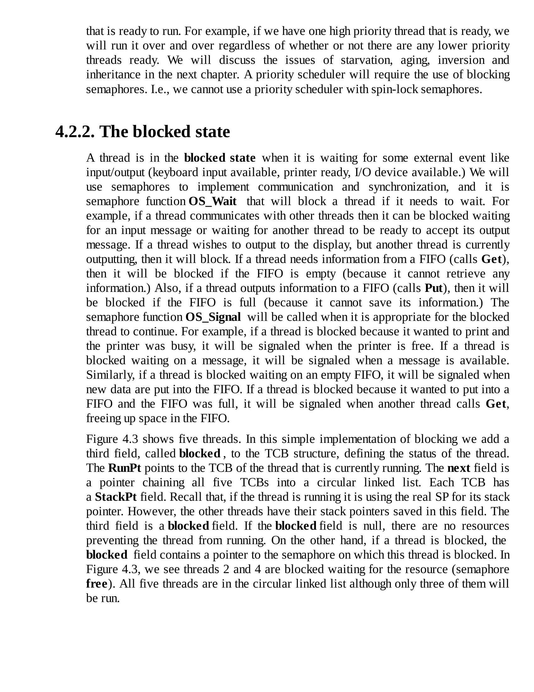
*Description*: Technical schematic and block diagram illustrating circuit operation, signal pathways, and functional behavior for Figure 4.3: shows five threads. In this simple implementation of blocking we add a.

> **Figure 4.3: shows five threads. In this simple implementation of blocking we add a**

third field, called blocked , to the TCB structure, defining the status of the thread.
The RunPt points to the TCB of the thread that is currently running. The next field is
a pointer chaining all five TCBs into a circular linked list. Each TCB has
a StackPt field. Recall that, if the thread is running it is using the real SP for its stack
pointer. However, the other threads have their stack pointers saved in this field. The
third field is a blocked field. If the blocked field is null, there are no resources
preventing the thread from running. On the other hand, if a thread is blocked, the
blocked  field contains a pointer to the semaphore on which this thread is blocked. In


*Description*: Technical schematic and block diagram illustrating circuit operation, signal pathways, and functional behavior for Figure 4.3: , we see threads 2 and 4 are blocked waiting for the resource (semaphore.

> **Figure 4.3: , we see threads 2 and 4 are blocked waiting for the resource (semaphore**

free). All five threads are in the circular linked list although only three of them will
be run.


<!-- Page 258 -->
### [PDF Page 258]


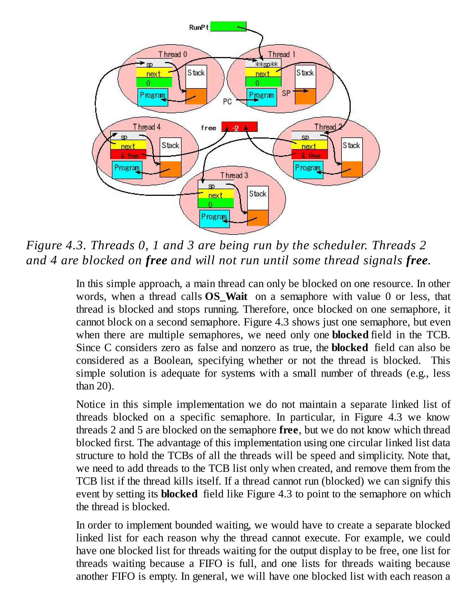
*Description*: Technical schematic and block diagram illustrating circuit operation, signal pathways, and functional behavior for Figure 4.3: Threads 0, 1 and 3 are being run by the scheduler. Threads 2.

> **Figure 4.3: Threads 0, 1 and 3 are being run by the scheduler. Threads 2**


```assembly
and 4 are blocked on free and will not run until some thread signals free.
```

In this simple approach, a main thread can only be blocked on one resource. In other
words, when a thread calls OS_Wait  on a semaphore with value 0 or less, that
thread is blocked and stops running. Therefore, once blocked on one semaphore, it
cannot block on a second semaphore. Figure 4.3 shows just one semaphore, but even
when there are multiple semaphores, we need only one blocked field in the TCB.
Since C considers zero as false and nonzero as true, the blocked  field can also be
considered as a Boolean, specifying whether or not the thread is blocked.  This
simple solution is adequate for systems with a small number of threads (e.g., less
than 20).
Notice in this simple implementation we do not maintain a separate linked list of
threads blocked on a specific semaphore. In particular, in Figure 4.3 we know
threads 2 and 5 are blocked on the semaphore free, but we do not know which thread
blocked first. The advantage of this implementation using one circular linked list data

```c
structure to hold the TCBs of all the threads will be speed and simplicity. Note that,
```

we need to add threads to the TCB list only when created, and remove them from the
TCB list if the thread kills itself. If a thread cannot run (blocked) we can signify this
event by setting its blocked  field like Figure 4.3 to point to the semaphore on which
the thread is blocked.
In order to implement bounded waiting, we would have to create a separate blocked
linked list for each reason why the thread cannot execute. For example, we could
have one blocked list for threads waiting for the output display to be free, one list for
threads waiting because a FIFO is full, and one lists for threads waiting because
another FIFO is empty. In general, we will have one blocked list with each reason a


<!-- Page 259 -->
### [PDF Page 259]

thread might not be able to run. This approach will be efficient for systems with many
threads (e.g., more than 20). These linked lists contain threads sorted in order of how
long they have been waiting. To implement bounded waiting, when we signal a
semaphore, we wake up the thread that has been waiting the longest.
In this more complex implementation, we unchain a TCB from the ready circular
linked list when it is blocked. In this way a blocked thread will never run. We place
the blocked TCBs on a linear linked list associated with the semaphore (the reason it
was blocked). We can implement bounded waiting by putting blocked TCBs at the
end of the list and waking up threads from the front of the list. There will be a
separate linked list for every semaphore. This method is efficient when there are
many threads that will be blocked at one time. The thread switching will be faster
because the scheduler will only see threads that could run, and not have to look at
blocked threads in the circular linked list. Most commercial operating systems
implement blocking by unchaining blocked threads because they need to operate
efficiently with dozens of threads.
However, for simple operating systems that manage less than 10 threads it will be
faster and easier to not implement unchaining. Rather, simple schedulers can skip
threads with a nonzero blocked  field.
4.2.3. Implementation
We will present a simple approach for implementing blocking semaphores. Notice in

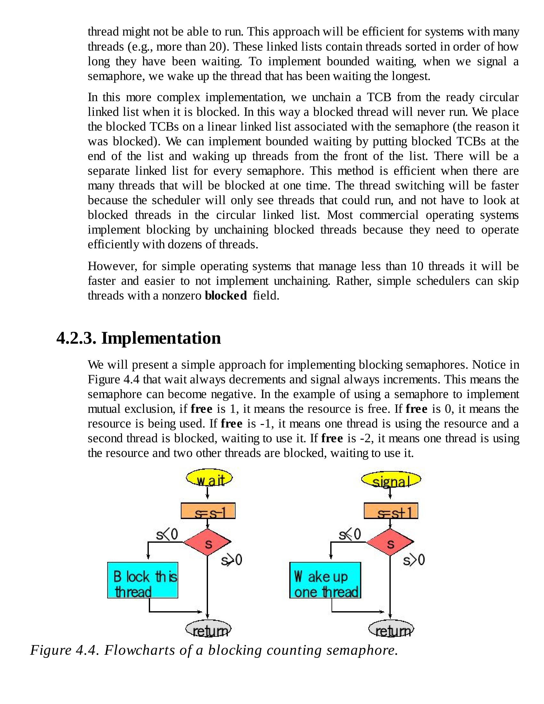
*Description*: Technical schematic and block diagram illustrating circuit operation, signal pathways, and functional behavior for Figure 4.4: that wait always decrements and signal always increments. This means the.

> **Figure 4.4: that wait always decrements and signal always increments. This means the**

semaphore can become negative. In the example of using a semaphore to implement
mutual exclusion, if free is 1, it means the resource is free. If free is 0, it means the
resource is being used. If free is -1, it means one thread is using the resource and a
second thread is blocked, waiting to use it. If free is -2, it means one thread is using
the resource and two other threads are blocked, waiting to use it.


*Description*: Timing waveform and execution flowchart illustrating signal transitions, state machine progression, or algorithm logic for Figure 4.4: Flowcharts of a blocking counting semaphore..

> **Figure 4.4: Flowcharts of a blocking counting semaphore.**


<!-- Page 260 -->
### [PDF Page 260]

In this simple implementation, the semaphore is a signed integer. This implementation
of blocking is appropriate for systems with less than 20 threads. In this
implementation, a blocked  field is added to the TCB. The type of this field is a
pointer to a semaphore. The semaphore itself remains a signed integer. If blocked is
null, the thread is not blocked. If the blocked  field contains a semaphore pointer, it is
blocked on that semaphore. The “Block this thread” operation will set the blocked
field to point to the semaphore, then suspend the thread.

```c
void OS_Wait(int32_t *s){
DisableInterrupts();
(*s) = (*s) - 1;
if((*s) < 0){
RunPt->blocked = s; // reason it is blocked
EnableInterrupts();
OS_Suspend();       // run thread switcher
}
EnableInterrupts();
}
```

The “Wakeup one thread” operation will be to search all the TCBs for first one that
has a blocked  field equal to the semaphore and wake it up by setting its blocked
field to zero

```c
void OS_Signal(int32_t *s){
tcbType *pt;
DisableInterrupts();
(*s) = (*s) + 1;
if((*s) <= 0){
pt = RunPt->next;  // search for one blocked on this
while(pt->blocked != s){
pt = pt->next;
}
pt->blocked = 0;   // wakeup this one
}
EnableInterrupts();
}
```

Notice in this implementation, calling the signal will not invoke a thread switch.
During the thread switch, the OS searches the circular linked-list for a thread with
a blocked  field equal to zero (the woken up thread is a possible candidate). This
simple implementation will not allow you to implement bounded waiting. Notice that
this solution does not implement bounded waiting.

```c
void Scheduler(void){
RunPt = RunPt->next;  // run next thread not blocked
while(RunPt->blocked){ // skip if blocked
```


<!-- Page 261 -->
### [PDF Page 261]

RunPt = RunPt->next;
}
}
Checkpoint 4.3:  Assume the RTOS is running with a preemptive thread switch
every 1 ms. Assume there are 8 threads in the TCB circular list, and 5 of the
threads are blocked. Assume the while loop in the above Scheduler function takes
12 assembly instructions or 150ns to execute each time through the loop. What is
the maximum time wasted in the scheduler looking at threads that are blocked? In
other words, how much time could be saved by unchaining blocked threads from
the TCB list?
4.2.4. Thread rendezvous
The objective of this example is to synchronize Threads 1 and 2 (Program 4.3). In
other words, whichever thread gets to this part of the code first will wait for the
other. Initially semaphores S1 and S2  are both 0. The two threads are said to
rendezvous at the code following the signal and wait calls. The rendezvous will
cause thread 1 to execute Stuff1 at the same time (concurrently) as thread 2 executes
its Stuff2 .

```c
void Task1(void){ // Thread 1
Init1();
while(1){
Unrelated1();
```

OS_Signal(&S1);
OS_Wait(&S2);
Stuff1();
}
}

```c
void Task2(void){ //
```

Thread2
Init2();

```c
while(1){
Unrelated2();
OS_Signal(&S2);
OS_Wait(&S1);
Stuff2();
}
}
```


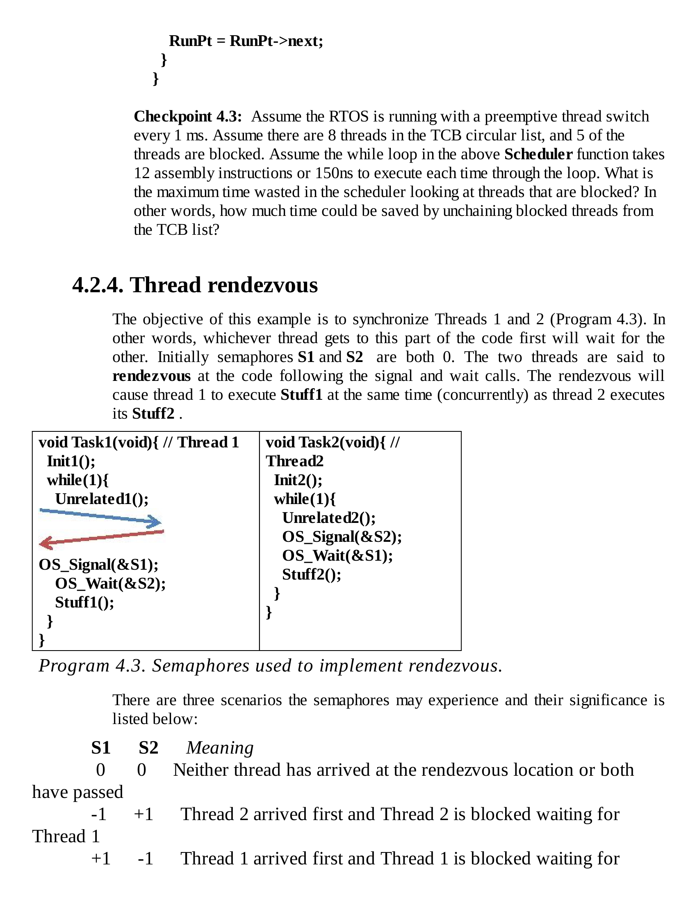
*Description*: Technical schematic and block diagram illustrating circuit operation, signal pathways, and functional behavior for Program 4.3: Semaphores used to implement rendezvous..

> **Program 4.3: Semaphores used to implement rendezvous.**

There are three scenarios the semaphores may experience and their significance is
listed below:
S1
S2
Meaning
0
0
Neither thread has arrived at the rendezvous location or both
have passed
-1
+1
Thread 2 arrived first and Thread 2 is blocked waiting for
Thread 1
+1
-1
Thread 1 arrived first and Thread 1 is blocked waiting for


<!-- Page 262 -->
### [PDF Page 262]

Thread 2


<!-- Page 263 -->
### [PDF Page 263]

4.3. First In First Out Queue
We introduced first in first out circular queues (FIFO) back in Chapter 2 when we
presented interrupts. However, in this section we will delve deeper and investigate
how operating systems use this important data structure. A common scenario in
embedded systems has producers that generate data and consumers that process data.
To decouple the producers and consumers from having to work in lock-step, a buffer
is used to store the data, so a producer thread can produce when it can. All is fine as
long as there is room in the buffer to store the produced data. Similarly, the consumer
thread can process data when it can. Similarly, all is fine as long as the buffer is non-
empty. A common implementation of such a buffer is the FIFO queue, which
preserves the order of data, so that the first piece of data generated is the first
consumed.
4.3.1. Producer/Consumer problem using a FIFO
The FIFO is quite useful for implementing a buffered I/O interface (Figure 4.5). The
function Put will store data in the FIFO, and the function Get will remove data. It
operates in a first in first out manner, meaning the Get function will return/remove
the oldest data. It can be used for both buffered input and buffered output. This order-
preserving data structure temporarily saves data created by the source (producer)
before it is processed by the sink (consumer). The class of FIFOs studied in this
section will be statically allocated global structures. Because they are global
variables, it means they will exist permanently and can be carefully shared by more
than one program. The advantage of using a FIFO structure for a data flow problem is
that we can decouple the producer and consumer threads. Without the FIFO we
would have to produce one piece of data, then process it, produce another piece of
data, then process it. With the FIFO, the producer thread can continue to produce data
without having to wait for the consumer to finish processing the previous data. This
decoupling can significantly improve performance.

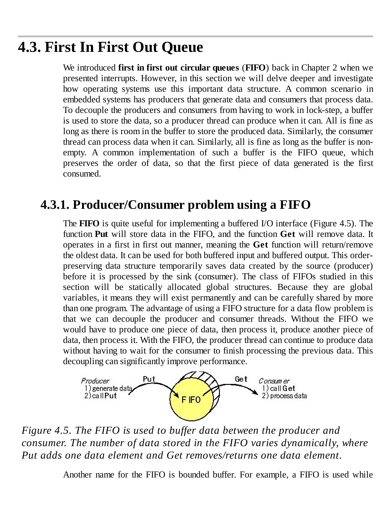
*Description*: Technical schematic and block diagram illustrating circuit operation, signal pathways, and functional behavior for Figure 4.5: The FIFO is used to buffer data between the producer and.

> **Figure 4.5: The FIFO is used to buffer data between the producer and**

consumer. The number of data stored in the FIFO varies dynamically, where
Put adds one data element and Get removes/returns one data element.
Another name for the FIFO is bounded buffer. For example, a FIFO is used while


<!-- Page 264 -->
### [PDF Page 264]

streaming audio from the Internet. As sound data are received from the Internet they
are stored (calls Put) into a FIFO. When the sound board needs data it calls Get. As
long as the FIFO never becomes full or empty, the sound is played in a continuous
manner. A FIFO is also used when you ask the computer to print a file. Rather than
waiting for the actual printing to occur character by character, the print command will
put the data in a FIFO. Whenever the printer is free, it will get data from the FIFO.
The advantage of the FIFO is it allows you to continue to use your computer while
the printing occurs in the background. To implement this magic, our RTOS must be
able to manage FIFOs. There are many producer/consumer applications, as we
previously listed in Table 3.1, where the processes on the left are producers that
create or input data, while the processes on the right are consumers which process or
output data.
4.3.2. Little’s Theorem
In this section we introduce some general theory about queues. Let N be the average
number of data packets in the queue plus the one data packet currently being
processed by the consumer. Basically, N is the average number of packets in the
system. Let L be the average arrival rate in packets per second (pps). Let R be the
average response time of a packet, which includes the time waiting in the queue plus
the time for the consumer to process the packet. Little’s Theorem states
N = L*R
As long as the system is stable, this result is not influenced by the probability
distribution of the producer, the probability distribution of the consumer or the
service order. Let S be the mean service time for a packet. Thus, C=1/S is defined as
the system capacity (pps). Stable in this context means the packet arrival rate is less
than the system capacity (L<C). This means, in most cases, the queue length can be
chosen so the queue never fills and no data are lost. In this case, the arrival rate L is
also the output rate T, or throughput of the system. We can use Little’s Theorem to
estimate average response time,
R = N/T
In general, we want T to be high and R to be low. To handle these two conflicting
goals, we develop the concept of a power metric for the queue. We can define
utilization factor as the throughput divided by the capacity, which is a normalized
throughput,
U = T/C
U defines the loading of the queue, because it is. We can define normalized mean
response time, R/S. We next define power metric P as utilization factor divided by
normalized mean response time,
P = U/(R/S) = (T*S)/(R/S)


<!-- Page 265 -->
### [PDF Page 265]

Substituting Little’s Theorem (R=N/T), we can write
P = U2/N
The goal of the operating system is to maximize P.
4.3.3. FIFO implementation
FIFOs can be statically allocated, where the buffer size is fixed at compile time,

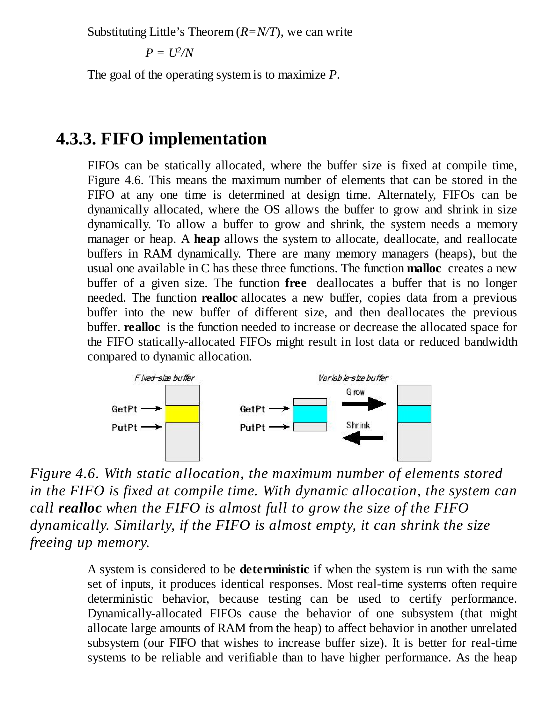
*Description*: Technical schematic and block diagram illustrating circuit operation, signal pathways, and functional behavior for Figure 4.6: This means the maximum number of elements that can be stored in the.

> **Figure 4.6: This means the maximum number of elements that can be stored in the**

FIFO at any one time is determined at design time. Alternately, FIFOs can be
dynamically allocated, where the OS allows the buffer to grow and shrink in size
dynamically. To allow a buffer to grow and shrink, the system needs a memory
manager or heap. A heap allows the system to allocate, deallocate, and reallocate
buffers in RAM dynamically. There are many memory managers (heaps), but the
usual one available in C has these three functions. The function malloc  creates a new
buffer of a given size. The function free  deallocates a buffer that is no longer
needed. The function realloc allocates a new buffer, copies data from a previous
buffer into the new buffer of different size, and then deallocates the previous
buffer. realloc  is the function needed to increase or decrease the allocated space for
the FIFO statically-allocated FIFOs might result in lost data or reduced bandwidth
compared to dynamic allocation.


*Description*: Technical schematic and block diagram illustrating circuit operation, signal pathways, and functional behavior for Figure 4.6: With static allocation, the maximum number of elements stored.

> **Figure 4.6: With static allocation, the maximum number of elements stored**

in the FIFO is fixed at compile time. With dynamic allocation, the system can
call realloc when the FIFO is almost full to grow the size of the FIFO
dynamically. Similarly, if the FIFO is almost empty, it can shrink the size
freeing up memory.
A system is considered to be deterministic if when the system is run with the same
set of inputs, it produces identical responses. Most real-time systems often require
deterministic behavior, because testing can be used to certify performance.
Dynamically-allocated FIFOs cause the behavior of one subsystem (that might
allocate large amounts of RAM from the heap) to affect behavior in another unrelated
subsystem (our FIFO that wishes to increase buffer size). It is better for real-time
systems to be reliable and verifiable than to have higher performance. As the heap


<!-- Page 266 -->
### [PDF Page 266]

runs, it can become fragmented; meaning the free memory in the heap has many little
pieces, rather than a few big pieces. Since the time to reallocate a buffer can vary
tremendously, depending on the fragmentation of the heap, it will be difficult to
predict execution time for the FIFO functions. Since a statically allocated FIFO is
simple, we will be able to predict execution behavior. For these reasons, we will
restrict FIFO construction to static allocation. In other words, you should not use
malloc and free in your RTOS.
There are many ways to implement a statically-allocated FIFO. We can use either
two pointers or two indices to access the data in the FIFO. We can either use or not
use a counter that specifies how many entries are currently stored in the FIFO. There
are even hardware implementations. For non-OS implementations of the FIFO, see
Section 2.3. In this section we will present three implementations using semaphores.
4.3.4. Three-semaphore FIFO implementation
The first scenario we will solve is where there are multiple producers and multiple
consumers. In this case all threads are main threads, which are scheduled by the OS.
The FIFO is used to pass data from the producers to the consumers. In this situation,
the producers do not care to which consumer their data are passed, and the
consumers do not care from which producer the data arrived. These are main threads,
so we will block producers when the FIFO is full and we will block consumers
when the FIFO is empty.

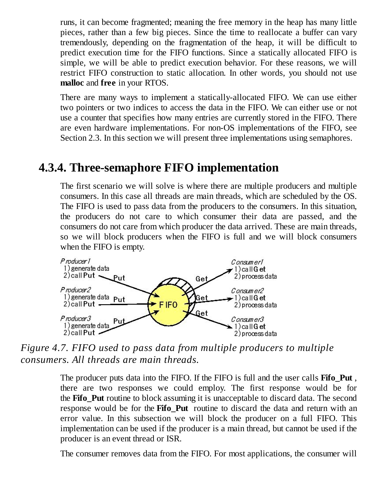
*Description*: Technical schematic and block diagram illustrating circuit operation, signal pathways, and functional behavior for Figure 4.7: FIFO used to pass data from multiple producers to multiple.

> **Figure 4.7: FIFO used to pass data from multiple producers to multiple**

consumers. All threads are main threads.
The producer puts data into the FIFO. If the FIFO is full and the user calls Fifo_Put ,
there are two responses we could employ. The first response would be for
the Fifo_Put routine to block assuming it is unacceptable to discard data. The second
response would be for the Fifo_Put  routine to discard the data and return with an
error value. In this subsection we will block the producer on a full FIFO. This
implementation can be used if the producer is a main thread, but cannot be used if the
producer is an event thread or ISR.
The consumer removes data from the FIFO. For most applications, the consumer will


<!-- Page 267 -->
### [PDF Page 267]

be a main thread that calls Fifo_Get when it needs data to process. After a get, the
particular information returned from the get routine is no longer saved in the FIFO. If
the FIFO is empty and the user tries to get, the Fifo_Get routine will block because
we assume the consumer needs data to proceed. The FIFO is order preserving, such
that the information returned by repeated calls to Fifo_Get give data in the same
order as the data saved by repeated calls of Fifo_Put .
The two-pointer implementation has, of course, two pointers. If we were to have
infinite memory, a FIFO implementation is easy (Figure 4.8). GetPt points to the
data that will be removed by the next call to Fifo_Get , and PutPt points to the
empty space where the data will stored by the next call to Fifo_Put , see Program
4.4.


*Description*: Technical schematic and block diagram illustrating circuit operation, signal pathways, and functional behavior for Figure 4.8: The FIFO implementation with infinite memory..

> **Figure 4.8: The FIFO implementation with infinite memory.**


```c
uint32_t volatile *PutPt; // put next
uint32_t volatile *GetPt; // get next
void Fifo_Put(uint32_t data){      // call by value
*PutPt = data;   // Put
PutPt++;         // next
}
uint32_t Fifo_Get(void){ uint32_t data;
data = *GetPt;   // return by reference
GetPt++;         // next
return data;    // true if success
}
```


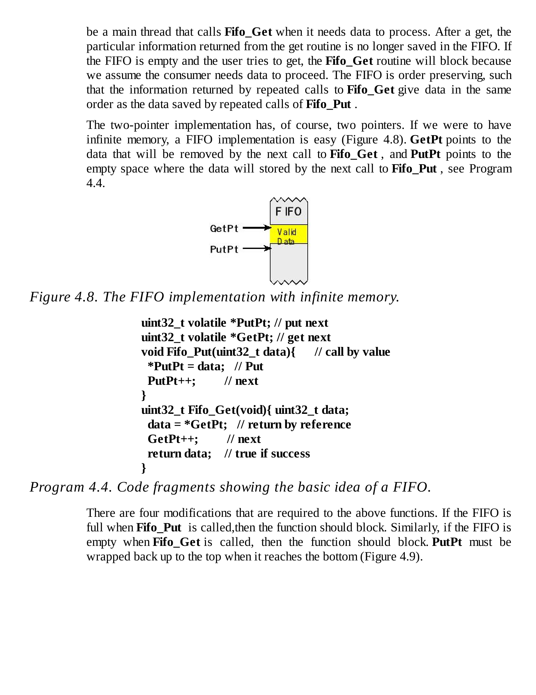
*Description*: Technical schematic and block diagram illustrating circuit operation, signal pathways, and functional behavior for Program 4.4: Code fragments showing the basic idea of a FIFO..

> **Program 4.4: Code fragments showing the basic idea of a FIFO.**

There are four modifications that are required to the above functions. If the FIFO is
full when Fifo_Put  is called,then the function should block. Similarly, if the FIFO is
empty when Fifo_Get is called, then the function should block. PutPt must be
wrapped back up to the top when it reaches the bottom (Figure 4.9).


<!-- Page 268 -->
### [PDF Page 268]


*Description*: Technical schematic and block diagram illustrating circuit operation, signal pathways, and functional behavior for Figure 4.9: The FIFO Fifo_Put operation showing the pointer wrap..

> **Figure 4.9: The FIFO Fifo_Put operation showing the pointer wrap.**

The GetPt  must also be wrapped back up to the top when it reaches the bottom
(Figure 4.10).

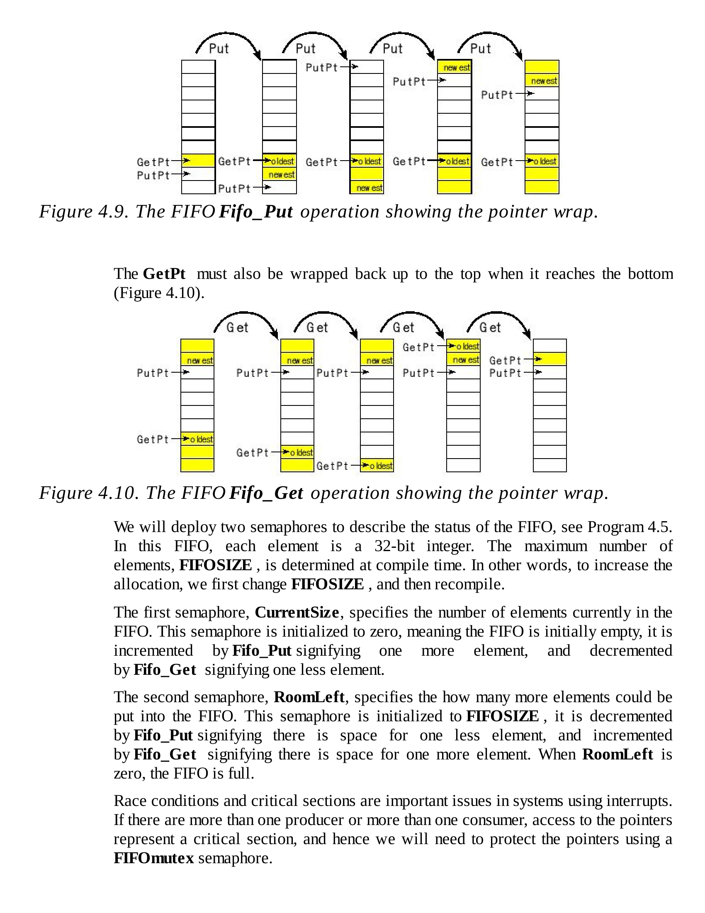
*Description*: Technical schematic and block diagram illustrating circuit operation, signal pathways, and functional behavior for Figure 4.10: The FIFO Fifo_Get operation showing the pointer wrap..

> **Figure 4.10: The FIFO Fifo_Get operation showing the pointer wrap.**

We will deploy two semaphores to describe the status of the FIFO, see Program 4.5.
In this FIFO, each element is a 32-bit integer. The maximum number of
elements, FIFOSIZE , is determined at compile time. In other words, to increase the
allocation, we first change FIFOSIZE , and then recompile.
The first semaphore, CurrentSize, specifies the number of elements currently in the
FIFO. This semaphore is initialized to zero, meaning the FIFO is initially empty, it is
incremented
by Fifo_Put signifying
one
more
element,
and
decremented
by Fifo_Get  signifying one less element.
The second semaphore, RoomLeft, specifies the how many more elements could be
put into the FIFO. This semaphore is initialized to FIFOSIZE , it is decremented
by Fifo_Put signifying there is space for one less element, and incremented
by Fifo_Get  signifying there is space for one more element. When RoomLeft is
zero, the FIFO is full.
Race conditions and critical sections are important issues in systems using interrupts.
If there are more than one producer or more than one consumer, access to the pointers
represent a critical section, and hence we will need to protect the pointers using a
FIFOmutex semaphore.


<!-- Page 269 -->
### [PDF Page 269]

#define FIFOSIZE 10       // can be any size

```c
uint32_t volatile *PutPt; // put next
uint32_t volatile *GetPt; // get next
uint32_t static Fifo[FIFOSIZE];
int32_t CurrentSize;      // 0 means FIFO empty
int32_t RoomLeft;         // 0 means FIFO full
int32_t FIFOmutex;       // exclusive access to FIFO
// initialize FIFO
void OS_Fifo_Init(void){
PutPt = GetPt = &Fifo[0]; // Empty
OS_InitSemaphore(&CurrentSize, 0);
OS_InitSemaphore(&RoomLeft, FIFOSIZE);
OS_InitSemaphore(&FIFOmutex, 1);
}
void OS_Fifo_Put(uint32_t data){
OS_Wait(&RoomLeft);
OS_Wait(&FIFOmutex);
*(PutPt) = data;    // Put
PutPt++;            // place to put next
if(PutPt == &Fifo[FIFOSIZE]){
PutPt = &Fifo[0];  // wrap
}
OS_Signal(&FIFOmutex);
OS_Signal(&CurrentSize);
}
uint32_t OS_Fifo_Get(void){ uint32_t data;
OS_Wait(&CurrentSize);
OS_Wait(&FIFOmutex);
data = *(GetPt);      // get data
GetPt++;              // points to next data to get
if(GetPt == &Fifo[FIFOSIZE]){
GetPt = &Fifo[0];   // wrap
}
OS_Signal(&FIFOmutex);
OS_Signal(&RoomLeft);
return data;
}
```


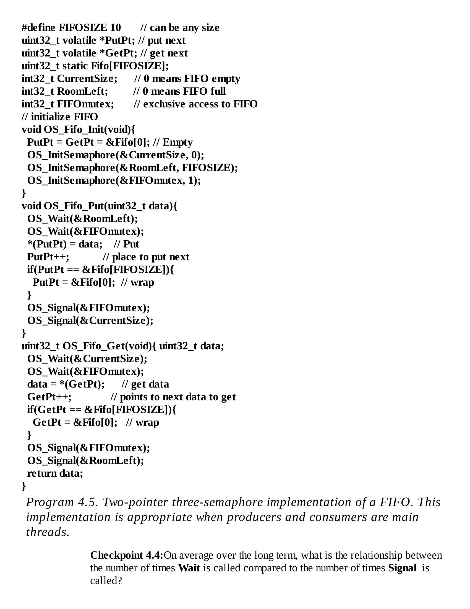
*Description*: Technical schematic and block diagram illustrating circuit operation, signal pathways, and functional behavior for Program 4.5: Two-pointer three-semaphore implementation of a FIFO. This.

> **Program 4.5: Two-pointer three-semaphore implementation of a FIFO. This**

implementation is appropriate when producers and consumers are main
threads.
Checkpoint 4.4:On average over the long term, what is the relationship between
the number of times Wait is called compared to the number of times Signal  is
called?


<!-- Page 270 -->
### [PDF Page 270]

Checkpoint 4.5:On average over the long term, what is the relationship between
the number of times Put is successfully called compared to the number of
times Get  is successfully called?  To answer this question,consider a successful
call to Put as a called that correctly stored data, and a successful call to Get  as a
call that correctly returned data.
4.3.5. Two-semaphore FIFO implementation
If there is one producer as an event thread coupled with one or more consumers as
main threads (Figure 4.11), the FIFO implementation shown in the previous section
must be changed, because we cannot block or spin an event thread. If the FIFO is full
when the producer calls Put, then that data will be lost. The number of times we lose
data is recorded in LostData . The Put function returns an error (-1) if the data was
not saved because the FIFO was full. This Putfunction cannot be called by multiple
producers because of the read-modify-write sequence to PutPt . See Program 4.6. To
tell if the FIFO is full, we simply compare the CurrentSize with its maximum. This
is a statically allocated FIFO, so the maximum size is a constant.

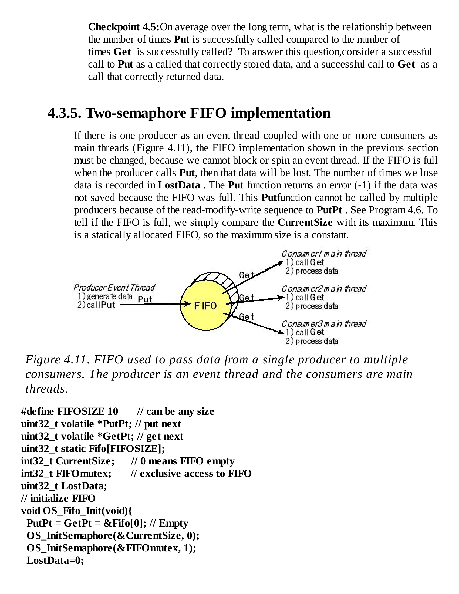
*Description*: Technical schematic and block diagram illustrating circuit operation, signal pathways, and functional behavior for Figure 4.11: FIFO used to pass data from a single producer to multiple.

> **Figure 4.11: FIFO used to pass data from a single producer to multiple**

consumers. The producer is an event thread and the consumers are main
threads.
#define FIFOSIZE 10       // can be any size

```c
uint32_t volatile *PutPt; // put next
uint32_t volatile *GetPt; // get next
uint32_t static Fifo[FIFOSIZE];
int32_t CurrentSize;      // 0 means FIFO empty
int32_t FIFOmutex;       // exclusive access to FIFO
uint32_t LostData;
// initialize FIFO
void OS_Fifo_Init(void){
PutPt = GetPt = &Fifo[0]; // Empty
OS_InitSemaphore(&CurrentSize, 0);
OS_InitSemaphore(&FIFOmutex, 1);
LostData=0;
```


<!-- Page 271 -->
### [PDF Page 271]

}
int OS_FIFO_Put(uint32_t data){

```c
if(CurrentSize == FIFOSIZE){
LostData++;          // error
return -1;
}
*(PutPt) = data;       // Put
PutPt++;               // place for next
if(PutPt == &Fifo[FIFOSIZE]){
PutPt = &Fifo[0];   // wrap
}
OS_Signal(&CurrentSize);
return 0;
}
uint32_t OS_FIFO_Get(void){uint32_t data;
OS_Wait(&CurrentSize); // block if empty
OS_Wait(&FIFOmutex);
data = *(GetPt);      // get data
GetPt++;              // points to next data to get
if(GetPt == &Fifo[FIFOSIZE]){
GetPt = &Fifo[0];   // wrap
}
OS_Signal(&FIFOmutex);
return data;
}
```


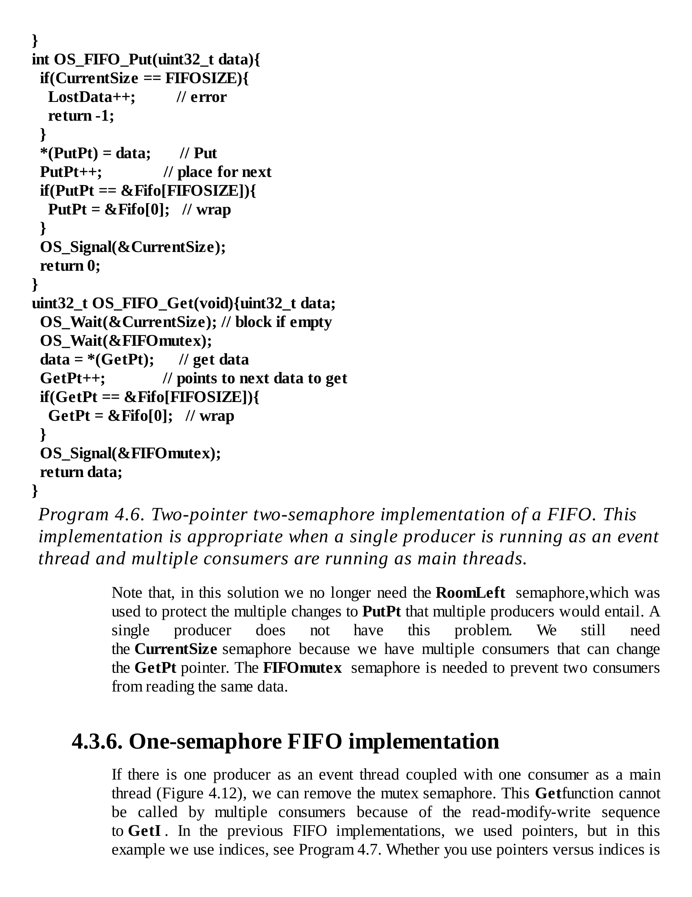
*Description*: Technical schematic and block diagram illustrating circuit operation, signal pathways, and functional behavior for Program 4.6: Two-pointer two-semaphore implementation of a FIFO. This.

> **Program 4.6: Two-pointer two-semaphore implementation of a FIFO. This**

implementation is appropriate when a single producer is running as an event
thread and multiple consumers are running as main threads.
Note that, in this solution we no longer need the RoomLeft  semaphore,which was
used to protect the multiple changes to PutPt that multiple producers would entail. A
single
producer
does
not
have
this
problem.
We
still
need
the CurrentSize semaphore because we have multiple consumers that can change
the GetPt pointer. The FIFOmutex  semaphore is needed to prevent two consumers
from reading the same data.
4.3.6. One-semaphore FIFO implementation
If there is one producer as an event thread coupled with one consumer as a main
thread (Figure 4.12), we can remove the mutex semaphore. This Getfunction cannot
be called by multiple consumers because of the read-modify-write sequence
to GetI . In the previous FIFO implementations, we used pointers, but in this
example we use indices, see Program 4.7. Whether you use pointers versus indices is


<!-- Page 272 -->
### [PDF Page 272]

a matter of style, and our advice is to use the mechanism you understand the best. As
long as there is one event thread calling Put and one main thread calling Get, this
implementation does not have any critical sections.


*Description*: Technical schematic and block diagram illustrating circuit operation, signal pathways, and functional behavior for Figure 4.12: FIFO used to pass data from a single producer to a single.

> **Figure 4.12: FIFO used to pass data from a single producer to a single**

consumer. The producer is an event thread and the consumer is a main
thread.
#define FIFOSIZE 10 // can be any size

```c
uint32_t PutI;      // index of where to put next
uint32_t GetI;      // index of where to get next
uint32_t Fifo[FIFOSIZE];
int32_t CurrentSize; // 0 means FIFO empty, FIFOSIZE means full
uint32_t LostData;   // number of lost pieces of data
void OS_FIFO_Init(void){
PutI = GetI = 0;   // Empty
OS_InitSemaphore(&CurrentSize, 0);
LostData = 0;
}
int OS_FIFO_Put(uint32_t data){
if(CurrentSize == FIFOSIZE){
LostData++;
return -1;  // full
} else{
Fifo[PutI] = data;       // Put
PutI = (PutI+1)%FIFOSIZE;
OS_Signal(&CurrentSize);
return 0;   // success
}
}
uint32_t OS_FIFO_Get(void){uint32_t data;
OS_Wait(&CurrentSize);    // block if empty
data = Fifo[GetI];        // get
GetI = (GetI+1)%FIFOSIZE; // place to get next
return data;
}
```


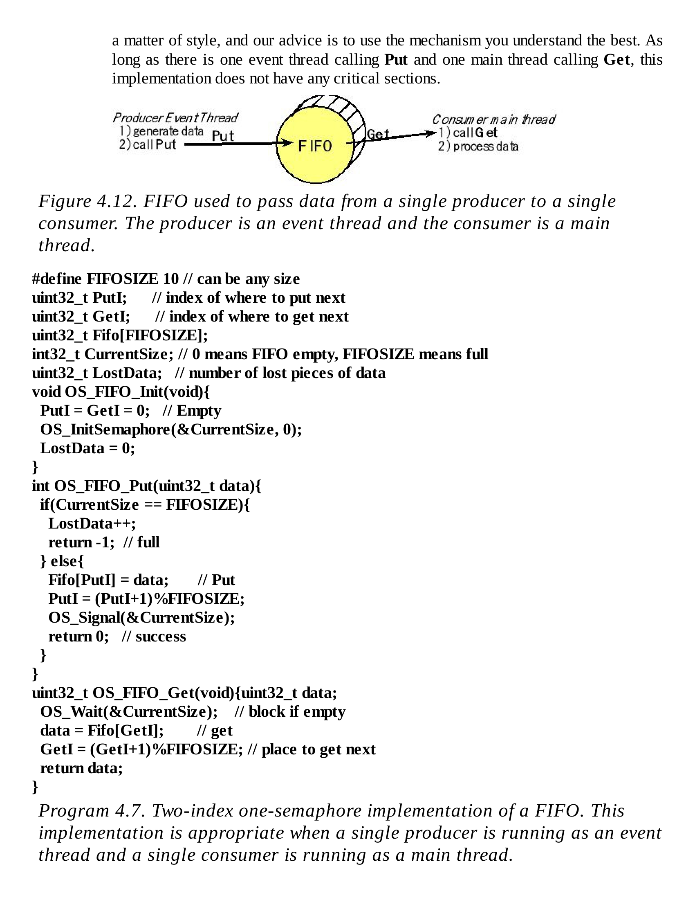
*Description*: Technical schematic and block diagram illustrating circuit operation, signal pathways, and functional behavior for Program 4.7: Two-index one-semaphore implementation of a FIFO. This.

> **Program 4.7: Two-index one-semaphore implementation of a FIFO. This**

implementation is appropriate when a single producer is running as an event
thread and a single consumer is running as a main thread.


<!-- Page 273 -->
### [PDF Page 273]

The use of indexes rather than pointers also means all index arithmetic is a simple
modulo the size of the FIFO to implement the wraparound.
Checkpoint 4.6: Notice in Program 4.7 that there are two conditions that result in
PutI equaling GetI. One condition is the FIFO is empty and the other condition is
the FIFO is full. How does the software distinguish between these two
conditions?
Checkpoint 4.7: How might you optimize Program 4.7 if the size of the FIFO
were a power of 2?
4.3.7. Kahn Process Networks
Gilles Kahn first introduced the Kahn Process Network (KPN). We use KPNs to
model distributed systems as well as signal processing systems. Each node
represents a computation block communicating with other nodes through unbounded
FIFO channels. The circles in Figure 4.13 are computational blocks and the arrows
are FIFO queues. The resulting process network exhibits deterministic behavior that
does not depend on the various computation or communication delays. As such,
KPNs have found many applications in modeling embedded systems, high-
performance computing systems, and computational tasks.

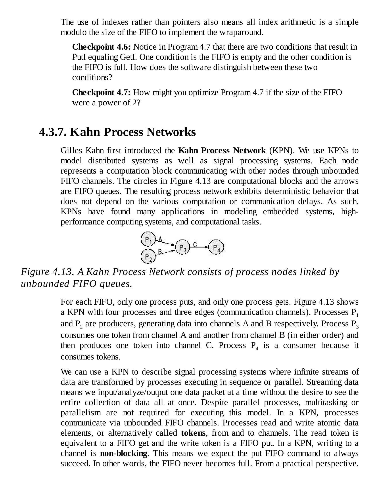
*Description*: Technical schematic and block diagram illustrating circuit operation, signal pathways, and functional behavior for Figure 4.13: A Kahn Process Network consists of process nodes linked by.

> **Figure 4.13: A Kahn Process Network consists of process nodes linked by**

unbounded FIFO queues.
For each FIFO, only one process puts, and only one process gets. Figure 4.13 shows
a KPN with four processes and three edges (communication channels). Processes P1

```assembly
and P2 are producers, generating data into channels A and B respectively. Process P3
```

consumes one token from channel A and another from channel B (in either order) and
then produces one token into channel C. Process P4 is a consumer because it
consumes tokens.
We can use a KPN to describe signal processing systems where infinite streams of
data are transformed by processes executing in sequence or parallel. Streaming data
means we input/analyze/output one data packet at a time without the desire to see the
entire collection of data all at once. Despite parallel processes, multitasking or
parallelism are not required for executing this model. In a KPN, processes
communicate via unbounded FIFO channels. Processes read and write atomic data
elements, or alternatively called tokens, from and to channels. The read token is
equivalent to a FIFO get and the write token is a FIFO put. In a KPN, writing to a
channel is non-blocking. This means we expect the put FIFO command to always
succeed. In other words, the FIFO never becomes full. From a practical perspective,


<!-- Page 274 -->
### [PDF Page 274]

we can use KPN modeling for situations where the FIFOs never actually do become
full. Furthermore, the approximate behavior of a system can be still be deemed for
systems where FIFO full errors are infrequent. For these approximations we could
discard data with the FIFO becomes full on a put instead of waiting for there to be
free space in the FIFO.
On the other hand, reading from a channel requires blocking. A process that reads
from an empty channel will stall and can only continue when the channel contains
sufficient data items (tokens). Processes are not allowed to test an input channel for
existence of tokens without consuming them. Given a specific input (token) history
for a process, the process must be deterministic so that it always produces the same
outputs (tokens). Timing or execution order of processes must not affect the result and
therefore testing input channels for tokens is forbidden.
In order to optimize execution some KPNs do allow testing input channels for
emptiness as long as it does not affect outputs. It can be beneficial and/or possible to
do something in advance rather than wait for a channel. In the example shown in

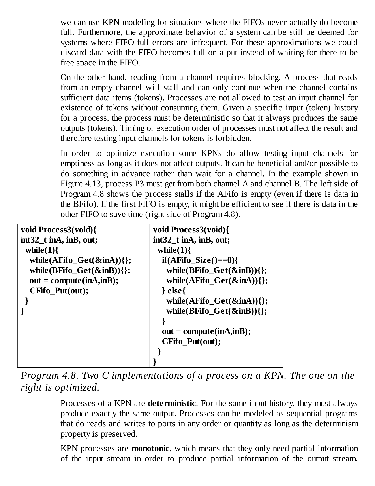
*Description*: Technical schematic and block diagram illustrating circuit operation, signal pathways, and functional behavior for Figure 4.13: , process P3 must get from both channel A and channel B. The left side of.

> **Figure 4.13: , process P3 must get from both channel A and channel B. The left side of**


*Description*: Technical schematic and block diagram illustrating circuit operation, signal pathways, and functional behavior for Program 4.8: shows the process stalls if the AFifo is empty (even if there is data in.

> **Program 4.8: shows the process stalls if the AFifo is empty (even if there is data in**

the BFifo). If the first FIFO is empty, it might be efficient to see if there is data in the
other FIFO to save time (right side of Program 4.8).

```c
void Process3(void){
int32_t inA, inB, out;
while(1){
while(AFifo_Get(&inA)){};
while(BFifo_Get(&inB)){};
out = compute(inA,inB);
CFifo_Put(out);
}
}
```


```c
void Process3(void){
int32_t inA, inB, out;
while(1){
if(AFifo_Size()==0){
while(BFifo_Get(&inB)){};
while(AFifo_Get(&inA)){};
} else{
while(AFifo_Get(&inA)){};
while(BFifo_Get(&inB)){};
}
out = compute(inA,inB);
CFifo_Put(out);
}
}
```


*Description*: Technical schematic and block diagram illustrating circuit operation, signal pathways, and functional behavior for Program 4.8: Two C implementations of a process on a KPN. The one on the.

> **Program 4.8: Two C implementations of a process on a KPN. The one on the**

right is optimized.
Processes of a KPN are deterministic. For the same input history, they must always
produce exactly the same output. Processes can be modeled as sequential programs
that do reads and writes to ports in any order or quantity as long as the determinism
property is preserved.
KPN processes are monotonic, which means that they only need partial information
of the input stream in order to produce partial information of the output stream.


<!-- Page 275 -->
### [PDF Page 275]

Monotonicity allows parallelism. In a KPN there is a total order of events inside a
signal. However, there is no order relation between events in different signals. Thus,
KPNs are only partially ordered, which classifies them as an untimed model.


<!-- Page 276 -->
### [PDF Page 276]

4.4. Thread sleeping
Sometimes a thread needs to wait for a fixed amount of time. We will implement
an OS_Sleep  function that will make a thread dormant for a finite time. A thread in
the sleep state will not be run. After the prescribed amount of time, the OS will
make the thread active again. Sleeping would be used for tasks which are not real-
time. In Program 4.9, the PeriodicStuff  is run approximately once a second.

```c
void Task(void){
InitializationStuff();
while(1){
PeriodicStuff();
OS_Sleep(ONE_SECOND); // go to sleep for 1 second
}
}
```


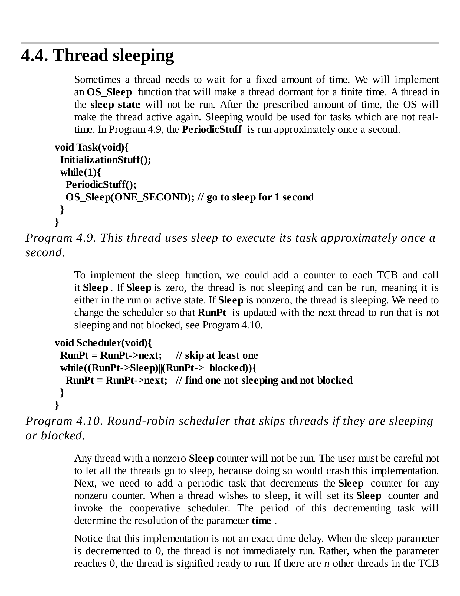
*Description*: Technical schematic and block diagram illustrating circuit operation, signal pathways, and functional behavior for Program 4.9: This thread uses sleep to execute its task approximately once a.

> **Program 4.9: This thread uses sleep to execute its task approximately once a**

second.
To implement the sleep function, we could add a counter to each TCB and call
it Sleep . If Sleep is zero, the thread is not sleeping and can be run, meaning it is
either in the run or active state. If Sleep is nonzero, the thread is sleeping. We need to
change the scheduler so that RunPt  is updated with the next thread to run that is not
sleeping and not blocked, see Program 4.10.

```c
void Scheduler(void){
RunPt = RunPt->next;     // skip at least one
while((RunPt->Sleep)||(RunPt->  blocked)){
RunPt = RunPt->next;   // find one not sleeping and not blocked
}
}
```


*Description*: Hardware pinout and board interface diagram mapping microcontroller pins, BoosterPack headers, switches, LEDs, and physical connectors for Program 4.10: Round-robin scheduler that skips threads if they are sleeping.

> **Program 4.10: Round-robin scheduler that skips threads if they are sleeping**

or blocked.
Any thread with a nonzero Sleep counter will not be run. The user must be careful not
to let all the threads go to sleep, because doing so would crash this implementation.
Next, we need to add a periodic task that decrements the Sleep  counter for any
nonzero counter. When a thread wishes to sleep, it will set its Sleep  counter and
invoke the cooperative scheduler. The period of this decrementing task will
determine the resolution of the parameter time .
Notice that this implementation is not an exact time delay. When the sleep parameter
is decremented to 0, the thread is not immediately run. Rather, when the parameter
reaches 0, the thread is signified ready to run. If there are n other threads in the TCB


<!-- Page 277 -->
### [PDF Page 277]

list and the thread switch time is Δt, then it may take an additional n*Δt time for the
thread to be launched after it awakens from sleeping.


<!-- Page 278 -->
### [PDF Page 278]

4.5. Deadlocks
One of the drawbacks of semaphores is a deadlock. With a deadlock there is a circle
of threads blocked (or spinning) because they are waiting on each other. There are
four necessary conditions for a deadlock to occur.
Mutual exclusion
Hold and wait
No preemption of resources
Circular waiting
Mutual exclusion means one thread will have exclusive access to a resource and
other threads will have to wait if they wish access to the resource. Hold and wait
means a thread is allowed to hold one resource will it waits for another. A deadlock
could be resolved if the operating system could detect the deadlock is about to occur

```assembly
and preempt resources by killing threads and recovering the resources attached to
```

that thread. So, we say a necessary condition for a deadlock to occur is that the OS
does not support preemption of resources. The last and most obvious condition for
a deadlock to occur is circular waiting. Program 4.11 shows three threads that share
three resources SDC, LCD, and CAN. To use a resource, a thread first requests the
resource by waiting on its semaphore, uses the resource, and then releases the
resource by signaling its semaphore.
Thread A
wait(&bLCD);
//1
wait(&bSDC);
//4
use LCD and
SDC
signal(&bSDC);
signal(&bLCD);
Thread B
wait(&bSDC);
//2
wait(&bCAN);
//5
use CAN and
SDC
signal(&bCAN);
signal(&bSDC);
Thread C
wait(&bCAN);
//3
wait(&bLCD);
//6
use CAN and
LCD
signal(&bLCD);
signal(&bCAN);

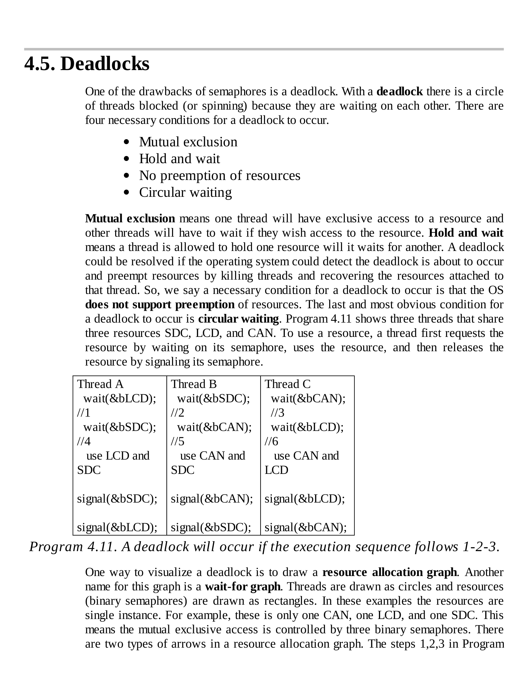
*Description*: Timing waveform and execution flowchart illustrating signal transitions, state machine progression, or algorithm logic for Program 4.11: A deadlock will occur if the execution sequence follows 1-2-3..

> **Program 4.11: A deadlock will occur if the execution sequence follows 1-2-3.**

One way to visualize a deadlock is to draw a resource allocation graph. Another
name for this graph is a wait-for graph. Threads are drawn as circles and resources
(binary semaphores) are drawn as rectangles. In these examples the resources are
single instance. For example, these is only one CAN, one LCD, and one SDC. This
means the mutual exclusive access is controlled by three binary semaphores. There
are two types of arrows in a resource allocation graph. The steps 1,2,3 in Program


<!-- Page 279 -->
### [PDF Page 279]


## 4.11 all successfully return from a wait on a binary semaphore. We signify a thread

possessing a resource using an assignment arrow from the resource to the thread.
The steps 4,5,6 in Program 4.11 all execute a wait on a binary semaphore, but do not
return because the resource is unavailable. We signify a thread waiting for a resource
using a request arrow from the thread to the resource. Notice that a thread can have
at most one request arrow, because once it is spinning or blocked on a semaphore it
will not continue to execute. A closed path in a single-instance resource allocation
graph is an indication that a deadlock has occurred. Figure 4.14 plots the resource
allocation graph occurring if the example in Program 4.11 executes steps 1,2,3,4,5,6.

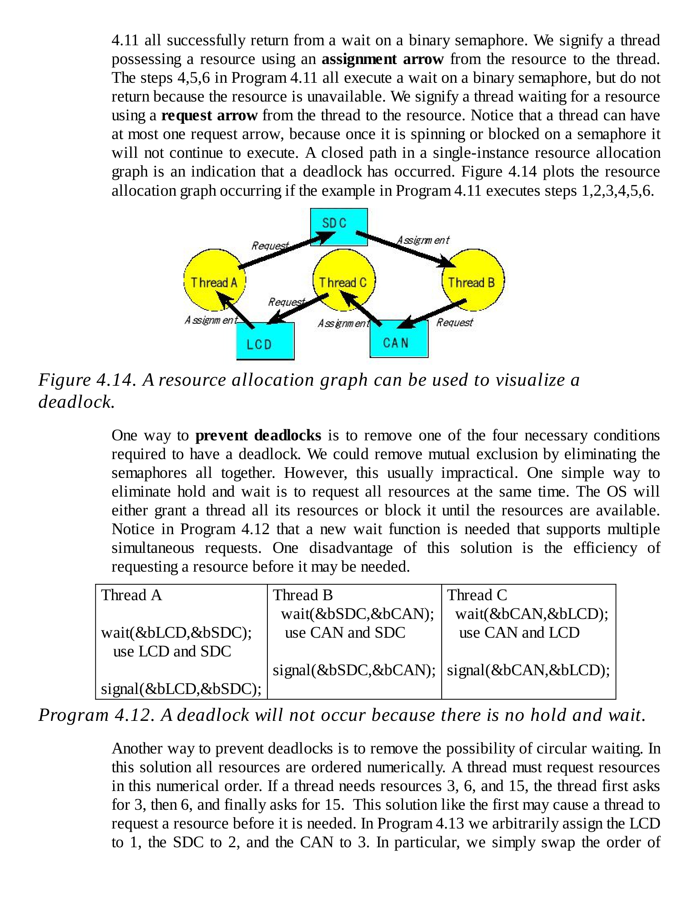
*Description*: Technical schematic and block diagram illustrating circuit operation, signal pathways, and functional behavior for Figure 4.14: A resource allocation graph can be used to visualize a.

> **Figure 4.14: A resource allocation graph can be used to visualize a**

deadlock.
One way to prevent deadlocks is to remove one of the four necessary conditions
required to have a deadlock. We could remove mutual exclusion by eliminating the
semaphores all together. However, this usually impractical. One simple way to
eliminate hold and wait is to request all resources at the same time. The OS will
either grant a thread all its resources or block it until the resources are available.
Notice in Program 4.12 that a new wait function is needed that supports multiple
simultaneous requests. One disadvantage of this solution is the efficiency of
requesting a resource before it may be needed.
Thread A
wait(&bLCD,&bSDC);
use LCD and SDC
signal(&bLCD,&bSDC);
Thread B
wait(&bSDC,&bCAN);
use CAN and SDC
signal(&bSDC,&bCAN);
Thread C
wait(&bCAN,&bLCD);
use CAN and LCD
signal(&bCAN,&bLCD);


*Description*: Technical schematic and block diagram illustrating circuit operation, signal pathways, and functional behavior for Program 4.12: A deadlock will not occur because there is no hold and wait..

> **Program 4.12: A deadlock will not occur because there is no hold and wait.**

Another way to prevent deadlocks is to remove the possibility of circular waiting. In
this solution all resources are ordered numerically. A thread must request resources
in this numerical order. If a thread needs resources 3, 6, and 15, the thread first asks
for 3, then 6, and finally asks for 15.  This solution like the first may cause a thread to
request a resource before it is needed. In Program 4.13 we arbitrarily assign the LCD
to 1, the SDC to 2, and the CAN to 3. In particular, we simply swap the order of


<!-- Page 280 -->
### [PDF Page 280]

requesting in Thread 3 to conform to the numerical order and the possibility of
deadlock is removed.
Thread A
wait(&bLCD);
wait(&bSDC);
use LCD and
SDC
signal(&bSDC);
signal(&bLCD);
Thread B
wait(&bSDC);
wait(&bCAN);
use CAN and
SDC
signal(&bCAN);
signal(&bSDC);
Thread C
wait(&bLCD);
wait(&bCAN);
use CAN and
LCD
signal(&bLCD);
signal(&bCAN);

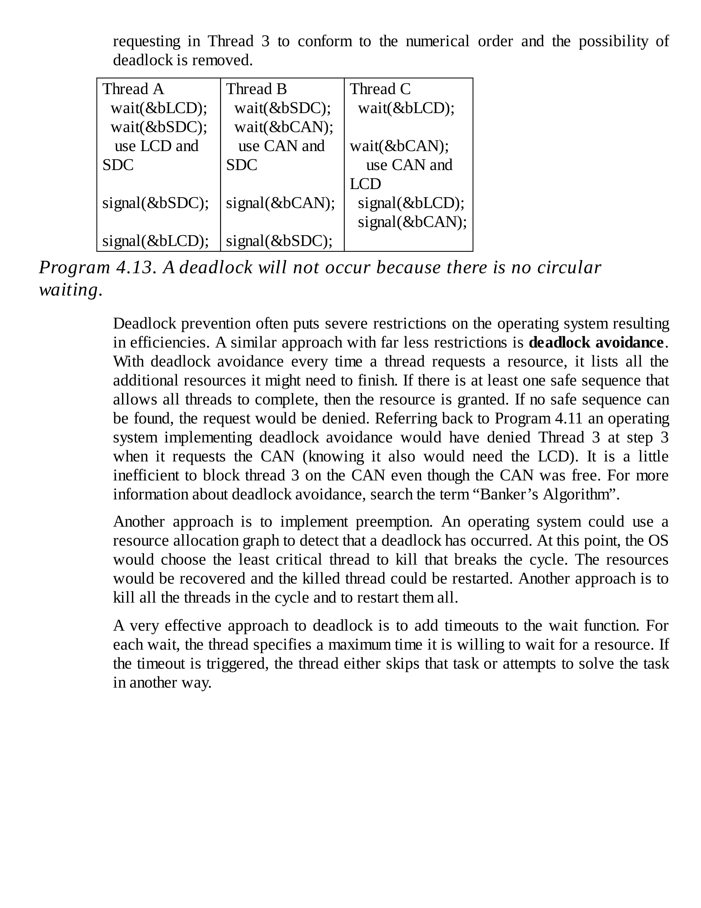
*Description*: Technical schematic and block diagram illustrating circuit operation, signal pathways, and functional behavior for Program 4.13: A deadlock will not occur because there is no circular.

> **Program 4.13: A deadlock will not occur because there is no circular**

waiting.
Deadlock prevention often puts severe restrictions on the operating system resulting
in efficiencies. A similar approach with far less restrictions is deadlock avoidance.
With deadlock avoidance every time a thread requests a resource, it lists all the
additional resources it might need to finish. If there is at least one safe sequence that
allows all threads to complete, then the resource is granted. If no safe sequence can
be found, the request would be denied. Referring back to Program 4.11 an operating
system implementing deadlock avoidance would have denied Thread 3 at step 3
when it requests the CAN (knowing it also would need the LCD). It is a little
inefficient to block thread 3 on the CAN even though the CAN was free. For more
information about deadlock avoidance, search the term “Banker’s Algorithm”.
Another approach is to implement preemption. An operating system could use a
resource allocation graph to detect that a deadlock has occurred. At this point, the OS
would choose the least critical thread to kill that breaks the cycle. The resources
would be recovered and the killed thread could be restarted. Another approach is to
kill all the threads in the cycle and to restart them all.
A very effective approach to deadlock is to add timeouts to the wait function. For
each wait, the thread specifies a maximum time it is willing to wait for a resource. If
the timeout is triggered, the thread either skips that task or attempts to solve the task
in another way.


<!-- Page 281 -->
### [PDF Page 281]

4.6. Monitors
Semaphores are rich but low-level mechanism for synchronization. Semaphores are
powerful, but when used incorrectly they can cause deadlocks and crashes. Monitors
are a higher-level synchronization mechanism because proper use is enforced.
Monitors can be developed to solve any of the applications presented in the previous
section.
Semaphores are essentially shared global variables, which can be accessed
anywhere in the software system by calling wait or signal. There is no formal
connection between the semaphore and the data being controlled by the semaphore.
Semaphores enforce no control or have any guarantee of proper usage. A monitor
will encapsulate the data with synchronization mechanisms to access the data. A
monitor defines a lock and zero or more condition variables for managing concurrent
access to shared data. The monitor uses the lock to insure that only a single thread is
active in the monitor at any instance. The lock also provides mutual exclusion for
shared data. Condition variables enable threads to go to sleep inside of critical
sections, by releasing their lock at the same time it puts the thread to sleep.
A monitor encapsulates protected data with synchronization. A thread acquires the
mutex at the start by accessing the lock. Once granted acquiring the lock, the thread
operates on the shared data. If the thread cannot complete, it will temporarily release
the mutex, leaving the data in a consistent state. It will need to reacquire when it can
continue. When complete the thread releases the mutex and exits the monitor.
A condition variable is a queue of threads waiting for something inside a critical
section. Condition variables support three operations: Wait , Signal and Broadcast .
Although monitors use functions called Wait and Signal , these are not the same
operations as semaphores. The Wait  function takes a lock parameter. In an atomic
fashion it will either acquire the lock or go to sleep. When the process wakes up, it
attempts to reacquire the lock.The Signal  function wakes up a waiting thread, if one
exists. Otherwise, it does nothing.The Broadcast  function will wake up all waiting
threads. A thread must hold the lock when doing condition variable operations.
To illustrate the concept, we will design a FIFO using a monitor for synchronization.
This implementation handles the empty condition, but assumes the FIFO is never
full.This FIFO has two public functions, Put() , which enters data into the FIFO,

```assembly
and Get() , which is used to extract data from the FIFO. There is a private lock,
```

called Lock. Private means the lock cannot be accessed outside of the monitor. The
FIFO of course also has private data, which is the queue. All access to the FIFO
requires capturing the lock. If a thread finds the lock unavailable it will spin or block
or sleep. It will attempt to reacquirethe lock. After acquiring the lock,
the Put operation will enter the item onto the queue, signal the conditionVar, and then
release the lock. The conditionVar->Signal operation will wake up a thread


<!-- Page 282 -->
### [PDF Page 282]

currently sleeping on the conditionVar . If there areno sleeping threads,
then Signal has no action. Compare this to a semaphore Signal , which will increment
its counter regardless of whether or not any consumer threads are waiting for data.
The operation Get  must all acquire the lock before proceeding. If the FIFO is empty,
the thread will wait for data by releasing the lock and go to sleep. Notice that this
thread is not holding any resources will it waits. When the sleeping thread awakens,
it must attempt to reacquire the lock before proceeding to step 3 where data is
removed from the queue.
Put(item)
1) lock->Acquire();
2) put item on queue;
3) conditionVar->Signal();
4) lock->Release();
Get()
1) lock->Acquire();
2) while queue is empty
conditionVar->Wait(lock);
3) remove item from queue;
4) lock->Release();
5) return item;
Condition variables do not have any history, but semaphores do. When Signal  is
executed, if no thread is waiting, the signal is a no-op. If a thread executes Wait , it
waits. The wait and signal functions of a semaphore are commutative; the result is the
same regardless of the order of execution. In other words, if one thread calls a
semaphore wait and another thread calls a semaphore signal, the result is the same
regardless of the order of execution. Condition variables are not commutative. In
other words, the order of execution matters. Therefore, all access to the Signal and
Wait functions of a condition variable must require acquiring a lock.
There are two flavors of monitors that differ in the scheduling semantics of the
function signal. With a Hoare monitor the signal function immediately switches from
the thread that called signal to a waiting thread. The condition that the waiting thread
was anticipating is guaranteed to hold when waiting thread executes. The thread that
called Signal must make sure the data is in a consistent state before signaling. With a
Mesa monitor, as implemented in Java, the function signal places a thread on the
ready queue, but thread that called signal continues inside monitor. This means when
the awaken thread eventually runs, the condition is not necessarily true. In a Mesa
monitor after returning from a wait, the thread only knows something as changed.
Hoare wait

```c
if(FIFO empty)
```

wait(condition)
Mesa wait

```c
while(FIFO empty)
```

wait(condition)


<!-- Page 283 -->
### [PDF Page 283]

4.7. Fixed Scheduling
In the round robin scheduler of the previous chapter, the threads were run one at a
time and each was given the same time slice. When using semaphores the thread
scheduler dynamically runs or blocks threads depending on conditions at that time.
There is another application of thread scheduling sometimes found in real-time
embedded systems, which involves a fixed scheduler.  In this scheduler, the thread
sequence and the allocated time-slices are determined a priori, during the design
phase of the project. This class of problems is like creating the city bus schedule,
managing a construction project, or routing packages through a warehouse. Because
of this analogy, one would expect fundament principles of managing a construction
project will apply to the design of a fixed scheduler. It is important to have accurate
data about the tasks in advance; we should build slack into the plan expecting delays

```assembly
and anticipating problems; “just in time” where tasks are performed when they are
```

actually needed. First, we create a list of tasks to perform
1. Assigning a priority to each task,
2. Defining the resources required for each task,
3. Determining how often each task is to run, and
4. Estimating how long each task will require to complete.
Next, we compare resources required to run versus the available resources at each
point. Since this chapter deals with time management, the only resource we will
consider here is processor cycles.  In more complex systems, we could consider
other resources like memory, necessary data, and I/O channels. For real-time tasks
we want to guarantee performance, so we must consider the worst case estimate of
how long each task will take, so the schedule can be achieved 100% of the time. On
the other hand, if it is acceptable to meet the scheduling requirement most of the time,
we could consider the average time it takes to perform each task. Lastly, we schedule
the run times for each tasks by assigning times for the highest priority tasks first, then
shuffle the assignments like placing pieces in a puzzle until all real-time tasks are
scheduled as required. The tasks that are not real-time can be scheduled in the
remaining slots. If all real-time tasks cannot be scheduled, then a faster
microcontroller will be required. The design of this type of fixed scheduler is
illustrated with a design example, Figure 4.15.


<!-- Page 284 -->
### [PDF Page 284]


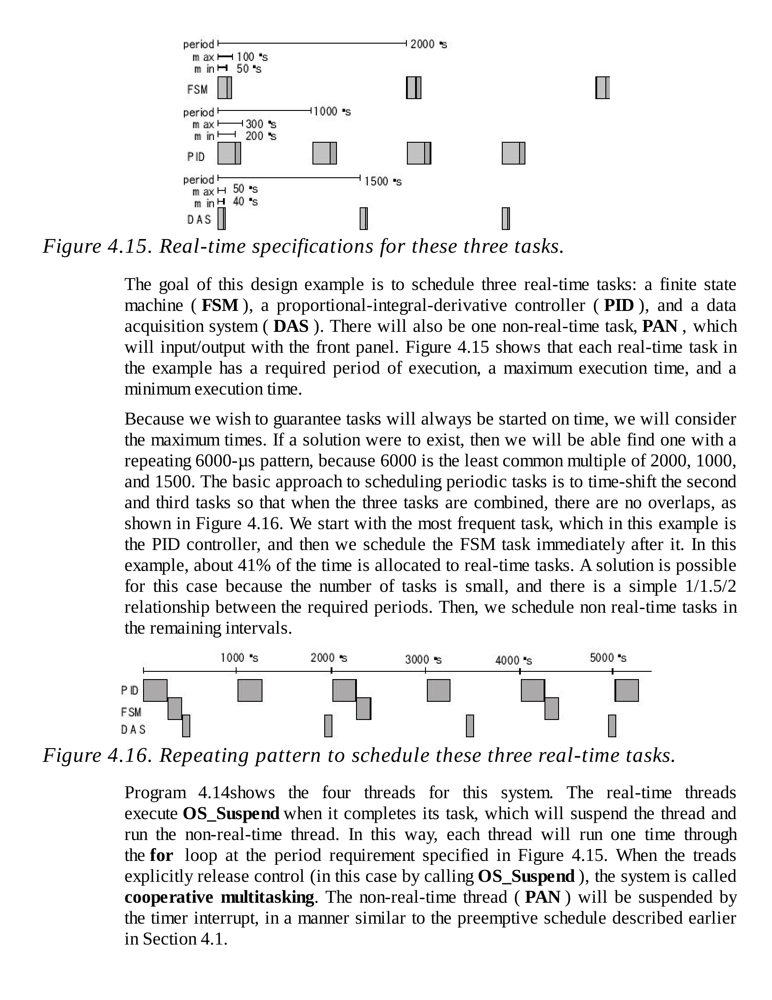
*Description*: Technical schematic and block diagram illustrating circuit operation, signal pathways, and functional behavior for Figure 4.15: Real-time specifications for these three tasks..

> **Figure 4.15: Real-time specifications for these three tasks.**

The goal of this design example is to schedule three real-time tasks: a finite state
machine ( FSM ), a proportional-integral-derivative controller ( PID ), and a data
acquisition system ( DAS ). There will also be one non-real-time task, PAN , which
will input/output with the front panel. Figure 4.15 shows that each real-time task in
the example has a required period of execution, a maximum execution time, and a
minimum execution time.
Because we wish to guarantee tasks will always be started on time, we will consider
the maximum times. If a solution were to exist, then we will be able find one with a
repeating 6000-µs pattern, because 6000 is the least common multiple of 2000, 1000,

```assembly
and 1500. The basic approach to scheduling periodic tasks is to time-shift the second
and third tasks so that when the three tasks are combined, there are no overlaps, as
```

shown in Figure 4.16. We start with the most frequent task, which in this example is
the PID controller, and then we schedule the FSM task immediately after it. In this
example, about 41% of the time is allocated to real-time tasks. A solution is possible
for this case because the number of tasks is small, and there is a simple 1/1.5/2
relationship between the required periods. Then, we schedule non real-time tasks in
the remaining intervals.


*Description*: Technical schematic and block diagram illustrating circuit operation, signal pathways, and functional behavior for Figure 4.16: Repeating pattern to schedule these three real-time tasks..

> **Figure 4.16: Repeating pattern to schedule these three real-time tasks.**


*Description*: Technical schematic and block diagram illustrating circuit operation, signal pathways, and functional behavior for Program 4.14: shows the four threads for this system. The real-time threads.

> **Program 4.14: shows the four threads for this system. The real-time threads**

execute OS_Suspend when it completes its task, which will suspend the thread and
run the non-real-time thread. In this way, each thread will run one time through
the for  loop at the period requirement specified in Figure 4.15. When the treads
explicitly release control (in this case by calling OS_Suspend ), the system is called
cooperative multitasking. The non-real-time thread ( PAN ) will be suspended by
the timer interrupt, in a manner similar to the preemptive schedule described earlier
in Section 4.1.


<!-- Page 285 -->
### [PDF Page 285]


```c
void FSM(void){ StatePtr Pt;   uint8_t in;
Pt = SA;                 // Initial State
for(;;) {
OS_Suspend();          // Runs every 2ms
Port_Out(Pt->Out);     // Output depends on the current state
in = Port_In();
Pt = Pt->Next[in];     // Next state depends on the input
}
}
void PID(void){ uint8_t speed,power;
PID_Init();              // Initialize
for(;;) {
OS_Suspend();          // Runs every 1ms
speed = PID_In();      // read tachometer
power = PID_Calc(speed);
PID_Out(power);        // adjust power to motor
}
}
void DAS(void){ uint8_t raw;
DAS_Init();            // Initialize
for(;;) {
OS_Suspend();        // Runs every 1.5ms
raw = DAS_In();      // read ADC
Result = DAS_Calc(raw);
}
}
void PAN(void){ uint8_t input;
PAN_Init();            // Initialize
for(;;) {
input = PAN_In();    // front panel input
if(input){
PAN_Out(input);    // process
}
}
}
```


*Description*: Technical schematic and block diagram illustrating circuit operation, signal pathways, and functional behavior for Program 4.14: Four user threads (FixedScheduler_xxx)..

> **Program 4.14: Four user threads (FixedScheduler_xxx).**


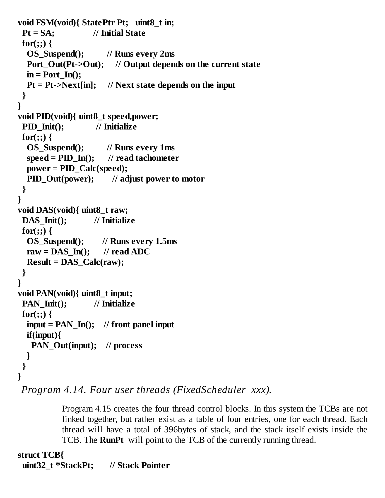
*Description*: Technical schematic and block diagram illustrating circuit operation, signal pathways, and functional behavior for Program 4.15: creates the four thread control blocks. In this system the TCBs are not.

> **Program 4.15: creates the four thread control blocks. In this system the TCBs are not**

linked together, but rather exist as a table of four entries, one for each thread. Each
thread will have a total of 396bytes of stack, and the stack itself exists inside the
TCB. The RunPt  will point to the TCB of the currently running thread.

```c
struct TCB{
uint32_t *StackPt;       // Stack Pointer
```


<!-- Page 286 -->
### [PDF Page 286]


```c
uint32_t MoreStack[83];  // 396 bytes of stack
uint32_t InitialReg[14]; // R4-R11,R0-R3,R12,R14
uint32_t InitialPC;      // pointer to program to execute
uint32_t InitialPSR;     // 0x01000000
};
typedef struct TCB TCBType;
TCBType *RunPt;            // thread currently running
```

#define TheFSM &sys[0]     // finite state machine
#define ThePID &sys[1]     // proportional-integral-derivative
#define TheDAS &sys[2]     // data acquisition system
#define ThePAN &sys[3]     // front panel
TCBType sys[4]={
{ &sys[0].InitialReg[0],{ 0}, (uint32_t) FSM, 0x01000000},
{ &sys[1].InitialReg[0],{ 0}, (uint32_t) PID, 0x01000000},
{ &sys[2].InitialReg[0],{ 0}, (uint32_t) DAS, 0x01000000},
{ &sys[3].InitialReg[0],{ 0}, (uint32_t) PAN, 0x01000000}
};

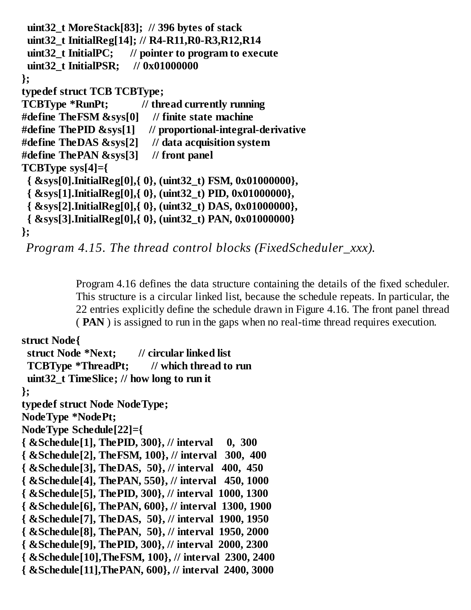
*Description*: Technical schematic and block diagram illustrating circuit operation, signal pathways, and functional behavior for Program 4.15: The thread control blocks (FixedScheduler_xxx)..

> **Program 4.15: The thread control blocks (FixedScheduler_xxx).**


*Description*: Technical schematic and block diagram illustrating circuit operation, signal pathways, and functional behavior for Program 4.16: defines the data structure containing the details of the fixed scheduler..

> **Program 4.16: defines the data structure containing the details of the fixed scheduler.**

This structure is a circular linked list, because the schedule repeats. In particular, the
22 entries explicitly define the schedule drawn in Figure 4.16. The front panel thread
( PAN ) is assigned to run in the gaps when no real-time thread requires execution.

```c
struct Node{
struct Node *Next;        // circular linked list
TCBType *ThreadPt;        // which thread to run
uint32_t TimeSlice; // how long to run it
};
typedef struct Node NodeType;
NodeType *NodePt;
NodeType Schedule[22]={
{ &Schedule[1], ThePID, 300}, // interval     0,  300
{ &Schedule[2], TheFSM, 100}, // interval   300,  400
{ &Schedule[3], TheDAS,  50}, // interval   400,  450
{ &Schedule[4], ThePAN, 550}, // interval   450, 1000
{ &Schedule[5], ThePID, 300}, // interval  1000, 1300
{ &Schedule[6], ThePAN, 600}, // interval  1300, 1900
{ &Schedule[7], TheDAS,  50}, // interval  1900, 1950
{ &Schedule[8], ThePAN,  50}, // interval  1950, 2000
{ &Schedule[9], ThePID, 300}, // interval  2000, 2300
{ &Schedule[10],TheFSM, 100}, // interval  2300, 2400
{ &Schedule[11],ThePAN, 600}, // interval  2400, 3000
```


<!-- Page 287 -->
### [PDF Page 287]

{ &Schedule[12],ThePID, 300}, // interval  3000, 3300
{ &Schedule[13],ThePAN, 100}, // interval  3300, 3400
{ &Schedule[14],TheDAS,  50}, // interval  3400, 3450
{ &Schedule[15],ThePAN, 550}, // interval  3450, 4000
{ &Schedule[16],ThePID, 300}, // interval  4000, 4300
{ &Schedule[17],TheFSM, 100}, // interval  4300, 4400
{ &Schedule[18],ThePAN, 500}, // interval  4400, 4900
{ &Schedule[19],TheDAS,  50}, // interval  4900, 4950
{ &Schedule[20],ThePAN,  50}, // interval  4950, 5000
{ &Schedule[21],ThePID, 300}, // interval  5000, 5300
{ &Schedule[0], ThePAN, 700}  // interval  5300, 6000
};

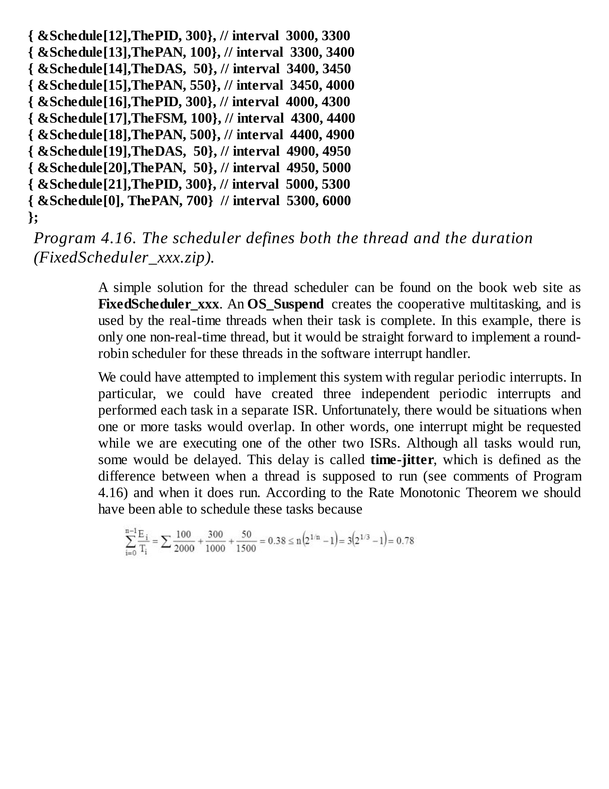
*Description*: Technical schematic and block diagram illustrating circuit operation, signal pathways, and functional behavior for Program 4.16: The scheduler defines both the thread and the duration.

> **Program 4.16: The scheduler defines both the thread and the duration**

(FixedScheduler_xxx.zip).
A simple solution for the thread scheduler can be found on the book web site as
FixedScheduler_xxx. An OS_Suspend  creates the cooperative multitasking, and is
used by the real-time threads when their task is complete. In this example, there is
only one non-real-time thread, but it would be straight forward to implement a round-
robin scheduler for these threads in the software interrupt handler.
We could have attempted to implement this system with regular periodic interrupts. In
particular, we could have created three independent periodic interrupts and
performed each task in a separate ISR. Unfortunately, there would be situations when
one or more tasks would overlap. In other words, one interrupt might be requested
while we are executing one of the other two ISRs. Although all tasks would run,
some would be delayed. This delay is called time-jitter, which is defined as the
difference between when a thread is supposed to run (see comments of Program
4.16) and when it does run. According to the Rate Monotonic Theorem we should
have been able to schedule these tasks because


<!-- Page 288 -->
### [PDF Page 288]

4.8. Exercises

## 4.1 For each of the following terms give a definition in 16 words or less

a) active
b) atomic
c) blocked
d) bounded buffer
e) bounded waiting
f) critical section
g) deadlock
h) hook
i) nonreentrant
j) path expression
k) sleeping
l) normalized mean
response time
m) preemptive
scheduler
n) producer-consumer
o) reentrant
p) rendezvous
q) round robin
scheduler
r) spin lock

## 4.2 Consider the queue of people waiting in line at the bank. How can Little’s

Theorem be used to measure the average time a person spends in the bank (time
waiting plus time being served).

## 4.3 Consider situation of cars traveling across a bridge. Typically, 10 cars/sec arrive

at the bridge. On a sunny day it takes 10 seconds to cross the bridge. Use Little’s
Theorem explain what happens on a rainy day when now it takes 100 seconds to
cross the bridge.

## 4.4 Use Little’s Theorem to explain why a fast food restaurant requires a smaller

dining room than a regular restaurant even though they the same customer arrival rate.

## 4.5 If a thread is blocked because the output display is not available, when should

you wake it up (signal it)?

## 4.6 You have three tasks. Task 1 takes a maximum of 1 ms to execute and runs every

10 ms. Task 2 takes a maximum of 0.5 ms to execute and runs every 1 ms. Task 3
takes a maximum of 1 ms to execute and runs every 100 ms. Do you think a
scheduling algorithm exists? Justify your answer.

## 4.7 Consider a problem of running three foreground threads using a preemptive

scheduler with semaphore synchronization. Each thread has a central body()
containing code that should be executed together. The basic shell of this system is
given. Define one or more semaphores, then add semaphore function calls to
implement a three-thread rendezvous. Basically, each time through the while loop,
the first two threads to finish their start() code will wait for the last thread to finish
its start() code. Then, all three threads will be active at the same time as they
execute their corresponding body(). You may call any if the semaphore functions
defined in this book. You will allocate one or more semaphores and add calls to
semaphore functions, otherwise no other changes are allowed.  You may assume


<!-- Page 289 -->
### [PDF Page 289]

thread1 runs first. For each semaphore you add, explain what it means to be 0, 1 etc.

```c
void thread1(void){
init1();
while(1){
start1();
body1();
end1();
}
}
void thread2(void){
init2();
while(1){
start2();
body2();
end2();
}
}
void thread3(void){
init3();
while(1){
start3();
body3();
end3();
}
}
```


## 4.8 Consider a problem of deadlocks that can occur with semaphore synchronization.

The following is a classic example that might occur if two threads need both the disk

```assembly
and the printer. In this example, the disk has a binary semaphore DiskFree , which is
```

1 if the disk is available, and similarly the printer has a binary
semaphore PrinterFree , which is 1 if the printer is available. A deadlock occurs if
each thread gets one resource then waits (on each other) for the other resource. In this
example, we assume there is one disk and one printer.

```c
void thread1(void){
OS_bWait(&DiskFree);
OS_bWait(&PrinterFree);
```

// use disk and printer
OS_bSignal(&DiskFree);
OS_bSignal(&PrinterFree);
}

```c
void thread2(void){
OS_bWait(&PrinterFree);
OS_bWait(&DiskFree);
```

// use printer and disk
OS_bSignal(&PrinterFree);
OS_bSignal(&DiskFree);
}
In this problem we will develop a graphical method (called a resource allocation
graph) to visualize/recognize the deadlock. Draw each thread in your system as an
oval, and each binary semaphore as a rectangle. If a thread calls OS_bWait  and
returns, then draw an arrow (called an allocation edge) from the semaphore to the
thread. An arrow from a semaphore to a thread means that thread owns the resource.
If a thread calls OS_bSignal , then erase the previously drawn allocation edge. If a
thread calls OS_bWait  and spins or blocks because the semaphore is not free, then
draw an arrow from the thread to the semaphore (called a request edge). An arrow
from a thread to a semaphore means that thread is waiting for the resource associated
with the semaphore.
a) Draw the resource allocation graph that occurs with the deadlock sequence
1) thread1 executes OS_bWait(&DiskFree);
2) thread2 executes OS_bWait(&PrinterFree);
3) thread2 executes OS_bWait(&DiskFree);
4) thread1 executes OS_bWait(&PrinterFree);
b) This method can be generalized to detect that a deadlock has occurred with an


<!-- Page 290 -->
### [PDF Page 290]

arbitrary number of binary semaphores and threads. What shape in the resource
allocation graph defines a deadlock? In other words, generalize the use of this
method such that you can claim
“There is a deadlock if and only if the resource allocation graph contains a shape
in the form of a ______________________”.
c) Justify your answer by giving a deadlock example with three threads and three
binary semaphores. In particular, give 1) the C code; 2) the execution sequence; 3)
the resource allocation graph

## 4.9 You are given three identical I/O ports to manage on the LM3S/TM4C, PortF,

PortG, and PortH.  You may assume there is a preemptive thread scheduler and
blocking semaphores.
a) Look up the address of each port and its direction register.
b) Create a data structure to hold an address of the port and the address of the data
direction register. Assume the type of this structure is called PortType .
c) Design and implement a manager that supports two functions. The first function is
called NewPort . Its prototype is
PortType *NewPort(void);
If a port is available when a thread calls NewPort , then a pointer to the structure,
defined in part b) is returned. If no port is available, then the thread will block. When
a port becomes available this thread will be awakened and the pointer to the

```c
structure will be returned. You may define and use blocking semaphores without
```

showing the implementation of the semaphore or scheduler. The second function is
called FreePort , and its prototype is

```c
void FreePort(PortType *pt);
```

This function returns a port so that it can be used by the other threads. Include a
function that initializes the system, where all five ports are free. Hint: the solution is
very similar to the FIFO queue example shown in Section 4.3.

## 4.10 Consider a system with two LCD message displays in the context of a

preemptive thread schedulerwith blocking semaphores. To display a message, the OS
can call either LCD1_OutString or LCD2_OutString passing it an ASCII string.
These routines have critical sections but must run with interrupts enabled. The
foreground threads will not call LCD1_OutString or LCD2_OutString directly;
rather, the threads call a generic OS routine OS_Display . If an LCD is free,the OS
passes the message to the free LCD. If both LCDs are busy, the thread will block.
There are many threads that wish to display messages, and the threads do not care or
know onto which LCD their message will be displayed.  You are given
the LCD1_OutString or LCD2_OutString  routines, the OS and the blocking
semaphores with the following prototypes.

```c
void LCD1_OutString(char *string); // up to 20ms to complete
void LCD2_OutString(char *string); // up to 20ms to complete
int OS_InitSemaphore(Sema4Type *semaPt, int16_t value);
void OS_Wait(Sema4Type *semaPt);
```


<!-- Page 291 -->
### [PDF Page 291]


```c
void OS_Signal(Sema4Type *semaPt);
```

a) List the semaphores and private global variables needed for your solution. For
each semaphore define what it means and what initial value it should have. Give the
meaning and initial values for any private global variables you need. The threads
will not directly access these semaphores or variables.
b) Write the generic OS display routine that the foreground threads will call (you may
not disable interrupts or call any other functions other than the five functions shown
above)

```c
void OS_Display(char *string){
```


