# Chapter 5: Real-Time Systems

> **Textbook**: Embedded Systems: Real-Time Operating Systems for ARM Cortex-M Microcontrollers  
> **Author**: Jonathan W. Valvano  
> **PDF Page Range**: 292 - 329


---


<!-- Page 292 -->
### [PDF Page 292]

5. Real-time Systems

# Chapter 5 objectives are to:

• Review real-time applications that require priority
• Implement a priority scheduler
• Use the operating system to debounce switches
• Run event threads as high priority main threads
• Review of other real-time operating systems
The key concept in this chapter is the introduction of “priority”, which captures
the relative importance of tasks in a system. Real-time systems in general and
operating systems for real-time systems in particular use priority as a means to
achieve effective performance. First we motivate the need for priority and then
we will show how priority can be incorporated into our simple RTOS. We will
conclude by reviewing how priority is implemented in some of the RTOS
schedulers in popular use.


<!-- Page 293 -->
### [PDF Page 293]

5.1. Data Acquisition Systems
To motivate the need for priority we will discuss some classic real-time system
scenarios like Data Acquisition systems, Digital Signal Processing (DSP), and Real-
Time Control systems. The level of detail provided here is not needed for the course,
but we believe it will give you a context for the kinds of systems you may encounter
as a practitioner in the RTOS domain.
5.1.1. Approach

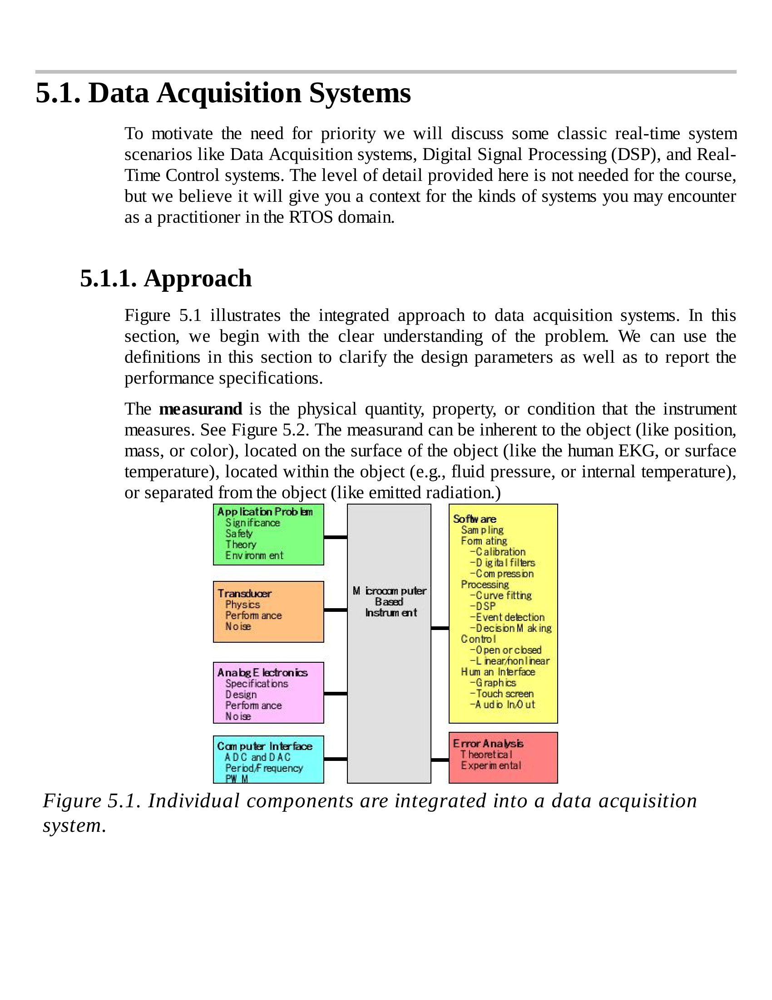
*Description*: Technical schematic and block diagram illustrating circuit operation, signal pathways, and functional behavior for Figure 5.1: illustrates the integrated approach to data acquisition systems. In this.

> **Figure 5.1: illustrates the integrated approach to data acquisition systems. In this**

section, we begin with the clear understanding of the problem. We can use the
definitions in this section to clarify the design parameters as well as to report the
performance specifications.
The measurand is the physical quantity, property, or condition that the instrument
measures. See Figure 5.2. The measurand can be inherent to the object (like position,
mass, or color), located on the surface of the object (like the human EKG, or surface
temperature), located within the object (e.g., fluid pressure, or internal temperature),
or separated from the object (like emitted radiation.)


*Description*: Architectural block diagram detailing logic modules, memory buses, internal registers, and hardware interconnections for Figure 5.1: Individual components are integrated into a data acquisition.

> **Figure 5.1: Individual components are integrated into a data acquisition**

system.


<!-- Page 294 -->
### [PDF Page 294]


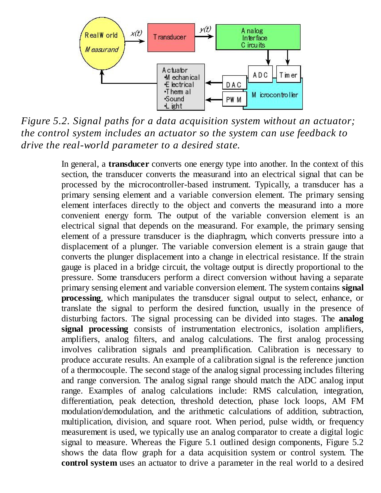
*Description*: Technical schematic and block diagram illustrating circuit operation, signal pathways, and functional behavior for Figure 5.2: Signal paths for a data acquisition system without an actuator;.

> **Figure 5.2: Signal paths for a data acquisition system without an actuator;**

the control system includes an actuator so the system can use feedback to
drive the real-world parameter to a desired state.
In general, a transducer converts one energy type into another. In the context of this
section, the transducer converts the measurand into an electrical signal that can be
processed by the microcontroller-based instrument. Typically, a transducer has a
primary sensing element and a variable conversion element. The primary sensing
element interfaces directly to the object and converts the measurand into a more
convenient energy form. The output of the variable conversion element is an
electrical signal that depends on the measurand. For example, the primary sensing
element of a pressure transducer is the diaphragm, which converts pressure into a
displacement of a plunger. The variable conversion element is a strain gauge that
converts the plunger displacement into a change in electrical resistance. If the strain
gauge is placed in a bridge circuit, the voltage output is directly proportional to the
pressure. Some transducers perform a direct conversion without having a separate
primary sensing element and variable conversion element. The system contains signal
processing, which manipulates the transducer signal output to select, enhance, or
translate the signal to perform the desired function, usually in the presence of
disturbing factors. The signal processing can be divided into stages. The analog
signal processing consists of instrumentation electronics, isolation amplifiers,
amplifiers, analog filters, and analog calculations. The first analog processing
involves calibration signals and preamplification. Calibration is necessary to
produce accurate results. An example of a calibration signal is the reference junction
of a thermocouple. The second stage of the analog signal processing includes filtering

```assembly
and range conversion. The analog signal range should match the ADC analog input
```

range. Examples of analog calculations include: RMS calculation, integration,
differentiation, peak detection, threshold detection, phase lock loops, AM FM
modulation/demodulation, and the arithmetic calculations of addition, subtraction,
multiplication, division, and square root. When period, pulse width, or frequency
measurement is used, we typically use an analog comparator to create a digital logic
signal to measure. Whereas the Figure 5.1 outlined design components, Figure 5.2
shows the data flow graph for a data acquisition system or control system. The
control system uses an actuator to drive a parameter in the real world to a desired


<!-- Page 295 -->
### [PDF Page 295]

value while the data acquisition system has no actuator because it simply measures
the parameter in a nonintrusive manner.
The data conversion element performs the conversion between the analog and
digital domains. This part of the instrument includes: hardware and software
computer interfaces, ADC, DAC, and calibration references. The analog to digital
converter (ADC) converts the analog signal into a digital number. The digital to
analog converter (DAC) converts a digital number to an analog output.
In many systems the input could be digital rather than analog. For these systems
measuring period, pulse width, and/or frequency provides a low-cost high-precision
alternative to the traditional ADC. Similarly, the output of the system could be
digital. The pulse width modulator (PWM) is a digital output with a constant
period, but variable duty cycle. The software can adjust the output of the actuator by
setting the duty cycle of the PWM output.
The digital signal processing includes: data acquisition (sampling the signal at a
fixed rate), data formatting (scaling, calibration), data processing (filtering, curve
fitting, FFT, event detection, decision making, analysis), control algorithms (open or
closed loop). The human interface includes the input and output which is available
to the human operator. The advantage of computer-based instrumentation is that,
devices that are sophisticated but easy to use and understand are possible. The inputs
to the instrument can be audio (voice), visual (light pens, cameras), or tactile
(keyboards, touch screens, buttons, switches, joysticks, roller balls). The outputs
from the instrument can be numeric displays, CRT screens, graphs, buzzers, bells,
lights, and voice.
5.1.2. Performance Metrics
Before designing a data acquisition system (DAS) we must have a clear
understanding of the system goals. We can classify system as a Quantitative DAS, if
the specifications can be defined explicitly in terms of desired range (rx), resolution
(∆x), precision (nx), and frequencies of interest (fmin to fmax). If the specifications
are more loosely defined, we classify it as a Qualitative DAS. Examples of
qualitative systems include those which mimic the human senses where the
specifications are defined using terms like “sounds good”, “looks pretty”, and “feels
right.” Other qualitative systems involve the detection of events. We will consider
two examples, a burglar detector, and an instrument to diagnose cancer.  For binary
detection systems like the presence/absence of a burglar or the presence/absence of
cancer, we define a true positive (TP) when the condition exists (there is a burglar)

```assembly
and the system properly detects it (the alarm rings.) We define a false positive (FP)
```

when the condition does not exist (there is no burglar) but the system thinks there is
(the alarm rings.)  A false negative (FN) occurs when the condition exists (there is a
burglar) but the system does not think there is (the alarm is silent.)  A true negative
(TN) occurs when the condition does not exist (the patient does not have cancer) and


<!-- Page 296 -->
### [PDF Page 296]

the system properly detects it (the instrument says the patient is normal.) Prevalence
is the probability the condition exists, sometimes called pre-test probability. In the
case of diagnosing the disease, prevalence tells us what percentage of the population
has the disease.  Sensitivity is the fraction of properly detected events (a burglar
comes and the alarm rings) over the total number of events (number of robberies.) It
is a measure of how well our system can detect an event. For the burglar detector, a
sensitivity of 1 means when a burglar breaks in the alarm will go off. For the
diagnostic instrument, a sensitivity of 1 means every sick patient will get treatment.
Specificity is the fraction of properly handled non-events (a patient doesn’t have
cancer and the instrument claims the patient is normal) over the total number of non-
events (the number of normal patients.) A specificity of 1 means no people will be
treated for a cancer they don’t have. The positive predictive value of a system (PPV)
is the probability that the condition exists when restricted to those cases where the
instrument says it exists. It is a measure of how much we believe the system is
correct when it says it has detected an event. A PPV of 1 means when the alarm rings,
the police will come and arrest a burglar. Similarly, a PPV of 1 means if our
instrument says a patient has the disease, then that patient is sick. The negative
predictive value of a system (NPV) is the probability that the condition does not
exists when restricted to those cases where the instrument says it doesn’t exist. A
NPV of 1 means if our instrument says a patient doesn’t have cancer, then that patient
is not sick. Sometimes the true negative condition doesn’t really exist (how many
times a day does a burglar not show up at your house?) If there are no true negatives,
only sensitivity and PPV are relevant.
Prevalence =  (TP + FN) / (TP + TN + FP + FN)
Sensitivity = TP / (TP + FN)
Specificity = TN / (TN + FP)
PPV
= TP / (TP + FP)
NPV
= TN / (TN + FN)
There are two errors introduced by the sampling process.  Voltage quantizing is
caused by the finite word size of the ADC. The precision is determined by the
number of bits in the ADC. If the ADC has n bits, then the number of distinguishable
alternatives is
nz = 2n
Time quantizing is caused by the finite discrete sampling interval. The Nyquist
Theorem states that if the signal is sampled at fs, then the digital samples only
contain frequency components from 0 to 0.5 fs. Conversely, if the analog signal does
contain frequency components larger than ½ fs, then there will be an aliasing error.
Aliasing is when the digital signal appears to have a different frequency than the
original analog signal. Simply put, if one samples a sine wave at a sampling rate of
fs,


<!-- Page 297 -->
### [PDF Page 297]

V(t) = A sin(2πft + φ)
is it possible to determine A f and φ from the digital samples?  Nyquist Theory says
that if fs is strictly greater than twice f, then one can determine A f and φ from the
digital samples.  In other words, the entire analog signal can be reconstructed from
the digital samples. But if fs less than or equal to f, then one cannot determine A f and
φ.  In this case, the apparent frequency, as predicted by analyzing the digital samples,
will be shifted to a frequency between 0 and ½ fs.
In Figure 5.3, the sampling rate is fixed at 1600 Hz and the signal frequency is
varied. When sampling rate is exactly twice the input frequency, the original signal
may or may not be properly reconstructed. In this specific case, it is frequency shifted
(aliased) to DC and lost. When sampling rate is slower than twice the input
frequency, the original signal cannot be properly reconstructed. It is frequency shifted
(aliased) to a frequency between 0 and ½ fs. In this case the 1500 Hz wave was
aliased to 100 Hz.
100 Hz sine wave (properly sampled)
400 Hz sine wave (properly sampled)
800 Hz sine wave (aliased)
1500 Hz sine wave (aliased)

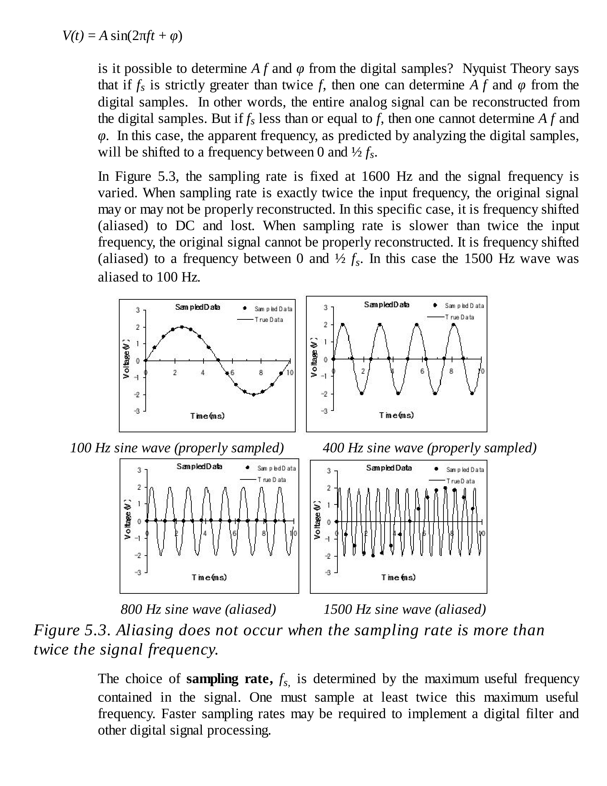
*Description*: Technical schematic and block diagram illustrating circuit operation, signal pathways, and functional behavior for Figure 5.3: Aliasing does not occur when the sampling rate is more than.

> **Figure 5.3: Aliasing does not occur when the sampling rate is more than**

twice the signal frequency.
The choice of sampling rate, fs, is determined by the maximum useful frequency
contained in the signal. One must sample at least twice this maximum useful
frequency. Faster sampling rates may be required to implement a digital filter and
other digital signal processing.


<!-- Page 298 -->
### [PDF Page 298]

fs > 2 fmax
Even though the largest signal frequency of interest is fmax, there may be significant
signal magnitudes at frequencies above fmax. These signals may arise from the input
x, from added noise in the transducer or from added noise in the analog processing.
Once the sampling rate is chosen at fs, then a low pass analog filter may be required
to remove frequency components above ½fs.  A digital filter cannot be used to
remove aliasing.
An interesting question arises: how do we determine the maximum frequency
component in our input? If we know enough about our system, we might be able to
derive an equation to determine the maximum frequency. For example, if a
mechanical system consists of a mass, friction and a spring, then we can write a
differential equation relating the applied force to the position of the object. The
second way to find the maximum frequency component in our signal is to measure it
with a spectrum analyzer.
Valvano Postulate: If fmax is the largest frequency component of the
analog signal, then you must sample more than ten times fmax in order
for the reconstructed digital samples to look like the original signal
when plotted on a voltage versus time graph.
The choice of the ADC precision is a compromise of various factors.  The desired
resolution of the data acquisition system will dictate the number of ADC bits
required.  If the transducer is nonlinear, then the ADC precision must be larger than
the precision specified in the problem statement.  For example, let y be the transducer
output, and let x be the real world signal. Assume for now, that the transducer output
is connected to the ADC input. Let the range of x be rx. Let the range of y be ry.  Let
the required precision of x be nx. The resolutions of x and y are ∆x and ∆y
respectively.  Let the following describe the nonlinear transducer.
y = f(x)
The required ADC precision, ny, (in alternatives) can be calculated by:
∆x =rx/nx
∆y = min {f(x+∆x)-f(x)} for all x in rx
ny = ry/∆y
In general, we wish the analog signal processing to map the full scale range of the
transducer into the full scale range of the ADC. If the ADC precision is N=2n in
alternatives, and the output impedance of the transducer is Rout, then we need an input
impedance larger than N*Rout to avoid loading the signal. We need the analog circuit
to pass the frequencies of interest. When considering noise, we determine the signal


<!-- Page 299 -->
### [PDF Page 299]

equivalent noise. For example, consider a system that measures temperature. If we
wish to consider noise on signal Vout, we calculate the relationship between input
temperature T and the signal Vout. Next, we determine the sensitivity of the signal to
temperature, dVout/dT. If the noise is Vn, then the temperature equivalent noise is
Tn=Vn/(dVout/dT). In general, we wish all equivalent noises to be less than the system
resolution.
An analog low pass filter may be required to remove aliasing. The cutoff of this
analog filter should be less than ½fs. Some transducers automatically remove these
unwanted frequency components. For example, a thermistor is inherently a low pass
device. Other types of filters (analog and digital) may be used to solve the data
acquisition system objective. One useful filter is a 60 Hz bandreject filter.
In order to prevent aliasing, one must know the frequency spectrum of the ADC input
voltage. This information can be measured with a spectrum analyzer. Typically, a
spectrum analyzer samples the analog signal at a very high rate (>1 MHz), performs a
Discrete Fourier Transform (DFT), and displays the signal magnitude versus
frequency. We define z(t) as the input to the ADC. Let |Z(f)| be the magnitude of the
ADC input voltage as a function of frequency. There are 3 regions in the magnitude
versus frequency graph shown in Figure 5.4. We will classify any signal with
amplitude less than the ADC resolution, ∆z, to be undetectable. This region is labeled
“Undetectable”. Undetectable signals cannot cause aliasing regardless of their
frequency.  We will classify any signal with amplitude larger than the ADC resolution
at frequencies less than ½fs to be properly sampled. This region is labeled “Properly
sampled”. It is information in this region that is available to the software for digital
processing. The last region includes signals with amplitude above the ADC
resolution at frequencies greater than or equal to ½fs. Signals in this region will be
aliased, which means their apparent frequencies will be shifted into the 0 to ½fs
range.

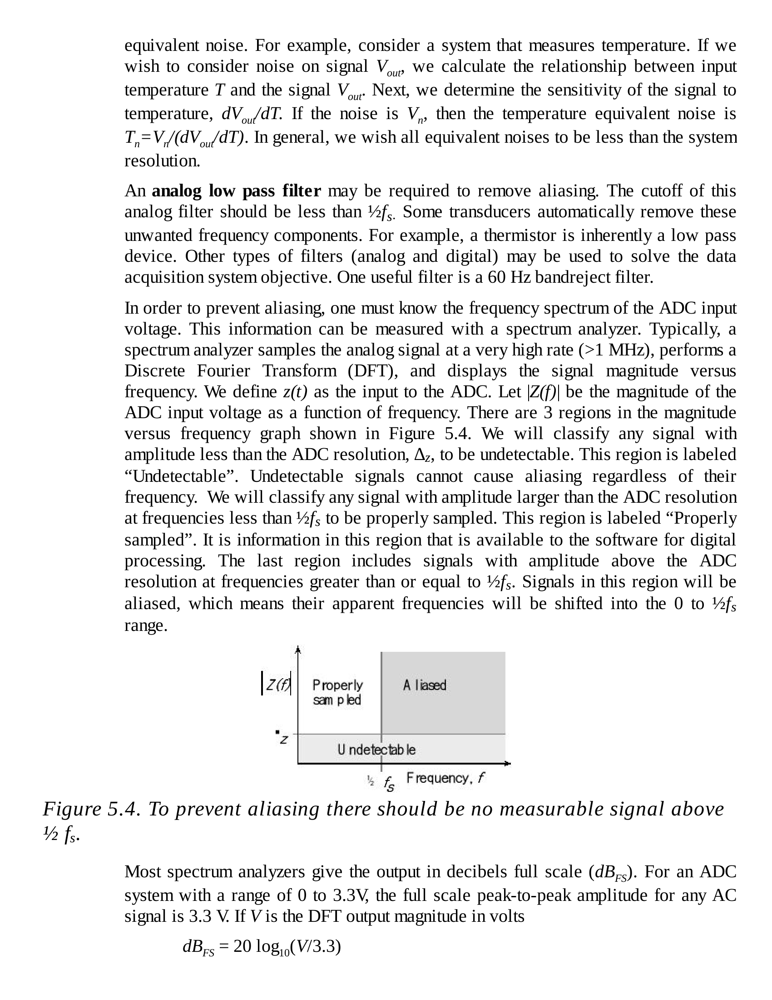
*Description*: Technical schematic and block diagram illustrating circuit operation, signal pathways, and functional behavior for Figure 5.4: To prevent aliasing there should be no measurable signal above.

> **Figure 5.4: To prevent aliasing there should be no measurable signal above**

½ fs.
Most spectrum analyzers give the output in decibels full scale (dBFS). For an ADC
system with a range of 0 to 3.3V, the full scale peak-to-peak amplitude for any AC
signal is 3.3 V. If V is the DFT output magnitude in volts
dBFS = 20 log10(V/3.3)


<!-- Page 300 -->
### [PDF Page 300]


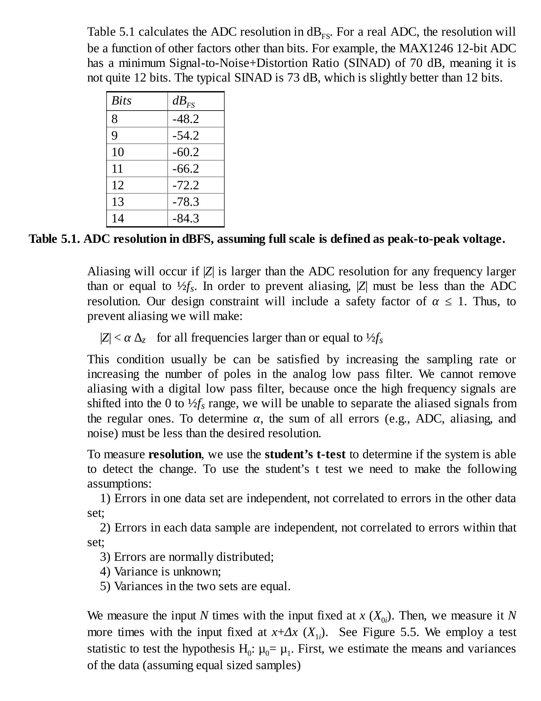
*Description*: Reference table detailing hardware parameters, register bit patterns, performance metrics, or memory configurations for Table 5.1: calculates the ADC resolution in dBFS. For a real ADC, the resolution will.

> **Table 5.1: calculates the ADC resolution in dBFS. For a real ADC, the resolution will**

be a function of other factors other than bits. For example, the MAX1246 12-bit ADC
has a minimum Signal-to-Noise+Distortion Ratio (SINAD) of 70 dB, meaning it is
not quite 12 bits. The typical SINAD is 73 dB, which is slightly better than 12 bits.
Bits
dBFS
8
-48.2
9
-54.2
10
-60.2
11
-66.2
12
-72.2
13
-78.3
14
-84.3


*Description*: Reference table detailing hardware parameters, register bit patterns, performance metrics, or memory configurations for Table 5.1: ADC resolution in dBFS, assuming full scale is defined as peak-to-peak voltage..

> **Table 5.1: ADC resolution in dBFS, assuming full scale is defined as peak-to-peak voltage.**

Aliasing will occur if |Z| is larger than the ADC resolution for any frequency larger
than or equal to ½fs. In order to prevent aliasing, |Z| must be less than the ADC
resolution. Our design constraint will include a safety factor of α ≤ 1. Thus, to
prevent aliasing we will make:
|Z| < α ∆z
for all frequencies larger than or equal to ½fs
This condition usually be can be satisfied by increasing the sampling rate or
increasing the number of poles in the analog low pass filter. We cannot remove
aliasing with a digital low pass filter, because once the high frequency signals are
shifted into the 0 to ½fs range, we will be unable to separate the aliased signals from
the regular ones. To determine α, the sum of all errors (e.g., ADC, aliasing, and
noise) must be less than the desired resolution.
To measure resolution, we use the student’s t-test to determine if the system is able
to detect the change. To use the student’s t test we need to make the following
assumptions:
1) Errors in one data set are independent, not correlated to errors in the other data
set;
2) Errors in each data sample are independent, not correlated to errors within that
set;
3) Errors are normally distributed;
4) Variance is unknown;
5) Variances in the two sets are equal.
We measure the input N times with the input fixed at x (X0i). Then, we measure it N
more times with the input fixed at x+Δx (X1i).  See Figure 5.5. We employ a test
statistic to test the hypothesis H0: µ0= µ1. First, we estimate the means and variances
of the data (assuming equal sized samples)


<!-- Page 301 -->
### [PDF Page 301]

From these, we calculate the test statistic t:

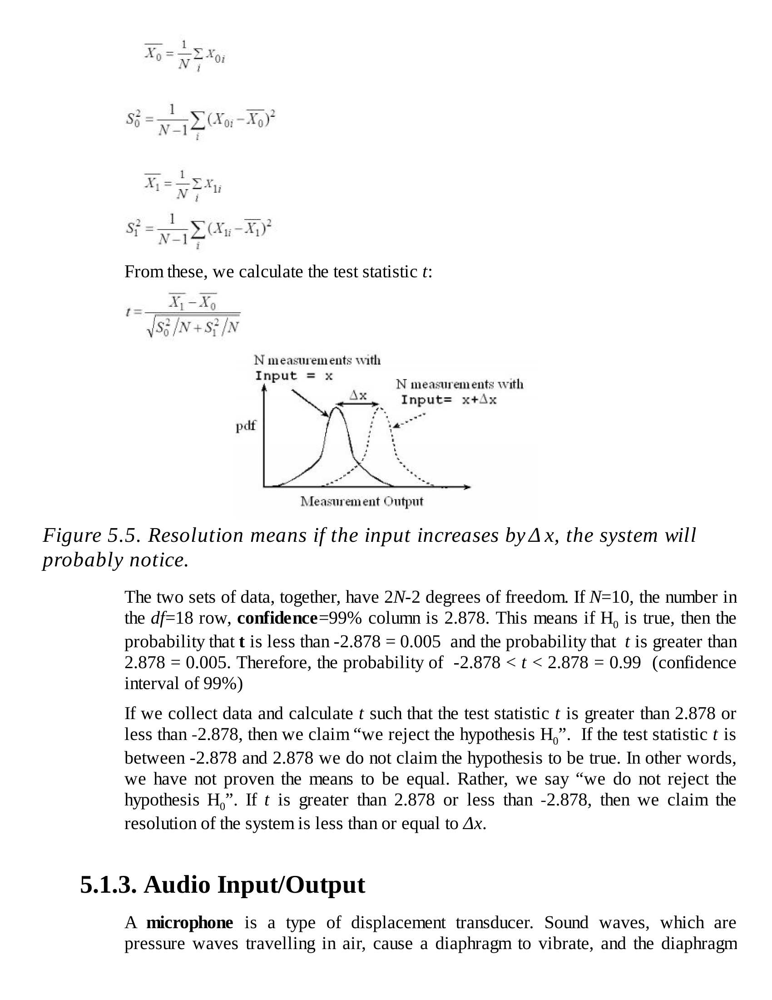
*Description*: Technical schematic and block diagram illustrating circuit operation, signal pathways, and functional behavior for Figure 5.5: Resolution means if the input increases byΔ x, the system will.

> **Figure 5.5: Resolution means if the input increases byΔ x, the system will**

probably notice.
The two sets of data, together, have 2N-2 degrees of freedom. If N=10, the number in
the df=18 row, confidence=99% column is 2.878. This means if H0 is true, then the
probability that t is less than -2.878 = 0.005  and the probability that  t is greater than
2.878 = 0.005. Therefore, the probability of  -2.878 < t < 2.878 = 0.99  (confidence
interval of 99%)
If we collect data and calculate t such that the test statistic t is greater than 2.878 or
less than ‑2.878, then we claim “we reject the hypothesis H0”.  If the test statistic t is
between -2.878 and 2.878 we do not claim the hypothesis to be true. In other words,
we have not proven the means to be equal. Rather, we say “we do not reject the
hypothesis H0”. If t is greater than 2.878 or less than ‑2.878, then we claim the
resolution of the system is less than or equal to Δx.
5.1.3. Audio Input/Output
A microphone is a type of displacement transducer. Sound waves, which are
pressure waves travelling in air, cause a diaphragm to vibrate, and the diaphragm


<!-- Page 302 -->
### [PDF Page 302]

motion causes the distance between capacitor plates to change. This variable
capacitance creates a voltage, which can be amplified and recorded. The electret
condenser microphone (ECM) is an inexpensive choice for converting sound to
analog voltage. Electret microphones are used in consumer and communication audio
devices because of their low cost and small size. For applications requiring high
sensitivity, low noise, and linear response, we could use the dynamic microphone,
like the ones used in high-fidelity audio recording equipment. The ECM capsule acts
as an acoustic resonator for the capacitive electret sensor shown in Figure 5.6. The
ECM has a Junction Field Effect Transistor (JFET) inside the transducer providing
some amplification. This JFET requires power as supplied by the R1 resistor. This
local amplification allows the ECM to function with a smaller capsule than typically
found with other microphones. ECM devices are cylindrically shaped, have a
diameter ranging from 3 to 10 mm, and have a thickness ranging from 1 to 5 mm.

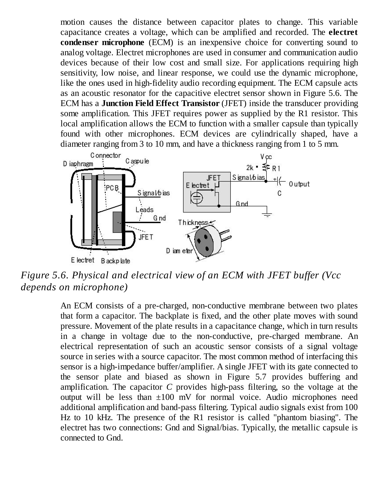
*Description*: Technical schematic and block diagram illustrating circuit operation, signal pathways, and functional behavior for Figure 5.6: Physical and electrical view of an ECM with JFET buffer (Vcc.

> **Figure 5.6: Physical and electrical view of an ECM with JFET buffer (Vcc**

depends on microphone)
An ECM consists of a pre-charged, non-conductive membrane between two plates
that form a capacitor. The backplate is fixed, and the other plate moves with sound
pressure. Movement of the plate results in a capacitance change, which in turn results
in a change in voltage due to the non-conductive, pre-charged membrane. An
electrical representation of such an acoustic sensor consists of a signal voltage
source in series with a source capacitor. The most common method of interfacing this
sensor is a high-impedance buffer/amplifier. A single JFET with its gate connected to
the sensor plate and biased as shown in Figure 5.7 provides buffering and
amplification. The capacitor C provides high-pass filtering, so the voltage at the
output will be less than ±100 mV for normal voice. Audio microphones need
additional amplification and band-pass filtering. Typical audio signals exist from 100
Hz to 10 kHz. The presence of the R1 resistor is called "phantom biasing". The
electret has two connections: Gnd and Signal/bias. Typically, the metallic capsule is
connected to Gnd.


<!-- Page 303 -->
### [PDF Page 303]


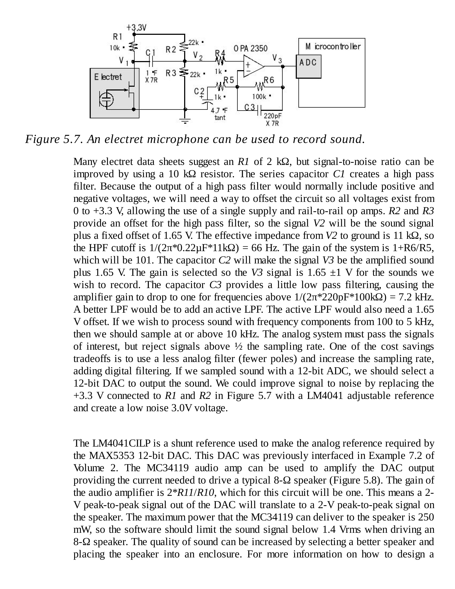
*Description*: Technical schematic and block diagram illustrating circuit operation, signal pathways, and functional behavior for Figure 5.7: An electret microphone can be used to record sound..

> **Figure 5.7: An electret microphone can be used to record sound.**

Many electret data sheets suggest an R1 of 2 kΩ, but signal-to-noise ratio can be
improved by using a 10 kΩ resistor. The series capacitor C1 creates a high pass
filter. Because the output of a high pass filter would normally include positive and
negative voltages, we will need a way to offset the circuit so all voltages exist from
0 to +3.3 V, allowing the use of a single supply and rail-to-rail op amps. R2 and R3
provide an offset for the high pass filter, so the signal V2 will be the sound signal
plus a fixed offset of 1.65 V. The effective impedance from V2 to ground is 11 kΩ, so
the HPF cutoff is 1/(2π*0.22µF*11kΩ) = 66 Hz. The gain of the system is 1+R6/R5,
which will be 101. The capacitor C2 will make the signal V3 be the amplified sound
plus 1.65 V. The gain is selected so the V3 signal is 1.65 ±1 V for the sounds we
wish to record. The capacitor C3 provides a little low pass filtering, causing the
amplifier gain to drop to one for frequencies above 1/(2π*220pF*100kΩ) = 7.2 kHz.
A better LPF would be to add an active LPF. The active LPF would also need a 1.65
V offset. If we wish to process sound with frequency components from 100 to 5 kHz,
then we should sample at or above 10 kHz. The analog system must pass the signals
of interest, but reject signals above ½ the sampling rate. One of the cost savings
tradeoffs is to use a less analog filter (fewer poles) and increase the sampling rate,
adding digital filtering. If we sampled sound with a 12-bit ADC, we should select a
12-bit DAC to output the sound. We could improve signal to noise by replacing the
+3.3 V connected to R1 and R2 in Figure 5.7 with a LM4041 adjustable reference

```assembly
and create a low noise 3.0V voltage.
```

The LM4041CILP is a shunt reference used to make the analog reference required by
the MAX5353 12-bit DAC. This DAC was previously interfaced in Example 7.2 of
Volume 2. The MC34119 audio amp can be used to amplify the DAC output
providing the current needed to drive a typical 8-Ω speaker (Figure 5.8). The gain of
the audio amplifier is 2*R11/R10, which for this circuit will be one. This means a 2-
V peak-to-peak signal out of the DAC will translate to a 2-V peak-to-peak signal on
the speaker. The maximum power that the MC34119 can deliver to the speaker is 250
mW, so the software should limit the sound signal below 1.4 Vrms when driving an
8-Ω speaker. The quality of sound can be increased by selecting a better speaker and
placing the speaker into an enclosure. For more information on how to design a


<!-- Page 304 -->
### [PDF Page 304]

speaker box, perform a web search on “speaker enclosure”.
Software in Program 7.2 (Volume 2) can be used to interface the MAX5353 12-bit
DAC.   Program 5.1 performs the sound input and output. The sampling rate is 10
kHz. The ADC code was presented earlier in Chapter 2.

```c
void ADC3_Handler(void){ int16_t data;
ADC_ISC_R = ADC_ISC_IN3;  // acknowledge ADC sequence 3 completion
data = (ADC_SSFIFO3_R&ADC_SSFIFO3_DATA_M)-512;  // 10-bit sound
// process, filter, record etc.
DAC_Out(data);
}
void main(void){
PLL_Init();                          // now running at 80 MHz
ADC_ InitTimer0ATriggerSeq3PD3(7999); // sample at 10 kHz
DAC_Init(2048);                       // Volume 2, Program 7.2
while(1){ };
}
```


*Description*: Technical schematic and block diagram illustrating circuit operation, signal pathways, and functional behavior for Program 5.1: Real-time sound output input/output..

> **Program 5.1: Real-time sound output input/output.**


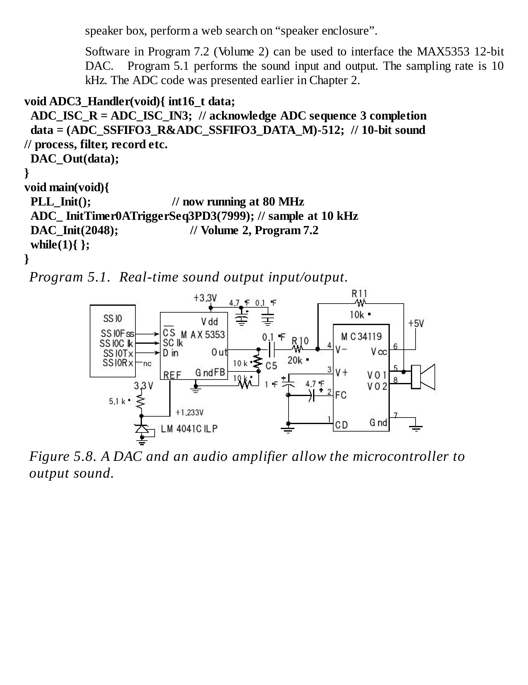
*Description*: Technical schematic and block diagram illustrating circuit operation, signal pathways, and functional behavior for Figure 5.8: A DAC and an audio amplifier allow the microcontroller to.

> **Figure 5.8: A DAC and an audio amplifier allow the microcontroller to**

output sound.


<!-- Page 305 -->
### [PDF Page 305]

5.2. Priority scheduler
5.2.1. Implementation
To implement priority, we add another field to the TCB, see Program 5.2. In this
system we define 0 as the highest priority and 254 as the lowest. In some operating
systems, each thread must have unique priority, but in this chapter multiple threads
can have the same priority. If we have multiple threads with equal priority, these
threads will be run in a round robin fashion. The strategy will be to find the highest
priority thread, which is neither blocked nor sleeping and run it as shown in Figure
5.9.

```c
struct tcb{
int32_t *sp;       // pointer to stack (valid for threads not running
struct tcb *next;  // linked-list pointer
int32_t *BlockPt;  // nonzero if blocked on this semaphore
uint32_t Sleep;    // nonzero if this thread is sleeping
uint8_t Priority;  // 0 is highest, 254 lowest
};
```


*Description*: Technical schematic and block diagram illustrating circuit operation, signal pathways, and functional behavior for Program 5.2: TCB for the priority scheduler..

> **Program 5.2: TCB for the priority scheduler.**


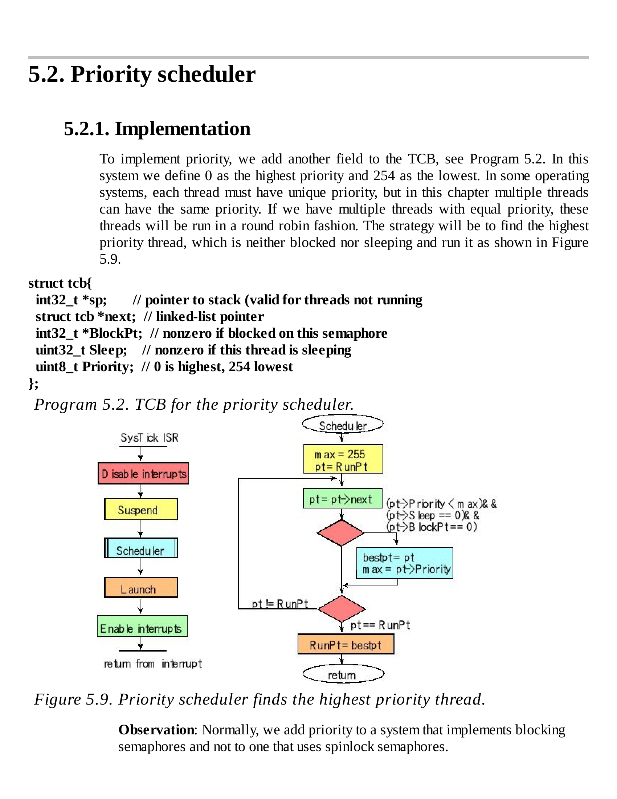
*Description*: Technical schematic and block diagram illustrating circuit operation, signal pathways, and functional behavior for Figure 5.9: Priority scheduler finds the highest priority thread..

> **Figure 5.9: Priority scheduler finds the highest priority thread.**

Observation: Normally, we add priority to a system that implements blocking
semaphores and not to one that uses spinlock semaphores.


<!-- Page 306 -->
### [PDF Page 306]

If there are multiple threads at that highest priority that are not sleeping nor blocked,
then the scheduler will run them in a round robin fashion. The statement, pt = pt-
>next  guarantees that the same higher priority task is not picked again.

```c
void Scheduler(void){  // every time slice
uint32_t max = 255;  // max
tcbType *pt;
tcbType *bestPt;
pt = RunPt;    // search for highest thread not blocked or sleeping
do{
pt = pt->next; // skips at least one
if((pt->Priority < max)&&((pt->BlockPt)==0)&&((pt->Sleep)==0)){
max = pt->Priority;
bestPt = pt;
}
}  while(RunPt != pt); // look at all possible threads
RunPt = bestPt;
}
```


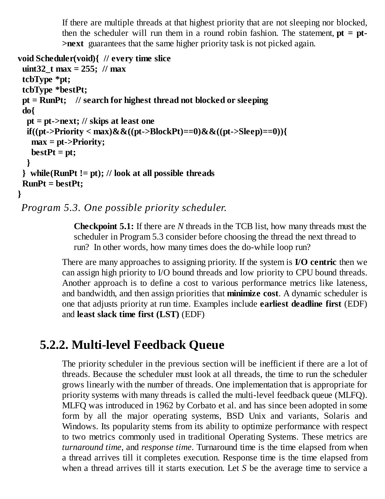
*Description*: Technical schematic and block diagram illustrating circuit operation, signal pathways, and functional behavior for Program 5.3: One possible priority scheduler..

> **Program 5.3: One possible priority scheduler.**

Checkpoint 5.1: If there are N threads in the TCB list, how many threads must the
scheduler in Program 5.3 consider before choosing the thread the next thread to
run?  In other words, how many times does the do-while loop run?
There are many approaches to assigning priority. If the system is I/O centric then we
can assign high priority to I/O bound threads and low priority to CPU bound threads.
Another approach is to define a cost to various performance metrics like lateness,

```assembly
and bandwidth, and then assign priorities that minimize cost. A dynamic scheduler is
```

one that adjusts priority at run time. Examples include earliest deadline first (EDF)

```assembly
and least slack time first (LST) (EDF)
```

5.2.2. Multi-level Feedback Queue
The priority scheduler in the previous section will be inefficient if there are a lot of
threads. Because the scheduler must look at all threads, the time to run the scheduler
grows linearly with the number of threads. One implementation that is appropriate for
priority systems with many threads is called the multi-level feedback queue (MLFQ).
MLFQ was introduced in 1962 by Corbato et al. and has since been adopted in some
form by all the major operating systems, BSD Unix and variants, Solaris and
Windows. Its popularity stems from its ability to optimize performance with respect
to two metrics commonly used in traditional Operating Systems. These metrics are
turnaround time, and response time. Turnaround time is the time elapsed from when
a thread arrives till it completes execution. Response time is the time elapsed from
when a thread arrives till it starts execution. Let S be the average time to service a


<!-- Page 307 -->
### [PDF Page 307]

request, and R be the average response time (waiting+service). One nondimensional
metric for response time is normalized mean response time, R/S. Preemptive
scheduling mechanisms like Shortest Time-to-completion First (STCF) and Round-
Robin (RR) are optimal at minimizing the average turnaround time and response time
respectively.  However, both perform well on only one of these metrics and show
very poor performance with respect to the other. MLFQ fairs equally well on both
these metrics. As the name indicates, MLFQ has multiple queues, one per priority
level, with multiple threads operating at the same priority level. In keeping with our
description of priority, we assume level 0 is the highest priority and higher levels
imply lower priority. There will be a finite number of priority levels from 0 to n-1,
see Figure 5.10. The rules that govern the processing of these queues by the scheduler
are as follows:
1. Startup: All threads start at the highest priority. Start in queue at
level 0.
2. Highest runs: If Priority(Ti) < Priority(Tj) then Ti is scheduled to run
before Tj.
3. Equals take turns: If Priority(Ti) = Priority(Tj) then Ti and Tj are run
in RR order.
4. True accounting: If a thread uses up its timeslice at priority m then
its priority is reduced to m+1. It is moved to the corresponding
queue.
5. Priority Boost: The scheduler does a periodic reset, where all
threads are bumped to the highest priority.

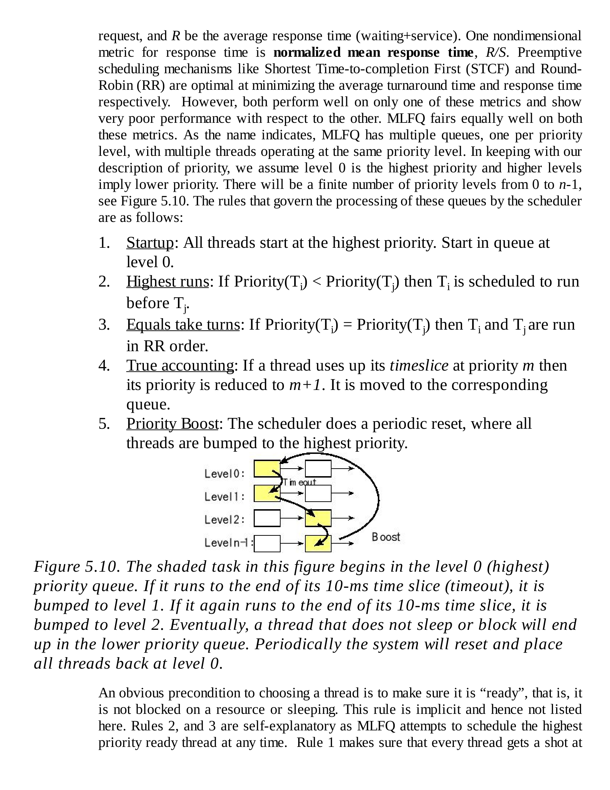
*Description*: Technical schematic and block diagram illustrating circuit operation, signal pathways, and functional behavior for Figure 5.10: The shaded task in this figure begins in the level 0 (highest).

> **Figure 5.10: The shaded task in this figure begins in the level 0 (highest)**

priority queue. If it runs to the end of its 10-ms time slice (timeout), it is
bumped to level 1. If it again runs to the end of its 10-ms time slice, it is
bumped to level 2. Eventually, a thread that does not sleep or block will end
up in the lower priority queue. Periodically the system will reset and place
all threads back at level 0.
An obvious precondition to choosing a thread is to make sure it is “ready”, that is, it
is not blocked on a resource or sleeping. This rule is implicit and hence not listed
here. Rules 2, and 3 are self-explanatory as MLFQ attempts to schedule the highest
priority ready thread at any time.  Rule 1 makes sure that every thread gets a shot at


<!-- Page 308 -->
### [PDF Page 308]

executing as quickly as possible, the first time it enters the system. Rule 4 is what
determines when a thread is moved from one level to another. Further, whether a
thread uses up its timeslice at one shot or over multiple runs, true accounting requires
that the accumulated time for the thread at a given priority level be considered. There
are versions of MLFQ that let a thread remain at a priority level with its accrued time
towards the timeslice reset to zero, if it blocked on a resource. These versions
allowed the possibility of gaming the scheduler.  Without rule 5, MLFQ eventually
reduces to RR after running for a while with all threads operating at the lowest
priority level. By periodically boosting all threads to the highest priority, rule 5
causes a scheduler reset that lets the scheduler adapt to changes in thread behavior.
5.2.3. Starvation and aging
One disadvantage of a priority scheduler on a busy system is that low priority threads
may never be run. This situation is called starvation. For example, if a high priority
thread never sleeps or blocks, then the lower priority threads will never run. It is the
responsibility of the user to assign priorities to tasks. As mentioned earlier, as
processor utilization approaches one, there will not be a solution.  In general,
starvation is not a problem of the RTOS but rather a result of a poorly designed user
code.
One solution to starvation is called aging. In this scheme, threads have a permanent
fixed priority and a temporary working priority, see Program 5.4. The permanent
priority is assigned according to the rules of the previous paragraph, but the
temporary priority is used to actually schedule threads. Periodically the OS increases
the temporary priority of threads that have not been run in a long time. For example,
the Age field is incremented once every 1ms if the thread is not blocked or not
sleeping. For every 10 ms the thread has not been run, its WorkingPriority is
reduced. Once a thread is run, its temporary priority is reset back to its permanent
priority. When the thread is run, the Age field is cleared and the FixedPriority is
copied into the WorkingPriority.

```c
struct tcb{
int32_t *sp;       // pointer to stack (valid for threads not running
struct tcb *next;  // linked-list pointer
int32_t *BlockPt;  // nonzero if blocked on this semaphore
uint32_t Sleep;    // nonzero if this thread is sleeping
uint8_t WorkingPriority; // used by the scheduler
uint8_t FixedPriority;   // permanent priority
uint32_t Age;            // time since last execution
};
```


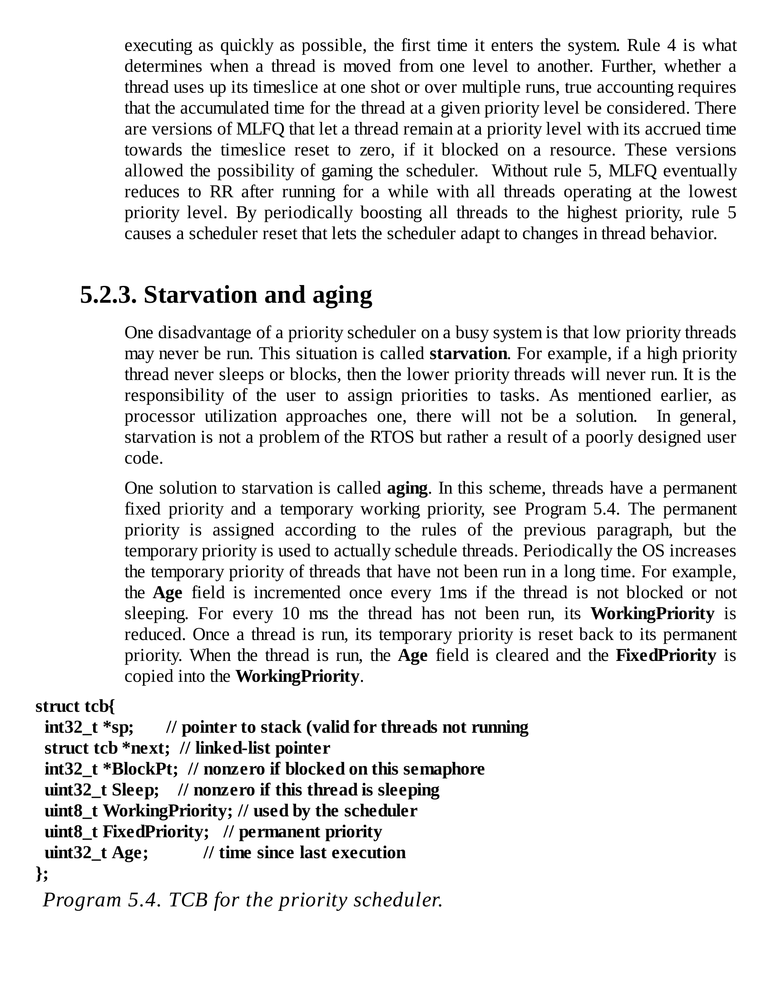
*Description*: Technical schematic and block diagram illustrating circuit operation, signal pathways, and functional behavior for Program 5.4: TCB for the priority scheduler..

> **Program 5.4: TCB for the priority scheduler.**


<!-- Page 309 -->
### [PDF Page 309]

5.2.4. Priority inversion and inheritance on Mars Pathfinder
Another problem with a priority scheduler is priority inversion, a condition where a
high-priority thread is waiting on a resource owned by a low-priority thread. For
example, consider the case where both a high priority and low priority thread need
the same resource. Assume the low-priority thread asks for and is granted the
resource, and then the high-priority thread asks for it and blocks. During the time the
low priority thread is using the resource, the high-priority thread essentially becomes
low priority. The scenario in Figure 5.11 begins with a low priority meteorological
task asking for and being granted access to a shared memory using
the mutex semaphore. The second step is a medium priority communication task runs
for a long time. Since communication is higher priority than the meteorological task,
the communication task runs but the meteorological task does not run. Third, a very
high priority task starts but also needs access to the shared memory, so it calls wait
on mutex . This high priority task, however, will block because mutex  is 0. Notice
that while the communication task is running, this high priority task effectively runs at
low priority because it is blocked on a semaphore captured previously by the low
priority task.

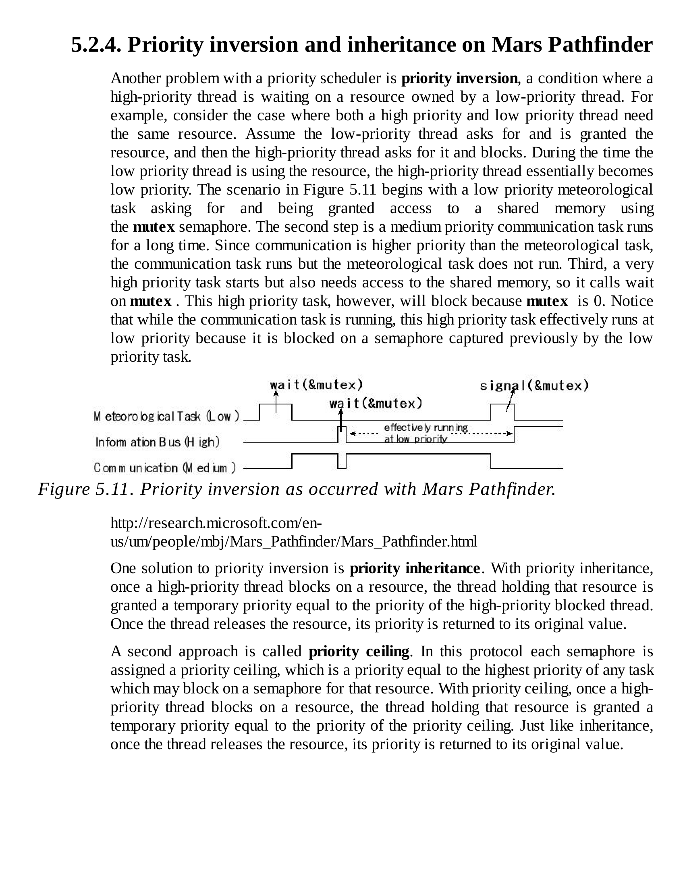
*Description*: Technical schematic and block diagram illustrating circuit operation, signal pathways, and functional behavior for Figure 5.11: Priority inversion as occurred with Mars Pathfinder..

> **Figure 5.11: Priority inversion as occurred with Mars Pathfinder.**

http://research.microsoft.com/en-
us/um/people/mbj/Mars_Pathfinder/Mars_Pathfinder.html
One solution to priority inversion is priority inheritance. With priority inheritance,
once a high-priority thread blocks on a resource, the thread holding that resource is
granted a temporary priority equal to the priority of the high-priority blocked thread.
Once the thread releases the resource, its priority is returned to its original value.
A second approach is called priority ceiling. In this protocol each semaphore is
assigned a priority ceiling, which is a priority equal to the highest priority of any task
which may block on a semaphore for that resource. With priority ceiling, once a high-
priority thread blocks on a resource, the thread holding that resource is granted a
temporary priority equal to the priority of the priority ceiling. Just like inheritance,
once the thread releases the resource, its priority is returned to its original value.


<!-- Page 310 -->
### [PDF Page 310]

5.3. Debouncing a switch
5.3.1. Approach to debouncing
One of the problems with switches is called switch bounce. Many inexpensive
switches will mechanically oscillate for up to a few milliseconds when touched or
released. It behaves like an underdamped oscillator. These mechanical oscillations
cause electrical oscillations such that a port pin will oscillate high/low during the
bounce.
Contact bounce is a typical problem when interfacing switches. Figure 5.12 shows an
actual voltage trace occurring when a negative logic switch is touched. On both a
touch and release, there can be from 0 to 2 ms of extra edges, called switch bounce.
However, sometimes there is no bounce.
This bounce is a problem when the system uses the switch to trigger important events.
There are two problems to solve: 1) remove the bounce so there is one software
event attached to the switch touch; 2) remove the bounce in such a way that there is
low latency between the physical touch and the execution of the associated software
task.

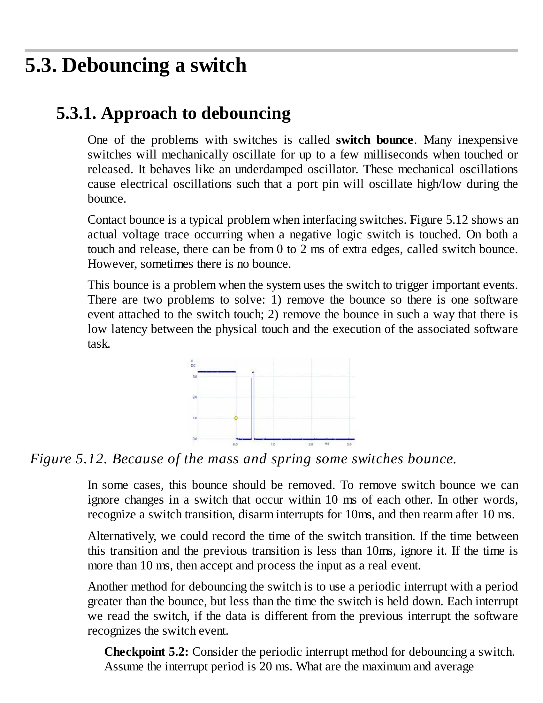
*Description*: Technical schematic and block diagram illustrating circuit operation, signal pathways, and functional behavior for Figure 5.12: Because of the mass and spring some switches bounce..

> **Figure 5.12: Because of the mass and spring some switches bounce.**

In some cases, this bounce should be removed. To remove switch bounce we can
ignore changes in a switch that occur within 10 ms of each other. In other words,
recognize a switch transition, disarm interrupts for 10ms, and then rearm after 10 ms.
Alternatively, we could record the time of the switch transition. If the time between
this transition and the previous transition is less than 10ms, ignore it. If the time is
more than 10 ms, then accept and process the input as a real event.
Another method for debouncing the switch is to use a periodic interrupt with a period
greater than the bounce, but less than the time the switch is held down. Each interrupt
we read the switch, if the data is different from the previous interrupt the software
recognizes the switch event.
Checkpoint 5.2: Consider the periodic interrupt method for debouncing a switch.
Assume the interrupt period is 20 ms. What are the maximum and average


<!-- Page 311 -->
### [PDF Page 311]

latencies (time between switch touch and execution of the task)?
5.3.2. Debouncing a switch on TM4C123
If we have a RTOS we can use a semaphore to debounce a switch. In order to run the
user task immediately on touch we will configure the GPIO input to trigger an
interrupt on both edges. However, there can be multiple falling and rising edges on
both a touch and a release, see Figure 5.13. A main thread will wait on that
semaphore, sleep for 10ms and then read the switch. The interrupt occurs at the start
of the bouncing, but the reading of the switch occurs at a time when the switch state is
stable. We will disarm the interrupt during the ISR, so the semaphore is incremented
once per touch and once per release. We will rearm the interrupt at the stable time.

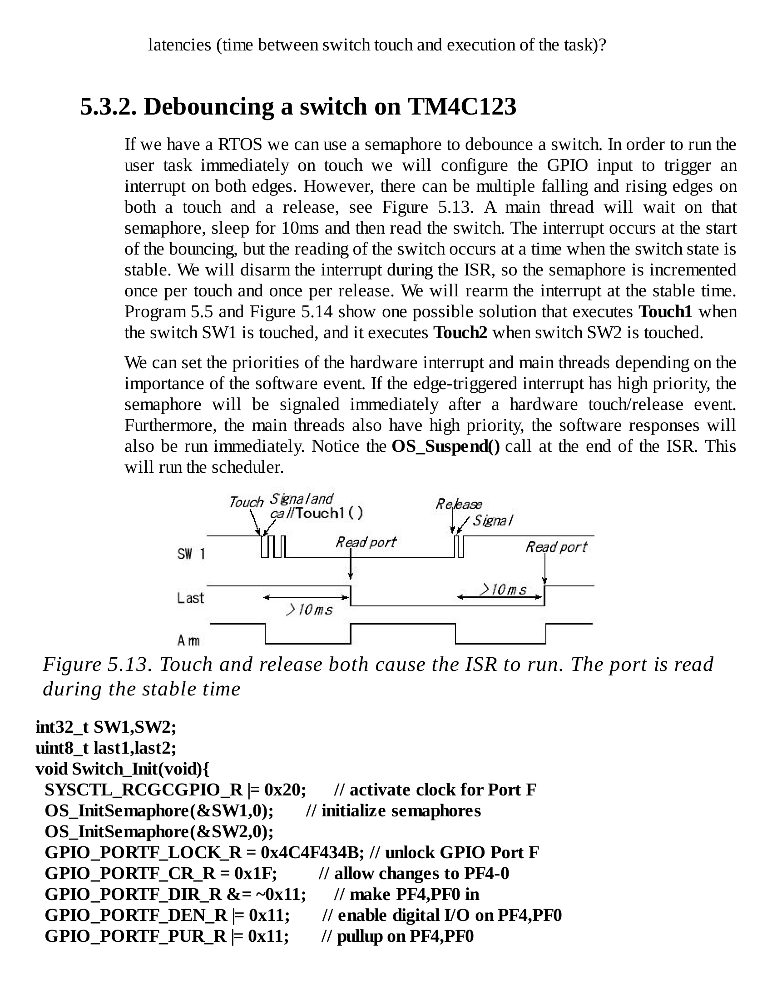
*Description*: Technical schematic and block diagram illustrating circuit operation, signal pathways, and functional behavior for Program 5.5: and Figure 5.14 show one possible solution that executes Touch1 when.

> **Program 5.5: and Figure 5.14 show one possible solution that executes Touch1 when**

the switch SW1 is touched, and it executes Touch2 when switch SW2 is touched.
We can set the priorities of the hardware interrupt and main threads depending on the
importance of the software event. If the edge-triggered interrupt has high priority, the
semaphore will be signaled immediately after a hardware touch/release event.
Furthermore, the main threads also have high priority, the software responses will
also be run immediately. Notice the OS_Suspend() call at the end of the ISR. This
will run the scheduler.


*Description*: Technical schematic and block diagram illustrating circuit operation, signal pathways, and functional behavior for Figure 5.13: Touch and release both cause the ISR to run. The port is read.

> **Figure 5.13: Touch and release both cause the ISR to run. The port is read**

during the stable time

```c
int32_t SW1,SW2;
uint8_t last1,last2;
void Switch_Init(void){
SYSCTL_RCGCGPIO_R |= 0x20;      // activate clock for Port F
OS_InitSemaphore(&SW1,0);       // initialize semaphores
OS_InitSemaphore(&SW2,0);
GPIO_PORTF_LOCK_R = 0x4C4F434B; // unlock GPIO Port F
GPIO_PORTF_CR_R = 0x1F;         // allow changes to PF4-0
GPIO_PORTF_DIR_R &= ~0x11;      // make PF4,PF0 in
GPIO_PORTF_DEN_R |= 0x11;       // enable digital I/O on PF4,PF0
GPIO_PORTF_PUR_R |= 0x11;       // pullup on PF4,PF0
```


<!-- Page 312 -->
### [PDF Page 312]

GPIO_PORTF_IS_R &= ~0x11;       // PF4,PF0 are edge-sensitive
GPIO_PORTF_IBE_R |= 0x11;       // PF4,PF0 are both edges
GPIO_PORTF_ICR_R = 0x11;        // clear flags
GPIO_PORTF_IM_R |= 0x11;        // arm interrupts on PF4,PF0
NVIC_PRI7_R = (NVIC_PRI7_R&0xFF00FFFF)|0x00200000; // priority 1
NVIC_EN0_R = 0x40000000;        // enable interrupt 30 in NVIC
}

```c
void GPIOPortF_Handler(void){
if(GPIO_PORTF_RIS_R&0x10){  // poll PF4
GPIO_PORTF_ICR_R = 0x10;  // acknowledge flag4
OS_Signal(&SW1);          // signal SW1 occurred
GPIO_PORTF_IM_R &= ~0x10; // disarm interrupt on PF4
}
if(GPIO_PORTF_RIS_R&0x01){  // poll PF0
GPIO_PORTF_ICR_R = 0x01;  // acknowledge flag0
OS_Signal(&SW2);          // signal SW2 occurred
GPIO_PORTF_IM_R &= ~0x81; // disarm interrupt on PF0
}
OS_Suspend();}
void Switch1Task(void){ // high priority main thread
last1 = GPIO_PORTF_DATA_R&0x10;
while(1){
OS_Wait(&SW1); // wait for SW1 to be touched/released
if(last1){     // was previously not touched
Touch1();    // user software associated with touch
}else{
Release1();  // user software associated with release
}
OS_Sleep(10);  // wait for bouncing to be over
last1 = GPIO_PORTF_DATA_R&0x10;
GPIO_PORTF_IM_R |= 0x10;  // rearm interrupt on PF4
GPIO_PORTF_ICR_R = 0x10;  // acknowledge flag4
}
}
void Switch2Task(void){ // high priority main thread
last2 = GPIO_PORTF_DATA_R&0x01;
while(1){
OS_Wait(&SW2);  // wait for SW2 to be touched/released
if(last2){      // was previously not touched
Touch2();     // user software associated with touch
}else{
Release2();   // user software associated with release
}
OS_Sleep(10);   // wait for bouncing to be over
```


<!-- Page 313 -->
### [PDF Page 313]

last2 = GPIO_PORTF_DATA_R&0x01;
GPIO_PORTF_IM_R |= 0x01;  // rearm interrupt on PF0
GPIO_PORTF_ICR_R = 0x01;  // acknowledge flag0
}
}


*Description*: Technical schematic and block diagram illustrating circuit operation, signal pathways, and functional behavior for Program 5.5: Interrupt-driven edge-triggered input that calls Touch1() on.

> **Program 5.5: Interrupt-driven edge-triggered input that calls Touch1() on**

the falling edge of PF4, calls Release1() on the rising edge of PF4, calls
Touch2() on the falling edge of PF0 and calls Release2() on the rising edge
of PF0.


*Description*: Timing waveform and execution flowchart illustrating signal transitions, state machine progression, or algorithm logic for Figure 5.14: Flowchart of a RTOS-solution to switch bounce. Switch1Task is.

> **Figure 5.14: Flowchart of a RTOS-solution to switch bounce. Switch1Task is**

a high-priority main thread. Notice that Release1 is executed immediately
after a release, and Touch1 is executed immediate after the switch is touched.
However the global variable Last is set at a time the switch is guaranteed to
be stable.
5.3.3. Debouncing a switch on MSP432
If we have a RTOS we can perform a similar sequence. In particular, we will use

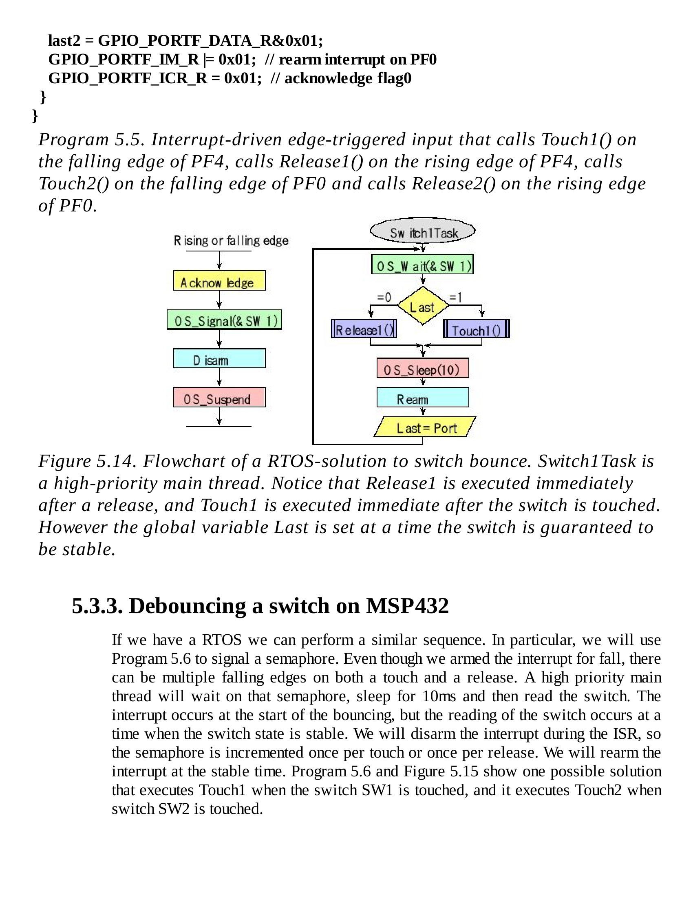
*Description*: Technical schematic and block diagram illustrating circuit operation, signal pathways, and functional behavior for Program 5.6: to signal a semaphore. Even though we armed the interrupt for fall, there.

> **Program 5.6: to signal a semaphore. Even though we armed the interrupt for fall, there**

can be multiple falling edges on both a touch and a release. A high priority main
thread will wait on that semaphore, sleep for 10ms and then read the switch. The
interrupt occurs at the start of the bouncing, but the reading of the switch occurs at a
time when the switch state is stable. We will disarm the interrupt during the ISR, so
the semaphore is incremented once per touch or once per release. We will rearm the
interrupt at the stable time. Program 5.6 and Figure 5.15 show one possible solution
that executes Touch1 when the switch SW1 is touched, and it executes Touch2 when
switch SW2 is touched.


<!-- Page 314 -->
### [PDF Page 314]


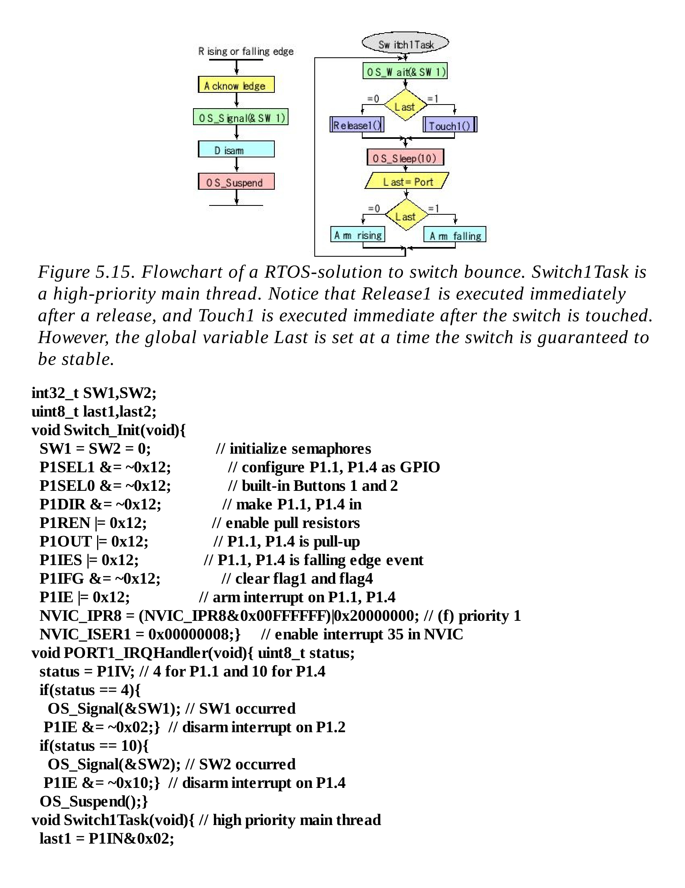
*Description*: Timing waveform and execution flowchart illustrating signal transitions, state machine progression, or algorithm logic for Figure 5.15: Flowchart of a RTOS-solution to switch bounce. Switch1Task is.

> **Figure 5.15: Flowchart of a RTOS-solution to switch bounce. Switch1Task is**

a high-priority main thread. Notice that Release1 is executed immediately
after a release, and Touch1 is executed immediate after the switch is touched.
However, the global variable Last is set at a time the switch is guaranteed to
be stable.

```c
int32_t SW1,SW2;
uint8_t last1,last2;
void Switch_Init(void){
SW1 = SW2 = 0;                // initialize semaphores
P1SEL1 &= ~0x12;              // configure P1.1, P1.4 as GPIO
P1SEL0 &= ~0x12;              // built-in Buttons 1 and 2
P1DIR &= ~0x12;               // make P1.1, P1.4 in
P1REN |= 0x12;                // enable pull resistors
P1OUT |= 0x12;                // P1.1, P1.4 is pull-up
P1IES |= 0x12;                // P1.1, P1.4 is falling edge event
P1IFG &= ~0x12;               // clear flag1 and flag4
P1IE |= 0x12;                 // arm interrupt on P1.1, P1.4
NVIC_IPR8 = (NVIC_IPR8&0x00FFFFFF)|0x20000000; // (f) priority 1
NVIC_ISER1 = 0x00000008;}     // enable interrupt 35 in NVIC
void PORT1_IRQHandler(void){ uint8_t status;
status = P1IV; // 4 for P1.1 and 10 for P1.4
if(status == 4){
OS_Signal(&SW1); // SW1 occurred
P1IE &= ~0x02;}  // disarm interrupt on P1.2
if(status == 10){
OS_Signal(&SW2); // SW2 occurred
P1IE &= ~0x10;}  // disarm interrupt on P1.4
OS_Suspend();}
void Switch1Task(void){ // high priority main thread
last1 = P1IN&0x02;
```


<!-- Page 315 -->
### [PDF Page 315]


```c
while(1){
OS_Wait(&SW1);  // wait for SW1 to be touched/released
if(last1){     // was previously not touched
Touch1();    // user software associated with touch
}else{
Release1();} // user software associated with release
OS_Sleep(10);
last1 = P1IN&0x02;
if(last1){
P1IES |= 0x02;  // next will be falling edge
}else{
P1IES &= ~0x02; // next will be rising edge
}
P1IE |= 0x02;    // rearm interrupt on P1.1
P1IFG &= ~0x02;  // clear flag1
}
}
void Switch2Task(void){ // high priority main thread
last2 = P1IN&0x10;
while(1){
OS_Wait(&SW2);  // wait for SW2 to be touched/released
if(last2){      // was previously not touched
Touch2();     // user software associated with touch
}else{
Release2();   // user software associated with release
}
OS_Sleep(10);
last2 = P1IN&0x10;
if(last2){
P1IES |= 0x10;  // next will be falling edge
}else{
P1IES &= ~0x10;}// next will be rising edge
P1IE |= 0x10;     // rearm interrupt on P1.4
P1IFG &= ~0x10;   // clear flag4
}
}
```


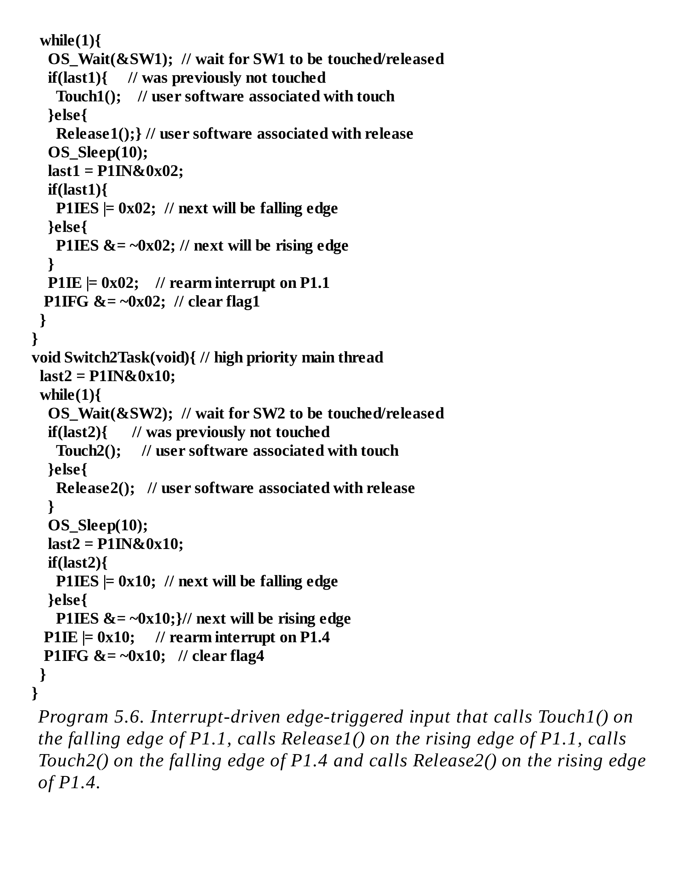
*Description*: Technical schematic and block diagram illustrating circuit operation, signal pathways, and functional behavior for Program 5.6: Interrupt-driven edge-triggered input that calls Touch1() on.

> **Program 5.6: Interrupt-driven edge-triggered input that calls Touch1() on**

the falling edge of P1.1, calls Release1() on the rising edge of P1.1, calls
Touch2() on the falling edge of P1.4 and calls Release2() on the rising edge
of P1.4.


<!-- Page 316 -->
### [PDF Page 316]

5.4. Running event threads as high priority main
threads
In the previous chapters, we ran time-critical tasks (event tasks) directly from the
interrupt service routine. Now that we have a priority scheduler, we can place time-
critical tasks as high priority main threads. We will block these time-critical tasks
waiting on an event (semaphore), and when the event occurs we signal its semaphore.
Because we now have a high priority thread not blocked, the scheduler will run it
immediately. In Program 5.7, we have a periodic interrupt that simply signals a
semaphore and invokes the scheduler. If we assign the program Task0  as a high
priority main thread, it will be run periodically with very little jitter.
It may seem like a lot of trouble to run a periodic task. One might ask why not just put
the time-critical task in the interrupt service routine. A priority scheduler is flexible
in two ways. First, because it implements priority we can have layers of important,
very important and very very important tasks. Second, we can use this approach for
any triggering event, hardware or software. We simply make that triggering event call
OS_Signal  and OS_Suspend. One of the advantages of this approach is the
separation of the user/application code from the OS code. The OS simply signals the
semaphore on the appropriate event and the user code runs as a main thread.

```c
int32_t TakeSoundData; // binary semaphore
void RealTimeEvents(void){
OS_Signal(&TakeSoundData);
OS_Suspend();
}
void Task0(void){
while(1){
OS_Wait(&TakeSoundData); // signaled every 1ms
TExaS_Task0();     // toggle virtual logic analyzer
Profile_Toggle0(); // viewed by logic analyzer to know Task0 started
// time-critical software
}
}
int main(void){
OS_Init();
// other initialization
OS_InitSemaphore(&TakeSoundData,0);
```

OS_AddThreads(&Task0,0,&Task1,1,&Task2,2, &Task3,3,
&Task4,3, &Task5,3, &Task6,3, &Task7,4);
BSP_PeriodicTask_InitC(&RealTimeEvents,1000,0);
TExaS_Init(LOGICANALYZER, 1000); // initialize the logic analyzer


<!-- Page 317 -->
### [PDF Page 317]

OS_Launch(BSP_Clock_GetFreq()/THREADFREQ); // doesn't return
return 0;             // this never executes
}


*Description*: Technical schematic and block diagram illustrating circuit operation, signal pathways, and functional behavior for Program 5.7: Running time-critical tasks as high priority event threads..

> **Program 5.7: Running time-critical tasks as high priority event threads.**


<!-- Page 318 -->
### [PDF Page 318]

5.5. Available RTOS
5.5.1. Micrium uC/OS-II
We introduced several concepts that common in real-time operating systems but ones
we don’t implement in our simple RTOS.  To complete this discussion, we explore
some of the popular RTOSs (for the ARM Cortex-M) in commercial use and how
they implement some of the features we covered.
Micrium μC/OS-II is a portable, ROMable, scalable, preemptive, real-time
deterministic multitasking kernel for microprocessors, microcontrollers and DSPs
(for more information, see http://micrium.com/rtos/ucosii/overview/). Portable
means user and OS code written on one processor can be easily shifted to another
processor. ROMable is a standard feature of most compilers for embedded systems,
meaning object code is programmed into ROM, and variables are positioned in
RAM. Scalable means applications can be developed on this OS for 10 threads, but
the OS allows expansion to 255 threads. Like most real-time operating systems, high
priority tasks can preempt lower priority tasks. Because each thread in Micrium
μC/OS-II has a unique priority (no two threads have equal priority), the threads will
run in a deterministic pattern, making it easy to certify performance. In fact, the
following lists the certifications available for Micrium μC/OS-II
MISRA-C:1998
DO178B Level A and EUROCAE ED-12B
Medical FDA pre-market notification (510(k)) and pre-market
approval (PMA)
SIL3/SIL4 IEC for transportation and nuclear systems
IEC-61508
As of December 2016, Micrium μC/OS-II is available for over 50 processor
architectures, including the Cortex M3 and Cortex M4F. Ports are available for
download on http://micrium.com. Micrium μC/OS-II manages up to 255 application
tasks. μC/OS-II includes: semaphores; event flags; mutual-exclusion semaphores that
eliminate unbounded priority inversions; message mailboxes and queues; task, time

```assembly
and timer management; and fixed sized memory block management.
```

Micrium μC/OS-II’s footprint can be scaled (between 5 kibibytes to 24 kibibytes) to
only contain the features required for a specific application. The execution time for
most services provided by μC/OS-II is both constant and deterministic; execution
times do not depend on the number of tasks running in the application.
To provide for stability and protection, this OS runs user code with the PSP and OS


<!-- Page 319 -->
### [PDF Page 319]

code with the MSP. The way in which the Micrium μC/OS supports many processor
architectures is to be layered. Only a small piece of the OS code is processor
specific. It also provides a Board Support Package (BSP) so the user code can also
be layered, see Figure 5.16.

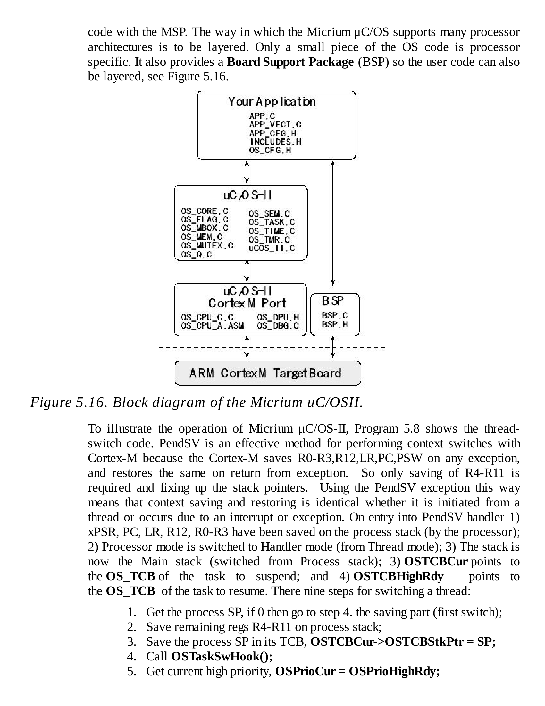
*Description*: Architectural block diagram detailing logic modules, memory buses, internal registers, and hardware interconnections for Figure 5.16: Block diagram of the Micrium uC/OSII..

> **Figure 5.16: Block diagram of the Micrium uC/OSII.**

To illustrate the operation of Micrium μC/OS-II, Program 5.8 shows the thread-
switch code. PendSV is an effective method for performing context switches with
Cortex-M because the Cortex-M saves R0-R3,R12,LR,PC,PSW on any exception,

```assembly
and restores the same on return from exception.  So only saving of R4-R11 is
```

required and fixing up the stack pointers.  Using the PendSV exception this way
means that context saving and restoring is identical whether it is initiated from a
thread or occurs due to an interrupt or exception. On entry into PendSV handler 1)
xPSR, PC, LR, R12, R0-R3 have been saved on the process stack (by the processor);
2) Processor mode is switched to Handler mode (from Thread mode); 3) The stack is
now the Main stack (switched from Process stack); 3) OSTCBCur points to
the OS_TCB of the task to suspend; and 4) OSTCBHighRdy   points to
the OS_TCB  of the task to resume. There nine steps for switching a thread:
1.     Get the process SP, if 0 then go to step 4. the saving part (first switch);
2.     Save remaining regs R4-R11 on process stack;
3.     Save the process SP in its TCB, OSTCBCur->OSTCBStkPtr = SP;
4.     Call OSTaskSwHook();
5.     Get current high priority, OSPrioCur = OSPrioHighRdy;


<!-- Page 320 -->
### [PDF Page 320]

6.     Get current ready thread TCB, OSTCBCur = OSTCBHighRdy;
7.
Get new process SP from TCB, SP = OSTCBHighRdy-
>OSTCBStkPtr;
8.     Restore R4-R11 from new process stack;
9.     Perform exception return which will restore remaining context.
OS_CPU_PendSVHandler

```assembly
CPSID   I               ; Prevent interruption during context switch
MRS     R0, PSP         ; PSP is process stack pointer
CBZ     R0, OS_CPU_PendSVHandler_nosave     ; Skip first time
SUBS    R0, R0, #0x20  ; Save remaining regs R4-11 on process stack
STM     R0, {R4-R11}
LDR    R1, =OSTCBCur   ; OSTCBCur->OSTCBStkPtr = SP;
LDR     R1, [R1]
STR     R0, [R1]        ; R0 is SP of process being switched out
```

; At this point, entire context of process has been saved
OS_CPU_PendSVHandler_nosave

```assembly
PUSH    {R14}             ; Save LR exc_return value
LDR     R0, =OSTaskSwHook ; OSTaskSwHook();
```

BLX     R0

```assembly
POP     {R14}
LDR     R0, =OSPrioCur  ; OSPrioCur = OSPrioHighRdy;
LDR     R1, =OSPrioHighRdy
```

LDRB    R2, [R1]
STRB    R2, [R0]

```assembly
LDR     R0, =OSTCBCur   ; OSTCBCur  = OSTCBHighRdy;
LDR     R1, =OSTCBHighRdy
LDR     R2, [R1]
STR     R2, [R0]
LDR     R0, [R2]  ; R0 is new PSP; SP = OSTCBHighRdy->OSTCBStkPtr;
LDM     R0, {R4-R11}    ; Restore R4-11 from new process stack
```

ADDS    R0, R0, #0x20
MSR     PSP, R0         ; Load PSP with new process SP

```assembly
ORR     LR, LR, #0x04  ; Ensure exception return uses process stack
CPSIE   I
BX      LR          ; Exception return will restore remaining context
```


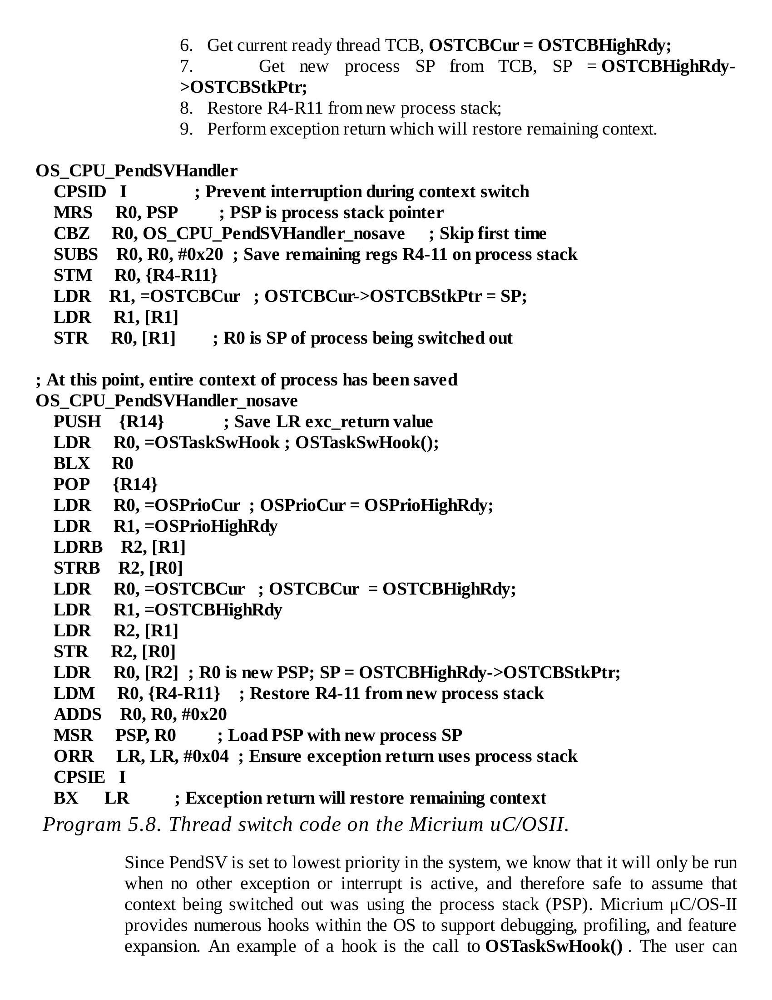
*Description*: Technical schematic and block diagram illustrating circuit operation, signal pathways, and functional behavior for Program 5.8: Thread switch code on the Micrium uC/OSII..

> **Program 5.8: Thread switch code on the Micrium uC/OSII.**

Since PendSV is set to lowest priority in the system, we know that it will only be run
when no other exception or interrupt is active, and therefore safe to assume that
context being switched out was using the process stack (PSP). Micrium μC/OS-II
provides numerous hooks within the OS to support debugging, profiling, and feature
expansion. An example of a hook is the call to OSTaskSwHook() . The user can


<!-- Page 321 -->
### [PDF Page 321]

specify the action invoked by this call.
Micrium µC/OS-III extends this OS with many features as more threads, round-robin
scheduling, enhanced messaging, extensive performance measurements, and time
stamps.
5.5.2. Texas Instruments RTOS
TI-RTOS scales from a real-time multitasking kernel to a complete RTOS solution
including additional middleware components and device drivers. TI-RTOS is
provided with full source code and requires no up-front or runtime license fees. TI-
RTOS Kernel is available on most TI microprocessors, microcontrollers and DSPs.
TI-RTOS middleware, drivers and board initialization components are available on
select ARM® Cortex™-M4 Tiva-C, C2000™ dual core C28x + ARM Cortex-M3,
MSP430 microcontrollers, and the SimpleLink™ WiFi® CC3200.  For more
information, see http://www.ti.com/tool/ti-rtos or search RTOS on www.ti.com. TI-
RTOS combines a real-time multitasking kernel with additional middleware
components including TCP/IP and USB stacks, a FAT file system, and device drivers,
see Figure 5.17 and Table 5.2. TI-RTOS provides a consistent embedded software
platform across TI’s microcontroller devices, making it easy to port legacy
applications to the latest devices.

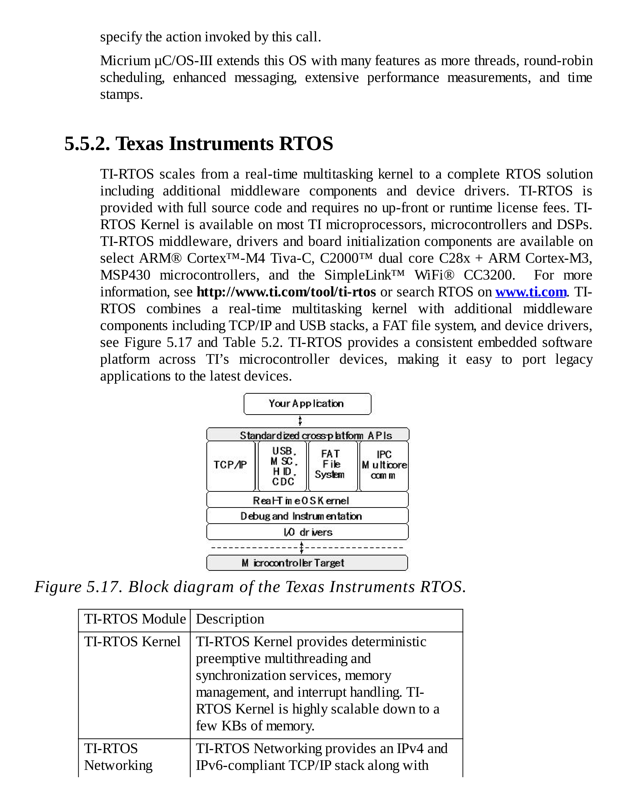
*Description*: Architectural block diagram detailing logic modules, memory buses, internal registers, and hardware interconnections for Figure 5.17: Block diagram of the Texas Instruments RTOS..

> **Figure 5.17: Block diagram of the Texas Instruments RTOS.**

TI-RTOS Module Description
TI-RTOS Kernel
TI-RTOS Kernel provides deterministic
preemptive multithreading and
synchronization services, memory
management, and interrupt handling. TI-
RTOS Kernel is highly scalable down to a
few KBs of memory.
TI-RTOS
Networking
TI-RTOS Networking provides an IPv4 and
IPv6-compliant TCP/IP stack along with


<!-- Page 322 -->
### [PDF Page 322]

associated network applications such as
DNS, HTTP, and DHCP.
TI-RTOS File
System
TI-RTOS File System is a FAT-compatible
file system based on the open source Fatfs
product.
TI-RTOS USB
TI-RTOS USB provides both USB Host and
Device stacks, as well as MSC, CDC, and
HID class drivers. TI-RTOS USB uses the
proven TivaWare USB stack.
TI-RTOS IPC
The TI-RTOS IPC provides efficient
interprocessor communication in multicore
devices.
TI-RTOS
Instrumentation
TI-RTOS Instrumentation  allows developers
to include debug instrumentation in their
application that enables run-time behavior,
including context-switching, to be displayed
by system-level  analysis tools.
TI-RTOS Drivers

```assembly
and Board
```

Initialization
TI-RTOS Drivers and Board Initialization
provides a set of device driver APIs, such as
Ethernet, UART and IIC, that are standard
across all devices, as well as initialization
code for all supported boards. All driver and
board initialization APIs are built on the
TivaWare, MWare, or MSP430Ware
libraries.

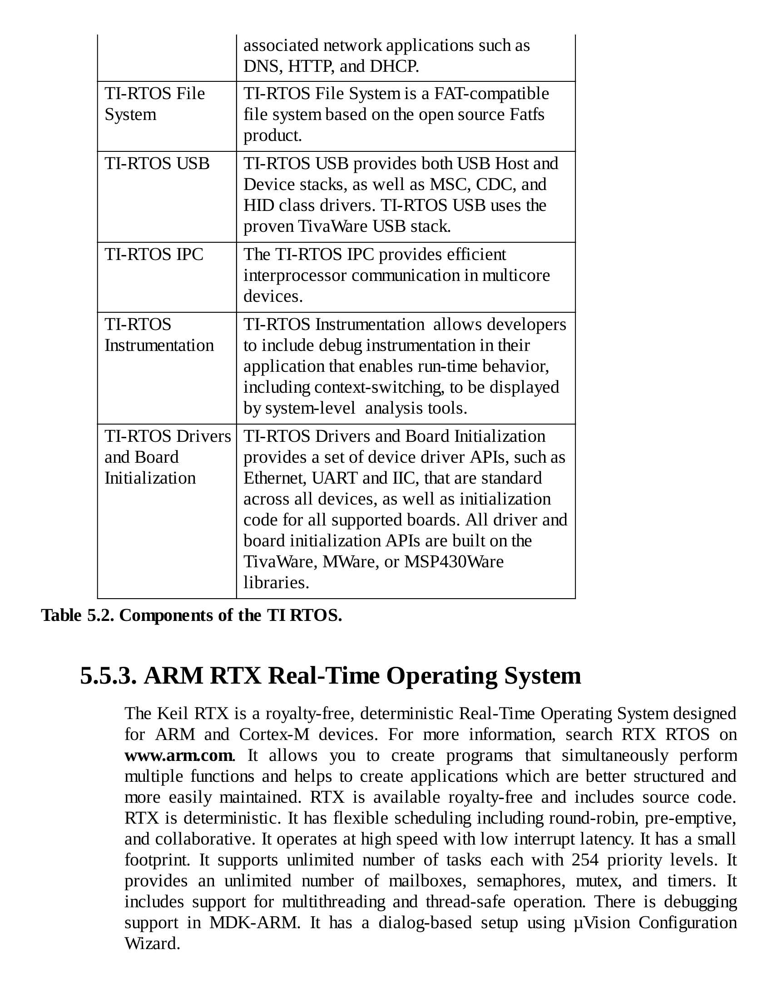
*Description*: Architectural block diagram detailing logic modules, memory buses, internal registers, and hardware interconnections for Table 5.2: Components of the TI RTOS..

> **Table 5.2: Components of the TI RTOS.**

5.5.3. ARM RTX Real-Time Operating System
The Keil RTX is a royalty-free, deterministic Real-Time Operating System designed
for ARM and Cortex-M devices. For more information, search RTX RTOS on
www.arm.com. It allows you to create programs that simultaneously perform
multiple functions and helps to create applications which are better structured and
more easily maintained. RTX is available royalty-free and includes source code.
RTX is deterministic. It has flexible scheduling including round-robin, pre-emptive,

```assembly
and collaborative. It operates at high speed with low interrupt latency. It has a small
```

footprint. It supports unlimited number of tasks each with 254 priority levels. It
provides an unlimited number of mailboxes, semaphores, mutex, and timers. It
includes support for multithreading and thread-safe operation. There is debugging
support in MDK-ARM. It has a dialog-based setup using µVision Configuration
Wizard.


<!-- Page 323 -->
### [PDF Page 323]

RTX allows up to 250 active tasks. The priority scheduler supports up to 254
priority levels. The OS will dynamically check for valid stacks for running tasks. It
implements timeouts, interval timing, and user timers. Synchronization and inter-task
communication are handled by  signals/events, semaphores, mutexes, and mailboxes.
A task switch, the Cortex M3 version shown as Program 5.9, requires 192 bus
cycles. The STMDB instruction saves the current thread and the LDMIA  instruction
restores the context for the next thread.
__asm void PendSV_Handler (void) {

```assembly
BL      __cpp(rt_pop_req)   ; choose next thread to run
LDR     R3,=__cpp(&os_tsk)
LDM     R3,{R1,R2}              ; os_tsk.run, os_tsk.new
CMP     R1,R2
```

BEQ     Sys_Exit

```assembly
PUSH    {R2,R3}
MOV     R3,#0
STRB    R3,[R1,#TCB_RETUPD]     ; os_tsk.run->ret_upd = 0
MRS     R12,PSP                 ; Read PSP
STMDB   R12!,{R4-R11}           ; Save Old context
STR     R12,[R1,#TCB_TSTACK]    ; Update os_tsk.run->tsk_stack
BL      rt_stk_check            ; Check for Stack overflow
POP     {R2,R3}
STR     R2,[R3]                 ; os_tsk.run = os_tsk.new
LDR     R12,[R2,#TCB_TSTACK]    ; os_tsk.new->tsk_stack
LDMIA   R12!,{R4-R11}           ; Restore New Context
MSR     PSP,R12                 ; Write PSP
LDRB    R3,[R2,#TCB_RETUPD]     ; Update ret_val?
```

CBZ     R3,Sys_Exit
LDRB    R3,[R2,#TCB_RETVAL]     ; Write os_tsk.new->ret_val

```assembly
STR     R3,[R12]
Sys_Exit MVN    LR,#:NOT:0xFFFFFFFD     ; set EXC_RETURN value
BX      LR                      ; Return to Thread Mode
}
```


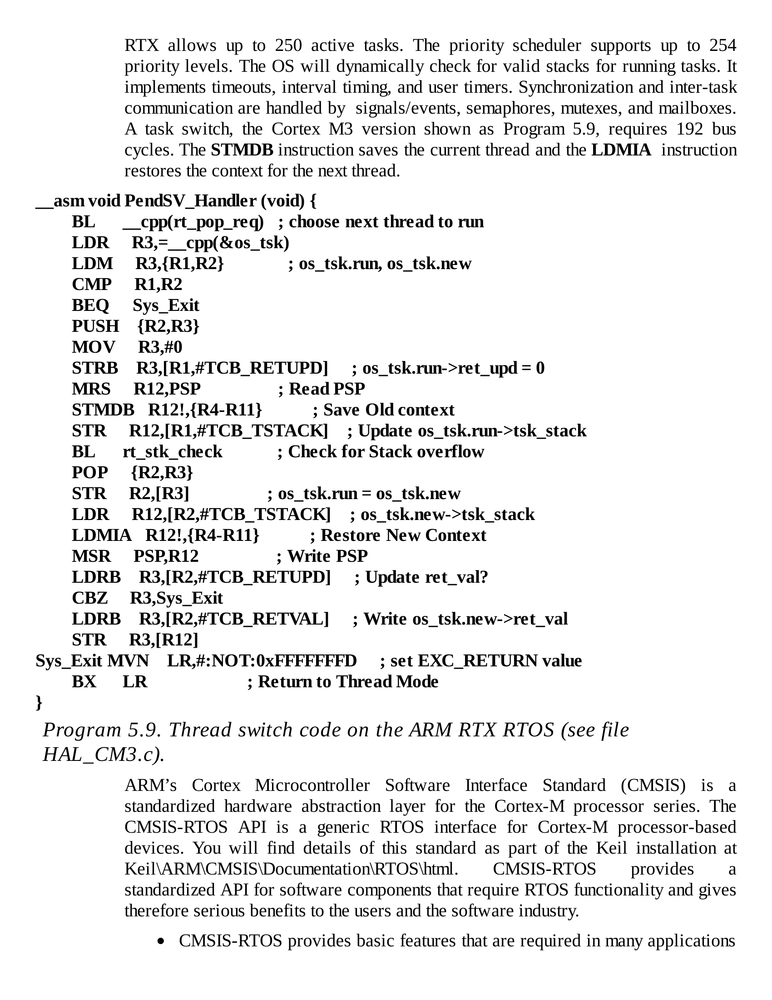
*Description*: Technical schematic and block diagram illustrating circuit operation, signal pathways, and functional behavior for Program 5.9: Thread switch code on the ARM RTX RTOS (see file.

> **Program 5.9: Thread switch code on the ARM RTX RTOS (see file**

HAL_CM3.c).
ARM’s Cortex Microcontroller Software Interface Standard (CMSIS) is a
standardized hardware abstraction layer for the Cortex-M processor series. The
CMSIS-RTOS API is a generic RTOS interface for Cortex-M processor-based
devices. You will find details of this standard as part of the Keil installation at
Keil\ARM\CMSIS\Documentation\RTOS\html.
CMSIS-RTOS
provides
a
standardized API for software components that require RTOS functionality and gives
therefore serious benefits to the users and the software industry.
CMSIS-RTOS provides basic features that are required in many applications


<!-- Page 324 -->
### [PDF Page 324]

or technologies such as UML or Java (JVM).
The unified feature set of the CMSIS-RTOS API simplifies sharing of
software components and reduces learning efforts.
Middleware components that use the CMSIS-RTOS API are RTOS agnostic.
CMSIS-RTOS compliant middleware is easier to adapt.
Standard project templates (such as motor control) of the CMSIS-RTOS API
may be shipped with freely available CMSIS-RTOS implementations.
5.5.4. FreeRTOS
FreeRTOS is a class of RTOS that is designed to be small enough to run on a
microcontroller. FreeRTOS only provides the core real-time scheduling functionality,
inter-task communication, timing and synchronization primitives. This means it is
more accurately described as a real-time kernel, or real-time executive. FreeRTOS is
available for 35 processor architectures, with millions of product deployments. For
more
information
on
FreeRTOS,
see
their
web
site
at
http://www.freertos.org/RTOS-Cortex-M3-M4.html. The starter project for the
LM3S811 can be easily recompiled to run an any of the Texas Instruments Cortex M
microcontrollers.
FreeRTOS is licensed under a modified GPL and can be used in commercial
applications under this license without any requirement to expose your proprietary
source code. An alternative commercial license option is also available in cases that:
You wish to receive direct technical support. You wish to have assistance with your
development. You require legal protection or other assurances. Program 5.10shows
the PendSV handler that implements the context switch. Notice that this thread switch
does not disable interrupts. Rather, the ISB instruction acts as an instruction
synchronization barrier. It flushes the pipeline of the processor, so that all
instructions following the ISB are fetched from cache or memory again, after the ISB
instruction has been completed. Similar to Micrium μC/OS-II and ARM RTX, the
FreeRTOS does run user threads with the process stack pointer (PSP).
__asm void xPortPendSVHandler( void ){
extern uxCriticalNesting;
extern pxCurrentTCB;
extern vTaskSwitchContext;
PRESERVE8
mrs r0, psp
isb
ldr
r3, =pxCurrentTCB
/* Get the location of current TCB. */
ldr
r2, [r3]
stmdb r0!, {r4-r11}
/* Save the remaining registers. */

```assembly
str r0, [r2]
```

/* Save the new top of stack into the TCB. */


<!-- Page 325 -->
### [PDF Page 325]

stmdb sp!, {r3, r14}

```assembly
mov r0, #configMAX_SYSCALL_INTERRUPT_PRIORITY
```

msr basepri, r0

```assembly
bl vTaskSwitchContext
mov r0, #0
```

msr basepri, r0
ldmia sp!, {r3, r14}

```assembly
ldr r1, [r3]
ldr r0, [r1] /* first item in pxCurrentTCB is task top of stack. */
ldmia r0!, {r4-r11} /* Pop registers and critical nesting count. */
```

msr psp, r0
isb

```assembly
bx r14
```

nop
}

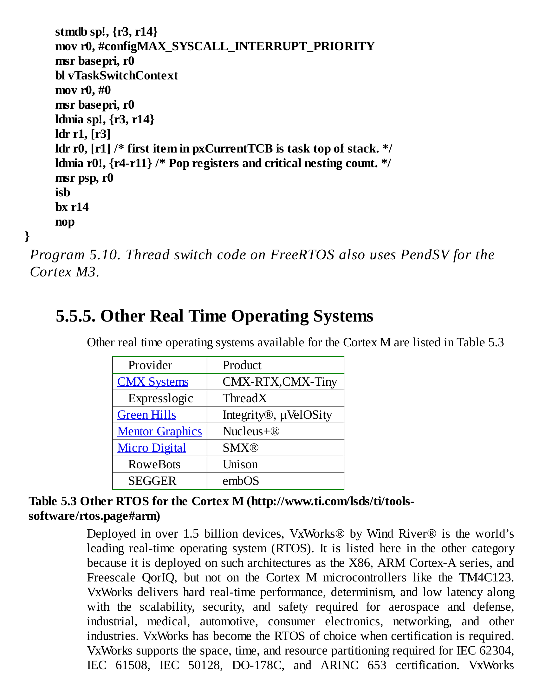
*Description*: Technical schematic and block diagram illustrating circuit operation, signal pathways, and functional behavior for Program 5.10: Thread switch code on FreeRTOS also uses PendSV for the.

> **Program 5.10: Thread switch code on FreeRTOS also uses PendSV for the**

Cortex M3.
5.5.5. Other Real Time Operating Systems
Other real time operating systems available for the Cortex M are listed in Table 5.3
Provider
Product
CMX Systems
CMX-RTX,CMX-Tiny
Expresslogic
ThreadX
Green Hills
Integrity®, µVelOSity
Mentor Graphics
Nucleus+®
Micro Digital
SMX®
RoweBots
Unison
SEGGER
embOS


*Description*: Reference table detailing hardware parameters, register bit patterns, performance metrics, or memory configurations for Table 5.3: Other RTOS for the Cortex M (http://www.ti.com/lsds/ti/tools-.

> **Table 5.3: Other RTOS for the Cortex M (http://www.ti.com/lsds/ti/tools-**

software/rtos.page#arm)
Deployed in over 1.5 billion devices, VxWorks® by Wind River® is the world’s
leading real-time operating system (RTOS). It is listed here in the other category
because it is deployed on such architectures as the X86, ARM Cortex-A series, and
Freescale QorIQ, but not on the Cortex M microcontrollers like the TM4C123.
VxWorks delivers hard real-time performance, determinism, and low latency along
with the scalability, security, and safety required for aerospace and defense,
industrial, medical, automotive, consumer electronics, networking, and other
industries. VxWorks has become the RTOS of choice when certification is required.
VxWorks supports the space, time, and resource partitioning required for IEC 62304,
IEC 61508, IEC 50128, DO-178C, and ARINC 653 certification. VxWorks


<!-- Page 326 -->
### [PDF Page 326]

customers can design their systems to the required level of security by picking from a
comprehensive set of VxWorks security features. VxWorks is an important play in
providing solutions for the Internet of Things (IoT), where connectivity, scalability,
and
security
are
required.
For
more
information,
see
http://www.windriver.com/products/vxworks/


<!-- Page 327 -->
### [PDF Page 327]

5.6. Exercises

## 5.1 For each of the following terms give a definition in 16 words or less

a) aging
b) certification
c) starvation
d) least slack time first
e) exponential queue
f) maximum latency
g) rate monotonic
h) Kahn Process
Network
i) monitor

## 5.2 Select the best term from the book that describes each definition.

a) A technique to periodically increase the priority of low-priority threads so that
low priority threads occasionally get run. The increase is temporary.
b) A situation that can occur in a priority thread scheduler where a low-priority
thread never runs.
c) The condition where thread 1 is waiting for a unique resource held by thread 2,

```assembly
and thread 2 is waiting for a unique resource held by thread 1.
```

d) The condition where a thread is not allowed to run because it needs something
that is unavailable.
e) The condition where once a thread blocks, there are a finite number of threads
that will be allowed to proceed before this thread is allowed to proceed.
f) An operation that once started will run to completion without interruption
g) An implementation using a FIFO or mailbox that separates data input from data
processing.
h) A technique that could be used to prevent the user from executing I/O on a
driver until after the user calls the appropriate initialization.
i) A scheduling algorithm that assigns priority linearly related to how often a
thread needs to run. Threads needing to run more often have a higher priority.
j) An OS feature that allows the user to run user-defined software at specific
places within the OS. These programs are extra for the user’s convenience and not
required by the OS itself.
k) An OS feature that allows you to use the OS in safety-critical applications.
l) A scheduling algorithm with round robin order but varying time slice. If a
thread blocks on I/O, its time slice is reduced. If it runs to completion of a time
slice, its time slice is increased.
m) The condition where at most one thread is allowed access to a resource that
cannot be shared. If a second thread wishes access to the resource while the first
thread is using it, the second thread is made to wait until the first thread is
finished.
n) The condition a function has that allows it to be simultaneously executed by
multiple threads.
o) A thread scheduling algorithm that has the threads themselves decide when the
thread switches should occur.
p) A situation that can occur in a priority thread scheduler where a high-priority


<!-- Page 328 -->
### [PDF Page 328]

thread is waiting on a resource owned by a low-priority thread.
q) A type of semaphore implemented with a busy-wait loop.
r) A type of thread scheduler where each thread has equal priority and all threads
are executed in a circular sequence.

## 5.3 In this problem you will extend the preemptive scheduler to support priority. This

system should support three levels of priority "1" will be the highest. You can solve
this problem using either assembly or C.
a) Redesign the TCB to include a 32-bit integer for the priority (although the values
will be restricted to 1,2,3).  Show the static allocation for the three threads from the
example in this chapter assuming the first two are priority 2 and the last is priority 3.
There are no priority 1 threads in this example, but there might be in the future.
b) Redesign the scheduler to support this priority scheme.
c) In the book it said "Normally, we add priority to a system that implements
blocking semaphores and not to one that uses spinlock semaphores." What
specifically will happen here if the system is run with spinlock semaphores?
d) Even when the system supports blocking semaphores, starvation might happen to
the low priority threads. Describe the sequence of events that cause starvation.
e) Suggest a solution to the starvation problem.

## 5.4 This problem investigates the design of an adaptive priority scheduler with

exponential time slices. This is also called an exponential Queue or multi-level
feedback queue. The CTSS system (MIT, early 1960's) was the first to use
exponential queues. One of the difficulties in a priority scheduler is the assignment of
priority. Typically, one wishes to assign a high priority to threads doing I/O (which
block a lot) so that the response to I/O is short, and assign a low priority to threads
not doing I/O (which do not block a lot). However, in a complex system a particular
thread may sometimes exhibit I/O bound behavior, but later exhibit CPU bound
behavior. An adaptive scheduler will adjust the priority according to the current
activity of the thread.  Priority 1 threads will run with a time slice of 4000 (1ms),
priority 2 threads will run with a time slice of 8000 (2ms), and priority 3 threads
will run with a time slice of 16000 (4ms). Consider this blocking round-robin
scheduler, with two new entries, shown in bold, added to the TCB.

```c
struct TCB{
struct TCB *Next;    // Link to Next TCB
int32_t *StackPt;    // Stack Pointer
Sema4Type *BlockPt;  // 0 if not blocked, pointer if blocked
int16_t Priority;    // 1 (highest), 2, or 3 (lowest)
uint16_t TimeSlice; // 4000,8000, or 16000
int32_t Stack[100]; // stack, size determined at runtime
};
typedef struct TCB TCBType;
typedef TCBType * TCBPtr;
```

a) Rewrite the OS_Wait function so that if a priority 2 or 3 thread blocks, its priority


<!-- Page 329 -->
### [PDF Page 329]

will be raised (decrement by 1) and its time slice will be halved. No changes to
OS_Signal will be needed.
b) Rewrite the threadSwitch  ISR so that if a priority 1 or 2 thread runs to the end of
its time slice without blocking, its priority will be lowered (increment by 1) and its
time slice will be doubled. In addition, implement priority scheduling with variable
time slices.
5.5Consider the implementation of OS_AddThreads , shown in Program 3.4.
Redesign the system so that if the user program finishes, the OS will run the user
program again. For example, this user function executes stuff1 , stuff2 and stuff3
once and quits.

```c
void user(void){ stuff1(); stuff2(); stuff3();}
```

If the user calls this system function to activate user ,
OS_AddThreads(&user);
then with your updated system stuff1 , stuff2 and stuff3 will be repeated over and
over again. You are allowed to make changes to the struct  and to OS_AddThreads ,
but not to user or other OS functions. You can however add additional OS functions.
In particular, show changes to the struct and rewrite OS_AddThreads  in its
entirety.


