# Chapter 6: Digital Signal Processing

> **Textbook**: Embedded Systems: Real-Time Operating Systems for ARM Cortex-M Microcontrollers  
> **Author**: Jonathan W. Valvano  
> **PDF Page Range**: 330 - 361


---


<!-- Page 330 -->
### [PDF Page 330]

6. Digital Signal Processing

# Chapter 6 objectives are to:

• Introduce basic principles involved in digital filtering
• Define the Z Transform and use it to design and analyze digital filters
• Present the discrete Fourier Transform and use it to design digital
filters
• Develop digital filter implementations
• Present an audio input/output example
The goal of this chapter is to provide a brief introduction to digital signal
processing (DSP). DSP includes a wide range of operations such as digital
filtering,
event
detection,
frequency
spectrum
analysis
and
signal
compression/decompression. Similar to the goal of analog filtering, a digital
filter will be used to improve the signal to noise ratio in our data. The
difference is that a digital filter is performed in software on the digital data
sampled by the ADC converter. The particular problem addressed in a couple
of ways in this chapter is removing 60 Hz noise from the signal.  Like the
control systems and communication systems discussed elsewhere in these
volumes, we will provide just a brief discussion to the richly developed
discipline of DSP. Again, this chapter focuses mostly on the implementation on
the embedded microcomputer. Event detection is the process of identifying the
presence or absence of particular patterns in our data. Examples of this type of
processing include optical character readers, waveform classification, sonar
echo detection, infant apnea monitors, heart arrhythmia detectors and burglar
alarms. Frequency spectrum analysis requires the calculation of the Discrete
Fourier Transform (DFT). A fast algorithm to calculate the DFT is called the
Fast Fourier Transform, FFT. Like the regular Fourier Transform, the DFT
converts a time-dependent signal into the frequency domain. The difference a
regular Fourier Transform and the DFT is that the DFT performs the
conversion on a finite number of discrete time digital samples to give a finite
number of points at discrete frequencies. We will use the DFT in this chapter
as a flexible way to design digital filters. Data compression and
decompression are important aspects in high-speed communication systems.
Although we will not specifically address the problems of event detection,
DFT and compression/decompression in this book, these DSP operations are
implemented using similar techniques as the digital filters that are presented in
this chapter. The goal of this chapter is to demonstrate that fairly powerful
digital signal processing techniques can be implemented on most
microcontrollers.


<!-- Page 331 -->
### [PDF Page 331]

6.1. Basic Principles
The objective of this section is to introduce simple digital filters. Let xc(t) be the
continuous analog signal to be digitized. xc(t) is the analog input to the ADC
converter. If fs is the sample rate, then the computer samples the ADC every T
seconds. (T = 1/fs). Let ...,x(n),... be the ADC output sequence, where
x(n) = xc(nT)
with -∞ < n  < +∞.
There are two types of approximations associated with the sampling process.
Because of the finite precision of the ADC, amplitude errors occur when the
continuous signal, xc(t), is sampled to obtain the digital sequence, x(n). The second
type of error occurs because of the finite sampling frequency. The Nyquist Theorem
states that the digital sequence, x(n), properly represents the DC to ½fs frequency
components of the original signal, xc(t). There are two important assumptions that are
necessary to make when using digital signal processing:
1. We assume the signal has been sampled at a fixed and known rate,
fs
2. We assume aliasing has not occurred.
We can guarantee the first assumption by using a hardware clock to start the ADC at a
fixed and known rate. A less expensive but not as reliable method is to implement the
sampling routine as a high priority periodic interrupt process. If the time jitter is δt
then we can estimate the voltage error by multiplying the time jitter by the slew rate
of the input, ∂V∂t*δt. By establishing a high priority of the interrupt handler, we can
place an upper bound on the interrupt latency, guaranteeing that ADC sampling is
occurring at an almost fixed and known rate. We can observe the ADC input with a
spectrum analyzer to prove there are no significant signal components above ½fs.
“No significant signal components” is defined as having an ADC input voltage |Z|
less than the ADC resolution, ∆z,
|Z| ≤ ∆z     for all f ≥ ½fs
A causal digital filter calculates y(n) from y(n-1), y(n-2),... and x(n), x(n-1), x(n‑2),...
Simply put, a causal filter cannot have a nonzero output until it is given a nonzero
input.  The output of a causal filter, y(n), cannot depend on future data (e.g., y(n+1),
x(n+1) etc.)
A linear filter is constructed from a linear equation. A nonlinear filter is constructed
from a nonlinear equation. An example of a nonlinear filter is the median. To


<!-- Page 332 -->
### [PDF Page 332]

calculate the median of three numbers, one first sorts the numbers according to
magnitude, then chooses the middle value. Other simple nonlinear filters include
maximum, minimum, and square.
A finite impulse response filter (FIR) relates y(n) only in terms of x(n), x(n-1),
x(n‑2),... If the sampling rate is 360 Hz, this simple FIR filter will remove 60 Hz
noise:
y(n) = (x(n)+x(n-3))/2
An infinite impulse response filter (IIR) relates y(n) in terms of both x(n), x(n-1),...,

```assembly
and y(n‑1), y(n-2),... This simple IIR filter has averaging or low-pass behavior:
y(n) = (x(n)+y(n-1))/2
```

One way to analyze linear filters is the Z-Transform. The definition of the Z-
Transform is:
X(z)  =  Z[x(n)]  ≡ sum(x(n)*z-n) for n= -∞ to +∞
The Z-transform is similar to other transforms. In particular, consider the Laplace
Transform, which converts a continuous time-domain signal, x(t), into the frequency
domain, X(s). In the same manner, the Z-Transform converts a discrete time sequence,
x(n), into the frequency domain, X(z). See Figure 6.1.


*Description*: Technical schematic and block diagram illustrating circuit operation, signal pathways, and functional behavior for Figure 6.1: A transform is used to study a signal in the frequency domain..

> **Figure 6.1: A transform is used to study a signal in the frequency domain.**

The input to both the Laplace and Z Transforms are infinite time signals, having
values at times from -∞ to + ∞. The frequency parameters, s and z, are complex
numbers, having real and imaginary parts. In both cases we apply the transform to
study linear systems. In particular, we can describe the behavior (gain and phase) of
an analog system using its transform, H(s) = Y(s)/X(s). In this same way we will use
the H(z) transform of a digital filter to determine its gain and phase response. See

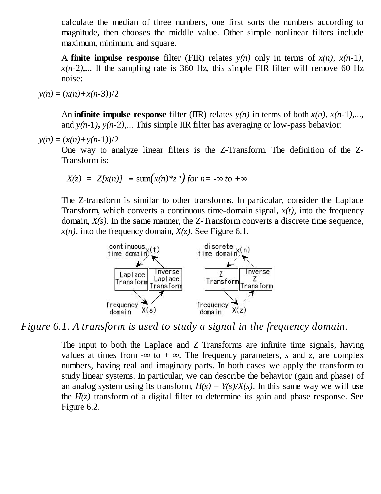
*Description*: Technical schematic and block diagram illustrating circuit operation, signal pathways, and functional behavior for Figure 6.2.

> **Figure 6.2**


<!-- Page 333 -->
### [PDF Page 333]


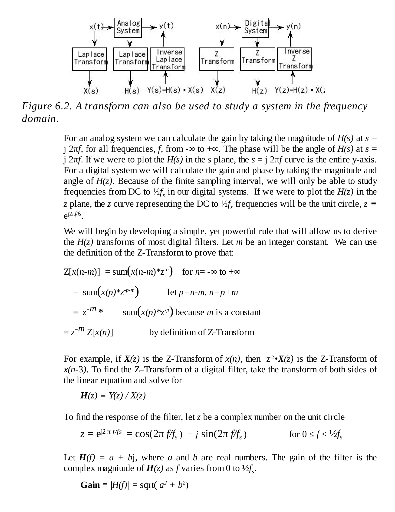
*Description*: Technical schematic and block diagram illustrating circuit operation, signal pathways, and functional behavior for Figure 6.2: A transform can also be used to study a system in the frequency.

> **Figure 6.2: A transform can also be used to study a system in the frequency**

domain.
For an analog system we can calculate the gain by taking the magnitude of H(s) at s =
j 2πf, for all frequencies, f, from -∞ to +∞. The phase will be the angle of H(s) at s =
j 2πf. If we were to plot the H(s) in the s plane, the s = j 2πf curve is the entire y-axis.
For a digital system we will calculate the gain and phase by taking the magnitude and
angle of H(z). Because of the finite sampling interval, we will only be able to study
frequencies from DC to ½fs in our digital systems.  If we were to plot the H(z) in the
z plane, the z curve representing the DC to ½fs frequencies will be the unit circle, z ≡
ej2πf/fs.
We will begin by developing a simple, yet powerful rule that will allow us to derive
the H(z) transforms of most digital filters. Let m be an integer constant.  We can use
the definition of the Z-Transform to prove that:
Z[x(n-m)]  = sum(x(n-m)*z-n)    for n= -∞ to +∞
=  sum(x(p)*z-p-m)
let p=n-m, n=p+m
=  z-m *
sum(x(p)*z-p) because m is a constant
= z-m Z[x(n)]
by definition of Z-Transform
For example, if X(z) is the Z-Transform of x(n), then  z-3•X(z) is the Z-Transform of
x(n-3). To find the Z–Transform of a digital filter, take the transform of both sides of
the linear equation and solve for
H(z) ≡ Y(z) / X(z)
To find the response of the filter, let z be a complex number on the unit circle
z = ej2 π f/fs  = cos(2π f/fs )  + j sin(2π f/fs )
for 0 ≤ f < ½fs
Let H(f) = a + bj, where a and b are real numbers. The gain of the filter is the
complex magnitude of H(z) as f varies from 0 to ½fs.
Gain ≡ |H(f)| = sqrt( a2 + b2)


<!-- Page 334 -->
### [PDF Page 334]

The phase response of the filter is the angle of H(z) as f varies from 0 to ½fs.
Phase ≡ angle[H(f)] =  tan-1 (b/a)
Another way to analyze digital filters is to consider the filter response to particular
input sequences. Two typical sequences are the step and the impulse (Figure 6.3).
step
..., 0, 0, 0, 1, 1, 1, 1, ...
impulse
..., 0, 0, 0, 1, 0, 0, 0, ...
The impulse is defined as:
i(n) ≡
1
for n = 0
0
for n ≠ 0
The step is defined as:
s(n) ≡
0
for n < 0
1
for n ≥ 0


*Description*: Technical schematic and block diagram illustrating circuit operation, signal pathways, and functional behavior for Figure 6.3: Step and impulse inputs..

> **Figure 6.3: Step and impulse inputs.**

The step signal represents a sharp change (like an edge in a photograph). We will
analyze three digital filters. The FIR is y(n) = (x(n)+x(n-1))/2. The IIR is y(n) =
(x(n)+y(n-1))/2. The nonlinear filter is y(n) = median(x(n), x(n-1), x(n-2)).  The
median can be performed on any odd number of data points by sorting the data and
selecting the middle value.  The median filter can be performed recursively or
nonrecursively. A nonrecursive 3-wide median filter is implemented in Program 6.1.

```c
uint8_t Median(uint8_t u1,uint8_t u2,uint8_t u3){
uint8_t result;
if(u1>u2)
if(u2>u3)     result = u2;   // u1>u2,u2>u3       u1>u2>u3
```

else

```c
if(u1>u3) result = u3;   // u1>u2,u3>u2,u1>u3 u1>u3>u2
else      result = u1;   // u1>u2,u3>u2,u3>u1 u3>u1>u2
```

else

```c
if(u3>u2)     result = u2;   // u2>u1,u3>u2       u3>u2>u1
```

else

```c
if(u1>u3) result = u1;   // u2>u1,u2>u3,u1>u3 u2>u1>u3
else      result = u3;   // u2>u1,u2>u3,u3>u1 u2>u3>u1
return(result);
}
```


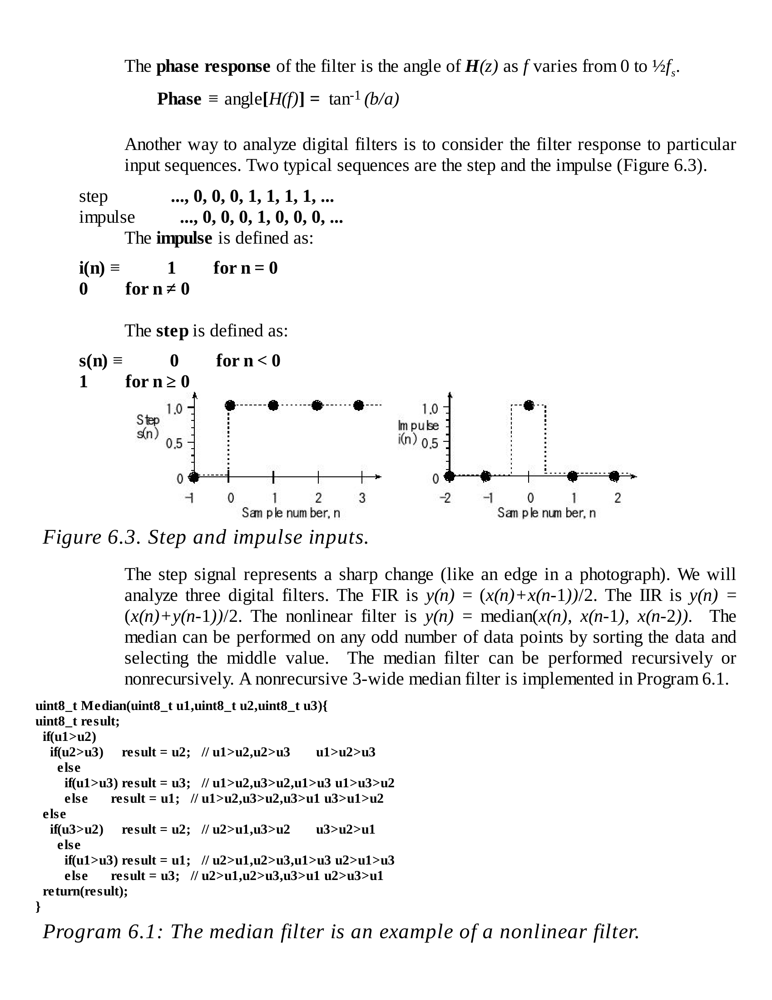
*Description*: Technical schematic and block diagram illustrating circuit operation, signal pathways, and functional behavior for Program 6.1: The median filter is an example of a nonlinear filter..

> **Program 6.1: The median filter is an example of a nonlinear filter.**


<!-- Page 335 -->
### [PDF Page 335]

For a nonrecursive median filter, the original data points are not modified. For
example, a 5-wide nonrecursive median filter takes as the filter output the median of
{x(n), x(n-1), x(n-2), x(n–3), x(n-4)}  On the other hand, a recursive median filter
replaces the sample point with the filter output.  For example, a 5-wide recursive
median filter takes as the filter output the median of {x(n), y(n-1), y(n-2), y(n-3), y(n-
4)} where y(n-1), y(n-2),... are the previous filter outputs. A median filter can be
applied in systems that have impulse or speckle noise. For example, the noise every
once in a while causes one sample to be very different than the rest (like a speck on a
piece of paper) then the median filter will completely eliminate the noise. Except for
the delay, the median filter passes a step without error. The step responses of the
three filters are (Figure 6.4):
FIR
..., 0, 0, 0, 0.5, 1, 1, 1, ...
IIR
..., 0, 0, 0, 0.5, 0.75, 0.88, 0.94, 0.97, 0.98, 0.99, ...
median
..., 0, 0, 0, 0, 1, 1, 1, 1, 1, ...


*Description*: Technical schematic and block diagram illustrating circuit operation, signal pathways, and functional behavior for Figure 6.4: Step response of three simple digital filters..

> **Figure 6.4: Step response of three simple digital filters.**

The impulse represents a noise spike (like spots on a Xerox copy). The impulse
response of a filter is defined as h(n). The median filter completely removes the
impulse. The impulse responses of the three filters are (Figure 6.5):
FIR
..., 0, 0, 0, 0.5, 0.5, 0, 0, 0, ...
IIR
..., 0, 0, 0, 0.5, 0.25, 0.13, 0.06, 0.03, 0.02, 0.01, ...
median
..., 0, 0, 0, 0, 0, 0, 0, 0, ...

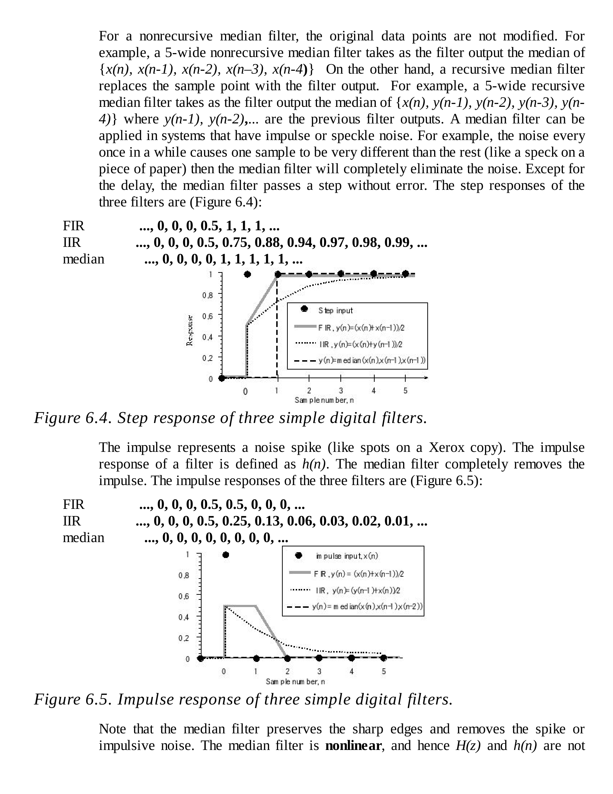
*Description*: Technical schematic and block diagram illustrating circuit operation, signal pathways, and functional behavior for Figure 6.5: Impulse response of three simple digital filters..

> **Figure 6.5: Impulse response of three simple digital filters.**

Note that the median filter preserves the sharp edges and removes the spike or
impulsive noise. The median filter is nonlinear, and hence H(z) and h(n) are not


<!-- Page 336 -->
### [PDF Page 336]

defined for this particular class of filters. For linear filters, the impulse response,
h(n), can also be used as an alternative to the transfer function H(z). h(n) is
sometimes called the direct form. A causal filter has h(n) = 0 for n less than 0. For a
casual filter.
H(z) =sum(h(n)*z-n)  for n=0 to +∞
For a finite impulse response (FIR) filter, h(n) = 0 for n ≥ N for some finite N. Thus,
H(z) = sum(h(n)*z-n)  for n=0 to N-1
The output of a filter can be calculated by convolving the input sequence, x(n), with
h(n). For an infinite impulse response filter:
y(n) =  sum(h(n)*x(n-k))  for n=0 to +∞
For a finite impulse response (FIR) filter:
y(n) =  sum(h(n)*x(n-k))  for n=0 to N-1


<!-- Page 337 -->
### [PDF Page 337]

6.2. Multiple Access Circular Queue
A multiple access circular queue (MACQ) is used for data acquisition and control
systems. A MACQ is a fixed length order preserving data structure, see Figure 6.6.
The source process (ADC sampling software) places information into the MACQ.
Once initialized, the MACQ is always full. The oldest data is discarded when the
newest data is Put into a MACQ.  The sink process can read any of the data from the
MACQ. The Read function is non-destructive. This means that the MACQ is not
changed by the Read operation. In this MACQ, the newest sample, x(n), is stored in
element x[0] . x(n-1), is stored in element x[1] .

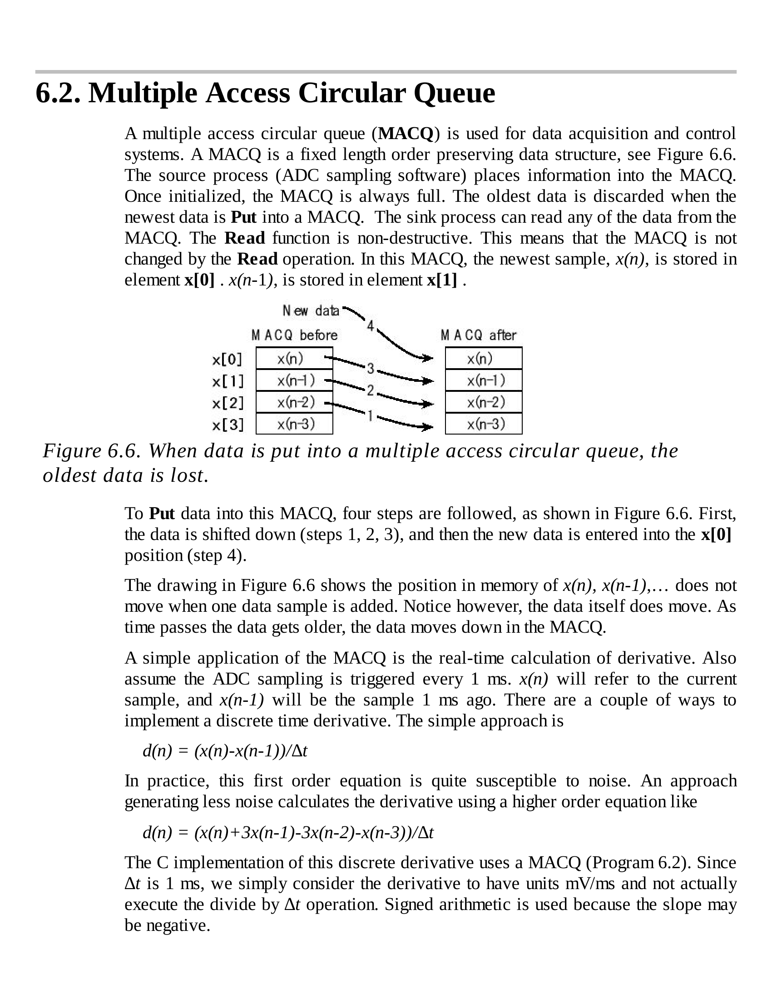
*Description*: Technical schematic and block diagram illustrating circuit operation, signal pathways, and functional behavior for Figure 6.6: When data is put into a multiple access circular queue, the.

> **Figure 6.6: When data is put into a multiple access circular queue, the**

oldest data is lost.
To Put data into this MACQ, four steps are followed, as shown in Figure 6.6. First,
the data is shifted down (steps 1, 2, 3), and then the new data is entered into the x[0]
position (step 4).
The drawing in Figure 6.6 shows the position in memory of x(n), x(n-1),… does not
move when one data sample is added. Notice however, the data itself does move. As
time passes the data gets older, the data moves down in the MACQ.
A simple application of the MACQ is the real-time calculation of derivative. Also
assume the ADC sampling is triggered every 1 ms. x(n) will refer to the current
sample, and x(n-1) will be the sample 1 ms ago. There are a couple of ways to
implement a discrete time derivative. The simple approach is
d(n) = (x(n)-x(n-1))/∆t
In practice, this first order equation is quite susceptible to noise. An approach
generating less noise calculates the derivative using a higher order equation like
d(n) = (x(n)+3x(n-1)-3x(n-2)-x(n-3))/∆t
The C implementation of this discrete derivative uses a MACQ (Program 6.2). Since
∆t is 1 ms, we simply consider the derivative to have units mV/ms and not actually
execute the divide by ∆t operation. Signed arithmetic is used because the slope may
be negative.


<!-- Page 338 -->
### [PDF Page 338]


```c
int32_t x[4]; // MACQ (mV)
int32_t d;    // derivative(V/s)
void ADC3_Handler(void){
ADC_ISC_R = 0x08;     // acknowledge ADC sequence 3 completion
x[3] = x[2];  // shift data
x[2] = x[1];  // units of mV
x[1] = x[0];
x[0] = (3000*ADC_SSFIFO3_R)>>12; // in mV
d = x[0]+3*x[1]-3*x[2]-x[3];     // in V/s
Fifo_Put(d);  // pass to foreground
}
```


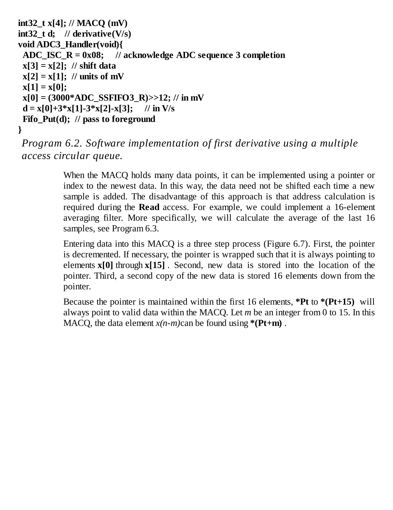
*Description*: Technical schematic and block diagram illustrating circuit operation, signal pathways, and functional behavior for Program 6.2: Software implementation of first derivative using a multiple.

> **Program 6.2: Software implementation of first derivative using a multiple**

access circular queue.
When the MACQ holds many data points, it can be implemented using a pointer or
index to the newest data. In this way, the data need not be shifted each time a new
sample is added. The disadvantage of this approach is that address calculation is
required during the Read access. For example, we could implement a 16-element
averaging filter. More specifically, we will calculate the average of the last 16
samples, see Program 6.3.
Entering data into this MACQ is a three step process (Figure 6.7). First, the pointer
is decremented. If necessary, the pointer is wrapped such that it is always pointing to
elements x[0] through x[15] . Second, new data is stored into the location of the
pointer. Third, a second copy of the new data is stored 16 elements down from the
pointer.
Because the pointer is maintained within the first 16 elements, *Pt to *(Pt+15)  will
always point to valid data within the MACQ. Let m be an integer from 0 to 15. In this
MACQ, the data element x(n-m)can be found using *(Pt+m) .


<!-- Page 339 -->
### [PDF Page 339]


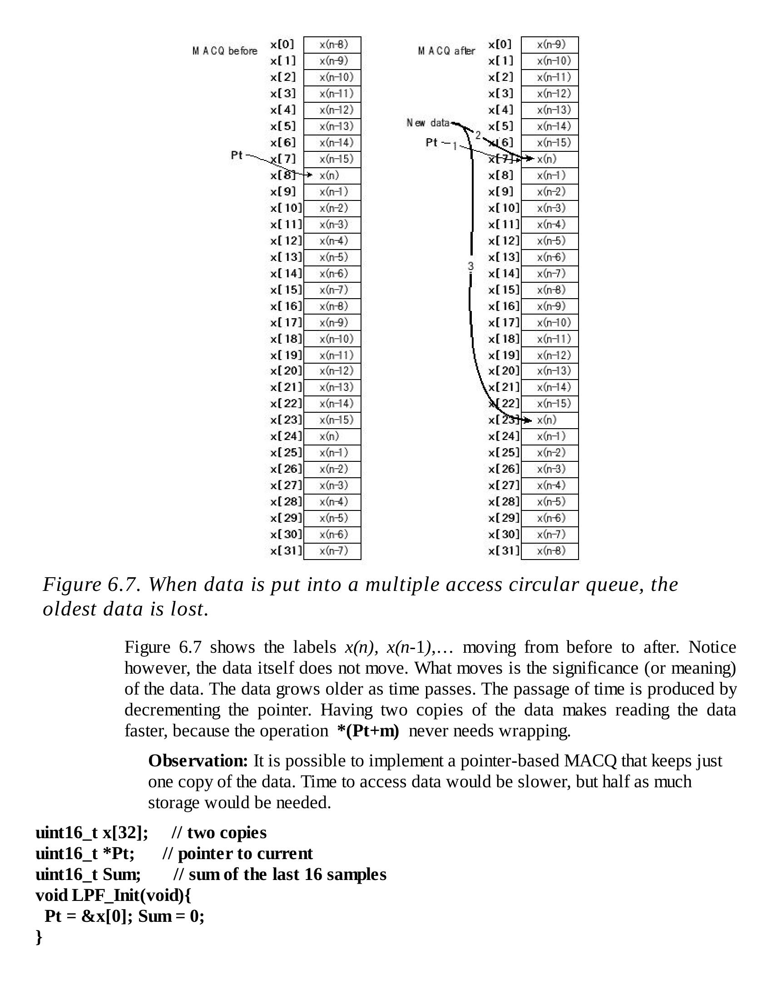
*Description*: Technical schematic and block diagram illustrating circuit operation, signal pathways, and functional behavior for Figure 6.7: When data is put into a multiple access circular queue, the.

> **Figure 6.7: When data is put into a multiple access circular queue, the**

oldest data is lost.


*Description*: Technical schematic and block diagram illustrating circuit operation, signal pathways, and functional behavior for Figure 6.7: shows the labels x(n), x(n-1),… moving from before to after. Notice.

> **Figure 6.7: shows the labels x(n), x(n-1),… moving from before to after. Notice**

however, the data itself does not move. What moves is the significance (or meaning)
of the data. The data grows older as time passes. The passage of time is produced by
decrementing the pointer. Having two copies of the data makes reading the data
faster, because the operation *(Pt+m)  never needs wrapping.
Observation: It is possible to implement a pointer-based MACQ that keeps just
one copy of the data. Time to access data would be slower, but half as much
storage would be needed.
uint16_t x[32];     // two copies
uint16_t *Pt;      // pointer to current
uint16_t Sum;       // sum of the last 16 samples

```c
void LPF_Init(void){
Pt = &x[0]; Sum = 0;
}
```


<!-- Page 340 -->
### [PDF Page 340]

// calculate one filter output, called at sampling rate
// Input: new ADC data   Output: filter output, DAC data
uint16_t LPF_Calc(uint16_t newdata){
Sum = Sum - *(Pt+16);     // subtract the one 16 samples ago

```c
if(Pt == &x[0]){
Pt = &x[16];           // wrap
} else{
Pt--;                 // make room for data
}
*Pt = *(Pt+16) = newdata; // two copies of the new data
return Sum/16;
}
```


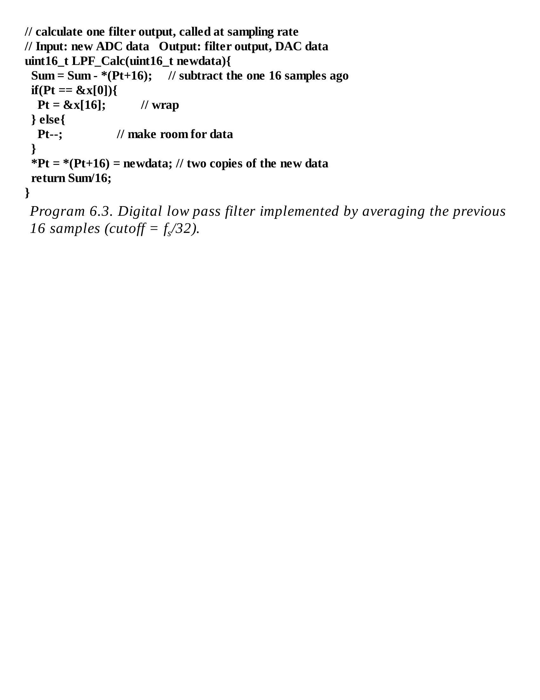
*Description*: Technical schematic and block diagram illustrating circuit operation, signal pathways, and functional behavior for Program 6.3: Digital low pass filter implemented by averaging the previous.

> **Program 6.3: Digital low pass filter implemented by averaging the previous**

16 samples (cutoff = fs/32).


<!-- Page 341 -->
### [PDF Page 341]

6.3. Using the Z-Transform to Derive Filter Response
In this section, we will use the Z-Transform to determine the digital filter response
(gain and phase) given the filter equation. The first example is the average of the
current sample with the sample 3 times ago. Program 6.4 shows the implementation.
y(n) = (x(n)+x(n-3))/2
The first step is to take the Z-Transform of both sides of the equation. The Z-
Transform of y(n) is Y(z), the Z–Transform of x(n) is X(z), and the Z-Transform of
x(n-3) is z-3X(z). Since the Z-Transform is a linear operator, we can write:
Y(z) = (X(z) + z-3X(z))/2
The next step is to rewrite the equation in the form of H(z)≡Y(z)/X(z).
H(z)  ≡  Y(z)/X(z)  = ½ (1 + z-3)
We plug in z ≡ ej2πf/fs calculate the gain and phase response, see Figures 6.8 and 6.9.
H(f) = ½ (1 + e-j6πf/fs) =  ½ (1 + cos(6πf/fs) - j sin(6πf/fs) )
Gain ≡ |H(f)| =  ½ sqrt((1 + cos(6πf/fs))2 + sin(6πf/fs)2 ))
Phase ≡  angle(H(f)) =  tan-1(-sin(6πf/fs)/(1 + cos(6πf/fs))

```c
int32_t x[4]; // MACQ
void ADC3_Handler(void){ int32_t y;
ADC_ISC_R = 0x08;     // acknowledge ADC sequence 3 completion
x[3] = x[2];  // shift data
x[2] = x[1];  // units, ADC sample 0 to 4095
x[1] = x[0];  // see chapter 1 for details on the ADC
x[0] = ADC_SSFIFO3_R; // 0 to 4095
y = (x[0]+x[3])/2;    // filter output
Fifo_Put(y);          // pass to foreground
}
```


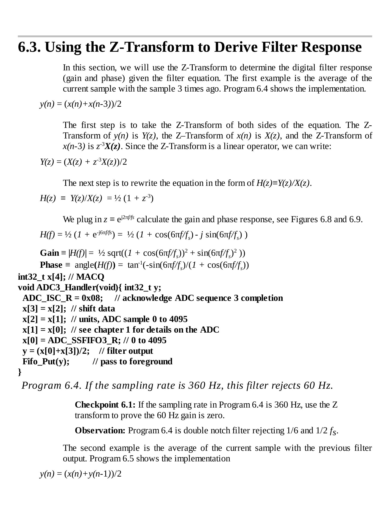
*Description*: Technical schematic and block diagram illustrating circuit operation, signal pathways, and functional behavior for Program 6.4: If the sampling rate is 360 Hz, this filter rejects 60 Hz..

> **Program 6.4: If the sampling rate is 360 Hz, this filter rejects 60 Hz.**

Checkpoint 6.1: If the sampling rate in Program 6.4 is 360 Hz, use the Z
transform to prove the 60 Hz gain is zero.
Observation: Program 6.4 is double notch filter rejecting 1/6 and 1/2 fs.
The second example is the average of the current sample with the previous filter
output. Program 6.5 shows the implementation
y(n) = (x(n)+y(n-1))/2


<!-- Page 342 -->
### [PDF Page 342]

The first step is to take the Z-Transform of both sides of the equation. The Z-
Transform of y(n) is Y(z), the Z–Transform of x(n) is X(z), and the Z-Transform of
y(n-1) is z-1Y(z). Since the Z-Transform is a linear operator, we can write:
Y(z) = (X(z) + z-1Y(z))/2
The next step is to rewrite the equation in the form of H(z) ≡ Y(z)/X(z).
H(z) ≡ Y(z)/X(z) = 1/(2 - z-1)
We plug in z ≡ ej2πf/fs calculate the gain and phase response, see Figures 6.8 and
6.9.
H(f) = 1/(2 – e-j2πf/fs) =  1/(2 - cos(2πf/fs) + j sin(2πf/fs) )
Gain ≡ |H(f)|
Phase ≡ angle(H(f))

```c
int32_t y;
void ADC3_Handler(void){ int32_t x;
ADC_ISC_R = 0x08;  // acknowledge ADC sequence 3 completion
x = ADC_SSFIFO3_R; // 0 to 4095
y = (x+y)/2;       // filter output
Fifo_Put(y);       // pass to foreground
}
```


*Description*: Technical schematic and block diagram illustrating circuit operation, signal pathways, and functional behavior for Program 6.5: Implementation of an IIR low pass digital filter..

> **Program 6.5: Implementation of an IIR low pass digital filter.**

Checkpoint 6.2: For f between 0 and 0.2 fs, the filter in Program 6.5 has a gain
larger than 1 (see Figure 6.8). What does that mean?
The gain of four linear digital filters is plotted in Figure 6.8 and the phase response
is plotted in Figure 6.9.

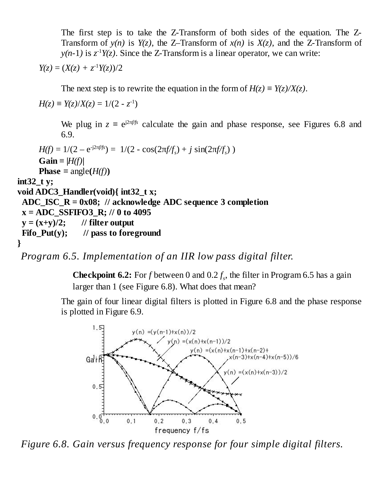
*Description*: Technical schematic and block diagram illustrating circuit operation, signal pathways, and functional behavior for Figure 6.8: Gain versus frequency response for four simple digital filters..

> **Figure 6.8: Gain versus frequency response for four simple digital filters.**


<!-- Page 343 -->
### [PDF Page 343]


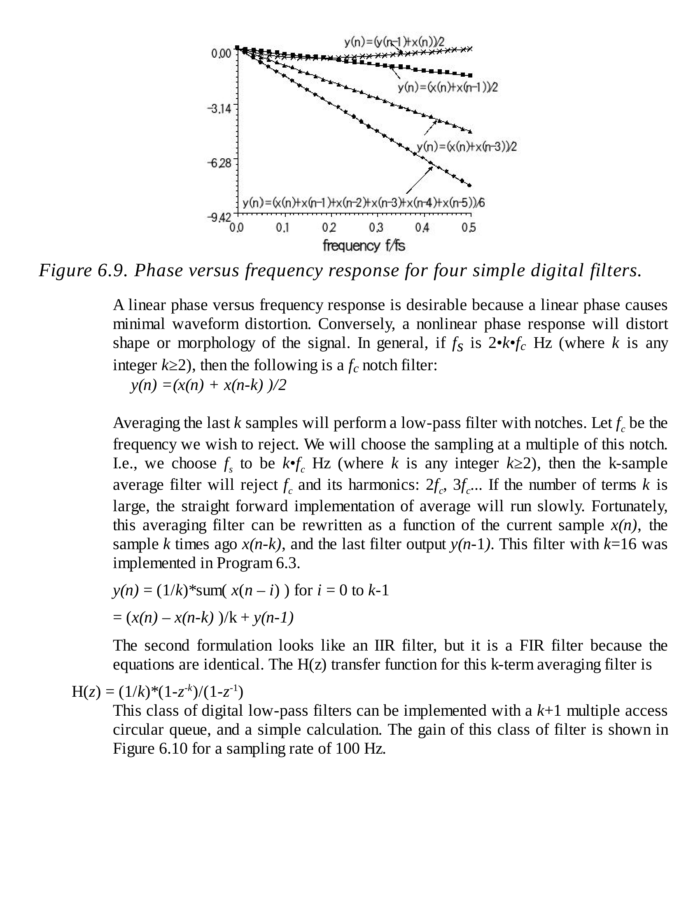
*Description*: Technical schematic and block diagram illustrating circuit operation, signal pathways, and functional behavior for Figure 6.9: Phase versus frequency response for four simple digital filters..

> **Figure 6.9: Phase versus frequency response for four simple digital filters.**

A linear phase versus frequency response is desirable because a linear phase causes
minimal waveform distortion. Conversely, a nonlinear phase response will distort
shape or morphology of the signal. In general, if fs is 2•k•fc Hz (where k is any
integer k≥2), then the following is a fc notch filter:
y(n) =(x(n) + x(n-k) )/2
Averaging the last k samples will perform a low-pass filter with notches. Let fc be the
frequency we wish to reject. We will choose the sampling at a multiple of this notch.
I.e., we choose fs to be k•fc Hz (where k is any integer k≥2), then the k-sample
average filter will reject fc and its harmonics: 2fc, 3fc... If the number of terms k is
large, the straight forward implementation of average will run slowly. Fortunately,
this averaging filter can be rewritten as a function of the current sample x(n), the
sample k times ago x(n-k), and the last filter output y(n-1). This filter with k=16 was
implemented in Program 6.3.
y(n) = (1/k)*sum( x(n – i) ) for i = 0 to k-1
= (x(n) – x(n-k) )/k + y(n-1)
The second formulation looks like an IIR filter, but it is a FIR filter because the
equations are identical. The H(z) transfer function for this k-term averaging filter is
H(z) = (1/k)*(1-z-k)/(1-z-1)
This class of digital low-pass filters can be implemented with a k+1 multiple access
circular queue, and a simple calculation. The gain of this class of filter is shown in


*Description*: Technical schematic and block diagram illustrating circuit operation, signal pathways, and functional behavior for Figure 6.10: for a sampling rate of 100 Hz..

> **Figure 6.10: for a sampling rate of 100 Hz.**


<!-- Page 344 -->
### [PDF Page 344]


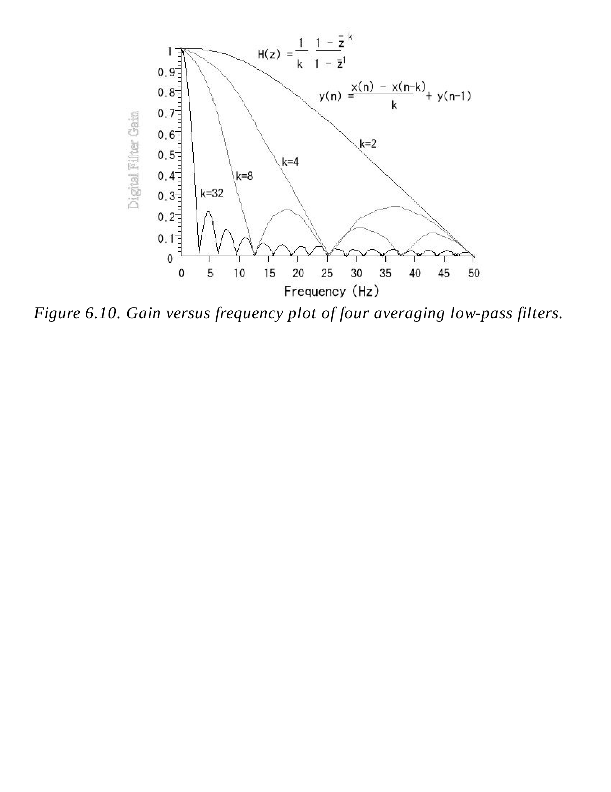
*Description*: Technical schematic and block diagram illustrating circuit operation, signal pathways, and functional behavior for Figure 6.10: Gain versus frequency plot of four averaging low-pass filters..

> **Figure 6.10: Gain versus frequency plot of four averaging low-pass filters.**


<!-- Page 345 -->
### [PDF Page 345]

6.4. IIR Filter Design Using the Pole-Zero Plot
The objective of this section is to show the IIR filter design method using pole-zero
plots. One starts with a basic shape in mind, and places poles and zeros to generate
the desired filter. Consider again the analogy between the Laplace and Z Transforms.
When the H(s) transform is plotted in the s plane, we look for peaks (places where
the amplitude H(s) is high) and valleys (places where the amplitude is low.) In
particular, we usually can identify zeros (H(s)=0) and poles (H(s)=∞). A zero is a
place where H(s)=0. A pole is a place where H(s)=∞. In the same way we can plot
the H(z) in the z plane and identify the poles and zeros. Table 6.1 lists the filter
design strategies.
Analog condition
Digital condition
Consequence
zero near s=j2πf line
zero near z=ej2πf/fs
low gain at the f near
the zero
pole near s=j2πf line
pole near z=ej2πf/fs
high gain at the f near
the pole
zeros
in
complex
conjugate pairs
zeros
in
complex
conjugate pairs
the output y(t) is real
poles
in
complex
conjugate pairs
poles
in
complex
conjugate pairs
the output y(t) is real
poles in left half plane
poles inside unit circle
stable system
poles in right half plane poles
outside
unit
circle
unstable system
pole near a zero
pole near a zero
high Q response
pole away from a zero
pole away from a zero
low Q response


*Description*: Reference table detailing hardware parameters, register bit patterns, performance metrics, or memory configurations for Table 6.1: Analogies between the analog and digital filter design rules..

> **Table 6.1: Analogies between the analog and digital filter design rules.**

Once the poles and zeros are placed, the transform of the filter can be written
where zi are the zeros and pi are the poles
The first example of this method will be a digital notch filter. 60 Hz noise is a
significant problem in most data acquisition systems. The 60 Hz noise reduction can
be accomplished:
1) Reducing the noise source, e.g., shut off large motors
2) Shielding the transducer, cables, and instrument
3) Implement a 60 Hz analog notch filter


<!-- Page 346 -->
### [PDF Page 346]

4) Implement a 60 Hz digital notch filter
The digital notch filter will be more effective and less expensive than an analog
notch filter. The signal is sampled at fs. We wish to place the zeros (gain=0) at 60 Hz,
thus
θ  = ± 2π • 60/fs
The zeros are located on the unit circle at 60 Hz
z1 = cos(θ) + j sin(θ)
z2 = cos(θ) - j sin(θ)
To implement a flat pass band away from 60 Hz the poles are placed next to the
zeros, just inside the unit circle. Let α define the closeness of the poles where 0 < α
<1 (Figure 6.11).
p1 = α z1
p2 = α z2

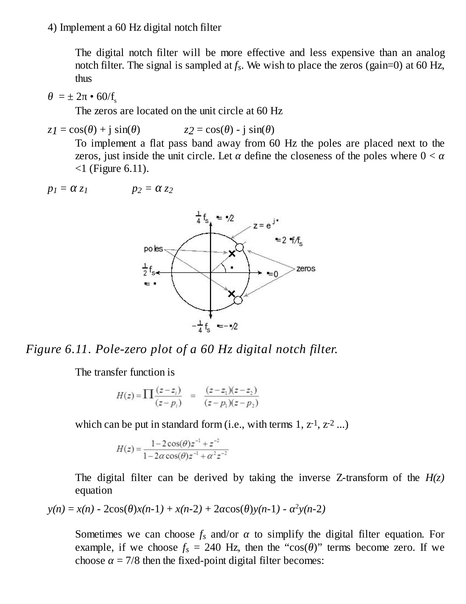
*Description*: Technical schematic and block diagram illustrating circuit operation, signal pathways, and functional behavior for Figure 6.11: Pole-zero plot of a 60 Hz digital notch filter..

> **Figure 6.11: Pole-zero plot of a 60 Hz digital notch filter.**

The transfer function is
which can be put in standard form (i.e., with terms 1, z-1, z-2 ...)
The digital filter can be derived by taking the inverse Z-transform of the H(z)
equation
y(n) = x(n) - 2cos(θ)x(n-1) + x(n-2) + 2αcos(θ)y(n-1) - α2y(n-2)
Sometimes we can choose fs and/or α to simplify the digital filter equation. For
example, if we choose fs = 240 Hz, then the “cos(θ)” terms become zero. If we
choose α = 7/8 then the fixed-point digital filter becomes:


<!-- Page 347 -->
### [PDF Page 347]

y(n) = x(n) + x(n-2)  -(49*y(n-2))/64
Another consideration for this type of filter is the fact that the gain in the pass bands
is greater than one. The DC gain can be determined two ways. The first method is to
use the H(z) transfer equation and set z=1. The H(z) transfer equation for the filter is
H(z) = (1+z-2)(1 + (49/64)z-2)
At z=1 this reduces to
DC Gain  =(2)(1 + (49/64))   =   128/113
The second method to calculate DC gain operates on the filter equation directly. In
the first step, we set all x(n-k) terms in the filter to a single variable “x” and all y(n-
k) terms in the filter to a single variable “y”. Next we solve for the DC gain, which is
y/x.
y = x  + x – (49y)/64
This method also calculates the DC gain to be 128/113. We can adjust the digital
filter so that the DC gain is exactly 1, by prescaling the input terms (x(n), x(n-1), x(n-
2),...) by 113/128.
y(n) = (113•x(n) + 113•x(n-2)  -  98•y(n-2))/128

```c
int32_t x[3]; // MACQ for the ADC input data
int32_t y[3]; // MACQ for the digital filter output
void ADC3_Handler(void){
ADC_ISC_R = 0x08;   // acknowledge ADC sequence 3 completion
x[2] = x[1]; x[1] = x[0];  // shift data
y[2] = y[1]; y[1] = y[0];
x[0] = ADC_SSFIFO3_R;                 // 0 to 4095
y[0] = (113*(x[0]+x[2])-98*y[2])/128; // filter output
Fifo_Put((int16_t)y[0]);             // pass to foreground
}
```


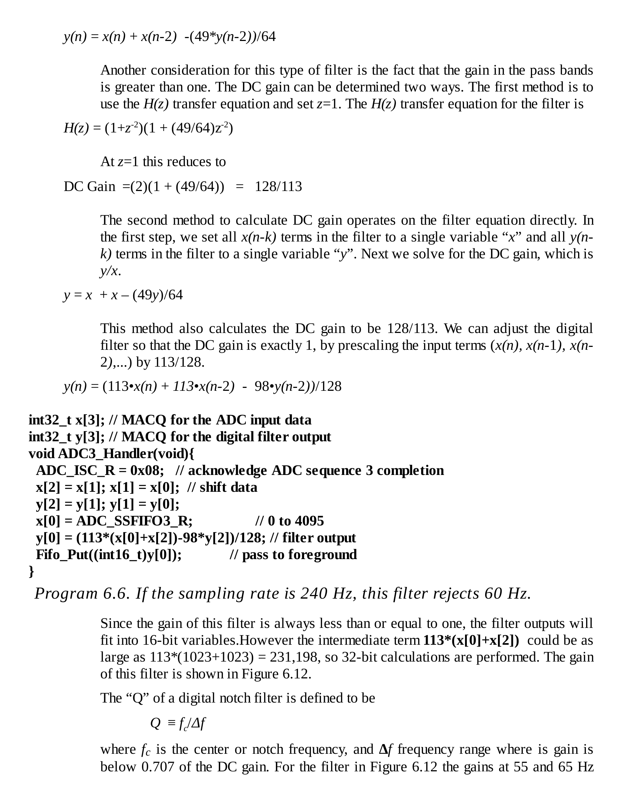
*Description*: Technical schematic and block diagram illustrating circuit operation, signal pathways, and functional behavior for Program 6.6: If the sampling rate is 240 Hz, this filter rejects 60 Hz..

> **Program 6.6: If the sampling rate is 240 Hz, this filter rejects 60 Hz.**

Since the gain of this filter is always less than or equal to one, the filter outputs will
fit into 16-bit variables.However the intermediate term 113*(x[0]+x[2])  could be as
large as 113*(1023+1023) = 231,198, so 32-bit calculations are performed. The gain
of this filter is shown in Figure 6.12.
The “Q” of a digital notch filter is defined to be
Q  ≡ fc/Δf
where fc is the center or notch frequency, and ∆f frequency range where is gain is
below 0.707 of the DC gain. For the filter in Figure 6.12 the gains at 55 and 65 Hz


<!-- Page 348 -->
### [PDF Page 348]

are about 0.707, so its Q is 6.
Checkpoint 6.3: Use Figure 6.12 to compare the filter Q of Program 6.4 with the
filter Q of Program 6.6. Next, compare the execution speed of the two
implementations. If you wished to remove 60 Hz and pass all other frequencies,
which filter would you choose?

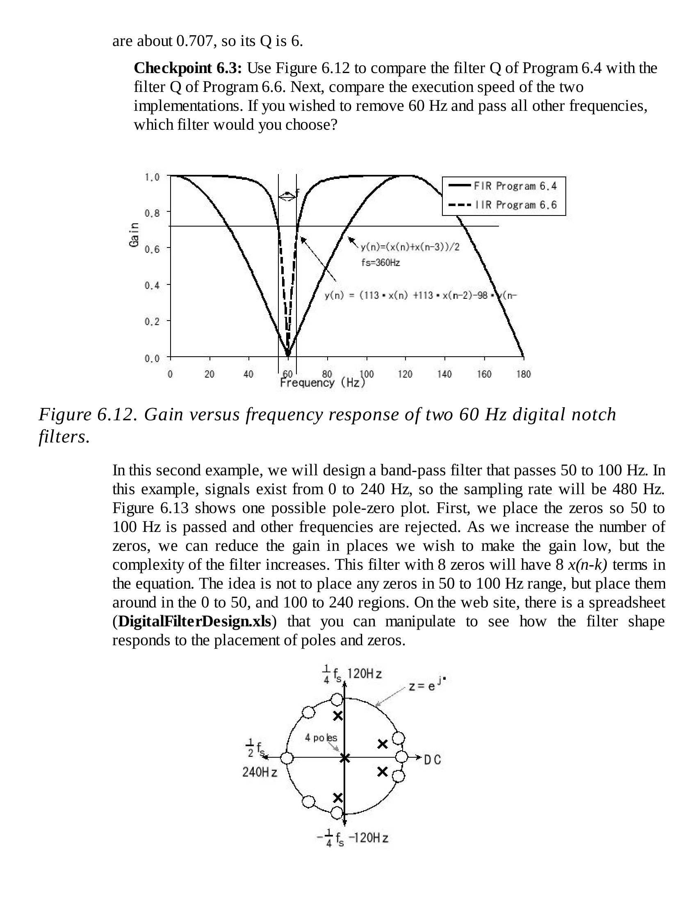
*Description*: Technical schematic and block diagram illustrating circuit operation, signal pathways, and functional behavior for Figure 6.12: Gain versus frequency response of two 60 Hz digital notch.

> **Figure 6.12: Gain versus frequency response of two 60 Hz digital notch**

filters.
In this second example, we will design a band-pass filter that passes 50 to 100 Hz. In
this example, signals exist from 0 to 240 Hz, so the sampling rate will be 480 Hz.


*Description*: Technical schematic and block diagram illustrating circuit operation, signal pathways, and functional behavior for Figure 6.13: shows one possible pole-zero plot. First, we place the zeros so 50 to.

> **Figure 6.13: shows one possible pole-zero plot. First, we place the zeros so 50 to**

100 Hz is passed and other frequencies are rejected. As we increase the number of
zeros, we can reduce the gain in places we wish to make the gain low, but the
complexity of the filter increases. This filter with 8 zeros will have 8 x(n-k) terms in
the equation. The idea is not to place any zeros in 50 to 100 Hz range, but place them
around in the 0 to 50, and 100 to 240 regions. On the web site, there is a spreadsheet
(DigitalFilterDesign.xls) that you can manipulate to see how the filter shape
responds to the placement of poles and zeros.


<!-- Page 349 -->
### [PDF Page 349]


*Description*: Technical schematic and block diagram illustrating circuit operation, signal pathways, and functional behavior for Figure 6.13: Pole-zero plot of a 50 to 100 Hz digital band-pass filter..

> **Figure 6.13: Pole-zero plot of a 50 to 100 Hz digital band-pass filter.**

Next, we place the poles. In this example, there will also be 8 poles. Placing the pole
near a zero causes the gain to rise and fall quickly. Placing the pole away from a zero
flattens the response. In this example, the zeros near 50 and 100 Hz have poles near
them, and the others are away. The farthest away will be to place the poles at z=0.
The transfer function is
The steps to derive the filter are the same as the last example. First, we multiply out
the top and bottom expressions. Because the zeros are either at z=1, z=-1, or occur in
complex conjugate pairs, the numerator will have real coefficients. Similarly,
because the poles are either at z=0 or occur in complex conjugate pairs, the
denominator will also have real coefficients. Next, we multiply the top and bottom by
z-8, placing the transfer function in standard form. Next, we take the inverse transform
to get the digital filter:
y(n) = a0 • x(n) + a1 • x(n-1) + a2 • x(n-2) + a3 • x(n-3) + a4 • x(n-4) + a5 • x(n-5)
+ a6 • x(n-6) + a7 • x(n-7) + a8 • x(n-8)  + b0 • y(n-1) + b1 • y(n-2) + b2 • y(n-
3) + b3 • y(n-4)

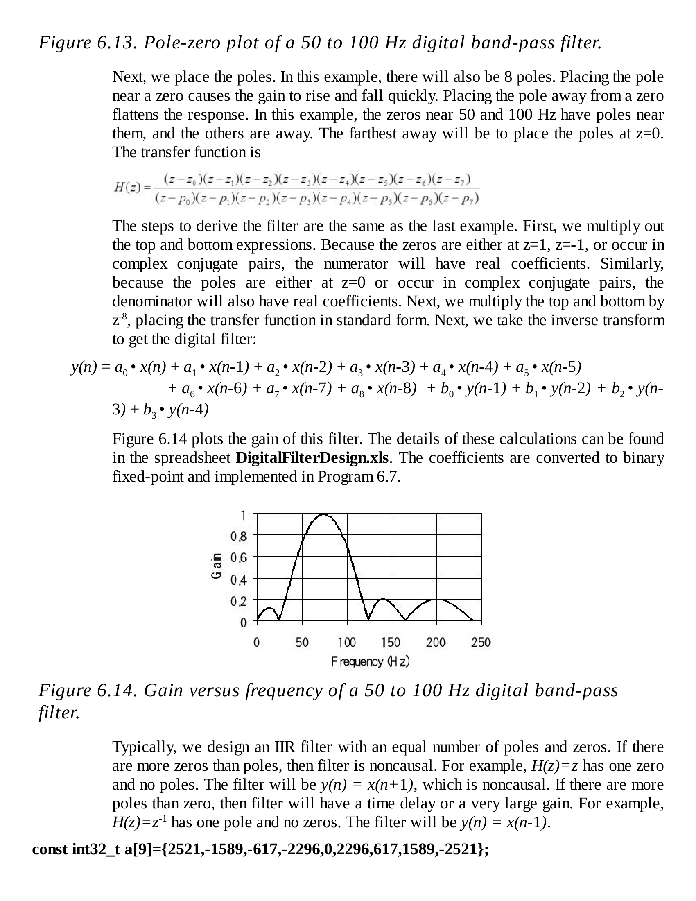
*Description*: Technical schematic and block diagram illustrating circuit operation, signal pathways, and functional behavior for Figure 6.14: plots the gain of this filter. The details of these calculations can be found.

> **Figure 6.14: plots the gain of this filter. The details of these calculations can be found**

in the spreadsheet DigitalFilterDesign.xls. The coefficients are converted to binary
fixed-point and implemented in Program 6.7.


*Description*: Technical schematic and block diagram illustrating circuit operation, signal pathways, and functional behavior for Figure 6.14: Gain versus frequency of a 50 to 100 Hz digital band-pass.

> **Figure 6.14: Gain versus frequency of a 50 to 100 Hz digital band-pass**

filter.
Typically, we design an IIR filter with an equal number of poles and zeros. If there
are more zeros than poles, then filter is noncausal. For example, H(z)=z has one zero

```assembly
and no poles. The filter will be y(n) = x(n+1), which is noncausal. If there are more
```

poles than zero, then filter will have a time delay or a very large gain. For example,
H(z)=z-1 has one pole and no zeros. The filter will be y(n) = x(n-1).
const int32_t a[9]={2521,-1589,-617,-2296,0,2296,617,1589,-2521};


<!-- Page 350 -->
### [PDF Page 350]

const int32_t b[4]={20220,-14068,9908,-3934};

```c
int32_t x[9]; // MACQ for the ADC input data
int32_t y[5]; // MACQ for the digital filter output
```


```c
void ADC3_Handler(void){
ADC_ISC_R = 0x08;   // acknowledge ADC sequence 3 completion
x[8] = x[7]; x[7] = x[6]; x[6] = x[5]; x[5] = x[4];
x[4] = x[3]; x[3] = x[2]; x[2] = x[1]; x[1] = x[0];  // shift data
y[4] = y[3]; y[3] = y[2]; y[2] = y[1]; y[1] = y[0];
x[0] = ADC_SSFIFO3_R;     // 0 to 4095
y[0] = (a[0]*x[0]+ a[1]*x[1]+ a[2]*x[2]+ a[3]*x[3]+ /* a[4]*x[4]+ */
```

a[5]*x[5]+ a[6]*x[6]+ a[7]*x[7]+ a[8]*x[8]+
b[0]*y[1]+ b[1]*y[2]+ b[2]*y[3]+ b[3]*y[4])/16384;
Fifo_Put((int16_t)y[0]);       // pass to foreground
}

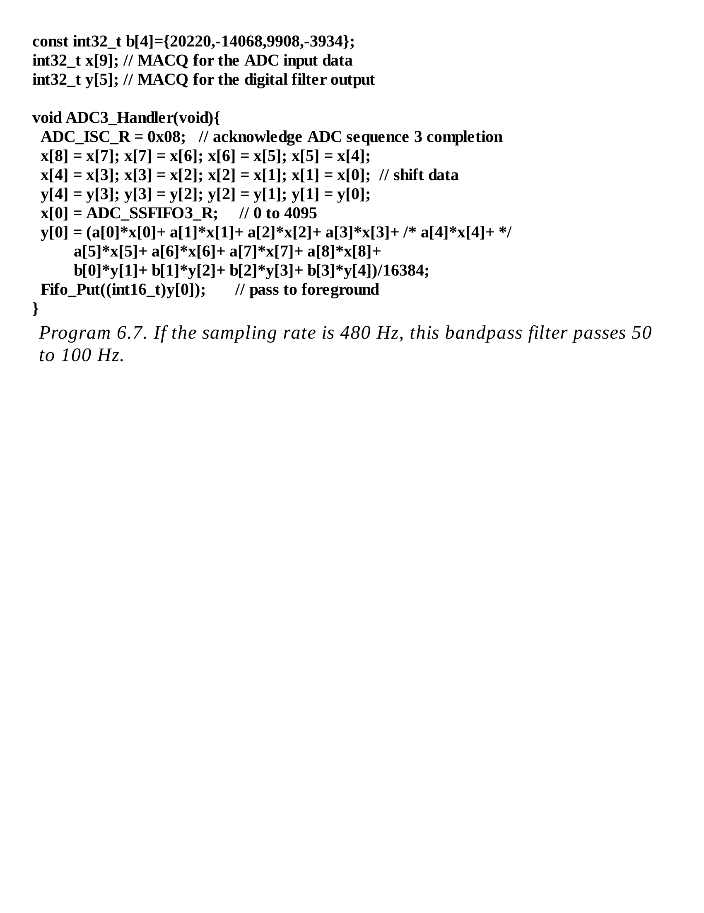
*Description*: Technical schematic and block diagram illustrating circuit operation, signal pathways, and functional behavior for Program 6.7: If the sampling rate is 480 Hz, this bandpass filter passes 50.

> **Program 6.7: If the sampling rate is 480 Hz, this bandpass filter passes 50**

to 100 Hz.


<!-- Page 351 -->
### [PDF Page 351]

6.5. Discrete Fourier Transform
The Discrete Fourier Transform (DFT) converts data in the time domain to data in
the frequency domain. We can use the DFT to measure SNR, to identify noise type,

```assembly
and to design FIR digital filters. In fact, the spectrum analyzer is simply a high-speed
```

data acquisition system followed by a DFT. The Fast Fourier Transform (FFT) is a
technique to calculate the DFT with fewer additions and multiplications. There are
four important parameters when employing the DFT. The first parameter is sampling
rate, fs. While the DFT deals only with samples and bins with no concept of volts,
seconds, and Hz, when applying it to real data, we assume the samples have units,
are bound by physical limits, and are evenly spaced at time intervals T=1/fs. The
second parameter is sequence length, N. The other two parameters are input
resolution and range. In real systems, input data come from the ADC or input capture,

```assembly
and the output data go to the DAC or PWM. Therefore, the performance of the DFT
```

will be affected by the range and resolution of the input. The input to the DFT will be
N samples versus time, and the output will be N points in the frequency domain.
Input: {an} = {a0,a1,a2,…,aN-1}
Output:
{Ak} = {A0,A1,A2,…,AN-1}
The definition of the DFT is
where

```assembly
and  k=0,1,2,…,N-1
```

The DFT output Ak at index k represents the amplitude and phase of the input at
frequency k*fS/N (in Hz). The DFT resolution in Hz/bin is the reciprocal of the total
time spent gathering time samples; i.e., 1/(N*T). The Inverse Discrete Fourier
Transform (IDFT) converts data in the frequency domain to data in the time domain.
The input to the IDFT will be N points in the frequency domain, and the output will
be N samples in the time domain.
Input: {Ak}={A0,A1,A2,…,AN-1}
Output:{an}={a0,a1,a2,…,aN-1}
The definition of the IDFT is


<!-- Page 352 -->
### [PDF Page 352]

where

```assembly
and  n=0,1,2,…,N-1
```

When presenting frequency data, we can use a log scale, making it easier to visualize
frequency components with widely varying amplitudes. Because the system has
physical limits, we use those limits to define full scale. Assume the audio system in
Section 5.1.3 samples sound as a voltage from 0 to 3 V. For this system, we would
define full scale VFS as 3 V. In particular, if V is a DFT output in volts, we can
convert it to dB full scale using
dBFS = 20*log10(V/VFS)
STMicroelectronics
published
integer
FFT
code
has
part
of
their
STM32F10x_DSP_Lib library. There are three separate FFT implementations for
sizes 64, 256 or 1024 optimized for the Cortex M. The input to the FFT is 64, 256 or
1024 complex samples. Each input is 16-bit signed integer containing the real and
imaginary parts. For most applications we will set the ADC data into the real part

```assembly
and we will write zeros into the imaginary part. In Program 6.8 and Table 6.2 assume
```

we will fill the input array with constant data from an array. After calculating the
DFT, the program will calculate the magnitude at each frequency. Let N be the size of
the array, and assume the sampling rate is fs, then the meaning of index k is fs/N.

```c
typedef struct{
int16_t real,imag;
}Complex_t;
// data for FFT
Complex_t x[1024],y[1024]; // input and output arrays for FFT
int32_t mag[512];          // magnitude versus frequency of the output
void cr4_fft_1024_stm32(Complex_t *, Complex_t *, unsigned short);
int main(void){ int32_t t,k, real, imag;
for(t=0; t<1024; t=t+1){   // t means 1/fs
x[t].imag = 0;           // imaginary part is zero
x[t].real = sinewave[t]; // fill real part with data
}
cr4_fft_1024_stm32(y, x, 1024); // complex FFT of 1024 values
for(k=0; k<512; k=k+1){         // k means fs/1024
real = y[k].real;             // real is bottom 16 bits
imag = y[k].imag;             // imag is top 16 bits
mag[k] = Sqrt(real*real+imag*imag);
}
while(1){};
}
```


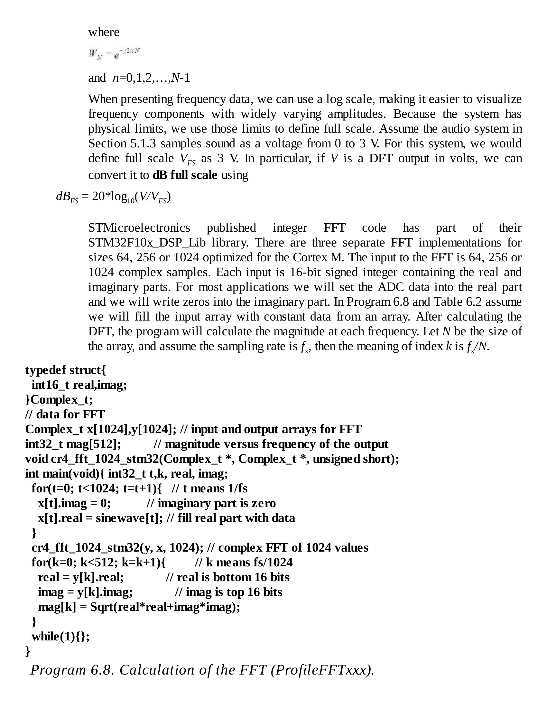
*Description*: Technical schematic and block diagram illustrating circuit operation, signal pathways, and functional behavior for Program 6.8: Calculation of the FFT (ProfileFFTxxx)..

> **Program 6.8: Calculation of the FFT (ProfileFFTxxx).**


<!-- Page 353 -->
### [PDF Page 353]

N Cycles Time(ms)
64
3535
0.22
256
20072
1.25
1024
97870
6.12

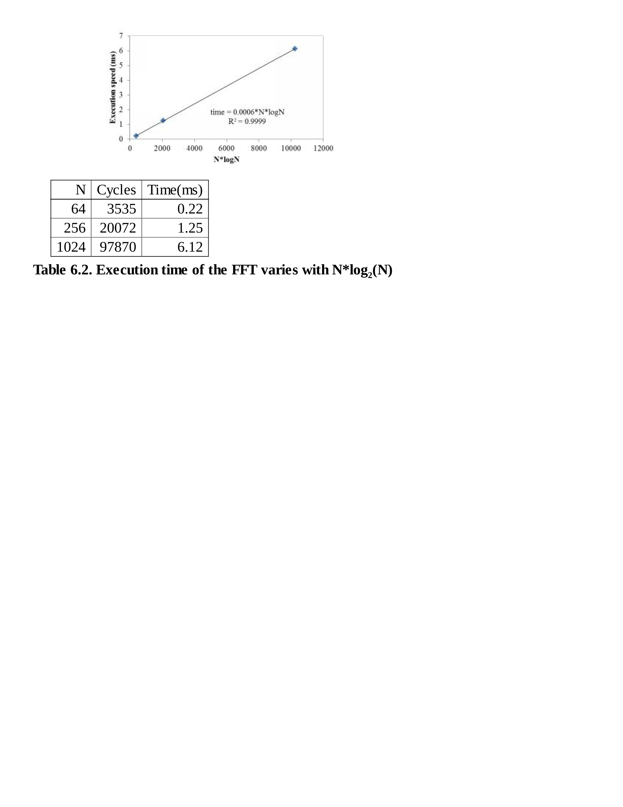
*Description*: Reference table detailing hardware parameters, register bit patterns, performance metrics, or memory configurations for Table 6.2: Execution time of the FFT varies with N*log2(N).

> **Table 6.2: Execution time of the FFT varies with N*log2(N)**


<!-- Page 354 -->
### [PDF Page 354]

6.6. FIR Filter Design
In this section we will use the DFT as a general tool to design FIR filters. We begin
by choosing the sampling rate, which must be larger than two times the largest signal
frequency we wish to process. After we have chosen the sampling rate (e.g., 10 kHz),
we will choose a FIR filter length (e.g., N=51). The ratio fs/N (e.g., 10 kHz/51 = 196
Hz) will determine the frequency resolution of the FIR filter design. The larger the N,
the more gain points we can specify in the filter response, but the slower the filter
will execute. Next, we plot or print the desired gain/phase versus frequency
response. The magnitude of H(k) is selected to implement the desired gain versus
frequency response. I.e., |H(k)| will be the filter gain at k*fS/N. The angle of H(k) is
selected to implement the desired phase versus frequency response. I.e., angle[H(k)]
will be the filter phase at k*fS/N. For frequencies above ½fs, we must make H(k) be
the complex conjugate of the N-k term. This will guarantee that the inverse DFT of
H(k) will yield real results.  Let x(n) be the input (read from the ADC) and X(k) be
the input in the frequency domain. Let y(n) be the FIR filter output, and let Y(k) be the
FIR filter output in the frequency domain.
Y(k) = H(k) X(k)
y(n) = IDFT { H(z) DFT{x(t)} }
We take IDFT of the H(k) to get N FIR filter coefficients. Multiplication in the
frequency domain is equivalent to convolution in the time domain. The FIR filter is
the convolution of the data with the inverse transform of the desired filter.
y(n) = h(n) * x(n)  = x(n) * h(n)
;   *   means convolution here
y(n) = sum(h(i) · x(n-i)) for i=-∞ to +∞;    ·   means multiplication here
Because there are a finite number of h(n) terms, the convolution is a finite sum
y(n) = sum(h(i) · x(n-i)) for i=0 to N-1;    ·   means multiplication here
Example 6.1. Design a digital filter for a hearing aid that accentuates high
frequencies. The input is audio with frequency components from 100 Hz to 5 kHz. In
particular, make the gain equal to 5 for frequencies 2 to 5 kHz. For the lower audio
frequencies make the gain equal to 1.
Solution: We choose the sampling rate at twice the maximum frequency of the input
or fs = 10 kHz. Next we choose a filter size. The larger N, the better the actual filter
will match our desired response, but the slower it will execute. For this solution, we
could have chosen any size from 32 to 64 and obtained similar results. In order to
preserve the shape of the audio signals, we will implement linear phase. The desired


<!-- Page 355 -->
### [PDF Page 355]

filter gain is shown as Figure 6.15 and Table 6.3. The lines in the figure are the
desired filter gain, and the dots will be the actual gain as implemented by the fixed-
point math in Program 6.9.

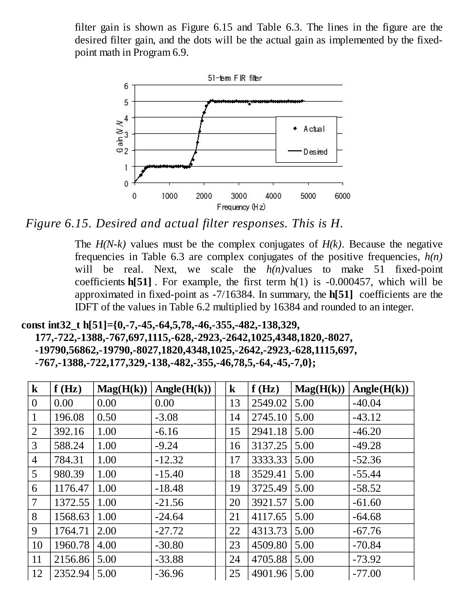
*Description*: Technical schematic and block diagram illustrating circuit operation, signal pathways, and functional behavior for Figure 6.15: Desired and actual filter responses. This is H..

> **Figure 6.15: Desired and actual filter responses. This is H.**

The H(N-k) values must be the complex conjugates of H(k). Because the negative
frequencies in Table 6.3 are complex conjugates of the positive frequencies, h(n)
will be real. Next, we scale the h(n)values to make 51 fixed-point
coefficients h[51] . For example, the first term h(1) is -0.000457, which will be
approximated in fixed-point as -7/16384. In summary, the h[51]  coefficients are the
IDFT of the values in Table 6.2 multiplied by 16384 and rounded to an integer.
const int32_t h[51]={0,-7,-45,-64,5,78,-46,-355,-482,-138,329,
177,-722,-1388,-767,697,1115,-628,-2923,-2642,1025,4348,1820,-8027,
-19790,56862,-19790,-8027,1820,4348,1025,-2642,-2923,-628,1115,697,
-767,-1388,-722,177,329,-138,-482,-355,-46,78,5,-64,-45,-7,0};
k
f (Hz)
Mag(H(k)) Angle(H(k))  k
f (Hz)
Mag(H(k)) Angle(H(k))
0
0.00
0.00
0.00
13
2549.02 5.00
-40.04
1
196.08
0.50
-3.08
14
2745.10 5.00
-43.12
2
392.16
1.00
-6.16
15
2941.18 5.00
-46.20
3
588.24
1.00
-9.24
16
3137.25 5.00
-49.28
4
784.31
1.00
-12.32
17
3333.33 5.00
-52.36
5
980.39
1.00
-15.40
18
3529.41 5.00
-55.44
6
1176.47 1.00
-18.48
19
3725.49 5.00
-58.52
7
1372.55 1.00
-21.56
20
3921.57 5.00
-61.60
8
1568.63 1.00
-24.64
21
4117.65 5.00
-64.68
9
1764.71 2.00
-27.72
22
4313.73 5.00
-67.76
10
1960.78 4.00
-30.80
23
4509.80 5.00
-70.84
11
2156.86 5.00
-33.88
24
4705.88 5.00
-73.92
12
2352.94 5.00
-36.96
25
4901.96 5.00
-77.00


<!-- Page 356 -->
### [PDF Page 356]


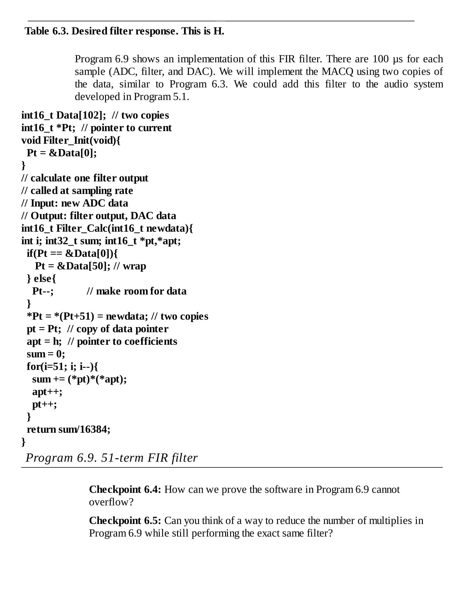
*Description*: Reference table detailing hardware parameters, register bit patterns, performance metrics, or memory configurations for Table 6.3: Desired filter response. This is H..

> **Table 6.3: Desired filter response. This is H.**


*Description*: Technical schematic and block diagram illustrating circuit operation, signal pathways, and functional behavior for Program 6.9: shows an implementation of this FIR filter. There are 100 µs for each.

> **Program 6.9: shows an implementation of this FIR filter. There are 100 µs for each**

sample (ADC, filter, and DAC). We will implement the MACQ using two copies of
the data, similar to Program 6.3. We could add this filter to the audio system
developed in Program 5.1.
int16_t Data[102];  // two copies
int16_t *Pt;  // pointer to current

```c
void Filter_Init(void){
Pt = &Data[0];
}
// calculate one filter output
// called at sampling rate
// Input: new ADC data
// Output: filter output, DAC data
int16_t Filter_Calc(int16_t newdata){
int i; int32_t sum; int16_t *pt,*apt;
if(Pt == &Data[0]){
Pt = &Data[50]; // wrap
} else{
Pt--;            // make room for data
}
*Pt = *(Pt+51) = newdata; // two copies
pt = Pt;  // copy of data pointer
apt = h;  // pointer to coefficients
sum = 0;
for(i=51; i; i--){
sum += (*pt)*(*apt);
apt++;
pt++;
}
return sum/16384;
}
```


*Description*: Technical schematic and block diagram illustrating circuit operation, signal pathways, and functional behavior for Program 6.9: 51-term FIR filter.

> **Program 6.9: 51-term FIR filter**

Checkpoint 6.4: How can we prove the software in Program 6.9 cannot
overflow?
Checkpoint 6.5: Can you think of a way to reduce the number of multiplies in


*Description*: Technical schematic and block diagram illustrating circuit operation, signal pathways, and functional behavior for Program 6.9: while still performing the exact same filter?.

> **Program 6.9: while still performing the exact same filter?**


<!-- Page 357 -->
### [PDF Page 357]

6.7. Direct-Form Implementations.
The general form for the transfer function for an IIR filter is
This converts to the standard difference equation
y(n) = a0x(n) +  a1x(n-1) +  a2x(n-2) + ...+  aMx(n-M)  - b1y(n-1)  - b2y(n-2) ... -bNy(n-N)
The direct-form calculation of this filter requires with two multiple access circular
queues with lengths M and N. There are (M+N-1) multiplies and (M+N-2) additions.

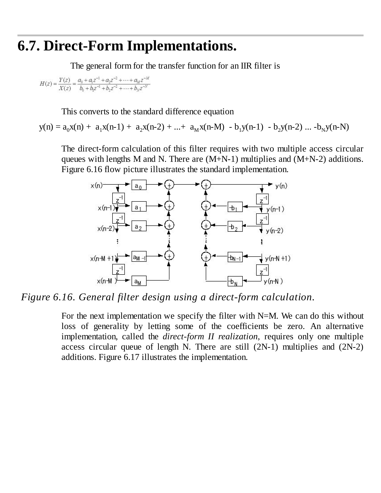
*Description*: Technical schematic and block diagram illustrating circuit operation, signal pathways, and functional behavior for Figure 6.16: flow picture illustrates the standard implementation..

> **Figure 6.16: flow picture illustrates the standard implementation.**


*Description*: Technical schematic and block diagram illustrating circuit operation, signal pathways, and functional behavior for Figure 6.16: General filter design using a direct-form calculation..

> **Figure 6.16: General filter design using a direct-form calculation.**

For the next implementation we specify the filter with N=M. We can do this without
loss of generality by letting some of the coefficients be zero. An alternative
implementation, called the direct-form II realization, requires only one multiple
access circular queue of length N. There are still (2N-1) multiplies and (2N-2)
additions. Figure 6.17 illustrates the implementation.


<!-- Page 358 -->
### [PDF Page 358]


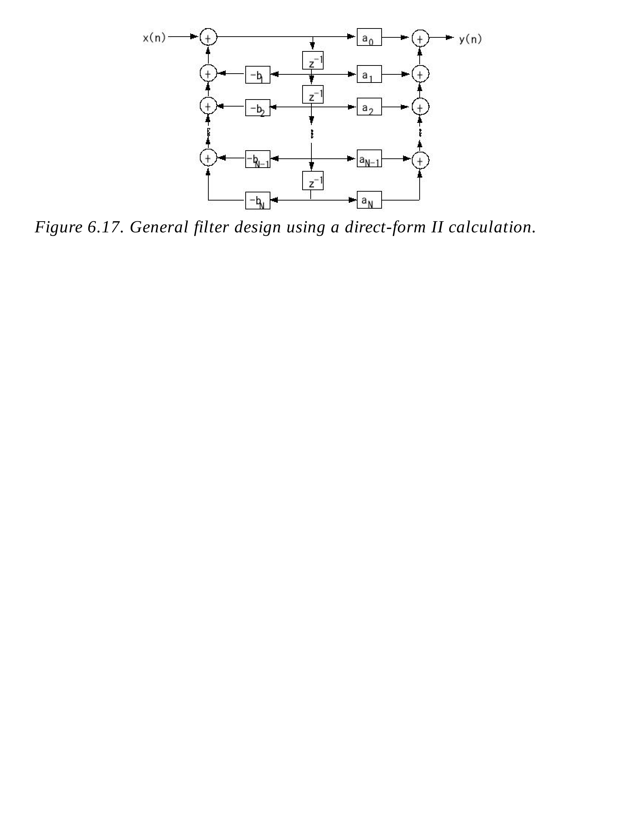
*Description*: Technical schematic and block diagram illustrating circuit operation, signal pathways, and functional behavior for Figure 6.17: General filter design using a direct-form II calculation..

> **Figure 6.17: General filter design using a direct-form II calculation.**


<!-- Page 359 -->
### [PDF Page 359]

6.8. Exercises

## 6.1 For each term give a definition in 32 words or less.

a) Aliasing
b) Filter Q
c) Impulse response of a digital filter
d) Complex conjugate
e) MACQ
f) Overflow

## 6.2 For each term give the equation definition

a) Z transform
b) DFT
c) IDFT
d) Relationship between time jitter and voltage error
e) Filter gain given input frequency f
f) Convolution between x and h
6.3. Consider the use of the Z-transform in the design and analysis of digital filters.
a) State the definition of the Z-transform.
b) Why can’t we use the Z-transform on a median filter?
c) Use the Z-transform to determine the DC gain and phase of the following digital
filter:
y(n) =x(n)-x(n-2)+y(n-1)

## 6.4 List the four parameters we need to decide when implementing a DFT.


## 6.5 For each pair of terms compare and contrast in 32 words or less.

a) Causal versus noncausal filter
b) Linear versus nonlinear filter
c) FIR versus IIR filter
d) Laplace transform versus the Z transform
e) A pole versus a zero
f) A complex versus an imaginary number
6.6 256 data points are sampled at 10 kHz with a 12-bit ADC. The ADC range is 0 to

## 3.0 V. A DFT is performed on the data. What is the frequency resolution? What range

of frequencies is represented in the DFT output?

## 6.7 For each situation, specify whether you expect the gain at frequency f to increase,

decrease or not change much at all.
a) A zero is moved closer to frequency f on the z-plane.


<!-- Page 360 -->
### [PDF Page 360]

b) A pole is moved closer to frequency f on the z-plane.
c) A zero already near frequency f on the z-plane is replaced with a double zero.
d) A pole already near frequency f on the z-plane is replaced with a double pole.
e) A pole currently near frequency f on the z-plane is moved to the origin.
f) A pole currently near frequency f on the z-plane is outside the unit circle.

## 6.8 For each filter specify whether it is linear or nonlinear. If it is linear specify

whether it is FIR or IIR.
a) y(n) = x(n)2 + 2x(n) +1
b) y(n) = x(n)/4 + y(n-1) –x(n-4)/4
c) y(n) = min{x(n),x(n-1)}
d) y(n) = (x(n+1)+x(n-1))/2

## 6.9 Let the input be the sum of two sine waves: x(t) = A1sin(2πf1t) + A2sin(2πf2t).

Assume the digital filter will pass both these frequencies with a gain of 1. This filter
implements a linear phase response. What can you say about the output of the filter?
I.e., derive an equation describing the output as a function of time.

## 6.10 Consider the following digital filter: y(n) = (x(n) – x(n-2))/2

a) Using the Z-transform derive general expressions for the gain and phase of the
filter.
b) Using the general expressions from part a), calculate the gain and phase of the
filter at DC and 60 Hz if the sampling rate is 240 Hz.

## 6.11 Design a 10 Hz digital low pass filter with a sampling rate of 1000Hz. Make the

gain at DC equal to one, and the gain at 10Hz 0.707.
a) Show the pole/zero plot of your filter.
b) Show the H(z) transform.
c) Show the floating-point version of the digital filter.
d) Show the fixed-point version of the digital filter.

## 6.12 Design a digital filter that rejects both 60 Hz and 120Hz assuming the sampling

rate is 480 Hz. Apply gain scaling so the DC gain is 1. Give the filter in a form that
can be implemented with fixed-point math.

## 6.13 Consider the simple sliding average filter for a general sampling rate of 1000

Hz. This filter is a low-pass filter, as shown in Figure 6.10
What value of k should we use to make a gain of about 0.7 at 10 Hz?

## 6.14 We defined time-jitter, δt, as the difference between when a periodic task is

supposed to be run, and when it is actually run. The goal of a real-time DAS is to


<!-- Page 361 -->
### [PDF Page 361]

start the ADC at a periodic rate, Δt. Let tn be the nth time the ADC is started. In
particular, the goal to make tn–tn-1 = Δt. The jitter is defined as the constant, δt, such
that
Δt-δt < ti – ti-1 < Δt+δt
for all i.
Assume the ADC input can be described as V(t) = A+Bsin(2πft), where A, B, f are
constants.
a) Derive an estimate of the maximum voltage error, δV, caused by time-jitter.
Basically, solve for the largest possible value of δV as a function of δt, A, B, and f
b) Consider the situation where this time jitter is unacceptably large. Which
modification to the system will reduce the error the most?  Justify your selection.
A) Run the ADC in continuous mode
B) Convert from spinlock semaphores to blocking semaphores
C) Change from round robin to priority thread scheduling
D) Reduce the amount of time the system runs with interrupts disabled.
E)  Increase the size of the DataFifo


