# Chapter 7: High-Speed Interfacing

> **Textbook**: Embedded Systems: Real-Time Operating Systems for ARM Cortex-M Microcontrollers  
> **Author**: Jonathan W. Valvano  
> **PDF Page Range**: 362 - 384


---


<!-- Page 362 -->
### [PDF Page 362]

7. High-Speed Interfacing

# Chapter 7 objectives are to:

• Discuss applications requiring high bandwidth
• Present concepts related to high-speed interfacing
• List fundamental approaches to high-speed interfacing
• Introduce and describe direct memory addressing (DMA) on the
TM4C123
Embedded system designers will not need direct memory accessing to solve
most of their problems. However, future trends point to systems with increased
memory, multiple processors and higher bandwidth. Therefore, it is
appropriate
to
learn
these
advanced
topics.
Latency,
bandwidth,
synchronization, and reliability are important factors for all types of
interfacing. In this chapter we will discuss shared memory, hardware FIFOs,

```assembly
and direct memory addressing (DMA). DMA is an important yet complicated
```

interfacing process. As the performance requirements of our embedded system
grow, there comes a point when the simple methods of I/O interfacing are not
adequate. This chapter introduces a number of techniques that produce high
bandwidth and low latency.


<!-- Page 363 -->
### [PDF Page 363]

7.1. The Need for Speed
Bandwidth, latency, and priority are quantitative parameters we use to evaluate the
performance of an I/O interface. The basic function of an input interface is to transfer
information about the external environment into the computer. In a similar way, the
basic function of an output interface is to transfer information from the computer to
the external environment. The bandwidth is the number of bytes transferred per
second. The bandwidth can be expressed as a maximum or peak that involves short
bursts of I/O communication. On the other hand, the overall performance can be
represented as the average bandwidth. The latency of the hardware/software is the
response time of the interface. It is measured in different ways depending on the
situation. For an input device, the interface latency is the time between when new
input is available, and the time when the data is transferred into memory. We can also
define device latency as the response time of the external I/O device. For example, if
we request that a certain sector be read from a disk, then the device latency is the
time it take to find the correct track and spin the disk (seek) so the proper sector is
positioned under the read head. For an output device, the interface latency is the time
between when the output device is idle, and the time when the interface writes new
data.  A real-time system is one that can guarantee worst case interface latency.

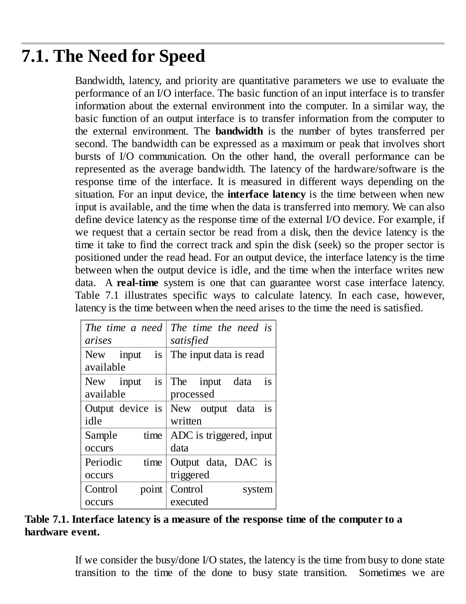
*Description*: Reference table detailing hardware parameters, register bit patterns, performance metrics, or memory configurations for Table 7.1: illustrates specific ways to calculate latency. In each case, however,.

> **Table 7.1: illustrates specific ways to calculate latency. In each case, however,**

latency is the time between when the need arises to the time the need is satisfied.
The time a need
arises
The time the need is
satisfied
New
input
is
available
The input data is read
New
input
is
available
The
input
data
is
processed
Output device is
idle
New output data is
written
Sample
time
occurs
ADC is triggered, input
data
Periodic
time
occurs
Output data, DAC is
triggered
Control
point
occurs
Control
system
executed


*Description*: Hardware pinout and board interface diagram mapping microcontroller pins, BoosterPack headers, switches, LEDs, and physical connectors for Table 7.1: Interface latency is a measure of the response time of the computer to a.

> **Table 7.1: Interface latency is a measure of the response time of the computer to a**

hardware event.
If we consider the busy/done I/O states, the latency is the time from busy to done state
transition to the time of the done to busy state transition.  Sometimes we are


<!-- Page 364 -->
### [PDF Page 364]

interested in the worst case (maximum) latency and sometimes in the average. If we
can put an upper bound on the latency, then we define the system as real-time. A
number of applications involve performing I/O functions on a fixed interval basis. In
a data acquisition system, the ADC is triggered (a new sample is requested) at the
desired sampling rate.
Checkpoint 7.1: What is the difference between bandwidth and latency?


<!-- Page 365 -->
### [PDF Page 365]

7.2. High-Speed I/O Applications
Before introducing the various solutions to a high-speed I/O interface, we will begin
by presenting some typical applications.
Mass Storage. The first application is mass storage including flash disk, hard disk,
CD, and DVD. Writing data to disk with these systems involves
1. Establishing the physical location to write, record head at the proper block,
sector, track etc.
2. Specifying the block size
3. Waiting for the physical location to arrive under the record head
4. Transmitting the data
Reading data from disk with these systems is similar and involves
1. Establishing the physical location to read, read head at the proper block, sector,
track etc.
2. Specifying the block size
3. Waiting for the physical location to arrive under the read head
4. Receiving the data
Under most situations the size of the data block transferred is fixed. The bandwidth
depends on the rotation speed of the disk and the information density on the medium.
A 10,000 RPM SATA hard drive can sustain about 157 Mebibyte/sec. However,
drives costing less than $100 typically generate 100 Mebibytes/sec. The time to
locate the physical location is called the seek time. Although seek time has a
significant impact on the disk performance, it does not affect the latency or bandwidth
parameters. An nX CD-ROM has a peak bandwidth of n*150 kibibytes/sec. There is
a wide range of disk speeds, but it is important to note that for most situations, the
disk bandwidth will be less than the computer bus bandwidth, but greater than the
maximum bandwidth that a software-controlled interface can achieve. If the disk
interface is not buffered, then the interface must respond to each data byte at a rate
faster than the peak disk bandwidth. For example, in a disk read, once the data
becomes available, the interface must capture it and store it in memory before the
next data becomes available. If we do not meet the response time requirement in the
disk interface, the rotation speed will have to be reduced. Notice because of the seek
time (time for the physical location to arrive under the head), the average and peak
bandwidth will be quite different. Also notice that without buffering, the maximum
interface latency will be inversely related to the peak bandwidth.
Checkpoint 7.2: What happens if we are reading data off a hard drive but do not
satisfy the latency requirement? In other words, the read data is ready, but we do
not capture it in time.
High-Speed Data Acquisition. Examples of high-speed data acquisition are CD-


<!-- Page 366 -->
### [PDF Page 366]

quality sound recording (16-bit, 2 channel, 44 kHz), real-time digital image
recording and digital scopes (8-bit 1 GHz). Sound recording actually has two high-
speed data channels: one for recording into memory, and a second for storing the
memory data on hard disk or CD. Similarly, a digital scope has two high-speed
channels: one for the recording of voltage versus time input, and a second for
displaying graphical results. A spectrum analyzer combines the high-speed data
acquisition of a digital scope with the discrete Fourier Transform to visualize the
collected data in the frequency domain. In the context of this chapter, we will define a
high-speed data acquisition as one that samples faster than a software-controlled
interface would allow. Typically, this will mean more than 100,000 samples per
second.
Checkpoint 7.3: What happens to the sound recording if data is missed?  Is this
hard, firm, or soft real time?
Video displays. Real-time generation of TV or video images requires an enormous
data bandwidth. Consider the information bandwidth required to maintain an image
on a graphics display. A VGA image is 256 colors (8-bit), 480 rows, 640 columns

```assembly
and is refreshed at about 60 Hz. Calculating the bandwidth in bytes/sec, we get
```

1*480*640*60, which is 18,432,000 bytes/sec. Luckily, we don’t have to
communicate each pixel for each image, but rather can just transmit the changes from
the previous image. In order to achieve the necessary bandwidth, video interface
hardware will use a combination of DMA and dual port memories. With larger
displays and 3-D images the bandwidth requirements are even higher.
High Speed Signal Generation. Examples of high speed signal generation are CD-
quality sound playback (16-bit, 2 channel, 44 kHz) and real-time waveform
generation. Sound playback also has two high speed data channels: one for loading
sound data into memory from CD, and a second for playing the memory data out to
the speakers.
Network Communications. For many networks the communication bandwidth of the
physical channel will exceed the ability of the software to accept or transmit
messages. For these high speed applications, we will look for ways to decouple the
software that creates outgoing messages and processes incoming messages from the
hardware that is involved in the transmission and reception of individual bits.
Because the network load will vary, the average bandwidth (determined by how fast
the transmission software can create outgoing messages and the reception software
can process incoming messages) will be slower than the peak/maximum bandwidth
that is achieved by the network hardware during transmission. This mismatch allows
one network to be shared among multiple potential nodes.
Checkpoint 7.4: What happens in a communication system when packets are
lost?


<!-- Page 367 -->
### [PDF Page 367]

7.3. General Approaches to High-Speed Interfaces
7.3.1. Hardware FIFO
If the software-controlled interface can handle the average bandwidth but fails to
satisfy the latency requirements, then a hardware FIFO can be placed between the
I/O device and the computer. Assume in this situation, the average serial bandwidth
is low enough for the software to read the data from the serial port and write it to
memory. Without the hardware FIFO, the latency requirement of a serial input port is
the time it takes to transmit one data frame. To reduce this latency requirement
(without changing the average bandwidth requirement) we can add a hardware FIFO
between the receive shift register and the receive data register, as illustrated in

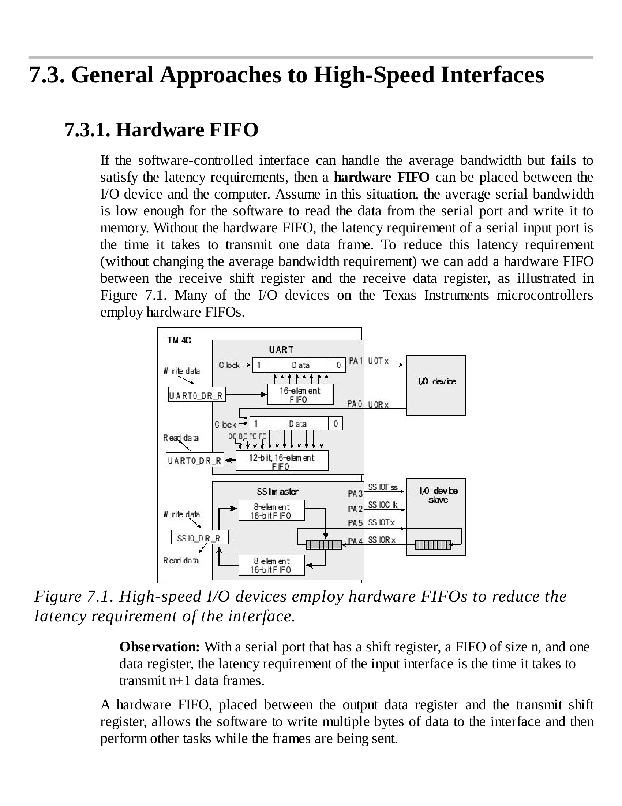
*Description*: Technical schematic and block diagram illustrating circuit operation, signal pathways, and functional behavior for Figure 7.1: Many of the I/O devices on the Texas Instruments microcontrollers.

> **Figure 7.1: Many of the I/O devices on the Texas Instruments microcontrollers**

employ hardware FIFOs.


*Description*: Technical schematic and block diagram illustrating circuit operation, signal pathways, and functional behavior for Figure 7.1: High-speed I/O devices employ hardware FIFOs to reduce the.

> **Figure 7.1: High-speed I/O devices employ hardware FIFOs to reduce the**

latency requirement of the interface.
Observation: With a serial port that has a shift register, a FIFO of size n, and one
data register, the latency requirement of the input interface is the time it takes to
transmit n+1 data frames.
A hardware FIFO, placed between the output data register and the transmit shift
register, allows the software to write multiple bytes of data to the interface and then
perform other tasks while the frames are being sent.


<!-- Page 368 -->
### [PDF Page 368]

7.3.2. Dual Port Memory
One approach that allows a large amount of data to be transmitted from the software
to the hardware is the dual port memory, Figure 7.2. A dual port memory allows
shared access to the same memory between the software and hardware. For example,
the software can create a graphics image in the dual port memory using standard
memory write operations. At the same time the video graphics hardware can fetch
information out of the same memory and display it on the computer monitor. In this
way, the data need not be explicitly transmitted from the computer to the graphics
display hardware. To implement a dual port memory, there must be a way to arbitrate
the condition when both the software and hardware wish to access the device
simultaneously. One mechanism to arbitrate simultaneous requests is to halt the
processor using a MRDY signal so that the software temporarily waits while the
video hardware fetches what it needs. Once the video hardware is done, the MRDY
signal is released and the software resumes. Most microcontroller memory interfaces
do not support this sort of hardware initiated cycle stretching. If both processors
wish to access the memory at the same time, one of the processors is delayed. Notice
that except for the access conflict, both the software and graphics hardware can
operate simultaneously at full speed.


*Description*: Technical schematic and block diagram illustrating circuit operation, signal pathways, and functional behavior for Figure 7.2: A dual port memory can be accessed by two different modules..

> **Figure 7.2: A dual port memory can be accessed by two different modules.**

Checkpoint 7.5: Explain how the bidirectional tristate buffers connected to the
memory data lines in Figure 7.2 work.
7.3.3. Bank-Switched Memory
Another approach similar to the dual port memory is the bank-switched memory, see

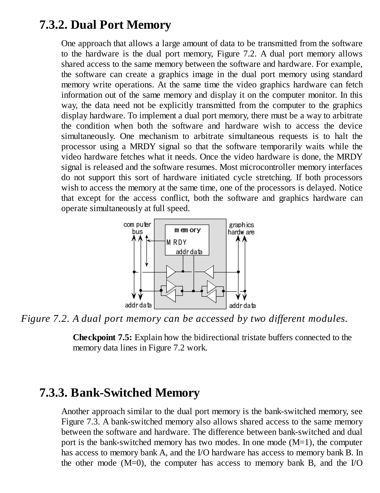
*Description*: Technical schematic and block diagram illustrating circuit operation, signal pathways, and functional behavior for Figure 7.3: A bank-switched memory also allows shared access to the same memory.

> **Figure 7.3: A bank-switched memory also allows shared access to the same memory**

between the software and hardware. The difference between bank-switched and dual
port is the bank-switched memory has two modes. In one mode (M=1), the computer
has access to memory bank A, and the I/O hardware has access to memory bank B. In
the other mode (M=0), the computer has access to memory bank B, and the I/O


<!-- Page 369 -->
### [PDF Page 369]

hardware has access to memory bank A. Because access is restricted in this way,
there are no conflicts to resolve.

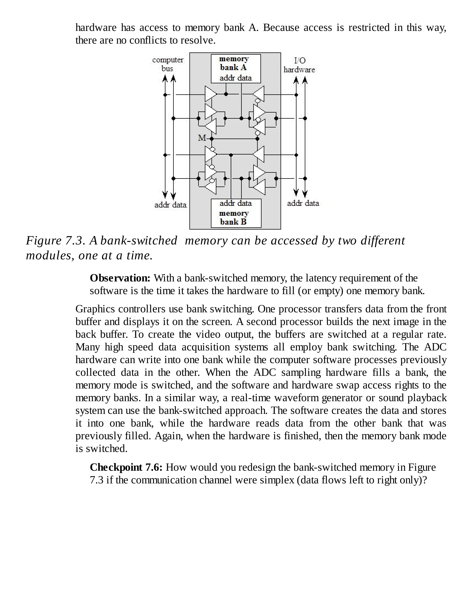
*Description*: Technical schematic and block diagram illustrating circuit operation, signal pathways, and functional behavior for Figure 7.3: A bank-switched  memory can be accessed by two different.

> **Figure 7.3: A bank-switched  memory can be accessed by two different**

modules, one at a time.
Observation: With a bank-switched memory, the latency requirement of the
software is the time it takes the hardware to fill (or empty) one memory bank.
Graphics controllers use bank switching. One processor transfers data from the front
buffer and displays it on the screen. A second processor builds the next image in the
back buffer. To create the video output, the buffers are switched at a regular rate.
Many high speed data acquisition systems all employ bank switching. The ADC
hardware can write into one bank while the computer software processes previously
collected data in the other. When the ADC sampling hardware fills a bank, the
memory mode is switched, and the software and hardware swap access rights to the
memory banks. In a similar way, a real-time waveform generator or sound playback
system can use the bank-switched approach. The software creates the data and stores
it into one bank, while the hardware reads data from the other bank that was
previously filled. Again, when the hardware is finished, then the memory bank mode
is switched.
Checkpoint 7.6: How would you redesign the bank-switched memory in Figure

## 7.3 if the communication channel were simplex (data flows left to right only)?


<!-- Page 370 -->
### [PDF Page 370]

7.4. Fundamental Approach to DMA
With a software-controlled interface (busy-wait or interrupts) if we wish to transfer
data from an input device into RAM, you must first transfer it from input to the
processor, then from the processor into RAM. In addition, this transfer is explicitly
controlled by executing software. In order to improve performance, we will transfer
data directly from input to RAM or RAM to output using Direct Memory Access,
DMA.  Because DMA bandwidth can be as high as the bus bandwidth, we will use
this method to interface high bandwidth devices like disks, digital scopes, cameras,

```assembly
and networks. Similarly, because the latency of this type of interface depends only on
```

hardware and is usually just a couple of bus cycles, we will use DMA for situations
that require a very fast response. On the other hand, software-controlled interfaces
have the potential to perform more complex operations than simply transferring the
data to/from memory. For example, the software could perform error checking,
convert from one format to another, implement compression/decompression, and
detect events. These more complex I/O operations may preclude the usage of DMA.
7.4.1. DMA Cycles
During a DMA read cycle, the processor can still access flash memory and ROM,
while hardware automatically transfers data from RAM to the output device (Figure
7.4). The address on the bus specifies the RAM location from which to read the data.
The µDMA controller on the TM4C has many different configuration options to burst
transfer data to and from arbitrary locations. For example, it may automatically
increment the RAM source address to stream an array to an output device. The TM4C
series does not support DMA transfers with flash memory or ROM because they are
on a separate internal bus.

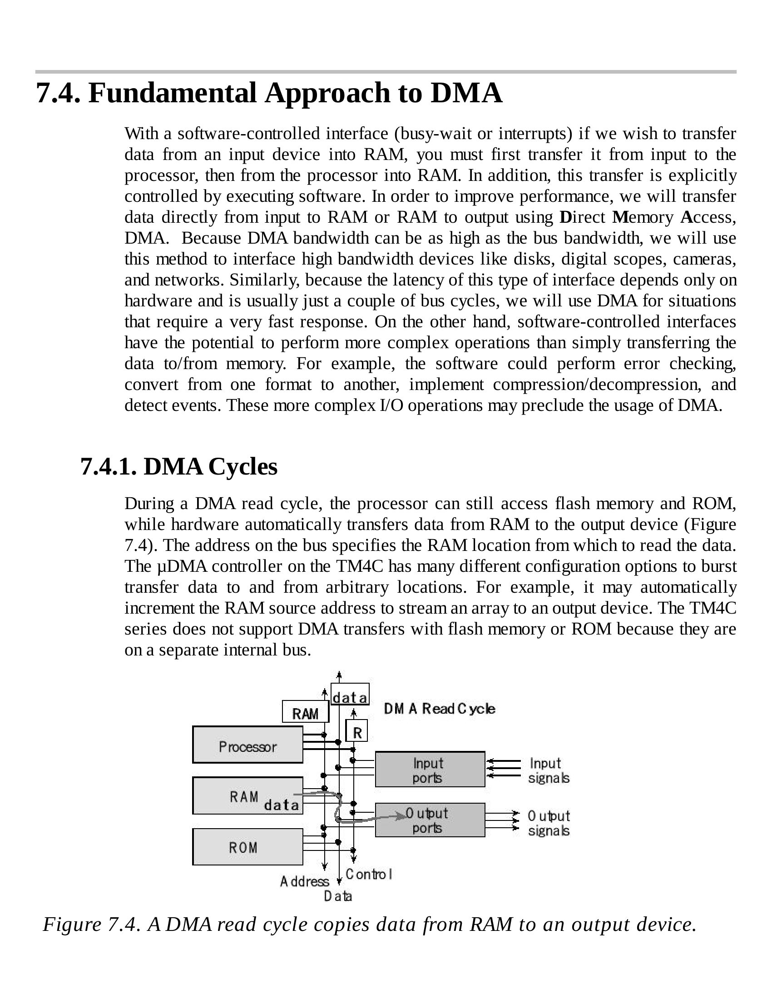
*Description*: Technical schematic and block diagram illustrating circuit operation, signal pathways, and functional behavior for Figure 7.4: A DMA read cycle copies data from RAM to an output device..

> **Figure 7.4: A DMA read cycle copies data from RAM to an output device.**


<!-- Page 371 -->
### [PDF Page 371]

During a DMA write cycle, the processor can still access flash memory and ROM,
while hardware automatically transfers data from the input device to RAM (Figure
7.5). The address on the bus specifies the RAM location to which to write the data. A
useful configuration mode could be to have the µDMA controller automatically
increment the RAM destination address to stream data from an input device. In some
DMA interfaces, two DMA cycles are required to transfer the data. The first DMA
cycle brings data from the source into the DMA module, and the second DMA cycle
sends the data to its destination.

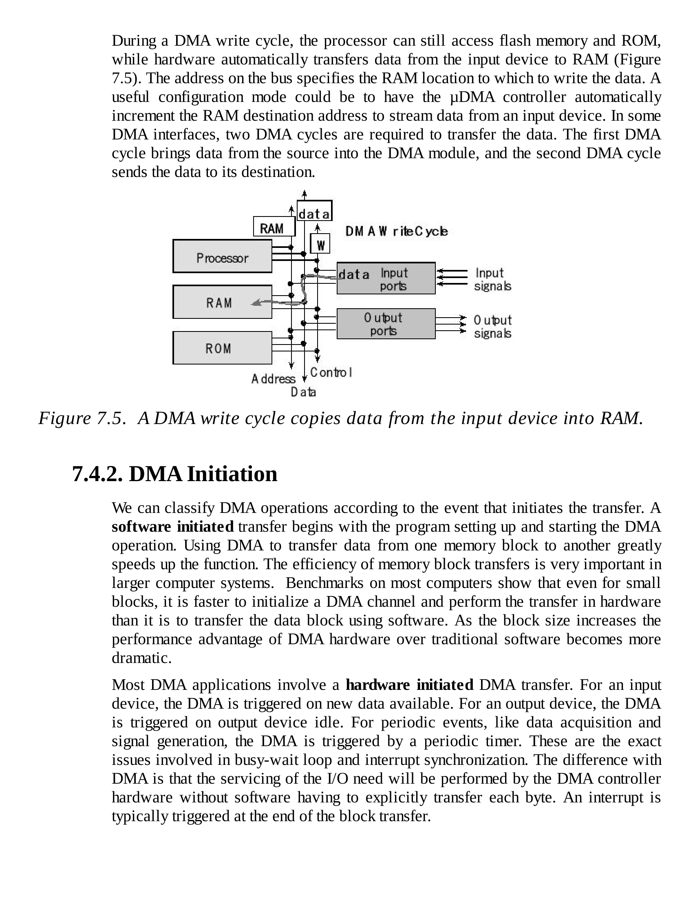
*Description*: Technical schematic and block diagram illustrating circuit operation, signal pathways, and functional behavior for Figure 7.5: A DMA write cycle copies data from the input device into RAM..

> **Figure 7.5: A DMA write cycle copies data from the input device into RAM.**

7.4.2. DMA Initiation
We can classify DMA operations according to the event that initiates the transfer. A
software initiated transfer begins with the program setting up and starting the DMA
operation. Using DMA to transfer data from one memory block to another greatly
speeds up the function. The efficiency of memory block transfers is very important in
larger computer systems.  Benchmarks on most computers show that even for small
blocks, it is faster to initialize a DMA channel and perform the transfer in hardware
than it is to transfer the data block using software. As the block size increases the
performance advantage of DMA hardware over traditional software becomes more
dramatic.
Most DMA applications involve a hardware initiated DMA transfer. For an input
device, the DMA is triggered on new data available. For an output device, the DMA
is triggered on output device idle. For periodic events, like data acquisition and
signal generation, the DMA is triggered by a periodic timer. These are the exact
issues involved in busy-wait loop and interrupt synchronization. The difference with
DMA is that the servicing of the I/O need will be performed by the DMA controller
hardware without software having to explicitly transfer each byte. An interrupt is
typically triggered at the end of the block transfer.


<!-- Page 372 -->
### [PDF Page 372]

7.4.3. Burst versus Single Cycle DMA
When the desired I/O bandwidth matches the computer bus bandwidth, then the
computer can be completely halted, while the block of data is transferred all at once,
see Figure 7.6. Once an input block is ready, a burst mode DMA is requested, the
computer is halted, and the block is transferred into memory.

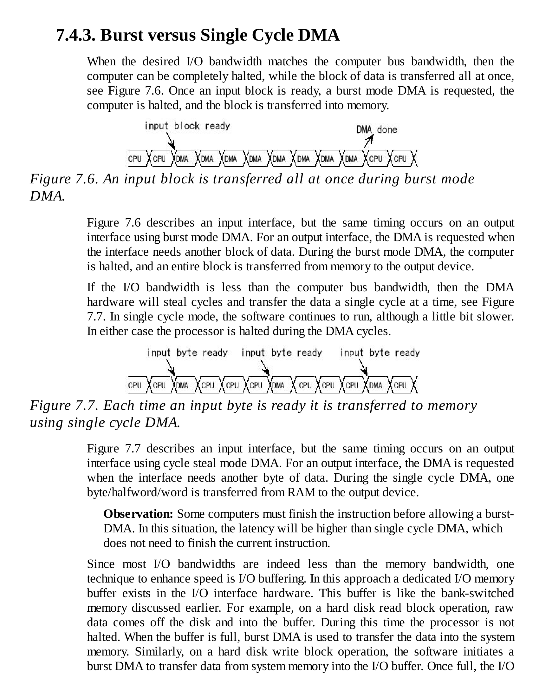
*Description*: Technical schematic and block diagram illustrating circuit operation, signal pathways, and functional behavior for Figure 7.6: An input block is transferred all at once during burst mode.

> **Figure 7.6: An input block is transferred all at once during burst mode**

DMA.


*Description*: Hardware pinout and board interface diagram mapping microcontroller pins, BoosterPack headers, switches, LEDs, and physical connectors for Figure 7.6: describes an input interface, but the same timing occurs on an output.

> **Figure 7.6: describes an input interface, but the same timing occurs on an output**

interface using burst mode DMA. For an output interface, the DMA is requested when
the interface needs another block of data. During the burst mode DMA, the computer
is halted, and an entire block is transferred from memory to the output device.
If the I/O bandwidth is less than the computer bus bandwidth, then the DMA
hardware will steal cycles and transfer the data a single cycle at a time, see Figure
7.7. In single cycle mode, the software continues to run, although a little bit slower.
In either case the processor is halted during the DMA cycles.


*Description*: Technical schematic and block diagram illustrating circuit operation, signal pathways, and functional behavior for Figure 7.7: Each time an input byte is ready it is transferred to memory.

> **Figure 7.7: Each time an input byte is ready it is transferred to memory**

using single cycle DMA.


*Description*: Hardware pinout and board interface diagram mapping microcontroller pins, BoosterPack headers, switches, LEDs, and physical connectors for Figure 7.7: describes an input interface, but the same timing occurs on an output.

> **Figure 7.7: describes an input interface, but the same timing occurs on an output**

interface using cycle steal mode DMA. For an output interface, the DMA is requested
when the interface needs another byte of data. During the single cycle DMA, one
byte/halfword/word is transferred from RAM to the output device.
Observation: Some computers must finish the instruction before allowing a burst-
DMA. In this situation, the latency will be higher than single cycle DMA, which
does not need to finish the current instruction.
Since most I/O bandwidths are indeed less than the memory bandwidth, one
technique to enhance speed is I/O buffering. In this approach a dedicated I/O memory
buffer exists in the I/O interface hardware. This buffer is like the bank-switched
memory discussed earlier. For example, on a hard disk read block operation, raw
data comes off the disk and into the buffer. During this time the processor is not
halted. When the buffer is full, burst DMA is used to transfer the data into the system
memory. Similarly, on a hard disk write block operation, the software initiates a
burst DMA to transfer data from system memory into the I/O buffer. Once full, the I/O


<!-- Page 373 -->
### [PDF Page 373]

interface can write the data onto the disk.
Checkpoint 7.7: What is the maximum latency in a single cycle DMA system?
7.4.4. Single Address versus Dual Address DMA
Some computer systems allow the transfer of data between the memory and I/O
interface to occur in one bus cycle, while others need two bus cycles to complete the
transfer.
In a single address DMA cycle, the address and R/W line dictate the memory
function to be performed and the I/O interface is sophisticated enough to know it
should participate in the transfer. In this single address example, the disk interface is
reading bytes from a disk, as shown in Figure 7.8. During the transfer, the bus
address is the memory address, Figure 7.9.

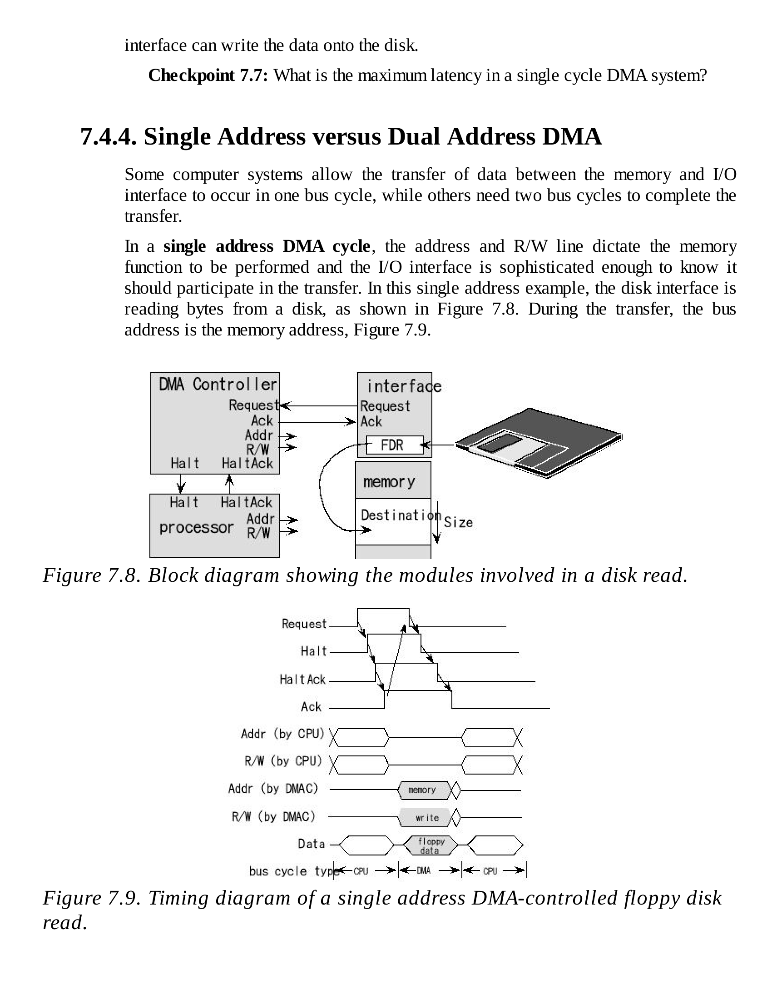
*Description*: Architectural block diagram detailing logic modules, memory buses, internal registers, and hardware interconnections for Figure 7.8: Block diagram showing the modules involved in a disk read..

> **Figure 7.8: Block diagram showing the modules involved in a disk read.**


*Description*: Timing waveform and execution flowchart illustrating signal transitions, state machine progression, or algorithm logic for Figure 7.9: Timing diagram of a single address DMA-controlled floppy disk.

> **Figure 7.9: Timing diagram of a single address DMA-controlled floppy disk**

read.


<!-- Page 374 -->
### [PDF Page 374]

Single cycle mode will be used because the disk bandwidth is slower than the bus.
When a new byte is available, Request will be asserted and this will request a DMA
cycle from the DMA controller (Figure 7.9). The DMA controller will temporarily
suspend the processor and drive the address bus with the memory address and the
R/W to write. During this cycle the DMA controller will respond to the floppy
interface by asserting the Ack. The disk uses the Ack (ignoring the address bus and
R/W) to know when to drive its data on the bus.
Observation: Most microcontrollers including the MSP432 and the TM4C do not
support single address DMA.
In a dual address DMA cycle, two bus cycles are required to achieve the transfer. In
the first cycle, the data is read from the source address and copied in the DMA
controller. During the first cycle the address bus contains the source address and
R/W signifies read. The information from the data bus is saved in the Temp register
within the DMA controller. In the second cycle, the data is transferred to the
destination address. During the second cycle, the address bus contains the destination
address, the data bus has the Temp data, and R/W signifies write. In this dual address
example, the SPI interface is receiving bytes from a synchronous serial network
(Figure 7.10). Single cycle mode will be used because the SPI bandwidth is slower
than the bus. When a new byte is available, Request will be asserted and this will
request a DMA cycle from the DMA controller (Figure 7.11). The DMA controller
will temporarily suspend the processor and first drive the address bus with the SPI
data register address (R/W=read), then in the second cycle the DMA controller will
drive the address bus with the memory address (R/W=write). The SPI knows it has
been serviced, because its data register has been read. The single address DMA is
twice as fast as dual address DMA.

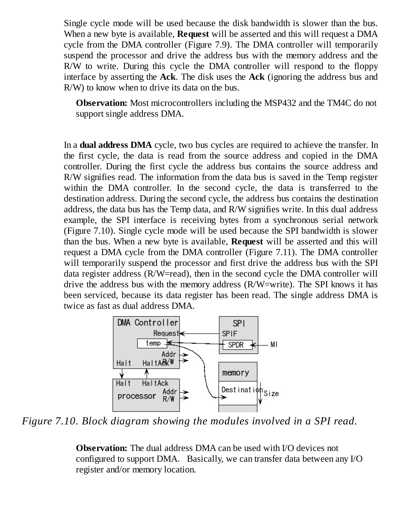
*Description*: Architectural block diagram detailing logic modules, memory buses, internal registers, and hardware interconnections for Figure 7.10: Block diagram showing the modules involved in a SPI read..

> **Figure 7.10: Block diagram showing the modules involved in a SPI read.**

Observation: The dual address DMA can be used with I/O devices not
configured to support DMA.   Basically, we can transfer data between any I/O
register and/or memory location.


<!-- Page 375 -->
### [PDF Page 375]


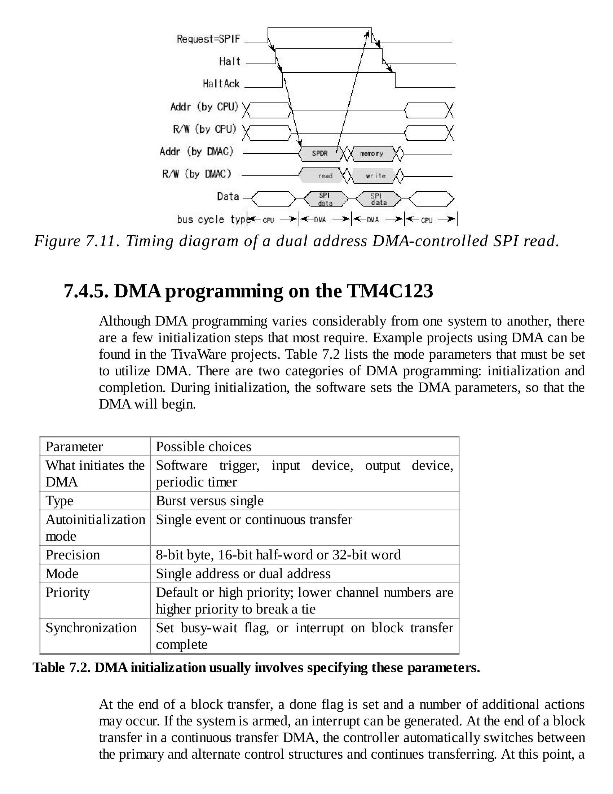
*Description*: Timing waveform and execution flowchart illustrating signal transitions, state machine progression, or algorithm logic for Figure 7.11: Timing diagram of a dual address DMA-controlled SPI read..

> **Figure 7.11: Timing diagram of a dual address DMA-controlled SPI read.**

7.4.5. DMA programming on the TM4C123
Although DMA programming varies considerably from one system to another, there
are a few initialization steps that most require. Example projects using DMA can be
found in the TivaWare projects. Table 7.2 lists the mode parameters that must be set
to utilize DMA. There are two categories of DMA programming: initialization and
completion. During initialization, the software sets the DMA parameters, so that the
DMA will begin.
Parameter
Possible choices
What initiates the
DMA
Software trigger, input device, output device,
periodic timer
Type
Burst versus single
Autoinitialization
mode
Single event or continuous transfer
Precision
8-bit byte, 16-bit half-word or 32-bit word
Mode
Single address or dual address
Priority
Default or high priority; lower channel numbers are
higher priority to break a tie
Synchronization
Set busy-wait flag, or interrupt on block transfer
complete


*Description*: Reference table detailing hardware parameters, register bit patterns, performance metrics, or memory configurations for Table 7.2: DMA initialization usually involves specifying these parameters..

> **Table 7.2: DMA initialization usually involves specifying these parameters.**

At the end of a block transfer, a done flag is set and a number of additional actions
may occur. If the system is armed, an interrupt can be generated. At the end of a block
transfer in a continuous transfer DMA, the controller automatically switches between
the primary and alternate control structures and continues transferring. At this point, a


<!-- Page 376 -->
### [PDF Page 376]

little bit of software attention is required to allow the DMA process to continue
indefinitely. An interrupt is requested, the DMA controller is finished with one
control structure so that one is stopped, and it has moved on to the other control

```c
structure, which is running.In this case, software must look at the XFERMODE  field
```

of the DMA Channel Control Word register of both the primary and alternate control

```c
structures. If this field is zero, the corresponding control structure is stopped and
```

must be re-initialized before the active one finishes. The TM4C calls this ping-pong
mode. Table 7.3 lists additional parameters we will need to initialize.
Parameter
Definition
Source
address
end pointer
Last address of the module (RAM or input) that
generates the data, inclusive
Destination
address end ptr.
Last address of the module (RAM or output) that
accepts the data, inclusive
Destination
address incr.
Automatically increment the destination address by
8, 16, 32, or 0
The address increment bit field value must be ≥
data size bit field value
Destination
data
size
8-, 16-, or 32-bit data size
Destination data size must be the same as source
data size
Source
address
increment
Automatically increment the source address by 8,
16, 32, or 0
The address increment bit field value must be ≥
data size bit field value
Source data size
8-, 16-, or 32-bit data size
Source data size must be the same as destination
data size
Arbitration size
Number of DMA transfers before the controller re-
arbitrates channel priority
This arbitration is among DMA channels only;
DMA never blocks processor
Size can be thought of as the maximum burst size
Should equal what peripheral can accommodate on
burst request
Must be a power of 2, but no arbitration occurs if
≥ 1,024
Transfer
size
(minus 1)
Number of transfers to be made
Maximum bit field value of 1,023 representing
maximum of 1,024 transfers
Updated by hardware at arbitration to contain
number of transfers remaining
Next useburst
If the number of transfers remaining is less than the


<!-- Page 377 -->
### [PDF Page 377]

arbitration size, setting this bit uses a burst transfer
to get all of them; otherwise use single transfers
Used exclusively for the peripheral scatter-gather
operation
Transfer mode
Configure the DMA transfer mode according to
desired operation of system

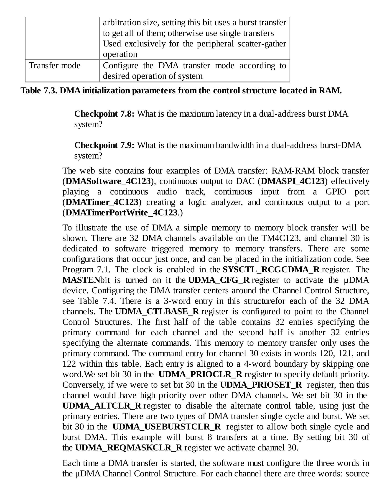
*Description*: Reference table detailing hardware parameters, register bit patterns, performance metrics, or memory configurations for Table 7.3: DMA initialization parameters from the control structure located in RAM..

> **Table 7.3: DMA initialization parameters from the control structure located in RAM.**

Checkpoint 7.8: What is the maximum latency in a dual-address burst DMA
system?
Checkpoint 7.9: What is the maximum bandwidth in a dual-address burst-DMA
system?
The web site contains four examples of DMA transfer: RAM-RAM block transfer
(DMASoftware_4C123), continuous output to DAC (DMASPI_4C123) effectively
playing a continuous audio track, continuous input from a GPIO port
(DMATimer_4C123) creating a logic analyzer, and continuous output to a port
(DMATimerPortWrite_4C123.)
To illustrate the use of DMA a simple memory to memory block transfer will be
shown. There are 32 DMA channels available on the TM4C123, and channel 30 is
dedicated to software triggered memory to memory transfers. There are some
configurations that occur just once, and can be placed in the initialization code. See


*Description*: Register layout and memory mapping diagram specifying bit fields, stack pointer allocations, and memory address boundaries for Program 7.1: The clock is enabled in the SYSCTL_RCGCDMA_R register. The.

> **Program 7.1: The clock is enabled in the SYSCTL_RCGCDMA_R register. The**

MASTENbit is turned on it the UDMA_CFG_R register to activate the μDMA
device. Configuring the DMA transfer centers around the Channel Control Structure,
see Table 7.4. There is a 3-word entry in this structurefor each of the 32 DMA
channels. The UDMA_CTLBASE_R register is configured to point to the Channel
Control Structures. The first half of the table contains 32 entries specifying the
primary command for each channel and the second half is another 32 entries
specifying the alternate commands. This memory to memory transfer only uses the
primary command. The command entry for channel 30 exists in words 120, 121, and
122 within this table. Each entry is aligned to a 4-word boundary by skipping one
word.We set bit 30 in the  UDMA_PRIOCLR_R register to specify default priority.
Conversely, if we were to set bit 30 in the UDMA_PRIOSET_R  register, then this
channel would have high priority over other DMA channels. We set bit 30 in the
UDMA_ALTCLR_R register to disable the alternate control table, using just the
primary entries. There are two types of DMA transfer single cycle and burst. We set
bit 30 in the  UDMA_USEBURSTCLR_R  register to allow both single cycle and
burst DMA. This example will burst 8 transfers at a time. By setting bit 30 of
the UDMA_REQMASKCLR_R register we activate channel 30.
Each time a DMA transfer is started, the software must configure the three words in
the μDMA Channel Control Structure. For each channel there are three words: source


<!-- Page 378 -->
### [PDF Page 378]

address, destination address, and a channel control word. More specifically, we will
place the addresses of the last memory locations to be transferred into the source and
destination fields. There are eight fields in the control word. The DSTINC and
SRCINC specify if the source and destination addresses should be incremented (0
means +1, 1 means +2, 2 means +4, and 3 means no increment). In this example we
set both DSTINC and SRCINC to 2 so +4 is added to the addresses after each word
is transferred. The DSTSIZE and SRCSIZE specify the data size of the source and
destination (0 means byte, 1 means halfword, and 2 means word). In this example we
set both DSTSIZE and SRCSIZE to 2 to specify the transfer of 32-bit data. The
ARBSIZE field specifies the size of the bursts used during transfer. By setting this
field to 3, the controller will burst 8 words then look to see if another module wishes
to use the bus. The XFERSIZEfield specifies the number of items to transfer. By
setting this field to cnt-1 , the controller will transfer cnt  words. The
NXTUSEBURST field is not used in memory to memory transfer. We set the
XFERMODE bits to 2 to select auto-request mode. We set bit 30 in the
UDMA_ENASET_R register to enable channel 30. By setting bit 30 of
the UDMA_SWREQ_R register the transfer is initiated. There are three possible
mechanisms to determine when the transfer is complete. First, when complete, bit 30
ofthe  UDMA_ENASET_R  register will become zero. Alternately, we could poll
the XFERMODE bits in the channel control structure; these bits will also go zero
when the transfer is complete. A third mechanism uses interrupts. If we arm interrupt
number 46 in the NVIC, which is vector 62 at address 0x0000.00F8, then a µDMA
Software interrupt will be generated on completion.
Address of the last byte of the source buffer
Address of the last byte of the destination buffer
DSTINC
DSTSIZE
SRCINC
SRCSIZE
ARBSIZE
XFERSIZE
NXTUSE
XFERMODE

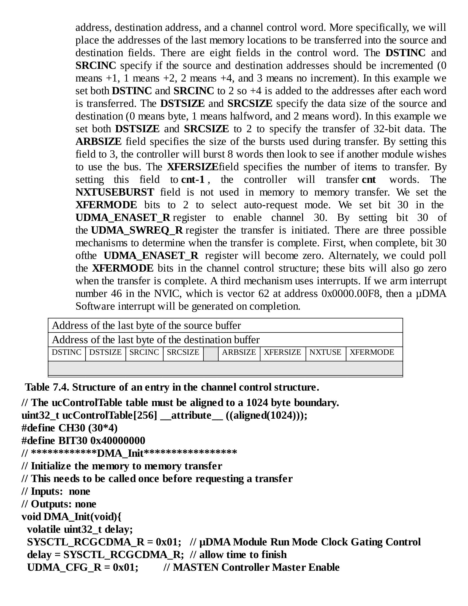
*Description*: Reference table detailing hardware parameters, register bit patterns, performance metrics, or memory configurations for Table 7.4: Structure of an entry in the channel control structure..

> **Table 7.4: Structure of an entry in the channel control structure.**

// The ucControlTable table must be aligned to a 1024 byte boundary.

```c
uint32_t ucControlTable[256] __attribute__ ((aligned(1024)));
```

#define CH30 (30*4)
#define BIT30 0x40000000
// ************DMA_Init*****************
// Initialize the memory to memory transfer
// This needs to be called once before requesting a transfer
// Inputs:  none
// Outputs: none

```c
void DMA_Init(void){
volatile uint32_t delay;
SYSCTL_RCGCDMA_R = 0x01;   // µDMA Module Run Mode Clock Gating Control
delay = SYSCTL_RCGCDMA_R;  // allow time to finish
UDMA_CFG_R = 0x01;         // MASTEN Controller Master Enable
```


<!-- Page 379 -->
### [PDF Page 379]

UDMA_CTLBASE_R = (uint32_t)ucControlTable;
UDMA_PRIOCLR_R = BIT30;    // default, not high priority
UDMA_ALTCLR_R = BIT30;     // use primary control
UDMA_USEBURSTCLR_R = BIT30; // responds to both burst and single
UDMA_REQMASKCLR_R = BIT30;  // allow controller to recognize requests
}
// ************DMA_Xfr *****************
// Called to transfer words from source to destination
// This needs to be called once before requesting a transfer
// Inputs:  src is a pointer to the first element of the original data
//          dest is a pointer to a place to put the copy
//          cnt is the number of words to transfer (max is 1024 words)
// Outputs: none
// This routine does not wait for completion

```c
void DMA_Xfr(uint32_t *src, uint32_t *dest, uint32_t cnt){
ucControlTable[CH30]   = (uint32_t)src+cnt*4-1;  // last address
ucControlTable[CH30+1] = (uint32_t)dest+cnt*4-1;  // last address
ucControlTable[CH30+2] = 0xAA00C002+((cnt-1)<<4);      // Control Word
```

/* DMACHCTL          Bits    Value Description
DSTINC            31:30   2     32-bit destination address increment
DSTSIZE           29:28   2     32-bit destination data size
SRCINC            27:26   2     32-bit source address increment
SRCSIZE           25:24   2     32-bit source data size
reserved          23:18   0     Reserved
ARBSIZE           17:14   3     Arbitrates after 8 transfers
XFERSIZE          13:4  cnt-1   Transfer cnt items
NXTUSEBURST       3       0     N/A for this transfer type
XFERMODE          2:0     2     Use Auto-request transfer mode
*/
UDMA_ENASET_R = BIT30;  // µDMA Channel 30 is enabled.
UDMA_SWREQ_R = BIT30;   // software start,
}

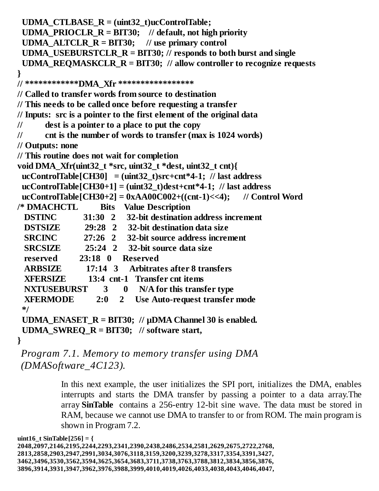
*Description*: Technical schematic and block diagram illustrating circuit operation, signal pathways, and functional behavior for Program 7.1: Memory to memory transfer using DMA.

> **Program 7.1: Memory to memory transfer using DMA**

(DMASoftware_4C123).
In this next example, the user initializes the SPI port, initializes the DMA, enables
interrupts and starts the DMA transfer by passing a pointer to a data array.The
array SinTable  contains a 256-entry 12-bit sine wave. The data must be stored in
RAM, because we cannot use DMA to transfer to or from ROM. The main program is
shown in Program 7.2.
uint16_t SinTable[256] = {
2048,2097,2146,2195,2244,2293,2341,2390,2438,2486,2534,2581,2629,2675,2722,2768,
2813,2858,2903,2947,2991,3034,3076,3118,3159,3200,3239,3278,3317,3354,3391,3427,
3462,3496,3530,3562,3594,3625,3654,3683,3711,3738,3763,3788,3812,3834,3856,3876,
3896,3914,3931,3947,3962,3976,3988,3999,4010,4019,4026,4033,4038,4043,4046,4047,


<!-- Page 380 -->
### [PDF Page 380]

4048,4047,4046,4043,4038,4033,4026,4019,4010,3999,3988,3976,3962,3947,3931,3914,
3896,3876,3856,3834,3812,3788,3763,3738,3711,3683,3654,3625,3594,3562,3530,3496,
3462,3427,3391,3354,3317,3278,3239,3200,3159,3118,3076,3034,2991,2947,2903,2858,
2813,2768,2722,2675,2629,2581,2534,2486,2438,2390,2341,2293,2244,2195,2146,2097,
2048,1999,1950,1901,1852,1803,1755,1706,1658,1610,1562,1515,1467,1421,1374,1328,
1283,1238,1193,1149,1105,1062,1020,978,937,896,857,818,779,742,705,669,634,600,
566,534,502,471,442,413,385,358,333,308,284,262,240,220,200,182,165,149,134,120,
108,97,86,77,70,63,58,53,50,49,48,49,50,53,58,63,70,77,86,97,108,120,134,149,165,
182,200,220,240,262,284,308,333,358,385,413,442,471,502,534,566,600,634,669,705,
742,779,818,857,896,937,978,1020,1062,1105,1149,1193,1238,1283,1328,1374,1421,
1467,1515,1562,1610,1658,1706,1755,1803,1852,1901,1950,1999};
int main(void){
PLL_Init();          // now running at 80 MHz
DAC_Init(0x1000);    // initialize with command: Vout = Vref
DMA_Init(625);       // DMA channel 8 for Timer5A, every 7.8125us
EnableInterrupts();  // Timer5A interrupt on completion, every 2ms
DMA_Start(SinTable, SSI0_DR, 256); //7.8125us*256= 2ms period sine wave

```c
while(1){
}
}
```


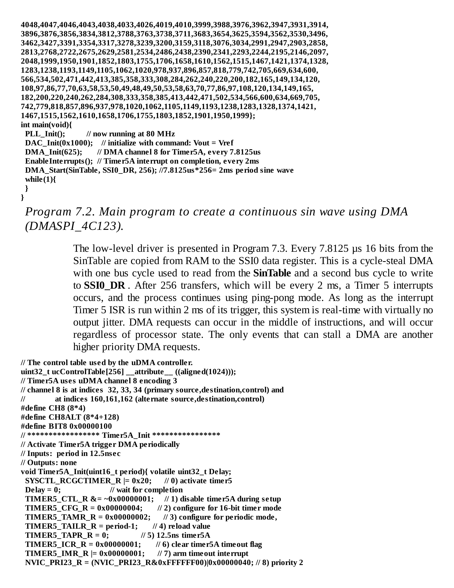
*Description*: Technical schematic and block diagram illustrating circuit operation, signal pathways, and functional behavior for Program 7.2: Main program to create a continuous sin wave using DMA.

> **Program 7.2: Main program to create a continuous sin wave using DMA**

(DMASPI_4C123).
The low-level driver is presented in Program 7.3. Every 7.8125 µs 16 bits from the
SinTable are copied from RAM to the SSI0 data register. This is a cycle-steal DMA
with one bus cycle used to read from the SinTable and a second bus cycle to write
to SSI0_DR . After 256 transfers, which will be every 2 ms, a Timer 5 interrupts
occurs, and the process continues using ping-pong mode. As long as the interrupt
Timer 5 ISR is run within 2 ms of its trigger, this system is real-time with virtually no
output jitter. DMA requests can occur in the middle of instructions, and will occur
regardless of processor state. The only events that can stall a DMA are another
higher priority DMA requests.
// The control table used by the uDMA controller.

```c
uint32_t ucControlTable[256] __attribute__ ((aligned(1024)));
// Timer5A uses uDMA channel 8 encoding 3
// channel 8 is at indices  32, 33, 34 (primary source,destination,control) and
//              at indices 160,161,162 (alternate source,destination,control)
```

#define CH8 (8*4)
#define CH8ALT (8*4+128)
#define BIT8 0x00000100
// ***************** Timer5A_Init ****************
// Activate Timer5A trigger DMA periodically
// Inputs:  period in 12.5nsec
// Outputs: none

```c
void Timer5A_Init(uint16_t period){ volatile uint32_t Delay;
SYSCTL_RCGCTIMER_R |= 0x20;      // 0) activate timer5
Delay = 0;                       // wait for completion
TIMER5_CTL_R &= ~0x00000001;     // 1) disable timer5A during setup
TIMER5_CFG_R = 0x00000004;       // 2) configure for 16-bit timer mode
TIMER5_TAMR_R = 0x00000002;      // 3) configure for periodic mode,
TIMER5_TAILR_R = period-1;       // 4) reload value
TIMER5_TAPR_R = 0;               // 5) 12.5ns timer5A
TIMER5_ICR_R = 0x00000001;       // 6) clear timer5A timeout flag
TIMER5_IMR_R |= 0x00000001;      // 7) arm timeout interrupt
NVIC_PRI23_R = (NVIC_PRI23_R&0xFFFFFF00)|0x00000040; // 8) priority 2
```


<!-- Page 381 -->
### [PDF Page 381]

// interrupts enabled in the main program after all devices initialized
// vector number 108, interrupt number 92
}
// ************DMA_Init*****************
// Initialize the buffer to port transfer, triggered by timer 5A
// This needs to be called once before requesting a transfer
// The source address increments by 2, destination address is fixed
// Call DMA_Start to begin continuous transfer, call DMA_Stop to halt
// Inputs:  period in 12.5nsec
Outputs: none

```c
void DMA_Init(uint16_t period){int i; volatile uint32_t delay;
for(i=0; i<256; i++){
ucControlTable[i] = 0;
}
SYSCTL_RCGCDMA_R = 0x01;    // µDMA Module Run Mode Clock Gating Control
delay = SYSCTL_RCGCDMA_R;   // allow time to finish
UDMA_CFG_R = 0x01;          // MASTEN Controller Master Enable
UDMA_CTLBASE_R = (uint32_t)ucControlTable;
UDMA_CHMAP1_R = (UDMA_CHMAP1_R&0xFFFFFFF0)|0x00000003;  // timer5A
UDMA_PRIOCLR_R = BIT8;     // default, not high priority
UDMA_ALTCLR_R = BIT8;      // use primary control
UDMA_USEBURSTCLR_R = BIT8; // responds to both burst and single requests
UDMA_REQMASKCLR_R = BIT8;  // allow the µDMA controller to recognize requests
Timer5A_Init(period);
}
uint16_t *SourcePt;          // last address of source buffer, inc by 2
volatile uint32_t *DestinationPt;  // fixed address
uint32_t Count;                    // number of halfwords to transmit
// private function used to reprogram regular channel control structure
void static setRegular(void){
ucControlTable[CH8]   = (uint32_t)SourcePt;         // first and last address
ucControlTable[CH8+1] = (uint32_t)DestinationPt;    // last address
ucControlTable[CH8+2] = 0xD5000003+((Count-1)<<4);  // DMA Channel Control Word
```

/* DMACHCTL          Bits    Value Description
DSTINC            31:30   11    no destination address increment
DSTSIZE           29:28   01    16-bit destination data size
SRCINC            27:26   01    16-bit source address increment, +2
SRCSIZE           25:24   01    16-bit source data size
reserved          23:18   0     Reserved
ARBSIZE           17:14   0     Arbitrates after 1 transfer
XFERSIZE          13:4  count-1 Transfer count items
NXTUSEBURST       3       0     N/A for this transfer type
XFERMODE          2:0     011   Use ping-pong transfer mode  */
}
// private function used to reprogram alternate channel control structure
void static setAlternate(void){                        // same as regular
ucControlTable[CH8ALT]   = (uint32_t)SourcePt;      // first and last address
ucControlTable[CH8ALT+1] = (uint32_t)DestinationPt;  // last address
ucControlTable[CH8ALT+2] = 0xD5000003+((Count-1)<<4); // DMA Channel Control
}
// ************DMA_Start*****************
// Called to transfer halfwords from source to destination
// The source address is incremented by two each 16-bit xfer, destination fixed
// Inputs:  source is a pointer to a RAM buffer containing waveform to output
//          destination is a pointer to 32-bit DAC device (SSI0_DR_R),
//          count is the number of halfwords to transfer (max is 1024 halfwords)
// Outputs: none
// This routine does not wait for completion, runs continuously

```c
void DMA_Start(uint16_t *source, volatile uint32_t *destination, uint32_t count){
SourcePt = source+count-1;  // last address of source buffer
```


<!-- Page 382 -->
### [PDF Page 382]

DestinationPt = destination;
Count = count;             // number of halfwords to transmit
setRegular();
setAlternate();
NVIC_EN2_R = 0x10000000;         // 9) enable interrupt 92 in NVIC
// vector number 108, interrupt number 92
TIMER5_CTL_R |= 0x00000001;      // 10) enable timer5A
UDMA_ENASET_R |= BIT8;  // µDMA Channel 8 is enabled
// bits 2:0 ucControlTable[CH8+2] become clear when regular structure done
// bits 2:0 ucControlTable[CH8ALT+2] become clear when alternate structure done
}

```c
uint32_t NumberOfBuffersSent=0;
// ************DMA_Status*****************
// Can be used to check the status of the continuous DMA transfer
// Inputs:  none
// Outputs: the number of buffers transferred
uint32_t DMA_Status(void){
return NumberOfBuffersSent;
}
void Timer5A_Handler(void){ // interrupts after each block is transferred
TIMER5_ICR_R = TIMER_ICR_TATOCINT; // acknowledge timer5A timeout
NumberOfBuffersSent++;
if((ucControlTable[CH8+2]&0x0007)==0){     // regular buffer complete
setRegular();                            // rebuild channel control structure
}
if((ucControlTable[CH8ALT+2]&0x0007)==0){  // Alternate buffer complete
setAlternate();                          // rebuild channel control structure
}
}
// ************DMA_Stop*****************
// Stop the transfer halfwords from source to destination
// Inputs:  none
```

Outputs: none

```c
void DMA_Stop(void){
UDMA_ENACLR_R = BIT8;  // µDMA Channel 8 is disabled
NVIC_DIS2_R = 0x10000000;         // 9) disable interrupt 92 in NVIC
TIMER5_CTL_R &= ~0x00000001;      // 10) disable timer5A
}
```


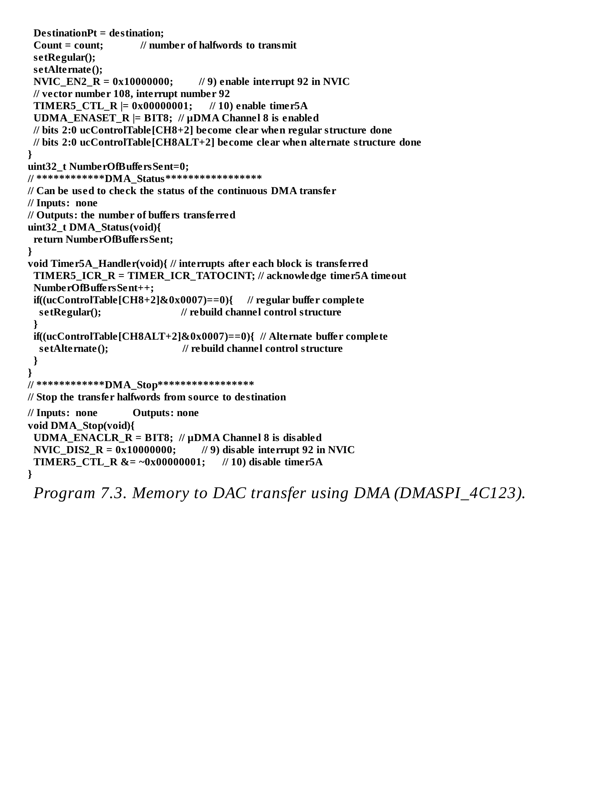
*Description*: Technical schematic and block diagram illustrating circuit operation, signal pathways, and functional behavior for Program 7.3: Memory to DAC transfer using DMA (DMASPI_4C123)..

> **Program 7.3: Memory to DAC transfer using DMA (DMASPI_4C123).**


<!-- Page 383 -->
### [PDF Page 383]

7.6. Exercises

## 7.1 For each term give a definition in 32 words or less.

a) Latency
b) Real-time
c) DMA
d) Seek time
e) Bandwidth
f) Dual-port memory
g) Bank-switched memory
h) Double buffer

## 7.2 For each pair of terms, explain the similarities and differences in 32 words or

less
a) Burst versus cycle-steal DMA
b) Single address versus dual address DMA
c) Back buffer versus front buffer
d) Write data required versus write data available

## 7.3 The objective of this problem is to interface various devices to the computer

using DMA synchronization. You may assume the bus bandwidth is at least 8 million
bytes/sec. For each device you are asked to select the most appropriate DMA mode.
Assume the devices support single address DMA. The 16-bit address of the memory
buffer used in each case is 0x1234. Fill in the table with the most appropriate mode
for each Device
Write Tape Drive Each tape block is 256 bytes. When a tape head is ready, the
controller will signal that it is ready to accept all 256 bytes. At this time, the tape
interface chip is ready to transfer as fast as possible all 256 bytes from the memory
buffer at 0x1234 to the tape.
Sound Input The sound waveform buffer is located in memory at 0x1234. Your
interface will read the 8-bit ADC 1024 times at 22 kHz and store the data in the
buffer. Your software will be smart enough to create two 512 byte buffers out of the
1024 bytes (double buffer) so that it can process one buffer while the ADC data is
being stored automatically under DMA control into the other buffer. I.e., when the
1024 byte wave buffer has been filled, the DMA system should repeat and fill it up
again.
Read Hard Drive There is a 256-byte buffer at 0x1234 that your DMA system will
fill with data from the hard disk. When a hard drive read head is ready, the controller
will signal that it has the next byte from the disk. It takes 10ms for the read head to be
ready, then the 256 bytes of data can be transferred from the disk to memory at 2
million bytes/sec.
Tape
Sound
Disk


<!-- Page 384 -->
### [PDF Page 384]

Cycle Steal or Block Transfer
Read or Write Transfer
Autoinitialization (Yes or No)
Address increment or decrement
DMA Address register value
DMA Count register value

## 7.4 When a 256-byte block is written to a floppy disk, there are 256 separate single-

address DMA cycles in cycle steal mode. This question deals with just one of these
DMA transfers. There are 14 events listed below. First you will eliminate the events
that do not occur during the DMA cycle that saves one byte on the disk. In particular,
list the events that will not occur. Second, you will list the events that do occur in the
proper sequence.
a) An interrupt is requested.
b) Registers are pulled from the stack.
c) Registers are pushed on the stack.
d) The DMAC asks the processor to halt by activating its Halt signal.
e) The DMAC deactivates its Halt request to the processor.
f) The DMAC tells the FDC interface that a DMA cycle is occurring by activating its
Ack signal; the DMA Controller drives the address bus with the FDC address; the
DMAC drives the control bus to signify a write cycle (e.g., R/W=0); the memory
drives the data bus; the FDC accepts the data.
g) The DMAC tells the FDC interface that a DMA cycle is occurring by activating its
Ack signal; the DMAC drives the address bus with the memory address; the DMAC
drives the control bus to signify a memory read cycle (e.g., R/W=1); the memory
drives the data bus; the FDC accepts the data.
h) The FDC deactivates its DMA Request signal to the DMAC.
i) The FDC requests a DMA cycle to the DMAC by activating its Request signal.
j) The interrupt service routine is executed.
k) The write head is properly positioned over the place on the disk.
l) The processor address and control lines float; the processor responds to the
DMAC that it is halted by activating its HaltAck signal.
m) The processor resumes software execution.
n) Wait until the current instruction is finished executing.


