# Chapter 8: File System Management

> **Textbook**: Embedded Systems: Real-Time Operating Systems for ARM Cortex-M Microcontrollers  
> **Author**: Jonathan W. Valvano  
> **PDF Page Range**: 385 - 426


---


<!-- Page 385 -->
### [PDF Page 385]

8. File system management

# Chapter 8 objectives are to:

• Present the fundamentals of file system management
• Develop a detailed solution of a simple file system
• Define basic components of a FAT system
• Describe how to program internal flash memory
• Present interfacing methods to a secure digital card (SDC)
In this chapter, we present approaches for managing large amounts of data on
an embedded system. We present two methods to save and retrieve data:
internal flash and an external secure digital card. In particular, we will define
data as abstract elements (files) and then create a mapping from the logical to
the physical. We will present methods for creating directory, accessing data,

```assembly
and managing free space.
```

We will begin this chapter with an introduction of file systems. In particular,
we briefly present what is a file system, discuss how it will be used, develop
performance metrics, present fundamental concepts, and then conclude with a
couple of simple examples.
Embedded applications that might require disk storage include data
acquisition, database systems, and signal generation systems. You can also use
a disk in an embedded system to log debugging information.


<!-- Page 386 -->
### [PDF Page 386]

8.1. Performance Metrics
8.1.1. Usage
A file system allows the software to store data and to retrieve previously stored data,
see Figure 8.1. Typically, the size of the stored data exceeds available memory of the
computer. In general, file systems allow for these operations:
Create a new file
Write data to the file (append to end or insert at arbitrary
location)
Read data from the file (read sequential or read at arbitrary
location)
Erase the file
Each file will have a name or a number, with which we will use to access the data in
that file. In general, we can organize files into directories. However, in this chapter,
we will restrict our file system implementations to a single directory containing all
files.

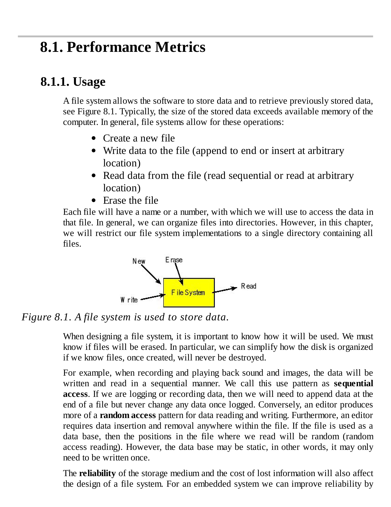
*Description*: Technical schematic and block diagram illustrating circuit operation, signal pathways, and functional behavior for Figure 8.1: A file system is used to store data..

> **Figure 8.1: A file system is used to store data.**

When designing a file system, it is important to know how it will be used. We must
know if files will be erased. In particular, we can simplify how the disk is organized
if we know files, once created, will never be destroyed.
For example, when recording and playing back sound and images, the data will be
written and read in a sequential manner. We call this use pattern as sequential
access. If we are logging or recording data, then we will need to append data at the
end of a file but never change any data once logged. Conversely, an editor produces
more of a random access pattern for data reading and writing. Furthermore, an editor
requires data insertion and removal anywhere within the file. If the file is used as a
data base, then the positions in the file where we read will be random (random
access reading). However, the data base may be static, in other words, it may only
need to be written once.
The reliability of the storage medium and the cost of lost information will also affect
the design of a file system. For an embedded system we can improve reliability by


<!-- Page 387 -->
### [PDF Page 387]

selecting a more reliable storage medium or by deploying redundancy. For example,
we could write the same data into three independent disks, and when reading we read
all three and return the median of the three data values.
So in general, we should first study the use cases in our system before choosing or
designing the file system. In this chapter, we will develop in detail a file system for
data logging, where both writing and reading will be done sequentially, and files will
never be deleted.
8.1.2. Specifications
There are many organizational approaches when designing a file system. As we make
design decisions, it is appropriate to consider both quantitative and qualitative
parameters. We can measure the effectiveness of a file system by
Maximum file size
Maximum number of files
Speed to read data at a random position in the file
Speed to read data in a sequential fashion
Speed to write data into the file
8.1.3. Fragmentation
Internal fragmentation is storage that is allocated for the convenience of the
operating system but contains no information. This space is wasted. Often this space
is wasted in order to improve speed or to provide for a simpler implementation. The
fragmentation is called "internal" because the wasted storage is inside the allocated
region, see Figure 8.2. In most file systems, whole sectors (or even clusters of
sectors) are allocated to individual files, because this simplifies organization and
makes it easier to grow files. Any space left over between the last byte of the file and
the first byte of the next sector is a form of internal fragmentation called file slack or
slack space. A small file holding m bytes is allocated an entire sector capable of
storing n bytes of data. However, only m of those locations contains data, so the
remaining n-m bytes can be considered internal fragmentation. The pointers and
counters used by the OS to manage the file are not considered internal fragmentation,
because even though the locations do not contain data, the space is not wasted.
Whether or not to count the OS pointers and counters as internal fragmentation is a
matter of debate. As is the case with most definitions, it is appropriate to document
your working definition of internal fragmentation whenever presenting performance
specifications to your customers.


<!-- Page 388 -->
### [PDF Page 388]


*Description*: Technical schematic and block diagram illustrating circuit operation, signal pathways, and functional behavior for Figure 8.2: The large block is the entire disk. There are multiple files.

> **Figure 8.2: The large block is the entire disk. There are multiple files**

(rectangles) on this disk. The rectangle on the left represents one file. Within
the allocated space for this file there is data, and there is some space in the
allocated area that is not data. The space within the allocated area not used
for data is internal fragmentation.
Many compilers will align variables on a 32-bit boundary, even though memory is
byte-addressable. If the size of a data structure is not divisible by 32 bits, it will skip
memory bytes so the next variable is aligned onto a 32-bit boundary. This wasted
space is also internal fragmentation.
Checkpoint 8.1: If the sector size is n and the size of the files is randomly
distributed, what is the average internal fragmentation per file?
External fragmentation exists when the largest file that can be allocated is less than
the total amount of free space on the disk. External fragmentation occurs in systems
that require contiguous allocation, like a memory manager. External fragmentation
would occur within a file system that allocates disk space in contiguous sectors.
Over time, free storage becomes divided into many small pieces, see Figure 8.3. It is
a particular problem when an application allocates and deallocates regions of
storage of varying sizes. The result is that, although free storage is available, it is
effectively unusable because it is divided into pieces that are too small to satisfy the
demands of the application. The term "external" refers to the fact that the unusable
storage is outside the allocated regions.

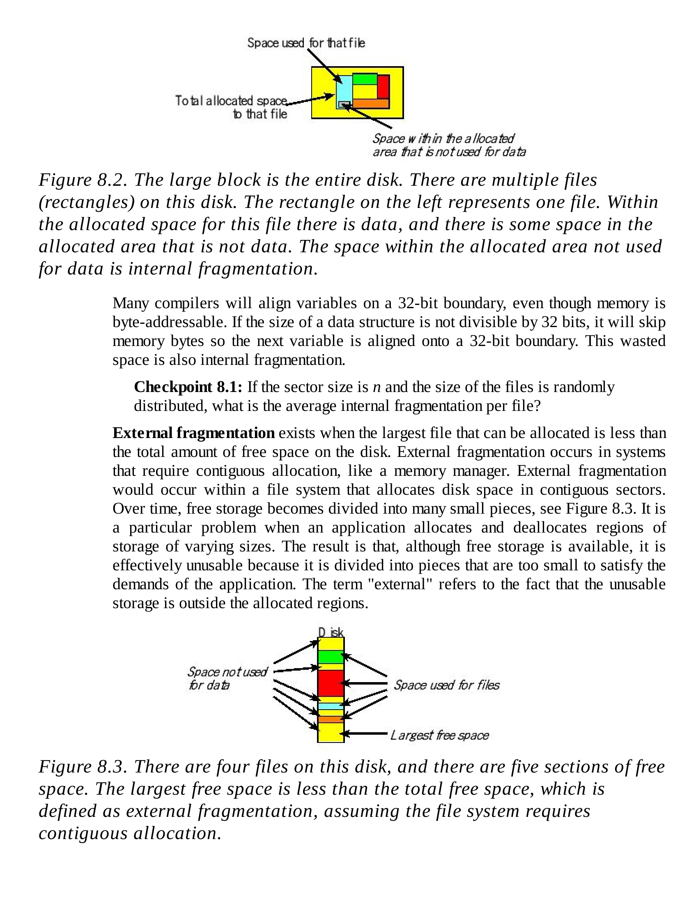
*Description*: Technical schematic and block diagram illustrating circuit operation, signal pathways, and functional behavior for Figure 8.3: There are four files on this disk, and there are five sections of free.

> **Figure 8.3: There are four files on this disk, and there are five sections of free**

space. The largest free space is less than the total free space, which is
defined as external fragmentation, assuming the file system requires
contiguous allocation.


<!-- Page 389 -->
### [PDF Page 389]

For example, assume we have a file system employing contiguous allocation. A new
file with five sectors might be requested, but the largest contiguous chunk of free disk
space is only three sectors long. Even if there are ten free sectors, those free sectors
may be separated by allocated files, one still cannot allocate the requested file with
five sectors, and the allocation request will fail. This is external fragmentation
because there are ten free sectors but the largest file that can be allocated is three
sectors.
Checkpoint 8.2: Consider this analogy. You are given a piece of wood that is 10
meters long, and you are asked to cut it because you need one piece that is 2
meters long. What is the best way to cut the wood so there is no external
fragmentation? Think of another way the wood could have been cut so the largest
piece of free wood is smaller than the total free wood, creating external
fragmentation?


<!-- Page 390 -->
### [PDF Page 390]

8.2. File System Allocation
There are three components of the file system: the directory, allocation, and free-
space management. This section introduces fundamental concepts and the next two
sections present simple file systems. In this chapter, we define sector as a unit of
storage. Whole sectors will be allocated to a file. In other words, we will not
combine data from multiple files into a single sector.
We consider information in a file as a simple linear array of bytes. The “logical”
address is considered as the index into this array. However, data must be placed at a
“physical” location on the disk.  An important task of the file system is to translate
the logical address to the physical address (Figure 8.4).

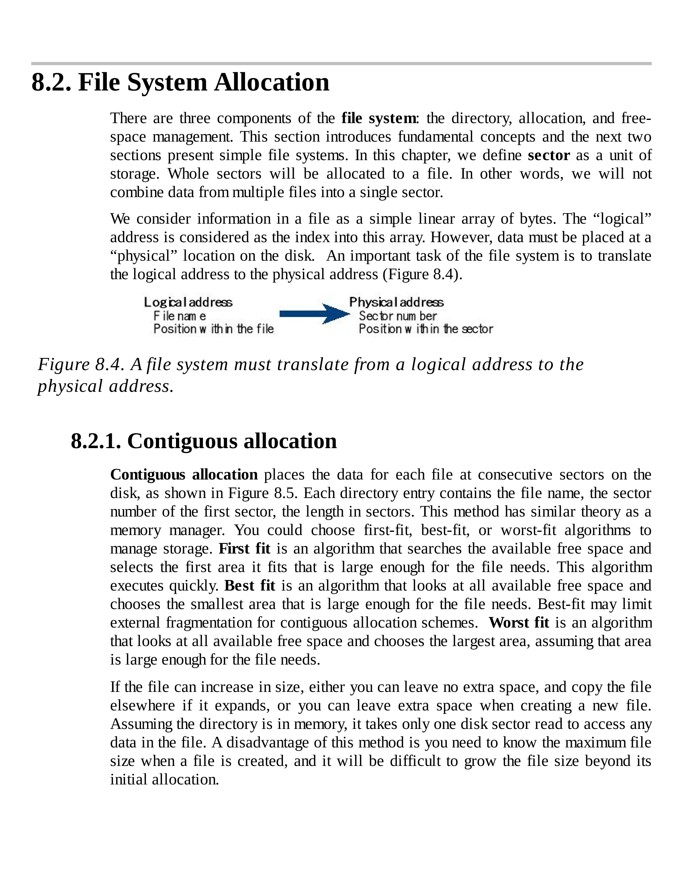
*Description*: Technical schematic and block diagram illustrating circuit operation, signal pathways, and functional behavior for Figure 8.4: A file system must translate from a logical address to the.

> **Figure 8.4: A file system must translate from a logical address to the**

physical address.
8.2.1. Contiguous allocation
Contiguous allocation places the data for each file at consecutive sectors on the
disk, as shown in Figure 8.5. Each directory entry contains the file name, the sector
number of the first sector, the length in sectors. This method has similar theory as a
memory manager. You could choose first-fit, best-fit, or worst-fit algorithms to
manage storage. First fit is an algorithm that searches the available free space and
selects the first area it fits that is large enough for the file needs. This algorithm
executes quickly. Best fit is an algorithm that looks at all available free space and
chooses the smallest area that is large enough for the file needs. Best-fit may limit
external fragmentation for contiguous allocation schemes.  Worst fit is an algorithm
that looks at all available free space and chooses the largest area, assuming that area
is large enough for the file needs.
If the file can increase in size, either you can leave no extra space, and copy the file
elsewhere if it expands, or you can leave extra space when creating a new file.
Assuming the directory is in memory, it takes only one disk sector read to access any
data in the file. A disadvantage of this method is you need to know the maximum file
size when a file is created, and it will be difficult to grow the file size beyond its
initial allocation.


<!-- Page 391 -->
### [PDF Page 391]


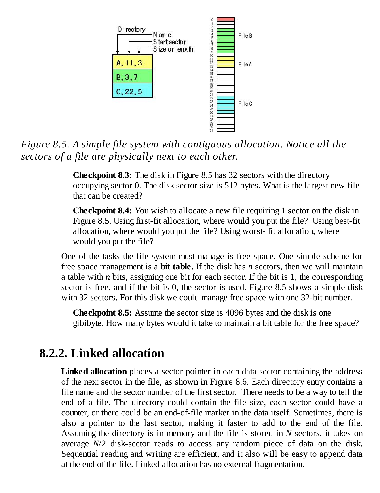
*Description*: Technical schematic and block diagram illustrating circuit operation, signal pathways, and functional behavior for Figure 8.5: A simple file system with contiguous allocation. Notice all the.

> **Figure 8.5: A simple file system with contiguous allocation. Notice all the**

sectors of a file are physically next to each other.
Checkpoint 8.3: The disk in Figure 8.5 has 32 sectors with the directory
occupying sector 0. The disk sector size is 512 bytes. What is the largest new file
that can be created?
Checkpoint 8.4: You wish to allocate a new file requiring 1 sector on the disk in


*Description*: Technical schematic and block diagram illustrating circuit operation, signal pathways, and functional behavior for Figure 8.5: Using first-fit allocation, where would you put the file?  Using best-fit.

> **Figure 8.5: Using first-fit allocation, where would you put the file?  Using best-fit**

allocation, where would you put the file? Using worst- fit allocation, where
would you put the file?
One of the tasks the file system must manage is free space. One simple scheme for
free space management is a bit table. If the disk has n sectors, then we will maintain
a table with n bits, assigning one bit for each sector. If the bit is 1, the corresponding
sector is free, and if the bit is 0, the sector is used. Figure 8.5 shows a simple disk
with 32 sectors. For this disk we could manage free space with one 32-bit number.
Checkpoint 8.5: Assume the sector size is 4096 bytes and the disk is one
gibibyte. How many bytes would it take to maintain a bit table for the free space?
8.2.2. Linked allocation
Linked allocation places a sector pointer in each data sector containing the address
of the next sector in the file, as shown in Figure 8.6. Each directory entry contains a
file name and the sector number of the first sector.  There needs to be a way to tell the
end of a file. The directory could contain the file size, each sector could have a
counter, or there could be an end-of-file marker in the data itself. Sometimes, there is
also a pointer to the last sector, making it faster to add to the end of the file.
Assuming the directory is in memory and the file is stored in N sectors, it takes on
average N/2 disk-sector reads to access any random piece of data on the disk.
Sequential reading and writing are efficient, and it also will be easy to append data
at the end of the file. Linked allocation has no external fragmentation.


<!-- Page 392 -->
### [PDF Page 392]


*Description*: Technical schematic and block diagram illustrating circuit operation, signal pathways, and functional behavior for Figure 8.6: A simple file system with linked allocation..

> **Figure 8.6: A simple file system with linked allocation.**

Checkpoint 8.6: If the disk holds 2 Gibibytes of data broken into 512-byte
sectors, how many bits would it take to store the sector address?
Checkpoint 8.7: If the disk holds 2 Gibibytes of data broken into 32k-byte
sectors, how many bits would it take to store the sector address?
Checkpoint 8.8: The disk in Figure 8.6 has 32 sectors with the directory
occupying sector 0. The disk-sector size is 512 bytes. What is the largest new file
that can be created?  Is there external fragmentation?
Checkpoint 8.9: How would you handle the situation where the number of bytes
stored in a file is not an integer multiple of the number of data bytes that can be
stored in each sector?
We can also use the links to manage the free space, as shown in Figure 8.7. If the
directory were lost, then all file information except the filenames could be
recovered. Putting the number of the last sector into the directory with double-linked
pointers improves recoverability. If one data sector were damaged, then remaining
data sectors could be rechained, limiting the loss of information to the one damaged
sector.

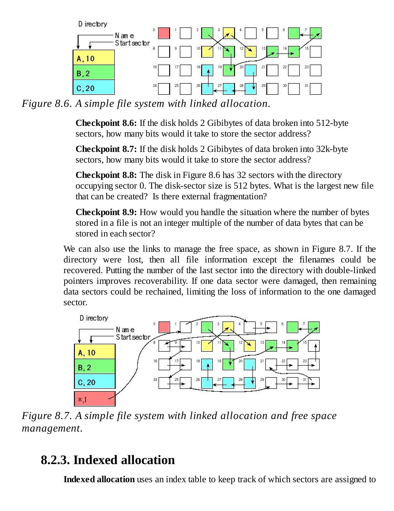
*Description*: Technical schematic and block diagram illustrating circuit operation, signal pathways, and functional behavior for Figure 8.7: A simple file system with linked allocation and free space.

> **Figure 8.7: A simple file system with linked allocation and free space**

management.
8.2.3. Indexed allocation
Indexed allocation uses an index table to keep track of which sectors are assigned to


<!-- Page 393 -->
### [PDF Page 393]

which files. Each directory entry contains a file name, an index for the first sector,

```assembly
and the total number of sectors, as shown in Figure 8.8. One implementation of
```

indexed allocation places all pointers for all files on the disk together in one index
table. Another implementation allocates a separate index table for each file. Often,
this table is so large it is stored in several disk sectors. For example, if the sector
number is a 16-bit number and the disk sector size is 512 bytes, then only 256 index
values can be stored in one sector. Also for reliability, we can store multiple copies
of the index on the disk. Typically, the entire index table is loaded into memory while
the disk is in use. The RAM version of the table is stored onto the disk periodically

```assembly
and when the system is shut down. Indexed allocation is faster than linked allocation
```

if we employ random access. If the index table is in RAM, then any data within the
file can be found with just one sector read. One way to improve reliability is to
employ both indexed and linked allocation. The indexed scheme is used for fast
access, and the links can be used to rebuild the file structure after a disk failure.
Indexed allocation has no external fragmentation.
Checkpoint 8.10: If the sector number is a 16-bit number and the sector size is
512 bytes, what is the maximum disk size?
Checkpoint 8.11: A disk with indexed allocation has 2 GiB of storage. Each file
has a separate index table, and that index occupies just one sector. The disk sector
size is 1024 bytes. What is the largest file that can be created? Give two ways to
change the file system to support larger files.
Checkpoint 8.12: This disk in Figure 8.8 has 32 sectors with the directory
occupying sector 0 and the index table in sector 1. The disk-sector size is 512
bytes. What is the largest new file that can be created?  Is there external
fragmentation?

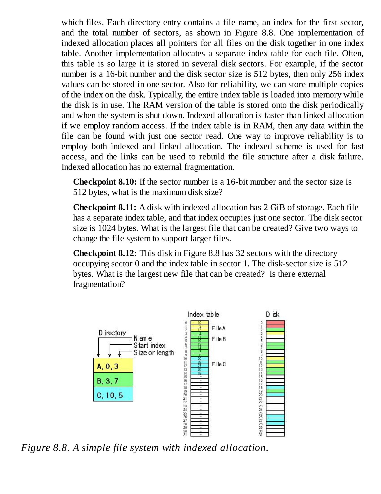
*Description*: Technical schematic and block diagram illustrating circuit operation, signal pathways, and functional behavior for Figure 8.8: A simple file system with indexed allocation..

> **Figure 8.8: A simple file system with indexed allocation.**


<!-- Page 394 -->
### [PDF Page 394]

8.2.4. File allocation table (FAT)
The file allocation table (FAT) is a mixture of indexed and linked allocation, as
shown in Figure 8.9. Each directory entry contains a file name and the sector number
of the first sector.

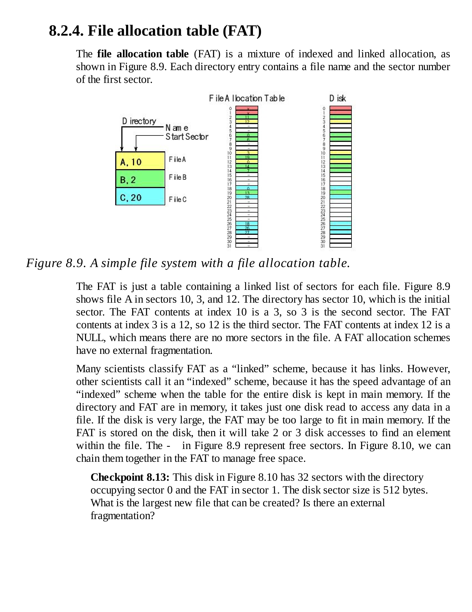
*Description*: Reference table detailing hardware parameters, register bit patterns, performance metrics, or memory configurations for Figure 8.9: A simple file system with a file allocation table..

> **Figure 8.9: A simple file system with a file allocation table.**

The FAT is just a table containing a linked list of sectors for each file. Figure 8.9
shows file A in sectors 10, 3, and 12. The directory has sector 10, which is the initial
sector. The FAT contents at index 10 is a 3, so 3 is the second sector. The FAT
contents at index 3 is a 12, so 12 is the third sector. The FAT contents at index 12 is a
NULL, which means there are no more sectors in the file. A FAT allocation schemes
have no external fragmentation.
Many scientists classify FAT as a “linked” scheme, because it has links. However,
other scientists call it an “indexed” scheme, because it has the speed advantage of an
“indexed” scheme when the table for the entire disk is kept in main memory. If the
directory and FAT are in memory, it takes just one disk read to access any data in a
file. If the disk is very large, the FAT may be too large to fit in main memory. If the
FAT is stored on the disk, then it will take 2 or 3 disk accesses to find an element
within the file. The -   in Figure 8.9 represent free sectors. In Figure 8.10, we can
chain them together in the FAT to manage free space.
Checkpoint 8.13: This disk in Figure 8.10 has 32 sectors with the directory
occupying sector 0 and the FAT in sector 1. The disk sector size is 512 bytes.
What is the largest new file that can be created? Is there an external
fragmentation?


<!-- Page 395 -->
### [PDF Page 395]


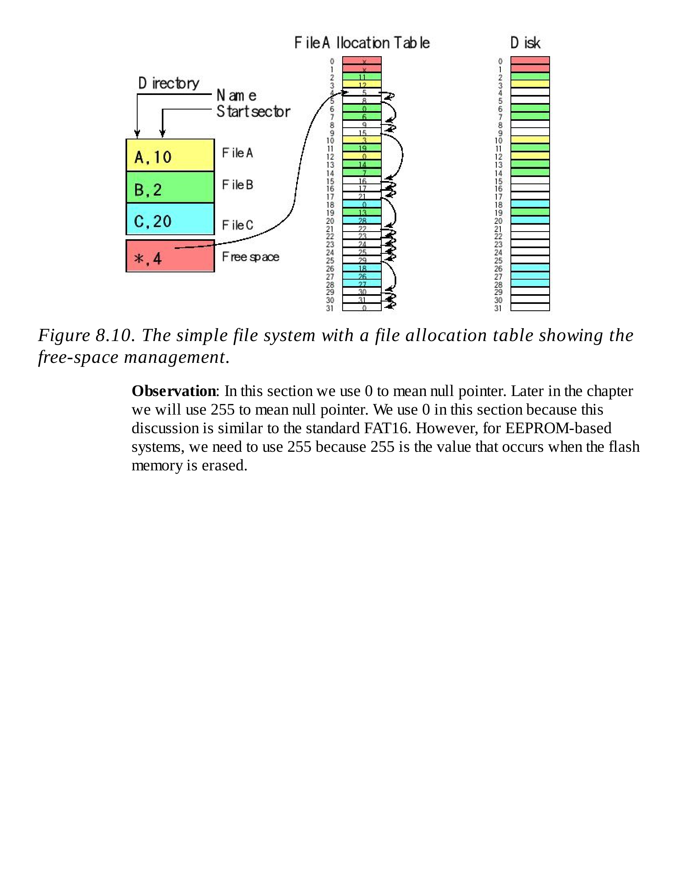
*Description*: Reference table detailing hardware parameters, register bit patterns, performance metrics, or memory configurations for Figure 8.10: The simple file system with a file allocation table showing the.

> **Figure 8.10: The simple file system with a file allocation table showing the**

free-space management.
Observation: In this section we use 0 to mean null pointer. Later in the chapter
we will use 255 to mean null pointer. We use 0 in this section because this
discussion is similar to the standard FAT16. However, for EEPROM-based
systems, we need to use 255 because 255 is the value that occurs when the flash
memory is erased.


<!-- Page 396 -->
### [PDF Page 396]

8.3. Solid State Disk
8.3.1. Flash memory
In general, we can divide memory into volatile and nonvolatile categories. Volatile
means it loses its data when power is removed and restored.  Nonvolatile means it
retains its data when power is removed and restored. There are many types of
memory, but here are four of them
Volatile memory
Static random access memory, SRAM
Dynamic random access memory, DRAM
Nonvolatile memory
Flash electrically erasable programmable read only
memory, EEPROM
Ferroelectric random access memory, FRAM
As you know data and the stack are allocated in RAM, because it needs read/write
access. DRAM has fewer transistors/bit compared to SRAM because it does require
periodic refreshing. Most Cortex M microcontrollers use SRAM because of its
simple technology and ability to operate on a wide range of bus frequencies. For
random access memories, there is a size above which DRAM is more cost effective
than SRAM. Dynamic random access memory (DRAM) is the type of memory found
in most personal computers. Embedded devices like the Beaglebone and Raspberry
Pi also use DRAM.
Ferroelectric RAM (FRAM) is a random access memory similar to DRAM but uses
a ferroelectric layer instead of a dielectric layer. The ferroelectric layer provides the
non-volatility needed for program storage. Some new lines of microcontrollers use
FRAM instead of flash EEPROM for their non-volatile storage. The MSP430FRxx
microcontrollers from Texas Instruments use FRAM to store programs and data in
one shared memory object. Other companies that produce FRAM microcontrollers
include Fujitsu and Silicon Labs.  FRAM requires less power usage, has a faster
write, and provides a greater maximum number of write-erase cycles when compared
to flash. When compared to flash, FRAMs have lower storage densities, smaller
sizes, and higher cost.
Solid-state disks can be made from any nonvolatile memory, such as battery-backed
RAM, FRAM, or flash EEPROM. Personal computers typically use disks made with
magnetic storage media and moving parts. While this magnetic-media technology is
acceptable for the personal computer because of its large storage size (> 1 Tibibyte)


<!-- Page 397 -->
### [PDF Page 397]


```assembly
and low cost (<$100 OEM), it is not appropriate for an embedded system because of
```

its physical dimensions, electrical power requirements, noise, sensitivity to motion,

```assembly
and weight.
```

Secure digital (SD) cards use Flash EEPROM together with interface logic to read

```assembly
and write data. For an embedded system we could create a file system using an SD
```

card or using the internal flash of the microcontroller itself. SD cards are an effective
approach when file storage needs exceed 128 kibibytes, because of the low cost and
simple synchronous serial interface. If we use the internal flash of the
microcontroller itself, there will be no additional costs to developing this file
system.
Smart phones, tablets, and cameras currently employ solid-state disks because of
their small physical size and low power requirements. Unfortunately, solid-state
disks have smaller storage sizes and higher cost/bit than the traditional magnetic
storage disk. A typical 64-Gibibyte SD card costs less than $20. The cost/bit is
therefore about $300/Tibibyte. In contrast, an 8-Tibibyte hard drive costs about $200
or $25/Tibibyte. The cost/bit of flash storage is expensive as compared to a
traditional hard drive. However, there is a size point (e.g., below 128 Gibibyte),
below which the overall cost of flash will be less than a traditional
magnetic/motorized drive.
A flash memory cell uses two transistors; the gates of the two transistors are
positioned gate to gate separated by an insulation layer as shown in Figure 8.11.
Because each flash bit has only two transistors, the microcontroller can pack more
flash bits into the chip as compared to SRAM or FRAM bits. A normal transistor has
an input gate that is used to control conductance between the source and drain.
However, in a flash memory cell, one of the gates is floating, which means it is not
connected to anything.  If we trap charge on this floating gate, we define this state as
value 0. If there is no trapped charge, we define the state as a 1. There are three
operations we can perform on the cell.

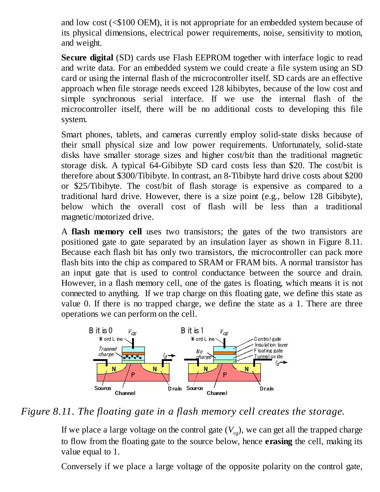
*Description*: Technical schematic and block diagram illustrating circuit operation, signal pathways, and functional behavior for Figure 8.11: The floating gate in a flash memory cell creates the storage..

> **Figure 8.11: The floating gate in a flash memory cell creates the storage.**

If we place a large voltage on the control gate (Vcg), we can get all the trapped charge
to flow from the floating gate to the source below, hence erasing the cell, making its
value equal to 1.
Conversely if we place a large voltage of the opposite polarity on the control gate,


<!-- Page 398 -->
### [PDF Page 398]

we can add charge to the floating gate, programming its value equal to 0. On the
TM4C123 the smallest granularity with which we can erase is 1024 bytes. On the
MSP432 we erase flash in blocks of 4096 bytes. However, we can program
individual words on most flash memories including the TM4C123 and MSP432.
Once erased to a 1 or programmed to a 0, the charge or lack of charge remains on the
floating gate even if power is removed from the system. Hence, this memory is
nonvolatile. Data in the TM4C123 and MSP432 flash memories will remain valid for
20 years, and the memory will operate up to 100,000 erase/program cycles. Erasing

```assembly
and programming operations take a very long time compared to writing static RAM
```

(SRAM). For example, it takes 8 to 15 ms to erase an entire 1024-byte page on the
TM4C123. In contrast, writing 256 words in RAM on an 80-MHz Cortex-M takes 5
cycles/loop, which adds up to 1280 cycles or 16 µs.
To read the value from flash, the control gate is activated. There is a threshold
voltage for the control gate at which source-drain current (Id) flows if the bit is 0 and
will not flow if the bit is 1. The threshold voltage is depicted as the dotted line in

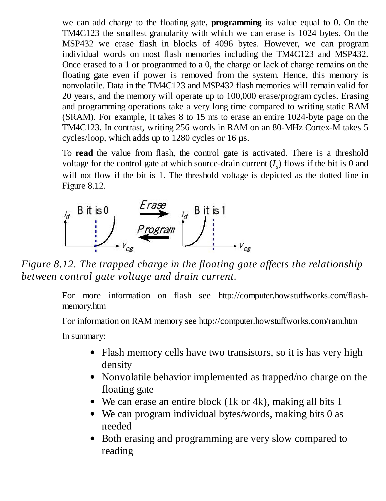
*Description*: Technical schematic and block diagram illustrating circuit operation, signal pathways, and functional behavior for Figure 8.12.

> **Figure 8.12**


*Description*: Technical schematic and block diagram illustrating circuit operation, signal pathways, and functional behavior for Figure 8.12: The trapped charge in the floating gate affects the relationship.

> **Figure 8.12: The trapped charge in the floating gate affects the relationship**

between control gate voltage and drain current.
For more information on flash see http://computer.howstuffworks.com/flash-
memory.htm
For information on RAM memory see http://computer.howstuffworks.com/ram.htm
In summary:
Flash memory cells have two transistors, so it is has very high
density
Nonvolatile behavior implemented as trapped/no charge on the
floating gate
We can erase an entire block (1k or 4k), making all bits 1
We can program individual bytes/words, making bits 0 as
needed
Both erasing and programming are very slow compared to
reading


<!-- Page 399 -->
### [PDF Page 399]

8.3.2. Flash device driver
One inexpensive approach to developing a file system is to use the internal flash
storage of the microcontroller. Both the TM4C123 and MSP432 have 256 kibibytes
of internal flash, existing from addresses 0 to 0x0003FFFF. Normally, we use the
internal flash to save the machine code of our software. However, in this chapter we
will allocate half of the flash, which is 128 kibibytes, to create a solid state disk. We
divide the disk into sectors and operate on a sector by sector basis. Typically, the
sector size is a power of 2; let each sector be 2p bytes. This means we will partition
the 217-byte disk into 2m sectors, where m+p=17. In general, there are three
operations: we can erase (set bits to 1), program (set bits to 0), and read. The
physical layer functions provide these basic operations. Program 8.1 shows the
prototypes for the TM4C123. We do not need physical layer functions to read the
flash, because once erased and programmed, software simply reads from the memory
address in the usual manner. The TM4C123 is optimized for programming up to 128-
byte (32-word) aligned “mass writes” or “fast writes”. The MSP432 implements this
feature for up to 64-byte (16-word) arrays. The smallest block that we can erase on
the TM4C123 is 1024 bytes. On the MSP432 we erase flash in blocks of 4096 bytes.
//------------Flash_Erase------------
// Erase 1 KB block of flash on TM4C123, 4KB on MSP432
// Input: addr 1-KB aligned flash memory address to erase
// Output: 0 if successful, 1 if fail
int Flash_Erase(uint32_t addr);
//------------Flash_Write------------
// Write 32-bit data to flash at given address.
// Input: addr 4-byte aligned flash memory address to write
//        data 32-bit data
// Output: 0 if successful, 1 if fail
int Flash_Write(uint32_t addr, uint32_t data);
//------------Flash_WriteArray (TM4C123 only) ------------
// Write an array of 32-bit data to flash starting at given address.
// Input: source pointer to array of 32-bit data
//        addr   4-byte aligned flash memory address to start writing
//        count  number of 32-bit writes
// Output: number of successful writes; return value == count if ok
// Note: at 80 MHz, it takes 678 usec to write 10 words
int Flash_WriteArray(uint32_t *source, uint32_t addr, uint16_t count);

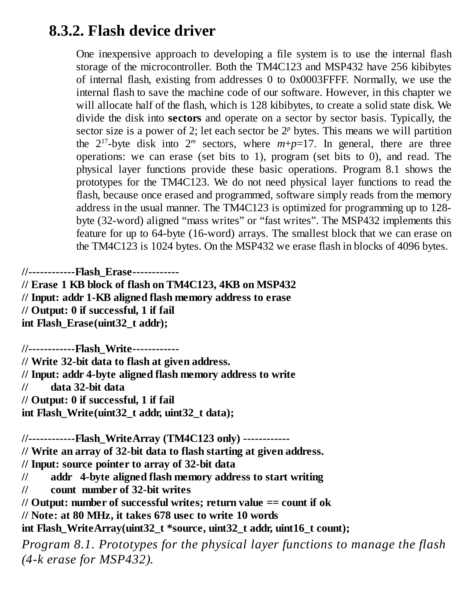
*Description*: Technical schematic and block diagram illustrating circuit operation, signal pathways, and functional behavior for Program 8.1: Prototypes for the physical layer functions to manage the flash.

> **Program 8.1: Prototypes for the physical layer functions to manage the flash**

(4-k erase for MSP432).


<!-- Page 400 -->
### [PDF Page 400]

8.3.3. eDisk device driver
We will add an abstraction level above the physical layer to create an object that
behaves like a disk. In particular, we will use 128 kibibytes of flash at addresses
0x00020000 to 0x0003FFFF to create the solid state disk and partition the disk into
512-byte sectors. This abstraction will allow us to modify the physical layer without
modifying the file system code. For example, we might change the physical layer to a
secure digital card, to a battery-backed RAM, to an FRAM, or even to network
storage.
On most disks, there is physical partitioning of the storage into blocks in order to
optimize for speed. For example, the smallest block on the MSP432 that we can
erase is 4 kibibytes, and on the TM4C123 the block size is 1 kibibyte. We will use
the term block to mean a physical partition created by the hardware, and use the term
sector (which can be 1 or more blocks) as a logical partition defined by the
operating system. In a file system, we will partition the disk into sectors and allocate
whole sectors to a single file. In other words, we will not store data from two files
into the same sector. This all or nothing allocation scheme is used by most file
systems, because it simplifies implementation.
If we were to implement a file system that allows users to erase, move, insert (grow)
or remove (shrink) data in the files, then we would need to erase blocks dynamically.
Because the smallest block on the MSP432 that we can erase is 4096 bytes, we
would have to choose a sector size that is an integer multiple of 4k.  On the
TM4C123 smallest sector size would be 1k. Unfortunately, a disk made from the
128k of the flash with 4k-sectors would only have 32 sectors. 32 is such a small
number the file system would be quite constrained.
The philosophy of this book has been to implement the simplest system that still
exposes the fundamental concepts. Therefore, in this chapter we will develop a
simple file system that does not allow the user to delete, move, grow, or shrink data
in the files. It does however allow users to create files and write data to a file in
increments of sectors. More specifically, when writing we will always append data
to the end of the file. We call this simple approach as a write-once file system. We
will erase the 128k flash once, and then program 0’s into the flash memory
dynamically as it runs. Data logging and storage of debug information are
applications of a write-once file system. For this simple file system, we can choose
the sector size to be any size, because the flash is erased only once, and data is
programmed as the user creates and writes sectors to the file. The size of the disk is
128 kibibytes, i.e.,  217 bytes. If the sector size is 2n, then there will be 217-n sectors.
For this system, if we were to use the fast write capabilities of the TM4C123 we
could partition the 128 kibibyte disk as 1024 sectors with 128 bytes in each sector.
Conversely, if we use the regular write function ( Flash_WriteArray ) then we could
choose any sector size. In Section 8.5, we will partition the disk into 256 sectors
with 512 bytes per sector creating a file system where the sector address is an 8-bit
number.


<!-- Page 401 -->
### [PDF Page 401]


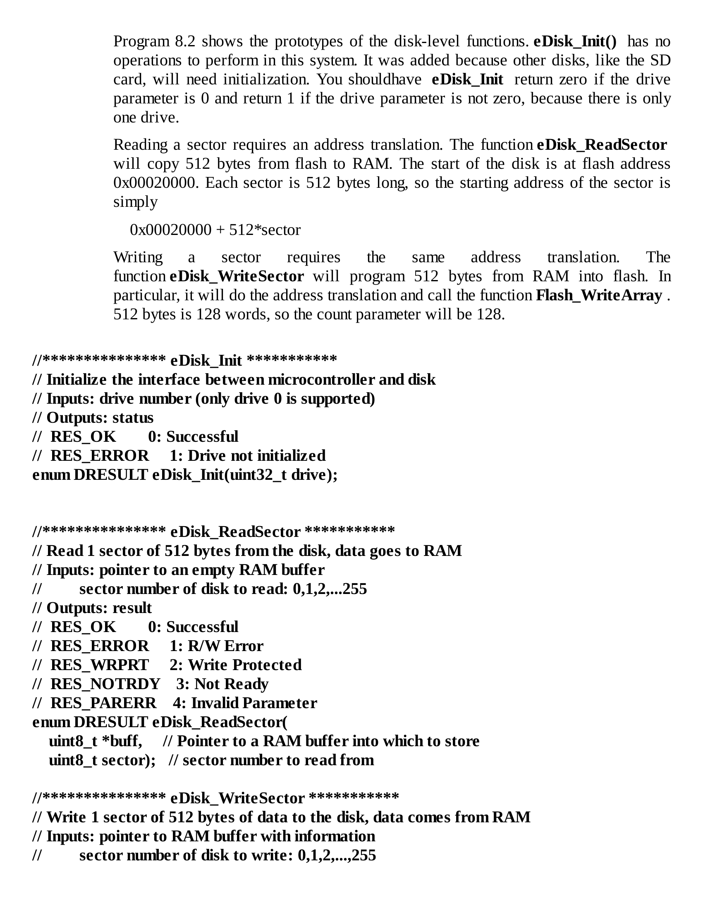
*Description*: Technical schematic and block diagram illustrating circuit operation, signal pathways, and functional behavior for Program 8.2: shows the prototypes of the disk-level functions. eDisk_Init()  has no.

> **Program 8.2: shows the prototypes of the disk-level functions. eDisk_Init()  has no**

operations to perform in this system. It was added because other disks, like the SD
card, will need initialization. You shouldhave  eDisk_Init  return zero if the drive
parameter is 0 and return 1 if the drive parameter is not zero, because there is only
one drive.
Reading a sector requires an address translation. The function eDisk_ReadSector
will copy 512 bytes from flash to RAM. The start of the disk is at flash address
0x00020000. Each sector is 512 bytes long, so the starting address of the sector is
simply
0x00020000 + 512*sector
Writing
a
sector
requires
the
same
address
translation.
The
function eDisk_WriteSector will program 512 bytes from RAM into flash. In
particular, it will do the address translation and call the function Flash_WriteArray .
512 bytes is 128 words, so the count parameter will be 128.
//*************** eDisk_Init ***********
// Initialize the interface between microcontroller and disk
// Inputs: drive number (only drive 0 is supported)
// Outputs: status
//  RES_OK        0: Successful
//  RES_ERROR     1: Drive not initialized
enum DRESULT eDisk_Init(uint32_t drive);
//*************** eDisk_ReadSector ***********
// Read 1 sector of 512 bytes from the disk, data goes to RAM
// Inputs: pointer to an empty RAM buffer
//         sector number of disk to read: 0,1,2,...255
// Outputs: result
//  RES_OK        0: Successful
//  RES_ERROR     1: R/W Error
//  RES_WRPRT     2: Write Protected
//  RES_NOTRDY    3: Not Ready
//  RES_PARERR    4: Invalid Parameter
enum DRESULT eDisk_ReadSector(

```c
uint8_t *buff,     // Pointer to a RAM buffer into which to store
uint8_t sector);   // sector number to read from
```

//*************** eDisk_WriteSector ***********
// Write 1 sector of 512 bytes of data to the disk, data comes from RAM
// Inputs: pointer to RAM buffer with information
//         sector number of disk to write: 0,1,2,...,255


<!-- Page 402 -->
### [PDF Page 402]

// Outputs: result
//  RES_OK        0: Successful
//  RES_ERROR     1: R/W Error
//  RES_WRPRT     2: Write Protected
//  RES_NOTRDY    3: Not Ready
//  RES_PARERR    4: Invalid Parameter
enum DRESULT eDisk_WriteSector(
const uint8_t *buff,  // Pointer to the data to be written

```c
uint8_t sector);      // sector number
```


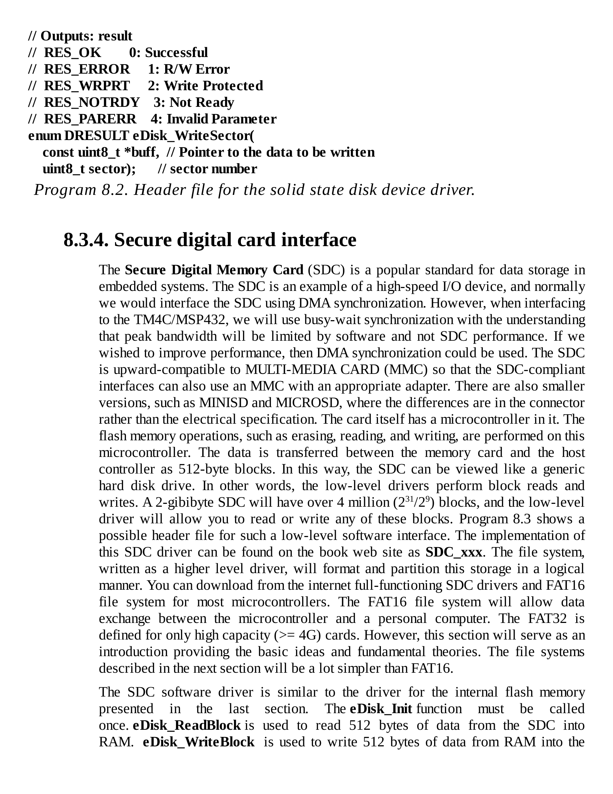
*Description*: Technical schematic and block diagram illustrating circuit operation, signal pathways, and functional behavior for Program 8.2: Header file for the solid state disk device driver..

> **Program 8.2: Header file for the solid state disk device driver.**

8.3.4. Secure digital card interface
The Secure Digital Memory Card (SDC) is a popular standard for data storage in
embedded systems. The SDC is an example of a high-speed I/O device, and normally
we would interface the SDC using DMA synchronization. However, when interfacing
to the TM4C/MSP432, we will use busy-wait synchronization with the understanding
that peak bandwidth will be limited by software and not SDC performance. If we
wished to improve performance, then DMA synchronization could be used. The SDC
is upward-compatible to MULTI-MEDIA CARD (MMC) so that the SDC-compliant
interfaces can also use an MMC with an appropriate adapter. There are also smaller
versions, such as MINISD and MICROSD, where the differences are in the connector
rather than the electrical specification. The card itself has a microcontroller in it. The
flash memory operations, such as erasing, reading, and writing, are performed on this
microcontroller. The data is transferred between the memory card and the host
controller as 512-byte blocks. In this way, the SDC can be viewed like a generic
hard disk drive. In other words, the low-level drivers perform block reads and
writes. A 2-gibibyte SDC will have over 4 million (231/29) blocks, and the low-level
driver will allow you to read or write any of these blocks. Program 8.3 shows a
possible header file for such a low-level software interface. The implementation of
this SDC driver can be found on the book web site as SDC_xxx. The file system,
written as a higher level driver, will format and partition this storage in a logical
manner. You can download from the internet full-functioning SDC drivers and FAT16
file system for most microcontrollers. The FAT16 file system will allow data
exchange between the microcontroller and a personal computer. The FAT32 is
defined for only high capacity (>= 4G) cards. However, this section will serve as an
introduction providing the basic ideas and fundamental theories. The file systems
described in the next section will be a lot simpler than FAT16.
The SDC software driver is similar to the driver for the internal flash memory
presented
in
the
last
section.
The eDisk_Init function
must
be
called
once. eDisk_ReadBlock is used to read 512 bytes of data from the SDC into
RAM. eDisk_WriteBlock  is used to write 512 bytes of data from RAM into the


<!-- Page 403 -->
### [PDF Page 403]

SDC.  The write block function will perform the two step operating of erasing and
then programming.
//*************** eDisk_Init ***********
// Initialize the interface between microcontroller and the SD card
// Inputs: drive number (only drive 0 is supported)
// Outputs: status
//  STA_NOINIT   0x01   Drive not initialized
//  STA_NODISK   0x02   No medium in the drive
//  STA_PROTECT  0x04   Write protected
// since this program initializes the disk, it must run with
//    the disk periodic task operating
DSTATUS eDisk_Init(BYTE drive);
//*************** eDisk_ReadBlock ***********
// Read 1 block of 512 bytes from the SD card  (write to RAM)
// Inputs: pointer to an empty RAM buffer
//         sector number of SD card to read: 0,1,2,...
// Outputs: result
//  RES_OK        0: Successful
//  RES_ERROR     1: R/W Error
//  RES_WRPRT     2: Write Protected
//  RES_NOTRDY    3: Not Ready
//  RES_PARERR    4: Invalid Parameter
DRESULT eDisk_ReadBlock (
BYTE *buff,      // Pointer to the data buffer into which to store
DWORD sector);   // sector number to read from
//*************** eDisk_WriteBlock ***********
// Write 1 block of 512 bytes of data to the SD card (read from RAM)
// Inputs: pointer to RAM buffer with information
//         sector number of SD card to write: 0,1,2,...
// Outputs: result
//  RES_OK        0: Successful
//  RES_ERROR     1: R/W Error
//  RES_WRPRT     2: Write Protected
//  RES_NOTRDY    3: Not Ready
//  RES_PARERR    4: Invalid Parameter
DRESULT eDisk_WriteBlock (
const BYTE *buff,   // Pointer to the data to be written
DWORD sector);      // sector number

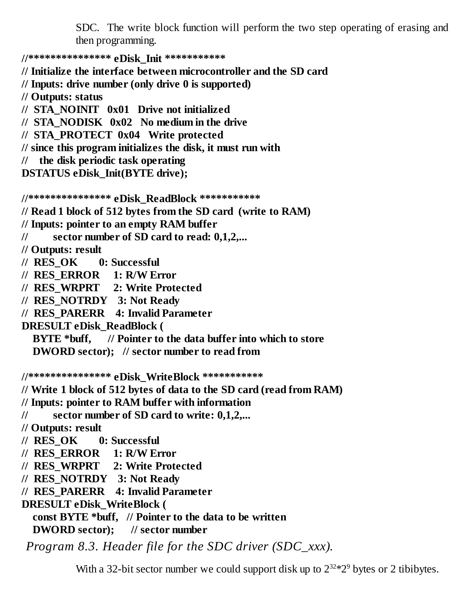
*Description*: Technical schematic and block diagram illustrating circuit operation, signal pathways, and functional behavior for Program 8.3: Header file for the SDC driver (SDC_xxx)..

> **Program 8.3: Header file for the SDC driver (SDC_xxx).**

With a 32-bit sector number we could support disk up to 232*29 bytes or 2 tibibytes.


<!-- Page 404 -->
### [PDF Page 404]


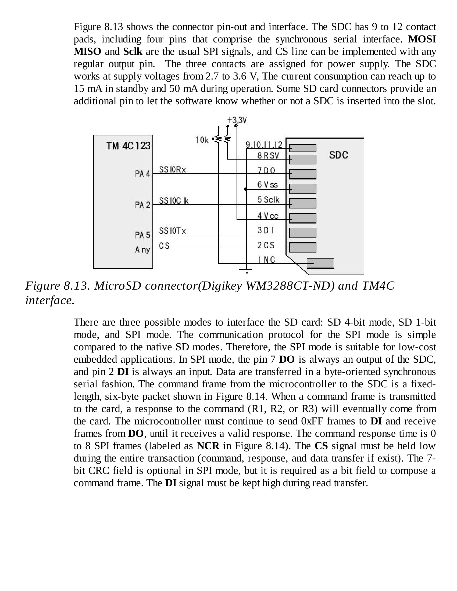
*Description*: Hardware pinout and board interface diagram mapping microcontroller pins, BoosterPack headers, switches, LEDs, and physical connectors for Figure 8.13: shows the connector pin-out and interface. The SDC has 9 to 12 contact.

> **Figure 8.13: shows the connector pin-out and interface. The SDC has 9 to 12 contact**

pads, including four pins that comprise the synchronous serial interface. MOSI
MISO and Sclk are the usual SPI signals, and CS line can be implemented with any
regular output pin.  The three contacts are assigned for power supply. The SDC
works at supply voltages from 2.7 to 3.6 V, The current consumption can reach up to
15 mA in standby and 50 mA during operation. Some SD card connectors provide an
additional pin to let the software know whether or not a SDC is inserted into the slot.


*Description*: Technical schematic and block diagram illustrating circuit operation, signal pathways, and functional behavior for Figure 8.13: MicroSD connector(Digikey WM3288CT-ND) and TM4C.

> **Figure 8.13: MicroSD connector(Digikey WM3288CT-ND) and TM4C**

interface.
There are three possible modes to interface the SD card: SD 4-bit mode, SD 1-bit
mode, and SPI mode. The communication protocol for the SPI mode is simple
compared to the native SD modes. Therefore, the SPI mode is suitable for low-cost
embedded applications. In SPI mode, the pin 7 DO is always an output of the SDC,

```assembly
and pin 2 DI is always an input. Data are transferred in a byte-oriented synchronous
```

serial fashion. The command frame from the microcontroller to the SDC is a fixed-
length, six-byte packet shown in Figure 8.14. When a command frame is transmitted
to the card, a response to the command (R1, R2, or R3) will eventually come from
the card. The microcontroller must continue to send 0xFF frames to DI and receive
frames from DO, until it receives a valid response. The command response time is 0
to 8 SPI frames (labeled as NCR in Figure 8.14). The CS signal must be held low
during the entire transaction (command, response, and data transfer if exist). The 7-
bit CRC field is optional in SPI mode, but it is required as a bit field to compose a
command frame. The DI signal must be kept high during read transfer.


<!-- Page 405 -->
### [PDF Page 405]


*Description*: Technical schematic and block diagram illustrating circuit operation, signal pathways, and functional behavior for Figure 8.14: SDC command frame..

> **Figure 8.14: SDC command frame.**

In SPI mode, data shift and data latch are done opposite clock edges respectively.
There is an advantage that when shift and latch operations are separated, critical
timing between two operations can be avoided. Therefore, timing consideration for
IC design and board design can be relieved. The SD card uses CPOL=0, CPHA=0
mode as shown in Figure 8.15.

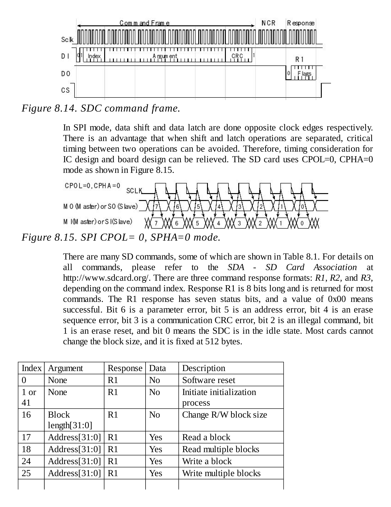
*Description*: Technical schematic and block diagram illustrating circuit operation, signal pathways, and functional behavior for Figure 8.15: SPI CPOL= 0, SPHA=0 mode..

> **Figure 8.15: SPI CPOL= 0, SPHA=0 mode.**

There are many SD commands, some of which are shown in Table 8.1. For details on
all commands, please refer to the SDA - SD Card Association
at
http://www.sdcard.org/. There are three command response formats: R1, R2, and R3,
depending on the command index. Response R1 is 8 bits long and is returned for most
commands. The R1 response has seven status bits, and a value of 0x00 means
successful. Bit 6 is a parameter error, bit 5 is an address error, bit 4 is an erase
sequence error, bit 3 is a communication CRC error, bit 2 is an illegal command, bit
1 is an erase reset, and bit 0 means the SDC is in the idle state. Most cards cannot
change the block size, and it is fixed at 512 bytes.
Index Argument
Response Data
Description
0
None
R1
No
Software reset
1 or
41
None
R1
No
Initiate initialization
process
16
Block
length[31:0]
R1
No
Change R/W block size
17
Address[31:0] R1
Yes
Read a block
18
Address[31:0] R1
Yes
Read multiple blocks
24
Address[31:0] R1
Yes
Write a block
25
Address[31:0] R1
Yes
Write multiple blocks


<!-- Page 406 -->
### [PDF Page 406]

58
None
R3
No
Read OCR


*Description*: Reference table detailing hardware parameters, register bit patterns, performance metrics, or memory configurations for Table 8.1: SD commands..

> **Table 8.1: SD commands.**

After power on reset, the SDC enters its native operating mode. To put the SDC in
SPI mode, the following procedure must be performed. After the supply voltage
reaches at least 2.2 V, wait at least one more millisecond. To initialize we need to set
DI and CS high and send 74 or more clock pulses to Sclk. After this, the card will
become ready to accept native commands. We set the SPI clock rate between 100 and
400 kHz and then send an Index=0 command with CS low to reset the card. The card
samples the CS signal when an Index=0 command is received. If the CS signal is
low, the card enters SPI mode. Since the Index=0 command must be sent as a native
command, the CRC field must have a valid value. Once the card enters SPI mode, the
CRC feature is disabled, and the CRC is not checked, so that the command
transmission routine can be written with the hardcoded CRC value that is valid for
only this command. When the Index=0 is accepted, the card will enter idle state and
sends an R1 response with the idle bit (0x01).
In idle state, the card accepts only commands with index values of 0, 1, 41, and 58.
Any other commands will be rejected. Command Index=58 allows you to check the
working voltage range. Response R3 is an R1 plus information about the supply
voltage. If the supply voltage is out of range, the card must be rejected. The card
initiates initialization when a command with Index=41 is received. To poll end of
the initialization, the host controller must repeatedly send commands with Index=41
until the idle bit goes low. When the card is initialized successfully, the idle bit in the
R1 response is cleared. That is, the R1 response will change from 0x01 to 0x00. The
initialization process can take hundreds of milliseconds and large cards make take
longer. After the idle bit is cleared, read/write commands can be sent. Command
Index=41 is recommended instead of Index=1 for SDC. Index=1 initiation can be
tried if Index=41 is rejected. After initialization, the SPI clock rate can be increased
to optimize the read/write performance. Most SD cards can handle SPI rates of 25
MHz. The speed will be dominated by software transferring data with the SPI port.
To achieve higher bandwidth, you could use a DMA interface available on many
high-performance microcontrollers.

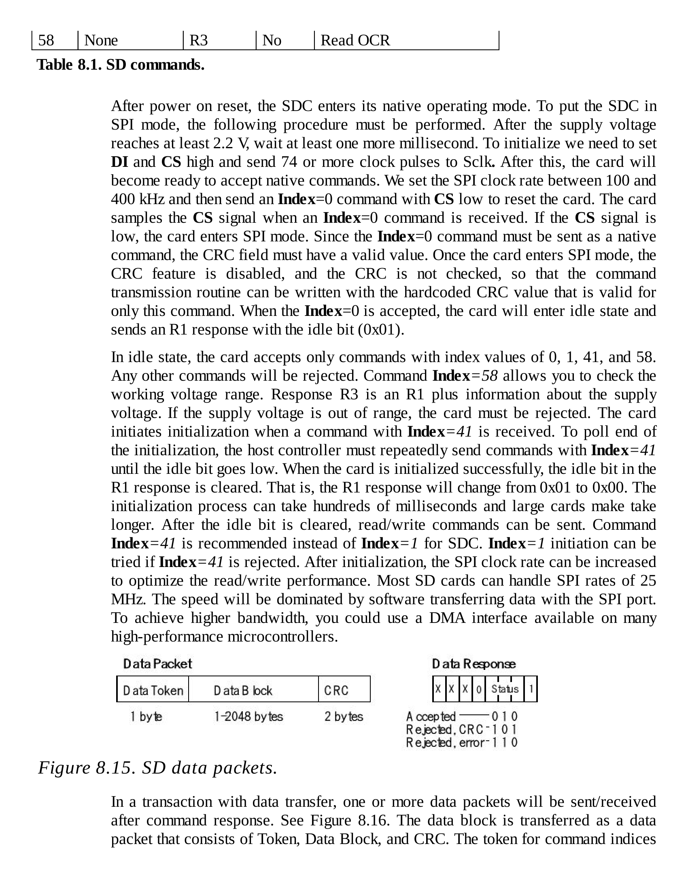
*Description*: Technical schematic and block diagram illustrating circuit operation, signal pathways, and functional behavior for Figure 8.15: SD data packets..

> **Figure 8.15: SD data packets.**

In a transaction with data transfer, one or more data packets will be sent/received
after command response. See Figure 8.16. The data block is transferred as a data
packet that consists of Token, Data Block, and CRC. The token for command indices


<!-- Page 407 -->
### [PDF Page 407]

17, 18, and 24 is $FE. The token for command index 25 is $FC. A logic analyzer
trace for a single-block read is shown in Figure 8.16. The resolution on the plot is
not enough to see all the Sclk pulses. However, we see the CS line (labeled PA4 SS)
goes low and remains low for the entire transaction. The microcontroller begins by
sending an Index=17 read block command. The argument for this command will be
the sector address from which to read. The command response will be R1 with a
value of 0x00, which means okay. Next, the microcontroller sends many frames (300
µs on this system) waiting for the SDC. The last half of the transfer is a data packet
being sent from the SDC to the microcontroller containing the 512 bytes read from
that sector. On this system, it took 535 µs to read one block. If any error occurred
during the read operation, an error token will be returned instead of data packet.

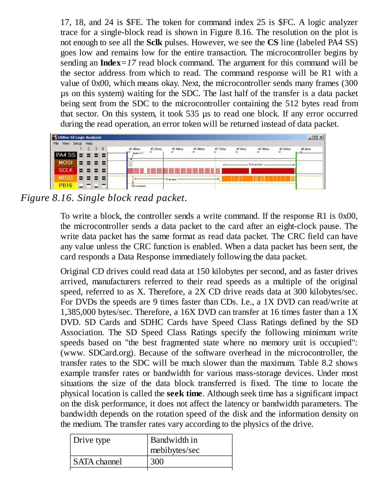
*Description*: Technical schematic and block diagram illustrating circuit operation, signal pathways, and functional behavior for Figure 8.16: Single block read packet..

> **Figure 8.16: Single block read packet.**

To write a block, the controller sends a write command. If the response R1 is 0x00,
the microcontroller sends a data packet to the card after an eight-clock pause. The
write data packet has the same format as read data packet. The CRC field can have
any value unless the CRC function is enabled. When a data packet has been sent, the
card responds a Data Response immediately following the data packet.
Original CD drives could read data at 150 kilobytes per second, and as faster drives
arrived, manufacturers referred to their read speeds as a multiple of the original
speed, referred to as X. Therefore, a 2X CD drive reads data at 300 kilobytes/sec.
For DVDs the speeds are 9 times faster than CDs. I.e., a 1X DVD can read/write at
1,385,000 bytes/sec. Therefore, a 16X DVD can transfer at 16 times faster than a 1X
DVD. SD Cards and SDHC Cards have Speed Class Ratings defined by the SD
Association. The SD Speed Class Ratings specify the following minimum write
speeds based on "the best fragmented state where no memory unit is occupied":
(www. SDCard.org). Because of the software overhead in the microcontroller, the
transfer rates to the SDC will be much slower than the maximum. Table 8.2 shows
example transfer rates or bandwidth for various mass-storage devices. Under most
situations the size of the data block transferred is fixed. The time to locate the
physical location is called the seek time. Although seek time has a significant impact
on the disk performance, it does not affect the latency or bandwidth parameters. The
bandwidth depends on the rotation speed of the disk and the information density on
the medium. The transfer rates vary according to the physics of the drive.
Drive type
Bandwidth in
mebibytes/sec
SATA channel
300


<!-- Page 408 -->
### [PDF Page 408]

7200
RPM
hard
drive
70
16X DVD
22
52X CD-ROM
7.8
Class 2 SD card
2
Class 4 SD card
4
Class 6 SD card
6
1X CD-ROM
0.15

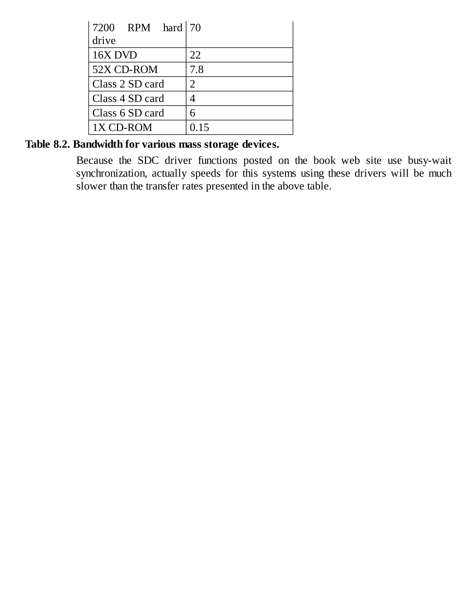
*Description*: Reference table detailing hardware parameters, register bit patterns, performance metrics, or memory configurations for Table 8.2: Bandwidth for various mass storage devices..

> **Table 8.2: Bandwidth for various mass storage devices.**

Because the SDC driver functions posted on the book web site use busy-wait
synchronization, actually speeds for this systems using these drivers will be much
slower than the transfer rates presented in the above table.


<!-- Page 409 -->
### [PDF Page 409]

8.4. Simple File System
In this section, we develop a file system that would be appropriate for
implementation with an SD card used for storage.  In order to implement this file
system, you would need to have physical layer eDisk driver functions for the SD
card. There are a couple of projects for the TM4C123 that have implementations for
this physical layer. The second example includes both a low-level eDisk and a high-
level FAT16 file system for the SD card.
http://users.ece.utexas.edu/~valvano/arm/SDC_4C123.zip
http://users.ece.utexas.edu/~valvano/arm/SDCFile_4C123.zip
8.4.1. Directory
The first component of the file system is the directory, as shown in Figure 8.17. In
this system, the sector size is 512 bytes. In order to support disks larger than 32
Mebibytes, 32-bit sector pointers will be used. The directory contains a mapping
between the symbolic filename and the physical address of the data. Specific
information contained in the directory might include the filename, the number of the
first sector containing data, and the total number of bytes stored in the file. One
possible implementation places the directory in sector 0. In this simple system, all
files are listed in this one directory (there are no subdirectories). There is one fixed-
size directory entry for each file. A filename is stored as an ASCII string in an 8-byte
array. A null-string (first byte 0) means no file. Since the directory itself is located in
sector 0, zero can be used as a null-sector pointer. In this simple scheme, the entire
directory must fit into sector 0, the maximum number of files can be calculated by
dividing the sector size by the number of bytes used for each directory entry. In

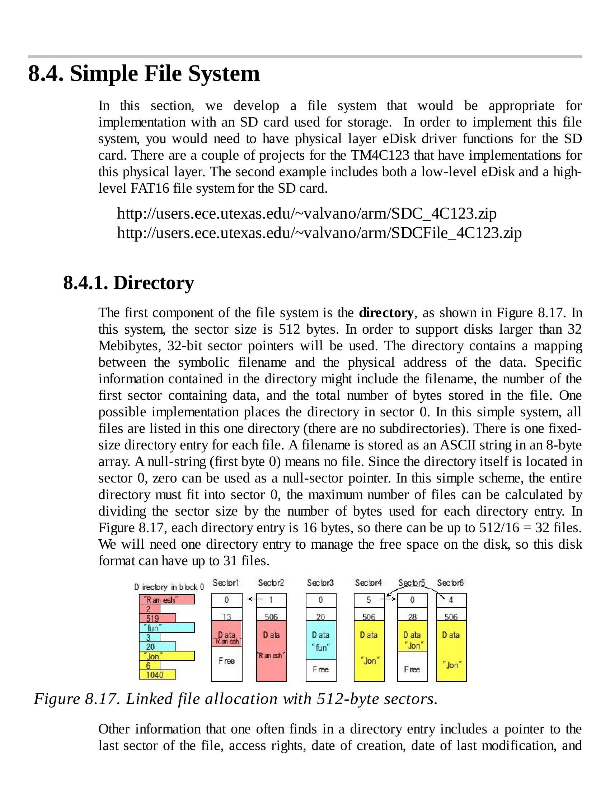
*Description*: Technical schematic and block diagram illustrating circuit operation, signal pathways, and functional behavior for Figure 8.17: , each directory entry is 16 bytes, so there can be up to 512/16 = 32 files..

> **Figure 8.17: , each directory entry is 16 bytes, so there can be up to 512/16 = 32 files.**

We will need one directory entry to manage the free space on the disk, so this disk
format can have up to 31 files.


*Description*: Technical schematic and block diagram illustrating circuit operation, signal pathways, and functional behavior for Figure 8.17: Linked file allocation with 512-byte sectors..

> **Figure 8.17: Linked file allocation with 512-byte sectors.**

Other information that one often finds in a directory entry includes a pointer to the
last sector of the file, access rights, date of creation, date of last modification, and


<!-- Page 410 -->
### [PDF Page 410]

file type.
8.4.2. Allocation
The second component of the file system is the logical-to-physical address
translation. Logically, the data in the file are addressed in a simple linear fashion.
The logical address ranges from the first to the last. There are many algorithms one
could use to keep track of where all the data for a file belongs. This simple file
system uses linked allocation as illustrated in Figure 8.17. Recall that the directory
contains the sector number of the first sector containing data for the file. The start of
every sector contains a link (the sector number) of the next sector, and a byte count
(the number of data bytes in this sector). If the link is zero, this is last sector of the
file. If the byte count is zero, this sector is empty (contains no data). Once the sector
is full, the file must request a free sector (empty and not used by another file) to store
more data. Linked allocation is effective for systems that employ sequential access.
Sequential read access involves two functions similar to a magnetic tape: rewind
(start at beginning) and read the next data. Sequential write access simply involves
appending data to the end of the file. Figure 8.17 assumes the sector size is 512 bytes

```assembly
and the filename has up to 7 characters. The null-terminated ASCII string is allocated
```

8 bytes regardless of the size of the string. The sector pointer and the size entry (e.g.,
file ‘Ramesh’ has 519 bytes) each require 4 bytes (32 bits). Since each data sector
has a 4-byte link and a 2-byte counter, each sector can store up to 506 bytes of data.
8.4.3. Free space management
The third component of the file system is free-space management. Initially, all
sectors except the one used for the directory are free and available for files to store
data. To store data into a file, sectors must be allocated to the file. When a file is
deleted, its sectors must be made available again. One simple free-space
management technique uses linked allocation, similar to the way data is stored.
Assume there are N sectors numbered from 0 to N-1. An empty file system is shown
in Figure 8.18. Sector 0 contains the directory, and sectors 1 to N-1 are free. You
could assign the last directory entry for free-space management. This entry is hidden
from the user. E.g., this free-space file cannot be opened, printed, or deleted. It
doesn't use any of the byte count fields, but it does use the links to access all of the
free sectors. Initially, all of the sectors (except the directory itself) are linked
together, with the special directory entry pointing to the first one and the last one
having a null pointer.


<!-- Page 411 -->
### [PDF Page 411]


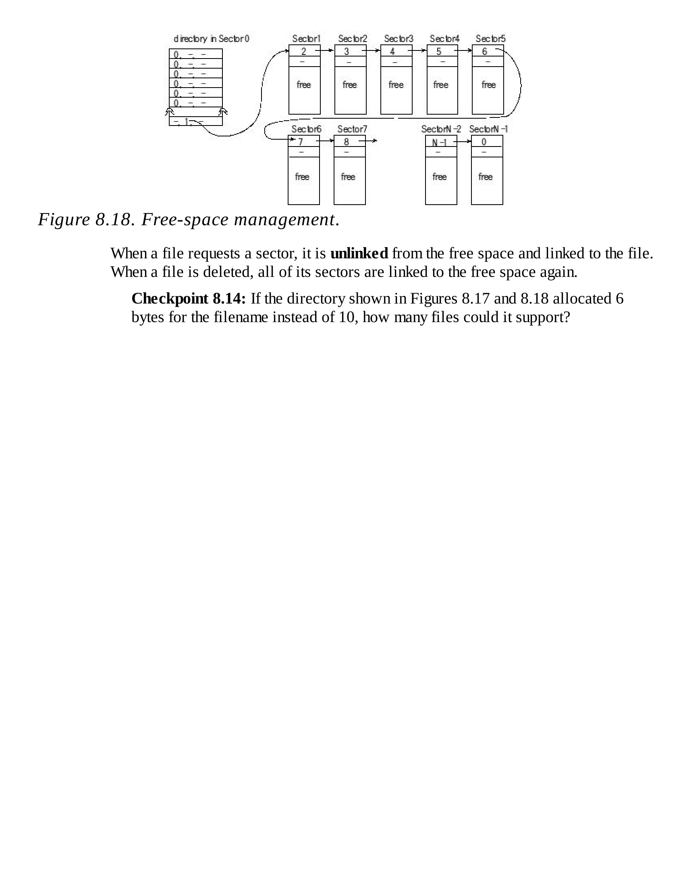
*Description*: Technical schematic and block diagram illustrating circuit operation, signal pathways, and functional behavior for Figure 8.18: Free-space management..

> **Figure 8.18: Free-space management.**

When a file requests a sector, it is unlinked from the free space and linked to the file.
When a file is deleted, all of its sectors are linked to the free space again.
Checkpoint 8.14: If the directory shown in Figures 8.17 and 8.18 allocated 6
bytes for the filename instead of 10, how many files could it support?


<!-- Page 412 -->
### [PDF Page 412]

8.5. Write-once File System
8.5.1. Usage
Even though the previous approaches were indeed simple, we can simplify the file
system even more if we make the following usage restrictions/specifications:
The 128k flash memory is erased only once;
The act of erasing the entire flash is equivalent to “formatting”
the disk;
The disk is partitioned into 256 sectors of 512 bytes/sector;
We can append data to a file but cannot delete data or files;
We append data to a file in chunks of 512 bytes;
We will read data in a sequential fashion;
We assign file names as single 8-bit numbers (0 to 254);
We limit the file system to a maximum of 255 files;
We will mount (initialize the driver) the file system on startup;
We will call flush (backup to disk) the file system before
powering down.
One sector will be reserved for the operating system to manage the directory and
allocation scheme and the other 255 sectors will contain data. Depending on the
debugger settings, loading the program into flash may erase the entire
flash.Alternately, you could explicitly erase the flash in the debugger, or you could
call the OS_File_Format  function.  These erase events will serve to “format” the
disk. All 255 data sectors will be free and the file system will have no files.
However, hitting the reset button or powering up the system should not erase the disk.
While using this disk we could have 255 individual files, each with one sector. We
could have 51 files each with 5 sectors. Alternately, we could have one file with 255
sectors. Any combination is possible where the number of files is less than or equal
to 255, and the total allocated sectors is also less than or equal to 255.
There will be a function, OS_File_New , which will return the file number of an
empty file. This function will fail if there are no more files left, because there are
already 254 files created, or if there are no free sectors, because the disk is full.
//********OS_File_New*************
// Returns a file number of a new file for writing
// Inputs: none


<!-- Page 413 -->
### [PDF Page 413]

// Outputs: number of a new file
// Errors: return 255 on failure or disk full

```c
uint8_t OS_File_New(void);
```

To check the status of a file, we can call OS_File_Size . This function returns the
number of sectors allocated to this file. If the size is zero, this is an empty file.
//********OS_File_Size*************
// Check the size of this file
// Inputs:  num, 8-bit file number, 0 to 254
// Outputs: 0 if empty, otherwise the number of sectors
// Errors:  none

```c
uint8_t OS_File_Size(uint8_t num);
```

To write data to an existing file we need to specify the file number into which we
will store the data. The write data function will allocate another sector to the file and
append 512 bytes of new data to the file. The input parameters to OS_File_Append
are the file number and a sector of 512 bytes of data to write. This function will fail
if there are no free sectors (disk full).
//********OS_File_Append*************
// Save 512 bytes into the file
// Inputs:  num, 8-bit file number, 0 to 254
//          buf, pointer to 512 bytes of data
// Outputs: 0 if successful
// Errors:  255 on failure or disk full

```c
uint8_t OS_File_Append(uint8_t num, uint8_t buf[512]);
```

To read data from a file we call OS_File_Read . The three parameters to this
function are the file number, the location, and a pointer to RAM.
The location parameter defines the logical address of the data in a file. Location 0
will access the first sector of the file. For example, if a file has 5 sectors,
the location  parameter could be 0, 1, 2, 3, or 4. The read data function will copy
512 bytes of data from the file into the RAM buffer. This function will fail if this file
does not have data at this location.
//********OS_File_Read*************
// Read 512 bytes from the file
// Inputs:  num, 8-bit file number, 0 to 254
//          location, logical address, 0 to 254
//          buf, pointer to 512 empty spaces in RAM
// Outputs: 0 if successful
// Errors:  255 on failure because no data

```c
uint8_t OS_File_Read(uint8_t num, uint8_t location,
uint8_t buf[512]);
```


<!-- Page 414 -->
### [PDF Page 414]

We will load into RAM versions of the directory and the FAT when the system starts.
When we call OS_File_Flush  the RAM versions will be stored onto the disk. Notice
that due to the nature of how this file system is designed, bits in the directory and
FAT never switch from 0 to 1. We can either call this function periodically or call it
once just before power is removed from the system.
//********OS_File_Flush*************
// Update working buffers onto the disk
// Power can be removed after calling flush
// Inputs:  none
// Outputs: 0 if success
// Errors:  255 on disk write failure

```c
uint8_t OS_File_Flush(void);
```

Depending on the debugger settings, downloading software may erase the flash.
When the flash is erased, the disk in essence is formatted, because we defined the all
ones state as empty. However, if one wishes to erase the entire disk removing all data

```assembly
and all files, one could call OS_File_Format . This function will erase the flash
```

from 0x00020000 to 0x0003FFFF. Program 8.4 shows the implementation for the
TM4C123. It simply erases all blocks from 0x00020000 to 0x0003FFFF. Notice that
this implementation skips the eDisk layer and directly calls the physical layer.
//********OS_File_Format*************
// Erase all files and all data
// Inputs:  none
// Outputs: 0 if success
// Errors:  255 on disk write failure

```c
uint8_t OS_File_Format(void){
uint32_t address;
address = 0x00020000;  // start of disk
while(address <= 0x00040000){
Flash_Erase(address); // erase 1k block
address = address+1024;
}
}
```


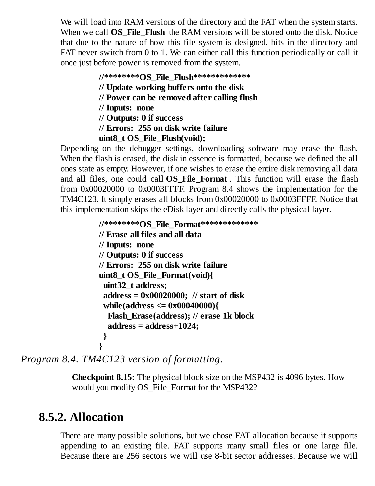
*Description*: Technical schematic and block diagram illustrating circuit operation, signal pathways, and functional behavior for Program 8.4: TM4C123 version of formatting..

> **Program 8.4: TM4C123 version of formatting.**

Checkpoint 8.15: The physical block size on the MSP432 is 4096 bytes. How
would you modify OS_File_Format for the MSP432?
8.5.2. Allocation
There are many possible solutions, but we chose FAT allocation because it supports
appending to an existing file. FAT supports many small files or one large file.
Because there are 256 sectors we will use 8-bit sector addresses. Because we will


<!-- Page 415 -->
### [PDF Page 415]

define a completely erased flash as “formatted”, we will use the sector address
255=0xFF to mean null-pointer, and use sector number 255 as the directory. To
implement a FAT with this disk, we would need only 255 bytes. Since the sector is
512 bytes we can use 256 bytes for the directory and the other 256 bytes for the FAT.
Notice that sectors are allocated to files, but never released. This means we can
update the FAT multiple times because bits are all initially one (erased) and
programmed to 0 once, and never need to be erased again.
Since the files are identified by number and not name, the directory need not store the
name. Rather, the directory is a simple list of 255 8-bit numbers, containing the
sector number of its first sector. Notice there is exactly one directory entry for each
possible file. If this sector number is 255, this file is empty. Similarly, the FAT is
another simple list of 255 8-bit numbers. However, a 255 in the FAT may mean a free
sector or the last sector of a file. Notice there is one entry in the FAT for each data
sector on the disk. Figure 8.19 shows the disk after formatting. Each rectangle in the
disk figure represents a 512-byte data sector. The directory and FAT are both stored
in sector number 255.

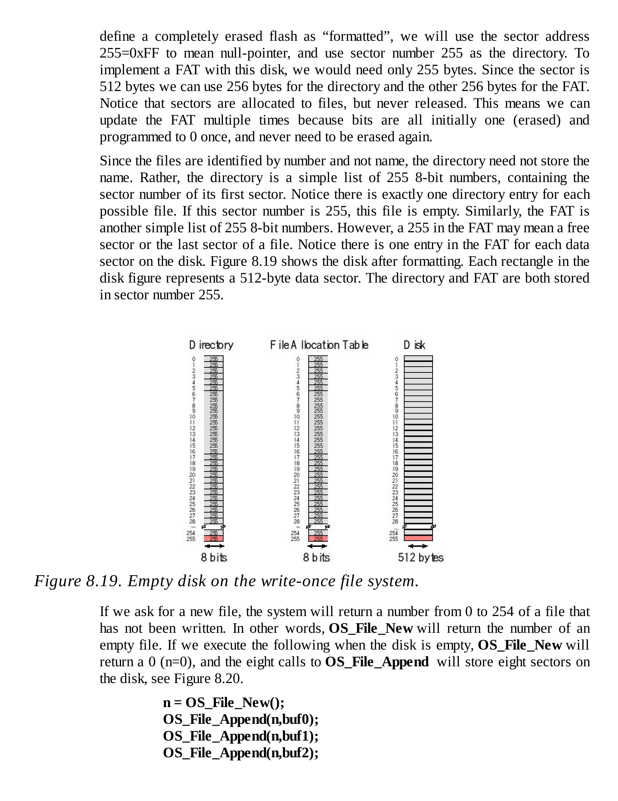
*Description*: Technical schematic and block diagram illustrating circuit operation, signal pathways, and functional behavior for Figure 8.19: Empty disk on the write-once file system..

> **Figure 8.19: Empty disk on the write-once file system.**

If we ask for a new file, the system will return a number from 0 to 254 of a file that
has not been written. In other words, OS_File_New will return the number of an
empty file. If we execute the following when the disk is empty, OS_File_New will
return a 0 (n=0), and the eight calls to OS_File_Append  will store eight sectors on
the disk, see Figure 8.20.
n = OS_File_New();
OS_File_Append(n,buf0);
OS_File_Append(n,buf1);
OS_File_Append(n,buf2);


<!-- Page 416 -->
### [PDF Page 416]

OS_File_Append(n,buf3);
OS_File_Append(n,buf4);
OS_File_Append(n,buf5);
OS_File_Append(n,buf6);
OS_File_Append(n,buf7);
In this example,the variables n,m,p are simple global variables containing the file
numbers we are using. The parameters buf0-buf9 , dat0-dat4 , arr0-2  represent
RAM buffers with 512 bytes of data.  Having 18 buffers we not to imply we needed a
separate RAM buffer for every sector on the disk, but rather to differentiate where
data is stored on the disk. In other words, the use of 18 different RAM buffers was
meant to associate the 18 calls to OS_File_Append with the corresponding 18
sectors used on the disk. Because of the limited RAM on the microcontroller,
normally we will limit the number of RAM buffers.

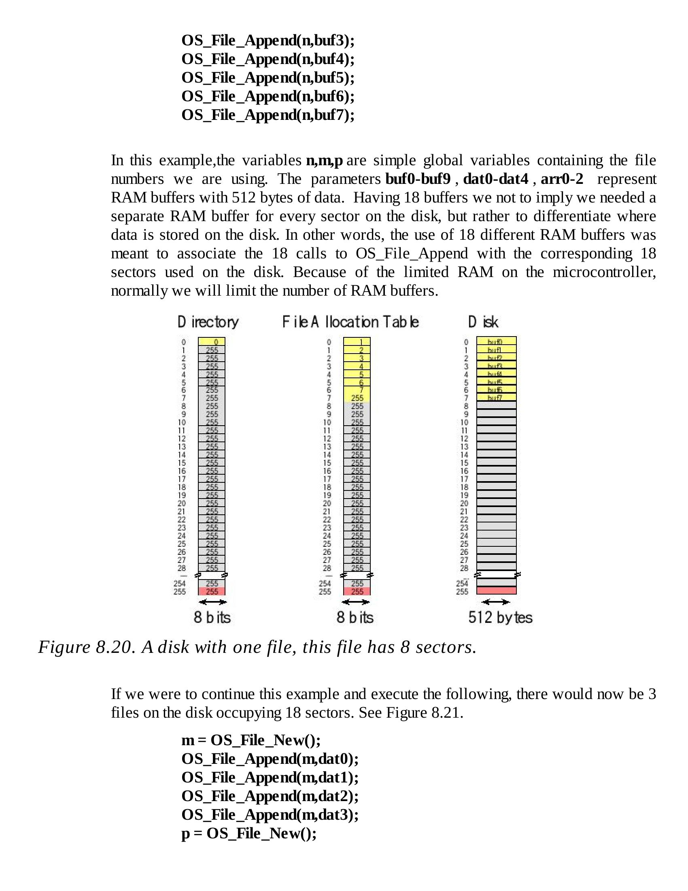
*Description*: Technical schematic and block diagram illustrating circuit operation, signal pathways, and functional behavior for Figure 8.20: A disk with one file, this file has 8 sectors..

> **Figure 8.20: A disk with one file, this file has 8 sectors.**

If we were to continue this example and execute the following, there would now be 3
files on the disk occupying 18 sectors. See Figure 8.21.
m = OS_File_New();
OS_File_Append(m,dat0);
OS_File_Append(m,dat1);
OS_File_Append(m,dat2);
OS_File_Append(m,dat3);
p = OS_File_New();


<!-- Page 417 -->
### [PDF Page 417]

OS_File_Append(p,arr0);
OS_File_Append(p,arr1);
OS_File_Append(n,buf8);
OS_File_Append(n,buf9);
OS_File_Append(p,arr2);
OS_File_Append(m,dat4);

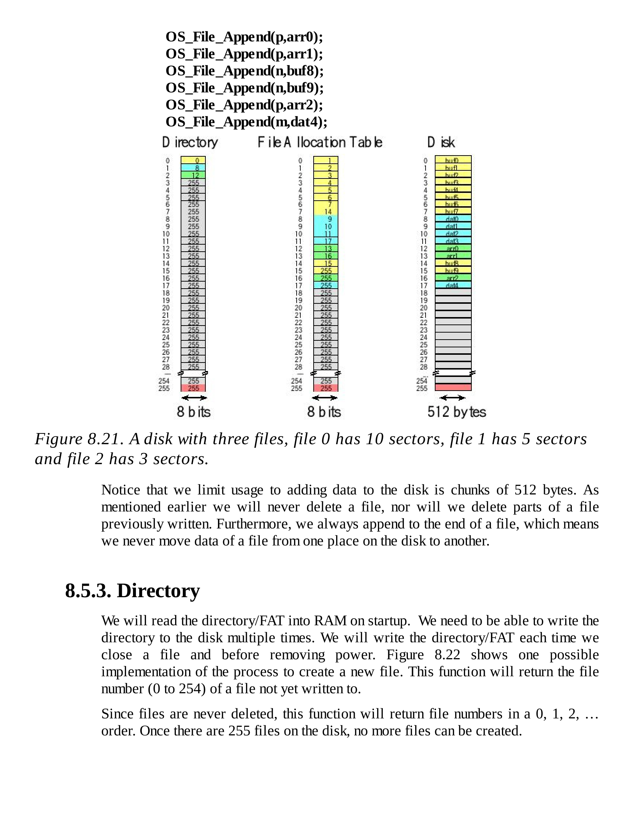
*Description*: Technical schematic and block diagram illustrating circuit operation, signal pathways, and functional behavior for Figure 8.21: A disk with three files, file 0 has 10 sectors, file 1 has 5 sectors.

> **Figure 8.21: A disk with three files, file 0 has 10 sectors, file 1 has 5 sectors**


```assembly
and file 2 has 3 sectors.
```

Notice that we limit usage to adding data to the disk is chunks of 512 bytes. As
mentioned earlier we will never delete a file, nor will we delete parts of a file
previously written. Furthermore, we always append to the end of a file, which means
we never move data of a file from one place on the disk to another.
8.5.3. Directory
We will read the directory/FAT into RAM on startup.  We need to be able to write the
directory to the disk multiple times. We will write the directory/FAT each time we
close a file and before removing power. Figure 8.22 shows one possible
implementation of the process to create a new file. This function will return the file
number (0 to 254) of a file not yet written to.
Since files are never deleted, this function will return file numbers in a 0, 1, 2, …
order. Once there are 255 files on the disk, no more files can be created.


<!-- Page 418 -->
### [PDF Page 418]


*Description*: Timing waveform and execution flowchart illustrating signal transitions, state machine progression, or algorithm logic for Figure 8.22: Software flowchart for OS_File_New. Returning with a 255.

> **Figure 8.22: Software flowchart for OS_File_New. Returning with a 255**

means fail because the disk already has 254 files. The only way for this
function to fail is if the disk has 254 files, and each file is one sector.
This simple file system assumes you append some data after you create a new file

```assembly
and before you create a second new file. The following shows a proper use case of
```

creating multiple files:
n = OS_File_New();        // create a new file
OS_File_Append(n,stuff);  // add to n
m = OS_File_New();        // second file
OS_File_Append(m,other);  // add to m
If you violate this assumption and execute the following code, then files n and m will
be one file. I.e., n will equal m.
n = OS_File_New();        // create a new file
m = OS_File_New();        // second file
OS_File_Append(n,stuff);  // add to n
OS_File_Append(m,other);  // add to m
8.5.4. Append

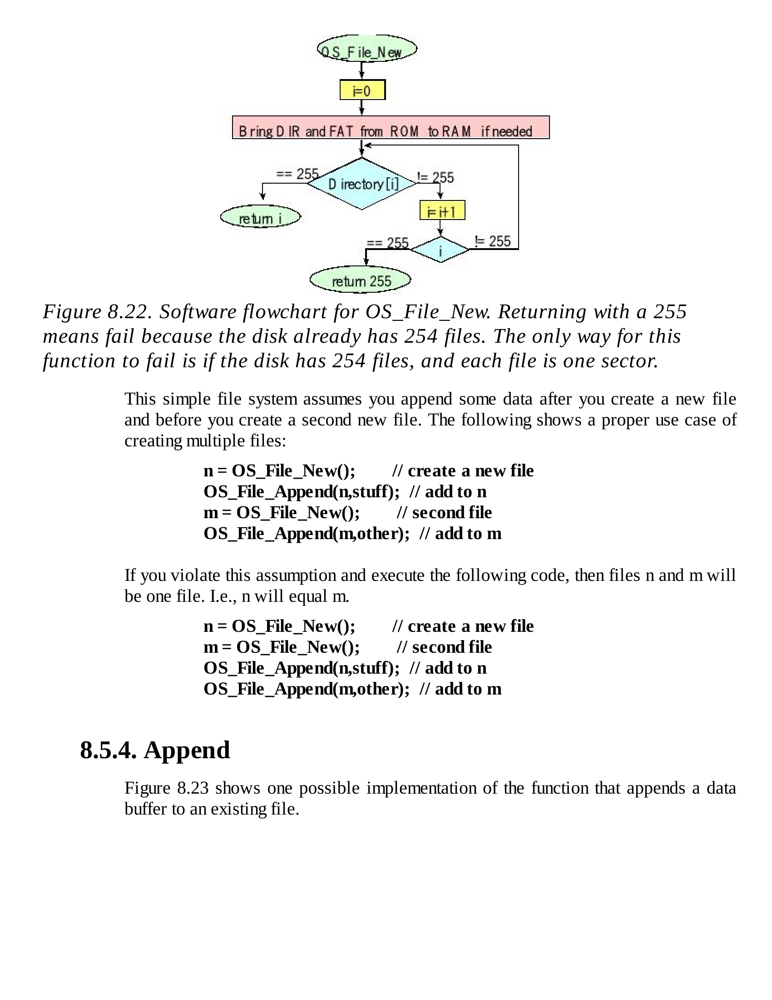
*Description*: Technical schematic and block diagram illustrating circuit operation, signal pathways, and functional behavior for Figure 8.23: shows one possible implementation of the function that appends a data.

> **Figure 8.23: shows one possible implementation of the function that appends a data**

buffer to an existing file.


<!-- Page 419 -->
### [PDF Page 419]


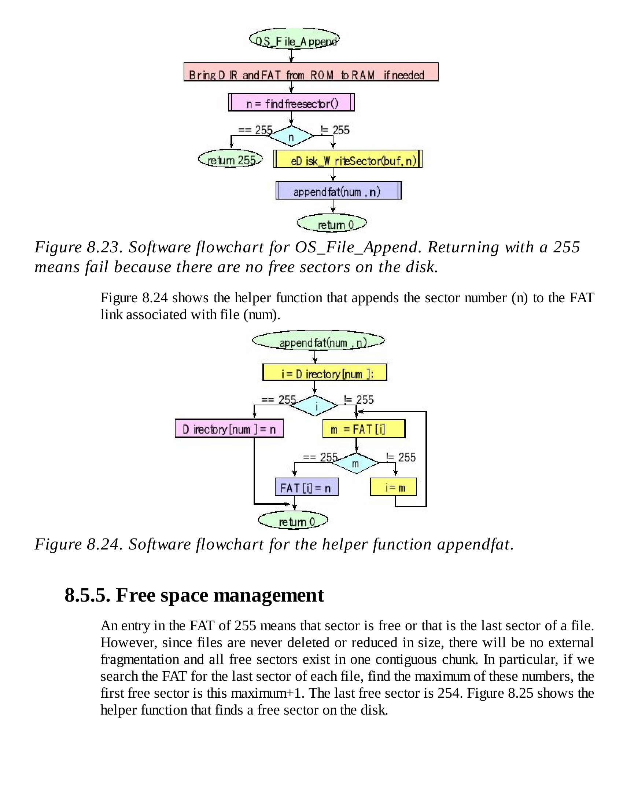
*Description*: Timing waveform and execution flowchart illustrating signal transitions, state machine progression, or algorithm logic for Figure 8.23: Software flowchart for OS_File_Append. Returning with a 255.

> **Figure 8.23: Software flowchart for OS_File_Append. Returning with a 255**

means fail because there are no free sectors on the disk.


*Description*: Technical schematic and block diagram illustrating circuit operation, signal pathways, and functional behavior for Figure 8.24: shows the helper function that appends the sector number (n) to the FAT.

> **Figure 8.24: shows the helper function that appends the sector number (n) to the FAT**

link associated with file (num).


*Description*: Timing waveform and execution flowchart illustrating signal transitions, state machine progression, or algorithm logic for Figure 8.24: Software flowchart for the helper function appendfat..

> **Figure 8.24: Software flowchart for the helper function appendfat.**

8.5.5. Free space management
An entry in the FAT of 255 means that sector is free or that is the last sector of a file.
However, since files are never deleted or reduced in size, there will be no external
fragmentation and all free sectors exist in one contiguous chunk. In particular, if we
search the FAT for the last sector of each file, find the maximum of these numbers, the
first free sector is this maximum+1. The last free sector is 254. Figure 8.25 shows the
helper function that finds a free sector on the disk.


<!-- Page 420 -->
### [PDF Page 420]


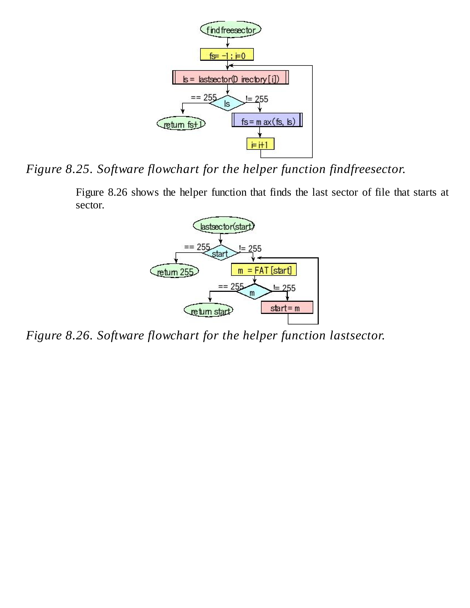
*Description*: Timing waveform and execution flowchart illustrating signal transitions, state machine progression, or algorithm logic for Figure 8.25: Software flowchart for the helper function findfreesector..

> **Figure 8.25: Software flowchart for the helper function findfreesector.**


*Description*: Technical schematic and block diagram illustrating circuit operation, signal pathways, and functional behavior for Figure 8.26: shows the helper function that finds the last sector of file that starts at.

> **Figure 8.26: shows the helper function that finds the last sector of file that starts at**

sector.


*Description*: Timing waveform and execution flowchart illustrating signal transitions, state machine progression, or algorithm logic for Figure 8.26: Software flowchart for the helper function lastsector..

> **Figure 8.26: Software flowchart for the helper function lastsector.**


<!-- Page 421 -->
### [PDF Page 421]

8.6. Readers-Writers Problem
When threads within an OS share a common file system, synchronization will be
required to prevent corrupted or inconsistent data, see Figure 8.27. Multiple readers
are allowed concurrent access to the file system because readers do not modify the
data. Table 8.3 shows a reader will open a file for reading, access the data, and then
close the file. On the other hand, only one writer is allowed access to the data at a
time. A writer thread will open the file with read/write permission, read and write to
the file, and then close the file.
Reader Threads
1) Execute ROpen(file)
2) Read information from file
3) Execute RClose(file)
Writer Threads
1) Execute WOpen(file)
2) Read/write information from/to
file
3) Execute WClose(file)


*Description*: Reference table detailing hardware parameters, register bit patterns, performance metrics, or memory configurations for Table 8.3: Sequence of action employed by readers and writers..

> **Table 8.3: Sequence of action employed by readers and writers.**


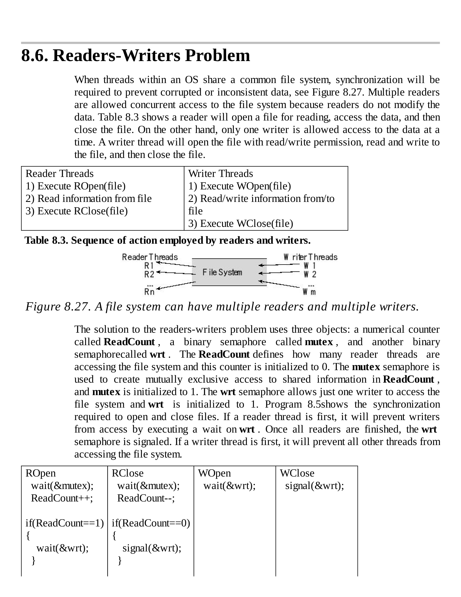
*Description*: Technical schematic and block diagram illustrating circuit operation, signal pathways, and functional behavior for Figure 8.27: A file system can have multiple readers and multiple writers..

> **Figure 8.27: A file system can have multiple readers and multiple writers.**

The solution to the readers-writers problem uses three objects: a numerical counter
called ReadCount , a binary semaphore called mutex , and another binary
semaphorecalled wrt . The ReadCount defines how many reader threads are
accessing the file system and this counter is initialized to 0. The mutex semaphore is
used to create mutually exclusive access to shared information in ReadCount ,

```assembly
and mutex is initialized to 1. The wrt semaphore allows just one writer to access the
```

file system and wrt  is initialized to 1. Program 8.5shows the synchronization
required to open and close files. If a reader thread is first, it will prevent writers
from access by executing a wait on wrt . Once all readers are finished, the wrt
semaphore is signaled. If a writer thread is first, it will prevent all other threads from
accessing the file system.
ROpen
wait(&mutex);
ReadCount++;

```c
if(ReadCount==1)
{
wait(&wrt);
}
```

RClose
wait(&mutex);
ReadCount--;

```c
if(ReadCount==0)
{
signal(&wrt);
}
```

WOpen
wait(&wrt);
WClose
signal(&wrt);


<!-- Page 422 -->
### [PDF Page 422]

signal(&mutex);
signal(&mutex);

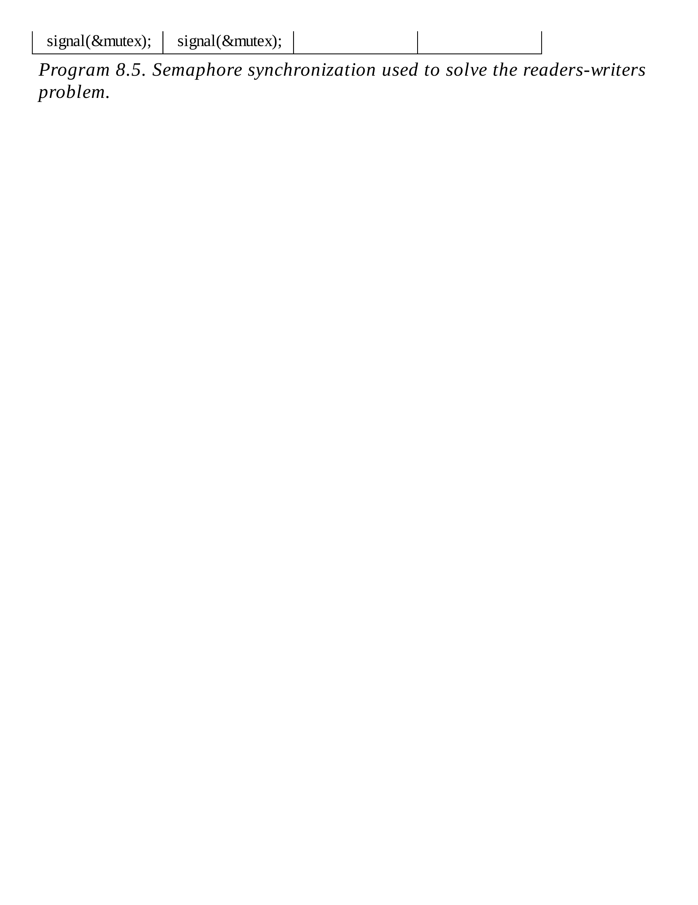
*Description*: Technical schematic and block diagram illustrating circuit operation, signal pathways, and functional behavior for Program 8.5: Semaphore synchronization used to solve the readers-writers.

> **Program 8.5: Semaphore synchronization used to solve the readers-writers**

problem.


<!-- Page 423 -->
### [PDF Page 423]

8.7. Exercises

## 8.1 For each term give a definition in 32 words or less.

a) Free-space management b) Linked allocation c) Indexed allocation
d) FAT
e) Internal fragmentation
f) External fragmentation

## 8.2 Consider a file system that uses contiguous allocation to define the set of blocks

allocated to each file, as shown in Figure 8.28. There are 8192 bytes on this disk
made up of 256 blocks, where each block is 32 bytes. This file system is used to
record important “black box” information. Therefore, the file system is initialized to
empty when the device is manufactured. Each time the system is turned on, a new file
is created. While running important data are stored into that file (create new file,
append data at the end, close file). Files are never deleted. Once a file is closed, it
can be opened for reading, but it cannot be opened again for writing. Block 0
contains the directory and not available for data. Each directory entry has three
fields: name, block number of the first block, and total number of bytes stored. The
example in Figure 8.28 shows file A with 3 allocated blocks (1,2,3 containing
32,32,8 bytes), file B with 2 blocks (4,5 containing 32,32 bytes), and file C with 7
blocks (6,7,8,9,10,11,12 containing 32,32,32,32,32,32,8). All 32 bytes of each data
block can contain data for the file.
a) Does this file system have any external fragmentation? Justify your answer.
b) Assume a file has n data blocks. It takes one block read to fetch the directory. On
average, how many more block reads does it take to read a single byte at a random
position in the file? What is the maximum number of additional block reads that it
takes to read a single byte in the file (worst case)?
c) Describe a simple mechanism to manage free blocks in this system. Be as explicit
as possible, describing how many bytes in the directory are needed to manage the
free space. Describe what the free space looks like after the disk is erased/formatted.
Describe what the free space looks like when the disk is full.
d) File names are a single character. How many files can be stored? Justify your
answer.
e) Assume you have n files each with of random size. Quantify the number of wasted
bytes due to internal fragmentation. You may assume n is less than the number
determined in part d).


<!-- Page 424 -->
### [PDF Page 424]


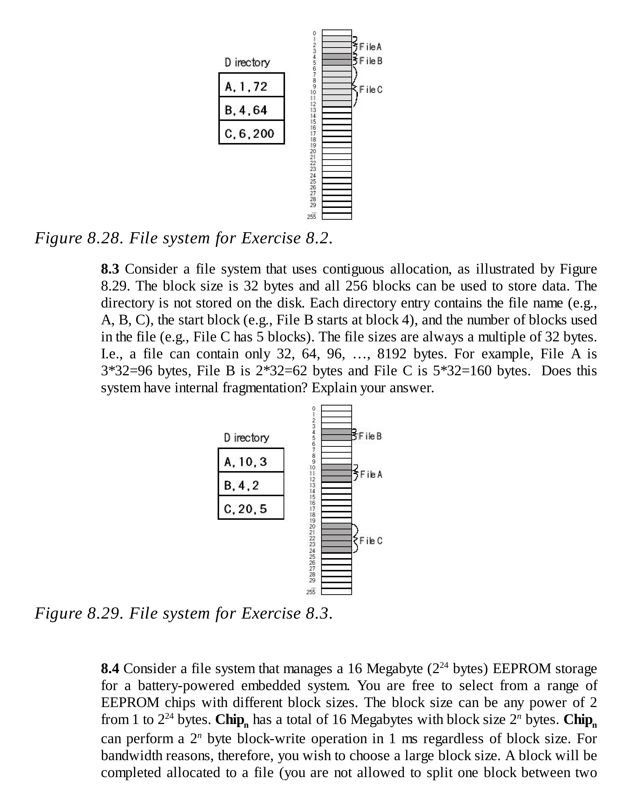
*Description*: Technical schematic and block diagram illustrating circuit operation, signal pathways, and functional behavior for Figure 8.28: File system for Exercise 8.2..

> **Figure 8.28: File system for Exercise 8.2.**


## 8.3 Consider a file system that uses contiguous allocation, as illustrated by Figure

8.29. The block size is 32 bytes and all 256 blocks can be used to store data. The
directory is not stored on the disk. Each directory entry contains the file name (e.g.,
A, B, C), the start block (e.g., File B starts at block 4), and the number of blocks used
in the file (e.g., File C has 5 blocks). The file sizes are always a multiple of 32 bytes.
I.e., a file can contain only 32, 64, 96, …, 8192 bytes. For example, File A is
3*32=96 bytes, File B is 2*32=62 bytes and File C is 5*32=160 bytes.  Does this
system have internal fragmentation? Explain your answer.


*Description*: Technical schematic and block diagram illustrating circuit operation, signal pathways, and functional behavior for Figure 8.29: File system for Exercise 8.3..

> **Figure 8.29: File system for Exercise 8.3.**


## 8.4 Consider a file system that manages a 16 Megabyte (224 bytes) EEPROM storage

for a battery-powered embedded system. You are free to select from a range of
EEPROM chips with different block sizes. The block size can be any power of 2
from 1 to 224 bytes. Chipn has a total of 16 Megabytes with block size 2n bytes. Chipn
can perform a 2n byte block-write operation in 1 ms regardless of block size. For
bandwidth reasons, therefore, you wish to choose a large block size. A block will be
completed allocated to a file (you are not allowed to split one block between two


<!-- Page 425 -->
### [PDF Page 425]

files). 16 bytes of each block are used by the file system to manage pointers, type,
size, and free space. However, if the file were to contain 1 byte of data, an entire
block would be allocated, and the remaining 2n-17 bytes would be wasted. File sizes
in this system are uniformly distributed from 50,000 to 150,000 bytes (this means any
file size from 50,000 to 150,000 bytes is equally likely with an average size of
100,000 bytes). You are asked to choose the largest block size with the
constraint that the average internal fragmentation be less 5% of the total
number of bytes stored. Show your work.
D8.5 One way to manage free-space on a disk is to implement a bit vector. Each
block is 32 bytes long, and there are 256 blocks. For each block on our 8-kibibyte
disk, there will be a single bit specifying whether the block is free (1) or allocated.
In C, we can define 256 bits as a byte-array with 32 entries.

```c
uint8_t BitVector[32];  // 256 bits
```

Similar to the directory, the BitVector will exist both in RAM, as the above C
definition, and on the disk as block 1. The format operation will initialize 254 of
these bits to 1, performing:
BitVector[0] = 0x3F; // blocks 0,1 used (directory, BitVector)

```c
for(i=1;i<32;i++) BitVector[i]=0xFF; // blocks 8-255 are free
eDisk_WriteBlock(BitVector,1);       // update disk copy
```

a) Write a helper function that allocates a free-block updating the disk copy of
BitVector.
// allocate a free block, returns a block number of a free block
// Output: block number 2 to 255 if successful and 0 if full

```c
uint8_t AllocateBlock(void){
eDisk_ReadBlock(BitVector,1);        // fresh RAM copy
```

b) Write a helper function that deallocates a block updating the disk copy of
BitVector.
// deallocate a free block
// Input: block number 2 to 255

```c
void DeallocateBlock(uint8_t blockNum){
eDisk_ReadBlock(BitVector,1);        // fresh RAM copy
```


## 8.6 Consider a file system that uses a file translation table (FTT) to define the set of

blocks allocated to each file. There are 65536 bytes on this disk made up of 256
blocks, where each block is 256 bytes. Block 0 contains the directory and is not
available for data. Each file has its own FTT, which is a null-terminated list of block
numbers assigned to the file. Figure 8.30 shows a file with 4 allocated blocks, with
the first block at 12, and the last block at 22. The directory entry includes the file


<!-- Page 426 -->
### [PDF Page 426]

name, the total number of bytes, and the block number of its FTT. All 256 bytes of
each data block can contain data for the file. For example, the figure shows a file
with 1024 bytes of data, stored in 5 blocks (FTT and 4 data blocks).
a) Does this file system have any external fragmentation? Justify your answer.
b) Assume a file has n data blocks. It takes one block read to fetch the FTT. On
average, how many more block reads does it take to read a single byte at a random
position in the file? What is the maximum number of additional block reads that it
takes to read a single byte in the file (worst case)?
c) Consider the linked allocation scheme.  Assume the directory is in memory and the
file has n data blocks. On average, how many block reads does it take to read a
single byte at a random position in the file? What is the maximum number of block
reads that it takes to read a single byte in the file (worst case)?
d) Assume you are given the following function that reads a 256-byte block from disk
int eDisk_ReadBlock(uint8_t *pt,  // result returned by reference

```c
uint8_t blockNum);              // which block to read
```

Write a C function that returns a byte from a file at a random location. Do not worry
about error handling (e.g., eDisk_ReadBlock error or address too big). The inputs to
the function are numFTT  (the block number of the file’s FTT) and address  (the byte
address, where 0 is the first byte, 1 means second byte etc.). You can use two buffers.

```c
uint8_t FTTbuf[256];  // place to store FTT
uint8_t Databuf[256]; // place to store data
```

The prototype of the C function you have to write is

```c
uint8_t eFile_Read(uint8_t numFTT, uint16_t address);
```


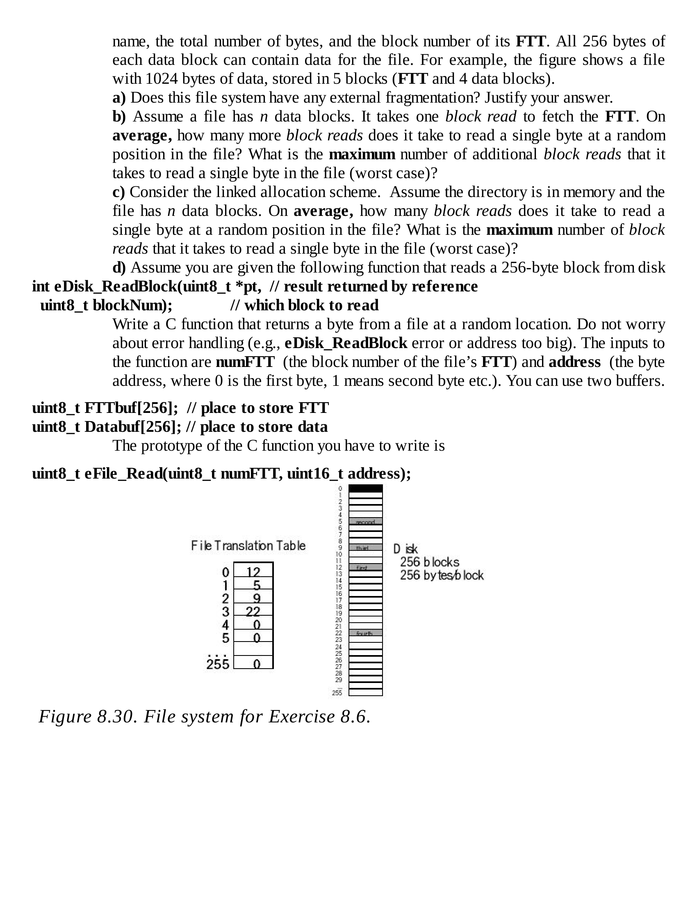
*Description*: Technical schematic and block diagram illustrating circuit operation, signal pathways, and functional behavior for Figure 8.30: File system for Exercise 8.6..

> **Figure 8.30: File system for Exercise 8.6.**


