# Chapter 9: Communication Systems

> **Textbook**: Embedded Systems: Real-Time Operating Systems for ARM Cortex-M Microcontrollers  
> **Author**: Jonathan W. Valvano  
> **PDF Page Range**: 427 - 488


---


<!-- Page 427 -->
### [PDF Page 427]

9. Communication Systems

# Chapter 9 objectives are to:

• Introduce basic concepts of networks
• Describe the controller area network (CAN) protocol
• Present fundamentals and implementation of Bluetooth Low Energy
(BLE)
• Introduce Ethernet, Wireless, and the Internet of Things
The goal of this chapter is to provide a brief introduction to communication
systems. Communication theory is a richly developed discipline, and much of
the communication theory is beyond the scope of this book. Nevertheless, the
trend in embedded systems is to employ multiple intelligent devices, therefore
the interconnection will be a strategic factor in the performance of the system.
These devices will be developed by different manufacturers, thus the
interconnection network must be flexible, robust, and reliable. Consequently,
this chapter focuses on implementing communication systems appropriate for
embedded systems. The components of an embedded system typically
combined to solve a common objective, thus the nodes on the communication
network will cooperate towards that shared goal. In particular, requirements of
an embedded system, in general, involve relatively low bandwidth, static
configuration, and a low probability of corrupted data. In Volume 2, networks
designed with serial ports and ZigBee were presented. In this chapter we will
discuss CAN, Bluetooth, and Ethernet.


<!-- Page 428 -->
### [PDF Page 428]

9.1. Fundamentals
9.1.1. The network
A network is a collection of interfaces that share a physical medium and a data
protocol.  A network allows software tasks in one computer to communicate and
synchronize with software tasks running on another computer. For an embedded
system, the network provides a means for distributed computing. The topology of a
network defines how the components are interconnected. Example topologies include
rings, busses and multi-hop. Figure 9.1 shows a ring network of three
microcontrollers. The advantage of this ring network is low cost and can be
implemented on any microcontroller with a serial port. Notice that the
microcontrollers need not be the same type or speed. The CAN network, presented in
Section 9.2, is an example of a multi-drop bus.
The ZigBee wireless network described in Volume 2 is a multi-hop network
(duplicated in Figure 9.2). Notice that there can be multiple paths with which to route
packets.

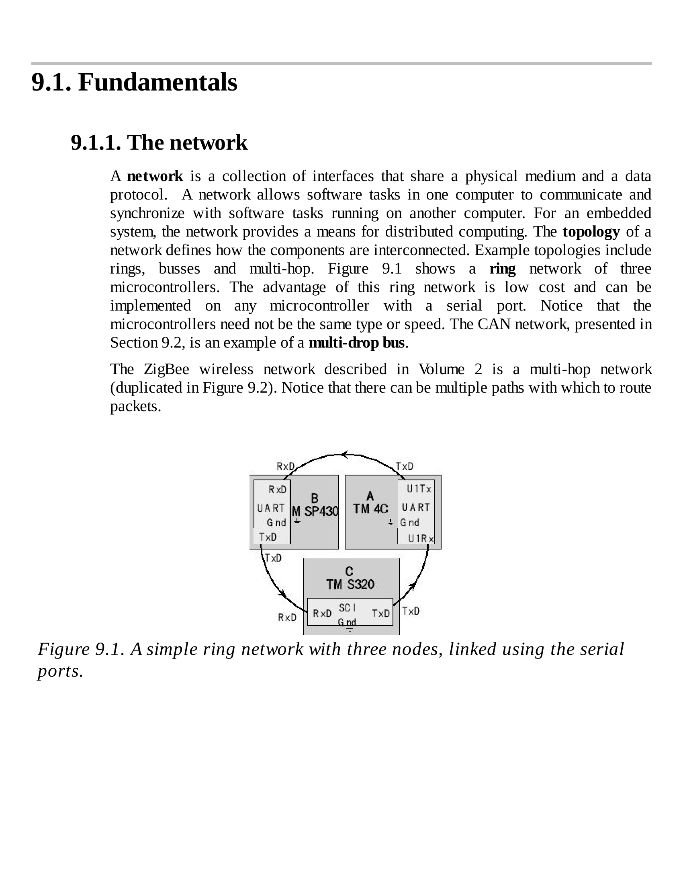
*Description*: Technical schematic and block diagram illustrating circuit operation, signal pathways, and functional behavior for Figure 9.1: A simple ring network with three nodes, linked using the serial.

> **Figure 9.1: A simple ring network with three nodes, linked using the serial**

ports.


<!-- Page 429 -->
### [PDF Page 429]


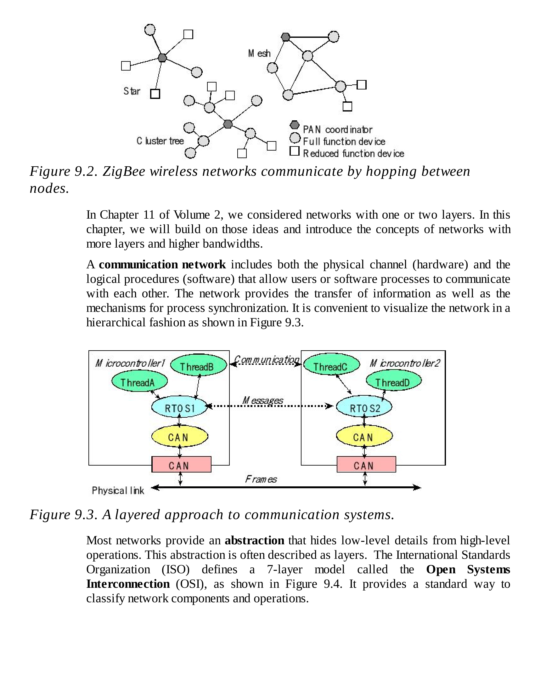
*Description*: Hardware pinout and board interface diagram mapping microcontroller pins, BoosterPack headers, switches, LEDs, and physical connectors for Figure 9.2: ZigBee wireless networks communicate by hopping between.

> **Figure 9.2: ZigBee wireless networks communicate by hopping between**

nodes.
In Chapter 11 of Volume 2, we considered networks with one or two layers. In this
chapter, we will build on those ideas and introduce the concepts of networks with
more layers and higher bandwidths.
A communication network includes both the physical channel (hardware) and the
logical procedures (software) that allow users or software processes to communicate
with each other. The network provides the transfer of information as well as the
mechanisms for process synchronization. It is convenient to visualize the network in a
hierarchical fashion as shown in Figure 9.3.


*Description*: Technical schematic and block diagram illustrating circuit operation, signal pathways, and functional behavior for Figure 9.3: A layered approach to communication systems..

> **Figure 9.3: A layered approach to communication systems.**

Most networks provide an abstraction that hides low-level details from high-level
operations. This abstraction is often described as layers.  The International Standards
Organization (ISO) defines a 7-layer model called the Open Systems
Interconnection (OSI), as shown in Figure 9.4. It provides a standard way to
classify network components and operations.


<!-- Page 430 -->
### [PDF Page 430]


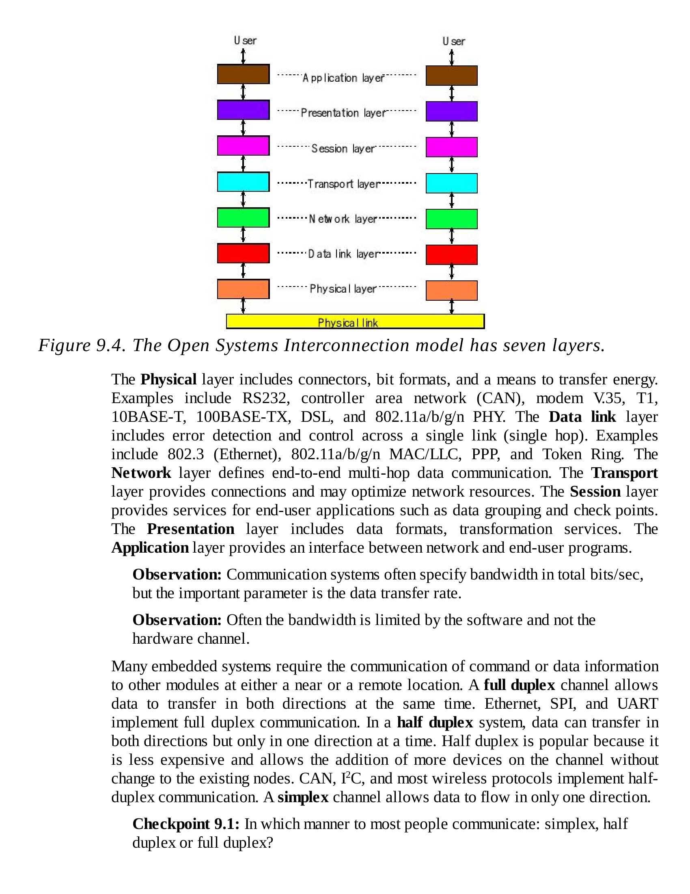
*Description*: Technical schematic and block diagram illustrating circuit operation, signal pathways, and functional behavior for Figure 9.4: The Open Systems Interconnection model has seven layers..

> **Figure 9.4: The Open Systems Interconnection model has seven layers.**

The Physical layer includes connectors, bit formats, and a means to transfer energy.
Examples include RS232, controller area network (CAN), modem V.35, T1,
10BASE-T, 100BASE-TX, DSL, and 802.11a/b/g/n PHY. The Data link layer
includes error detection and control across a single link (single hop). Examples
include 802.3 (Ethernet), 802.11a/b/g/n MAC/LLC, PPP, and Token Ring. The
Network layer defines end-to-end multi-hop data communication. The Transport
layer provides connections and may optimize network resources. The Session layer
provides services for end-user applications such as data grouping and check points.
The Presentation layer includes data formats, transformation services. The
Application layer provides an interface between network and end-user programs.
Observation: Communication systems often specify bandwidth in total bits/sec,
but the important parameter is the data transfer rate.
Observation: Often the bandwidth is limited by the software and not the
hardware channel.
Many embedded systems require the communication of command or data information
to other modules at either a near or a remote location. A full duplex channel allows
data to transfer in both directions at the same time. Ethernet, SPI, and UART
implement full duplex communication. In a half duplex system, data can transfer in
both directions but only in one direction at a time. Half duplex is popular because it
is less expensive and allows the addition of more devices on the channel without
change to the existing nodes. CAN, I2C, and most wireless protocols implement half-
duplex communication. A simplex channel allows data to flow in only one direction.
Checkpoint 9.1: In which manner to most people communicate: simplex, half
duplex or full duplex?


<!-- Page 431 -->
### [PDF Page 431]

9.1.2. Physical Channel
Information, such as text, sound, pictures and movies, can be encoded in digital form

```assembly
and transmitted across a channel, as shown in Figure 9.5. Channel capacity is
```

defined as the maximum information per second it can transmit. In order to improve
the effective bandwidth many communication systems will compress the information
at the source, transmit the compressed version, and then decompress the data at the
destination. Compression essentially removes redundant information in such a way
that the decompressed data is identical (lossless) or slightly altered but similar
enough (lossy). For example, a 400 pixels/inch photo compressed using the JPEG
algorithm will be 5 to 30 times smaller than the original. A guided medium focuses
the transmission energy into a well-defined path, such as current flowing along
copper wire of a twisted pair cable, or light traveling along a fiber optic cable.
Conversely, an unguided medium has no focus, and the energy field diffuses as in
propagates, such as sound or EM fields in air or water. In general, for communication
to occur, the transmitter must encode information as energy, the channel must allow
the energy to move from transmitter to receiver, and the receiver must decode the
energy back into the information, see Figure 9.5. In an analog communication system,
energy can vary continuously in amplitude and time. A digital communication signal
exists at a finite number of energy levels for discrete amounts of time. Along the way,
the energy may be lost due to attenuation. For example, a simple V=I*R voltage
drop is in actuality a loss of energy as electrical energy converted to thermal energy.
A second example of attenuation is an RF cable splitter. For each splitter, there will
be 50% attenuation, where half the energy goes left and the other half goes right
through the splitter. Unguided media will have attenuation as the energy propagates in
multiple directions. Attenuation causes the received energy to be lower in amplitude
than the transmitted energy.
A second problem is distortion. The transfer gain and phase in the channel may be
function of frequency, time, or amplitude. Distortion causes the received energy to be
different shape than the transmitted energy.
A third problem is noise. The noise energy is combined with the information energy
to create a new signal. White noise is an inherent or internally generated noise
caused by thermal fluctuations. EM field noise is externally generated and is coupled
or added into the system. Crosstalk is a problem where energy in one wire causes
noise in an adjacent wire.  We quantify noise with signal-to-noise ratio (SNR),
which is the ratio of the information signal power to noise power.


<!-- Page 432 -->
### [PDF Page 432]


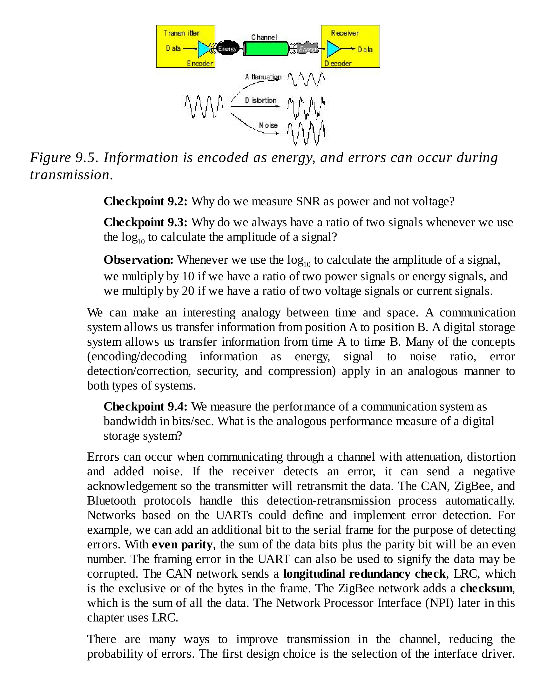
*Description*: Technical schematic and block diagram illustrating circuit operation, signal pathways, and functional behavior for Figure 9.5: Information is encoded as energy, and errors can occur during.

> **Figure 9.5: Information is encoded as energy, and errors can occur during**

transmission.
Checkpoint 9.2: Why do we measure SNR as power and not voltage?
Checkpoint 9.3: Why do we always have a ratio of two signals whenever we use
the log10 to calculate the amplitude of a signal?
Observation: Whenever we use the log10 to calculate the amplitude of a signal,
we multiply by 10 if we have a ratio of two power signals or energy signals, and
we multiply by 20 if we have a ratio of two voltage signals or current signals.
We can make an interesting analogy between time and space. A communication
system allows us transfer information from position A to position B. A digital storage
system allows us transfer information from time A to time B. Many of the concepts
(encoding/decoding
information
as
energy,
signal
to
noise
ratio,
error
detection/correction, security, and compression) apply in an analogous manner to
both types of systems.
Checkpoint 9.4: We measure the performance of a communication system as
bandwidth in bits/sec. What is the analogous performance measure of a digital
storage system?
Errors can occur when communicating through a channel with attenuation, distortion

```assembly
and added noise. If the receiver detects an error, it can send a negative
```

acknowledgement so the transmitter will retransmit the data. The CAN, ZigBee, and
Bluetooth protocols handle this detection-retransmission process automatically.
Networks based on the UARTs could define and implement error detection. For
example, we can add an additional bit to the serial frame for the purpose of detecting
errors. With even parity, the sum of the data bits plus the parity bit will be an even
number. The framing error in the UART can also be used to signify the data may be
corrupted. The CAN network sends a longitudinal redundancy check, LRC, which
is the exclusive or of the bytes in the frame. The ZigBee network adds a checksum,
which is the sum of all the data. The Network Processor Interface (NPI) later in this
chapter uses LRC.
There are many ways to improve transmission in the channel, reducing the
probability of errors. The first design choice is the selection of the interface driver.


<!-- Page 433 -->
### [PDF Page 433]

For example, RS422 is less likely to exhibit errors than RS232. Of course having a
driver will be more reliable than not having a driver. The second consideration is the
cable. Proper shielding can improve SNR. For example, Cat6 Ethernet cables have a
separator between the four pairs of twisted wire, which reduce the crosstalk between
lines as compared to Cat5e cable. If we can separate or eliminate the source of
added noise, the SNR will improve. Reducing the distance and reducing the
bandwidth often will reduce the probability of error. If we must transmit long
distances, we can use a repeater, which accepts the input and retransmits the data
again.
Error correcting codes are beyond the scope of this book. However, we can present
two simple error correcting codes. The first error correcting code involves sending
three copies of each data. The receiver will compare the three versions received and
majority vote will decide which value to use. A second error correcting code uses
both parity and LRC. For example, assume we wished to send the message “Ciao”.
Encoded as ASCII characters the data are $43, $69, $61, and $6F. The first step is to
display the binary data in 2-D.
Byte
0
Byte
1
Byte
2
Byte
3
Bit 7
0
0
0
0
Bit 6
1
1
1
1
Bit 5
0
1
1
1
Bit 4
0
0
0
0
Bit 3
0
1
0
1
Bit 2
0
0
0
1
Bit 1
1
0
0
1
Bit 0
1
1
1
1
The second step is to add an even parity to each byte and add a LRC at the end.
Byte
0
Byte
1
Byte
2
Byte
3
LRC
Parity
1
0
1
0
0
Bit 7
0
0
0
0
0
Bit 6
1
1
1
1
0
Bit 5
0
1
1
1
1
Bit 4
0
0
0
0
0
Bit 3
0
1
0
1
0
Bit 2
0
0
0
1
1
Bit 1
1
0
0
1
0
Bit 0
1
1
1
1
0
Notice that the even parity is the exclusive OR of each bit in the vertical column and


<!-- Page 434 -->
### [PDF Page 434]

the LRC is the exclusive OR of each bit in the horizontal row. The parity bit for the
LRC (or the LRC bit for the parity) will be the exclusive OR of all the data bits.
Now, if any one bit in this 9-row by 5-column matrix is flipped, we can determine
which byte is in error by the parity and which bit is in error by the LRC. Rather than
asking for retransmission, we simply correct the error. These are very simple error
correcting codes, but they illustrate that we can send more bits than the minimum and
use those extra bits in a creative way to either detect or correct errors.
RS422, RS485, Ethernet, and CAN are high-speed communication channels. This
means the bandwidth and slew rate on the signals are higher than RS232. There is a
correspondence between rise time (t) of a digital signal and equivalent sinusoidal
frequency (f). The derivative of A∙sin(2πft) is 2πf∙A∙cos(2πft). The maximum slew
rate of this sinusoid is 2πf∙A. Approximating the slew rate as A/t, we get a
correspondence between f and t
f= 1/  t
For example, if the rise time is 5 ns, the equivalent frequency is 200 MHz. Notice
that this equivalent frequency is independent of baud rate. So even at 1000 bits/sec, if
the rise time is 5 ns, then the signal has a strong 200 MHz frequency component! To
deal with this issue, the RS232 protocol limits the slew rate to a maximum of 30V/
µs. This means it will take about 400 ns for a signal to rise from -6 to +6 V.
Consequently, RS232 signals have frequency components less than 2 MHz. However,
to transmit faster than RS232, the protocol must have faster rise times. Electrical
signals travel at about 0.6 to 0.9 times the speed of light. This velocity factor (VF) is
a property of the cable. For example, VF for RG-6/U coax cable is 0.75, whereas VF
is only 0.66 for RG-58/U coax cable. Using the slower 0.66 estimate, the speed is v
= 2∙108 m/s. According to wave theory, the wavelength is l = v/f. Estimating the
frequency from rise time, we get
l = v  *t
In our example, a rise time of 5 ns is equivalent to a wavelength of about 1 m. As a
rule of thumb, we will consider the channel as a transmission line if the length of the
wire is greater than l/4. Another requirement is for the diameter of the wire to be
much smaller than the wavelength. In a transmission line, the signals travel down the
wires as waves according to the wave equation. Analysis of the wave equation is
outside the scope of this book. However, you need to know that when a wave meets a
change in impedance, some of the energy will transmit (a good thing) and some of the
energy will reflect (a bad thing). Reflections are essentially noise on the signal, and
if large enough, they will cause bit errors in transmission. We can reduce the change
in impedance by placing terminating resistors on both ends of a long high-speed
cable, which are needed for both CAN and Ethernet. These resistors reduce
reflections; hence they improve signal to noise ratio.


<!-- Page 435 -->
### [PDF Page 435]

9.1.3. Wireless Communication
The details of exactly how wireless communication operates are beyond the scope of
this book. Nevertheless, the interfacing techniques presented in this book are
sufficient to implement wireless communication by selecting a wireless module and
interfacing it to the microcontroller. In general, one considers bandwidth, distance,
topology and security when designing a wireless link. Bandwidth is the fundamental
performance measure for a communication system. In this book, we define bandwidth
of the system as the information transfer rate. However, when characterizing the
physical channel, bandwidth can have many definitions. In general, the bandwidth of
a channel is the range of frequencies passed by the channel (Communication
Networks by Leon-Garcia). Let Gx(f) be the gain versus frequency of the channel.
When considering EM fields transmitted across space, we can define absolute
bandwidth as the frequency interval that contains all of the signal’s frequencies.
Half-power bandwidth is the interval between frequencies at which Gx(f) has
dropped to half power (‑3dB). Let fc be the carrier frequency, and Px be the total
signal power over all frequencies. The equivalent rectangular bandwidth is
Px/Gx(fc). The null-to-null bandwidth is the frequency interval between first two nulls
of Gx(f). The FCC defines fractional power containment bandwidth as the
bandwidth with 0.5% of signal power above and below the band. The bounded
power spectral density is the band defined so that everywhere outside Gx(f) must
have fallen to a given level. The purpose of this list is to demonstrate to the reader
that, when quoting performance data, we must give both definition of the parameter

```assembly
and the data. If we know the channel bandwidth W in Hz and the SNR, we can use the
```

Shannon–Hartley Channel Capacity Theorem to estimate the maximum data
transfer rate C in bits/s:
C = W *log2(1 + SNR)
For example, consider a telephone line with a bandwidth W of 3.4 kHz and SNR of
38 dB. The dimensionless SNR = 10(38/10) = 6310. Using the Channel Capacity
Theorem, we calculate C = 3.4 kHz * log2(1 + 6310) = 43 kbits/s.
9.1.4. Radio

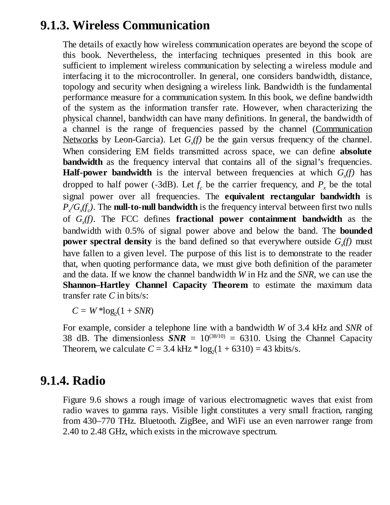
*Description*: Technical schematic and block diagram illustrating circuit operation, signal pathways, and functional behavior for Figure 9.6: shows a rough image of various electromagnetic waves that exist from.

> **Figure 9.6: shows a rough image of various electromagnetic waves that exist from**

radio waves to gamma rays. Visible light constitutes a very small fraction, ranging
from 430–770 THz. Bluetooth. ZigBee, and WiFi use an even narrower range from

## 2.40 to 2.48 GHz, which exists in the microwave spectrum.


<!-- Page 436 -->
### [PDF Page 436]


*Description*: Technical schematic and block diagram illustrating circuit operation, signal pathways, and functional behavior for Figure 9.6: Bluetooth communication occurs in the microwave band at about.

> **Figure 9.6: Bluetooth communication occurs in the microwave band at about**


## 2.4 GHz.


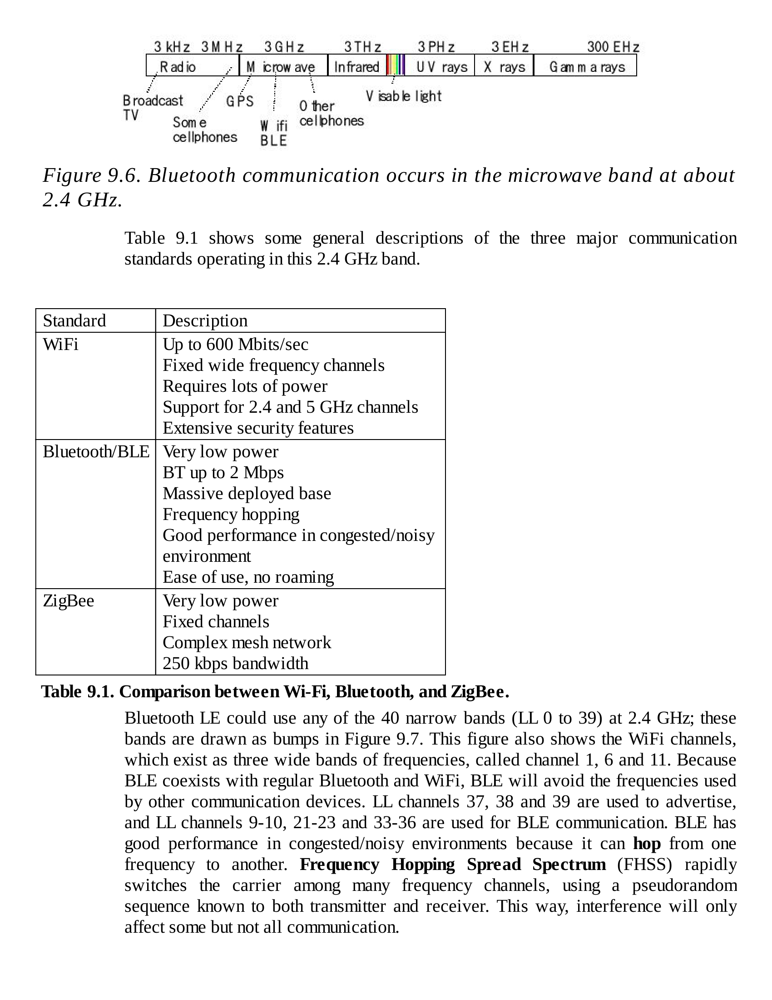
*Description*: Reference table detailing hardware parameters, register bit patterns, performance metrics, or memory configurations for Table 9.1: shows some general descriptions of the three major communication.

> **Table 9.1: shows some general descriptions of the three major communication**

standards operating in this 2.4 GHz band.
Standard
Description
WiFi
Up to 600 Mbits/sec
Fixed wide frequency channels
Requires lots of power
Support for 2.4 and 5 GHz channels
Extensive security features
Bluetooth/BLE Very low power
BT up to 2 Mbps
Massive deployed base
Frequency hopping
Good performance in congested/noisy
environment
Ease of use, no roaming
ZigBee
Very low power
Fixed channels
Complex mesh network
250 kbps bandwidth


*Description*: Reference table detailing hardware parameters, register bit patterns, performance metrics, or memory configurations for Table 9.1: Comparison between Wi-Fi, Bluetooth, and ZigBee..

> **Table 9.1: Comparison between Wi-Fi, Bluetooth, and ZigBee.**

Bluetooth LE could use any of the 40 narrow bands (LL 0 to 39) at 2.4 GHz; these
bands are drawn as bumps in Figure 9.7. This figure also shows the WiFi channels,
which exist as three wide bands of frequencies, called channel 1, 6 and 11. Because
BLE coexists with regular Bluetooth and WiFi, BLE will avoid the frequencies used
by other communication devices. LL channels 37, 38 and 39 are used to advertise,

```assembly
and LL channels 9-10, 21-23 and 33-36 are used for BLE communication. BLE has
```

good performance in congested/noisy environments because it can hop from one
frequency to another. Frequency Hopping Spread Spectrum (FHSS) rapidly
switches the carrier among many frequency channels, using a pseudorandom
sequence known to both transmitter and receiver. This way, interference will only
affect some but not all communication.


<!-- Page 437 -->
### [PDF Page 437]


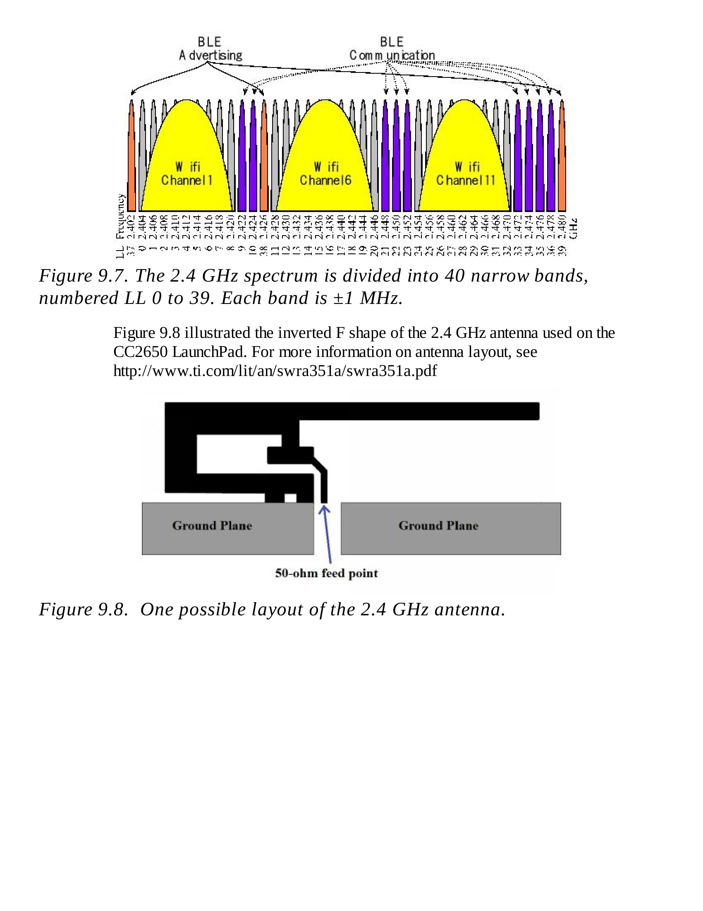
*Description*: Technical schematic and block diagram illustrating circuit operation, signal pathways, and functional behavior for Figure 9.7: The 2.4 GHz spectrum is divided into 40 narrow bands,.

> **Figure 9.7: The 2.4 GHz spectrum is divided into 40 narrow bands,**

numbered LL 0 to 39. Each band is ±1 MHz.


*Description*: Technical schematic and block diagram illustrating circuit operation, signal pathways, and functional behavior for Figure 9.8: illustrated the inverted F shape of the 2.4 GHz antenna used on the.

> **Figure 9.8: illustrated the inverted F shape of the 2.4 GHz antenna used on the**

CC2650 LaunchPad. For more information on antenna layout, see
http://www.ti.com/lit/an/swra351a/swra351a.pdf


*Description*: Technical schematic and block diagram illustrating circuit operation, signal pathways, and functional behavior for Figure 9.8: One possible layout of the 2.4 GHz antenna..

> **Figure 9.8: One possible layout of the 2.4 GHz antenna.**


<!-- Page 438 -->
### [PDF Page 438]

9.2. Controller Area Network (CAN)
9.2.1. The Fundamentals of CAN
In this section, we will design and implement a Controller Area Network (CAN).
CAN is a high-integrity serial data communications bus that is used for real-time
applications. It can operate at data rates of up to 1 Mbits/second, having excellent
error detection and confinement capabilities. The CAN was originally developed by
Robert Bosch for use in automobiles, and is now extensively used in industrial
automation and control applications. The CAN protocol has been developed into an
international standard for serial data communication, specifically the ISO 11989.

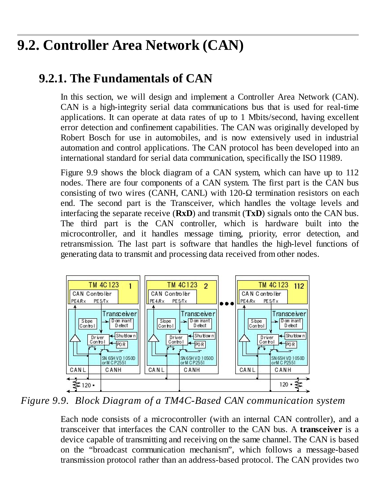
*Description*: Architectural block diagram detailing logic modules, memory buses, internal registers, and hardware interconnections for Figure 9.9: shows the block diagram of a CAN system, which can have up to 112.

> **Figure 9.9: shows the block diagram of a CAN system, which can have up to 112**

nodes. There are four components of a CAN system. The first part is the CAN bus
consisting of two wires (CANH, CANL) with 120-Ω termination resistors on each
end. The second part is the Transceiver, which handles the voltage levels and
interfacing the separate receive (RxD) and transmit (TxD) signals onto the CAN bus.
The third part is the CAN controller, which is hardware built into the
microcontroller, and it handles message timing, priority, error detection, and
retransmission. The last part is software that handles the high-level functions of
generating data to transmit and processing data received from other nodes.


*Description*: Architectural block diagram detailing logic modules, memory buses, internal registers, and hardware interconnections for Figure 9.9: Block Diagram of a TM4C-Based CAN communication system.

> **Figure 9.9: Block Diagram of a TM4C-Based CAN communication system**

Each node consists of a microcontroller (with an internal CAN controller), and a
transceiver that interfaces the CAN controller to the CAN bus. A transceiver is a
device capable of transmitting and receiving on the same channel. The CAN is based
on the “broadcast communication mechanism”, which follows a message-based
transmission protocol rather than an address-based protocol. The CAN provides two


<!-- Page 439 -->
### [PDF Page 439]

communication services: the sending of a message (data frame transmission) and the
requesting of a message (remote transmission request). All other services such as
error signaling, automatic retransmission of erroneous frames are user-transparent,
which implies that the CAN interface automatically performs these functions.  Both
the TM4C123 and the TM4C1294 have two CAN devices. However, the MSP432
does not have a CAN interface. The physical channel consists of two wires
containing in differential mode one digital logic bit. Because multiple outputs are
connected together, there must be a mechanism to resolve simultaneous requests for
transmission. In a manner similar to open collector logic, there are dominant and
recessive states on the transmitter, as shown in Figure 9.10. The outputs follow a
wired-and mechanism in such a way that if one or more nodes are sending a dominant
state, it will override any nodes attempting to send a recessive state.

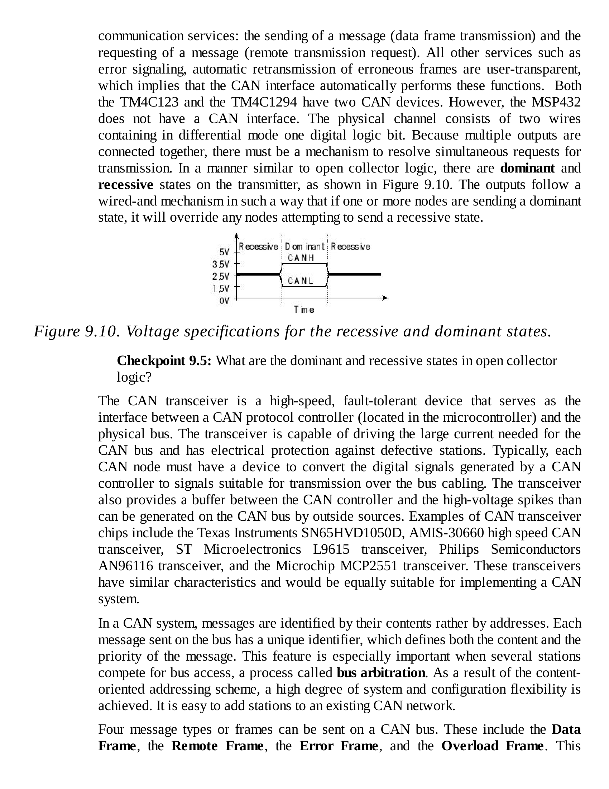
*Description*: Technical schematic and block diagram illustrating circuit operation, signal pathways, and functional behavior for Figure 9.10: Voltage specifications for the recessive and dominant states..

> **Figure 9.10: Voltage specifications for the recessive and dominant states.**

Checkpoint 9.5: What are the dominant and recessive states in open collector
logic?
The CAN transceiver is a high-speed, fault-tolerant device that serves as the
interface between a CAN protocol controller (located in the microcontroller) and the
physical bus. The transceiver is capable of driving the large current needed for the
CAN bus and has electrical protection against defective stations. Typically, each
CAN node must have a device to convert the digital signals generated by a CAN
controller to signals suitable for transmission over the bus cabling. The transceiver
also provides a buffer between the CAN controller and the high-voltage spikes than
can be generated on the CAN bus by outside sources. Examples of CAN transceiver
chips include the Texas Instruments SN65HVD1050D, AMIS-30660 high speed CAN
transceiver, ST Microelectronics L9615 transceiver, Philips Semiconductors
AN96116 transceiver, and the Microchip MCP2551 transceiver. These transceivers
have similar characteristics and would be equally suitable for implementing a CAN
system.
In a CAN system, messages are identified by their contents rather by addresses. Each
message sent on the bus has a unique identifier, which defines both the content and the
priority of the message. This feature is especially important when several stations
compete for bus access, a process called bus arbitration. As a result of the content-
oriented addressing scheme, a high degree of system and configuration flexibility is
achieved. It is easy to add stations to an existing CAN network.
Four message types or frames can be sent on a CAN bus. These include the Data
Frame, the Remote Frame, the Error Frame, and the Overload Frame. This


<!-- Page 440 -->
### [PDF Page 440]

section will focus on the Data Frame, where the parts in standard format are shown
in Figure 9.11. The Arbitration Field determines the priority of the message when
two or more nodes are contending for the bus. For the Standard CAN 2.0A, it
consists of an 11-bit identifier. For the Extended CAN 2.0B, there is a 29-bit
Identifier. The identifier defines the type of data. The Control Field contains the
DLC, which specifies the number of data bytes. The Data Field contains zero to eight
bytes of data. The CRC Field contains a 15-bit checksum used for error detection.
Any CAN controller that has been able to correctly receive this message sends an
Acknowledgement bit at the end of each message. This bit is stored in the
Acknowledge slot in the CAN data frame. The transmitter checks for the presence of
this bit and if no acknowledge is received, the message is retransmitted. To transmit a
message, the software must set the 11-bit Identifier, set the 4-bit DLC, and give the 0
to 8 bytes of data. The receivers can define filters on the identifier field, so only
certain message types will be accepted. When a message is received the software
can read the identifier, length, and data.
The Intermission Frame Space (IFS) separates one frame from the next.  There are
two factors that affect the number of bits in a CAN message frame. The ID (11 or 29
bits) and the Data fields (0, 8, 16, 24, 32, 40, 48, 56, or 64 bits) have variable length.
The remaining components (36 bits) of the frame have fixed length including SOF
(1), RTR (1), IDE/r1 (1), r0 (1), DLC (4), CRC (15), and ACK/EOF/intermission
(13). For example, a Standard CAN 2.0A frame with two data bytes has 11+16+36 =
63 bits. Similarly, an Extended CAN 2.0B frame with four data bytes has 29+32+36
= 97 bits.
If a long sequence of 0’s or a long sequence of 1’s is being transferred, the data line
will be devoid of edges that the receiver needs to synchronize its clock to the
transmitter. In this case, measures must be taken to ensure that the maximum
permissible interval between two signal edges is not exceeded.  Bit Stuffing can be
utilized by inserting a complementary bit after five bits of equal value. Some CAN
systems add stuff bits, where the number of stuff bits depends on the data transmitted.
Assuming n is the number of data bytes (0 to 8), CAN 2.0A may add 3+n stuff bits

```assembly
and a CAN 2.0B may add 5+n stuff bits. Of course, the receiver has to un-stuff these
```

bits to obtain the original data.

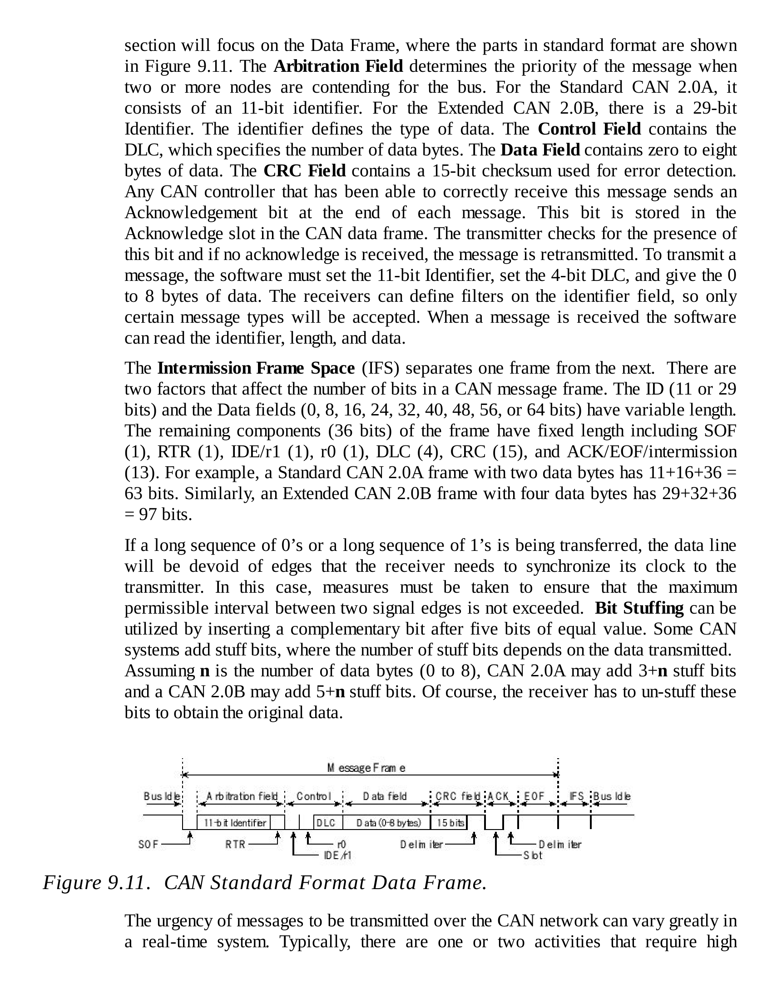
*Description*: Technical schematic and block diagram illustrating circuit operation, signal pathways, and functional behavior for Figure 9.11: CAN Standard Format Data Frame..

> **Figure 9.11: CAN Standard Format Data Frame.**

The urgency of messages to be transmitted over the CAN network can vary greatly in
a real-time system. Typically, there are one or two activities that require high


<!-- Page 441 -->
### [PDF Page 441]

transmission rates or quick responses. Both bandwidth and response time are
affected by message priority. Low priority messages may have to wait for the bus to
be idle. There are two priorities occurring as the CANs transmit messages. The first
priority is the 11-bit identifier, which is used by all the CAN controllers wishing to
transmit a message on the bus. Message identifiers are specified during system design

```assembly
and cannot be altered dynamically. The 11-bit identifier with the lowest binary
```

number has the highest priority. In order to resolve a bus access conflict, each node
in the network observes the bus level bit by bit, a process known as bit-wise
arbitration. In accordance with the wired-and-mechanism, the dominant state
overwrites the recessive state. All nodes with recessive transmission but dominant
observation immediately lose the competition for bus access and become receivers
of the message with the higher priority. They do not attempt transmission until the bus
is available again. Transmission requests are hence handled according to their
importance for the system as a whole. The second priority occurs locally, within each
CAN node. When a node has multiple messages ready to be sent, it will send the
highest priority messages first.
Observation: It is confusing when designing systems that use a sophisticated I/O
interface like the CAN to understand the difference between those activities
automatically handled by the CAN hardware module and those activities your
software must perform. The solution to this problem is to look at software
examples to see exactly the kinds of tasks your software must perform.
9.2.2. Texas Instruments TM4C CAN
A device driver for the CAN network is divided into three components: initialization,
transmission, and reception. There is a CAN driver available in TivaWare®. In this
section, we will use this driver to develop a simple system that exchanges 4-byte
messages between two microcontrollers. Each node generates an interrupt when they
receive a CAN message, and the interrupt handler dumps the data either into a
mailbox.  In this example, the transmission doesn’t block, just returns a failure if it
can’t put, so it will not block or spin. This example was written using the TivaWare®
driverlib library. Figure 9.12 shows the data flow. There are two IDs used in this
example:
#define RCV_ID 2
#define XMT_ID 4
The CAN ID numbers must be reversed on the other microcontroller. Otherwise, the
software functions on the two nodes are identical.


<!-- Page 442 -->
### [PDF Page 442]


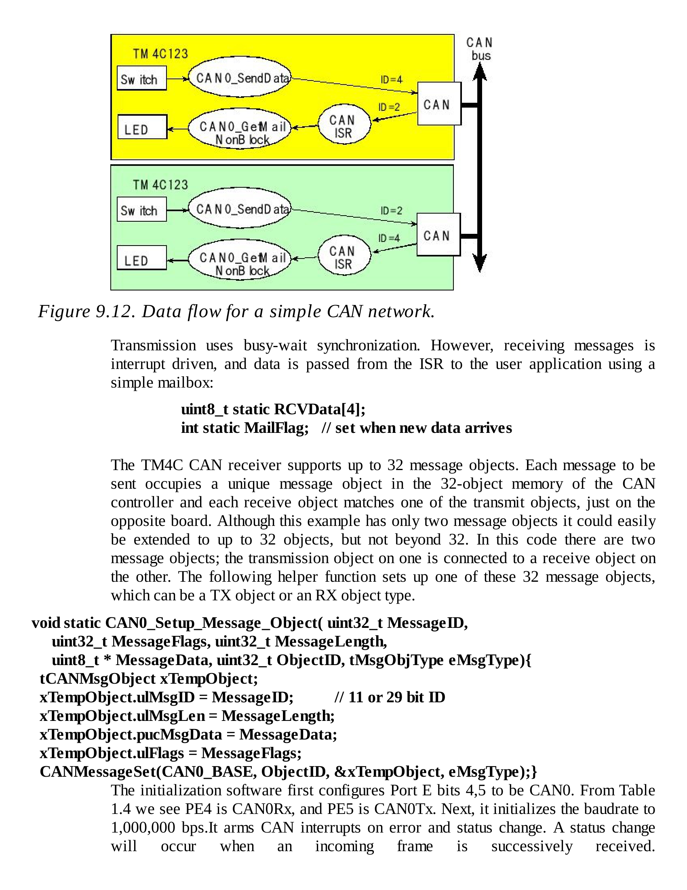
*Description*: Technical schematic and block diagram illustrating circuit operation, signal pathways, and functional behavior for Figure 9.12: Data flow for a simple CAN network..

> **Figure 9.12: Data flow for a simple CAN network.**

Transmission uses busy-wait synchronization. However, receiving messages is
interrupt driven, and data is passed from the ISR to the user application using a
simple mailbox:

```c
uint8_t static RCVData[4];
int static MailFlag;   // set when new data arrives
```

The TM4C CAN receiver supports up to 32 message objects. Each message to be
sent occupies a unique message object in the 32-object memory of the CAN
controller and each receive object matches one of the transmit objects, just on the
opposite board. Although this example has only two message objects it could easily
be extended to up to 32 objects, but not beyond 32. In this code there are two
message objects; the transmission object on one is connected to a receive object on
the other. The following helper function sets up one of these 32 message objects,
which can be a TX object or an RX object type.
void static CAN0_Setup_Message_Object( uint32_t MessageID,

```c
uint32_t MessageFlags, uint32_t MessageLength,
uint8_t * MessageData, uint32_t ObjectID, tMsgObjType eMsgType){
tCANMsgObject xTempObject;
xTempObject.ulMsgID = MessageID;          // 11 or 29 bit ID
xTempObject.ulMsgLen = MessageLength;
xTempObject.pucMsgData = MessageData;
xTempObject.ulFlags = MessageFlags;
CANMessageSet(CAN0_BASE, ObjectID, &xTempObject, eMsgType);}
```

The initialization software first configures Port E bits 4,5 to be CAN0. From Table

## 1.4 we see PE4 is CAN0Rx, and PE5 is CAN0Tx. Next, it initializes the baudrate to

1,000,000 bps.It arms CAN interrupts on error and status change. A status change
will
occur
when
an
incoming
frame
is
successively
received.


<!-- Page 443 -->
### [PDF Page 443]

The CAN0_Setup_Message_Object function will configure one of the 32 message
objects. Basically, it will set a filter to allow receive frames with this RCV_ID  ID.
An interrupt will be generated when receiving this type of frame, but other CAN
traffic will be ignored. This function also specifies the expected size in bytes of the
payload. Lastly, the CAN module is armed in the NVIC. Interrupts will be enabled in
the main program after all devices are initialized.

```c
void CAN0_Open(void){uint32_t volatile delay;
MailFlag = false;
SYSCTL_RCGCCAN_R |= 0x00000001;  // CAN0 enable bit 0
SYSCTL_RCGCGPIO_R |= 0x00000010;  // PortE enable bit 4
for(delay=0; delay<10; delay++){};
GPIO_PORTE_AFSEL_R |= 0x30; //PORTE AFSEL bits 5,4
GPIO_PORTE_PCTL_R = (GPIO_PORTE_PCTL_R&0xFF00FFFF)|0x00880000;
GPIO_PORTE_DEN_R |= 0x30;
GPIO_PORTE_DIR_R |= 0x20;
CANInit(CAN0_BASE);
CANBitRateSet(CAN0_BASE, 80000000, CAN_BITRATE);
CANEnable(CAN0_BASE);
```

CANIntEnable(CAN0_BASE,CAN_INT_MASTER|CAN_INT_ERROR|CAN_INT_STATUS)
CAN0_Setup_Message_Object(RCV_ID, MSG_OBJ_RX_INT_ENABLE, 4, NULL,
RCV_ID, MSG_OBJ_TYPE_RX);
NVIC_EN1_R = (1 << (INT_CAN0 - 48)); // IntEnable(INT_CAN0);
return;
}
Again, an interrupt is generated when a frame of the appropriate ID is received. The
ISR will search the 32 possible message objects for the one that caused the interrupt.

```c
void CAN0_Handler(void){uint8_t data[4]; int i;
uint32_t ulIntStatus,ulIDStatus; tCANMsgObject xTempMsgObject;
xTempMsgObject.pucMsgData = data;
ulIntStatus = CANIntStatus(CAN0_BASE, CAN_INT_STS_CAUSE); // cause?
if(ulIntStatus & CAN_INT_INTID_STATUS){  // receive?
ulIDStatus = CANStatusGet(CAN0_BASE, CAN_STS_NEWDAT);
for(i = 0; i < 32; i++){    // test every bit of the mask
if( (0x1 << i) & ulIDStatus){  // if active, get data
CANMessageGet(CAN0_BASE, (i+1), &xTempMsgObject, true);
if(xTempMsgObject.ulMsgID == RCV_ID){
RCVData[0] = data[0]; RCVData[1] = data[1];
RCVData[2] = data[2]; RCVData[3] = data[3];
MailFlag = true;   // new mail
}
}
}
```


<!-- Page 444 -->
### [PDF Page 444]

}
CANIntClear(CAN0_BASE, ulIntStatus);  // acknowledge
}
When
the
user
code
wishes
to
receive
a
message,
it
calls CAN0_GetMailNonBlock , which is a simple mailbox receiver. This function
is nonblocking, meaning if there is no message it returns false. If there is a message, it
copies the payload of 4 bytes and returns true. If the RTOS were available, the
MailFlag could be replaces with a semaphore. The ISR would signal the semaphore
on new data, and the user code could wait on that semaphore.
int CAN0_GetMailNonBlock(uint8_t data[4]){

```c
if(MailFlag){
data[0] = RCVData[0];
data[1] = RCVData[1];
data[2] = RCVData[2];
data[3] = RCVData[3];
MailFlag = false;
return true;
}
return false;
}
int CAN0_CheckMail(void){
return MailFlag;
}
```

When the user code wishes to transmit data it calls this function, which configures a
new message object. This function will send 4 bytes of data to other microcontroller.

```c
void CAN0_SendData(uint8_t data[4]){
CAN0_Setup_Message_Object(XMT_ID,NULL,4,data,XMT_ID,MSG_OBJ_TYPE_TX);
}
```

The UserTask  ISR periodically reads its switches and creates a transmit object.
Because the transmission rate is slower than the network, the transmitter does not
wait. It simply creates the message object ( CAN0_SendData ) and schedules it for
transmission. When received by the other microcontroller an interrupt is generated

```assembly
and the data is put in a mailbox. The main program on the other microcontroller reads
```

the mail and writes the data out to its LED. Data flows in both directions. Remember
to reverse the XMT_ID  RCV_ID  values on the two microcontrollers.

```c
uint8_t XmtData[4];
uint8_t RcvData[4];
uint32_t RcvCount=0;
uint8_t sequenceNum=0;
void UserTask(void){
XmtData[0] = PF0<<1;  // 0 or 2
XmtData[1] = PF4>>2;  // 0 or 4
XmtData[2] = 0;       // unassigned field
```


<!-- Page 445 -->
### [PDF Page 445]

XmtData[3] = sequenceNum;  // sequence count
CAN0_SendData(XmtData);
sequenceNum++;
}
int main(void){
PLL_Init(Bus80MHz);              // bus clock at 80 MHz
SYSCTL_RCGCGPIO_R |= 0x20;       // activate port F

```c
while((SYSCTL_PRGPIO_R&0x20) == 0){};
GPIO_PORTF_LOCK_R = 0x4C4F434B;  // unlock GPIO Port F
GPIO_PORTF_CR_R = 0xFF;          // allow changes to PF4-0
GPIO_PORTF_DIR_R = 0x0E;         // make PF3-1 output
GPIO_PORTF_AFSEL_R = 0;          // disable alt funct
GPIO_PORTF_DEN_R = 0x1F;         // enable digital I/O on PF4-0
GPIO_PORTF_PUR_R = 0x11;         // enable pullup on inputs
GPIO_PORTF_PCTL_R = 0x00000000;
GPIO_PORTF_AMSEL_R = 0;          // disable analog functionality on PF
CAN0_Open();
Timer3_Init(&UserTask, 1600000); // initialize timer3 (10 Hz)
EnableInterrupts();
while(1){
if(CAN0_GetMailNonBlock(RcvData)){
RcvCount++;
PF1 = RcvData[0];
PF2 = RcvData[1];
PF3 = RcvCount;   // heartbeat
}
}
}
```


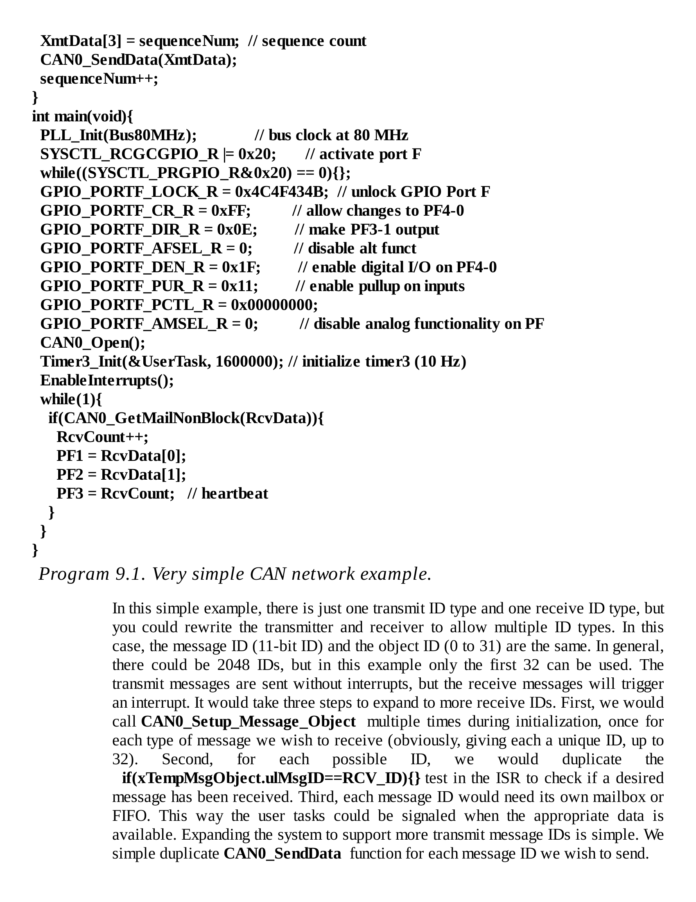
*Description*: Technical schematic and block diagram illustrating circuit operation, signal pathways, and functional behavior for Program 9.1: Very simple CAN network example..

> **Program 9.1: Very simple CAN network example.**

In this simple example, there is just one transmit ID type and one receive ID type, but
you could rewrite the transmitter and receiver to allow multiple ID types. In this
case, the message ID (11-bit ID) and the object ID (0 to 31) are the same. In general,
there could be 2048 IDs, but in this example only the first 32 can be used. The
transmit messages are sent without interrupts, but the receive messages will trigger
an interrupt. It would take three steps to expand to more receive IDs. First, we would
call CAN0_Setup_Message_Object  multiple times during initialization, once for
each type of message we wish to receive (obviously, giving each a unique ID, up to
32).
Second,
for
each
possible
ID,
we
would
duplicate
the

```c
if(xTempMsgObject.ulMsgID==RCV_ID){} test in the ISR to check if a desired
```

message has been received. Third, each message ID would need its own mailbox or
FIFO. This way the user tasks could be signaled when the appropriate data is
available. Expanding the system to support more transmit message IDs is simple. We
simple duplicate CAN0_SendData  function for each message ID we wish to send.


<!-- Page 446 -->
### [PDF Page 446]

9.3. Embedded Internet
This section provides a brief introduction to the Internet as well as present low-level
details of the Ethernet controller on a Tiva microcontroller. For an excellent
description of the TCP/IP (Transmission Control Protocol/Internet Protocol)
protocol the reader is referred to W. Richard Stevens, TCP/IP Illustrated, Volume 1:
The Protocols. For a general description of the internet of things, see Vasseur and
Dunkels, Interconnecting Smart Objects with IP. These two books provide good
overviews of network technologies used for connecting devices.
9.3.1. Abstraction
In a manner similar to ZigBee, TCP/IP packets hop from one network to another as
they travel from source to destination, see Figure 9.13. The network schedules
communication and provides routing from source to destination. Communication
channels such as USB and CAN have scheduling mechanisms to guarantee real-time
performance. In particular, USB allows for prenegotiated bandwidth, so important
data can be sent in real time. Because of the priority, important CAN messages will
have bounded latency. TCP/IP although fast and reliable has no built-in guarantees of
timing. Nevertheless, the use of TCP/IP is growing in the embedded world. Often
TCP/IP is fast enough and reliable enough for embedded applications, even if
response time is uncertain.

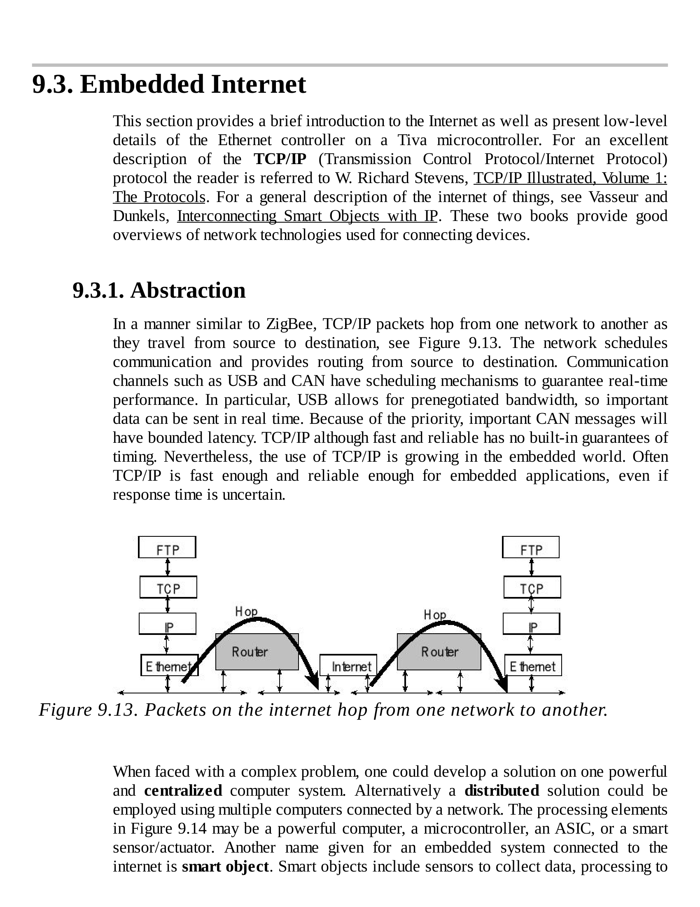
*Description*: Technical schematic and block diagram illustrating circuit operation, signal pathways, and functional behavior for Figure 9.13: Packets on the internet hop from one network to another..

> **Figure 9.13: Packets on the internet hop from one network to another.**

When faced with a complex problem, one could develop a solution on one powerful

```assembly
and centralized computer system. Alternatively a distributed solution could be
```

employed using multiple computers connected by a network. The processing elements
in Figure 9.14 may be a powerful computer, a microcontroller, an ASIC, or a smart
sensor/actuator. Another name given for an embedded system connected to the
internet is smart object. Smart objects include sensors to collect data, processing to


<!-- Page 447 -->
### [PDF Page 447]

detect events and make decisions, and actuators to manipulate the local environment.


*Description*: Reference table detailing hardware parameters, register bit patterns, performance metrics, or memory configurations for Table 9.2: lists some existing applications and the things they sense or control. There.

> **Table 9.2: lists some existing applications and the things they sense or control. There**

are many reasons to consider a distributed solution (network) over a centralized
solution. Often multiple simple microcontrollers can provide a higher performance at
lower cost compared to one computer powerful enough to run the entire system.
Some embedded applications require input/output activities that are physically
distributed. For real-time operation there may not be enough time to allow
communication between a remote sensor and a central computer. Another advantage
of distributed system is improved debugging. For example, we could use one node in
a network to monitor and debug the others. Often, we do not know the level of
complexity of our problem at design time. Similarly, over time the complexity may
increase or decrease. A distributed system can often be deployed that can be scaled.
For example, as the complexity increases more nodes can be added, and if the
complexity were to decrease nodes could be removed.
Industrial Automation
Factories, machines, shipping
Environment
Weather, pollution, public safety
Smart Grid
Electric power, energy delivery
Smart Cities
Transportation, hazards, public services
Social Networks
Ideas, politics, sales, and communication
Home Networks
Lighting, heat, security, information
Building Networks
Energy, hazards, security, maintenance
Structural Monitors Bridges, roads, building
Health Care
Heart function, medical data, remote care
Law enforcement
Crime, public safety


*Description*: Reference table detailing hardware parameters, register bit patterns, performance metrics, or memory configurations for Table 9.2: Applications of smart objects..

> **Table 9.2: Applications of smart objects.**


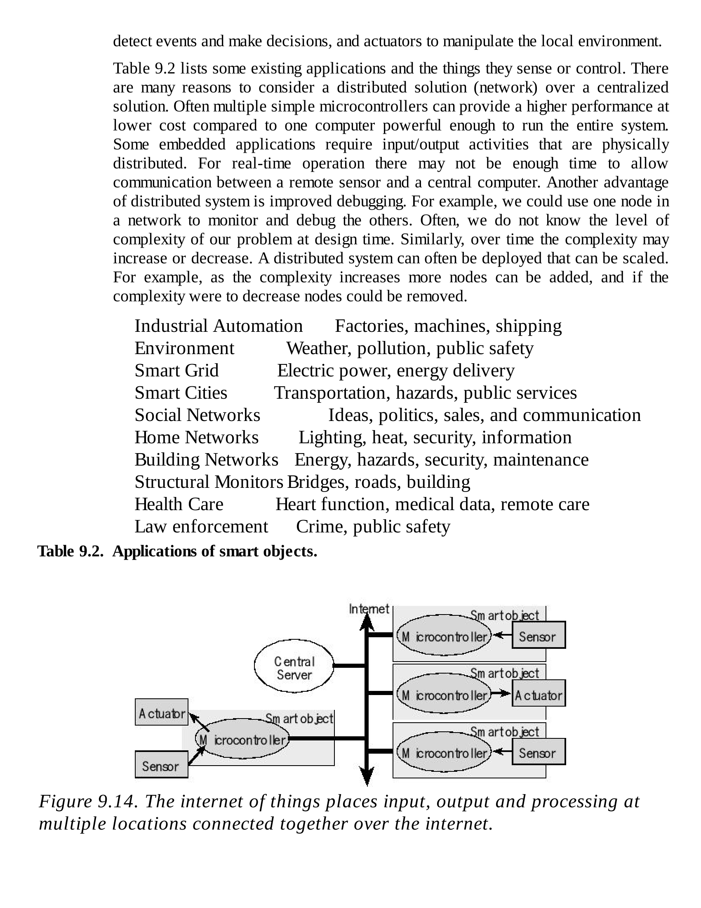
*Description*: Technical schematic and block diagram illustrating circuit operation, signal pathways, and functional behavior for Figure 9.14: The internet of things places input, output and processing at.

> **Figure 9.14: The internet of things places input, output and processing at**

multiple locations connected together over the internet.


<!-- Page 448 -->
### [PDF Page 448]

The TCP/IP model of the Internet does not adhere to such a strict layered structure,
but does recognize four broad layers: scope of the software application; the end-to-
end transport connection; the internetworking range; and the direct links as shown on
the right of Figure 9.15. Examples of applications include Telnet, FTP (File Transfer
Protocol), and SMTP (Simple Mail Transfer Protocol). Examples of transport
include TCP (Transmission Control Protocol) and UDP (User Datagram Protocol).
TCP provides reliable, ordered delivery of data from a software task on one
computer to another software task running on another computer. For applications that
do not require reliable data stream service UDP can be used. UDP provides a
datagram service that emphasizes reduced latency over reliability. Examples of
network include IP (Internet Protocol), ICMP (Internet Control Message Protocol)

```assembly
and IGMP (Internet Group Management Protocol). Ethernet is the physical link
```

explored later in this section. In this section we will develop projects at the
application layer. The communication of bits happens at the physical layer, frames at
the data link layer, packets or datagrams at the network layer, segments at the
transport layer, and messages at the application layer.

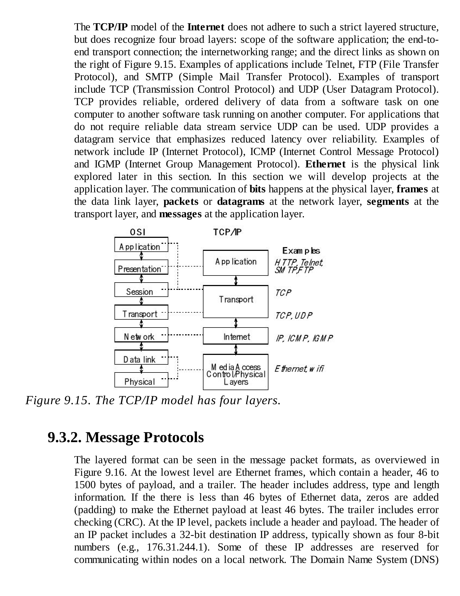
*Description*: Technical schematic and block diagram illustrating circuit operation, signal pathways, and functional behavior for Figure 9.15: The TCP/IP model has four layers..

> **Figure 9.15: The TCP/IP model has four layers.**

9.3.2. Message Protocols
The layered format can be seen in the message packet formats, as overviewed in


*Description*: Technical schematic and block diagram illustrating circuit operation, signal pathways, and functional behavior for Figure 9.16: At the lowest level are Ethernet frames, which contain a header, 46 to.

> **Figure 9.16: At the lowest level are Ethernet frames, which contain a header, 46 to**

1500 bytes of payload, and a trailer. The header includes address, type and length
information. If the there is less than 46 bytes of Ethernet data, zeros are added
(padding) to make the Ethernet payload at least 46 bytes. The trailer includes error
checking (CRC). At the IP level, packets include a header and payload. The header of
an IP packet includes a 32-bit destination IP address, typically shown as four 8-bit
numbers (e.g., 176.31.244.1). Some of these IP addresses are reserved for
communicating within nodes on a local network. The Domain Name System (DNS)


<!-- Page 449 -->
### [PDF Page 449]

host can be used to translate domain names to IP addresses. Computers that
communicate only with each other via TCP/IP, but are not connected to the Internet,
need not have globally unique IP addresses. IP addresses for private networks are
listed in Table 9.3. These IP addresses could be used for systems that use TCP/IP to
communicate, but are not connected to the internet.
Start
End
Number of
addresses
10.0.0.0
10.255.255.255
224
172.16.0.0
172.31.255.255
220
192.168.0.0
192.168.255.255
216


*Description*: Reference table detailing hardware parameters, register bit patterns, performance metrics, or memory configurations for Table 9.3: Private IP addresses..

> **Table 9.3: Private IP addresses.**

Because of the growth of the internet, the 32-bit IP address (IPv4) is being replaced
with a 128-bit address (IPv6), which will provide for about 3∙1038 addresses.

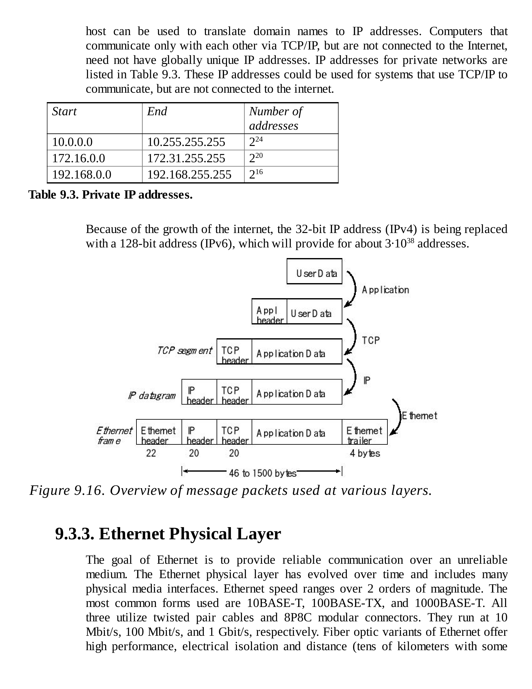
*Description*: Technical schematic and block diagram illustrating circuit operation, signal pathways, and functional behavior for Figure 9.16: Overview of message packets used at various layers..

> **Figure 9.16: Overview of message packets used at various layers.**

9.3.3. Ethernet Physical Layer
The goal of Ethernet is to provide reliable communication over an unreliable
medium. The Ethernet physical layer has evolved over time and includes many
physical media interfaces. Ethernet speed ranges over 2 orders of magnitude. The
most common forms used are 10BASE-T, 100BASE-TX, and 1000BASE-T. All
three utilize twisted pair cables and 8P8C modular connectors. They run at 10
Mbit/s, 100 Mbit/s, and 1 Gbit/s, respectively. Fiber optic variants of Ethernet offer
high performance, electrical isolation and distance (tens of kilometers with some


<!-- Page 450 -->
### [PDF Page 450]

versions). In general, network protocol stack software will work similarly on all
varieties. The left side of Figure 9.17 shows two processing elements connected with
Ethernet. The transmitter of one element is connected to the receiver of the other. If
more than two processing elements are connected to the same physical medium, then
collisions could occur. One solution to reduce collisions is to use an Ethernet switch
(right side of Figure 9.17).

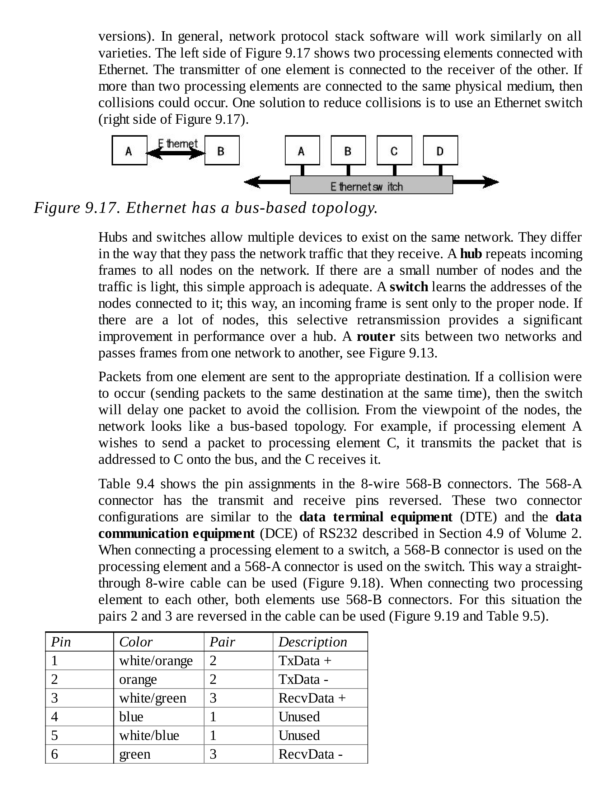
*Description*: Technical schematic and block diagram illustrating circuit operation, signal pathways, and functional behavior for Figure 9.17: Ethernet has a bus-based topology..

> **Figure 9.17: Ethernet has a bus-based topology.**

Hubs and switches allow multiple devices to exist on the same network. They differ
in the way that they pass the network traffic that they receive. A hub repeats incoming
frames to all nodes on the network. If there are a small number of nodes and the
traffic is light, this simple approach is adequate. A switch learns the addresses of the
nodes connected to it; this way, an incoming frame is sent only to the proper node. If
there are a lot of nodes, this selective retransmission provides a significant
improvement in performance over a hub. A router sits between two networks and
passes frames from one network to another, see Figure 9.13.
Packets from one element are sent to the appropriate destination. If a collision were
to occur (sending packets to the same destination at the same time), then the switch
will delay one packet to avoid the collision. From the viewpoint of the nodes, the
network looks like a bus-based topology. For example, if processing element A
wishes to send a packet to processing element C, it transmits the packet that is
addressed to C onto the bus, and the C receives it.


*Description*: Hardware pinout and board interface diagram mapping microcontroller pins, BoosterPack headers, switches, LEDs, and physical connectors for Table 9.4: shows the pin assignments in the 8-wire 568-B connectors. The 568-A.

> **Table 9.4: shows the pin assignments in the 8-wire 568-B connectors. The 568-A**

connector has the transmit and receive pins reversed. These two connector
configurations are similar to the data terminal equipment (DTE) and the data
communication equipment (DCE) of RS232 described in Section 4.9 of Volume 2.
When connecting a processing element to a switch, a 568-B connector is used on the
processing element and a 568-A connector is used on the switch. This way a straight-
through 8-wire cable can be used (Figure 9.18). When connecting two processing
element to each other, both elements use 568-B connectors. For this situation the
pairs 2 and 3 are reversed in the cable can be used (Figure 9.19 and Table 9.5).
Pin
Color
Pair
Description
1
white/orange
2
TxData +
2
orange
2
TxData -
3
white/green
3
RecvData +
4
blue
1
Unused
5
white/blue
1
Unused
6
green
3
RecvData -


<!-- Page 451 -->
### [PDF Page 451]

7
white/brown
4
Unused
8
brown
4
Unused


*Description*: Hardware pinout and board interface diagram mapping microcontroller pins, BoosterPack headers, switches, LEDs, and physical connectors for Table 9.4: Pin assignments on a 568-B Ethernet connector..

> **Table 9.4: Pin assignments on a 568-B Ethernet connector.**


*Description*: Technical schematic and block diagram illustrating circuit operation, signal pathways, and functional behavior for Figure 9.18: Ethernet cable between a microcontroller and a switch..

> **Figure 9.18: Ethernet cable between a microcontroller and a switch.**


*Description*: Technical schematic and block diagram illustrating circuit operation, signal pathways, and functional behavior for Figure 9.19: Ethernet cable between two microcontrollers..

> **Figure 9.19: Ethernet cable between two microcontrollers.**

Pin Left color
Left
signal
Cable
Right color
Right signal
1
white/orange TxData +
white/green
TxData +
2
orange
TxData -
green
TxData -
3
white/green
RecvData
+
white/orange
RecvData +
4
blue
Unused
blue
Unused
5
white/blue
Unused
white/blue
Unused
6
green
RecvData
-
orange
RecvData -
7
white/brown
Unused
white/brown
Unused
8
brown
Unused
brown
Unused

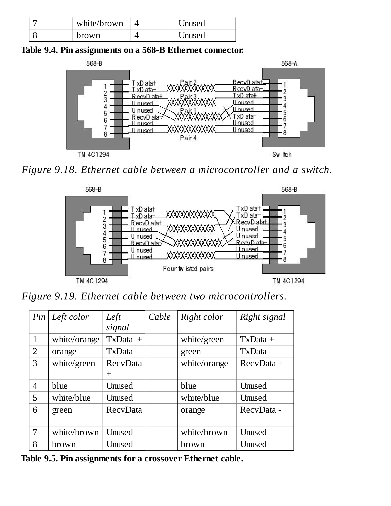
*Description*: Hardware pinout and board interface diagram mapping microcontroller pins, BoosterPack headers, switches, LEDs, and physical connectors for Table 9.5: Pin assignments for a crossover Ethernet cable..

> **Table 9.5: Pin assignments for a crossover Ethernet cable.**


<!-- Page 452 -->
### [PDF Page 452]

9.3.4. Ethernet on the TM4C1294
The Ethernet Controller consists of a fully integrated media access controller (MAC)

```assembly
and network physical (PHY) interface. The Ethernet Controller conforms to
```

IEEE802.3 specifications and fully supports 10BASE-T and 100BASE-TX
standards. To fully understand this section, you must read the TM4C1294 datasheet.
In other words, this section is meant to supplement, rather than replace the datasheet.
As shown in Figure 9.20, the Ethernet Controller is functionally divided into two
layers: the Media Access Controller (MAC) layer and the Network Physical (PHY)
layer. These layers correspond to the OSI model layers 2 and 1. The microcontroller
accesses the Ethernet Controller via the MAC layer. The MAC layer provides
transmit and receive processing for Ethernet frames. The MAC layer also provides
the interface to the PHY layer via an internal Media Independent Interface (MII). The
PHY layer communicates with the Ethernet bus.


*Description*: Technical schematic and block diagram illustrating circuit operation, signal pathways, and functional behavior for Figure 9.20: The Ethernet port on the microcontroller implements the MAC.

> **Figure 9.20: The Ethernet port on the microcontroller implements the MAC**


```assembly
and PHY layers.
```


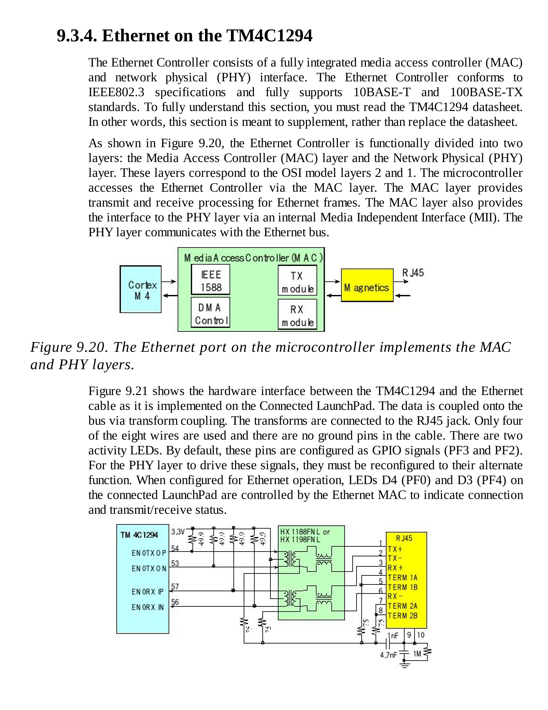
*Description*: Hardware pinout and board interface diagram mapping microcontroller pins, BoosterPack headers, switches, LEDs, and physical connectors for Figure 9.21: shows the hardware interface between the TM4C1294 and the Ethernet.

> **Figure 9.21: shows the hardware interface between the TM4C1294 and the Ethernet**

cable as it is implemented on the Connected LaunchPad. The data is coupled onto the
bus via transform coupling. The transforms are connected to the RJ45 jack. Only four
of the eight wires are used and there are no ground pins in the cable. There are two
activity LEDs. By default, these pins are configured as GPIO signals (PF3 and PF2).
For the PHY layer to drive these signals, they must be reconfigured to their alternate
function. When configured for Ethernet operation, LEDs D4 (PF0) and D3 (PF4) on
the connected LaunchPad are controlled by the Ethernet MAC to indicate connection

```assembly
and transmit/receive status.
```


<!-- Page 453 -->
### [PDF Page 453]


*Description*: Hardware pinout and board interface diagram mapping microcontroller pins, BoosterPack headers, switches, LEDs, and physical connectors for Figure 9.21: Electrical interface between the microcontroller and the.

> **Figure 9.21: Electrical interface between the microcontroller and the**

Ethernet cable.
An Ethernet data packet is called a frame (Figure 9.22). A frame begins with
preamble and start frame delimiter, followed by an Ethernet header featuring
destination and source MAC addresses. Whether the Length/Type field is a length or
a type depends on the numeric value. If the value of the Length/Type field is less than
or equal to 1500 decimal, it indicates the number of MAC client data bytes. If the
value of this field is greater than or equal to 1536 decimal, then it is type
interpretation. The meaning of this field when the value is between 1500 and 1536
decimal is unspecified. The middle section of the frame consists of payload data
including any headers for other protocols (e.g., Internet Protocol) carried in the
frame. The minimum frame size is 46 bytes. If the frame size is too small, the Ethernet
Controller automatically appends extra bytes (a pad) to make it at least 46 bytes. The
frame ends with a frame check sequence (FCS) is a 32-bit cyclic redundancy check
(CRC), which is used to detect corruption of data in transit. The CRC is computed
over the destination address, source address, length/type, and data (including pad)
fields using the CRC-32 algorithm. For transmitted frames, this field is automatically
inserted by the MAC layer, unless disabled by clearing the CRC bit in the
MACTCTL register. For received frames, this field is automatically checked. If the
FCS does not pass, the frame is not placed in the RX FIFO, unless the FCS check is
disabled by clearing the BADCRC bit in the MACRCTL register.

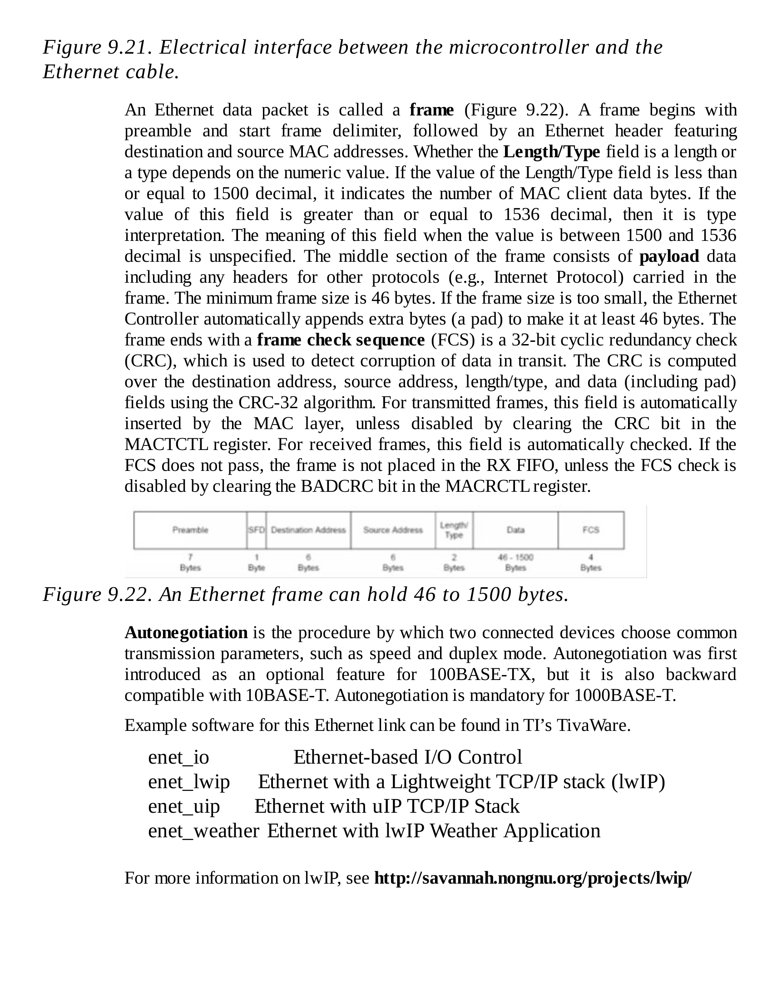
*Description*: Technical schematic and block diagram illustrating circuit operation, signal pathways, and functional behavior for Figure 9.22: An Ethernet frame can hold 46 to 1500 bytes..

> **Figure 9.22: An Ethernet frame can hold 46 to 1500 bytes.**

Autonegotiation is the procedure by which two connected devices choose common
transmission parameters, such as speed and duplex mode. Autonegotiation was first
introduced as an optional feature for 100BASE-TX, but it is also backward
compatible with 10BASE-T. Autonegotiation is mandatory for 1000BASE-T.
Example software for this Ethernet link can be found in TI’s TivaWare.
enet_io
Ethernet-based I/O Control
enet_lwip
Ethernet with a Lightweight TCP/IP stack (lwIP)
enet_uip
Ethernet with uIP TCP/IP Stack
enet_weather Ethernet with lwIP Weather Application
For more information on lwIP, see http://savannah.nongnu.org/projects/lwip/


<!-- Page 454 -->
### [PDF Page 454]

9.4. Internet of Things
9.4.1. Basic Concepts
With the proliferation of embedded systems and the pervasiveness of the internet, it is
only natural to connect the two. The internet of things (IoT) is the combination of
embedded systems, which have sensors to collect data and actuators to affect the
surrounding, and the internet, which provides for ubiquitous remote and secure
communication. This section will not describe how the internet works, but rather we
will discuss both the general and specific approaches for connecting embedded
systems to the internet.  (References for internet in general and IoT in specific see:
W. Richard Stevens, TCP/IP Illustrated, Volume 1: The Protocols and Vasseur and
Dunkels, Interconnecting Smart Objects with IP).
Challenges. On a local scale, the design of smart objects faces the same challenges
existing in all embedded systems: power, size, reliability, longevity, and cost.
Luckily the deployment of billions of microcontrollers into the market has created a
technology race to reduce power, size and cost while increasing the performance. At
the microcontroller level things are getting smaller, but at the network level,
complexity is increasing and protocols are constantly changing as the world’s thirst
for information and communication rapidly grows.
Standardization. The existence of standards allows for a wide variety of objects to
communicate with each other. Adhering to a standard will increase the acceptance of
our device by customers, and allow our customers to apply our device to solve
problems we never envisioned. uIP is a light-weight implementation of the IP stack
specifically designed to operate with the available memory resources of smart
objects. In this section we will start with a microcontroller with the hardware and
software to implement TCP/IP protocols, and build our application on top of this
standard.
Interoperability means our device can function with a wide range of other devices
made with different technologies, sold by different vendors, and produced by
different companies.
Evolution is the process of how new technologies are introduced into the market. If
there is one constant in this world, it is that things will change. Every thousand years,
one big discovery fundamentally changes how we operate (fire, language, metal
tools). More frequently, change is introduced gradually such that those technologies
that give us a competitive advantage survive. If we build our business model on the
premise evolutionary change, then we can be nimble to deploy new technology when
it provides lower cost and/or better performance.


<!-- Page 455 -->
### [PDF Page 455]

Stability. Even though technology will advance, our customers demand products that
work reliably, for a long time, and in a manner with which they are comfortable.
Over the last 50 years, automotive technology has drastically improved, but the
driving experience, how we drive, has remained almost constant.
Abstraction. You will notice the approach in this section differs widely from the
other examples in this book. The rest of the book deploys a bottom up approach. With
bottom-up education, the details are first explained, so there is no magic, and then
abstraction occurs by encapsulating that we fully understand. In this section we will
purchase hardware and software with capabilities to communicate with the internet,

```assembly
and use this abstraction without fully understanding how some of the lower levels
```

operate.
Scalability. ARM reports over 50 million devices with an ARM core have been
shipped from 1993 to 2013, and predicts another 50 billion before the end of this
decade. In order to be effective and profitable, we need to develop systems that can
scale.
Security. Because embedded systems are deployed in life-critical situations, and
because the quality of service affect our profits, we must protect the system from a
determined adversary. A chain is only as strong as its weakest link. Security cannot
be obtained simply by operating in secret, because once the secret is out, the system
will be extremely vulnerable. “Security by obscurity” is a very poor design method.
Security involves more than encrypting the data. The first aspect of security is
confidentiality. We must decide what it means to view/change the data and who has
the right to read/write. Authentication is the means to ensure the identity of the sender
is correct. Confidentiality will require both logical and physical measures to protect
against an attack. Encryption makes it harder for an unauthorized party to view a
message. The second aspect is data integrity. For most of the applications listed in

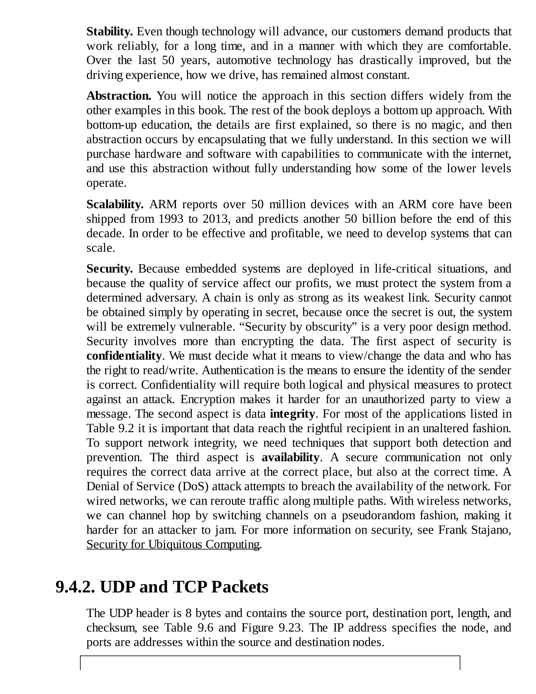
*Description*: Reference table detailing hardware parameters, register bit patterns, performance metrics, or memory configurations for Table 9.2: it is important that data reach the rightful recipient in an unaltered fashion..

> **Table 9.2: it is important that data reach the rightful recipient in an unaltered fashion.**

To support network integrity, we need techniques that support both detection and
prevention. The third aspect is availability. A secure communication not only
requires the correct data arrive at the correct place, but also at the correct time. A
Denial of Service (DoS) attack attempts to breach the availability of the network. For
wired networks, we can reroute traffic along multiple paths. With wireless networks,
we can channel hop by switching channels on a pseudorandom fashion, making it
harder for an attacker to jam. For more information on security, see Frank Stajano,
Security for Ubiquitous Computing.
9.4.2. UDP and TCP Packets
The UDP header is 8 bytes and contains the source port, destination port, length, and
checksum, see Table 9.6 and Figure 9.23. The IP address specifies the node, and
ports are addresses within the source and destination nodes.


<!-- Page 456 -->
### [PDF Page 456]

Source port: 16-bit number of the process that sent the packet,
could be zero
Destination port: 16-bit number of the process to receive the
packet.
Length: 16-bit number specifying the size in bytes of the data to
follow
Checksum: 16-bit modulo addition of all data, UDP header,

```assembly
and IP header
```


*Description*: Reference table detailing hardware parameters, register bit patterns, performance metrics, or memory configurations for Table 9.6: UDP header format..

> **Table 9.6: UDP header format.**

The TCP header is 20 bytes with the possibility of additional and optional
information, see Table 9.7. The sequence and acknowledgment numbers allow the
receiver to properly sort segments of data that were received out of order. The flags
specify different modes of the TCP communication. The SYN flag means the first of a
sequence of packets, and the FIN flag means the last. The RST flag terminates a
connection. The URG flag means the urgent pointer specifies a piece of data the
application urgently needs.

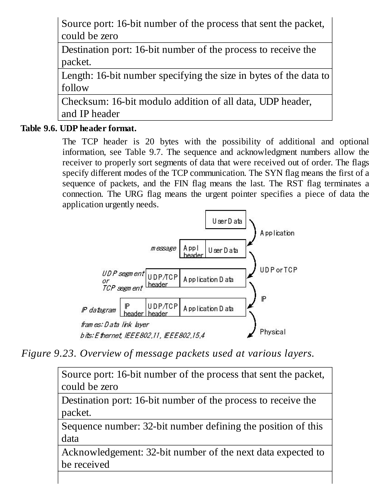
*Description*: Technical schematic and block diagram illustrating circuit operation, signal pathways, and functional behavior for Figure 9.23: Overview of message packets used at various layers..

> **Figure 9.23: Overview of message packets used at various layers.**

Source port: 16-bit number of the process that sent the packet,
could be zero
Destination port: 16-bit number of the process to receive the
packet.
Sequence number: 32-bit number defining the position of this
data
Acknowledgement: 32-bit number of the next data expected to
be received


<!-- Page 457 -->
### [PDF Page 457]

Hlen: 4-bit field of the header size (including options) divided
by 4
Flags: 6-bit field with FIN, SYN, RST, PSH, ACK, and URG
Window: 16-bit number specifying the number of bytes the
receiver can accept
Checksum: 16-bit modulo addition of all data, TCP header, and
IP header
Urgent pointer: 16-bit field pointing to a place in the stream
urgently needed

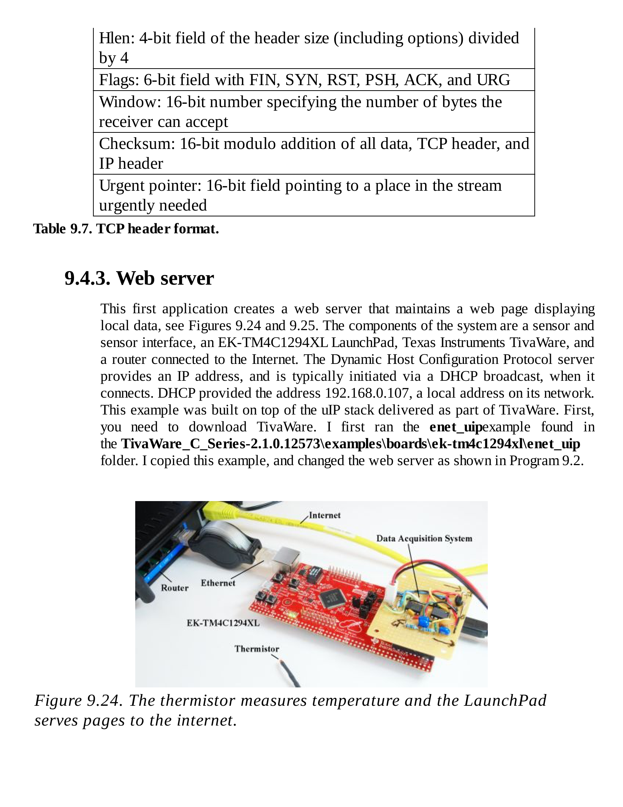
*Description*: Reference table detailing hardware parameters, register bit patterns, performance metrics, or memory configurations for Table 9.7: TCP header format..

> **Table 9.7: TCP header format.**

9.4.3. Web server
This first application creates a web server that maintains a web page displaying
local data, see Figures 9.24 and 9.25. The components of the system are a sensor and
sensor interface, an EK-TM4C1294XL LaunchPad, Texas Instruments TivaWare, and
a router connected to the Internet. The Dynamic Host Configuration Protocol server
provides an IP address, and is typically initiated via a DHCP broadcast, when it
connects. DHCP provided the address 192.168.0.107, a local address on its network.
This example was built on top of the uIP stack delivered as part of TivaWare. First,
you need to download TivaWare. I first ran the enet_uipexample found in
the TivaWare_C_Series-2.1.0.12573\examples\boards\ek-tm4c1294xl\enet_uip
folder. I copied this example, and changed the web server as shown in Program 9.2.


*Description*: Hardware pinout and board interface diagram mapping microcontroller pins, BoosterPack headers, switches, LEDs, and physical connectors for Figure 9.24: The thermistor measures temperature and the LaunchPad.

> **Figure 9.24: The thermistor measures temperature and the LaunchPad**

serves pages to the internet.


<!-- Page 458 -->
### [PDF Page 458]


*Description*: Hardware pinout and board interface diagram mapping microcontroller pins, BoosterPack headers, switches, LEDs, and physical connectors for Figure 9.25: The thermistor measures temperature and the LaunchPad.

> **Figure 9.25: The thermistor measures temperature and the LaunchPad**

serves pages to the internet.

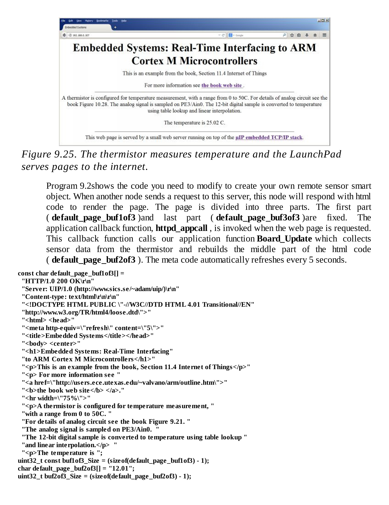
*Description*: Technical schematic and block diagram illustrating circuit operation, signal pathways, and functional behavior for Program 9.2: shows the code you need to modify to create your own remote sensor smart.

> **Program 9.2: shows the code you need to modify to create your own remote sensor smart**

object. When another node sends a request to this server, this node will respond with html
code to render the page. The page is divided into three parts. The first part
( default_page_buf1of3 )and
last
part
( default_page_buf3of3 )are
fixed.
The
application callback function, httpd_appcall , is invoked when the web page is requested.
This callback function calls our application function Board_Update which collects
sensor data from the thermistor and rebuilds the middle part of the html code
( default_page_buf2of3 ). The meta code automatically refreshes every 5 seconds.
const char default_page_buf1of3[] =
"HTTP/1.0 200 OK\r\n"
"Server: UIP/1.0 (http://www.sics.se/~adam/uip/)\r\n"
"Content-type: text/html\r\n\r\n"
"<!DOCTYPE HTML PUBLIC \"-//W3C//DTD HTML 4.01 Transitional//EN"
"http://www.w3.org/TR/html4/loose.dtd\">"
"<html> <head>"
"<meta http-equiv=\"refresh\" content=\"5\">"
"<title>Embedded Systems</title></head>"
"<body> <center>"
"<h1>Embedded Systems: Real-Time Interfacing"
"to ARM Cortex M Microcontrollers</h1>"
"<p>This is an example from the book, Section 11.4 Internet of Things</p>"
"<p> For more information see "
"<a href=\"http://users.ece.utexas.edu/~valvano/arm/outline.htm\">"
"<b>the book web site</b> </a>."
"<hr width=\"75%\">"
"<p>A thermistor is configured for temperature measurement, "
"with a range from 0 to 50C. "
"For details of analog circuit see the book Figure 9.21. "
"The analog signal is sampled on PE3/Ain0.  "
"The 12-bit digital sample is converted to temperature using table lookup "
"and linear interpolation.</p>  "
"<p>The temperature is ";

```c
uint32_t const buf1of3_Size = (sizeof(default_page_buf1of3) - 1);
char default_page_buf2of3[] = "12.01";
uint32_t buf2of3_Size = (sizeof(default_page_buf2of3) - 1);
```


<!-- Page 459 -->
### [PDF Page 459]

const char default_page_buf3of3[] =
" C.</p>"
"<hr width=\"75%\">"
"<p>This web page is served by a small web server running on top of "
"the <a href=\"http://www.sics.se/~adam/uip/\"><b>&micro;IP embedded TCP/IP "
"stack</b></a>.</center> </body> </html>";

```c
uint32_t const buf3of3_Size = (sizeof(default_page_buf3of3) - 1);
void Board_Update(void){uint32_t data,temperature;
data = ADC0_InSeq3();                      // 12-bit ADC, 0 to 4095
temperature = ADC2Temperature(data);       // temperature, 0.01C
Fix2Str(temperature,default_page_buf2of3); // 5 ASCII characters
buf2of3_Size = 5; // in this case it is fixed size (but it could vary)
}
```


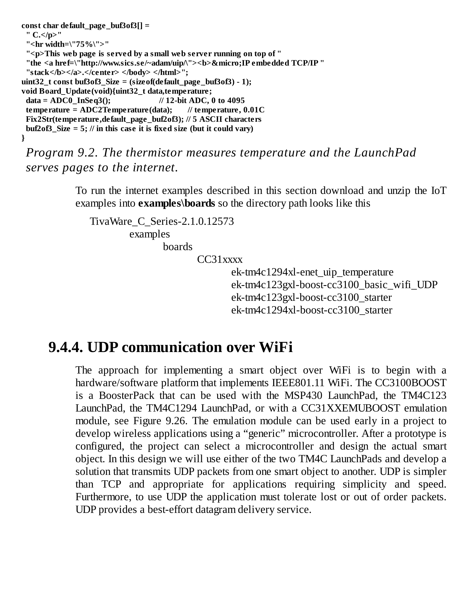
*Description*: Hardware pinout and board interface diagram mapping microcontroller pins, BoosterPack headers, switches, LEDs, and physical connectors for Program 9.2: The thermistor measures temperature and the LaunchPad.

> **Program 9.2: The thermistor measures temperature and the LaunchPad**

serves pages to the internet.
To run the internet examples described in this section download and unzip the IoT
examples into examples\boards so the directory path looks like this
TivaWare_C_Series-2.1.0.12573
examples
boards
CC31xxxx
ek-tm4c1294xl-enet_uip_temperature
ek-tm4c123gxl-boost-cc3100_basic_wifi_UDP
ek-tm4c123gxl-boost-cc3100_starter
ek-tm4c1294xl-boost-cc3100_starter
9.4.4. UDP communication over WiFi
The approach for implementing a smart object over WiFi is to begin with a
hardware/software platform that implements IEEE801.11 WiFi. The CC3100BOOST
is a BoosterPack that can be used with the MSP430 LaunchPad, the TM4C123
LaunchPad, the TM4C1294 LaunchPad, or with a CC31XXEMUBOOST emulation
module, see Figure 9.26. The emulation module can be used early in a project to
develop wireless applications using a “generic” microcontroller. After a prototype is
configured, the project can select a microcontroller and design the actual smart
object. In this design we will use either of the two TM4C LaunchPads and develop a
solution that transmits UDP packets from one smart object to another. UDP is simpler
than TCP and appropriate for applications requiring simplicity and speed.
Furthermore, to use UDP the application must tolerate lost or out of order packets.
UDP provides a best-effort datagram delivery service.


<!-- Page 460 -->
### [PDF Page 460]


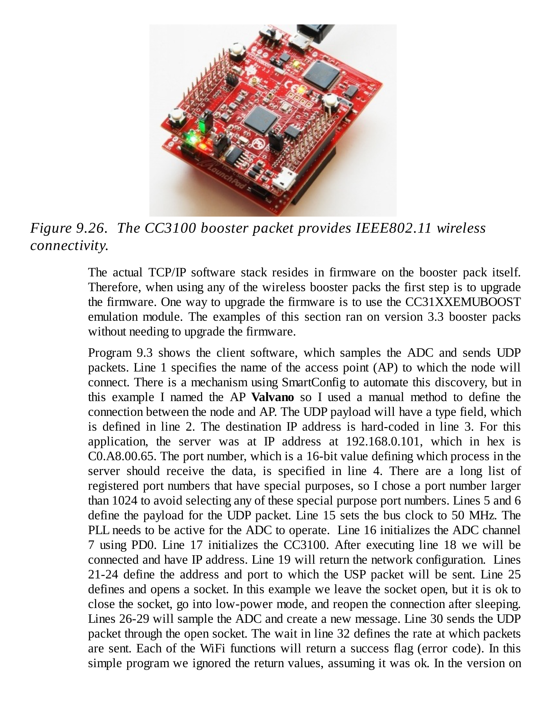
*Description*: Technical schematic and block diagram illustrating circuit operation, signal pathways, and functional behavior for Figure 9.26: The CC3100 booster packet provides IEEE802.11 wireless.

> **Figure 9.26: The CC3100 booster packet provides IEEE802.11 wireless**

connectivity.
The actual TCP/IP software stack resides in firmware on the booster pack itself.
Therefore, when using any of the wireless booster packs the first step is to upgrade
the firmware. One way to upgrade the firmware is to use the CC31XXEMUBOOST
emulation module. The examples of this section ran on version 3.3 booster packs
without needing to upgrade the firmware.


*Description*: Technical schematic and block diagram illustrating circuit operation, signal pathways, and functional behavior for Program 9.3: shows the client software, which samples the ADC and sends UDP.

> **Program 9.3: shows the client software, which samples the ADC and sends UDP**

packets. Line 1 specifies the name of the access point (AP) to which the node will
connect. There is a mechanism using SmartConfig to automate this discovery, but in
this example I named the AP Valvano so I used a manual method to define the
connection between the node and AP. The UDP payload will have a type field, which
is defined in line 2. The destination IP address is hard-coded in line 3. For this
application, the server was at IP address at 192.168.0.101, which in hex is
C0.A8.00.65. The port number, which is a 16-bit value defining which process in the
server should receive the data, is specified in line 4. There are a long list of
registered port numbers that have special purposes, so I chose a port number larger
than 1024 to avoid selecting any of these special purpose port numbers. Lines 5 and 6
define the payload for the UDP packet. Line 15 sets the bus clock to 50 MHz. The
PLL needs to be active for the ADC to operate.  Line 16 initializes the ADC channel
7 using PD0. Line 17 initializes the CC3100. After executing line 18 we will be
connected and have IP address. Line 19 will return the network configuration.  Lines
21-24 define the address and port to which the USP packet will be sent. Line 25
defines and opens a socket. In this example we leave the socket open, but it is ok to
close the socket, go into low-power mode, and reopen the connection after sleeping.
Lines 26-29 will sample the ADC and create a new message. Line 30 sends the UDP
packet through the open socket. The wait in line 32 defines the rate at which packets
are sent. Each of the WiFi functions will return a success flag (error code). In this
simple program we ignored the return values, assuming it was ok. In the version on


<!-- Page 461 -->
### [PDF Page 461]

the web, the process is restarted on error.
#define SSID_NAME   "Valvano"   // AP to connect to                1
#define ATYPE       'a'         // analog data type                2
#define IP_ADDR     0xC0A80065  // server IP                       3
#define PORT_NUM    5001        // Port number to be used          4
#define BUF_SIZE    12          //                                 5
UINT8 uBuf[BUF_SIZE];           // UDP packet payload              6
int main(void){
UINT8             IsDHCP = 0;
_NetCfgIpV4Args_t ipV4;
SlSockAddrIn_t    Addr;
UINT16            AddrSize = 0;
INT16             SockID = 0;
UINT32            data;
unsigned char     len = sizeof(_NetCfgIpV4Args_t);
initClk();         // PLL 50 MHz, ADC needs PPL active          15
ADC0_InitSWTriggerSeq3(7);  // Ain7 is on PD0                   16
sl_Start(0, 0, 0); // Initializing the CC3100 device            17
WlanConnect();     // connect to AP                             18
sl_NetCfgGet(SL_IPV4_STA_P2P_CL_GET_INFO,&IsDHCP,&len,       // 19
(unsigned char *)&ipV4);                        // 20
Addr.sin_family = SL_AF_INET;                       //          21
Addr.sin_port = sl_Htons((UINT16)PORT_NUM);         //          22
Addr.sin_addr.s_addr = sl_Htonl((UINT32)IP_ADDR);   //          23
AddrSize = sizeof(SlSockAddrIn_t);                  //          24
SockID = sl_Socket(SL_AF_INET,SL_SOCK_DGRAM, 0);    //          25

```c
while(1){
uBuf[0] = ATYPE;      // analog data type                     26
uBuf[1] = '=';        //                                      27
data = ADC0_InSeq3(); // 0 to 4095, Ain7 is on PD0            28
Int2Str(data,(char*)&uBuf[2]); // 6 digit number              29
```

sl_SendTo(SockID, uBuf, BUF_SIZE, 0,        //                30
(SlSockAddr_t *)&Addr, AddrSize); //     31
ROM_SysCtlDelay(ROM_SysCtlClockGet() / 25); // 40ms           32
}
}


*Description*: Technical schematic and block diagram illustrating circuit operation, signal pathways, and functional behavior for Program 9.3: Client software that measures ADC data and sends UDP.

> **Program 9.3: Client software that measures ADC data and sends UDP**

packets.

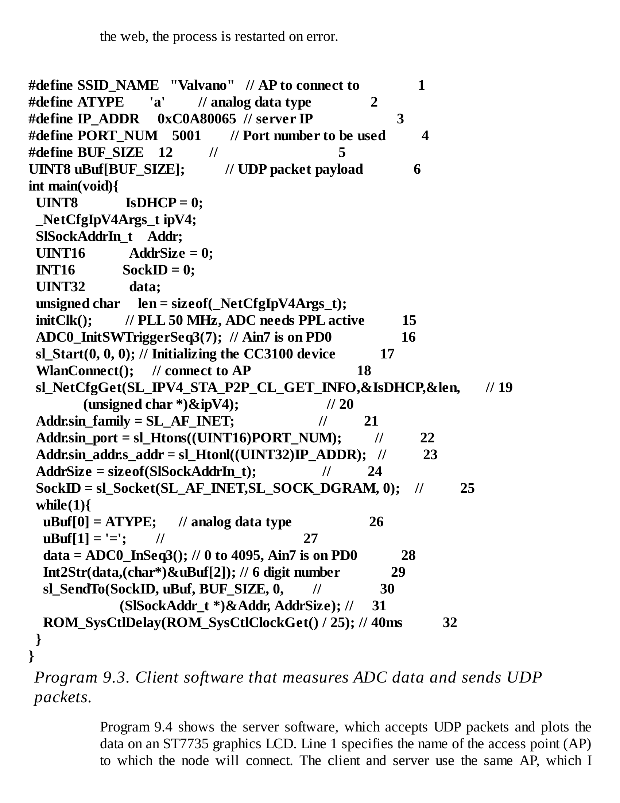
*Description*: Technical schematic and block diagram illustrating circuit operation, signal pathways, and functional behavior for Program 9.4: shows the server software, which accepts UDP packets and plots the.

> **Program 9.4: shows the server software, which accepts UDP packets and plots the**

data on an ST7735 graphics LCD. Line 1 specifies the name of the access point (AP)
to which the node will connect. The client and server use the same AP, which I


<!-- Page 462 -->
### [PDF Page 462]

named Valvano, so I used the manual method to define the connection between the
node and AP. The UDP payload will have a type field, which is defined in line 2.
Lines 16, 22-25 configure the WiFi connection in a similar way as the client. Lines
17-20 initialize the ST7735 LCD and output a welcome message. Line 21 configures
the LCD graphics routines specifying the range on the y-axis of the plot. Raw ADC
data will be plotted versus time. Lines 26-29 define an IP address and port to use.
Line 31 defines and opens a socket, and lines 32-33 bind the port to that socket. Lines
34-35 receive a UDP packet. Just like the client, we leave the socket open. If we
wished to save power, we could close the socket, go into low-power mode, and
reopen the connection after sleeping. Lines 36-51 decode the packet and plot the data
on the LCD.
#define SSID_NAME   "Valvano"   // AP to connect to                1
#define ATYPE       'a'         // analog data type                2
#define IP_ADDR     0xC0A80065  // server IP                       3
#define PORT_NUM    5001        // Port number to be used          4
#define BUF_SIZE    12          //                                 5
UINT8 uBuf[BUF_SIZE];           // UDP packet payload              6
int main(void){
UINT8             IsDHCP = 0;
_NetCfgIpV4Args_t ipV4;
SlSockAddrIn_t    Addr, LocalAddr;
UINT16            AddrSize = 0;
INT16             SockID = 0;
INT16             Status = 1;  // ok
UINT32            data;
unsigned char     len = sizeof(_NetCfgIpV4Args_t);
initClk();        // PLL 50 MHz, ADC needs PPL active           16
ST7735_InitR(INITR_REDTAB);                  // Initialize      17
ST7735_OutString("Internet of Things\n");    //                 18
ST7735_OutString("Embedded Systems\n");      //                 19
ST7735_OutString("Vol. 2, Valvano");         //                 20
ST7735_PlotClear(0,4095);  // range from 0 to 4095              21
sl_Start(0, 0, 0); // Initializing the CC3100 device            22
WlanConnect();     // connect to AP                             23
sl_NetCfgGet(SL_IPV4_STA_P2P_CL_GET_INFO,&IsDHCP,&len,   //     24
(unsigned char *)&ipV4);                    //     25
LocalAddr.sin_family = SL_AF_INET;                       //     26
LocalAddr.sin_port = sl_Htons((UINT16)PORT_NUM);         //     27
LocalAddr.sin_addr.s_addr = 0;                           //     28
AddrSize = sizeof(SlSockAddrIn_t);                       //     29

```c
while(1){
SockID = sl_Socket(SL_AF_INET,SL_SOCK_DGRAM, 0);       //     31
Status = sl_Bind(SockID, (SlSockAddr_t *)&LocalAddr,   //     32
AddrSize);                          //     33
```


<!-- Page 463 -->
### [PDF Page 463]

Status = sl_RecvFrom(SockID, uBuf, BUF_SIZE, 0,        //     34
(SlSockAddr_t *)&Addr, (SlSocklen_t*)&AddrSize );//     35

```c
if((uBuf[0]==ATYPE)&&(uBuf[1]== '=')){                 //     36
int i,bOk; uint32_t place;                           //     37
data = 0; bOk = 1;                                   //     38
i=4;  // ignore possible negative sign                      39
for(place = 1000; place; place = place/10){          //     40
if((uBuf[i]&0xF0)==0x30){ // ignore spaces                41
data += place*(uBuf[i]-0x30);                    //     42
}else{                                             //     43
if((uBuf[i]&0xF0)!= ' '){                        //     44
bOk = 0;                                       //     45
}                                                //     46
}                                                  //     47
i++;                                               //     48
}                                                    //     49
if(bOk){                                             //     50
ST7735_PlotLine(data);                             //     51
ST7735_PlotNextErase();                            //     51
}
}
}
}
```


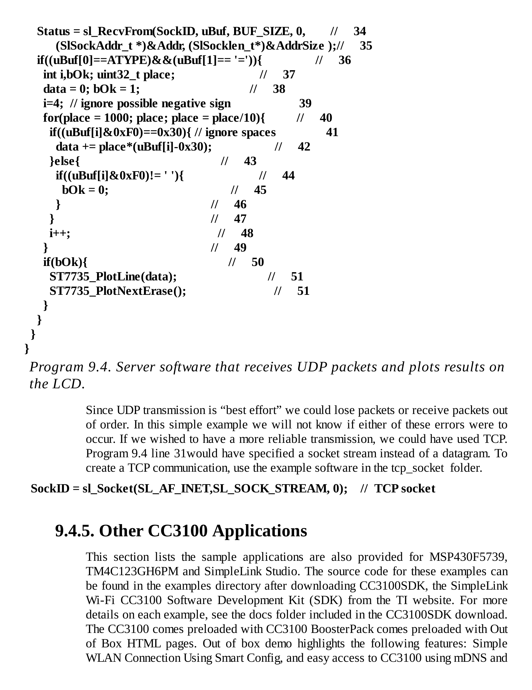
*Description*: Technical schematic and block diagram illustrating circuit operation, signal pathways, and functional behavior for Program 9.4: Server software that receives UDP packets and plots results on.

> **Program 9.4: Server software that receives UDP packets and plots results on**

the LCD.
Since UDP transmission is “best effort” we could lose packets or receive packets out
of order. In this simple example we will not know if either of these errors were to
occur. If we wished to have a more reliable transmission, we could have used TCP.


*Description*: Technical schematic and block diagram illustrating circuit operation, signal pathways, and functional behavior for Program 9.4: line 31would have specified a socket stream instead of a datagram. To.

> **Program 9.4: line 31would have specified a socket stream instead of a datagram. To**

create a TCP communication, use the example software in the tcp_socket  folder.
SockID = sl_Socket(SL_AF_INET,SL_SOCK_STREAM, 0);    //  TCP socket
9.4.5. Other CC3100 Applications
This section lists the sample applications are also provided for MSP430F5739,
TM4C123GH6PM and SimpleLink Studio. The source code for these examples can
be found in the examples directory after downloading CC3100SDK, the SimpleLink
Wi-Fi CC3100 Software Development Kit (SDK) from the TI website. For more
details on each example, see the docs folder included in the CC3100SDK download.
The CC3100 comes preloaded with CC3100 BoosterPack comes preloaded with Out
of Box HTML pages. Out of box demo highlights the following features: Simple
WLAN Connection Using Smart Config, and easy access to CC3100 using mDNS and


<!-- Page 464 -->
### [PDF Page 464]

HTTP Server.
Antenna Selection. This is a reference implementation for antenna-selection scheme
running on the host MCU, to enable improved radio performance inside buildings
Connection Policies. This application demonstrates the usage of the CC3100
profiles and connection-policies.
Send Email. This application sends an email using SMTP to a user-configurable
email address at the push of a button.
Enterprise Network Connection. This application demonstrates the procedure for
connecting the CC3100 to an enterprise network.
File Download. This application demonstrates file download from a cloud server to
the on board serial Flash.
File System. This application demonstrates the use of the file system API to read and
write files from the serial Flash.
Get Time. This application connects to an SNTP cloud server and receives the
accurate time.
Get Weather. This application connects to ‘Open Weather Map’ cloud service and
receives weather data.
Getting Started in AP Mode. This application configures the CC3100 in AP mode.
It verifies the connection by pinging the connected client.
Getting Started in Station Mode. This application configures the CC3100 in STA
mode. It verifies the connection by pinging the connected Access Point.
HTTP Server. This application demonstrates using the on-chip HTTP Server APIs to
enable static and dynamic web page content.
IP Configuration. This application demonstrates how to enable static IP
configuration instead of using DHCP.
mDNS. This application registers the mDNS service for broadcasting and attempts to
get the service by the name broadcasted by another device.
Mode Configuration. This application demonstrates switching between STA and AP
modes.
NWP Filters. This application demonstrates the configuration of Rx-filtering to
reduce the amount of traffic transferred to the host, and to achieve lower power
consumption.
NWP Power Policy. This application shows how to enable different power policies
to reduce power consumption based on use case in the station mode.
P2P (Wi-Fi Direct). This application configures the device in P2P (Wi-Fi Direct)
mode and demonstrates how to communicate with a remote peer device.


<!-- Page 465 -->
### [PDF Page 465]

Provisioning AP. This application demonstrates the use of the on Chip HTTP server
for Wi-Fi provisioning in AP Mode, building upon example application 7.8 above.
Provisioning with SmartConfig. This application demonstrates the usage of TI's
SmartConfig™ Wi-Fi provisioning technology. The Wi-Fi Starter Application for
iOS and Android is required to use this application. It can be downloaded from
following link: http://www.ti.com/tool/wifistarter or from the Apple App store and
Google Play.
Provisioning with WPS. This application demonstrates the usage of WPS Wi-Fi
provisioning with CC3100.
Scan Policy. The application demonstrates the scan-policy settings in CC3100.
SPI Diagnostics Tool. This is a diagnostics application for troubleshooting the host
SPI configuration.
SSL/TLS. The application demonstrates the usage of certificates with SSL/TLS for
application traffic privacy and device or user authentication
TCP Socket. The application demonstrates simple connection with TCP traffic.
Transceiver Mode. The application demonstrates the CC3100 transceiver mode of
operation.
UDP Socket. The application demonstrates simple connection with UDP traffic.
XMPP Client. The application demonstrates instant messaging using a cloud based
XMPP server.
These were the steps I used to create the UDP communication example. I began with
the
starter
application, ek-tm4c123gxl-boost-cc3100_starter .
I
first
changed SSID_NAME  to match our access point
#define SSID_NAME   "Valvano"   // AP to connect to
Next, I compiled, downloaded and ran this application onto two LaunchPad+CC3100
systems, observing the operating on PuTTy. The interpreter output should show it has
connected and shows the IP assigned to these two nodes by the AP. I could run the
ping command to check the WiFi connection to my AP.
Once I was sure my two LaunchPad+CC3100 systems could communicate with my
AP, I made a copy of the starter application by copy-pasting the entire folder. I
renamed this new folder to ek-tm4c123gxl-boost-cc3100_basic_wifi_UDP . I opened
the new project in the compiler IDE and opened the main.cfrom the udp_socket
example folder. I added and/or merged the source code from main.cof udp_socket
into starter.cof the new project. The event handlers and the main project needed
merging, but the BsdUdpClient and BsdUdpServer  functions were simply added. I
changed the IP address to match the address given to the server.
#define IP_ADDR         0xC0A80068


<!-- Page 466 -->
### [PDF Page 466]

I then loaded a version that called the client (send UDP) on one system

```c
while(1){ BsdUdpClient(PORT_NUM)};
```


```assembly
and loaded a version that called the server (receive UDP) on the other system
while(1){ BsdUdpServer(PORT_NUM)};
```

I ran the two systems in the debugger to see that packets were being sent. I did not use
SmartConfig, because I knew the name of the AP. The last step was to modify the
client and server so the client collects data and the server displays it.


<!-- Page 467 -->
### [PDF Page 467]

9.4. Bluetooth Fundamentals
Bluetooth is wireless medium and a data protocol that connects devices together
over a short distance. Examples of Bluetooth connectivity include headset to phone,
speaker to computer, and fitness device to phone/computer. Bluetooth is an important
component of billions of products on the market today. Bluetooth operates from 1 to
100 meters, depending on the strength of the radio. Most Bluetooth devices operate
up to a maximum of 10 meters. However, in order to improve battery life, many
devices reduce the strength of the radio, and therefore save power by operating
across distances shorter than 10 meters. If the computer or phone provides a bridge
to the internet, a Bluetooth-connected device becomes part of the Internet of Things
(IoT).
Bluetooth is classified as a personal area network (PAN) because it implements
communication within the range of an individual person. Alternatively, devices
within a Bluetooth network are usually owned or controlled by one person. When
two devices on the network are connected, we often say the devices are paired.
At the highest level, we see Bluetooth devices implement profiles. A profile is a
suite of functionalities that support a certain type of communication. For example, the
Advanced Audio Distribution Profile (A2DP) can be used to stream data. The
Health Device Profile (HDP) is a standard profile for medical devices. There are
profiles for remote controls, images, printers, cordless telephones, health devices,
hands free devices, and intercoms. The profile we will use in this chapter is the
generic attribute protocol (GATT). Within the GATT there can be once or more
services. Table 9.8 shows some of the services that have been developed.
Specification Name
Assigned Number
Alert
Notification
Service
0x1811
Automation IO
0x1815
Battery Service
0x180F
Blood Pressure
0x1810
Body Composition
0x181B
Bond Management
0x181E
Continuous
Glucose
Monitoring
0x181F
Current Time Service
0x1805
Cycling Power
0x1818
Cycling Speed and
Cadence
0x1816
Device Information
0x180A


<!-- Page 468 -->
### [PDF Page 468]

Environmental
Sensing
0x181A
Generic Access
0x1800
Generic Attribute
0x1801
Glucose
0x1808
Health Thermometer
0x1809
Heart Rate
0x180D
HTTP Proxy
0x1823
Human
Interface
Device
0x1812
Immediate Alert
0x1802
Indoor Positioning
0x1821
Internet
Protocol
Support
0x1820
Link Loss
0x1803
Location
and
Navigation
0x1819
Next
DST
Change
Service
0x1807
Object Transfer
0x1825
Phone
Alert
Status
Service
0x180E
Pulse Oximeter
0x1822
Reference
Time
Update Service
0x1806
Running Speed and
Cadence
0x1814
Scan Parameters
0x1813
Transport Discovery
0x1824
Tx Power
0x1804
User Data
0x181C
Weight Scale
0x181D

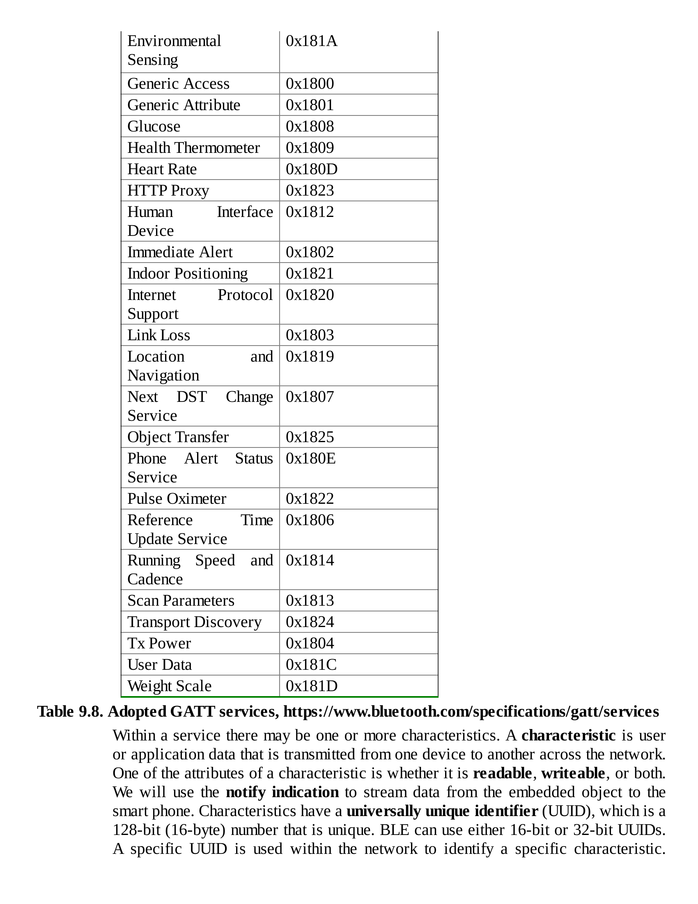
*Description*: Reference table detailing hardware parameters, register bit patterns, performance metrics, or memory configurations for Table 9.8: Adopted GATT services, https://www.bluetooth.com/specifications/gatt/services.

> **Table 9.8: Adopted GATT services, https://www.bluetooth.com/specifications/gatt/services**

Within a service there may be one or more characteristics. A characteristic is user
or application data that is transmitted from one device to another across the network.
One of the attributes of a characteristic is whether it is readable, writeable, or both.
We will use the notify indication to stream data from the embedded object to the
smart phone. Characteristics have a universally unique identifier (UUID), which is a
128-bit (16-byte) number that is unique. BLE can use either 16-bit or 32-bit UUIDs.
A specific UUID is used within the network to identify a specific characteristic.


<!-- Page 469 -->
### [PDF Page 469]

Often a characteristic has one or more descriptors. Descriptors may be information
like its name and its units. We will also see handles, which are a mechanism to
identify characteristics within the device. A handle is a pointer to an internal data

```c
structure within the GATT that contains all the information about that characteristic.
Handles are not passed across the Bluetooth network; rather, handles are used by the
```

host and controller to keep track of characteristics. UUIDs are passed across the
network. Figure 9.27 shows a GATT service with seven characteristics.

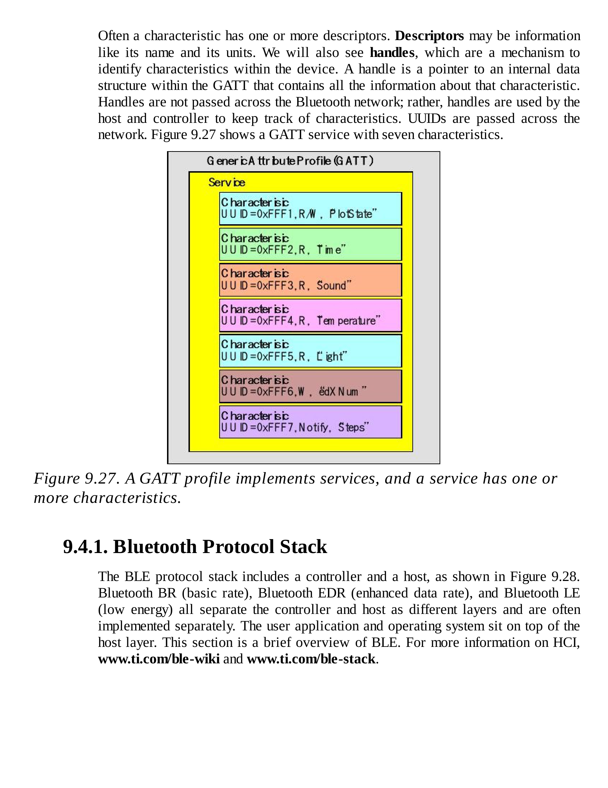
*Description*: Technical schematic and block diagram illustrating circuit operation, signal pathways, and functional behavior for Figure 9.27: A GATT profile implements services, and a service has one or.

> **Figure 9.27: A GATT profile implements services, and a service has one or**

more characteristics.
9.4.1. Bluetooth Protocol Stack
The BLE protocol stack includes a controller and a host, as shown in Figure 9.28.
Bluetooth BR (basic rate), Bluetooth EDR (enhanced data rate), and Bluetooth LE
(low energy) all separate the controller and host as different layers and are often
implemented separately. The user application and operating system sit on top of the
host layer. This section is a brief overview of BLE. For more information on HCI,
www.ti.com/ble-wiki and www.ti.com/ble-stack.


<!-- Page 470 -->
### [PDF Page 470]


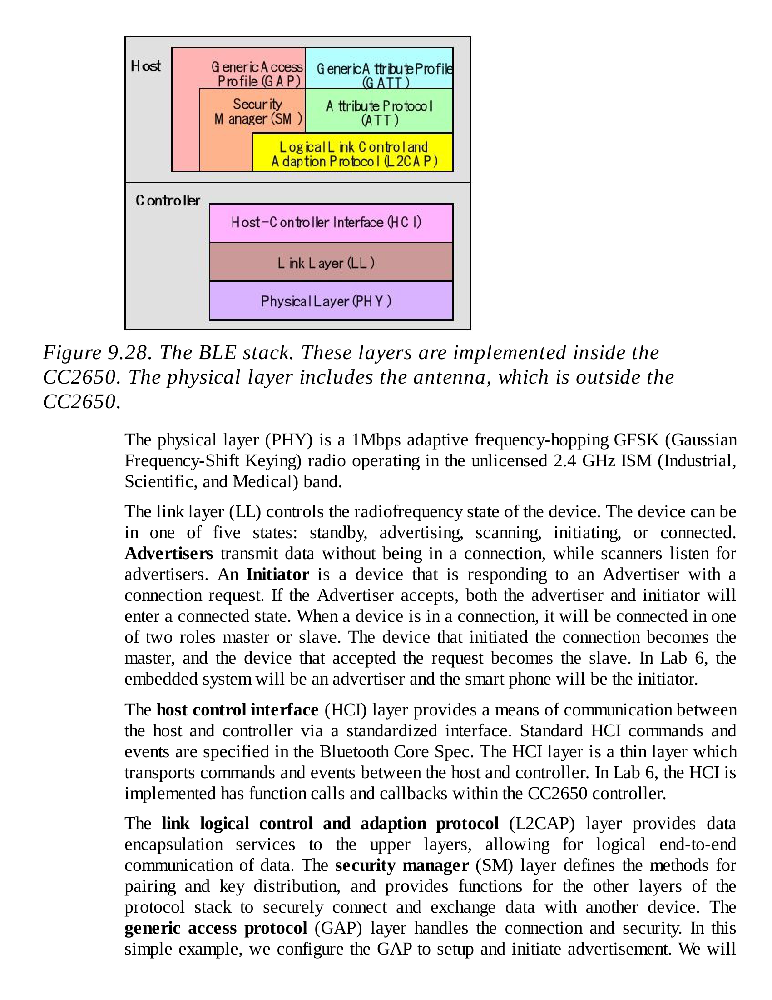
*Description*: Register layout and memory mapping diagram specifying bit fields, stack pointer allocations, and memory address boundaries for Figure 9.28: The BLE stack. These layers are implemented inside the.

> **Figure 9.28: The BLE stack. These layers are implemented inside the**

CC2650. The physical layer includes the antenna, which is outside the
CC2650.
The physical layer (PHY) is a 1Mbps adaptive frequency-hopping GFSK (Gaussian
Frequency-Shift Keying) radio operating in the unlicensed 2.4 GHz ISM (Industrial,
Scientific, and Medical) band.
The link layer (LL) controls the radiofrequency state of the device. The device can be
in one of five states: standby, advertising, scanning, initiating, or connected.
Advertisers transmit data without being in a connection, while scanners listen for
advertisers. An Initiator is a device that is responding to an Advertiser with a
connection request. If the Advertiser accepts, both the advertiser and initiator will
enter a connected state. When a device is in a connection, it will be connected in one
of two roles master or slave. The device that initiated the connection becomes the
master, and the device that accepted the request becomes the slave. In Lab 6, the
embedded system will be an advertiser and the smart phone will be the initiator.
The host control interface (HCI) layer provides a means of communication between
the host and controller via a standardized interface. Standard HCI commands and
events are specified in the Bluetooth Core Spec. The HCI layer is a thin layer which
transports commands and events between the host and controller. In Lab 6, the HCI is
implemented has function calls and callbacks within the CC2650 controller.
The link logical control and adaption protocol (L2CAP) layer provides data
encapsulation services to the upper layers, allowing for logical end-to-end
communication of data. The security manager (SM) layer defines the methods for
pairing and key distribution, and provides functions for the other layers of the
protocol stack to securely connect and exchange data with another device. The
generic access protocol (GAP) layer handles the connection and security. In this
simple example, we configure the GAP to setup and initiate advertisement. We will


<!-- Page 471 -->
### [PDF Page 471]

use the GAP to connect our embedded system to a smart phone.
The overriding theme of Bluetooth communication is the exchange of data between
paired devices. A service is a mechanism to exchange data. A collection of services
is a profile. The generic attribute profile (GATT) handles services and profiles.
The attribute protocol (ATT) layer protocol allows a device to expose “attributes” to
other devices. All data communications that occur between two devices in a BLE
connection are handled through the GATT.
The first step for our embedded device to perform is to configure and start
advertisement, see Figure 9.29. In advertisement mode the device sends out periodic
notifications of its existence and its willingness to connect. Another device, such as a
smart phone, scans the area for possible devices. If desired this device can request a
connection. If the advertiser accepts, both devices enter a connected phase, where the
embedded device will be the slave (server) and the initiator becomes the master
(client).

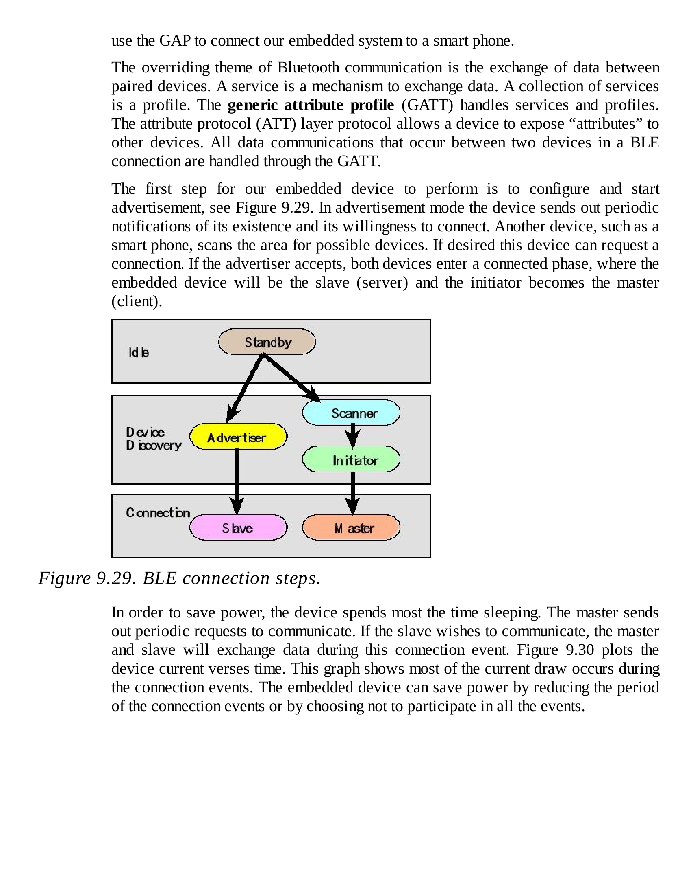
*Description*: Technical schematic and block diagram illustrating circuit operation, signal pathways, and functional behavior for Figure 9.29: BLE connection steps..

> **Figure 9.29: BLE connection steps.**

In order to save power, the device spends most the time sleeping. The master sends
out periodic requests to communicate. If the slave wishes to communicate, the master

```assembly
and slave will exchange data during this connection event. Figure 9.30 plots the
```

device current verses time. This graph shows most of the current draw occurs during
the connection events. The embedded device can save power by reducing the period
of the connection events or by choosing not to participate in all the events.


<!-- Page 472 -->
### [PDF Page 472]


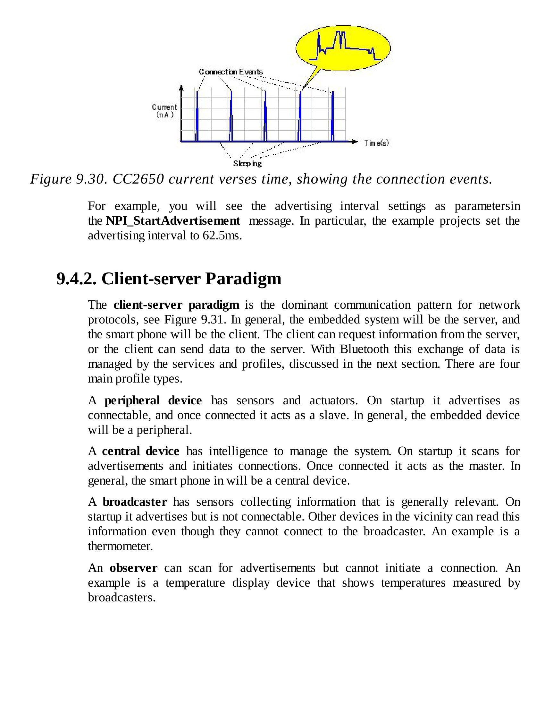
*Description*: Technical schematic and block diagram illustrating circuit operation, signal pathways, and functional behavior for Figure 9.30: CC2650 current verses time, showing the connection events..

> **Figure 9.30: CC2650 current verses time, showing the connection events.**

For example, you will see the advertising interval settings as parametersin
the NPI_StartAdvertisement  message. In particular, the example projects set the
advertising interval to 62.5ms.
9.4.2. Client-server Paradigm
The client-server paradigm is the dominant communication pattern for network
protocols, see Figure 9.31. In general, the embedded system will be the server, and
the smart phone will be the client. The client can request information from the server,
or the client can send data to the server. With Bluetooth this exchange of data is
managed by the services and profiles, discussed in the next section. There are four
main profile types.
A peripheral device has sensors and actuators. On startup it advertises as
connectable, and once connected it acts as a slave. In general, the embedded device
will be a peripheral.
A central device has intelligence to manage the system. On startup it scans for
advertisements and initiates connections. Once connected it acts as the master. In
general, the smart phone in will be a central device.
A broadcaster has sensors collecting information that is generally relevant. On
startup it advertises but is not connectable. Other devices in the vicinity can read this
information even though they cannot connect to the broadcaster. An example is a
thermometer.
An observer can scan for advertisements but cannot initiate a connection. An
example is a temperature display device that shows temperatures measured by
broadcasters.


<!-- Page 473 -->
### [PDF Page 473]


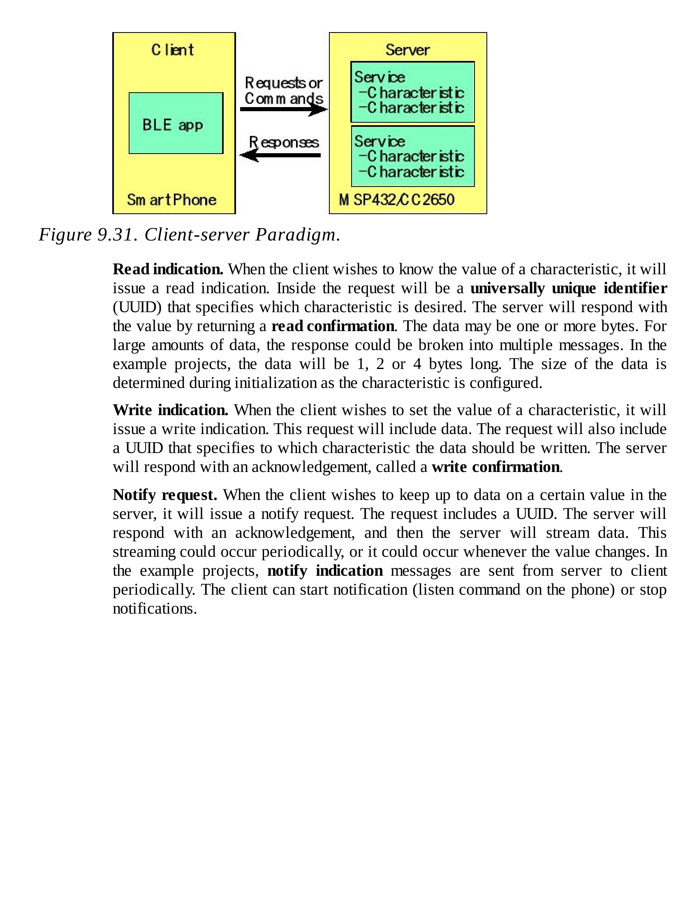
*Description*: Technical schematic and block diagram illustrating circuit operation, signal pathways, and functional behavior for Figure 9.31: Client-server Paradigm..

> **Figure 9.31: Client-server Paradigm.**

Read indication. When the client wishes to know the value of a characteristic, it will
issue a read indication. Inside the request will be a universally unique identifier
(UUID) that specifies which characteristic is desired. The server will respond with
the value by returning a read confirmation. The data may be one or more bytes. For
large amounts of data, the response could be broken into multiple messages. In the
example projects, the data will be 1, 2 or 4 bytes long. The size of the data is
determined during initialization as the characteristic is configured.
Write indication. When the client wishes to set the value of a characteristic, it will
issue a write indication. This request will include data. The request will also include
a UUID that specifies to which characteristic the data should be written. The server
will respond with an acknowledgement, called a write confirmation.
Notify request. When the client wishes to keep up to data on a certain value in the
server, it will issue a notify request. The request includes a UUID. The server will
respond with an acknowledgement, and then the server will stream data. This
streaming could occur periodically, or it could occur whenever the value changes. In
the example projects, notify indication messages are sent from server to client
periodically. The client can start notification (listen command on the phone) or stop
notifications.


<!-- Page 474 -->
### [PDF Page 474]

9.5. CC2650 Solutions
9.5.1. CC2650 Microcontroller
There are three controllers on the CC2650: a main CPU, an RF core, and a sensor
controller. Together, these combine to create a one-chip solution for Bluetooth
applications. The main CPU includes 128kB of flash, 20kB of SRAM, and a full
range of peripherals. Typically, the ARM Cortex-M3 processor handles the
application layer and BLE protocol stack. However, in this chapter, we will place
the application layer on another processor and use the CC2560 just to implement
Bluetooth.
The RF Core contains an ARM Cortex-M0 processor that interfaces the analog RF

```assembly
and base-band circuitries, handles data to and from the system side, and assembles
```

the information bits in a given packet structure. The RF core offers a high level,
command-based API to the main CPU. The RF core is capable of autonomously
handling the time-critical aspects of the radio protocols (802.15.4 RF4CE and
ZigBee, Bluetooth Low Energy) thus offloading the main CPU and leaving more
resources for the user application. The RF core has its own RAM and ROM. The
ARM Cortex-M0 ROM is not programmable by customers. The basic circuit
implementing the 2.4 GHz antenna is shown in Figure 9.32.

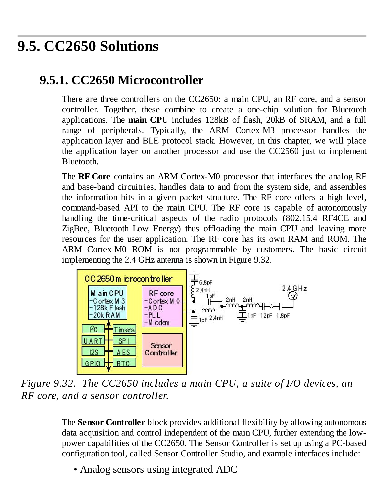
*Description*: Technical schematic and block diagram illustrating circuit operation, signal pathways, and functional behavior for Figure 9.32: The CC2650 includes a main CPU, a suite of I/O devices, an.

> **Figure 9.32: The CC2650 includes a main CPU, a suite of I/O devices, an**

RF core, and a sensor controller.
The Sensor Controller block provides additional flexibility by allowing autonomous
data acquisition and control independent of the main CPU, further extending the low-
power capabilities of the CC2650. The Sensor Controller is set up using a PC-based
configuration tool, called Sensor Controller Studio, and example interfaces include:
• Analog sensors using integrated ADC


<!-- Page 475 -->
### [PDF Page 475]

• Digital sensors using GPIOs, bit-banged I2C, and SPI
• UART communication for sensor reading or debugging
• Capacitive sensing
• Waveform generation
• Pulse counting
• Keyboard scan
• Quadrature decoder for polling rotation sensors
• Oscillator calibration
The CC2650 uses a radio-frequency (RF) link to implement Bluetooth Low Energy
(BLE). As illustrated in Figure 9.33, the CC2650 can be used as a bridge between
any microcontroller and Bluetooth. It is a transceiver, meaning data can flow across
the link in both directions.


*Description*: Architectural block diagram detailing logic modules, memory buses, internal registers, and hardware interconnections for Figure 9.33: Block diagram of a wireless link between two microcontroller.

> **Figure 9.33: Block diagram of a wireless link between two microcontroller**

systems.

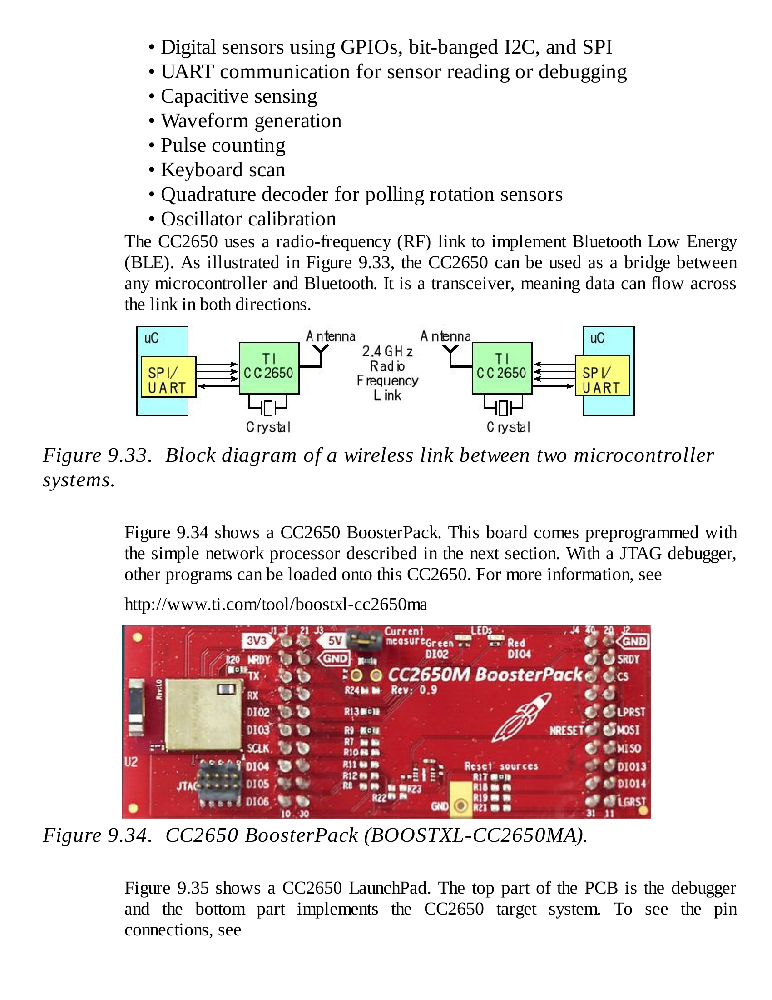
*Description*: Hardware pinout and board interface diagram mapping microcontroller pins, BoosterPack headers, switches, LEDs, and physical connectors for Figure 9.34: shows a CC2650 BoosterPack. This board comes preprogrammed with.

> **Figure 9.34: shows a CC2650 BoosterPack. This board comes preprogrammed with**

the simple network processor described in the next section. With a JTAG debugger,
other programs can be loaded onto this CC2650. For more information, see
http://www.ti.com/tool/boostxl-cc2650ma


*Description*: Technical schematic and block diagram illustrating circuit operation, signal pathways, and functional behavior for Figure 9.34: CC2650 BoosterPack (BOOSTXL-CC2650MA)..

> **Figure 9.34: CC2650 BoosterPack (BOOSTXL-CC2650MA).**


*Description*: Hardware pinout and board interface diagram mapping microcontroller pins, BoosterPack headers, switches, LEDs, and physical connectors for Figure 9.35: shows a CC2650 LaunchPad. The top part of the PCB is the debugger.

> **Figure 9.35: shows a CC2650 LaunchPad. The top part of the PCB is the debugger**


```assembly
and the bottom part implements the CC2650 target system. To see the pin
```

connections, see


<!-- Page 476 -->
### [PDF Page 476]

http://www.ti.com/ww/en/launchpad/launchpads-connected-launchxl-cc2650.html

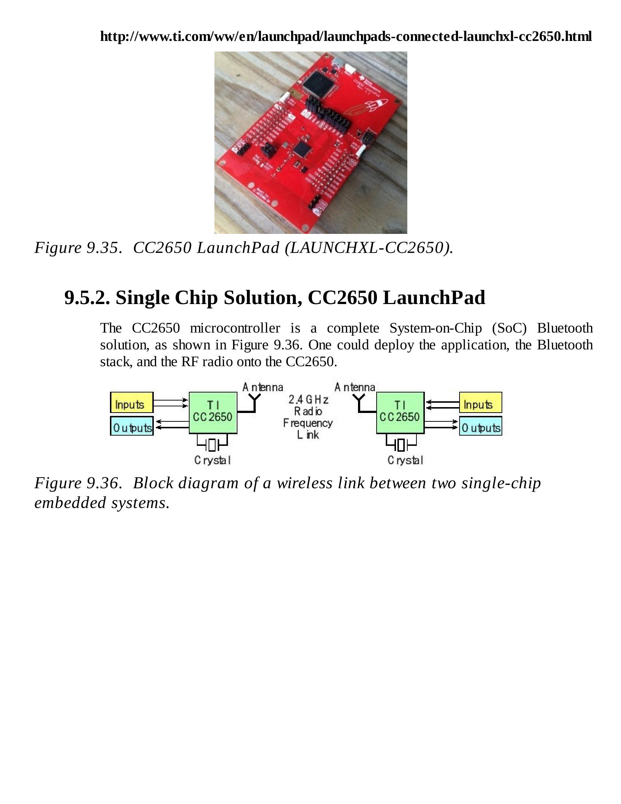
*Description*: Hardware pinout and board interface diagram mapping microcontroller pins, BoosterPack headers, switches, LEDs, and physical connectors for Figure 9.35: CC2650 LaunchPad (LAUNCHXL-CC2650)..

> **Figure 9.35: CC2650 LaunchPad (LAUNCHXL-CC2650).**

9.5.2. Single Chip Solution, CC2650 LaunchPad
The CC2650 microcontroller is a complete System-on-Chip (SoC) Bluetooth
solution, as shown in Figure 9.36. One could deploy the application, the Bluetooth
stack, and the RF radio onto the CC2650.


*Description*: Architectural block diagram detailing logic modules, memory buses, internal registers, and hardware interconnections for Figure 9.36: Block diagram of a wireless link between two single-chip.

> **Figure 9.36: Block diagram of a wireless link between two single-chip**

embedded systems.


<!-- Page 477 -->
### [PDF Page 477]

9.6. Network Processor Interface (NPI)
9.6.1. Overview
Simple Network Processor (SNP) is TI’s name for the application that runs on the
CC2650 when using the CC2650 with another microcontroller such as the MSP432
or TM4C123. In this configuration the controller and host are implemented together
on the CC2650, while the profiles and application are implemented on an external
MCU. The application and profiles communicate with the CC2650 via the
Application Programming Interface (API) that simplifies the management of the
BLE network processor. The SNP API communicates with the BLE device using the
Network Protocol Interface (NPI) over a serial (SPI or UART) connection.  In this
chapter, we will use a UART interface as shown in Figure 9.37. This configuration is
useful for applications that wish to add Bluetooth functionality to an existing device.
In this paradigm, the application runs on the existing microcontroller, and BLE runs
on the CC2650. For a description of the Simple Network Processor, refer to
SNP
http://processors.wiki.ti.com/index.php/CC2640_BLE_Network_Processor
Developer guide http://www.ti.com/lit/ug/swru393c/swru393c.pdf
TI wiki page
http://processors.wiki.ti.com/index.php/NPI
In this chapter, our TM4C123/MSP432 LaunchPad will be the application processor
(AP) and the CC2650 will be the network processor (NP). There are 7 wires
between the AP and the NP. Two wires are power and ground, one wire is a negative
logic reset, two wires are handshake lines, and two wires are UART transmit and
receive.

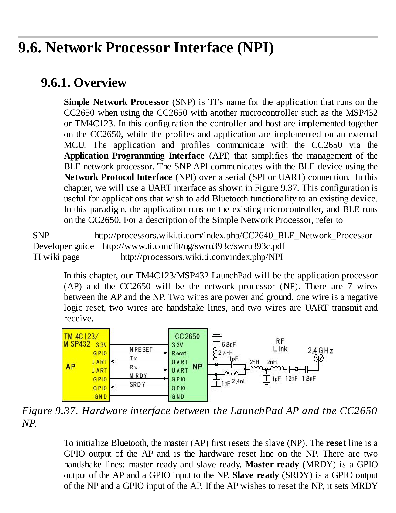
*Description*: Hardware pinout and board interface diagram mapping microcontroller pins, BoosterPack headers, switches, LEDs, and physical connectors for Figure 9.37: Hardware interface between the LaunchPad AP and the CC2650.

> **Figure 9.37: Hardware interface between the LaunchPad AP and the CC2650**

NP.
To initialize Bluetooth, the master (AP) first resets the slave (NP). The reset line is a
GPIO output of the AP and is the hardware reset line on the NP. There are two
handshake lines: master ready and slave ready. Master ready (MRDY) is a GPIO
output of the AP and a GPIO input to the NP. Slave ready (SRDY) is a GPIO output
of the NP and a GPIO input of the AP. If the AP wishes to reset the NP, it sets MRDY


<!-- Page 478 -->
### [PDF Page 478]

high and pulses reset low for 10 ms, Figure 9.38. Normally, the reset operation
occurs once, and thereafter the reset line should remain high.

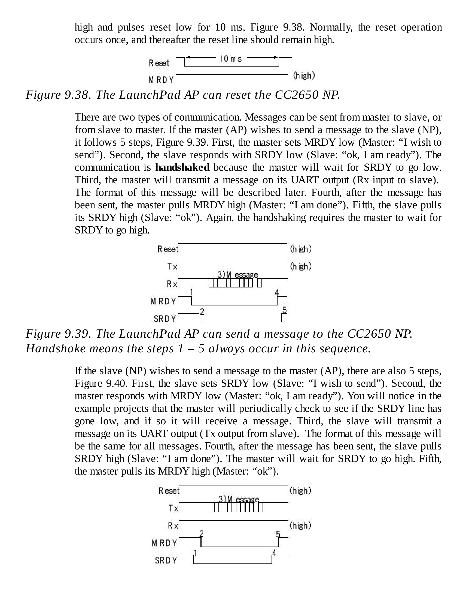
*Description*: Hardware pinout and board interface diagram mapping microcontroller pins, BoosterPack headers, switches, LEDs, and physical connectors for Figure 9.38: The LaunchPad AP can reset the CC2650 NP..

> **Figure 9.38: The LaunchPad AP can reset the CC2650 NP.**

There are two types of communication. Messages can be sent from master to slave, or
from slave to master. If the master (AP) wishes to send a message to the slave (NP),
it follows 5 steps, Figure 9.39. First, the master sets MRDY low (Master: “I wish to
send”). Second, the slave responds with SRDY low (Slave: “ok, I am ready”). The
communication is handshaked because the master will wait for SRDY to go low.
Third, the master will transmit a message on its UART output (Rx input to slave).
The format of this message will be described later. Fourth, after the message has
been sent, the master pulls MRDY high (Master: “I am done”). Fifth, the slave pulls
its SRDY high (Slave: “ok”). Again, the handshaking requires the master to wait for
SRDY to go high.


*Description*: Hardware pinout and board interface diagram mapping microcontroller pins, BoosterPack headers, switches, LEDs, and physical connectors for Figure 9.39: The LaunchPad AP can send a message to the CC2650 NP..

> **Figure 9.39: The LaunchPad AP can send a message to the CC2650 NP.**

Handshake means the steps 1 – 5 always occur in this sequence.
If the slave (NP) wishes to send a message to the master (AP), there are also 5 steps,


*Description*: Technical schematic and block diagram illustrating circuit operation, signal pathways, and functional behavior for Figure 9.40: First, the slave sets SRDY low (Slave: “I wish to send”). Second, the.

> **Figure 9.40: First, the slave sets SRDY low (Slave: “I wish to send”). Second, the**

master responds with MRDY low (Master: “ok, I am ready”). You will notice in the
example projects that the master will periodically check to see if the SRDY line has
gone low, and if so it will receive a message. Third, the slave will transmit a
message on its UART output (Tx output from slave).  The format of this message will
be the same for all messages. Fourth, after the message has been sent, the slave pulls
SRDY high (Slave: “I am done”). The master will wait for SRDY to go high. Fifth,
the master pulls its MRDY high (Master: “ok”).


<!-- Page 479 -->
### [PDF Page 479]


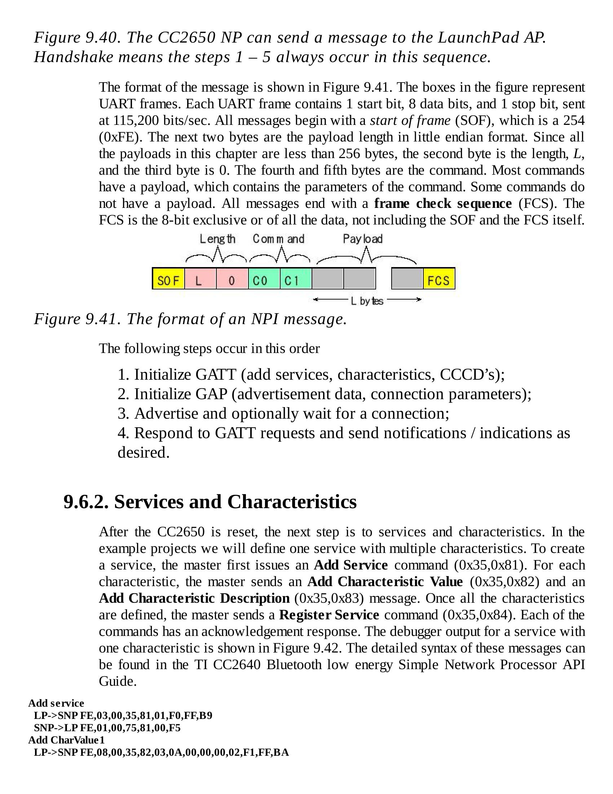
*Description*: Hardware pinout and board interface diagram mapping microcontroller pins, BoosterPack headers, switches, LEDs, and physical connectors for Figure 9.40: The CC2650 NP can send a message to the LaunchPad AP..

> **Figure 9.40: The CC2650 NP can send a message to the LaunchPad AP.**

Handshake means the steps 1 – 5 always occur in this sequence.
The format of the message is shown in Figure 9.41. The boxes in the figure represent
UART frames. Each UART frame contains 1 start bit, 8 data bits, and 1 stop bit, sent
at 115,200 bits/sec. All messages begin with a start of frame (SOF), which is a 254
(0xFE). The next two bytes are the payload length in little endian format. Since all
the payloads in this chapter are less than 256 bytes, the second byte is the length, L,

```assembly
and the third byte is 0. The fourth and fifth bytes are the command. Most commands
```

have a payload, which contains the parameters of the command. Some commands do
not have a payload. All messages end with a frame check sequence (FCS). The
FCS is the 8-bit exclusive or of all the data, not including the SOF and the FCS itself.


*Description*: Technical schematic and block diagram illustrating circuit operation, signal pathways, and functional behavior for Figure 9.41: The format of an NPI message..

> **Figure 9.41: The format of an NPI message.**

The following steps occur in this order
1. Initialize GATT (add services, characteristics, CCCD’s);
2. Initialize GAP (advertisement data, connection parameters);
3. Advertise and optionally wait for a connection;
4. Respond to GATT requests and send notifications / indications as
desired.
9.6.2. Services and Characteristics
After the CC2650 is reset, the next step is to services and characteristics. In the
example projects we will define one service with multiple characteristics. To create
a service, the master first issues an Add Service command (0x35,0x81). For each
characteristic, the master sends an Add Characteristic Value (0x35,0x82) and an

```assembly
Add Characteristic Description (0x35,0x83) message. Once all the characteristics
```

are defined, the master sends a Register Service command (0x35,0x84). Each of the
commands has an acknowledgement response. The debugger output for a service with
one characteristic is shown in Figure 9.42. The detailed syntax of these messages can
be found in the TI CC2640 Bluetooth low energy Simple Network Processor API
Guide.

```assembly
Add service
```

LP->SNP FE,03,00,35,81,01,F0,FF,B9
SNP->LP FE,01,00,75,81,00,F5

```assembly
Add CharValue1
```

LP->SNP FE,08,00,35,82,03,0A,00,00,00,02,F1,FF,BA


<!-- Page 480 -->
### [PDF Page 480]

SNP->LP FE,03,00,75,82,00,1E,00,EA

```assembly
Add CharDescriptor1
```

LP->SNP FE,0B,00,35,83,80,01,05,00,05,00,44,61,74,61,00,0C
SNP->LP FE,04,00,75,83,00,80,1F,00,6D
Register service
LP->SNP FE,00,00,35,84,B1
SNP->LP FE,05,00,75,84,00,1C,00,29,00,C1


*Description*: Technical schematic and block diagram illustrating circuit operation, signal pathways, and functional behavior for Figure 9.42: TExaSdisplay output as the device sets up a service with one.

> **Figure 9.42: TExaSdisplay output as the device sets up a service with one**

characteristic. These data were collected running the
VerySimpleApplicationProcessor_xxx project.
Figures 9.43 through 9.46 show the four messages used to define a service with one
characteristic. The add service creates a service. The add characteristic value
declaration defines the read/write/notify properties of a characteristic in that
service. The response to this message includes the handle. The add characteristic
description declaration defines the name of the characteristic. When we create
services with multiple characteristics, we simply repeat the “add characteristic
value” and “add characteristic description” declarations for each. The register
service makes that service active.

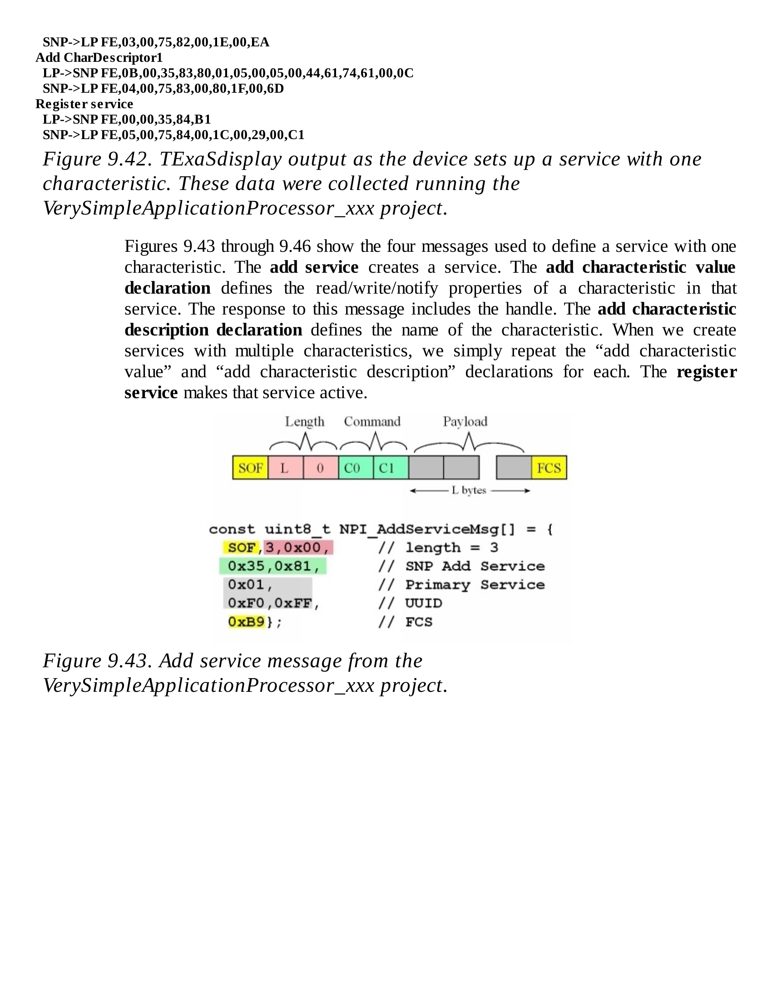
*Description*: Technical schematic and block diagram illustrating circuit operation, signal pathways, and functional behavior for Figure 9.43: Add service message from the.

> **Figure 9.43: Add service message from the**

VerySimpleApplicationProcessor_xxx project.


<!-- Page 481 -->
### [PDF Page 481]


*Description*: Technical schematic and block diagram illustrating circuit operation, signal pathways, and functional behavior for Figure 9.44: Add characteristic value declaration message from the.

> **Figure 9.44: Add characteristic value declaration message from the**

VerySimpleApplicationProcessor_xxx project.


*Description*: Technical schematic and block diagram illustrating circuit operation, signal pathways, and functional behavior for Figure 9.45: Add characteristic declaration message from the.

> **Figure 9.45: Add characteristic declaration message from the**

VerySimpleApplicationProcessor_xxx project.

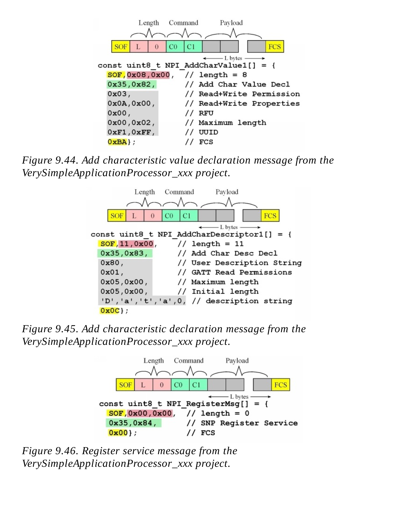
*Description*: Register layout and memory mapping diagram specifying bit fields, stack pointer allocations, and memory address boundaries for Figure 9.46: Register service message from the.

> **Figure 9.46: Register service message from the**

VerySimpleApplicationProcessor_xxx project.


<!-- Page 482 -->
### [PDF Page 482]

9.6.3. Advertising
After all the services and characteristics are defined, the master will setup and
initiate advertising. The master will send four messages to set up advertising. The
debugger output for advertising is shown in Figure 9.47. Each message will be
acknowledged by the NP. A 0x35,0x85 message will set the device name. There are
two 0x55,0x43 messages to configure the parameters of the advertising. The
0x55,0x42 message will start advertising. Again, detailed syntax of these messages
can be found in the TI CC2640 Bluetooth low energy Simple Network Processor API
Guide. Figure 9.48 shows the C code to define a Set Device Name message.
GATT Set DeviceName
LP->SNP FE,12,00,35,8C,01,00,00,53,68,61,70,65,20,74,68,65,20,57,6F,72,6C,64,DE
SNP->LP FE,01,00,75,8C,00,F8
SetAdvertisement1
LP->SNP FE,0B,00,55,43,01,02,01,06,06,FF,0D,00,03,00,00,EE
SNP->LP FE,01,00,55,43,00,17
SetAdvertisement2
LP->SNP FE,1B,00,55,43,00,10,09,53,68,61,70,65,20,74,68,65,20,57,6F,...,00,0C
SNP->LP FE,01,00,55,43,00,17
StartAdvertisement
LP->SNP FE,0E,00,55,42,00,00,00,64,00,00,00,00,01,00,00,00,C5,02,BB
SNP->LP FE,03,00,55,05,08,00,00,5B


*Description*: Technical schematic and block diagram illustrating circuit operation, signal pathways, and functional behavior for Figure 9.47: TExaSdisplay output as the device sets up advertising. These.

> **Figure 9.47: TExaSdisplay output as the device sets up advertising. These**

data were collected running the VerySimpleApplicationProcessor_xxx
project.

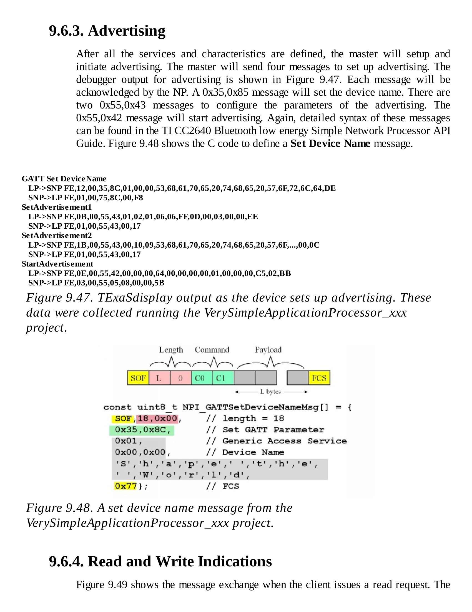
*Description*: Technical schematic and block diagram illustrating circuit operation, signal pathways, and functional behavior for Figure 9.48: A set device name message from the.

> **Figure 9.48: A set device name message from the**

VerySimpleApplicationProcessor_xxx project.
9.6.4. Read and Write Indications


*Description*: Technical schematic and block diagram illustrating circuit operation, signal pathways, and functional behavior for Figure 9.49: shows the message exchange when the client issues a read request. The.

> **Figure 9.49: shows the message exchange when the client issues a read request. The**


<!-- Page 483 -->
### [PDF Page 483]

NP sends a read indication to the AP, containing the connection and handle of the
characteristic. The AP responds with a read confirmation containing status,
connection, handle, and the data.

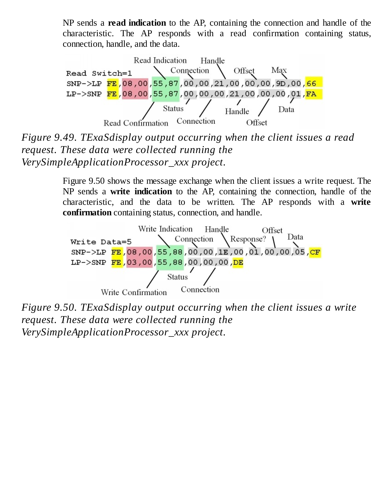
*Description*: Technical schematic and block diagram illustrating circuit operation, signal pathways, and functional behavior for Figure 9.49: TExaSdisplay output occurring when the client issues a read.

> **Figure 9.49: TExaSdisplay output occurring when the client issues a read**

request. These data were collected running the
VerySimpleApplicationProcessor_xxx project.


*Description*: Technical schematic and block diagram illustrating circuit operation, signal pathways, and functional behavior for Figure 9.50: shows the message exchange when the client issues a write request. The.

> **Figure 9.50: shows the message exchange when the client issues a write request. The**

NP sends a write indication to the AP, containing the connection, handle of the
characteristic, and the data to be written. The AP responds with a write
confirmation containing status, connection, and handle.


*Description*: Technical schematic and block diagram illustrating circuit operation, signal pathways, and functional behavior for Figure 9.50: TExaSdisplay output occurring when the client issues a write.

> **Figure 9.50: TExaSdisplay output occurring when the client issues a write**

request. These data were collected running the
VerySimpleApplicationProcessor_xxx project.


<!-- Page 484 -->
### [PDF Page 484]

9.7. Application Layer Protocols for Embedded
Systems
9.7.1. CoAP
The Constrained Application Protocol (CoAP) was specifically developed to allow
resource-constrained devices to communicate over the Internet using UDP instead of
TCP. In particular, many embedded devices have limited memory, processing power,

```assembly
and energy storage. Developers can interact with any CoAP-enabled device the same
```

way they would with a device using a traditional Representational state transfer
(REST) based API like HTTP. CoAP is particularly useful for communicating with
low-power sensors and devices that need to be controlled via the Internet.
CoAP is a simple request/response protocol very similar to HTTP, that follows a
traditional client/server model. Clients can make GET, PUT, POST, and DELETE
requests to resources. CoAP packets use bitfields to maximize memory efficiency,

```assembly
and they make extensive usage of mappings from strings to integers to keep the data
```

packets small enough to transport and interpret on-device. A CoAP message header is
only 4-bytes long with most control messages being just that length. Most optional
fields in the message format are in binary with the payload restricted in size so all
CoAP messages fit inside a UDP datagram.
TCP is a connection oriented protocol, which means the server, or a client, will open
a socket and establish a connection with the server. And the communication is done
over a connection. For the duration of the communication, the connection is on.
Whereas, COAP works on UDP, which means that it's connectionless. And it allows
what we call as a disconnected operation, which means that the client and the server
are not connected to each other. And therefore, they can act asynchronously.
Aside from the extremely small packet size, another major advantage of CoAP is its
usage of UDP; using datagrams allows for CoAP to be run on top of packet-based
technologies like SMS. There is a one-to-one mapping between CoAP and HTTP
effectively providing a bridge between the all popular HTTP protocol to the
emerging CoAP protocol.
All CoAP messages can be marked as either “confirmable” or “nonconfirmable,”
serving as an application-level Quality of Service (QoS) to provide reliability.
While SSL/TLS encryption isn’t available over UDP, CoAP makes use of Datagram
Transport Layer Security (DTLS), which is analogous to the TCP version of TLS.
The default level of encryption is equivalent to a 3,072-bit RSA key. Even with all of
this, CoAP is designed to work on microcontrollers with as little as 10KB of RAM.
One of the downsides of CoAP: It's a one-to-one protocol. Though extensions that


<!-- Page 485 -->
### [PDF Page 485]

make group broadcasts possible are available, broadcast capabilities are not inherent
to the protocol. Arguably, an even more important disadvantage is the need for both
devices to be simultaneously powered, so when one sends a UDP, the other can
receive it. In summary, the highlights of CoAP include:
Small 4-byte header
Option fields in binary
Messages fit into one UDP datagram (no fragmentation)
Works with SMS (text messaging)
Connectionless
Needs less than 10 kB of RAM
http://www.infoworld.com/article/2972143/internet-of-things/real-time-protocols-
for-iot-apps.html

### 9.7.2 MQTT

Message Queue Telemetry Transport (MQTT) is a publish-subscribe messaging
protocol, abbreviated as pub-sub. The MQTT name was inherited from a project at
IBM. Similar to CoAP, it was built with resource-constrained devices in mind.
MQTT has a lightweight packet structure designed to conserve both memory usage

```assembly
and power. A connected device subscribes to a topic hosted on an MQTT broker.
```

Every time another device or service publishes data to a topic, all of the devices
subscribed to it will automatically get the updated information.

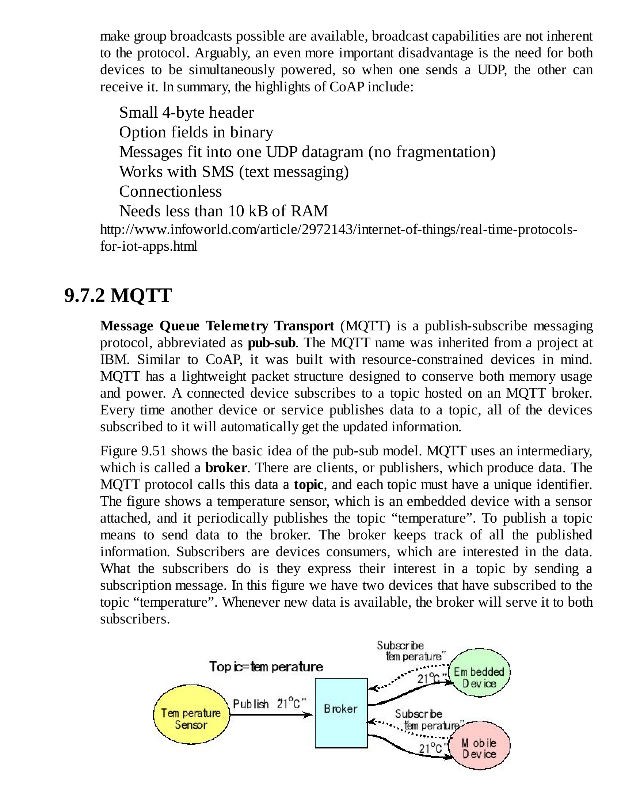
*Description*: Technical schematic and block diagram illustrating circuit operation, signal pathways, and functional behavior for Figure 9.51: shows the basic idea of the pub-sub model. MQTT uses an intermediary,.

> **Figure 9.51: shows the basic idea of the pub-sub model. MQTT uses an intermediary,**

which is called a broker. There are clients, or publishers, which produce data. The
MQTT protocol calls this data a topic, and each topic must have a unique identifier.
The figure shows a temperature sensor, which is an embedded device with a sensor
attached, and it periodically publishes the topic “temperature”. To publish a topic
means to send data to the broker. The broker keeps track of all the published
information. Subscribers are devices consumers, which are interested in the data.
What the subscribers do is they express their interest in a topic by sending a
subscription message. In this figure we have two devices that have subscribed to the
topic “temperature”. Whenever new data is available, the broker will serve it to both
subscribers.


<!-- Page 486 -->
### [PDF Page 486]


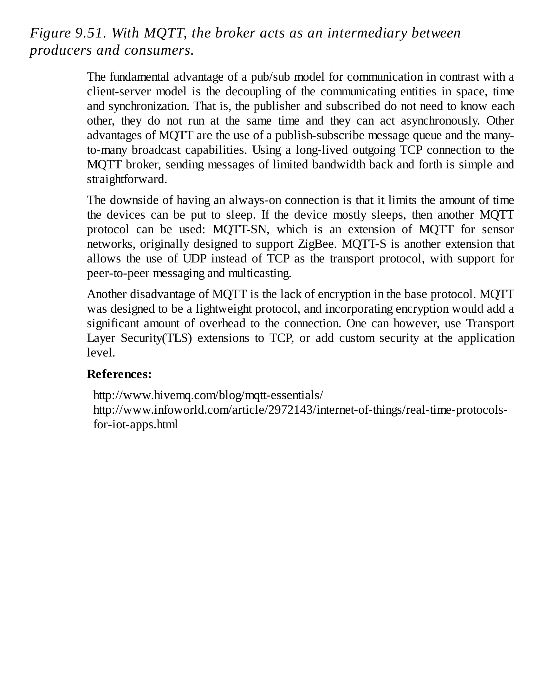
*Description*: Technical schematic and block diagram illustrating circuit operation, signal pathways, and functional behavior for Figure 9.51: With MQTT, the broker acts as an intermediary between.

> **Figure 9.51: With MQTT, the broker acts as an intermediary between**

producers and consumers.
The fundamental advantage of a pub/sub model for communication in contrast with a
client-server model is the decoupling of the communicating entities in space, time

```assembly
and synchronization. That is, the publisher and subscribed do not need to know each
```

other, they do not run at the same time and they can act asynchronously. Other
advantages of MQTT are the use of a publish-subscribe message queue and the many-
to-many broadcast capabilities. Using a long-lived outgoing TCP connection to the
MQTT broker, sending messages of limited bandwidth back and forth is simple and
straightforward.
The downside of having an always-on connection is that it limits the amount of time
the devices can be put to sleep. If the device mostly sleeps, then another MQTT
protocol can be used: MQTT-SN, which is an extension of MQTT for sensor
networks, originally designed to support ZigBee. MQTT-S is another extension that
allows the use of UDP instead of TCP as the transport protocol, with support for
peer-to-peer messaging and multicasting.
Another disadvantage of MQTT is the lack of encryption in the base protocol. MQTT
was designed to be a lightweight protocol, and incorporating encryption would add a
significant amount of overhead to the connection. One can however, use Transport
Layer Security(TLS) extensions to TCP, or add custom security at the application
level.
References:
http://www.hivemq.com/blog/mqtt-essentials/
http://www.infoworld.com/article/2972143/internet-of-things/real-time-protocols-
for-iot-apps.html


<!-- Page 487 -->
### [PDF Page 487]

9.8. Exercises

## 9.1 Consider a wired communication system (like UART or CAN).

a) Assume the signal has a rise time of 25 us. What is the approximate highest
frequency component of this signal?
b) Assuming a VF of 0.7, what is the wavelength of this highest frequency?
c) Over what cable length would you have to consider this system as a transmission
line?

## 9.2 Consider a communication with a channel bandwidth of 10 kHz and an SNR of 60

dB. What is the maximum possible data transfer rate in bits/sec?

## 9.3 What are there so many frequency bands for Bluetooth and WiFi?


## 9.4 Consider bit-stuffing

a) Define bit-stuffing
b) Why do Ethernet and CAN implement bit-stuffing?
c) UART does not implement bit-stuffing. How does the lack of bit-stuffing limit the
UART?
d) SPI does not implement bit-stuffing. Why does the lack of bit-stuffing not limit the
SPI transmission in the same way as UART is limited?

## 9.5  Consider how the ACK bit is used in a CAN network.

a) What do the receivers do during the ACK bit?
b) What does it mean if the ACK bit is dominant?
c) What does it mean if the ACK bit is recessive?

## 9.6 If the CAN channel is noisy, it is possible that some bits will be transmitted in

error. Assume there are four nodes, one is transmitting and three are receiving. What
happens if a data bit is flipped in the channel due to noise being added into the
channel?

## 9.7 Consider a situation where two microcontrollers are connected with a CAN

network. Computer 1 generates 8-bit data packets that must be sent to computer 2,

```assembly
and computer 2 generates 8-bit data packets that must be sent to computer 1. The
```

packets are generated at random times, and the goal is to minimize the latency
between when a data packet is generated on one computer to when it is received on
the other. Describe the CAN protocol you would use: 11-bit versus 29-bit ID, number
of bytes of data, and bandwidth. Clearly describe what is in the ID and how the data
is formatted.

## 9.8 A CAN system has a baud rate of 100,000 bits/sec, 29-bit ID, and three bytes of


<!-- Page 488 -->
### [PDF Page 488]

data per frame. Assuming there is no bit-stuffing, what is the maximum bandwidth of
this network, in bytes/s.

## 9.9 A CAN system has a baud rate of 200,000 bits/sec, 11-bit ID, and five bytes of

data per frame. Assuming there is no bit-stuffing, what is the maximum bandwidth of
this network, in bytes/s.

## 9.10 Consider a situation where 4 microcontrollers are connected together using a

CAN network. Assume for this question that each frame contains 100 bits. Also
assume the baud rate is 100,000 bits/sec, therefore it takes 1ms to send a frame.
Initially, the CAN controllers are initialized (i.e., all computers have previously
executed CAN_Open ).
At time = 0
computer A calls CAN_Send  with ID=1000
At time = 300 µs
computer B calls CAN_Send  with ID=800
At time = 500 µs
computer C calls CAN_Send  with ID=900
At time = 700 µs
computer D calls CAN_Send  with ID=600
Specify the time sequence in which the four frames occur on the CAN network.
Clearly define the begin and end times when each message is visible on the CAN
network.

## 9.11 In a CAN network, what is the purpose of the CRC field? I.e., what is CRC

used for?

## 9.12 Why is BLE considered a personal area network, and WiFi is not?


## 9.13 How does BLE achieve low energy?


## 9.14 Define the following terms in 16 words or less as they apply to BLE.

a) Service
b) Characteristic
c) Advertising
d) Client
e) Server
f) Profile
g) Stack
g) UUID
h) Handle
i) Read indication
j) Write indication
k) Notify indication


