# Chapter 10: Robotic Systems

> **Textbook**: Embedded Systems: Real-Time Operating Systems for ARM Cortex-M Microcontrollers  
> **Author**: Jonathan W. Valvano  
> **PDF Page Range**: 489 - 530


---


<!-- Page 489 -->
### [PDF Page 489]

10. Robotic Systems

# Chapter 10 objectives are to:

• Introduce the general approach to digital control systems
• Design and implement some simple closed-loop control systems
• Develop a methodology for designing PID control systems
• Present the terminology and give examples of fuzzy logic control
system
Throughout all three volumes of this series of books, we developed systems
that collected information concerning the external environment. A typical
application of embedded systems is to use this information in order to control
the external environment. To build this microcontroller-based control system
we will need an output device that the computer can use to manipulate the
external environment. Control systems originally involved just analog
electronic circuits and mechanical devices. With the advent of inexpensive yet
powerful microcontrollers, implementing the control algorithm in software
provided a lower cost and more powerful product. The goal of this chapter is
to provide a brief introduction to this important application area. Control
theory is a richly developed discipline, and most of this theory is beyond the
scope of this book. Consequently, this chapter focuses more on implementing
the control system with an embedded computer and less on the design of the
control equations.


<!-- Page 490 -->
### [PDF Page 490]

10.1. Introduction to Digital Control Systems
A control system is a collection of mechanical and electrical devices connected for
the purpose of commanding, directing, or regulating a physical plant (see Figure
10.1). The real state variables are the properties of the physical plant that are to be
controlled. The sensor and state estimator comprise a data acquisition system. The
goal of this data acquisition system is to estimate the state variables. A closed-loop
control system uses the output of the state estimator in a feedback loop to drive the
errors to zero. The control system compares these estimated state variables, X'(t),
to the desired state variables, X*(t), in order to decide appropriate action, U(t). The
actuator is a transducer that converts the control system commands, U(t), into
driving forces, V(t), that are applied to the physical plant.  In general, the goal of the
control system is to drive the real state variables to equal the desired state variables.
In actuality though, the controller attempts to drive the estimated state variables to
equal the desired state variables. It is important to have an accurate state estimator,
because any differences between the estimated state variables and the real state
variables will translate directly into controller errors.  If we define the error as the
difference between the desired and estimated state variables:
e(t) = X*(t)- X’(t)
then the control system will attempt to drive e(t) to zero.  In general control theory,
X(t), X’(t), X*(t), U(t), V(t) and e(t) refer to vectors, but the examples in this chapter
control only a single parameter. Even though this chapter shows one-dimensional
systems, and it should be straight-forward to apply standard multivariate control
theory to more complex problems. We usually evaluate the effectiveness of a control
system by determining three properties: steady state controller error, transient
response, and stability. The steady state controller error is the average value of
e(t). The transient response is how long does the system take to reach 99% of the
final output after X* is changed. A system is stable if steady state (smooth constant
output) is achieved. The error is small and bounded on a stable system. An unstable
system oscillates, or it may saturate.


<!-- Page 491 -->
### [PDF Page 491]


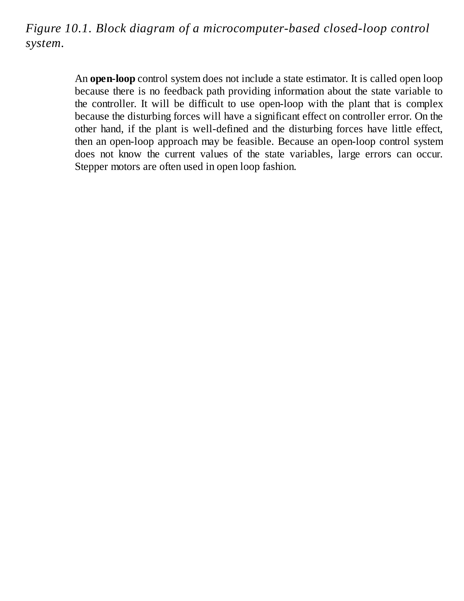
*Description*: Architectural block diagram detailing logic modules, memory buses, internal registers, and hardware interconnections for Figure 10.1: Block diagram of a microcomputer-based closed-loop control.

> **Figure 10.1: Block diagram of a microcomputer-based closed-loop control**

system.
An open-loop control system does not include a state estimator. It is called open loop
because there is no feedback path providing information about the state variable to
the controller. It will be difficult to use open-loop with the plant that is complex
because the disturbing forces will have a significant effect on controller error. On the
other hand, if the plant is well-defined and the disturbing forces have little effect,
then an open-loop approach may be feasible. Because an open-loop control system
does not know the current values of the state variables, large errors can occur.
Stepper motors are often used in open loop fashion.


<!-- Page 492 -->
### [PDF Page 492]

10.2. Binary Actuators
10.2.1. Electrical Interface
Relays, solenoids, and DC motors are grouped together because their electrical
interfaces are similar. We can add speakers to this group if the sound is generated
with a square wave.  In each case, there is a coil, and the computer must drive (or not
drive) current through the coil. To interface a coil, we consider voltage, current and
inductance. We need a power supply at the desired voltage requirement of the coil. If
the only available power supply is larger than the desired coil voltage, we use a
voltage regulator (rather than a resistor divider to create the desired voltage.) We
connect the power supply to the positive terminal of the coil, shown as +V in Figure
10.2. We will use a transistor device to drive the negative side of the coil to ground.
The computer can turn the current on and off using this transistor. The second
consideration is current. In particular, we must however select the power supply and
an interface device that can support the coil current. The 7406 is an open collector
driver capable of sinking up to 40 mA. The 2N2222 is a bipolar junction transistor
(BJT), NPN type, with moderate current gain. The TIP120 is a Darlington
transistor, also NPN type, which can handle larger currents. The IRF540 is a
MOSFET transistor that can handle even more current. BJT and Darlington
transistors are current-controlled (meaning the output is a function of the input
current), while the MOSFET is voltage-controlled (output is a function of input
voltage). When interfacing a coil to the microcontroller, we use information like

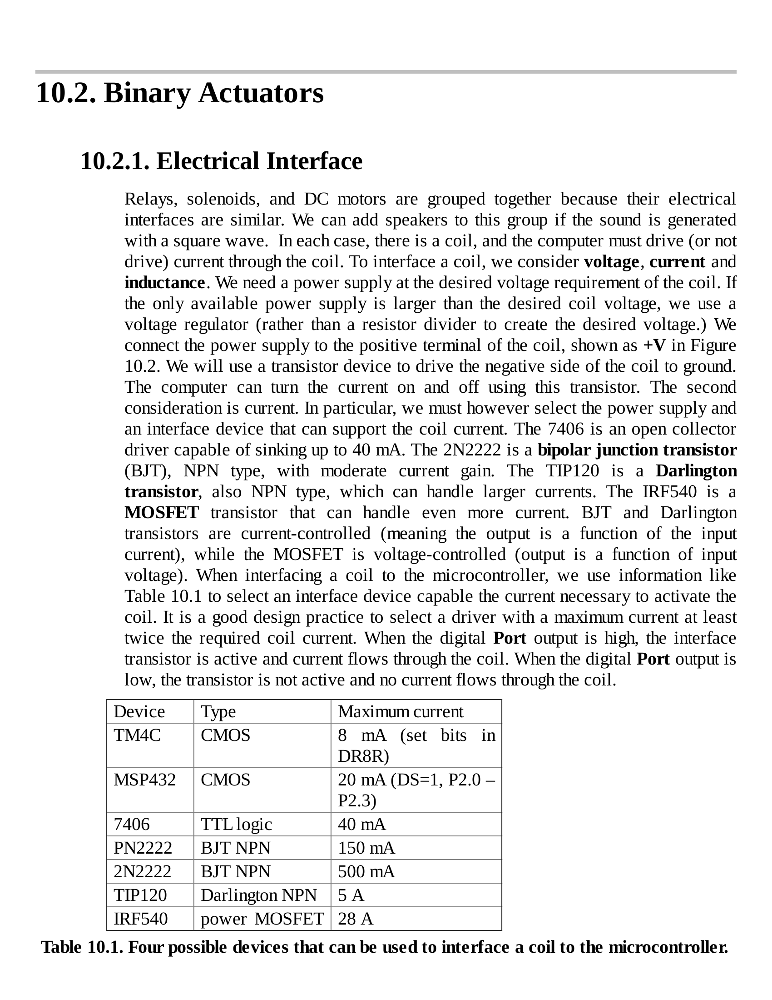
*Description*: Hardware pinout and board interface diagram mapping microcontroller pins, BoosterPack headers, switches, LEDs, and physical connectors for Table 10.1: to select an interface device capable the current necessary to activate the.

> **Table 10.1: to select an interface device capable the current necessary to activate the**

coil. It is a good design practice to select a driver with a maximum current at least
twice the required coil current. When the digital Port output is high, the interface
transistor is active and current flows through the coil. When the digital Port output is
low, the transistor is not active and no current flows through the coil.
Device
Type
Maximum current
TM4C
CMOS
8 mA (set bits in
DR8R)
MSP432
CMOS
20 mA (DS=1, P2.0 –
P2.3)
7406
TTL logic
40 mA
PN2222
BJT NPN
150 mA
2N2222
BJT NPN
500 mA
TIP120
Darlington NPN
5 A
IRF540
power MOSFET 28 A


*Description*: Hardware pinout and board interface diagram mapping microcontroller pins, BoosterPack headers, switches, LEDs, and physical connectors for Table 10.1: Four possible devices that can be used to interface a coil to the microcontroller..

> **Table 10.1: Four possible devices that can be used to interface a coil to the microcontroller.**


<!-- Page 493 -->
### [PDF Page 493]


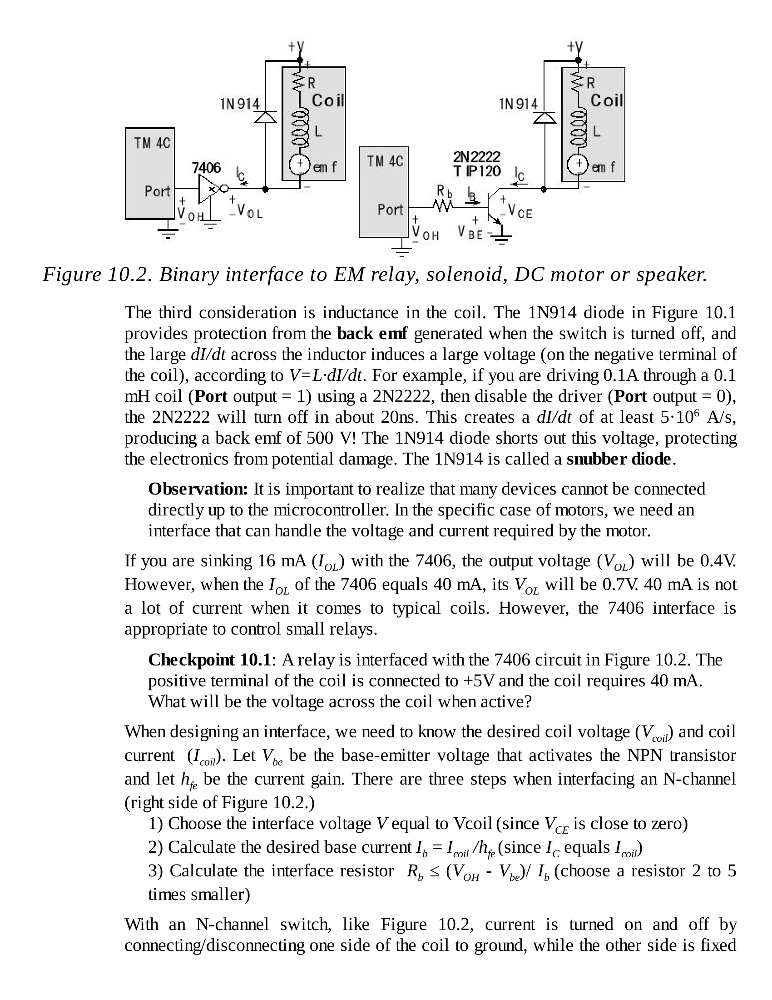
*Description*: Hardware pinout and board interface diagram mapping microcontroller pins, BoosterPack headers, switches, LEDs, and physical connectors for Figure 10.2: Binary interface to EM relay, solenoid, DC motor or speaker..

> **Figure 10.2: Binary interface to EM relay, solenoid, DC motor or speaker.**

The third consideration is inductance in the coil. The 1N914 diode in Figure 10.1
provides protection from the back emf generated when the switch is turned off, and
the large dI/dt across the inductor induces a large voltage (on the negative terminal of
the coil), according to V=L∙dI/dt. For example, if you are driving 0.1A through a 0.1
mH coil (Port output = 1) using a 2N2222, then disable the driver (Port output = 0),
the 2N2222 will turn off in about 20ns. This creates a dI/dt of at least 5·106 A/s,
producing a back emf of 500 V! The 1N914 diode shorts out this voltage, protecting
the electronics from potential damage. The 1N914 is called a snubber diode.
Observation: It is important to realize that many devices cannot be connected
directly up to the microcontroller. In the specific case of motors, we need an
interface that can handle the voltage and current required by the motor.
If you are sinking 16 mA (IOL) with the 7406, the output voltage (VOL) will be 0.4V.
However, when the IOL of the 7406 equals 40 mA, its VOL will be 0.7V. 40 mA is not
a lot of current when it comes to typical coils. However, the 7406 interface is
appropriate to control small relays.
Checkpoint 10.1: A relay is interfaced with the 7406 circuit in Figure 10.2. The
positive terminal of the coil is connected to +5V and the coil requires 40 mA.
What will be the voltage across the coil when active?
When designing an interface, we need to know the desired coil voltage (Vcoil) and coil
current  (Icoil). Let Vbe be the base-emitter voltage that activates the NPN transistor

```assembly
and let hfe be the current gain. There are three steps when interfacing an N-channel
```

(right side of Figure 10.2.)
1) Choose the interface voltage V equal to Vcoil (since VCE is close to zero)
2) Calculate the desired base current Ib = Icoil /hfe (since IC equals Icoil)
3) Calculate the interface resistor  Rb ≤ (VOH - Vbe)/ Ib (choose a resistor 2 to 5
times smaller)
With an N-channel switch, like Figure 10.2, current is turned on and off by
connecting/disconnecting one side of the coil to ground, while the other side is fixed


<!-- Page 494 -->
### [PDF Page 494]

at the voltage supply. A second type of binary interface uses P-channel switches to
connect/disconnect one side of the coil to the voltage supply, while the other side
fixed at ground, as shown in Figure 10.3. In other to activate a PNP transistor (e.g.,
PN2907 or TIP125), there must be a VEB greater than 0.7 V. In order to deactivate a
PNP transitory, the VEB voltage must be 0. Because the transistor is a current
amplifier, there must be a resistor into the base in order to limit the base current.

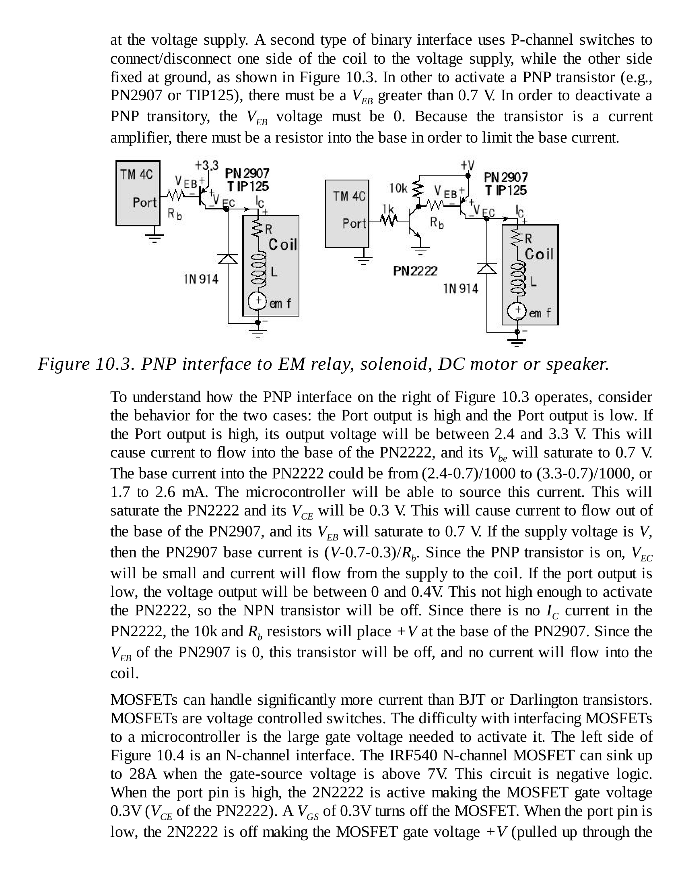
*Description*: Hardware pinout and board interface diagram mapping microcontroller pins, BoosterPack headers, switches, LEDs, and physical connectors for Figure 10.3: PNP interface to EM relay, solenoid, DC motor or speaker..

> **Figure 10.3: PNP interface to EM relay, solenoid, DC motor or speaker.**

To understand how the PNP interface on the right of Figure 10.3 operates, consider
the behavior for the two cases: the Port output is high and the Port output is low. If
the Port output is high, its output voltage will be between 2.4 and 3.3 V. This will
cause current to flow into the base of the PN2222, and its Vbe will saturate to 0.7 V.
The base current into the PN2222 could be from (2.4-0.7)/1000 to (3.3-0.7)/1000, or

## 1.7 to 2.6 mA. The microcontroller will be able to source this current. This will

saturate the PN2222 and its VCE will be 0.3 V. This will cause current to flow out of
the base of the PN2907, and its VEB will saturate to 0.7 V. If the supply voltage is V,
then the PN2907 base current is (V-0.7-0.3)/Rb. Since the PNP transistor is on, VEC
will be small and current will flow from the supply to the coil. If the port output is
low, the voltage output will be between 0 and 0.4V. This not high enough to activate
the PN2222, so the NPN transistor will be off. Since there is no IC current in the
PN2222, the 10k and Rb resistors will place +V at the base of the PN2907. Since the
VEB of the PN2907 is 0, this transistor will be off, and no current will flow into the
coil.
MOSFETs can handle significantly more current than BJT or Darlington transistors.
MOSFETs are voltage controlled switches. The difficulty with interfacing MOSFETs
to a microcontroller is the large gate voltage needed to activate it. The left side of


*Description*: Hardware pinout and board interface diagram mapping microcontroller pins, BoosterPack headers, switches, LEDs, and physical connectors for Figure 10.4: is an N-channel interface. The IRF540 N-channel MOSFET can sink up.

> **Figure 10.4: is an N-channel interface. The IRF540 N-channel MOSFET can sink up**

to 28A when the gate-source voltage is above 7V. This circuit is negative logic.
When the port pin is high, the 2N2222 is active making the MOSFET gate voltage
0.3V (VCE of the PN2222). A VGS of 0.3V turns off the MOSFET. When the port pin is
low, the 2N2222 is off making the MOSFET gate voltage +V (pulled up through the


<!-- Page 495 -->
### [PDF Page 495]

10kΩ resistor). The VGS is +V, which turns the MOSFET on.
The right side of Figure 10.4 shows a P-channel MOSFET interface. The IRF9540 P-
channel MOSFET can source up to 20A when the source-gate voltage is above 7V.
The FQP27P06 P-channel MOSFET can source up to 27A when the source-gate
voltage is above 6V. This circuit is positive logic. When the port pin is high, the
2N2222 is active making the MOSFET gate voltage 0.3V. This makes VSG equal to
+V-0.3, which turns on the MOSFET. When the port pin is low, the 2N2222 is off.
Since the 2N2222 is off, the 10kΩ pull-up resistor makes the MOSFET gate voltage
+V. In this case VSG equals 0, which turns off the MOSFET.

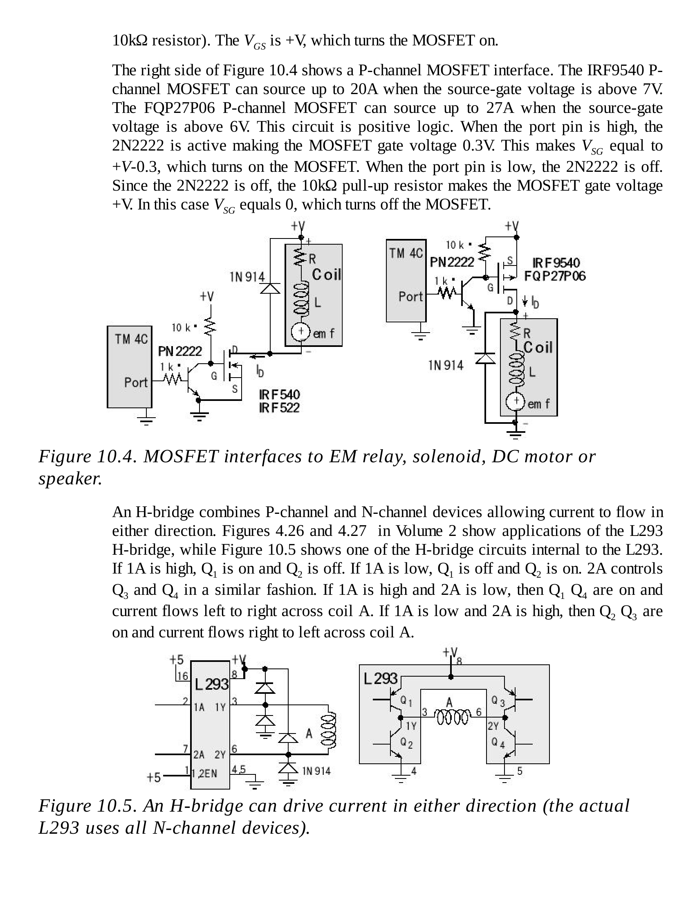
*Description*: Hardware pinout and board interface diagram mapping microcontroller pins, BoosterPack headers, switches, LEDs, and physical connectors for Figure 10.4: MOSFET interfaces to EM relay, solenoid, DC motor or.

> **Figure 10.4: MOSFET interfaces to EM relay, solenoid, DC motor or**

speaker.
An H-bridge combines P-channel and N-channel devices allowing current to flow in
either direction. Figures 4.26 and 4.27  in Volume 2 show applications of the L293
H-bridge, while Figure 10.5 shows one of the H-bridge circuits internal to the L293.
If 1A is high, Q1 is on and Q2 is off. If 1A is low, Q1 is off and Q2 is on. 2A controls
Q3 and Q4 in a similar fashion. If 1A is high and 2A is low, then Q1 Q4 are on and
current flows left to right across coil A. If 1A is low and 2A is high, then Q2 Q3 are
on and current flows right to left across coil A.


*Description*: Technical schematic and block diagram illustrating circuit operation, signal pathways, and functional behavior for Figure 10.5: An H-bridge can drive current in either direction (the actual.

> **Figure 10.5: An H-bridge can drive current in either direction (the actual**

L293 uses all N-channel devices).


<!-- Page 496 -->
### [PDF Page 496]

10.2.2. DC Motor Interface with PWM
Similar to the solenoid and EM relay, the DC motor has a frame that remains
motionless, and an armature that moves. In this case, the armature moves in a circular
manner (shaft rotation).
In the previous interfaces the microcontroller was able to control electrical power to
a device in a binary fashion: either all on or all off. Sometimes it is desirable for the
microcontroller to be able to vary the delivered power in a variable manner. One
effective way to do this is to use pulse width modulation (PWM). The basic idea of
PWM is to create a digital output wave of fixed frequency, but allow the
microcontroller to vary its duty cycle. The system is designed in such a way that
High+Low is constant (meaning the frequency is fixed). The duty cycle is defined as
the fraction of time the signal is high:
Hence, duty cycle varies from 0 to 1. We interface this digital output wave to an
external actuator (like a DC motor), such that power is applied to the motor when the
signal is high, and no power is applied when the signal is low. We purposely select a
frequency high enough so the DC motor does not start/stop with each individual
pulse, but rather responds to the overall average value of the wave. The average
value of a PWM signal is linearly related to its duty cycle and is independent of its
frequency. Let P (P=V*I) be the power to the DC motor, Figures 10.2 - 10.5, when
the PWM signal is high. Under conditions of constant speed and constant load, the
delivered power to the motor is linearly related to duty cycle.
Delivered Power =
Unfortunately, as speed and torque vary, the developed emf will affect delivered
power. Nevertheless, PWM is a very effective mechanism, allowing the
microcontroller to adjust delivered power.
A DC motor has an electro-magnet as well. When current flows through the coil, a
magnetic force is created causing a rotation of the shaft. Brushes positioned between
the frame and armature are used to alternate the current direction through the coil, so
that a DC current generates a continuous rotation of the shaft. When the current is
removed, the magnetic force stops, and the shaft is free to rotate. The resistance in the
coil (R) comes from the long wire that goes from the + terminal to the – terminal of
the motor. The inductance in the coil (L) arises from the fact that the wire is wound
into coils to create the electromagnetics. The coil itself can generate its own voltage
(emf) because of the interaction between the electric and magnetic fields. If the coil
is a DC motor, then the emf is a function of both the speed of the motor and the
developed torque (which in turn is a function of the applied load on the motor.)


<!-- Page 497 -->
### [PDF Page 497]

Because of the internal emf of the coil, the current will depend on the mechanical
load. For example, a DC motor running with no load might draw 50 mA, but under
load (friction) the current may jump to 500 mA.
There are lots of motor driver chips, but they are fundamentally similar to the circuits
shown in Figure 10.2. For the 2N2222 and TIP120 NPN transistors, if the port output
is low, no current can flow into the base, so the transistor is off, and the collector
current, IC, will be zero. If the port output is high, current does flow into the base and
VBE goes above VBEsat turning on the transistor. The transistor is in the linear range if
VBE ≤ VBEsat and Ic = hfe·Ib. The transistor is in the saturated mode if VBE ≥ VBEsat, VCE =
0.3V and Ic < hfe·Ib. We select the resistor for the NPN transistor interfaces to operate
right at the transition between linear and saturated mode. We start with the desired
coil current, Icoil (the voltage across the coil will be +V-VCE which will be about +V-
0.3V).  Next, we calculate the needed base current (Ib) given the current gain of the
NPN
Ib = Icoil /hfe
knowing the current gain of the NPN (hfe), see Table 10.2. Finally, given the output
high voltage of the microcontroller (VOH is about 3.3 V) and base-emitter voltage of
the NPN (VBEsat) needed to activate the transistor, we can calculate the desired
interface resistor.
Rb ≤ (VOH - VBEsat)/ Ib =  hfe *(VOH - VBEsat)/ Icoil
The inequality means we can choose a smaller resistor, creating a larger Ib. Because
the of the transistors can vary a lot, it is a good design practice to make the Rb
resistor about ½ the value shown in the above equation. Since the transistor is
saturated, the increased base current produces the same VCE and thus the same coil
current.
Parameter
PN2222
(IC=150mA)
2N2222
(IC=500mA)
TIP120
(IC=3A)
hfe
100
40
1000
hie
60 Ω
250 to 8000 Ω
70 to 7000 Ω
VBEsat
0.6
2

## 2.5 V

VCE
at
saturation
0.3
1
2 V

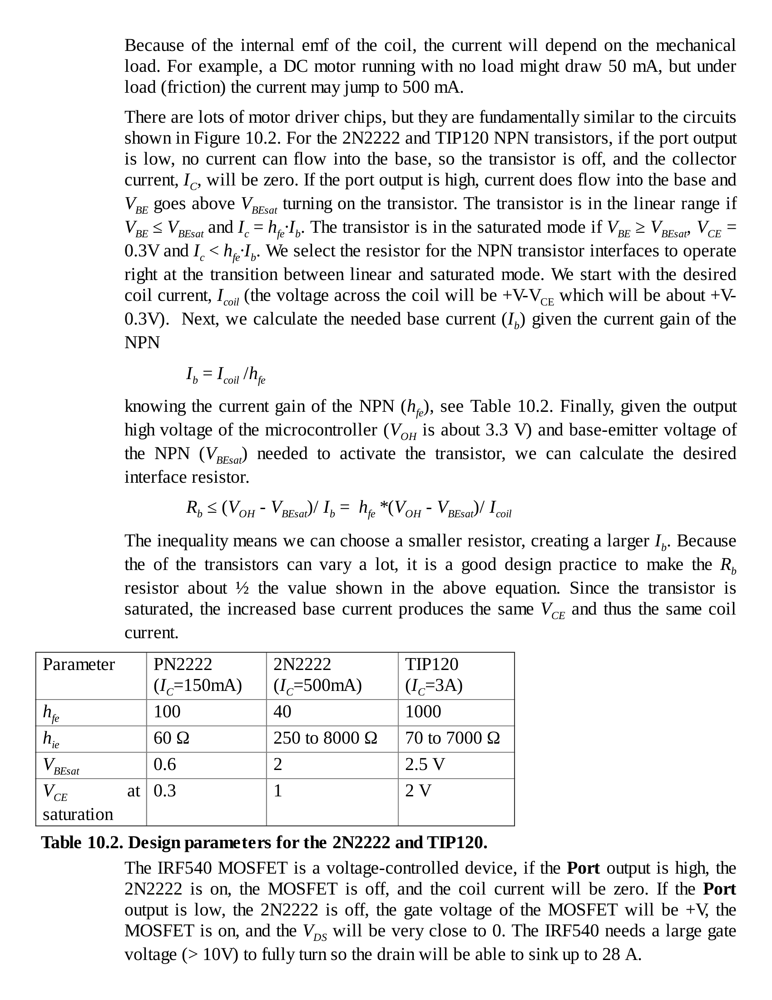
*Description*: Reference table detailing hardware parameters, register bit patterns, performance metrics, or memory configurations for Table 10.2: Design parameters for the 2N2222 and TIP120..

> **Table 10.2: Design parameters for the 2N2222 and TIP120.**

The IRF540 MOSFET is a voltage-controlled device, if the Port output is high, the
2N2222 is on, the MOSFET is off, and the coil current will be zero. If the Port
output is low, the 2N2222 is off, the gate voltage of the MOSFET will be +V, the
MOSFET is on, and the VDS will be very close to 0. The IRF540 needs a large gate
voltage (> 10V) to fully turn so the drain will be able to sink up to 28 A.


<!-- Page 498 -->
### [PDF Page 498]

Because of the resistance of the coil, there will not be significant dI/dt when the
device is turned on. Consider a DC motor as shown in Figure 10.2 with V= 12V, R =
50 Ω and L = 100 µH. Assume we are using a 2N2222 with a VCE of 1 V at
saturation. Initially the motor is off (no current to the motor). At time t=0, the digital
port goes from 0 to +3.3 V, and transistor turns on.  Assume for this section, the emf
is zero (motor has no external torque applied to the shaft) and the transistor turns on
instantaneously, we can derive an equation for the motor (Ic) current as a function of
time. The voltage across both LC together is 12-VCE = 11 V at time = 0+. At time = 0+,
the inductor is an open circuit. Conversely, at time = ∞, the inductor is a short circuit.
The Ic at time 0- is 0, and the current will not change instantaneously because of the
inductor. Thus, the Ic is 0 at time = 0+. The Ic is 11V/50Ω = 220mA at time = ∞.
11 V = Ic *R +L*d Ic/dt
General solution to this differential equation is
Ic = I0 + I1e-t/T      d Ic/dt = - (I1/T)e-t/T
We plug the general solution into the differential equation and boundary conditions.
11 V = (I0 + I1e-t/T)*R -L*(I1/T)e-t/T
To solve the differential equation, the time constant will be T = L/R = 2 µsec. Using
initial conditions, we get
Ic = 220mA*(1- e-t/2µs)
Example 10.4. Design an interface for two +12V 1A geared DC motors. These two
motors will be used to propel a robot with two independent drive wheels.
Solution: We will use two copies of the TIP120 circuit in Figure 10.6 because the
TIP120 can sink at least three times the current needed for this motor. We select a
+12V supply and connect it to the +V in the circuit. The needed base current is
Ib = Icoil /hfe = 1A/1000 = 1mA
The desired interface resistor.
Rb ≤ (VOH - Vbe)/ Ib = (3.3-2.5)/1mA = 800 Ω
To cover the variability in hfe, we will use a 330 Ω resistor instead of the 800 Ω. The
actual voltage on the motor when active will be +12-2 = 10V. The coils and
transistors can vary a lot, so it is appropriate to experimentally verify the design by
measuring the voltages and currents. Two PWM outputs are used to control the robot.
The period of the PWM output is chosen to be about 10 times shorter than the time
constant of the motor. The electronic driver will turn on and off at this rate, but the
motor only responds to the average level. The software sets the duty cycle of the
PWM to adjust the delivered power. When active, the interface will drive +10 V
across the motor. The current will be a function of the friction applied to the shaft.


<!-- Page 499 -->
### [PDF Page 499]


*Description*: Hardware pinout and board interface diagram mapping microcontroller pins, BoosterPack headers, switches, LEDs, and physical connectors for Figure 10.6: DC motor interface..

> **Figure 10.6: DC motor interface.**

Similar to the solenoid and EM relay, the DC motor has a frame that remains
motionless (called the stator), and an armature that moves (called the rotor), see

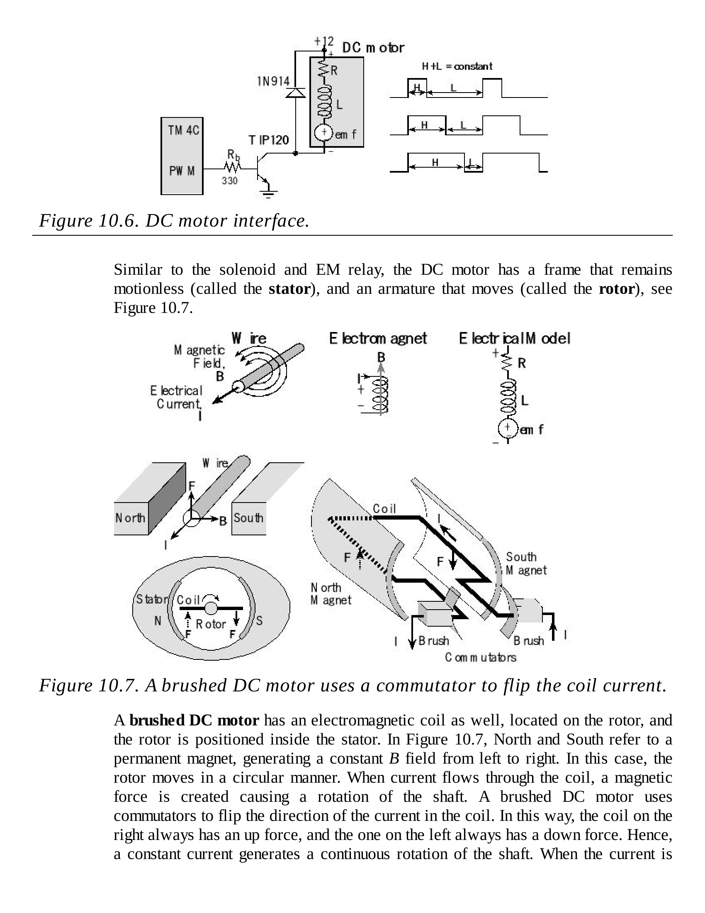
*Description*: Technical schematic and block diagram illustrating circuit operation, signal pathways, and functional behavior for Figure 10.7.

> **Figure 10.7**


*Description*: Technical schematic and block diagram illustrating circuit operation, signal pathways, and functional behavior for Figure 10.7: A brushed DC motor uses a commutator to flip the coil current..

> **Figure 10.7: A brushed DC motor uses a commutator to flip the coil current.**

A brushed DC motor has an electromagnetic coil as well, located on the rotor, and
the rotor is positioned inside the stator. In Figure 10.7, North and South refer to a
permanent magnet, generating a constant B field from left to right. In this case, the
rotor moves in a circular manner. When current flows through the coil, a magnetic
force is created causing a rotation of the shaft. A brushed DC motor uses
commutators to flip the direction of the current in the coil. In this way, the coil on the
right always has an up force, and the one on the left always has a down force. Hence,
a constant current generates a continuous rotation of the shaft. When the current is


<!-- Page 500 -->
### [PDF Page 500]

removed, the magnetic force stops, and the shaft is free to rotate. In a pulse-width
modulated DC motor, the computer activates the coil with a current of fixed
magnitude but varies the duty cycle in order to adjust the power delivered to the
motor.


<!-- Page 501 -->
### [PDF Page 501]

10.3. Sensors
Tachometers can be used to measure rotational speed of a motor. Some tachometers
produce a sine wave with a frequency and amplitude proportional to motor speed. To
use input capture, we need to convert the sine wave into a corresponding square
wave of the same period. We can use a voltage comparator to detect events in an
analog waveform. The input voltage range is determined by the analog supply
voltages of the comparator. The output is takes on two values, shown an Vh and Vl in

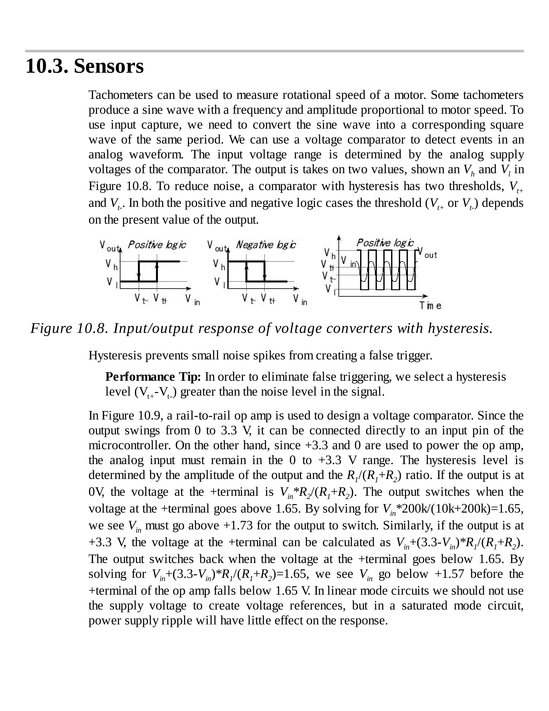
*Description*: Technical schematic and block diagram illustrating circuit operation, signal pathways, and functional behavior for Figure 10.8: To reduce noise, a comparator with hysteresis has two thresholds, Vt+.

> **Figure 10.8: To reduce noise, a comparator with hysteresis has two thresholds, Vt+**


```assembly
and Vt-. In both the positive and negative logic cases the threshold (Vt+ or Vt-) depends
```

on the present value of the output.


*Description*: Technical schematic and block diagram illustrating circuit operation, signal pathways, and functional behavior for Figure 10.8: Input/output response of voltage converters with hysteresis..

> **Figure 10.8: Input/output response of voltage converters with hysteresis.**

Hysteresis prevents small noise spikes from creating a false trigger.
Performance Tip: In order to eliminate false triggering, we select a hysteresis
level (Vt+-Vt-) greater than the noise level in the signal.
In Figure 10.9, a rail-to-rail op amp is used to design a voltage comparator. Since the
output swings from 0 to 3.3 V, it can be connected directly to an input pin of the
microcontroller. On the other hand, since +3.3 and 0 are used to power the op amp,
the analog input must remain in the 0 to +3.3 V range. The hysteresis level is
determined by the amplitude of the output and the R1/(R1+R2) ratio. If the output is at
0V, the voltage at the +terminal is Vin*R2/(R1+R2). The output switches when the
voltage at the +terminal goes above 1.65. By solving for Vin*200k/(10k+200k)=1.65,
we see Vin must go above +1.73 for the output to switch. Similarly, if the output is at
+3.3 V, the voltage at the +terminal can be calculated as Vin+(3.3-Vin)*R1/(R1+R2).
The output switches back when the voltage at the +terminal goes below 1.65. By
solving for Vin+(3.3-Vin)*R1/(R1+R2)=1.65, we see Vin go below +1.57 before the
+terminal of the op amp falls below 1.65 V. In linear mode circuits we should not use
the supply voltage to create voltage references, but in a saturated mode circuit,
power supply ripple will have little effect on the response.


<!-- Page 502 -->
### [PDF Page 502]


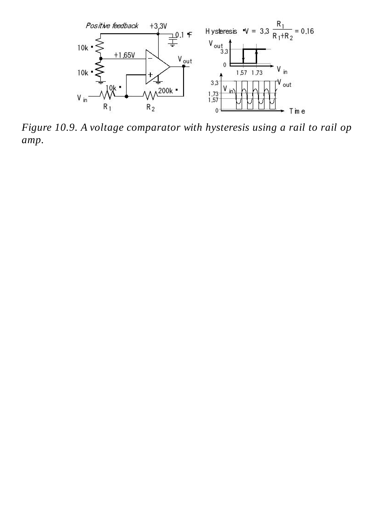
*Description*: Technical schematic and block diagram illustrating circuit operation, signal pathways, and functional behavior for Figure 10.9: A voltage comparator with hysteresis using a rail to rail op.

> **Figure 10.9: A voltage comparator with hysteresis using a rail to rail op**

amp.


<!-- Page 503 -->
### [PDF Page 503]

10.4. Odometry
Odometry is a method to predict position from wheel rotations. We assume the
wheels do not slip along the ground. If one wheel moves but the other does not, it
will rotate about a single contact point of the wheel to the ground. If one wheel
moves more than the other, then there will be both a motion and a rotation about a
point somewhere along line defined by the axle connecting the two wheels. We define
the robot center of gravity (cog) as a point equidistant from the pivot points. The
robot position is defined as the (x,y) location and the compass direction, or yaw
angle θ, of the cog. See Figure 10.10.

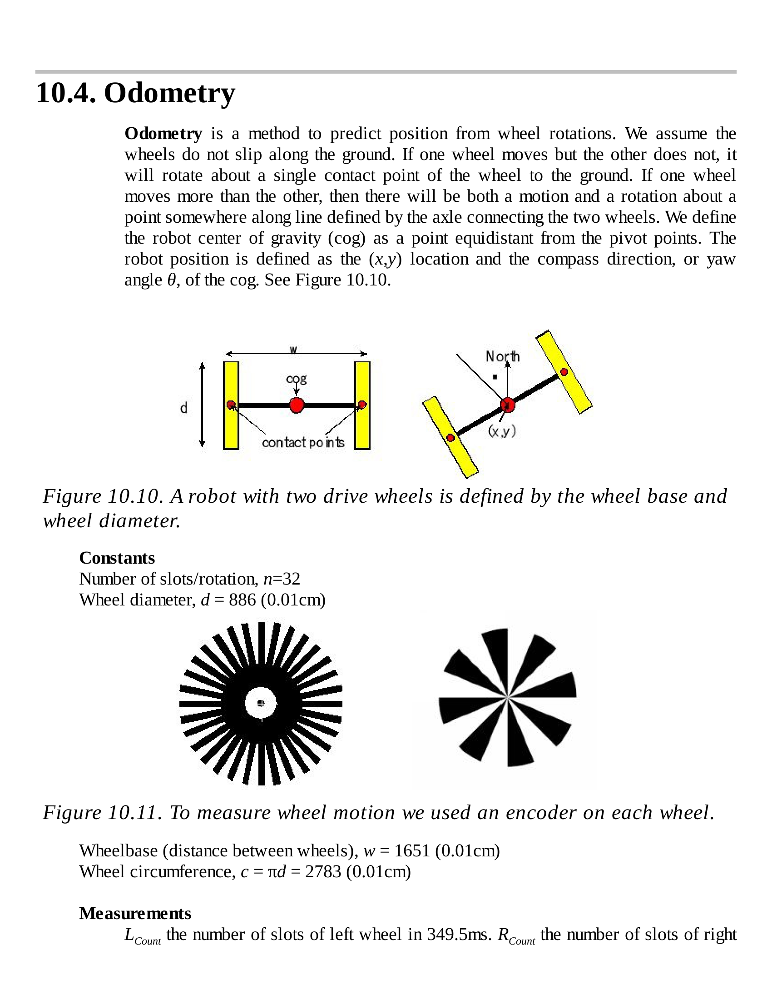
*Description*: Technical schematic and block diagram illustrating circuit operation, signal pathways, and functional behavior for Figure 10.10: A robot with two drive wheels is defined by the wheel base and.

> **Figure 10.10: A robot with two drive wheels is defined by the wheel base and**

wheel diameter.
Constants
Number of slots/rotation, n=32
Wheel diameter, d = 886 (0.01cm)


*Description*: Technical schematic and block diagram illustrating circuit operation, signal pathways, and functional behavior for Figure 10.11: To measure wheel motion we used an encoder on each wheel..

> **Figure 10.11: To measure wheel motion we used an encoder on each wheel.**

Wheelbase (distance between wheels), w = 1651 (0.01cm)
Wheel circumference, c = πd = 2783 (0.01cm)
Measurements
LCount the number of slots of left wheel in 349.5ms. RCount the number of slots of right


<!-- Page 504 -->
### [PDF Page 504]

wheel in 349.5ms. At 150 RPM, there will be 28 counts in 349.5 ms.               Some
simple cases are found in Table 10.3, where m is any number from ‑28 to +28.
LCount
RCount
Motion
m
m
straight line motion in the current
direction
0
m
pivot about stopped left motor
m
0
pivot about stopped right motor
m
-m
pure rotation about cog

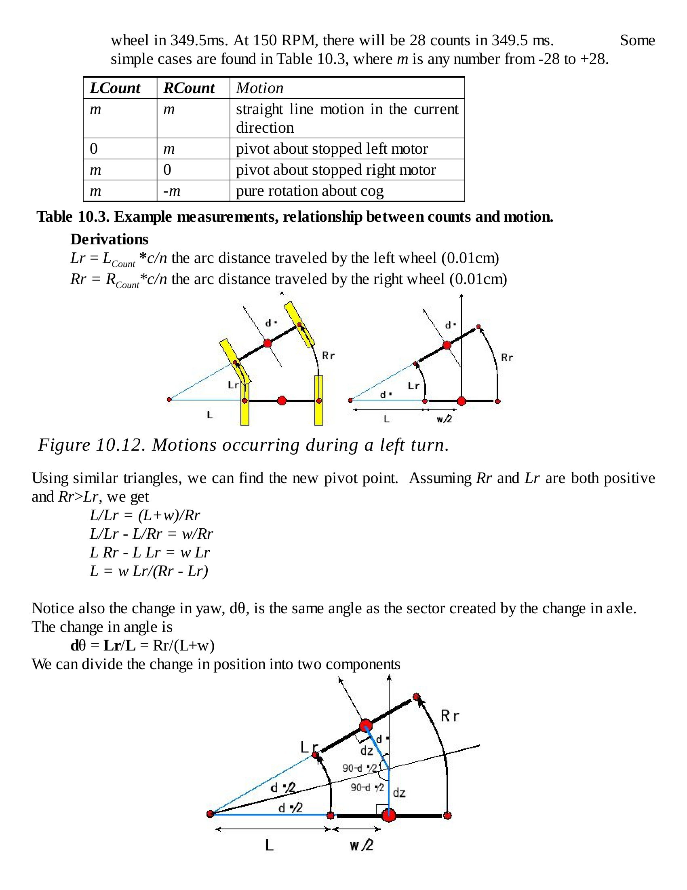
*Description*: Reference table detailing hardware parameters, register bit patterns, performance metrics, or memory configurations for Table 10.3: Example measurements, relationship between counts and motion..

> **Table 10.3: Example measurements, relationship between counts and motion.**

Derivations
Lr = LCount *c/n the arc distance traveled by the left wheel (0.01cm)
Rr = RCount*c/n the arc distance traveled by the right wheel (0.01cm)


*Description*: Technical schematic and block diagram illustrating circuit operation, signal pathways, and functional behavior for Figure 10.12: Motions occurring during a left turn..

> **Figure 10.12: Motions occurring during a left turn.**

Using similar triangles, we can find the new pivot point.  Assuming Rr and Lr are both positive

```assembly
and Rr>Lr, we get
L/Lr = (L+w)/Rr
L/Lr - L/Rr = w/Rr
L Rr - L Lr = w Lr
L = w Lr/(Rr - Lr)
```

Notice also the change in yaw, dθ, is the same angle as the sector created by the change in axle.
The change in angle is
dθ = Lr/L = Rr/(L+w)
We can divide the change in position into two components


<!-- Page 505 -->
### [PDF Page 505]


*Description*: Technical schematic and block diagram illustrating circuit operation, signal pathways, and functional behavior for Figure 10.13: Geometry of a left turn..

> **Figure 10.13: Geometry of a left turn.**

The exact calculation for position change is
dz = (L+w/2)*tan(dθ/2)
but if dθ is small, we can approximate dz by the arc length.
dz = dθ/2*(L+w/2)
Initialize
We initialize the system by specifying the initial position and yaw.
(x, y, θ)
(0.01cm, 0.01cm, 0.01 radian)
Calculations (run this periodically, measuring LCount RCount)
Lr = LCount *c/n
(0.01cm)
Rr = RCount *c/n
(0.01cm)
L = (w*Lr)/(Rr - Lr)
(0.01cm)
dθ = (100*Lr)/L
(0.01 radian)
dz = ((dθ/2)*(L+w/2))/100
(0.01cm) approximation
or
dz = (tan(dθ/2)*(L+w/2))/100
(0.01cm) more accurate
x = x + dz*cos(θ)
(0.01cm)
y = y+ dz*sin(θ)
(0.01cm)  first part of move
θ = θ + dθ
(0.01 radian)
x = x + dz*cos(θ)
(0.01cm)
y = y+ dz*sin(θ)
(0.01cm)  second part of move


<!-- Page 506 -->
### [PDF Page 506]

10.5. Simple Closed-Loop Control Systems.
A bang-bang controller uses a binary actuator, meaning the microcontroller output
can be on or off. Other names for this controller are binary controller, two-position
controller, and on/off controller. It is a closed-loop control system, because there is
a sensor that measures the status of the system. This signal is called the measurand or
state variable. Assume when the actuator is on the measurand increases, and when the
actuator is off, the measurand decreases. There is a desired point for the measurand.
The bang-bang controller is simple. If the measurand is too small, the actuator is
turned on, and if the measurand is too large the actuator is turned off.
This digital control system applies heat to the room in order to maintain the
temperature as close to the desired temperature as possible (Figure 10.14). This is a
closed-loop control system because the control signals (heat) depend on the state
variables (temperature).  In this application, the actuator has only two states: on that
warms up the room and off that does not apply heat. For this application to function
properly, there must be a passive heat loss that lowers the room temperature when the
heater is turned off. On a hot summer day, this heater system will not be able to keep
the house cool. A bang-bang controller turns on the power if the measured
temperature is too low and turns off the power if the temperature is too high.  To
implement hysteresis, we need two set-point temperatures, Thigh and Tlow. The
controller turns on the power (activate relay) if the temperature goes below Tlow and
turns off the power (deactivate relay) if the temperature goes above Thigh. The
difference Thigh - Tlow is called hysteresis. The hysteresis extends the life of the relay
by reducing the number of times the relay opens and closes.

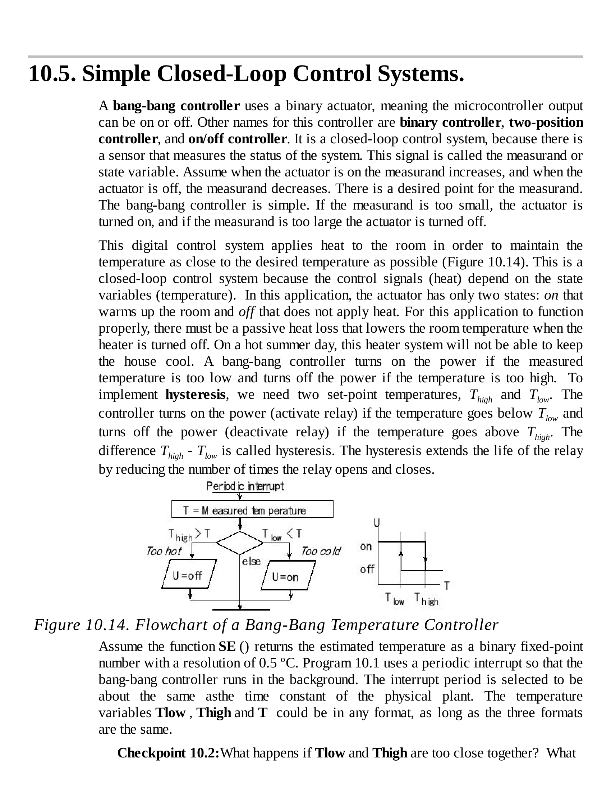
*Description*: Timing waveform and execution flowchart illustrating signal transitions, state machine progression, or algorithm logic for Figure 10.14: Flowchart of a Bang-Bang Temperature Controller.

> **Figure 10.14: Flowchart of a Bang-Bang Temperature Controller**

Assume the function SE () returns the estimated temperature as a binary fixed-point
number with a resolution of 0.5 ºC. Program 10.1 uses a periodic interrupt so that the
bang-bang controller runs in the background. The interrupt period is selected to be
about the same asthe time constant of the physical plant. The temperature
variables Tlow , Thigh and T  could be in any format, as long as the three formats
are the same.
Checkpoint 10.2:What happens if Tlow and Thigh are too close together?  What


<!-- Page 507 -->
### [PDF Page 507]

happens if Tlow and Thigh  are too far apart?
Observation: Bang-bang control works well with a physical plant with a very
slow response.

```c
int32_t Tlow,Thigh;     // controller set points, 0.5 C
void Timer0A_Handler(void){
int32_t T=SE();        // estimated temperature, 0.5 C
if(T < Tlow){
TurnOn();}       // too cold so turn on heat
else if (T > Thigh){
TurnOff();        // too hot so turn off heat
}                  // leave as is if Tlow<T<Thigh
TIMER0_ICR_R = 0x01;// acknowledge timer0A periodic timer
}
```


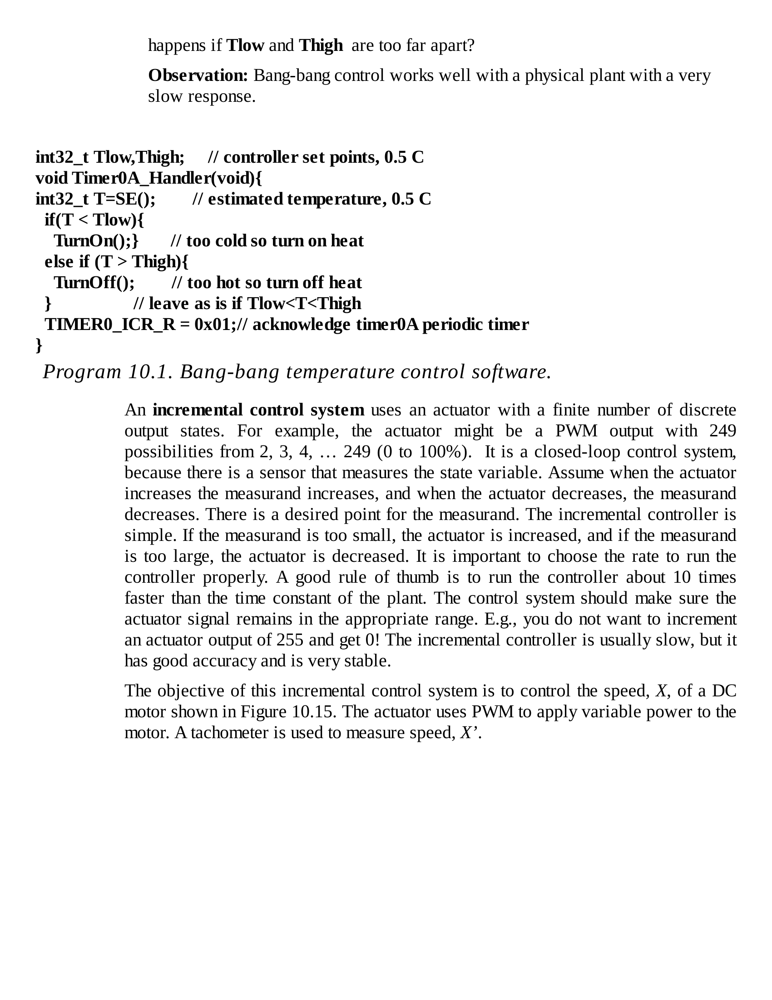
*Description*: Technical schematic and block diagram illustrating circuit operation, signal pathways, and functional behavior for Program 10.1: Bang-bang temperature control software..

> **Program 10.1: Bang-bang temperature control software.**

An incremental control system uses an actuator with a finite number of discrete
output states. For example, the actuator might be a PWM output with 249
possibilities from 2, 3, 4, … 249 (0 to 100%).  It is a closed-loop control system,
because there is a sensor that measures the state variable. Assume when the actuator
increases the measurand increases, and when the actuator decreases, the measurand
decreases. There is a desired point for the measurand. The incremental controller is
simple. If the measurand is too small, the actuator is increased, and if the measurand
is too large, the actuator is decreased. It is important to choose the rate to run the
controller properly. A good rule of thumb is to run the controller about 10 times
faster than the time constant of the plant. The control system should make sure the
actuator signal remains in the appropriate range. E.g., you do not want to increment
an actuator output of 255 and get 0! The incremental controller is usually slow, but it
has good accuracy and is very stable.
The objective of this incremental control system is to control the speed, X, of a DC
motor shown in Figure 10.15. The actuator uses PWM to apply variable power to the
motor. A tachometer is used to measure speed, X’.


<!-- Page 508 -->
### [PDF Page 508]


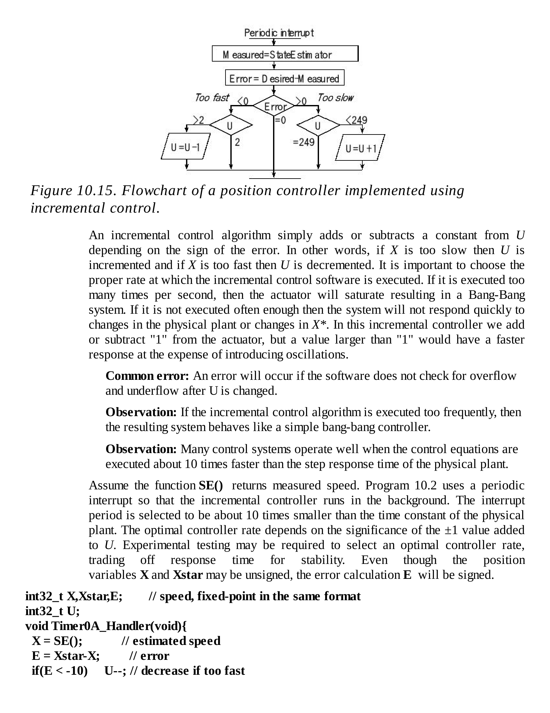
*Description*: Timing waveform and execution flowchart illustrating signal transitions, state machine progression, or algorithm logic for Figure 10.15: Flowchart of a position controller implemented using.

> **Figure 10.15: Flowchart of a position controller implemented using**

incremental control.
An incremental control algorithm simply adds or subtracts a constant from U
depending on the sign of the error. In other words, if X is too slow then U is
incremented and if X is too fast then U is decremented. It is important to choose the
proper rate at which the incremental control software is executed. If it is executed too
many times per second, then the actuator will saturate resulting in a Bang-Bang
system. If it is not executed often enough then the system will not respond quickly to
changes in the physical plant or changes in X*. In this incremental controller we add
or subtract "1" from the actuator, but a value larger than "1" would have a faster
response at the expense of introducing oscillations.
Common error: An error will occur if the software does not check for overflow

```assembly
and underflow after U is changed.
```

Observation: If the incremental control algorithm is executed too frequently, then
the resulting system behaves like a simple bang-bang controller.
Observation: Many control systems operate well when the control equations are
executed about 10 times faster than the step response time of the physical plant.
Assume the function SE()  returns measured speed. Program 10.2 uses a periodic
interrupt so that the incremental controller runs in the background. The interrupt
period is selected to be about 10 times smaller than the time constant of the physical
plant. The optimal controller rate depends on the significance of the ±1 value added
to U. Experimental testing may be required to select an optimal controller rate,
trading
off
response
time
for
stability.
Even
though
the
position
variables X and Xstar may be unsigned, the error calculation E  will be signed.

```c
int32_t X,Xstar,E;        // speed, fixed-point in the same format
int32_t U;
void Timer0A_Handler(void){
X = SE();            // estimated speed
E = Xstar-X;         // error
if(E < -10)     U--; // decrease if too fast
```


<!-- Page 509 -->
### [PDF Page 509]

else if(E > 10) U++; // increase if too slow
// leave as is if close enough

```c
if(U<2)  U=2;       // underflow (minimum PWM)
if(U>249) U=249;     // overflow (maximum PWM)
PWM0A_Duty(U);        // output to actuator, Section 2.8
TIMER0_ICR_R = 0x01;  // acknowledge timer0A periodic timer
}
```


*Description*: Technical schematic and block diagram illustrating circuit operation, signal pathways, and functional behavior for Program 10.2: Incremental control software for a DC motor..

> **Program 10.2: Incremental control software for a DC motor.**

Checkpoint 10.3:In what ways would the controller behave differently if -
10 and +10 were to be changed to 0 ?
Checkpoint 10.4: What happens if the interrupt period is too small (i.e., executes
too frequently)?
Observation: It is a good debugging strategy to observe the assembly listing
generated by the compiler when performing calculations on variables of mixed
types (signed/unsigned, char/short).
Observation: Incremental control will work moderately well (accurate and
stable) for an extremely wide range of applications. Its only short-coming is that
the controller response time can be quite slow.


<!-- Page 510 -->
### [PDF Page 510]

10.6. PID Controllers
10.6.1. General Approach to a PID Controller
The simple controllers presented in the last section are easy to implement, but will
have either large errors or very slow response times. In order to make a faster and
more accurate system, we can use linear control theory to develop the digital
controller. There are three components of a proportional integral derivative PID
controller.
The error, E(t), is defined as the present set-point, X*(t), minus the measured value of
the controlled variable, X’(t). See Figure 10.16.
E(t)=X*(t)- X’(t)

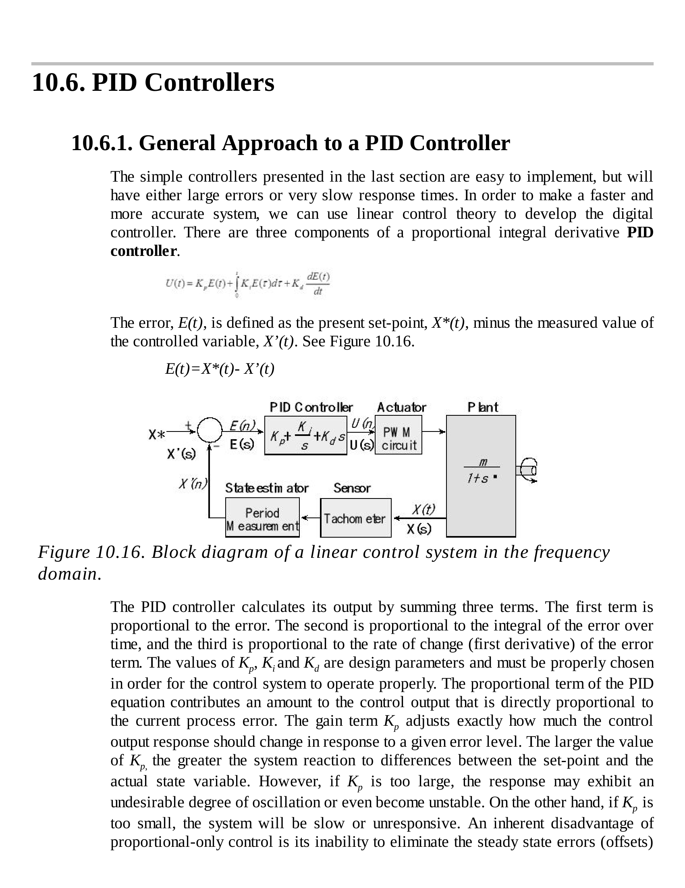
*Description*: Architectural block diagram detailing logic modules, memory buses, internal registers, and hardware interconnections for Figure 10.16: Block diagram of a linear control system in the frequency.

> **Figure 10.16: Block diagram of a linear control system in the frequency**

domain.
The PID controller calculates its output by summing three terms. The first term is
proportional to the error. The second is proportional to the integral of the error over
time, and the third is proportional to the rate of change (first derivative) of the error
term. The values of Kp, Ki and Kd are design parameters and must be properly chosen
in order for the control system to operate properly. The proportional term of the PID
equation contributes an amount to the control output that is directly proportional to
the current process error. The gain term Kp adjusts exactly how much the control
output response should change in response to a given error level. The larger the value
of Kp, the greater the system reaction to differences between the set-point and the
actual state variable. However, if Kp is too large, the response may exhibit an
undesirable degree of oscillation or even become unstable. On the other hand, if Kp is
too small, the system will be slow or unresponsive. An inherent disadvantage of
proportional-only control is its inability to eliminate the steady state errors (offsets)


<!-- Page 511 -->
### [PDF Page 511]

that occur after a set-point change or a sustained load disturbance.
The integral term converts the first order proportional controller into a second order
system capable of tracking process disturbances. It adds to the controller output a
factor that takes corrective action for any changes in the load level of the system.
This integral term is scaled to the sum of all previous process errors in the system.
As long as there is a process error, the integral term will add more amplitude to the
controller output until the sum of all previous errors is zero. Theoretically, as long as
the sign of Ki is correct, any value of Ki will eliminate offset errors. But, for
extremely small values of Ki, the controlled variables will return to the set-point very
slowly after a load upset or set-point change occurs. On the other hand, if Ki is too
large, it tends to produce oscillatory response of the controlled process and reduces
system stability. The undesirable effects of too much integral action can be avoided
by proper tuning (adjusting) the controller or by including derivative action which
tends to counteract the destabilizing effects.
The derivative action of a PID controller adds a term to the controller output scaled
to the slope (rate of change) of the error term. The derivative term “anticipates” the
error, providing a greater control response when the error term is changing in the
wrong direction and a dampening response when the error term is changing in the
correct direction. The derivative term tends to improve the dynamic response of the
controlled variable by decreasing the process setting time, the time it takes the
process to reach steady state. But if the process measurement is noisy, that is, if it
contains high-frequency random fluctuations, then the derivative of the measured
(controlled) variable will change wildly, and derivative action will amplify the noise
unless the measurement is filtered.
Checkpoint 10.5: What happens in a PID controller if the sign of Ki is incorrect?
We can also use just some of the terms. For example a proportional/integrator (PI)
controller drops the derivative term. We will analyze the digital control system in the
frequency domain. Let X(s) be the Laplace transform of the state variable x(t).  Let X*
(s) be the Laplace transform of the desired state variable x*(t). Let E(s) be the
Laplace transform of the error
E(s) = X*(s) - X(s)
Let G(s) be the transfer equation of the PID linear controller. PID controllers are
unique in this aspect. In other words, we cannot write a transfer equation for a bang-
bang, incremental or fuzzy logic controller.
Let H(s) be the transfer equation of the physical plant. If we assume the physical plant
(e.g., a DC motor) has a simple single pole behavior, then we can specify its
response in the frequency domain with two parameters.  m is the DC gain and t is its
time constant. The transfer function of this simple motor is


<!-- Page 512 -->
### [PDF Page 512]

H(s) = m/(1+ts)
The overall gain of the control system is
Theoretically we can choose controller constants, Kp Ki and Kd, to create the desired
controller response. Unfortunately it can be difficult to estimate m and t. If a load is
applied to the motor, then m and t will change.
To simplify the PID controller implementation, we break the controller equation into
separate proportion, integral and derivative terms. I.e., let
U(t) = P(t) + I(t) + D(t)
where U(t)is the actuator output, and  P(t), I(t) and D(t) are the proportional, integral

```assembly
and derivative components respectively. The proportional term makes the actuator
```

output linearly related to the error. Using a proportional term creates a control system
that applies more energy to the plant when the error is large. To implement the
proportional term, we simply convert it to discrete time.
where the index “n” refers to the discrete time input of E(n) and output of P(n).
Observation: In order to develop digital signal processing equations, it is
imperative that the control system be executed on a regular and periodic rate.
Common error:  If the sampling rate varies, then controller errors will occur.
The integral term makes the actuator output related to the integral of the error. Using
an integral term often will improve the steady state error of the control system. If a
small error accumulates for a long time, this term can get large. Some control systems
put upper and lower bounds on this term, called anti-reset-windup, to prevent it from
dominating the other terms. The implementation of the integral term requires the use
of a discrete integral or sum. If I(n) is the current control output, and I(n-1) is the
previous calculation, the integral term is simply
where ∆t is the sampling rate of E(n).
The derivative term makes the actuator output related to the derivative of the error.
This term is usually combined with either the proportional and/or integral term to
improve the transient response of the control system. The proper value of Kd will
provide for a quick response to changes in either the set point or loads on the
physical plant. An incorrect value may create an overdamped (very slow response)
or an underdamped (unstable oscillations) response. There are a couple of ways to
implement the discrete time derivative. The simple approach is


<!-- Page 513 -->
### [PDF Page 513]

In practice, this first order equation is quite susceptible to noise. Figure 10.17 shows
a sequence of E(n) with some added noise. Notice that huge errors occur when the
above equation is used to calculate derivative.

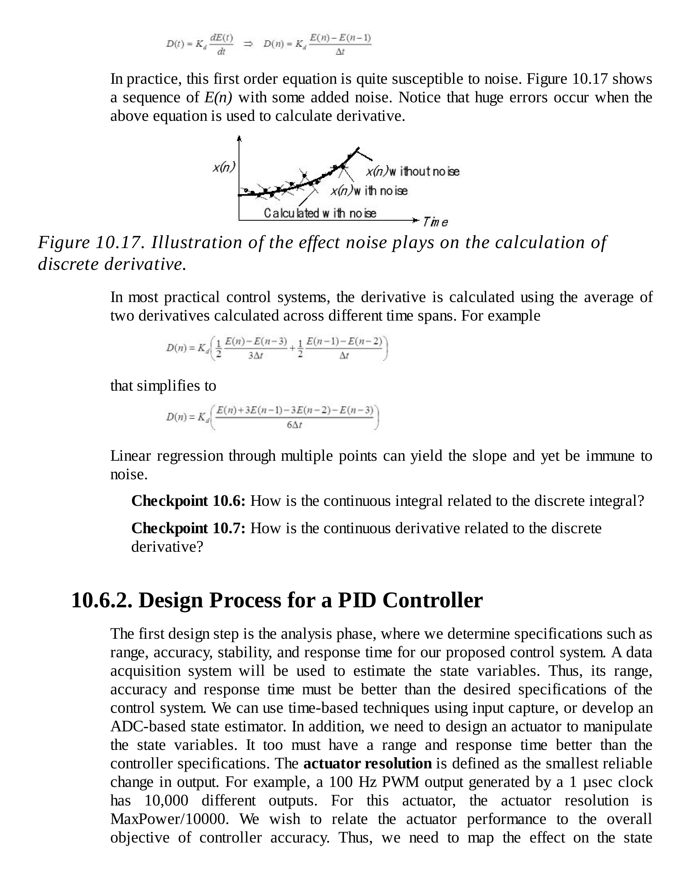
*Description*: Technical schematic and block diagram illustrating circuit operation, signal pathways, and functional behavior for Figure 10.17: Illustration of the effect noise plays on the calculation of.

> **Figure 10.17: Illustration of the effect noise plays on the calculation of**

discrete derivative.
In most practical control systems, the derivative is calculated using the average of
two derivatives calculated across different time spans. For example
that simplifies to
Linear regression through multiple points can yield the slope and yet be immune to
noise.
Checkpoint 10.6: How is the continuous integral related to the discrete integral?
Checkpoint 10.7: How is the continuous derivative related to the discrete
derivative?
10.6.2. Design Process for a PID Controller
The first design step is the analysis phase, where we determine specifications such as
range, accuracy, stability, and response time for our proposed control system. A data
acquisition system will be used to estimate the state variables. Thus, its range,
accuracy and response time must be better than the desired specifications of the
control system. We can use time-based techniques using input capture, or develop an
ADC-based state estimator. In addition, we need to design an actuator to manipulate
the state variables. It too must have a range and response time better than the
controller specifications. The actuator resolution is defined as the smallest reliable
change in output. For example, a 100 Hz PWM output generated by a 1 µsec clock
has 10,000 different outputs. For this actuator, the actuator resolution is
MaxPower/10000. We wish to relate the actuator performance to the overall
objective of controller accuracy. Thus, we need to map the effect on the state


<!-- Page 514 -->
### [PDF Page 514]

variable caused a change in actuator output. This change in state variable should be
less than or equal to the desired controller accuracy.
After the state estimator and actuator are implemented, the controller settings (KP, KI

```assembly
and KD) must be adjusted so that the system performance is satisfactory. This activity
```

is referred to as controller tuning or field tuning. If you perform controller tuning by
guessing the initial setting then adjusting them by trial and error, it can be tedious and
time consuming. Thus, it is desirable to have good initial estimates of controller
settings. A good first setting may be available from experience with similar control
loops. Alternatively, initial estimates of controller settings can be derived from the
transient response of the physical plant. A simple open-loop method, called the
process reaction curve approach, was first proposed by Ziegler/Nichols and
Cohen/Coon in 1953. In this discussion, the term “process” as defined by
Ziegler/Nichols means the same thing as the “physical plant” described earlier in this
chapter. This open-loop method requires only that a single step input be imposed on
the process. The process reaction method is based on a single experimental test that
is made with the controller in the manual mode. A small step change, ΔU, in the
controller output is introduced and the measured process response is recorded, as
shown in Figure 10.18. To obtain parameters of the process, a tangent is drawn to the
process reaction curve at its point of maximum slope (at the inflection point). This
slope is R, which is called the process reaction rate. The intersection of this tangent
line with the original base line gives an indication of L, the process lag.  L is really a
measure of equivalent dead time for the process.  If the tangent drawn at the inflection
point is extrapolated to a vertical axis drawn at the time when the step was imposed,
the amount by which this value is below the horizontal base line will be represented
by the product L*R. Δ T  is the time step for the digital controller. It is recommended
to run P and PI controllers with Δ T = 0.1L , and a PID controller at a rate 20 times
faster (Δ T = 0.05L .) Using these parameters, Ziegler and Nichol proposed initial
controller settings as
Proportional Controller
Kp= Δ U/(L*R)
Proportional-Integral Controller
Kp = 0.9 Δ U/(L*R)
Ki = Kp /(3.33L)
Proportional-Integral-Derivative Controller
Kp = 1.2 Δ U/(L*R)
Ki = 0.5 Kp /L
Kd = 0.5 Kp L


<!-- Page 515 -->
### [PDF Page 515]


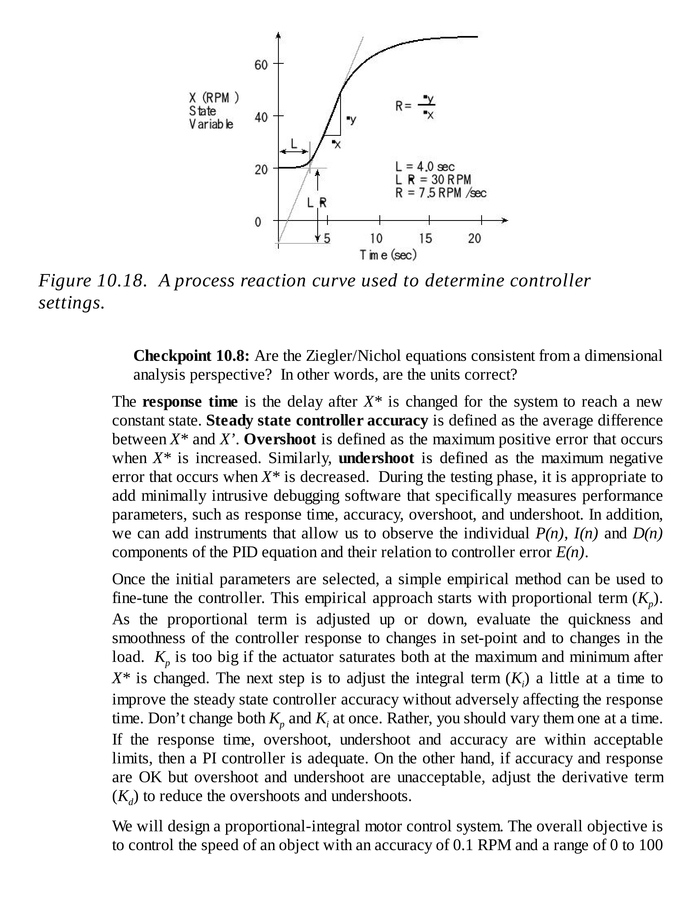
*Description*: Technical schematic and block diagram illustrating circuit operation, signal pathways, and functional behavior for Figure 10.18: A process reaction curve used to determine controller.

> **Figure 10.18: A process reaction curve used to determine controller**

settings.
Checkpoint 10.8: Are the Ziegler/Nichol equations consistent from a dimensional
analysis perspective?  In other words, are the units correct?
The response time is the delay after X* is changed for the system to reach a new
constant state. Steady state controller accuracy is defined as the average difference
between X* and X’. Overshoot is defined as the maximum positive error that occurs
when X* is increased. Similarly, undershoot is defined as the maximum negative
error that occurs when X* is decreased.  During the testing phase, it is appropriate to

```assembly
add minimally intrusive debugging software that specifically measures performance
```

parameters, such as response time, accuracy, overshoot, and undershoot. In addition,
we can add instruments that allow us to observe the individual P(n), I(n) and D(n)
components of the PID equation and their relation to controller error E(n).
Once the initial parameters are selected, a simple empirical method can be used to
fine-tune the controller. This empirical approach starts with proportional term (Kp).
As the proportional term is adjusted up or down, evaluate the quickness and
smoothness of the controller response to changes in set-point and to changes in the
load.  Kp is too big if the actuator saturates both at the maximum and minimum after
X* is changed. The next step is to adjust the integral term (Ki) a little at a time to
improve the steady state controller accuracy without adversely affecting the response
time. Don’t change both Kp and Ki at once. Rather, you should vary them one at a time.
If the response time, overshoot, undershoot and accuracy are within acceptable
limits, then a PI controller is adequate. On the other hand, if accuracy and response
are OK but overshoot and undershoot are unacceptable, adjust the derivative term
(Kd) to reduce the overshoots and undershoots.
We will design a proportional-integral motor control system. The overall objective is
to control the speed of an object with an accuracy of 0.1 RPM and a range of 0 to 100


<!-- Page 516 -->
### [PDF Page 516]

RPM as shown in Figure 10.1. Let X* be the desired state variable.  In this example,
X* will be a decimal fixed-point number and is set by the main program. Let X’ be
the estimated state variable that comes from the state estimator, which encodes the
current position as the period of a squarewave, interfaced to an input capture pin.
The period output of the sensor is linearly related to the position X with a fixed
offset. The accuracy of the state estimator needs to match the 0.1 RPM specification
of the controller. If p is the measured period in 0.1 ms and X’ is the estimated speed
in 0.1 RPM, the state estimator measures the period and calculates X’.
X’ = p-100
Let U be the actuator control variable (100≤U≤19900). This system uses pulse width
modulation with a 100 Hz squarewave that applies energy to the physical plant as
shown in Figure 10.19. U will be the number of clock cycles (out of 20000) that the
output is high. There is an external friction force slowing down on the motor. The
PWM output from the computer creates a force causing the motor to spin faster.

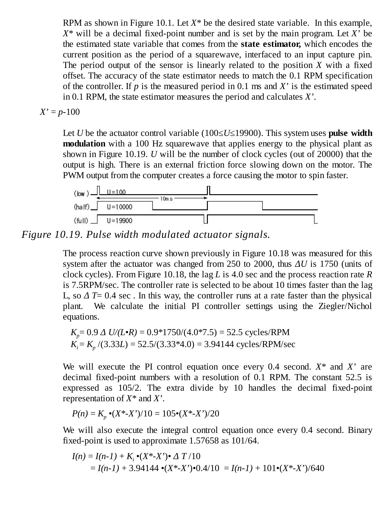
*Description*: Technical schematic and block diagram illustrating circuit operation, signal pathways, and functional behavior for Figure 10.19: Pulse width modulated actuator signals..

> **Figure 10.19: Pulse width modulated actuator signals.**

The process reaction curve shown previously in Figure 10.18 was measured for this
system after the actuator was changed from 250 to 2000, thus ΔU is 1750 (units of
clock cycles). From Figure 10.18, the lag L is 4.0 sec and the process reaction rate R
is 7.5RPM/sec. The controller rate is selected to be about 10 times faster than the lag
L, so Δ T= 0.4 sec . In this way, the controller runs at a rate faster than the physical
plant.  We calculate the initial PI controller settings using the Ziegler/Nichol
equations.
Kp= 0.9 Δ U/(L•R) = 0.9*1750/(4.0*7.5) = 52.5 cycles/RPM
Ki = Kp /(3.33L) = 52.5/(3.33*4.0) = 3.94144 cycles/RPM/sec
We will execute the PI control equation once every 0.4 second. X* and X’ are
decimal fixed-point numbers with a resolution of 0.1 RPM. The constant 52.5 is
expressed as 105/2. The extra divide by 10 handles the decimal fixed-point
representation of X* and X’.
P(n) = Kp •(X*-X’)/10 = 105•(X*-X’)/20
We will also execute the integral control equation once every 0.4 second. Binary
fixed-point is used to approximate 1.57658 as 101/64.
I(n) = I(n-1) + Ki •(X*-X’)• Δ T /10
= I(n-1) + 3.94144 •(X*-X’)•0.4/10  = I(n-1) + 101•(X*-X’)/640


<!-- Page 517 -->
### [PDF Page 517]


*Description*: Technical schematic and block diagram illustrating circuit operation, signal pathways, and functional behavior for Program 10.3: shows an interrupt service handler, which runs at10 kHz. The handler.

> **Program 10.3: shows an interrupt service handler, which runs at10 kHz. The handler**

will establish the current Time  in 0.1 ms. After 4000 interrupts (0.4 second), the
control algorithm is implemented.

```c
uint32_t Time; // Time in 0.1 msec
int32_t X;             // Estimated speed in 0.1 RPM, 0 to 1000
int32_t Xstar;         // Desired speed in 0.1 RPM, 0 to 1000
int32_t E;             // Speed error in 0.1 RPM, -1000 to +1000
int32_t U,I,P;         // Actuator duty cycle, 100 to 19900 cycles
uint32_t Cnt;  // incremented every 0.1 msec
uint32_t Told; // used to measure period
void Timer0A_Handler(void){
Time++;            // used to measure period
if((Cnt++)==4000){ // every 0.4 sec
Cnt = 0;         // 0<X<100, 0<Xstar<100, 100<U<19900
E = Xstar-X;
P = (105*E)/20;
I = I+(101*E)/640;
if(I < -500) I=-500;  // anti-reset windup
if(I > 4000) I=4000;
U = P+I;             // PI controller has two parts
if(U < 100) U=100;   // Constrain actuator output
if(U>19900) U=19900;
PWM0A_Duty(U);       // output to actuator, Section 2.8
}
TIMER0_ICR_R = 0x01;   // acknowledge timer0A periodic timer
}
```


*Description*: Technical schematic and block diagram illustrating circuit operation, signal pathways, and functional behavior for Program 10.3: PI control software..

> **Program 10.3: PI control software.**

Checkpoint 10.9: What is the output U of the controller if the speed X is much
greater than the set-point X*?  In this situation, what does the object do?
Observation: PID control will work extremely well (fast, accurate and stable) if
the physical plant can be described with a set of linear differential equations.


<!-- Page 518 -->
### [PDF Page 518]

10.7. Fuzzy Logic Control
There are a number of reasons to consider fuzzy logic approach to control. It is much
simpler than PID systems. It will require less memory and execute faster. In other
words, an 8-bit fuzzy system may perform as well (same steady state error and
response time) as a 16-bit PID system. When complete knowledge about the physical
plant is known, then a good PID controller can be developed. Since the fuzzy logic
control is more robust (still works even if the parameter constants are not optimal),
then the fuzzy logic approach can be used when complete knowledge about the plant
is not known or can change dynamically. Choosing the proper PID parameters
requires knowledge about the plant. The fuzzy logic approach is more intuitive,
following more closely to the way a “human” would control the system. It is easy to
modify an existing fuzzy control system into a new problem. The framework allows
rapid prototyping.
Fuzzy logic was conceived in the mid-1960s by Lotfi Zadeh while at the University
of California at Berkeley. However, the first commercial application didn’t come
until 1987, when the Matsushita Industrial Electric used it to control the temperature
in a shower head. Named after the nineteenth-century mathematician George Boole,
Boolean logic is an algebra where values are either true or false. This algebra
includes operations of AND OR and NOT. Fuzzy logic is also an algebra, but where
conditions may exist in the continuum between true and false. While Boolean logic
defines two states, 8-bit fuzzy logic consists of 256 states all the way from “not at
all” (0) to “definitely true” (255). “128” means half way between true and false. The
fuzzy logic algebra also includes the operations of AND OR and NOT. A fuzzy
membership set, a fuzzy variable, and a fuzzy set all refer to the same entity,
which is a software variable describing the level of correctness for a condition
within fuzzy logic. If we have a fuzzy membership set for the condition “hungry”, then
as the value of hungry moves from 0 to 255, the condition “hungry” becomes more

```assembly
and more true.
```

....0.....32.....64.....96.....128.....160.....192.....224.....255
Not at all     ...     a little bit    ...    somewhat      ...      mostly    ...    pretty much   ...
definitely
The design process for a fuzzy logic controller solves the following eight
components. These components are listed in the order we would draw a data flow
graph, starting with the state variables, progressing through the controller, and ending
with the actuator output.
• The Physical plant has real state variables.
• The Data Acquisition System monitors these signals creating the estimated state
variables.


<!-- Page 519 -->
### [PDF Page 519]

• The Preprocessor may calculate relevant parameters called crisp inputs.
• Fuzzification will convert crisp inputs into input fuzzy membership sets.
• The Fuzzy Logic is a set of rules that calculate output fuzzy membership sets.
• Defuzzification will convert output sets into crisp outputs.
• The Postprocessor modify crisp outputs into a more convenient format.
• The Actuator System affects the Physical plant based on these output.
We will work through the concepts of fuzzy logic by considering examples of how we
as humans control things like driving a car at a constant speed. During the initial
stages of the design, we study the physical plant and decide which state variables to
consider. For example, if we wish to control speed, then speed is obviously a state
variable, but it might be also useful to know other forces acting on the object such as
gravity (e.g., going up and down hills), wind speed and friction (e.g., rain and snow
on the roadway). The purpose of the data acquisition system is to accurately
measure the state variables. It is at this stage that the system converts physical signals
into binary numbers to be processed by the software controller. We have seen two
basic approaches in this book for this conversion: the measurement of
period/frequency using input capture and the analog to digital conversion using an
ADC. The preprocessor calculates crisp inputs, which are variables describing the
input parameters in our software having units (like miles/hr). For example, if we
measured speed, then some crisp inputs we might calculate would include speed
error, and acceleration. Just like the PID controller, the accuracy of the data
acquisition system must be better than the desired accuracy of the control system as a
whole.
The next stage of the design is to consider the actuator and postprocessor. It is
critical to be able to induce forces on the physical plant in a precise and fast manner.
The step response of the actuator itself (time from software command to the
application of force on the plant) must be faster than the step response of the plant
(time from the application of force to the change in state variable.) Consider the case
where we wish to control the temperature of a pot of water using a stove. The speed
of the actuator is the time between turning the stove on and the time when heat is
applied to the pot. The actuator on a gas stove is much faster than the actuator on an
electric stove. The resolution of an actuator is the smallest change in output it can
reliably generate. Just like the PID controller, the resolution of the actuator
(converted into equivalent units on the input) must be smaller than the desired
accuracy of the control system as a whole. A crisp output is a software variable
describing the output parameters having units (like watts, Newtons, dynes/cm2 etc.).
The postprocessor converts the crisp output into a form that can be directly output to
the actuator.  The postprocessor can verify the output signals are within the valid
range of the actuator. One of the advantages of fuzzy logic design is the usage of
human intuition. Think carefully about how you control the actuator (gas pedal) when
attempting to drive a car at a constant speed. There is no parameter in your brain
specifying the exact position of the pedal (e.g., 50% pressed, 65% pressed etc.),
unless of course you are city taxicab driver (where your brain allows two actuator
states: full gas and full brake.) Rather, what your brain creates as actuator commands


<!-- Page 520 -->
### [PDF Page 520]

are statements like “press the pedal little harder” and “press the pedal a lot softer.”
So, the crisp output of fuzzy logic controller might be change in pedal pressure ΔU,

```assembly
and the postprocessor would calculate U = U+ΔU, then check to make sure U is
```

within an acceptable range.
We continue the design of a fuzzy logic controller by analyzing its crisp inputs. As a
design step, we create a list of true/false conditions that together describe the current
state of the physical plant. In particular, we define input fuzzy membership sets,
which are fuzzy logic variables describing conditions related to the state of the
physical plant. These fuzzy variables do not need to be orthogonal. In other words, it
is acceptable to have variables that are related to each other. When designing a speed
controller, we could define multiple fuzzy variables referring to similar conditions,
such as WayTooFast , Fast , and LittleBitFast . Given the scenario where we are
driving too fast, there should be generous overlap in conditions, such that two or
even three fuzzy sets are simultaneously partially true. On the other hand, it is
important that the entire list of input membership fuzzy sets, when considered as an
ensemble, form a complete definition of the status of the physical plant. For example,
if
we
are
attempting
to
drive
a
car
at
a
constant
speed,
then SlowingUp , GoingSteady , and SpeedingUp  might be input fuzzy variables
describing the car’s acceleration. Fuzzification is the mathematical step converting
the crisp inputs into input fuzzy membership sets. When implementing fuzzy logic
explicitly with C code, we will have available the full set of AND, OR, NOT fuzzy
logic operations.
The heart of a fuzzy logic controller is the fuzzy logic itself, which is set of logic
equations that calculate fuzzy outputs as a function of fuzzy inputs. An output fuzzy
membership setis a fuzzy logic variable describing a condition related to the
actuator. QuickStop , SlowDown , JustRight , MorePower , and MaxPower  are
examples of output fuzzy variables that might be used to describe the action to
perform on the gas pedal. Like input fuzzy variables, output fuzzy variables exist in
the continuum from definitely false (0) to definitely true (1). Just like the input
specification, it is also important to create a list of output membership fuzzy sets,
when considered as an ensemble, form a complete characterization of what we wish
to be able to do with the actuator. We write fuzzy logic equations using AND and OR
functions in a way similar to Boolean logic. The fuzzy logic AND is calculated as the
minimum value of the two inputs, and the fuzzy logic OR is calculated as the
maximum value of the two inputs. The design of the rules, like the other aspects of
fuzzy control, follows the human intuition.
SlowDown = WayTooFast + SpeedingUp*LittleBitFast
Checkpoint 10.10:If WayTooFast is 50, SpeedingUp is 40, and LittleBitFast is
60, then what would be the calculated value for SlowDown ?
The defuzzification stage of the controller converts the output fuzzy variables into


<!-- Page 521 -->
### [PDF Page 521]

crisp outputs. Although any function could be used, an effective approach is to use a
weighted average. Consider the case where the pedal pressure U varies from 0 to
100, thus the crisp output ΔUcan take on values from -100 to +100. We think about
what crisp output we want if just QuickStop  were to be true. In this case, we wish
to
make
ΔUequal
to
-100.
We
then
define
crisp
output
values
for SlowDown , JustRight , MorePower , and MaxPower  as -10, 0, +10, and +100
respectfully. We can combine the five factors using a weighted average.
Because the fuzzy controller is modular, we begin by testing each of the modules
separately. The system-level testing of a fuzzy logic controller follows a procedure
similar to the PID controller tuning. Debugging instruments can be added to record
the crisp inputs, fuzzy inputs, fuzzy outputs, and crisp outputs during the real-time
operation of the system. Fuzzification parameters are adjusted so that the status of the
plant is captured in the set of values contained in the fuzzy input variables. Next, the
rules are adjusted so that fuzzy output variables properly describe what we want to
do with the actuator. Lastly, the defuzzification parameters are adjusted so the proper
crisp outputs are created.
Next we will design a fuzzy logic motor controller. The actuator is a PWM (Figure
10.2). The power to the motor is controlled by varying the 8-bit PWM duty cycle.
The motor speed is estimated with a tachometer connected to an input capture pin.
Our system has:
• two control inputs
S*
the desired motor speed in RPM
S’
the current estimated motor speed RPM
• one control output
N
the digital value that we write to the PWM
To utilize 8-bit math, we change the units of speed to 1000/256=3.90625 RPM.
T* =(256•S*)/1000
the desired motor speed in 3.9 RPM
T’ =(256•S’)/1000 the current estimated motor speed 3.9 RPM
For example, if the desired speed is 500 RPM, then T* will be 128. Notice that the
estimated speed, T’, is measured by the input capture pin. In other words, the control
system functions (estimate state variables, control equation calculations, and actuator
output) are performed on a regular and periodic basis, every ∆t time units. This
allows signal processing techniques to the used. We will let T’(n) refer to the current
measurement and T’(n-1) refer to the previous measurement, i.e., the one measured ∆t
time ago.
In the fuzzy logic approach, we begin by considering how a “human” would control
the motor. Assume your hand were on a joystick (or your foot on a gas pedal) and
consider how you would adjust the joystick to maintain a constant speed. We select


<!-- Page 522 -->
### [PDF Page 522]

crisp inputs and outputs to base our control system on. It is logical to look at the error

```assembly
and the change in speed when developing a control system. Our fuzzy logic system
```

will have two crisp inputs
E = T*-T’
the error in motor speed in 3.9rpm
D = T’(n)-T’(n-1)
the change in motor speed in 3.9rpm/time
Notice that if we perform the calculations of D on periodic intervals, then D will
represent the derivative of T’, dT’/dt. T* and T’ are 8-bit unsigned numbers, so the
potential range of E varies from -255 to +255. Errors beyond ±127 will be adjusted
to the extremes +127 or -128 without loss of information.

```c
int8_t static Subtract(uint8_t N, uint8_t M){
// returns N-M
uint32_t N16,M16;
int32_t Result16;
N16 = N;              // Promote N,M
M16 = M;
Result16 = N16-M16;   // -255≤Result16≤+255
if(Result16<-128) Result16 = -128;
if(Result16>127)  Result16 = 127;
return(Result16);}
```


*Description*: Technical schematic and block diagram illustrating circuit operation, signal pathways, and functional behavior for Program 10.4: Subtraction with overflow/underflow checking..

> **Program 10.4: Subtraction with overflow/underflow checking.**

These are the global definitions of the input signals and fuzzy logic crisp input,

```c
uint8_t Ts;     // Desired Speed in 3.9 rpm units
uint8_t T;      // Current Speed in 3.9 rpm units
uint8_t Told;   // Previous Speed in 3.9 rpm units
int8_t D;      // Change in Speed in 3.9 rpm/time units
int8_t E;       // Error in Speed in 3.9 rpm units
```


*Description*: Technical schematic and block diagram illustrating circuit operation, signal pathways, and functional behavior for Program 10.5: Inputs and crisp inputs..

> **Program 10.5: Inputs and crisp inputs.**

Common error: Neglecting overflow and underflow can cause significant errors.
The need for the special Subtract  function can be demonstrated with the following
example:
E = Ts-T;  // if Ts=200 and T=50 then E will be -106!!
This function can be used to calculate both E and D,

```c
void CrispInput(void){
E    = Subtract(Ts,T);
D    = Subtract(T,Told);
Told = T;}     // Set up Told for next time
```


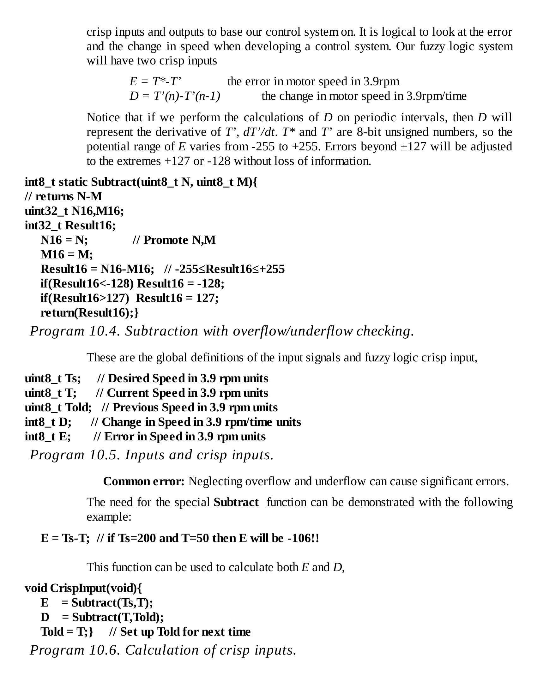
*Description*: Technical schematic and block diagram illustrating circuit operation, signal pathways, and functional behavior for Program 10.6: Calculation of crisp inputs..

> **Program 10.6: Calculation of crisp inputs.**


<!-- Page 523 -->
### [PDF Page 523]

Now, if Ts=200 and T=50 then E  will be +127. To control the actuator, we could
simply choose a new PWM value N as the crisp output. Instead, we will select, ∆N
that is the change in N, rather than N itself because it better mimics how a “human”
would control it. Again, think about how you control the speed of your car when
driving. You do not adjust the gas pedal to a certain position, but rather make small
or large changes to its position in order to speed up or slow down. Similarly, when
controlling the temperature of the water in the shower, you do not set the hot/cold
controls to certain absolute positions. Again you make differential changes to affect
the “actuator” in this control system.  Our fuzzy logic system will have one crisp
output:
∆N
change in output, N=N+∆N in PWM units
Next we introduce fuzzy membership sets that define the current state of the crisp
inputs and outputs. Fuzzy membership sets are variables that have true/false values.
The value of a fuzzy membership set ranges from definitely true (255) to definitely
false (0). For example, if a fuzzy membership set has a value of 128, you are stating
the condition is half way between true and false.  For each membership set, it is
important to assign a meaning or significance to it. The calculation of the input
membership sets is called Fuzzification. For this simple fuzzy controller, we will
define 6 membership sets for the crisp inputs:
Slow
True if the motor is spinning too slow
OK
True if the motor is spinning at the proper speed
Fast
True if the motor is spinning too fast
Up
True if the motor speed is getting larger
Constant
True if the motor speed is remaining the same
Down
True if the motor speed is getting smaller.
We will define 3 membership sets for the crisp output:
Decrease
True if the motor speed should be decreased
Same
True if the motor speed should remain the same
Increase
True if the motor speed should be increased
The fuzzy membership sets are usually defined graphically, but software must be
written to actually calculate each. In this implementation, we will define three
adjustable thresholds, TE, TD and TN. These are software constants and provide
some fine tuning to the control system. We will set each threshold to 20. If you build
one of these fuzzy systems, try varying one threshold at a time and observe the system
behavior (steady state controller error and transient response.) If the error, E, is -5
(3.9rpm units), the fuzzy logic will say that Fast is 64 (25% true), OK is 192 (75%
true), and Slow is 0 (definitely false.) If the error, E, is +21 (in 3.9rpm units), the
fuzzy logic will say that Fast is 0 (definitely false), OK is 0 (definitely false), and
Slow is 255 (definitely true.)  TE is defined to be the error (e.g., 20 in 3.9 rpm units
is 78 rpm) above which we will definitely consider the speed to be too fast.


<!-- Page 524 -->
### [PDF Page 524]

Similarly, if the error is less than -TE, then the speed is definitely too slow.


*Description*: Technical schematic and block diagram illustrating circuit operation, signal pathways, and functional behavior for Figure 10.20: Fuzzification of the error input..

> **Figure 10.20: Fuzzification of the error input.**

In this fuzzy system, the input membership sets are continuous piece-wise linear
functions. Also, for each crisp input value, Fast, OK, Slow sum to 255. In general, it
is possible for the fuzzy membership sets to be nonlinear or discontinuous, and the
membership values do not have to sum to 255. The other three input fuzzy
membership sets depend on the crisp input, D. TD is defined to be the change in
speed (e.g., 20 in 3.9 rpm/time units is 78 rpm/time) above which we will definitely
consider the speed to be going up. Similarly, if the change in speed is less than -TD,
then the speed is definitely going down.

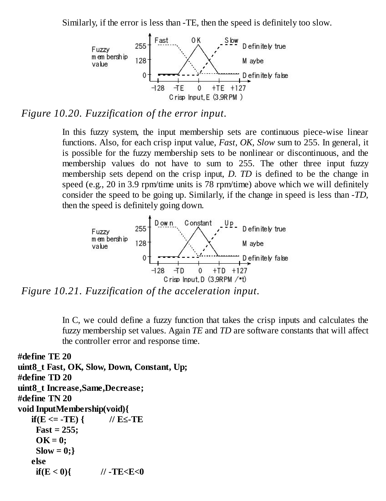
*Description*: Technical schematic and block diagram illustrating circuit operation, signal pathways, and functional behavior for Figure 10.21: Fuzzification of the acceleration input..

> **Figure 10.21: Fuzzification of the acceleration input.**

In C, we could define a fuzzy function that takes the crisp inputs and calculates the
fuzzy membership set values. Again TE and TD are software constants that will affect
the controller error and response time.
#define TE 20

```c
uint8_t Fast, OK, Slow, Down, Constant, Up;
```

#define TD 20

```c
uint8_t Increase,Same,Decrease;
```

#define TN 20

```c
void InputMembership(void){
if(E <= -TE) {           // E≤-TE
Fast = 255;
OK = 0;
Slow = 0;}
```

else

```c
if(E < 0){             // -TE<E<0
```


<!-- Page 525 -->
### [PDF Page 525]

Fast = (255*(-E))/TE;
OK = 255-Fast;
Slow = 0;}
else

```c
if(E < TE){           //  0<E<TE
Fast = 0;
Slow = (255*E)/TE;
OK = 255-Slow;}
else {                // +TE≤E
Fast = 0;
OK = 0;
Slow = 255;}
if(D <= -TD) {            // D≤-TD
Down = 255;
Constant = 0;
Up = 0;}
```

else

```c
if(D < 0){              // -TD<D<0
Down = (255*(-D))/TD;
Constant = 255-Down;
Up = 0;}
```

else

```c
if(D < TD){           // 0<D<TD
Down = 0;
Up = (255*D)/TD;
Constant = 255-Up;}
else{                // +TD≤D
Down = 0;
Constant = 0;
Up = 255;}
}
```


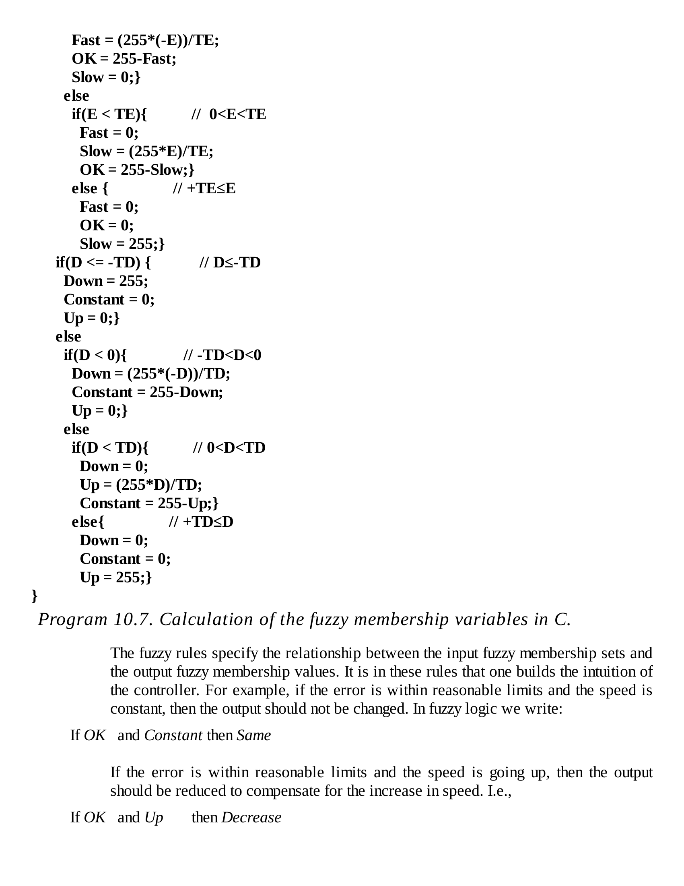
*Description*: Technical schematic and block diagram illustrating circuit operation, signal pathways, and functional behavior for Program 10.7: Calculation of the fuzzy membership variables in C..

> **Program 10.7: Calculation of the fuzzy membership variables in C.**

The fuzzy rules specify the relationship between the input fuzzy membership sets and
the output fuzzy membership values. It is in these rules that one builds the intuition of
the controller. For example, if the error is within reasonable limits and the speed is
constant, then the output should not be changed. In fuzzy logic we write:
If OK   and Constant then Same
If the error is within reasonable limits and the speed is going up, then the output
should be reduced to compensate for the increase in speed. I.e.,
If OK   and Up       then Decrease


<!-- Page 526 -->
### [PDF Page 526]

If the motor is spinning too fast and the speed is constant, then the output should be
reduced to compensate for the error. I.e.,
If Fast and Constant then Decrease
If the motor is spinning too fast and the speed is going up, then the output should be
reduced to compensate for both the error and the increase in speed. I.e.,
If Fast and Up       then Decrease
If the error is within reasonable limits and the speed is going down, then the output
should be increased to compensate for the drop in speed. I.e.,
If OK   and Down     then Increase
If the motor is spinning too slowly and the speed is constant, then the output should be
increased to compensate for the error. I.e.,
If Slow and Constant then Increase
If the motor is spinning too slowly and the speed is going down, then the output
should be increase to compensate for both the error and the drop in speed. I.e.,
If Slow and Down     then Increase
These 7 rules can be illustrated in a table form.

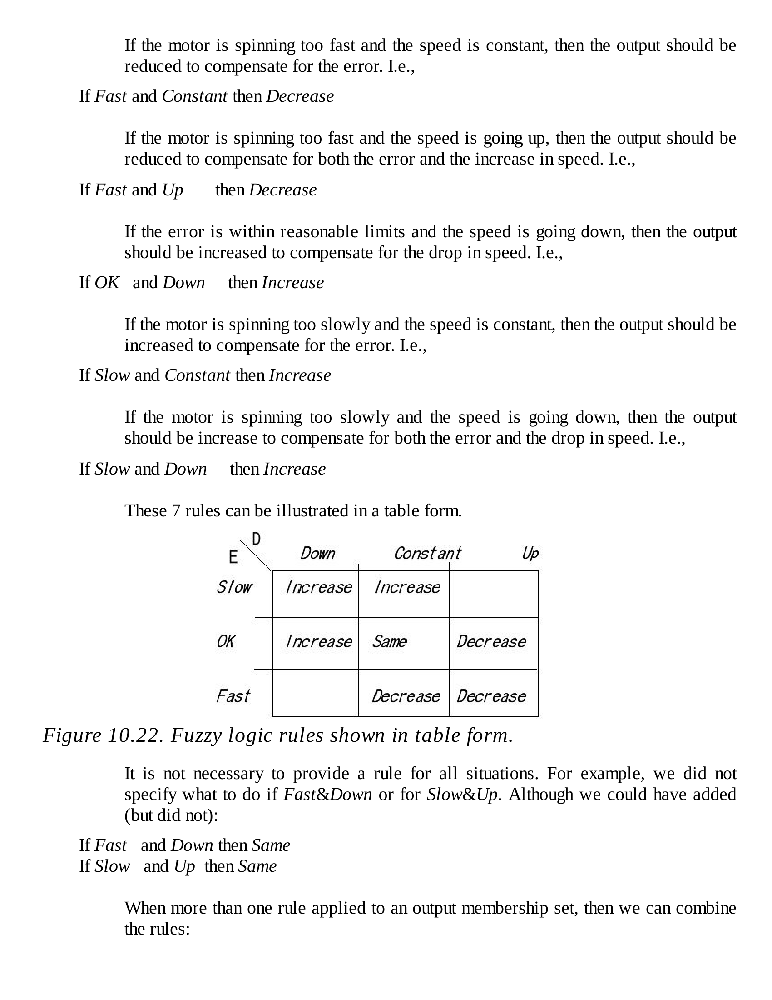
*Description*: Reference table detailing hardware parameters, register bit patterns, performance metrics, or memory configurations for Figure 10.22: Fuzzy logic rules shown in table form..

> **Figure 10.22: Fuzzy logic rules shown in table form.**

It is not necessary to provide a rule for all situations. For example, we did not
specify what to do if Fast&Down or for Slow&Up. Although we could have added
(but did not):
If Fast   and Down then Same
If Slow   and Up  then Same
When more than one rule applied to an output membership set, then we can combine
the rules:


<!-- Page 527 -->
### [PDF Page 527]

Same=(OKandConstant)
Decrease=(OKandUp)or(FastandConstant)or(FastandUp)
Increase=(OKandDown)or(SlowandConstant)or(SlowandDown)
In fuzzy logic, the and operation is performed by taking the minimum and the or
operation is the maximum. Thus the C function that calculates the three output fuzzy
membership sets is

```c
uint8_t static min(uint8_t u1,uint8_t u2){
if(u1>u2) return(u2);
else return(u1);}
uint8_t static max(uint8_t u1,uint8_t u2){
if(u1<u2) return(u2);
else return(u1);}
void OutputMembership(void){
Same     = min(OK,Constant);
Decrease = min(OK,Up)
Decrease = max(Decrease,min(Fast,Constant));
Decrease = max(Decrease,min(Fast,Up));
Increase = min(OK,Down)
Increase = max(Increase,min(Slow,Constant));
Increase = max(Increase,min(Slow,Down));}
```


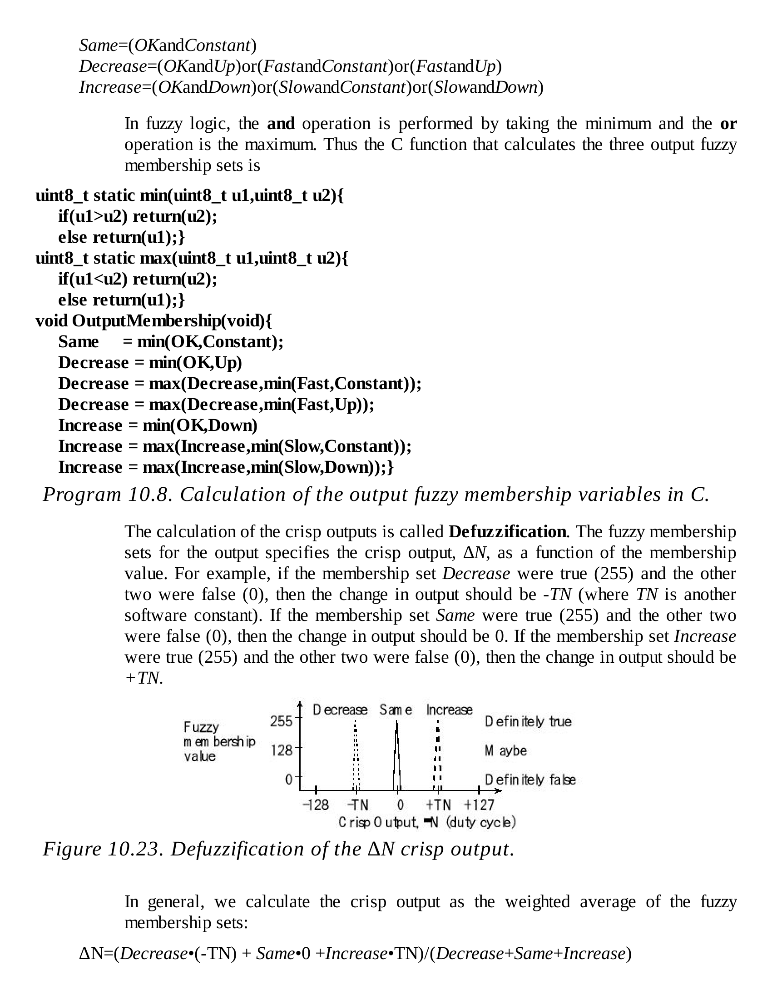
*Description*: Technical schematic and block diagram illustrating circuit operation, signal pathways, and functional behavior for Program 10.8: Calculation of the output fuzzy membership variables in C..

> **Program 10.8: Calculation of the output fuzzy membership variables in C.**

The calculation of the crisp outputs is called Defuzzification. The fuzzy membership
sets for the output specifies the crisp output, ∆N, as a function of the membership
value. For example, if the membership set Decrease were true (255) and the other
two were false (0), then the change in output should be -TN (where TN is another
software constant). If the membership set Same were true (255) and the other two
were false (0), then the change in output should be 0. If the membership set Increase
were true (255) and the other two were false (0), then the change in output should be
+TN.


*Description*: Technical schematic and block diagram illustrating circuit operation, signal pathways, and functional behavior for Figure 10.23: Defuzzification of the ∆N crisp output..

> **Figure 10.23: Defuzzification of the ∆N crisp output.**

In general, we calculate the crisp output as the weighted average of the fuzzy
membership sets:
∆N=(Decrease•(-TN) + Same•0 +Increase•TN)/(Decrease+Same+Increase)


<!-- Page 528 -->
### [PDF Page 528]

The C compiler will promote the calculations to 32 bits, and perform the calculation
using 32-bit signed math that will eliminate overflow on intermediate terms. The
output, dN, will be bounded in between -TN and +TN. Thus the C function that
calculates the crisp output is

```c
int32_t dN;
void CrispOutput(void){
dN=(TN*(Increase-Decrease))/(Decrease+Same+Increase);
}
```


*Description*: Technical schematic and block diagram illustrating circuit operation, signal pathways, and functional behavior for Program 10.9: Calculation of the crisp output in C..

> **Program 10.9: Calculation of the crisp output in C.**


```c
void Timer0A_Handler(void){
T = SE();            // estimate speed, set T, 0 to 255
CrispInput();        // Calculate E,D and new Told
InputMembership();   // Sets Fast,OK,Slow,Down,Constant,Up
OutputMembership();  // Sets Increase,Same,Decrease
CrispOutput();       // Sets dN
N = max(0,min(N+dN,255));
PWM0A_Duty(N);       // output to actuator, Section 2.8
TIMER0_ICR_R = 0x01; // acknowledge timer0A periodic timer
}
```


*Description*: Technical schematic and block diagram illustrating circuit operation, signal pathways, and functional behavior for Program 10.10: Periodic interrupt service for fuzzy logic controller..

> **Program 10.10: Periodic interrupt service for fuzzy logic controller.**

Observation: Fuzzy logic control will work extremely well (fast, accurate and
stable) if the designer has expert knowledge (intuition) of how the physical plant
behaves.


<!-- Page 529 -->
### [PDF Page 529]

10.8. Exercises

## 10.1 For each term give a definition in 16 words or less.

a) State variable
b) State estimator
c) Closed loop
d) Transient response
e) Stability
f) Steady state accuracy
g) Process reaction curve
h) Process reaction rate
i) Anti-reset windup

## 10.2 For each control algorithm give a definition in 16 words or less.

a) Open loop
b) Bang-bang
c) Incremental
d) PID
e) Input PI
f) Fuzzy logic

## 10.3 For each Fuzzy Logic term give a definition in 16 words or less.

a) Crisp input
b) Fuzzification
c) Fuzzy membership set
d) Fuzzy logic
e) Defuzzification
f) Crisp output

## 10.4 Briefly explain why it is important to choose the proper update rate for a fuzzy

logic controller. In particular, explain what happens to a fuzzy logic controller if the
controller is executed too infrequently. Similarly, explain what happens to a fuzzy
logic controller if the controller is executed too frequently.
10.5. Assume you have an 8-bit fuzzy logic system like the ones described in this
chapter. Write formal descriptions for the complement and exclusive or fuzzy logic
operations. Show C code implementations for these two functions.

## 10.6   The objective of this problem is to use the Ziegler and Nichol approach to

develop the PI controller equations that allow an embedded system to control a DC
motor. The state variable is speed, which is measured using 16-bit input capture and
has a measurement resolution of 1 RPM. The input capture device driver repeatedly
updates a global variable, called Speed . This 16-bit unsigned variable has units of
RPM and a range of 0 to 20000.  The microcontroller uses pulse-width modulation to
control power to the motor. The controller software writes to a global variable,
called Duty , which ranges from 0 (0%) to 10000 (100%). The following plot shows
an experimental measurement obtained when Duty is changed from 2500 to 5000.
The desired speed is stored in the global variable, Desired , which has the same
units as Speed . Design a fixed-point PI controller that takes Speed and Desired as
inputs and calculates Duty  as an output. From the response graph in Figure 10.24,
estimate the L and Rparameters of the Ziegler and Nichol method. How often should
the controller be executed? Show just the equations (no software or hardware is
required), calculating Duty as a function of Speed and Desired .


<!-- Page 530 -->
### [PDF Page 530]


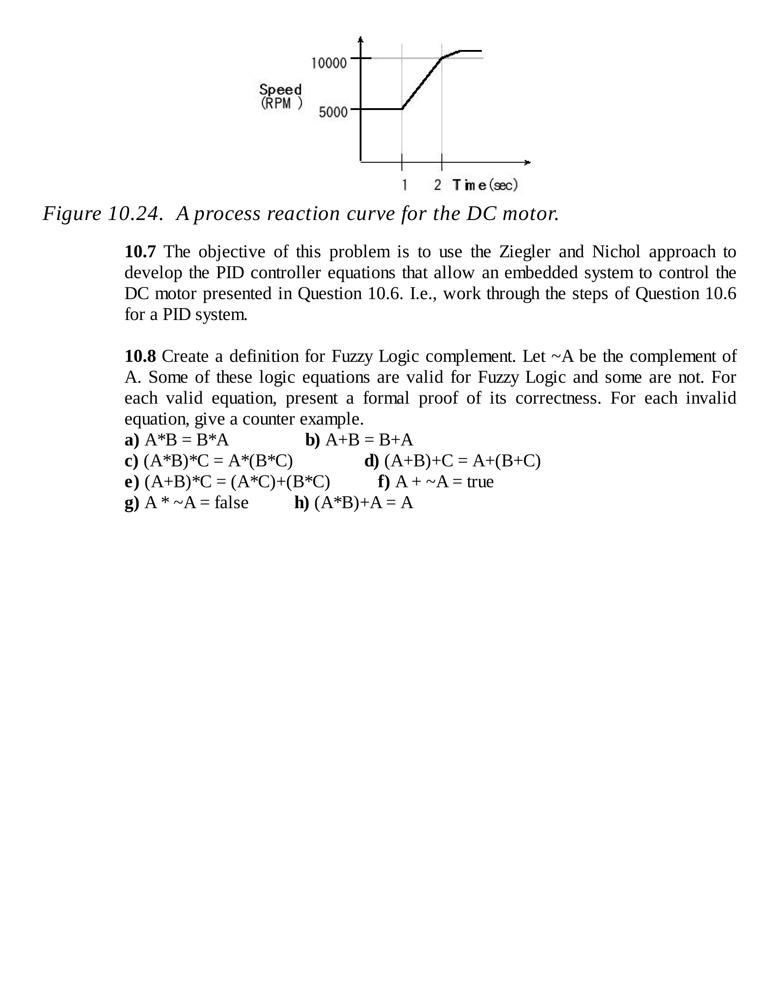
*Description*: Technical schematic and block diagram illustrating circuit operation, signal pathways, and functional behavior for Figure 10.24: A process reaction curve for the DC motor..

> **Figure 10.24: A process reaction curve for the DC motor.**


## 10.7 The objective of this problem is to use the Ziegler and Nichol approach to

develop the PID controller equations that allow an embedded system to control the
DC motor presented in Question 10.6. I.e., work through the steps of Question 10.6
for a PID system.

## 10.8 Create a definition for Fuzzy Logic complement. Let ~A be the complement of

A. Some of these logic equations are valid for Fuzzy Logic and some are not. For
each valid equation, present a formal proof of its correctness. For each invalid
equation, give a counter example.
a) A*B = B*A
b) A+B = B+A
c) (A*B)*C = A*(B*C)
d) (A+B)+C = A+(B+C)
e) (A+B)*C = (A*C)+(B*C)
f) A + ~A = true
g) A * ~A = false
h) (A*B)+A = A


