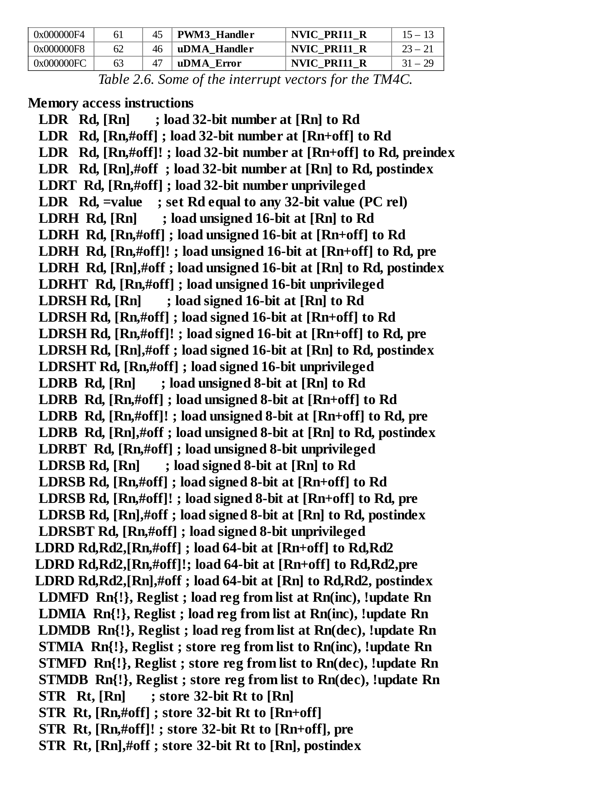

# Reference Material & Index

> **Textbook**: Embedded Systems: Real-Time Operating Systems for ARM Cortex-M Microcontrollers  
> **Author**: Jonathan W. Valvano  
> **PDF Page Range**: 563 - 569


---


<!-- Page 563 -->
### [PDF Page 563]

Reference Material
Vector
address
Number
IRQ
ISR name in Startup.s
NVIC
Priority
bits
0x00000038
14
-2
PendSV_Handler
NVIC_SYS_PRI3_R
23 – 21
0x0000003C
15
-1
SysTick_Handler
NVIC_SYS_PRI3_R
31 – 29
0x00000040
16
0
GPIOPortA_Handler
NVIC_PRI0_R
7 – 5
0x00000044
17
1
GPIOPortB_Handler
NVIC_PRI0_R
15 – 13
0x00000048
18
2
GPIOPortC_Handler
NVIC_PRI0_R
23 – 21
0x0000004C
19
3
GPIOPortD_Handler
NVIC_PRI0_R
31 – 29
0x00000050
20
4
GPIOPortE_Handler
NVIC_PRI1_R
7 – 5
0x00000054
21
5
UART0_Handler
NVIC_PRI1_R
15 – 13
0x00000058
22
6
UART1_Handler
NVIC_PRI1_R
23 – 21
0x0000005C
23
7
SSI0_Handler
NVIC_PRI1_R
31 – 29
0x00000060
24
8
I2C0_Handler
NVIC_PRI2_R
7 – 5
0x00000064
25
9
PWMFault_Handler
NVIC_PRI2_R
15 – 13
0x00000068
26
10
PWM0_Handler
NVIC_PRI2_R
23 – 21
0x0000006C
27
11
PWM1_Handler
NVIC_PRI2_R
31 – 29
0x00000070
28
12
PWM2_Handler
NVIC_PRI3_R
7 – 5
0x00000074
29
13
Quadrature0_Handler
NVIC_PRI3_R
15 – 13
0x00000078
30
14
ADC0_Handler
NVIC_PRI3_R
23 – 21
0x0000007C
31
15
ADC1_Handler
NVIC_PRI3_R
31 – 29
0x00000080
32
16
ADC2_Handler
NVIC_PRI4_R
7 – 5
0x00000084
33
17
ADC3_Handler
NVIC_PRI4_R
15 – 13
0x00000088
34
18
WDT_Handler
NVIC_PRI4_R
23 – 21
0x0000008C
35
19
Timer0A_Handler
NVIC_PRI4_R
31 – 29
0x00000090
36
20
Timer0B_Handler
NVIC_PRI5_R
7 – 5
0x00000094
37
21
Timer1A_Handler
NVIC_PRI5_R
15 – 13
0x00000098
38
22
Timer1B_Handler
NVIC_PRI5_R
23 – 21
0x0000009C
39
23
Timer2A_Handler
NVIC_PRI5_R
31 – 29
0x000000A0
40
24
Timer2B_Handler
NVIC_PRI6_R
7 – 5
0x000000A4
41
25
Comp0_Handler
NVIC_PRI6_R
15 – 13
0x000000A8
42
26
Comp1_Handler
NVIC_PRI6_R
23 – 21
0x000000AC
43
27
Comp2_Handler
NVIC_PRI6_R
31 – 29
0x000000B0
44
28
SysCtl_Handler
NVIC_PRI7_R
7 – 5
0x000000B4
45
29
FlashCtl_Handler
NVIC_PRI7_R
15 – 13
0x000000B8
46
30
GPIOPortF_Handler
NVIC_PRI7_R
23 – 21
0x000000BC
47
31
GPIOPortG_Handler
NVIC_PRI7_R
31 – 29
0x000000C0
48
32
GPIOPortH_Handler
NVIC_PRI8_R
7 – 5
0x000000C4
49
33
UART2_Handler
NVIC_PRI8_R
15 – 13
0x000000C8
50
34
SSI1_Handler
NVIC_PRI8_R
23 – 21
0x000000CC
51
35
Timer3A_Handler
NVIC_PRI8_R
31 – 29
0x000000D0
52
36
Timer3B_Handler
NVIC_PRI9_R
7 – 5
0x000000D4
53
37
I2C1_Handler
NVIC_PRI9_R
15 – 13
0x000000D8
54
38
Quadrature1_Handler
NVIC_PRI9_R
23 – 21
0x000000DC
55
39
CAN0_Handler
NVIC_PRI9_R
31 – 29
0x000000E0
56
40
CAN1_Handler
NVIC_PRI10_R
7 – 5
0x000000E4
57
41
CAN2_Handler
NVIC_PRI10_R
15 – 13
0x000000E8
58
42
Ethernet_Handler
NVIC_PRI10_R
23 – 21
0x000000EC
59
43
Hibernate_Handler
NVIC_PRI10_R
31 – 29
0x000000F0
60
44
USB0_Handler
NVIC_PRI11_R
7 – 5


<!-- Page 564 -->
### [PDF Page 564]

0x000000F4
61
45
PWM3_Handler
NVIC_PRI11_R
15 – 13
0x000000F8
62
46
uDMA_Handler
NVIC_PRI11_R
23 – 21
0x000000FC
63
47
uDMA_Error
NVIC_PRI11_R
31 – 29


*Description*: Reference table detailing hardware parameters, register bit patterns, performance metrics, or memory configurations for Table 2.6: Some of the interrupt vectors for the TM4C..

> **Table 2.6: Some of the interrupt vectors for the TM4C.**

Memory access instructions

```assembly
LDR   Rd, [Rn]       ; load 32-bit number at [Rn] to Rd
LDR   Rd, [Rn,#off] ; load 32-bit number at [Rn+off] to Rd
LDR   Rd, [Rn,#off]! ; load 32-bit number at [Rn+off] to Rd, preindex
LDR   Rd, [Rn],#off  ; load 32-bit number at [Rn] to Rd, postindex
LDRT  Rd, [Rn,#off] ; load 32-bit number unprivileged
LDR   Rd, =value    ; set Rd equal to any 32-bit value (PC rel)
LDRH  Rd, [Rn]       ; load unsigned 16-bit at [Rn] to Rd
LDRH  Rd, [Rn,#off] ; load unsigned 16-bit at [Rn+off] to Rd
LDRH  Rd, [Rn,#off]! ; load unsigned 16-bit at [Rn+off] to Rd, pre
LDRH  Rd, [Rn],#off ; load unsigned 16-bit at [Rn] to Rd, postindex
LDRHT  Rd, [Rn,#off] ; load unsigned 16-bit unprivileged
LDRSH Rd, [Rn]       ; load signed 16-bit at [Rn] to Rd
LDRSH Rd, [Rn,#off] ; load signed 16-bit at [Rn+off] to Rd
LDRSH Rd, [Rn,#off]! ; load signed 16-bit at [Rn+off] to Rd, pre
LDRSH Rd, [Rn],#off ; load signed 16-bit at [Rn] to Rd, postindex
LDRSHT Rd, [Rn,#off] ; load signed 16-bit unprivileged
LDRB  Rd, [Rn]       ; load unsigned 8-bit at [Rn] to Rd
LDRB  Rd, [Rn,#off] ; load unsigned 8-bit at [Rn+off] to Rd
LDRB  Rd, [Rn,#off]! ; load unsigned 8-bit at [Rn+off] to Rd, pre
LDRB  Rd, [Rn],#off ; load unsigned 8-bit at [Rn] to Rd, postindex
LDRBT  Rd, [Rn,#off] ; load unsigned 8-bit unprivileged
LDRSB Rd, [Rn]       ; load signed 8-bit at [Rn] to Rd
LDRSB Rd, [Rn,#off] ; load signed 8-bit at [Rn+off] to Rd
LDRSB Rd, [Rn,#off]! ; load signed 8-bit at [Rn+off] to Rd, pre
LDRSB Rd, [Rn],#off ; load signed 8-bit at [Rn] to Rd, postindex
LDRSBT Rd, [Rn,#off] ; load signed 8-bit unprivileged
LDRD Rd,Rd2,[Rn,#off] ; load 64-bit at [Rn+off] to Rd,Rd2
LDRD Rd,Rd2,[Rn,#off]!; load 64-bit at [Rn+off] to Rd,Rd2,pre
LDRD Rd,Rd2,[Rn],#off ; load 64-bit at [Rn] to Rd,Rd2, postindex
LDMFD  Rn{!}, Reglist ; load reg from list at Rn(inc), !update Rn
LDMIA  Rn{!}, Reglist ; load reg from list at Rn(inc), !update Rn
LDMDB  Rn{!}, Reglist ; load reg from list at Rn(dec), !update Rn
STMIA  Rn{!}, Reglist ; store reg from list to Rn(inc), !update Rn
STMFD  Rn{!}, Reglist ; store reg from list to Rn(dec), !update Rn
STMDB  Rn{!}, Reglist ; store reg from list to Rn(dec), !update Rn
STR   Rt, [Rn]       ; store 32-bit Rt to [Rn]
STR  Rt, [Rn,#off] ; store 32-bit Rt to [Rn+off]
STR  Rt, [Rn,#off]! ; store 32-bit Rt to [Rn+off], pre
STR  Rt, [Rn],#off ; store 32-bit Rt to [Rn], postindex
```


<!-- Page 565 -->
### [PDF Page 565]

STRT   Rt, [Rn,#off] ; store 32-bit Rt to [Rn+off] unprivileged
STRH Rt, [Rn]       ; store least sig. 16-bit Rt to [Rn]
STRH  Rt, [Rn,#off] ; store least sig. 16-bit Rt to [Rn+off]
STRH  Rt, [Rn,#off]! ; store least sig. 16-bit Rt to [Rn+off], pre
STRH  Rt, [Rn],#off ; store least sig. 16-bit Rt to [Rn], postindex
STRHT  Rt, [Rn,#off] ; store least sig. 16-bit unprivileged
STRB  Rt, [Rn]       ; store least sig. 8-bit Rt to [Rn]
STRB  Rt, [Rn,#off] ; store least sig. 8-bit Rt to [Rn+off]
STRB  Rt, [Rn,#off]! ; store least sig. 8-bit Rt to [Rn+off],pre
STRB  Rt, [Rn],#off  ; store least sig. 8-bit Rt to [Rn], postindex
STRBT  Rt, [Rn,#off] ; store least sig. unprivileged
STRD Rd,Rd2,[Rn,#off] ; store 64-bit Rd,Rd2 to [Rn+off]
STRD Rd,Rd2,[Rn,#off]!; store 64-bit Rd,Rd2 to [Rn+off], pre
STRD Rd,Rd2,[Rn],#off ; store 64-bit Rd,Rd2 to [Rn], postindex

```assembly
PUSH  Reglist        ; push 32-bit registers onto stack
POP   Reglist       ; pop 32-bit numbers from stack into registers
ADR   Rd, label      ; set Rd equal to the address at label
MOV{S} Rd, <op2>      ; set Rd equal to op2
MOV    Rd, #im16      ; set Rd equal to im16, im16 is 0 to 65535
MOVT   Rd, #im16      ; set Rd bits 31-16 equal to im16
MVN{S} Rd, <op2>      ; set Rd equal to -op2
```

Branch instructions

```assembly
B    label   ; branch to label    Always
BEQ  label   ; branch if Z == 1   Equal
BNE  label   ; branch if Z == 0   Not equal
BCS  label   ; branch if C == 1   Higher or same, unsigned ≥
BHS  label   ; branch if C == 1   Higher or same, unsigned ≥
BCC  label   ; branch if C == 0   Lower, unsigned <
BLO  label   ; branch if C == 0   Lower, unsigned <
BMI  label   ; branch if N == 1   Negative
BPL  label   ; branch if N == 0   Positive or zero
BVS  label   ; branch if V == 1   Overflow
BVC  label   ; branch if V == 0   No overflow
BHI  label   ; branch if C==1 and Z==0  Higher, unsigned >
BLS  label   ; branch if C==0 or  Z==1  Lower or same, unsigned ≤
BGE  label   ; branch if N == V   Greater than or equal, signed ≥
BLT  label   ; branch if N != V   Less than, signed <
BGT  label   ; branch if Z==0 and N==V  Greater than, signed >
BLE  label   ; branch if Z==1 or N!=V  Less than or equal, signed ≤
BX   Rm      ; branch indirect to location specified by Rm
BL  label   ; branch to subroutine at label
BLX  Rm      ; branch to subroutine indirect specified by Rm
CBNZ Rn,label         ; branch if Rn not zero
```


<!-- Page 566 -->
### [PDF Page 566]

CBZ Rn,label          ; branch if Rn zero
IT{x{y{z}}}cond       ; if then block with x,y,z T(true) or F(false)
TBB [Rn, Rm]          ; table branch byte
TBH [Rn, Rm, LSL #1] ; table branch halfword
Mutual exclusive instructions
CLREX                             ; clear exclusive
LDREX{cond}  Rt,[Rn{,#offset}]    ; load 32-bit exclusive
STREX{cond}  Rd,Rt,[Rn{,#offset}] ; store 32-bit exclusive
LDREXB{cond} Rt,[Rn]              ; load 8-bit exclusive
STREXB{cond} Rd,Rt,[Rn]           ; store 8-bit exclusive
LDREXH{cond} Rt,[Rn]              ; load 16-bit exclusive
STREXH{cond} Rd,Rt,[Rn]           ; store 16-bit exclusive
Miscellaneous instructions
BKPT   #imm     ; execute breakpoint, debug state 0 to 255

```assembly
CPSIE F        ; clear faultmask F=0
CPSIE I        ; enable interrupts  (I=0)
CPSID F        ; set faultmask F=1
CPSID I        ; disable interrupts (I=1)
DMB            ; data memory barrier, memory access to finish
DSB            ; data synchronization barrier, instructions to finish
ISB            ; instruction synchronization barrier, finish pipeline
MRS Rd,SpecReg  ; move special register to Rd
MSR Rd,SpecReg  ; move Rd to special register
NOP             ; no operation
SEV             ; Send Event
SVC #im8        ; supervisor call (0 to 255)
WFE             ; wait for event
WFI             ; wait for interrupt
```

Logical instructions
AND{S} {Rd,} Rn, <op2> ; Rd=Rn&op2    (op2 is 32 bits)
BFC  Rd,#lsb,#width    ; clear bits in Rn
BFI  Rd,Rn,#lsb,#width ; bit field insert, Rn into Rd
ORR{S} {Rd,} Rn, <op2> ; Rd=Rn|op2    (op2 is 32 bits)
EOR{S} {Rd,} Rn, <op2> ; Rd=Rn^op2    (op2 is 32 bits)
BIC{S} {Rd,} Rn, <op2> ; Rd=Rn&(~op2) (op2 is 32 bits)
ORN{S} {Rd,} Rn, <op2> ; Rd=Rn|(~op2) (op2 is 32 bits)
TST    Rn, <op2>       ; Rn&op2    (op2 is 32 bits)
TEQ    Rn, <op2>       ; Rn^op2    (op2 is 32 bits)
LSR{S} Rd, Rm, Rs      ; logical shift right Rd=Rm>>Rs  (unsigned)
LSR{S} Rd, Rm, #n      ; logical shift right Rd=Rm>>n   (unsigned)


<!-- Page 567 -->
### [PDF Page 567]

ASR{S} Rd, Rm, Rs      ; arithmetic shift right Rd=Rm>>Rs (signed)
ASR{S} Rd, Rm, #n      ; arithmetic shift right Rd=Rm>>n (signed)
LSL{S} Rd, Rm, Rs      ; shift left Rd=Rm<<Rs (signed, unsigned)
LSL{S} Rd, Rm, #n      ; shift left Rd=Rm<<n  (signed, unsigned)
REV    Rd, Rn          ; Reverse byte order in a word
REV16  Rd, Rn          ; Reverse byte order in each halfword
REVSH  Rd, Rn          ; Reverse byte order in the bottom halfword,
; and sign extends to 32 bits
RBIT  Rd, Rn           ; Reverse the bit order in a 32-bit word
SBFX Rd,Rn,#lsb,#width ; signed bit field and extract
UBFX Rd,Rn,#lsb,#width ; unsigned bit field and extract
SXTB {Rd,}Rm{,ROR #n}  ; Sign extend byte
SXTH {Rd,}Rm{,ROR #n}  ; Sign extend halfword
UXTB {Rd,}Rm{,ROR #n}  ; Zero extend byte
UXTH {Rd,}Rm{,ROR #n}  ; Zero extend halfword
Arithmetic instructions
ADD{S} {Rd,} Rn, <op2> ; Rd = Rn + op2
ADD{S} {Rd,} Rn, #im12 ; Rd = Rn + im12, im12 is 0 to 4095
CLZ    Rd, Rm          ; Rd = number of leading zeros in Rm
SUB{S} {Rd,} Rn, <op2> ; Rd = Rn - op2
SUB{S} {Rd,} Rn, #im12 ; Rd = Rn - im12, im12 is 0 to 4095
RSB{S} {Rd,} Rn, <op2> ; Rd = op2 - Rn
RSB{S} {Rd,} Rn, #im12 ; Rd = im12 – Rn

```assembly
CMP    Rn, <op2>       ; Rn – op2      sets the NZVC bits
CMN    Rn, <op2>       ; Rn - (-op2)   sets the NZVC bits
MUL{S} {Rd,} Rn, Rm    ; Rd = Rn * Rm       signed or unsigned
MLA    Rd, Rn, Rm, Ra  ; Rd = Ra + Rn*Rm    signed or unsigned
MLS    Rd, Rn, Rm, Ra  ; Rd = Ra - Rn*Rm    signed or unsigned
UDIV   {Rd,} Rn, Rm    ; Rd = Rn/Rm         unsigned
SDIV   {Rd,} Rn, Rm    ; Rd = Rn/Rm         signed
UMULL  RdLo,RdHi,Rn,Rm ; Unsigned long multiply 32by32 into 64
UMLAL  RdLo,RdHi,Rn,Rm ; Unsigned long multiply, with accumulate
SMULL  RdLo,RdHi,Rn,Rm ; Signed long multiply 32by32 into 64
SMLAL  RdLo,RdHi,Rn,Rm ; Signed long multiply, with accumulate
SSAT  Rd,#n,Rm{,shift #s} ; signed saturation to n bits
USAT  Rd,#n,Rm{,shift #s} ; unsigned saturation to n bits
```

Notes  Ra Rd Rm Rn Rt represent 32-bit registers
value    any 32-bit value: signed, unsigned, or address
{S}      if S is present, instruction will set condition codes


<!-- Page 568 -->
### [PDF Page 568]

#im8    any value from 0 to 255
#im12   any value from 0 to 4095
#im16   any value from 0 to 65535
{Rd,}    if Rd is present Rd is destination, otherwise Rn
#n       any value from 0 to 31
#off     any value from -255 to 4095
label    any address within the ROM of the microcontroller
SpecReg  APSR,IPSR,EPSR,IEPSR,IAPSR,EAPSR,PSR,MSP,PSP,
PRIMASK,BASEPRI,BASEPRI_MAX,FAULTMASK, or CONTROL.
Reglist is a list of registers. E.g., {R1,R3,R12}
op2     the value generated by <op2>
Examples of flexible operand  <op2>  creating the 32-bit number. E.g.,  Rd = Rn+op2

```assembly
ADD Rd, Rn, Rm         ; op2 = Rm
ADD Rd, Rn, Rm, LSL #n ; op2 = Rm<<n Rm is signed, unsigned
ADD Rd, Rn, Rm, LSR #n ; op2 = Rm>>n  Rm is unsigned
ADD Rd, Rn, Rm, ASR #n ; op2 = Rm>>n  Rm is signed
ADD Rd, Rn, #constant  ; op2 = constant , where  X  and  Y  are hexadecimal digits:
```

produced by shifting an 8-bit unsigned value left by any number of bits
in the form 0x00XY00XY
in the form 0xXY00XY00
in the form 0xXYXYXYXY
Parameter
PN2222
(IC=150mA)
PN2907
(IC=150mA)
2N2222
(IC=500mA)
2N2907
(IC=500mA)
TIP120
(IC=3A)
TIP125
(IC=3A)
hfe
100
40
1000
VBEsat
0.6
2

## 2.5 V

VCE
at
saturation
0.3
1
2 V
Design parameters for the 2N2222 and TIP120.
Chip
Current Comment
L293D

## 0.6 A

Dual, diodes
L293
1 A
Dual
DRV8848
2 A
Dual, fault
status
TPIC0107 3 A
Direction, fault
status


<!-- Page 569 -->
### [PDF Page 569]

L6203
5 A
Dual
H-bridge drivers
Family
Example
IOH
IOL
IIH
IIL
Standard TTL
7404

## 0.4 mA

16 mA
40 µA 1.6
mA
Low Power
Schottky
74LS04

## 0.4 mA

4 mA
20 µA 0.4
mA
High Speed
CMOS
74HC04
4 mA
4 mA
1 µA
1 µA
Adv High Speed
CMOS
74AHC04
4 mA
4 mA
1 µA
1 µA
MSP432 regular
drive
MSP432
6 mA
6 mA
20 nA
20 nA
MSP432 high
drive
MSP432
20 mA
20 mA
20 nA
20 nA
TM4C 2mA-
drive
TM4C123
2 mA
2 mA
2 µA
2 µA
TM4C 4mA-
drive
TM4C123
4 mA
4 mA
2 µA
2 µA
TM4C 8mA-
drive
TM4C123
8 mA
8 mA
2 µA
2 µA
TM4C 12mA-
drive
TM4C1294 12 mA
12 mA
2 µA
2 µA
The input and output currents of various digital logic families and microcontrollers.
Voltage thresholds for various digital logic families.


