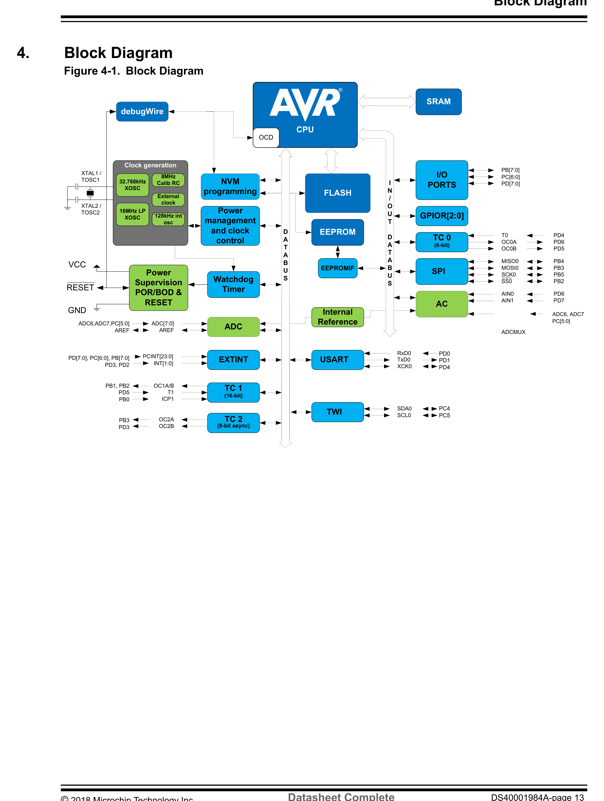
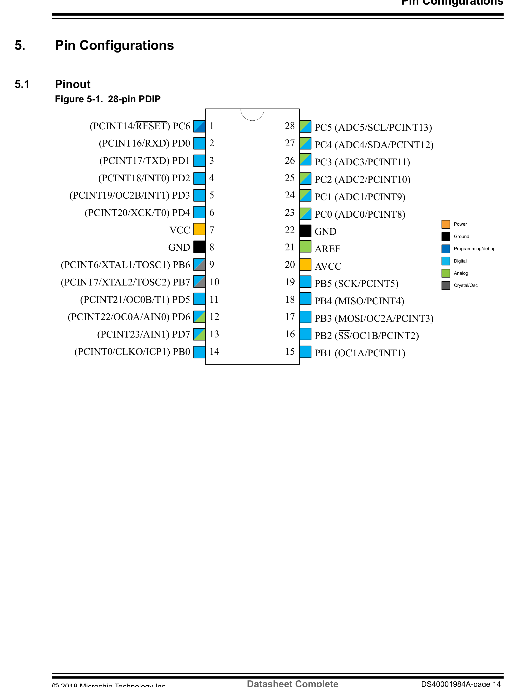
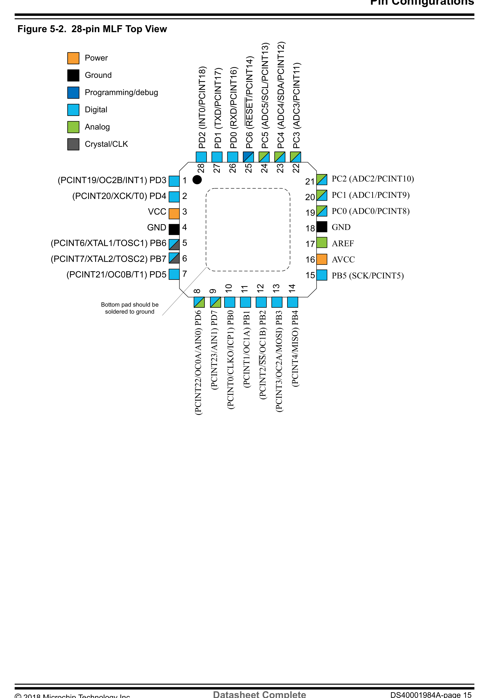
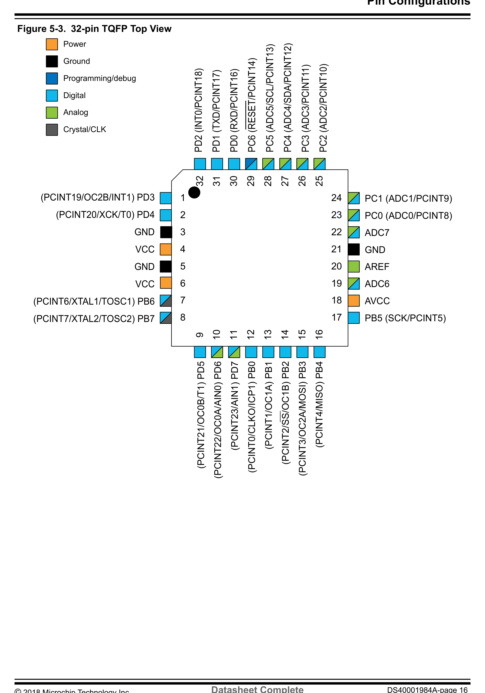
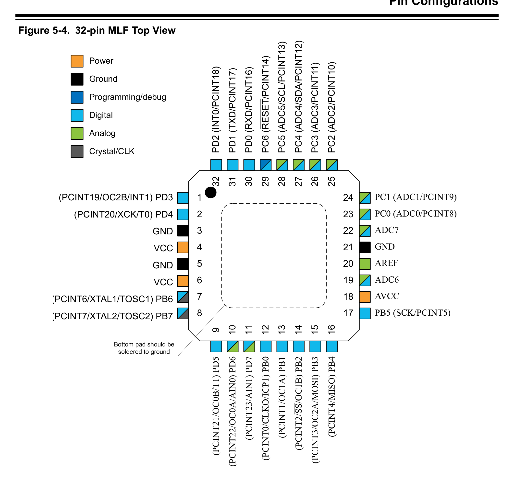
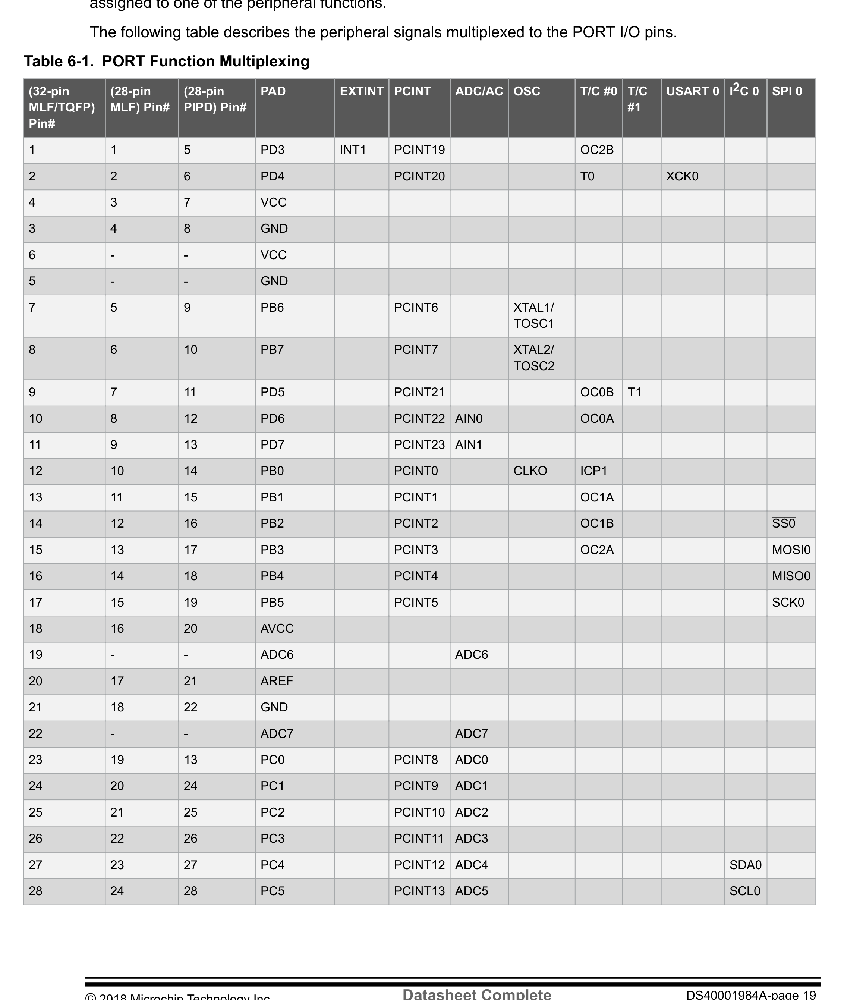

# Front Matter & Datasheet Overview (Sec 1-10)

> **Datasheet**: Microchip ATmega328P 8-bit AVR Microcontroller Datasheet (2018)  
> **Publisher**: Microchip Technology Inc.  
> **PDF Page Range**: 1 - 24

---

<!-- Page 1 -->
### [PDF Page 1]

ATmega328/P
AVR® Microcontroller with picoPower® Technology
Introduction
The picoPower
® ATmega328/P is a low-power CMOS 8-bit microcontroller based on the AVR
® enhanced
RISC architecture. By executing powerful instructions in a single clock cycle, the ATmega328/P achieves
throughputs close to 1 MIPS per MHz. This empowers system designers to optimize the device for power
consumption versus processing speed.
Feature
High Performance, Low-Power AVR
® 8-Bit Microcontroller Family
•
Advanced RISC Architecture
–
131 Powerful instructions
–
Most single clock cycle execution
–
32 x 8 General purpose working registers
–
Fully static operation
–
Up to 20 MIPS throughput at 20 MHz
–
On-chip 2-cycle multiplier
•
High Endurance Nonvolatile Memory Segments
–
32K Bytes of in-system self-programmable Flash program memory
–
1K Bytes EEPROM
–
2K Bytes internal SRAM
–
Write/erase cycles: 10,000 Flash/100,000 EEPROM
–
Data retention: 20 years at 85°C/100 years at 25°C(1)
–
Optional boot code section with independent lock bits
•
In-system programming by on-chip boot program
•
True read-while-write operation
–
Programming lock for software security
•
QTouch Library Support
–
Capacitive touch buttons, sliders and wheels
–
QTouch and QMatrix acquisition
–
Up to 64 sense channels
•
Peripheral Features
–
Two 8-bit Timer/counters with separate prescaler and Compare mode
–
One 16-bit Timer/counter with separate prescaler, Compare mode, and Capture mode
–
Real time counter with separate oscillator
–
Six PWM channels
© 2018 Microchip Technology Inc.
Datasheet Complete
DS40001984A-page 1
Downloaded from Arrow.com.

<!-- Page 2 -->
### [PDF Page 2]

–
8-channel 10-bit ADC in TQFP and QFN/MLF package
•
Temperature measurement
–
6-channel 10-bit ADC in PDIP package
•
Temperature measurement
–
Two master/slave SPI serial interface
–
One programmable serial USART
–
One byte-oriented 2-wire serial interface (Philips I2C compatible)
–
Programmable watchdog timer with separate on-chip oscillator
–
One on-chip analog comparator
–
Interrupt and wake-up on pin change
•
Special Microcontroller Features
–
Power-on Reset and programmable Brown-out Detection
–
Internal calibrated oscillator
–
External and internal interrupt sources
–
Six sleep modes: idle, ADC noise reduction, power-save, power-down, standby, and extended
standby
•
I/O and Packages
–
23 Programmable I/O lines
–
28-pin PDIP, 32-lead TQFP, 28-pad QFN/MLF and 32-pad QFN/MLF
•
Operating Voltage:
–
1.8 - 5.5V
•
Temperature Range:
–
-40°C to 105°C
•
Speed Grade:
–
ATmega328/P: 0 - 4 MHz @ 1.8 - 5.5V, 0 - 10 MHz @ 2.7 - 5.5V, 0 - 20 MHz @ 4.5 - 5.5V
•
Power Consumption at 1 MHz, 1.8V, 25°C
–
Active mode: 0.2 mA
–
Power-Down mode: 0.1 μA
–
Power-Save mode: 0.75 μA (Including 32 kHz RTC)
ATmega328/P
© 2018 Microchip Technology Inc.
Datasheet Complete
DS40001984A-page 2
Downloaded from Arrow.com.
Downloaded from Arrow.com.

<!-- Page 3 -->
### [PDF Page 3]

Table of Contents
Introduction......................................................................................................................1
Feature............................................................................................................................ 1

# 1. Description.................................................................................................................9

# 2. Configuration Summary...........................................................................................10

# 3. Ordering Information ...............................................................................................11

3.1.
ATmega328 ............................................................................................................................... 11
3.2.
ATmega328P .............................................................................................................................11

# 4. Block Diagram......................................................................................................... 13

# 5. Pin Configurations................................................................................................... 14

5.1.
Pinout......................................................................................................................................... 14
5.2.
Pin Descriptions......................................................................................................................... 17

# 6. I/O Multiplexing........................................................................................................19

# 7. Resources............................................................................................................... 21

# 8. Data Retention.........................................................................................................22

# 9. About Code Examples.............................................................................................23

# 10. Capacitive Touch Sensing....................................................................................... 24

## 10.1. QTouch Library...........................................................................................................................24

# 11. AVR CPU Core........................................................................................................ 25

11.1.

### Overview.................................................................................................................................... 25

11.2.
Arithmetic Logic Unit (ALU)........................................................................................................26
11.3.
Status Register...........................................................................................................................26
11.4.
General Purpose Register File...................................................................................................29
11.5.
Stack Pointer..............................................................................................................................30
11.6.
Instruction Execution Timing...................................................................................................... 32
11.7.
Reset and Interrupt Handling..................................................................................................... 33

# 12. AVR Memories.........................................................................................................36

## 12.1. Overview.................................................................................................................................... 36

## 12.2. In-System Reprogrammable Flash Program Memory................................................................36

## 12.3. SRAM Data Memory.................................................................................................................. 37

## 12.4. EEPROM Data Memory............................................................................................................. 38

## 12.5. I/O Memory.................................................................................................................................39

## 12.6. Register Description...................................................................................................................40

© 2018 Microchip Technology Inc.
Datasheet Complete
DS40001984A-page 3
Downloaded from Arrow.com.
Downloaded from Arrow.com.
Downloaded from Arrow.com.

<!-- Page 4 -->
### [PDF Page 4]

# 13. System Clock and Clock Options............................................................................ 49

## 13.1. Clock Systems and Their Distribution........................................................................................ 49

## 13.2. Clock Sources............................................................................................................................ 50

## 13.3. Low-Power Crystal Oscillator..................................................................................................... 52

## 13.4. Full Swing Crystal Oscillator.......................................................................................................54

## 13.5. Low-Frequency Crystal Oscillator.............................................................................................. 55

## 13.6. Calibrated Internal RC Oscillator................................................................................................56

13.7. 128 kHz Internal Oscillator......................................................................................................... 57

## 13.8. External Clock............................................................................................................................ 58

## 13.9. Timer/Counter Oscillator.............................................................................................................59

## 13.10. Clock Output Buffer....................................................................................................................59

## 13.11. System Clock Prescaler............................................................................................................. 59

## 13.12. Register Description...................................................................................................................60

# 14. Power Management and Sleep Modes................................................................... 64

## 14.1. Overview.................................................................................................................................... 64

## 14.2. Sleep Modes.............................................................................................................................. 64

## 14.3. BOD Disable...............................................................................................................................65

## 14.4. Idle Mode....................................................................................................................................65

## 14.5. ADC Noise Reduction Mode...................................................................................................... 65

## 14.6. Power-Down Mode.....................................................................................................................66

## 14.7. Power-Save Mode......................................................................................................................66

## 14.8. Standby Mode............................................................................................................................ 67

## 14.9. Extended Standby Mode............................................................................................................67

## 14.10. Power Reduction Register......................................................................................................... 67

## 14.11. Minimizing Power Consumption.................................................................................................67

## 14.12. Register Description...................................................................................................................69

# 15. System Control and Reset.......................................................................................74

## 15.1. Resetting the AVR......................................................................................................................74

## 15.2. Reset Sources............................................................................................................................74

## 15.3. Power-on Reset..........................................................................................................................75

## 15.4. External Reset............................................................................................................................76

## 15.5. Brown-out Detection...................................................................................................................76

## 15.6. Watchdog System Reset............................................................................................................77

## 15.7. Internal Voltage Reference.........................................................................................................77

## 15.8. Watchdog Timer......................................................................................................................... 78

## 15.9. Register Description...................................................................................................................80

# 16. Interrupts................................................................................................................. 84

## 16.1. Interrupt Vectors in ATmega328/P............................................................................................. 84

## 16.2. Register Description...................................................................................................................86

# 17. EXTINT - External Interrupts................................................................................... 89

## 17.1. Pin Change Interrupt Timing.......................................................................................................89

## 17.2. Register Description...................................................................................................................90

# 18. I/O-Ports.................................................................................................................. 99

ATmega328/P
© 2018 Microchip Technology Inc.
Datasheet Complete
DS40001984A-page 4
Downloaded from Arrow.com.
Downloaded from Arrow.com.
Downloaded from Arrow.com.
Downloaded from Arrow.com.

<!-- Page 5 -->
### [PDF Page 5]

## 18.1. Overview.................................................................................................................................... 99

## 18.2. Ports as General Digital I/O......................................................................................................100

## 18.3. Alternate Port Functions...........................................................................................................103

## 18.4. Register Description................................................................................................................. 115

19. 8-bit Timer/Counter0 (TC0) with PWM.................................................................. 127

## 19.1. Features................................................................................................................................... 127

## 19.2. Overview.................................................................................................................................. 127

## 19.3. Timer/Counter Clock Sources.................................................................................................. 129

## 19.4. Counter Unit............................................................................................................................. 129

## 19.5. Output Compare Unit............................................................................................................... 130

## 19.6. Compare Match Output Unit.....................................................................................................132

## 19.7. Modes of Operation..................................................................................................................134

## 19.8. Timer/Counter Timing Diagrams.............................................................................................. 138

## 19.9. Register Description.................................................................................................................140

20. 16-bit Timer/Counter1 (TC1) with PWM................................................................ 152

## 20.1. Overview.................................................................................................................................. 152

## 20.2. Features................................................................................................................................... 152

## 20.3. Block Diagram..........................................................................................................................152

## 20.4. Definitions.................................................................................................................................153

## 20.5. Registers.................................................................................................................................. 154

## 20.6. Accessing 16-bit Timer/Counter Registers...............................................................................154

## 20.7. Timer/Counter Clock Sources.................................................................................................. 157

## 20.8. Counter Unit............................................................................................................................. 157

## 20.9. Input Capture Unit.................................................................................................................... 158

## 20.10. Output Compare Units............................................................................................................. 160

## 20.11. Compare Match Output Unit.....................................................................................................162

## 20.12. Modes of Operation..................................................................................................................163

## 20.13. Timer/Counter 0, 1 Prescalers................................................................................................. 171

## 20.14. Timer/Counter Timing Diagrams.............................................................................................. 171

## 20.15. Register Description.................................................................................................................173

# 21. Timer/Counter 0, 1 Prescalers...............................................................................186

## 21.1. Internal Clock Source...............................................................................................................186

## 21.2. Prescaler Reset........................................................................................................................186

## 21.3. External Clock Source..............................................................................................................186

## 21.4. Register Description.................................................................................................................188

22. 8-bit Timer/Counter2 (TC2) with PWM and Asynchronous Operation...................190

## 22.1. Features................................................................................................................................... 190

## 22.2. Overview.................................................................................................................................. 190

## 22.3. Timer/Counter Clock Sources.................................................................................................. 192

## 22.4. Counter Unit............................................................................................................................. 192

## 22.5. Output Compare Unit............................................................................................................... 193

## 22.6. Compare Match Output Unit.....................................................................................................195

## 22.7. Modes of Operation..................................................................................................................196

## 22.8. Timer/Counter Timing Diagrams.............................................................................................. 200

ATmega328/P
© 2018 Microchip Technology Inc.
Datasheet Complete
DS40001984A-page 5
Downloaded from Arrow.com.
Downloaded from Arrow.com.
Downloaded from Arrow.com.
Downloaded from Arrow.com.
Downloaded from Arrow.com.

<!-- Page 6 -->
### [PDF Page 6]

## 22.9. Asynchronous Operation of Timer/Counter2............................................................................201

## 22.10. Timer/Counter Prescaler..........................................................................................................203

## 22.11. Register Description.................................................................................................................203

# 23. Serial Peripheral Interface (SPI)............................................................................218

## 23.1. Features................................................................................................................................... 218

## 23.2. Overview.................................................................................................................................. 218

## 23.3. SS Pin Functionality................................................................................................................. 222

## 23.4. Data Modes..............................................................................................................................222

## 23.5. Register Description.................................................................................................................223

# 24. Universal Synchronous Asynchronous Receiver Transceiver (USART)............... 228

## 24.1. Features................................................................................................................................... 228

## 24.2. Overview.................................................................................................................................. 228

## 24.3. Block Diagram..........................................................................................................................228

## 24.4. Clock Generation......................................................................................................................229

## 24.5. Frame Formats.........................................................................................................................232

## 24.6. USART Initialization................................................................................................................. 233

## 24.7. Data Transmission – The USART Transmitter......................................................................... 234

## 24.8. Data Reception – The USART Receiver..................................................................................236

## 24.9. Asynchronous Data Reception.................................................................................................240

## 24.10. Multi-Processor Communication Mode.................................................................................... 243

## 24.11. Examples of Baud Rate Setting............................................................................................... 243

## 24.12. Register Description.................................................................................................................246

# 25. USART in SPI (USARTSPI) Mode.........................................................................256

## 25.1. Features................................................................................................................................... 256

## 25.2. Overview.................................................................................................................................. 256

## 25.3. Clock Generation......................................................................................................................256

## 25.4. SPI Data Modes and Timing.....................................................................................................257

## 25.5. Frame Formats.........................................................................................................................257

## 25.6. Data Transfer............................................................................................................................259

## 25.7. AVR USART MSPIM vs. AVR SPI............................................................................................260

## 25.8. Register Description.................................................................................................................261

# 26. Two-Wire Serial Interface (TWI)............................................................................ 262

## 26.1. Features................................................................................................................................... 262

## 26.2. Two-Wire Serial Interface Bus Definition..................................................................................262

## 26.3. Data Transfer and Frame Format.............................................................................................263

## 26.4. Multi-Master Bus Systems, Arbitration, and Synchronization...................................................266

## 26.5. Overview of the TWI Module....................................................................................................268

## 26.6. Using the TWI...........................................................................................................................270

## 26.7. Transmission Modes................................................................................................................ 273

## 26.8. Multi-Master Systems and Arbitration...................................................................................... 291

## 26.9. Register Description.................................................................................................................292

# 27. Analog Comparator (AC).......................................................................................300

## 27.1. Overview.................................................................................................................................. 300

ATmega328/P
© 2018 Microchip Technology Inc.
Datasheet Complete
DS40001984A-page 6
Downloaded from Arrow.com.
Downloaded from Arrow.com.
Downloaded from Arrow.com.
Downloaded from Arrow.com.
Downloaded from Arrow.com.
Downloaded from Arrow.com.

<!-- Page 7 -->
### [PDF Page 7]

## 27.2. Analog Comparator Multiplexed Input......................................................................................300

## 27.3. Register Description.................................................................................................................301

# 28. Analog-to-Digital Converter (ADC)........................................................................ 305

## 28.1. Features................................................................................................................................... 305

## 28.2. Overview.................................................................................................................................. 305

## 28.3. Starting a Conversion...............................................................................................................307

## 28.4. Prescaling and Conversion Timing...........................................................................................308

## 28.5. Changing Channel or Reference Selection..............................................................................310

## 28.6. ADC Noise Canceler................................................................................................................ 312

## 28.7. ADC Conversion Result........................................................................................................... 315

## 28.8. Temperature Measurement...................................................................................................... 316

## 28.9. Register Description.................................................................................................................316

29. debugWIRE On-chip Debug System.....................................................................325

## 29.1. Features................................................................................................................................... 325

## 29.2. Overview.................................................................................................................................. 325

## 29.3. Physical Interface.....................................................................................................................325

## 29.4. Software Breakpoints............................................................................................................... 326

## 29.5. Limitations of debugWIRE........................................................................................................326

## 29.6. Register Description.................................................................................................................326

# 30. Boot Loader Support – Read-While-Write Self-programming (BTLDR)................ 328

## 30.1. Features................................................................................................................................... 328

## 30.2. Overview.................................................................................................................................. 328

## 30.3. Application and Boot Loader Flash Sections............................................................................328

## 30.4. Read-While-Write and No Read-While-Write Flash Sections...................................................329

## 30.5. Boot Loader Lock Bits.............................................................................................................. 331

## 30.6. Entering the Boot Loader Program...........................................................................................332

## 30.7. Addressing the Flash During Self-Programming......................................................................333

## 30.8. Self-Programming the Flash.....................................................................................................334

## 30.9. Register Description.................................................................................................................342

# 31. Memory Programming (MEMPROG).....................................................................345

## 31.1. Program And Data Memory Lock Bits......................................................................................345

## 31.2. Fuse Bits.................................................................................................................................. 346

## 31.3. Signature Bytes........................................................................................................................348

## 31.4. Calibration Byte........................................................................................................................349

## 31.5. Serial Number.......................................................................................................................... 349

## 31.6. Page Size.................................................................................................................................349

## 31.7. Parallel Programming Parameters, Pin Mapping, and Commands..........................................349

## 31.8. Parallel Programming...............................................................................................................351

## 31.9. Serial Downloading.................................................................................................................. 359

# 32. Electrical Characteristics....................................................................................... 364

## 32.1. Absolute Maximum Ratings......................................................................................................364

## 32.2. Common DC Characteristics....................................................................................................364

## 32.3. Speed Grades.......................................................................................................................... 367

ATmega328/P
© 2018 Microchip Technology Inc.
Datasheet Complete
DS40001984A-page 7
Downloaded from Arrow.com.
Downloaded from Arrow.com.
Downloaded from Arrow.com.
Downloaded from Arrow.com.
Downloaded from Arrow.com.
Downloaded from Arrow.com.
Downloaded from Arrow.com.

<!-- Page 8 -->
### [PDF Page 8]

## 32.4. Clock Characteristics................................................................................................................368

## 32.5. System and Reset Characteristics........................................................................................... 369

## 32.6. SPI Timing Characteristics....................................................................................................... 370

## 32.7. Two-Wire Serial Interface Characteristics................................................................................ 371

## 32.8. ADC Characteristics.................................................................................................................373

## 32.9. Parallel Programming Characteristics......................................................................................374

# 33. Typical Characteristics (TA = -40°C to 85°C).........................................................377

## 33.1. ATmega328 Typical Characteristics.........................................................................................377

# 34. Typical Characteristics (TA = -40°C to 105°C).......................................................402

## 34.1. ATmega328P Typical Characteristics.......................................................................................402

# 35. Register Summary.................................................................................................427

## 35.1. Note..........................................................................................................................................429

# 36. Instruction Set Summary....................................................................................... 431

# 37. Packaging Information...........................................................................................436

37.1. 32-pin 32A................................................................................................................................436
37.2. 32-pin 32M1-A..........................................................................................................................437
37.3. 28-pin 28M1............................................................................................................................. 438
37.4. 28-pin 28P3..............................................................................................................................438

# 38. Errata.....................................................................................................................440

## 38.1. Errata ATmega328/P................................................................................................................440

# 39. Datasheet Revision History................................................................................... 441

## 39.1. Rev. A – 2/2018........................................................................................................................441

## 39.2. Pre Microchip Revisions...........................................................................................................441

The Microchip Web Site.............................................................................................. 442
Customer Change Notification Service........................................................................442
Customer Support....................................................................................................... 442
Microchip Devices Code Protection Feature............................................................... 442
Legal Notice.................................................................................................................443
Trademarks................................................................................................................. 443
Quality Management System Certified by DNV...........................................................444
Worldwide Sales and Service......................................................................................445
ATmega328/P
© 2018 Microchip Technology Inc.
Datasheet Complete
DS40001984A-page 8
Downloaded from Arrow.com.
Downloaded from Arrow.com.
Downloaded from Arrow.com.
Downloaded from Arrow.com.
Downloaded from Arrow.com.
Downloaded from Arrow.com.
Downloaded from Arrow.com.
Downloaded from Arrow.com.

<!-- Page 9 -->
### [PDF Page 9]

1.
Description
The AVR
® core combines a rich instruction set with 32 general purpose working registers. All the 32
registers are directly connected to the Arithmetic Logic Unit (ALU), allowing two independent registers to
be accessed in a single instruction executed in one clock cycle. The resulting architecture is more code
efficient while achieving throughputs up to ten times faster than conventional CISC microcontrollers.
The ATmega328/P provides the following features: 32Kbytes of in-system programmable Flash with read-
while-write capabilities, 1Kbytes EEPROM, 2Kbytes SRAM, 23 general purpose I/O lines, 32 general
purpose working registers, Real Time Counter (RTC), three flexible timer/counters with Compare modes
and PWM, 1 serial programmable USARTs , 1 byte-oriented 2-wire Serial Interface (I2C), a 6-channel 10-
bit ADC (8 channels in TQFP and QFN/MLF packages), a programmable watchdog timer with internal
oscillator, an SPI serial port, and six software selectable power saving modes. The Idle mode stops the
CPU while allowing the SRAM, timer/counters, SPI port, and interrupt system to continue functioning. The
Power-Down mode saves the register contents but freezes the oscillator, disabling all other chip functions
until the next interrupt or hardware Reset. In Power-Save mode, the asynchronous timer continues to run,
allowing the user to maintain a timer base while the rest of the device is sleeping. The ADC Noise
Reduction mode stops the CPU and all I/O modules except asynchronous timer and ADC to minimize
switching noise during ADC conversions. In Standby mode, the crystal/resonator oscillator is running
while the rest of the device is sleeping. This allows very fast start-up combined with low-power
consumption. In Extended Standby mode, both the main oscillator and the asynchronous timer continue
to run.
Microchip offers the QTouch
® library for embedding capacitive touch buttons, sliders and wheels
functionality into AVR microcontrollers. The patented charge-transfer signal acquisition offers robust
sensing and includes fully debounced reporting of touch keys and includes Adjacent Key Suppression™
(AKS™) technology for unambiguous detection of key events. The easy-to-use QTouch Suite toolchain
allows you to explore, develop and debug your own touch applications.
The device is manufactured using Microchip’s high density nonvolatile memory technology. The on-chip
ISP Flash allows the program memory to be reprogrammed in-system through an SPI serial interface, by
a conventional nonvolatile memory programmer, or by an on-chip boot program running on the AVR core.
The boot program can use any interface to download the application program in the application Flash
memory. Software in the boot Flash section will continue to run while the application Flash section is
updated, providing true read-while-write operation. By combining an 8-bit RISC CPU with in-system self-
programmable Flash on a monolithic chip, the ATmega328/P is a powerful microcontroller that provides a
highly flexible and cost effective solution to many embedded control applications.
The ATmega328/P is supported with a full suite of program and system development tools including: C
compilers, macro assemblers, program debugger/simulators, in-circuit emulators, and evaluation kits.
ATmega328/P
Description
© 2018 Microchip Technology Inc.
Datasheet Complete
DS40001984A-page 9
Downloaded from Arrow.com.
Downloaded from Arrow.com.
Downloaded from Arrow.com.
Downloaded from Arrow.com.
Downloaded from Arrow.com.
Downloaded from Arrow.com.
Downloaded from Arrow.com.
Downloaded from Arrow.com.
Downloaded from Arrow.com.

<!-- Page 10 -->
### [PDF Page 10]

2.
Configuration Summary

### Features

ATmega328/P
Pin Count
28/32
Flash (Bytes)
32K
SRAM (Bytes)
2K
EEPROM (Bytes)
1K
General Purpose I/O Lines
23
SPI
2
TWI (I2C)
1
USART
1
ADC
10-bit 15 kSPS
ADC Channels
8
8-bit Timer/Counters
2
16-bit Timer/Counters
1
ATmega328/P
Configuration Summary
© 2018 Microchip Technology Inc.
Datasheet Complete
DS40001984A-page 10
Downloaded from Arrow.com.
Downloaded from Arrow.com.
Downloaded from Arrow.com.
Downloaded from Arrow.com.
Downloaded from Arrow.com.
Downloaded from Arrow.com.
Downloaded from Arrow.com.
Downloaded from Arrow.com.
Downloaded from Arrow.com.
Downloaded from Arrow.com.

<!-- Page 11 -->
### [PDF Page 11]

3.
Ordering Information
3.1
ATmega328
Speed [MHz](3)
Power Supply [V]
Ordering Code(2)
Package(1)
Operational Range
20
1.8 - 5.5
ATmega328-AU
ATmega328-AUR(5)
ATmega328-MMH(4)
ATmega328-MMHR(4)(5)
ATmega328-MU
ATmega328-MUR(5)
ATmega328-PU
32A
32A
28M1
28M1
32M1-A
32M1-A
28P3
Industrial
(-40°C to 85°C)
Note:
1.
This device can also be supplied in wafer form. Please contact your local Microchip sales office for
detailed ordering information and minimum quantities.
2.
Pb-free packaging, complies to the European Directive for Restriction of Hazardous Substances
(RoHS directive). Also Halide free and fully Green.
3.
Please refer to Speed Grades for Speed vs. VCC
4.
Tape & Reel.
5.
NiPdAu Lead Finish.
Package Type
28M1
28-pad, 4 x 4 x 1.0 body, Lead Pitch 0.45mm Quad Flat No-Lead/Micro Lead Frame Package (QFN/
MLF)
28P3
28-lead, 0.300” Wide, Plastic Dual Inline Package (PDIP)
32M1-A 32-pad, 5 x 5 x 1.0 body, Lead Pitch 0.50mm Quad Flat No-Lead/Micro Lead Frame Package (QFN/
MLF)
32A
32-lead, Thin (1.0mm) Plastic Quad Flat Package (TQFP)
3.2
ATmega328P
Speed [MHz](3)
Power Supply [V]
Ordering Code(2)
Package(1)
Operational Range
20
1.8 - 5.5
ATmega328P-AU
ATmega328P-AUR(5)
ATmega328P-MMH(4)
ATmega328P-MMHR(4)(5)
ATmega328P-MU
32A
32A
28M1
28M1
32M1-A
Industrial
(-40°C to 85°C)
ATmega328/P
Ordering Information
© 2018 Microchip Technology Inc.
Datasheet Complete
DS40001984A-page 11
Downloaded from Arrow.com.
Downloaded from Arrow.com.
Downloaded from Arrow.com.
Downloaded from Arrow.com.
Downloaded from Arrow.com.
Downloaded from Arrow.com.
Downloaded from Arrow.com.
Downloaded from Arrow.com.
Downloaded from Arrow.com.
Downloaded from Arrow.com.
Downloaded from Arrow.com.

<!-- Page 12 -->
### [PDF Page 12]

Speed [MHz](3)
Power Supply [V]
Ordering Code(2)
Package(1)
Operational Range
ATmega328P-MUR(5)
ATmega328P-PU
32M1-A
28P3
ATmega328P-AN
ATmega328P-ANR(5)
ATmega328P-MN
ATmega328P-MNR(5)
ATmega328P-PN
32A
32A
32M1-A
32M1-A
28P3
Industrial
(-40°C to 105°C)
Note:
1.
This device can also be supplied in wafer form. Please contact your local Microchip sales office for
detailed ordering information and minimum quantities.
2.
Pb-free packaging, complies to the European Directive for Restriction of Hazardous Substances
(RoHS directive). Also Halide free and fully Green.
3.
Please refer to Speed Grades for Speed vs. VCC
4.
Tape & Reel.
5.
NiPdAu Lead Finish.
Package Type
28M1
28-pad, 4 x 4 x 1.0 body, Lead Pitch 0.45mm Quad Flat No-Lead/Micro Lead Frame Package (QFN/
MLF)
28P3
28-lead, 0.300” Wide, Plastic Dual Inline Package (PDIP)
32M1-A 32-pad, 5 x 5 x 1.0 body, Lead Pitch 0.50mm Quad Flat No-Lead/Micro Lead Frame Package (QFN/
MLF)
32A
32-lead, Thin (1.0mm) Plastic Quad Flat Package (TQFP)
ATmega328/P
Ordering Information
© 2018 Microchip Technology Inc.
Datasheet Complete
DS40001984A-page 12
Downloaded from Arrow.com.
Downloaded from Arrow.com.
Downloaded from Arrow.com.
Downloaded from Arrow.com.
Downloaded from Arrow.com.
Downloaded from Arrow.com.
Downloaded from Arrow.com.
Downloaded from Arrow.com.
Downloaded from Arrow.com.
Downloaded from Arrow.com.
Downloaded from Arrow.com.
Downloaded from Arrow.com.

<!-- Page 13 -->
### [PDF Page 13]

4.

### Block Diagram

*Description*: System architecture block diagram depicting hardware modules, internal data buses, control logic, and peripheral interconnects for Figure 4-1: Block Diagram.

> **Figure 4-1: Block Diagram**

CPU
USART
ADC
ADC[7:0]
AREF
RxD0
TxD0
XCK0
I/O
PORTS
D
A
T
A
B
U
S
GPIOR[2:0]
SRAM
OCD
EXTINT
FLASH
NVM
programming
debugWire
I
N
/
O
U
T
D
A
T
A
B
U
S
TC 0
(8-bit)
SPI
AC
AIN0
AIN1
ADCMUX
EEPROM
EEPROMIF
TC 1
(16-bit)
OC1A/B
T1
ICP1
TC 2
(8-bit async)
TWI
SDA0
SCL0
Internal
Reference
Watchdog
Timer
Power
management
and clock
control
VCC
GND
Clock generation
8MHz
Calib RC
128kHz int
osc
32.768kHz
XOSC
External
clock
Power
Supervision
POR/BOD &
RESET
XTAL2 /
TOSC2
RESET
XTAL1 /
TOSC1
16MHz LP
XOSC
PCINT[23:0]
INT[1:0]
T0
OC0A
OC0B
MISO0
MOSI0
SCK0
SS0
OC2A
OC2B
PB[7:0]
PC[6:0]
PD[7:0]
ADC6,ADC7,PC[5:0]
AREF
PD[7:0], PC[6:0], PB[7:0]
PD3, PD2
PB1, PB2
PD5
PB0
PB3
PD3
PD4
PD6
PD5
PB4
PB3
PB5
PB2
PD6
PD7
ADC6, ADC7
PC[5:0]
PD0
PD1
PD4
PC4
PC5
ATmega328/P

### Block Diagram

© 2018 Microchip Technology Inc.
Datasheet Complete
DS40001984A-page 13
Downloaded from Arrow.com.
Downloaded from Arrow.com.
Downloaded from Arrow.com.
Downloaded from Arrow.com.
Downloaded from Arrow.com.
Downloaded from Arrow.com.
Downloaded from Arrow.com.
Downloaded from Arrow.com.
Downloaded from Arrow.com.
Downloaded from Arrow.com.
Downloaded from Arrow.com.
Downloaded from Arrow.com.
Downloaded from Arrow.com.

<!-- Page 14 -->
### [PDF Page 14]

5.
Pin Configurations
5.1
Pinout

*Description*: IC pinout diagram specifying physical pin assignments, I/O port pin multiplexing, supply lines (VCC/GND), and crystal connections for Figure 5-1: 28-pin PDIP.

> **Figure 5-1: 28-pin PDIP**

Power
Ground
Programming/debug
Digital
Analog
Crystal/Osc
(PCINT14/RESET) PC6
(PCINT16/RXD) PD0
(PCINT17/TXD) PD1
(PCINT18/INT0) PD2
(PCINT19/OC2B/INT1) PD3
(PCINT20/XCK/T0) PD4
VCC
GND
(PCINT6/XTAL1/TOSC1) PB6
(PCINT7/XTAL2/TOSC2) PB7
(PCINT21/OC0B/T1) PD5
(PCINT22/OC0A/AIN0) PD6
(PCINT23/AIN1) PD7
(PCINT0/CLKO/ICP1) PB0
PC5 (ADC5/SCL/PCINT13)
PC4 (ADC4/SDA/PCINT12)
PC3 (ADC3/PCINT11)
PC2 (ADC2/PCINT10)
PC1 (ADC1/PCINT9)
PC0 (ADC0/PCINT8)
GND
AREF
AVCC
PB5 (SCK/PCINT5)
PB4 (MISO/PCINT4)
PB3 (MOSI/OC2A/PCINT3)
PB2 (SS/OC1B/PCINT2)
PB1 (OC1A/PCINT1)
1
2
3
4
5
6
7
8
9
10
11
12
13
14
28
27
26
25
24
23
22
21
20
19
18
17
16
15
ATmega328/P
Pin Configurations
© 2018 Microchip Technology Inc.
Datasheet Complete
DS40001984A-page 14
Downloaded from Arrow.com.
Downloaded from Arrow.com.
Downloaded from Arrow.com.
Downloaded from Arrow.com.
Downloaded from Arrow.com.
Downloaded from Arrow.com.
Downloaded from Arrow.com.
Downloaded from Arrow.com.
Downloaded from Arrow.com.
Downloaded from Arrow.com.
Downloaded from Arrow.com.
Downloaded from Arrow.com.
Downloaded from Arrow.com.
Downloaded from Arrow.com.

<!-- Page 15 -->
### [PDF Page 15]

*Description*: IC pinout diagram specifying physical pin assignments, I/O port pin multiplexing, supply lines (VCC/GND), and crystal connections for Figure 5-2: 28-pin MLF Top View.

> **Figure 5-2: 28-pin MLF Top View**

1
2
3
4
5
6
7
8
9
10
11
12
13
14
PD2 (INT0/PCINT18)
PD1 (TXD/PCINT17)
PD0 (RXD/PCINT16)
PC6 (RESET/PCINT14)
PC5 (ADC5/SCL/PCINT13)
PC4 (ADC4/SDA/PCINT12)
PC3 (ADC3/PCINT11)
PC2 (ADC2/PCINT10)
PC1 (ADC1/PCINT9)
PC0 (ADC0/PCINT8)
GND
AREF
AVCC
PB5 (SCK/PCINT5)
(PCINT22/OC0A/AIN0) PD6
(PCINT23/AIN1) PD7
(PCINT0/CLKO/ICP1) PB0
(PCINT1/OC1A) PB1
(PCINT2/SS/OC1B) PB2
(PCINT3/OC2A/MOSI) PB3
(PCINT4/MISO) PB4
(PCINT19/OC2B/INT1) PD3
(PCINT20/XCK/T0) PD4
VCC
GND
(PCINT6/XTAL1/TOSC1) PB6
(PCINT7/XTAL2/TOSC2) PB7
(PCINT21/OC0B/T1) PD5
Bottom pad should be
soldered to ground
Power
Ground
Programming/debug
Digital
Analog
Crystal/CLK
21
20
19
18
17
16
15
28
27
26
25
24
23
22
ATmega328/P
Pin Configurations
© 2018 Microchip Technology Inc.
Datasheet Complete
DS40001984A-page 15
Downloaded from Arrow.com.
Downloaded from Arrow.com.
Downloaded from Arrow.com.
Downloaded from Arrow.com.
Downloaded from Arrow.com.
Downloaded from Arrow.com.
Downloaded from Arrow.com.
Downloaded from Arrow.com.
Downloaded from Arrow.com.
Downloaded from Arrow.com.
Downloaded from Arrow.com.
Downloaded from Arrow.com.
Downloaded from Arrow.com.
Downloaded from Arrow.com.
Downloaded from Arrow.com.

<!-- Page 16 -->
### [PDF Page 16]

*Description*: IC pinout diagram specifying physical pin assignments, I/O port pin multiplexing, supply lines (VCC/GND), and crystal connections for Figure 5-3: 32-pin TQFP Top View.

> **Figure 5-3: 32-pin TQFP Top View**

1
2
3
4
32
31
30
29
28
27
26
5
6
7
8
24
23
22
21
20
19
18
17
25
9
10
11
12
13
14
15
16
Power
Ground
Programming/debug
Digital
Analog
Crystal/CLK
(PCINT19/OC2B/INT1) PD3
(PCINT20/XCK/T0) PD4
GND
VCC
GND
VCC
(PCINT6/XTAL1/TOSC1) PB6
(PCINT7/XTAL2/TOSC2) PB7
PD2 (INT0/PCINT18)
PD1 (TXD/PCINT17)
PD0 (RXD/PCINT16)
PC6 (RESET/PCINT14)
PC5 (ADC5/SCL/PCINT13)
PC4 (ADC4/SDA/PCINT12)
PC3 (ADC3/PCINT11)
PC2 (ADC2/PCINT10)
PC1 (ADC1/PCINT9)
PC0 (ADC0/PCINT8)
ADC7
GND
AREF
ADC6
AVCC
PB5 (SCK/PCINT5)
(PCINT21/OC0B/T1) PD5
(PCINT22/OC0A/AIN0) PD6
(PCINT23/AIN1) PD7
(PCINT0/CLKO/ICP1) PB0
(PCINT1/OC1A) PB1
(PCINT2/SS/OC1B) PB2
(PCINT3/OC2A/MOSI) PB3
(PCINT4/MISO) PB4
ATmega328/P
Pin Configurations
© 2018 Microchip Technology Inc.
Datasheet Complete
DS40001984A-page 16
Downloaded from Arrow.com.
Downloaded from Arrow.com.
Downloaded from Arrow.com.
Downloaded from Arrow.com.
Downloaded from Arrow.com.
Downloaded from Arrow.com.
Downloaded from Arrow.com.
Downloaded from Arrow.com.
Downloaded from Arrow.com.
Downloaded from Arrow.com.
Downloaded from Arrow.com.
Downloaded from Arrow.com.
Downloaded from Arrow.com.
Downloaded from Arrow.com.
Downloaded from Arrow.com.
Downloaded from Arrow.com.

<!-- Page 17 -->
### [PDF Page 17]

*Description*: IC pinout diagram specifying physical pin assignments, I/O port pin multiplexing, supply lines (VCC/GND), and crystal connections for Figure 5-4: 32-pin MLF Top View.

> **Figure 5-4: 32-pin MLF Top View**

1
2
3
4
32
31
30
29
28
27
26
5
6
7
8
24
23
22
21
20
19
18
17
25
9
10
11
12
13
14
15
16
PD2 (INT0/PCINT18)
PD1 (TXD/PCINT17)
PD0 (RXD/PCINT16)
PC6 (RESET/PCINT14)
PC5 (ADC5/SCL/PCINT13)
PC4 (ADC4/SDA/PCINT12)
PC3 (ADC3/PCINT11)
PC2 (ADC2/PCINT10)
PC1 (ADC1/PCINT9)
PC0 (ADC0/PCINT8)
ADC7
GND
AREF
ADC6
AVCC
PB5 (SCK/PCINT5)
(PCINT21/OC0B/T1) PD5
(PCINT22/OC0A/AIN0) PD6
(PCINT23/AIN1) PD7
(PCINT0/CLKO/ICP1) PB0
(PCINT1/OC1A) PB1
(PCINT2/SS/OC1B) PB2
(PCINT3/OC2A/MOSI) PB3
(PCINT4/MISO) PB4
(PCINT19/OC2B/INT1) PD3
(PCINT20/XCK/T0) PD4
GND
VCC
GND
VCC
(PCINT6/XTAL1/TOSC1) PB6
(PCINT7/XTAL2/TOSC2) PB7
Bottom pad should be
soldered to ground
Power
Ground
Programming/debug
Digital
Analog
Crystal/CLK
5.2
Pin Descriptions
5.2.1
VCC
Digital supply voltage pin.
5.2.2
GND
Ground.
5.2.3
Port B (PB[7:0]) XTAL1/XTAL2/TOSC1/TOSC2
Port B is an 8-bit bi-directional I/O port with internal pull-up resistors (selected for each pin). The Port B
output buffers have symmetrical drive characteristics with both high sink and source capability. As inputs,
Port B pins that are externally pulled low will source current if the pull-up resistors are activated. The Port
B pins are tri-stated during a Reset condition even if the clock is not running.
ATmega328/P
Pin Configurations
© 2018 Microchip Technology Inc.
Datasheet Complete
DS40001984A-page 17
Downloaded from Arrow.com.
Downloaded from Arrow.com.
Downloaded from Arrow.com.
Downloaded from Arrow.com.
Downloaded from Arrow.com.
Downloaded from Arrow.com.
Downloaded from Arrow.com.
Downloaded from Arrow.com.
Downloaded from Arrow.com.
Downloaded from Arrow.com.
Downloaded from Arrow.com.
Downloaded from Arrow.com.
Downloaded from Arrow.com.
Downloaded from Arrow.com.
Downloaded from Arrow.com.
Downloaded from Arrow.com.
Downloaded from Arrow.com.

<!-- Page 18 -->
### [PDF Page 18]

Depending on the clock selection fuse settings, PB6 can be used as input to the inverting oscillator
amplifier and input to the internal clock operating circuit.
Depending on the clock selection fuse settings, PB7 can be used as output from the inverting oscillator
amplifier.
If the internal calibrated RC oscillator is used as chip clock source, PB[7:6] is used as TOSC[2:1] input for
the asynchronous timer/counter2 if the AS2 bit in ASSR is set.
5.2.4
Port C (PC[5:0])
Port C is a 7-bit bi-directional I/O port with internal pull-up resistors (selected for each pin). The PC[5:0]
output buffers have symmetrical drive characteristics with both high sink and source capability. As inputs,
Port C pins that are externally pulled low will source current if the pull-up resistors are activated. The Port
C pins are tri-stated during a Reset condition even if the clock is not running.
5.2.5
PC6/RESET
If the RSTDISBL fuse is programmed, PC6 is used as an I/O pin. Note that the electrical characteristics of
PC6 differ from those of the other pins of Port C.
If the RSTDISBL fuse is unprogrammed, PC6 is used as a Reset input. A low level on this pin for longer
than the minimum pulse length will generate a Reset, even if the clock is not running. Shorter pulses are
not guaranteed to generate a Reset.
The various special features of Port C are elaborated in the Alternate Functions of Port C section.
5.2.6
Port D (PD[7:0])
Port D is an 8-bit bi-directional I/O port with internal pull-up resistors (selected for each pin). The Port D
output buffers have symmetrical drive characteristics with both high sink and source capability. As inputs,
Port D pins that are externally pulled low will source current if the pull-up resistors are activated. The Port
D pins are tri-stated during a Reset condition even if the clock is not running.
5.2.7
AVCC
AVCC is the supply voltage pin for the A/D Converter (ADC), PC[3:0], and PE[3:2]. It should be externally
connected to VCC, even if the ADC is not used. If the ADC is used, it should be connected to VCC through
a low-pass filter. Note that PC[6:4] use digital supply voltage, VCC.
5.2.8
AREF
AREF is the analog reference pin for the A/D Converter.
5.2.9
ADC[7:6]
In the TQFP and VFQFN package, ADC[7:6] serve as analog inputs to the A/D converter. These pins are
powered by the analog supply and serve as 10-bit ADC channels.
ATmega328/P
Pin Configurations
© 2018 Microchip Technology Inc.
Datasheet Complete
DS40001984A-page 18
Downloaded from Arrow.com.
Downloaded from Arrow.com.
Downloaded from Arrow.com.
Downloaded from Arrow.com.
Downloaded from Arrow.com.
Downloaded from Arrow.com.
Downloaded from Arrow.com.
Downloaded from Arrow.com.
Downloaded from Arrow.com.
Downloaded from Arrow.com.
Downloaded from Arrow.com.
Downloaded from Arrow.com.
Downloaded from Arrow.com.
Downloaded from Arrow.com.
Downloaded from Arrow.com.
Downloaded from Arrow.com.
Downloaded from Arrow.com.
Downloaded from Arrow.com.

<!-- Page 19 -->
### [PDF Page 19]

6.
I/O Multiplexing
Each pin is by default controlled by the PORT as a general purpose I/O and alternatively it can be
assigned to one of the peripheral functions.
The following table describes the peripheral signals multiplexed to the PORT I/O pins.

*Description*: Hardware reference table detailing register bit field settings, electrical operating limits, or memory configurations for Table 6-1: PORT Function Multiplexing.

> **Table 6-1: PORT Function Multiplexing**

(32-pin
MLF/TQFP)
Pin#
(28-pin
MLF) Pin#
(28-pin
PIPD) Pin#
PAD
EXTINT
PCINT
ADC/AC
OSC
T/C #0
T/C
#1
USART 0
I2C 0
SPI 0
1
1
5
PD3
INT1
PCINT19
OC2B
2
2
6
PD4
PCINT20
T0
XCK0
4
3
7
VCC
3
4
8
GND
6
-
-
VCC
5
-
-
GND
7
5
9
PB6
PCINT6
XTAL1/
TOSC1
8
6
10
PB7
PCINT7
XTAL2/
TOSC2
9
7
11
PD5
PCINT21
OC0B
T1
10
8
12
PD6
PCINT22
AIN0
OC0A
11
9
13
PD7
PCINT23
AIN1
12
10
14
PB0
PCINT0
CLKO
ICP1
13
11
15
PB1
PCINT1
OC1A
14
12
16
PB2
PCINT2
OC1B
SS0
15
13
17
PB3
PCINT3
OC2A
MOSI0
16
14
18
PB4
PCINT4
MISO0
17
15
19
PB5
PCINT5
SCK0
18
16
20
AVCC
19
-
-
ADC6
ADC6
20
17
21
AREF
21
18
22
GND
22
-
-
ADC7
ADC7
23
19
13
PC0
PCINT8
ADC0
24
20
24
PC1
PCINT9
ADC1
25
21
25
PC2
PCINT10
ADC2
26
22
26
PC3
PCINT11
ADC3
27
23
27
PC4
PCINT12
ADC4
SDA0
28
24
28
PC5
PCINT13
ADC5
SCL0
ATmega328/P
I/O Multiplexing
© 2018 Microchip Technology Inc.
Datasheet Complete
DS40001984A-page 19
Downloaded from Arrow.com.
Downloaded from Arrow.com.
Downloaded from Arrow.com.
Downloaded from Arrow.com.
Downloaded from Arrow.com.
Downloaded from Arrow.com.
Downloaded from Arrow.com.
Downloaded from Arrow.com.
Downloaded from Arrow.com.
Downloaded from Arrow.com.
Downloaded from Arrow.com.
Downloaded from Arrow.com.
Downloaded from Arrow.com.
Downloaded from Arrow.com.
Downloaded from Arrow.com.
Downloaded from Arrow.com.
Downloaded from Arrow.com.
Downloaded from Arrow.com.
Downloaded from Arrow.com.

<!-- Page 20 -->
### [PDF Page 20]

(32-pin
MLF/TQFP)
Pin#
(28-pin
MLF) Pin#
(28-pin
PIPD) Pin#
PAD
EXTINT
PCINT
ADC/AC
OSC
T/C #0
T/C
#1
USART 0
I2C 0
SPI 0
29
25
1
PC6/RESET
PCINT14
30
26
2
PD0
PCINT16
RXD0
31
27
3
PD1
PCINT17
TXD0
32
28
4
PD2
INT0
PCINT18
ATmega328/P
I/O Multiplexing
© 2018 Microchip Technology Inc.
Datasheet Complete
DS40001984A-page 20
Downloaded from Arrow.com.
Downloaded from Arrow.com.
Downloaded from Arrow.com.
Downloaded from Arrow.com.
Downloaded from Arrow.com.
Downloaded from Arrow.com.
Downloaded from Arrow.com.
Downloaded from Arrow.com.
Downloaded from Arrow.com.
Downloaded from Arrow.com.
Downloaded from Arrow.com.
Downloaded from Arrow.com.
Downloaded from Arrow.com.
Downloaded from Arrow.com.
Downloaded from Arrow.com.
Downloaded from Arrow.com.
Downloaded from Arrow.com.
Downloaded from Arrow.com.
Downloaded from Arrow.com.
Downloaded from Arrow.com.

<!-- Page 21 -->
### [PDF Page 21]

7.
Resources
A comprehensive set of development tools, application notes, and datasheets are available for download
on http://www.microchip.com/design-centers/8-bit/microchip-avr-mcus.
ATmega328/P
Resources
© 2018 Microchip Technology Inc.
Datasheet Complete
DS40001984A-page 21
Downloaded from Arrow.com.
Downloaded from Arrow.com.
Downloaded from Arrow.com.
Downloaded from Arrow.com.
Downloaded from Arrow.com.
Downloaded from Arrow.com.
Downloaded from Arrow.com.
Downloaded from Arrow.com.
Downloaded from Arrow.com.
Downloaded from Arrow.com.
Downloaded from Arrow.com.
Downloaded from Arrow.com.
Downloaded from Arrow.com.
Downloaded from Arrow.com.
Downloaded from Arrow.com.
Downloaded from Arrow.com.
Downloaded from Arrow.com.
Downloaded from Arrow.com.
Downloaded from Arrow.com.
Downloaded from Arrow.com.
Downloaded from Arrow.com.

<!-- Page 22 -->
### [PDF Page 22]

8.
Data Retention
Reliability qualification results show that the projected data retention failure rate is much less than 1 PPM
over 20 years at 85°C.
ATmega328/P
Data Retention
© 2018 Microchip Technology Inc.
Datasheet Complete
DS40001984A-page 22
Downloaded from Arrow.com.
Downloaded from Arrow.com.
Downloaded from Arrow.com.
Downloaded from Arrow.com.
Downloaded from Arrow.com.
Downloaded from Arrow.com.
Downloaded from Arrow.com.
Downloaded from Arrow.com.
Downloaded from Arrow.com.
Downloaded from Arrow.com.
Downloaded from Arrow.com.
Downloaded from Arrow.com.
Downloaded from Arrow.com.
Downloaded from Arrow.com.
Downloaded from Arrow.com.
Downloaded from Arrow.com.
Downloaded from Arrow.com.
Downloaded from Arrow.com.
Downloaded from Arrow.com.
Downloaded from Arrow.com.
Downloaded from Arrow.com.
Downloaded from Arrow.com.

<!-- Page 23 -->
### [PDF Page 23]

9.
About Code Examples
This documentation contains simple code examples that briefly show how to use various parts of the
device. These code examples assume that the part specific header file is included before compilation. Be
aware that not all C compiler vendors include bit definitions in the header files and interrupt handling in C
is compiler dependent. Confirm with the C compiler documentation for more details.
For I/O registers located in extended I/O map, IN, OUT, SBIS, SBIC, CBI, and SBI instructions must be
replaced with instructions that allow access to extended I/O. Typically LDS and STS combined with SBRS,
SBRC, SBR, and CBR.
ATmega328/P
About Code Examples
© 2018 Microchip Technology Inc.
Datasheet Complete
DS40001984A-page 23
Downloaded from Arrow.com.
Downloaded from Arrow.com.
Downloaded from Arrow.com.
Downloaded from Arrow.com.
Downloaded from Arrow.com.
Downloaded from Arrow.com.
Downloaded from Arrow.com.
Downloaded from Arrow.com.
Downloaded from Arrow.com.
Downloaded from Arrow.com.
Downloaded from Arrow.com.
Downloaded from Arrow.com.
Downloaded from Arrow.com.
Downloaded from Arrow.com.
Downloaded from Arrow.com.
Downloaded from Arrow.com.
Downloaded from Arrow.com.
Downloaded from Arrow.com.
Downloaded from Arrow.com.
Downloaded from Arrow.com.
Downloaded from Arrow.com.
Downloaded from Arrow.com.
Downloaded from Arrow.com.

<!-- Page 24 -->
### [PDF Page 24]

10.
Capacitive Touch Sensing
10.1
QTouch Library
The QTouch
® library provides a simple to use solution to realize touch sensitive interfaces on most AVR
®
microcontrollers. The QTouch library includes support for the QTouch and QMatrix
™ acquisition methods.
Touch sensing can be added to any application by linking the appropriate QTouch library for the AVR
microcontroller. This is done by using a simple set of APIs to define the touch channels and sensors, and
then calling the touch sensing API’s to retrieve the channel information and determine the touch sensor
states.
The QTouch library is FREE and downloadable from QTouch Library . For implementation details and
other information, refer to the QTouch Library User Guide, also available for download from the Microchip
website.
ATmega328/P
Capacitive Touch Sensing
© 2018 Microchip Technology Inc.
Datasheet Complete
DS40001984A-page 24
Downloaded from Arrow.com.
Downloaded from Arrow.com.
Downloaded from Arrow.com.
Downloaded from Arrow.com.
Downloaded from Arrow.com.
Downloaded from Arrow.com.
Downloaded from Arrow.com.
Downloaded from Arrow.com.
Downloaded from Arrow.com.
Downloaded from Arrow.com.
Downloaded from Arrow.com.
Downloaded from Arrow.com.
Downloaded from Arrow.com.
Downloaded from Arrow.com.
Downloaded from Arrow.com.
Downloaded from Arrow.com.
Downloaded from Arrow.com.
Downloaded from Arrow.com.
Downloaded from Arrow.com.
Downloaded from Arrow.com.
Downloaded from Arrow.com.
Downloaded from Arrow.com.
Downloaded from Arrow.com.
Downloaded from Arrow.com.

