# Chapter 1: AVR CPU Core and Memories (Sec 11-12)

> **Datasheet**: Microchip ATmega328P 8-bit AVR Microcontroller Datasheet (2018)  
> **Publisher**: Microchip Technology Inc.  
> **PDF Page Range**: 25 - 48


---


<!-- Page 25 -->
### [PDF Page 25]

11.
AVR CPU Core
11.1

### Overview

This section discusses the AVR core architecture in general. The main function of the CPU core is to
ensure correct program execution. The CPU must, therefore, be able to access memories, perform
calculations, control peripherals, and handle interrupts.

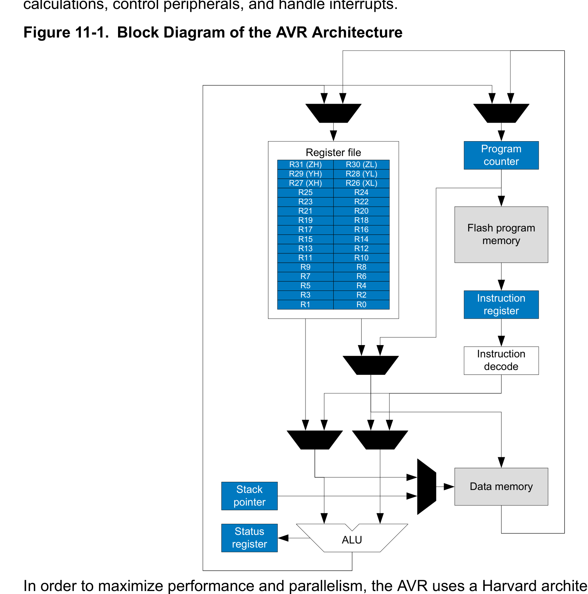
*Description*: System architecture block diagram depicting hardware modules, internal data buses, control logic, and peripheral interconnects for Figure 11-1: Block Diagram of the AVR Architecture.

> **Figure 11-1: Block Diagram of the AVR Architecture**

Register file
Flash program
memory
Program
counter
Instruction
register
Instruction
decode
Data memory
ALU
Status
register
R0
R1
R2
R3
R4
R5
R6
R7
R8
R9
R10
R11
R12
R13
R14
R15
R16
R17
R18
R19
R20
R21
R22
R23
R24
R25
R26 (XL)
R27 (XH)
R28 (YL)
R29 (YH)
R30 (ZL)
R31 (ZH)
Stack
pointer
In order to maximize performance and parallelism, the AVR uses a Harvard architecture – with separate
memories and buses for program and data. Instructions in the program memory are executed with a
single level pipelining. While one instruction is being executed, the next instruction is pre-fetched from the
program memory. This concept enables instructions to be executed in every clock cycle. The program
memory is In-System Reprogrammable Flash memory.
The fast-access register file contains 32 x 8-bit general purpose working registers with a single clock
cycle access time. This allows single-cycle Arithmetic Logic Unit (ALU) operation. In a typical ALU
operation, two operands are output from the register file, the operation is executed, and the result is
stored back in the register file – in one clock cycle.
Six of the 32 registers can be used as three 16-bit indirect address register pointers for data space
addressing – enabling efficient address calculations. One of these address pointers can be used as an
ATmega328/P
AVR CPU Core
© 2018 Microchip Technology Inc.
Datasheet Complete
DS40001984A-page 25
Downloaded from Arrow.com.
Downloaded from Arrow.com.
Downloaded from Arrow.com.
Downloaded from Arrow.com.
Downloaded from Arrow.com.
Downloaded from Arrow.com.
Downloaded from Arrow.com.
Downloaded from Arrow.com.
Downloaded from Arrow.com.
Downloaded from Arrow.com.
Downloaded from Arrow.com.
Downloaded from Arrow.com.
Downloaded from Arrow.com.
Downloaded from Arrow.com.
Downloaded from Arrow.com.
Downloaded from Arrow.com.
Downloaded from Arrow.com.
Downloaded from Arrow.com.
Downloaded from Arrow.com.
Downloaded from Arrow.com.
Downloaded from Arrow.com.
Downloaded from Arrow.com.
Downloaded from Arrow.com.
Downloaded from Arrow.com.
Downloaded from Arrow.com.


<!-- Page 26 -->
### [PDF Page 26]

address pointer for lookup tables in Flash program memory. These added function registers are the 16-bit
X-, Y-, and Z-register, described later in this section.
The ALU supports arithmetic and logic operations between registers or between a constant and a
register. Single register operations can also be executed in the ALU. After an arithmetic operation, the
Status register is updated to reflect information about the result of the operation.
Program flow is provided by conditional and unconditional jump and call instructions, able to directly
address the whole address space. Most AVR instructions have a single 16-bit word format. Every
program memory address contains a 16- or 32-bit instruction.
Program Flash memory space is divided into two sections, the Boot Program section and the Application
Program section. Both sections have dedicated Lock bits for write and read/write protection. The SPM
instruction that writes into the Application Flash memory section must reside in the Boot Program section.
During interrupts and subroutine calls, the return address Program Counter (PC) is stored on the Stack.
The Stack is effectively allocated in the general data SRAM, and consequently, the Stack size is only
limited by the total SRAM size and the usage of the SRAM. All user programs must initialize the Stack
Pointer (SP) in the Reset routine (before subroutines or interrupts are executed). The SP is read/write
accessible in the I/O space. The data SRAM can easily be accessed through the five different addressing
modes supported in the AVR architecture.
The memory spaces in the AVR architecture are all linear and regular memory maps.
A flexible interrupt module has its control registers in the I/O space with an additional global interrupt
enable bit in the Status register. All interrupts have a separate interrupt vector in the interrupt vector table.
The interrupts have priority in accordance with their interrupt vector position. The lower the interrupt
vector address, the higher the priority.
The I/O memory space contains 64 addresses for CPU peripheral functions as Control registers, SPI, and
other I/O functions. The I/O memory can be accessed directly, or as the data space locations following
those of the register file, 0x20 - 0x5F. In addition, this device has extended I/O space from 0x60 - 0xFF in
SRAM where only the ST/STS/STD and LD/LDS/LDD instructions can be used.
11.2
Arithmetic Logic Unit (ALU)
The high-performance AVR ALU operates in direct connection with all the 32 general purpose working
registers. Within a single clock cycle, arithmetic operations between general purpose registers or
between a register and an immediate are executed. The ALU operations are divided into three main
categories: arithmetic, logical, and bit-functions. Some implementations of the architecture provide a
powerful multiplier supporting both signed/unsigned multiplication and fractional format. See Instruction
Set Summary section for a detailed description.
Related Links
Instruction Set Summary
11.3
Status Register
The Status register contains information about the result of the most recently executed arithmetic
instruction. This information can be used for altering program flow in order to perform conditional
operations. The Status register is updated after all ALU operations, as specified in the instruction set
reference. This will in many cases remove the need for using the dedicated compare instructions,
resulting in faster and more compact code.
ATmega328/P
AVR CPU Core
© 2018 Microchip Technology Inc.
Datasheet Complete
DS40001984A-page 26
Downloaded from Arrow.com.
Downloaded from Arrow.com.
Downloaded from Arrow.com.
Downloaded from Arrow.com.
Downloaded from Arrow.com.
Downloaded from Arrow.com.
Downloaded from Arrow.com.
Downloaded from Arrow.com.
Downloaded from Arrow.com.
Downloaded from Arrow.com.
Downloaded from Arrow.com.
Downloaded from Arrow.com.
Downloaded from Arrow.com.
Downloaded from Arrow.com.
Downloaded from Arrow.com.
Downloaded from Arrow.com.
Downloaded from Arrow.com.
Downloaded from Arrow.com.
Downloaded from Arrow.com.
Downloaded from Arrow.com.
Downloaded from Arrow.com.
Downloaded from Arrow.com.
Downloaded from Arrow.com.
Downloaded from Arrow.com.
Downloaded from Arrow.com.
Downloaded from Arrow.com.


<!-- Page 27 -->
### [PDF Page 27]

The Status register is not automatically stored when entering an interrupt routine and restored when
returning from an interrupt. This must be handled by software.
ATmega328/P
AVR CPU Core
© 2018 Microchip Technology Inc.
Datasheet Complete
DS40001984A-page 27
Downloaded from Arrow.com.
Downloaded from Arrow.com.
Downloaded from Arrow.com.
Downloaded from Arrow.com.
Downloaded from Arrow.com.
Downloaded from Arrow.com.
Downloaded from Arrow.com.
Downloaded from Arrow.com.
Downloaded from Arrow.com.
Downloaded from Arrow.com.
Downloaded from Arrow.com.
Downloaded from Arrow.com.
Downloaded from Arrow.com.
Downloaded from Arrow.com.
Downloaded from Arrow.com.
Downloaded from Arrow.com.
Downloaded from Arrow.com.
Downloaded from Arrow.com.
Downloaded from Arrow.com.
Downloaded from Arrow.com.
Downloaded from Arrow.com.
Downloaded from Arrow.com.
Downloaded from Arrow.com.
Downloaded from Arrow.com.
Downloaded from Arrow.com.
Downloaded from Arrow.com.
Downloaded from Arrow.com.


<!-- Page 28 -->
### [PDF Page 28]

11.3.1
Status Register
Name:
SREG
Offset:
0x5F
Reset:
0x00
Property:  When addressing as I/O Register: address offset is 0x3F
When addressing I/O registers as data space using LD and ST instructions, the provided offset must be
used. When using the I/O specific commands IN and OUT, the offset is reduced by 0x20, resulting in an
I/O address offset within 0x00 - 0x3F.
Bit
7
6
5
4
3
2
1
0
I
T
H
S
V
N
Z
C
Access
R/W
R/W
R/W
R/W
R/W
R/W
R/W
R/W
Reset
0
0
0
0
0
0
0
0
Bit 7 – I Global Interrupt Enable
The global interrupt enable bit must be set for the interrupts to be enabled. The individual interrupt enable
control is then performed in separate control registers. If the Global Interrupt Enable register is cleared,
none of the interrupts are enabled independent of the individual interrupt enable settings. The I-bit is
cleared by hardware after an interrupt has occurred, and is set by the RETI instruction to enable
subsequent interrupts. The I-bit can also be set and cleared by the application with the SEI and CLI
instructions, as described in the instruction set reference.
Bit 6 – T Copy Storage
The bit copy instructions BLD (Bit LoaD) and BST (Bit STore) use the T-bit as source or destination for
the operated bit. A bit from a register in the register file can be copied into T by the BST instruction, and a
bit in T can be copied into a bit in a register in the register file by the BLD instruction.
Bit 5 – H Half Carry Flag
The half carry flag H indicates a half carry in some arithmetic operations. Half carry flag is useful in BCD
arithmetic. See the Instruction Set Description for detailed information.
Bit 4 – S Sign Flag, S = N ㊉ V
The S-bit is always an exclusive or between the negative flag N and the two’s complement overflow flag
V. See the Instruction Set Description for detailed information.
Bit 3 – V Two’s Complement Overflow Flag
The two’s complement overflow flag V supports two’s complement arithmetic. See the Instruction Set
Description for detailed information.
Bit 2 – N Negative Flag
The negative flag N indicates a negative result in an arithmetic or logic operation. See the Instruction Set
Description for detailed information.
Bit 1 – Z Zero Flag
The zero flag Z indicates a zero result in an arithmetic or logic operation. See the Instruction Set
Description for detailed information.
ATmega328/P
AVR CPU Core
© 2018 Microchip Technology Inc.
Datasheet Complete
DS40001984A-page 28
Downloaded from Arrow.com.
Downloaded from Arrow.com.
Downloaded from Arrow.com.
Downloaded from Arrow.com.
Downloaded from Arrow.com.
Downloaded from Arrow.com.
Downloaded from Arrow.com.
Downloaded from Arrow.com.
Downloaded from Arrow.com.
Downloaded from Arrow.com.
Downloaded from Arrow.com.
Downloaded from Arrow.com.
Downloaded from Arrow.com.
Downloaded from Arrow.com.
Downloaded from Arrow.com.
Downloaded from Arrow.com.
Downloaded from Arrow.com.
Downloaded from Arrow.com.
Downloaded from Arrow.com.
Downloaded from Arrow.com.
Downloaded from Arrow.com.
Downloaded from Arrow.com.
Downloaded from Arrow.com.
Downloaded from Arrow.com.
Downloaded from Arrow.com.
Downloaded from Arrow.com.
Downloaded from Arrow.com.
Downloaded from Arrow.com.


<!-- Page 29 -->
### [PDF Page 29]

Bit 0 – C Carry Flag
The carry flag C indicates a carry in an arithmetic or logic operation. See the Instruction Set Description
for detailed information.
11.4
General Purpose Register File
The register file is optimized for the AVR Enhanced RISC instruction set. In order to achieve the required
performance and flexibility, the following input/output schemes are supported by the register file:
•
One 8-bit output operand and one 8-bit result input
•
Two 8-bit output operands and one 8-bit result input
•
Two 8-bit output operands and one 16-bit result input
•
One 16-bit output operand and one 16-bit result input

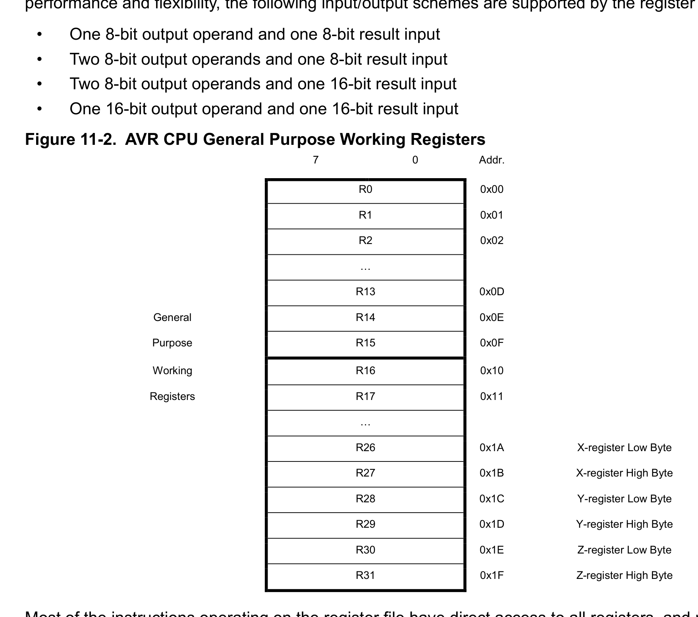
*Description*: Technical diagram and schematic illustration detailing hardware circuit topology, signal routing, and logic operations for Figure 11-2: AVR CPU General Purpose Working Registers.

> **Figure 11-2: AVR CPU General Purpose Working Registers**

7
0
Addr.
R0
0x00
R1
0x01
R2
0x02
…
R13
0x0D
General
R14
0x0E
Purpose
R15
0x0F
Working
R16
0x10
Registers
R17
0x11
…
R26
0x1A
X-register Low Byte
R27
0x1B
X-register High Byte
R28
0x1C
Y-register Low Byte
R29
0x1D
Y-register High Byte
R30
0x1E
Z-register Low Byte
R31
0x1F
Z-register High Byte
Most of the instructions operating on the register file have direct access to all registers, and most of them
are single cycle instructions. As shown in the figure, each register is also assigned a data memory
address, mapping them directly into the first 32 locations of the user data space. Although not being
physically implemented as SRAM locations, this memory organization provides great flexibility in access
of the registers, as the X-, Y-, and Z-pointer registers can be set to index any register in the file.
11.4.1
The X-register, Y-register, and Z-register
The registers R26...R31 have some added functions to their general purpose usage. These registers are
16-bit address pointers for indirect addressing of the data space. The three indirect address registers X,
Y, and Z are defined as described in the figure.
ATmega328/P
AVR CPU Core
© 2018 Microchip Technology Inc.
Datasheet Complete
DS40001984A-page 29
Downloaded from Arrow.com.
Downloaded from Arrow.com.
Downloaded from Arrow.com.
Downloaded from Arrow.com.
Downloaded from Arrow.com.
Downloaded from Arrow.com.
Downloaded from Arrow.com.
Downloaded from Arrow.com.
Downloaded from Arrow.com.
Downloaded from Arrow.com.
Downloaded from Arrow.com.
Downloaded from Arrow.com.
Downloaded from Arrow.com.
Downloaded from Arrow.com.
Downloaded from Arrow.com.
Downloaded from Arrow.com.
Downloaded from Arrow.com.
Downloaded from Arrow.com.
Downloaded from Arrow.com.
Downloaded from Arrow.com.
Downloaded from Arrow.com.
Downloaded from Arrow.com.
Downloaded from Arrow.com.
Downloaded from Arrow.com.
Downloaded from Arrow.com.
Downloaded from Arrow.com.
Downloaded from Arrow.com.
Downloaded from Arrow.com.
Downloaded from Arrow.com.


<!-- Page 30 -->
### [PDF Page 30]


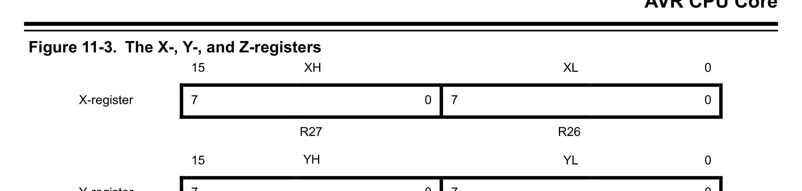
*Description*: Technical diagram and schematic illustration detailing hardware circuit topology, signal routing, and logic operations for Figure 11-3: The X-, Y-, and Z-registers.

> **Figure 11-3: The X-, Y-, and Z-registers**

15
XH
XL
0
X-register
7
0
7
0
R27
R26
15
YH
YL
0
Y-register
7
0
7
0
R29
R28
15
ZH
ZL
0
Z-register
7
0
7
0
R31
R30
In the different addressing modes, these address registers have functions as fixed displacement,
automatic increment, and automatic decrement (see the instruction set reference for details).
Related Links
Instruction Set Summary
11.5
Stack Pointer
The stack is mainly used for storing temporary data, local variables, and return addresses after interrupts
and subroutine calls. The stack is implemented as growing from higher to lower memory locations. The
Stack Pointer register always points to the top of the stack.
The stack pointer points to the data SRAM stack area where the subroutine and interrupt stacks are
located. A stack PUSH command will decrease the stack pointer. The stack in the data SRAM must be
defined by the program before any subroutine calls are executed or interrupts are enabled. Initial stack
pointer value equals the last address of the internal SRAM and the stack pointer must be set to point
above start of the SRAM. See the table for stack pointer details.

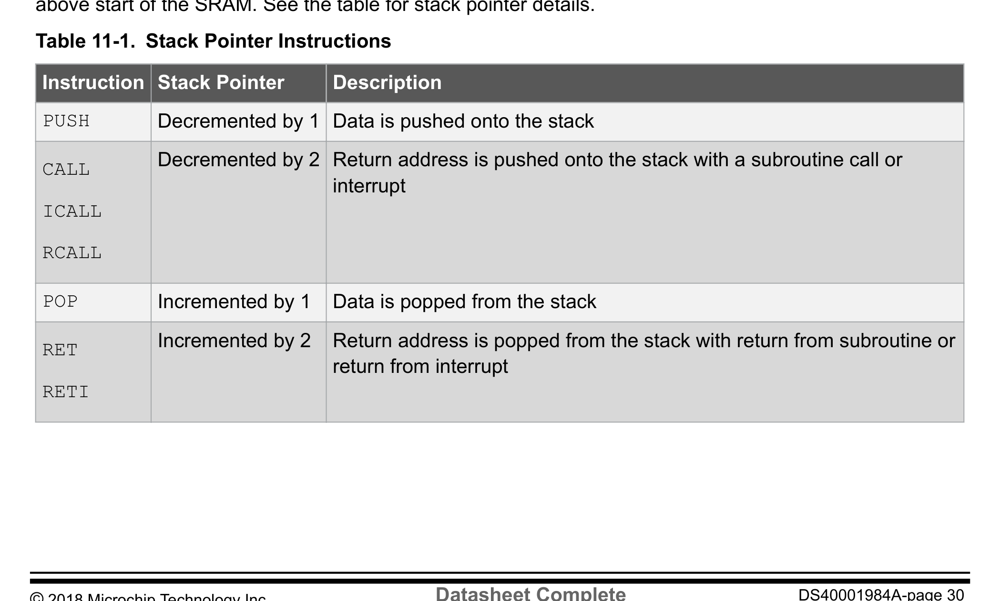
*Description*: Hardware reference table detailing register bit field settings, electrical operating limits, or memory configurations for Table 11-1: Stack Pointer Instructions.

> **Table 11-1: Stack Pointer Instructions**

Instruction Stack Pointer
Description
PUSH
Decremented by 1 Data is pushed onto the stack
CALL
ICALL
RCALL
Decremented by 2 Return address is pushed onto the stack with a subroutine call or
interrupt
POP
Incremented by 1
Data is popped from the stack
RET
RETI
Incremented by 2
Return address is popped from the stack with return from subroutine or
return from interrupt
ATmega328/P
AVR CPU Core
© 2018 Microchip Technology Inc.
Datasheet Complete
DS40001984A-page 30
Downloaded from Arrow.com.
Downloaded from Arrow.com.
Downloaded from Arrow.com.
Downloaded from Arrow.com.
Downloaded from Arrow.com.
Downloaded from Arrow.com.
Downloaded from Arrow.com.
Downloaded from Arrow.com.
Downloaded from Arrow.com.
Downloaded from Arrow.com.
Downloaded from Arrow.com.
Downloaded from Arrow.com.
Downloaded from Arrow.com.
Downloaded from Arrow.com.
Downloaded from Arrow.com.
Downloaded from Arrow.com.
Downloaded from Arrow.com.
Downloaded from Arrow.com.
Downloaded from Arrow.com.
Downloaded from Arrow.com.
Downloaded from Arrow.com.
Downloaded from Arrow.com.
Downloaded from Arrow.com.
Downloaded from Arrow.com.
Downloaded from Arrow.com.
Downloaded from Arrow.com.
Downloaded from Arrow.com.
Downloaded from Arrow.com.
Downloaded from Arrow.com.
Downloaded from Arrow.com.


<!-- Page 31 -->
### [PDF Page 31]

The AVR stack pointer is implemented as two 8-bit registers in the I/O space. The number of bits actually
used is implementation dependent. Note that the data space in some implementations of the AVR
architecture is so small that only SPL is needed. In this case, the SPH register will not be present.
ATmega328/P
AVR CPU Core
© 2018 Microchip Technology Inc.
Datasheet Complete
DS40001984A-page 31
Downloaded from Arrow.com.
Downloaded from Arrow.com.
Downloaded from Arrow.com.
Downloaded from Arrow.com.
Downloaded from Arrow.com.
Downloaded from Arrow.com.
Downloaded from Arrow.com.
Downloaded from Arrow.com.
Downloaded from Arrow.com.
Downloaded from Arrow.com.
Downloaded from Arrow.com.
Downloaded from Arrow.com.
Downloaded from Arrow.com.
Downloaded from Arrow.com.
Downloaded from Arrow.com.
Downloaded from Arrow.com.
Downloaded from Arrow.com.
Downloaded from Arrow.com.
Downloaded from Arrow.com.
Downloaded from Arrow.com.
Downloaded from Arrow.com.
Downloaded from Arrow.com.
Downloaded from Arrow.com.
Downloaded from Arrow.com.
Downloaded from Arrow.com.
Downloaded from Arrow.com.
Downloaded from Arrow.com.
Downloaded from Arrow.com.
Downloaded from Arrow.com.
Downloaded from Arrow.com.
Downloaded from Arrow.com.


<!-- Page 32 -->
### [PDF Page 32]

11.5.1
Stack Pointer Register Low and High byte
Name:
SPL and SPH
Offset:
0x5D
Reset:
0x4FF
Property:  When addressing I/O registers as data space the offset address is 0x3D
The SPL and SPH register pair represents the 16-bit value, SP. The low byte [7:0] (suffix L) is accessible
at the original offset. The high byte [15:8] (suffix H) can be accessed at offset + 0x01. For more details on
reading and writing 16-bit registers, refer to Accessing 16-bit Timer/Counter Registers.
When using the I/O specific commands IN and OUT, the I/O addresses 0x00 - 0x3F must be used. When
addressing I/O registers as data space using LD and ST instructions, 0x20 must be added to these offset
addresses.
Bit
15
14
13
12
11
10
9
8
SP11
SP10
SP9
SP8
Access
R
R
R
R
RW
RW
RW
RW
Reset
0
0
0
0
0
1
0
0
Bit
7
6
5
4
3
2
1
0
SP7
SP6
SP5
SP4
SP3
SP2
SP1
SP0
Access
RW
RW
RW
RW
RW
RW
RW
RW
Reset
1
1
1
1
1
1
1
1
Bits 0, 1, 2, 3, 4, 5, 6, 7, 8, 9, 10, 11 – SP Stack Pointer Register
SPL and SPH are combined into SP.
Related Links
Accessing 16-bit Timer/Counter Registers
11.6
Instruction Execution Timing
This section describes the general access timing concepts for instruction execution. The AVR CPU is
driven by the CPU clock clkCPU, directly generated from the selected clock source for the chip. No internal
clock division is used. The figure below shows the parallel instruction fetches and instruction executions
enabled by the Harvard architecture and the fast-access register file concept. This is the basic pipelining
concept to obtain up to 1 MIPS per MHz with the corresponding unique results for functions per cost,
functions per clocks, and functions per power unit.
ATmega328/P
AVR CPU Core
© 2018 Microchip Technology Inc.
Datasheet Complete
DS40001984A-page 32
Downloaded from Arrow.com.
Downloaded from Arrow.com.
Downloaded from Arrow.com.
Downloaded from Arrow.com.
Downloaded from Arrow.com.
Downloaded from Arrow.com.
Downloaded from Arrow.com.
Downloaded from Arrow.com.
Downloaded from Arrow.com.
Downloaded from Arrow.com.
Downloaded from Arrow.com.
Downloaded from Arrow.com.
Downloaded from Arrow.com.
Downloaded from Arrow.com.
Downloaded from Arrow.com.
Downloaded from Arrow.com.
Downloaded from Arrow.com.
Downloaded from Arrow.com.
Downloaded from Arrow.com.
Downloaded from Arrow.com.
Downloaded from Arrow.com.
Downloaded from Arrow.com.
Downloaded from Arrow.com.
Downloaded from Arrow.com.
Downloaded from Arrow.com.
Downloaded from Arrow.com.
Downloaded from Arrow.com.
Downloaded from Arrow.com.
Downloaded from Arrow.com.
Downloaded from Arrow.com.
Downloaded from Arrow.com.
Downloaded from Arrow.com.


<!-- Page 33 -->
### [PDF Page 33]


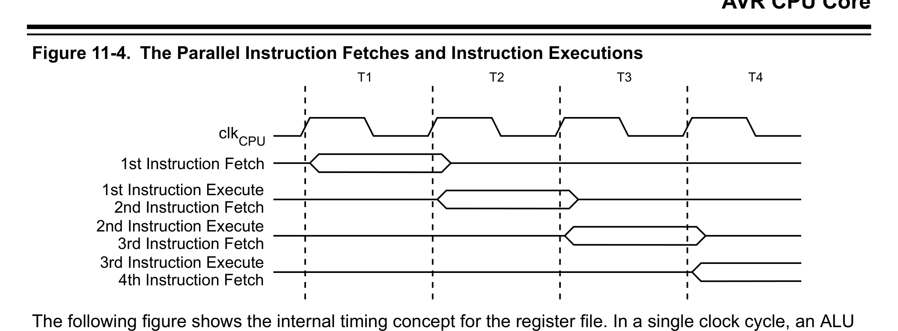
*Description*: Technical diagram and schematic illustration detailing hardware circuit topology, signal routing, and logic operations for Figure 11-4: The Parallel Instruction Fetches and Instruction Executions.

> **Figure 11-4: The Parallel Instruction Fetches and Instruction Executions**

clk
1st Instruction Fetch
1st Instruction Execute
2nd Instruction Fetch
2nd Instruction Execute
3rd Instruction Fetch
3rd Instruction Execute
4th Instruction Fetch
T1
T2
T3
T4
CPU
The following figure shows the internal timing concept for the register file. In a single clock cycle, an ALU
operation using two register operands is executed and the result is stored back to the destination register.

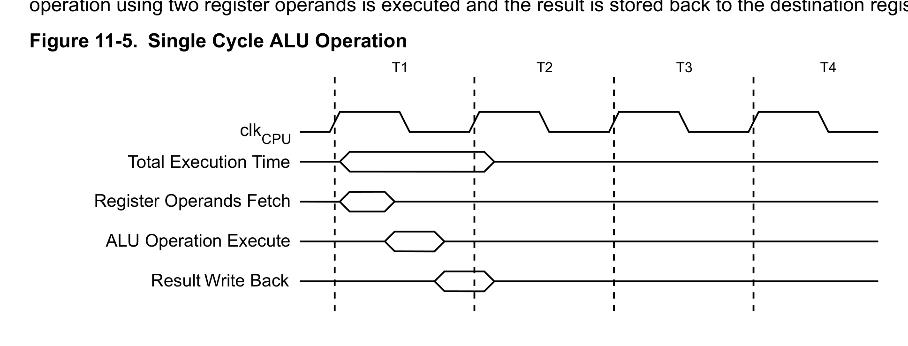
*Description*: Technical diagram and schematic illustration detailing hardware circuit topology, signal routing, and logic operations for Figure 11-5: Single Cycle ALU Operation.

> **Figure 11-5: Single Cycle ALU Operation**

Total Execution Time
Register Operands Fetch
ALU Operation Execute
Result Write Back
T1
T2
T3
T4
clkCPU
11.7
Reset and Interrupt Handling
The AVR provides several different interrupt sources. These interrupts and the separate Reset vector
each have a separate program vector in the program memory space. All interrupts are assigned
individual enable bits, which must be written logic one together with the global interrupt enable bit in the
Status register in order to enable the interrupt. Depending on the program counter value, interrupts may
be automatically disabled when Boot Lock bits BLB02 or BLB12 are programmed. This feature improves
software security.
The lowest addresses in the program memory space are by default defined as the Reset and interrupt
vectors. They have determined priority levels: The lower the address the higher is the priority level.
RESET has the highest priority, and next is INT0 – the External Interrupt Request 0. The interrupt vectors
can be moved to the start of the boot Flash section by setting the IVSEL bit in the MCU Control Register
(MCUCR). The Reset vector can be moved to the start of the boot Flash section by programming the
BOOTRST Fuse.
When an interrupt occurs, the global interrupt enable I-bit is cleared and all interrupts are disabled. The
user software can write logic one to the I-bit to enable nested interrupts. All enabled interrupts can then
interrupt the current interrupt routine. The I-bit is automatically set when a return from interrupt instruction
– RETI – is executed.
There are basically two types of interrupts:
The first type is triggered by an event that sets the interrupt flag. For these interrupts, the program
counter is vectored to the actual interrupt vector in order to execute the interrupt handling routine, and
ATmega328/P
AVR CPU Core
© 2018 Microchip Technology Inc.
Datasheet Complete
DS40001984A-page 33
Downloaded from Arrow.com.
Downloaded from Arrow.com.
Downloaded from Arrow.com.
Downloaded from Arrow.com.
Downloaded from Arrow.com.
Downloaded from Arrow.com.
Downloaded from Arrow.com.
Downloaded from Arrow.com.
Downloaded from Arrow.com.
Downloaded from Arrow.com.
Downloaded from Arrow.com.
Downloaded from Arrow.com.
Downloaded from Arrow.com.
Downloaded from Arrow.com.
Downloaded from Arrow.com.
Downloaded from Arrow.com.
Downloaded from Arrow.com.
Downloaded from Arrow.com.
Downloaded from Arrow.com.
Downloaded from Arrow.com.
Downloaded from Arrow.com.
Downloaded from Arrow.com.
Downloaded from Arrow.com.
Downloaded from Arrow.com.
Downloaded from Arrow.com.
Downloaded from Arrow.com.
Downloaded from Arrow.com.
Downloaded from Arrow.com.
Downloaded from Arrow.com.
Downloaded from Arrow.com.
Downloaded from Arrow.com.
Downloaded from Arrow.com.
Downloaded from Arrow.com.


<!-- Page 34 -->
### [PDF Page 34]

hardware clears the corresponding interrupt flag. Interrupt flags can be cleared by writing a logic one to
the flag bit position(s) to be cleared. If an interrupt condition occurs while the corresponding interrupt
enable bit is cleared, the interrupt flag will be set and remembered until the interrupt is enabled, or the
flag is cleared by software. Similarly, if one or more interrupt conditions occur while the global interrupt
enable bit is cleared, the corresponding interrupt flag(s) will be set and remembered until the global
interrupt enable bit is set and will then be executed by order of priority.
The second type of interrupts will trigger as long as the interrupt condition is present. These interrupts do
not necessarily have interrupt flags. If the interrupt condition disappears before the interrupt is enabled,
the interrupt will not be triggered. When the AVR exits from an interrupt, it will always return to the main
program and execute one more instruction before any pending interrupt is served.
The Status register is not automatically stored when entering an interrupt routine, nor restored when
returning from an interrupt routine. This must be handled by software.
When using the CLI instruction to disable interrupts, the interrupts will be immediately disabled. No
interrupt will be executed after the CLI instruction, even if it occurs simultaneously with the CLI
instruction. The following example shows how this can be used to avoid interrupts during the timed
EEPROM write sequence.
Assembly Code Example(1)
in r16, SREG ; store SREG value
cli ; disable interrupts during timed sequence
sbi EECR, EEMPE ; start EEPROM write
sbi EECR, EEPE
out SREG, r16 ; restore SREG value (I-bit)
C Code Example(1)
char cSREG;
cSREG = SREG; /* store SREG value */
/* disable interrupts during timed sequence */
_CLI();
EECR |= (1<<EEMPE); /* start EEPROM write */
EECR |= (1<<EEPE);
SREG = cSREG; /* restore SREG value (I-bit) */
1.
Refer to About Code Examples.
When using the SEI instruction to enable interrupts, the instruction following SEI will be executed before
any pending interrupts, as shown in this example.
Assembly Code Example(1)
sei ; set Global Interrupt Enable
sleep ; enter sleep, waiting for interrupt
; note: will enter sleep before any pending interrupt(s)
C Code Example(1)
__enable_interrupt(); /* set Global Interrupt Enable */
__sleep(); /* enter sleep, waiting for interrupt */
/* note: will enter sleep before any pending interrupt(s) */
1.
Refer to About Code Examples.
Related Links
Memory Programming
Boot Loader Support – Read-While-Write Self-Programming
ATmega328/P
AVR CPU Core
© 2018 Microchip Technology Inc.
Datasheet Complete
DS40001984A-page 34
Downloaded from Arrow.com.
Downloaded from Arrow.com.
Downloaded from Arrow.com.
Downloaded from Arrow.com.
Downloaded from Arrow.com.
Downloaded from Arrow.com.
Downloaded from Arrow.com.
Downloaded from Arrow.com.
Downloaded from Arrow.com.
Downloaded from Arrow.com.
Downloaded from Arrow.com.
Downloaded from Arrow.com.
Downloaded from Arrow.com.
Downloaded from Arrow.com.
Downloaded from Arrow.com.
Downloaded from Arrow.com.
Downloaded from Arrow.com.
Downloaded from Arrow.com.
Downloaded from Arrow.com.
Downloaded from Arrow.com.
Downloaded from Arrow.com.
Downloaded from Arrow.com.
Downloaded from Arrow.com.
Downloaded from Arrow.com.
Downloaded from Arrow.com.
Downloaded from Arrow.com.
Downloaded from Arrow.com.
Downloaded from Arrow.com.
Downloaded from Arrow.com.
Downloaded from Arrow.com.
Downloaded from Arrow.com.
Downloaded from Arrow.com.
Downloaded from Arrow.com.
Downloaded from Arrow.com.


<!-- Page 35 -->
### [PDF Page 35]

11.7.1
Interrupt Response Time
The interrupt execution response for all the enabled AVR interrupts is four clock cycles minimum. After
four clock cycles, the program vector address for the actual interrupt handling routine is executed. During
this four clock cycle period, the program counter is pushed onto the stack. The vector is normally a jump
to the interrupt routine, and this jump takes three clock cycles. If an interrupt occurs during execution of a
multi-cycle instruction, this instruction is completed before the interrupt is served. If an interrupt occurs
when the microcontroller (MCU) is in Sleep mode, the interrupt execution response time is increased by
four clock cycles. This increase comes in addition to the start-up time from the selected Sleep mode. A
return from an interrupt handling routine takes four clock cycles. During these four clock cycles, the
program counter (two bytes) is popped back from the Stack, the Stack Pointer is incremented by two, and
the I-bit in SREG is set.
ATmega328/P
AVR CPU Core
© 2018 Microchip Technology Inc.
Datasheet Complete
DS40001984A-page 35
Downloaded from Arrow.com.
Downloaded from Arrow.com.
Downloaded from Arrow.com.
Downloaded from Arrow.com.
Downloaded from Arrow.com.
Downloaded from Arrow.com.
Downloaded from Arrow.com.
Downloaded from Arrow.com.
Downloaded from Arrow.com.
Downloaded from Arrow.com.
Downloaded from Arrow.com.
Downloaded from Arrow.com.
Downloaded from Arrow.com.
Downloaded from Arrow.com.
Downloaded from Arrow.com.
Downloaded from Arrow.com.
Downloaded from Arrow.com.
Downloaded from Arrow.com.
Downloaded from Arrow.com.
Downloaded from Arrow.com.
Downloaded from Arrow.com.
Downloaded from Arrow.com.
Downloaded from Arrow.com.
Downloaded from Arrow.com.
Downloaded from Arrow.com.
Downloaded from Arrow.com.
Downloaded from Arrow.com.
Downloaded from Arrow.com.
Downloaded from Arrow.com.
Downloaded from Arrow.com.
Downloaded from Arrow.com.
Downloaded from Arrow.com.
Downloaded from Arrow.com.
Downloaded from Arrow.com.
Downloaded from Arrow.com.


<!-- Page 36 -->
### [PDF Page 36]

12.
AVR Memories
12.1

### Overview

This section describes the different memory types in the device. The AVR architecture has two main
memory spaces, the Data Memory and the Program Memory space. In addition, the device features an
EEPROM Memory for data storage. All memory spaces are linear and regular.
12.2
In-System Reprogrammable Flash Program Memory
The ATmega328/P contains 32Kbytes on-chip in-system reprogrammable Flash memory for program
storage. Since all AVR instructions are 16 or 32 bits wide, the Flash is organized as 16 K x 16. For
software security, the Flash Program memory space is divided into two sections - Boot Loader Section
and Application Program Section in the device .
The ATmega328/P Program Counter (PC) is 14 bits wide, thus addressing the 16 K program memory
locations. The operation of the Boot Program section and associated Boot Lock bits for software
protection are described in detail in Boot Loader Support – Read-While-Write Self-Programming. Refer to
Memory Programming for the description of Flash data serial downloading using the SPI pins.
Constant tables can be allocated within the entire program memory address space, using the Load
Program Memory (LPM) instruction.
Timing diagrams for instruction fetch and execution are presented in Instruction Execution Timing.

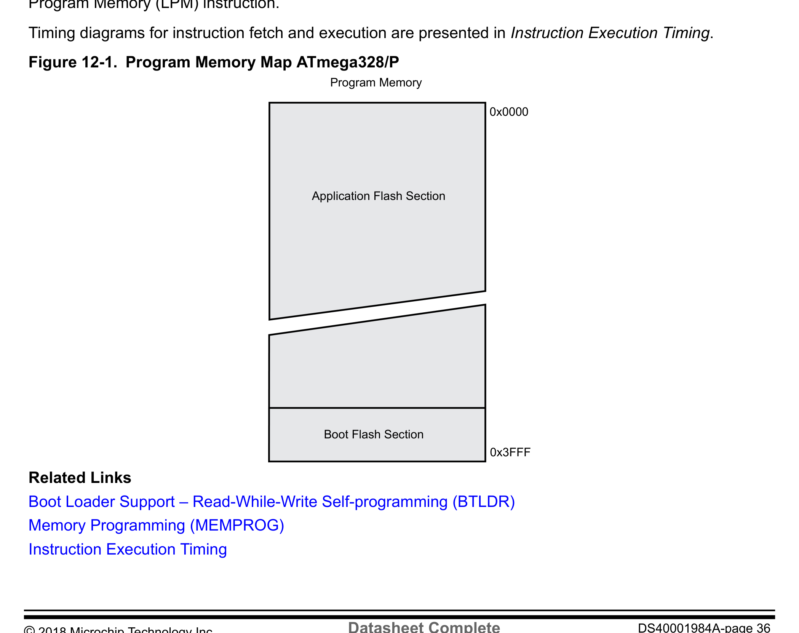
*Description*: Technical diagram and schematic illustration detailing hardware circuit topology, signal routing, and logic operations for Figure 12-1: Program Memory Map ATmega328/P.

> **Figure 12-1: Program Memory Map ATmega328/P**

0x0000
0x3FFF
Program Memory
Application Flash Section
Boot Flash Section
Related Links
Boot Loader Support – Read-While-Write Self-programming (BTLDR)
Memory Programming (MEMPROG)
Instruction Execution Timing
ATmega328/P
AVR Memories
© 2018 Microchip Technology Inc.
Datasheet Complete
DS40001984A-page 36
Downloaded from Arrow.com.
Downloaded from Arrow.com.
Downloaded from Arrow.com.
Downloaded from Arrow.com.
Downloaded from Arrow.com.
Downloaded from Arrow.com.
Downloaded from Arrow.com.
Downloaded from Arrow.com.
Downloaded from Arrow.com.
Downloaded from Arrow.com.
Downloaded from Arrow.com.
Downloaded from Arrow.com.
Downloaded from Arrow.com.
Downloaded from Arrow.com.
Downloaded from Arrow.com.
Downloaded from Arrow.com.
Downloaded from Arrow.com.
Downloaded from Arrow.com.
Downloaded from Arrow.com.
Downloaded from Arrow.com.
Downloaded from Arrow.com.
Downloaded from Arrow.com.
Downloaded from Arrow.com.
Downloaded from Arrow.com.
Downloaded from Arrow.com.
Downloaded from Arrow.com.
Downloaded from Arrow.com.
Downloaded from Arrow.com.
Downloaded from Arrow.com.
Downloaded from Arrow.com.
Downloaded from Arrow.com.
Downloaded from Arrow.com.
Downloaded from Arrow.com.
Downloaded from Arrow.com.
Downloaded from Arrow.com.
Downloaded from Arrow.com.


<!-- Page 37 -->
### [PDF Page 37]

12.3
SRAM Data Memory
The following figure shows how the device SRAM memory is organized.
The device is a complex microcontroller with more peripheral units than can be supported within the 64
locations reserved in the Opcode for the IN and OUT instructions. For the extended I/O space from 0x60 -
0xFF in SRAM, only the ST/STS/STD and LD/LDS/LDD instructions can be used.
The lower 2303 data memory locations address both the register file, the I/O memory, extended I/O
memory, and the internal data SRAM. The first 32 locations address the register file, the next 64 location
the standard I/O memory, then 160 locations of extended I/O memory, and the next 2 K locations address
the internal data SRAM.
The five different addressing modes for the data memory cover:
•
Direct
–
The direct addressing reaches the entire data space.
•
Indirect with Displacement
–
The indirect with displacement mode reaches 63 address locations from the base address
given by the Y- or Z-register.
•
Indirect
–
In the register file, registers R26 to R31 feature the indirect addressing pointer registers.
•
Indirect with Pre-decrement
–
The address registers X, Y, and Z are decremented.
•
Indirect with Post-increment
–
The address registers X, Y, and Z are incremented.
The 32 general purpose working registers, 64 I/O registers, 160 extended I/O registers, and the 2K bytes
of internal data SRAM in the device are all accessible through all these addressing modes.

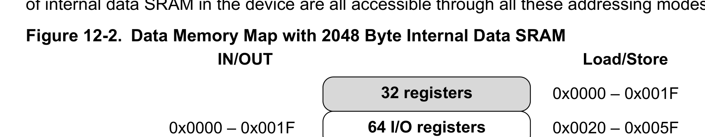
*Description*: Technical diagram and schematic illustration detailing hardware circuit topology, signal routing, and logic operations for Figure 12-2: Data Memory Map with 2048 Byte Internal Data SRAM.

> **Figure 12-2: Data Memory Map with 2048 Byte Internal Data SRAM**

Load/Store
IN/OUT
0x0000 – 0x001F
0x0100
0x08FF
160 Ext I/O registers
64 I/O registers
32 registers
Internal SRAM
(2048x8)
0x0020 – 0x005F
0x0060 – 0x00FF
0x0000 – 0x001F
12.3.1
Data Memory Access Times
The internal data SRAM access is performed in two clkCPU cycles as described in the following Figure.
ATmega328/P
AVR Memories
© 2018 Microchip Technology Inc.
Datasheet Complete
DS40001984A-page 37
Downloaded from Arrow.com.
Downloaded from Arrow.com.
Downloaded from Arrow.com.
Downloaded from Arrow.com.
Downloaded from Arrow.com.
Downloaded from Arrow.com.
Downloaded from Arrow.com.
Downloaded from Arrow.com.
Downloaded from Arrow.com.
Downloaded from Arrow.com.
Downloaded from Arrow.com.
Downloaded from Arrow.com.
Downloaded from Arrow.com.
Downloaded from Arrow.com.
Downloaded from Arrow.com.
Downloaded from Arrow.com.
Downloaded from Arrow.com.
Downloaded from Arrow.com.
Downloaded from Arrow.com.
Downloaded from Arrow.com.
Downloaded from Arrow.com.
Downloaded from Arrow.com.
Downloaded from Arrow.com.
Downloaded from Arrow.com.
Downloaded from Arrow.com.
Downloaded from Arrow.com.
Downloaded from Arrow.com.
Downloaded from Arrow.com.
Downloaded from Arrow.com.
Downloaded from Arrow.com.
Downloaded from Arrow.com.
Downloaded from Arrow.com.
Downloaded from Arrow.com.
Downloaded from Arrow.com.
Downloaded from Arrow.com.
Downloaded from Arrow.com.
Downloaded from Arrow.com.


<!-- Page 38 -->
### [PDF Page 38]


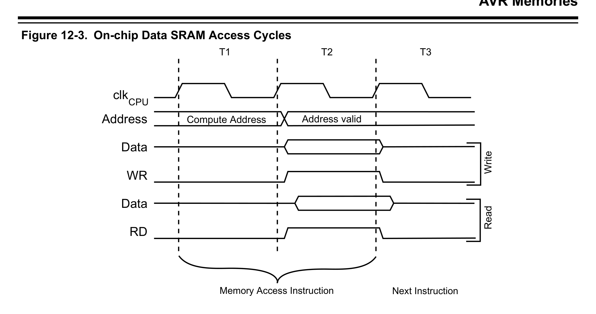
*Description*: Technical diagram and schematic illustration detailing hardware circuit topology, signal routing, and logic operations for Figure 12-3: On-chip Data SRAM Access Cycles.

> **Figure 12-3: On-chip Data SRAM Access Cycles**

clk
WR
RD
Data
Data
Address
Address valid
T1
T2
T3
Compute Address
Read
Write
CPU
Memory Access Instruction
Next Instruction
12.4
EEPROM Data Memory
The ATmega328/P contains 1KB of data EEPROM memory. It is organized as a separate data space, in
which single bytes can be read and written. The access between the EEPROM and the CPU is described
in the following, specifying the EEPROM Address registers, the EEPROM Data register, and the
EEPROM Control register.
See the related links for a detailed description on EEPROM Programming in SPI or Parallel Programming
mode.
Related Links
Memory Programming (MEMPROG)
12.4.1
EEPROM Read/Write Access
The EEPROM access registers are accessible in the I/O space.

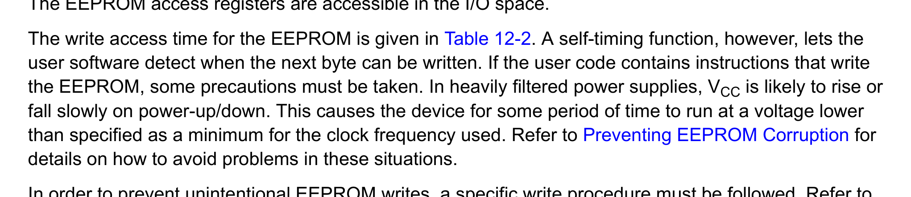
*Description*: Hardware reference table detailing register bit field settings, electrical operating limits, or memory configurations for Table 12-2: A self-timing function, however, lets the.

> **Table 12-2: A self-timing function, however, lets the**

user software detect when the next byte can be written. If the user code contains instructions that write
the EEPROM, some precautions must be taken. In heavily filtered power supplies, VCC is likely to rise or
fall slowly on power-up/down. This causes the device for some period of time to run at a voltage lower
than specified as a minimum for the clock frequency used. Refer to Preventing EEPROM Corruption for
details on how to avoid problems in these situations.
In order to prevent unintentional EEPROM writes, a specific write procedure must be followed. Refer to
the description of the EEPROM Control register for details on this.
When the EEPROM is read, the CPU is halted for four clock cycles before the next instruction is
executed. When the EEPROM is written, the CPU is halted for two clock cycles before the next instruction
is executed.
ATmega328/P
AVR Memories
© 2018 Microchip Technology Inc.
Datasheet Complete
DS40001984A-page 38
Downloaded from Arrow.com.
Downloaded from Arrow.com.
Downloaded from Arrow.com.
Downloaded from Arrow.com.
Downloaded from Arrow.com.
Downloaded from Arrow.com.
Downloaded from Arrow.com.
Downloaded from Arrow.com.
Downloaded from Arrow.com.
Downloaded from Arrow.com.
Downloaded from Arrow.com.
Downloaded from Arrow.com.
Downloaded from Arrow.com.
Downloaded from Arrow.com.
Downloaded from Arrow.com.
Downloaded from Arrow.com.
Downloaded from Arrow.com.
Downloaded from Arrow.com.
Downloaded from Arrow.com.
Downloaded from Arrow.com.
Downloaded from Arrow.com.
Downloaded from Arrow.com.
Downloaded from Arrow.com.
Downloaded from Arrow.com.
Downloaded from Arrow.com.
Downloaded from Arrow.com.
Downloaded from Arrow.com.
Downloaded from Arrow.com.
Downloaded from Arrow.com.
Downloaded from Arrow.com.
Downloaded from Arrow.com.
Downloaded from Arrow.com.
Downloaded from Arrow.com.
Downloaded from Arrow.com.
Downloaded from Arrow.com.
Downloaded from Arrow.com.
Downloaded from Arrow.com.
Downloaded from Arrow.com.


<!-- Page 39 -->
### [PDF Page 39]

12.4.2
Preventing EEPROM Corruption
During periods of low VCC, the EEPROM data can be corrupted because the supply voltage is too low for
the CPU and the EEPROM to operate properly. These issues are the same as for board level systems
using EEPROM, and the same design solutions should be applied.
An EEPROM data corruption can be caused by two situations when the voltage is too low. First, a regular
write sequence to the EEPROM requires a minimum voltage to operate correctly. Secondly, the CPU itself
can execute instructions incorrectly, if the supply voltage is too low.
EEPROM data corruption can easily be avoided by following this design recommendation:
Keep the AVR RESET active (low) during periods of insufficient power supply voltage. This can be done
by enabling the internal Brown-out Detector (BOD). If the detection level of the internal BOD does not
match the needed detection level, an external low VCC Reset protection circuit can be used. If a Reset
occurs while a write operation is in progress, the write operation will be completed provided that the
power supply voltage is sufficient.
12.5
I/O Memory
The I/O space definition of the device is shown in the Register Summary.
All device I/Os and peripherals are placed in the I/O space. All I/O locations may be accessed by the
LD/LDS/LDD and ST/STS/STD instructions, transferring data between the 32 general purpose working
registers and the I/O space. I/O registers within the address range 0x00-0x1F are directly bit-accessible
using the SBI and CBI instructions. In these registers, the value of single bits can be checked by using
the SBIS and SBIC instructions.
When using the I/O specific commands IN and OUT, the I/O addresses 0x00-0x3F must be used. When
addressing I/O registers as data space using LD and ST instructions, 0x20 must be added to these
addresses. The device is a complex microcontroller with more peripheral units than can be supported
within the 64 locations reserved in Opcode for the IN and OUT instructions. For the extended I/O space
from 0x60..0xFF in SRAM, only the ST/STS/STD and LD/LDS/LDD instructions can be used.
For compatibility with future devices, reserved bits should be written to zero if accessed. Reserved I/O
memory addresses should never be written.
Some of the status flags are cleared by writing a '1' to them; this is described in the flag descriptions.
Note that, unlike most other AVRs, the CBI and SBI instructions will only operate on the specified bit, and
can, therefore, be used on registers containing such status flags. The CBI and SBI instructions work with
registers 0x00-0x1F only.
The I/O and peripherals control registers are explained in later sections.
Related Links
Memory Programming (MEMPROG)
Register Summary
Instruction Set Summary
12.5.1
General Purpose I/O Registers
The device contains three general purpose I/O registers; General purpose I/O register 0/1/2 (GPIOR
0/1/2). These registers can be used for storing any information, and they are particularly useful for storing
global variables and status flags. General purpose I/O registers within the address range 0x00 - 0x1F are
directly bit-accessible using the SBI, CBI, SBIS, and SBIC instructions.
ATmega328/P
AVR Memories
© 2018 Microchip Technology Inc.
Datasheet Complete
DS40001984A-page 39
Downloaded from Arrow.com.
Downloaded from Arrow.com.
Downloaded from Arrow.com.
Downloaded from Arrow.com.
Downloaded from Arrow.com.
Downloaded from Arrow.com.
Downloaded from Arrow.com.
Downloaded from Arrow.com.
Downloaded from Arrow.com.
Downloaded from Arrow.com.
Downloaded from Arrow.com.
Downloaded from Arrow.com.
Downloaded from Arrow.com.
Downloaded from Arrow.com.
Downloaded from Arrow.com.
Downloaded from Arrow.com.
Downloaded from Arrow.com.
Downloaded from Arrow.com.
Downloaded from Arrow.com.
Downloaded from Arrow.com.
Downloaded from Arrow.com.
Downloaded from Arrow.com.
Downloaded from Arrow.com.
Downloaded from Arrow.com.
Downloaded from Arrow.com.
Downloaded from Arrow.com.
Downloaded from Arrow.com.
Downloaded from Arrow.com.
Downloaded from Arrow.com.
Downloaded from Arrow.com.
Downloaded from Arrow.com.
Downloaded from Arrow.com.
Downloaded from Arrow.com.
Downloaded from Arrow.com.
Downloaded from Arrow.com.
Downloaded from Arrow.com.
Downloaded from Arrow.com.
Downloaded from Arrow.com.
Downloaded from Arrow.com.


<!-- Page 40 -->
### [PDF Page 40]

12.6

### Register Description

12.6.1
Accessing 16-Bit Registers
The AVR data bus is 8-bits wide, so accessing 16-bit registers requires atomic operations. These
registers must be byte-accessed using two read or write operations. 16-bit registers are connected to the
8-bit bus and a temporary register using a 16-bit bus.
For a write operation, the high byte of the 16-bit register must be written before the low byte. The high
byte is then written into the temporary register. When the low byte of the 16-bit register is written, the
temporary register is copied into the high byte of the 16-bit register in the same clock cycle.
For a read operation, the low byte of the 16-bit register must be read before the high byte. When the low
byte register is read by the CPU, the high byte of the 16-bit register is copied into the temporary register
in the same clock cycle as the low byte is read. When the high byte is read, it is then read from the
temporary register.
This ensures that the low and high bytes of 16-bit registers are always accessed simultaneously when
reading or writing the register.
Interrupts can corrupt the timed sequence if an interrupt is triggered and accesses the same 16-bit
register during an atomic 16-bit read/write operation. To prevent this, interrupts can be disabled when
writing or reading 16-bit registers.
The temporary registers can be read and written directly from user software.
Note:  For more information, refer to Accessing 16-bit Timer/Counter registers.
Related Links
Accessing 16-bit Timer/Counter Registers
ATmega328/P
AVR Memories
© 2018 Microchip Technology Inc.
Datasheet Complete
DS40001984A-page 40
Downloaded from Arrow.com.
Downloaded from Arrow.com.
Downloaded from Arrow.com.
Downloaded from Arrow.com.
Downloaded from Arrow.com.
Downloaded from Arrow.com.
Downloaded from Arrow.com.
Downloaded from Arrow.com.
Downloaded from Arrow.com.
Downloaded from Arrow.com.
Downloaded from Arrow.com.
Downloaded from Arrow.com.
Downloaded from Arrow.com.
Downloaded from Arrow.com.
Downloaded from Arrow.com.
Downloaded from Arrow.com.
Downloaded from Arrow.com.
Downloaded from Arrow.com.
Downloaded from Arrow.com.
Downloaded from Arrow.com.
Downloaded from Arrow.com.
Downloaded from Arrow.com.
Downloaded from Arrow.com.
Downloaded from Arrow.com.
Downloaded from Arrow.com.
Downloaded from Arrow.com.
Downloaded from Arrow.com.
Downloaded from Arrow.com.
Downloaded from Arrow.com.
Downloaded from Arrow.com.
Downloaded from Arrow.com.
Downloaded from Arrow.com.
Downloaded from Arrow.com.
Downloaded from Arrow.com.
Downloaded from Arrow.com.
Downloaded from Arrow.com.
Downloaded from Arrow.com.
Downloaded from Arrow.com.
Downloaded from Arrow.com.
Downloaded from Arrow.com.


<!-- Page 41 -->
### [PDF Page 41]

12.6.2
EEPROM Address Register Low and High Byte
Name:
EEARL and EEARH
Offset:
0x41 [ID-000004d0]
Reset:
0xXX
Property:  When addressing as I/O Register: address offset is 0x21
The EEARL and EEARH register pair represents the 16-bit value, EEAR. The low byte [7:0] (suffix L) is
accessible at the original offset. The high byte [15:8] (suffix H) can be accessed at offset + 0x01. For
more details on reading and writing 16-bit registers, refer to accessing 16-bit registers in the section
above.
When addressing I/O registers as data space using LD and ST instructions, the provided offset must be
used. When using the I/O specific commands IN and OUT, the offset is reduced by 0x20, resulting in an
I/O address offset within 0x00 - 0x3F.
Bit
15
14
13
12
11
10
9
8
EEAR[9:8]
Access
R/W
R/W
Reset
x
x
Bit
7
6
5
4
3
2
1
0
EEAR[7:0]
Access
R/W
R/W
R/W
R/W
R/W
R/W
R/W
R/W
Reset
x
x
x
x
x
x
x
x
Bits 9:0 – EEAR[9:0] EEPROM Address
The EEPROM Address Registers, EEARH and EEARL, specify the EEPROM address in the 1KB
EEPROM space. The EEPROM data bytes are addressed linearly between 0 and 255/511/511. The initial
value of EEAR is undefined. A proper value must be written before the EEPROM may be accessed.
ATmega328/P
AVR Memories
© 2018 Microchip Technology Inc.
Datasheet Complete
DS40001984A-page 41
Downloaded from Arrow.com.
Downloaded from Arrow.com.
Downloaded from Arrow.com.
Downloaded from Arrow.com.
Downloaded from Arrow.com.
Downloaded from Arrow.com.
Downloaded from Arrow.com.
Downloaded from Arrow.com.
Downloaded from Arrow.com.
Downloaded from Arrow.com.
Downloaded from Arrow.com.
Downloaded from Arrow.com.
Downloaded from Arrow.com.
Downloaded from Arrow.com.
Downloaded from Arrow.com.
Downloaded from Arrow.com.
Downloaded from Arrow.com.
Downloaded from Arrow.com.
Downloaded from Arrow.com.
Downloaded from Arrow.com.
Downloaded from Arrow.com.
Downloaded from Arrow.com.
Downloaded from Arrow.com.
Downloaded from Arrow.com.
Downloaded from Arrow.com.
Downloaded from Arrow.com.
Downloaded from Arrow.com.
Downloaded from Arrow.com.
Downloaded from Arrow.com.
Downloaded from Arrow.com.
Downloaded from Arrow.com.
Downloaded from Arrow.com.
Downloaded from Arrow.com.
Downloaded from Arrow.com.
Downloaded from Arrow.com.
Downloaded from Arrow.com.
Downloaded from Arrow.com.
Downloaded from Arrow.com.
Downloaded from Arrow.com.
Downloaded from Arrow.com.
Downloaded from Arrow.com.


<!-- Page 42 -->
### [PDF Page 42]

12.6.3
EEPROM Data Register
Name:
EEDR
Offset:
0x40 [ID-000004d0]
Reset:
0x00
Property:  When addressing as I/O Register: address offset is 0x20
When addressing I/O registers as data space using LD and ST instructions, the provided offset must be
used. When using the I/O specific commands IN and OUT, the offset is reduced by 0x20, resulting in an
I/O address offset within 0x00 - 0x3F.
Bit
7
6
5
4
3
2
1
0
EEDR[7:0]
Access
R/W
R/W
R/W
R/W
R/W
R/W
R/W
R/W
Reset
0
0
0
0
0
0
0
0
Bits 7:0 – EEDR[7:0] EEPROM Data
For the EEPROM write operation, the EEDR register contains the data to be written to the EEPROM in
the address given by the EEAR register. For the EEPROM read operation, the EEDR contains the data
read out from the EEPROM at the address given by EEAR.
ATmega328/P
AVR Memories
© 2018 Microchip Technology Inc.
Datasheet Complete
DS40001984A-page 42
Downloaded from Arrow.com.
Downloaded from Arrow.com.
Downloaded from Arrow.com.
Downloaded from Arrow.com.
Downloaded from Arrow.com.
Downloaded from Arrow.com.
Downloaded from Arrow.com.
Downloaded from Arrow.com.
Downloaded from Arrow.com.
Downloaded from Arrow.com.
Downloaded from Arrow.com.
Downloaded from Arrow.com.
Downloaded from Arrow.com.
Downloaded from Arrow.com.
Downloaded from Arrow.com.
Downloaded from Arrow.com.
Downloaded from Arrow.com.
Downloaded from Arrow.com.
Downloaded from Arrow.com.
Downloaded from Arrow.com.
Downloaded from Arrow.com.
Downloaded from Arrow.com.
Downloaded from Arrow.com.
Downloaded from Arrow.com.
Downloaded from Arrow.com.
Downloaded from Arrow.com.
Downloaded from Arrow.com.
Downloaded from Arrow.com.
Downloaded from Arrow.com.
Downloaded from Arrow.com.
Downloaded from Arrow.com.
Downloaded from Arrow.com.
Downloaded from Arrow.com.
Downloaded from Arrow.com.
Downloaded from Arrow.com.
Downloaded from Arrow.com.
Downloaded from Arrow.com.
Downloaded from Arrow.com.
Downloaded from Arrow.com.
Downloaded from Arrow.com.
Downloaded from Arrow.com.
Downloaded from Arrow.com.


<!-- Page 43 -->
### [PDF Page 43]

12.6.4
EEPROM Control Register
Name:
EECR
Offset:
0x3F [ID-000004d0]
Reset:
0x00
Property:  When addressing as I/O register: address offset is 0x1F
Bit
7
6
5
4
3
2
1
0
EEPM[1:0]
EERIE
EEMPE
EEPE
EERE
Access
R/W
R/W
R/W
R/W
R/W
R/W
Reset
x
x
0
0
x
0
Bits 5:4 – EEPM[1:0] EEPROM Programming Mode Bits
The EEPROM Programming mode bit setting defines which programming action will be triggered when
writing EEPE. It is possible to program data in one atomic operation (erase the old value and program the
new value) or to split the erase and write operations into two different operations. The programming times
for the different modes are shown in the table below. While EEPE is set, any write to EEPMn will be
ignored. During reset, the EEPMn bits will be reset to 0b00 unless the EEPROM is busy programming.

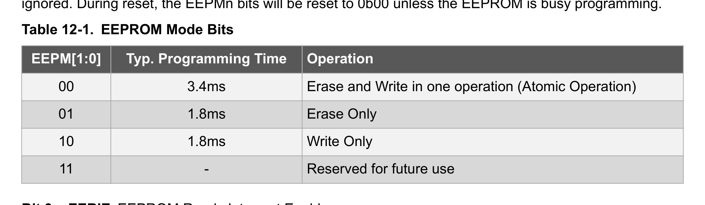
*Description*: Hardware reference table detailing register bit field settings, electrical operating limits, or memory configurations for Table 12-1: EEPROM Mode Bits.

> **Table 12-1: EEPROM Mode Bits**

EEPM[1:0]
Typ. Programming Time
Operation
00
3.4ms
Erase and Write in one operation (Atomic Operation)
01
1.8ms
Erase Only
10
1.8ms
Write Only
11
-
Reserved for future use
Bit 3 – EERIE EEPROM Ready Interrupt Enable
Writing EERIE to '1' enables the EEPROM ready interrupt if the I bit in SREG is set. Writing EERIE to
zero disables the interrupt. The EEPROM ready interrupt generates a constant interrupt when EEPE is
cleared. The interrupt will not be generated during EEPROM write or SPM.
Bit 2 – EEMPE EEPROM Master Write Enable
The EEMPE bit determines whether writing EEPE to '1' causes the EEPROM to be written.
When EEMPE is '1', setting EEPE within four clock cycles will write data to the EEPROM at the selected
address.
If EEMPE is zero, setting EEPE will have no effect. When EEMPE has been written to '1' by software,
hardware clears the bit to zero after four clock cycles. See the description of the EEPE bit for an
EEPROM write procedure.
Bit 1 – EEPE EEPROM Write Enable
The EEPROM write enable signal EEPE is the write strobe to the EEPROM. When address and data are
correctly set up, the EEPE bit must be written to '1' to write the value into the EEPROM. The EEMPE bit
must be written to '1' before EEPE is written to '1', otherwise, no EEPROM write takes place. The
following procedure should be followed when writing the EEPROM (the order of steps 3 and 4 is not
essential):
ATmega328/P
AVR Memories
© 2018 Microchip Technology Inc.
Datasheet Complete
DS40001984A-page 43
Downloaded from Arrow.com.
Downloaded from Arrow.com.
Downloaded from Arrow.com.
Downloaded from Arrow.com.
Downloaded from Arrow.com.
Downloaded from Arrow.com.
Downloaded from Arrow.com.
Downloaded from Arrow.com.
Downloaded from Arrow.com.
Downloaded from Arrow.com.
Downloaded from Arrow.com.
Downloaded from Arrow.com.
Downloaded from Arrow.com.
Downloaded from Arrow.com.
Downloaded from Arrow.com.
Downloaded from Arrow.com.
Downloaded from Arrow.com.
Downloaded from Arrow.com.
Downloaded from Arrow.com.
Downloaded from Arrow.com.
Downloaded from Arrow.com.
Downloaded from Arrow.com.
Downloaded from Arrow.com.
Downloaded from Arrow.com.
Downloaded from Arrow.com.
Downloaded from Arrow.com.
Downloaded from Arrow.com.
Downloaded from Arrow.com.
Downloaded from Arrow.com.
Downloaded from Arrow.com.
Downloaded from Arrow.com.
Downloaded from Arrow.com.
Downloaded from Arrow.com.
Downloaded from Arrow.com.
Downloaded from Arrow.com.
Downloaded from Arrow.com.
Downloaded from Arrow.com.
Downloaded from Arrow.com.
Downloaded from Arrow.com.
Downloaded from Arrow.com.
Downloaded from Arrow.com.
Downloaded from Arrow.com.
Downloaded from Arrow.com.


<!-- Page 44 -->
### [PDF Page 44]

1.
Wait until EEPE becomes zero.
2.
Wait until SPMEN in SPMCSR becomes zero.
3.
Write new EEPROM address to EEAR (optional).
4.
Write new EEPROM data to EEDR (optional).
5.
Write a '1' to the EEMPE bit while writing a zero to EEPE in EECR.
6.
Within four clock cycles after setting EEMPE, write a '1' to EEPE.
The EEPROM cannot be programmed during a CPU write to the Flash memory. The software must check
that the Flash programming is completed before initiating a new EEPROM write. Step 2 is only relevant if
the software contains a Boot Loader allowing the CPU to program the Flash. If the Flash is never being
updated by the CPU, step 2 can be omitted.
CAUTION
An interrupt between step 5 and step 6 will make the write cycle fail, since the EEPROM Master
Write Enable will time-out. If an interrupt routine accessing the EEPROM is interrupting another
EEPROM access, the EEAR or EEDR register will be modified, causing the interrupted
EEPROM access to fail. It is recommended to have the global interrupt flag cleared during all
the steps to avoid these problems.
When the write access time has elapsed, the EEPE bit is cleared by hardware. The user
software can poll this bit and wait for a zero before writing the next byte. When EEPE has been
set, the CPU is halted for two cycles before the next instruction is executed.
Bit 0 – EERE EEPROM Read Enable
The EEPROM read enable signal EERE is the read strobe to the EEPROM. When the correct address is
set up in the EEAR register, the EERE bit must be written to a '1' to trigger the EEPROM read. The
EEPROM read access takes one instruction, and the requested data is available immediately. When the
EEPROM is read, the CPU is halted for four cycles before the next instruction is executed.
The user should poll the EEPE bit before starting the read operation. If a write operation is in progress, it
is neither possible to read the EEPROM, nor to change the EEAR register.
The calibrated oscillator is used to time the EEPROM accesses. See the following table for typical
programming times for EEPROM access from the CPU.

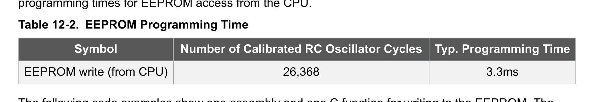
*Description*: Hardware reference table detailing register bit field settings, electrical operating limits, or memory configurations for Table 12-2: EEPROM Programming Time.

> **Table 12-2: EEPROM Programming Time**

Symbol
Number of Calibrated RC Oscillator Cycles
Typ. Programming Time
EEPROM write (from CPU)
26,368
3.3ms
The following code examples show one assembly and one C function for writing to the EEPROM. The
examples assume that interrupts are controlled (e.g. by disabling interrupts globally) so that no interrupts
will occur during execution of these functions. The examples also assume that no Flash Boot Loader is
present in the software. If such code is present, the EEPROM write function must also wait for any
ongoing SPM command to finish.
Assembly Code Example(1)
EEPROM_write:
; Wait for completion of previous write
sbic     EECR,EEPE
rjmp     EEPROM_write
ATmega328/P
AVR Memories
© 2018 Microchip Technology Inc.
Datasheet Complete
DS40001984A-page 44
Downloaded from Arrow.com.
Downloaded from Arrow.com.
Downloaded from Arrow.com.
Downloaded from Arrow.com.
Downloaded from Arrow.com.
Downloaded from Arrow.com.
Downloaded from Arrow.com.
Downloaded from Arrow.com.
Downloaded from Arrow.com.
Downloaded from Arrow.com.
Downloaded from Arrow.com.
Downloaded from Arrow.com.
Downloaded from Arrow.com.
Downloaded from Arrow.com.
Downloaded from Arrow.com.
Downloaded from Arrow.com.
Downloaded from Arrow.com.
Downloaded from Arrow.com.
Downloaded from Arrow.com.
Downloaded from Arrow.com.
Downloaded from Arrow.com.
Downloaded from Arrow.com.
Downloaded from Arrow.com.
Downloaded from Arrow.com.
Downloaded from Arrow.com.
Downloaded from Arrow.com.
Downloaded from Arrow.com.
Downloaded from Arrow.com.
Downloaded from Arrow.com.
Downloaded from Arrow.com.
Downloaded from Arrow.com.
Downloaded from Arrow.com.
Downloaded from Arrow.com.
Downloaded from Arrow.com.
Downloaded from Arrow.com.
Downloaded from Arrow.com.
Downloaded from Arrow.com.
Downloaded from Arrow.com.
Downloaded from Arrow.com.
Downloaded from Arrow.com.
Downloaded from Arrow.com.
Downloaded from Arrow.com.
Downloaded from Arrow.com.
Downloaded from Arrow.com.


<!-- Page 45 -->
### [PDF Page 45]

; Set up address (r18:r17) in address register
out     EEARH, r18
out     EEARL, r17
; Write data (r16) to Data Register
out     EEDR,r16
; Write logical one to EEMPE
sbi     EECR,EEMPE
; Start eeprom write by setting EEPE
sbi     EECR,EEPE
ret
C Code Example(1)

```c
void EEPROM_write(unsigned int uiAddress, unsigned char ucData)
```

{
/* Wait for completion of previous write */
while(EECR & (1<<EEPE))
;
/* Set up address and Data Registers */
EEAR = uiAddress;
EEDR = ucData;
/* Write logical one to EEMPE */
EECR |= (1<<EEMPE);
/* Start eeprom write by setting EEPE */
EECR |= (1<<EEPE);
}
Note:  (1) Refer to About Code Examples
The following code examples show assembly and C functions for reading the EEPROM. The examples
assume that interrupts are controlled so that no interrupts will occur during execution of these functions.
Assembly Code Example(1)
EEPROM_read:
; Wait for completion of previous write
sbic     EECR,EEPE
rjmp     EEPROM_read
; Set up address (r18:r17) in address register
out     EEARH, r18
out     EEARL, r17
; Start eeprom read by writing EERE
sbi     EECR,EERE
; Read data from Data Register
in      r16,EEDR
ret
C Code Example(1)
unsigned char EEPROM_read(unsigned int uiAddress)
{
/* Wait for completion of previous write */
while(EECR & (1<<EEPE))
;
/* Set up address register */
EEAR = uiAddress;
/* Start eeprom read by writing EERE */
EECR |= (1<<EERE);
/* Return data from Data Register */
return EEDR;
}
1.
Refer to About Code Examples.
ATmega328/P
AVR Memories
© 2018 Microchip Technology Inc.
Datasheet Complete
DS40001984A-page 45
Downloaded from Arrow.com.
Downloaded from Arrow.com.
Downloaded from Arrow.com.
Downloaded from Arrow.com.
Downloaded from Arrow.com.
Downloaded from Arrow.com.
Downloaded from Arrow.com.
Downloaded from Arrow.com.
Downloaded from Arrow.com.
Downloaded from Arrow.com.
Downloaded from Arrow.com.
Downloaded from Arrow.com.
Downloaded from Arrow.com.
Downloaded from Arrow.com.
Downloaded from Arrow.com.
Downloaded from Arrow.com.
Downloaded from Arrow.com.
Downloaded from Arrow.com.
Downloaded from Arrow.com.
Downloaded from Arrow.com.
Downloaded from Arrow.com.
Downloaded from Arrow.com.
Downloaded from Arrow.com.
Downloaded from Arrow.com.
Downloaded from Arrow.com.
Downloaded from Arrow.com.
Downloaded from Arrow.com.
Downloaded from Arrow.com.
Downloaded from Arrow.com.
Downloaded from Arrow.com.
Downloaded from Arrow.com.
Downloaded from Arrow.com.
Downloaded from Arrow.com.
Downloaded from Arrow.com.
Downloaded from Arrow.com.
Downloaded from Arrow.com.
Downloaded from Arrow.com.
Downloaded from Arrow.com.
Downloaded from Arrow.com.
Downloaded from Arrow.com.
Downloaded from Arrow.com.
Downloaded from Arrow.com.
Downloaded from Arrow.com.
Downloaded from Arrow.com.
Downloaded from Arrow.com.


<!-- Page 46 -->
### [PDF Page 46]

12.6.5
GPIOR2 – General Purpose I/O Register 2
Name:
GPIOR2
Offset:
0x4B [ID-000004d0]
Reset:
0x00
Property:  When addressing as I/O Register: address offset is 0x2B
When addressing I/O registers as data space using LD and ST instructions, the provided offset must be
used. When using the I/O specific commands IN and OUT, the offset is reduced by 0x20, resulting in an
I/O address offset within 0x00 - 0x3F.
Bit
7
6
5
4
3
2
1
0
GPIOR2[7:0]
Access
R/W
R/W
R/W
R/W
R/W
R/W
R/W
R/W
Reset
0
0
0
0
0
0
0
0
Bits 7:0 – GPIOR2[7:0] General Purpose I/O
ATmega328/P
AVR Memories
© 2018 Microchip Technology Inc.
Datasheet Complete
DS40001984A-page 46
Downloaded from Arrow.com.
Downloaded from Arrow.com.
Downloaded from Arrow.com.
Downloaded from Arrow.com.
Downloaded from Arrow.com.
Downloaded from Arrow.com.
Downloaded from Arrow.com.
Downloaded from Arrow.com.
Downloaded from Arrow.com.
Downloaded from Arrow.com.
Downloaded from Arrow.com.
Downloaded from Arrow.com.
Downloaded from Arrow.com.
Downloaded from Arrow.com.
Downloaded from Arrow.com.
Downloaded from Arrow.com.
Downloaded from Arrow.com.
Downloaded from Arrow.com.
Downloaded from Arrow.com.
Downloaded from Arrow.com.
Downloaded from Arrow.com.
Downloaded from Arrow.com.
Downloaded from Arrow.com.
Downloaded from Arrow.com.
Downloaded from Arrow.com.
Downloaded from Arrow.com.
Downloaded from Arrow.com.
Downloaded from Arrow.com.
Downloaded from Arrow.com.
Downloaded from Arrow.com.
Downloaded from Arrow.com.
Downloaded from Arrow.com.
Downloaded from Arrow.com.
Downloaded from Arrow.com.
Downloaded from Arrow.com.
Downloaded from Arrow.com.
Downloaded from Arrow.com.
Downloaded from Arrow.com.
Downloaded from Arrow.com.
Downloaded from Arrow.com.
Downloaded from Arrow.com.
Downloaded from Arrow.com.
Downloaded from Arrow.com.
Downloaded from Arrow.com.
Downloaded from Arrow.com.
Downloaded from Arrow.com.


<!-- Page 47 -->
### [PDF Page 47]

12.6.6
GPIOR1 – General Purpose I/O Register 1
Name:
GPIOR1
Offset:
0x4A [ID-000004d0]
Reset:
0x00
Property:  When addressing as I/O Register: address offset is 0x2A
When addressing I/O registers as data space using LD and ST instructions, the provided offset must be
used. When using the I/O specific commands IN and OUT, the offset is reduced by 0x20, resulting in an
I/O address offset within 0x00 - 0x3F.
Bit
7
6
5
4
3
2
1
0
GPIOR1[7:0]
Access
R/W
R/W
R/W
R/W
R/W
R/W
R/W
R/W
Reset
0
0
0
0
0
0
0
0
Bits 7:0 – GPIOR1[7:0] General Purpose I/O
ATmega328/P
AVR Memories
© 2018 Microchip Technology Inc.
Datasheet Complete
DS40001984A-page 47
Downloaded from Arrow.com.
Downloaded from Arrow.com.
Downloaded from Arrow.com.
Downloaded from Arrow.com.
Downloaded from Arrow.com.
Downloaded from Arrow.com.
Downloaded from Arrow.com.
Downloaded from Arrow.com.
Downloaded from Arrow.com.
Downloaded from Arrow.com.
Downloaded from Arrow.com.
Downloaded from Arrow.com.
Downloaded from Arrow.com.
Downloaded from Arrow.com.
Downloaded from Arrow.com.
Downloaded from Arrow.com.
Downloaded from Arrow.com.
Downloaded from Arrow.com.
Downloaded from Arrow.com.
Downloaded from Arrow.com.
Downloaded from Arrow.com.
Downloaded from Arrow.com.
Downloaded from Arrow.com.
Downloaded from Arrow.com.
Downloaded from Arrow.com.
Downloaded from Arrow.com.
Downloaded from Arrow.com.
Downloaded from Arrow.com.
Downloaded from Arrow.com.
Downloaded from Arrow.com.
Downloaded from Arrow.com.
Downloaded from Arrow.com.
Downloaded from Arrow.com.
Downloaded from Arrow.com.
Downloaded from Arrow.com.
Downloaded from Arrow.com.
Downloaded from Arrow.com.
Downloaded from Arrow.com.
Downloaded from Arrow.com.
Downloaded from Arrow.com.
Downloaded from Arrow.com.
Downloaded from Arrow.com.
Downloaded from Arrow.com.
Downloaded from Arrow.com.
Downloaded from Arrow.com.
Downloaded from Arrow.com.
Downloaded from Arrow.com.


<!-- Page 48 -->
### [PDF Page 48]

12.6.7
GPIOR0 – General Purpose I/O Register 0
Name:
GPIOR0
Offset:
0x3E [ID-000004d0]
Reset:
0x00
Property:  When addressing as I/O Register: address offset is 0x1E
When addressing I/O registers as data space using LD and ST instructions, the provided offset must be
used. When using the I/O specific commands IN and OUT, the offset is reduced by 0x20, resulting in an
I/O address offset within 0x00 - 0x3F.
Bit
7
6
5
4
3
2
1
0
GPIOR0[7:0]
Access
R/W
R/W
R/W
R/W
R/W
R/W
R/W
R/W
Reset
0
0
0
0
0
0
0
0
Bits 7:0 – GPIOR0[7:0] General Purpose I/O
ATmega328/P
AVR Memories
© 2018 Microchip Technology Inc.
Datasheet Complete
DS40001984A-page 48
Downloaded from Arrow.com.
Downloaded from Arrow.com.
Downloaded from Arrow.com.
Downloaded from Arrow.com.
Downloaded from Arrow.com.
Downloaded from Arrow.com.
Downloaded from Arrow.com.
Downloaded from Arrow.com.
Downloaded from Arrow.com.
Downloaded from Arrow.com.
Downloaded from Arrow.com.
Downloaded from Arrow.com.
Downloaded from Arrow.com.
Downloaded from Arrow.com.
Downloaded from Arrow.com.
Downloaded from Arrow.com.
Downloaded from Arrow.com.
Downloaded from Arrow.com.
Downloaded from Arrow.com.
Downloaded from Arrow.com.
Downloaded from Arrow.com.
Downloaded from Arrow.com.
Downloaded from Arrow.com.
Downloaded from Arrow.com.
Downloaded from Arrow.com.
Downloaded from Arrow.com.
Downloaded from Arrow.com.
Downloaded from Arrow.com.
Downloaded from Arrow.com.
Downloaded from Arrow.com.
Downloaded from Arrow.com.
Downloaded from Arrow.com.
Downloaded from Arrow.com.
Downloaded from Arrow.com.
Downloaded from Arrow.com.
Downloaded from Arrow.com.
Downloaded from Arrow.com.
Downloaded from Arrow.com.
Downloaded from Arrow.com.
Downloaded from Arrow.com.
Downloaded from Arrow.com.
Downloaded from Arrow.com.
Downloaded from Arrow.com.
Downloaded from Arrow.com.
Downloaded from Arrow.com.
Downloaded from Arrow.com.
Downloaded from Arrow.com.
Downloaded from Arrow.com.


